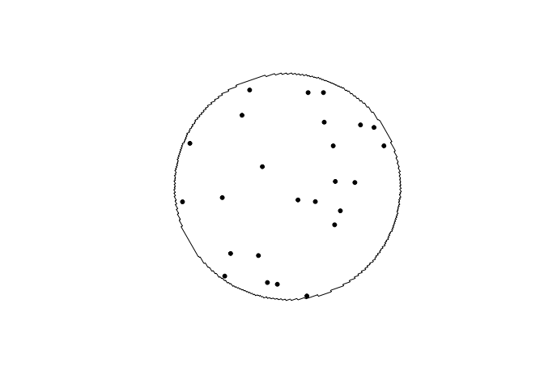
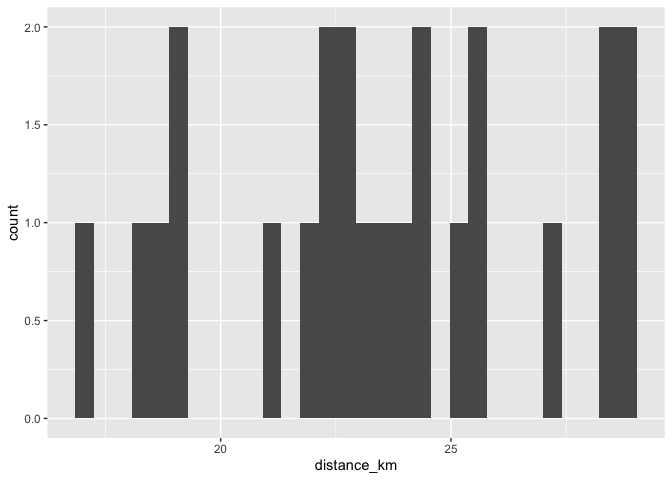
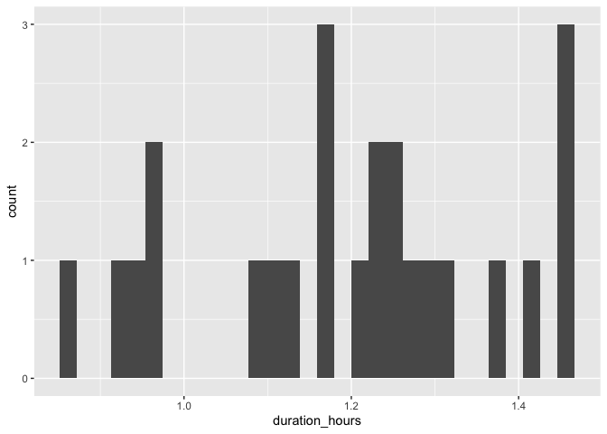
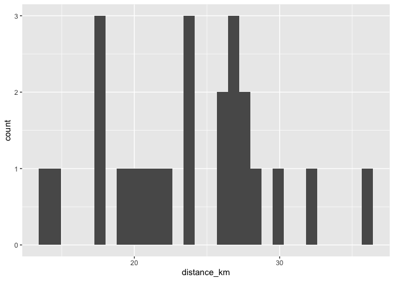
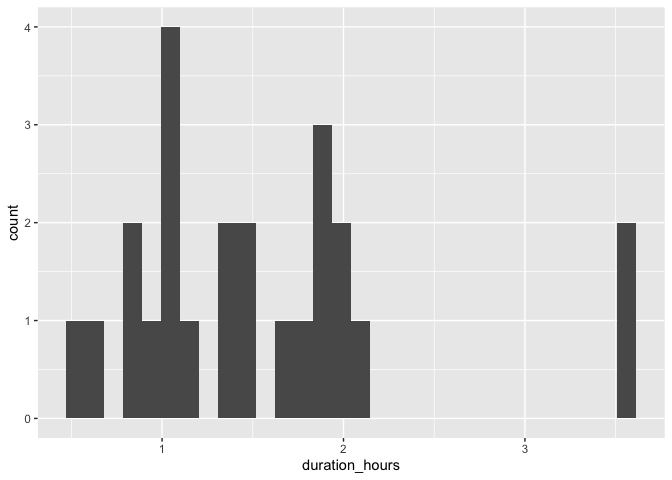
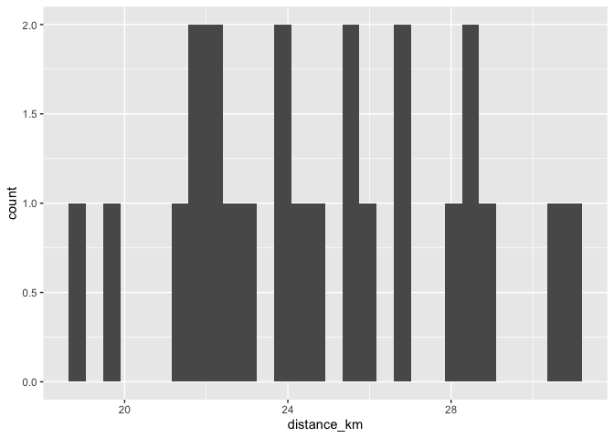
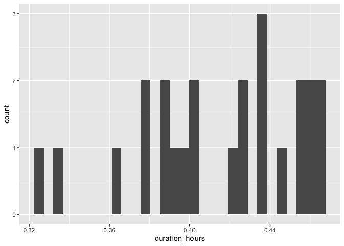
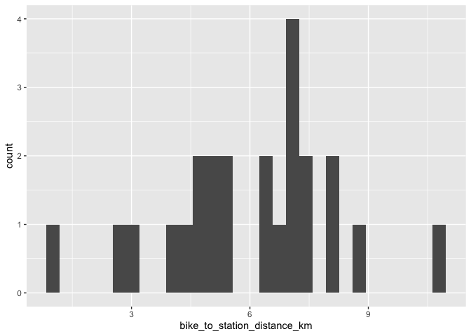
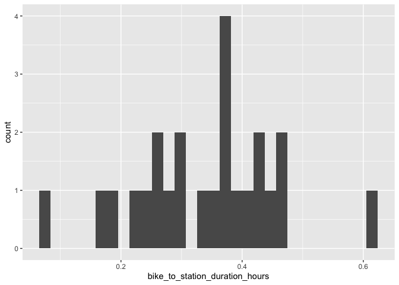

# Calgary

## McKenzie Towne

### Draw buffer and select points


```r
destination <- "Central Library, Calgary, Canada"        #### EDIT ME
```

### Set origin point


```r
origin <- "McKenzie Towne, Calgary, Canada"    #### EDIT ME
```

#### Setup departure location and arrival time


```r
arrival_time <- as.POSIXct("2024-06-11 08:30:00", tz = "America/Calgary")       #### EDIT ME
```

```
## Warning in strptime(xx, f, tz = tz): unknown timezone 'America/Calgary'
```

```
## Warning in as.POSIXct.POSIXlt(x): unknown timezone 'America/Calgary'
```

```
## Warning in strptime(x, f, tz = tz): unknown timezone 'America/Calgary'
```

```
## Warning in as.POSIXct.POSIXlt(as.POSIXlt(x, tz, ...), tz, ...): unknown
## timezone 'America/Calgary'
```

#### List of variables for geocoding


```r
var_list <- c("var1", "var2", "var3", "var4", "var5", "var6", "var7", "var8", "var9", "var10", "var11", "var12", "var13", "var14", "var15", "var16", "var17", "var18", "var19", "var20", "var21", "var22", "var23", "var24")
```

#### Seed


```r
seed <- c(101)
```


```r
stations <- geocode(location = origin, output = "more", source = "google")
```

```
## ℹ <https://maps.googleapis.com/maps/api/geocode/json?address=McKenzie+Towne,+Calgary,+Canada&key=xxx>
```

```r
stations_sf <- stations %>%
                st_as_sf(coords = c("lon", "lat"), crs = 4326)

stations_buffer = st_buffer(stations_sf, 5000)

stations_buffer <- as_sf(stations_buffer)
```

#### Interactive map view of buffers


```r
mapview(stations_buffer)
```

```{=html}
<div class="leaflet html-widget html-fill-item" id="htmlwidget-3bcd39a1194c6a66ceae" style="width:672px;height:480px;"></div>
<script type="application/json" data-for="htmlwidget-3bcd39a1194c6a66ceae">{"x":{"options":{"minZoom":1,"maxZoom":52,"crs":{"crsClass":"L.CRS.EPSG3857","code":null,"proj4def":null,"projectedBounds":null,"options":{}},"preferCanvas":false,"bounceAtZoomLimits":false,"maxBounds":[[[-90,-370]],[[90,370]]]},"calls":[{"method":"addProviderTiles","args":["CartoDB.Positron","CartoDB.Positron","CartoDB.Positron",{"errorTileUrl":"","noWrap":false,"detectRetina":false,"pane":"tilePane"}]},{"method":"addProviderTiles","args":["CartoDB.DarkMatter","CartoDB.DarkMatter","CartoDB.DarkMatter",{"errorTileUrl":"","noWrap":false,"detectRetina":false,"pane":"tilePane"}]},{"method":"addProviderTiles","args":["OpenStreetMap","OpenStreetMap","OpenStreetMap",{"errorTileUrl":"","noWrap":false,"detectRetina":false,"pane":"tilePane"}]},{"method":"addProviderTiles","args":["Esri.WorldImagery","Esri.WorldImagery","Esri.WorldImagery",{"errorTileUrl":"","noWrap":false,"detectRetina":false,"pane":"tilePane"}]},{"method":"addProviderTiles","args":["OpenTopoMap","OpenTopoMap","OpenTopoMap",{"errorTileUrl":"","noWrap":false,"detectRetina":false,"pane":"tilePane"}]},{"method":"createMapPane","args":["polygon",420]},{"method":"addPolygons","args":[[[[{"lng":[-113.9704604887266,-113.9700681317074,-113.9691442209205,-113.9682203068767,-113.9676972095456,-113.9667733074699,-113.9649254935537,-113.964402458941,-113.9634785623278,-113.9625546624621,-113.9616307593443,-113.9609378298722,-113.960807088157,-113.9605761122116,-113.9601838963119,-113.958336104279,-113.9560263459632,-113.9557649082877,-113.9553029579964,-113.9550415283884,-113.9541176329863,-113.9531937343384,-113.9522698324453,-113.9513459273076,-113.950422018926,-113.9494981073011,-113.9485741924335,-113.9476520788545,-113.9476510578914,-113.9476492533608,-113.947127549751,-113.9462036436355,-113.9443558216846,-113.9425079867778,-113.9406601389201,-113.9388122781166,-113.9393348655472,-113.9384109150513,-113.9374869613202,-113.9365630043546,-113.935639044155,-113.9347150807222,-113.9337911140566,-113.932867144159,-113.93194317103,-113.9310191946702,-113.9315416619448,-113.9287696677453,-113.9269216554669,-113.9274440635369,-113.9265200373062,-113.9255960078478,-113.9246719751624,-113.9237479392507,-113.9242703033524,-113.9224221913472,-113.9214981305066,-113.9219551730302,-113.92183966353,-113.9219049561454,-113.9210963865646,-113.9201723040209,-113.9192482182533,-113.9197378802359,-113.9196801238745,-113.9197127684794,-113.9179223131833,-113.9169982024907,-113.9175204804017,-113.9165963512289,-113.9156722188342,-113.9160639155588,-113.9158328790957,-113.9159634458462,-113.9152703323875,-113.9143461782908,-113.9146073016334,-113.9141452195621,-113.9144063433483,-113.9139442566565,-113.9130200808576,-113.9120959018388,-113.9126181240334,-113.9107697258119,-113.9112919345154,-113.910367715312,-113.9106288184201,-113.9101667037951,-113.910427807346,-113.9099656881001,-113.9090414471943,-113.9094330933326,-113.9092020297409,-113.9093325796292,-113.9086393847847,-113.9077151221765,-113.9082373056602,-113.9073130245667,-113.9075741150636,-113.9071119694932,-113.9073730604322,-113.9069109102403,-113.9059866074436,-113.9064761429624,-113.9064183730361,-113.9064510092101,-113.9046601334126,-113.9051822916621,-113.9042579486746,-113.904780108691,-113.9038557472152,-113.9041168259768,-113.9036546402147,-113.9039157194178,-113.9034535290335,-113.9025291458529,-113.9030512941282,-113.902126892458,-113.9026490424985,-113.9017246223378,-113.9021162345942,-113.9018851261875,-113.9020156647816,-113.9013223354912,-113.9015834101461,-113.9011211857952,-113.9013822608912,-113.9009200319173,-113.8999955715583,-113.900517711615,-113.8995932327632,-113.9001153745832,-113.899190877238,-113.8997130208209,-113.8987885049815,-113.899310650327,-113.8983861159926,-113.8989082631006,-113.8979837102704,-113.8985058591405,-113.8975812878138,-113.8981034384457,-113.8971788486218,-113.8977010010152,-113.8967763926932,-113.8972985468478,-113.8963739200271,-113.8971571602927,-113.896694834213,-113.8969559190033,-113.8964935882986,-113.8967546735291,-113.8962923381991,-113.8965534238698,-113.8960910839146,-113.8965806238685,-113.8965228304219,-113.8965554668919,-113.8956885627896,-113.8962107410338,-113.8952860249225,-113.8958082049271,-113.8960693013226,-113.895606930595,-113.8958680274306,-113.8954056520769,-113.8958952129654,-113.8958374150938,-113.8958700529594,-113.8950030824824,-113.8955252830564,-113.8946004961424,-113.8951226984763,-113.8955796395057,-113.8954640373315,-113.8955293154482,-113.8947200971494,-113.8952423182945,-113.8943174790747,-113.8948397019796,-113.8953619419372,-113.8944370689155,-113.895351003113,-113.8951197776639,-113.8952503429998,-113.8945566625785,-113.8950789231103,-113.8953400597719,-113.8948775936813,-113.8951387307829,-113.8946762600641,-113.8954596854813,-113.8949972024863,-113.8952583489962,-113.8947958613725,-113.8953181595369,-113.8957098943541,-113.8954786435483,-113.8956092229969,-113.8949154665041,-113.8959601175282,-113.8950350754589,-113.8955574112615,-113.8960797641239,-113.8963409469527,-113.8958784055873,-113.8961395888566,-113.8956770428612,-113.8961994145459,-113.8969830040641,-113.8965204381386,-113.8967816393508,-113.8963190687947,-113.8968414763662,-113.8973639010014,-113.8977557306762,-113.8975244345766,-113.8976550456449,-113.8969611532684,-113.8974835967311,-113.8985285348538,-113.8989204042498,-113.8986890920421,-113.8988197163511,-113.8981257756493,-113.8986482720751,-113.8991707855691,-113.8996933161318,-113.9002158637641,-113.9007384284665,-113.9011303631961,-113.9008990272263,-113.9010296733135,-113.900335661324,-113.900858244864,-113.9019034631609,-113.9039941046418,-113.9081762073073,-113.9086389969668,-113.9089004185055,-113.9093632111828,-113.909624640819,-113.9101475129034,-113.9106704020712,-113.911193308323,-113.9117162316596,-113.9122391720816,-113.9131648392006,-113.9142108019207,-113.9152568329916,-113.9161825581017,-113.916705614579,-113.9172286881463,-113.9177517788042,-113.9186775465944,-113.9192006696522,-113.9197238098023,-113.9206206739122,-113.9206370227808,-113.9206659538453,-113.9211727775131,-113.9216959671583,-113.9223903343579,-113.9225211373104,-113.9227525935941,-113.9231450117326,-113.9236682508758,-113.9243626385992,-113.9244934539264,-113.9247249170511,-113.9251173723143,-113.9256406609585,-113.9265665382123,-113.9270898592618,-113.9276131974099,-113.928539102024,-113.9290624725787,-113.9298726498388,-113.9299380740347,-113.9300538136789,-113.9310352122687,-113.9319611562898,-113.9324846087613,-113.9334105648297,-113.9339340497101,-113.9348021449126,-113.9348348641824,-113.9348927371537,-113.9353835351141,-113.9360780205385,-113.9362089054034,-113.9364404010936,-113.9368330649721,-113.9372960614803,-113.937557846571,-113.9380208460895,-113.9382826392829,-113.9387456418116,-113.9390074431077,-113.9394704486464,-113.9397322580453,-113.9401952665937,-113.9404570840955,-113.9409200956535,-113.9411819212582,-113.9416449358255,-113.9419067695332,-113.9423697871097,-113.9426316289205,-113.9433261594921,-113.9434570848709,-113.9436885956093,-113.9440813810308,-113.9450074334187,-113.9455311775882,-113.9464572420086,-113.9469810185913,-113.9479070950426,-113.9483701320412,-113.9486320382259,-113.9490950782316,-113.9493569925197,-113.9502830777266,-113.9508069344386,-113.9517330316719,-113.9521960790603,-113.9524580253093,-113.9529210757037,-113.9531830300562,-113.9541091360375,-113.9546330728784,-113.9555591908816,-113.9564563645707,-113.956472738814,-113.9565016798645,-113.9570092901607,-113.9579354169043,-113.958745775114,-113.9588112779723,-113.9589270434648,-113.9593855726346,-113.9603117081139,-113.9612378403109,-113.9617619202898,-113.9626880645,-113.9636142054261,-113.9641383331157,-113.9650644860522,-113.9659906357027,-113.9669167820664,-113.96744097276,-113.9692932862116,-113.9702194380041,-113.970743691698,-113.9716698554926,-113.9725960159961,-113.9735221732081,-113.9744483271277,-113.9749726591088,-113.9758988250253,-113.9777511469753,-113.9802980681325,-113.9804291757804,-113.9806607137866,-113.9810540460184,-113.9819802074471,-113.9829063655772,-113.9838325204081,-113.9847586719394,-113.9856848201702,-113.9866109651,-113.9875371067282,-113.9884632450541,-113.9893893800771,-113.9903155117966,-113.9912416402119,-113.9921677653224,-113.9930938871275,-113.9940200056265,-113.9949461208189,-113.995872232704,-113.9967983412811,-113.9977244465497,-113.998650548509,-113.9995766471586,-113.9991830857179,-113.9994146069991,-113.9992834210387,-113.999977980777,-114.0036822679254,-114.0046083314316,-114.0042147141109,-114.0044462266065,-114.0043150220197,-114.0050095554007,-114.0059355970092,-114.0068616353034,-114.0077876702828,-114.0087137019466,-114.0081888217773,-114.0100408446219,-114.0109668510693,-114.0105075548981,-114.0106233038011,-114.0105576908944,-114.0113679300947,-114.012293914642,-114.0132198958712,-114.0128261911376,-114.0130576830645,-114.0129264493405,-114.0145468803433,-114.0154728363524,-114.0149478701904,-114.0158738076183,-114.0167997417261,-114.0177256725133,-114.0172006776988,-114.0190524987908,-114.0185274905875,-114.0194533808931,-114.0203792678767,-114.0198706529525,-114.0198995864053,-114.019883179725,-114.0217059797735,-114.021246573235,-114.0213623044681,-114.0212966757947,-114.0221067913037,-114.023032634484,-114.0225075861291,-114.0243592320108,-114.0238341702769,-114.024759972979,-114.0256857723564,-114.0251606972461,-114.0260864780475,-114.0256926715162,-114.0259241133376,-114.0257928456815,-114.0264871670393,-114.0274129259401,-114.026887839333,-114.0278135796592,-114.0275510351536,-114.0280139002575,-114.0277513562214,-114.0282142166819,-114.0291399351084,-114.0286148370093,-114.0295405368627,-114.029146713092,-114.029378134677,-114.0292468612745,-114.0299411219235,-114.0308667998779,-114.0303416902918,-114.0312673496747,-114.0307422419687,-114.0316678827808,-114.031208414247,-114.0313241174474,-114.0312584799174,-114.0320683991973,-114.0318058450845,-114.0322686511472,-114.0320060975047,-114.0324688989252,-114.032206345753,-114.0326691425313,-114.0324065898294,-114.0328693819657,-114.0337949637425,-114.0332698483196,-114.0341954115287,-114.0336702979882,-114.0345958426303,-114.0340707309723,-114.0349962570482,-114.0344711472732,-114.0353966547836,-114.0348715468918,-114.0357970358374,-114.0352719298291,-114.0361974002108,-114.0356722960863,-114.0365977479048,-114.0360726456643,-114.0369980789204,-114.0364729785642,-114.0362104348054,-114.0366731387603,-114.0364105954725,-114.0368732947871,-114.0366107519704,-114.037073446645,-114.0368109042995,-114.037273594334,-114.036814148862,-114.0369298195746,-114.036864185339,-114.037673877206,-114.0371487996209,-114.038074143404,-114.0375490677039,-114.0384743929292,-114.0375555249848,-114.0377868491082,-114.0376555855858,-114.0383495538532,-114.0378244990381,-114.0387497719216,-114.0382247189918,-114.0379621989443,-114.0384248227176,-114.0381623031414,-114.0386249222763,-114.0380998883445,-114.0390251088927,-114.0380406878423,-114.0381563366083,-114.0380907104393,-114.0389002486813,-114.0383752356313,-114.0381127355226,-114.0385753162417,-114.0383128166043,-114.0387753926859,-114.0382503986309,-114.0391755330762,-114.0386505409063,-114.0381255658449,-114.0390506665187,-114.0385256933422,-114.0380007372729,-114.0389258041777,-114.0384008499932,-114.0378759129146,-114.0376134507898,-114.0380759639692,-114.0378135023155,-114.038276010859,-114.0372261917846,-114.0381511759392,-114.0376262768379,-114.0371013948394,-114.0367077445639,-114.0369389796204,-114.0368077640484,-114.0375014651188,-114.0369766021056,-114.0360581329814,-114.0362893557941,-114.0361581492431,-114.0368518135828,-114.0363269866533,-114.0358021768229,-114.0352773840909,-114.0350149941366,-114.0354774093631,-114.0352150198791,-114.0356774304721,-114.0346279000624,-114.0335784380361,-114.0345031958727,-114.033978475287,-114.0334537717953,-114.0329290853969,-114.0324044160911,-114.0318797638772,-114.0313551287545,-114.0308305107223,-114.03030590978,-114.0297813259267,-114.029256759162,-114.028732209485,-114.0282076768951,-114.0276831613915,-114.0271586629737,-114.0266341816408,-114.0261097173923,-114.0255852702274,-114.0250608401454,-114.0245364271457,-114.0240120312275,-114.0234876523901,-114.0230254336188,-114.0227632544079,-114.0223010386134,-114.0220388674752,-114.0199416520755,-114.0190172864583,-114.0184930405119,-114.0179688116411,-114.0174445998452,-114.0169824386152,-114.0167203429227,-114.0162581846709,-114.0159960970496,-114.0149477892469,-114.0141390435965,-114.0140735282899,-114.0139579932287,-114.0134993952151,-114.0129752992038,-114.0125131727044,-114.0122511349028,-114.0117890113828,-114.0110029349908,-114.0104789053991,-114.0095546939172,-114.0090306966044,-114.008568597235,-114.0083066087817,-114.0078445123927,-114.0070585840411,-114.0063654550288,-114.0062344735556,-114.0060034310912,-114.0056104959231,-114.0050865972973,-114.0041624520062,-114.0036385856562,-114.0029454859406,-114.0028145248716,-114.0025834921732,-114.0021906182169,-114.0016668012047,-114.0007426949805,-114.0002189102423,-113.9992948159482,-113.9987710634836,-113.9978614199333,-113.9978532366704,-113.997838797862,-113.9973232609297,-113.9966302084154,-113.9964992838855,-113.9962682669217,-113.9958755025818,-113.9951824590186,-113.9950515425569,-113.994820528577,-113.994427788441,-113.9937347538303,-113.9936038454365,-113.9933728344409,-113.9929801185087,-113.9922870928515,-113.9921561925256,-113.9919251845147,-113.9915324927858,-113.9907239731207,-113.9906585270961,-113.9905430243199,-113.9900849112736,-113.9891609005361,-113.9886373739733,-113.987713375179,-113.9871898808861,-113.9862658940366,-113.9858038993854,-113.9855421700462,-113.9850801783818,-113.98481845711,-113.9839522276692,-113.9839195137017,-113.9838617650295,-113.9833710644004,-113.9824470981774,-113.981923715909,-113.980999761637,-113.9800776087065,-113.9800765865516,-113.9800747819439,-113.9795524693175,-113.9786285237331,-113.9781665497167,-113.9779049001341,-113.9774429291067,-113.9771812875912,-113.9762573506992,-113.9757953810296,-113.9755337551914,-113.9750717885116,-113.9748101707405,-113.9738862425455,-113.9734242772252,-113.9731626751319,-113.972700712802,-113.9724391187758,-113.9715151992825,-113.9708222575239,-113.9706914687687,-113.9704604887266],"lat":[50.87351813216399,50.87308613252392,50.87328721371372,50.87348828658418,50.87291227414613,50.87311333127947,50.87351542058823,50.87293938809152,50.87314041285003,50.87334142928926,50.87354243740914,50.87369318803942,50.87354917330528,50.87359942201195,50.87316737724227,50.87356933705359,50.8740717400208,50.87378369417667,50.87388416667682,50.87359611952827,50.87379705458183,50.87399798131587,50.87419889973031,50.87439980982507,50.87460071160009,50.87480160505527,50.87500249019053,50.87520297467641,50.8752018493775,50.87520224170689,50.87462721505145,50.87482807613458,50.87522977334103,50.87563143726721,50.87603306791252,50.87643466527633,50.87701088393132,50.8772116775425,50.87741246283286,50.8776132398023,50.87781400845076,50.87801476877816,50.8782155207844,50.87841626446944,50.87861699983317,50.87881772687555,50.87939401441604,50.8799961678381,50.8803975618434,50.8809738886271,50.88117458055402,50.88137526415857,50.88157593944067,50.88177660640026,50.88235296501696,50.88275428878134,50.8829549381791,50.88345927321981,50.88348435461938,50.88355640273591,50.88373196970153,50.88393260985908,50.88413324169319,50.88467362362741,50.88468616327461,50.88472218883476,50.88511090266755,50.88531151693621,50.88588794882467,50.88608856217471,50.88628916720043,50.88672150367271,50.88677165501694,50.88691576791299,50.88706622021245,50.88726681599429,50.88755504867961,50.8876553453,50.88794358038822,50.8880438767786,50.8882444633156,50.88844504152746,50.88902153187101,50.88942267812781,50.88999918548746,50.8901997535318,50.89048801174152,50.89058829449256,50.89087655510516,50.89097683762577,50.89117739642234,50.89160979670568,50.89165993649213,50.89180407065859,50.89195448828377,50.89215503783158,50.89273158883422,50.89293213745927,50.89322041749039,50.89332069053128,50.89360897296526,50.89370924577536,50.89390978515009,50.894450326613,50.89446286048123,50.89449889667667,50.89488743135403,50.89546402599854,50.89566455519775,50.8962411594536,50.8964416877283,50.89672999438591,50.89683025725102,50.89711856631146,50.89721882894533,50.89741934796658,50.89799597884851,50.89819649694437,50.89877313743752,50.8989736546077,50.89940614197896,50.8994562713582,50.89960043455395,50.89975082095622,50.90003915053798,50.90013940738733,50.90042773937185,50.90052799598961,50.90072850297764,50.90130517970751,50.9015056857687,50.90208237210961,50.90228287724369,50.90285957319556,50.90306007740223,50.90363678296504,50.90383728624401,50.90441400141769,50.90461450376869,50.90519122855319,50.90539172997593,50.9059684643712,50.9061689648654,50.90674570887138,50.90694620843675,50.90752296205341,50.90772346068966,50.90858860635817,50.90868885810415,50.90897724294803,50.90907749446161,50.90936588170813,50.9094661329893,50.90975452263842,50.90985477368714,50.91039550923667,50.91040804090509,50.91044409003961,50.91063206159316,50.91120885585867,50.91140935817933,50.91198616205517,50.91227456482049,50.91237481840837,50.91266322357624,50.91276347693145,50.91330424157843,50.91331677353516,50.91335282460948,50.91354080048717,50.91411762578971,50.91431813272199,50.91489496763462,50.91539969999263,50.91542476450845,50.91549686938457,50.91567231815826,50.91624916488666,50.91644967736026,50.91702653369861,50.91760339224223,50.91780391118853,50.91881343190405,50.9188635635776,50.91900778183669,50.91915817511931,50.91973505508735,50.92002349589808,50.92012376103483,50.92041220424796,50.92051246915158,50.92137780765129,50.92147807602441,50.92176652514438,50.92186679328429,50.92244369687994,50.92287637602288,50.92292651255106,50.92307073967034,50.92322114751642,50.92437498053707,50.92457553184693,50.9251524590681,50.92572938849217,50.92601785403021,50.92611813581562,50.92640660375591,50.92650688530792,50.92708382654358,50.92794924252608,50.92804953125147,50.92833800619832,50.92843829469025,50.92901524993876,50.92959220738873,50.93002492692073,50.93007507547726,50.93021931605937,50.93036975998979,50.93094672924951,50.93210067437084,50.93253340606032,50.93258355993938,50.93272780457391,50.93287826447168,50.93345524994098,50.93403223760997,50.93460922747833,50.93518621954575,50.93576321381188,50.93619596095419,50.93624612386105,50.93639037364638,50.93654086062725,50.93711786669969,50.93827188543823,50.94057994928087,50.94519618235564,50.94509580263669,50.94538432001329,50.94528393635403,50.94557245242549,50.946149486213,50.94672652219307,50.94730356036535,50.94788060072953,50.94845764328527,50.94825682892603,50.94941090577995,50.95056499139521,50.95036413902324,50.95094117769897,50.95151821856381,50.95209526161744,50.95189437864451,50.952471416469,50.9530484564814,50.95285382876612,50.95287186107718,50.95286558262605,50.95342458510387,50.95400162207247,50.95385092584496,50.95399518403774,50.95394495045431,50.95437772446144,50.95495475838372,50.9548040447638,50.95494830219472,50.95489806281374,50.95533083453481,50.95590786540822,50.95570688967927,50.95628391531702,50.95686094313903,50.95665994421644,50.95723696680115,50.95706107939863,50.95713320656349,50.95710807915372,50.95818998898025,50.95798895108732,50.95856596537643,50.95836491170797,50.95894192075601,50.95875341839642,50.95878948109939,50.95877691398538,50.95931785511733,50.95916704198441,50.95931129188467,50.95926101933222,50.95969376845867,50.95959321900345,50.95988171724632,50.95978116384664,50.96006966077834,50.95996910343412,50.96025759905453,50.96015703776568,50.96044553207466,50.96034496684111,50.96063345983853,50.9605328906602,50.96082138234591,50.96072080922274,50.96100929959663,50.96090872252849,50.96119721159042,50.96104633928751,50.96119058263024,50.96114029035419,50.96157301980648,50.96137183991108,50.96194880699239,50.96174761131577,50.96232457314646,50.96212336168797,50.96202275282579,50.96231122898637,50.96221061617857,50.962499091026,50.96229785543038,50.96287479932818,50.96267354794927,50.96257291912678,50.96286138631948,50.96276075355103,50.96304921942995,50.96284794391224,50.96342486987073,50.96322357856831,50.9630285696517,50.9630465981658,50.96304030741779,50.96359919218217,50.96339787673931,50.96322171887308,50.96329383144313,50.96326866539537,50.9637734535231,50.96357211393894,50.96337076599968,50.96394765388957,50.96374629016324,50.96354491808174,50.96412179327758,50.96392040540822,50.96371900918361,50.96351760460383,50.9640944596699,50.96369161057751,50.96349017349852,50.96406700843091,50.96386555556219,50.96366409433822,50.9634626247591,50.9632611468249,50.96383795418409,50.96363646045906,50.96323344794359,50.96267925116636,50.96282344265467,50.96277305753157,50.96320563141385,50.96300408012158,50.9628025204744,50.96260095247237,50.96239937611558,50.96219779140409,50.96199619833801,50.9617945969174,50.96159298714232,50.96139136901288,50.96118974252915,50.96098810769119,50.9607864644991,50.96058481295295,50.96038315305281,50.96018148479877,50.95997980819091,50.9597781232293,50.95957642991402,50.95937472824514,50.95917301822276,50.95874055593548,50.95869012852003,50.95854597515935,50.95839469117592,50.95758776391036,50.95738601121174,50.95695358403516,50.95690314595097,50.95675900429377,50.95660768830461,50.956405926344,50.95620415603106,50.95600237736584,50.95580059034843,50.95522406042507,50.95482047622237,50.95461867159339,50.95411422922115,50.95408900386953,50.95401694092465,50.95384036062383,50.95363854673636,50.95343672449764,50.95300436358845,50.95295390811982,50.95280978855165,50.9524565889142,50.95225474906756,50.95167829261657,50.95147645186461,50.95127460276223,50.95107274530954,50.95049631335109,50.95009258828687,50.94951617337581,50.9493143057649,50.94911242980442,50.94855404434161,50.94854773580872,50.94852972341539,50.94813226986437,50.9476279365329,50.94760270110869,50.94753065374097,50.94735400293327,50.94715210846894,50.94657574470151,50.9461719456203,50.94559559890121,50.94539369428494,50.94519178132067,50.94461545165014,50.94441353778499,50.94398129753142,50.94393081915711,50.94378673980738,50.9436353029505,50.94343337983744,50.94285707681754,50.94265515280448,50.94236700582611,50.94226604255127,50.94197789797337,50.94187693447366,50.94167500121426,50.94109872484533,50.9408967906868,50.94046459040955,50.94041410696219,50.9402700409379,50.94011858886245,50.93991664545917,50.93934039574152,50.93913845144002,50.9385622113244,50.93836026612491,50.93785606430772,50.93783082138557,50.93775879280557,50.9375820895142,50.93729397878915,50.9371930044731,50.93690489614858,50.93680392160823,50.93651581568425,50.93641484091961,50.93612673739619,50.93602576240732,50.93582380617136,50.93524761191181,50.93504565477934,50.93446947012205,50.93426751209334,50.93369133703835,50.93348937811371,50.93291321266107,50.93271125284077,50.93213509699054,50.93193313627486,50.93135699002709,50.93115502841631,50.93057889177104,50.93037692926547,50.92980080222276,50.92959883882267,50.92902272138256,50.92873466347076,50.9286336842281,50.92834562871697,50.92824464925079,50.92795659614034,50.92785561645066,50.9275675657409,50.92746658582777,50.92696250164057,50.92693725715101,50.92686524537535,50.92668853111385,50.92611244463748,50.92591048510936,50.92533440823588,50.92513244781464,50.92412433150609,50.92407384335571,50.92392982774466,50.92377836156245,50.92320230605105,50.9230003512913,50.922424305383,50.92213628323755,50.92203530831554,50.92174728857088,50.92164631342583,50.92107027927734,50.92086833017988,50.91978828592703,50.9197630434488,50.91969104088459,50.91951434070359,50.91893832791882,50.91865032233545,50.91854935352195,50.91826135033946,50.91816038130313,50.91758438027933,50.91738244339975,50.91680645197955,50.91623046271724,50.91602853239245,50.91545255273387,50.91487657523357,50.91467465146356,50.91409868356712,50.91352271782937,50.91323473577012,50.91313378006564,50.9128458004074,50.91274484448035,50.91159293869043,50.91139103547459,50.91081509326351,50.91023915321225,50.9098071995914,50.90975672760313,50.90961274379814,50.90946132610391,50.90888539781717,50.90787752851442,50.90782706002555,50.90768307970204,50.9075316725062,50.90695575814547,50.90637984594602,50.90580393590817,50.90551598169996,50.90541505399093,50.9051271021839,50.90502617425254,50.90387437987271,50.90272259414354,50.90252076180146,50.90194487962346,50.90136899960886,50.90079312175796,50.90021724607109,50.89964137254861,50.8990655011908,50.89848963199802,50.89791376497057,50.89733790010879,50.896762037413,50.89618617688355,50.89561031852072,50.89503446232486,50.8944586082963,50.89388275643537,50.89330690674237,50.89273105921766,50.89215521386154,50.89157937067434,50.89100352965639,50.89042769080802,50.89052852990755,50.8902406094379,50.89034144459674,50.89005352281055,50.88775016805869,50.88795179867108,50.88737595797673,50.88680011945475,50.88622428310546,50.88632508413781,50.88603716491948,50.88613796201219,50.8858500414787,50.88469836477915,50.88487473842288,50.88480275810489,50.88482795370332,50.88432409161582,50.883748251269,50.88384902539391,50.88356110417806,50.88366187436398,50.88279810840565,50.88222226715342,50.88242378270321,50.88184793619602,50.88194868713421,50.8816607628392,50.88176150983897,50.88089773464701,50.88104884288608,50.8809048794373,50.88095524734563,50.88052335642296,50.87994750376554,50.88014895719531,50.87957309928726,50.87972417832631,50.87958021279686,50.87963057097199,50.87919867380812,50.87862281283039,50.87882422732982,50.87824836110414,50.87844975985403,50.87787388838147,50.87807212483706,50.87806312674837,50.87806627329195,50.87749939466407,50.87765042088371,50.87750645065249,50.8775567912214,50.87712487995363,50.87727589436251,50.87713192282029,50.87718225945232,50.87675034425183,50.87690134685043,50.87675737399746,50.87680770669278,50.87637578756035,50.87652677834916,50.8763828041857,50.87643313294447,50.8760012098809,50.87617735156859,50.87610536369868,50.87613052616088,50.87562661121515,50.87582789973593,50.8752519915648,50.87545326434109,50.87487735093153,50.87507860796397,50.87517923336015,50.87489127190757,50.87499189336794,50.87470393060624,50.87489258675867,50.87485659101697,50.8748691678048,50.87432923226961,50.87453044949643,50.87395451295576,50.87415571444076,50.87435651465876,50.87435538975588,50.87435578270314,50.87378095841019,50.87398213583445,50.87408272142671,50.87379474208383,50.87389532374098,50.87360734309027,50.87380849645463,50.87390907001698,50.87362108434846,50.87372165397589,50.87343366699995,50.87363479630526,50.87373535783811,50.8734473658451,50.87354792344323,50.87325993014318,50.87346103539031,50.87361185886604,50.87346785917568,50.87351813216399]}]]],null,"stations_buffer",{"crs":{"crsClass":"L.CRS.EPSG3857","code":null,"proj4def":null,"projectedBounds":null,"options":{}},"pane":"polygon","stroke":true,"color":"#333333","weight":0.5,"opacity":0.9,"fill":true,"fillColor":"#6666FF","fillOpacity":0.6,"smoothFactor":1,"noClip":false},"<div class='scrollableContainer'><table class=mapview-popup id='popup'><tr class='coord'><td><\/td><th><b>Feature ID&emsp;<\/b><\/th><td>1&emsp;<\/td><\/tr><tr><td>1<\/td><th>type&emsp;<\/th><td>neighborhood&emsp;<\/td><\/tr><tr><td>2<\/td><th>loctype&emsp;<\/th><td>approximate&emsp;<\/td><\/tr><tr><td>3<\/td><th>address&emsp;<\/th><td>mckenzie towne, calgary, ab t2z, canada&emsp;<\/td><\/tr><tr><td>4<\/td><th>north&emsp;<\/th><td>50.93193&emsp;<\/td><\/tr><tr><td>5<\/td><th>south&emsp;<\/th><td>50.90067&emsp;<\/td><\/tr><tr><td>6<\/td><th>east&emsp;<\/th><td>-113.9469&emsp;<\/td><\/tr><tr><td>7<\/td><th>west&emsp;<\/th><td>-113.9759&emsp;<\/td><\/tr><tr><td>8<\/td><th>geometry&emsp;<\/th><td>sfc_POLYGON&emsp;<\/td><\/tr><\/table><\/div>",{"maxWidth":800,"minWidth":50,"autoPan":true,"keepInView":false,"closeButton":true,"closeOnClick":true,"className":""},"1",{"interactive":false,"permanent":false,"direction":"auto","opacity":1,"offset":[0,0],"textsize":"10px","textOnly":false,"className":"","sticky":true},{"stroke":true,"weight":1,"opacity":0.9,"fillOpacity":0.84,"bringToFront":false,"sendToBack":false}]},{"method":"addScaleBar","args":[{"maxWidth":100,"metric":true,"imperial":true,"updateWhenIdle":true,"position":"bottomleft"}]},{"method":"addHomeButton","args":[-114.0391755330762,50.87291227414613,-113.8943174790747,50.96412179327758,true,"stations_buffer","Zoom to stations_buffer","<strong> stations_buffer <\/strong>","bottomright"]},{"method":"addLayersControl","args":[["CartoDB.Positron","CartoDB.DarkMatter","OpenStreetMap","Esri.WorldImagery","OpenTopoMap"],"stations_buffer",{"collapsed":true,"autoZIndex":true,"position":"topleft"}]},{"method":"addLegend","args":[{"colors":["#6666FF"],"labels":["stations_buffer"],"na_color":null,"na_label":"NA","opacity":1,"position":"topright","type":"factor","title":"","extra":null,"layerId":null,"className":"info legend","group":"stations_buffer"}]}],"limits":{"lat":[50.87291227414613,50.96412179327758],"lng":[-114.0391755330762,-113.8943174790747]},"fitBounds":[50.87291227414613,-114.0391755330762,50.96412179327758,-113.8943174790747,[]]},"evals":[],"jsHooks":{"render":[{"code":"function(el, x, data) {\n  return (\n      function(el, x, data) {\n      // get the leaflet map\n      var map = this; //HTMLWidgets.find('#' + el.id);\n      // we need a new div element because we have to handle\n      // the mouseover output separately\n      // debugger;\n      function addElement () {\n      // generate new div Element\n      var newDiv = $(document.createElement('div'));\n      // append at end of leaflet htmlwidget container\n      $(el).append(newDiv);\n      //provide ID and style\n      newDiv.addClass('lnlt');\n      newDiv.css({\n      'position': 'relative',\n      'bottomleft':  '0px',\n      'background-color': 'rgba(255, 255, 255, 0.7)',\n      'box-shadow': '0 0 2px #bbb',\n      'background-clip': 'padding-box',\n      'margin': '0',\n      'padding-left': '5px',\n      'color': '#333',\n      'font': '9px/1.5 \"Helvetica Neue\", Arial, Helvetica, sans-serif',\n      'z-index': '700',\n      });\n      return newDiv;\n      }\n\n\n      // check for already existing lnlt class to not duplicate\n      var lnlt = $(el).find('.lnlt');\n\n      if(!lnlt.length) {\n      lnlt = addElement();\n\n      // grab the special div we generated in the beginning\n      // and put the mousmove output there\n\n      map.on('mousemove', function (e) {\n      if (e.originalEvent.ctrlKey) {\n      if (document.querySelector('.lnlt') === null) lnlt = addElement();\n      lnlt.text(\n                           ' lon: ' + (e.latlng.lng).toFixed(5) +\n                           ' | lat: ' + (e.latlng.lat).toFixed(5) +\n                           ' | zoom: ' + map.getZoom() +\n                           ' | x: ' + L.CRS.EPSG3857.project(e.latlng).x.toFixed(0) +\n                           ' | y: ' + L.CRS.EPSG3857.project(e.latlng).y.toFixed(0) +\n                           ' | epsg: 3857 ' +\n                           ' | proj4: +proj=merc +a=6378137 +b=6378137 +lat_ts=0.0 +lon_0=0.0 +x_0=0.0 +y_0=0 +k=1.0 +units=m +nadgrids=@null +no_defs ');\n      } else {\n      if (document.querySelector('.lnlt') === null) lnlt = addElement();\n      lnlt.text(\n                      ' lon: ' + (e.latlng.lng).toFixed(5) +\n                      ' | lat: ' + (e.latlng.lat).toFixed(5) +\n                      ' | zoom: ' + map.getZoom() + ' ');\n      }\n      });\n\n      // remove the lnlt div when mouse leaves map\n      map.on('mouseout', function (e) {\n      var strip = document.querySelector('.lnlt');\n      if( strip !==null) strip.remove();\n      });\n\n      };\n\n      //$(el).keypress(67, function(e) {\n      map.on('preclick', function(e) {\n      if (e.originalEvent.ctrlKey) {\n      if (document.querySelector('.lnlt') === null) lnlt = addElement();\n      lnlt.text(\n                      ' lon: ' + (e.latlng.lng).toFixed(5) +\n                      ' | lat: ' + (e.latlng.lat).toFixed(5) +\n                      ' | zoom: ' + map.getZoom() + ' ');\n      var txt = document.querySelector('.lnlt').textContent;\n      console.log(txt);\n      //txt.innerText.focus();\n      //txt.select();\n      setClipboardText('\"' + txt + '\"');\n      }\n      });\n\n      }\n      ).call(this.getMap(), el, x, data);\n}","data":null},{"code":"function(el, x, data) {\n  return (function(el,x,data){\n           var map = this;\n\n           map.on('keypress', function(e) {\n               console.log(e.originalEvent.code);\n               var key = e.originalEvent.code;\n               if (key === 'KeyE') {\n                   var bb = this.getBounds();\n                   var txt = JSON.stringify(bb);\n                   console.log(txt);\n\n                   setClipboardText('\\'' + txt + '\\'');\n               }\n           })\n        }).call(this.getMap(), el, x, data);\n}","data":null}]}}</script>
```

#### Generate points within buffer


```r
set.seed(seed)
points_sample_sf <- st_sample(stations_buffer, size = c(25,25), type = "random")
```

```
## Warning in st_poly_sample(x, size = size, ..., type = type, by_polygon =
## by_polygon, : coordinate ranges not computed along great circles; install
## package lwgeom to get rid of this warning
```

```r
points_sample_sf <- st_as_sf(points_sample_sf)
points_sample <- sf_to_df(points_sample_sf)
```

#### Check to see if they worked


```r
check_buffer <- stations_buffer %>% slice(1:2)

plot(st_geometry(check_buffer))
plot(points_sample_sf, pch = 20, add= TRUE)
```

<!-- -->


```r
points_sample$destination <- destination
points_sample$origin <- origin
points_sample$lat_lon <- paste(points_sample$lat, points_sample$lon)
```

#### Checking points and general mapping


```r
lst_directions <- apply(points_sample, 1, function(x){
  res <- google_directions(
    origin = x[['lat_lon']], 
    destination = x[['destination']]    
  )
df_result <- data.frame(
    origin = x[['lat_lon']], 
    destination = x[['destination']], 
    route = res$routes$overview_polyline$points 
)
return(df_result)
})

df_directions <- do.call(rbind, lst_directions)

google_map() %>%
  add_polylines(data = df_directions, polyline = "route") 
```

```{=html}
<div class="google_map html-widget html-fill-item" id="htmlwidget-23420dd499ec724640c5" style="width:672px;height:480px;"></div>
<script type="application/json" data-for="htmlwidget-23420dd499ec724640c5">{"x":{"lat":0,"lng":0,"zoom":1,"min_zoom":null,"max_zoom":null,"mapBounds":{"west":-180,"south":-90,"east":180,"north":90},"styles":null,"search_box":false,"update_map_view":true,"zoomControl":true,"mapType":"roadmap","mapTypeControl":true,"scaleControl":false,"streetViewControl":true,"rotateControl":true,"fullscreenControl":true,"event_return_type":"list","split_view":null,"split_view_options":{"heading":34,"pitch":10},"geolocation":false,"calls":[{"functions":"add_polylines","args":[[{"id":1,"geodesic":true,"stroke_colour":"#0000FF","stroke_weight":2,"stroke_opacity":0.6,"z_index":3,"polyline":["asruHnxuvT@pAD^Tp@LVFHSl@gArCk@_Ae@uAYwASuBKkAIk@OHkAr@e@\\y@x@{@`AgA|Aq@|A}DzLu@xBk@rAqAtA]Vc@CWGQwAOoBIsBSwMKuKGmDKyBQ{AMs@e@mBuA{C{AwC{BoEu@qA}AgBCAO?i@q@y@gAu@eAqBkCoEuGuAyA{A}@eA]gAQw@A_@?mDZiEb@{BPsGXEBOV_E@eC?{E@wL@cG@{RAyFC_GBiIBwXBeg@F_XBkGDqBLmBVqB`@o@PmBn@}An@oAn@qBnAgBtAoBfBoBzBoBdCcA|AmAvByBpEgApCiAbDaBjGmAfGYfBYhBg@rEc@|FYvFm@nNmA~Vm@`JsAbNmAdJwAzI}CxQaIfe@i@tDaAvIs@pK_AzNw@vKiA|HmAbFY`Ai@|AwAxCy@xAeBhCuBpBcC`BoAp@uAh@uA^uCn@_HtA{FjA_IhBwHfBaCn@yBr@qBx@gBz@mEdCcExCmDbDaB~AsC`DuKtLkC~B_Ah@iAj@}BjAmAZiARcAJsDLyBEg@EiBWiBe@uAg@}As@wBmAiLwHgEsCkAw@qFsC}By@_EgAiDi@uCUsCCsI?yMFKIeA@aCE{BMmFo@kBc@oBo@uEoBoI{Ei@_@uBqA{BwAwH{E}FqD_M}HgAu@mAgAaBwBq@iAk@mAq@sBo@kCYeB_@}CM}BEwEDiCL}C`@oIFwB@uCMoEGkA[uCa@oCeAgFgAeEyBeGsCeGmC_F}B_DeBmB_E{DuB}AeBgA_CkAyAo@}D}AwR{HgHoCwEqB{N{FkJqDyF_CaDoA_DaAkCg@{AI{BBqAPeBd@i@Pq@ZaAj@_BpAs@r@uBvCiAvBs@bBaA~CkB~FuArDmA`CmAfBeBbBgBdAsAh@mLhEgE|AyAv@mClB_BpBQXU@C@GJcAbBa@v@eAfCmDbLcA`Dm@rAs@x@u@f@m@T_D~@o@ZuAhAe@h@q@dA[p@Sp@Qz@YvB?vALnCb@lD|@zD~BhKh@xDb@vFJnE?zEQnHg@dIUdDM|DCfAA|ALtQA~AGtAQrBUvAw@xCw@bCg@lBU`AOvAO|AKrASjE?vDDfGEdFYbDy@|EUzAeAjEoA|EOjAUjCW~CALV@dA`@LFbBpAhB~AJJl@}Bj@gClAzCt@jAPV^Vd@N~BP|ABdAFvBBCrEBd@FFrA@"]},{"id":2,"geodesic":true,"stroke_colour":"#0000FF","stroke_weight":2,"stroke_opacity":0.6,"z_index":3,"polyline":["kmxuH|blvTzAe@d@IjACtBVbA^|@f@jAdAfAxAv@|Ab@jAj@tBh@xDTlDFvB?vKHlIPtDXtCRjENnLf@jJ?nAGdB[jBg@zA_ArAmCtBw@b@w@Vs@Hi@DH~EJvG?fDBdELtB`@lDd@`C|@lDpCtJFb@?l@EV?^D\\JZRRHh@Bd@BlJ@`Q@dMINCtAInCGvAQhAYx@U^[V_@Rm@JmDF{EF}IHwIJ]@UZaD@eG?cE@uXBaP@oPBwC@_BFqBNaBV{Cr@_Bh@iBv@yAv@wBtA{AnA_CzBoBzBkBfC{@vAmAxB{@fBgAfC{BpGiAbEg@|By@jE_@bCe@fDUnCc@~F[bHk@bMa@fJy@xOm@rH_AbJ_BpLyAxIaJzh@sBbMk@dE{@dI}@zM{@xNo@`Ig@lDw@hE}@fDy@fCmBzDiBzCuBzBeAx@mC`B}@b@kA`@aFjA}KxBiQ~DoEdAgDbAuDzAyBdAeBdAgC`BuB|A{DnDwBxBoFbGuHjIwApAs@d@cCnAmB|@mBb@gCXqDFcCKyASy@SkBk@cAa@yBiAuEwC_ImFsEyCoC{AqBcAaBm@y@YaDy@aAQwASsAOqAIiAAaHAmE@gKDKIe@@k@?sCGoBMmAMoDk@yDgAuEoByDwB}DaCGE{BwA{CkBkHqEmMgI}E}CcAu@{AuAcBaCsAyCq@{Ba@eBa@kCU}BQiD?_FRgGb@cJDyBAmDKoCUkCOqAu@sEs@gDeA}DwA}D}@yBuBoEkDeG{B{CoBqByCsCu@m@mA{@mC}AeEkBkYcLgHqCyH}CcBo@yEqBmG_CsN}FwCcA{A_@_C[}@GmA@_BJwAXq@RiAd@oAr@_BpAs@r@m@t@aCzDuAjDyD|LkApCoAzBmA~A{@z@k@b@q@`@cAb@{Aj@iMtE_Bj@wAn@qBpA{@r@y@`Aw@hAWBQTqAzB_@x@y@vBgDtKmArDo@lAs@r@k@\\cA\\oCz@u@^uAnAm@x@i@~@Sh@Qn@Q~@OhACp@@vARbDd@`DtA|FfAzEd@fCd@bEX`ED`BDtDClDIlDQlEq@tJQ`GBfJF`KCpAO~BOjAo@vCaBjFi@zBSpBc@xFIxCBhEBpECrCGdB]lD_AvFcBhH_@tA_@bBQtAQhCSbCb@FvAn@pB|AjAhAJH\\qAb@gBTgA@C^bAXv@j@hAz@bAb@TtCX~DLzA@AjBA`CFPHBlA?"]},{"id":3,"geodesic":true,"stroke_colour":"#0000FF","stroke_weight":2,"stroke_opacity":0.6,"z_index":3,"polyline":["ww~uHfvnvTW|@cBnH]tBKhAGhACrH?fU@vC?r@NApCA^AtAChCSfD[l@XNLHLDRB`@BlC?n_@BvRFb\\?`OCrQBdJClG@t@J@|BC~BD|DCLAVP`ABj@Dn@Lv@Tf@Th@^\\`@TX\\r@Rj@Jl@PhB@j@Ar@KrAiAvHYzBApAObBQrB]jFY|Gs@tOi@~Lu@fL_AvKa@pDeBbMeHxa@}CtQgBzKq@hFi@|EKjAWvDs@dLaAlO_@tDe@dDUnAo@rCq@~BEPi@|AwAxCy@xAeAbB_@d@uAtA_@ZcC`BqBbAgBj@}GzAuL`CmNbDiCl@_B`@{C`AmDxAsBfAeCxAyB~AsB~A}CtC}CdDcGzGoE|E}AxAm@d@_Ah@sCxAcAb@gCh@cAJoADcBFuAAo@E_AIeAQiBe@uAg@}As@wBmAyDgCgH{E{E_DqFsC}By@_EgAiB[_AMuCUmKCwJB{DBKIeA@a@?kDMmBOoDe@kBc@oBo@uEoBoI{EmAy@_HiEyOyJiLmHeAy@mAmAcAwAq@iAk@mA]aAs@gCQ}@W}ASaBMmAKkBE}B?yADiC^sIRoED{B?{ACmBQmD[uCQsAu@}Dy@qDm@yB{@eC}@_CmAqCwBeE{AmC}B_D[c@iAiA_E{DuB}A}@k@g@[_CkAeGeC}X{KcG_CgAi@{D{AyAk@eFsBkJqDyF_CaDoA_DaAkCg@{AI{BBqAPeBd@{Al@aAj@_BpAs@r@m@t@gA`BiAvBs@bBc@rA{A~Em@jBu@tBgAbCoAtBqA~Aw@p@s@f@}Ar@qCbAgMtEeA`@yAv@qAx@{@r@_BpBQXU@C@e@r@eAnBi@nAeAxCgCjIe@`Bs@hBUb@Y^w@p@_@RgCv@uAd@m@^_Ax@e@h@q@dAS`@Un@Op@Y~AG|ABfBVlDf@lCxBhJp@bDP|@VzBZdDJhCFvC?~CG~DIjDg@dIUdDM|DCfAA|AHfMBlCA~AGtAQrBUvAw@xCw@bCg@lBU`AOvAO|AWxDGdBAbBBhDB|EC`CIrBe@|D{@bFoBfIe@`BOjAm@jHALV@dA`@^RpB~AtApArAqFDSt@pBVh@Vh@\\`@PV^Vd@N~BP|ABdAFvBBArFHLrA@"]},{"id":4,"geodesic":true,"stroke_colour":"#0000FF","stroke_weight":2,"stroke_opacity":0.6,"z_index":3,"polyline":["e~ruHdxyvTuAxBw@`Ag@`AMp@OrAI\\Q\\Y^a@R}@Tq@HYAw@Qe@[g@o@Ic@?cBJeBJq@H_BC]UgAi@qBSeAGq@OmC_@_He@_Dc@eCq@}G_@kE}@uHuA_KSqAe@iBiA{DQSc@MaAJaB\\kAN_AKWOOSIWCi@D]Hm@dBv@`@Pb@L~@FXAb@GfBq@lIiDfCeAKoAYkCOgCKcFSqRImFKyBKcAQiAQu@Uy@k@oAgBoDqDkH]i@_AiAa@_@O?i@q@y@gAoBkCgFsHcAqAq@o@m@a@wAo@cAUq@GeA?cLfAmFXwBHCBOV_E@eC?}C@aC?_F?sJB}I?}FA}CAcJ?cGB}PB}NByVB_QBqN?}IDyAF_CTmBZkAXcBh@aBn@w@\\oBhA{B~AmAdAmCnCcBrBeBbC_AbBcCxEeAhC_AfCwAzEuAjGo@jDc@vCg@rEQrB]jFi@xLmAxXu@fL_AvKaAfImBdMiI~e@wC`QsAzJu@hHWvDuBr\\_@tDe@dDUnAo@rCq@~BEPi@|AwAxCy@xAeBhCuBpBcC`BqBbAgBj@{Bh@wQrDmNbDiFnA{C`AmDxAsBfAeCxAyB~AsB~A}CtC}CdDcGzGoE|E}AxAmBnAsCxAcAb@gCh@cAJoADcBFuAAo@E_AIeAQiBe@uAg@}As@wBmAyDgCgH{E]U}DiCqFsC}By@_EgAiB[_AMuCUmKCwJB{DBKIgB@kDMmBOoDe@kBc@oBo@uEoBoI{EmAy@yBsAwIqF{LyHyFqD{A_AeAy@mAmAcAwAq@iAiAoCs@gCQ}@k@_EMmAKkBE}BDcF^sIRoED{BCiEQmDm@iFu@}Dy@qDm@yB{@eCkCqGwBeE{AmC}B_DeBmB_E{DsDiCgDgB}LaFi[_McGeCyAk@qQeH{KoE_DaAkCg@{AI{BBqAPeBd@{Al@aAj@_BpAs@r@uBvCiAvBs@bBc@rA{A~EcB`FgAbCoAtBqA~Aw@p@s@f@}Ar@sG`CeIvCeA`@yAv@mClB_BpBQXU@C@e@r@eAnBi@nAeAxCmDlLs@hBo@bAw@p@_@RgCv@uAd@m@^_Ax@e@h@eAfBUn@i@pCG|ABfBVlDf@lCxBhJbA`FVzBZdDJhCFvC?~CG~DIjDg@dIUdDM|DCfAA|AHfM@lFYhEUvAw@xCw@bCg@lBU`AOvAO|AWxDGdBAbBBhDBvBCfFIrBe@|D{@bFoBfIe@`BOjAm@jHALV@dA`@^RpB~A`A~@RPrAqFDSt@pBVh@t@jAPV^Vd@N~BP|ABdAFvBBArFHLrA@"]},{"id":5,"geodesic":true,"stroke_colour":"#0000FF","stroke_weight":2,"stroke_opacity":0.6,"z_index":3,"polyline":["gs}uH`xwvTnBqc@RuDPmCb@sE^aDZuBz@qE^_BhAkExBoGjAoCr@uAv@yAhBwCrAiBxBgC~ByBrB{AtBmAhB_A~Am@t@UxA_@nB_@zAQ`AGr@AX^vA@bA@dGP`AJ|@T\\PZRx@z@rAvBn@x@j@d@lAEp@IT[CiL?eDLo@Dk@V}@\\a@PGLA\\BLHTTP^Jf@@t@Ed@GXM\\OTSPYLc@HoCBmGH]ZkB@kC?mE@wC@_BFqBNaBVkB`@o@P_Bh@iBv@yAv@wBtA{AnA_CzBoBzBkBfC{@vAmAxB{@fBgAfCeArCu@|BiAbEg@|By@jE_@bCe@fDUnCc@~F[bHk@bMa@fJc@~IUxDm@rH_AbJ_BpLyAxIaJzh@sBbMk@dE_@bD[`D[nEa@jG{@xNa@lFMrAg@lDSrAc@tB}@fDy@fCmBzDiBzCuBzBeAx@mC`B}@b@kA`@aFjA}KxBgGrAaIjBoEdAgDbAwBv@}@b@yBdAeBdAgC`BuB|A{DnDwBxBoFbGaErEsBvBwApAs@d@}@f@eAf@mB|@mBb@gAN_AHiBDgA@yAEi@EyASy@SkBk@cAa@yBiAuEwC_ImFsEyCoC{AqBcAaBm@y@YaDy@aAQwASsAOqAIiAAaHAmE@gKDKIe@@k@?sCGoBMmAMoDk@iAWoBo@uEoByDwB}DaCGE{BwA{CkBkHqEmMgI}E}CcAu@{AuAcBaCo@qAc@gAq@{Ba@eBa@kCU}BQiDAuB@iBRgGb@cJDyBAmDKoCUkCOqAu@sEs@gDeA}DwA}D}@yBuBoEiBcDaAaB{B{CoBqByCsCu@m@mA{@mC}AeEkBkYcLgHqC{B_A}D}AcBo@yEqBmG_CsN}FwCcA{A_@aBY]A}@GmA@m@@q@HwAXq@RiAd@oAr@_BpAs@r@m@t@gA`By@xAa@bAs@fBqAfEgBtFkApCoAzBmA~A{@z@k@b@q@`@cAb@{Aj@iMtE_Bj@wAn@qBpA{@r@y@`Aw@hAWBQTqAzB_@x@y@vBgDtKa@tAk@|AUh@Yb@s@r@k@\\cA\\oCz@u@^uAnAm@x@i@~@Sh@Qn@Q~@OhACp@@vARbDRdBPz@tA|FfAzEd@fCd@bEX`ED`BDtDClDIlDQlEq@tJQ`GAnADvGF`KCpAO~BOjAo@vCaBjFi@zBSpBMpAUfDEv@C`BBhEBpECrCGdB]lD_AvFcBhH_@tA_@bBQtAQhCSbCb@F|@\\XPpB|AjAhAJH\\qAb@gBTgA@C^bAXv@j@hAb@h@VXb@TTF~BPnCHn@BzA@AjBA`CFPHBlA?"]},{"id":6,"geodesic":true,"stroke_colour":"#0000FF","stroke_weight":2,"stroke_opacity":0.6,"z_index":3,"polyline":["_pouHhgovTqB^oAJk@@MEOCmB??|M?vJERQjAOR]TaAYu@I}Co@sAUkBOsEGmAP_ATkA^sBx@i@RHl@hAfHbBnKN~@G^@DPtAXdCRhBRtCEvBSrAUv@c@z@_@b@w@h@eCjAkClAkGlC{An@MRcD|AwAr@_Ah@iA~@kCrCq@h@s@`@gFbC{DnB}F`D{IzESj@}B|@aC~@uCdAUHaCn@wBd@QDwATeFVg@BmBDmE?eI@_UBge@DqUB}FA}CAcJ?cGB}PB}NByh@FqN?}IDyAF_CTmBZkAXcBh@aBn@w@\\oBhA{B~AmAdAmCnCcBrBeBbC_AbBcCxEeAhC_AfCwAzEuAjGo@jDc@vCg@rEQrB]jFi@xLmAxXu@fL_AvKaAfImBdMiI~e@wC`QsAzJu@hHWvDuBr\\_@tDe@dDUnAo@rCq@~BEPi@|AwAxCy@xAeBhCuBpBcC`BqBbAgBj@{Bh@wQrDmNbDiFnA{C`AmDxAsBfAeCxAyB~AsB~A}CtC}CdDcGzGoE|E}AxAmBnAsCxAcAb@gCh@cAJoADcBFuAAo@E_AIeAQiBe@uAg@}As@wBmAyDgCgH{E]U}DiCqFsC}By@_EgAiB[_AMuCUmKCwJB{DBKIgB@kDMmBOoDe@kBc@oBo@uEoBoI{EmAy@yBsAwIqF{LyHyFqD{A_AeAy@mAmAcAwAq@iAiAoCs@gCQ}@k@_EMmAKkBE}BDcF^sIRoED{BCiEQmDm@iFu@}Dy@qDm@yB{@eCkCqGwBeE{AmC}B_DeBmB_E{DsDiCgDgB}LaFi[_McGeCyAk@qQeH{KoE_DaAkCg@{AI{BBqAPeBd@{Al@aAj@_BpAs@r@uBvCiAvBs@bBc@rA{A~EcB`FgAbCoAtBqA~Aw@p@s@f@}Ar@sG`CeIvCeA`@yAv@mClB_BpBQXU@C@e@r@eAnBi@nAeAxCmDlLs@hBo@bAw@p@_@RgCv@uAd@m@^_Ax@e@h@eAfBUn@i@pCG|ABfBVlDf@lCxBhJbA`FVzBZdDJhCFvC?~CG~DIjDg@dIUdDM|DCfAA|AHfM@lFYhEUvAw@xCw@bCg@lBU`AOvAO|AWxDGdBAbBBhDBvBCfFIrBe@|D{@bFoBfIe@`BOjAm@jHALV@dA`@^RpB~A`A~@RPrAqFDSt@pBVh@t@jAPV^Vd@N~BP|ABdAFvBBArFHLrA@"]},{"id":7,"geodesic":true,"stroke_colour":"#0000FF","stroke_weight":2,"stroke_opacity":0.6,"z_index":3,"polyline":["{n_vHtqwvT@t`@Dz@ER^lCJh@PIhBy@j@SjAYfAItAC^Bv@JnA`@nBbArAhAfAlAlBfCl@d@r@ZVX~EjCZVTVXj@Pn@Fj@Bl@?f@MxA}@`G?@Ex@y@|EmAxHIl@e@zCAJBh@QbA[bBi@dDa@pCq@hFi@|EKjAWvDs@dLaAlO_@tDe@dDUnAo@rCq@~BEPi@|AwAxCy@xAeAbB_@d@uAtA_@ZcC`BqBbAgBj@}GzAuL`CmNbDiCl@_B`@{C`AmDxAsBfAeCxAyB~AsB~A}CtC}CdDcGzGoE|E}AxAm@d@_Ah@sCxAcAb@gCh@cAJoADcBFuAAo@E_AIeAQiBe@uAg@}As@wBmAyDgCgH{E{E_DqFsC}By@_EgAiB[_AMuCUmKCwJB{DBKIeA@a@?kDMmBOoDe@kBc@oBo@uEoBoI{EmAy@_HiEyOyJiLmHeAy@mAmAcAwAq@iAk@mA]aAs@gCQ}@W}ASaBMmAKkBE}B?yADiC^sIRoED{B?{ACmBQmD[uCQsAu@}Dy@qDm@yB{@eC}@_CmAqCwBeE{AmC}B_D[c@iAiA_E{DuB}A}@k@g@[_CkAeGeC}X{KcG_CgAi@{D{AyAk@eFsBkJqDyF_CaDoA_DaAkCg@{AI{BBqAPeBd@{Al@aAj@_BpAs@r@m@t@gA`BiAvBs@bBc@rA{A~Em@jBu@tBgAbCoAtBqA~Aw@p@s@f@}Ar@qCbAgMtEeA`@yAv@qAx@{@r@_BpBQXU@C@e@r@eAnBi@nAeAxCgCjIe@`Bs@hBUb@Y^w@p@_@RgCv@uAd@m@^_Ax@e@h@q@dAS`@Un@Op@Y~AG|ABfBVlDf@lCxBhJp@bDP|@VzBZdDJhCFvC?~CG~DIjDg@dIUdDM|DCfAA|AHfMBlCA~AGtAQrBUvAw@xCw@bCg@lBU`AOvAO|AWxDGdBAbBBhDB|EC`CIrBe@|D{@bFoBfIe@`BOjAm@jHALV@dA`@^RpB~AtApArAqFDSt@pBVh@Vh@\\`@PV^Vd@N~BP|ABdAFvBBArFHLrA@"]},{"id":8,"geodesic":true,"stroke_colour":"#0000FF","stroke_weight":2,"stroke_opacity":0.6,"z_index":3,"polyline":["izvuHjtnvTz@`CFHF?|@{@v@{@DSC[Y{@UiAY}BMQSAcA[a@Yb@oBf@oBLFr@Lv@AZIJd@^jB~AdIn@xCGDgBpAi@f@wA|AcC`De@fAa@n@{@|AiEtJy@lB}AnDgA`B_D`E}AtAaChAaATuCR[?@|@@hBLtB`@lDd@`C|@lDpCtJFb@?l@EV?^D\\JZRRHh@Bd@D|V@vRINCtAInCGvAQhAYx@U^[V_@Rm@JwAB{FHkB@uOPiBB]@UZaD@cD?gD?_H@oWBgWBeJB_BFqBNaBVkB`@}Ad@mBr@gCpAwBtA{AnA_CzBoBzBkBfC{@vAiC`FgAfCeArCu@|BiAbEg@|By@jE_@bCe@fDUnCc@~Fg@|KaApTy@xOm@rH_AbJ_@vCoBtMuAdIkJ|i@}@xFk@dE{@dI[nE}AdWo@`Ig@lDw@hE}@fDy@fCmBzDiBzCuBzBeAx@mC`B}@b@kA`@wBh@iB`@}KxBiQ~DoEdAgDbAuDzAyBdAeBdAgC`BuB|A{DnDwBxBoFbGuHjIwApAs@d@cCnAmB|@mBb@gCXqDFyAEi@EyASy@SkBk@cAa@yBiAuEwC_ImFa@WqDaCoC{AqBcAaBm@y@YaDy@aAQwASsAOqAIiAAaHAmE@gKDKIe@@k@?sCGoBMmAMoDk@yDgAuEoByDwB}DaCGE{BwAgIeF_GsDqMiI}CuB{AuAcBaCsAyCq@{Ba@eBa@kCU}BQiD?_FRgGb@cJDyBAmDKoCUkCOqAu@sEs@gDeA}DwA}D}@yBuBoEkDeG{B{CoBqByCsCu@m@mA{@mC}AeEkBgEcBk\\qMyH}CcBo@yEqBmG_CsN}FwCcA{A_@_C[}@GmA@_BJwAXq@RiAd@oAr@_BpAs@r@m@t@aCzDuAjDqAfEgBtFkApCoAzBmA~A{@z@k@b@q@`@cAb@{Aj@}ChAkHjC_Bj@wAn@qBpA{@r@y@`Aw@hAWBQTqAzB_@x@y@vBiEjNk@|Ao@lAs@r@k@\\sExAu@^uAnAm@x@i@~@Sh@c@nBOhACp@@vARbDd@`DtA|FfAzEd@fCd@bEX`ED`BDtDClDIlDQlEq@tJQ`GBfJF`KCpAO~BOjAo@vCaBjFi@zBSpBc@xFIxCDtGAxGGdB]lD_AvFcBhH_@tA_@bBQtAQhCSbCb@FvAn@pB|A~@|@JJJH\\qAb@gBTgA@C^bAXv@j@hAz@bAb@TtCX~DLzA@AjBA`CFPHBlA?"]},{"id":9,"geodesic":true,"stroke_colour":"#0000FF","stroke_weight":2,"stroke_opacity":0.6,"z_index":3,"polyline":["c~vuHlxpvTh@d@EPYlAs@pEe@xEWjEGpCAvCgA?w@Ak@?g@Ea@K]OcDwAWMQQO_@Gi@GOMOSIM?SBOLKRIVE\\B`@FXNVJHF^@NDj@BxV?vE@tG?`CINIhDEzAKrAMx@]x@_@b@QLe@Pq@HwABwFFsBBqPPwA@A@SZ[?gB?c@@eD?kE@sJ?aUDuV@sF@iBByAF_CTmBZkAXcBh@aBn@w@\\oBhA{B~AmAdAaA|@kApAcBrBeBbC_AbBcAjB_AlBeAhC_AfCwAzEg@tBm@tCo@jDc@vCg@rEQrB]jFi@xLmAxXu@fL_AvKaAfIeAlHg@vCqCfPoIxf@a@pCq@hFi@|EKjAWvDuBr\\_@tDe@dDUnAo@rCq@~BEPi@|AwAxCy@xAeAbB_@d@uAtA_@ZcC`BqBbAgBj@{Bh@wQrDmNbDiCl@_B`@{C`AmDxAsBfAeCxAyB~AsB~A}CtC}CdDcGzGoE|E}AxAm@d@_Ah@sCxAcAb@gCh@cAJoADcBFuAAo@E_AIeAQiBe@uAg@}As@wBmAyDgCgH{E]U}DiCqFsC}By@_EgAiB[_AMuCUmKCwJB{DBKIeA@a@?kDMmBOoDe@kBc@oBo@uEoBoI{EmAy@yBsAwIqFcF_DqMkI{A_AeAy@mAmAcAwAq@iAk@mA]aAs@gCQ}@W}ASaBMmAKkBE}B?yADiC^sIRoED{B?{ACmBQmD[uCQsAu@}Dy@qDm@yB{@eC}@_CmAqCwBeE{AmC}B_D[c@iAiA_E{DuB}A}@k@g@[_CkAeGeCwD{Ai[_MgAi@{D{AyAk@eFsBkJqDyF_CaDoA_DaAkCg@{AI{BBqAPeBd@{Al@aAj@_BpAs@r@m@t@gA`BiAvBs@bBc@rA{A~Em@jBu@tBgAbCoAtBqA~Aw@p@s@f@}Ar@sG`CeIvCeA`@yAv@qAx@{@r@_BpBQXU@C@e@r@eAnBi@nAeAxCmDlLs@hBUb@Y^w@p@_@RgCv@uAd@m@^_Ax@e@h@q@dAS`@Un@Op@Y~AG|ABfBVlDf@lCxBhJp@bDP|@VzBZdDJhCFvC?~CG~DIjDg@dIUdDM|DCfAA|AHfMBlCA~AGtAQrBUvAw@xCw@bCg@lBU`AOvAO|AWxDGdBAbBBhDBvBCfFIrBe@|D{@bFoBfIe@`BOjAm@jHALV@dA`@^RpB~A`A~@RPrAqFDSt@pBVh@Vh@\\`@PV^Vd@N~BP|ABdAFvBBArFHLrA@"]},{"id":10,"geodesic":true,"stroke_colour":"#0000FF","stroke_weight":2,"stroke_opacity":0.6,"z_index":3,"polyline":["gt|uHvlgvTi^?cA@?rJA`BMh@GjFIxEKnAOlAWpAa@rAu@bBa@l@o@t@y@n@y@`@o@NaAJ_HPeO\\CBSXa@@}@@s@?oCBaB@uDDuSPe[TuC?kECeFMsLg@{Le@sTq@mHAkBBwFJqDPqHh@}Hz@eKbA_DRmBLuAFw@@uDJgDH_HHaE?wR?yJ@qKAkK@uJAiO?{K?cLBWa@M?{HWs@Iy@Sw@YkAu@g@a@q@s@cDcEy@gAOIMO_@e@_@a@][u@g@_@MWCu@@}@XoBfAQ^ObARrJN`Fj@xQdBnk@FtBDl@FbDFpDHfGF`OC~MQdRMtNChK?fGMbFEbFH|H?pWAfKCtF@lJArJEdWF~BA|GA|N?lTAhEAnEG~BA`AIl@QtLIvHBZQ|NWvVClLBnV@rECnBBpF@xHRlKWvAE\\[Tc@Vg@Va@Ls@Hm@Ai@G}B_@uCg@_J_BuBi@{Bq@wCaAa@Lc@U}D}AeAa@wF_CmG_CwF{B{FaCwCcA{A_@aBY]A}@GmA@m@@q@HwAXq@RiAd@oAr@_BpAs@r@m@t@gA`By@xAa@bAs@fBc@vAsAhEaAzCi@pAgAzBiAhBm@t@{@z@k@b@q@`@wAl@aDjAoMvEwAn@qBpA{@r@y@`Aw@hA[Dw@pAs@rAy@nByArEqBvGc@tAo@|AYb@YZk@d@m@XuCz@kAf@YPoAhAm@x@m@hAUn@Sx@Id@OhACp@?j@BxAPtBRdBb@vBjC|Kn@nDZzCRhCJxCDtDApAKhGQlEq@tJQ`GAnALpPCxDO~BOjAo@vCy@fCg@bBi@zBa@bE[~EC`EBdCBpBAdDAdAGpAGz@UpBc@hC[lBi@~ByA~F_@bBQtAe@lGb@F|@\\h@ZfCvBb@`@@BJH\\qAb@gBTgA@C^bAXv@j@hAb@h@VXb@TTF~BPnCHn@BzA@AjBA`C@DDJHBlA?"]},{"id":11,"geodesic":true,"stroke_colour":"#0000FF","stroke_weight":2,"stroke_opacity":0.6,"z_index":3,"polyline":["o~tuHnglvTEw@GqBv@KZGB?f@WTQLKj@u@Zn@\\r@NThC|Ch@h@d@ZjAd@rA^BJHRFFD\\?h@CxUB|LMlAK`@Ob@eBz@cAh@a@RcHlD{Bt@wH~BoErAcBd@OC{APYESQOUOiCC{AFyARiATi@X[XOPEf@Bb@T^h@^~@RdA\\dCpAxL\\xCV^VfCp@vGbAnKVrCxB~WXrCGt@dB~UEZl@nLl@hJl@jHFxA@nBGtCM|AYrBi@~BWv@c@dAw@xAy@dAc@b@WTsAx@yAh@gARgCZiBTKP}CNwBHCBOV_E@eC?}C@aC?uL@eH@}I?sGC_N@}LDcT@sh@FmYBiBByAF_CTmBZ_Cl@}Aj@kBv@oBhA{B~AmAdAmCnCcBrBeBbCcCnE_AlBeAhC_AfCwAzEuAjGo@jDc@vCg@rEQrB]jFY|Gs@tOi@~Lu@fL_AvKa@pDeBbMeHxa@}CtQgBzKq@hFu@hHkA|QaAlO_@tDe@dDUnAo@rCq@~BEPi@|AwAxCy@xAeBhCuBpBcC`BqBbAgBj@}GzAuL`CmNbDiFnA{C`AmDxAsBfAeCxAyB~AsB~A}CtC}CdDcGzGoE|E}AxAmBnAsCxAcAb@gCh@cAJoADcBFuAAo@E_AIeAQiBe@uAg@}As@wBmAyDgCgH{E{E_DqFsC}By@_EgAiB[_AMuCUmKCwJB{DBKIgB@kDMmBOoDe@kBc@oBo@uEoBoI{EmAy@_HiEyOyJiLmHeAy@mAmAcAwAq@iAiAoCs@gCQ}@k@_EMmAKkBE}BDcFr@cPD{BCiEQmDm@iFu@}Dy@qDm@yB{@eCkCqGwBeE{AmC}B_DeBmB_E{DsDiCgDgBeGeC}X{KcG_CcGeCkTqI{KoE_DaAkCg@{AI{BBqAPeBd@{Al@aAj@_BpAs@r@uBvCiAvBs@bBc@rA{A~EcB`FgAbCoAtBqA~Aw@p@s@f@}Ar@qCbAgMtEeA`@yAv@mClB_BpBQXU@C@e@r@eAnBi@nAeAxCgCjIe@`Bs@hBo@bAw@p@_@RgCv@uAd@m@^_Ax@e@h@eAfBe@`BY~AG|ABfBVlDf@lCxBhJbA`FVzBZdDJhCFvC?~CG~DIjDg@dIUdDM|DCfAA|AHfM@lFYhEUvAw@xCw@bCg@lBU`AOvAO|AWxDGdBAbBBhDB|EC`CIrBe@|D{@bFoBfIe@`BOjAm@jHALV@dA`@^RpB~AtApArAqFDSt@pBVh@t@jAPV^Vd@N~BP|ABdAFvBBArFHLrA@"]},{"id":12,"geodesic":true,"stroke_colour":"#0000FF","stroke_weight":2,"stroke_opacity":0.6,"z_index":3,"polyline":["icvuHlpkvTp@E|@_@J?FHHr@?`@A^CFoBXi@HOEgB_BuBoBADg@dBeA{@KSmAnEa@jCKtB@jALdB_A`@qGnCgGhCSJDZ`@~DJhB@nK?pMCzN?|GDvCXxE`@dC^tAhAfC@NLd@`@`AB^G|@m@nA_EjJUh@}AlD]h@yCbESTkAnAm@d@aAd@mAh@kC\\yAD@`CLlCXtCf@nCnBrHlBxGBf@I~@Jz@NVJHF^@NBRBtH@`M@fO?`CINIhDGpBShBUl@KX_@b@a@Ta@LkAF{DD_EDqNN{DFSZ[?gB?{A@yF?eF@}YBkUB}J@aBDqBLmBVqB`@cBd@iBr@}BfAqBnAgBtAoBfBoBzBoBdCcA|AeCtEaArBgApCiAbDaBjGmAfGYfBYhBg@rEc@|Fg@tKy@xQs@vNm@`JsAbNUfBgB~L{A~IoJhj@eBfLaAvI]pEuAzTw@vK]rCk@hDmAbFY`Ai@|AwAxCy@xAeBhCuBpBcC`BoAp@uAh@uA^uLdC{FjA_IhBwHfBaCn@yBr@qBx@gBz@mEdCcExCmDbDaB~AsC`DuKtLkC~B_Ah@iAj@}BjAmAZiARcAJsDLyBEg@EiBWiBe@uAg@}As@wBmAiLwHmA{@yBwAkAw@qFsC}By@_EgAiDi@uCUsCCsI?yMFKIeA@aCE{BMmFo@kBc@oBo@uEoBoI{Ei@_@uBqA}GiEcHmEcM}HsDcCmAgAaBwBq@iAk@mAq@sBo@kCYeB_@}CM}BEwEDiCL}C`@oIFwB@uCMoEGkA[uCa@oCeAgFgAeEyBeGsCeGmC_F}B_DeBmB_E{DuB}AeBgA_CkAyAo@}D}A_\\kMwEqBmFsBmGgCkJqDyF_CaDoA_DaAkCg@{AI{BBqAPeBd@i@Pq@ZaAj@_BpAs@r@uBvCiAvBs@bBaA~CkB~FuArDmA`CmAfBeBbBgBdA_GxBiMvEyAv@mClB_BpBQXU@C@GJcAbBa@v@eAfCaEtMo@nBm@rAs@x@u@f@mEtAo@ZuAhAe@h@q@dA[p@e@lBYvB?vALnCb@lD|DdQh@xDb@vFJnE?zEQnHg@dIUdDM|DCfAA|ALtQA~AGtAQrBUvAw@xCw@bCg@lBU`AOvAO|AKrASjE?vDBxB?`GCpBYbDy@|EUzAeAjEoA|EOjAUjCW~CALV@dA`@LFbBpAjAdA\\XJJl@}Bj@gClAzCt@jAPV^Vd@N~BP|ABdAFvBBCrEBd@FFrA@"]},{"id":13,"geodesic":true,"stroke_colour":"#0000FF","stroke_weight":2,"stroke_opacity":0.6,"z_index":3,"polyline":["slpuHxksvTEaCEy@C[M?U@S?g@Fi@TM?KYMm@IEQDw@h@gBrA]h@{@`BRZ^z@L^jA`F^pBh@It@D|@N|Ab@zBt@TDDc@HiAFsALwEAmCAqAKgDUcDo@yFsA}IyBqOk@eD@m@GiA@_AFg@Pm@PWVUl@EVHTPR\\L`@HjAI`AUn@g@t@qAdAkClAoIxCkAb@SEiAf@uGpCi@TMPm@ZeCjAyAt@wA`AcChCy@v@o@d@oDbB_FdCyDtBqK|FcAh@Uj@{H|CyFbB{Bd@}AVgGZuD@yFDuGA{QDaUBcJ@sVBwSC}\\Fge@Dmo@F{DNuBTyB`@oBj@}Ah@sB`AmBfA{BbBgAbAuCzCsD|EeCrEkAdCeAlC_AlCaB|FgAlFi@vCu@nFa@|Ec@lHU`Fw@fQs@hOo@hJ}@vJ_@bDeB~L{Hhd@wC|PcB~Ks@xFi@zFgApQeAvOa@jDg@hDiA~Ea@vAo@lBmBzDiBzCuBzBeAx@mC`BiBv@sA`@iJpBiNrCuKdCeEfAuE~AeCjAwCbByEbDsBdBcC~BiDpDgJdKsBvBwApAqBlAuCtAg@TcB\\gANiDN{CCiCYeD_AcAa@yBiAyKgHmCiBi@_@wCmBoC{AqBcAaBm@y@YcFkAwASsAO{CK}JAuIBcDBKIe@@k@?}@AgCKkCUoDk@yDgAuEoByDwB}DaCsAy@{GgEoOuJsK}GwAkAoAwA_AuAo@qAu@oB}@kDQ_Ag@eEIaAKoFNeHl@oNBuBI{D[qEg@}D}@qEcAaEmBwFuCuGgCwEaAaB{B{CoBqBoEaEgCaBsAw@{CuAaE_BaZmLyN}FwF_CeO{F{FaCwCcA{A_@_C[kCE_BJiCl@iAd@oAr@sCdCm@t@aCzDa@bAs@fBc@vAsAhEkBlFgAzBiAhBiBpB}AdAyFxBoMvEwAn@qBpA{@r@y@`Aw@hA[Dw@pAs@rAy@nBkEjNc@tAo@|As@~@k@d@m@XuCz@kAf@YPoAhAm@x@m@hAi@hBYnBC|ABxAPtBRdBb@vBjC|Kn@nDn@dHJxCBfGKhGQlEq@tJSpILpPCxD_@jEo@vCy@fCqA~Ea@bE[~EC`EBdC@vGAdAOlCy@zF[lBi@~ByA~F_@bBQtAe@lGb@F|@\\h@ZfCvBb@`@@BJH\\qAb@gBTgA`@~@Xv@j@hAb@h@VXb@TtCXnCHn@BzA@AjBA`C@DDJHBlA?"]},{"id":14,"geodesic":true,"stroke_colour":"#0000FF","stroke_weight":2,"stroke_opacity":0.6,"z_index":3,"polyline":["mb_vHprovTX`@p@AvA@?fU@vC?r@NApCA^AtAChCSfD[l@XNLHLDRB`@BlC?n_@BvRFb\\Cta@BdJClG@t@J@|BC~BD|DCLAVP`ABj@Dn@Lv@Tf@Th@^\\`@TX\\r@Rj@Jl@PhB?~AKrAi@jDy@fGApAObBQrB]jFi@xLmAxXu@fL_AvKaAfIeAlHg@vCqCfPoIxf@a@pCq@hFi@|EKjAWvDuBr\\_@tDe@dDUnAo@rCq@~BEPi@|AwAxCy@xAeAbB_@d@uAtA_@ZcC`BqBbAgBj@{Bh@wQrDmNbDiCl@_B`@{C`AmDxAsBfAeCxAyB~AsB~A}CtC}CdDcGzGoE|E}AxAm@d@_Ah@sCxAcAb@gCh@cAJoADcBFuAAo@E_AIeAQiBe@uAg@}As@wBmAyDgCgH{E]U}DiCqFsC}By@_EgAiB[_AMuCUmKCwJB{DBKIeA@a@?kDMmBOoDe@kBc@oBo@uEoBoI{EmAy@yBsAwIqFcF_DqMkI{A_AeAy@mAmAcAwAq@iAk@mA]aAs@gCQ}@W}ASaBMmAKkBE}B?yADiC^sIRoED{B?{ACmBQmD[uCQsAu@}Dy@qDm@yB{@eC}@_CmAqCwBeE{AmC}B_D[c@iAiA_E{DuB}A}@k@g@[_CkAeGeCwD{Ai[_MgAi@{D{AyAk@eFsBkJqDyF_CaDoA_DaAkCg@{AI{BBqAPeBd@{Al@aAj@_BpAs@r@m@t@gA`BiAvBs@bBc@rA{A~Em@jBu@tBgAbCoAtBqA~Aw@p@s@f@}Ar@sG`CeIvCeA`@yAv@qAx@{@r@_BpBQXU@C@e@r@eAnBi@nAeAxCmDlLs@hBUb@Y^w@p@_@RgCv@uAd@m@^_Ax@e@h@q@dAS`@Un@Op@Y~AG|ABfBVlDf@lCxBhJp@bDP|@VzBZdDJhCFvC?~CG~DIjDg@dIUdDM|DCfAA|AHfMBlCA~AGtAQrBUvAw@xCw@bCg@lBU`AOvAO|AWxDGdBAbBBhDBvBCfFIrBe@|D{@bFoBfIe@`BOjAm@jHALV@dA`@^RpB~A`A~@RPrAqFDSt@pBVh@Vh@\\`@PV^Vd@N~BP|ABdAFvBBArFHLrA@"]},{"id":15,"geodesic":true,"stroke_colour":"#0000FF","stroke_weight":2,"stroke_opacity":0.6,"z_index":3,"polyline":["oz|uHt_ivTkj@b@kB@gA@w@CoDBsBB_EB_GF}KHgSPs]V{GEwFO}Lg@aEQ{HYkJ[cDI{CCoF?wA@mGNeDPoHh@uHz@cD\\_Fb@kDTeCLcAFw@?aELkEHoED}F?mT?yK@aHAwK@{J?cNAgEAgE@cE?qDBi@?U_@AAcACkGU}@Ky@Uw@]iAw@i@e@s@y@sDwEW]OIQUkAqAm@e@]Q_@Ka@Aq@D_A\\{@f@c@VINMd@Il@FfDHlDB|@TlHj@jQ~Afi@BnAF|@P|JHjGDlPEjMYtZIzP@vFKnCArAEbFFnH@pCAxXCpM@pOCxJ?bFCvJF~BArIC`X@bFCxG?nFI`EIl@I~DQlPBZEfDc@la@CnNB~W@xCC`ABdJDtGNrHMd@OnAwA|@a@N]H{@DuAMcHkAyE{@gDs@gF}A{Ag@a@LgAi@mFsBmGgCkJqDyF_CaDoA_DaAkCg@{AI{BBqAPeBd@i@Pq@ZaAj@_BpAs@r@m@t@gA`BiAvBs@bBaA~CkB~Fu@tB_@|@mA`CmAfBm@p@w@p@s@f@s@\\sAh@kDnAiMvEyAv@qAx@{@r@_BpBQXU@C@GJcAbBa@v@eAfCaEtMo@nBm@rAY^YXu@f@m@T_D~@o@ZuAhAe@h@q@dA[p@Sp@Qz@QbAGr@?vALnCLvATtA|@zDlAdFp@bDh@xDZdDFpAJnE?zEQnHg@dIUdDM|DCfAA|ALtQA~AGtAQrBUvAw@xCw@bCg@lBU`AOvAO|AKrAKdBGdB?vDBxB@lCArBCpBYbDStAe@fCUzAeAjEi@zBe@`BOjAUjCW~CALV@dA`@LFbBpAjAdA\\XJJl@}Bj@gCt@pBVh@Vh@\\`@PV^Vd@N~BP|ABdAFvBBCrE@^@DFFrA@"]},{"id":16,"geodesic":true,"stroke_colour":"#0000FF","stroke_weight":2,"stroke_opacity":0.6,"z_index":3,"polyline":["gypuH|szvT|AiA\\S~Bu@~CwAnAmAx@o@`@UJ@ZCbAKb@Aj@A?v@?zA?RAtC@xGApG@lKS~CmA|H[~DEpCDvDLnBTjCp@`E\\`CDv@?hEMx@Qf@OR_BA}EEwH?{LAiHNiEVoCVcDd@aCb@sDv@a@FMK{AIcBWmA]]YWa@Wo@Y}AQgCe@oDu@}CcCwJc@{B_@uGm@aMKqAIi@YmEyAuPeB_Qs@oHmAkKgAwJ[aDcB{Pg@mEKiABo@MoB_BsSk@yHa@oHc@mJ_Cyb@SiE_@iF_@yBe@yAk@mAy@mA_G{HyE}GqAiB{AwAwAs@cAYu@KcAAyE^uEd@mJd@SZwLBiI?wVBiTCgk@Hih@FsZDqEVaBVkB`@}Ad@mBr@gCpAwBtA{AnA_CzBoBzBkBfC{@vAiC`FmCzGu@|BiAbEg@|By@jE_@bC{@vHc@~Fg@|KaApTy@xOm@rH_AbJ_@vCoBtM{Hfd@eCzNiB~L{@dI[nE}AdWo@`Ig@lDw@hE}@fDy@fCmBzDiBzCuBzBeAx@mC`B}@b@kA`@wBh@gOzCyWdGgDbAuDzAyBdAeBdAgC`BuB|A{DnDgJ|JuHjIwApAs@d@cCnAmB|@mBb@gCXqDFyAEi@EsCg@kBk@cAa@yBiAuEwC_ImFa@WqDaCoC{AqBcAaBm@y@YcFkAkDc@{CKaHAmE@gKDKIe@@k@?sCGoBMmAMoDk@yDgAuEoByDwB}DaCGE{BwAgIeFeM_IkG}D}CuB{AuAcBaCsAyCq@{Ba@eBa@kCU}BQiD?_FRgGb@cJDyBAmDKoCe@}Eu@sEs@gDeA}DuCwHuBoEkDeG{B{CoBqBoEaEmA{@mC}AeEkBgEcBk\\qM}KmEgNqFsN}FwCcA{A_@_C[kCE_BJwAX{Bx@oAr@sCdCm@t@aCzDuAjDqAfEgBtFkApCoAzBmA~AgB~AuBdAyFtBkHjCwDzAqBpA{@r@y@`Aw@hAWBQTqAzByApDiEjNk@|Ao@lAs@r@k@\\sExAu@^uAnAm@x@i@~@Sh@c@nBOhACp@@vARbDd@`DtA|FfAzEd@fCd@bEX`EJvGClD[zJq@tJQ`GBfJF`KSpEOjAo@vCaBjFi@zBSpBc@xFIxCDtGAxGGdB]lD_AvFcBhH_@tA_@bBc@~ESbCb@FvAn@pB|A~@|@JJJH\\qAb@gBTgA`@~@dA`Cz@bAb@TtCX~DLzA@AjBA`CFPvAB"]},{"id":17,"geodesic":true,"stroke_colour":"#0000FF","stroke_weight":2,"stroke_opacity":0.6,"z_index":3,"polyline":["onpuHjstvT@~BVnCVpAd@pAp@pAr@`A`A`AnBhAtA^j@BtAA~BWnBc@bAYvCyA~DyBvDkBt@K`A@~@Vn@\\z@~@PLLS_@g@i@g@a@Wm@W{AQi@?o@JwDnBwGhDoBr@qBf@kAPiAHyAAkASeAc@}@e@{@w@m@u@w@wAm@kBUkAMoAC{BNgDpAgJl@kFJeBRoGEsGSkEWsCq@gFkD{UUaBUqASoABW?CCk@EeABq@Fi@Rk@PSZSVEN@XJRPVf@N`AClAOr@[j@qAlAaB~@gHhC}Bz@u@VQE{An@oH~CMRgAf@sB`AoC|AkBhBy@~@_Ax@{BnAgFbCeExBeKvFuAt@}@d@Sj@}B|@aC~@uCdAwAb@iE`AwATeFVg@BuD@qIFgICuQD_YD{TB{RAyN?iIBwXBeg@F_XBkGDqBLmBVaDr@mBn@}An@oAn@qBnAgBtAoBfBoBzBoBdCcA|AmAvByBpEqCtHaBjGmAfGYfBaA|Hc@|FYvFm@nNmA~Vm@`JsAbNmAdJuFt\\aIfe@i@tDaAvIs@pK_AzNw@vKiA|HmAbFY`Ai@|AwAxCy@xAeBhCuBpBcC`BoAp@uAh@kFnA_HtA{FjA_IhBwHfBaCn@kFlBgBz@mEdCcExCoGbGiPvQkC~BiCtA}BjAmAZmC^sDLyBEg@EiBWiBe@uAg@}As@wBmAiLwHgEsCkAw@qFsC}By@_EgAiDi@uCUsCCsI?yMFKIeA@aCE{BMmFo@kBc@oBo@uEoBoI{Ei@_@uBqA{BwAwH{E}FqD_M}HgAu@mAgAaBwBq@iAk@mAq@sBo@kCYeB_@}CM}BEwERgH`@oIFwB@uCMoEc@aFa@oCeAgFgAeEyBeGsCeGmC_F}B_DeBmB_E{DuB}AeBgA_CkAyAo@}D}AwR{HgHoCwEqB{N{FeRqHaDoA_DaAkCg@{AI{BBqAPoCv@q@ZaAj@_BpAs@r@uBvCiAvBs@bBaA~CkB~FuArDmA`CmAfBeBbBgBdAsAh@mLhEgE|AyAv@mClB_BpBQXU@C@GJcAbBa@v@eAfCmDbLcA`Dm@rAs@x@u@f@m@T_D~@o@ZuAhAe@h@q@dA[p@Sp@Qz@YvB?vALnCb@lD|@zD~BhKh@xDb@vFJnE?zEQnHg@dIc@bJEdDLtQItDQrBUvAw@xCw@bCg@lBe@xC[pDSjE?vDDfGEdFYbDy@|EUzAeAjEoA|Ee@vEW~CALV@dA`@LFbBpAhB~AJJl@}Bj@gClAzCfAbB^Vd@NbH\\vBBCrEBd@FFrA@"]},{"id":18,"geodesic":true,"stroke_colour":"#0000FF","stroke_weight":2,"stroke_opacity":0.6,"z_index":3,"polyline":["aawuHfu~vTWV[N[Ba@Eo@WcAi@mBmAi@k@QSMXYb@e@d@YPeAZ}Bn@]Bc@?_@G_@Ma@_@[i@_EmLUgAMaAG{@CeA?}CFkC@c@mD?}@?g@BiATe@Pc@XwEvDoB|AeAbAkNpNuHlHY\\Ub@Of@Kl@uA~LqAvLMz@g@`C[`@]RwBd@aBf@s@iJ_@_F_AwLa@aFaB^}ANe@NiAVgCZiD`@kAH{BBmAEq@Ky@IQC}@MmAYuAa@gAc@sAo@o@]eAo@oB}AeBiBeAkA{AkBc@]W[o@u@k@q@yFuG}BuBwBoAcAa@_AU{AUiCO{E@oBBkDNcBJcBLUEkABY?m@Cu@Kg@O{@_@qBmAmAo@iBm@A?SLQE[GMCm@I_@Co@AaABeAFgAVw@Zq@`@[Te@`@m@p@e@n@m@dAwBrEeAvBs@lAaAfAw@p@y@f@c@Pi@P_FpA_ATKT{FjAmNbDiCl@_B`@{C`AmDxAsBfAeCxAyB~AsB~A}CtC}CdDcGzGoE|E}AxAm@d@_Ah@sCxAcAb@gCh@cAJoADcBFuAAo@E_AIeAQiBe@uAg@}As@wBmAyDgCgH{E]U}DiCqFsC}By@_EgAiB[_AMuCUmKCwJB{DBKIeA@a@?kDMmBOoDe@kBc@oBo@uEoBoI{EmAy@yBsAwIqFcF_DqMkI{A_AeAy@mAmAcAwAq@iAk@mA]aAs@gCQ}@W}ASaBMmAKkBE}B?yADiC^sIRoED{B?{ACmBQmD[uCQsAu@}Dy@qDm@yB{@eC}@_CmAqCwBeE{AmC}B_D[c@iAiA_E{DuB}A}@k@g@[_CkAeGeCwD{Ai[_MgAi@{D{AyAk@eFsBkJqDyF_CaDoA_DaAkCg@{AI{BBqAPeBd@{Al@aAj@_BpAs@r@m@t@gA`BiAvBs@bBc@rA{A~Em@jBu@tBgAbCoAtBqA~Aw@p@s@f@}Ar@sG`CeIvCeA`@yAv@qAx@{@r@_BpBQXU@C@e@r@eAnBi@nAeAxCmDlLs@hBUb@Y^w@p@_@RgCv@uAd@m@^_Ax@e@h@q@dAS`@Un@Op@Y~AG|ABfBVlDf@lCxBhJp@bDP|@VzBZdDJhCFvC?~CG~DIjDg@dIUdDM|DCfAA|AHfMBlCA~AGtAQrBUvAw@xCw@bCg@lBU`AOvAO|AWxDGdBAbBBhDBvBCfFIrBe@|D{@bFoBfIe@`BOjAm@jHALV@dA`@^RpB~A`A~@RPrAqFDSt@pBVh@Vh@\\`@PV^Vd@N~BP|ABdAFvBBArFHLrA@"]},{"id":19,"geodesic":true,"stroke_colour":"#0000FF","stroke_weight":2,"stroke_opacity":0.6,"z_index":3,"polyline":["cf{uHb~kvTsh@?oQ?m@j@eAhAu@oA{@a@oACcA@iK?}B@wH?AxQ@`N?pJ?vTAlKDfPAjF?dFAnTEdJ?jg@Jzo@Cta@BdJClG@t@J@|BC~BD|DCLAVP`ABj@Dn@Lv@Tf@Th@^\\`@TX\\r@Rj@Jl@PhB?~AKrAi@jDy@fGApAObBQrB]jFi@xLmAxXu@fL_AvKaAfIeAlHg@vCqCfPwDvTwC`Qa@pCq@hFi@|EKjAWvDuBr\\_@tDe@dDUnAo@rCq@~BEPi@|AwAxCy@xAeAbB_@d@uAtA_@ZcC`BqBbAgBj@{Bh@wQrDmNbDiCl@_B`@{C`AmDxAsBfAeCxAyB~AsB~A}CtC}CdDcGzGoE|E}AxAm@d@_Ah@sCxAcAb@gCh@cAJoADcBFuAAo@E_AIeAQiBe@uAg@}As@wBmAyDgCgH{E]U}DiCqFsC}By@_EgAiB[_AMuCUmKCwJB{DBKIeA@a@?kDMmBOoDe@kBc@oBo@uEoBoI{EmAy@yBsAwIqF{LyHyFqD{A_AeAy@mAmAcAwAq@iAk@mA]aAs@gCQ}@W}ASaBMmAKkBE}B?yADiC^sIRoED{B?{ACmBQmD[uCQsAu@}Dy@qDm@yB{@eC}@_CmAqCwBeE{AmC}B_D[c@iAiA_E{DuB}A}@k@g@[_CkAeGeCwD{Ai[_MgAi@{D{AyAk@eFsBkJqDyF_CaDoA_DaAkCg@{AI{BBqAPeBd@{Al@aAj@_BpAs@r@m@t@gA`BiAvBs@bBc@rA{A~Em@jBu@tBgAbCoAtBqA~Aw@p@s@f@}Ar@sG`CeIvCeA`@yAv@qAx@{@r@_BpBQXU@C@e@r@eAnBi@nAeAxCmDlLs@hBUb@Y^w@p@_@RgCv@uAd@m@^_Ax@e@h@q@dAS`@Un@Op@Y~AG|ABfBVlDf@lCxBhJp@bDP|@VzBZdDJhCFvC?~CG~DIjDg@dIUdDM|DCfAA|AHfMBlCA~AGtAQrBUvAw@xCw@bCg@lBU`AOvAO|AWxDGdBAbBBhDBvBCfFIrBe@|D{@bFoBfIe@`BOjAm@jHALV@dA`@^RpB~A`A~@RPrAqFDSt@pBVh@Vh@\\`@PV^Vd@N~BP|ABdAFvBBArFHLrA@"]},{"id":20,"geodesic":true,"stroke_colour":"#0000FF","stroke_weight":2,"stroke_opacity":0.6,"z_index":3,"polyline":["ifwuHjfzvTIrAMbAkCtRYxBG~@IdDAbB?~CJpA\\vCaAb@q@JeAl@cBlAkAx@wAnAuE|DgB`BqAtAiBdCmAlB}HvNiEjHcGdJwFtH{DnEwCbCiBxAkC|A}C~AaDpAwA^mBb@aB^}ANe@NiAVgCZiD`@kAH{BBmAEq@Ky@IQC}@MmAYuAa@gAc@sAo@o@]eAo@oB}AeBiBeAkA{AkBc@]W[o@u@k@q@yFuG}BuBwBoAcAa@_AU{AUiCO{E@oBBkDNcBJcBLUEkABY?m@Cu@Kg@O{@_@q@_@gBgAsAk@{@WA?SLQE[GMCm@IoAEmBFq@JmA^s@ZkA|@e@d@k@p@g@v@_BbDsBjEs@lAaAfAw@p@y@f@_A\\mHlBKT{FjAmNbDiCl@_B`@{C`AmDxAsBfAeCxAyB~AsB~A}CtC}CdDcGzGoE|E}AxAm@d@_Ah@sCxAcAb@gCh@cAJoADcBFuAAo@E_AIeAQiBe@uAg@}As@wBmAyDgCgH{E{E_DqFsC}By@_EgAiB[_AMuCUmKCwJB{DBKIeA@a@?kDMmBOoDe@kBc@oBo@uEoBoI{EmAy@_HiEyOyJiLmHeAy@mAmAcAwAq@iAk@mA]aAs@gCQ}@W}ASaBMmAKkBE}B?yADiC^sIRoED{B?{ACmBQmD[uCQsAu@}Dy@qDm@yB{@eC}@_CmAqCwBeE{AmC}B_D[c@iAiA_E{DuB}A}@k@g@[_CkAeGeC}X{KcG_CgAi@{D{AyAk@eFsBkJqDyF_CaDoA_DaAkCg@{AI{BBqAPeBd@{Al@aAj@_BpAs@r@m@t@gA`BiAvBs@bBc@rA{A~Em@jBu@tBgAbCoAtBqA~Aw@p@s@f@}Ar@qCbAgMtEeA`@yAv@qAx@{@r@_BpBQXU@C@e@r@eAnBi@nAeAxCgCjIe@`Bs@hBUb@Y^w@p@_@RgCv@uAd@m@^_Ax@e@h@q@dAS`@Un@Op@Y~AG|ABfBVlDf@lCxBhJp@bDP|@VzBZdDJhCFvC?~CG~DIjDg@dIUdDM|DCfAA|AHfMBlCA~AGtAQrBUvAw@xCw@bCg@lBU`AOvAO|AWxDGdBAbBBhDB|EC`CIrBe@|D{@bFoBfIe@`BOjAm@jHALV@dA`@^RpB~AtApArAqFDSt@pBVh@Vh@\\`@PV^Vd@N~BP|ABdAFvBBArFHLrA@"]},{"id":21,"geodesic":true,"stroke_colour":"#0000FF","stroke_weight":2,"stroke_opacity":0.6,"z_index":3,"polyline":["w||uHxrlvTi@Ss@e@Ue@W_A_@uA[y@i@{ASo@]cBu@oA{@a@oBAuA?yI?uE@wD?e@??zH?x@AbFBnKAdD?jHAzL@zGCpLB|G?dI@pG?lHCpQC~IAhe@Hp\\BlQA~O@b[A`H\\?jBApBDjAAlCCVPl@@h@Bp@Jd@Jx@Xl@\\`@^b@j@f@hALh@Lr@HpA@p@CbAOpAkA`IQvAArAa@|Ec@lHU`Fw@fQs@hOo@hJ}@vJ_@bDeB~L{Hhd@wC|Py@`Fi@|Ds@xFi@zFgApQc@hHa@lFa@jDg@hDc@tBe@hBa@vAo@lBmBzDiBzCuBzBeAx@mC`B}@b@k@RsA`@iJpBaF~@gGrAuKdCeEfA}Af@wBv@eCjAwCbBgC`BqA`AsBdBcC~B_B~AiApAgJdKsBvBwApAqBlAuCtAg@TcB\\gAN_AHiBDgA@sAE[CmBUy@SkBk@cAa@yBiAuEwCcEoCmCiBi@_@wCmBoC{AqBcAaBm@y@YaDy@aAQwASsAOqAIiAAaHA{A?uIBcDBKIe@@k@?}@AgCKkCUoDk@iAWoBo@uEoByDwB}DaCsAy@{GgEoOuJsK}GwAkAoAwA_AuAo@qAu@oB_@sA]wAQ_Ag@eEIaAIyBAuB@iBL{DZ}GPqEBuBI{DEeAUkCg@}D}@qEcAaEUy@wA}D}@yBwA{C]s@iBcDaAaB{B{CoBqByCsCu@m@mA{@y@e@sAw@{CuAaE_BaZmLuF}BcG_CwF_CmG_CwF{B{FaCwCcA{A_@aBY]A}@GmA@m@@q@HwAXq@RiAd@oAr@_BpAs@r@m@t@gA`By@xAa@bAs@fBc@vAsAhEaAzCi@pAgAzBiAhBm@t@{@z@k@b@q@`@wAl@aDjAoMvEwAn@qBpA{@r@y@`Aw@hA[Dw@pAs@rAy@nByArEqBvGc@tAo@|AYb@YZk@d@m@XuCz@kAf@YPoAhAm@x@m@hAUn@Sx@Id@OhACp@?j@BxAPtBRdBb@vBjC|Kn@nDZzCRhCJxCDtDApAKhGQlEq@tJQ`GAnALpPCxDO~BOjAo@vCy@fCg@bBi@zBa@bE[~EC`EBdCBpBAdDAdAGpAGz@UpBc@hC[lBi@~ByA~F_@bBQtAe@lGb@F|@\\h@ZfCvBb@`@@BJH\\qAb@gBTgA@C^bAXv@j@hAb@h@VXb@TTF~BPnCHn@BzA@AjBA`C@DDJHBlA?"]},{"id":22,"geodesic":true,"stroke_colour":"#0000FF","stroke_weight":2,"stroke_opacity":0.6,"z_index":3,"polyline":["ak{uH|_gvTIvBAfB@zDaC?sD?kB?aUA{P?mI?wG?cA@?rJA`BMh@GjFIxEKnAOlAWpAa@rAu@bBa@l@o@t@y@n@y@`@o@NaAJcDHgIRyHPCBSXa@@}@@s@?oCBaEDoNLmMJsTNuC?kECeFMcDM_Mg@kGWuK[}GUmHAaFFgFPyHf@uHv@kCZwEb@iDXqEXuAFw@@uDJgDH_HH_Q@sR?}]AiN@yKA{J?_GBWa@M?{HWs@Iy@Sw@YkAu@g@a@q@s@qA_BqAcBy@gAOIMO_@e@_@a@][u@g@_@MWCu@@}@XoBfAQ^ObARrJb@nN~A|h@d@rODl@FbDFpDHfGF`OC~M_@za@ChK?fGMbFEbFH|H?pWAfKCtF@lJArJEdWF~BA|GA|N?lTAhEAnEG~BA`AIl@QtLIvHBZQ|NWvVClLBnV@rECnBBpF@xHRlKWvAE\\[Tc@Vg@Va@Ls@Hm@Ai@G}B_@wI{A}Ck@uBi@{Bq@wCaAa@Lc@U}D}AeAa@wF_CmG_CwF{B{FaCwCcA{A_@aBY]A}@GmA@m@@q@HwAXq@RiAd@oAr@_BpAs@r@m@t@gA`By@xAa@bAs@fBc@vAsAhEaAzCi@pAgAzBiAhBm@t@{@z@k@b@q@`@wAl@cJfDmGzBwAn@qBpA{@r@y@`Aw@hA[Dw@pAs@rAy@nByArEuClJo@|AYb@YZk@d@m@XuCz@kAf@YPoAhAm@x@m@hAUn@Sx@Id@OhACp@?j@BxAPtBRdBb@vBjC|Kn@nDZzCRhCJxCDtDApAKhGQlEq@tJQ`GAnALpPCxDO~BOjAo@vCy@fCg@bBi@zBa@bE[~EC`EFvFCjFGpAGz@UpBc@hC[lBi@~ByA~F_@bBQtAe@lGb@F|@\\h@ZfCvBb@`@@BJH\\qAb@gBTgA@C^bAXv@j@hAb@h@VXb@TTF~BPnCHn@BzA@AjBA`C@DDJHBlA?"]},{"id":23,"geodesic":true,"stroke_colour":"#0000FF","stroke_weight":2,"stroke_opacity":0.6,"z_index":3,"polyline":["mjxuHzrivTt@Cr@LVFf@l@h@fAb@|AVdBBfB?`AMx@Ql@zAvAl@l@{CjKQp@Ox@QdBGzB?hD?nB?`@{A?kCAY?cD@q@DaAPe@JgAb@}@h@QLeAdAwDpD{BlBu@h@_Bl@gBToA?cJAy@BODQVEN?jHFrZDz]?rWGxCIxAe@nDs@|C[fAk@|Ak@rA]j@cBlDgAzCUv@{@fEWhCU`Cs@jKUlDEjBUpJG|I@`DDvR?`GEX?fAGrGMzCSlAY~@S`@y@|@y@^kAJgJJ{FFaCJoAL{Ch@U`@_@H_@Jo@P_Bh@iBv@yAv@wBtA{AnA_CzBoBzBkBfC{@vAmAxB{@fBgAfC{BpGiAbEg@|By@jE_@bCe@fDUnCc@~F[bHk@bMa@fJy@xOm@rH_AbJ_BpLyAxIaJzh@sBbMk@dE{@dI}@zM{@xNo@`Ig@lDw@hE}@fDy@fCmBzDiBzCuBzBeAx@mC`B}@b@kA`@aFjA}KxBiQ~DoEdAgDbAuDzAyBdAeBdAgC`BuB|A{DnDwBxBoFbGuHjIwApAs@d@cCnAmB|@mBb@gCXqDFcCKyASy@SkBk@cAa@yBiAuEwC_ImFsEyCoC{AqBcAaBm@y@YaDy@aAQwASsAOqAIiAAaHAmE@gKDKIe@@k@?sCGoBMmAMoDk@yDgAuEoByDwB}DaCGE{BwA{CkBkHqEmMgI}E}CcAu@{AuAcBaCsAyCq@{Ba@eBa@kCU}BQiD?_FRgGb@cJDyBAmDKoCUkCOqAu@sEs@gDeA}DwA}D}@yBuBoEkDeG{B{CoBqByCsCu@m@mA{@mC}AeEkBkYcLgHqCyH}CcBo@yEqBmG_CsN}FwCcA{A_@_C[}@GmA@_BJwAXq@RiAd@oAr@_BpAs@r@m@t@aCzDuAjDyD|LkApCoAzBmA~A{@z@k@b@q@`@cAb@{Aj@iMtE_Bj@wAn@qBpA{@r@y@`Aw@hAWBQTqAzB_@x@y@vBgDtKmArDo@lAs@r@k@\\cA\\oCz@u@^uAnAm@x@i@~@Sh@Qn@Q~@OhACp@@vARbDd@`DtA|FfAzEd@fCd@bEX`ED`BDtDClDIlDQlEq@tJQ`GBfJF`KCpAO~BOjAo@vCaBjFi@zBSpBc@xFIxCBhEBpECrCGdB]lD_AvFcBhH_@tA_@bBQtAQhCSbCb@FvAn@pB|AjAhAJH\\qAb@gBTgA@C^bAXv@j@hAz@bAb@TtCX~DLzA@AjBA`CFPHBlA?"]},{"id":24,"geodesic":true,"stroke_colour":"#0000FF","stroke_weight":2,"stroke_opacity":0.6,"z_index":3,"polyline":["kl{uHdg~vT\\@`AE|AQh@Ih@Yh@_@zEaEx@a@d@M`@ElA?`@?TP@bAD~@RpCv@~KXdDEb@Mp@KP[XaAh@y@ZiAVcBRgANcBTmBL{BBmAE}ASa@EyAWuA]yAg@sB_AaAk@qBsAgBaBaDsDm@w@c@]y@_AuAcBaGyGg@e@_Au@{@i@kAk@mAa@e@IwBWgAGcD?sEDwETgCPUE[@w@@]?m@Cq@Me@Oy@_@o@_@qBmAmAe@w@USLa@Ke@Ic@EwAEoBHy@NaA\\o@Zg@ZiAdAi@r@m@~@eBnDw@dB}@dBe@t@aAhAeAz@y@b@s@XaCl@gD|@KRgCf@gGrAuKdCeEfA}Af@wBv@eCjAwCbBgC`BqA`AsBdBcC~B_B~AiApAgJdKsBvBwApAqBlAuCtAg@TcB\\gAN_AHiBDgA@sAE[CmBUy@SkBk@cAa@yBiAuEwCcEoCmCiBi@_@wCmBoC{AqBcAaBm@y@YaDy@aAQwASsAOqAIiAAaHA{A?uIBcDBKIe@@k@?}@AgCKkCUoDk@iAWoBo@uEoByDwB}DaCsAy@{GgEoHuEwMoI{CmBwAkAoAwA_AuAo@qAu@oB_@sA]wAQ_Ag@eEIaAIyBAuB@iBL{DZ}GPqEBuBI{DEeAUkCg@}D}@qEcAaEUy@wA}D}@yBwA{C]s@iBcDaAaB{B{CoBqByCsCu@m@mA{@y@e@sAw@{CuAaE_BaZmLuF}BcG_CwF_CmG_CwF{B{FaCwCcA{A_@aBY]A}@GmA@m@@q@HwAXq@RiAd@oAr@_BpAs@r@m@t@gA`By@xAa@bAs@fBc@vAsAhEaAzCi@pAgAzBiAhBm@t@{@z@k@b@q@`@wAl@aDjAoMvEwAn@qBpA{@r@y@`Aw@hA[Dw@pAs@rAy@nByArEqBvGc@tAo@|AYb@YZk@d@m@XuCz@kAf@YPoAhAm@x@m@hAUn@Sx@Id@OhACp@?j@BxAPtBRdBb@vBjC|Kn@nDZzCRhCJxCDtDApAKhGQlEq@tJQ`GAnALpPCxDO~BOjAo@vCy@fCg@bBi@zBa@bE[~EC`EBdCBpBAdDAdAGpAGz@UpBc@hC[lBi@~ByA~F_@bBQtAe@lGb@F|@\\h@ZfCvBb@`@@BJH\\qAb@gBTgA@C^bAXv@j@hAb@h@VXb@TTF~BPnCHn@BzA@AjBA`C@DDJHBlA?"]},{"id":25,"geodesic":true,"stroke_colour":"#0000FF","stroke_weight":2,"stroke_opacity":0.6,"z_index":3,"polyline":["cqyuH~fuvTKsAM}@QeAa@wAg@ZYNm@HiE?_ADi@Ly@\\q@j@e@n@{ApCY^_@`@c@Zc@Tc@L_@DoAAgAEAoKAkXCiL?eDLo@Dk@V}@\\a@PGLA\\BLHTTP^Jf@@t@Ed@GXM\\OTSPYLc@HoCBmGH]ZkB@kC?mE@wC@_BFqBNaBVkB`@o@P_Bh@iBv@yAv@wBtA{AnA_CzBoBzBkBfC{@vAmAxB{@fBgAfCeArCu@|BiAbEg@|By@jE_@bCe@fDUnCc@~F[bHk@bMa@fJc@~IUxDm@rH_AbJ_BpLyAxIaJzh@sBbMk@dE_@bD[`D[nEa@jG{@xNa@lFMrAg@lDSrAc@tB}@fDy@fCmBzDiBzCuBzBeAx@mC`B}@b@kA`@aFjA}KxBgGrAaIjBoEdAgDbAwBv@}@b@yBdAeBdAgC`BuB|A{DnDwBxBoFbGaErEsBvBwApAs@d@}@f@eAf@mB|@mBb@gAN_AHiBDgA@yAEi@EyASy@SkBk@cAa@yBiAuEwC_ImFsEyCoC{AqBcAaBm@y@YaDy@aAQwASsAOqAIiAAaHAmE@gKDKIe@@k@?sCGoBMmAMoDk@iAWoBo@uEoByDwB}DaCGE{BwA{CkBkHqEmMgI}E}CcAu@{AuAcBaCo@qAc@gAq@{Ba@eBa@kCU}BQiDAuB@iBRgGb@cJDyBAmDKoCUkCOqAu@sEs@gDeA}DwA}D}@yBuBoEiBcDaAaB{B{CoBqByCsCu@m@mA{@mC}AeEkBkYcLgHqC{B_A}D}AcBo@yEqBmG_CsN}FwCcA{A_@aBY]A}@GmA@m@@q@HwAXq@RiAd@oAr@_BpAs@r@m@t@gA`By@xAa@bAs@fBqAfEgBtFkApCoAzBmA~A{@z@k@b@q@`@cAb@{Aj@iMtE_Bj@wAn@qBpA{@r@y@`Aw@hAWBQTqAzB_@x@y@vBgDtKa@tAk@|AUh@Yb@s@r@k@\\cA\\oCz@u@^uAnAm@x@i@~@Sh@Qn@Q~@OhACp@@vARbDRdBPz@tA|FfAzEd@fCd@bEX`ED`BDtDClDIlDQlEq@tJQ`GAnADvGF`KCpAO~BOjAo@vCaBjFi@zBSpBMpAUfDEv@C`BBhEBpECrCGdB]lD_AvFcBhH_@tA_@bBQtAQhCSbCb@F|@\\XPpB|AjAhAJH\\qAb@gBTgA@C^bAXv@j@hAb@h@VXb@TTF~BPnCHn@BzA@AjBA`CFPHBlA?"]}],true,"defaultLayerId",true,false,0,false]}]},"evals":[],"jsHooks":[]}</script>
```


# BIKE: Getting cycling routes and points


```r
bike_directions <- apply(points_sample, 1, function(x){
  res <- google_directions(
    origin = x[['lat_lon']], 
    destination = x[['destination']],
    arrival_time =  arrival_time,
    mode = "bicycling",
    alternatives = FALSE,
    units = "metric"
  )
})
```

### Checking geocode and route status


```r
get_elem(bike_directions, "status", recursive = TRUE, DF.as.list = TRUE)
```

```
## $`1`
## [1] "OK"
## 
## $`2`
## [1] "OK"
## 
## $`3`
## [1] "OK"
## 
## $`4`
## [1] "OK"
## 
## $`5`
## [1] "OK"
## 
## $`6`
## [1] "OK"
## 
## $`7`
## [1] "OK"
## 
## $`8`
## [1] "OK"
## 
## $`9`
## [1] "OK"
## 
## $`10`
## [1] "OK"
## 
## $`11`
## [1] "OK"
## 
## $`12`
## [1] "OK"
## 
## $`13`
## [1] "OK"
## 
## $`14`
## [1] "OK"
## 
## $`15`
## [1] "OK"
## 
## $`16`
## [1] "OK"
## 
## $`17`
## [1] "OK"
## 
## $`18`
## [1] "OK"
## 
## $`19`
## [1] "OK"
## 
## $`20`
## [1] "OK"
## 
## $`21`
## [1] "OK"
## 
## $`22`
## [1] "OK"
## 
## $`23`
## [1] "OK"
## 
## $`24`
## [1] "OK"
## 
## $`25`
## [1] "OK"
```

### Getting the distance data from bike


```r
distance_bike <- get_elem(bike_directions, "distance", recursive = TRUE, DF.as.list = TRUE)
distance_bike <- as_tibble(distance_bike)
distance_bike <- distance_bike %>% 
                            rename_with(~paste0("var", seq_along(.)))
distance_bike <- distance_bike %>%
                            filter(!row_number() %in% c(2))

distance_bike <- distance_bike %>% unnest(all_of(var_list), names_sep = "unique", names_repair = "universal")

distance_bike <- distance_bike %>%
                    select(contains("value"))

distance_bike <- distance_bike %>% 
                    pivot_longer(cols = starts_with("var"),
                                names_to = "route",
                                names_prefix = "wk",
                                values_to = "distance_meters",
                                values_drop_na = FALSE
                              )

distance_bike$distance_km <- distance_bike$distance_meters / 1000

ggplot(distance_bike) + 
  geom_histogram(aes(distance_km))
```

```
## `stat_bin()` using `bins = 30`. Pick better value with `binwidth`.
```

<!-- -->

```r
summary(distance_bike$distance_km)
```

```
##    Min. 1st Qu.  Median    Mean 3rd Qu.    Max. 
##   17.06   21.61   23.44   23.48   25.49   28.83
```

### Getting duration data for bike


```r
duration_bike <- get_elem(bike_directions, "duration", recursive = TRUE, DF.as.list = TRUE)
duration_bike <- as_tibble(duration_bike)
duration_bike <- duration_bike %>% 
                            rename_with(~paste0("var", seq_along(.)))
duration_bike <- duration_bike %>%
                            filter(!row_number() %in% c(2))

duration_bike <- duration_bike %>% unnest(all_of(var_list), names_sep = "unique", names_repair = "universal")

duration_bike <- duration_bike %>%
                    select(contains("value"))

duration_bike <- duration_bike %>% 
                    pivot_longer(cols = starts_with("var"),
                                names_to = "route",
                                names_prefix = "wk",
                                values_to = "duration_seconds",
                                values_drop_na = FALSE
                              )

duration_bike$duration_hours <- duration_bike$duration_seconds / 3600

ggplot(duration_bike) + 
  geom_histogram(aes(duration_hours))
```

```
## `stat_bin()` using `bins = 30`. Pick better value with `binwidth`.
```

<!-- -->

```r
summary(duration_bike$duration_hours)
```

```
##    Min. 1st Qu.  Median    Mean 3rd Qu.    Max. 
##  0.8564  1.1003  1.2146  1.1957  1.3028  1.4514
```

### Combining distance and duration for bike


```r
distance_duration_bike <- full_join(distance_bike, duration_bike)
```

```
## Joining with `by = join_by(route)`
```


# TRANSIT: Getting transit routes and points


```r
transit_directions <- apply(points_sample, 1, function(x){
  res <- google_directions(
    origin = x[['lat_lon']], 
    destination = x[['destination']],
    arrival_time =  arrival_time,
    mode = "transit",
    alternatives = FALSE,
    units = "metric"
  )
})

get_elem(transit_directions, "status", recursive = TRUE, DF.as.list = TRUE)
```

```
## $`1`
## [1] "OK"
## 
## $`2`
## [1] "OK"
## 
## $`3`
## [1] "OK"
## 
## $`4`
## [1] "OK"
## 
## $`5`
## [1] "OK"
## 
## $`6`
## [1] "OK"
## 
## $`7`
## [1] "OK"
## 
## $`8`
## [1] "OK"
## 
## $`9`
## [1] "OK"
## 
## $`10`
## [1] "ZERO_RESULTS"
## 
## $`11`
## [1] "OK"
## 
## $`12`
## [1] "OK"
## 
## $`13`
## [1] "OK"
## 
## $`14`
## [1] "OK"
## 
## $`15`
## [1] "OK"
## 
## $`16`
## [1] "OK"
## 
## $`17`
## [1] "OK"
## 
## $`18`
## [1] "OK"
## 
## $`19`
## [1] "OK"
## 
## $`20`
## [1] "OK"
## 
## $`21`
## [1] "OK"
## 
## $`22`
## [1] "OK"
## 
## $`23`
## [1] "OK"
## 
## $`24`
## [1] "OK"
## 
## $`25`
## [1] "OK"
```

### Getting the distance data for transit


```r
distance_transit <- get_elem(transit_directions, "distance", recursive = TRUE, DF.as.list = TRUE)
distance_transit <- as_tibble(distance_transit)
distance_transit <- distance_transit %>% 
                            rename_with(~paste0("var", seq_along(.)))
distance_transit <- distance_transit %>%
                            filter(!row_number() %in% c(2))

distance_transit <- distance_transit %>% unnest(all_of(var_list), names_sep = "unique", names_repair = "universal")

distance_transit <- distance_transit %>%
                      select(contains("value"))

distance_transit <- distance_transit %>% 
                    pivot_longer(cols = starts_with("var"),
                                names_to = "route",
                                names_prefix = "wk",
                                values_to = "distance_meters",
                                values_drop_na = FALSE
                              )

distance_transit$distance_km <- distance_transit$distance_meters / 1000

ggplot(distance_transit) + 
  geom_histogram(aes(distance_km))
```

```
## `stat_bin()` using `bins = 30`. Pick better value with `binwidth`.
```

<!-- -->

```r
summary(distance_transit$distance_km)
```

```
##    Min. 1st Qu.  Median    Mean 3rd Qu.    Max. 
##   13.63   19.95   23.90   23.81   27.22   35.87
```

### Getting duration data for transit


```r
duration_transit <- get_elem(transit_directions, "duration", recursive = TRUE, DF.as.list = TRUE)
duration_transit <- as_tibble(duration_transit)
duration_transit <- duration_transit %>% 
                            rename_with(~paste0("var", seq_along(.)))
duration_transit <- duration_transit %>%
                            filter(!row_number() %in% c(2))

duration_transit <- duration_transit %>% unnest(all_of(var_list), names_sep = "unique", names_repair = "universal")

duration_transit <- duration_transit %>%
                    select(contains("value"))

duration_transit <- duration_transit %>% 
                    pivot_longer(cols = starts_with("var"),
                                names_to = "route",
                                names_prefix = "wk",
                                values_to = "duration_seconds",
                                values_drop_na = FALSE
                              )

duration_transit$duration_hours <- duration_transit$duration_seconds / 3600

ggplot(duration_transit) + 
  geom_histogram(aes(duration_hours))
```

```
## `stat_bin()` using `bins = 30`. Pick better value with `binwidth`.
```

<!-- -->

```r
summary(duration_transit$duration_hours)
```

```
##    Min. 1st Qu.  Median    Mean 3rd Qu.    Max. 
##  0.5636  1.0209  1.4307  1.5576  1.8935  3.6008
```

### Combining distance and duration for transit


```r
distance_duration_transit <- full_join(distance_transit, duration_transit)
```

```
## Joining with `by = join_by(route)`
```

# DRIVING: Getting driving routes and points


```r
car_directions <- apply(points_sample, 1, function(x){
  res <- google_directions(
    origin = x[['lat_lon']], 
    destination = x[['destination']],
    arrival_time =  arrival_time,
    mode = "driving",
    alternatives = FALSE,
    units = "metric"
  )
})
```

### Checking geocode and route status


```r
get_elem(car_directions, "status", recursive = TRUE, DF.as.list = TRUE)
```

```
## $`1`
## [1] "OK"
## 
## $`2`
## [1] "OK"
## 
## $`3`
## [1] "OK"
## 
## $`4`
## [1] "OK"
## 
## $`5`
## [1] "OK"
## 
## $`6`
## [1] "OK"
## 
## $`7`
## [1] "OK"
## 
## $`8`
## [1] "OK"
## 
## $`9`
## [1] "OK"
## 
## $`10`
## [1] "OK"
## 
## $`11`
## [1] "OK"
## 
## $`12`
## [1] "OK"
## 
## $`13`
## [1] "OK"
## 
## $`14`
## [1] "OK"
## 
## $`15`
## [1] "OK"
## 
## $`16`
## [1] "OK"
## 
## $`17`
## [1] "OK"
## 
## $`18`
## [1] "OK"
## 
## $`19`
## [1] "OK"
## 
## $`20`
## [1] "OK"
## 
## $`21`
## [1] "OK"
## 
## $`22`
## [1] "OK"
## 
## $`23`
## [1] "OK"
## 
## $`24`
## [1] "OK"
## 
## $`25`
## [1] "OK"
```

### Getting the distance data from car


```r
distance_car <- get_elem(car_directions, "distance", recursive = TRUE, DF.as.list = TRUE)
distance_car <- as_tibble(distance_car)
distance_car <- distance_car %>% 
                            rename_with(~paste0("var", seq_along(.)))
distance_car <- distance_car %>%
                            filter(!row_number() %in% c(2))

distance_car <- distance_car %>% unnest(all_of(var_list), names_sep = "unique", names_repair = "universal")

distance_car <- distance_car %>%
                    select(contains("value"))

distance_car <- distance_car %>% 
                    pivot_longer(cols = starts_with("var"),
                                names_to = "route",
                                names_prefix = "wk",
                                values_to = "distance_meters",
                                values_drop_na = FALSE
                              )

distance_car$distance_km <- distance_car$distance_meters / 1000

ggplot(distance_car) + 
  geom_histogram(aes(distance_km))
```

```
## `stat_bin()` using `bins = 30`. Pick better value with `binwidth`.
```

<!-- -->

```r
summary(distance_car$distance_km)
```

```
##    Min. 1st Qu.  Median    Mean 3rd Qu.    Max. 
##   18.97   22.27   24.44   24.83   27.01   31.12
```

### Getting duration data for car


```r
duration_car <- get_elem(car_directions, "duration", recursive = TRUE, DF.as.list = TRUE)
duration_car <- as_tibble(duration_car)
duration_car <- duration_car %>% 
                            rename_with(~paste0("var", seq_along(.)))
duration_car <- duration_car %>%
                            filter(!row_number() %in% c(2))

duration_car <- duration_car %>% unnest(all_of(var_list), names_sep = "unique", names_repair = "universal")

duration_car <- duration_car %>%
                    select(contains("value"))

duration_car <- duration_car %>% 
                    pivot_longer(cols = starts_with("var"),
                                names_to = "route",
                                names_prefix = "wk",
                                values_to = "duration_seconds",
                                values_drop_na = FALSE
                              )

duration_car$duration_hours <- duration_car$duration_seconds / 3600

ggplot(duration_car) + 
  geom_histogram(aes(duration_hours))
```

```
## `stat_bin()` using `bins = 30`. Pick better value with `binwidth`.
```

<!-- -->

```r
summary(duration_car$duration_hours)
```

```
##    Min. 1st Qu.  Median    Mean 3rd Qu.    Max. 
##  0.3256  0.3867  0.4244  0.4139  0.4491  0.4661
```

### Combining distance and duration for car


```r
distance_duration_car <- full_join(distance_car, duration_car)
```

```
## Joining with `by = join_by(route)`
```

# BIKE+TRANSIT: Getting bike+transit routes and points


```r
points_sample_bt <- points_sample %>% select(lat_lon)
points_sample_bt$station <- origin     

bike_transit_directions <- apply(points_sample_bt, 1, function(x){
  res <- google_directions(
    origin = x[['lat_lon']], 
    destination = x[['station']],
    arrival_time =  arrival_time,
    mode = "bicycling",
    alternatives = FALSE,
    units = "metric"
  )
})
```

### Checking geocode and route status


```r
get_elem(bike_transit_directions, "status", recursive = TRUE, DF.as.list = TRUE)
```

```
## $`1`
## [1] "OK"
## 
## $`2`
## [1] "OK"
## 
## $`3`
## [1] "OK"
## 
## $`4`
## [1] "OK"
## 
## $`5`
## [1] "OK"
## 
## $`6`
## [1] "OK"
## 
## $`7`
## [1] "OK"
## 
## $`8`
## [1] "OK"
## 
## $`9`
## [1] "OK"
## 
## $`10`
## [1] "OK"
## 
## $`11`
## [1] "OK"
## 
## $`12`
## [1] "OK"
## 
## $`13`
## [1] "OK"
## 
## $`14`
## [1] "OK"
## 
## $`15`
## [1] "OK"
## 
## $`16`
## [1] "OK"
## 
## $`17`
## [1] "OK"
## 
## $`18`
## [1] "OK"
## 
## $`19`
## [1] "OK"
## 
## $`20`
## [1] "OK"
## 
## $`21`
## [1] "OK"
## 
## $`22`
## [1] "OK"
## 
## $`23`
## [1] "OK"
## 
## $`24`
## [1] "OK"
## 
## $`25`
## [1] "OK"
```

### Getting the distance data for bike+transit (bike portion)


```r
distance_bike_transit <- get_elem(bike_transit_directions, "distance", recursive = TRUE, DF.as.list = TRUE)
distance_bike_transit <- as_tibble(distance_bike_transit)
distance_bike_transit <- distance_bike_transit %>% 
                            rename_with(~paste0("var", seq_along(.)))
distance_bike_transit <- distance_bike_transit %>%
                            filter(!row_number() %in% c(2))

distance_bike_transit <- distance_bike_transit %>% unnest(all_of(var_list), names_sep = "unique", names_repair = "universal")

distance_bike_transit <- distance_bike_transit %>%
                      select(contains("value"))

distance_bike_transit <- distance_bike_transit %>% 
                    pivot_longer(cols = starts_with("var"),
                                names_to = "route",
                                names_prefix = "wk",
                                values_to = "bike_to_station_distance_meters",
                                values_drop_na = FALSE
                              )

distance_bike_transit$bike_to_station_distance_km <- distance_bike_transit$bike_to_station_distance_meters / 1000

ggplot(distance_bike_transit) + 
  geom_histogram(aes(bike_to_station_distance_km))
```

```
## `stat_bin()` using `bins = 30`. Pick better value with `binwidth`.
```

<!-- -->

```r
summary(distance_bike_transit$bike_to_station_distance_km)
```

```
##    Min. 1st Qu.  Median    Mean 3rd Qu.    Max. 
##   1.076   4.761   6.508   5.981   7.253  10.860
```

### Getting duration data for bike+transit (bike portion)


```r
duration_bike_transit <- get_elem(bike_transit_directions, "duration", recursive = TRUE, DF.as.list = TRUE)
duration_bike_transit <- as_tibble(duration_bike_transit)
duration_bike_transit <- duration_bike_transit %>% 
                            rename_with(~paste0("var", seq_along(.)))
duration_bike_transit <- duration_bike_transit %>%
                            filter(!row_number() %in% c(2))

duration_bike_transit <- duration_bike_transit %>% unnest(all_of(var_list), names_sep = "unique", names_repair = "universal")

duration_bike_transit <- duration_bike_transit %>%
                    select(contains("value"))

duration_bike_transit <- duration_bike_transit %>% 
                    pivot_longer(cols = starts_with("var"),
                                names_to = "route",
                                names_prefix = "wk",
                                values_to = "bike_to_station_duration_seconds",
                                values_drop_na = FALSE
                              )

duration_bike_transit$bike_to_station_duration_hours <- duration_bike_transit$bike_to_station_duration_seconds / 3600

ggplot(duration_bike_transit) + 
  geom_histogram(aes(bike_to_station_duration_hours))
```

```
## `stat_bin()` using `bins = 30`. Pick better value with `binwidth`.
```

<!-- -->

```r
summary(duration_bike_transit$bike_to_station_duration_hours)
```

```
##    Min. 1st Qu.  Median    Mean 3rd Qu.    Max. 
##  0.0725  0.2633  0.3557  0.3367  0.4180  0.6125
```

## Bike+Transit (Transit portion)


```r
transit_bike <- google_directions(origin = origin,  
                          destination = destination,             
                          arrival_time =  arrival_time,
                          mode = "bicycling",
                          alternatives = FALSE,
                          units = "metric"
                          )
```


```r
distance_transit_bike <- get_elem(transit_bike, "distance", recursive = TRUE, DF.as.list = TRUE)
distance_transit_bike <- as_tibble(distance_transit_bike)
distance_transit_bike <- distance_transit_bike %>% slice(1)
distance_transit_bike <- distance_transit_bike$distance
distance_transit_bike <- distance_transit_bike %>% select(contains("value"))
distance_transit_bike <- as.vector(distance_transit_bike$value)
```


```r
duration_transit_bike <- get_elem(transit_bike, "duration", recursive = TRUE, DF.as.list = TRUE)
duration_transit_bike <- as_tibble(duration_transit_bike)
duration_transit_bike <- duration_transit_bike %>% slice(1)
duration_transit_bike <- duration_transit_bike$duration
duration_transit_bike <- duration_transit_bike %>% select(contains("value"))
duration_transit_bike <- as.vector(duration_transit_bike$value)
```


### Combining distance and duration for transit


```r
distance_duration_transit__bike <- full_join(distance_bike_transit, duration_bike_transit)
```

```
## Joining with `by = join_by(route)`
```

```r
#### Distance
distance_duration_transit__bike$transit_to_location_distance_meters <- distance_transit_bike
distance_duration_transit__bike$transit_to_location_distance_km <- distance_duration_transit__bike$transit_to_location_distance_meters / 1000

distance_duration_transit__bike$distance_km <- distance_duration_transit__bike$bike_to_station_distance_km + distance_duration_transit__bike$transit_to_location_distance_km

distance_duration_transit__bike$distance_meters <- distance_duration_transit__bike$bike_to_station_distance_meters + distance_duration_transit__bike$transit_to_location_distance_meters

#### Duration
distance_duration_transit__bike$transit_to_location_duration_seconds <- duration_transit_bike
distance_duration_transit__bike$transit_to_location_duration_hours <- distance_duration_transit__bike$transit_to_location_duration_seconds / 3600

distance_duration_transit__bike$duration_hours <- distance_duration_transit__bike$bike_to_station_duration_hours + distance_duration_transit__bike$bike_to_station_duration_hours

distance_duration_transit__bike$duration_seconds <- distance_duration_transit__bike$bike_to_station_duration_seconds + distance_duration_transit__bike$bike_to_station_duration_seconds

distance_duration_transit_bike <- select(distance_duration_transit__bike, route, distance_meters, duration_hours, distance_km, duration_hours, duration_seconds)
```

# Combining bike, transit, and car data


```r
distance_duration_bike$mode <- "bike"
distance_duration_transit$mode <- "transit"
distance_duration_car$mode <- "car"
distance_duration_transit_bike$mode <- "bike_transit"


full_data1 <- full_join(distance_duration_bike, distance_duration_transit)
```

```
## Joining with `by = join_by(route, distance_meters, distance_km,
## duration_seconds, duration_hours, mode)`
```

```r
full_data2 <- full_join(full_data1, distance_duration_car)
```

```
## Joining with `by = join_by(route, distance_meters, distance_km,
## duration_seconds, duration_hours, mode)`
```

```r
full_data <- full_join(full_data2, distance_duration_transit_bike)
```

```
## Joining with `by = join_by(route, distance_meters, distance_km,
## duration_seconds, duration_hours, mode)`
```

```r
full_data$station <- origin
full_data$destination <- destination
```

# Writing CSV Files


```r
write_csv(distance_duration_transit__bike, file = "calgary_mckenzie_bike_plus_transit.csv")    #### EDIT ME
write_csv(full_data, file = "calgary_mckenzie_bike_transit_drive.csv")  #### EDIT ME
```


