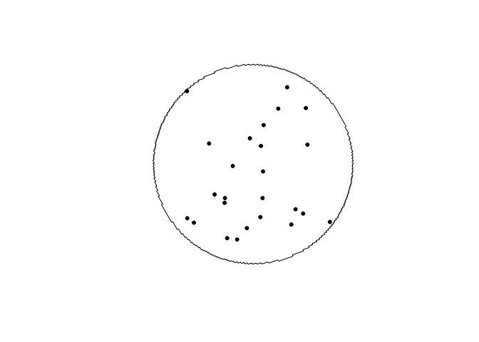
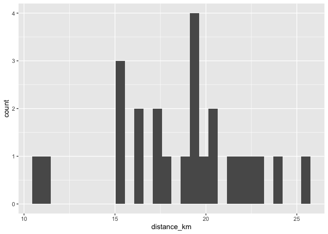
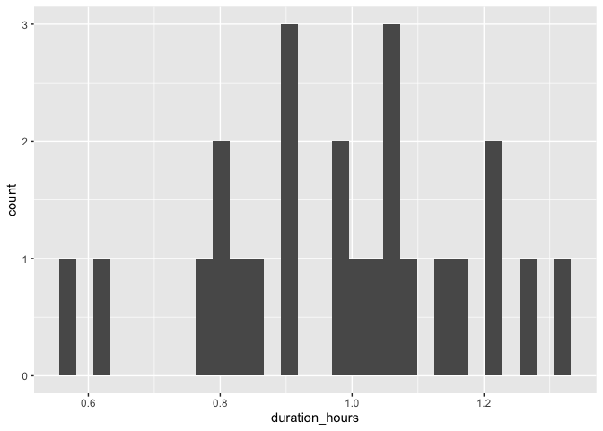
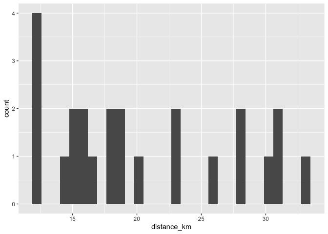
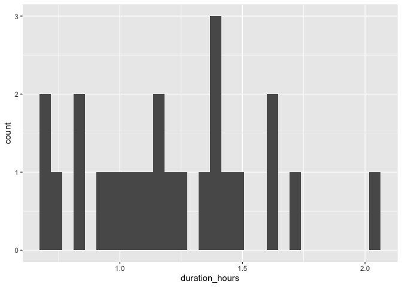
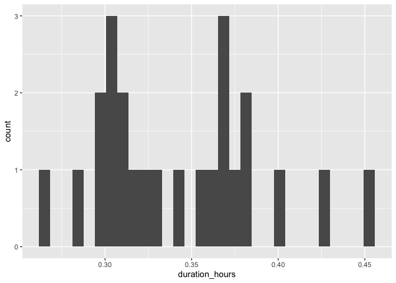
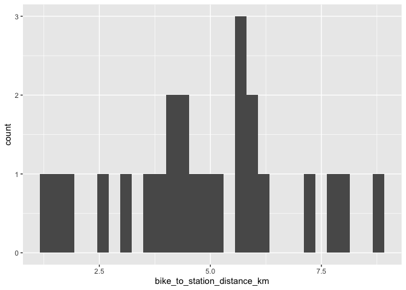
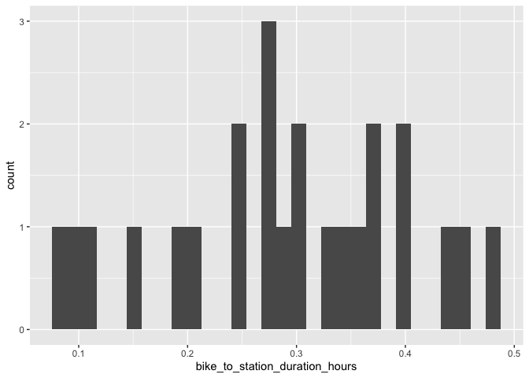

# Calgary

## North Pointe Transit Terminal

### Draw buffer and select points


```r
destination <- "Central Library, Calgary, Canada"        #### EDIT ME
```

### Set origin point


```r
origin <- "North Pointe Transit Terminal, Calgary, Canada"    #### EDIT ME
```

#### Setup departure location and arrival time


```r
arrival_time <- as.POSIXct("2024-06-11 08:30:00", tz = "America/Calgary")       #### EDIT ME
```

```
## Warning in strptime(xx, f, tz = tz): unknown timezone 'America/Calgary'
```

```
## Warning in as.POSIXct.POSIXlt(x): unknown timezone 'America/Calgary'
```

```
## Warning in strptime(x, f, tz = tz): unknown timezone 'America/Calgary'
```

```
## Warning in as.POSIXct.POSIXlt(as.POSIXlt(x, tz, ...), tz, ...): unknown
## timezone 'America/Calgary'
```

#### List of variables for geocoding


```r
var_list <- c("var1", "var2", "var3", "var4", "var5", "var6", "var7", "var8", "var9", "var10", "var11", "var12", "var13", "var14", "var15", "var16", "var17", "var18", "var19", "var20", "var21", "var22", "var23", "var24")
```


```r
stations <- geocode(location = origin, output = "more", source = "google")
```

```
## ℹ <https://maps.googleapis.com/maps/api/geocode/json?address=North+Pointe+Transit+Terminal,+Calgary,+Canada&key=xxx>
```

```r
stations_sf <- stations %>%
                st_as_sf(coords = c("lon", "lat"), crs = 4326)

stations_buffer = st_buffer(stations_sf, 5000)

stations_buffer <- as_sf(stations_buffer)
```

#### Interactive map view of buffers


```r
mapview(stations_buffer)
```

```{=html}
<div class="leaflet html-widget html-fill-item" id="htmlwidget-4aaee7915f94ac87b730" style="width:672px;height:480px;"></div>
<script type="application/json" data-for="htmlwidget-4aaee7915f94ac87b730">{"x":{"options":{"minZoom":1,"maxZoom":52,"crs":{"crsClass":"L.CRS.EPSG3857","code":null,"proj4def":null,"projectedBounds":null,"options":{}},"preferCanvas":false,"bounceAtZoomLimits":false,"maxBounds":[[[-90,-370]],[[90,370]]]},"calls":[{"method":"addProviderTiles","args":["CartoDB.Positron","CartoDB.Positron","CartoDB.Positron",{"errorTileUrl":"","noWrap":false,"detectRetina":false,"pane":"tilePane"}]},{"method":"addProviderTiles","args":["CartoDB.DarkMatter","CartoDB.DarkMatter","CartoDB.DarkMatter",{"errorTileUrl":"","noWrap":false,"detectRetina":false,"pane":"tilePane"}]},{"method":"addProviderTiles","args":["OpenStreetMap","OpenStreetMap","OpenStreetMap",{"errorTileUrl":"","noWrap":false,"detectRetina":false,"pane":"tilePane"}]},{"method":"addProviderTiles","args":["Esri.WorldImagery","Esri.WorldImagery","Esri.WorldImagery",{"errorTileUrl":"","noWrap":false,"detectRetina":false,"pane":"tilePane"}]},{"method":"addProviderTiles","args":["OpenTopoMap","OpenTopoMap","OpenTopoMap",{"errorTileUrl":"","noWrap":false,"detectRetina":false,"pane":"tilePane"}]},{"method":"createMapPane","args":["polygon",420]},{"method":"addPolygons","args":[[[[{"lng":[-114.1382642102648,-114.1391957322719,-114.1386657430809,-114.1384007549958,-114.1388665031655,-114.138601515579,-114.1390672590345,-114.1386697800303,-114.1389026485498,-114.138770156758,-114.1394687581265,-114.1389387902857,-114.139870240358,-114.1393402745124,-114.1402717057301,-114.1393442803834,-114.1395771309212,-114.1394446449653,-114.1401431923894,-114.1396132478923,-114.1405446260418,-114.1400146835402,-114.139749718798,-114.1402153950432,-114.1399504307998,-114.1404161023324,-114.1398861791822,-114.1408175042701,-114.1397659589286,-114.1397805103791,-114.139772230762,-114.1406889701953,-114.1401590683904,-114.1398941239954,-114.1403597566084,-114.1400948127122,-114.1405604406137,-114.1397656234356,-114.1402312389471,-114.1399663047245,-114.1404319155248,-114.1399020524148,-114.1396371273664,-114.1401027257776,-114.1398378012279,-114.1403033949283,-114.1395086357874,-114.1399742170996,-114.139709302222,-114.1401748788238,-114.139645054403,-114.1391152473305,-114.140046367211,-114.1389867744013,-114.1387218870406,-114.1391874264823,-114.1389225396199,-114.1393880743521,-114.1388583059605,-114.1383285549141,-114.1380636858951,-114.1385292005663,-114.1382643320455,-114.1387298420078,-114.1376703959323,-114.1372731215387,-114.1375058656397,-114.1373734420502,-114.138071670169,-114.1375419751372,-114.1370122974467,-114.1364826370967,-114.1359529940867,-114.1368839004677,-114.1363542594482,-114.1342358687499,-114.1337063144168,-114.1346371252313,-114.1341075728863,-114.133578037876,-114.1330485201997,-114.1325190198566,-114.1319895368459,-114.1314600711672,-114.1309306228195,-114.1304011918022,-114.1298717781147,-114.1293423817562,-114.1288130027259,-114.1282836410233,-114.1277542966476,-114.1272249695981,-114.1262943736235,-114.1257650792438,-114.1236480749641,-114.1231188672004,-114.1221883598238,-114.121659184725,-114.1211300269465,-114.1206008864875,-114.1200717633472,-114.1191413138827,-114.1186122234043,-114.1175540943984,-114.1166236875049,-114.1160946643198,-114.1155656584496,-114.1151004690498,-114.1148359764436,-114.1143707900155,-114.1135773496751,-114.1130484110891,-114.1121180740014,-114.1115891680714,-114.1110602794525,-114.1101299695993,-114.1096011136351,-114.1091359650861,-114.1088715474312,-114.1084064018554,-114.108141992364,-114.1076131863625,-114.1066829156405,-114.1056253862502,-114.1046951427696,-114.1041664193794,-114.1032361877969,-114.1027074970577,-114.1020098326187,-114.1018776655152,-114.1016451112306,-114.1012486192864,-114.1007835158263,-114.1005191971075,-114.100054096623,-114.0997897860667,-114.0992611779309,-114.0983309973996,-114.0978024219127,-114.0968722532866,-114.096343710448,-114.0954135537288,-114.0948850435381,-114.0939548987274,-114.0934264211841,-114.0924962882837,-114.0919678433873,-114.0910377223988,-114.0905093101489,-114.0895792010739,-114.0891141452484,-114.0888499571219,-114.0883849042753,-114.0881207243104,-114.0872196894128,-114.0872031787732,-114.0871741130927,-114.0866622921093,-114.0857322034344,-114.085203904472,-114.0835762678994,-114.0834442025773,-114.0832116831689,-114.082815496566,-114.0818854283034,-114.081357209983,-114.0804271536448,-114.0794970938795,-114.0789689235569,-114.078038875719,-114.07716695276,-114.0771339445483,-114.077075816304,-114.0765807021321,-114.0756506627991,-114.0747787478154,-114.0747457426036,-114.074687614891,-114.074192545719,-114.0732625148959,-114.0723324806512,-114.0718044543284,-114.0708744320198,-114.0694793921455,-114.0692154046636,-114.0687503935022,-114.0684864141816,-114.0675563969748,-114.0666263763508,-114.0661613647576,-114.0658974089573,-114.06543240035,-114.0651684527111,-114.0642384406151,-114.0623784061799,-114.061850569948,-114.0609205629721,-114.0599905525841,-114.0590605387846,-114.0581305215743,-114.0576655116903,-114.0574016346224,-114.056936627727,-114.0566727588209,-114.0557427501557,-114.0520226814182,-114.0501626266123,-114.0496350093271,-114.0487049921861,-114.0477749716418,-114.0468449476949,-114.045914920346,-114.0449848895958,-114.0440548554448,-114.0431248178938,-114.0421947769433,-114.041264732594,-114.0403346848466,-114.0394046337016,-114.0396683556382,-114.039203324948,-114.0394670473603,-114.0371418619517,-114.0334215211591,-114.0315613304018,-114.0320886574684,-114.0311585416204,-114.0302284223806,-114.0292982997496,-114.0283681737282,-114.0274380443169,-114.0279653117472,-114.027035163562,-114.0251748570246,-114.0254384741407,-114.0249733915421,-114.0252370091308,-114.0247719218385,-114.023841744713,-114.0229115642002,-114.0219813803008,-114.0225085745789,-114.0206481658434,-114.0197179563973,-114.0202451217827,-114.0193148935605,-114.0183846619537,-114.0186482357337,-114.0181831148131,-114.0184466890644,-114.0179815634496,-114.0161210525309,-114.0166481755077,-114.0157178995792,-114.0147876202679,-114.0152982573001,-114.015269185551,-114.0152856579683,-114.0134541301712,-114.0139153381822,-114.0137990485764,-114.0138649362745,-114.0130509058702,-114.0121205822381,-114.0125817784214,-114.0124654860455,-114.0125313720539,-114.0107869764659,-114.0113140453784,-114.0103836808052,-114.009453312852,-114.0099803682421,-114.0090499815075,-114.0093135079815,-114.0088483094963,-114.0091118364397,-114.0086466332589,-114.0077162243628,-114.0082103273647,-114.0081521757939,-114.0081851164739,-114.0073128404259,-114.0063824093683,-114.0069094395819,-114.0059789897407,-114.0064401418734,-114.0063238337207,-114.0063897134361,-114.005575553204,-114.0058390680258,-114.0053738285944,-114.0056373438849,-114.0051720997572,-114.0042416089685,-114.0047686293993,-114.0038381198246,-114.0042333849327,-114.0040007541221,-114.0041325103554,-114.0034346137678,-114.0036981236963,-114.0032328543966,-114.0034963647934,-114.0030310907968,-114.0021005402707,-114.0026275509108,-114.0016969815965,-114.0022239941084,-114.0012934060052,-114.0017874814835,-114.0017293187119,-114.001762257557,-114.0008898134958,-114.0012850740667,-114.0010524189258,-114.0011841736466,-114.0004862040674,-114.0007497109698,-114.0002843930081,-114.0005479003783,-114.0000825777187,-114.0003460855565,-113.999880758199,-114.0001442665044,-113.9996789344488,-113.9999424432218,-113.999477106468,-113.9997406157085,-113.9992752742565,-113.9995387839646,-113.9990734378142,-113.9993369479897,-113.9988715971408,-113.9991351077838,-113.9986697522364,-113.9989332633468,-113.9984679031007,-113.9988631720881,-113.9986304887575,-113.998762246284,-113.998064192135,-113.9985253418681,-113.9984089976388,-113.9984748770116,-113.9976604642428,-113.9981874954587,-113.9972567194228,-113.9977837525075,-113.9968529576741,-113.9973799926273,-113.9964491789956,-113.9969762158171,-113.9972397407118,-113.9967743210628,-113.9970378464247,-113.9965724220756,-113.9970994780564,-113.9961686114019,-113.9966956692508,-113.9957647837949,-113.9966871496479,-113.9964544210077,-113.9965861909174,-113.9958880008379,-113.9964150797159,-113.9954841412284,-113.9960112219742,-113.9964065438832,-113.9961738019843,-113.9963055771516,-113.9956073472953,-113.996134447204,-113.9963980036443,-113.9959325044467,-113.9961960613541,-113.9957305574547,-113.9962576765277,-113.9953266507659,-113.9958537717068,-113.9963809099455,-113.9954498499451,-113.9965041474579,-113.9955730532162,-113.9961002124905,-113.996627389065,-113.9956962605795,-113.9967506347672,-113.9958194720354,-113.9963466696488,-113.9968738845649,-113.9973352118106,-113.9972188106849,-113.9972847154174,-113.9964699043692,-113.9969971384582,-113.9977880220381,-113.9973223952683,-113.9975860279222,-113.9971203964476,-113.9976476670169,-113.9981749548926,-113.9986363459813,-113.9985199324331,-113.9985858462863,-113.9977709482796,-113.9982982553337,-113.9993529213679,-113.9997484389812,-113.9995155960306,-113.999647436434,-113.9989489034177,-113.9994762642715,-114.0000036424364,-114.0005310379131,-114.0010584507023,-114.0015858808046,-114.0006544232904,-114.0048743639449,-114.0090954130379,-114.010150848547,-114.0110825840072,-114.0116103431942,-114.0121381197086,-114.012665913551,-114.0131937247221,-114.0137215532227,-114.0146533624974,-114.0151812237717,-114.016236998314,-114.0167029248398,-114.0169668831689,-114.017432812704,-114.0176967792271,-114.0182247252735,-114.0187526886539,-114.0192186366413,-114.0194826286929,-114.019948579689,-114.0212686242603,-114.022200562303,-114.0227286259143,-114.0232567068634,-114.0241886723804,-114.0252449171821,-114.0261769101709,-114.0267050740248,-114.0272332552199,-114.0281652756782,-114.0286934896579,-114.0291595063268,-114.0294236236808,-114.0298896433557,-114.030153768906,-114.0306820330144,-114.0316140929627,-114.0321423898577,-114.0328414441555,-114.0329735239847,-114.0332065426214,-114.0336027915089,-114.0340688339312,-114.0343330091372,-114.034799054564,-114.035063237967,-114.0355916177834,-114.0365237292307,-114.0370521418358,-114.0379842652988,-114.0385127106931,-114.03944484617,-114.0399733243541,-114.0409054718432,-114.0414339828175,-114.0423661423171,-114.0428946860821,-114.0438268575906,-114.0443554341467,-114.0452876176625,-114.0458162270101,-114.0467484225314,-114.0472145190045,-114.0474788417644,-114.0479449412383,-114.0482092721963,-114.048908425586,-114.0490405955864,-114.0492736472518,-114.0496701666558,-114.050602382747,-114.0511311059088,-114.0520633339992,-114.0525294467552,-114.0527938264218,-114.0532599421771,-114.053524330042,-114.0544565666907,-114.0549853708741,-114.0559176195174,-114.0568498647196,-114.0573787171306,-114.0590101649604,-114.0591423875277,-114.0593754516071,-114.0597721287129,-114.0607043944524,-114.0615201241486,-114.0615862415659,-114.0617027744054,-114.0621656056102,-114.0640301507242,-114.0645591478119,-114.0654914306283,-114.066423709996,-114.0668898483864,-114.0671543727289,-114.0676205141142,-114.067885046655,-114.068817334552,-114.0702157599262,-114.0704803160935,-114.0709464600158,-114.0712110243813,-114.0721433173496,-114.0730756068642,-114.0740078929243,-114.0745370809593,-114.0754693789897,-114.0789654658158,-114.0790977838544,-114.0793308555445,-114.0797278190652,-114.08066011523,-114.0815924079348,-114.0825246971789,-114.0834569829616,-114.0843892652822,-114.0853215441401,-114.0862538195348,-114.0871860914655,-114.0877155147207,-114.0895800790224,-114.0914446294583,-114.093309166023,-114.0951736887118,-114.096105944851,-114.0958411616836,-114.0963072845986,-114.0960425019213,-114.0965086201156,-114.0974408539008,-114.0983730842145,-114.0993053110558,-114.1002375344244,-114.1011697543194,-114.1021019707402,-114.1030341836863,-114.1039663931569,-114.1035691290499,-114.1038021779857,-114.1036697578255,-114.105301087553,-114.1071654513465,-114.1080976280266,-114.1077003191809,-114.1079333599192,-114.1078009248463,-114.108500042869,-114.1094321971888,-114.1103643480292,-114.1112964953897,-114.1108329306479,-114.1109494471388,-114.1108832244494,-114.1116988366787,-114.1135630831954,-114.1132981730157,-114.1137642286192,-114.1134993189333,-114.1139653698168,-114.1148974689725,-114.1158295646456,-114.1155646400561,-114.1160306827373,-114.1157657586421,-114.1180959397406,-114.1175660660913,-114.1184981170393,-114.1194301645027,-114.119165218799,-114.1196312373756,-114.1193662921669,-114.1207643311244,-114.1216963527391,-114.1211664368712,-114.1220984396086,-114.1230304388596,-114.1225005095833,-114.1234324899579,-114.1243644668453,-114.1238345241632,-114.124766482175,-114.1256984366991,-114.1251684806136,-114.1261004162628,-114.1258354370411,-114.1263013997111,-114.1260364209857,-114.1265023789372,-114.1274342922238,-114.1269705697111,-114.1270870569439,-114.1270208117159,-114.1287681100609,-114.1282381291633,-114.1291700012149,-114.1289050095886,-114.1293709404602,-114.1291059493308,-114.1295718754845,-114.1305037251746,-114.1299737328706,-114.1309055636897,-114.1305080693249,-114.1307410236005,-114.1306085266888,-114.1322391937816,-114.1317091900763,-114.1326409796651,-114.1321109779499,-114.1330427486701,-114.1326452472482,-114.1328781864996,-114.1327456872355,-114.1334445007975,-114.1331794997595,-114.1336453705324,-114.1333803699922,-114.1338462360484,-114.1347779655424,-114.1342479544238,-114.1351796650515,-114.1346496559249,-114.135581347687,-114.1350513405527,-114.13598301345,-114.1354530083083,-114.1363846623416,-114.1358587997751,-114.1358660781893,-114.1358619376061,-114.1367862943628,-114.1362728554804,-114.1363019685579,-114.1362854062696,-114.1371879095147,-114.1366661914558,-114.1366807476965,-114.1366724665894,-114.1375895077984,-114.1370595106298,-114.1379910892149,-114.1374610940402,-114.1383926537652,-114.1378626605849,-114.1387942014506,-114.1382642102648],"lat":[51.16704326528524,51.16683935981394,51.16626168162622,51.16597284330405,51.16587089304384,51.1655820571158,51.16548010662626,51.16504685651836,51.16499588189247,51.164851465917,51.16469854028571,51.16412088330907,51.16391698260493,51.16333933520495,51.16313543358424,51.16212456874445,51.16207359531059,51.1619291870323,51.16177626497751,51.16119863878966,51.16099474285488,51.16041712624394,51.16012831871059,51.16002637321902,51.15973756807993,51.15963562235945,51.1590580173846,51.15885412713655,51.15770796328064,51.1577047776617,51.15769575278346,51.15749505475497,51.15691747099397,51.15662867988594,51.15652674053905,51.15623795182534,51.15613601224976,51.15526965483684,51.15516771879117,51.15487893589631,51.154776999622,51.15419943913616,51.15391065966601,51.15380872692154,51.15351994984579,51.15341801687275,51.15255169437451,51.15244976493124,51.15216099367488,51.1520590640031,51.1514815267946,51.15090399164768,51.15070014101413,51.14954509193809,51.14925633095793,51.14915441187492,51.14886565328927,51.14876373397789,51.14818622211131,51.14760871230746,51.14731995817917,51.1472180461548,51.14692929442109,51.14682738216843,51.14567238790699,51.14523926718711,51.14518831543709,51.14504394259145,51.14489108558999,51.14431360113336,51.14373611874095,51.14315863841309,51.14258116015012,51.14237737349774,51.14179990481359,51.13949005073329,51.13891259237896,51.13870884237923,51.13813139360416,51.13755394689611,51.13697650225544,51.13639905968247,51.13582161917754,51.13524418074097,51.13466674437309,51.13408931007424,51.13351187784475,51.13293444768496,51.13235701959519,51.13177959357577,51.13120216962704,51.13062474774934,51.13082839259999,51.13025096528489,51.12794127674717,51.12736385979508,51.12756745117662,51.12699002879113,51.12641260847981,51.125835190243,51.12525777408104,51.12546132701652,51.124883905424,51.12372906846656,51.12393259046656,51.12335516759757,51.12277774680557,51.12287949714396,51.12259078565091,51.12269253200864,51.12182639501827,51.12124897295579,51.12145244059861,51.1208750131117,51.12029758770395,51.12050103192334,51.11992360109282,51.12002531629481,51.11973659978408,51.11983831100624,51.1195495931402,51.11897215896865,51.1191755638478,51.11802068674617,51.11822406820671,51.1176466252783,51.11784999082194,51.11727254247619,51.11742505548576,51.11728069231864,51.11733152846773,51.11689843834155,51.11700010624946,51.11671137827506,51.11681304220416,51.11652431287608,51.11594685578315,51.11615016608148,51.11557270357501,51.11577599795945,51.11519853004052,51.11540180851171,51.11482433518137,51.11502759773993,51.11445011899927,51.11465336564585,51.11407588149592,51.11427911223116,51.11370162267304,51.11390483749756,51.11400644175416,51.1137176921367,51.11381929241577,51.11353054144675,51.11372738237051,51.1137093352254,51.11371568479381,51.11315622408045,51.11335939867063,51.11278188540033,51.11313740757086,51.11299302630142,51.1130438126109,51.11261066818164,51.11281380254056,51.11223627097165,51.11243938942334,51.11264249946053,51.11206495499869,51.11226804912942,51.11245844223497,51.11242234486838,51.11243503744987,51.11189357749323,51.11209664730386,51.11228701760938,51.11225091943723,51.11226361049873,51.11172213845926,51.11192518395064,51.11212822102772,51.11155063790074,51.11175365907373,51.11205817505652,51.11176937491687,51.11187087416506,51.11158207267711,51.11178506111841,51.11198804114548,51.11208952800365,51.11180071767917,51.11190220056174,51.11161338888946,51.11181634459999,51.11222223077825,51.11164458654447,51.11184750952516,51.11205042409159,51.11225333024369,51.11245622798138,51.11255767369479,51.11226883552052,51.11237027725888,51.11208143773807,51.11228431116122,51.11309572070886,51.11350137499458,51.11292364513604,51.11312645217297,51.11332925079517,51.11353204100254,51.11373482279501,51.11393759617248,51.11414036113489,51.11434311768217,51.11454586581421,51.11474860553097,51.11495133683232,51.11515405971822,51.11544296553797,51.11554432569536,51.11583323391152,51.11634001249049,51.11715074880814,51.1175560664693,51.11813394806286,51.11833660174798,51.11853924701632,51.11874188386777,51.11894451230226,51.11914713231972,51.11972505341473,51.11992767249341,51.1203328853984,51.12062185795359,51.12072315778835,51.12101213273999,51.12111343233978,51.12131602522594,51.12151860969413,51.12172118574425,51.12229916340045,51.12270430520044,51.12290686347268,51.12348486566896,51.12368742299939,51.1238899719109,51.12417898127671,51.12428025444449,51.12456926620676,51.12467053913889,51.12507560981908,51.12565365361672,51.12585618380379,51.12605870557109,51.12661870199685,51.12662503089273,51.12664309533383,51.12704179965723,51.12754761772293,51.12757293199896,51.1276451919713,51.12782238903715,51.12802489207527,51.12853072506971,51.12855603817505,51.12862830028008,51.129007982823,51.12958609486686,51.12978858759319,51.12999107189818,51.130569201003,51.13077168436168,51.13106075344308,51.13116199383305,51.13145106531085,51.13155230546413,51.13175477945416,51.13229680040894,51.13230945519168,51.13234559001715,51.13253540824804,51.13273787286843,51.13331604567993,51.1335185093525,51.13402441883443,51.13404972701882,51.13412200005067,51.13429915447394,51.13458825020133,51.13468948027358,51.1349785783973,51.13507980823242,51.13528226158507,51.13586047062757,51.13606292303124,51.13649658680423,51.13654719999041,51.13669175531241,51.13684359311344,51.13713270695618,51.13723393139296,51.137523047632,51.13762427183136,51.13782671391173,51.13840495918464,51.13860740031483,51.13918565517294,51.13938809535268,51.13993021820637,51.13994287087583,51.13997901249456,51.14016879902491,51.14060250434827,51.14065311424051,51.14079768341261,51.14094951133116,51.14123865287402,51.14133987072196,51.14162901466107,51.14173023227113,51.14201937860648,51.14212059597864,51.14240974471022,51.14251096184444,51.14280011297225,51.14290132986849,51.14319048339253,51.14329170005076,51.143580855971,51.14368207239119,51.14397123070763,51.14407244688974,51.14436160760239,51.14446282354637,51.14475198665522,51.14485320236103,51.14528695081641,51.14533755928075,51.14548214283013,51.14563396646431,51.14614001483091,51.1461653191266,51.14623761199906,51.14641473919921,51.1469930899061,51.1471955205654,51.14777388085687,51.14797631056252,51.14855468043852,51.14875710919024,51.14933548865071,51.14962467917202,51.14972589599314,51.15001508891055,51.15011630549309,51.15069469664738,51.15089713096532,51.15147553170389,51.15167796506706,51.15269018451595,51.15274079480994,51.15288539858278,51.15303722770492,51.15361564972073,51.15381808864875,51.1543965202486,51.15483034533217,51.15488095701736,51.15502556610932,51.15517739940483,51.15575584269701,51.15604506513365,51.15614629030259,51.15643551513517,51.15653674006511,51.15711519504911,51.15731764606081,51.15789611062853,51.1584745773038,51.15867703483516,51.15983398946,51.16003645351104,51.16061494146049,51.16119343151666,51.16139590208737,51.16255290347269,51.16275538056309,51.16333389189209,51.16391240532703,51.16441860630983,51.16444391804023,51.16451623271479,51.16469341195509,51.16527193707857,51.16613972871092,51.16624098043864,51.16653024723801,51.16663149872628,51.16721003764257,51.16778857866328,51.16829480378245,51.16832011901252,51.16839243713504,51.16856964087242,51.1691481935798,51.17030530530535,51.17073922437132,51.17078985983569,51.17093450025467,51.17108640488603,51.17166497348579,51.17224354418818,51.17282211699288,51.17340069189953,51.17397926890783,51.17418183843238,51.1788105899698,51.1834394758374,51.18459671827351,51.18439401405943,51.18497263093587,51.18555124990733,51.18612987097346,51.18670849413393,51.18728711938842,51.18708436930167,51.18766298916318,51.18882023516515,51.18871884572453,51.18900815666102,51.18890676323728,51.18919607282484,51.18977469356884,51.19035331640433,51.19025191150916,51.19054122183899,51.19043981296027,51.19188636308817,51.19168352027354,51.19226213649272,51.19284075480125,51.19263788856053,51.19379511646327,51.19359222679459,51.19417083638714,51.19474944806721,51.19454653496869,51.19512514124407,51.19502367778107,51.19531297982819,51.19521151238025,51.19550081307582,51.19607941603145,51.19587646356077,51.19645506110898,51.19630283559214,51.19644748389997,51.19639674053668,51.1968306848369,51.19672919371616,51.19701848869423,51.19691699358794,51.19720628721353,51.19778487602758,51.19758186823713,51.19816045163996,51.19795742790599,51.19853600589653,51.19833296621842,51.19891153879558,51.19870848317269,51.19928705033541,51.1990839787671,51.1996625405143,51.19945945299993,51.20003800933055,51.19983490586949,51.20041345678244,51.20021033737403,51.20010877450125,51.20039804511389,51.20029647825412,51.20058574751187,51.20043339044947,51.20057802386719,51.20052723665484,51.20096113628129,51.20075797652645,51.20133650368057,51.20113332797634,51.20103173695549,51.2013209956867,51.20121940067837,51.20150865805373,51.2013054579494,51.20188396675694,51.20168075070178,51.20147752619648,51.20205602207761,51.20170034573256,51.20184496674505,51.2017941532572,51.20222801566601,51.20202475080649,51.20184688712253,51.20191919587904,51.20189378613597,51.20239994751815,51.20199336054181,51.20257181763003,51.2023685039627,51.20216518184495,51.2020635176172,51.20235273755846,51.20225106934204,51.20254028792512,51.20233694140212,51.20203190577312,51.2023211154928,51.2022194308483,51.20250863920929,51.20230525982969,51.20210187199969,51.20189847571937,51.20247687147583,51.20227345923871,51.20151058808891,51.2016551784366,51.20160431566563,51.20203808607652,51.20183462408028,51.20163115363384,51.20142767473726,51.20122418739063,51.20102069159403,51.20081718734754,51.20061367465124,51.20041015350521,51.20098845578989,51.20058137312854,51.20017425666832,51.19976710640987,51.19935992235386,51.19915631765195,51.19886720005134,51.19876539641,51.19847628120321,51.19837447732768,51.19817086323998,51.19796724070352,51.19776360971839,51.19755997028466,51.19735632240241,51.19715266607174,51.19694900129271,51.19674532806542,51.19631170411749,51.1962607858995,51.1961162453108,51.19575980628836,51.19535241572636,51.19514870777387,51.1947151135505,51.19466418665149,51.19451965597092,51.19436687351514,51.19416315618277,51.19395943040325,51.19375569617666,51.19324986446765,51.1932243979174,51.19315213649084,51.19297386776566,51.19256637210968,51.19227733752906,51.19217546021498,51.19188642802816,51.19178455048149,51.19158078905349,51.19137701917938,51.19108799690256,51.19098611067734,51.19069709079432,51.19018763739225,51.18960961796169,51.18940582933794,51.18920203226895,51.18891303084245,51.18881113102029,51.1885221319876,51.18821642549154,51.18801261060483,51.1874346328761,51.18723081706226,51.18702699280403,51.18644903216811,51.18624520698334,51.18604137335457,51.1854634298117,51.185259595257,51.18505575225869,51.18447782580915,51.1842739818855,51.18398502319125,51.18388309994275,51.18359414364235,51.18349222016264,51.18328836687105,51.18278270445052,51.18275722301775,51.18268498577515,51.1823027502159,51.18172486752911,51.18152100394674,51.18123206713396,51.18113013405662,51.18084119963772,51.18073926632952,51.1805353933818,51.17995753736461,51.17975366349393,51.17932027846988,51.179269310093,51.17912484914535,51.17876805902457,51.17819022967732,51.17798634552085,51.17740852574927,51.17720464067101,51.17677128283129,51.1767203116527,51.1765758597665,51.17642294447543,51.17613404390828,51.1760320996231,51.17574320144989,51.17564125693445,51.17543736157376,51.17485957804841,51.17465568176713,51.17407790781764,51.17387401061607,51.17329624624249,51.17309234812091,51.17251459332333,51.17231069428202,51.17173746268705,51.17173586975085,51.17173135612475,51.17152904909974,51.17096936766207,51.17096299587995,51.17094494167951,51.17074741257439,51.17017871345911,51.17017552755655,51.17016650060437,51.16996578470634,51.16938806821324,51.16918416549593,51.16860645857909,51.16840255494349,51.16782485760297,51.16762095304938,51.16704326528524]}]]],null,"stations_buffer",{"crs":{"crsClass":"L.CRS.EPSG3857","code":null,"proj4def":null,"projectedBounds":null,"options":{}},"pane":"polygon","stroke":true,"color":"#333333","weight":0.5,"opacity":0.9,"fill":true,"fillColor":"#6666FF","fillOpacity":0.6,"smoothFactor":1,"noClip":false},"<div class='scrollableContainer'><table class=mapview-popup id='popup'><tr class='coord'><td><\/td><th><b>Feature ID&emsp;<\/b><\/th><td>1&emsp;<\/td><\/tr><tr><td>1<\/td><th>type&emsp;<\/th><td>establishment&emsp;<\/td><\/tr><tr><td>2<\/td><th>loctype&emsp;<\/th><td>geometric_center&emsp;<\/td><\/tr><tr><td>3<\/td><th>address&emsp;<\/th><td>wb country village wy @, bv n, calgary, ab t3k, canada&emsp;<\/td><\/tr><tr><td>4<\/td><th>north&emsp;<\/th><td>51.15841&emsp;<\/td><\/tr><tr><td>5<\/td><th>south&emsp;<\/th><td>51.15571&emsp;<\/td><\/tr><tr><td>6<\/td><th>east&emsp;<\/th><td>-114.0667&emsp;<\/td><\/tr><tr><td>7<\/td><th>west&emsp;<\/th><td>-114.0694&emsp;<\/td><\/tr><tr><td>8<\/td><th>geometry&emsp;<\/th><td>sfc_POLYGON&emsp;<\/td><\/tr><\/table><\/div>",{"maxWidth":800,"minWidth":50,"autoPan":true,"keepInView":false,"closeButton":true,"closeOnClick":true,"className":""},"1",{"interactive":false,"permanent":false,"direction":"auto","opacity":1,"offset":[0,0],"textsize":"10px","textOnly":false,"className":"","sticky":true},{"stroke":true,"weight":1,"opacity":0.9,"fillOpacity":0.84,"bringToFront":false,"sendToBack":false}]},{"method":"addScaleBar","args":[{"maxWidth":100,"metric":true,"imperial":true,"updateWhenIdle":true,"position":"bottomleft"}]},{"method":"addHomeButton","args":[-114.1408175042701,51.11155063790074,-113.9953266507659,51.20257181763003,true,"stations_buffer","Zoom to stations_buffer","<strong> stations_buffer <\/strong>","bottomright"]},{"method":"addLayersControl","args":[["CartoDB.Positron","CartoDB.DarkMatter","OpenStreetMap","Esri.WorldImagery","OpenTopoMap"],"stations_buffer",{"collapsed":true,"autoZIndex":true,"position":"topleft"}]},{"method":"addLegend","args":[{"colors":["#6666FF"],"labels":["stations_buffer"],"na_color":null,"na_label":"NA","opacity":1,"position":"topright","type":"factor","title":"","extra":null,"layerId":null,"className":"info legend","group":"stations_buffer"}]}],"limits":{"lat":[51.11155063790074,51.20257181763003],"lng":[-114.1408175042701,-113.9953266507659]},"fitBounds":[51.11155063790074,-114.1408175042701,51.20257181763003,-113.9953266507659,[]]},"evals":[],"jsHooks":{"render":[{"code":"function(el, x, data) {\n  return (\n      function(el, x, data) {\n      // get the leaflet map\n      var map = this; //HTMLWidgets.find('#' + el.id);\n      // we need a new div element because we have to handle\n      // the mouseover output separately\n      // debugger;\n      function addElement () {\n      // generate new div Element\n      var newDiv = $(document.createElement('div'));\n      // append at end of leaflet htmlwidget container\n      $(el).append(newDiv);\n      //provide ID and style\n      newDiv.addClass('lnlt');\n      newDiv.css({\n      'position': 'relative',\n      'bottomleft':  '0px',\n      'background-color': 'rgba(255, 255, 255, 0.7)',\n      'box-shadow': '0 0 2px #bbb',\n      'background-clip': 'padding-box',\n      'margin': '0',\n      'padding-left': '5px',\n      'color': '#333',\n      'font': '9px/1.5 \"Helvetica Neue\", Arial, Helvetica, sans-serif',\n      'z-index': '700',\n      });\n      return newDiv;\n      }\n\n\n      // check for already existing lnlt class to not duplicate\n      var lnlt = $(el).find('.lnlt');\n\n      if(!lnlt.length) {\n      lnlt = addElement();\n\n      // grab the special div we generated in the beginning\n      // and put the mousmove output there\n\n      map.on('mousemove', function (e) {\n      if (e.originalEvent.ctrlKey) {\n      if (document.querySelector('.lnlt') === null) lnlt = addElement();\n      lnlt.text(\n                           ' lon: ' + (e.latlng.lng).toFixed(5) +\n                           ' | lat: ' + (e.latlng.lat).toFixed(5) +\n                           ' | zoom: ' + map.getZoom() +\n                           ' | x: ' + L.CRS.EPSG3857.project(e.latlng).x.toFixed(0) +\n                           ' | y: ' + L.CRS.EPSG3857.project(e.latlng).y.toFixed(0) +\n                           ' | epsg: 3857 ' +\n                           ' | proj4: +proj=merc +a=6378137 +b=6378137 +lat_ts=0.0 +lon_0=0.0 +x_0=0.0 +y_0=0 +k=1.0 +units=m +nadgrids=@null +no_defs ');\n      } else {\n      if (document.querySelector('.lnlt') === null) lnlt = addElement();\n      lnlt.text(\n                      ' lon: ' + (e.latlng.lng).toFixed(5) +\n                      ' | lat: ' + (e.latlng.lat).toFixed(5) +\n                      ' | zoom: ' + map.getZoom() + ' ');\n      }\n      });\n\n      // remove the lnlt div when mouse leaves map\n      map.on('mouseout', function (e) {\n      var strip = document.querySelector('.lnlt');\n      if( strip !==null) strip.remove();\n      });\n\n      };\n\n      //$(el).keypress(67, function(e) {\n      map.on('preclick', function(e) {\n      if (e.originalEvent.ctrlKey) {\n      if (document.querySelector('.lnlt') === null) lnlt = addElement();\n      lnlt.text(\n                      ' lon: ' + (e.latlng.lng).toFixed(5) +\n                      ' | lat: ' + (e.latlng.lat).toFixed(5) +\n                      ' | zoom: ' + map.getZoom() + ' ');\n      var txt = document.querySelector('.lnlt').textContent;\n      console.log(txt);\n      //txt.innerText.focus();\n      //txt.select();\n      setClipboardText('\"' + txt + '\"');\n      }\n      });\n\n      }\n      ).call(this.getMap(), el, x, data);\n}","data":null},{"code":"function(el, x, data) {\n  return (function(el,x,data){\n           var map = this;\n\n           map.on('keypress', function(e) {\n               console.log(e.originalEvent.code);\n               var key = e.originalEvent.code;\n               if (key === 'KeyE') {\n                   var bb = this.getBounds();\n                   var txt = JSON.stringify(bb);\n                   console.log(txt);\n\n                   setClipboardText('\\'' + txt + '\\'');\n               }\n           })\n        }).call(this.getMap(), el, x, data);\n}","data":null}]}}</script>
```

#### Generate points within buffer


```r
set.seed(100)
points_sample_sf <- st_sample(stations_buffer, size = c(25,25), type = "random")
```

```
## Warning in st_poly_sample(x, size = size, ..., type = type, by_polygon =
## by_polygon, : coordinate ranges not computed along great circles; install
## package lwgeom to get rid of this warning
```

```r
points_sample_sf <- st_as_sf(points_sample_sf)
points_sample <- sf_to_df(points_sample_sf)
```

#### Check to see if they worked


```r
check_buffer <- stations_buffer %>% slice(1:2)

plot(st_geometry(check_buffer))
plot(points_sample_sf, pch = 20, add= TRUE)
```

<!-- -->


```r
points_sample$destination <- destination
points_sample$origin <- origin
points_sample$lat_lon <- paste(points_sample$lat, points_sample$lon)
```

#### Checking points and general mapping


```r
lst_directions <- apply(points_sample, 1, function(x){
  res <- google_directions(
    origin = x[['lat_lon']], 
    destination = x[['destination']]    
  )
df_result <- data.frame(
    origin = x[['lat_lon']], 
    destination = x[['destination']], 
    route = res$routes$overview_polyline$points 
)
return(df_result)
})

df_directions <- do.call(rbind, lst_directions)

google_map() %>%
  add_polylines(data = df_directions, polyline = "route") 
```

```{=html}
<div class="google_map html-widget html-fill-item" id="htmlwidget-70dc2de7a0948b529333" style="width:672px;height:480px;"></div>
<script type="application/json" data-for="htmlwidget-70dc2de7a0948b529333">{"x":{"lat":0,"lng":0,"zoom":1,"min_zoom":null,"max_zoom":null,"mapBounds":{"west":-180,"south":-90,"east":180,"north":90},"styles":null,"search_box":false,"update_map_view":true,"zoomControl":true,"mapType":"roadmap","mapTypeControl":true,"scaleControl":false,"streetViewControl":true,"rotateControl":true,"fullscreenControl":true,"event_return_type":"list","split_view":null,"split_view_options":{"heading":34,"pitch":10},"geolocation":false,"calls":[{"functions":"add_polylines","args":[[{"id":1,"geodesic":true,"stroke_colour":"#0000FF","stroke_weight":2,"stroke_opacity":0.6,"z_index":3,"polyline":["k|cwHfkkwTN~@^vAl@fEd@~GJrDF`BApDIfDWfEY~Ce@dEWfAu@`GU|@Yl@ONYFSAaAWKAa@QcBu@oDeBe@c@Qm@A_@P_AXu@Lk@n@kApAuBl@kA~@_BxDcDr@{@Zo@J]TwADw@@eAKcFCaAGy@Os@Um@y@kAgAkAoAwAc@_@YOWG_@CYBSD_@TYZU^]`AUfBS`BOx@Yt@Yh@e@n@mBhBaAgCa@y@[e@cB}B[k@m@_BU}@|AuAtFaF|E{Ep@w@tDyD`@]fCeCvAuAdCiC|@cAjAcBdAgBdB{D|@}Bp@gBbAyCbAqDjFyQfCoJ~AqGbCsLfAmFnAwEdAwCnDuInAgDdA}Ch@cBtCsKtCwMv@uCbBoHjBuIn@mDn@{EfAoKhAgFXoAh@mBp@eBr@eBnCuG|BqFtAmCbBgDhCiFdAkCdAmDbAqEXaATi@Xe@d@i@j@a@j@[j@Wz@Ur@Ir@ClC@pEJhBH^@VWtP`BzGl@nKd@|BHzEF`FBzDApEGjCE`CO|DY~Da@bAMtEw@zCm@pGaBvCgAtB}@vBiAdDwBxC_CpB_BtC_CvCaC`As@~AeAlAo@tAm@tCcA~A_@hASn@KfGi@jF_@dI}@lGcAzCq@tEoAj@SvBw@h@Wh@YdCeBzCeCjFsFxMiO~CmDzHuIpDyDf@g@pAw@zEuD|B}@|Ai@r@Yv@Sz@Ut@OpCQdBIhA?dA@bCJfObAjCRrEZh@DzB?p@ErAMt@QbBg@^QzEgCtBoArCiB`CgB`BiAvC_C`CsB~IuHbAu@fAu@fDyBxC{AtCqAPRnBi@lCi@lBWbAIjAGxBEvAGNFV@j@Ab@?^DNJJPRf@LTPZ`@~AlAdFp@bDh@xDZdDFpAJnE?zEQnHg@dIUdDM|DCfAA|ALtQA~AGtAQrBUvAw@xCw@bCg@lBU`AOvAO|AKrAKdBGdB?vDBxB@lCArBCpBYbDStAe@fCUzAeAjEi@zBe@`BOjAUjCW~CALV@dA`@LFbBpAjAdA\\XJJl@}Bj@gCt@pBVh@Vh@\\`@PV^Vd@N~BP|ABdAFvBBCrE@^@DFFrA@"]},{"id":2,"geodesic":true,"stroke_colour":"#0000FF","stroke_weight":2,"stroke_opacity":0.6,"z_index":3,"polyline":["yxiwHdmdwTC`HCjCC~@WzCSdB]dBa@zA{@nBaB`Eg@`BWxAGR?pA@h@B`@ZvA`@`Bz@ElBItDS\\F|@JZH`@ZJLRh@Lf@Fd@?f@Gt@Op@KRQP[PUH_@Cc@WQUSk@U_AGqAAgAL}F^iPOe@J{CNgI@oFC{GKyEOyEq@_LkAuL}@sIuC{X_@wEm@oJSiEQgGOsIAiC?eV@oEEiRg@ok@QqUCoLD{\\HqMJU\\mJPoDRyCd@_ETuANM@Eh@uBjA{Dt@mB~A}DnA_Dz@oB^s@f@u@r@w@x@u@b@[n@[r@Ul@MjAGzBDhGZhCPRM`BV`B^~Af@v@X|Ar@rAr@hAr@bBnAxBpBbAfApBbCrAnBtC`Fx@~AxK~RlLlSvIlOzIrOzNhW`HzLdFjIbAxAfDzEhChDrBfCdNhO~AbBbLzLbHxH`YhZjKdLrCnClBvAfAt@dB~@|BfA|Ah@rCt@|AX`BNjBL`B@\\?bHU|EQ~BE~DAdDDrCJxAL~BN`Iv@fNrAlI\\bETxAB~EFzE?hDAnFIfCKdAG|DY~Da@bAMbBYlGkApGaBvCgAhCiAbB}@jBkArCuBlCyBhA{@fGaFdCgBzAy@z@a@zAm@lCy@bB]t@KpCYdGg@nBMzHy@HClGcAzCq@tEoAj@SvBw@rAq@dCeB|@s@|AqAnBoBdFyFtK{LpEgFdH{HnBqBf@g@pAw@zEuD|B}@|Ai@r@Yb@MnA[t@OlAIhDQnC@bCJhHh@zF\\lCRlBJdAJh@DzB?p@EPA`AKt@QbBg@^QzEgCtBoArCiBxCwBvDuC~EeEnIcHfBoAfDyBnAo@zCwAbAe@PR`Dy@|Cg@nAOjBKxBEvAGNFV@\\Ab@?\\@NBNJNX\\t@PZ`@~AlAdFp@bDP|@VzBZdDJhCFvC?~CG~DIjDg@dIUdDM|DCfAA|AHfMBlCA~AGtAQrBUvAw@xCw@bCg@lBU`AOvAO|AWxDGdBAbBBhDBvBCfFIrBe@|D{@bFoBfIe@`BOjAm@jHALV@dA`@^RpB~A`A~@RPrAqFDSt@pBVh@Vh@\\`@PV^Vd@N~BP|ABdAFvBBArFHLrA@"]},{"id":3,"geodesic":true,"stroke_colour":"#0000FF","stroke_weight":2,"stroke_opacity":0.6,"z_index":3,"polyline":["w|`wHx}fwToE@BgA?uHB}V@wCHwAbAkIZaBb@gAR[RSb@]vG{CTEdB?TJR@p@Br@FDaTEkHEeAI_AYiBY{@]y@O[}AcCgBqCeCgEA[Wg@O_@Yy@zA_DvDsH|@wBfAkDbAmE^{ANa@Zo@X_@f@g@l@a@p@[t@Yn@Kn@GhAAfA?bCDvFRVW`Iv@fNrAlI\\bETnEFvEBtE?lDEbCEfCKdAG|DY~Da@bAMbBYlGkApGaBvCgAhCiAbB}@jBkArCuBlCyBhA{@rAiArDwCdCgBzAy@z@a@zAm@pAa@z@WbB]t@KpCYdGg@nBMzHy@HClGcAzCq@tEoAj@SvBw@rAq@dCeB|@s@|AqAnBoBdFyFlD}DpHoIfEyEdFwFnBqBf@g@pAw@zEuD|B}@|Ai@r@Yb@MnA[t@OlAIhDQnC@bCJhHh@zF\\zF^dAJh@DzB?p@EPA`AKt@QbBg@^QzEgCtBoArCiBxCwBvDuCfA}@vCgCnIcHfBoAfDyBnAo@zCwAbAe@PR`Dy@|Cg@nAOjBKxBEvAGNFV@\\Ab@?\\@NBNJNX\\t@PZ`@~AlAdFp@bDP|@VzBZdDJhCFvC?~CG~DIjDg@dIUdDM|DCfAA|AHfMBlCA~AGtAQrBUvAw@xCw@bCg@lBU`AOvAO|AWxDGdBAbBBhDB|EC`CIrBe@|D{@bFoBfIe@`BOjAm@jHALV@dA`@^RpB~AtApArAqFDSt@pBVh@Vh@\\`@PV^Vd@N~BP|ABdAFvBBArFHLrA@"]},{"id":4,"geodesic":true,"stroke_colour":"#0000FF","stroke_weight":2,"stroke_opacity":0.6,"z_index":3,"polyline":["s|hwHvffwTp@MVC`@Bl@PTNhAbAx@n@NJn@yC`AsEH_@Jk@UKaAg@s@W_AUaAMmAEw@@{@DaAJs@Pq@Rk@A}A`@kAZq@HS@UAg@Ek@Q[O}@w@U[Yk@_@aAOk@W{AKmBAoBD_H@gKIgHI_DUeFQ_@MmCc@qGo@{GKcASmB{@iIeAaKwAmNk@uH_@iGSiFMeFKcIAgO?yTG_QQqQa@uh@EeM@aN?uLHgJBqEJS?Ef@sMZ_Fd@_ETuAPOp@qCrAeEdBiErBgFbAyBj@cA\\c@d@i@lAcAh@[r@Wl@Qh@GlAG~@B`DNvEVx@HHANKv@Jx@NfBb@tCbApBbAlAp@~@n@nB|AbB|AvA~AzAlBfBjCjCxEfAtB~DjHfQzZ|ErItKlRzF`K|Rn]rF`J|AxBfDxEbBvBfC|CrNvO`GnGbL|L~MxN`Zp[|@|@bCrBhAv@lAt@tBfAnBz@pCx@jB^~ATvCRnC@fHW~FQzCE~D@~CH|BLjAHvAJtHt@zD^nIv@hJ`@|CN~EFtEBbE?`EG`CEjDObE[zEe@fEq@fB]jHaBdDeApBy@hCoA|BsA|@m@`DeCvBeBjA{@jAcAbEcDjBqA~A{@fAg@vAi@nAc@fAYxAWt@MhE_@pF_@~JgAnC_@xCk@dGyAfBi@bA]jBw@tBoAdBqAlAaAlBiBtC{C`DsDvHuIjCyC|GwHfEqEtAuApAw@nB_BjBuA|B}@|Ai@`@Qb@MTIvBg@p@Gp@CfCOj@CzCDdRlAhBL`EV`BNxCCv@GdBYrBo@|C_BxBoAbCyArBuAxDqCdEeDpGsFlFkEhD_CpDqBbD{Af@UNR@?|Bm@|A[fBYlAMpBMhEK\\Hn@A|@BRDFHVf@f@`AjC|Kn@nDZzCRhCJxCDtDApAKhGQlEq@tJQ`GAnALpPCxDO~BOjAo@vCy@fCg@bBi@zBa@bE[~EC`EBdCBpBAdDAdAGpAGz@UpBc@hC[lBi@~ByA~F_@bBQtAe@lGb@F|@\\h@ZfCvBb@`@@BJH\\qAb@gBTgA@C^bAXv@j@hAb@h@VXb@TTF~BPnCHn@BzA@AjBA`C@DDJHBlA?"]},{"id":5,"geodesic":true,"stroke_colour":"#0000FF","stroke_weight":2,"stroke_opacity":0.6,"z_index":3,"polyline":["g``wHlpiwTkB??_G|A?fAA?w@@iA@kADg@Lg@Nc@R]b@g@x@w@^s@Po@Jw@DwA?mC?qHC_DKmAs@uFe@_EMkB@_YhFCpAIrAWjA[bAa@fAm@v@g@dEuCjBkAnBsAd@a@f@_@nAsAj@o@dHmJhKkNrBkC\\_@t@g@\\MjBU~@?V?Ae@@eDAiM@yHAuFB}[BiL@mCH]Fm@Lg@P]ZWdAc@b@QPO`@Mf@ObBYnEc@rFs@BCT_@ZCtAUpB[fB]jHaBdDeApBy@hCoA|BsA|@m@`DeCvBeBjA{@jAcAbEcDjBqA~A{@fAg@vAi@nAc@fAYnCe@hE_@pF_@~JgAnC_@xCk@dGyAfBi@bA]jBw@tBoAdBqAlAaAlBiBtC{C`DsDpJuKpFiGdIyItAuApAw@nB_BjBuA|B}@|Ai@`@Qb@MTIvBg@p@Gp@CfCOj@CzCDdRlApDVxBL`BNxCCv@GdBYrBo@|C_BxBoAbCyArBuAxDqCfCoBnIiHlFkEhD_CpDqBbD{Af@UNR@?|Bm@|A[fBYlAMpBMhEK\\Hn@A`@?ZBRDFHVf@f@`AjC|Kn@nDZzCRhCJxCDtDApAKhGQlEq@tJQ`GAnALpPCxDO~BOjAo@vCy@fCg@bBi@zBa@bE[~EC`EFvFCjFGpAGz@UpBc@hC[lBi@~ByA~F_@bBQtAe@lGb@F|@\\h@ZfCvBb@`@@BJH\\qAb@gBTgA@C^bAXv@j@hAb@h@VXb@TTF~BPnCHn@BzA@AjBA`C@DDJHBlA?"]},{"id":6,"geodesic":true,"stroke_colour":"#0000FF","stroke_weight":2,"stroke_opacity":0.6,"z_index":3,"polyline":["eqcwHjrdwTm@lKEjBBnF@pBQhGOxAYtB_@`B}@zCEHNTbB~B|@jAx@x@x@n@~@l@jAh@bATtALl@D~E?pDFnC?fCA\\?NEtAEb@CjBKdB@zCDt@AXEVOZc@Pg@L{@?aAK}@Wy@Qa@c@cAQu@Ew@F{@TqAhAyF\\iCbBoHjBuIn@mDn@{EfAoKhAgFXoAh@mBp@eBr@eBnCuG|BqFtAmCbBgDhCiFdAkCdAmDbAqEXaATi@Xe@d@i@j@a@j@[j@Wz@Ur@Ir@ClC@pEJhBH^@VWtP`BzGl@nKd@|BHzEF`FBzDApEGjCE`CO|DY~Da@bAMtEw@zCm@pGaBvCgAtB}@vBiAdDwBxC_CpB_BtC_CvCaC`As@~AeAlAo@tAm@tCcA~A_@hASn@KfGi@jF_@dI}@lGcAzCq@tEoAj@SvBw@h@Wh@YdCeBzCeCjFsFxMiOzMcOpDyDf@g@pAw@zEuD|B}@|Ai@r@Yv@Sz@Ut@OpCQdBIhA?dA@bCJfObAjCRrEZh@DzB?p@ErAMt@QbBg@^QzEgCtBoArCiB`CgB`BiAvC_C`CsB~IuHbAu@fAu@fDyBxC{AtCqAPRnBi@lCi@lBWbAIjAGxBEvAGNFV@j@Ab@?^DNJJPRf@LTPZ`@~AlAdFp@bDh@xDZdDFpAJnE?zEQnHg@dIUdDM|DCfAA|ALtQA~AGtAQrBUvAw@xCw@bCg@lBU`AOvAO|AKrAKdBGdB?vDBxB@lCArBCpBYbDStAe@fCUzAeAjEi@zBe@`BOjAUjCW~CALV@dA`@LFbBpAjAdA\\XJJl@}Bj@gCt@pBVh@Vh@\\`@PV^Vd@N~BP|ABdAFvBBCrE@^@DFFrA@"]},{"id":7,"geodesic":true,"stroke_colour":"#0000FF","stroke_weight":2,"stroke_opacity":0.6,"z_index":3,"polyline":["{slwHlkowT~GCtAAAkD?_B@}G?wI?kDnA?pB?nC@xD@b@?X?@mEAaE?sB?wI?wI?sK?eG^A^Cj@G^I|Ag@bAa@dAg@dBoAX[Ia@i@_CSmAa@{CQuBM}DIkE?gCJo@F]DILSTOvBGxBKvBSjDc@~Bg@|Aw@^W~AoA`@[VMXCd@HHDLFJ?JEVUb@U^Kb@Ij@M|Bc@dAWlA[xBg@bAJJDXHTLRXNZRt@Ff@?`AIv@Mf@Ud@ST_@RUB_@Aa@OQQU[Wm@Ue@YmA[wBCWMkA]sDY_Da@kGEaA@wBO{FEqIDeF?KIi@TcId@mPNkFl@}RhAw_@z@mYTcIF{IAwDAwCKyEOyEq@_Lo@}Gi@eFeAaKiCcWUsCg@uHQoDQsEO}GIkGAoE@gTCiTEkHOsNc@{j@CoL@cRBwIHqMJU\\mJPoDRyCd@_ETuANM@ElAqEf@_B\\}@|@yBhBqEv@qBbAsBf@u@VYl@o@f@c@b@[n@[r@UhAQvAErFVxEXXBRMrBZnAZbAZr@TzAn@tBfAjBnAhCtBpAnAdBrBnAbBr@bAdAdBtBvD|AxCnDpGnFnJdMrTxGnLjJjPtJ~PjApB`HzLdFjIbAxAxAvBfClDrBhCnA|A`J|JlDtDnAtAxLtM~LvMl\\`^|BbChBdBjA|@bAr@jCzA|BfA|Ah@rCt@|AX`BNjBL`B@\\?V?pHWvHU~DA|ABzELxE\\tP`BzGl@nKd@|BHvBDxED|E?jCAzGM`CO|DY~Da@bAMtEw@zCm@pGaBvCgAtB}@vBiAdDwBxC_CpB_BpAgAbAw@vCaC`As@~AeAlAo@tAm@|Ak@v@W~A_@xB_@fGi@jF_@dI}@lGcAzCq@tEoAj@SvBw@h@Wh@YdCeBzCeCjFsFrEiFhJmKxDiE|DkEpDyDf@g@pAw@zEuD|B}@|Ai@r@Yv@Sz@Ut@OpCQdBIhA?dA@bCJfObApDVlDVh@DzB?p@ErAMt@QbBg@^QzEgCtBoArCiB`CgB`BiAvC_C`NiLbAu@fAu@fDyBxC{AtCqAPRnBi@lCi@lBWbAIjAGxBEvAGNFV@j@Ab@?^DNJJPRf@LTPZ`@~AlAdFp@bDh@xDZdDFpAJnE?zEQnHg@dIUdDM|DCfAA|ALtQA~AGtAQrBUvAw@xCw@bCg@lBU`AOvAO|AKrAKdBGdB?vDDfGEdFYbDStAe@fCUzAeAjEi@zBe@`BOjAUjCW~CALV@dA`@LFbBpAhB~AJJl@}Bj@gCt@pBVh@Vh@\\`@PV^Vd@N~BP|ABdAFvBBCrE@^@DFFrA@"]},{"id":8,"geodesic":true,"stroke_colour":"#0000FF","stroke_weight":2,"stroke_opacity":0.6,"z_index":3,"polyline":["qwkwHljbwTEtI?dF?pP@fMA`I@hX?hO@hBG`@?z@?jAAjB?xB?j@@lAb@ApA?r@AfE@pH?`D?|@Bx@L`AX~@h@j@f@z@XnAJbA@d@EjAOhCg@nCa@z@ElBItDS\\F|@JZH`@ZJLRh@Lf@Fd@?f@Gt@Op@KRQP[PUH_@Cc@WQUSk@U_AGqAAgAL}F^iPOe@J{CNgI@oFC{GKyEOyEq@_LkAuL}@sIuC{X_@wEm@oJSiEQgGOsIAiC?eV@oEEiRg@ok@QqUCoLD{\\HqMJU\\mJPoDRyCd@_ETuANM@Eh@uBjA{Dt@mB~A}DnA_Dz@oB^s@f@u@r@w@x@u@b@[n@[r@Ul@MjAGzBDhGZhCPRM`BV`B^~Af@v@X|Ar@rAr@hAr@bBnAxBpBbAfApBbCrAnBtC`Fx@~AxK~RlLlSvIlOzIrOzNhW`HzLdFjIbAxAfDzEhChDrBfCdNhO~AbBbLzLbHxH`YhZjKdLrCnClBvAfAt@dB~@|BfA|Ah@rCt@|AX`BNjBL`B@\\?bHU|EQ~BE~DAdDDrCJxAL~BN`Iv@fNrAlI\\bETxAB~EFzE?hDAnFIfCKdAG|DY~Da@bAMbBYlGkApGaBvCgAhCiAbB}@jBkArCuBlCyBhA{@fGaFdCgBzAy@z@a@zAm@lCy@bB]t@KpCYdGg@nBMzHy@HClGcAzCq@tEoAj@SvBw@rAq@dCeB|@s@|AqAnBoBdFyFtK{LpEgFdH{HnBqBf@g@pAw@zEuD|B}@|Ai@r@Yb@MnA[t@OlAIhDQnC@bCJhHh@zF\\lCRlBJdAJh@DzB?p@EPA`AKt@QbBg@^QzEgCtBoArCiBxCwBvDuC~EeEnIcHfBoAfDyBnAo@zCwAbAe@PR`Dy@|Cg@nAOjBKxBEvAGNFV@\\Ab@?\\@NBNJNX\\t@PZ`@~AlAdFp@bDP|@VzBZdDJhCFvC?~CG~DIjDg@dIUdDM|DCfAA|AHfMBlCA~AGtAQrBUvAw@xCw@bCg@lBU`AOvAO|AWxDGdBAbBBhDBvBCfFIrBe@|D{@bFoBfIe@`BOjAm@jHALV@dA`@^RpB~A`A~@RPrAqFDSt@pBVh@Vh@\\`@PV^Vd@N~BP|ABdAFvBBArFHLrA@"]},{"id":9,"geodesic":true,"stroke_colour":"#0000FF","stroke_weight":2,"stroke_opacity":0.6,"z_index":3,"polyline":["gkhwHl}kwTj@Vn@BN?JnALz@Nf@Vl@f@p@~EtCfC|Cb@f@p@d@ZN^HV?b@Eb@KPKrB_Bh@q@lC}BPI|@[r@Ih@Af@JRJrCpBv@`@XDXAVCRGX@pAy@`CoBp@e@`@bB`DfMdAjE`AdDf@~@v@n@pBbAnBsIlAsFVaA|@sCd@sAv@iBbBkD`A}AlBkCt@{@p@q@pDqDh@m@|AuAtFaF|E{Ep@w@tDyD`@]fCeCf@c@n@q@dCiC|@cAjAcBdAgBdB{D|@}Bp@gBbAyCbAqDjFyQfCoJ~AqGjEaTnAwEdAwCnDuInAgDdA}Ch@cBtCsKtCwMv@uCbBoHjBuIn@mDn@{EfAoKhAgFXoAh@mBp@eBr@eBnCuG|BqFtAmClEwIhAiC`AuC^sAb@sB^}AXaATi@Xe@d@i@j@a@vAs@z@Ur@Ir@CjA?`CBzFR^@VWtP`BzGl@nKd@|BHvBDxED|E?jCAzGM`CO|DY~Da@bAMtEw@zCm@pGaBvCgAtB}@vBiAdDwBxC_CpB_BpAgAbAw@vCaC`As@~AeAlAo@tAm@|Ak@v@W~A_@xB_@fGi@jF_@dI}@lGcAzCq@tEoAj@SvBw@h@Wh@YdCeBzCeCjFsFrEiFhJmKxDiE|DkEpDyDf@g@pAw@zEuD|B}@|Ai@r@Yv@Sz@Ut@OpCQdBIhA?dA@bCJfObApDVlDVh@DzB?p@ErAMt@QbBg@^QzEgCtBoArCiB`CgB`BiAvC_C`NiLbAu@fAu@fDyBxC{AtCqAPRnBi@lCi@lBWbAIjAGxBEvAGNFV@j@Ab@?^DNJJPRf@LTPZ`@~AlAdFp@bDh@xDZdDFpAJnE?zEQnHg@dIUdDM|DCfAA|ALtQA~AGtAQrBUvAw@xCw@bCg@lBU`AOvAO|AKrAKdBGdB?vDDfGEdFYbDStAe@fCUzAeAjEi@zBe@`BOjAUjCW~CALV@dA`@LFbBpAhB~AJJl@}Bj@gCt@pBVh@Vh@\\`@PV^Vd@N~BP|ABdAFvBBCrE@^@DFFrA@"]},{"id":10,"geodesic":true,"stroke_colour":"#0000FF","stroke_weight":2,"stroke_opacity":0.6,"z_index":3,"polyline":["{mfwHzxhwTTrCBB^B`ARb@Ti@bFTLxCvB^Hj@@r@AfCDrIAz@Q\\Ob@[jB_CzCiEl@aAXu@T{@R{APkDJiD@qBKcBOaAU}@i@wAeDaHQk@Mo@SqCG}@bBW`@Kl@]d@c@tAiBdAqATCJGVCVR`AfEd@dCfAhIdC}@p@[^Wr@{@v@qAZs@Rw@T_APeBNwDB_AAeACg@nCUx@KZKd@Sb@a@j@}@l@aBdB}E\\eAh@yAF?HEPOFGHAP?vArBtAxARPlBrAjAh@f@Lr@JjBN~E?|CFv@@`EAdAAXElBG|AKh@?xD@tAD\\Ef@ORW\\y@F]F{@EaAQy@m@yA_@cAKu@?{@LaAx@iE\\}A\\iCbCsKjAqFh@wCPkAjAyJRyBXqB~@gEn@gC`@kA|BsFhCmGfB}D|A_D`EgI`AyBfAeDdAoE\\{ARi@Xq@\\g@\\]v@m@xAo@n@Mx@Ix@ClA?pBBxGTVWtHt@zD^nGl@~@H~DPlH\\dEFtED|E?`DEbGKfHg@zEe@tAUxEy@jHaBdDeApBy@dAg@bAg@|BsAnCmBbCoBbA{@`@WtAkAbDkCdCiBxA_AhAi@dBs@fA_@x@UjBc@zB[xIs@z@E~I_AnDg@xCk@dGyAjDgAjBw@^StA{@dBqAlAaAlBiBtC{C|AgBrCcDdJgKdEwEnE_FrDwDpAw@nB_BjBuA|B}@|Ai@`@Qb@Mx@UrA[p@GxDS|CAh@BlG`@xJn@bF\\fCRxCCRAb@EdBYrBo@|C_B|FiD|EiDfDeCfByAbCsBrCcCtEwD^Y`DyBnC}AlB_AvAo@f@UNR@?|Bm@`Dm@jBUjBKJAhEK\\HZA`@?`@?`@HV^Vn@Vb@bA`EfAzEd@fCd@bEX`ED`BDtDClDIlDQlEq@tJQ`GAnADvGF`KCpAO~BOjAo@vCaBjFi@zBSpBMpAUfDEv@C`BBhEBpECrCGdB]lD_AvFcBhH_@tA_@bBQtAQhCSbCb@F|@\\XPpB|AjAhAJH\\qAb@gBTgA@C^bAXv@j@hAb@h@VXb@TTF~BPnCHn@BzA@AjBA`CFPHBlA?"]},{"id":11,"geodesic":true,"stroke_colour":"#0000FF","stroke_weight":2,"stroke_opacity":0.6,"z_index":3,"polyline":["mwkwHvm~vT?gN?}G?y@?kDdB?h@?nC@vE?nL@rDAVGVUJUT_@Pk@L_@Hy@@}AC_F?qBFu@Rq@Zc@RUJCd@M^DVNV\\RZdA~A\\h@hBzCVh@^bAv@rC\\~ALZLZd@d@TBz@JrA?vE?~G@~GAtFDnG?|GDfF@rDY`BEdB@Z@t@H`@HjBNvAJ|@Pj@P|Ar@xA`A^ZlEtDpBfBlAt@lAj@VHb@Lv@L|APnABREnADzAC?oBAeMAcBFo@?w@?_B?cA@y@HgDHeAF_@Zs@b@c@b@Sh@Ab@Jh@\\|BnBpAnAf@l@bBhCvA~BdDnFXJdFjIbAxAfDzEhChDrBfCdNhOrGbHvKpLhL~L~[r]rCnClBvAfAt@dB~@|BfA|Ah@rCt@|AX`BNjBL`B@\\?bHU|EQ~BE~DAdDDrCJxAL~BN`Iv@fNrAlI\\bETnEFvEBtE?lDEbCEfCKdAG|DY~Da@bAMbBYlGkApGaBvCgAhCiAbB}@jBkArCuBlCyBhA{@rAiArDwCdCgBzAy@z@a@zAm@pAa@z@WbB]t@KpCYdGg@nBMzHy@HClGcAzCq@tEoAj@SvBw@rAq@dCeB|@s@|AqAnBoBdFyFlD}DpHoIfEyEdFwFnBqBf@g@pAw@zEuD|B}@|Ai@r@Yb@MnA[t@OlAIhDQnC@bCJhHh@zF\\zF^dAJh@DzB?p@EPA`AKt@QbBg@^QzEgCtBoArCiBxCwBvDuCfA}@vCgCnIcHfBoAfDyBnAo@zCwAbAe@PR`Dy@|Cg@nAOjBKxBEvAGNFV@\\Ab@?\\@NBNJNX\\t@PZ`@~AlAdFp@bDP|@VzBZdDJhCFvC?~CG~DIjDg@dIUdDM|DCfAA|AHfMBlCA~AGtAQrBUvAw@xCw@bCg@lBU`AOvAO|AWxDGdBAbBBhDB|EC`CIrBe@|D{@bFoBfIe@`BOjAm@jHALV@dA`@^RpB~AtApArAqFDSt@pBVh@Vh@\\`@PV^Vd@N~BP|ABdAFvBBArFHLrA@"]},{"id":12,"geodesic":true,"stroke_colour":"#0000FF","stroke_weight":2,"stroke_opacity":0.6,"z_index":3,"polyline":["gmmwHp_bwTwa@DcI@wNCsV@}b@@oC?aA?i@??}B@}BA{A?_CAeWAqKAsa@@{[AsIGkDSwHB{AJCLIHOH[@e@C]M[AwI?eIE{A?eF?kC?kE?i\\Ckc@B_M?_ANiA`@eBdCoAlAo@vE}BfAg@~@]rA]xAQlHKfCC\\Of@?pN?jB?dU?vKAfJ@bNAdMFzNAzMAlD@dBEdHA`FKxGSvH_@`AElKUxFCvFBhEDbHNbERvCNzIr@dEn@fBb@tCbApBbAlAp@~@n@nB|AbB|AvA~AzAlBfBjCjCxEfAtB~DjHfQzZ|ErItKlRzF`K|Rn]rF`J|AxBfDxEbBvBfC|CrNvO`GnGbL|L~MxN`Zp[|@|@bCrBhAv@lAt@tBfAnBz@pCx@jB^~ATvCRnC@fHW~FQzCE~D@~CH|BLjAHvAJtHt@zD^nIv@hJ`@|CN~EFtEBbE?`EG`CEjDObE[zEe@fEq@fB]jHaBdDeApBy@hCoA|BsA|@m@`DeCvBeBjA{@jAcAbEcDjBqA~A{@fAg@vAi@nAc@fAYxAWt@MhE_@pF_@~JgAnC_@xCk@dGyAfBi@bA]jBw@tBoAdBqAlAaAlBiBtC{C`DsDvHuIjCyC|GwHfEqEtAuApAw@nB_BjBuA|B}@|Ai@`@Qb@MTIvBg@p@Gp@CfCOj@CzCDdRlAhBL`EV`BNxCCv@GdBYrBo@|C_BxBoAbCyArBuAxDqCdEeDpGsFlFkEhD_CpDqBbD{Af@UNR@?|Bm@|A[fBYlAMpBMhEK\\Hn@A|@BRDFHVf@f@`AjC|Kn@nDZzCRhCJxCDtDApAKhGQlEq@tJQ`GAnALpPCxDO~BOjAo@vCy@fCg@bBi@zBa@bE[~EC`EBdCBpBAdDAdAGpAGz@UpBc@hC[lBi@~ByA~F_@bBQtAe@lGb@F|@\\h@ZfCvBb@`@@BJH\\qAb@gBTgA@C^bAXv@j@hAb@h@VXb@TTF~BPnCHn@BzA@AjBA`C@DDJHBlA?"]},{"id":13,"geodesic":true,"stroke_colour":"#0000FF","stroke_weight":2,"stroke_opacity":0.6,"z_index":3,"polyline":["yoawHbknwTy@{EQkBMcDGoDHy@EiCSkDc@oIe@kIMeDCsB?gH?cJA{R?iJEiCKyA[}BQq@c@wA{@qB{AeDuDuIcDwHqAqCcAcCwDyIi@gAg@u@cBoA]aBEY?m@NqAP}@Ns@XoBBs@bAcFfAmFnAwEdAwCnDuInAgDdA}Ch@cBtCsKtCwMv@uCbBoHjBuIn@mDn@{EfAoKhAgFXoAh@mBp@eBr@eBnCuG|BqFtAmClEwIhAiC`AuC^sAb@sB^}AXaATi@Xe@d@i@j@a@vAs@z@Ur@Ir@CjA?`CBzFR^@VWtP`BzGl@nKd@|BHvBDxED|E?jCAzGM`CO|DY~Da@bAMtEw@zCm@pGaBvCgAtB}@vBiAdDwBxC_CpB_BpAgAbAw@vCaC`As@~AeAlAo@tAm@|Ak@v@W~A_@xB_@fGi@jF_@dI}@lGcAzCq@tEoAj@SvBw@h@Wh@YdCeBzCeCjFsFrEiFhJmKxDiE|DkEpDyDf@g@pAw@zEuD|B}@|Ai@r@Yv@Sz@Ut@OpCQdBIhA?dA@bCJfObApDVlDVh@DzB?p@ErAMt@QbBg@^QzEgCtBoArCiB`CgB`BiAvC_C`NiLbAu@fAu@fDyBxC{AtCqAPRnBi@lCi@lBWbAIjAGxBEvAGNFV@j@Ab@?^DNJJPRf@LTPZ`@~AlAdFp@bDh@xDZdDFpAJnE?zEQnHg@dIUdDM|DCfAA|ALtQA~AGtAQrBUvAw@xCw@bCg@lBU`AOvAO|AKrAKdBGdB?vDDfGEdFYbDStAe@fCUzAeAjEi@zBe@`BOjAUjCW~CALV@dA`@LFbBpAhB~AJJl@}Bj@gCt@pBVh@Vh@\\`@PV^Vd@N~BP|ABdAFvBBCrE@^@DFFrA@"]},{"id":14,"geodesic":true,"stroke_colour":"#0000FF","stroke_weight":2,"stroke_opacity":0.6,"z_index":3,"polyline":["udcwHp|iwTd@E`@MZIXCT@b@LZPxClA^ZRZjB|DL\\Jp@JzAfDe@fASt@SnAi@dAu@rBeCx@aARWQ]eC_G{AoDyCyGcEwJw@eBi@gAg@u@cBoA]aBEY?m@NqAP}@Ns@XoBBs@bAcFh@iCbAoEh@kBdAwCnDuInAgDdA}CPk@Vw@l@}BfBuGtCwMv@uCbBoHjBuI~@mF^{Cp@wGTwBZ_BfAwEh@mBp@eBbE{J|BqFd@w@zA_DvDsH|@wBfAkDbAmE^{ANa@Zo@X_@f@g@l@a@p@[t@Yn@Kn@GhAAfA?bCDvFRVW`Iv@fNrAlI\\bETnEFvEBtE?lDEbCEfCKdAG|DY~Da@bAMbBYlGkApGaBvCgAhCiAbB}@jBkArCuBlCyBhA{@rAiArDwCdCgBzAy@z@a@zAm@pAa@z@WbB]t@KpCYdGg@nBMzHy@HClGcAzCq@tEoAj@SvBw@rAq@dCeB|@s@|AqAnBoBdFyFlD}DpHoIfEyEdFwFnBqBf@g@pAw@zEuD|B}@|Ai@r@Yb@MnA[t@OlAIhDQnC@bCJhHh@zF\\zF^dAJh@DzB?p@EPA`AKt@QbBg@^QzEgCtBoArCiBxCwBvDuCfA}@vCgCnIcHfBoAfDyBnAo@zCwAbAe@PR`Dy@|Cg@nAOjBKxBEvAGNFV@\\Ab@?\\@NBNJNX\\t@PZ`@~AlAdFp@bDP|@VzBZdDJhCFvC?~CG~DIjDg@dIUdDM|DCfAA|AHfMBlCA~AGtAQrBUvAw@xCw@bCg@lBU`AOvAO|AWxDGdBAbBBhDB|EC`CIrBe@|D{@bFoBfIe@`BOjAm@jHALV@dA`@^RpB~AtApArAqFDSt@pBVh@Vh@\\`@PV^Vd@N~BP|ABdAFvBBArFHLrA@"]},{"id":15,"geodesic":true,"stroke_colour":"#0000FF","stroke_weight":2,"stroke_opacity":0.6,"z_index":3,"polyline":["spcwHv~iwTgDtFkCdCo@p@g@\\q@P_@Gi@i@Qe@W}@Qo@]oBU{AS_Bi@oDu@cFu@cFm@gDS{@gB}Gq@wCa@yCkA}Jq@qGQcBD_@BM@IL]\\Mx@[|@g@p@w@h@w@`@{@l@oBT}AJmBLqCC_CAOhBO`AKn@Kb@QZSh@m@d@gArBwFvAeEJALIPQNCJ@|@nA|@jAx@x@x@n@~@l@jAh@bATtALl@D~E?pDFfA@hDAbAANEtAEb@CjBKt@@n@?zCDt@AXEVOZc@Rk@Jw@?aAK}@Wy@a@}@Sg@Qu@Ew@F{@TqAhAyF\\iCbBoHjBuI~@mF^{Cp@wGTwBZ_BfAwEh@mBp@eBbE{J|BqFd@w@zA_DvDsH|@wBfAkDbAmE^{ANa@Zo@X_@f@g@l@a@p@[t@Yn@Kn@GhAAfA?bCDvFRVW`Iv@fNrAlI\\bETnEFvEBtE?lDEbCEfCKdAG|DY~Da@bAMbBYlGkApGaBvCgAhCiAbB}@jBkArCuBlCyBhA{@rAiArDwCdCgBzAy@z@a@zAm@pAa@z@WbB]t@KpCYdGg@nBMzHy@HClGcAzCq@tEoAj@SvBw@rAq@dCeB|@s@|AqAnBoBdFyFlD}DpHoIfEyEdFwFnBqBf@g@pAw@zEuD|B}@|Ai@r@Yb@MnA[t@OlAIhDQnC@bCJhHh@zF\\zF^dAJh@DzB?p@EPA`AKt@QbBg@^QzEgCtBoArCiBxCwBvDuCfA}@vCgCnIcHfBoAfDyBnAo@zCwAbAe@PR`Dy@|Cg@nAOjBKxBEvAGNFV@\\Ab@?\\@NBNJNX\\t@PZ`@~AlAdFp@bDP|@VzBZdDJhCFvC?~CG~DIjDg@dIUdDM|DCfAA|AHfMBlCA~AGtAQrBUvAw@xCw@bCg@lBU`AOvAO|AWxDGdBAbBBhDB|EC`CIrBe@|D{@bFoBfIe@`BOjAm@jHALV@dA`@^RpB~AtApArAqFDSt@pBVh@Vh@\\`@PV^Vd@N~BP|ABdAFvBBArFHLrA@"]},{"id":16,"geodesic":true,"stroke_colour":"#0000FF","stroke_weight":2,"stroke_opacity":0.6,"z_index":3,"polyline":["qfawHfn`wTzApBnAnAvBdB`@Zr@f@b@RbA^zB`@r@AZG`@QX[T[tA{EjAsBXi@`@c@TM`AQVEt@Y^Un@c@Z[l@w@xC_Fv@uA`ByChB`EdAtCNl@Rv@Nl@h@a@t@i@~B}ArAs@xBcApAk@vBs@lD}@xA[bCWnDUpBGtHAvA?^HlBD^PVLNRNt@?rAC`NIrHCxG@hU?nC?rB?rAXAXEt@KjBg@LAt@UbAUjBUfAKvEk@lBWVa@bAMtEw@zCm@pGaBvCgAtB}@vBiAdDwBxC_CpB_BtC_CvCaC`As@~AeAlAo@tAm@tCcA~A_@hASn@KfGi@jF_@dI}@lGcAzCq@tEoAj@SvBw@h@Wh@YdCeBzCeCjFsFxMiOzMcOpDyDf@g@pAw@zEuD|B}@|Ai@r@Yv@Sz@Ut@OpCQdBIhA?dA@bCJfObAjCRrEZh@DzB?p@ErAMt@QbBg@^QzEgCtBoArCiB`CgB`BiAvC_C`CsB~IuHbAu@fAu@fDyBxC{AtCqAPRnBi@lCi@lBWbAIjAGxBEvAGNFV@j@Ab@?^DNJJPRf@LTPZ`@~AlAdFp@bDh@xDZdDFpAJnE?zEQnHg@dIUdDM|DCfAA|ALtQA~AGtAQrBUvAw@xCw@bCg@lBU`AOvAO|AKrAKdBGdB?vDBxB@lCArBCpBYbDStAe@fCUzAeAjEi@zBe@`BOjAUjCW~CALV@dA`@LFbBpAjAdA\\XJJl@}Bj@gCt@pBVh@Vh@\\`@PV^Vd@N~BP|ABdAFvBBCrE@^@DFFrA@"]},{"id":17,"geodesic":true,"stroke_colour":"#0000FF","stroke_weight":2,"stroke_opacity":0.6,"z_index":3,"polyline":["qtawHhbewTwChMsBnIkBbIsC`K{@jCmDxJsC~GY~@oAvEkBjIuB|Hu@xBSX[R_@BI?ABCFCV@N@PHFt@j@d@V~AqGbCsLfAmFnAwEdAwCnDuInAgDdA}Ch@cBtCsKtCwMv@uCbBoHjBuIn@mDn@{EfAoKhAgFXoAh@mBp@eBr@eBnCuG|BqFtAmCbBgDhCiFdAkCdAmDbAqEXaATi@Xe@d@i@j@a@j@[j@Wz@Ur@Ir@ClC@pEJhBH^@VWtP`BzGl@nKd@|BHzEF`FBzDApEGjCE`CO|DY~Da@bAMtEw@zCm@pGaBvCgAtB}@vBiAdDwBxC_CpB_BtC_CvCaC`As@~AeAlAo@tAm@tCcA~A_@hASn@KfGi@jF_@dI}@lGcAzCq@tEoAj@SvBw@h@Wh@YdCeBzCeCjFsFxMiOzMcOpDyDf@g@pAw@zEuD|B}@|Ai@r@Yv@Sz@Ut@OpCQdBIhA?dA@bCJfObAjCRrEZh@DzB?p@ErAMt@QbBg@^QzEgCtBoArCiB`CgB`BiAvC_C`CsB~IuHbAu@fAu@fDyBxC{AtCqAPRnBi@lCi@lBWbAIjAGxBEvAGNFV@j@Ab@?^DNJJPRf@LTPZ`@~AlAdFp@bDh@xDZdDFpAJnE?zEQnHg@dIUdDM|DCfAA|ALtQA~AGtAQrBUvAw@xCw@bCg@lBU`AOvAO|AKrAKdBGdB?vDBxB@lCArBCpBYbDStAe@fCUzAeAjEi@zBe@`BOjAUjCW~CALV@dA`@LFbBpAjAdA\\XJJl@}Bj@gCt@pBVh@Vh@\\`@PV^Vd@N~BP|ABdAFvBBCrE@^@DFFrA@"]},{"id":18,"geodesic":true,"stroke_colour":"#0000FF","stroke_weight":2,"stroke_opacity":0.6,"z_index":3,"polyline":["cvbwHxd`wTmFsGgB{Bg@q@k@cAcAeCe@qAy@_Dc@_BUg@UYSMSGKAa@Si@lFIt@y@`Jy@~JpBf@fCf@`AJbBHjA?t@?n@?fAL~@Zz@f@`@ZvEjEB?NGrD|DvHjI|BbChBdBjA|@bAr@jCzA|BfA|Ah@rCt@|AX`BNjBL`B@\\?V?pHWvHU~DA|ABzELxE\\tP`BzGl@nKd@|BHzEF`FBzDApEGjCE`CO|DY~Da@bAMtEw@zCm@pGaBvCgAtB}@vBiAdDwBxC_CpB_BtC_CvCaC`As@~AeAlAo@tAm@tCcA~A_@hASn@KfGi@jF_@dI}@lGcAzCq@tEoAj@SvBw@h@Wh@YdCeBzCeCjFsFxMiOzMcOpDyDf@g@pAw@zEuD|B}@|Ai@r@Yv@Sz@Ut@OpCQdBIhA?dA@bCJfObAjCRrEZh@DzB?p@ErAMt@QbBg@^QzEgCtBoArCiB`CgB`BiAvC_C`CsB~IuHbAu@fAu@fDyBxC{AtCqAPRnBi@lCi@lBWbAIjAGxBEvAGNFV@j@Ab@?^DNJJPRf@LTPZ`@~AlAdFp@bDh@xDZdDFpAJnE?zEQnHg@dIUdDM|DCfAA|ALtQA~AGtAQrBUvAw@xCw@bCg@lBU`AOvAO|AKrAKdBGdB?vDBxB@lCArBCpBYbDStAe@fCUzAeAjEi@zBe@`BOjAUjCW~CALV@dA`@LFbBpAjAdA\\XJJl@}Bj@gCt@pBVh@Vh@\\`@PV^Vd@N~BP|ABdAFvBBCrE@^@DFFrA@"]},{"id":19,"geodesic":true,"stroke_colour":"#0000FF","stroke_weight":2,"stroke_opacity":0.6,"z_index":3,"polyline":["gghwHhzdwTX`BdBw@bAg@O}@]yAYaAwAuDi@{ApBoCx@uAz@{B`BgEZe@h@q@lBgChIgKdCgBfBqAv@YnBy@rDy@bAK|@?rHApJ?^@?m@@eI@oIAgSCaP?aN?e]?sJAkG?}FAcT?cKCyEFgA?yCDyEJ{BFa@H_@LY`@g@`@Wh@Gd@Hh@XfBzAnAhAfAlApAnBxAbCtDfGZJrF`JnDdFhClD|BrCtKvLtIjJnJbKzCfDrH`In\\d^vBxBbCrBTN|@n@bAl@tBfAnBz@pCx@jB^~ATvCRtB@fFOfEOpCIzCEzFDbBD|BLjAHvAJtHt@zD^nGl@~@H~DPlH\\dEFtED|E?`DEbGKfHg@zEe@tAUxEy@jHaBdDeApBy@dAg@bAg@|BsAnCmBbCoBbA{@`@WtAkAbDkCdCiBxA_AhAi@dBs@fA_@x@UjBc@zB[xIs@z@E~I_AnDg@xCk@dGyAjDgAjBw@^StA{@dBqAlAaAlBiBtC{C|AgBrCcDdJgKdEwEnE_FrDwDpAw@nB_BjBuA|B}@|Ai@`@Qb@Mx@UrA[p@GxDS|CAh@BlG`@xJn@bF\\fCRxCCRAb@EdBYrBo@|C_B|FiD|EiDfDeCfByAbCsBrCcCtEwD^Y`DyBnC}AlB_AvAo@f@UNR@?|Bm@`Dm@jBUjBKJAhEK\\HZA`@?`@?`@HV^Vn@Vb@bA`EfAzEd@fCd@bEX`ED`BDtDClDIlDQlEq@tJQ`GAnADvGF`KCpAO~BOjAo@vCaBjFi@zBSpBMpAUfDEv@C`BBhEBpECrCGdB]lD_AvFcBhH_@tA_@bBQtAQhCSbCb@F|@\\XPpB|AjAhAJH\\qAb@gBTgA@C^bAXv@j@hAb@h@VXb@TTF~BPnCHn@BzA@AjBA`CFPHBlA?"]},{"id":20,"geodesic":true,"stroke_colour":"#0000FF","stroke_weight":2,"stroke_opacity":0.6,"z_index":3,"polyline":["gfbwHz|~vTjAAhC@l@Fx@VbAf@dAbA_AjDa@bB{@xDE^i@pF`AXtCbBtBzA~AxAfCtCbAtAhDtEr@~@nAnAnCxB^X|@f@b@Pb@NfARr@LX@\\Cx@Yd@k@\\w@n@gCl@uAhAoB`@c@TK`@Mn@I|@[nAy@\\]nAcB~B_EzBaER_@n@tA\\v@dAfC\\dAp@nClCmBzBwA|@c@fEkBpDgApCo@j@MjBSjBOzCOvBAfIA^H|@Bn@@FBLHVHRRHRJh@?f@AbA?`HKtMAxD?z[?jFnAMtD}@f@ObBYnEc@rFs@BCT_@ZCtAUpB[fB]jHaBdDeApBy@hCoA|BsA|@m@`DeCvBeBjA{@jAcAbEcDjBqA~A{@fAg@vAi@nAc@fAYnCe@hE_@pF_@~JgAnC_@xCk@dGyAfBi@bA]jBw@tBoAdBqAlAaAlBiBtC{C`DsDpJuKpFiGdIyItAuApAw@nB_BjBuA|B}@|Ai@`@Qb@MTIvBg@p@Gp@CfCOj@CzCDdRlApDVxBL`BNxCCv@GdBYrBo@|C_BxBoAbCyArBuAxDqCfCoBnIiHlFkEhD_CpDqBbD{Af@UNR@?|Bm@|A[fBYlAMpBMhEK\\Hn@A`@?ZBRDFHVf@f@`AjC|Kn@nDZzCRhCJxCDtDApAKhGQlEq@tJQ`GAnALpPCxDO~BOjAo@vCy@fCg@bBi@zBa@bE[~EC`EFvFCjFGpAGz@UpBc@hC[lBi@~ByA~F_@bBQtAe@lGb@F|@\\h@ZfCvBb@`@@BJH\\qAb@gBTgA@C^bAXv@j@hAb@h@VXb@TTF~BPnCHn@BzA@AjBA`C@DDJHBlA?"]},{"id":21,"geodesic":true,"stroke_colour":"#0000FF","stroke_weight":2,"stroke_opacity":0.6,"z_index":3,"polyline":["w|_wHbehwTD|ClACrAC?cA?uDAo@IqAq@mFg@}DOkBAy@@iG?yOlBAv@?nBEnAQhBc@n@S`CoAfCgBdDyBpCkBfA}@zA}AtH{JdKeNpCqDr@q@v@_@lBUvA?@mBCgK?uK@kF@_YB_O@qB?qBH[@EB_@Hg@N]Z[n@Y~@_@RQt@UbAUrDa@vEk@z@Kp@KVa@fDg@lGkApGaBvCgAhCiAbB}@jBkArCuBlCyBhA{@fGaFdCgBzAy@z@a@zAm@lCy@bB]t@KpCYdGg@nBMzHy@HClGcAzCq@tEoAj@SvBw@rAq@dCeB|@s@|AqAnBoBdFyFtK{LpEgFdH{HnBqBf@g@pAw@zEuD|B}@|Ai@r@Yb@MnA[t@OlAIhDQnC@bCJhHh@zF\\lCRlBJdAJh@DzB?p@EPA`AKt@QbBg@^QzEgCtBoArCiBxCwBvDuC~EeEnIcHfBoAfDyBnAo@zCwAbAe@PR`Dy@|Cg@nAOjBKxBEvAGNFV@\\Ab@?\\@NBNJNX\\t@PZ`@~AlAdFp@bDP|@VzBZdDJhCFvC?~CG~DIjDg@dIUdDM|DCfAA|AHfMBlCA~AGtAQrBUvAw@xCw@bCg@lBU`AOvAO|AWxDGdBAbBBhDBvBCfFIrBe@|D{@bFoBfIe@`BOjAm@jHALV@dA`@^RpB~A`A~@RPrAqFDSt@pBVh@Vh@\\`@PV^Vd@N~BP|ABdAFvBBArFHLrA@"]},{"id":22,"geodesic":true,"stroke_colour":"#0000FF","stroke_weight":2,"stroke_opacity":0.6,"z_index":3,"polyline":["{xawHhgowT|Ci@jBSRECuBC}@M{@]{A_@eALUb@u@N_@T}@JcABc@CcBQqAg@uC]sCIqBKgFHy@EoBCk@KkBa@eIYqF[yFEyBAeI?qDA}X@}FCsEGuAW}B[{AQm@s@sBeAyB}BeFyF}MeCsFgDaIgAcCk@aAq@o@cAu@S}@Mo@Cc@PiB^oBZqBBs@r@gDVwAp@aD`@iBf@kBX_A~@iCvCiHhAwCx@wBdAgDh@cBt@uCjAmElCaMv@uCbCsKjAqFh@wCPkAJu@~@cIRyBXqBb@uBjAyEnAgDnAwChCmGfB}Dp@uAxAuCdD{G~@}BfAmDbAoE^uALY\\q@\\a@j@e@j@]j@Y|@Wn@Kp@CnCAtDHtDNVWtHt@zD^nIv@hJ`@|CN~EFtEBbE?`EG`CEjDObE[zEe@fEq@fB]jHaBdDeApBy@hCoA|BsA|@m@`DeCvBeBjA{@jAcAbEcDjBqA~A{@fAg@vAi@nAc@fAYxAWt@MhE_@pF_@~JgAnC_@xCk@dGyAfBi@bA]jBw@tBoAdBqAlAaAlBiBtC{C`DsDvHuIjCyC|GwHfEqEtAuApAw@nB_BjBuA|B}@|Ai@`@Qb@MTIvBg@p@Gp@CfCOj@CzCDdRlAhBL`EV`BNxCCv@GdBYrBo@|C_BxBoAbCyArBuAxDqCdEeDpGsFlFkEhD_CpDqBbD{Af@UNR@?|Bm@|A[fBYlAMpBMhEK\\Hn@A|@BRDFHVf@f@`AjC|Kn@nDZzCRhCJxCDtDApAKhGQlEq@tJQ`GAnALpPCxDO~BOjAo@vCy@fCg@bBi@zBa@bE[~EC`EBdCBpBAdDAdAGpAGz@UpBc@hC[lBi@~ByA~F_@bBQtAe@lGb@F|@\\h@ZfCvBb@`@@BJH\\qAb@gBTgA@C^bAXv@j@hAb@h@VXb@TTF~BPnCHn@BzA@AjBA`C@DDJHBlA?"]},{"id":23,"geodesic":true,"stroke_colour":"#0000FF","stroke_weight":2,"stroke_opacity":0.6,"z_index":3,"polyline":["yihwH~n}vTrC@fA?nC@jBOhDOzBBz@H`@HdBNf@Dt@D|@PvAh@p@Zr@b@FDz@p@lFrExBfBt@b@bAb@v@T|C^fABREnADr@Af@A?c@?kHCqHFgA?aB?eCDkCJ{BFa@H_@^o@`@_@NITEh@@b@NvAhA~AtAbAdAh@r@pB~C`A~A|CdFZJrF`J|AxBfDxEjFtGxP~QhWxX`]t^tE`F|@|@bCrBhAv@lAt@tBfAnBz@pCx@jB^~ATvCRnC@fPi@zCE~D@~CH|BLjAHvAJtHt@zD^nIv@hJ`@|CNjBBxEF|E?nCAhGKjDObE[zEe@fEq@fB]jHaBdDeApBy@hCoA|BsA|@m@`DeCvBeBjA{@jAcAbEcDjBqA~A{@fAg@vAi@nAc@fAYnCe@hE_@pF_@~JgAnC_@xCk@dGyAfBi@bA]jBw@tBoAdBqAlAaAlBiBtC{C`DsDpJuKpFiGdIyItAuApAw@nB_BjBuA|B}@|Ai@`@Qb@MTIvBg@p@Gp@CfCOj@CzCDdRlApDVxBL`BNxCCv@GdBYrBo@|C_BxBoAbCyArBuAxDqCfCoBnIiHlFkEhD_CpDqBbD{Af@UNR@?|Bm@|A[fBYlAMpBMhEK\\Hn@A`@?ZBRDFHVf@f@`AjC|Kn@nDZzCRhCJxCDtDApAKhGQlEq@tJQ`GAnALpPCxDO~BOjAo@vCy@fCg@bBi@zBa@bE[~EC`EFvFCjFGpAGz@UpBc@hC[lBi@~ByA~F_@bBQtAe@lGb@F|@\\h@ZfCvBb@`@@BJH\\qAb@gBTgA@C^bAXv@j@hAb@h@VXb@TTF~BPnCHn@BzA@AjBA`C@DDJHBlA?"]},{"id":24,"geodesic":true,"stroke_colour":"#0000FF","stroke_weight":2,"stroke_opacity":0.6,"z_index":3,"polyline":["asawHnuzvTh@q@DIn@uAl@iBToALyADkBEaBE[YkBqAwGcAgFS{@c@cB{@kCUo@wAcD}AmD_@i@[W]IwBGyFBy@Fs@TsBx@gDtAsBd@a@FgADK?kADqBC{A?Q@WE_@CO?_@IWWIKO]O_ABy@Hi@H]R_@VUHCXE^HJBPP^j@FRB`@F~@?pABrA@rBDfHBfBFrDD\\BJ@nENzg@AtCHti@@vFE~ECfDItCc@|JO|BOfB}AnPgCjX_@vD}A~QpBf@fCf@`AJbBH`B?|@Aj@BvAZp@\\f@\\nAdAbDzC@ANGrD|DvHjIrAxArCnClBvAfAt@dB~@|BfA|Ah@rCt@|AX`BNjBL`B@\\?bHU|EQ~BE~DAdDDrCJxAL~BN`Iv@fNrAlI\\bETnEFvEBtE?lDEbCEfCKdAG|DY~Da@bAMbBYlGkApGaBvCgAhCiAbB}@jBkArCuBlCyBhA{@rAiArDwCdCgBzAy@z@a@zAm@pAa@z@WbB]t@KpCYdGg@nBMzHy@HClGcAzCq@tEoAj@SvBw@rAq@dCeB|@s@|AqAnBoBdFyFlD}DpHoIfEyEdFwFnBqBf@g@pAw@zEuD|B}@|Ai@r@Yb@MnA[t@OlAIhDQnC@bCJhHh@zF\\zF^dAJh@DzB?p@EPA`AKt@QbBg@^QzEgCtBoArCiBxCwBvDuCfA}@vCgCnIcHfBoAfDyBnAo@zCwAbAe@PR`Dy@|Cg@nAOjBKxBEvAGNFV@\\Ab@?\\@NBNJNX\\t@PZ`@~AlAdFp@bDP|@VzBZdDJhCFvC?~CG~DIjDg@dIUdDM|DCfAA|AHfMBlCA~AGtAQrBUvAw@xCw@bCg@lBU`AOvAO|AWxDGdBAbBBhDB|EC`CIrBe@|D{@bFoBfIe@`BOjAm@jHALV@dA`@^RpB~AtApArAqFDSt@pBVh@Vh@\\`@PV^Vd@N~BP|ABdAFvBBArFHLrA@"]},{"id":25,"geodesic":true,"stroke_colour":"#0000FF","stroke_weight":2,"stroke_opacity":0.6,"z_index":3,"polyline":["y}ewHxmdwTdD?p@HLBrAfAd@kAtB_Dh@n@f@\\l@Rd@Ff@AvAYvBe@`AQ`AIL@^@t@LlA\\z@b@^Lx@JjEXxAJnD^d@H~Ah@^{Bb@}AReA`@iDHmBD}C?_FGkBQoBtAm@\\KXGXEb@?jADvB?bACQyDq@gFs@cEaAiFq@kEa@gFG_AQ{FCkE?kBBgBNeChA{MfAgMNYF[Pk@V_@b@Sb@A|BZt@F|@Bh@?b@Kb@?~@Az@Bn@Jv@VJDz@j@p@f@dExDPGzO|PvBxBbCrBTN|@n@bAl@tBfAnBz@pCx@jB^~ATvCRtB@fFOfEOpCIzCEzFDbBD|BLjAHvAJtHt@zD^nGl@~@H~DPlH\\lABvEF~E@rDAfFI|BEfHg@zEe@tAUxEy@jHaBdDeApBy@dAg@bAg@|BsAnCmBbCoBbA{@`@WtAkAbDkCdCiBxA_AhAi@dBs@`Cu@jBc@v@KbAOxIs@z@E~I_AnDg@xCk@dGyAjDgAjBw@^StA{@dBqAlAaAlBiBtC{C|AgBrCcDvGqHbDsD~HyIrDwDpAw@nB_BjBuA|B}@|Ai@`@Qb@Mx@UrA[p@GxDS|CAh@BlG`@xJn@rBNvF`@xCCRAb@EdBYrBo@|C_B|FiD|EiDfDeCjFmErCcCtEwD^Y`DyBnC}AlB_AvAo@f@UNR@?|Bm@`Dm@jBUjBKJAhEK\\HZA`@?`@?`@HV^Vn@Vb@bA`EfAzEd@fCd@bEX`ED`BDtDClDIlDQlEq@tJQ`GAnADvGF`KCpAO~BOjAo@vCaBjFi@zBSpBMpAUfDEv@C`BBhE@jA@dCCrCGdB]lD_AvFcBhH_@tA_@bBQtAQhCSbCb@F|@\\XPpB|A~@|@JJJH\\qAb@gBTgA@C^bAXv@j@hAb@h@VXb@TTF~BPnCHn@BzA@AjBA`CFPHBlA?"]}],true,"defaultLayerId",true,false,0,false]}]},"evals":[],"jsHooks":[]}</script>
```


# BIKE: Getting cycling routes and points


```r
bike_directions <- apply(points_sample, 1, function(x){
  res <- google_directions(
    origin = x[['lat_lon']], 
    destination = x[['destination']],
    arrival_time =  arrival_time,
    mode = "bicycling",
    alternatives = FALSE,
    units = "metric"
  )
})
```

### Checking geocode and route status


```r
get_elem(bike_directions, "status", recursive = TRUE, DF.as.list = TRUE)
```

```
## $`1`
## [1] "OK"
## 
## $`2`
## [1] "OK"
## 
## $`3`
## [1] "OK"
## 
## $`4`
## [1] "OK"
## 
## $`5`
## [1] "OK"
## 
## $`6`
## [1] "OK"
## 
## $`7`
## [1] "OK"
## 
## $`8`
## [1] "OK"
## 
## $`9`
## [1] "OK"
## 
## $`10`
## [1] "OK"
## 
## $`11`
## [1] "OK"
## 
## $`12`
## [1] "OK"
## 
## $`13`
## [1] "OK"
## 
## $`14`
## [1] "OK"
## 
## $`15`
## [1] "OK"
## 
## $`16`
## [1] "OK"
## 
## $`17`
## [1] "OK"
## 
## $`18`
## [1] "OK"
## 
## $`19`
## [1] "OK"
## 
## $`20`
## [1] "OK"
## 
## $`21`
## [1] "OK"
## 
## $`22`
## [1] "OK"
## 
## $`23`
## [1] "OK"
## 
## $`24`
## [1] "OK"
## 
## $`25`
## [1] "OK"
```

### Getting the distance data from bike


```r
distance_bike <- get_elem(bike_directions, "distance", recursive = TRUE, DF.as.list = TRUE)
distance_bike <- as_tibble(distance_bike)
distance_bike <- distance_bike %>% 
                            rename_with(~paste0("var", seq_along(.)))
distance_bike <- distance_bike %>%
                            filter(!row_number() %in% c(2))

distance_bike <- distance_bike %>% unnest(all_of(var_list), names_sep = "unique", names_repair = "universal")

distance_bike <- distance_bike %>%
                    select(contains("value"))

distance_bike <- distance_bike %>% 
                    pivot_longer(cols = starts_with("var"),
                                names_to = "route",
                                names_prefix = "wk",
                                values_to = "distance_meters",
                                values_drop_na = FALSE
                              )

distance_bike$distance_km <- distance_bike$distance_meters / 1000

ggplot(distance_bike) + 
  geom_histogram(aes(distance_km))
```

```
## `stat_bin()` using `bins = 30`. Pick better value with `binwidth`.
```

<!-- -->

```r
summary(distance_bike$distance_km)
```

```
##    Min. 1st Qu.  Median    Mean 3rd Qu.    Max. 
##   10.55   16.31   19.30   18.65   20.73   25.34
```

### Getting duration data for bike


```r
duration_bike <- get_elem(bike_directions, "duration", recursive = TRUE, DF.as.list = TRUE)
duration_bike <- as_tibble(duration_bike)
duration_bike <- duration_bike %>% 
                            rename_with(~paste0("var", seq_along(.)))
duration_bike <- duration_bike %>%
                            filter(!row_number() %in% c(2))

duration_bike <- duration_bike %>% unnest(all_of(var_list), names_sep = "unique", names_repair = "universal")

duration_bike <- duration_bike %>%
                    select(contains("value"))

duration_bike <- duration_bike %>% 
                    pivot_longer(cols = starts_with("var"),
                                names_to = "route",
                                names_prefix = "wk",
                                values_to = "duration_seconds",
                                values_drop_na = FALSE
                              )

duration_bike$duration_hours <- duration_bike$duration_seconds / 3600

ggplot(duration_bike) + 
  geom_histogram(aes(duration_hours))
```

```
## `stat_bin()` using `bins = 30`. Pick better value with `binwidth`.
```

<!-- -->

```r
summary(duration_bike$duration_hours)
```

```
##    Min. 1st Qu.  Median    Mean 3rd Qu.    Max. 
##  0.5811  0.8533  0.9928  0.9812  1.1015  1.3311
```

### Combining distance and duration for bike


```r
distance_duration_bike <- full_join(distance_bike, duration_bike)
```

```
## Joining with `by = join_by(route)`
```


# TRANSIT: Getting transit routes and points


```r
transit_directions <- apply(points_sample, 1, function(x){
  res <- google_directions(
    origin = x[['lat_lon']], 
    destination = x[['destination']],
    arrival_time =  arrival_time,
    mode = "transit",
    alternatives = FALSE,
    units = "metric"
  )
})

get_elem(transit_directions, "status", recursive = TRUE, DF.as.list = TRUE)
```

```
## $`1`
## [1] "OK"
## 
## $`2`
## [1] "OK"
## 
## $`3`
## [1] "OK"
## 
## $`4`
## [1] "OK"
## 
## $`5`
## [1] "OK"
## 
## $`6`
## [1] "OK"
## 
## $`7`
## [1] "OK"
## 
## $`8`
## [1] "OK"
## 
## $`9`
## [1] "OK"
## 
## $`10`
## [1] "OK"
## 
## $`11`
## [1] "OK"
## 
## $`12`
## [1] "ZERO_RESULTS"
## 
## $`13`
## [1] "OK"
## 
## $`14`
## [1] "OK"
## 
## $`15`
## [1] "OK"
## 
## $`16`
## [1] "OK"
## 
## $`17`
## [1] "OK"
## 
## $`18`
## [1] "OK"
## 
## $`19`
## [1] "OK"
## 
## $`20`
## [1] "OK"
## 
## $`21`
## [1] "OK"
## 
## $`22`
## [1] "OK"
## 
## $`23`
## [1] "OK"
## 
## $`24`
## [1] "OK"
## 
## $`25`
## [1] "OK"
```

### Getting the distance data for transit


```r
distance_transit <- get_elem(transit_directions, "distance", recursive = TRUE, DF.as.list = TRUE)
distance_transit <- as_tibble(distance_transit)
distance_transit <- distance_transit %>% 
                            rename_with(~paste0("var", seq_along(.)))
distance_transit <- distance_transit %>%
                            filter(!row_number() %in% c(2))

distance_transit <- distance_transit %>% unnest(all_of(var_list), names_sep = "unique", names_repair = "universal")

distance_transit <- distance_transit %>%
                      select(contains("value"))

distance_transit <- distance_transit %>% 
                    pivot_longer(cols = starts_with("var"),
                                names_to = "route",
                                names_prefix = "wk",
                                values_to = "distance_meters",
                                values_drop_na = FALSE
                              )

distance_transit$distance_km <- distance_transit$distance_meters / 1000

ggplot(distance_transit) + 
  geom_histogram(aes(distance_km))
```

```
## `stat_bin()` using `bins = 30`. Pick better value with `binwidth`.
```

<!-- -->

```r
summary(distance_transit$distance_km)
```

```
##    Min. 1st Qu.  Median    Mean 3rd Qu.    Max. 
##   11.92   15.04   18.26   20.30   26.61   32.80
```

### Getting duration data for transit


```r
duration_transit <- get_elem(transit_directions, "duration", recursive = TRUE, DF.as.list = TRUE)
duration_transit <- as_tibble(duration_transit)
duration_transit <- duration_transit %>% 
                            rename_with(~paste0("var", seq_along(.)))
duration_transit <- duration_transit %>%
                            filter(!row_number() %in% c(2))

duration_transit <- duration_transit %>% unnest(all_of(var_list), names_sep = "unique", names_repair = "universal")

duration_transit <- duration_transit %>%
                    select(contains("value"))

duration_transit <- duration_transit %>% 
                    pivot_longer(cols = starts_with("var"),
                                names_to = "route",
                                names_prefix = "wk",
                                values_to = "duration_seconds",
                                values_drop_na = FALSE
                              )

duration_transit$duration_hours <- duration_transit$duration_seconds / 3600

ggplot(duration_transit) + 
  geom_histogram(aes(duration_hours))
```

```
## `stat_bin()` using `bins = 30`. Pick better value with `binwidth`.
```

<!-- -->

```r
summary(duration_transit$duration_hours)
```

```
##    Min. 1st Qu.  Median    Mean 3rd Qu.    Max. 
##  0.6753  0.9467  1.1703  1.2088  1.4002  2.0200
```

### Combining distance and duration for transit


```r
distance_duration_transit <- full_join(distance_transit, duration_transit)
```

```
## Joining with `by = join_by(route)`
```

# DRIVING: Getting driving routes and points


```r
car_directions <- apply(points_sample, 1, function(x){
  res <- google_directions(
    origin = x[['lat_lon']], 
    destination = x[['destination']],
    arrival_time =  arrival_time,
    mode = "driving",
    alternatives = FALSE,
    units = "metric"
  )
})
```

### Checking geocode and route status


```r
get_elem(car_directions, "status", recursive = TRUE, DF.as.list = TRUE)
```

```
## $`1`
## [1] "OK"
## 
## $`2`
## [1] "OK"
## 
## $`3`
## [1] "OK"
## 
## $`4`
## [1] "OK"
## 
## $`5`
## [1] "OK"
## 
## $`6`
## [1] "OK"
## 
## $`7`
## [1] "OK"
## 
## $`8`
## [1] "OK"
## 
## $`9`
## [1] "OK"
## 
## $`10`
## [1] "OK"
## 
## $`11`
## [1] "OK"
## 
## $`12`
## [1] "OK"
## 
## $`13`
## [1] "OK"
## 
## $`14`
## [1] "OK"
## 
## $`15`
## [1] "OK"
## 
## $`16`
## [1] "OK"
## 
## $`17`
## [1] "OK"
## 
## $`18`
## [1] "OK"
## 
## $`19`
## [1] "OK"
## 
## $`20`
## [1] "OK"
## 
## $`21`
## [1] "OK"
## 
## $`22`
## [1] "OK"
## 
## $`23`
## [1] "OK"
## 
## $`24`
## [1] "OK"
## 
## $`25`
## [1] "OK"
```

### Getting the distance data from car


```r
distance_car <- get_elem(car_directions, "distance", recursive = TRUE, DF.as.list = TRUE)
distance_car <- as_tibble(distance_car)
distance_car <- distance_car %>% 
                            rename_with(~paste0("var", seq_along(.)))
distance_car <- distance_car %>%
                            filter(!row_number() %in% c(2))

distance_car <- distance_car %>% unnest(all_of(var_list), names_sep = "unique", names_repair = "universal")

distance_car <- distance_car %>%
                    select(contains("value"))

distance_car <- distance_car %>% 
                    pivot_longer(cols = starts_with("var"),
                                names_to = "route",
                                names_prefix = "wk",
                                values_to = "distance_meters",
                                values_drop_na = FALSE
                              )

distance_car$distance_km <- distance_car$distance_meters / 1000

ggplot(distance_car) + 
  geom_histogram(aes(distance_km))
```

```
## `stat_bin()` using `bins = 30`. Pick better value with `binwidth`.
```

<!-- -->

```r
summary(distance_car$distance_km)
```

```
##    Min. 1st Qu.  Median    Mean 3rd Qu.    Max. 
##   13.75   15.65   17.73   18.86   19.96   28.57
```

### Getting duration data for car


```r
duration_car <- get_elem(car_directions, "duration", recursive = TRUE, DF.as.list = TRUE)
duration_car <- as_tibble(duration_car)
duration_car <- duration_car %>% 
                            rename_with(~paste0("var", seq_along(.)))
duration_car <- duration_car %>%
                            filter(!row_number() %in% c(2))

duration_car <- duration_car %>% unnest(all_of(var_list), names_sep = "unique", names_repair = "universal")

duration_car <- duration_car %>%
                    select(contains("value"))

duration_car <- duration_car %>% 
                    pivot_longer(cols = starts_with("var"),
                                names_to = "route",
                                names_prefix = "wk",
                                values_to = "duration_seconds",
                                values_drop_na = FALSE
                              )

duration_car$duration_hours <- duration_car$duration_seconds / 3600

ggplot(duration_car) + 
  geom_histogram(aes(duration_hours))
```

```
## `stat_bin()` using `bins = 30`. Pick better value with `binwidth`.
```

<!-- -->

```r
summary(duration_car$duration_hours)
```

```
##    Min. 1st Qu.  Median    Mean 3rd Qu.    Max. 
##  0.2672  0.3028  0.3362  0.3423  0.3700  0.4547
```

### Combining distance and duration for car


```r
distance_duration_car <- full_join(distance_car, duration_car)
```

```
## Joining with `by = join_by(route)`
```

# BIKE+TRANSIT: Getting bike+transit routes and points


```r
points_sample_bt <- points_sample %>% select(lat_lon)
points_sample_bt$station <- origin     

bike_transit_directions <- apply(points_sample_bt, 1, function(x){
  res <- google_directions(
    origin = x[['lat_lon']], 
    destination = x[['station']],
    arrival_time =  arrival_time,
    mode = "bicycling",
    alternatives = FALSE,
    units = "metric"
  )
})
```

### Checking geocode and route status


```r
get_elem(bike_transit_directions, "status", recursive = TRUE, DF.as.list = TRUE)
```

```
## $`1`
## [1] "OK"
## 
## $`2`
## [1] "OK"
## 
## $`3`
## [1] "OK"
## 
## $`4`
## [1] "OK"
## 
## $`5`
## [1] "OK"
## 
## $`6`
## [1] "OK"
## 
## $`7`
## [1] "OK"
## 
## $`8`
## [1] "OK"
## 
## $`9`
## [1] "OK"
## 
## $`10`
## [1] "OK"
## 
## $`11`
## [1] "OK"
## 
## $`12`
## [1] "OK"
## 
## $`13`
## [1] "OK"
## 
## $`14`
## [1] "OK"
## 
## $`15`
## [1] "OK"
## 
## $`16`
## [1] "OK"
## 
## $`17`
## [1] "OK"
## 
## $`18`
## [1] "OK"
## 
## $`19`
## [1] "OK"
## 
## $`20`
## [1] "OK"
## 
## $`21`
## [1] "OK"
## 
## $`22`
## [1] "OK"
## 
## $`23`
## [1] "OK"
## 
## $`24`
## [1] "OK"
## 
## $`25`
## [1] "OK"
```

### Getting the distance data for bike+transit (bike portion)


```r
distance_bike_transit <- get_elem(bike_transit_directions, "distance", recursive = TRUE, DF.as.list = TRUE)
distance_bike_transit <- as_tibble(distance_bike_transit)
distance_bike_transit <- distance_bike_transit %>% 
                            rename_with(~paste0("var", seq_along(.)))
distance_bike_transit <- distance_bike_transit %>%
                            filter(!row_number() %in% c(2))

distance_bike_transit <- distance_bike_transit %>% unnest(all_of(var_list), names_sep = "unique", names_repair = "universal")

distance_bike_transit <- distance_bike_transit %>%
                      select(contains("value"))

distance_bike_transit <- distance_bike_transit %>% 
                    pivot_longer(cols = starts_with("var"),
                                names_to = "route",
                                names_prefix = "wk",
                                values_to = "bike_to_station_distance_meters",
                                values_drop_na = FALSE
                              )

distance_bike_transit$bike_to_station_distance_km <- distance_bike_transit$bike_to_station_distance_meters / 1000

ggplot(distance_bike_transit) + 
  geom_histogram(aes(bike_to_station_distance_km))
```

```
## `stat_bin()` using `bins = 30`. Pick better value with `binwidth`.
```

<!-- -->

```r
summary(distance_bike_transit$bike_to_station_distance_km)
```

```
##    Min. 1st Qu.  Median    Mean 3rd Qu.    Max. 
##   1.336   3.857   4.760   4.876   5.885   8.832
```

### Getting duration data for bike+transit (bike portion)


```r
duration_bike_transit <- get_elem(bike_transit_directions, "duration", recursive = TRUE, DF.as.list = TRUE)
duration_bike_transit <- as_tibble(duration_bike_transit)
duration_bike_transit <- duration_bike_transit %>% 
                            rename_with(~paste0("var", seq_along(.)))
duration_bike_transit <- duration_bike_transit %>%
                            filter(!row_number() %in% c(2))

duration_bike_transit <- duration_bike_transit %>% unnest(all_of(var_list), names_sep = "unique", names_repair = "universal")

duration_bike_transit <- duration_bike_transit %>%
                    select(contains("value"))

duration_bike_transit <- duration_bike_transit %>% 
                    pivot_longer(cols = starts_with("var"),
                                names_to = "route",
                                names_prefix = "wk",
                                values_to = "bike_to_station_duration_seconds",
                                values_drop_na = FALSE
                              )

duration_bike_transit$bike_to_station_duration_hours <- duration_bike_transit$bike_to_station_duration_seconds / 3600

ggplot(duration_bike_transit) + 
  geom_histogram(aes(bike_to_station_duration_hours))
```

```
## `stat_bin()` using `bins = 30`. Pick better value with `binwidth`.
```

<!-- -->

```r
summary(duration_bike_transit$bike_to_station_duration_hours)
```

```
##    Min. 1st Qu.  Median    Mean 3rd Qu.    Max. 
## 0.08056 0.23688 0.28958 0.29225 0.36771 0.47889
```

## Bike+Transit (Transit portion)


```r
transit_bike <- google_directions(origin = origin,  
                          destination = destination,             
                          arrival_time =  arrival_time,
                          mode = "bicycling",
                          alternatives = FALSE,
                          units = "metric"
                          )
```


```r
distance_transit_bike <- get_elem(transit_bike, "distance", recursive = TRUE, DF.as.list = TRUE)
distance_transit_bike <- as_tibble(distance_transit_bike)
distance_transit_bike <- distance_transit_bike %>% slice(1)
distance_transit_bike <- distance_transit_bike$distance
distance_transit_bike <- distance_transit_bike %>% select(contains("value"))
distance_transit_bike <- as.vector(distance_transit_bike$value)
```


```r
duration_transit_bike <- get_elem(transit_bike, "duration", recursive = TRUE, DF.as.list = TRUE)
duration_transit_bike <- as_tibble(duration_transit_bike)
duration_transit_bike <- duration_transit_bike %>% slice(1)
duration_transit_bike <- duration_transit_bike$duration
duration_transit_bike <- duration_transit_bike %>% select(contains("value"))
duration_transit_bike <- as.vector(duration_transit_bike$value)
```


### Combining distance and duration for transit


```r
distance_duration_transit__bike <- full_join(distance_bike_transit, duration_bike_transit)
```

```
## Joining with `by = join_by(route)`
```

```r
#### Distance
distance_duration_transit__bike$transit_to_location_distance_meters <- distance_transit_bike
distance_duration_transit__bike$transit_to_location_distance_km <- distance_duration_transit__bike$transit_to_location_distance_meters / 1000

distance_duration_transit__bike$distance_km <- distance_duration_transit__bike$bike_to_station_distance_km + distance_duration_transit__bike$transit_to_location_distance_km

distance_duration_transit__bike$distance_meters <- distance_duration_transit__bike$bike_to_station_distance_meters + distance_duration_transit__bike$transit_to_location_distance_meters

#### Duration
distance_duration_transit__bike$transit_to_location_duration_seconds <- duration_transit_bike
distance_duration_transit__bike$transit_to_location_duration_hours <- distance_duration_transit__bike$transit_to_location_duration_seconds / 3600

distance_duration_transit__bike$duration_hours <- distance_duration_transit__bike$bike_to_station_duration_hours + distance_duration_transit__bike$bike_to_station_duration_hours

distance_duration_transit__bike$duration_seconds <- distance_duration_transit__bike$bike_to_station_duration_seconds + distance_duration_transit__bike$bike_to_station_duration_seconds

distance_duration_transit_bike <- select(distance_duration_transit__bike, route, distance_meters, duration_hours, distance_km, duration_hours, duration_seconds)
```

# Combining bike, transit, and car data


```r
distance_duration_bike$mode <- "bike"
distance_duration_transit$mode <- "transit"
distance_duration_car$mode <- "car"
distance_duration_transit_bike$mode <- "bike_transit"


full_data1 <- full_join(distance_duration_bike, distance_duration_transit)
```

```
## Joining with `by = join_by(route, distance_meters, distance_km,
## duration_seconds, duration_hours, mode)`
```

```r
full_data2 <- full_join(full_data1, distance_duration_car)
```

```
## Joining with `by = join_by(route, distance_meters, distance_km,
## duration_seconds, duration_hours, mode)`
```

```r
full_data <- full_join(full_data2, distance_duration_transit_bike)
```

```
## Joining with `by = join_by(route, distance_meters, distance_km,
## duration_seconds, duration_hours, mode)`
```

```r
full_data$station <- origin
full_data$destination <- destination
```

# Writing CSV Files


```r
write_csv(distance_duration_transit__bike, file = "calgary_northpoint_bike_plus_transit.csv")    #### EDIT ME
write_csv(full_data, file = "calgary_northpoint_bike_transit_drive.csv")  #### EDIT ME
```


