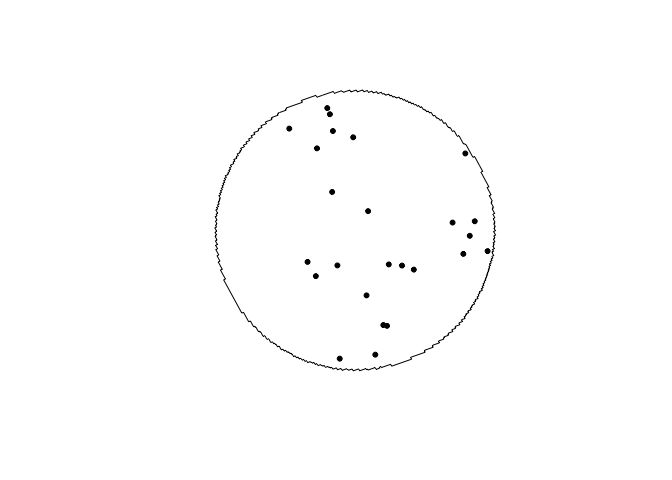
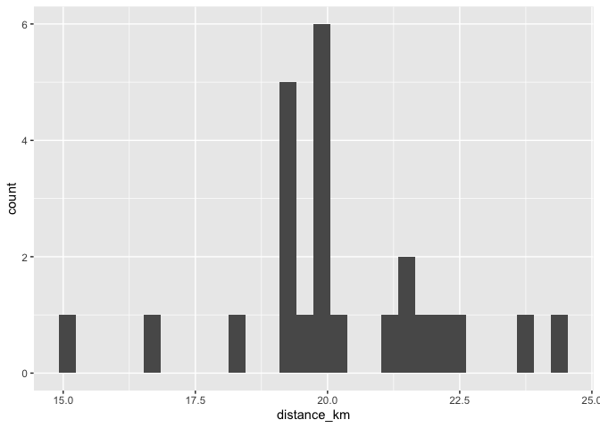
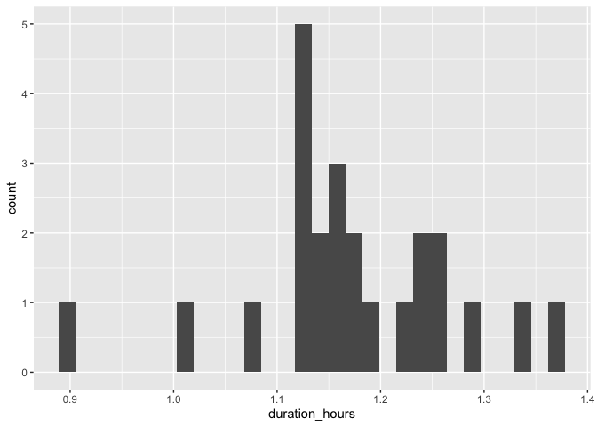
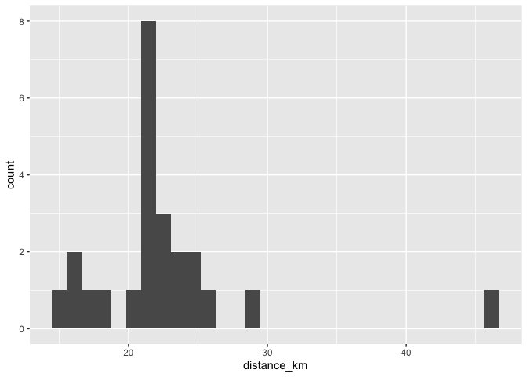
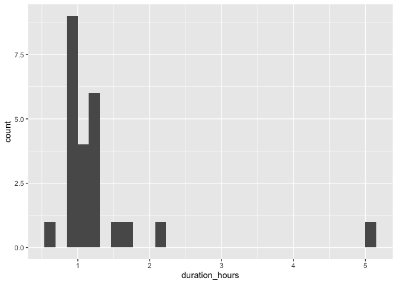
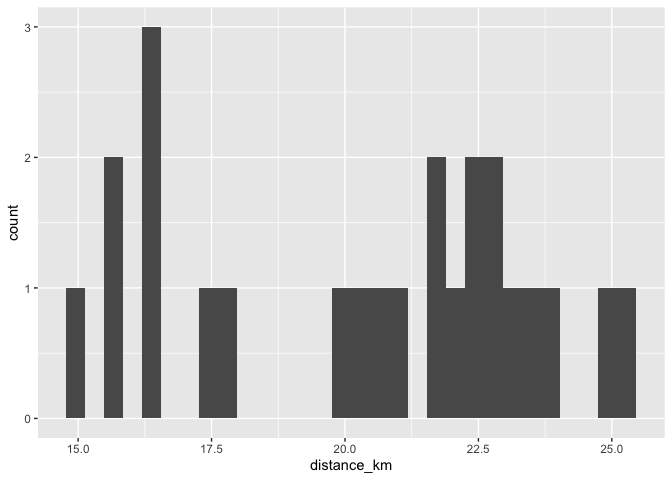
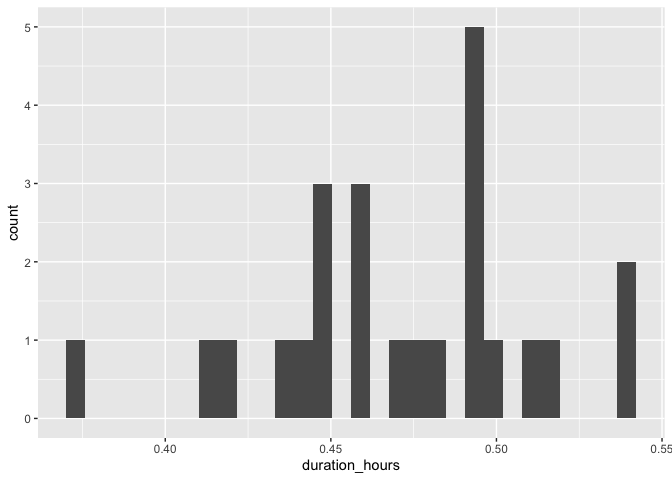
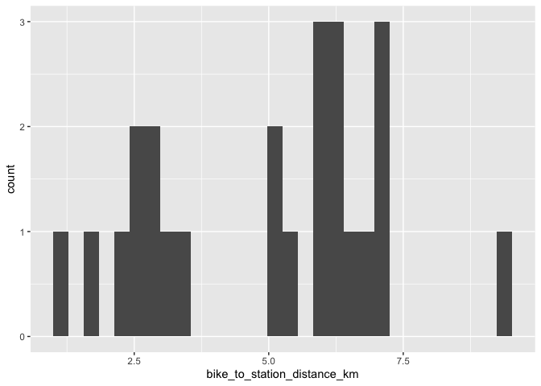
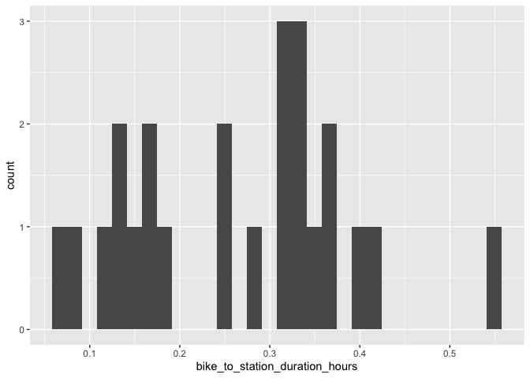

# Edmonton

## Heritage Valley Station

### Draw buffer and select points


```r
destination <- "Edmonton Public Library - Stanley A. Milner Library (Downtown), Edmonton, Canada"        #### EDIT ME
```

### Set origin point


```r
origin <- "Heritage Valley Station, Edmonton, Canada"    #### EDIT ME
```

#### Setup departure location and arrival time


```r
arrival_time <- as.POSIXct("2024-06-11 08:30:00", tz = "America/Calgary")       #### EDIT ME
```

```
## Warning in strptime(xx, f, tz = tz): unknown timezone 'America/Calgary'
```

```
## Warning in as.POSIXct.POSIXlt(x): unknown timezone 'America/Calgary'
```

```
## Warning in strptime(x, f, tz = tz): unknown timezone 'America/Calgary'
```

```
## Warning in as.POSIXct.POSIXlt(as.POSIXlt(x, tz, ...), tz, ...): unknown
## timezone 'America/Calgary'
```

#### List of variables for geocoding


```r
var_list <- c("var1", "var2", "var3", "var4", "var5", "var6", "var7", "var8", "var9", "var10", "var11", "var12", "var13", "var14", "var15", "var16", "var17", "var18", "var19", "var20", "var21", "var22", "var23", "var24")
```

#### Seed


```r
seed <- c(102)
```


```r
stations <- geocode(location = origin, output = "more", source = "google")
```

```
## ℹ <https://maps.googleapis.com/maps/api/geocode/json?address=Heritage+Valley+Station,+Edmonton,+Canada&key=xxx>
```

```r
stations_sf <- stations %>%
                st_as_sf(coords = c("lon", "lat"), crs = 4326)

stations_buffer = st_buffer(stations_sf, 5000)

stations_buffer <- as_sf(stations_buffer)
```

#### Interactive map view of buffers


```r
mapview(stations_buffer)
```

```{=html}
<div class="leaflet html-widget html-fill-item" id="htmlwidget-496c6cc2e85110ab64a2" style="width:672px;height:480px;"></div>
<script type="application/json" data-for="htmlwidget-496c6cc2e85110ab64a2">{"x":{"options":{"minZoom":1,"maxZoom":52,"crs":{"crsClass":"L.CRS.EPSG3857","code":null,"proj4def":null,"projectedBounds":null,"options":{}},"preferCanvas":false,"bounceAtZoomLimits":false,"maxBounds":[[[-90,-370]],[[90,370]]]},"calls":[{"method":"addProviderTiles","args":["CartoDB.Positron","CartoDB.Positron","CartoDB.Positron",{"errorTileUrl":"","noWrap":false,"detectRetina":false,"pane":"tilePane"}]},{"method":"addProviderTiles","args":["CartoDB.DarkMatter","CartoDB.DarkMatter","CartoDB.DarkMatter",{"errorTileUrl":"","noWrap":false,"detectRetina":false,"pane":"tilePane"}]},{"method":"addProviderTiles","args":["OpenStreetMap","OpenStreetMap","OpenStreetMap",{"errorTileUrl":"","noWrap":false,"detectRetina":false,"pane":"tilePane"}]},{"method":"addProviderTiles","args":["Esri.WorldImagery","Esri.WorldImagery","Esri.WorldImagery",{"errorTileUrl":"","noWrap":false,"detectRetina":false,"pane":"tilePane"}]},{"method":"addProviderTiles","args":["OpenTopoMap","OpenTopoMap","OpenTopoMap",{"errorTileUrl":"","noWrap":false,"detectRetina":false,"pane":"tilePane"}]},{"method":"createMapPane","args":["polygon",420]},{"method":"addPolygons","args":[[[[{"lng":[-113.6065044432798,-113.6074949949439,-113.6072206165043,-113.607715886455,-113.6074415084369,-113.609917821327,-113.6109083395222,-113.6106339355871,-113.6111291888033,-113.6108547852907,-113.6113500331228,-113.6123405258029,-113.6133310145035,-113.6143214992238,-113.6137726451876,-113.6147631083724,-113.6167440227983,-113.6161951353489,-113.6171855690364,-113.6181759987413,-113.6179015446828,-113.618396753654,-113.6181223000197,-113.6196079077955,-113.6205983079993,-113.6200493712931,-113.6210397499642,-113.6220301246505,-113.6214811720964,-113.6224715252509,-113.6234618744198,-113.6229214835041,-113.6229369574084,-113.6229283799209,-113.6239032336589,-113.6248935573105,-113.62434457307,-113.6253348751916,-113.6263251733261,-113.6257761732469,-113.6267664498524,-113.6277567224699,-113.6272077065552,-113.6281979576446,-113.6279234481346,-113.6284185677989,-113.6281440587154,-113.6286391729981,-113.6296293985716,-113.6290803685316,-113.630070572579,-113.6297960560073,-113.630291152151,-113.6300166360063,-113.6305117267687,-113.6315019053013,-113.6309528611422,-113.6319430181505,-113.6315312345091,-113.6317787698502,-113.6316415099459,-113.6323841111856,-113.6333742426803,-113.6328251844081,-113.6338152943803,-113.6332662378192,-113.63425632627,-113.6338445333289,-113.6340920515312,-113.633954788527,-113.6346973383506,-113.6344228093766,-113.634917836963,-113.634643308417,-113.6351383306235,-113.6361283720431,-113.6355793030901,-113.636569322991,-113.6360202557515,-113.6370102541348,-113.6364611886093,-113.6374511654759,-113.6369021016647,-113.6378920570155,-113.637342994919,-113.638332928755,-113.6377838683736,-113.6387737806958,-113.6382247220299,-113.6392146128391,-113.6386655558891,-113.6396554251864,-113.6391063699525,-113.6388318495489,-113.6393267695613,-113.6390522495866,-113.6395471642216,-113.639272644676,-113.6397675539337,-113.6394930348172,-113.6399879386977,-113.6395075341504,-113.6396312580487,-113.639562629756,-113.640428693382,-113.6398796625325,-113.6408694282759,-113.6403203991436,-113.6413101433808,-113.640761115966,-113.6403493580255,-113.6405967857988,-113.6404595344613,-113.641201813001,-113.6406528065349,-113.6416424902501,-113.6406817445596,-113.6409291572035,-113.640791911532,-113.6415341446841,-113.6409851608825,-113.6407792969141,-113.6409029992116,-113.6408343782161,-113.6412054839139,-113.6409309996529,-113.6414258019998,-113.6408768391433,-113.6418664233359,-113.641317462197,-113.6409057539599,-113.6411531417249,-113.6410159069547,-113.6417580654712,-113.6412091252756,-113.6409346623871,-113.6414294203546,-113.6411549578954,-113.6416497104893,-113.6411007912354,-113.64068911441,-113.6409364826744,-113.6407992583746,-113.6415413583902,-113.6409924600762,-113.6404778853639,-113.6405397248109,-113.6405054203623,-113.6414330091735,-113.6408841317978,-113.6403352736422,-113.6413246628393,-113.6407758064002,-113.6396781511771,-113.640667483883,-113.6401186675961,-113.6395698705256,-113.6390210926705,-113.6400103688912,-113.6394615927511,-113.6383640981122,-113.6378239531906,-113.6378394095105,-113.6378308359274,-113.6388045818548,-113.6382558650678,-113.6377071674919,-113.6371584891259,-113.6366098299693,-113.636061190021,-113.6370503007991,-113.6359530435326,-113.6337587594662,-113.6315647826436,-113.6293711130108,-113.6271777505137,-113.6262198545577,-113.6262027206517,-113.6261718207373,-113.6256406794771,-113.6250924235195,-113.6245441867526,-113.6239959691755,-113.6234477707873,-113.6224590583944,-113.6219108966854,-113.6208146308277,-113.6203202993833,-113.6200462492826,-113.6195519212216,-113.61927788029,-113.6187298128148,-113.6181817645231,-113.6176874573369,-113.6174134447572,-113.6169191409553,-113.6166451375439,-113.615549171851,-113.6145606050103,-113.6140126684249,-113.6134647510181,-113.6124762152093,-113.6113804729106,-113.6103919681363,-113.6098441432426,-113.6093498981213,-113.609075997238,-113.6085817555033,-113.6083078637865,-113.6077600947332,-113.606895192283,-113.6068267244127,-113.6067031669467,-113.6062239021553,-113.6056761889388,-113.6046877597915,-113.6041400832381,-113.6031516676428,-113.6026040277521,-113.6018627265904,-113.6017258228928,-113.6014787231066,-113.6010680224821,-113.6005738287315,-113.6003000386784,-113.5998058483171,-113.5995320674293,-113.5989845200285,-113.5979961625952,-113.5974486518539,-113.5964603079809,-113.5959128338987,-113.5949245035879,-113.5943770661641,-113.5933887494175,-113.5928413486514,-113.5918530454708,-113.5913056813619,-113.5903173917494,-113.5898232454705,-113.5895495837235,-113.5890554408372,-113.5887817882544,-113.587917043497,-113.5878486330135,-113.5877250980762,-113.5872462349872,-113.5862579685925,-113.5857107319491,-113.5842283512493,-113.5839547532354,-113.5834606287494,-113.5831870398993,-113.5821987967367,-113.5816516509025,-113.5806634213206,-113.5801693050603,-113.5798957524513,-113.5794016395868,-113.5791280961414,-113.5781398762253,-113.5775928212004,-113.5756164046257,-113.5750694037567,-113.5740812071016,-113.5730930065341,-113.572546059822,-113.5705696819627,-113.5700755850542,-113.56980214076,-113.5693080472508,-113.5690346121201,-113.5680464309237,-113.5670582458201,-113.5665114249318,-113.5655232534294,-113.5635468987105,-113.5630001494921,-113.5620119837865,-113.561023814179,-113.5600356406703,-113.5595415524532,-113.5592682156659,-113.5587741308516,-113.5585008032279,-113.5565244717359,-113.554548124654,-113.5540015538146,-113.5530133919439,-113.5520252261786,-113.5522984916907,-113.551804402969,-113.5513103132737,-113.5510370565196,-113.5500488829675,-113.5490607055232,-113.5480725241873,-113.5470843389606,-113.5460961498439,-113.5455497382802,-113.5415970130126,-113.5376442255757,-113.5356678085587,-113.5346795942282,-113.5352258130315,-113.5342375772926,-113.5332493376735,-113.5322610941747,-113.5312728467971,-113.5302845955415,-113.5292963404085,-113.528308081399,-113.5273198185136,-113.5277293899896,-113.5274823203752,-113.5276188454964,-113.5268776319123,-113.5249010516989,-113.5229244559913,-113.5233339760596,-113.5230868972187,-113.5232234052038,-113.5224821639407,-113.5214938388685,-113.5205055099251,-113.5195171771111,-113.519994906926,-113.5198713631336,-113.5199396111718,-113.518086442919,-113.5170980809555,-113.5173710508816,-113.5168768640633,-113.5171498343871,-113.5166556422159,-113.5156672549725,-113.5146788638616,-113.5149518170382,-113.5144576156463,-113.51473056922,-113.5132479460847,-113.5122595258286,-113.5128054034594,-113.5118169617899,-113.5108285162552,-113.5111014446972,-113.5106072160932,-113.5108801449314,-113.5103859109737,-113.5084089654832,-113.5089547936329,-113.5079662975406,-113.5069777975853,-113.5075236097641,-113.5055465631593,-113.5060923593639,-113.5051038127134,-113.5053767092136,-113.5048824300512,-113.5051553269461,-113.5046610424291,-113.5036724704994,-113.5040818050596,-113.5038346581818,-113.5039711043299,-113.5032296589564,-113.5022410617472,-113.5027868275713,-113.5017982089423,-113.5020710902505,-113.5015767750983,-113.5018496568005,-113.5013553362931,-113.5003666923836,-113.5009124437983,-113.4999237784671,-113.5001966525695,-113.4997023140659,-113.4999751885619,-113.4994808447026,-113.4984921540899,-113.4990378910888,-113.4980491790526,-113.4984584811872,-113.4982112992817,-113.498347734621,-113.4976061841637,-113.4978790518436,-113.4973846792745,-113.4976575473474,-113.497163169422,-113.4961744106777,-113.496720134826,-113.4957313546554,-113.4962770803745,-113.4952882787766,-113.4957998975498,-113.4957380962923,-113.49577220474,-113.49484518304,-113.4952544778901,-113.4950072682362,-113.4951437011474,-113.4944020674442,-113.494674930266,-113.4941805021987,-113.4944533654128,-113.4939589319879,-113.4942317955943,-113.4937373568116,-113.4940102208102,-113.4935157766698,-113.4937886410605,-113.4932941915621,-113.4935670563449,-113.4930726014885,-113.4933454666634,-113.4928510064487,-113.4931238720156,-113.4926294064427,-113.4929022724015,-113.4924078014702,-113.4926806678209,-113.492186191531,-113.4925954934398,-113.4923482516375,-113.4924846869016,-113.4917429567522,-113.4922204780642,-113.492096854239,-113.4921650724912,-113.4912997021049,-113.4918454435106,-113.4908564275877,-113.49140217056,-113.4904131331994,-113.4909588777378,-113.4899698189386,-113.4905155650427,-113.4909248871869,-113.4906776141921,-113.4908140562015,-113.4900722324734,-113.4906179992919,-113.4896288800285,-113.4901746484125,-113.4904475397859,-113.489952965519,-113.4902258572837,-113.4897312776559,-113.490277066756,-113.4892878870207,-113.4898336776862,-113.490106580201,-113.4896119756962,-113.4898848786024,-113.4893902687359,-113.4899360801194,-113.488946839904,-113.4894926528526,-113.4899702548953,-113.4898465954745,-113.4899148252601,-113.4890492057025,-113.4895950393709,-113.4898679633885,-113.4893733091217,-113.4896462335306,-113.489151573901,-113.4896974282908,-113.4899703626697,-113.4894756888811,-113.4897486236514,-113.4892539444996,-113.4897998196125,-113.4902092385201,-113.4899618908853,-113.4900983651498,-113.4893563174985,-113.4899022133361,-113.4904481283339,-113.4894586928977,-113.4900046094617,-113.4908235202358,-113.4903287790749,-113.4906017545152,-113.4901070079893,-113.4906529644442,-113.491198940063,-113.4914719350591,-113.490977165571,-113.491250160959,-113.4907553861051,-113.4913013824564,-113.4923934326582,-113.4914038272553,-113.4919498635083,-113.4924959189297,-113.4930419935203,-113.4935880872811,-113.4925984076101,-113.4936906174431,-113.4947829039658,-113.4958752671849,-113.4969677071073,-113.4959778827461,-113.4965241138693,-113.4970703641706,-113.4976166336508,-113.4981629223107,-113.4987092301514,-113.4992555571735,-113.4998019033779,-113.5003482687655,-113.5013382339647,-113.502431057505,-113.5035239577892,-113.5046169348241,-113.5051634521252,-113.5056584948913,-113.5059317651399,-113.5064268113363,-113.5067000907843,-113.507246664074,-113.5077932565558,-113.5083398682307,-113.5088864990994,-113.5098766678081,-113.510970022346,-113.5115167284096,-113.5125069460492,-113.5130536889179,-113.5136004509853,-113.5140955759523,-113.5143689685876,-113.5148640969827,-113.5151374988199,-113.516231154171,-113.5172214520567,-113.5177683261427,-113.5183152194322,-113.5193055486333,-113.5198524787342,-113.5203476506754,-113.5206211273295,-113.521116302697,-113.5213897885542,-113.5219367746737,-113.5228033523274,-113.5228717288685,-113.5229955257073,-113.5234741718244,-113.5240212139662,-113.5250116194913,-113.5255586984487,-113.5264253154836,-113.5264937036296,-113.526617506094,-113.5270962334466,-113.527591450396,-113.5278650198885,-113.5283602402618,-113.5286338189587,-113.5291809907618,-113.5301714549836,-113.5307186636054,-113.5317091415201,-113.5322563869612,-113.5332468785667,-113.5337941608278,-113.5347691895073,-113.5347777412158,-113.5347932178352,-113.535331985204,-113.5363070273567,-113.5363155796406,-113.5363310564738,-113.5368698600885,-113.5378603927552,-113.5384077854799,-113.5393983318299,-113.539945761377,-113.5409363214082,-113.5414837877785,-113.542474361489,-113.542969646873,-113.5432434004673,-113.5437386892705,-113.5440124520708,-113.5448792128155,-113.5449476561916,-113.5450714791848,-113.5455505931525,-113.5465411902893,-113.5470887847326,-113.5480793955414,-113.54882235107,-113.5489592603844,-113.549206912836,-113.5496176512888,-113.5506082718376,-113.5511559575301,-113.5531372220286,-113.553684962144,-113.5546756060903,-113.5556662461021,-113.5562140406395,-113.5581953440458,-113.5587431930041,-113.5597338563953,-113.5607245158474,-113.5612724192256,-113.5632537614944,-113.5642434592717,-113.5642439943945,-113.5642449618391,-113.5647924021048,-113.5657830809747,-113.5667737559004,-113.5677334684727,-113.5677505946454,-113.567781553071,-113.5683124742758,-113.5702938395763,-113.5717798531887,-113.572053914879,-113.5725492551721,-113.5728233260687,-113.5738140124855,-113.5748046949513,-113.5757953734655,-113.5767860480273,-113.5773342745911,-113.5793156470208,-113.5812970036288,-113.5832783444093,-113.5852596693561,-113.58625032589,-113.5867987299224,-113.5877894000729,-113.5887800662613,-113.5897707284868,-113.5907613867486,-113.5917520410461,-113.5927426913784,-113.5937333377448,-113.5947239801446,-113.594244002541,-113.5943678306401,-113.5942992633393,-113.5951660563757,-113.5971472861946,-113.5991285001378,-113.6011096981992,-113.603090880373,-113.6028165362175,-113.6033118248865,-113.6030374811516,-113.6035327644362,-113.6045233280252,-113.60551388764,-113.6065044432798],"lat":[53.44869179363063,53.44848468559812,53.44818433284316,53.44808077724856,53.44778042682438,53.44726262337135,53.44705548557394,53.44675514911865,53.44665157864203,53.44635124451754,53.44624767363562,53.44604052483662,53.4458333666575,53.44562619909829,53.4450255591804,53.4448183900012,53.44440402350396,53.44380340842968,53.44359621887231,53.44338901993578,53.44308872074529,53.44298511970006,53.44268482284043,53.44237401145717,53.442166792145,53.4415662190001,53.44135899807066,53.44115176776302,53.4405512117031,53.44034397977887,53.44013673847685,53.43954558291172,53.43954234481136,53.43953296140378,53.43932895658435,53.43912170428906,53.43852118240016,53.43831392848966,53.43810666520221,53.43750616039937,53.43729889549739,53.43709162121888,53.43649113350245,53.43628385761009,53.43598361821874,53.43587997869717,53.43557974163689,53.43547610171198,53.43526881483036,53.43466835352497,53.43446106503053,53.43416083884481,53.43405719302255,53.43375696916793,53.4336533229426,53.43344602346068,53.43284558856698,53.43263828747328,53.43218796815003,53.43213614286739,53.4319860371067,53.43183055919899,53.43162324711959,53.43102283863826,53.43081552494808,53.43021512579153,53.43000781049092,53.42955751797076,53.42950568913661,53.42935559231032,53.42920010374854,53.42889991329997,53.42879625327053,53.42849606515321,53.42839240472139,53.42818507682815,53.42758471340989,53.42737738390759,53.42677702981452,53.42656969870348,53.42596935393568,53.42576202121625,53.42516168577386,53.42495435144637,53.42435402532946,53.42414668939425,53.42354637260293,53.42333903506036,53.42273872759472,53.42253138844511,53.42193109030529,53.42172374954898,53.42112346073504,53.42082331691406,53.42071964884477,53.42041950735529,53.42031583888445,53.4200156997265,53.41991203085416,53.41961189402775,53.41950822475394,53.41898298964439,53.41895707280906,53.41888203944097,53.41870061834396,53.41810035907134,53.41789301965495,53.41729276970874,53.41708542868736,53.41648518806767,53.41603500862898,53.41598317530624,53.415833116174,53.41567761414855,53.41507738441917,53.41487004795182,53.41381966327383,53.41376783108964,53.41361777701186,53.41346227840233,53.41286206889098,53.4126369907276,53.41261107511465,53.41253604923037,53.41245830187731,53.41215820004016,53.41205453679456,53.41145433817513,53.41124701242206,53.41064682312998,53.41019668218809,53.41014485268246,53.40999480638263,53.40983931580929,53.40923913741002,53.4089390487975,53.40883539131031,53.40853530502973,53.40843164714192,53.40783147963613,53.4073813550346,53.40732952860856,53.40717948775561,53.40702400642135,53.40642384980976,53.40586120440926,53.40584824833352,53.40581073871944,53.40561639364905,53.40501624793234,53.4044161037828,53.40420880882647,53.40360867400532,53.40240840906637,53.40220112803016,53.4016010056734,53.40100088488516,53.40040076566582,53.40019349854894,53.39959338865863,53.39839317358648,53.39780244503677,53.39779920689686,53.39778983026738,53.39758582296633,53.39698572711469,53.39638563283366,53.3957855401236,53.39518544898491,53.39458535941794,53.39437814341272,53.39317798451093,53.39077768558143,53.3883774118373,53.38597716330258,53.38357694000128,53.38377754540993,53.38375879353006,53.38376526451856,53.38318395677317,53.38258389871957,53.38198384224558,53.38138378735157,53.38078373403793,53.38099076232805,53.38039070284371,53.37919058861952,53.37929408763108,53.37899405812612,53.37909755286223,53.37879752181533,53.37819746090865,53.37759740158511,53.37770088429611,53.37740085329079,53.37750433172678,53.37720429918012,53.37600417295437,53.37621110344165,53.37561103495775,53.37501096805939,53.375217873701,53.3740177291679,53.37422460996589,53.37362453233295,53.37372796535281,53.37342792519512,53.37353135394122,53.37323131224402,53.37263123004083,53.37281221455648,53.37273720354561,53.37276305777112,53.37223798054315,53.37163789377255,53.37184470779644,53.37124461487099,53.37145141180261,53.37085131272349,53.37100639847989,53.37085637250676,53.37090806610647,53.37045798733195,53.370561369875,53.37026131592025,53.37036469419071,53.37006463869824,53.36946452890751,53.36967126682428,53.36907115088405,53.36927787171197,53.3686777496234,53.36888445336318,53.36828432512747,53.36849101177983,53.36789087739814,53.3680975469638,53.36749740643733,53.367704058917,53.36780738165204,53.36750730618265,53.36761062464636,53.36731054764131,53.36749134594484,53.36741632590952,53.36744215353356,53.36691701313864,53.36712362210276,53.36652345541088,53.36683333972702,53.36653325117714,53.36663653934203,53.36633644925751,53.36654301470964,53.36594282800307,53.36614937637319,53.36625264705376,53.36595254849813,53.36605581490836,53.3657557148188,53.36596223676248,53.36536203004834,53.36577503042992,53.36517480984736,53.36538128828617,53.36558775738003,53.36498752293159,53.36540041761738,53.3655036354483,53.3652035091587,53.36530672272018,53.36500659489838,53.36521301114652,53.36541941804985,53.36481914814518,53.36502553797195,53.36543828959142,53.36483799809828,53.36504435216018,53.36525069687742,53.36545703224996,53.36556019643194,53.36526003776,53.36536319767337,53.3650630374709,53.36547564603333,53.36588821721673,53.36528786710303,53.36549413094942,53.36570038545108,53.36600056803459,53.36610369371298,53.36620681705513,53.36590663060795,53.36611286641991,53.36631909288693,53.36652531000891,53.36673151778578,53.36693771621746,53.36633730589866,53.36716197527124,53.36798649511893,53.3683986989694,53.36860478687603,53.36920528216162,53.36941136844506,53.36961744538233,53.36982351297334,53.37002957121801,53.37023562011627,53.37044165966805,53.37064768987325,53.37085371073183,53.37130412958714,53.37135563478903,53.37150577509203,53.37166028864025,53.37207229906432,53.37248427209955,53.37293472111877,53.3729862165667,53.3731363669244,53.37329085121033,53.37349682207898,53.37370278359985,53.37390873577286,53.37443428815047,53.3744600323591,53.37453511149192,53.37492125890248,53.37512719074989,53.37542751862976,53.37553048297741,53.37583081319147,53.37593377713159,53.37613969800023,53.37634560952003,53.37664594978651,53.37674890397004,53.37704924657069,53.37735810088595,53.37756399207613,53.37816469778592,53.37837058734406,53.37857646755244,53.37887682873189,53.37897976725917,53.37928013077275,53.3793830688918,53.37979479799252,53.38039554552662,53.38060140376811,53.38080725265894,53.38140801724596,53.38181970240768,53.38242048404726,53.38262632031746,53.38292671560284,53.38302963216015,53.38333002977954,53.38343294592795,53.38363877121088,53.38408937707985,53.38414083338608,53.38429103602716,53.38444540288548,53.38465121718001,53.38525204225957,53.38545785491729,53.38575827192248,53.38586117667297,53.3861615960121,53.38626450035326,53.38647030202083,53.38707115348748,53.38727695351722,53.38757738371585,53.387680282152,53.38798071468451,53.38808361271109,53.38828940174887,53.38889027960197,53.38909606700092,53.38954673224043,53.38959817907515,53.38974840150637,53.38990273994921,53.39020318800863,53.3903060793093,53.39060652970254,53.3907094205933,53.39091519535865,53.39151610893276,53.3917218820579,53.39232280496714,53.39252857645173,53.39309195038327,53.39310481124246,53.39314236958532,53.39333527853971,53.39378598457221,53.3938374270178,53.39398766304665,53.39414198832137,53.39444246357588,53.3945453460972,53.3948458236854,53.39494870579628,53.39524918571816,53.39535206741858,53.39565254967412,53.39575543096402,53.39605591555321,53.39615879643254,53.39645928335538,53.39656216382411,53.39686265308058,53.39696553313865,53.39726602472874,53.39736890437613,53.39766939829982,53.39777227753648,53.39807277379376,53.39817565261964,53.39862640065773,53.39867784063988,53.39882809067052,53.39898240855419,53.39950828952127,53.39953400950058,53.39960913557477,53.39978917217934,53.40039018843417,53.40059594349464,53.40119696908346,53.40140272249965,53.40200375742237,53.40220950919394,53.40281055345044,53.40326133770506,53.40331277756081,53.40346303966351,53.40361735716724,53.40421841237595,53.40442416857232,53.40502523311451,53.40532576599239,53.40542864636671,53.40572918157793,53.40583206154079,53.4064331370343,53.40663889765438,53.40723998248104,53.40754052550096,53.40764340808698,53.40794395344014,53.40804683561453,53.40864793139163,53.40885369643434,53.40945480154427,53.40998076984184,53.41000649162226,53.41008163017209,53.41026167938268,53.41086279544215,53.41116335407806,53.41126624190965,53.41156680287868,53.4116696902984,53.41227081730671,53.41257138141685,53.41267427228283,53.41297483872604,53.41307772918006,53.41367886713651,53.414129721664,53.41418116938912,53.41433145491582,53.41448579602621,53.41508694493012,53.41568809544899,53.4158938908354,53.41649505068607,53.41739679348915,53.41749969731676,53.41780028098756,53.41790318440296,53.41850435681373,53.41910553083813,53.41940611845533,53.4195090291763,53.4198096191263,53.41991252943499,53.42051371440382,53.42171608917945,53.42192192592616,53.42252312345104,53.42312432258785,53.42372552333619,53.42432672569572,53.42453258395005,53.42573500894068,53.4269374403726,53.42813987824281,53.42934232254832,53.42954823319576,53.43014946548233,53.43075069937687,53.43135193487901,53.43195317198837,53.43255441070458,53.43315565102725,53.43375689295601,53.4343581364905,53.43415216406337,53.43535464050041,53.43655712335478,53.43775961262346,53.43836085966223,53.43825784289717,53.43855846508608,53.43845544404569,53.43875606470365,53.43935730722087,53.43995855133954,53.44055979705927,53.44116104437968,53.44095496049713,53.4421574444834,53.44275868887567,53.44255257243252,53.44315381069521,53.44375505055616,53.44365198108922,53.44395259968664,53.44384952594287,53.44415014300734,53.44535261525787,53.44514644141207,53.4457476722019,53.44634890458759,53.44614270590164,53.44674393215166,53.44664082542582,53.44694143721603,53.44683832621244,53.44713893646831,53.44774015817565,53.44755969812864,53.4476348501084,53.44760906939462,53.44813513310432,53.44873635026614,53.44853008478063,53.44913129580193,53.44895079904055,53.44902594968429,53.44900016372555,53.44952621808226,53.44942306939795,53.44972367050103,53.44962051753797,53.44992111710522,53.45052231743282,53.45031599286892,53.45091718705181,53.45071084537145,53.45131203340847,53.4511056746109,53.45170685650086,53.4515037052812,53.45151309864184,53.45150987394412,53.45210165632709,53.45189848825628,53.45190788152082,53.45190465655563,53.45249643288525,53.45229002273175,53.45289118617345,53.45268475889985,53.45328591618977,53.45307947179536,53.4536806229323,53.45347416141635,53.45337092713991,53.45367149749831,53.45356825894132,53.45386882776093,53.45368815125573,53.45376329267593,53.45373748103926,53.45426347082721,53.45405696568307,53.45465809061326,53.45445156834522,53.45429667048658,53.45444694857967,53.4543953143034,53.45484614772451,53.45463959894864,53.45524070381906,53.45482756263289,53.45542865359924,53.45522206118804,53.45501545939342,53.45561653645318,53.45520328922563,53.4558043523763,53.45559770694248,53.45539105212499,53.45599210136404,53.45557874808691,53.45537225922376,53.455372846164,53.45537264431301,53.45597308495126,53.45576637710683,53.4555596598786,53.4553593936153,53.45537817503382,53.45537171467759,53.45595393918018,53.45554044230963,53.45523029502434,53.45553078501244,53.45542739595497,53.45572788439944,53.45552109537213,53.45531429696103,53.45510748916622,53.45490067198777,53.45550161905818,53.45508794104958,53.45467422550632,53.45426047242901,53.45384668181828,53.45363977243809,53.45424065131528,53.45403372479886,53.45382678889914,53.45361984361617,53.45341288895006,53.45320592490087,53.45299895146868,53.45279196865356,53.45258497645561,53.45205926163049,53.45203338779422,53.45195828589553,53.45177716578511,53.45136314998692,53.45094909665966,53.45053500580396,53.45012087742045,53.44982050448832,53.44971696846813,53.44941659786677,53.4493130614405,53.4491059815519,53.44889889228191,53.44869179363063]}]]],null,"stations_buffer",{"crs":{"crsClass":"L.CRS.EPSG3857","code":null,"proj4def":null,"projectedBounds":null,"options":{}},"pane":"polygon","stroke":true,"color":"#333333","weight":0.5,"opacity":0.9,"fill":true,"fillColor":"#6666FF","fillOpacity":0.6,"smoothFactor":1,"noClip":false},"<div class='scrollableContainer'><table class=mapview-popup id='popup'><tr class='coord'><td><\/td><th><b>Feature ID&emsp;<\/b><\/th><td>1&emsp;<\/td><\/tr><tr><td>1<\/td><th>type&emsp;<\/th><td>neighborhood&emsp;<\/td><\/tr><tr><td>2<\/td><th>loctype&emsp;<\/th><td>approximate&emsp;<\/td><\/tr><tr><td>3<\/td><th>address&emsp;<\/th><td>heritage valley, edmonton, ab t6w, canada&emsp;<\/td><\/tr><tr><td>4<\/td><th>north&emsp;<\/th><td>53.42491&emsp;<\/td><\/tr><tr><td>5<\/td><th>south&emsp;<\/th><td>53.39561&emsp;<\/td><\/tr><tr><td>6<\/td><th>east&emsp;<\/th><td>-113.4937&emsp;<\/td><\/tr><tr><td>7<\/td><th>west&emsp;<\/th><td>-113.6085&emsp;<\/td><\/tr><tr><td>8<\/td><th>geometry&emsp;<\/th><td>sfc_POLYGON&emsp;<\/td><\/tr><\/table><\/div>",{"maxWidth":800,"minWidth":50,"autoPan":true,"keepInView":false,"closeButton":true,"closeOnClick":true,"className":""},"1",{"interactive":false,"permanent":false,"direction":"auto","opacity":1,"offset":[0,0],"textsize":"10px","textOnly":false,"className":"","sticky":true},{"stroke":true,"weight":1,"opacity":0.9,"fillOpacity":0.84,"bringToFront":false,"sendToBack":false}]},{"method":"addScaleBar","args":[{"maxWidth":100,"metric":true,"imperial":true,"updateWhenIdle":true,"position":"bottomleft"}]},{"method":"addHomeButton","args":[-113.6418664233359,53.36481914814518,-113.488946839904,53.45599210136404,true,"stations_buffer","Zoom to stations_buffer","<strong> stations_buffer <\/strong>","bottomright"]},{"method":"addLayersControl","args":[["CartoDB.Positron","CartoDB.DarkMatter","OpenStreetMap","Esri.WorldImagery","OpenTopoMap"],"stations_buffer",{"collapsed":true,"autoZIndex":true,"position":"topleft"}]},{"method":"addLegend","args":[{"colors":["#6666FF"],"labels":["stations_buffer"],"na_color":null,"na_label":"NA","opacity":1,"position":"topright","type":"factor","title":"","extra":null,"layerId":null,"className":"info legend","group":"stations_buffer"}]}],"limits":{"lat":[53.36481914814518,53.45599210136404],"lng":[-113.6418664233359,-113.488946839904]},"fitBounds":[53.36481914814518,-113.6418664233359,53.45599210136404,-113.488946839904,[]]},"evals":[],"jsHooks":{"render":[{"code":"function(el, x, data) {\n  return (\n      function(el, x, data) {\n      // get the leaflet map\n      var map = this; //HTMLWidgets.find('#' + el.id);\n      // we need a new div element because we have to handle\n      // the mouseover output separately\n      // debugger;\n      function addElement () {\n      // generate new div Element\n      var newDiv = $(document.createElement('div'));\n      // append at end of leaflet htmlwidget container\n      $(el).append(newDiv);\n      //provide ID and style\n      newDiv.addClass('lnlt');\n      newDiv.css({\n      'position': 'relative',\n      'bottomleft':  '0px',\n      'background-color': 'rgba(255, 255, 255, 0.7)',\n      'box-shadow': '0 0 2px #bbb',\n      'background-clip': 'padding-box',\n      'margin': '0',\n      'padding-left': '5px',\n      'color': '#333',\n      'font': '9px/1.5 \"Helvetica Neue\", Arial, Helvetica, sans-serif',\n      'z-index': '700',\n      });\n      return newDiv;\n      }\n\n\n      // check for already existing lnlt class to not duplicate\n      var lnlt = $(el).find('.lnlt');\n\n      if(!lnlt.length) {\n      lnlt = addElement();\n\n      // grab the special div we generated in the beginning\n      // and put the mousmove output there\n\n      map.on('mousemove', function (e) {\n      if (e.originalEvent.ctrlKey) {\n      if (document.querySelector('.lnlt') === null) lnlt = addElement();\n      lnlt.text(\n                           ' lon: ' + (e.latlng.lng).toFixed(5) +\n                           ' | lat: ' + (e.latlng.lat).toFixed(5) +\n                           ' | zoom: ' + map.getZoom() +\n                           ' | x: ' + L.CRS.EPSG3857.project(e.latlng).x.toFixed(0) +\n                           ' | y: ' + L.CRS.EPSG3857.project(e.latlng).y.toFixed(0) +\n                           ' | epsg: 3857 ' +\n                           ' | proj4: +proj=merc +a=6378137 +b=6378137 +lat_ts=0.0 +lon_0=0.0 +x_0=0.0 +y_0=0 +k=1.0 +units=m +nadgrids=@null +no_defs ');\n      } else {\n      if (document.querySelector('.lnlt') === null) lnlt = addElement();\n      lnlt.text(\n                      ' lon: ' + (e.latlng.lng).toFixed(5) +\n                      ' | lat: ' + (e.latlng.lat).toFixed(5) +\n                      ' | zoom: ' + map.getZoom() + ' ');\n      }\n      });\n\n      // remove the lnlt div when mouse leaves map\n      map.on('mouseout', function (e) {\n      var strip = document.querySelector('.lnlt');\n      if( strip !==null) strip.remove();\n      });\n\n      };\n\n      //$(el).keypress(67, function(e) {\n      map.on('preclick', function(e) {\n      if (e.originalEvent.ctrlKey) {\n      if (document.querySelector('.lnlt') === null) lnlt = addElement();\n      lnlt.text(\n                      ' lon: ' + (e.latlng.lng).toFixed(5) +\n                      ' | lat: ' + (e.latlng.lat).toFixed(5) +\n                      ' | zoom: ' + map.getZoom() + ' ');\n      var txt = document.querySelector('.lnlt').textContent;\n      console.log(txt);\n      //txt.innerText.focus();\n      //txt.select();\n      setClipboardText('\"' + txt + '\"');\n      }\n      });\n\n      }\n      ).call(this.getMap(), el, x, data);\n}","data":null},{"code":"function(el, x, data) {\n  return (function(el,x,data){\n           var map = this;\n\n           map.on('keypress', function(e) {\n               console.log(e.originalEvent.code);\n               var key = e.originalEvent.code;\n               if (key === 'KeyE') {\n                   var bb = this.getBounds();\n                   var txt = JSON.stringify(bb);\n                   console.log(txt);\n\n                   setClipboardText('\\'' + txt + '\\'');\n               }\n           })\n        }).call(this.getMap(), el, x, data);\n}","data":null}]}}</script>
```

#### Generate points within buffer


```r
set.seed(seed)
points_sample_sf <- st_sample(stations_buffer, size = c(25,25), type = "random")
```

```
## Warning in st_poly_sample(x, size = size, ..., type = type, by_polygon =
## by_polygon, : coordinate ranges not computed along great circles; install
## package lwgeom to get rid of this warning
```

```r
points_sample_sf <- st_as_sf(points_sample_sf)
points_sample <- sf_to_df(points_sample_sf)
```

#### Check to see if they worked


```r
check_buffer <- stations_buffer %>% slice(1:2)

plot(st_geometry(check_buffer))
plot(points_sample_sf, pch = 20, add= TRUE)
```

<!-- -->


```r
points_sample$destination <- destination
points_sample$origin <- origin
points_sample$lat_lon <- paste(points_sample$lat, points_sample$lon)
```

#### Checking points and general mapping


```r
lst_directions <- apply(points_sample, 1, function(x){
  res <- google_directions(
    origin = x[['lat_lon']], 
    destination = x[['destination']]    
  )
df_result <- data.frame(
    origin = x[['lat_lon']], 
    destination = x[['destination']], 
    route = res$routes$overview_polyline$points 
)
return(df_result)
})

df_directions <- do.call(rbind, lst_directions)

google_map() %>%
  add_polylines(data = df_directions, polyline = "route") 
```

```{=html}
<div class="google_map html-widget html-fill-item" id="htmlwidget-ab1ec16d8342ee61bd02" style="width:672px;height:480px;"></div>
<script type="application/json" data-for="htmlwidget-ab1ec16d8342ee61bd02">{"x":{"lat":0,"lng":0,"zoom":1,"min_zoom":null,"max_zoom":null,"mapBounds":{"west":-180,"south":-90,"east":180,"north":90},"styles":null,"search_box":false,"update_map_view":true,"zoomControl":true,"mapType":"roadmap","mapTypeControl":true,"scaleControl":false,"streetViewControl":true,"rotateControl":true,"fullscreenControl":true,"event_return_type":"list","split_view":null,"split_view_options":{"heading":34,"pitch":10},"geolocation":false,"calls":[{"functions":"add_polylines","args":[[{"id":1,"geodesic":true,"stroke_colour":"#0000FF","stroke_weight":2,"stroke_opacity":0.6,"z_index":3,"polyline":["guvdIbmbtTtIEnCA?s@?sD?wS?yQ@sR?yb@?kHkL?sD@s_@@sc@B{O@mKAwLAcHBoOC}IBuEDoCBS@u@OAgVEyz@DuFHkJGsLA}@UaLOqDCyBC{@ImJGyO@oSFYJ{ARcARm@`@c@XQVGJ@b@HZTV`@Pb@Lv@Dz@Cp@Ij@Sn@OXOPWRSFi@@a@IMEc@WyAoA}@y@qAwAiC}CwAmBMBIKYa@e@q@{AsBmF{GuCgDyBaCoBqBwCsCqCeCqBcBsCyBqCsBiH{EcQgL{MyIuCcB{BeAkCeAkCaAgBm@cDeAmCs@m@O{AYkC]iCS}BIsKKgBGeAA_CCoBAeII_AA]?O?WQA?SAsBK}AMyAScB[wBg@sBk@qKsCaKmCoCs@}@QiAMu@EuBCs@@eBL}ARoAZuAb@wAj@kDbBuJvEqAf@iB^SB{@FaAB_EEgMMuSO{E?kFAcHCgHKiJ_@oEQeEKcBIwB@mLDqI?mG?cACcKFmB@iBAyB@oE?eMAoJEwOC_B@_CCyAF{AAyB?eF@kE?iCEyC@{H@sIC{DE_EEiD?gH@cFCkEAcOBkK@wA@SAM@k@N]N[Ru@l@wAbBuAvAe@?OEMMQe@?qH?cDAe\\}KFqGAuB@iBAcB@qACqD@{G?}DM{DG}DD{D?sD?cEI_EC}A?_E?iAHO?UNiA@aBBSCa@@{C?kC?iIIcJ?}O@_HAiC?WCYK}DsBeA]_@G{@Ia@?y@DgBZaB\\gBRgACw@Ua@Mq@Ue@Ya@]{DwDgBgB{@w@[K]As@F{@Tm@Tw@XgA^_AXaAb@i@X]V]^o@rA]tAeAvEeB~HKZU|AI~@Cr@@xABp@f@tD|@zHJbA?r@Kz@Wj@_@V]AKF]c@MWIm@Cu@?eC?cBEi@Ik@Qk@wAyDSU_@Gk@HsB\\iBRKKaBL}@J_AJ?VDdCJpEc@DeAJgAJc@BASMeIGiC"]},{"id":2,"geodesic":true,"stroke_colour":"#0000FF","stroke_weight":2,"stroke_opacity":0.6,"z_index":3,"polyline":["}rdeIp}ctT_C@@qC@iAmCLkBAwIIgBD}B?qG?gDB_CBmEAmK?sBKe@EkC?sDDYWKSMi@Iq@Ig@?wE@aH?}O?sF@mHCaNAyBAmDQqCMwAWoAcAsDc@wAkAwEe@yBcAqEa@kBu@}DOuACu@EmCFyAHgAPsAXqAdFmTpBaIj@sCRwABYCYCgB?sB?eCI]IMI?sADyAFuATwAd@w@`@_Aj@yK`K_GlFm@d@}Az@yBv@uALk@B_BA}G?cHEgKGwJByQKsCC}JBwE@mCCaG?gA?aAR}@f@k@\\cEjFyA~AWP}@\\y@PaAJyABy@CeBDkACa@AuAC{@CyA@gFB{KIcDAqM@_a@?_H?cE?g@Eq@C{@Ba@?oDGwB@sB?sAA[C]Gs@YcAy@c@i@Wa@_@w@cAmCeA_DgA{D_@{Ae@aDc@aDm@uDU}@aAuB{D{FSWa@i@[u@Qa@Qk@YmBGy@IiHCaBq@yLSwAa@_C_@wAQy@a@}BQqAKyA?]GO?yB@eL@_TC_P?qJ}A?}DF{DCcFA}FEkE?{GB_B@{DDgC@iAEgA@UM_B?{DE}DAcCBcC?qBAyA?wAASKGOOaAE{@c@_NYaKM_C]gCYmAw@aCO_@_@k@[e@gB}B}@{@u@g@k@a@[Sa@Ow@Yo@UuAe@gIuD_@Iw@@aB@Y_E]gBg@wA}@_Ck@eAg@m@k@g@g@[gAa@cAIqCBgABoAAq@IyAGMJU@yAHoCCqDG{A@kBBq@@}@B?gB?wCE}@O_@OI[GkGCcBA_LB[}N]}Q"]},{"id":3,"geodesic":true,"stroke_colour":"#0000FF","stroke_weight":2,"stroke_opacity":0.6,"z_index":3,"polyline":["crzdI|vctTe\\B{FA{AAOACCII@{Q?{Q@__@AgOEg`@Gw`@GotAPkMAeEIsJUaLOqDCyBG{DGeMEaI@oSFY@_@RcBTy@R]TUXQVGJ@b@HZTV`@Pb@Lv@Dz@Cp@Ih@Sp@Yf@SPMDa@Hc@Ac@Mo@]uBmBi@i@yBeCeDiEMBIKYa@Ya@e@q@g@o@gBaCeC}CeCwCwFeG}B{ByDmD{E}D{DuCuBwAkGcEsQsL{FuDgBkAwCgByBgAiCeA{FuB}Bu@oDcAw@SoAW{B[gCWcCMeKKuBCoAG_CAeFEmIIO?WQA?m@CaCOiBSkBYuBe@sFyAgMiD}I_Cu@QmAQgAKkACkA?sADcBPcAR}A`@kBp@yCvAcGvCkEpBg@PiB^oAJaABqCCcCCeCC_PQcHCeDCsB@iE?yAAkCA_CAsEIoHWwDO_GSoDMeOF_S?cAC{E@uGFiBAyB@sK@_PIeJAcJ?_CCyAF{AAyB?cC@oE@gFGyH@oJ?wCCkLK}DBmKCuJAcSB{EBSAM@k@Ny@b@u@l@wAbBuAvAe@?OEMMQe@?qF?kD?kWAqEi@@cGBgF?qD?gE?cB@qACcJ@iB?}DM{DG}DDoJ?cEI_EC}A?_E?iAHO?UNiA@aBBSCa@@qA?}CAeEC{DCwD@qIAoF@qPAWCYK}DsBeA]_@G{@Ia@?y@DuAVsAVkAR{@HgACyAc@q@Ue@YaB}A_HwG[K]As@F{@Tm@Tw@XgCx@eAd@e@V]V]^Yh@c@jAs@`DcArEoApFU|AI~@EnAFnBfAhId@nEBZ?r@Kz@Wj@_@V]AKF]c@MWIm@Cu@?iFEi@Ik@Qk@wAyDSUQEU?wCd@iBRKKaBL}@J_AJ?VDdCJpEc@DeAJgAJc@BASMeIGiC"]},{"id":4,"geodesic":true,"stroke_colour":"#0000FF","stroke_weight":2,"stroke_opacity":0.6,"z_index":3,"polyline":["s_eeIrcftTcFD}C?MMOBCFADeBAqABkB@_KCeIBgAVo@^m@h@e@n@uCxDwDnFcA`BiArCo@lAq@n@YTm@Xc@JQBs@Cm@Qi@[i@a@q@o@SUgCpMoBrJqApHGVG@OHo@~@QXaAOkBYaE_Ac@GsA[u@O{DiBm@Wg@[cCeBoEgDaDcC{GcG{A_BuBgC{@cAm@w@}B}ByAeAiA{@oC{AoAm@uCsAwAw@mCeBuBuAaAw@yDqC}@o@m@k@]]wAeB{BuC_Ao@]_@y@q@[YeCeB}@k@{A{@uAy@iAs@_@Ci@UaAi@{BuAaGwEsB{Aa@YeAg@gAScAGo@@g@Fu@Ru@ZmAr@_DvBkAl@cA`@wAZcANmBDsH@QSW@a@@w@?yDDgLAaGA_@?g@G_BC{AA}@?aDAkEC_BE_AI}@Ok@OkAc@m@[WQM_@Y[w@aA{@sAeAqBuBiEaAkBw@iAy@}@qBaBm@i@a@c@Yc@a@}@I[Ma@K{@KeB@uCEk@\\wGPoFDqDFwJ?wBOoIa@uJe@mH_@gDq@aFi@eDq@aDe@qB}AuFkA}DU{@UqAMkAIuB@}@FgARcB^mBtBwHfB_GvAsELc@KWe@wAgA{D_@{Ae@aDc@aDm@uDU}@aAuB{D{FSWa@i@[u@Qa@Qk@YmBGy@IiHCaBq@yLSwAa@_C_@wAQy@a@}BQqAKyA?]GO?yB@eL@_TC_P?qJ}A?}DF{DCcFA}FEkE?{GB_B@{DDgC@iAEgA@UM_B?{DE}DAcCBcC?qBAyA?wAASKGOOaAE{@c@_NYaKM_C]gCYmAw@aCO_@_@k@[e@gB}B}@{@u@g@k@a@[Sa@Ow@Yo@UuAe@gIuD_@Iw@@aB@Y_E]gBg@wA}@_Ck@eAg@m@k@g@g@[gAa@cAIqCBgABoAAq@IyAGMJU@yAHoCCqDG{A@kBBq@@}@B?gB?wCE}@O_@OI[GkGCcBA_LB[}NUsMGiC"]},{"id":5,"geodesic":true,"stroke_colour":"#0000FF","stroke_weight":2,"stroke_opacity":0.6,"z_index":3,"polyline":["su|dI~whtTlItOhAhBf@d@v@b@VH`@H`AB|@CfACjBE?yBAwB?qFAk\\AyQ?wEKyHAcLCqf@Fu@BkFCkRA_Z@qf@@_PAmP?yLCwSAuOG{UCgh@C}k@HcHDqF?k@GeLWkMOuDImFGaJGiQ@qPF[Bg@JcAVcAPa@LOXSZMLCXBb@RTTNZX`ADt@@v@Ij@Kl@MZU\\MLULWHm@Aq@U[QgB}Au@u@yAaBcAmAiCgDMBwAoByAsBoF{GsCeD}BcCmBoBgDaDuF{EmDoCeCeByGqEcQeLkNeJgCwA{BcAyGeC{Ak@mDgAgCq@gAWeAOwC_@yCS{AEwLMqAE_AAaCCoBAcII_AA]?WQm@CsBKgDa@kB]kFsAqKuC}JkCqCu@eAOgAMcAEyA?kAD}ALiAPaB`@eBj@u@\\cEnBaD|AsExBmA^yAZcAHwBBkEEoNQ}QM}L?sGCoHMuI]qGUwDMeBCgMFk@?sN?qCCw@?{JFoB@eB?wE@}CAyD@}GCaOG_JAmDAeBF{FCyDBcGAgBAiD?uG@_JEoFEuCCeF@kMCkEA{UBqD?uA@]F[Hw@`@]TqB|BuAvAe@?UKKOM]?uD?wB?{@?oB?wPAcI?e@[?Q@gA@gK@uJ?aNA}A@}CC_FM{AC}AD}D?qD?_B?eBG}DCaD?{BA_B?gAHQ?UNgA@cBBSCU@q@AoC@_DA{DE_EAyI?eP?iG?aA?WCkDiByBw@s@Ii@Ci@?qAN_BZuAXg@Di@Fc@Ac@Ac@Ma@Ms@SSK_Ao@cAaAwDsDmAoA[W[K]Aq@F}@TaA\\aCz@i@Ns@ZOHw@b@[X]f@g@jAmBtI{AvGQx@QvAGbBD|AF|@l@hEr@fGJzAEj@Gd@O`@ORWL]AKFQQMUKSE]Em@?oFIoA[kA_B_EIGKCKCM?kBZwC^KKQ@gBNeBRPnJkBPiBNKcGK_F"]},{"id":6,"geodesic":true,"stroke_colour":"#0000FF","stroke_weight":2,"stroke_opacity":0.6,"z_index":3,"polyline":["uqceIv_xsT_Doa@qAcR_@_Gy@uOE{@Ca@F_@@EI_COaJGaFBqALuAR{@Pc@P[TW^U`@Ib@?XHTLTRNT`@~@Lx@Fx@?`AIfAW~@a@v@STSJc@NiCZaAP}@T{@TiAb@CBO^UJ]N[N_Bv@cGvCkEpBg@PiB^oAJaABqCCcCCeCC_PQcHCeDCsB@iE?yAAkCA_CAsEIoHWwDO_GSoDMeOF_S?cAC{E@uGFiBAyB@sK@_PIeJAcJ?_CCyAF{AAyB?cC@oE@gFGyH@oJ?wCCkLK}DBmKCuJAcSB{EBSAM@k@Ny@b@u@l@wAbBuAvAe@?OEMMQe@?qF?kD?kWAqEi@@cGBgF?qD?gE?cB@qACcJ@iB?}DM{DG}DDoJ?cEI_EC}A?_E?iAHO?UNiA@aBBSCa@@qA?}CAeEC{DCwD@qIAoF@qPAWCYK}DsBeA]_@G{@Ia@?y@DuAVsAVkAR{@HgACyAc@q@Ue@YaB}A_HwG[K]As@F{@Tm@Tw@XgCx@eAd@e@V]V]^Yh@c@jAs@`DcArEoApFU|AI~@EnAFnBfAhId@nEBZ?r@Kz@Wj@_@V]AKF]c@MWIm@Cu@?iFEi@Ik@Qk@wAyDSUQEU?wCd@iBRKKaBL}@J_AJ?VDdCJpEc@DeAJgAJc@BASMeIGiC"]},{"id":7,"geodesic":true,"stroke_colour":"#0000FF","stroke_weight":2,"stroke_opacity":0.6,"z_index":3,"polyline":["{eaeIjmftTOCSBcAp@[DQCKKeB_CUOk@CaABDlI@rD@hKEhEChDC|C?z@B~AEb@EzCAzCAlBI`@MTQN{@FiBwA}A}AyDaEoBqCcCyEQ}A?q@Fq@l@kAP_@Li@Jw@Dy@Ae@Eq@]oBiAmFWoBM{B?oBH_Cd@iHv@mKIm@RoCd@cJPmELsFDkCDsF@mFIgKWuIg@yLc@{Gs@eI{@sH}AoKg@qCmAoGsGc\\{CqOy@{E}AwK}@uHe@qEw@uJ_@aGUaEUgGWiLG{H?_NNgn@DeXC{FGkGOiJSsHMeD]eIy@gNoAyPuAiQqAcR_@_G_@eHYoFE{@Ca@F_@@EI_COaJGaFBqALuAR{@Pc@P[TW^U`@Ib@?XHTLTRNT`@~@Lx@Fx@?`AIfAW~@a@v@STSJc@NiCZaAP}@T{@TiAb@CBO^UJ]N[N_Bv@cGvCkEpBg@PiB^oAJaABqCCcCCeCC_PQcHCeDCsB@iE?yAAkCA_CAsEIoHWwDO_GSoDMeOF_S?cAC{E@uGFiBAyB@sK@_PIeJAcJ?_CCyAF{AAyB?cC@oE@gFGyH@oJ?wCCkLK}DBmKCuJAcSB{EBSAM@k@Ny@b@u@l@wAbBuAvAe@?OEMMQe@?qF?kD?kWAqEi@@cGBgF?qD?gE?cB@qACcJ@iB?}DM{DG}DDoJ?cEI_EC}A?_E?iAHO?UNiA@aBBSCa@@qA?}CAeEC{DCwD@qIAoF@qPAWCYK}DsBeA]_@G{@Ia@?y@DuAVsAVkAR{@HgACyAc@q@Ue@YaB}A_HwG[K]As@F{@Tm@Tw@XgCx@eAd@e@V]V]^Yh@c@jAs@`DcArEoApFU|AI~@EnAFnBfAhId@nEBZ?r@Kz@Wj@_@V]AKF]c@MWIm@Cu@?iFEi@Ik@Qk@wAyDSUQEU?wCd@iBRKKaBL}@J_AJ?VDdCJpEc@DeAJgAJc@BASMeIGiC"]},{"id":8,"geodesic":true,"stroke_colour":"#0000FF","stroke_weight":2,"stroke_opacity":0.6,"z_index":3,"polyline":["kh}dIppxsTbBv@l@VXNRt@jCzAhC|AfAr@v@l@dAfA`AvAlAdCpAlDXdAjAvF`@xA`@x@x@z@fALxBE~@EEaI@oSFY@_@RcBTy@R]TUXQVGJ@b@HZTV`@Pb@Lv@Dz@Cp@Ih@Sp@Yf@SPMDa@Hc@Ac@Mo@]uBmBi@i@yBeCeDiEMBIKYa@Ya@e@q@g@o@gBaCeC}CeCwCiCsCkFmFyDmDcBwAwBeB{DuCyGoEcQgL{MyIwCgByBgAiCeA}CiA{EaBoDcAw@SoAW{B[gCWcCMeKKuBCoAG_CAqBCaIG_CCO?WQA?m@CaCOiBSkBYuBe@uBk@qKsCoJgCaD{@u@QmAQgAKkACkA?sADcBPcAR}A`@kBp@yCvAcGvCkEpBg@PiB^oAJaABqCCcCCeCC_PQcHCeDCsB@iE?yAAkCA_CAsEIoHWwDO_GSoDMeOF_S?cAC{E@uGFiBAyB@sK@_PIeJAcJ?_CCyAF{AAyB?cC@oE@gFGyH@oJ?wCCkLK}DBmKCuJAcSB{EBSAM@k@Ny@b@u@l@wAbBuAvAe@?OEMMQe@?qF?kD?kWAqEi@@cGBgF?qD?gE?cB@qACcJ@iB?}DM{DG}DDoJ?cEI_EC}A?_E?iAHO?UNiA@aBBSCa@@qA?}CAeEC{DCwD@qIAoF@qPAWCYK}DsBeA]_@G{@Ia@?y@DuAVsAVkAR{@HgACyAc@q@Ue@YaB}A_HwG[K]As@F{@Tm@Tw@XgCx@eAd@e@V]V]^Yh@c@jAs@`DcArEoApFU|AI~@EnAFnBfAhId@nEBZ?r@Kz@Wj@_@V]AKF]c@MWIm@Cu@?iFEi@Ik@Qk@wAyDSUQEU?wCd@iBRKKaBL}@J_AJ?VDdCJpEc@DeAJgAJc@BASMeIGiC"]},{"id":9,"geodesic":true,"stroke_colour":"#0000FF","stroke_weight":2,"stroke_opacity":0.6,"z_index":3,"polyline":["{o|dIlw~sTBwBBwDKsAM}@YwAMm@`CoBn@i@Xa@f@s@x@_Bl@wBd@oBTgCL_C?eD@sCDw@BuI?]AwCF?vBCpBA^??uCDuFHkJGsLA}@UaLOqDCyBC{@ImJGyO@oSFYJ{ARcARm@`@c@XQVGJ@b@HZTV`@Pb@Lv@Dz@Cp@Ij@Sn@OXOPWRSFi@@a@Iq@]yAoA}@y@qAwAiC}CwAmBMBIKYa@e@q@i@u@eB}BcC}CaG_HyF_GwDkDkB_B{BiBoDmCkGgEyGmEePqKmFkDgC_BgCsA}BaAiCaA{FsBmDaAkBg@{AYq@KyAQiCS}BIgDCkFGgBGcCCsBAuHImCC]?O?WQA?SAsBK}AM_C[{Bg@oBg@iKqC{I_CoDaAkAY}@QiAMu@EuBCs@@eBL}ARoAZuAb@wAj@aAd@iGxCuEzBqAf@iB^SB{@FaAB_EE{CCmVUsEC{E?}IAiIGmHS{Ke@eEKcBIwB@mLDqI?mG?cACcKFmB@iBAyB@oE?eMAoJEwOC_B@_CCyAF{AAyB?eF@kE?iCEyC@{H@sIC{JKiD?gH@oLEo[DwA@SAM@k@N]N[Ru@l@wAbBuAvAe@?OEMMQe@?qH?wNAqQqB@kHDqGAuB@iBAcB@qACqD@{G?}DM{DG}DD{D?sD?cEI_EC}A?_E?iAHO?UNiA@aBBSCa@@{C?kC?iIIcJ?}I@_NAiC?WCYK}DsBeA]_@G{@Ia@?y@DgBZaB\\gBRgACw@Ua@Mq@Ue@Ya@]{DwDgBgB{@w@[K]As@F{@Tm@Tw@XgA^_AXaAb@i@X]V]^o@rA]tAkDvOKZU|AI~@Cr@@xABp@f@tD|@zHJbA?r@Kz@Wj@_@V]AKF]c@MWIm@Cu@?eC?cBEi@Ik@Qk@wAyDSU_@Gk@HsB\\iBRKKaBL}@J_AJ?VDdCJpEc@DeAJgAJc@BASMeIGiC"]},{"id":10,"geodesic":true,"stroke_colour":"#0000FF","stroke_weight":2,"stroke_opacity":0.6,"z_index":3,"polyline":["ys|dIfsetTB_F@?FCHQAYTEbAg@~@q@R_@To@TgAJuABo@`B@`ECfECp@?Cea@@{W?{Q@__@Ecg@Icj@GotAPkMAeEIsJUaLOqDCyBG{DGeMEaI@oSFY@_@RcBTy@R]TUXQVGJ@b@HZTV`@Pb@Lv@Dz@Cp@Ih@Sp@Yf@SPMDa@Hc@Ac@Mo@]uBmBi@i@yBeCeDiEMBIKYa@Ya@e@q@g@o@gBaCeC}CeCwCiCsCkFmFyDmDcBwAwBeB{DuCyGoEiHyEwOeK}EaDwCgByBgAiCeA}CiA{EaBoDcAw@SoAW{B[gCWcCMeKKuBCoAG_CAqBCaIG_CCO?WQA?m@CaCOiBSkBYuBe@uBk@qKsCoJgCaD{@u@QmAQgAKkACkA?sADcBPcAR}A`@kBp@yCvAcGvCkEpBg@PiB^oAJaABqCCcCCeCC_PQcHCeDCsB@iE?yAAkCA_CAsEIoHWwDO_GSoDMeOF_S?cAC{E@uGFiBAyB@sK@_PIeJAcJ?_CCyAF{AAyB?cC@oE@gFGyH@oJ?wCCkLK}DBmKCuJAcSB{EBSAM@k@Ny@b@u@l@wAbBuAvAe@?OEMMQe@?qF?kD?kWAqEi@@cGBgF?qD?gE?cB@qACcJ@iB?}DM{DG}DDoJ?cEI_EC}A?_E?iAHO?UNiA@aBBSCa@@qA?}CAeEC{DCwD@qIAoF@qPAWCYK}DsBeA]_@G{@Ia@?y@DuAVsAVkAR{@HgACyAc@q@Ue@YaB}A_HwG[K]As@F{@Tm@Tw@XgCx@eAd@e@V]V]^Yh@c@jAs@`DcArEoApFU|AI~@EnAFnBfAhId@nEBZ?r@Kz@Wj@_@V]AKF]c@MWIm@Cu@?iFEi@Ik@Qk@wAyDSUQEU?wCd@iBRKKaBL}@J_AJ?VDdCJpEc@DeAJgAJc@BASMeIGiC"]},{"id":11,"geodesic":true,"stroke_colour":"#0000FF","stroke_weight":2,"stroke_opacity":0.6,"z_index":3,"polyline":["mqxdIdm_tTOGOWG{@GcHAuBoC?oG?qI@qJ?uMCeHBqD?oDCqQ@iKJw@@u@O?wCCmb@Cmf@?oDB}BDeDDqFAmEEcGWkMOuDC{BM}KEcN?mUF[Bg@JcAHa@Tq@Va@XSZMLCXBb@RTTNZX`ADt@@v@M~@Ut@W`@SPYJ[Bo@Gs@]SMwBqBc@c@sCcDiCiDMDU[q@_Ai@u@yAqBiB_CeCyCuCeDyF_GyDmDoBeBuBcBmDmCkGgEsQsL{MyIeC_BgCuAkCiA}B{@}FuBiDaAoBg@wAYy@KgAOaDYuAGkCCaHIaBE{BEeCAkHGsCC}@AWQIAkBIwAKiC[_Ce@kBg@sKuCqI{BmDaAaCk@uAQaAG{AC{@@{AF{AP}A\\cAXkBr@mAj@mEtBiFhCeAd@e@Pg@LyAZuBLcECoBCmUUcLG{H?sB?aHEaEIgDKgJa@{EM{AGeBCyMFmI?_E?qCCqIDqEBeB?wE@}CAyD@cOIsLAgEAmDAeBFwBAcCAaCB}E?eEC}I@uJAwIKeFAyF?}LCe\\BwC@y@Pw@`@]TqB|BuAvAe@?UKKOM]?uD?wB?wB?{DAsV?e@[?Q@eJDqECeCBmE?}EC{G@}CC_FM{AC}AD}D?qD?_B?eBG}DCaD?{BA_B?gAHQ?UNgA@cBBSCU@q@A_B@qBA}A?{DEkJAwI?yP?kA?aA?WCkDiBoBs@}@MsACqANy@PmATuARi@Fc@Ac@Ac@Ma@Ms@SSK_Ao@cD_D}B}Bg@g@[W[K]Aq@F}@TkC~@w@Xi@Ns@ZOHWJ_@V[X]f@Wj@O^St@w@rDeB~Hi@|BQvACl@ApAJ~Bl@hEf@lERrBB`@Ej@Gd@O`@ORWL]AKFQQMUKSE]Em@As@A}EEm@Om@K]_B_EIGKCKCS@eBXwC^KKQ@gBNeBR?`@PlIeAJoCTWcN"]},{"id":12,"geodesic":true,"stroke_colour":"#0000FF","stroke_weight":2,"stroke_opacity":0.6,"z_index":3,"polyline":["}l~dIfuwsTjAxA`BlBpApA`DlCHh@FB\\Tl@\\zAt@hDxAvF~B|FhCv@^HDRr@?@lC|AnEnCrAhArA~Av@xAvA~C~@bD`@dBj@pC`@xA`@x@Z^\\Zb@HbBB~AIXACeGA{C@qPF[Bg@JcAHa@Tq@Va@XSZMLCXBb@RTTNZX`ADt@@v@M~@Ut@W`@SPYJ[Bo@GQGu@c@{CuCsCcDiCiDMDU[q@_AoAeBiBaCcC}CuCeDiFuF_C{BqDgD_F_EuDoCmCiB{FyDwIyFyNoJeBiAwCgByBeAkCeAyFsB}CcAqCs@m@QwAYaC[aDYuAGmLMmDI_CCwGE{GGWQIAkBIwAK_BQiB[{Bi@mFwAkXkHk@MuAQaAG{AC{@@{AF{AP}A\\cAXkBr@oCpAuJxEeAd@e@Pg@LyAZuBLcECcHIyOO}GEeCA{H?}GAwBCaEI_IYoES{EM{AGeBCyMFmI?_E?qCCqIDqEBeB?wE@}CAyD@cOIsLAgEAmDAeBFwBAcCAaCB}E?eEC}I@uJAuBCaFGeFAyF?cHAyCAaL@{SBy@Pw@`@]TqB|BuAvAe@?UKKOM]?uD?wB?wBAo\\?e@[?Q@eJDqECeCBmE?}EC{G@}CC_FM{AC}AD}D?qD?_B?eBG}DCaD?{BA_B?gAHQ?UNgA@cBBSCU@q@A_B@qBA}A?{DEkJAsO?}J?kA?aA?WCkDiBoBs@}@MsACqANy@PmATuARi@Fc@Ac@Ac@Ma@Ms@SSK_Ao@cD_D}B}Bg@g@[W[K]Aq@F}@TkC~@w@Xi@Ns@ZOHWJ_@V[X]f@Wj@O^St@w@rDeB~Hi@|BQvACl@ApAJ~Bl@hEf@lERrBB`@Ej@Gd@O`@ORWL]AKFQQMUKSE]Em@As@A}EEm@Om@K]_B_EIGKCKCS@eBXwC^KKQ@gBNeBR?`@PlIeAJoCTWcN"]},{"id":13,"geodesic":true,"stroke_colour":"#0000FF","stroke_weight":2,"stroke_opacity":0.6,"z_index":3,"polyline":["}d|dIdo}sTL_C?eD@sCDw@BuI?]AwCF?vBCpBA^??uCDuFHkJGsLA}@UaLOqDCyBC{@ImJGyO@oSFYJ{ARcARm@`@c@XQVGJ@b@HZTV`@Pb@Lv@Dz@Cp@Ij@Sn@OXOPWRSFi@@a@IMEc@WyAoA}@y@qAwAiC}CwAmBMBIKYa@e@q@{AsBmF{GuCgDyBaCoBqBwCsCqCeCqBcBsCyBqCsBiH{EcQgL{MyIuCcB{BeAkCeAkCaAgBm@cDeAmCs@m@O{AYkC]iCS}BIsKKgBGeAA_CCoBAeII_AA]?O?WQA?SAsBK}AMyAScB[wBg@sBk@qKsCaKmCoCs@}@QiAMu@EuBCs@@eBL}ARoAZuAb@wAj@kDbBuJvEqAf@iB^SB{@FaAB_EEgMMuSO{E?kFAcHCgHKiJ_@oEQeEKcBIwB@mLDqI?mG?cACcKFmB@iBAyB@oE?eMAoJEwOC_B@_CCyAF{AAyB?eF@kE?iCEyC@{H@sIC{DE_EEiD?gH@cFCkEAcOBkK@wA@SAM@k@N]N[Ru@l@wAbBuAvAe@?OEMMQe@?qH?cDAe\\}KFqGAuB@iBAcB@qACqD@{G?}DM{DG}DD{D?sD?cEI_EC}A?_E?iAHO?UNiA@aBBSCa@@{C?kC?iIIcJ?}O@_HAiC?WCYK}DsBeA]_@G{@Ia@?y@DgBZaB\\gBRgACw@Ua@Mq@Ue@Ya@]{DwDgBgB{@w@[K]As@F{@Tm@Tw@XgA^_AXaAb@i@X]V]^o@rA]tAeAvEeB~HKZU|AI~@Cr@@xABp@f@tD|@zHJbA?r@Kz@Wj@_@V]AKF]c@MWIm@Cu@?eC?cBEi@Ik@Qk@wAyDSU_@Gk@HsB\\iBRKKaBL}@J_AJ?VDdCJpEc@DeAJgAJc@BASMeIGiC"]},{"id":14,"geodesic":true,"stroke_colour":"#0000FF","stroke_weight":2,"stroke_opacity":0.6,"z_index":3,"polyline":["o|ceIlzgtT~@CBiGF}C?kHCe@Gi@f@w@^s@n@_BP}@TqBDoBCaBOgCO}D?m@BuAV{Bb@cBL_@jAgBf@w@PUrAzCrA|ClAdCtA|C`HfO|G|NbDlHv@bBJTP_@pA{BXm@ZmAHaA@w@Aa@Eg@c@_Cw@kDQeAQgBEw@EsBBmBPaDpAoQIo@d@oH^oIHqBJaFFkEB}HAcEKsI_@iLc@yIc@qGy@_Je@_EaAcH}AgJyAqHyKoj@u@kE{AsK_AyHkAkM[qEe@gIYgIOmGGyEEcGJmp@BqMBkVCgGM_LIkDW_J]_Je@aJaAmNuCo_@yAiTYgFYwFKmBE{@Fa@GwCUyL?qDHiANcAJ]Ti@b@i@TQTI\\Eb@DTHRLVVb@z@Pv@Hp@B~@GpAS`AYr@UZQPSLMDcAPqBViATk@NeAZq@XQ`@c@RmAj@mEtBiFhCeAd@e@Pg@LyAZuBLcECoBCmUUcLG{H?sB?aHEaEIgDKgJa@{EM{AGeBCyMFmI?_E?qCCqIDqEBeB?wE@}CAyD@cOIsLAgEAmDAeBFwBAcCAaCB}E?eEC}I@uJAwIKeFAyF?}LCe\\BwC@y@Pw@`@]TqB|BuAvAe@?UKKOM]?uD?wB?wB?{DAsV?e@[?Q@eJDqECeCBmE?}EC{G@}CC_FM{AC}AD}D?qD?_B?eBG}DCaD?{BA_B?gAHQ?UNgA@cBBSCU@q@A_B@qBA}A?{DEkJAwI?yP?kA?aA?WCkDiBoBs@}@MsACqANy@PmATuARi@Fc@Ac@Ac@Ma@Ms@SSK_Ao@cD_D}B}Bg@g@[W[K]Aq@F}@TkC~@w@Xi@Ns@ZOHWJ_@V[X]f@Wj@O^St@w@rDeB~Hi@|BQvACl@ApAJ~Bl@hEf@lERrBB`@Ej@Gd@O`@ORWL]AKFQQMUKSE]Em@As@A}EEm@Om@K]_B_EIGKCKCS@eBXwC^KKQ@gBNeBR?`@PlIeAJoCTWcN"]},{"id":15,"geodesic":true,"stroke_colour":"#0000FF","stroke_weight":2,"stroke_opacity":0.6,"z_index":3,"polyline":["{k}dIfkusT{FEkB?gN@uW?c[@iQDmJEoB?q@Km@i@c@w@Ka@SsAWsCS}@We@a@e@][u@Ka@AeBFSCsA?u@??lA?hFWtBQd@KTo@h@eABmBNoBVkBZeAHm@?c@Ci@Ec@GsGwA}Bg@C@SLcBc@y@Ug@MoA]_EgAwHoBmAQgAKkACkA?sADcBPcAR}A`@kBp@y@^{DjBgDbBkEpBg@PiB^oAJaABqCCcCCeTUiMGsB@iE?yAAkGCsEIkCG{I_@oLa@eOFuD?iM?cAC{E@uGFiBAyB@sK@_PIeJAcJ?_CCyAF{AAyB?cC@oE@gFGiT@uKImDE}DBoOCsFAcSB{EBSAM@k@Ny@b@u@l@wAbBuAvAe@?OEMMQe@?qF?kD?eA?eUAqEi@@cGBgF?qD?gE?cB@qACcJ@iB?}DM{DG}DDoJ?cEI_EC}A?_E?iAHO?UNiA@aBBSCa@@qA?}CAeEC{DCwD@qIAoF@cIAmF?WCYK}DsBeA]_@G{@Ia@?y@DuAVsAVkAR{@HgACyAc@q@Ue@YaB}A{EwEcA_A[K]As@F{@Tm@Tw@XgCx@eAd@e@V]V]^Yh@c@jAwBtJoApFU|AI~@EnAFnBfAhId@nEBZ?r@Kz@Wj@_@V]AKF]c@MWIm@Cu@?iFEi@Ik@Qk@wAyDSUQEU?wCd@iBRKKaBL}@J_AJ?VDdCJpEc@DeAJgAJc@BASMeIGiC"]},{"id":16,"geodesic":true,"stroke_colour":"#0000FF","stroke_weight":2,"stroke_opacity":0.6,"z_index":3,"polyline":["ig_eIrkysTAaBGiDWmBSw@s@_C@M~@qA~@qADJbArBv@hAd@j@b@v@`AdC`EgGkAuC_AeCo@{Cq@wD]uC_@sFIsCEw@K_@UMmA_@WS_@_@k@iAQi@Ka@QkAGiBAaDGgAK}@WcA]}@S]w@_AmBaCuCiDgDiDk@e@a@QWEgAIwACgACa@BmFOm@BqBCiFIyBCyADg@Bk@L}A`@KBUEU?e@DmB?m@@?mAAmFA{D?iC?gE}BCeABmBNoBVkBZeAHm@?c@Ci@Ec@GsGwA}Bg@C@SLcBc@y@Ug@MoA]_EgAoD_AgCo@mAQgAKkACkA?sADcBPcAR}A`@kBp@y@^{DjBgDbBkEpBg@PiB^oAJaABqCCcCCeTUiMGsB@iE?yAAkGCsEIkCG{I_@oLa@eOFuD?iM?cAC{E@uGFiBAyB@sK@_PIeJAcJ?_CCyAF{AAyB?cC@oE@gFGiT@uKImDE}DBoOCsFAcSB{EBSAM@k@Ny@b@u@l@wAbBuAvAe@?OEMMQe@?qF?kD?eA?eUAqEi@@cGBgF?qD?gE?cB@qACcJ@iB?}DM{DG}DDoJ?cEI_EC}A?_E?iAHO?UNiA@aBBSCa@@qA?}CAeEC{DCwD@qIAoF@cIAmF?WCYK}DsBeA]_@G{@Ia@?y@DuAVsAVkAR{@HgACyAc@q@Ue@YaB}A{EwEcA_A[K]As@F{@Tm@Tw@XgCx@eAd@e@V]V]^Yh@c@jAwBtJoApFU|AI~@EnAFnBfAhId@nEBZ?r@Kz@Wj@_@V]AKF]c@MWIm@Cu@?iFEi@Ik@Qk@wAyDSUQEU?wCd@iBRKKaBL}@J_AJ?VDdCJpEc@DeAJgAJc@BASMeIGiC"]},{"id":17,"geodesic":true,"stroke_colour":"#0000FF","stroke_weight":2,"stroke_opacity":0.6,"z_index":3,"polyline":["kj_eId`wsTGgAK}@WcA]}@S]w@_AmBaCuCiDgDiDk@e@a@QWEgAIwACgACa@BmFOm@BqBCiFIyBCyADg@Bk@L}A`@KBUEU?e@DmB?m@@?mAAmFA{D?iC?gE}BCeABmBNoBVkBZeAHm@?c@Ci@Ec@GsGwA}Bg@C@SLcBc@y@Ug@MoA]_EgAwHoBmAQgAKkACkA?sADcBPcAR}A`@kBp@y@^{DjBgDbBkEpBg@PiB^oAJaABqCCcCCeTUiMGsB@iE?yAAkGCsEIkCG{I_@oLa@eOFuD?iM?cAC{E@uGFiBAyB@sK@_PIeJAcJ?_CCyAF{AAyB?cC@oE@gFGiT@uKImDE}DBoOCsFAcSB{EBSAM@k@Ny@b@u@l@wAbBuAvAe@?OEMMQe@?qF?kD?eA?eUAqEi@@cGBgF?qD?gE?cB@qACcJ@iB?}DM{DG}DDoJ?cEI_EC}A?_E?iAHO?UNiA@aBBSCa@@qA?}CAeEC{DCwD@qIAoF@cIAmF?WCYK}DsBeA]_@G{@Ia@?y@DuAVsAVkAR{@HgACyAc@q@Ue@YaB}A{EwEcA_A[K]As@F{@Tm@Tw@XgCx@eAd@e@V]V]^Yh@c@jAwBtJoApFU|AI~@EnAFnBfAhId@nEBZ?r@Kz@Wj@_@V]AKF]c@MWIm@Cu@?iFEi@Ik@Qk@wAyDSUQEU?wCd@iBRKKaBL}@J_AJ?VDdCJpEc@DeAJgAJc@BASMeIGiC"]},{"id":18,"geodesic":true,"stroke_colour":"#0000FF","stroke_weight":2,"stroke_opacity":0.6,"z_index":3,"polyline":["mqxdIdm_tTOGOWG{@GcHAuBoC?oG?qI@qJ?uMCeHBqD?oDCqQ@iKJw@@u@O?wCCmb@Cmf@?oDB}BDeDDqFAmEEcGWkMOuDC{BM}KEcN?mUF[Bg@JcAHa@Tq@Va@XSZMLCXBb@RTTNZX`ADt@@v@M~@Ut@W`@SPYJ[Bo@Gs@]SMwBqBc@c@sCcDiCiDMDU[q@_Ai@u@yAqBiB_CeCyCuCeDyF_GyDmDoBeBuBcBmDmCkGgEsQsL{MyIeC_BgCuAkCiA}B{@}FuBiDaAoBg@wAYy@KgAOaDYuAGkCCaHIaBE{BEeCAkHGsCC}@AWQIAkBIwAKiC[_Ce@kBg@sKuCqI{BmDaAaCk@uAQaAG{AC{@@{AF{AP}A\\cAXkBr@mAj@mEtBiFhCeAd@e@Pg@LyAZuBLcECoBCmUUcLG{H?sB?aHEaEIgDKgJa@{EM{AGeBCyMFmI?_E?qCCqIDqEBeB?wE@}CAyD@cOIsLAgEAmDAeBFwBAcCAaCB}E?eEC}I@uJAwIKeFAyF?}LCe\\BwC@y@Pw@`@]TqB|BuAvAe@?UKKOM]?uD?wB?wB?{DAsV?e@[?Q@eJDqECeCBmE?}EC{G@}CC_FM{AC}AD}D?qD?_B?eBG}DCaD?{BA_B?gAHQ?UNgA@cBBSCU@q@A_B@qBA}A?{DEkJAwI?yP?kA?aA?WCkDiBoBs@}@MsACqANy@PmATuARi@Fc@Ac@Ac@Ma@Ms@SSK_Ao@cD_D}B}Bg@g@[W[K]Aq@F}@TkC~@w@Xi@Ns@ZOHWJ_@V[X]f@Wj@O^St@w@rDeB~Hi@|BQvACl@ApAJ~Bl@hEf@lERrBB`@Ej@Gd@O`@ORWL]AKFQQMUKSE]Em@As@A}EEm@Om@K]_B_EIGKCKCS@eBXwC^KKQ@gBNeBR?`@PlIeAJoCTWcN"]},{"id":19,"geodesic":true,"stroke_colour":"#0000FF","stroke_weight":2,"stroke_opacity":0.6,"z_index":3,"polyline":["e}_eIthbtTV?VOXOV]Tc@j@|AhDhHPh@XnAn@bDL^xArC~@jBGRSv@e@jCStBI|CAtA?f@M?uEE}GG{JCkME_BCg@GmB[cBu@cAg@eBu@eA]}@Kg@AO?MIQMQUQa@W{@BoM@sDD{R@gFAgGNcCJyF@i@?kM?oMAa@_@HcAB{G@yO@kAAgBOYGoAg@kAq@y@y@_AiA_AiBGQs@sBk@cCo@sD{A_Ko@cFSQa@aEw@uJ_@aGUaEUgGWiLG{H?_NNgn@DeXC{FGkGOiJSsHMeD]eIy@gNeDcc@qAcR_@_Gy@uOE{@Ca@F_@@EI_COaJGaFBqALuAR{@Pc@P[TW^U`@Ib@?XHTLTRNT`@~@Lx@Fx@?`AIfAW~@a@v@STSJc@NiCZaAP}@T{@TiAb@CBO^UJ]N[N_Bv@cGvCkEpBg@PiB^oAJaABqCCcCCeCC_PQcHCeDCsB@iE?yAAkCA_CAsEIoHWwDO_GSoDMeOF_S?cAC{E@uGFiBAyB@sK@_PIeJAcJ?_CCyAF{AAyB?cC@oE@gFGyH@oJ?wCCkLK}DBmKCuJAcSB{EBSAM@k@Ny@b@u@l@wAbBuAvAe@?OEMMQe@?qF?kD?kWAqEi@@cGBgF?qD?gE?cB@qACcJ@iB?}DM{DG}DDoJ?cEI_EC}A?_E?iAHO?UNiA@aBBSCa@@qA?}CAeEC{DCwD@qIAoF@qPAWCYK}DsBeA]_@G{@Ia@?y@DuAVsAVkAR{@HgACyAc@q@Ue@YaB}A_HwG[K]As@F{@Tm@Tw@XgCx@eAd@e@V]V]^Yh@c@jAs@`DcArEoApFU|AI~@EnAFnBfAhId@nEBZ?r@Kz@Wj@_@V]AKF]c@MWIm@Cu@?iFEi@Ik@Qk@wAyDSUQEU?wCd@iBRKKaBL}@J_AJ?VDdCJpEc@DeAJgAJc@BASMeIGiC"]},{"id":20,"geodesic":true,"stroke_colour":"#0000FF","stroke_weight":2,"stroke_opacity":0.6,"z_index":3,"polyline":["yl|dIxg`tT^_Bh@_Cy@s@gCoBYQ@MX{BBY?eAA{IL_C@qA?yB\\?hIIrDAh@Ab@FRDRA?yDG{iA?oDB}BDeDDqFAmEEcGWkMOuDC{BM}KEcN?mUF[Bg@JcAHa@Tq@Va@XSZMLCXBb@RTTNZX`ADt@@v@M~@Ut@W`@SPYJ[Bo@GQGu@c@{CuCsCcDiCiDMDU[q@_AoAeBmF_HuCeD{BcCmFmFqDgDiB{AuBcBuDoCaHwEiHwEwOeK}EaDwCgByBeAkCeAwCgAaBk@}CcAqCs@m@QwAYaC[aDYuAGmLMmDIqFEcIG}BCWQIAkBIwAK_BQiB[{Bi@oBi@qKsCyJkC}Cy@k@MuAQaAG{AC{@@{AF{AP}A\\cAXkBr@oCpAuJxEeAd@e@Pg@LyAZuBLcECcHIyOO}GEeCA{H?}GAwBCaEI_IYoES{EM{AGeBCyMFmI?_E?qCCqIDqEBeB?wE@}CAyD@cOIsLAgEAmDAeBFwBAcCAaCB}E?eEC}I@uJAuBCaFGeFAyF?cHAyCAaL@{SBy@Pw@`@]TqB|BuAvAe@?UKKOM]?uD?wB?wBAo\\?e@[?Q@eJDqECeCBmE?}EC{G@}CC_FM{AC}AD}D?qD?_B?eBG}DCaD?{BA_B?gAHQ?UNgA@cBBSCU@q@A_B@qBA}A?{DEkJAsO?}J?kA?aA?WCkDiBoBs@}@MsACqANy@PmATuARi@Fc@Ac@Ac@Ma@Ms@SSK_Ao@cD_D}B}Bg@g@[W[K]Aq@F}@TkC~@w@Xi@Ns@ZOHWJ_@V[X]f@Wj@O^St@w@rDeB~Hi@|BQvACl@ApAJ~Bl@hEf@lERrBB`@Ej@Gd@O`@ORWL]AKFQQMUKSE]Em@As@A}EEm@Om@K]_B_EIGKCKCS@eBXwC^KKQ@gBNeBR?`@PlIeAJoCTWcN"]},{"id":21,"geodesic":true,"stroke_colour":"#0000FF","stroke_weight":2,"stroke_opacity":0.6,"z_index":3,"polyline":["qdeeIfwjtTjC{ApGcEbCaBdA}@v@y@r@aApCoEx@iA`JyJfCaDn@}@Dc@p@_AxCqE`CaEzCaG~AkDvDsJ`BcFtAwE|A}Ff@yB~BkLxA_Jv@_G\\wCXuCp@}Hd@oH^oINuFF{BDmDB}HGeKMsGi@cNe@eIm@kHaA}IaAcHs@kEkAsGwLmm@w@kE{AaKcAeISaBkAkMk@yIc@mJ[gLMiK@qNBqMLeo@?_NGkHYiPg@gOa@cI}@eN}AcSw@oKoAgQiAoSUiEFa@Ak@QwIKyH?e@FsANiAZeAP]RW\\W`@Kb@A\\Fd@XX\\N\\Vt@Jx@Dx@EnAMbAYv@S\\SVi@XcAPiALg@HiATcAVwAh@GBQ`@u@\\cEnBaD|AsExBmA^yAZcAHwBBkEEoNQ}QM}L?sGCoHMuI]qGUwDMeBCgMFk@?sN?qCCw@?{JFoB@eB?wE@}CAyD@}GCaOG_JAmDAeBF{FCyDBcGAgBAiD?uG@_JEoFEuCCeF@kMCkEA{UBqD?uA@]F[Hw@`@]TqB|BuAvAe@?UKKOM]?uD?wB?{@?oB?wPAcI?e@[?Q@gA@gK@uJ?aNA}A@}CC_FM{AC}AD}D?qD?_B?eBG}DCaD?{BA_B?gAHQ?UNgA@cBBSCU@q@AoC@_DA{DE_EAyI?eP?iG?aA?WCkDiByBw@s@Ii@Ci@?qAN_BZuAXg@Di@Fc@Ac@Ac@Ma@Ms@SSK_Ao@cAaAwDsDmAoA[W[K]Aq@F}@TaA\\aCz@i@Ns@ZOHw@b@[X]f@g@jAmBtI{AvGQx@QvAGbBD|AF|@l@hEr@fGJzAEj@Gd@O`@ORWL]AKFQQMUKSE]Em@?oFIoA[kA_B_EIGKCKCM?kBZwC^KKQ@gBNeBRPnJkBPiBNKcGK_F"]},{"id":22,"geodesic":true,"stroke_colour":"#0000FF","stroke_weight":2,"stroke_opacity":0.6,"z_index":3,"polyline":["qz{dIv|gtTAmL?wEKyHAcLCqf@Fu@BkFCkRA_Z@qf@@_PAmP?yLEmd@G{UCgh@C}k@HcHDqF?k@GeLWkMOuDImFGaJGiQ@qPF[Bg@JcAVcAPa@LOXSZMLCXBb@RTTNZX`ADt@@v@Ij@Kl@MZU\\MLULWHm@Aq@U[QgB}Au@u@yAaBcAmAiCgDMBwAoBcEsFeC{CsCeDkFsFgDaDqCcCcBwAmDoCyGuEeFgD{QwLuFqD}B{AgCwA{BcAkCeAiFkBmDgAgCq@gAWeAOwC_@yCS{AEwLMqAE_AAaCCsGG_DC_AA]?WQm@CsBKgDa@kB]mBe@{GiBqL_DqI{BeAOgAMcAEyA?kAD}ALiAPaB`@eBj@u@\\cEnBaD|AsExBmA^yAZcAHwBBkEEoNQ}QM}L?sGCoHMuI]qGUwDMeBCgMFk@?sN?qCCw@?{JFoB@eB?wE@}CAyD@}GCaOG_JAmDAeBF{FCyDBcGAgBAiD?uG@_JEoFEuCCeF@kMCkEA{UBqD?uA@]F[Hw@`@]TqB|BuAvAe@?UKKOM]?uD?wB?{@?oB?wPAcI?e@[?Q@gA@gK@uJ?aNA}A@}CC_FM{AC}AD}D?qD?_B?eBG}DCaD?{BA_B?gAHQ?UNgA@cBBSCU@q@AoC@_DA{DE_EAyI?eP?iG?aA?WCkDiByBw@s@Ii@Ci@?qAN_BZuAXg@Di@Fc@Ac@Ac@Ma@Ms@SSK_Ao@cAaAwDsDmAoA[W[K]Aq@F}@TaA\\aCz@i@Ns@ZOHw@b@[X]f@g@jAmBtI{AvGQx@QvAGbBD|AF|@l@hEr@fGJzAEj@Gd@O`@ORWL]AKFQQMUKSE]Em@?oFIoA[kA_B_EIGKCKCM?kBZwC^KKQ@gBNeBRPnJkBPiBNKcGK_F"]},{"id":23,"geodesic":true,"stroke_colour":"#0000FF","stroke_weight":2,"stroke_opacity":0.6,"z_index":3,"polyline":["enfeIxuftT[j@Wk@_BsDeAvAeAoCwDnFcA`BiArCo@lAq@n@YTm@Xc@JQBs@Cm@Qi@[i@a@q@o@SUgCpMoBrJqApHGVG@OHo@~@QXaAOkBYaE_Ac@GsA[u@O{DiBm@Wg@[cCeBoEgDaDcC{GcG{A_BuBgC{@cAm@w@}B}ByAeAiA{@oC{AoAm@uCsAwAw@mCeBuBuAaAw@yDqC}@o@m@k@]]wAeB{BuC_Ao@]_@y@q@[YeCeB}@k@{A{@uAy@iAs@_@Ci@UaAi@{BuAaGwEsB{Aa@YeAg@gAScAGo@@g@Fu@Ru@ZmAr@_DvBkAl@cA`@wAZcANmBDiD@iC?QSW@a@@w@?w@@kHD_OE_@?g@G_BC{AAsA?wIE_BE_AI}@Ok@OkAc@m@[WQM_@Y[w@aA{@sAeAqBuBiEaAkBw@iAy@}@qBaBm@i@a@c@Yc@a@}@I[Ma@K{@KeB@uCEk@\\wGPoFDqDFwJ?wBOoIa@uJe@mH_@gDq@aFi@eDq@aDe@qB}AuFkA}DU{@UqAMkAIuB@}@FgARcB^mBtBwHfB_GvAsELc@KWe@wAgA{D_@{Ae@aDc@aDm@uDU}@aAuB{D{FSWa@i@[u@Qa@Qk@YmBGy@IiHCaBq@yLSwAa@_C_@wAQy@a@}BQqAKyA?]GO?yB@eL@_TC_P?qJ}A?}DF{DCcFA}FEkE?{GB_B@{DDgC@iAEgA@UM_B?{DE}DAcCBcC?qBAyA?wAASKGOOaAE{@c@_NYaKM_C]gCYmAw@aCO_@_@k@[e@gB}B}@{@u@g@k@a@[Sa@Ow@Yo@UuAe@gIuD_@Iw@@aB@Y_E]gBg@wA}@_Ck@eAg@m@k@g@g@[gAa@cAIqCBgABoAAq@IyAGMJU@yAHoCCqDG{A@kBBq@@}@B?gB?wCE}@O_@OI[GkGCcBA_LB[}N]}Q"]},{"id":24,"geodesic":true,"stroke_colour":"#0000FF","stroke_weight":2,"stroke_opacity":0.6,"z_index":3,"polyline":["abfeIzlftTB}GeIBgAVo@^m@h@e@n@uCxDwDnFcA`BiArCo@lAq@n@YTm@Xc@JQBs@Cm@Qi@[i@a@q@o@SUgCpMoBrJqApHGVG@OHo@~@QXaAOkBYaE_Ac@GsA[u@O{DiBm@Wg@[cCeBoEgDaDcC{GcG{A_BuBgC{@cAm@w@}B}ByAeAiA{@oC{AoAm@uCsAwAw@mCeBuBuAaAw@yDqC}@o@m@k@]]wAeB{BuC_Ao@]_@y@q@[YeCeB}@k@{A{@uAy@iAs@_@Ci@UaAi@{BuAaGwEsB{Aa@YeAg@gAScAGo@@g@Fu@Ru@ZmAr@_DvBkAl@cA`@wAZcANmBDiD@iC?QSW@a@@w@?w@@kHD_OE_@?g@G_BC{AAsA?wIE_BE_AI}@Ok@OkAc@m@[WQM_@Y[w@aA{@sAeAqBuBiEaAkBw@iAy@}@qBaBm@i@a@c@Yc@a@}@I[Ma@K{@KeB@uCEk@\\wGPoFDqDFwJ?wBOoIa@uJe@mH_@gDq@aFi@eDq@aDe@qB}AuFkA}DU{@UqAMkAIuB@}@FgARcB^mBtBwHfB_GvAsELc@KWe@wAgA{D_@{Ae@aDc@aDm@uDU}@aAuB{D{FSWa@i@[u@Qa@Qk@YmBGy@IiHCaBq@yLSwAa@_C_@wAQy@a@}BQqAKyA?]GO?yB@eL@_TC_P?qJ}A?}DF{DCcFA}FEkE?{GB_B@{DDgC@iAEgA@UM_B?{DE}DAcCBcC?qBAyA?wAASKGOOaAE{@c@_NYaKM_C]gCYmAw@aCO_@_@k@[e@gB}B}@{@u@g@k@a@[Sa@Ow@Yo@UuAe@gIuD_@Iw@@aB@Y_E]gBg@wA}@_Ck@eAg@m@k@g@g@[gAa@cAIqCBgABoAAq@IyAGMJU@yAHoCCqDG{A@kBBq@@}@B?gB?wCE}@O_@OI[GkGCcBA_LB[}N]}Q"]},{"id":25,"geodesic":true,"stroke_colour":"#0000FF","stroke_weight":2,"stroke_opacity":0.6,"z_index":3,"polyline":["yevdIlketTCi_@?i[@_FE}Y?kU?}O@kv@?iJ?sDwF?wE?gA?c[BiW@k^BqJ?uMCeHBqD?oDCqQ@iKJw@@u@O?wCCmb@Cmf@?oDB}BDeDDqFAmEEcGWkMOuDC{BM}KEcN?mUF[Bg@JcAHa@Tq@Va@XSZMLCXBb@RTTNZX`ADt@@v@M~@Ut@W`@SPYJ[Bo@Gs@]SMwBqBc@c@sCcDiCiDMDU[q@_Ai@u@yAqBoFyGuCeD{BaC}B}ByDmDeFiEmDmCwB{AyGmEyHeFgOyJmFkDgCuAkCiAiG}BqBs@iDaAoBg@wAYy@KgAOaDYuAGkCCaHIaBE{BE_GEeIG}@AWQIAkBIwAKiC[_Ce@iFuAuWeHaCk@uAQaAG{AC{@@{AF{AP}A\\cAXkBr@mAj@mEtBiFhCeAd@e@Pg@LyAZuBLcECoBCmUUcLG{H?sB?aHEaEIgDKgJa@{EM{AGeBCyMFmI?_E?qCCqIDqEBeB?wE@}CAyD@cOIsLAgEAmDAeBFwBAcCAaCB}E?eEC}I@uJAwIKeFAyF?}LCe\\BwC@y@Pw@`@]TqB|BuAvAe@?UKKOM]?uD?wB?wB?{DAsV?e@[?Q@eJDqECeCBmE?}EC{G@}CC_FM{AC}AD}D?qD?_B?eBG}DCaD?{BA_B?gAHQ?UNgA@cBBSCU@q@A_B@qBA}A?{DEkJAwI?yP?kA?aA?WCkDiBoBs@}@MsACqANy@PmATuARi@Fc@Ac@Ac@Ma@Ms@SSK_Ao@cD_D}B}Bg@g@[W[K]Aq@F}@TkC~@w@Xi@Ns@ZOHWJ_@V[X]f@Wj@O^St@w@rDeB~Hi@|BQvACl@ApAJ~Bl@hEf@lERrBB`@Ej@Gd@O`@ORWL]AKFQQMUKSE]Em@As@A}EEm@Om@K]_B_EIGKCKCS@eBXwC^KKQ@gBNeBR?`@PlIeAJoCTWcN"]}],true,"defaultLayerId",true,false,0,false]}]},"evals":[],"jsHooks":[]}</script>
```


# BIKE: Getting cycling routes and points


```r
bike_directions <- apply(points_sample, 1, function(x){
  res <- google_directions(
    origin = x[['lat_lon']], 
    destination = x[['destination']],
    arrival_time =  arrival_time,
    mode = "bicycling",
    alternatives = FALSE,
    units = "metric"
  )
})
```

### Checking geocode and route status


```r
get_elem(bike_directions, "status", recursive = TRUE, DF.as.list = TRUE)
```

```
## $`1`
## [1] "OK"
## 
## $`2`
## [1] "OK"
## 
## $`3`
## [1] "OK"
## 
## $`4`
## [1] "OK"
## 
## $`5`
## [1] "OK"
## 
## $`6`
## [1] "OK"
## 
## $`7`
## [1] "OK"
## 
## $`8`
## [1] "OK"
## 
## $`9`
## [1] "OK"
## 
## $`10`
## [1] "OK"
## 
## $`11`
## [1] "OK"
## 
## $`12`
## [1] "OK"
## 
## $`13`
## [1] "OK"
## 
## $`14`
## [1] "OK"
## 
## $`15`
## [1] "OK"
## 
## $`16`
## [1] "OK"
## 
## $`17`
## [1] "OK"
## 
## $`18`
## [1] "OK"
## 
## $`19`
## [1] "OK"
## 
## $`20`
## [1] "OK"
## 
## $`21`
## [1] "OK"
## 
## $`22`
## [1] "OK"
## 
## $`23`
## [1] "OK"
## 
## $`24`
## [1] "OK"
## 
## $`25`
## [1] "OK"
```

### Getting the distance data from bike


```r
distance_bike <- get_elem(bike_directions, "distance", recursive = TRUE, DF.as.list = TRUE)
distance_bike <- as_tibble(distance_bike)
distance_bike <- distance_bike %>% 
                            rename_with(~paste0("var", seq_along(.)))
distance_bike <- distance_bike %>%
                            filter(!row_number() %in% c(2))

distance_bike <- distance_bike %>% unnest(all_of(var_list), names_sep = "unique", names_repair = "universal")

distance_bike <- distance_bike %>%
                    select(contains("value"))

distance_bike <- distance_bike %>% 
                    pivot_longer(cols = starts_with("var"),
                                names_to = "route",
                                names_prefix = "wk",
                                values_to = "distance_meters",
                                values_drop_na = FALSE
                              )

distance_bike$distance_km <- distance_bike$distance_meters / 1000

ggplot(distance_bike) + 
  geom_histogram(aes(distance_km))
```

```
## `stat_bin()` using `bins = 30`. Pick better value with `binwidth`.
```

<!-- -->

```r
summary(distance_bike$distance_km)
```

```
##    Min. 1st Qu.  Median    Mean 3rd Qu.    Max. 
##   14.99   19.38   19.84   20.18   21.65   24.29
```

### Getting duration data for bike


```r
duration_bike <- get_elem(bike_directions, "duration", recursive = TRUE, DF.as.list = TRUE)
duration_bike <- as_tibble(duration_bike)
duration_bike <- duration_bike %>% 
                            rename_with(~paste0("var", seq_along(.)))
duration_bike <- duration_bike %>%
                            filter(!row_number() %in% c(2))

duration_bike <- duration_bike %>% unnest(all_of(var_list), names_sep = "unique", names_repair = "universal")

duration_bike <- duration_bike %>%
                    select(contains("value"))

duration_bike <- duration_bike %>% 
                    pivot_longer(cols = starts_with("var"),
                                names_to = "route",
                                names_prefix = "wk",
                                values_to = "duration_seconds",
                                values_drop_na = FALSE
                              )

duration_bike$duration_hours <- duration_bike$duration_seconds / 3600

ggplot(duration_bike) + 
  geom_histogram(aes(duration_hours))
```

```
## `stat_bin()` using `bins = 30`. Pick better value with `binwidth`.
```

<!-- -->

```r
summary(duration_bike$duration_hours)
```

```
##    Min. 1st Qu.  Median    Mean 3rd Qu.    Max. 
##  0.8936  1.1262  1.1569  1.1710  1.2344  1.3667
```

### Combining distance and duration for bike


```r
distance_duration_bike <- full_join(distance_bike, duration_bike)
```

```
## Joining with `by = join_by(route)`
```


# TRANSIT: Getting transit routes and points


```r
transit_directions <- apply(points_sample, 1, function(x){
  res <- google_directions(
    origin = x[['lat_lon']], 
    destination = x[['destination']],
    arrival_time =  arrival_time,
    mode = "transit",
    alternatives = FALSE,
    units = "metric"
  )
})

get_elem(transit_directions, "status", recursive = TRUE, DF.as.list = TRUE)
```

```
## $`1`
## [1] "OK"
## 
## $`2`
## [1] "OK"
## 
## $`3`
## [1] "OK"
## 
## $`4`
## [1] "OK"
## 
## $`5`
## [1] "OK"
## 
## $`6`
## [1] "OK"
## 
## $`7`
## [1] "OK"
## 
## $`8`
## [1] "OK"
## 
## $`9`
## [1] "OK"
## 
## $`10`
## [1] "OK"
## 
## $`11`
## [1] "OK"
## 
## $`12`
## [1] "OK"
## 
## $`13`
## [1] "OK"
## 
## $`14`
## [1] "OK"
## 
## $`15`
## [1] "OK"
## 
## $`16`
## [1] "OK"
## 
## $`17`
## [1] "OK"
## 
## $`18`
## [1] "OK"
## 
## $`19`
## [1] "OK"
## 
## $`20`
## [1] "OK"
## 
## $`21`
## [1] "OK"
## 
## $`22`
## [1] "OK"
## 
## $`23`
## [1] "OK"
## 
## $`24`
## [1] "OK"
## 
## $`25`
## [1] "ZERO_RESULTS"
```

### Getting the distance data for transit


```r
distance_transit <- get_elem(transit_directions, "distance", recursive = TRUE, DF.as.list = TRUE)
distance_transit <- as_tibble(distance_transit)
distance_transit <- distance_transit %>% 
                            rename_with(~paste0("var", seq_along(.)))
distance_transit <- distance_transit %>%
                            filter(!row_number() %in% c(2))

distance_transit <- distance_transit %>% unnest(all_of(var_list), names_sep = "unique", names_repair = "universal")

distance_transit <- distance_transit %>%
                      select(contains("value"))

distance_transit <- distance_transit %>% 
                    pivot_longer(cols = starts_with("var"),
                                names_to = "route",
                                names_prefix = "wk",
                                values_to = "distance_meters",
                                values_drop_na = FALSE
                              )

distance_transit$distance_km <- distance_transit$distance_meters / 1000

ggplot(distance_transit) + 
  geom_histogram(aes(distance_km))
```

```
## `stat_bin()` using `bins = 30`. Pick better value with `binwidth`.
```

<!-- -->

```r
summary(distance_transit$distance_km)
```

```
##    Min. 1st Qu.  Median    Mean 3rd Qu.    Max. 
##   15.27   21.07   21.75   22.62   23.86   46.38
```

### Getting duration data for transit


```r
duration_transit <- get_elem(transit_directions, "duration", recursive = TRUE, DF.as.list = TRUE)
duration_transit <- as_tibble(duration_transit)
duration_transit <- duration_transit %>% 
                            rename_with(~paste0("var", seq_along(.)))
duration_transit <- duration_transit %>%
                            filter(!row_number() %in% c(2))

duration_transit <- duration_transit %>% unnest(all_of(var_list), names_sep = "unique", names_repair = "universal")

duration_transit <- duration_transit %>%
                    select(contains("value"))

duration_transit <- duration_transit %>% 
                    pivot_longer(cols = starts_with("var"),
                                names_to = "route",
                                names_prefix = "wk",
                                values_to = "duration_seconds",
                                values_drop_na = FALSE
                              )

duration_transit$duration_hours <- duration_transit$duration_seconds / 3600

ggplot(duration_transit) + 
  geom_histogram(aes(duration_hours))
```

```
## `stat_bin()` using `bins = 30`. Pick better value with `binwidth`.
```

<!-- -->

```r
summary(duration_transit$duration_hours)
```

```
##    Min. 1st Qu.  Median    Mean 3rd Qu.    Max. 
##  0.6825  0.9581  1.0969  1.2988  1.2033  5.1397
```

### Combining distance and duration for transit


```r
distance_duration_transit <- full_join(distance_transit, duration_transit)
```

```
## Joining with `by = join_by(route)`
```

# DRIVING: Getting driving routes and points


```r
car_directions <- apply(points_sample, 1, function(x){
  res <- google_directions(
    origin = x[['lat_lon']], 
    destination = x[['destination']],
    arrival_time =  arrival_time,
    mode = "driving",
    alternatives = FALSE,
    units = "metric"
  )
})
```

### Checking geocode and route status


```r
get_elem(car_directions, "status", recursive = TRUE, DF.as.list = TRUE)
```

```
## $`1`
## [1] "OK"
## 
## $`2`
## [1] "OK"
## 
## $`3`
## [1] "OK"
## 
## $`4`
## [1] "OK"
## 
## $`5`
## [1] "OK"
## 
## $`6`
## [1] "OK"
## 
## $`7`
## [1] "OK"
## 
## $`8`
## [1] "OK"
## 
## $`9`
## [1] "OK"
## 
## $`10`
## [1] "OK"
## 
## $`11`
## [1] "OK"
## 
## $`12`
## [1] "OK"
## 
## $`13`
## [1] "OK"
## 
## $`14`
## [1] "OK"
## 
## $`15`
## [1] "OK"
## 
## $`16`
## [1] "OK"
## 
## $`17`
## [1] "OK"
## 
## $`18`
## [1] "OK"
## 
## $`19`
## [1] "OK"
## 
## $`20`
## [1] "OK"
## 
## $`21`
## [1] "OK"
## 
## $`22`
## [1] "OK"
## 
## $`23`
## [1] "OK"
## 
## $`24`
## [1] "OK"
## 
## $`25`
## [1] "OK"
```

### Getting the distance data from car


```r
distance_car <- get_elem(car_directions, "distance", recursive = TRUE, DF.as.list = TRUE)
distance_car <- as_tibble(distance_car)
distance_car <- distance_car %>% 
                            rename_with(~paste0("var", seq_along(.)))
distance_car <- distance_car %>%
                            filter(!row_number() %in% c(2))

distance_car <- distance_car %>% unnest(all_of(var_list), names_sep = "unique", names_repair = "universal")

distance_car <- distance_car %>%
                    select(contains("value"))

distance_car <- distance_car %>% 
                    pivot_longer(cols = starts_with("var"),
                                names_to = "route",
                                names_prefix = "wk",
                                values_to = "distance_meters",
                                values_drop_na = FALSE
                              )

distance_car$distance_km <- distance_car$distance_meters / 1000

ggplot(distance_car) + 
  geom_histogram(aes(distance_km))
```

```
## `stat_bin()` using `bins = 30`. Pick better value with `binwidth`.
```

<!-- -->

```r
summary(distance_car$distance_km)
```

```
##    Min. 1st Qu.  Median    Mean 3rd Qu.    Max. 
##   15.09   17.14   21.29   20.36   22.77   25.42
```

### Getting duration data for car


```r
duration_car <- get_elem(car_directions, "duration", recursive = TRUE, DF.as.list = TRUE)
duration_car <- as_tibble(duration_car)
duration_car <- duration_car %>% 
                            rename_with(~paste0("var", seq_along(.)))
duration_car <- duration_car %>%
                            filter(!row_number() %in% c(2))

duration_car <- duration_car %>% unnest(all_of(var_list), names_sep = "unique", names_repair = "universal")

duration_car <- duration_car %>%
                    select(contains("value"))

duration_car <- duration_car %>% 
                    pivot_longer(cols = starts_with("var"),
                                names_to = "route",
                                names_prefix = "wk",
                                values_to = "duration_seconds",
                                values_drop_na = FALSE
                              )

duration_car$duration_hours <- duration_car$duration_seconds / 3600

ggplot(duration_car) + 
  geom_histogram(aes(duration_hours))
```

```
## `stat_bin()` using `bins = 30`. Pick better value with `binwidth`.
```

<!-- -->

```r
summary(duration_car$duration_hours)
```

```
##    Min. 1st Qu.  Median    Mean 3rd Qu.    Max. 
##  0.3706  0.4490  0.4743  0.4709  0.4940  0.5369
```

### Combining distance and duration for car


```r
distance_duration_car <- full_join(distance_car, duration_car)
```

```
## Joining with `by = join_by(route)`
```

# BIKE+TRANSIT: Getting bike+transit routes and points


```r
points_sample_bt <- points_sample %>% select(lat_lon)
points_sample_bt$station <- origin     

bike_transit_directions <- apply(points_sample_bt, 1, function(x){
  res <- google_directions(
    origin = x[['lat_lon']], 
    destination = x[['station']],
    arrival_time =  arrival_time,
    mode = "bicycling",
    alternatives = FALSE,
    units = "metric"
  )
})
```

### Checking geocode and route status


```r
get_elem(bike_transit_directions, "status", recursive = TRUE, DF.as.list = TRUE)
```

```
## $`1`
## [1] "OK"
## 
## $`2`
## [1] "OK"
## 
## $`3`
## [1] "OK"
## 
## $`4`
## [1] "OK"
## 
## $`5`
## [1] "OK"
## 
## $`6`
## [1] "OK"
## 
## $`7`
## [1] "OK"
## 
## $`8`
## [1] "OK"
## 
## $`9`
## [1] "OK"
## 
## $`10`
## [1] "OK"
## 
## $`11`
## [1] "OK"
## 
## $`12`
## [1] "OK"
## 
## $`13`
## [1] "OK"
## 
## $`14`
## [1] "OK"
## 
## $`15`
## [1] "OK"
## 
## $`16`
## [1] "OK"
## 
## $`17`
## [1] "OK"
## 
## $`18`
## [1] "OK"
## 
## $`19`
## [1] "OK"
## 
## $`20`
## [1] "OK"
## 
## $`21`
## [1] "OK"
## 
## $`22`
## [1] "OK"
## 
## $`23`
## [1] "OK"
## 
## $`24`
## [1] "OK"
## 
## $`25`
## [1] "OK"
```

### Getting the distance data for bike+transit (bike portion)


```r
distance_bike_transit <- get_elem(bike_transit_directions, "distance", recursive = TRUE, DF.as.list = TRUE)
distance_bike_transit <- as_tibble(distance_bike_transit)
distance_bike_transit <- distance_bike_transit %>% 
                            rename_with(~paste0("var", seq_along(.)))
distance_bike_transit <- distance_bike_transit %>%
                            filter(!row_number() %in% c(2))

distance_bike_transit <- distance_bike_transit %>% unnest(all_of(var_list), names_sep = "unique", names_repair = "universal")

distance_bike_transit <- distance_bike_transit %>%
                      select(contains("value"))

distance_bike_transit <- distance_bike_transit %>% 
                    pivot_longer(cols = starts_with("var"),
                                names_to = "route",
                                names_prefix = "wk",
                                values_to = "bike_to_station_distance_meters",
                                values_drop_na = FALSE
                              )

distance_bike_transit$bike_to_station_distance_km <- distance_bike_transit$bike_to_station_distance_meters / 1000

ggplot(distance_bike_transit) + 
  geom_histogram(aes(bike_to_station_distance_km))
```

```
## `stat_bin()` using `bins = 30`. Pick better value with `binwidth`.
```

<!-- -->

```r
summary(distance_bike_transit$bike_to_station_distance_km)
```

```
##    Min. 1st Qu.  Median    Mean 3rd Qu.    Max. 
##   1.132   2.802   5.683   4.950   6.295   9.377
```

### Getting duration data for bike+transit (bike portion)


```r
duration_bike_transit <- get_elem(bike_transit_directions, "duration", recursive = TRUE, DF.as.list = TRUE)
duration_bike_transit <- as_tibble(duration_bike_transit)
duration_bike_transit <- duration_bike_transit %>% 
                            rename_with(~paste0("var", seq_along(.)))
duration_bike_transit <- duration_bike_transit %>%
                            filter(!row_number() %in% c(2))

duration_bike_transit <- duration_bike_transit %>% unnest(all_of(var_list), names_sep = "unique", names_repair = "universal")

duration_bike_transit <- duration_bike_transit %>%
                    select(contains("value"))

duration_bike_transit <- duration_bike_transit %>% 
                    pivot_longer(cols = starts_with("var"),
                                names_to = "route",
                                names_prefix = "wk",
                                values_to = "bike_to_station_duration_seconds",
                                values_drop_na = FALSE
                              )

duration_bike_transit$bike_to_station_duration_hours <- duration_bike_transit$bike_to_station_duration_seconds / 3600

ggplot(duration_bike_transit) + 
  geom_histogram(aes(bike_to_station_duration_hours))
```

```
## `stat_bin()` using `bins = 30`. Pick better value with `binwidth`.
```

<!-- -->

```r
summary(duration_bike_transit$bike_to_station_duration_hours)
```

```
##    Min. 1st Qu.  Median    Mean 3rd Qu.    Max. 
## 0.06417 0.15799 0.29861 0.26453 0.34167 0.54694
```

## Bike+Transit (Transit portion)


```r
transit_bike <- google_directions(origin = origin,  
                          destination = destination,             
                          arrival_time =  arrival_time,
                          mode = "bicycling",
                          alternatives = FALSE,
                          units = "metric"
                          )
```


```r
distance_transit_bike <- get_elem(transit_bike, "distance", recursive = TRUE, DF.as.list = TRUE)
distance_transit_bike <- as_tibble(distance_transit_bike)
distance_transit_bike <- distance_transit_bike %>% slice(1)
distance_transit_bike <- distance_transit_bike$distance
distance_transit_bike <- distance_transit_bike %>% select(contains("value"))
distance_transit_bike <- as.vector(distance_transit_bike$value)
```


```r
duration_transit_bike <- get_elem(transit_bike, "duration", recursive = TRUE, DF.as.list = TRUE)
duration_transit_bike <- as_tibble(duration_transit_bike)
duration_transit_bike <- duration_transit_bike %>% slice(1)
duration_transit_bike <- duration_transit_bike$duration
duration_transit_bike <- duration_transit_bike %>% select(contains("value"))
duration_transit_bike <- as.vector(duration_transit_bike$value)
```


### Combining distance and duration for transit


```r
distance_duration_transit__bike <- full_join(distance_bike_transit, duration_bike_transit)
```

```
## Joining with `by = join_by(route)`
```

```r
#### Distance
distance_duration_transit__bike$transit_to_location_distance_meters <- distance_transit_bike
distance_duration_transit__bike$transit_to_location_distance_km <- distance_duration_transit__bike$transit_to_location_distance_meters / 1000

distance_duration_transit__bike$distance_km <- distance_duration_transit__bike$bike_to_station_distance_km + distance_duration_transit__bike$transit_to_location_distance_km

distance_duration_transit__bike$distance_meters <- distance_duration_transit__bike$bike_to_station_distance_meters + distance_duration_transit__bike$transit_to_location_distance_meters

#### Duration
distance_duration_transit__bike$transit_to_location_duration_seconds <- duration_transit_bike
distance_duration_transit__bike$transit_to_location_duration_hours <- distance_duration_transit__bike$transit_to_location_duration_seconds / 3600

distance_duration_transit__bike$duration_hours <- distance_duration_transit__bike$bike_to_station_duration_hours + distance_duration_transit__bike$bike_to_station_duration_hours

distance_duration_transit__bike$duration_seconds <- distance_duration_transit__bike$bike_to_station_duration_seconds + distance_duration_transit__bike$bike_to_station_duration_seconds

distance_duration_transit_bike <- select(distance_duration_transit__bike, route, distance_meters, duration_hours, distance_km, duration_hours, duration_seconds)
```

# Combining bike, transit, and car data


```r
distance_duration_bike$mode <- "bike"
distance_duration_transit$mode <- "transit"
distance_duration_car$mode <- "car"
distance_duration_transit_bike$mode <- "bike_transit"


full_data1 <- full_join(distance_duration_bike, distance_duration_transit)
```

```
## Joining with `by = join_by(route, distance_meters, distance_km,
## duration_seconds, duration_hours, mode)`
```

```r
full_data2 <- full_join(full_data1, distance_duration_car)
```

```
## Joining with `by = join_by(route, distance_meters, distance_km,
## duration_seconds, duration_hours, mode)`
```

```r
full_data <- full_join(full_data2, distance_duration_transit_bike)
```

```
## Joining with `by = join_by(route, distance_meters, distance_km,
## duration_seconds, duration_hours, mode)`
```

```r
full_data$station <- origin
full_data$destination <- destination
```

# Writing CSV Files


```r
write_csv(distance_duration_transit__bike, file = "edmonton_heritage_bike_plus_transit.csv")    #### EDIT ME
write_csv(full_data, file = "edmonton_heritage_bike_transit_drive.csv")  #### EDIT ME
```


