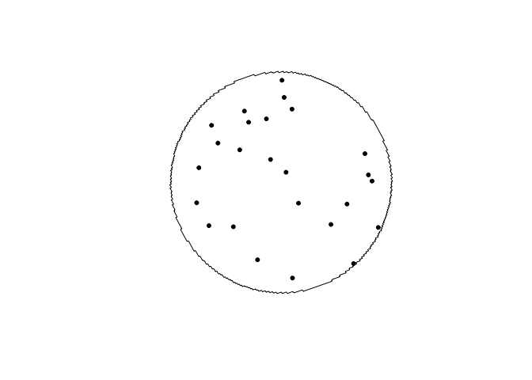
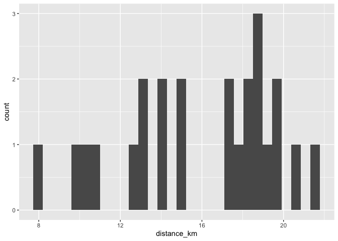
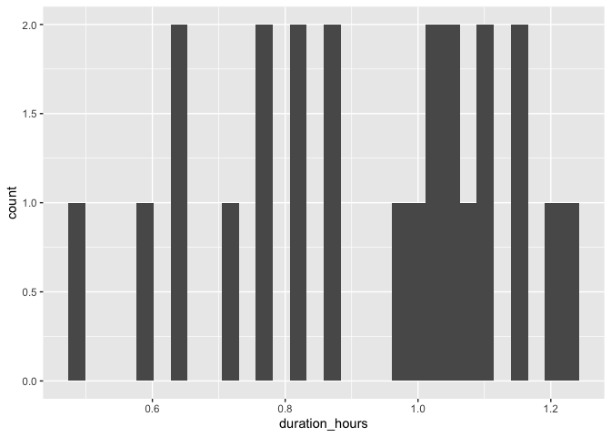
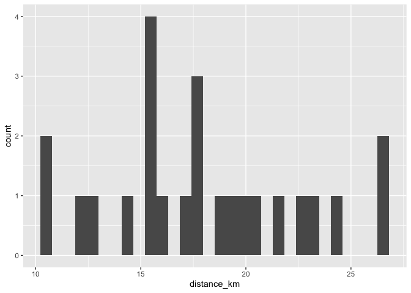
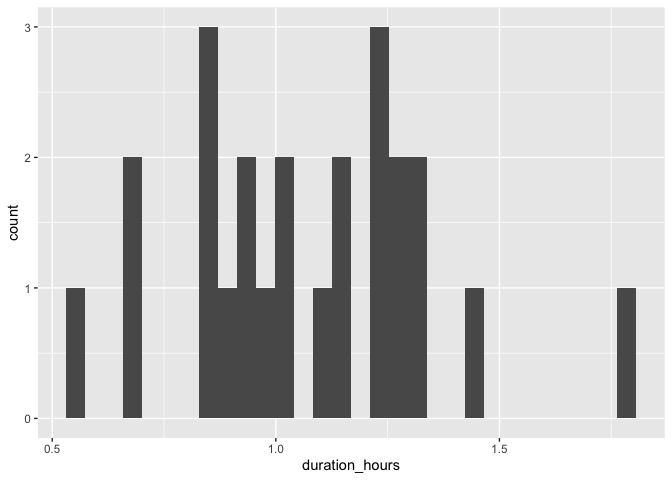
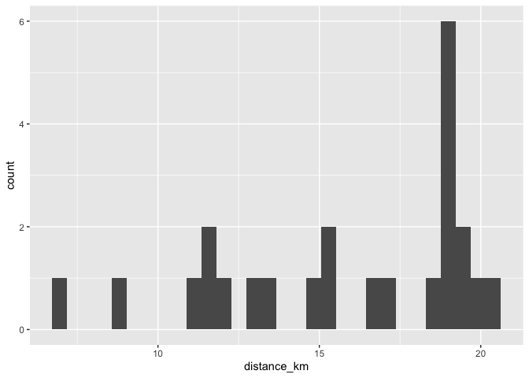
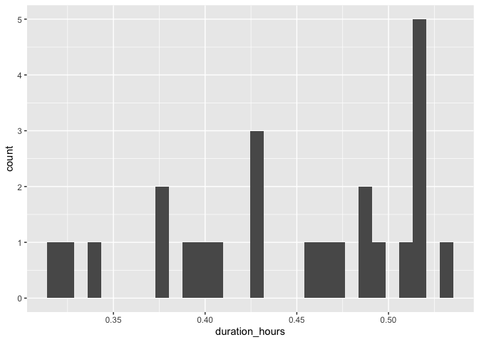
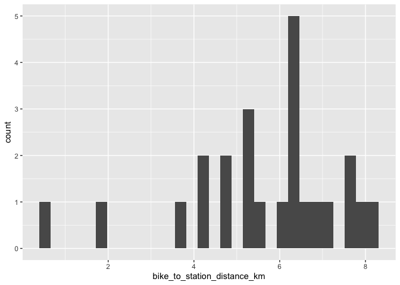
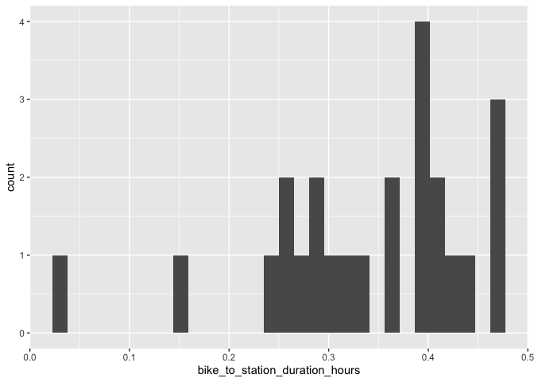

# Edmonton

## Nakî Transit Centre & Park and Ride

### Draw buffer and select points


```r
destination <- "Edmonton Public Library - Stanley A. Milner Library (Downtown), Edmonton, Canada"        #### EDIT ME
```

### Set origin point


```r
origin <- "Naki Transit Centre, Edmonton, Canada"    #### EDIT ME
```

#### Setup departure location and arrival time


```r
arrival_time <- as.POSIXct("2024-06-11 08:30:00", tz = "America/Calgary")       #### EDIT ME
```

```
## Warning in strptime(xx, f, tz = tz): unknown timezone 'America/Calgary'
```

```
## Warning in as.POSIXct.POSIXlt(x): unknown timezone 'America/Calgary'
```

```
## Warning in strptime(x, f, tz = tz): unknown timezone 'America/Calgary'
```

```
## Warning in as.POSIXct.POSIXlt(as.POSIXlt(x, tz, ...), tz, ...): unknown
## timezone 'America/Calgary'
```

#### List of variables for geocoding


```r
var_list <- c("var1", "var2", "var3", "var4", "var5", "var6", "var7", "var8", "var9", "var10", "var11", "var12", "var13", "var14", "var15", "var16", "var17", "var18", "var19", "var20", "var21", "var22", "var23", "var24")
```

#### Seed


```r
seed <- c(103)
```


```r
stations <- geocode(location = origin, output = "more", source = "google")
```

```
## ℹ <https://maps.googleapis.com/maps/api/geocode/json?address=Naki+Transit+Centre,+Edmonton,+Canada&key=xxx>
```

```r
stations_sf <- stations %>%
                st_as_sf(coords = c("lon", "lat"), crs = 4326)

stations_buffer = st_buffer(stations_sf, 5000)

stations_buffer <- as_sf(stations_buffer)
```

#### Interactive map view of buffers


```r
mapview(stations_buffer)
```

```{=html}
<div class="leaflet html-widget html-fill-item" id="htmlwidget-9d9f2edb71eb67a137c2" style="width:672px;height:480px;"></div>
<script type="application/json" data-for="htmlwidget-9d9f2edb71eb67a137c2">{"x":{"options":{"minZoom":1,"maxZoom":52,"crs":{"crsClass":"L.CRS.EPSG3857","code":null,"proj4def":null,"projectedBounds":null,"options":{}},"preferCanvas":false,"bounceAtZoomLimits":false,"maxBounds":[[[-90,-370]],[[90,370]]]},"calls":[{"method":"addProviderTiles","args":["CartoDB.Positron","CartoDB.Positron","CartoDB.Positron",{"errorTileUrl":"","noWrap":false,"detectRetina":false,"pane":"tilePane"}]},{"method":"addProviderTiles","args":["CartoDB.DarkMatter","CartoDB.DarkMatter","CartoDB.DarkMatter",{"errorTileUrl":"","noWrap":false,"detectRetina":false,"pane":"tilePane"}]},{"method":"addProviderTiles","args":["OpenStreetMap","OpenStreetMap","OpenStreetMap",{"errorTileUrl":"","noWrap":false,"detectRetina":false,"pane":"tilePane"}]},{"method":"addProviderTiles","args":["Esri.WorldImagery","Esri.WorldImagery","Esri.WorldImagery",{"errorTileUrl":"","noWrap":false,"detectRetina":false,"pane":"tilePane"}]},{"method":"addProviderTiles","args":["OpenTopoMap","OpenTopoMap","OpenTopoMap",{"errorTileUrl":"","noWrap":false,"detectRetina":false,"pane":"tilePane"}]},{"method":"createMapPane","args":["polygon",420]},{"method":"addPolygons","args":[[[[{"lng":[-113.6681198250391,-113.6675676997234,-113.6670155938415,-113.6680106250683,-113.6674585209457,-113.6663543709964,-113.6660783456534,-113.6665758288031,-113.6662998038996,-113.6667972816076,-113.666245237537,-113.6656932128955,-113.6651412076823,-113.6645913780531,-113.6645952643178,-113.6645931081609,-113.665584103558,-113.6650321195285,-113.6639282097464,-113.6617206232654,-113.6614446968047,-113.661942069843,-113.6616661438205,-113.66216351142,-113.6616116651063,-113.6610598382119,-113.6605080307359,-113.6599562426774,-113.6594044740356,-113.6588527248097,-113.6583009949988,-113.657749284602,-113.6567546897127,-113.6550997279936,-113.6528933841102,-113.652023218434,-113.6519542771234,-113.6518299677624,-113.6513473890101,-113.6507958886291,-113.6502444076531,-113.6496929460813,-113.6489471399157,-113.6488092808666,-113.6485606794064,-113.6475957077448,-113.6470443220438,-113.6465471426486,-113.6462714614893,-113.645774285493,-113.6454986135997,-113.6449472843626,-113.6443959745241,-113.6434016636414,-113.6422991374841,-113.6415534281508,-113.6414156211484,-113.6411670519667,-113.6407536415446,-113.6402024446187,-113.6394567587349,-113.6393189658458,-113.639070404481,-113.6381058959231,-113.6371738175262,-113.6371393729254,-113.6370772343078,-113.6365605754208,-113.6360094913926,-113.6350153055808,-113.6344642586073,-113.6337186298355,-113.6335808744339,-113.6333323321071,-113.6329190764852,-113.6323680859533,-113.6313739450274,-113.6308229915479,-113.6298443975059,-113.6298357892833,-113.6298202560172,-113.6292779478076,-113.6287808914654,-113.6285054449373,-113.6280083919993,-113.6277329547338,-113.6272359052002,-113.6269604771973,-113.6264634310683,-113.6261880123279,-113.6256371893836,-113.6246431205911,-113.6240923346956,-113.623098279525,-113.6225475306774,-113.6215534891306,-113.6210027773305,-113.6200087494095,-113.6194580746561,-113.618464060363,-113.6179670517013,-113.6176917348431,-113.617194729589,-113.6169194219923,-113.6161739188444,-113.6160362701757,-113.615787769726,-113.6153748342989,-113.6143808432301,-113.6138302972841,-113.6128363198505,-113.6122858109493,-113.6104221255222,-113.6103533174136,-113.6102290714905,-113.6097474251383,-113.6087534709491,-113.6082030538084,-113.6072091132618,-113.6062151686855,-113.6056648062624,-113.6046708753321,-113.6037390614273,-113.6037046665593,-113.6036425455755,-113.60312663267,-113.6021327113618,-113.6012630269153,-113.6011942439569,-113.6010700033463,-113.6005885330437,-113.5995946213634,-113.5986007056601,-113.5980505073961,-113.5970566053493,-113.5960626992818,-113.5955125557395,-113.5945186633319,-113.5935247669059,-113.5925308664622,-113.5919807953239,-113.5899930177508,-113.5889991229419,-113.5884491242116,-113.5874552430726,-113.586461357921,-113.5854674687578,-113.5844735755837,-113.5839236669515,-113.5829297874537,-113.5809420164328,-113.5779603298498,-113.5774105467033,-113.5764166608554,-113.5754227710042,-113.5744288771504,-113.5734349792946,-113.5724410774378,-113.5714471715806,-113.5704532617239,-113.5694593478683,-113.5684654300146,-113.5674715081636,-113.5664775823161,-113.5654836524728,-113.5644897186344,-113.5634957808017,-113.5625018389756,-113.5615078931566,-113.5605139433457,-113.5595199895435,-113.5585260317508,-113.5575320699684,-113.5578067821476,-113.5573097953342,-113.5575845079248,-113.5531115418996,-113.5521175384859,-113.5523922072188,-113.5518951995901,-113.5521698687331,-113.5516728556805,-113.5506788265866,-113.5496847935083,-113.5486907564465,-113.5476967154017,-113.5482459884976,-113.5462578590343,-113.5452637883303,-113.5456757159924,-113.5454271943727,-113.5455645049048,-113.544818935231,-113.5438248388497,-113.5428307384887,-113.5431053388199,-113.5426082827176,-113.5428828834566,-113.5413916958921,-113.5403975658761,-113.5408780900475,-113.5407538215776,-113.5408224688203,-113.5399525858525,-113.5389584301605,-113.5379642704918,-113.5385134083665,-113.5365250416543,-113.5370741634308,-113.5360799563863,-113.5350857453666,-113.5356005313703,-113.5355383920109,-113.5355727116133,-113.5336463816255,-113.5341268339418,-113.5340025521364,-113.5340711891141,-113.5332012127987,-113.5322069504275,-113.5327560238909,-113.5307674517692,-113.531316509122,-113.5303221993706,-113.5305967264377,-113.5300995656392,-113.5303740931112,-113.5298769268863,-113.5288825914578,-113.5293630028995,-113.529238708752,-113.5293073398904,-113.5284372771804,-113.5274429160745,-113.5279919428136,-113.5269975600007,-113.5274093294529,-113.5271607298035,-113.5272979875982,-113.5265521838353,-113.5255577753441,-113.5261067875768,-113.5251123573766,-113.5256613712239,-113.5246669193138,-113.5249414246252,-113.5244441927463,-113.5247186984611,-113.5232269835639,-113.5237759828968,-113.5227814835946,-113.5233304845399,-113.5223359635248,-113.5228849660821,-113.5218904233533,-113.5223708009425,-113.5222464808814,-113.5223151071838,-113.5214448630787,-113.521856615599,-113.5216079705405,-113.5217452226912,-113.5209992826996,-113.521411036428,-113.5211623859404,-113.5212996384938,-113.5205536822148,-113.5208281842956,-113.5203308744322,-113.5206053769156,-113.5201080616227,-113.5203825645085,-113.5198852437861,-113.5201597470742,-113.5196624209221,-113.5199369246127,-113.5194395930307,-113.5197140971235,-113.5192167601116,-113.5196285186693,-113.5193798464629,-113.519517100626,-113.5187710791899,-113.5192514666403,-113.5191271275756,-113.5191957552869,-113.5183253781555,-113.5188743952032,-113.5178796570071,-113.5184286756629,-113.5174339157434,-113.5179829360069,-113.516988154363,-113.5178116944306,-113.5173142888029,-113.5175888074016,-113.5170913963422,-113.5176404391845,-113.5166455963308,-113.5171946407802,-113.5161997761982,-113.5167488222544,-113.5172292534403,-113.5171048909259,-113.5171735248855,-113.5163029836056,-113.5168520506354,-113.5158571248325,-113.5164061934689,-113.516950991649,-113.516943218499,-113.5169475083231,-113.5159603161762,-113.5165094057882,-113.516783957858,-113.5162864603974,-113.5165610128689,-113.5160635099745,-113.5166126205636,-113.5156175940316,-113.5167158377954,-113.51572077176,-113.5162699049348,-113.5168190574835,-113.5158239519416,-113.5171968736596,-113.5166992971883,-113.5169738916216,-113.5164763097145,-113.5170255042293,-113.5175747181218,-113.5165795157869,-113.5171287312873,-113.5181928914672,-113.5181306879266,-113.5181650168162,-113.5172319608021,-113.5177812166703,-113.5183304919199,-113.5188797865518,-113.5178844696324,-113.5184337658739,-113.5200817709041,-113.5190863789084,-113.5196357349146,-113.5201851103077,-113.5207345050886,-113.5212839192582,-113.5218333528173,-113.5223828057667,-113.5213873031309,-113.5219367576939,-113.5230357249963,-113.524134769873,-113.5252338923308,-113.5263330923766,-113.5274323700174,-113.5285317252601,-113.5290814319842,-113.529579308257,-113.5298541733405,-113.53035205306,-113.5306269274398,-113.5311766907524,-113.5317264734702,-113.5322762755938,-113.5328260971242,-113.5333759380622,-113.5343640122065,-113.5343683080531,-113.5343760881499,-113.5360214849179,-113.536571421278,-113.5375673426457,-113.5381173162005,-113.5386673091685,-113.5392173215507,-113.5402132922612,-113.5413134108369,-113.5420604129137,-113.5421979365307,-113.5424469378334,-113.5428595193002,-113.5434096449137,-113.5439076623264,-113.5441827368608,-113.5446807577164,-113.5455060237858,-113.546004056975,-113.5462791598206,-113.5467771964521,-113.5470523085985,-113.5476025474582,-113.548474132487,-113.5485429156549,-113.5486674278288,-113.5496992159357,-113.5506953444074,-113.5512456771022,-113.551743748722,-113.5520189267994,-113.5525170018598,-113.5527921892391,-113.5533425785682,-113.554338752345,-113.5548891788829,-113.5558853664185,-113.5564358301659,-113.5571829815125,-113.557320603819,-113.5575696548761,-113.5579825324159,-113.5584806404428,-113.5587559026531,-113.5592540141185,-113.5595292856316,-113.5600274005351,-113.5603026813512,-113.5608007996926,-113.5610760898116,-113.5615742115908,-113.5618495110128,-113.5623476362295,-113.5626229449547,-113.5631210736085,-113.5633963916369,-113.5638945237277,-113.5641698510593,-113.5646679865869,-113.5649433232219,-113.5654414621859,-113.5657168081243,-113.5662149505246,-113.5664903057665,-113.5669884516027,-113.5672638161483,-113.568011039678,-113.5681487271062,-113.5683978022228,-113.56881087513,-113.5698071864064,-113.570357985068,-113.5713543100834,-113.5719051459609,-113.5729014847135,-113.5733996525751,-113.5736750911355,-113.5741732624307,-113.5744487102952,-113.5754450587422,-113.5759959868273,-113.5769923490059,-113.5777396179868,-113.5778773608218,-113.5781264510874,-113.5785396902166,-113.5795360620805,-113.5800342464955,-113.5803097586539,-113.5808079465003,-113.581083467963,-113.5820798495064,-113.5826309247879,-113.5846237112711,-113.5851748415405,-113.5861712464769,-113.587167647362,-113.5876658462851,-113.587941440924,-113.5884396432759,-113.5887152472192,-113.5897116577666,-113.5907080642597,-113.5912593222684,-113.5922557424723,-113.5932521586197,-113.5942485707098,-113.5947999014665,-113.5967927489988,-113.59828737399,-113.5985630777489,-113.5990612884891,-113.5993370015522,-113.6003334288665,-113.6013298521175,-113.6023262713044,-113.6032915485155,-113.603308782946,-113.6033399208744,-113.6038741981855,-113.6058670517481,-113.6098527100528,-113.6108491144536,-113.6114007699652,-113.6123971880478,-113.6133936020571,-113.6143900119926,-113.6153864178533,-113.6163828196386,-113.6173792173477,-113.6183756109798,-113.6193720005341,-113.6203683860099,-113.6213647674065,-113.622361144723,-113.6233575179587,-113.6243538871129,-113.6253502521847,-113.6247983481924,-113.6257946914381,-113.6297800235821,-113.6317726651402,-113.6313586567804,-113.6316077324998,-113.6314697310377,-113.6322169533372,-113.6332132461598,-113.6342095348939,-113.6352058195388,-113.6362021000937,-113.6356500221651,-113.6366462808956,-113.6386387860835,-113.6396350325394,-113.639082903146,-113.6400791277784,-113.6410753483177,-113.6420715647632,-113.6415366564489,-113.6415677876101,-113.64155053279,-113.6435117867972,-113.6445079732301,-113.6439557763967,-113.6449519410079,-113.645948101523,-113.6456719926805,-113.6461700669708,-113.6458939585635,-113.6463920273986,-113.6483842924958,-113.6478320459728,-113.6488281546528,-113.6498242592342,-113.64930651257,-113.6493687679319,-113.6493342520267,-113.65126415816,-113.6507809134304,-113.6509054210372,-113.6508363870154,-113.6517079365311,-113.6527039892766,-113.6521862126636,-113.652248464786,-113.6522139468842,-113.6541437525873,-113.6535914421738,-113.6545874471856,-113.6555834480958,-113.6550311217174,-113.6560271008126,-113.6557509360656,-113.6562489196469,-113.6559727553374,-113.6564707334653,-113.657466686644,-113.6569143460552,-113.6579102774209,-113.6576341055696,-113.6581320652865,-113.6578558938733,-113.6583538481373,-113.6593497535876,-113.6587973987946,-113.6597932824338,-113.6593790158297,-113.6596279827783,-113.6594898952361,-113.6602367912232,-113.6612326489483,-113.6606802799573,-113.6616761158731,-113.6611237486373,-113.6621195627449,-113.6616017195371,-113.6616639567453,-113.6616294344037,-113.662562989565,-113.6621487149476,-113.6623976590622,-113.662259568849,-113.6630063963347,-113.6627302129186,-113.6632280922012,-113.6629519092242,-113.6634497830555,-113.6644455276393,-113.6638931497287,-113.6648888725081,-113.6643364963556,-113.6653321973317,-113.6647798229376,-113.6657755021113,-113.665223129476,-113.6662187868483,-113.6656664159723,-113.6666620515441,-113.6661096824278,-113.6671052962,-113.6665529288438,-113.6662767524605,-113.6667745445374,-113.6664983685941,-113.6669961552217,-113.6667199797184,-113.6672177608967,-113.6669415858335,-113.6674393615628,-113.6669560591636,-113.6670805010006,-113.66701145874,-113.6678825478685,-113.6673302052457,-113.6683257141402,-113.6677733732784,-113.6687688603792,-113.6678022797169,-113.6680511431124,-113.6679130639173,-113.6686596492482,-113.6681073313579,-113.6691027571881,-113.6685504410593,-113.6682742902875,-113.6687719883994,-113.668495838068,-113.6689935307328,-113.6684412358122,-113.6694366003799,-113.6684701001125,-113.6687189328768,-113.668580865166,-113.6693273586049,-113.6687750866523,-113.6684989579674,-113.6689966057163,-113.6687204774717,-113.6692181197748,-113.6686658690268,-113.6696611328755,-113.6691088838892,-113.6685566543442,-113.6695518787317,-113.668999650948,-113.6682058575665,-113.6682680562614,-113.6682335443478,-113.6686689342798,-113.6683928378377,-113.6688904209511,-113.6683382338069,-113.6680621475239,-113.6685597163545,-113.6682836305116,-113.6687811938982,-113.6676768814415,-113.6686719697893,-113.6681198250391],"lat":[53.60772054999322,53.60711891760943,53.60651728671938,53.60630899533924,53.60570737374677,53.60450413504491,53.60420332630369,53.60409919072563,53.60379838430892,53.60369424831931,53.60309264050869,53.60249103419356,53.60188942937428,53.60129017606131,53.6012893626114,53.60128701260144,53.60107957819534,53.60047798417077,53.59927480061218,53.59686845146793,53.59656765951078,53.59646356129422,53.5961627716619,53.59605867303395,53.59545709879379,53.59485552605313,53.59425395481234,53.59365238507183,53.59305081683195,53.59244925009308,53.59184768485562,53.59124612111994,53.5914542536225,53.58964954803741,53.58724329497569,53.5874253554139,53.58735015954096,53.58737616746307,53.58684979615855,53.586248230365,53.58564666607758,53.58504510329666,53.58520112507716,53.58505073315592,53.58510273874885,53.58404999452814,53.58344842847526,53.58355242717457,53.58325164276538,53.58335563715639,53.58305485117609,53.58245328034724,53.5818517110277,53.58205967324832,53.58085652355474,53.58101247733802,53.58086208259027,53.58091406551787,53.58046288038041,53.57986130151959,53.58001723653732,53.57986684059756,53.57991881727009,53.57886604493005,53.57906093941767,53.57902334003477,53.57903633267525,53.57847234218453,53.5778707537939,53.57807861593589,53.57747702127019,53.57763290584182,53.57748250595169,53.57753446580913,53.57708326524646,53.576481665822,53.57668948572463,53.57608788002813,53.57629243586233,53.57628303566558,53.57628628250796,53.57569407073924,53.57579796464632,53.57549715728477,53.57560104688612,53.57530023795726,53.57540412325297,53.57510331275695,53.57520719374712,53.57490638168409,53.57430475869666,53.57451250192165,53.57391087266757,53.57411859867186,53.57351696315231,53.57372467193662,53.57312303015279,53.57333072171784,53.57272907367092,53.57293674801744,53.57304058165252,53.57273975236222,53.57284358169286,53.57254275083731,53.57269848749218,53.57254807074792,53.57259998130046,53.57214873017941,53.5723563606563,53.57175468604561,53.57196229930634,53.57136061843784,53.57174985328355,53.57167464145856,53.5717005891474,53.57117410618856,53.57138167558488,53.57077997442459,53.57098752660711,53.57119506935548,53.57059335416254,53.57080087969803,53.57099542631953,53.57095781822874,53.57097078767831,53.57040666657643,53.57061416546593,53.57079571925547,53.5707205013871,53.5707464369316,53.57021991167085,53.57042738391536,53.57063484672607,53.57003308945036,53.57024053505094,53.57044797121781,53.56984619991955,53.57005361887721,53.57026102840127,53.57046842849167,53.56986663539877,53.57028139172978,53.57048875574488,53.56988694086173,53.57009428766982,53.57030162504438,53.57050895298535,53.57071627149264,53.57011442705141,53.57032172835299,53.57073630265537,53.57135809335585,53.57075620382237,53.57096344075131,53.57117066824648,53.57137788630781,53.57158509493522,53.57179229412863,53.57199948388798,53.57220666421317,53.57241383510412,53.57262099656078,53.57282814858304,53.57303529117085,53.57324242432411,53.57344954804277,53.57365666232671,53.57386376717589,53.57407086259021,53.57427794856961,53.57448502511401,53.57469209222332,53.57489914989746,53.57520017214707,53.57530369938712,53.57560472396322,53.57653638044359,53.57674338926855,53.57704443558149,53.57714793839634,53.57744898703576,53.57755248943241,53.57775948714848,53.57796647542817,53.57817345427138,53.57838042367804,53.57898255704738,53.57939648307516,53.5796034319335,53.58005505043841,53.5801067876338,53.58025732781353,53.58041253731604,53.5806194750616,53.5808264033696,53.58112749469083,53.58123095724604,53.58153205089367,53.58184243022343,53.58204933797906,53.58257626976887,53.58260213342356,53.58267740961133,53.58285845191362,53.58306534855339,53.58327223575461,53.58387446843759,53.58428823004421,53.58489047979274,53.58509735419746,53.58530421916277,53.58586884425534,53.58588177345693,53.58591941520837,53.58632020310768,53.58684720141687,53.58687305833253,53.58694834402311,53.58712933915141,53.58733618187638,53.58793848281933,53.58835215546625,53.58895447347327,53.58916130339454,53.58946246685723,53.58956588021718,53.58986704600608,53.58997045894542,53.59017727774305,53.59070432898702,53.59073018152147,53.59080547477417,53.5909864392332,53.59119324690607,53.59179560834472,53.592002414334,53.59245419224644,53.59250589372311,53.59265648703875,53.59281158938251,53.59301838424523,53.59362077205114,53.59382756522924,53.59442996233945,53.59463675383257,53.59493795684654,53.59504135099135,53.59534255633135,53.59565273041889,53.59625515389545,53.59646193257354,53.59706436535408,53.59727114234583,53.59787358443024,53.59808035973531,53.59860750461542,53.59863335171299,53.59870865834226,53.59888958474151,53.59934143011548,53.59939312349879,53.59954373930152,53.599698817364,53.60015066971565,53.60020236267705,53.60035298080567,53.60050805760233,53.60080929705857,53.60091268057728,53.60121392235937,53.60131730545604,53.60161854956396,53.60172193223851,53.60202317867226,53.60212656092467,53.60242780968423,53.60253119151445,53.6028324425998,53.60293582400779,53.60338770426934,53.6034393955423,53.60359002297417,53.60374509470495,53.60427229656808,53.60429814218842,53.60437345695806,53.60455437301568,53.60515689883016,53.60536365893955,53.60596619405682,53.60617295247608,53.60677549689606,53.60698225362485,53.60788608478786,53.60798946542749,53.60829074519356,53.60839412541044,53.60899668997978,53.60920345108467,53.60980602495628,53.61001278436969,53.61061536754345,53.61114262908681,53.6111684751674,53.61124379846272,53.61142471774082,53.61202731176022,53.61223407554796,53.6128366788692,53.61343457587704,53.61343619130268,53.61344089915964,53.61364605358737,53.61424866775332,53.61454997541478,53.61465336261648,53.61495467260332,53.61505805938175,53.61566068439171,53.61586745861836,53.61707272878289,53.61727950907517,53.61788215422952,53.61848480092539,53.61869158728322,53.62019823016439,53.62030162949784,53.62060296116965,53.62070636007947,53.62130902845843,53.62191169837757,53.62211850462656,53.62272118384602,53.62388887921487,53.62390180571631,53.62393947343537,53.62413336697902,53.62473605857747,53.62533875171473,53.62594144639041,53.62614828029297,53.62675098426835,53.62855910542062,53.62876596091325,53.62936867880057,53.62997139822458,53.63057411918493,53.63117684168121,53.63177956571305,53.63238229128009,53.63258918389163,53.63319191875725,53.63439739309221,53.63560287356292,53.63680836016634,53.63801385289945,53.63921935175919,53.64042485674258,53.64102761152967,53.64092411204803,53.6412254880734,53.64112198428399,53.64142335874979,53.6420261088282,53.64262886043534,53.64323161357083,53.64383436823431,53.64443712442537,53.64423168469427,53.64423639367281,53.64423477599968,53.64603832144742,53.64664107597481,53.64643397802546,53.64703672630748,53.64763947611426,53.64824222744544,53.648035096716,53.64924058840599,53.64908522248794,53.64923590792024,53.64918411761168,53.64963617302215,53.65023891490145,53.65013532570779,53.65043669527486,53.65033310177089,53.65123720692402,53.65113360522265,53.65143497242401,53.65133136641201,53.6516327320499,53.65223546446585,53.6520541380447,53.65212947885318,53.65210357436546,53.65323368751915,53.65302643171207,53.65362915313496,53.65352551779244,53.65382687712915,53.65372323747518,53.65402459524722,53.6546273119294,53.65442001385401,53.65502272427609,53.65481540895341,53.65541811311419,53.655262614574,53.65541328939265,53.65536145487599,53.6558134784418,53.65570980471588,53.65601115228856,53.65590747425031,53.65620882025698,53.65610513790633,53.6564064823468,53.65630279568367,53.65660413855781,53.65650044758209,53.65680178888976,53.65669809360134,53.65699943334238,53.65689573374122,53.65719707191547,53.65709336800144,53.65739470460876,53.65729099638178,53.65759233142204,53.65748861888202,53.65778995235505,53.65768623550188,53.65798756740755,53.65788384624116,53.6581851765793,53.65802958747179,53.65818025132342,53.65812838661726,53.6585803772796,53.65837290669847,53.65897555445403,53.65876806661831,53.65937070810067,53.65916320300962,53.65905944691209,53.65936076238149,53.65925700196995,53.6595583158705,53.65935078405119,53.65995340519902,53.65974585612274,53.65959018809932,53.6597408402159,53.65968894920413,53.66014090465927,53.65993332885278,53.65982953739737,53.6601308356656,53.66002703989554,53.66032833659375,53.66012073405602,53.66072332079514,53.66030807172785,53.66091064439747,53.66070299786699,53.66049534186367,53.66039151030972,53.66069278747344,53.66058895160414,53.66089022719655,53.66068254445889,53.66047485224833,53.66107738898192,53.66086967950888,53.66066196056285,53.66045423214391,53.66105674700906,53.66064124617095,53.66032959567583,53.66063084003655,53.66052694985379,53.6608281926415,53.66062040127521,53.66041260043595,53.66020479012379,53.66000346485046,53.66002229157068,53.66001579705139,53.66059942586772,53.6601837422924,53.65935226146817,53.65914436758057,53.6597467700459,53.65953885889022,53.6593309382619,53.65912300816102,53.65891506858765,53.65870711954185,53.65849916102373,53.65829119303335,53.65808321557079,53.65787522863614,53.65766723222947,53.65745922635087,53.65725121100041,53.65704318617816,53.65683515188422,53.65623285858187,53.65602482261566,53.65519258403892,53.65477640792449,53.65432472987678,53.65427270666147,53.65412214798613,53.65396607625141,53.65375797231847,53.65354985891516,53.65334173604157,53.65313360369775,53.65253140698431,53.6523232729724,53.65190697653931,53.65169881411828,53.6510966501035,53.65088848601576,53.65068031245883,53.65047212943277,53.64988880714066,53.64988230150475,53.64986348468749,53.64945361146364,53.64924540783461,53.64864329361659,53.64843508832293,53.64822687356109,53.64792582481404,53.64782171583362,53.64752066940959,53.64741656001323,53.64700009875846,53.64639802653714,53.64618978951302,53.64598154302165,53.64541711629899,53.64540410103625,53.64536647266505,53.64496298212331,53.64443619876831,53.64441016675381,53.64433491220373,53.64415268481435,53.64394441606604,53.64338002140121,53.64336700474747,53.64332937851345,53.64292584485244,53.64232384102117,53.64211555948592,53.64190726848513,53.64130528175228,53.64109698909206,53.64079600018615,53.64069185225812,53.64039086567542,53.64028671733266,53.64007841354857,53.63947645320739,53.63926814776489,53.63896717205495,53.63886301773613,53.63856204434943,53.63845788961616,53.6382495730516,53.63764763910278,53.63743932088087,53.63698787724976,53.63693579767931,53.63678531714269,53.63662907634631,53.63642074700415,53.63581883944836,53.63561050844987,53.6350086101875,53.63480027753302,53.63423600658113,53.63422298593347,53.63418536794698,53.63399005425402,53.63353864435817,53.63348656076595,53.63333609147446,53.63317983861336,53.6328789032367,53.63277473365753,53.63247380060431,53.63236963061145,53.63216128352967,53.63155943024876,53.63135108151271,53.63074923752573,53.63054088713578,53.62993905244284,53.6297307003993,53.6291288750005,53.62892052130374,53.6283187051992,53.62811034984954,53.62750854303935,53.62730018603716,53.62669838852143,53.62639749032148,53.62629331412834,53.62599241825203,53.62588824164589,53.62558734809326,53.62548317107414,53.62518227984518,53.62507810241316,53.62455154707312,53.6245255031995,53.62445028122307,53.6242679708237,53.62366620268013,53.62345784687797,53.62285608802941,53.6226477305764,53.62159466983481,53.62154258240923,53.62139214602053,53.62123588166121,53.62063414289182,53.62042578994467,53.61982406047068,53.61952319629218,53.61941902212725,53.61911816027263,53.6190139856953,53.6184122670063,53.6182039185661,53.61715092810564,53.61709884293333,53.61694841658505,53.61679215898612,53.61619046037877,53.61588961163397,53.6157854428011,53.61548459638034,53.61538042713531,53.61477873931456,53.61457040153961,53.61396872301514,53.6133670459817,53.61315871436403,53.61255704662709,53.61169215186839,53.61167913201746,53.61164152799793,53.61155038822099,53.6112495579819,53.61114539797262,53.61054374251591,53.61024291534718,53.61013875882836,53.60983793398386,53.60973377705323,53.60853048921153,53.60832218387038,53.60772054999322]}]]],null,"stations_buffer",{"crs":{"crsClass":"L.CRS.EPSG3857","code":null,"proj4def":null,"projectedBounds":null,"options":{}},"pane":"polygon","stroke":true,"color":"#333333","weight":0.5,"opacity":0.9,"fill":true,"fillColor":"#6666FF","fillOpacity":0.6,"smoothFactor":1,"noClip":false},"<div class='scrollableContainer'><table class=mapview-popup id='popup'><tr class='coord'><td><\/td><th><b>Feature ID&emsp;<\/b><\/th><td>1&emsp;<\/td><\/tr><tr><td>1<\/td><th>type&emsp;<\/th><td>establishment&emsp;<\/td><\/tr><tr><td>2<\/td><th>loctype&emsp;<\/th><td>rooftop&emsp;<\/td><\/tr><tr><td>3<\/td><th>address&emsp;<\/th><td>15520 campbell rd nw, edmonton, ab t6v 1k1, canada&emsp;<\/td><\/tr><tr><td>4<\/td><th>north&emsp;<\/th><td>53.61677&emsp;<\/td><\/tr><tr><td>5<\/td><th>south&emsp;<\/th><td>53.61408&emsp;<\/td><\/tr><tr><td>6<\/td><th>east&emsp;<\/th><td>-113.5913&emsp;<\/td><\/tr><tr><td>7<\/td><th>west&emsp;<\/th><td>-113.594&emsp;<\/td><\/tr><tr><td>8<\/td><th>geometry&emsp;<\/th><td>sfc_POLYGON&emsp;<\/td><\/tr><\/table><\/div>",{"maxWidth":800,"minWidth":50,"autoPan":true,"keepInView":false,"closeButton":true,"closeOnClick":true,"className":""},"1",{"interactive":false,"permanent":false,"direction":"auto","opacity":1,"offset":[0,0],"textsize":"10px","textOnly":false,"className":"","sticky":true},{"stroke":true,"weight":1,"opacity":0.9,"fillOpacity":0.84,"bringToFront":false,"sendToBack":false}]},{"method":"addScaleBar","args":[{"maxWidth":100,"metric":true,"imperial":true,"updateWhenIdle":true,"position":"bottomleft"}]},{"method":"addHomeButton","args":[-113.6696611328755,53.56984619991955,-113.5156175940316,53.66107738898192,true,"stations_buffer","Zoom to stations_buffer","<strong> stations_buffer <\/strong>","bottomright"]},{"method":"addLayersControl","args":[["CartoDB.Positron","CartoDB.DarkMatter","OpenStreetMap","Esri.WorldImagery","OpenTopoMap"],"stations_buffer",{"collapsed":true,"autoZIndex":true,"position":"topleft"}]},{"method":"addLegend","args":[{"colors":["#6666FF"],"labels":["stations_buffer"],"na_color":null,"na_label":"NA","opacity":1,"position":"topright","type":"factor","title":"","extra":null,"layerId":null,"className":"info legend","group":"stations_buffer"}]}],"limits":{"lat":[53.56984619991955,53.66107738898192],"lng":[-113.6696611328755,-113.5156175940316]},"fitBounds":[53.56984619991955,-113.6696611328755,53.66107738898192,-113.5156175940316,[]]},"evals":[],"jsHooks":{"render":[{"code":"function(el, x, data) {\n  return (\n      function(el, x, data) {\n      // get the leaflet map\n      var map = this; //HTMLWidgets.find('#' + el.id);\n      // we need a new div element because we have to handle\n      // the mouseover output separately\n      // debugger;\n      function addElement () {\n      // generate new div Element\n      var newDiv = $(document.createElement('div'));\n      // append at end of leaflet htmlwidget container\n      $(el).append(newDiv);\n      //provide ID and style\n      newDiv.addClass('lnlt');\n      newDiv.css({\n      'position': 'relative',\n      'bottomleft':  '0px',\n      'background-color': 'rgba(255, 255, 255, 0.7)',\n      'box-shadow': '0 0 2px #bbb',\n      'background-clip': 'padding-box',\n      'margin': '0',\n      'padding-left': '5px',\n      'color': '#333',\n      'font': '9px/1.5 \"Helvetica Neue\", Arial, Helvetica, sans-serif',\n      'z-index': '700',\n      });\n      return newDiv;\n      }\n\n\n      // check for already existing lnlt class to not duplicate\n      var lnlt = $(el).find('.lnlt');\n\n      if(!lnlt.length) {\n      lnlt = addElement();\n\n      // grab the special div we generated in the beginning\n      // and put the mousmove output there\n\n      map.on('mousemove', function (e) {\n      if (e.originalEvent.ctrlKey) {\n      if (document.querySelector('.lnlt') === null) lnlt = addElement();\n      lnlt.text(\n                           ' lon: ' + (e.latlng.lng).toFixed(5) +\n                           ' | lat: ' + (e.latlng.lat).toFixed(5) +\n                           ' | zoom: ' + map.getZoom() +\n                           ' | x: ' + L.CRS.EPSG3857.project(e.latlng).x.toFixed(0) +\n                           ' | y: ' + L.CRS.EPSG3857.project(e.latlng).y.toFixed(0) +\n                           ' | epsg: 3857 ' +\n                           ' | proj4: +proj=merc +a=6378137 +b=6378137 +lat_ts=0.0 +lon_0=0.0 +x_0=0.0 +y_0=0 +k=1.0 +units=m +nadgrids=@null +no_defs ');\n      } else {\n      if (document.querySelector('.lnlt') === null) lnlt = addElement();\n      lnlt.text(\n                      ' lon: ' + (e.latlng.lng).toFixed(5) +\n                      ' | lat: ' + (e.latlng.lat).toFixed(5) +\n                      ' | zoom: ' + map.getZoom() + ' ');\n      }\n      });\n\n      // remove the lnlt div when mouse leaves map\n      map.on('mouseout', function (e) {\n      var strip = document.querySelector('.lnlt');\n      if( strip !==null) strip.remove();\n      });\n\n      };\n\n      //$(el).keypress(67, function(e) {\n      map.on('preclick', function(e) {\n      if (e.originalEvent.ctrlKey) {\n      if (document.querySelector('.lnlt') === null) lnlt = addElement();\n      lnlt.text(\n                      ' lon: ' + (e.latlng.lng).toFixed(5) +\n                      ' | lat: ' + (e.latlng.lat).toFixed(5) +\n                      ' | zoom: ' + map.getZoom() + ' ');\n      var txt = document.querySelector('.lnlt').textContent;\n      console.log(txt);\n      //txt.innerText.focus();\n      //txt.select();\n      setClipboardText('\"' + txt + '\"');\n      }\n      });\n\n      }\n      ).call(this.getMap(), el, x, data);\n}","data":null},{"code":"function(el, x, data) {\n  return (function(el,x,data){\n           var map = this;\n\n           map.on('keypress', function(e) {\n               console.log(e.originalEvent.code);\n               var key = e.originalEvent.code;\n               if (key === 'KeyE') {\n                   var bb = this.getBounds();\n                   var txt = JSON.stringify(bb);\n                   console.log(txt);\n\n                   setClipboardText('\\'' + txt + '\\'');\n               }\n           })\n        }).call(this.getMap(), el, x, data);\n}","data":null}]}}</script>
```

#### Generate points within buffer


```r
set.seed(seed)
points_sample_sf <- st_sample(stations_buffer, size = c(25,25), type = "random")
```

```
## Warning in st_poly_sample(x, size = size, ..., type = type, by_polygon =
## by_polygon, : coordinate ranges not computed along great circles; install
## package lwgeom to get rid of this warning
## Warning in st_poly_sample(x, size = size, ..., type = type, by_polygon =
## by_polygon, : coordinate ranges not computed along great circles; install
## package lwgeom to get rid of this warning
```

```r
points_sample_sf <- st_as_sf(points_sample_sf)
points_sample <- sf_to_df(points_sample_sf)
```

#### Check to see if they worked


```r
check_buffer <- stations_buffer %>% slice(1:2)

plot(st_geometry(check_buffer))
plot(points_sample_sf, pch = 20, add= TRUE)
```

<!-- -->


```r
points_sample$destination <- destination
points_sample$origin <- origin
points_sample$lat_lon <- paste(points_sample$lat, points_sample$lon)
```

#### Checking points and general mapping


```r
lst_directions <- apply(points_sample, 1, function(x){
  res <- google_directions(
    origin = x[['lat_lon']], 
    destination = x[['destination']]    
  )
df_result <- data.frame(
    origin = x[['lat_lon']], 
    destination = x[['destination']], 
    route = res$routes$overview_polyline$points 
)
return(df_result)
})

df_directions <- do.call(rbind, lst_directions)

google_map() %>%
  add_polylines(data = df_directions, polyline = "route") 
```

```{=html}
<div class="google_map html-widget html-fill-item" id="htmlwidget-b90e5b1db3eb41df4dfc" style="width:672px;height:480px;"></div>
<script type="application/json" data-for="htmlwidget-b90e5b1db3eb41df4dfc">{"x":{"lat":0,"lng":0,"zoom":1,"min_zoom":null,"max_zoom":null,"mapBounds":{"west":-180,"south":-90,"east":180,"north":90},"styles":null,"search_box":false,"update_map_view":true,"zoomControl":true,"mapType":"roadmap","mapTypeControl":true,"scaleControl":false,"streetViewControl":true,"rotateControl":true,"fullscreenControl":true,"event_return_type":"list","split_view":null,"split_view_options":{"heading":34,"pitch":10},"geolocation":false,"calls":[{"functions":"add_polylines","args":[[{"id":1,"geodesic":true,"stroke_colour":"#0000FF","stroke_weight":2,"stroke_opacity":0.6,"z_index":3,"polyline":["y}ifIrrqtTBfAFz@T`BJf@AXMDGGIQQ{AIq@k@`@WTi@x@W`@MK{@c@SMV_CB}@EuBm@oIa@aLM}@Uu@Wi@uAwBmIqNcDiFmB_IkAyDHq@La@`@KhAY~@UvEcAxHaBjH}AlCs@nAc@jAi@bAk@`BkAh@e@pCiCzA_BnA_BbEmFpFmIpHeLrDuFn@kA`DkF|@cBdAeCxCwHbGePjFyMjDoItBiF|AmDbCgFbEwI|O_\\rEsJpC}FfAgC~DyIdMaXtBqEx@yAlAkBhAaBtAcBbAgA|AwAjK{IpFsEvGyF`BqAbCwBtCqC`CeCvDgEbFkGhGyHvF{GhEqElFcFxCoCzEqEpCcChBwAbB{AtGgGjBkBhDiDnBgBtAkAxCyB`C_BzA_AnC{A~AkAjA}@T[t@a@lGiDdBcAlCgBfCgBrHkGvAcALCNE`@]xGmFjAs@n@YtAe@TCt@NFLJDR@\\INK@GNBLCPKVGxFCvE@jB?rAB~@PZNfDpCxCjCt@j@d@VVHv@FpA?tN@bCA|DEtAOvEwA|@QT?nOC`CA~BSNAx@KpBe@z@[pAk@bBaAtBqAtB{Ah@c@X[dA}AfB}Ep@kB`@o@lAaBdC_DbAk@t@]TUVa@ZaAZmB\\iAZk@RS`@Un@W\\OZ]Va@d@wA\\uA`@_At@_A\\UXIpAMZA\\B`@JXRbBjBZZXJb@L~@@^K\\Oj@i@^m@^y@Pm@J_ATaAP_ARo@\\e@ZUNCZE`@DdB`@XJZDV?XMJGJOXw@h@eBPk@f@iB|@qCPq@fCwHxBiHx@eDbAsDr@eC@UfE}PrAqFjAkJ~A}MdAcNl@wIRyDDaCZyI@}CAeCEwKHoDLaBXsBhDmQx@uGPqBL}BJaE?mAIqCWsEKcBUmBa@yAw@{Bo@sA[g@c@i@k@g@mAo@_AUcAAwCDaABwAKiAC[EMJi@DeADgAAyFIqDDeCD?wGCYI_@QSKEc@CmIEmBAeIDKwDEwDOgGWcN"]},{"id":2,"geodesic":true,"stroke_colour":"#0000FF","stroke_weight":2,"stroke_opacity":0.6,"z_index":3,"polyline":["aqgfIljhtTlAxA~BpBvAx@lBr@tCn@nA@xBE`B@pJ@`D?n@Hr@X^P|@n@pEiJjDwHhJeSvDeItBqEx@yAlAkB`@m@lAaBrB}B|AwAtD_DzJkIbJ}H`BqAjAeAdB}AvCuClEyEfMuOfGuH`FqFrCqCtDiDrIcIpCcChBwAbB{AbB_BfF{E`DeDpBkBpCcCzGyEzA_AnC{AjDiCT[t@a@lGiDdBcAlCgBfCgBrHkGvAcALCNE`@]xGmFjAs@n@YtAe@TCt@NFLJDR@PCJENK@GNBLCPKVGxFCvE@jB?rAB~@PZNfDpCxCjCt@j@d@VVHv@FlG@|LA|DEtAOvEwA|@QtICpIAnCUx@KpBe@z@[pAk@`@SbBeArAy@tB{AbA_AdA}At@qBnAqDRe@`@o@lAaBdC_DbAk@t@]TUVa@ZaAZmB\\iAZk@RS`@Un@W\\OZ]Va@d@wA\\uA`@_At@_A\\UXIpAMZA\\B`@JXRbBjBZZXJb@L~@@^K\\Oj@i@^m@^y@Pm@J_Af@aCRo@\\e@ZUNCZE`@DdB`@XJZDV?XMVWf@uAn@yBd@cB|@qCPq@x@eClAqDxBiHpAgF~@eD^qA@UzGoXzA{LnAmKdAcNl@wIRyDDaCZyI@}CG}OHoDHcAB]XsBhDmQ`@eD`@kDLgBHuBH_C?_AEoBMmDYqEUmBa@yAw@{Bo@sA[g@c@i@k@g@mAo@_AUcAAoABiCDwAKiAC[EMJi@DeADgAAyFIuEFaBB?yDCwBI_@QSWIyFCyECeIDKwDEwD[kOK_F"]},{"id":3,"geodesic":true,"stroke_colour":"#0000FF","stroke_weight":2,"stroke_opacity":0.6,"z_index":3,"polyline":["i_ofItbitTpAjARPRs@v@yC~A_G~AaGzKoa@lIc[jGmUXgA@{GBe_@BaO~DoBr@Wx@SlAOz@EhFBdXXlV?nJ@xG@vB?jCElBFzCEfGF~@DdAPxBt@vBpA~EnEfCzB|C|B~@l@`Br@r@T~AVzAJl@?bDI|A?p@OpCB~F@rD?te@C|HAvK?vD@vHCxIAx@?bBKfB]|Ag@zAa@`BSbC?tEBfB@TPfB@jA@f@Cz@Kn@SVGJFn@Nd@VJRL`A@jK@vO?nC?r@h@_@nBcBb@a@lCgCzB{B`EmEdD_E~O_S|EmFzFsFxN}MpEqD~FsFfCaCxC}Cr@o@bB_B|AsA`BmArEaDzBsAbB}@~@q@xAgAPOT[fDeB`GiD~F}D~BmBhEoDvAcA\\IzHkGrBiA|Ai@TCRD`@HFLVF^ERKBKV@LGTKj@AlKAnC?rABf@Hr@VbJxHx@h@p@LpA@|J@tJCvBE~@MpEsAp@QTCvMC~A?jBAlAK|@G|@MpBe@f@Qn@UhBaAtBoAvBwAhA}@\\]b@k@j@{@^aAv@{Bv@wBTc@p@eAfDiENQXSjAi@VO\\a@Vi@^{AXcBZy@b@g@~Aw@NEJM\\_@Xs@h@sBTs@j@cA^_@\\Ur@OdAGZ?d@FLFVPv@~@fAfA^L\\J\\@`@?^K\\Oj@i@f@w@^cAN}@VmA\\iBRc@p@m@j@I`@DhAXt@Rl@DVGHGLKLQt@_CV}@\\kAlA{DLi@Pc@pA_Ep@sBxBqHhAmEvAcFBK?OzAcG|BmJ`A}DZgC|@gHHm@hAyJdAaN~@eOZsLFwA?eCCuDCoIDyBJmBBWHw@zB{L~@_FHs@d@qDTwBNmCNsEE_EUuEY_E]gBg@wA}@_Ck@eAg@m@k@g@g@[gAa@cAIqCBgABoAAq@IyAGMJU@yAHoCCqDG{A@kBBq@@}@B?gB?wCE}@O_@OI[GkGCcBA_LB[}NUsMGiC"]},{"id":4,"geodesic":true,"stroke_colour":"#0000FF","stroke_weight":2,"stroke_opacity":0.6,"z_index":3,"polyline":["ccefIvittThPv@bDNtAPn@?|FXjCL`CFhD@|BDjD@nBCd@GhBW`AQr@SdCaAfAo@|AiApAmAbBkB|AkB`MmObBqBzGeIzFeHnA{At@u@x@w@n@i@bAq@dCkAlCk@lC]nRGfAChBUxAWJYpDq@lCe@j@ITHr@EtAMtAGbB?xBFzCPhHpAvAVtL`CR@Ec@o@qE_AsEs@{CyAkGSyAMgAKgBCaDBwA`@gKJkCGi@LiCZcHHuE?yEIyESsD_AqJQgBy@uHo@aG_BiNqByNgBgLiC}OgF}ZmC{Ps@mEwCoSsCwSuEq\\{Es]w@cGW}B[{EIgCC}CAyI@mLA{KJww@Jag@Lex@HwMJiEDgANuARaBF}AD_CT{LDiB?kCCyGCgOIoVC_KKaPKeNIcSGiMK}EQ_Da@mDeAgGg@sDUgCIuC?gDFgBJaB\\uDl@cHJcCBqDIyYIoVAuHJ{@JoU@qBAeANm@HYHQFIb@[j@a@`@BhEHfPC~MAnQGn@At@Ox@OTDl@GJCTGf@GnHIxNEfRCjIEfG@dABH?z@HlBLh@ADCT?ZAtCcA~ImCnC{@\\QnD_AdEmAtDmAvC{@zCgA~DsAdEmAlA]jBk@dCw@v@bGVlENrHAb@~@Op@MLMxBWrBQhEg@fC[r@Ij@JPlIkBPiBNKcGK_F"]},{"id":5,"geodesic":true,"stroke_colour":"#0000FF","stroke_weight":2,"stroke_opacity":0.6,"z_index":3,"polyline":["m{kfI|_ktTlAuDfDqL|@_FzAeIZmAh@cB|@sCbBsFjDiKdAoChAgCr@qAl@gAL_@Pu@V{ARyAHuAFmB?uD?oM?o]CsDX{@T[^YbB@`FAdCMpEa@pHuAhBe@vBm@hD}@xA]pCk@jAKV?vAJ\\H|Ab@r@\\nAx@rBpBp@|@p@fAl@lAVj@|@xB|ArFlCdKzGlWZjAhA|CjBpDr@fAjAvApAtAlA`A|@h@dCbAtCl@pABhEC|J@`CA~@Dn@P|Av@XVTg@`C{EhEmJ`CiFpPc^zAkCj@{@pAiBhBwBlBmBdByA~IsHzHsGjD{Ch@_@nBcBbB}A|CyCxC_DxDoEzNwQbBsBjCwCpAuAlBkBjEaErDiDfGyF|BkBrAeApCmChF}EdDgDtFcFdGkEjDwBbB}@~@q@xAgAPOT[fDeB`GiD~F}D~BmBhEoDvAcA\\IzHkGrBiA|Ai@TCRD`@HFLVFNAb@OBKV@b@Sj@AlKAnC?rABf@Hr@VfGfFzApA`@XVNp@LbC@jP@tCCvBE~@MpEsAp@QTCjHCjG?jBAlAK|@G|@MpBe@f@Qn@UtAs@`BaA~CsBfB{Ab@k@j@{@^aAv@{Bh@_Bb@{@p@eAfDiENQXSjAi@VO\\a@Vi@^{AXcBZy@b@g@|@c@`@SNEJM\\_@Xs@h@sBTs@j@cA^_@\\Ur@OdAGZ?d@FLFVPv@~@fAfA^L\\J\\@`@?^K\\Oj@i@f@w@^cAN}@VmAN{@Lm@Rc@p@m@j@I`@DhAXt@Rl@DVGVSLQTs@h@gBPk@dAgD`@uALi@Pc@pA_Ep@sBxBqHr@yChA{Df@gB?OzAcG|BmJ`A}DZgC|@gHrAgLdAaN~@eOZsLFwAC{HCoIDyBJmBLoAzB{L~@_FHs@d@qDNuAJoALqCHyB@gAAqAMeD[yFIcA]gBg@wA}@_Ck@eAg@m@k@g@g@[gAa@cAIs@?eDFoAAq@IyAGMJU@yAHoCCqDG{A@kBBq@@}@B?gB?wCAm@COO_@OIOGaBAyGC_LBQcIQgIUoM"]},{"id":6,"geodesic":true,"stroke_colour":"#0000FF","stroke_weight":2,"stroke_opacity":0.6,"z_index":3,"polyline":["glifIntntTi@kAEMLMxA_B|@_AhAiAlAs@LMJWAUSy@`DuEpHcLpIqMn@kApAsBlC{E~CwHlEsL`JqUtEcLjAuC|AmD`GcMbBmDhE}ItHoOrCgGpEiJjDwHhJeSvDeItBqEx@yAlAkB`@m@lAaBrB}B|AwAtD_DzJkIbJ}H`BqAjAeAdB}AvCuClEyEfMuOfGuH`FqFrCqCtDiDrIcIpCcChBwAbB{AbB_BfF{E`DeDpBkBpCcCzGyEzA_AnC{AjDiCT[t@a@lGiDdBcAlCgBfCgBrHkGvAcALCNE`@]xGmFjAs@n@YtAe@TCt@NFLJDR@PCJENK@GNBLCPKVGxFCvE@jB?rAB~@PZNfDpCxCjCt@j@d@VVHv@FlG@|LA|DEtAOvEwA|@QtICpIAnCUx@KpBe@z@[pAk@`@SbBeArAy@tB{AbA_AdA}At@qBnAqDRe@`@o@lAaBdC_DbAk@t@]TUVa@ZaAZmB\\iAZk@RS`@Un@W\\OZ]Va@d@wA\\uA`@_At@_A\\UXIpAMZA\\B`@JXRbBjBZZXJb@L~@@^K\\Oj@i@^m@^y@Pm@J_Af@aCRo@\\e@ZUNCZE`@DdB`@XJZDV?XMVWf@uAn@yBd@cB|@qCPq@x@eClAqDxBiHpAgF~@eD^qA@UzGoXzA{LnAmKdAcNl@wIRyDDaCZyI@}CG}OHoDHcAB]XsBhDmQ`@eD`@kDLgBHuBH_C?_AEoBMmDYqEUmBa@yAw@{Bo@sA[g@c@i@k@g@mAo@_AUcAAoABiCDwAKiAC[EMJi@DeADgAAyFIuEFaBB?yDCwBI_@QSWIyFCyECeIDKwDEwD[kOK_F"]},{"id":7,"geodesic":true,"stroke_colour":"#0000FF","stroke_weight":2,"stroke_opacity":0.6,"z_index":3,"polyline":["urhfIrpjtTu@[I@GL{AfGfC`DzBvC_@fAyBnGOb@bC`DbDjEfB~BnCtDd@d@rBjCdAvAlEsL`JqUtEcLjAuC|AmD`GcMbBmDhE}ItHoOrCgGpEiJjDwHhJeSvDeItBqEx@yAlAkB`@m@lAaBrB}B|AwAtD_DzJkIbJ}H`BqAjAeAdB}AvCuClEyEfMuOfGuH`FqFrCqCtDiDrIcIpCcChBwAbB{AbB_BfF{E`DeDpBkBpCcCzGyEzA_AnC{AjDiCT[t@a@lGiDdBcAlCgBfCgBrHkGvAcALCNE`@]xGmFjAs@n@YtAe@TCt@NFLJDR@PCJENK@GNBLCPKVGxFCvE@jB?rAB~@PZNfDpCxCjCt@j@d@VVHv@FlG@|LA|DEtAOvEwA|@QtICpIAnCUx@KpBe@z@[pAk@`@SbBeArAy@tB{AbA_AdA}At@qBnAqDRe@`@o@lAaBdC_DbAk@t@]TUVa@ZaAZmB\\iAZk@RS`@Un@W\\OZ]Va@d@wA\\uA`@_At@_A\\UXIpAMZA\\B`@JXRbBjBZZXJb@L~@@^K\\Oj@i@^m@^y@Pm@J_Af@aCRo@\\e@ZUNCZE`@DdB`@XJZDV?XMVWf@uAn@yBd@cB|@qCPq@x@eClAqDxBiHpAgF~@eD^qA@UzGoXzA{LnAmKdAcNl@wIRyDDaCZyI@}CG}OHoDHcAB]XsBhDmQ`@eD`@kDLgBHuBH_C?_AEoBMmDYqEUmBa@yAw@{Bo@sA[g@c@i@k@g@mAo@_AUcAAoABiCDwAKiAC[EMJi@DeADgAAyFIuEFaBB?yDCwBI_@QSWIyFCyECeIDKwDEwD[kOK_F"]},{"id":8,"geodesic":true,"stroke_colour":"#0000FF","stroke_weight":2,"stroke_opacity":0.6,"z_index":3,"polyline":["}`efIfc`tTv@}At@gAz@cAn@o@~AwAv@w@TW`@s@|@{CV{C@wA@yBAkAlB?b@AtDC~EEtDApA@bB@x@CvA?xCOVCZKf@?fQ@hN?~CCvCFnHA~K@~KC?kHBa\\Cs`@@av@HiD?aDAqO?{e@DkYFsWFmR?_ODaR@}GdCCr@@jA@rF@~BPdAJ~CThEHdFAzR?nIEdLEJ@b@Ct@Ox@OTDl@G`@Kf@GzBEzJEx[GjIEfG@dABdAHlBLh@ADCT?ZAtCcA~ImCnC{@\\QnD_AdEmAtDmAvC{@zCgA~DsAxFaBjGmBv@bGVlENrHAb@~@Op@MLMxBWrBQlDa@n@IrBWr@Ij@JPlIeAJoCTWcN"]},{"id":9,"geodesic":true,"stroke_colour":"#0000FF","stroke_weight":2,"stroke_opacity":0.6,"z_index":3,"polyline":["qg`fIhh_tT[qCQcClAD|@|@\\^`Af@~@V\\Bh@Cf@u@Ze@ZaAtBChD@hD?tED|BK|DDzRO|EBdBB?_D?wD@_J?iJAuICwE?s@LoAAcA?cEDaANq@n@iBzB}GbDgKzCiJhHgUbAqC|@}CtDwKnAcEtP{h@xHyUpD_L|BoH\\_Az@kBp@mAlAkC|@}BVy@\\gBFi@j@sCXyAn@_Cf@aBtBwGpCsIjRAtECzE?xDEnB@dBAhCD|@B\\?@mCAkGHm@Te@p@MLMxBWrBQlDa@n@IrBWr@Ij@JPlIeAJoCTWcN"]},{"id":10,"geodesic":true,"stroke_colour":"#0000FF","stroke_weight":2,"stroke_opacity":0.6,"z_index":3,"polyline":["u}gfIzdttTA{EzF@`B?CcDIyBMuBbBHRB`@JfBh@lEhBtE`CPNdA\\t@Hx@?v@EjAUj@Yr@[p@m@nAcANM`BkAnAm@lDqAfBu@nJ_Gj@GVB\\Bx@d@n@n@v@nAL`@RVP_@xA}Bb@o@vBwDVm@b@cAV}@XeAd@oCd@eFRyBb@aFFsAf@aGXkCZwBj@yChBiHh@eBdGmSnCgJv@{B^oApA_ErAcEz@}Cx@kDd@oCd@oD|@gKJqBF{ADwCD{H?uGHuM?ca@Aq\\Cmc@@_Y@sN?kXAqV@eFAeQ?aEBaHLkAVyAPg@v@q@b@a@~@{@|CyCxC_DxDoEzNwQbBsBjCwCpAuAlBkBjEaErDiDfGyF|BkBrAeApCmChF}EdDgDtFcFdGkEjDwBbB}@~@q@xAgAPOT[fDeB`GiD~F}D~BmBhEoDvAcA\\IzHkGrBiA|Ai@TCRD`@HFLVFNAb@OBKV@b@Sj@AlKAnC?rABf@Hr@VfGfFzApA`@XVNp@LbC@jP@tCCvBE~@MpEsAp@QTCjHCjG?jBAlAK|@G|@MpBe@f@Qn@UtAs@`BaA~CsBfB{Ab@k@j@{@^aAv@{Bh@_Bb@{@p@eAfDiENQXSjAi@VO\\a@Vi@^{AXcBZy@b@g@|@c@`@SNEJM\\_@Xs@h@sBTs@j@cA^_@\\Ur@OdAGZ?d@FLFVPv@~@fAfA^L\\J\\@`@?^K\\Oj@i@f@w@^cAN}@VmAN{@Lm@Rc@p@m@j@I`@DhAXt@Rl@DVGVSLQTs@h@gBPk@dAgD`@uALi@Pc@pA_Ep@sBxBqHr@yChA{Df@gB?OzAcG|BmJ`A}DZgC|@gHrAgLdAaN~@eOZsLFwAC{HCoIDyBJmBLoAzB{L~@_FHs@d@qDNuAJoALqCHyB@gAAqAMeD[yFIcA]gBg@wA}@_Ck@eAg@m@k@g@g@[gAa@cAIs@?eDFoAAq@IyAGMJU@yAHoCCqDG{A@kBBq@@}@B?gB?wCAm@COO_@OIOGaBAyGC_LBQcIQgIUoM"]},{"id":11,"geodesic":true,"stroke_colour":"#0000FF","stroke_weight":2,"stroke_opacity":0.6,"z_index":3,"polyline":["{wcfIp`otTVaBd@oD|@gKJqBF{ADwCD{H?uGHuM?ca@Aq\\Cmc@@_Y@sN?kXAqV@eFAeQ?aEBaHLkAVyAPg@v@q@b@a@~@{@|CyCxC_DxDoEzNwQbBsBjCwCpAuAlBkBjEaErDiDfGyF|BkBrAeApCmChF}EdDgDtFcFdGkEjDwBbB}@~@q@xAgAPOT[fDeB`GiD~F}D~BmBhEoDvAcA\\IzHkGrBiA|Ai@TCRD`@HFLVFNAb@OBKV@b@Sj@AlKAnC?rABf@Hr@VfGfFzApA`@XVNp@LbC@jP@tCCvBE~@MpEsAp@QTCjHCjG?jBAlAK|@G|@MpBe@f@Qn@UtAs@`BaA~CsBfB{Ab@k@j@{@^aAv@{Bh@_Bb@{@p@eAfDiENQXSjAi@VO\\a@Vi@^{AXcBZy@b@g@|@c@`@SNEJM\\_@Xs@h@sBTs@j@cA^_@\\Ur@OdAGZ?d@FLFVPv@~@fAfA^L\\J\\@`@?^K\\Oj@i@f@w@^cAN}@VmAN{@Lm@Rc@p@m@j@I`@DhAXt@Rl@DVGVSLQTs@h@gBPk@dAgD`@uALi@Pc@pA_Ep@sBxBqHr@yChA{Df@gB?OzAcG|BmJ`A}DZgC|@gHrAgLdAaN~@eOZsLFwAC{HCoIDyBJmBLoAzB{L~@_FHs@d@qDNuAJoALqCHyB@gAAqAMeD[yFIcA]gBg@wA}@_Ck@eAg@m@k@g@g@[gAa@cAIs@?eDFoAAq@IyAGMJU@yAHoCCqDG{A@kBBq@@}@B?gB?wCAm@COO_@OIOGaBAyGC_LBQcIQgIUoM"]},{"id":12,"geodesic":true,"stroke_colour":"#0000FF","stroke_weight":2,"stroke_opacity":0.6,"z_index":3,"polyline":["grkfInomtTxClAHHPXPh@Dl@S`Da@tDjChAlGpBjA|DrAjFdBxGhAjE`IeBtFkA|EkAfA]jAg@tAq@fAu@vDaDrCyCrBiC`CaDrE}GvGcKjGsJlB}Ch@_AnA}BtAwCtBoFbHcRrImTnCwGpB{ElAgCtFsLhHcOdIiP`CiF`C{EhBaEdEaJlJiS~EmKzAkClBsCxAgBlCoCbRwO|CiCjD{Ch@_@nBcBb@a@lCgCzB{B`EmEdD_E~O_S|EmFzFsFxN}MpEqD~FsFfCaCxC}Cr@o@bB_B|AsA`BmArEaDzBsAbB}@~@q@xAgAPOT[fDeB`GiD~F}D~BmBhEoDvAcA\\IzHkGrBiA|Ai@TCRD`@HFLVF^ERKBKV@LGTKj@AlKAnC?rABf@Hr@VbJxHx@h@p@LpA@|J@tJCvBE~@MpEsAp@QTCvMC~A?jBAlAK|@G|@MpBe@f@Qn@UhBaAtBoAvBwAhA}@\\]b@k@j@{@^aAv@{Bv@wBTc@p@eAfDiENQXSjAi@VO\\a@Vi@^{AXcBZy@b@g@~Aw@NEJM\\_@Xs@h@sBTs@j@cA^_@\\Ur@OdAGZ?d@FLFVPv@~@fAfA^L\\J\\@`@?^K\\Oj@i@f@w@^cAN}@VmA\\iBRc@p@m@j@I`@DhAXt@Rl@DVGHGLKLQt@_CV}@\\kAlA{DLi@Pc@pA_Ep@sBxBqHhAmEvAcFBK?OzAcG|BmJ`A}DZgC|@gHHm@hAyJdAaN~@eOZsLFwA?eCCuDCoIDyBJmBBWHw@zB{L~@_FHs@d@qDTwBNmCNsEE_EUuEY_E]gBg@wA}@_Ck@eAg@m@k@g@g@[gAa@cAIqCBgABoAAq@IyAGMJU@yAHoCCqDG{A@kBBq@@}@B?gB?wCE}@O_@OI[GkGCcBA_LB[}NUsMGiC"]},{"id":13,"geodesic":true,"stroke_colour":"#0000FF","stroke_weight":2,"stroke_opacity":0.6,"z_index":3,"polyline":["sjlfId|mtTlCuIrAeElCjDtBrCbDjEh@`@nFxBjChAlGpBjA|DrAjFdBxGhAjEvPqD|EkAfA]jAg@tAq@fAu@vDaDrCyCrBiC`CaDrE}GvGcKjGsJlB}Ch@_AnA}BtAwCtBoFbHcRrImTnCwGpB{ElAgCtFsLjAcC|E_KdIiP`CiF`C{EhBaEdEaJlJiS~EmKzAkClBsCxAgBlCoCvIkHjGkF|CiCjD{Ch@_@nBcBb@a@lCgCzB{B`EmE`MmObGqH|EmFzFsFrBkBdKqJpEqDfKuJxC}Cr@o@bB_B|AsA`BmArEaDzBsAbB}@~@q@xAgAPOT[fDeB`GiD~F}D~BmBhEoDvAcA\\IzHkGrBiA|Ai@TCRD`@HFLVF^ERKBKV@LGTKj@AlKAnC?rABf@Hr@VbJxHx@h@p@LpA@|J@tJCvBE~@MpEsAp@QTCvMC~A?jBAlAK|@G|@MpBe@f@Qn@UhBaAtBoAvBwAhA}@\\]b@k@j@{@^aAv@{Bv@wBTc@p@eAfDiENQXSjAi@VO\\a@Vi@^{AXcBZy@b@g@~Aw@NEJM\\_@Xs@h@sBTs@j@cA^_@\\Ur@OdAGZ?d@FLFVPv@~@fAfA^L\\J\\@`@?^K\\Oj@i@f@w@^cAN}@VmA\\iBRc@p@m@j@I`@DhAXt@Rl@DVGHGLKLQt@_Ct@iClA{DLi@Pc@pA_Ep@sBxBqHhAmEvAcFBK?OzAcG|BmJ`A}DZgC|@gHHm@hAyJdAaN~@eOZsLFwA?eCCuDCoIDyBJmBBWHw@zB{L~@_FHs@d@qDTwBNmCDsAH_C?aAE}BUuEY_E]gBg@wA}@_Ck@eAg@m@k@g@g@[gAa@cAIqCBgABoAAq@IyAGMJU@yAHoCCqDG{A@kBBq@@}@B?gB?wCE}@O_@OI[GkGCcBA_LB[}N]}Q"]},{"id":14,"geodesic":true,"stroke_colour":"#0000FF","stroke_weight":2,"stroke_opacity":0.6,"z_index":3,"polyline":["qtcfIlyrtTBj]@lP?zGRkAHWPSHGH?jBDjD@nBCd@GhBW`AQr@SdCaAfAo@|AiApAmAbBkB|AkBzBoChLoNzGeIzFeHnA{At@u@x@w@n@i@bAq@dCkAlCk@lC]nRGfAChBUxAWJYpDq@lCe@j@ITHr@EtAMtAGbB?xBFzCPhHpAvAVtL`CR@Ec@o@qE_AsEs@{CyAkGSyAMgAKgBCaDJeEXyGJkCGi@LiCN_DPoFDwEEyEMcEK{A_AqJy@uHcB}OsAyK_CkP}AuJoByLiDkSeBuKyCeRsEy[kEi[aBuL{Es]w@cGW}B[{EIgCC}CAyI@mLA{KDi^Hif@Fma@Hs`@BiNHwMJiEDgANuARaBF}AD_CT{LDiB?kCCyGCgOE}KEyOY_e@Qma@K}EQ_Da@mDeAgGg@sDUgCIuC?gDFgBJaB\\uDl@cHJcCBqDO}h@CkGAuHJ{@JoU@qBAeANm@HYHQFIb@[j@a@`@BhEHfPC~MAnQGn@At@Ox@OTDl@GJCTGf@GnHIxNEfRCjIEfG@dABH?z@HlBLh@ADCT?ZAtCcA~ImCnC{@\\QnD_AdEmAtDmAvC{@zCgA~DsAdEmAlA]jBk@dCw@v@bGVlENrHAb@~@Op@MLMxBWrBQhEg@fC[r@Ij@JPlIkBPiBNKcGK_F"]},{"id":15,"geodesic":true,"stroke_colour":"#0000FF","stroke_weight":2,"stroke_opacity":0.6,"z_index":3,"polyline":["ye_fIdpgtT?q]?oB@sGjE?rC@`H?hIFl@@PLhC@|EA`BAbGIf@AROrB@lIC^Pv@DzE@VDvBLfB@pA?`@@VCtDIXA^LjB?hBClCBX??i@@sKByF?wOC{IBkNBgLCyM?sK?oa@A}SLkBLe@^u@vEwA|@QT?nOC`CA~BSNAx@KpBe@z@[pAk@bBaAtBqAtB{Ah@c@X[dA}AfB}Ep@kB`@o@lAaBdC_DbAk@t@]TUVa@ZaAZmB\\iAZk@RS`@Un@W\\OZ]Va@d@wA\\uA`@_At@_A\\UXIpAMZA\\B`@JXRbBjBZZXJb@L~@@^K\\Oj@i@^m@^y@Pm@J_ATaAP_ARo@\\e@ZUNCZE`@DdB`@XJZDV?XMJGJOXw@h@eBPk@f@iB|@qCPq@fCwHxBiHx@eDbAsDr@eC@UfE}PrAqFjAkJ~A}MdAcNl@wIRyDDaCZyI@}CAeCEwKHoDLaBXsBhDmQx@uGPqBL}BJaE?mAIqCWsEKcBUmBa@yAw@{Bo@sA[g@c@i@k@g@mAo@_AUcAAwCDaABwAKiAC[EMJi@DeADgAAyFIqDDeCD?wGCYI_@QSKEc@CmIEmBAeIDKwDEwDOgGWcN"]},{"id":16,"geodesic":true,"stroke_colour":"#0000FF","stroke_weight":2,"stroke_opacity":0.6,"z_index":3,"polyline":["msmfIvthtTA`CMnBG\\OPj@h@JRN^l@~CZbAb@|A`I}HbByAh@YhAe@j@M`AMjBBfANv@Pn@\\t@h@`@t@t@dAfAdBlEwIjBuDf@iAp@sBf@kBNs@TcBRkCJ}EIsEo@qKi@qKi@uKAgDZcBJWDGXUzB@fJAnC?tL@bC@tKAdEUpCYzAYtE{@hBe@~EsAzCu@pCk@jAKV?vAJ~@Rz@Xr@\\nAx@rBpBp@|@p@fAl@lAVj@|@xB|ArFb@|AfIp[xAnFhA|Ct@vAt@xAr@fAjAvApAtAlA`A|@h@dCbA@@rCj@pABhEC~A?pJ?l@?~@Dn@P\\N~@f@XVTg@`C{EhBaEdEaJlJiS~EmKzAkClBsCxAgBlCoCvIkHjGkF|CiCjD{Ch@_@nBcBb@a@lCgCzB{B`EmE`MmObGqH|EmFzFsFrBkBdKqJpEqDfKuJxC}Cr@o@bB_B|AsA`BmArEaDzBsAbB}@~@q@xAgAPOT[fDeB`GiD~F}D~BmBhEoDvAcA\\IzHkGrBiA|Ai@TCRD`@HFLVF^ERKBKV@LGTKj@AlKAnC?rABf@Hr@VbJxHx@h@p@LpA@|J@tJCvBE~@MpEsAp@QTCvMC~A?jBAlAK|@G|@MpBe@f@Qn@UhBaAtBoAvBwAhA}@\\]b@k@j@{@^aAv@{Bv@wBTc@p@eAfDiENQXSjAi@VO\\a@Vi@^{AXcBZy@b@g@~Aw@NEJM\\_@Xs@h@sBTs@j@cA^_@\\Ur@OdAGZ?d@FLFVPv@~@fAfA^L\\J\\@`@?^K\\Oj@i@f@w@^cAN}@VmA\\iBRc@p@m@j@I`@DhAXt@Rl@DVGHGLKLQt@_Ct@iClA{DLi@Pc@pA_Ep@sBxBqHhAmEvAcFBK?OzAcG|BmJ`A}DZgC|@gHHm@hAyJdAaN~@eOZsLFwA?eCCuDCoIDyBJmBBWHw@zB{L~@_FHs@d@qDTwBNmCDsAH_C?aAE}BUuEY_E]gBg@wA}@_Ck@eAg@m@k@g@g@[gAa@cAIqCBgABoAAq@IyAGMJU@yAHoCCqDG{A@kBBq@@}@B?gB?wCE}@O_@OI[GkGCcBA_LB[}N]}Q"]},{"id":17,"geodesic":true,"stroke_colour":"#0000FF","stroke_weight":2,"stroke_opacity":0.6,"z_index":3,"polyline":["adefI~uftTK`BYdB]fAaAzBc@z@fDAZJP\\tBqEx@yAlAkB`@m@lAaBrB}B|AwAtD_DzJkIbJ}H`BqAjAeAdB}AvCuClEyElCeD`QeT`FqFrCqChOmNpCcChBwAbB{AbB_BfF{E`DeDpBkBpCcCzGyEzA_AnC{AjDiCT[t@a@lGiDdBcAlCgBfCgBrHkGvAcALCNE`@]xGmFjAs@n@YtAe@TCt@NFLJDR@PCJENK@GNBLCPKVGxFCvE@jB?rAB~@PZNfDpCxCjCt@j@d@VVHv@FlG@|LA|DEtAOvEwA|@QtICpIAnCUx@KpBe@z@[pAk@`@SbBeArAy@tB{AbA_AdA}At@qBnAqDRe@`@o@lAaBdC_DbAk@t@]TUVa@ZaAZmB\\iAZk@RS`@Un@W\\OZ]Va@d@wA\\uA`@_At@_A\\UXIpAMZA\\B`@JXRbBjBZZXJb@L~@@^K\\Oj@i@^m@^y@Pm@J_Af@aCRo@\\e@ZUNCZE`@DdB`@XJZDV?XMVWf@uAf@cBFUd@cB|@qCPq@x@eClAqDxBiHpAgF~@eD^qA@UzGoXzA{LnAmKdAcNl@wIRyDDaCZyI@}CG}OHoDHcAB]XsBhDmQ`@eD`@kDLgBRuF?_AEoBMmDYqEUmBa@yAw@{Bo@sA[g@c@i@k@g@mAo@_AUcAAoABiCDwAKiAC[EMJi@DeADgAAyFIuEFaBB?yDCwBI_@QSWIsMGeIDKwDEwD[kOK_F"]},{"id":18,"geodesic":true,"stroke_colour":"#0000FF","stroke_weight":2,"stroke_opacity":0.6,"z_index":3,"polyline":["mqlfIvpgtTx@bFPn@d@dA`BwCn@eCZaCCuA[_DzCmAlBi@lBi@{@kQAgDLy@V{@NWPKd@@xB?bRCrKB|I?lA?`BI`AGh@ErDc@`Eu@hCk@nCw@XGdD{@vBi@xCe@n@C^@pANb@JdAZ`Af@~@n@z@x@`AbAxAxB|AdDtAdEjAjElEvPdE~OnAxDZp@|AxCr@hAjB|B~BpBvAx@lBr@tCn@nA@xBE`B@pJ@`D?n@Hr@X^P|@n@pEiJjDwHhJeSvDeItBqEx@yAlAkB`@m@lAaBrB}B|AwAtD_DzJkIbJ}H`BqAjAeAdB}AvCuClEyEfMuOfGuH`FqFrCqCtDiDrIcIpCcChBwAbB{AbB_BfF{E`DeDpBkBpCcCzGyEzA_AnC{AjDiCT[t@a@lGiDdBcAlCgBfCgBrHkGvAcALCNE`@]xGmFjAs@n@YtAe@TCt@NFLJDR@PCJENK@GNBLCPKVGxFCvE@jB?rAB~@PZNfDpCxCjCt@j@d@VVHv@FlG@|LA|DEtAOvEwA|@QtICpIAnCUx@KpBe@z@[pAk@`@SbBeArAy@tB{AbA_AdA}At@qBnAqDRe@`@o@lAaBdC_DbAk@t@]TUVa@ZaAZmB\\iAZk@RS`@Un@W\\OZ]Va@d@wA\\uA`@_At@_A\\UXIpAMZA\\B`@JXRbBjBZZXJb@L~@@^K\\Oj@i@^m@^y@Pm@J_Af@aCRo@\\e@ZUNCZE`@DdB`@XJZDV?XMVWf@uAn@yBd@cB|@qCPq@x@eClAqDxBiHpAgF~@eD^qA@UzGoXzA{LnAmKdAcNl@wIRyDDaCZyI@}CG}OHoDHcAB]XsBhDmQ`@eD`@kDLgBHuBH_C?_AEoBMmDYqEUmBa@yAw@{Bo@sA[g@c@i@k@g@mAo@_AUcAAoABiCDwAKiAC[EMJi@DeADgAAyFIuEFaBB?yDCwBI_@QSWIyFCyECeIDKwDEwD[kOK_F"]},{"id":19,"geodesic":true,"stroke_colour":"#0000FF","stroke_weight":2,"stroke_opacity":0.6,"z_index":3,"polyline":["cjgfI`i}sT?fC?tD[A]EUKq@y@yBiEpCiGZi@r@_A^_@r@S`AMfCCn@ATyDP{AXaCn@qDj@sBvA_EzBqGbAeE\\qBX_Cf@gGJaDBkDG}I\\oBNUZe@nD?`E@zM?vN@jVCxN@pC?dBAdAA~KErHCzB?lJOzDEdBCj@M`G?nLFlAATGbI?zD??{e@DkYFsWFmR?_ODaR@}GdCCr@@jA@rF@~BPdAJ~CThEHdFAzR?nIEdLEJ@b@Ct@Ox@OTDl@G`@Kf@GzBEzJEx[GjIEfG@dABdAHlBLh@ADCT?ZAtCcA~ImCnC{@\\QnD_AdEmAtDmAvC{@zCgA~DsAxFaBjGmBv@bGVlENrHAb@~@Op@MLMxBWrBQlDa@n@IrBWr@Ij@JPlIeAJoCTWcN"]},{"id":20,"geodesic":true,"stroke_colour":"#0000FF","stroke_weight":2,"stroke_opacity":0.6,"z_index":3,"polyline":["cdcfIb{{sT~ECzD@Ekd@?}M~QYx@A`@Kp@?vH@tKBTGrD?jH?^??uE@{j@DaYDeNFoP?_J@aJBiJ@wG?{@dCCvBB|C?|A@|@Hl@DdAHpCTdCH|BBlXAxIEtHEjC?x@GzAYTDP?d@INGVGjAC~GGdWGbSGhH@p@DxBLnAHJGf@?PClCaAtDgAjH}Bj@UvGiBjCu@~GwBjDoAnDkAjBg@tBq@x@UhCw@~Ag@`@xCThBTjDPtIAb@XIvASLMJ?lBWdBOrBUhBStDe@j@JDzBJpEc@DeAJgAJc@BASMeIGiC"]},{"id":21,"geodesic":true,"stroke_colour":"#0000FF","stroke_weight":2,"stroke_opacity":0.6,"z_index":3,"polyline":["cz`fInxktTcF`KuAnCtCvFPl@RhADp@?pF?fO?\\ZM`NDzODl@NlB@jABdH?fABtIBzE?tGAjBAIy@[wCWyAm@yBuAaFs@uCg@iCaDqQOMgD}RmCyPo@}D}CgTkCmR_EqYoG_e@m@_FQiBS_DIsBEuACuG@cP?eH@oa@DwTLsk@Jgv@FiMTwKb@wDF_BVsMHoEC}FA{LIk\\E{JIuMKsOKySCmHEuHGqBSqDQaBi@yDaA}FQsAOcBMgCCkDFaCN{BfAqLHuBFqDEyQMq]AcKJ{@F}MDcHAeC\\qAVYdAu@dCH|BB|JAnL?|DCpMG~C?d@GzAYTDP?d@If@OzEIdQGnIAbSGrIDF@xBLnAHJGf@?PClCaAtDgAjH}Bj@UvGiBjLmDjDoAnDkAjBg@tBq@\\I`Bg@bA[~Ag@`@xCThBTjDPtIAb@XIvASLMJ?lBWdBOrBUrAOfC[bAMj@JDzBJpEc@DeAJgAJc@BASMeIGiC"]},{"id":22,"geodesic":true,"stroke_colour":"#0000FF","stroke_weight":2,"stroke_opacity":0.6,"z_index":3,"polyline":["}zffI|v|sT`ABJP@xCuE?k@ATyDf@_EXsBX{Aj@sB~D{KvA{Fp@iEN_BRcCTiEBuBA}E?gAEqCPeAPq@d@s@pQ@tL?dh@C`IDbECjCCdQErDAfLQpFI`@Kp@?vH@tKBTGrD?jH?^??uE@{j@BsOFsWFoP?_J@aJDoM?qD?{@dCCvBBfA?tA?|A@|@Hl@Dn@D~@JfBLdCH|BB|JAnL?|DCpMG~C?d@GzAYTDP?d@If@OzEIdQGnIAbSGrIDF@xBLnAHJGf@?PClCaAtDgAjH}Bj@UvGiBjLmDjDoAnDkAjBg@tBq@\\I`Bg@bA[~Ag@`@xCThBTjDPtIAb@XIvASLMJ?lBWdBOrBUrAOfC[bAMj@JDzBJpEc@DeAJgAJc@BASMeIGiC"]},{"id":23,"geodesic":true,"stroke_colour":"#0000FF","stroke_weight":2,"stroke_opacity":0.6,"z_index":3,"polyline":["{ikfI`nrtT[iAGMi@iAm@_Ae@{@}AsCO_@U{@Q{@Kw@o@qH]kEs@mJe@aEWsAK[cAyCcBqE_@wAUsAYcDIoAQwDE_ADQDg@FQLWHSPE^KnD{@bFkAhAUxJwBbE_AhCo@vEcAdR_ElCs@nAc@jAi@bAk@`BkAh@e@pCiCzA_BnA_BbEmFbPsVrDuFn@kA`DkF|@cBdAeCxCwHbGePjFyMjDoItBiF|AmDbCgFbEwIbBkDxLsVrEsJpC}FfAgC~DyIdMaXtBqEx@yAlAkBhAaBtAcBbAgA|AwAjK{IpFsEvGyF`BqAbCwBtCqC`CeCvDgElNeQvF{GhEqEfKsJzEqEpCcChBwAbB{AtGgGjBkBhDiDnBgBtAkAxCyB`C_BzA_AnC{A~AkAjA}@T[t@a@lGiDdBcAlCgBfCgBrHkGvAcALCNE`@]xGmFjAs@n@YtAe@TCt@NFLJDR@\\INK@GNBLCPKVGxFCvE@jB?rAB~@PZNfDpCxCjCt@j@d@VVHv@FpA?tN@bCA|DEtAOvEwA|@QT?nOC`CA~BSNAx@KpBe@z@[pAk@bBaAtBqAtB{Ah@c@X[dA}AfB}Ep@kB`@o@lAaBdC_DbAk@t@]TUVa@ZaAZmB\\iAZk@RS`@Un@W\\OZ]Va@d@wA\\uA`@_At@_A\\UXIpAMZA\\B`@JXRbBjBZZXJb@L~@@^K\\Oj@i@^m@^y@Pm@J_ATaAP_ARo@\\e@ZUNCZE`@DdB`@XJZDV?XMJGJOXw@h@eBx@uC|@qCPq@fCwHxBiHx@eDbAsDr@eC@UfE}PrAqFjAkJ~A}MdAcNl@wIRyDDaCZyI@}CAeCEwKHoDLaBXsBhDmQx@uGPqBL}BBmAFsB?mAIqCWsEKcBUmBa@yAw@{Bo@sA[g@c@i@k@g@mAo@_AUcAAwCDaABwAKiAC[EMJi@DeADgAAyFIqDDeCD?wGCYI_@QSKEc@CmIEmBAeIDKwDEwDOgGWcN"]},{"id":24,"geodesic":true,"stroke_colour":"#0000FF","stroke_weight":2,"stroke_opacity":0.6,"z_index":3,"polyline":["_bifIzx}sTx@tAfEaLz@hAz@`Br@tBjBxIRhAl@tAd@|@^`@`AbA~@kCbBeDdA_CrAuDlAgHvAZ\\B\\?j@KdBq@bAsA~D}Id@u@`AeAxA]n@ElCCT?TyDf@_EXsBX{Aj@sB~D{KvA{Fp@iEN_BRcCTiEBuBA}E?gAEqCPeAPq@d@s@pQ@tL?dh@C`IDbECjCCdQErDAfLQpFI`@Kp@?vH@tKBTGrD?jH?^??uE@{j@BsOFsWFoP?_J@aJDoM?qD?{@dCCvBBfA?tA?|A@|@Hl@Dn@D~@JfBLdCH|BB|JAnL?|DCpMG~C?d@GzAYTDP?d@If@OzEIdQGnIAbSGrIDF@xBLnAHJGf@?PClCaAtDgAjH}Bj@UvGiBjLmDjDoAnDkAjBg@tBq@\\I`Bg@bA[~Ag@`@xCThBTjDPtIAb@XIvASLMJ?lBWdBOrBUrAOfC[bAMj@JDzBJpEc@DeAJgAJc@BASMeIGiC"]},{"id":25,"geodesic":true,"stroke_colour":"#0000FF","stroke_weight":2,"stroke_opacity":0.6,"z_index":3,"polyline":["wkcfIvibtTwE@BlCY?CiF?oY@cQD_a@@iLEeCLeAZqAJSZ_@jBKbBGZKP?~C@jR?pDAhC@~CCvCFvB?`IAlI@dHC`A??kB?{A?iCBgQA}[?eo@?_O?eDHiD?yIAoPDo{@FsWFoP?_J@aJDoM?qD?{@dCCvBBfA?tA?|A@|@Hl@Dn@D~@JfBLdCH|BB|JAnL?|DCpMG~C?d@GzAYTDP?d@If@OzEIdQGnIAbSGrIDF@xBLnAHJGf@?PClCaAtDgAjH}Bj@UvGiBjLmDjDoAnDkAjBg@tBq@\\I`Bg@bA[~Ag@`@xCThBTjDPtIAb@XIvASLMJ?lBWdBOrBUrAOfC[bAMj@JDzBJpEc@DeAJgAJc@BASMeIGiC"]}],true,"defaultLayerId",true,false,0,false]}]},"evals":[],"jsHooks":[]}</script>
```


# BIKE: Getting cycling routes and points


```r
bike_directions <- apply(points_sample, 1, function(x){
  res <- google_directions(
    origin = x[['lat_lon']], 
    destination = x[['destination']],
    arrival_time =  arrival_time,
    mode = "bicycling",
    alternatives = FALSE,
    units = "metric"
  )
})
```

### Checking geocode and route status


```r
get_elem(bike_directions, "status", recursive = TRUE, DF.as.list = TRUE)
```

```
## $`1`
## [1] "OK"
## 
## $`2`
## [1] "OK"
## 
## $`3`
## [1] "OK"
## 
## $`4`
## [1] "OK"
## 
## $`5`
## [1] "OK"
## 
## $`6`
## [1] "OK"
## 
## $`7`
## [1] "OK"
## 
## $`8`
## [1] "OK"
## 
## $`9`
## [1] "OK"
## 
## $`10`
## [1] "OK"
## 
## $`11`
## [1] "OK"
## 
## $`12`
## [1] "OK"
## 
## $`13`
## [1] "OK"
## 
## $`14`
## [1] "OK"
## 
## $`15`
## [1] "OK"
## 
## $`16`
## [1] "OK"
## 
## $`17`
## [1] "OK"
## 
## $`18`
## [1] "OK"
## 
## $`19`
## [1] "OK"
## 
## $`20`
## [1] "OK"
## 
## $`21`
## [1] "OK"
## 
## $`22`
## [1] "OK"
## 
## $`23`
## [1] "OK"
## 
## $`24`
## [1] "OK"
## 
## $`25`
## [1] "OK"
```

### Getting the distance data from bike


```r
distance_bike <- get_elem(bike_directions, "distance", recursive = TRUE, DF.as.list = TRUE)
distance_bike <- as_tibble(distance_bike)
distance_bike <- distance_bike %>% 
                            rename_with(~paste0("var", seq_along(.)))
distance_bike <- distance_bike %>%
                            filter(!row_number() %in% c(2))

distance_bike <- distance_bike %>% unnest(all_of(var_list), names_sep = "unique", names_repair = "universal")

distance_bike <- distance_bike %>%
                    select(contains("value"))

distance_bike <- distance_bike %>% 
                    pivot_longer(cols = starts_with("var"),
                                names_to = "route",
                                names_prefix = "wk",
                                values_to = "distance_meters",
                                values_drop_na = FALSE
                              )

distance_bike$distance_km <- distance_bike$distance_meters / 1000

ggplot(distance_bike) + 
  geom_histogram(aes(distance_km))
```

```
## `stat_bin()` using `bins = 30`. Pick better value with `binwidth`.
```

<!-- -->

```r
summary(distance_bike$distance_km)
```

```
##    Min. 1st Qu.  Median    Mean 3rd Qu.    Max. 
##   7.829  13.142  17.193  15.890  18.828  21.417
```

### Getting duration data for bike


```r
duration_bike <- get_elem(bike_directions, "duration", recursive = TRUE, DF.as.list = TRUE)
duration_bike <- as_tibble(duration_bike)
duration_bike <- duration_bike %>% 
                            rename_with(~paste0("var", seq_along(.)))
duration_bike <- duration_bike %>%
                            filter(!row_number() %in% c(2))

duration_bike <- duration_bike %>% unnest(all_of(var_list), names_sep = "unique", names_repair = "universal")

duration_bike <- duration_bike %>%
                    select(contains("value"))

duration_bike <- duration_bike %>% 
                    pivot_longer(cols = starts_with("var"),
                                names_to = "route",
                                names_prefix = "wk",
                                values_to = "duration_seconds",
                                values_drop_na = FALSE
                              )

duration_bike$duration_hours <- duration_bike$duration_seconds / 3600

ggplot(duration_bike) + 
  geom_histogram(aes(duration_hours))
```

```
## `stat_bin()` using `bins = 30`. Pick better value with `binwidth`.
```

<!-- -->

```r
summary(duration_bike$duration_hours)
```

```
##    Min. 1st Qu.  Median    Mean 3rd Qu.    Max. 
##  0.4847  0.7677  0.9911  0.9200  1.0747  1.2275
```

### Combining distance and duration for bike


```r
distance_duration_bike <- full_join(distance_bike, duration_bike)
```

```
## Joining with `by = join_by(route)`
```


# TRANSIT: Getting transit routes and points


```r
transit_directions <- apply(points_sample, 1, function(x){
  res <- google_directions(
    origin = x[['lat_lon']], 
    destination = x[['destination']],
    arrival_time =  arrival_time,
    mode = "transit",
    alternatives = FALSE,
    units = "metric"
  )
})

get_elem(transit_directions, "status", recursive = TRUE, DF.as.list = TRUE)
```

```
## $`1`
## [1] "OK"
## 
## $`2`
## [1] "OK"
## 
## $`3`
## [1] "OK"
## 
## $`4`
## [1] "OK"
## 
## $`5`
## [1] "OK"
## 
## $`6`
## [1] "OK"
## 
## $`7`
## [1] "OK"
## 
## $`8`
## [1] "OK"
## 
## $`9`
## [1] "OK"
## 
## $`10`
## [1] "OK"
## 
## $`11`
## [1] "OK"
## 
## $`12`
## [1] "OK"
## 
## $`13`
## [1] "OK"
## 
## $`14`
## [1] "OK"
## 
## $`15`
## [1] "OK"
## 
## $`16`
## [1] "OK"
## 
## $`17`
## [1] "OK"
## 
## $`18`
## [1] "OK"
## 
## $`19`
## [1] "OK"
## 
## $`20`
## [1] "OK"
## 
## $`21`
## [1] "OK"
## 
## $`22`
## [1] "OK"
## 
## $`23`
## [1] "OK"
## 
## $`24`
## [1] "OK"
## 
## $`25`
## [1] "OK"
```

### Getting the distance data for transit


```r
distance_transit <- get_elem(transit_directions, "distance", recursive = TRUE, DF.as.list = TRUE)
distance_transit <- as_tibble(distance_transit)
distance_transit <- distance_transit %>% 
                            rename_with(~paste0("var", seq_along(.)))
distance_transit <- distance_transit %>%
                            filter(!row_number() %in% c(2))

distance_transit <- distance_transit %>% unnest(all_of(var_list), names_sep = "unique", names_repair = "universal")

distance_transit <- distance_transit %>%
                      select(contains("value"))

distance_transit <- distance_transit %>% 
                    pivot_longer(cols = starts_with("var"),
                                names_to = "route",
                                names_prefix = "wk",
                                values_to = "distance_meters",
                                values_drop_na = FALSE
                              )

distance_transit$distance_km <- distance_transit$distance_meters / 1000

ggplot(distance_transit) + 
  geom_histogram(aes(distance_km))
```

```
## `stat_bin()` using `bins = 30`. Pick better value with `binwidth`.
```

<!-- -->

```r
summary(distance_transit$distance_km)
```

```
##    Min. 1st Qu.  Median    Mean 3rd Qu.    Max. 
##   10.51   15.33   17.79   17.99   20.73   26.55
```

### Getting duration data for transit


```r
duration_transit <- get_elem(transit_directions, "duration", recursive = TRUE, DF.as.list = TRUE)
duration_transit <- as_tibble(duration_transit)
duration_transit <- duration_transit %>% 
                            rename_with(~paste0("var", seq_along(.)))
duration_transit <- duration_transit %>%
                            filter(!row_number() %in% c(2))

duration_transit <- duration_transit %>% unnest(all_of(var_list), names_sep = "unique", names_repair = "universal")

duration_transit <- duration_transit %>%
                    select(contains("value"))

duration_transit <- duration_transit %>% 
                    pivot_longer(cols = starts_with("var"),
                                names_to = "route",
                                names_prefix = "wk",
                                values_to = "duration_seconds",
                                values_drop_na = FALSE
                              )

duration_transit$duration_hours <- duration_transit$duration_seconds / 3600

ggplot(duration_transit) + 
  geom_histogram(aes(duration_hours))
```

```
## `stat_bin()` using `bins = 30`. Pick better value with `binwidth`.
```

<!-- -->

```r
summary(duration_transit$duration_hours)
```

```
##    Min. 1st Qu.  Median    Mean 3rd Qu.    Max. 
##  0.5383  0.8871  1.0625  1.0690  1.2497  1.7706
```

### Combining distance and duration for transit


```r
distance_duration_transit <- full_join(distance_transit, duration_transit)
```

```
## Joining with `by = join_by(route)`
```

# DRIVING: Getting driving routes and points


```r
car_directions <- apply(points_sample, 1, function(x){
  res <- google_directions(
    origin = x[['lat_lon']], 
    destination = x[['destination']],
    arrival_time =  arrival_time,
    mode = "driving",
    alternatives = FALSE,
    units = "metric"
  )
})
```

### Checking geocode and route status


```r
get_elem(car_directions, "status", recursive = TRUE, DF.as.list = TRUE)
```

```
## $`1`
## [1] "OK"
## 
## $`2`
## [1] "OK"
## 
## $`3`
## [1] "OK"
## 
## $`4`
## [1] "OK"
## 
## $`5`
## [1] "OK"
## 
## $`6`
## [1] "OK"
## 
## $`7`
## [1] "OK"
## 
## $`8`
## [1] "OK"
## 
## $`9`
## [1] "OK"
## 
## $`10`
## [1] "OK"
## 
## $`11`
## [1] "OK"
## 
## $`12`
## [1] "OK"
## 
## $`13`
## [1] "OK"
## 
## $`14`
## [1] "OK"
## 
## $`15`
## [1] "OK"
## 
## $`16`
## [1] "OK"
## 
## $`17`
## [1] "OK"
## 
## $`18`
## [1] "OK"
## 
## $`19`
## [1] "OK"
## 
## $`20`
## [1] "OK"
## 
## $`21`
## [1] "OK"
## 
## $`22`
## [1] "OK"
## 
## $`23`
## [1] "OK"
## 
## $`24`
## [1] "OK"
## 
## $`25`
## [1] "OK"
```

### Getting the distance data from car


```r
distance_car <- get_elem(car_directions, "distance", recursive = TRUE, DF.as.list = TRUE)
distance_car <- as_tibble(distance_car)
distance_car <- distance_car %>% 
                            rename_with(~paste0("var", seq_along(.)))
distance_car <- distance_car %>%
                            filter(!row_number() %in% c(2))

distance_car <- distance_car %>% unnest(all_of(var_list), names_sep = "unique", names_repair = "universal")

distance_car <- distance_car %>%
                    select(contains("value"))

distance_car <- distance_car %>% 
                    pivot_longer(cols = starts_with("var"),
                                names_to = "route",
                                names_prefix = "wk",
                                values_to = "distance_meters",
                                values_drop_na = FALSE
                              )

distance_car$distance_km <- distance_car$distance_meters / 1000

ggplot(distance_car) + 
  geom_histogram(aes(distance_km))
```

```
## `stat_bin()` using `bins = 30`. Pick better value with `binwidth`.
```

<!-- -->

```r
summary(distance_car$distance_km)
```

```
##    Min. 1st Qu.  Median    Mean 3rd Qu.    Max. 
##   7.086  12.595  16.829  15.840  19.076  20.525
```

### Getting duration data for car


```r
duration_car <- get_elem(car_directions, "duration", recursive = TRUE, DF.as.list = TRUE)
duration_car <- as_tibble(duration_car)
duration_car <- duration_car %>% 
                            rename_with(~paste0("var", seq_along(.)))
duration_car <- duration_car %>%
                            filter(!row_number() %in% c(2))

duration_car <- duration_car %>% unnest(all_of(var_list), names_sep = "unique", names_repair = "universal")

duration_car <- duration_car %>%
                    select(contains("value"))

duration_car <- duration_car %>% 
                    pivot_longer(cols = starts_with("var"),
                                names_to = "route",
                                names_prefix = "wk",
                                values_to = "duration_seconds",
                                values_drop_na = FALSE
                              )

duration_car$duration_hours <- duration_car$duration_seconds / 3600

ggplot(duration_car) + 
  geom_histogram(aes(duration_hours))
```

```
## `stat_bin()` using `bins = 30`. Pick better value with `binwidth`.
```

<!-- -->

```r
summary(duration_car$duration_hours)
```

```
##    Min. 1st Qu.  Median    Mean 3rd Qu.    Max. 
##  0.3167  0.3956  0.4619  0.4460  0.5113  0.5308
```

### Combining distance and duration for car


```r
distance_duration_car <- full_join(distance_car, duration_car)
```

```
## Joining with `by = join_by(route)`
```

# BIKE+TRANSIT: Getting bike+transit routes and points


```r
points_sample_bt <- points_sample %>% select(lat_lon)
points_sample_bt$station <- origin     

bike_transit_directions <- apply(points_sample_bt, 1, function(x){
  res <- google_directions(
    origin = x[['lat_lon']], 
    destination = x[['station']],
    arrival_time =  arrival_time,
    mode = "bicycling",
    alternatives = FALSE,
    units = "metric"
  )
})
```

### Checking geocode and route status


```r
get_elem(bike_transit_directions, "status", recursive = TRUE, DF.as.list = TRUE)
```

```
## $`1`
## [1] "OK"
## 
## $`2`
## [1] "OK"
## 
## $`3`
## [1] "OK"
## 
## $`4`
## [1] "OK"
## 
## $`5`
## [1] "OK"
## 
## $`6`
## [1] "OK"
## 
## $`7`
## [1] "OK"
## 
## $`8`
## [1] "OK"
## 
## $`9`
## [1] "OK"
## 
## $`10`
## [1] "OK"
## 
## $`11`
## [1] "OK"
## 
## $`12`
## [1] "OK"
## 
## $`13`
## [1] "OK"
## 
## $`14`
## [1] "OK"
## 
## $`15`
## [1] "OK"
## 
## $`16`
## [1] "OK"
## 
## $`17`
## [1] "OK"
## 
## $`18`
## [1] "OK"
## 
## $`19`
## [1] "OK"
## 
## $`20`
## [1] "OK"
## 
## $`21`
## [1] "OK"
## 
## $`22`
## [1] "OK"
## 
## $`23`
## [1] "OK"
## 
## $`24`
## [1] "OK"
## 
## $`25`
## [1] "OK"
```

### Getting the distance data for bike+transit (bike portion)


```r
distance_bike_transit <- get_elem(bike_transit_directions, "distance", recursive = TRUE, DF.as.list = TRUE)
distance_bike_transit <- as_tibble(distance_bike_transit)
distance_bike_transit <- distance_bike_transit %>% 
                            rename_with(~paste0("var", seq_along(.)))
distance_bike_transit <- distance_bike_transit %>%
                            filter(!row_number() %in% c(2))

distance_bike_transit <- distance_bike_transit %>% unnest(all_of(var_list), names_sep = "unique", names_repair = "universal")

distance_bike_transit <- distance_bike_transit %>%
                      select(contains("value"))

distance_bike_transit <- distance_bike_transit %>% 
                    pivot_longer(cols = starts_with("var"),
                                names_to = "route",
                                names_prefix = "wk",
                                values_to = "bike_to_station_distance_meters",
                                values_drop_na = FALSE
                              )

distance_bike_transit$bike_to_station_distance_km <- distance_bike_transit$bike_to_station_distance_meters / 1000

ggplot(distance_bike_transit) + 
  geom_histogram(aes(bike_to_station_distance_km))
```

```
## `stat_bin()` using `bins = 30`. Pick better value with `binwidth`.
```

<!-- -->

```r
summary(distance_bike_transit$bike_to_station_distance_km)
```

```
##    Min. 1st Qu.  Median    Mean 3rd Qu.    Max. 
##   0.613   4.731   6.125   5.655   6.739   8.262
```

### Getting duration data for bike+transit (bike portion)


```r
duration_bike_transit <- get_elem(bike_transit_directions, "duration", recursive = TRUE, DF.as.list = TRUE)
duration_bike_transit <- as_tibble(duration_bike_transit)
duration_bike_transit <- duration_bike_transit %>% 
                            rename_with(~paste0("var", seq_along(.)))
duration_bike_transit <- duration_bike_transit %>%
                            filter(!row_number() %in% c(2))

duration_bike_transit <- duration_bike_transit %>% unnest(all_of(var_list), names_sep = "unique", names_repair = "universal")

duration_bike_transit <- duration_bike_transit %>%
                    select(contains("value"))

duration_bike_transit <- duration_bike_transit %>% 
                    pivot_longer(cols = starts_with("var"),
                                names_to = "route",
                                names_prefix = "wk",
                                values_to = "bike_to_station_duration_seconds",
                                values_drop_na = FALSE
                              )

duration_bike_transit$bike_to_station_duration_hours <- duration_bike_transit$bike_to_station_duration_seconds / 3600

ggplot(duration_bike_transit) + 
  geom_histogram(aes(bike_to_station_duration_hours))
```

```
## `stat_bin()` using `bins = 30`. Pick better value with `binwidth`.
```

<!-- -->

```r
summary(duration_bike_transit$bike_to_station_duration_hours)
```

```
##    Min. 1st Qu.  Median    Mean 3rd Qu.    Max. 
## 0.02972 0.28257 0.36389 0.33850 0.40993 0.46944
```

## Bike+Transit (Transit portion)


```r
transit_bike <- google_directions(origin = origin,  
                          destination = destination,             
                          arrival_time =  arrival_time,
                          mode = "bicycling",
                          alternatives = FALSE,
                          units = "metric"
                          )
```


```r
distance_transit_bike <- get_elem(transit_bike, "distance", recursive = TRUE, DF.as.list = TRUE)
distance_transit_bike <- as_tibble(distance_transit_bike)
distance_transit_bike <- distance_transit_bike %>% slice(1)
distance_transit_bike <- distance_transit_bike$distance
distance_transit_bike <- distance_transit_bike %>% select(contains("value"))
distance_transit_bike <- as.vector(distance_transit_bike$value)
```


```r
duration_transit_bike <- get_elem(transit_bike, "duration", recursive = TRUE, DF.as.list = TRUE)
duration_transit_bike <- as_tibble(duration_transit_bike)
duration_transit_bike <- duration_transit_bike %>% slice(1)
duration_transit_bike <- duration_transit_bike$duration
duration_transit_bike <- duration_transit_bike %>% select(contains("value"))
duration_transit_bike <- as.vector(duration_transit_bike$value)
```


### Combining distance and duration for transit


```r
distance_duration_transit__bike <- full_join(distance_bike_transit, duration_bike_transit)
```

```
## Joining with `by = join_by(route)`
```

```r
#### Distance
distance_duration_transit__bike$transit_to_location_distance_meters <- distance_transit_bike
distance_duration_transit__bike$transit_to_location_distance_km <- distance_duration_transit__bike$transit_to_location_distance_meters / 1000

distance_duration_transit__bike$distance_km <- distance_duration_transit__bike$bike_to_station_distance_km + distance_duration_transit__bike$transit_to_location_distance_km

distance_duration_transit__bike$distance_meters <- distance_duration_transit__bike$bike_to_station_distance_meters + distance_duration_transit__bike$transit_to_location_distance_meters

#### Duration
distance_duration_transit__bike$transit_to_location_duration_seconds <- duration_transit_bike
distance_duration_transit__bike$transit_to_location_duration_hours <- distance_duration_transit__bike$transit_to_location_duration_seconds / 3600

distance_duration_transit__bike$duration_hours <- distance_duration_transit__bike$bike_to_station_duration_hours + distance_duration_transit__bike$bike_to_station_duration_hours

distance_duration_transit__bike$duration_seconds <- distance_duration_transit__bike$bike_to_station_duration_seconds + distance_duration_transit__bike$bike_to_station_duration_seconds

distance_duration_transit_bike <- select(distance_duration_transit__bike, route, distance_meters, duration_hours, distance_km, duration_hours, duration_seconds)
```

# Combining bike, transit, and car data


```r
distance_duration_bike$mode <- "bike"
distance_duration_transit$mode <- "transit"
distance_duration_car$mode <- "car"
distance_duration_transit_bike$mode <- "bike_transit"


full_data1 <- full_join(distance_duration_bike, distance_duration_transit)
```

```
## Joining with `by = join_by(route, distance_meters, distance_km,
## duration_seconds, duration_hours, mode)`
```

```r
full_data2 <- full_join(full_data1, distance_duration_car)
```

```
## Joining with `by = join_by(route, distance_meters, distance_km,
## duration_seconds, duration_hours, mode)`
```

```r
full_data <- full_join(full_data2, distance_duration_transit_bike)
```

```
## Joining with `by = join_by(route, distance_meters, distance_km,
## duration_seconds, duration_hours, mode)`
```

```r
full_data$station <- origin
full_data$destination <- destination
```

# Writing CSV Files


```r
write_csv(distance_duration_transit__bike, file = "edmonton_naki_bike_plus_transit.csv")    #### EDIT ME
write_csv(full_data, file = "edmonton_naki_bike_transit_drive.csv")  #### EDIT ME
```


