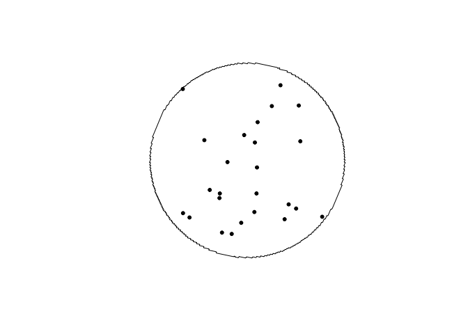
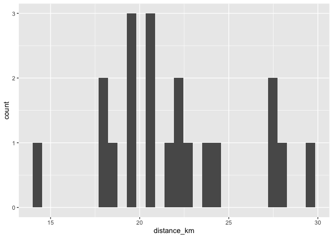
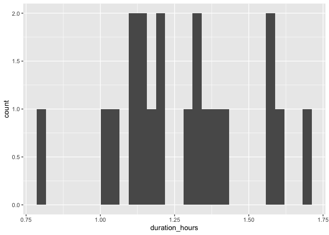
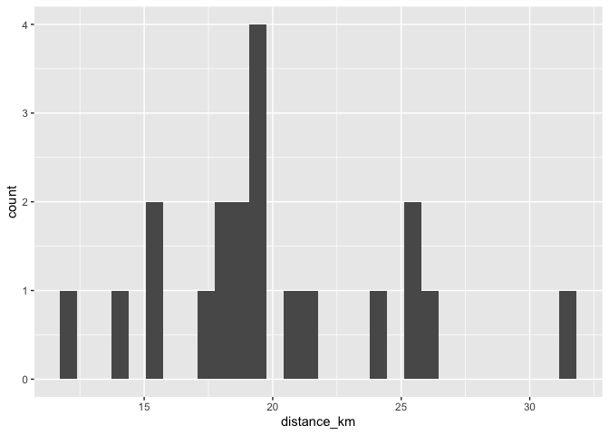
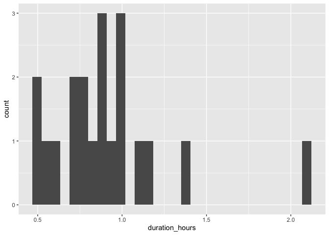
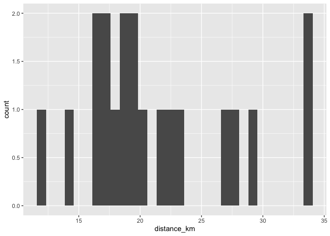
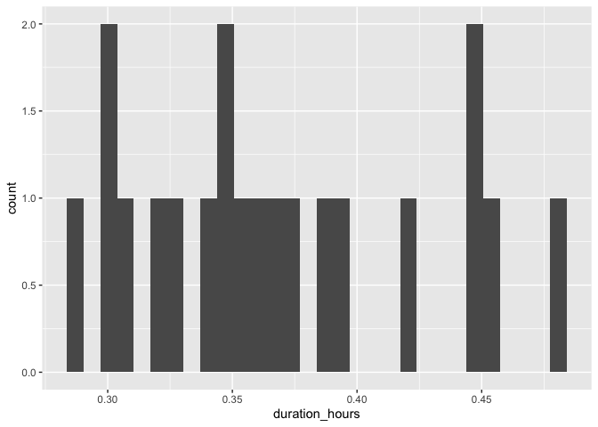
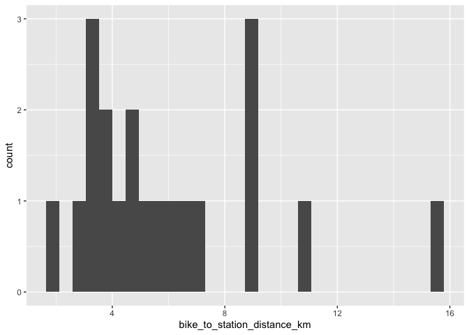
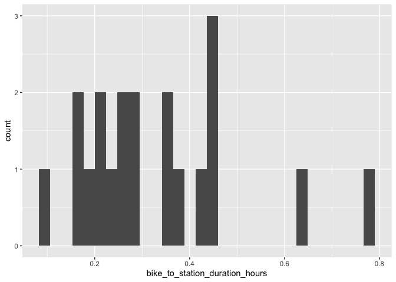

# Montreal

## Brossard Station

### Draw buffer and select points


```r
destination <- "Musee d'art contemporain de Montreal, Montreal, Canada"        #### EDIT ME
```

### Set origin point


```r
origin <- "Brossard Station, Montreal, Canada"    #### EDIT ME
```

#### Setup departure location and arrival time


```r
arrival_time <- as.POSIXct("2024-06-11 08:30:00", tz = "America/Toronto")       #### EDIT ME
```

#### List of variables for geocoding


```r
var_list <- c("var1", "var2", "var3", "var4", "var5", "var6", "var7", "var8", "var9", "var10", "var11", "var12", "var13", "var14", "var15", "var16", "var17", "var18", "var19", "var20")
```


```r
stations <- geocode(location = origin, output = "more", source = "google")
```

```
## ℹ <https://maps.googleapis.com/maps/api/geocode/json?address=Brossard+Station,+Montreal,+Canada&key=xxx>
```

```r
stations_sf <- stations %>%
                st_as_sf(coords = c("lon", "lat"), crs = 4326)

stations_buffer = st_buffer(stations_sf, 5000)

stations_buffer <- as_sf(stations_buffer)
```

#### Interactive map view of buffers


```r
mapview(stations_buffer)
```

```{=html}
<div class="leaflet html-widget html-fill-item" id="htmlwidget-631394283d5800e15af8" style="width:672px;height:480px;"></div>
<script type="application/json" data-for="htmlwidget-631394283d5800e15af8">{"x":{"options":{"minZoom":1,"maxZoom":52,"crs":{"crsClass":"L.CRS.EPSG3857","code":null,"proj4def":null,"projectedBounds":null,"options":{}},"preferCanvas":false,"bounceAtZoomLimits":false,"maxBounds":[[[-90,-370]],[[90,370]]]},"calls":[{"method":"addProviderTiles","args":["CartoDB.Positron","CartoDB.Positron","CartoDB.Positron",{"errorTileUrl":"","noWrap":false,"detectRetina":false,"pane":"tilePane"}]},{"method":"addProviderTiles","args":["CartoDB.DarkMatter","CartoDB.DarkMatter","CartoDB.DarkMatter",{"errorTileUrl":"","noWrap":false,"detectRetina":false,"pane":"tilePane"}]},{"method":"addProviderTiles","args":["OpenStreetMap","OpenStreetMap","OpenStreetMap",{"errorTileUrl":"","noWrap":false,"detectRetina":false,"pane":"tilePane"}]},{"method":"addProviderTiles","args":["Esri.WorldImagery","Esri.WorldImagery","Esri.WorldImagery",{"errorTileUrl":"","noWrap":false,"detectRetina":false,"pane":"tilePane"}]},{"method":"addProviderTiles","args":["OpenTopoMap","OpenTopoMap","OpenTopoMap",{"errorTileUrl":"","noWrap":false,"detectRetina":false,"pane":"tilePane"}]},{"method":"createMapPane","args":["polygon",420]},{"method":"addPolygons","args":[[[[{"lng":[-73.49368976433844,-73.49401900773449,-73.49467746391912,-73.49500667670854,-73.49423698255394,-73.49456619875653,-73.49489540475787,-73.49522460055837,-73.49445494471374,-73.49511333294039,-73.49544251175364,-73.49467289421537,-73.49500207644141,-73.49533124846806,-73.49475405407028,-73.49483634803551,-73.49464395043707,-73.49489083106025,-73.49554915134237,-73.49477959679567,-73.49510875524979,-73.495437903506,-73.49466837364648,-73.49532666678545,-73.49455716161148,-73.49488630649391,-73.4952154411795,-73.49444596068945,-73.49477509878636,-73.49439036439541,-73.49455493302207,-73.49417020139981,-73.49433477087919,-73.49466390219079,-73.49399063818743,-73.49403178037269,-73.49393559985512,-73.49422359217948,-73.494552716706,-73.49378329665227,-73.4941124245891,-73.49353536809106,-73.49361765103323,-73.49342529940101,-73.4940012681069,-73.49323188380366,-73.49356100836492,-73.49298397867888,-73.49306626077701,-73.49287391808207,-73.49312076310413,-73.49344988088011,-73.49268053232383,-73.49300965350868,-73.49224031602333,-73.49256944061663,-73.4919924460429,-73.49207472814881,-73.49188239715791,-73.49212924220325,-73.49174458484745,-73.49190914842583,-73.49152449383756,-73.49201817948321,-73.49124888880968,-73.49157801343239,-73.49080873382809,-73.49113786185771,-73.49036859332233,-73.49069772475848,-73.48992846729175,-73.49025760213398,-73.48953643370962,-73.48955700509562,-73.4895089271747,-73.48981749398352,-73.48914441320784,-73.48918555625944,-73.48908940191725,-73.48937740030641,-73.488704329215,-73.4887454726922,-73.48864931973348,-73.4889373211019,-73.4882642596945,-73.48830540359728,-73.488209252022,-73.48849725636931,-73.48777612944845,-73.48779670168562,-73.48774862653164,-73.48805720610797,-73.48728801504687,-73.48761717031712,-73.48684799032262,-73.4871771489961,-73.48640798006788,-73.48673714214419,-73.48596798428194,-73.48629714976067,-73.48552800296413,-73.48514342861773,-73.48530801773055,-73.48492344615056,-73.48508803611372,-73.48441504027517,-73.48445618885461,-73.48436004664636,-73.48464808373002,-73.48387895653616,-73.48420814581232,-73.48343902968348,-73.48305447067135,-73.48321907168157,-73.48283451543567,-73.48299911729583,-73.4823261482918,-73.48236729984529,-73.48227116147059,-73.48255921937246,-73.48179012284604,-73.4821193359127,-73.48135025045065,-73.48077343469629,-73.48085574231629,-73.48066347093183,-73.48091039251786,-73.48014131559395,-73.48047054904696,-73.47970148318706,-73.47912468213488,-73.4792069948509,-73.47901472836719,-73.47926166524105,-73.47810807831235,-73.47827270990125,-73.47788818305979,-73.47805281549761,-73.4772837667155,-73.47761303753464,-73.4768439998161,-73.47607495957372,-73.47640424737489,-73.47563521819599,-73.47496231559464,-73.47500347903747,-73.47490735014902,-73.47519549127547,-73.47442647063677,-73.4738497035023,-73.47393203404889,-73.47373977887122,-73.47398676923586,-73.47321775713793,-73.47249680600569,-73.47251738992236,-73.4724693264878,-73.47277808125557,-73.47200907769894,-73.47124007162101,-73.47156942733405,-73.47080043231928,-73.47003143478383,-73.47036080747077,-73.46959182099843,-73.46805384049398,-73.46838324373587,-73.46761426328706,-73.46684528031925,-73.46646078789082,-73.46662550266655,-73.46624101300397,-73.46640572862641,-73.46563675420336,-73.46429104290439,-73.46437340909694,-73.46418116484509,-73.46442826214583,-73.46365929375077,-73.46289032283875,-73.4621213494102,-73.46245084429756,-73.46168188193269,-73.46014394965563,-73.45937497974428,-73.45970451875257,-73.45893555990524,-73.45816659854344,-73.45739763466761,-73.45662866827814,-73.45605194183672,-73.45613434111959,-73.45594209950693,-73.45618929607707,-73.4546513778883,-73.4531134496508,-73.45157551136784,-73.45119102522787,-73.45135586387856,-73.45097138050501,-73.45113621999974,-73.45036725815784,-73.44959829380603,-73.44882932694472,-73.44806035757432,-73.44729138569522,-73.44652241130787,-73.44575343441265,-73.44498445500997,-73.44421547310026,-73.44344648868392,-73.44267750176134,-73.44190851233297,-73.44113952039919,-73.44037052596043,-73.4396015290171,-73.43943658771506,-73.43905208491111,-73.43866758148117,-73.43883252956958,-73.43806352761831,-73.4372945231637,-73.43652551620615,-73.43619557676077,-73.43465752819455,-73.4331194696223,-73.4315814010473,-73.43133387869219,-73.43114161687255,-73.4310591072966,-73.43048231835573,-73.42971326424774,-73.42894420764088,-73.42817514853557,-73.42740608693225,-73.42707597778526,-73.42630690011376,-73.42476873728008,-73.42447984777773,-73.42438371078481,-73.42434244000563,-73.42366947847896,-73.42290037725172,-73.42213127352932,-73.42181138178488,-73.42178734684254,-73.42177702758117,-73.42103194274954,-73.41949369569299,-73.41916343377682,-73.41839429293854,-73.41762514960755,-73.41729485033684,-73.41575652905902,-73.41546748506987,-73.41537133817491,-73.4153300453259,-73.41465701448718,-73.41388783405075,-73.41356262224032,-73.41355060356753,-73.41354544139216,-73.41201906458602,-73.41168865324626,-73.41091943820152,-73.41075422191476,-73.41036961006671,-73.41020438783271,-73.40981977197015,-73.40905053837903,-73.40874072072144,-73.40869264274431,-73.40867198786141,-73.40795081624324,-73.40718156410787,-73.4068510542603,-73.40608178606882,-73.40575125242987,-73.40498196818274,-73.40473405106773,-73.40454172707325,-73.40445908590893,-73.40388211044926,-73.40371682111504,-73.40333216663961,-73.403166871357,-73.40278221286798,-73.40201289402681,-73.40168227543853,-73.40091294054379,-73.40058229816054,-73.39981294721271,-73.39948228103363,-73.39871291403317,-73.3983822240574,-73.39761284100481,-73.39728212723149,-73.39651272812726,-73.39618199055553,-73.39541257540013,-73.39508181402913,-73.39491642950765,-73.39453171082188,-73.39436632035027,-73.39398159765189,-73.39381620123005,-73.39343147451909,-73.39326607214694,-73.39288134142348,-73.39255052222052,-73.39178104534348,-73.39145020233792,-73.39068070941153,-73.39006032575061,-73.38996413577979,-73.3899227753779,-73.38924944301391,-73.38891854216712,-73.38814900357175,-73.38781807891904,-73.38748714403172,-73.38671757581614,-73.3863866171213,-73.38605564819069,-73.38528605035484,-73.3849550576151,-73.38462405463845,-73.38385442718221,-73.38352340039484,-73.38319236336937,-73.38242270629272,-73.38209164545491,-73.38151226435031,-73.38131984036262,-73.38123706822505,-73.3806597927897,-73.38032868765831,-73.37999757228607,-73.37974922903609,-73.37955679424937,-73.3794740110374,-73.37889670320511,-73.37856555377462,-73.37790322418593,-73.37713343752117,-73.37680224378603,-73.37647103980692,-73.37613982558334,-73.37580860111493,-73.37547736640124,-73.37531174520228,-73.37492681360784,-73.37476118645301,-73.37437625084704,-73.37371370303354,-73.37305111423093,-73.3723884844358,-73.37172581364473,-73.37106310185438,-73.37040034906134,-73.36973755526222,-73.36907472045364,-73.36841184463223,-73.36774892779458,-73.3685190700055,-73.36818760978866,-73.36785613931681,-73.36752465858955,-73.3671931676064,-73.36686166636697,-73.36763187403788,-73.36730037612766,-73.36663734953638,-73.36630582085446,-73.36707608040741,-73.36674455505479,-73.36641301944398,-73.36608147357457,-73.36646662280887,-73.36630084942415,-73.3666860014397,-73.3661886760883,-73.36585711302966,-73.36643486537771,-73.36635197555796,-73.36654456021542,-73.36629588945684,-73.36596431946779,-73.36563273921821,-73.36640311368136,-73.36573994958094,-73.36641404899999,-73.36637260136747,-73.3664689013429,-73.36617876491249,-73.36584717080035,-73.36623238305963,-73.36606658555343,-73.366451800595,-73.36595440287766,-73.36633962749808,-73.36617382652607,-73.36655905392898,-73.36639325378968,-73.36606164581406,-73.36644688279642,-73.3662810783585,-73.36666631812358,-73.36616889961071,-73.36684308556057,-73.36680163446239,-73.3668979467994,-73.36660778610883,-73.3662761642688,-73.36704668707044,-73.3667150685621,-73.36710033583711,-73.36693452613294,-73.36731979619114,-73.36715398731999,-73.3668223618794,-73.36758088058302,-73.36757569906321,-73.36758773902669,-73.36726129843501,-73.36692966606194,-73.36770024945702,-73.36736862041664,-73.36813921494614,-73.36780758923888,-73.368192892379,-73.36802707907555,-73.36841238499942,-73.36824657252936,-73.36791493988999,-73.36868557028878,-73.36835394098323,-73.36912458251786,-73.36879295654651,-73.36937094628063,-73.36928804073385,-73.36948070452054,-73.36923198658056,-73.36961731879222,-73.36945150702434,-73.36983684202019,-73.36967103108607,-73.36933940151793,-73.37011009006375,-73.36977846383095,-73.37054916351433,-73.37021754061726,-73.37098825143846,-73.37065663187755,-73.37142735383689,-73.37109573761256,-73.37186647071033,-73.37153485782295,-73.37230560205946,-73.37197399250947,-73.37274474788499,-73.37241314167278,-73.37318390818764,-73.37285230531363,-73.37362308296811,-73.37329148343268,-73.37406227222709,-73.37373067603069,-73.37450147596532,-73.37416988310834,-73.37494069418346,-73.37532609879585,-73.37516030872276,-73.37554571612027,-73.37537992688229,-73.37576533706498,-73.37559954866214,-73.37598496163007,-73.37581917406243,-73.37656591652386,-73.37655555512765,-73.37657964356887,-73.37625843572464,-73.3770292777552,-73.37669771186961,-73.37746856504168,-73.37785399070202,-73.37768821411628,-73.37807364256201,-73.37790786681191,-73.37858237106138,-73.37854092821145,-73.37863728601972,-73.37834718306659,-73.37911805605357,-73.3787865138065,-73.37955739793564,-73.38013555941184,-73.38005267820085,-73.38024539923495,-73.37999675430387,-73.38076764710566,-73.38043612515901,-73.38188156802811,-73.38184013025337,-73.3819364930152,-73.38164642558893,-73.38241733820543,-73.38280279358706,-73.38263704745283,-73.38302250562012,-73.38285676032254,-73.38362768161069,-73.38329619692925,-73.38406712936042,-73.38483805931963,-73.38450659160075,-73.38527753270306,-73.38585573690719,-73.38577287433007,-73.38596560960667,-73.38571702057811,-73.38648797035103,-73.3870661810577,-73.38698332272197,-73.38717606016606,-73.38692748386187,-73.38769844230485,-73.38837302891316,-73.38833160215918,-73.3884279717328,-73.38813798145257,-73.38890894856507,-73.38967991320311,-73.38934851335077,-73.39011948913223,-73.39089046243859,-73.39055907955697,-73.39133006400684,-73.39210104598099,-73.3927756531772,-73.39273423448959,-73.39283060700423,-73.39254067318946,-73.39408265199548,-73.39446814514889,-73.39430248217977,-73.39468797811895,-73.39452231598868,-73.39529331281938,-73.39606430717224,-73.39644980341939,-73.39628415574926,-73.39666965478216,-73.39650400795124,-73.39804601150789,-73.39872063494569,-73.39867922773243,-73.39877560256713,-73.3984857490737,-73.39925675827631,-73.40002776499901,-73.40079876924142,-73.40118427043238,-73.40101866017679,-73.40140416415339,-73.40123855473787,-73.40200956764215,-73.40432259146527,-73.40399141943391,-73.40476243603517,-73.40553345015361,-73.40630446178884,-73.40707547094041,-73.40784647760796,-73.40861748179105,-73.40934029595593,-73.4093196032712,-73.40936779085774,-73.40905739657545,-73.4098284094149,-73.40999394734108,-73.41037944942208,-73.41076495088164,-73.41059941976884,-73.41214143301858,-73.41368343632134,-73.41522542967382,-73.41676741307272,-73.41830938651471,-73.41985134999653,-73.42139330351482,-73.42293524706631,-73.42447718064766,-73.42524814369851,-73.42557894441424,-73.42634989134069,-73.42712083577277,-73.42789177771004,-73.42866271715214,-73.42943365409859,-73.43020458854902,-73.43053529722624,-73.43284804470215,-73.43361895553225,-73.43390826950532,-73.43400463169245,-73.43404596140643,-73.43472049413215,-73.43549138633311,-73.43626227603475,-73.43703316323666,-73.43736374235939,-73.43813461342876,-73.43890548199737,-73.43907075408347,-73.43945618402174,-73.43962145013796,-73.44000687604277,-73.44077772597598,-73.44154857340699,-73.44186873620149,-73.44189282473066,-73.44190315238934,-73.44342072396164,-73.44358595172018,-73.44397136176939,-73.4441365835586,-73.44452198957363,-73.44529279972545,-73.44545800872906,-73.44584340945754,-73.44600861249207,-73.44716480069513,-73.44732999094427,-73.44771538235096,-73.44788056663126,-73.44826595400322,-73.4490367268674,-73.44928448314997,-73.44947717341816,-73.44955975671346,-73.45090857823895,-73.45123888116203,-73.4520096192384,-73.45217476004342,-73.45256012473277,-73.45272525956968,-73.45311062022364,-73.45388133964983,-73.45421158119505,-73.45498228447889,-73.45522994869428,-73.45542262156692,-73.45550517417362,-73.45608318929401,-73.45624828747562,-73.45663362669647,-73.45679871891065,-73.45718405409561,-73.45795472258212,-73.45828487888406,-73.45905553122614,-73.45938566365975,-73.46015629985693,-73.46048382948956,-73.46048984996929,-73.46049242890197,-73.46125702847488,-73.46154585314663,-73.46164217898534,-73.46168343880012,-73.46235771708037,-73.46264652086957,-73.46274284469003,-73.46278410152162,-73.46345836567379,-73.46376777563194,-73.46381593648466,-73.46383656344221,-73.46455897425551,-73.46488898736047,-73.46565954282595,-73.46598953206779,-73.46676007138548,-73.46709003676509,-73.46786055993451,-73.46835546837589,-73.46874071879306,-73.46890567975117,-73.46929092613111,-73.46962083356046,-73.47039131080065,-73.47072119437108,-73.47088613232108,-73.47127135977354,-73.47143629175912,-73.47182151517411,-73.47215136466009,-73.47292179596995,-73.47341653057978,-73.47380173506696,-73.47396663808344,-73.47435183853298,-73.47468163008246,-73.47484652202313,-73.47523171162001,-73.47539659759728,-73.47578178315644,-73.47627641553107,-73.47666159023771,-73.47682645917718,-73.477211629846,-73.47754135324367,-73.47770621110931,-73.47809137092574,-73.47825622282878,-73.47864137860731,-73.47930074703855,-73.48007102944604,-73.480400684703,-73.48073032974054,-73.48105996455904,-73.48183020355863,-73.48215981453116,-73.48281900582306,-73.48298379726026,-73.48336889196581,-73.48353367744221,-73.48391876810967,-73.48424832458701,-73.48457787084851,-73.48490740689459,-73.48523693272566,-73.48600705766205,-73.48633655965335,-73.48699553299487,-73.48831335712543,-73.48963101787525,-73.49094851527141,-73.49226584934098,-73.49358302011098,-73.49281320847302,-73.49314248927097,-73.49347175986448,-73.49380102025398,-73.49413027043992,-73.49445951042267,-73.49368976433844],"lat":[45.44587520732297,45.44531973980575,45.44420882075662,45.44365336922498,45.44353934670293,45.44298390488781,45.44242846840147,45.44187303724403,45.44175902187986,45.4406481843269,45.44009277354407,45.43997876533746,45.43942336427102,45.43886796853382,45.43878246501941,45.43864361774038,45.43861511609262,45.43819857707661,45.43708782102311,45.43697382274394,45.43641845709822,45.43586309678208,45.43574910127323,45.43463840540317,45.43452441266474,45.43396907711079,45.43341374688662,45.43329975691871,45.43274443641074,45.4326874413692,45.43240978421049,45.43235278876504,45.43207513403539,45.43151982857347,45.43142008869055,45.43135067636232,45.43133642750104,45.430850544015,45.4302952535992,45.43018126755745,45.4296259868578,45.42954049667784,45.42940167815814,45.42937318095548,45.42840146256403,45.42828747767859,45.4277322217412,45.42764673242876,45.42750792009961,45.42747942318619,45.42706298901991,45.42650774812871,45.42639376440037,45.42583853322525,45.42572454788277,45.42516932642372,45.42508383676891,45.42494503305934,45.42491653603189,45.42450012772436,45.42444313418925,45.42416553141305,45.42410853747454,45.42327574043055,45.42316175463289,45.42260656765214,45.4224925802412,45.4219374029765,45.42182341395248,45.42126824640383,45.42115425576692,45.42059909793432,45.42049223037608,45.42045753344551,45.4204504087713,45.41992995756819,45.41983021326693,45.41976082060685,45.41974657111459,45.41926082530563,45.41916107959362,45.41909168814805,45.41907743845426,45.41859170114685,45.41849195402427,45.41842256379321,45.41840831389792,45.41792258509206,45.41781571148815,45.41778101698659,45.41777389190936,45.41725347714145,45.4171394768315,45.41658437729523,45.41647037537381,45.41591528555361,45.41580128202092,45.41524620191677,45.41513219677301,45.41457712638493,45.41446311963031,45.41440611400407,45.41412858409848,45.41407157806959,45.41379405059301,45.41369428835399,45.41362490717281,45.41361065511811,45.41312498966131,45.41301097368876,45.41245593683542,45.41234191925277,45.41228490821268,45.4120073950746,45.41195038363205,45.411672872923,45.4115731012105,45.41150372422123,45.41148947081321,45.41100383469963,45.41088980790104,45.4103348045829,45.41022077617497,45.41013525093403,45.40999650285651,45.40996799396753,45.40955175255593,45.40943771654285,45.4088827370441,45.40876869942226,45.40868316727105,45.40854442514846,45.40851591395613,45.4080996904093,45.40792862032164,45.40765114291298,45.40759411764944,45.40731664266983,45.40720258983985,45.40664764826476,45.40653359382696,45.40641953339365,45.40586460592269,45.40575054388193,45.40565073467818,45.40558137014742,45.4055671113836,45.40508156247927,45.40496749283604,45.40488193666924,45.40474321108001,45.40471469188262,45.40429851793574,45.40418444069054,45.40407748782837,45.40404280733285,45.40403567697184,45.40351547229337,45.4034013874467,45.40328729660504,45.40273242555343,45.40261833310579,45.40250423466328,45.40194937771719,45.40183527766907,45.40160705958856,45.40105222113782,45.40093810749509,45.40082398785772,45.40076692579103,45.40048951405046,45.4004324515826,45.40015504227119,45.40004091503459,45.39984117794609,45.39970247680805,45.39967394171402,45.39925784112044,45.39914370029066,45.39902955346641,45.39891540064765,45.39836061768866,45.39824646326642,45.39801813643876,45.39790396403327,45.39734920396495,45.39723502995668,45.39712084995408,45.39700666395711,45.39689247196574,45.39680682403836,45.39666814006885,45.39663959028494,45.3962235411967,45.39599513602693,45.39576670687975,45.39553825375486,45.39548113672709,45.39520378660946,45.39514666918148,45.39486932149315,45.39475508433825,45.39464084118899,45.3945265920453,45.39441233690716,45.39429807577453,45.39418380864738,45.39406953552565,45.39395525640933,45.39384097129837,45.39372668019272,45.39361238309235,45.39349807999724,45.39338377090732,45.39326945582258,45.39315513474297,45.39343244946717,45.39337528558007,45.39331812019423,45.39304080766845,45.39292647459899,45.39281213553454,45.39269779047507,45.3932524036649,45.39302368676513,45.39279494588401,45.39256618102124,45.39298212461232,45.39295352649343,45.39309217474707,45.39300637731719,45.39289197549775,45.39277756768254,45.39266315387153,45.39254873406468,45.39310330950494,45.39298887930191,45.39276000090742,45.39324524722841,45.39323094105103,45.39330026221759,45.39320011587114,45.3930856572821,45.39297119269658,45.3935084222958,45.39350484504762,45.39352217511346,45.39341127738204,45.39318230942393,45.39373686120334,45.39362236382642,45.3935078604524,45.39406240874211,45.39383337519607,45.39431860160396,45.39430428572915,45.3943736040508,45.39427338982154,45.39415885365101,45.39470473020761,45.39470294046462,45.39471160521231,45.39448429581331,45.39503883362408,45.39492427065068,45.39520153934637,45.39514425450904,45.39542152343189,45.39536423599363,45.39524965661826,45.39576953323375,45.39576237156547,45.39579703015534,45.39568960206108,45.39557500628262,45.39612953800626,45.39601493182256,45.3965694644525,45.39645484786296,45.39687074751659,45.39684209160549,45.39698072521196,45.39689475440249,45.39717202095873,45.39711470410904,45.39739197089141,45.39733465143988,45.39722000803705,45.39777453897385,45.39765988516306,45.39821441700306,45.39809975278371,45.39865428552624,45.39853961089772,45.3990941445421,45.39897945950379,45.39953399404933,45.39941929860061,45.39997383404664,45.39985912818689,45.40041366453274,45.40069093469682,45.40063357620867,45.40091084659752,45.40085348550631,45.40113075611985,45.40107339242551,45.40135066326363,45.40129329696609,45.40184784041863,45.40173309891075,45.40228764326076,45.40217289133901,45.40321266803127,45.40319832258492,45.40326764162567,45.40316722039246,45.40372177184341,45.40360699467945,45.40416154702551,45.4047161046792,45.40460131268596,45.40515587123377,45.40571043508878,45.40559562826472,45.40615019301286,45.40670476306774,45.40658994141133,45.40714451235836,45.40769908861169,45.4075842521214,45.40813882926589,45.40910935203589,45.40908063893956,45.40921928610001,45.40913314373105,45.40968773237699,45.41024232632822,45.41065827527313,45.41062955736347,45.41076820739889,45.41068205058955,45.41123665073449,45.4123458669383,45.41223097268674,45.4127855843282,45.41334020127379,45.41389482352336,45.41444945107677,45.41500408393389,45.4152814023513,45.41522394082436,45.4155012594631,45.41544379532959,45.41655307872423,45.41766238333084,45.41877170914833,45.41988105617558,45.42099042441154,45.42209981385508,45.42320922450512,45.42431865636058,45.42542810942034,45.42653758368333,45.42665259884804,45.42720734835218,45.42776210315687,45.428316863262,45.42887162866742,45.42942639937299,45.42954143063514,45.43009621106316,45.4312057878192,45.43176058414696,45.4318756270859,45.4324304331362,45.43298524448616,45.43354006113567,45.43359758698431,45.43387499840215,45.43393252385295,45.43476476937298,45.43531960634383,45.43540589999427,45.43554461089439,45.43557337496912,45.43598951048607,45.43654436247878,45.43709921977054,45.43721428447464,45.43832402380261,45.43842470822552,45.43849406812114,45.43850845130325,45.43899397337474,45.43954886070982,45.43960639664566,45.43988384340625,45.43994137894399,45.44077373049192,45.44083126784359,45.44110872211495,45.44116625906848,45.44144371577055,45.44199863314866,45.44205617191613,45.44233363369823,45.44239117206748,45.44322356867982,45.44332426301318,45.4433936304196,45.4434080150174,45.44389358966428,45.44444853708514,45.44456361877847,45.44511857592225,45.44517611672446,45.44545359838939,45.44551113879322,45.4457886228889,45.44634359505398,45.44645687986034,45.44646555141051,45.44646734953611,45.44701365987289,45.44756864705922,45.44768373282094,45.44823872973025,45.44835381389787,45.44890882053019,45.44896636256924,45.44924386897844,45.44930141061889,45.44957891945882,45.45013394111236,45.45024902651598,45.45080405789253,45.45091914170142,45.45147418280101,45.45156049502582,45.45169925695823,45.4517280272239,45.45214431583758,45.45220185689948,45.45247938540383,45.45253692606692,45.45281445700203,45.4533695228459,45.45348460629418,45.4540396818611,45.45415476371381,45.45470984900379,45.45482492926073,45.45538002427377,45.45549510293472,45.45605020767081,45.45616528473559,45.45672039919474,45.45683547466314,45.45739059884533,45.45750567271715,45.45806080662238,45.45817587889742,45.45873102252572,45.45884609320376,45.4594012465551,45.45951631563596,45.46007147871036,45.46018654619381,45.46074171899126,45.46085678487712,45.46091431556174,45.46119190726576,45.4612494375509,45.46152703168568,45.46158456157133,45.46186215813687,45.46191968762299,45.46219728661929,45.46230874785713,45.46232609797232,45.46232969340635,45.46286754967773,45.46298260474691,45.46353782086081,45.46365287433142,45.46371039880817,45.46398801217028,45.46404553624731,45.46432315204016,45.46442381748728,45.46449322212636,45.46450760259721,45.46499343787294,45.46510848212265,45.46566373182954,45.4657787744799,45.46586505251489,45.46600386770501,45.46603262657356,45.46644907496057,45.46656410998793,45.46711938356447,45.46733506629969,45.46740447690612,45.4674188550713,45.46790473211868,45.46801975792226,45.46807726856514,45.46835491773142,45.46841242797416,45.46869007957115,45.46880509775034,45.46936040934225,45.46947542592059,45.4695904364749,45.47014576221261,45.47026077116571,45.47034702392717,45.47048585812468,45.47051460856856,45.47093111397789,45.47104611530523,45.4711323623473,45.47127120008113,45.47129994861852,45.4717164646368,45.47183145833791,45.47193207288446,45.47200149354718,45.4720158667464,45.47250181418808,45.47261680026243,45.47273178031224,45.47328716263043,45.47340214107754,45.47351711349997,45.4740725099626,45.47418748078196,45.47430244557652,45.47440303482956,45.47447246134907,45.4744868309349,45.47497281937439,45.47520272768188,45.47526020099319,45.47553791602158,45.47559538893189,45.4758731063909,45.47598804990318,45.47610298739048,45.47616045387478,45.47643817818499,45.47649564426814,45.47677337100897,45.47700322469922,45.47710377811032,45.47717321159111,45.47718757605663,45.47767361322548,45.47778852942779,45.47790343960495,45.47801834375697,45.47807579357357,45.4783535386557,45.47841098807084,45.47868873558354,45.47880363210454,45.47914828551634,45.47970380219486,45.47981867903366,45.47993354984718,45.48004841463546,45.48016327339855,45.48027812613647,45.48039297284926,45.48050063617049,45.48053535805459,45.48054253543831,45.48106336644513,45.48117820552498,45.4809004261992,45.48095784237539,45.48101525704531,45.48129303857962,45.48152268661338,45.48175231054672,45.48198191037995,45.48221148611336,45.48244103774724,45.48267056528192,45.48290006871769,45.48312954805485,45.48335900329371,45.48347372187636,45.48291807625009,45.48303278439539,45.48314748651648,45.48326218261339,45.48337687268614,45.4834915567348,45.48360623475939,45.48305056796815,45.48339455266404,45.48350920218188,45.48302298265636,45.48303731294014,45.4829678532709,45.48306816213969,45.48318279519992,45.48329742223675,45.48341204325024,45.48285635179458,45.48297096237525,45.48308556693284,45.48280771878738,45.48286501770528,45.48258716978545,45.48264446609542,45.48275905419826,45.48287363627836,45.4823352990357,45.4823388794952,45.48232151385639,45.48254707067721,45.48226921682279,45.48232649627585,45.48204864264768,45.48210591949329,45.48222046866789,45.48194261306246,45.48199988428967,45.48172202891076,45.48189383025431,45.48161597289869,45.48167323590065,45.48139537877181,45.48145263916675,45.48156715544042,45.48115036728111,45.48117899458255,45.48104006558501,45.48124044423013,45.48068472385166,45.48079921325004,45.48052135285121,45.48057859419126,45.48030073401992,45.48035797275355,45.48047244570519,45.47991672274195,45.48003118526854,45.4796143932312,45.47964300709639,45.47950407680648,45.47958991531868,45.47931205408418,45.47936927677672,45.4790914157703,45.47914863585694,45.47926307151522,45.47870734688463,45.47882177211994,45.47826604840302,45.47838046321599,45.47782908197722,45.47782997578512,45.47782563422106,45.47793914480468,45.47745288786229,45.47746718750651,45.47739772249259,45.4774978168873,45.47701156074616,45.47702585908779,45.47695639418835,45.47705647946515,45.47653549175741,45.47654264027153,45.47650790790667,45.47661513253955,45.47605941340121,45.47617377611177,45.4756180578912,45.47573241018313,45.47517669288101,45.47529103475492,45.47445746217513,45.47451462755572,45.47423677158888,45.47429393436528,45.47373822422161,45.47385254086234,45.47329683163947,45.473018979023,45.47307613178795,45.47279827940186,45.47285542956303,45.47229972658188,45.47241401799358,45.47158046690083,45.4716376070522,45.47135975824892,45.47141689579691,45.4708611999824,45.47058335407057,45.47064048681666,45.47036264113587,45.47041977127881,45.46958623892102,45.46964336426259,45.46936552170501,45.4694226444437,45.46886696112179,45.4685891214566,45.46864623939442,45.46836839996076,45.46842551529595,45.46731416647151,45.46742838383995,45.46687271301638,45.46631704751572,45.46576138733811,45.46587558550786,45.46531992625895,45.46420862373176,45.46393080142727,45.46398789056734,45.46371006849537,45.46376715503381,45.46321151268609,45.46265587566259,45.46210024396343,45.46154461758876,45.46165876858352,45.46110314314074,45.45999190823009,45.45776950231229,45.45554718160638,45.45332494612107,45.45110279586508,45.44888073084709,45.44876668084226,45.44821118229605,45.44765568907773,45.44710020118744,45.4465447186253,45.44598924139145,45.44587520732297]}]]],null,"stations_buffer",{"crs":{"crsClass":"L.CRS.EPSG3857","code":null,"proj4def":null,"projectedBounds":null,"options":{}},"pane":"polygon","stroke":true,"color":"#333333","weight":0.5,"opacity":0.9,"fill":true,"fillColor":"#6666FF","fillOpacity":0.6,"smoothFactor":1,"noClip":false},"<div class='scrollableContainer'><table class=mapview-popup id='popup'><tr class='coord'><td><\/td><th><b>Feature ID&emsp;<\/b><\/th><td>1&emsp;<\/td><\/tr><tr><td>1<\/td><th>type&emsp;<\/th><td>establishment&emsp;<\/td><\/tr><tr><td>2<\/td><th>loctype&emsp;<\/th><td>geometric_center&emsp;<\/td><\/tr><tr><td>3<\/td><th>address&emsp;<\/th><td>station brossard, brossard, qc j4z 3h8, canada&emsp;<\/td><\/tr><tr><td>4<\/td><th>north&emsp;<\/th><td>45.43927&emsp;<\/td><\/tr><tr><td>5<\/td><th>south&emsp;<\/th><td>45.43657&emsp;<\/td><\/tr><tr><td>6<\/td><th>east&emsp;<\/th><td>-73.42931&emsp;<\/td><\/tr><tr><td>7<\/td><th>west&emsp;<\/th><td>-73.432&emsp;<\/td><\/tr><tr><td>8<\/td><th>geometry&emsp;<\/th><td>sfc_POLYGON&emsp;<\/td><\/tr><\/table><\/div>",{"maxWidth":800,"minWidth":50,"autoPan":true,"keepInView":false,"closeButton":true,"closeOnClick":true,"className":""},"1",{"interactive":false,"permanent":false,"direction":"auto","opacity":1,"offset":[0,0],"textsize":"10px","textOnly":false,"className":"","sticky":true},{"stroke":true,"weight":1,"opacity":0.9,"fillOpacity":0.84,"bringToFront":false,"sendToBack":false}]},{"method":"addScaleBar","args":[{"maxWidth":100,"metric":true,"imperial":true,"updateWhenIdle":true,"position":"bottomleft"}]},{"method":"addHomeButton","args":[-73.49554915134237,45.39254873406468,-73.36563273921821,45.48360623475939,true,"stations_buffer","Zoom to stations_buffer","<strong> stations_buffer <\/strong>","bottomright"]},{"method":"addLayersControl","args":[["CartoDB.Positron","CartoDB.DarkMatter","OpenStreetMap","Esri.WorldImagery","OpenTopoMap"],"stations_buffer",{"collapsed":true,"autoZIndex":true,"position":"topleft"}]},{"method":"addLegend","args":[{"colors":["#6666FF"],"labels":["stations_buffer"],"na_color":null,"na_label":"NA","opacity":1,"position":"topright","type":"factor","title":"","extra":null,"layerId":null,"className":"info legend","group":"stations_buffer"}]}],"limits":{"lat":[45.39254873406468,45.48360623475939],"lng":[-73.49554915134237,-73.36563273921821]},"fitBounds":[45.39254873406468,-73.49554915134237,45.48360623475939,-73.36563273921821,[]]},"evals":[],"jsHooks":{"render":[{"code":"function(el, x, data) {\n  return (\n      function(el, x, data) {\n      // get the leaflet map\n      var map = this; //HTMLWidgets.find('#' + el.id);\n      // we need a new div element because we have to handle\n      // the mouseover output separately\n      // debugger;\n      function addElement () {\n      // generate new div Element\n      var newDiv = $(document.createElement('div'));\n      // append at end of leaflet htmlwidget container\n      $(el).append(newDiv);\n      //provide ID and style\n      newDiv.addClass('lnlt');\n      newDiv.css({\n      'position': 'relative',\n      'bottomleft':  '0px',\n      'background-color': 'rgba(255, 255, 255, 0.7)',\n      'box-shadow': '0 0 2px #bbb',\n      'background-clip': 'padding-box',\n      'margin': '0',\n      'padding-left': '5px',\n      'color': '#333',\n      'font': '9px/1.5 \"Helvetica Neue\", Arial, Helvetica, sans-serif',\n      'z-index': '700',\n      });\n      return newDiv;\n      }\n\n\n      // check for already existing lnlt class to not duplicate\n      var lnlt = $(el).find('.lnlt');\n\n      if(!lnlt.length) {\n      lnlt = addElement();\n\n      // grab the special div we generated in the beginning\n      // and put the mousmove output there\n\n      map.on('mousemove', function (e) {\n      if (e.originalEvent.ctrlKey) {\n      if (document.querySelector('.lnlt') === null) lnlt = addElement();\n      lnlt.text(\n                           ' lon: ' + (e.latlng.lng).toFixed(5) +\n                           ' | lat: ' + (e.latlng.lat).toFixed(5) +\n                           ' | zoom: ' + map.getZoom() +\n                           ' | x: ' + L.CRS.EPSG3857.project(e.latlng).x.toFixed(0) +\n                           ' | y: ' + L.CRS.EPSG3857.project(e.latlng).y.toFixed(0) +\n                           ' | epsg: 3857 ' +\n                           ' | proj4: +proj=merc +a=6378137 +b=6378137 +lat_ts=0.0 +lon_0=0.0 +x_0=0.0 +y_0=0 +k=1.0 +units=m +nadgrids=@null +no_defs ');\n      } else {\n      if (document.querySelector('.lnlt') === null) lnlt = addElement();\n      lnlt.text(\n                      ' lon: ' + (e.latlng.lng).toFixed(5) +\n                      ' | lat: ' + (e.latlng.lat).toFixed(5) +\n                      ' | zoom: ' + map.getZoom() + ' ');\n      }\n      });\n\n      // remove the lnlt div when mouse leaves map\n      map.on('mouseout', function (e) {\n      var strip = document.querySelector('.lnlt');\n      if( strip !==null) strip.remove();\n      });\n\n      };\n\n      //$(el).keypress(67, function(e) {\n      map.on('preclick', function(e) {\n      if (e.originalEvent.ctrlKey) {\n      if (document.querySelector('.lnlt') === null) lnlt = addElement();\n      lnlt.text(\n                      ' lon: ' + (e.latlng.lng).toFixed(5) +\n                      ' | lat: ' + (e.latlng.lat).toFixed(5) +\n                      ' | zoom: ' + map.getZoom() + ' ');\n      var txt = document.querySelector('.lnlt').textContent;\n      console.log(txt);\n      //txt.innerText.focus();\n      //txt.select();\n      setClipboardText('\"' + txt + '\"');\n      }\n      });\n\n      }\n      ).call(this.getMap(), el, x, data);\n}","data":null},{"code":"function(el, x, data) {\n  return (function(el,x,data){\n           var map = this;\n\n           map.on('keypress', function(e) {\n               console.log(e.originalEvent.code);\n               var key = e.originalEvent.code;\n               if (key === 'KeyE') {\n                   var bb = this.getBounds();\n                   var txt = JSON.stringify(bb);\n                   console.log(txt);\n\n                   setClipboardText('\\'' + txt + '\\'');\n               }\n           })\n        }).call(this.getMap(), el, x, data);\n}","data":null}]}}</script>
```

#### Generate points within buffer


```r
set.seed(100)
points_sample_sf <- st_sample(stations_buffer, size = c(25,25), type = "random")
```

```
## Warning in st_poly_sample(x, size = size, ..., type = type, by_polygon =
## by_polygon, : coordinate ranges not computed along great circles; install
## package lwgeom to get rid of this warning
```

```r
points_sample_sf <- st_as_sf(points_sample_sf)
points_sample <- sf_to_df(points_sample_sf)
```

#### Check to see if they worked


```r
check_buffer <- stations_buffer %>% slice(1:2)

plot(st_geometry(check_buffer))
plot(points_sample_sf, pch = 20, add= TRUE)
```

<!-- -->


```r
points_sample$destination <- destination
points_sample$origin <- origin
points_sample$lat_lon <- paste(points_sample$lat, points_sample$lon)
```

#### Checking points and general mapping


```r
lst_directions <- apply(points_sample, 1, function(x){
  res <- google_directions(
    origin = x[['lat_lon']], 
    destination = x[['destination']]    
  )
df_result <- data.frame(
    origin = x[['lat_lon']], 
    destination = x[['destination']], 
    route = res$routes$overview_polyline$points 
)
return(df_result)
})

df_directions <- do.call(rbind, lst_directions)

google_map() %>%
  add_polylines(data = df_directions, polyline = "route") 
```

```{=html}
<div class="google_map html-widget html-fill-item" id="htmlwidget-d19a7fa7de375ef0cf7a" style="width:672px;height:480px;"></div>
<script type="application/json" data-for="htmlwidget-d19a7fa7de375ef0cf7a">{"x":{"lat":0,"lng":0,"zoom":1,"min_zoom":null,"max_zoom":null,"mapBounds":{"west":-180,"south":-90,"east":180,"north":90},"styles":null,"search_box":false,"update_map_view":true,"zoomControl":true,"mapType":"roadmap","mapTypeControl":true,"scaleControl":false,"streetViewControl":true,"rotateControl":true,"fullscreenControl":true,"event_return_type":"list","split_view":null,"split_view_options":{"heading":34,"pitch":10},"geolocation":false,"calls":[{"functions":"add_polylines","args":[[{"id":1,"geodesic":true,"stroke_colour":"#0000FF","stroke_weight":2,"stroke_opacity":0.6,"z_index":3,"polyline":["kegtGr{i_Mk@[}@Wf@}EPmCNeCJMBIFk@b@aGZeEFm@N_ARu@^}@f@s@xBkB`BsA|AkAvBiBbBqAt@_@l@SXEbAEh@BFDFTAlD?VKjAUl@OXe@f@_@R[HS@o@C}@QSGwAi@i@WMAMG[Qs@_@}CaBsAu@gB_AqC}AiFqCkIoE{Au@cAc@SAg@SgE_BeCy@eCaAa@QG?gAm@eCcBcA{@eAeAo@q@kAwA{A{BaGeJoFkI_A{AqA}Ba@{@{AiCwA_CgHoKyN_VyCaFU[CY?Aa@mAQiAAu@H_AVw@^i@VU\\Mf@En@Jf@\\Zb@Rl@Jp@@j@Ah@O|@q@hBCZSd@q@xAsBpEgEhJcBfD}AvCwC|EcD~EwDxFoDnFqClE}CtE]l@iEfHo@nACF?Js@lA{AzBwG`KgGnJwEhHkC`EuKxPaElGeH|KmBzC{@zAoA~CsArEy@bEc@jDQzBGlBOdIIlJO|JSlQQ|MQjKEvCCpHMfGOfHSrIMhC_@jK]zFYfFw@zJWfDmAzNsA|SaDlk@iAvUm@fMeArS{@~Qk@jOw@lUc@rPU~JUtMSzOKxJMbQAtG?XIPENIvCQ~JCfIEhBMnC]tCa@|AU`@e@h@q@Xo@Bi@Eo@WcCcBwCkBoEcCoBcA}FkCaFmBsAc@qF_BiBg@uNoDs@WcCm@sDeAw@Ow@K_BAgBNs@P{Al@_Aj@qAlA_AlAeAnBg@nAUn@YxAShASbB}@hIw@fHgDbZYvCId@C^Kh@cArD[t@yBxDsA~AaA`AuA`AqBv@}EnA}Af@w@ToBt@_@Vq@`Ai@hAkApEaDjL}@`Cq@jBcAhC{@fCe@~Ao@hB]z@}@`Bo@bAgA~AeAfB{BfEk@pAs@hBqClHeB`FADTR`@`@p@n@dC~Bb@\\^`@"]},{"id":2,"geodesic":true,"stroke_colour":"#0000FF","stroke_weight":2,"stroke_opacity":0.6,"z_index":3,"polyline":["{amtG|qc_McAzAGFI@KCMKcBkCyAcCGc@GaEEyAAa@|@]n@O~@Wp@Ef@Ft@Vb@Zl@t@nBdDfBxCxDjGhHrLhB|Cf@i@hBuCdF_IbAiAd@]b@OvAGn@J`@N^Tf@d@~@dBVd@\\bA`@rBN|DBdAFjEN~KA~BSjCSlAOf@o@zBc@|@s@~AqAbCgBzCUp@mCbE{C|EmC`E_ClDGNiEfHq@rAANyBjD{BfDyJlOoDrFaD`FqIxMgF`IeBjCqApBwCvEaDdF{@vAYj@e@hAyAnE}@tDi@pDYnCMtBKrCMbMSpNYfXOpJK|GGvDCpHG|CGfCM~FQ`Hm@hPYpFGhAu@vKk@hHu@jJk@xHk@bJc@zGu@rMeAfRw@lOSbEs@zNw@lP]|Fk@fMiBte@a@xNq@pZOhJQvNUb^AnDMXCNC~AK`FKlKGdFE~AS~BQnA_@zAUb@QTm@b@o@Pm@Ao@OmBoAkD}BaB_AkBeA_CkAqCqAoF{BqCcAcEqAuCw@sJaCgEgAcBe@yDiAkBa@iBOmBFmAT}@ZkAl@gAv@mArAkAlBo@xA]~@_@bBQ~@m@rFi@~EkBlPkBrPWpCIf@MjAgA|DWj@w@|AiAnBsA~AaA`Aw@j@]ToAh@a@LyCt@uCz@sBn@oAl@m@r@q@hA[z@qBdIgBlGGVuAtDi@nAkBhFeAhDUj@Wn@s@nAi@~@qAlBw@pAsBvD}AfDcDtIsB`GbB|A|CxCp@l@"]},{"id":3,"geodesic":true,"stroke_colour":"#0000FF","stroke_weight":2,"stroke_opacity":0.6,"z_index":3,"polyline":["izctG|se_MQ}@U_EEm@a@aBaCnBuH`GyByHyA_FiEcNyEoOS_AM}@GeAAg@BeDH_Gr@wj@Hc@HGJCpJb@jGXtFNvQZ~MV~KXlBRdOtBp@LpQnElHfBn@Bb@Cd@Ml@_@j@q@^{@d@sAf@u@j@c@h@Sj@GT?fAXiBvKg@rCmBhKmA|G]tBi@bEm@fHOvDMvDEdBMxKEzES~CMfBItEQtSOrFM`CSpC}@bHe@zCu@hDe@dBm@nBuAlEq@jBqA~CgDbIeAfCqChGsAfD}AzEaB~F{CpIcDzIOFU`@Wj@w@zA{@pAqAnAsA|@oAd@cAPu@F{@By@Es@KcA[wBy@uCqAU@]QkAo@wAw@uIwEoFuCkNwHw^oRgl@s[{EiCoEyBeGmCyF{Bk@S_@OQWcCiA_DaBEIk@[u@c@sA_A_Au@}@w@eAgAg@k@iA{A{A}BaCsDoGyJgBqCqBiDa@{@w@sAcAeB{BmDkEoG}@yAsNwUeBqCS_@U[CY?AQc@WcAIo@Ac@Bo@PaAXk@X]^U`@Kh@Bh@P^^Zh@Nl@Hl@?h@Cl@Ml@Sj@]|@CZq@|AgF~K{CtG_B|Cm@hAsAxB}AdCoBxCqE|GoDnFqClE}CtE]l@iEfHo@nACF?Js@lA{AzBgKzOoFlIoDrFeIhMoFlIgAbBiE|GuEhHiAlBs@xAw@pBsArEy@bEc@jDQzBGlBOdICxBQzNYvVQxMEjCInEEvCCpHMfGKhFKxDKvEE|@c@xK{@`PmBhVo@tHa@rGiAzQyArWkAtTIhB}@zQs@zNYhFk@lLgAvXw@lUIxCo@xWUtMSzOY|\\AtG?XIPENCl@MhGIfGGvJEbAI|AQbB]hBOd@U`@e@h@q@Xo@Bi@Eo@W}@o@{CqBwA{@aB_AqDkBwAs@{DeBaFmBsAc@qF_BiIuBuGaBs@WcCm@sDeAw@Ow@K_BAgBNs@P{Al@_Aj@qAlA_AlAeAnBQ`@a@dAa@dBQ~@g@jEm@vFyAvMiB|O[tCYvCMdAKh@{@`DOb@Sb@yBxDsA~AaA`AuA`AqBv@uA^gCn@_AZuA`@oBt@_@Vq@`Ai@hAkApEeBjG{@~C}@`Cq@jBcAhC{@fCe@~Ao@hB]z@}@`BuArBaA`BkBfDu@tAk@pAyCvHqC`IADTR`@`@vDnDb@\\^`@"]},{"id":4,"geodesic":true,"stroke_colour":"#0000FF","stroke_weight":2,"stroke_opacity":0.6,"z_index":3,"polyline":["i|ktGrie_MxA_ClAuBXc@Wk@wGoNiBuD{@}AS]LOr@gAt@mA`DcFbA{AbAiAd@]b@OvAGn@J`@N^Tf@d@~@dBVd@\\bA`@rBN|DBdAFjEN~KA~BSjCSlAOf@o@zBc@|@s@~AqAbCgBzCUp@mCbE{C|EmC`E_ClDGNiEfHq@rAANyBjD{BfDyJlOoDrFaD`FkC`EmLxQeBjCqApBwCvEaDdF{@vAYj@e@hAyAnE}@tDi@pDYnCMtBKrCMbMSpNYfXOpJK|GGvDCpHG|CGfCM~FQ`Hm@hPYpFGhAu@vKk@hHu@jJk@xHk@bJc@zGu@rMeAfRw@lOSbE_@nHkAxV]|Fk@fMiBte@a@xNq@pZOhJQvNUb^AnDMXCNC~AK`FKlKGdFE~AS~BQnA_@zAUb@QTm@b@o@Pm@Ao@OmBoAkD}BaB_AkBeA_CkAqCqAoF{BqCcAcEqAuCw@sJaCgEgAcBe@yDiAkBa@iBOmBFmAT}@ZkAl@gAv@mArAkAlBo@xA]~@_@bBQ~@m@rFuClWkBrPWpCIf@MjAgA|DWj@w@|AiAnBsA~AaA`Aw@j@]ToAh@a@LyCt@uCz@sBn@oAl@m@r@q@hA[z@qBdIgBlGGVuAtDi@nAkBhFeAhDUj@Wn@s@nAi@~@qAlBw@pAsBvD}AfDcDtIsB`GbB|A|CxCp@l@"]},{"id":5,"geodesic":true,"stroke_colour":"#0000FF","stroke_weight":2,"stroke_opacity":0.6,"z_index":3,"polyline":["}_ctGrwg_Mfc@bB`CJl@LfB`ATPx@~@oAxCaC|FwAfDyA`DuBfF}AzEaB~FmGfQq@dBIBMJcAvBw@rAoAxAqAdA_Ad@q@Tk@Js@Jm@BgA?oAOyAe@wFaCS@OG]S}@e@eBaAuIwEmFuCkNuHgPsIoM}GyZsPmP}IwEgCcGuCsFaCyEkBo@UOGOWA?{DiBgBaAEIYOUMgAq@oA}@eA{@sBsB{@eA{@kAyA{B_CsDqGyJkBuC}B_Ea@y@a@u@_BkCgC{DaDyEqF}IaIsMkB}C]g@CYWs@WqAEgADq@T}@Zg@X[\\Qf@GR?XFb@T^`@Vl@Ll@Dp@?f@Ef@Qp@i@xAABCXGL[t@Q\\iB`EcDfHgCjF_B|CoD`GaAzAuApBaClDmCbE{C|EmC`E_ClDGNiEfHq@rAANyBjD{BfDyJlOoDrFaD`FqIxMgF`IeBjCqApBwCvEaDdF{@vAYj@e@hAyAnE}@tDi@pDYnCMtBKrCMbMSpNYfXOpJK|GGvDCpHG|CGfCM~FQ`Hm@hPYpFGhAu@vKk@hHu@jJk@xHk@bJc@zGu@rMeAfRw@lOSbEs@zNw@lP]|Fk@fMiBte@a@xNq@pZOhJQvNUb^AnDMXCNC~AK`FKlKGdFE~AS~BQnA_@zAUb@QTm@b@o@Pm@Ao@OmBoAkD}BaB_AkBeA_CkAqCqAoF{BqCcAcEqAuCw@sJaCgEgAcBe@yDiAkBa@iBOmBFmAT}@ZkAl@gAv@mArAkAlBo@xA]~@_@bBQ~@m@rFi@~EkBlPkBrPWpCIf@MjAgA|DWj@w@|AiAnBsA~AaA`Aw@j@]ToAh@a@LyCt@uCz@sBn@oAl@m@r@q@hA[z@qBdIgBlGGVuAtDi@nAkBhFeAhDUj@Wn@s@nAi@~@qAlBw@pAsBvD}AfDcDtIsB`GbB|A|CxCp@l@"]},{"id":6,"geodesic":true,"stroke_colour":"#0000FF","stroke_weight":2,"stroke_opacity":0.6,"z_index":3,"polyline":["uzftGtpd_MqLuGkEgCqDkBmDoBaC{AgE_CqGkDw@a@gEsBHuELgLV{JFcCAeCE{As@_JaAoLYwAI\\HhBB~@ZpHgAnAcAfAy@p@}@t@m@\\sAt@oBfAYVc@n@Sb@[`Ag@vAk@pAi@t@aAtAkAdB{DbGy@fAq@n@gA|@QTFFFR?ZMZEX_ArAeBnCaAxAw@jAa@n@{A~BqBbDkAvBiC`FkC~FiHrO_B|Cm@hAsAxB}AdCoBxCqE|GoDnFqClE}CtE]l@iEfHo@nACF?Js@lA{AzBgKzO_I|LwCpEgJxN}ErHiE|GuEhHiAlBs@xAw@pBsArEy@bEc@jDQzBGlBOdICxBQzNGnFQfOMrJIpFInEEvCCpHMfGKhFKxDKvEE|@c@xKO`Dk@~J_AjLm@|Ho@tHa@rGiAzQyArWqAtV]bHm@fMcA~Rk@lLgAvXw@lUIxCo@xWUtMSzOY|\\AtG?XIPENCl@MhGGrEIjLEbAI|AQbB]hBOd@U`@e@h@q@Xo@Bi@Eo@W}@o@{CqByD{BqDkBwAs@{DeBaFmBsAc@qF_BiIuBuGaBs@WcCm@sDeAw@Ow@K_BAgBNs@P{Al@_Aj@qAlA_AlAeAnBQ`@a@dAa@dBYfBiBnPgD`Z[tCYvCMdAKh@{@`DOb@Sb@yBxDsA~AaA`AuA`AqBv@uA^gCn@_AZuA`@oBt@_@Vq@`Ai@hAkApEeBjG{@~C}@`Cq@jBcAhC{@fCe@~Ao@hB]z@}@`BuArBaA`BkBfDu@tAk@pAyCvHqC`IADTR`@`@vDnDb@\\^`@"]},{"id":7,"geodesic":true,"stroke_colour":"#0000FF","stroke_weight":2,"stroke_opacity":0.6,"z_index":3,"polyline":["yaptGdim_Md@q@h@x@TD\\AJGT]l@aAJU?CzALJi@j@uCFiEnAD|CPPkJBkDCaAMeAC_@b@OhCaAz@[^BXC`@CV?b@DTHZPb@\\`@j@Th@Jf@Jb@NvD?@BDCtAOpKEvE?~C@pD@@HRCpHMfGKhFKxDKvEE|@c@xK{@`PmBhVo@tHa@rGiAzQyArWkAtTIhBi@pKgAdUYhFk@lLgAvXw@lUIxCo@xWUtMSzOY|\\AtG?XIPENCl@MhGIfGGvJEbAI|AQbB]hBOd@U`@e@h@q@Xo@Bi@Eo@W}@o@{CqBwA{@aB_AqDkBwAs@{DeBaFmBsAc@qF_BiIuBuGaBs@WcCm@sDeAw@Ow@K_BAgBNs@P{Al@_Aj@qAlA_AlAeAnBQ`@a@dAa@dBQ~@g@jEgCnUiB|O[tCYvCMdAKh@{@`DOb@Sb@yBxDsA~AaA`AuA`AqBv@uA^gCn@_AZuA`@oBt@_@Vq@`Ai@hAkApEeBjG{@~C}@`Cq@jBcAhC{@fCe@~Ao@hB]z@}@`BuArBaA`BkBfDu@tAk@pAyCvHqC`IADTR`@`@vDnDb@\\^`@"]},{"id":8,"geodesic":true,"stroke_colour":"#0000FF","stroke_weight":2,"stroke_opacity":0.6,"z_index":3,"polyline":["ytntGr`b_MlF`I|CvEnErGLHLAlAsBdBmCp@|@^r@~@rAD`@hAjAj@nAPP^Z`@T^N`@D`@@d@E|@]n@O~@Wp@Ef@Ft@Vb@Zl@t@nBdDfBxCfAhB~HnMdEbHf@i@r@gA`BmChDiFv@aAZ]d@]b@O\\Ax@En@J`@N^Tf@d@b@t@r@tA\\bANr@P~@N|DHzCJhLDjBA~BSjCSlA_AbD}@lBkA`Cw@vAoAtBUp@mCbE{C|EmGnJGNiEfHq@rAANyBjDsKjPcF|HwD~FeIhMcMpRwIfNw@xAe@hAyAnE}@tDi@pDYnCMtBKrCIbHQ~NYlWS|MUtOCpHG|CGfCOdHOzFGpBGdBi@lMU~Du@vK]dE]tEe@xFk@xHoA~RsA|UsAnVU|Ew@jPo@fM_@nHUhEkApX_AfWSrHm@hVa@vTQvNObUGnMQh@K~EMvIExHElBCt@S~Ba@|BOl@Ub@QTm@b@o@Pm@Ao@OaAo@aDuB_BaAcFqC{Au@uBaAoF{BqCcAcEqAiHkBgLuCcBe@yDiAkBa@iBOmBFmAT}@ZkAl@gAv@mArAkAlBYj@e@pAMZYlAGZSpA_@jDo@vFaAtI{BfSu@lHQhAEh@e@bBi@jBgAvBiAnBsA~AaA`Aw@j@]ToAh@a@LyCt@gBh@cAZ}Ad@oAl@m@r@q@hA[z@qBdIoBdHuAtDi@nAkBhFeAhDUj@Wn@s@nAi@~@i@v@eAbB}AlCoAbC}@pBsBtFyCdIIZn@l@`CzBnAlAp@l@"]},{"id":9,"geodesic":true,"stroke_colour":"#0000FF","stroke_weight":2,"stroke_opacity":0.6,"z_index":3,"polyline":["mjktG~oj_MNk@rA_Ci@wAwBiJg@iBM]e@s@m@e@a@WqAq@e@_@m@q@a@k@_@n@kAbBmB`CwC`EeAdBy@xAuAvCeBfEsErMyD~Ks@~BmAlDiASu@GwCUe@C{A?wBHeET}Mj@wBJKMcAGkBU_@IQEq@[EEIASOi@i@g@y@m@qAa@u@OQ_@M[Aa@JKD[\\IJIZGr@J`EDhDBvC@dADPEjEItGEjDKpGC~AK|GGvDCpHG|CGfCM~FQ`Hm@hPYpFGhAu@vKk@hHu@jJk@xHk@bJc@zGu@rMeAfRw@lOSbEs@zNw@lP]|Fk@fMiBte@a@xNq@pZOhJQvNUb^AnDMXCNC~AK`FKlKGdFE~AS~BQnA_@zAUb@QTm@b@o@Pm@Ao@OmBoAkD}BaB_AkBeA_CkAqCqAoF{BqCcAcEqAuCw@sJaCgEgAcBe@yDiAkBa@iBOmBFmAT}@ZkAl@gAv@mArAkAlBo@xA]~@_@bBQ~@m@rFi@~EkBlPkBrPWpCIf@MjAgA|DWj@w@|AiAnBsA~AaA`Aw@j@]ToAh@a@LyCt@uCz@sBn@oAl@m@r@q@hA[z@qBdIgBlGGVuAtDi@nAkBhFeAhDUj@Wn@s@nAi@~@qAlBw@pAsBvD}AfDcDtIsB`GbB|A|CxCp@l@"]},{"id":10,"geodesic":true,"stroke_colour":"#0000FF","stroke_weight":2,"stroke_opacity":0.6,"z_index":3,"polyline":["knitGvmg_MqAu@a@UMj@s@e@Ym@`@o@N[La@Bg@Mq@kDwF_D}Ep@cA|AwCpAgCHUt@mAXc@l@aArAuBF?pAaBvBcD`D|EnChE~@dAv@p@~AdA`ClA~HjEPPDJ@T?TaAbJQbA]~@g@n@ULk@Li@?MCWGg@Us@c@_BoAECMDc@e@o@q@kAwA{A{BaGeJoFkI_A{AqA}Ba@{@{AiCwA_CgHoKyN_VyCaFU[CY?Aa@mAQiAAu@H_AVw@^i@VU\\Mf@En@Jf@\\Zb@Rl@Jp@@j@Ah@O|@q@hBCZSd@q@xAsBpEgEhJcBfD}AvCwC|EcD~EwDxFoDnFqClE}CtE]l@iEfHo@nACF?Js@lA{AzBwG`KgGnJwEhHkC`EuKxPaElGeH|KmBzC{@zAoA~CsArEy@bEc@jDQzBGlBOdIIlJO|JSlQQ|MQjKEvCCpHMfGOfHSrIMhC_@jK]zFYfFw@zJWfDmAzNsA|SaDlk@iAvUm@fMeArS{@~Qk@jOw@lUc@rPU~JUtMSzOKxJMbQAtG?XIPENIvCQ~JCfIEhBMnC]tCa@|AU`@e@h@q@Xo@Bi@Eo@WcCcBwCkBoEcCoBcA}FkCaFmBsAc@qF_BiBg@uNoDs@WcCm@sDeAw@Ow@K_BAgBNs@P{Al@_Aj@qAlA_AlAeAnBg@nAUn@YxAShASbB}@hIw@fHgDbZYvCId@C^Kh@cArD[t@yBxDsA~AaA`AuA`AqBv@}EnA}Af@w@ToBt@_@Vq@`Ai@hAkApEaDjL}@`Cq@jBcAhC{@fCe@~Ao@hB]z@}@`Bo@bAgA~AeAfB{BfEk@pAs@hBqClHeB`FADTR`@`@p@n@dC~Bb@\\^`@"]},{"id":11,"geodesic":true,"stroke_colour":"#0000FF","stroke_weight":2,"stroke_opacity":0.6,"z_index":3,"polyline":["syntGbq~~LkE{GyByCmBaC_HsHuFcGqAwAmCoCaByAsBeBqCsB_C_Be@YO[GEqCsBuEaDyAcAoA}@IMq@o@yAoAkF}EoDeD}@zBuA~CWd@ZVn@PpA^ZJvDjAhBn@dBv@nBlAT?r@b@nBpAbIhFbDtBhDbCbEjDhCdC|@~@lMjNpBzBbBpBhChDtB~C~HlM`L`RfR~Zp_@jn@`Yxd@j@~@\\l@DZfC|Er@nAfAfBlB~C@T`@z@`@pATrALrBPbH`@~O?jACbAS~AWhAa@dAy@`BcDlFGT_@h@aClDmCbE{C|EmC`E_ClDGNiEfHq@rAANyBjD{BfDyJlOoDrFaD`FqIxMgF`IeBjCqApBwCvEaDdF{@vAYj@e@hAyAnE}@tDi@pDYnCMtBKrCMbMSpNYfXOpJK|GGvDCpHG|CGfCM~FQ`Hm@hPYpFGhAu@vKk@hHu@jJk@xHk@bJc@zGu@rMeAfRw@lOSbEs@zNw@lP]|Fk@fMiBte@a@xNq@pZOhJQvNUb^AnDMXCNC~AK`FKlKGdFE~AS~BQnA_@zAUb@QTm@b@o@Pm@Ao@OmBoAkD}BaB_AkBeA_CkAqCqAoF{BqCcAcEqAuCw@sJaCgEgAcBe@yDiAkBa@iBOmBFmAT}@ZkAl@gAv@mArAkAlBo@xA]~@_@bBQ~@m@rFi@~EkBlPkBrPWpCIf@MjAgA|DWj@w@|AiAnBsA~AaA`Aw@j@]ToAh@a@LyCt@uCz@sBn@oAl@m@r@q@hA[z@qBdIgBlGGVuAtDi@nAkBhFeAhDUj@Wn@s@nAi@~@qAlBw@pAsBvD}AfDcDtIsB`GbB|A|CxCp@l@"]},{"id":12,"geodesic":true,"stroke_colour":"#0000FF","stroke_weight":2,"stroke_opacity":0.6,"z_index":3,"polyline":["anptGts`_MhSlZl@z@`FpHCJe@hAGFeCdGiXxl@mJ`TiEzJ{AnCUXDPVxA~@dFbCzNjBtLVlAf@lBl@rBn@dBpAfCzAjDfAdCl@jAlExGvFdJ`CpDpAtBz@dBz@lBj@~Ah@bBlAvEfChKp@hC`A|Db@pAh@xAVh@|@bBzCtETl@@P?DZz@Xn@Zn@Ll@FbAFZP^RXHTF^C^@ZEl@CL@Rm@dDYzCKlBShFa@hGOrBMnCEvB?zAFbDHhEBfB?jHKzFMbMBrIHRCpHMfGOfHSrIMhC_@jK]zFYfFw@zJWfDmAzNsA|SaDlk@e@rJw@lPY|FeArS{@~Qk@jOw@lUc@rPU~JUtMSzOKxJMbQAtG?XIPENIvCQ~JCfIEhBMnC]tCa@|AU`@e@h@q@Xo@Bi@Eo@WcCcBwCkBoEcCoBcA}FkCaFmBsAc@qF_BiBg@uNoDs@WcCm@sDeAw@Ow@K_BAgBNs@P{Al@_Aj@qAlA_AlAeAnBg@nAUn@YxAShASbB}@hI_Fjc@YvCId@C^Kh@cArD[t@yBxDsA~AaA`AuA`AqBv@}EnA}Af@w@ToBt@_@Vq@`Ai@hAkApEaDjL}@`Cq@jBcAhC{@fCe@~Ao@hB]z@}@`Bo@bAgA~AeAfB{BfEk@pAs@hBqClHeB`FADTR`@`@p@n@dC~Bb@\\^`@"]},{"id":13,"geodesic":true,"stroke_colour":"#0000FF","stroke_weight":2,"stroke_opacity":0.6,"z_index":3,"polyline":["wkdtGtll_Me@zAsB|DhEfCdHhE|BjBy@xBqGpQyGjQeC~GcElLyBvFcGpPoBlFw@hCMZlBlBhFzE~BvBy@~ByAbEyEpMuEnMy@|BMNGr@In@KTSVWNYB{@Ao@M]KUHgAe@q@YeAe@kCuAgBgAiAu@_DcCyCoCeBkBaBmBiDuEuC_EyBcCcA{@wAcAqBiAwAm@mA_@sA[gAQmBQ{@CeC@cBLuD\\gMhAkMnAoC\\eCh@qCz@gFnB{Ad@wAXgCX{BHwAAc@AsDOqH[sYmAiPo@cCC}B@kGRiW|@wBFUQc@@wCD}DFuA?uBHm@DyBVgJpBuHbBiAVUGg@BQC_@Mk@s@MSM]K_@Ik@EgAA}CD}CCQZqJTcGJmCL{@Rg@\\Y^KR@NDTLLLNXLh@F~@ArAe@xHKtAJt@]`Ea@rGiAzQyArWqAtV]bHm@fMcA~Rk@lLgAvXw@lUIxCo@xWUtMSzOY|\\AtG?XIPENCl@MhGGrEIjLEbAI|AQbB]hBOd@U`@e@h@q@Xo@Bi@Eo@W}@o@{CqByD{BqDkBwAs@{DeBaFmBsAc@qF_BiIuBuGaBs@WcCm@sDeAw@Ow@K_BAgBNs@P{Al@_Aj@qAlA_AlAeAnBQ`@a@dAa@dBYfBiBnPgD`Z[tCYvCMdAKh@{@`DOb@Sb@yBxDsA~AaA`AuA`AqBv@uA^gCn@_AZuA`@oBt@_@Vq@`Ai@hAkApEeBjG{@~C}@`Cq@jBcAhC{@fCe@~Ao@hB]z@}@`BuArBaA`BkBfDu@tAk@pAyCvHqC`IADTR`@`@vDnDb@\\^`@"]},{"id":14,"geodesic":true,"stroke_colour":"#0000FF","stroke_weight":2,"stroke_opacity":0.6,"z_index":3,"polyline":["mfftG~ph_MOu@Eg@@uBHsE?qACKMKQGk@Ak@D_APeAb@kCnBcHpF{BhBY^QVa@x@_@nAQ~@UjCq@rJ?`@@\\G~@MlBg@`Gk@fEKXJYj@gEf@aGLmBF_AFGFMBMXyDb@aGRyBPw@Vw@j@eAd@g@dDkCbDiC~BqBhAw@nAe@|@K|@@NBHR?zBCzBWdAKPa@j@c@ZYHWDk@AiASkAa@iAg@MAy@a@eGeDiBaAsGkDyF_D_EwBcBy@m@YUIQAAAaDmAqG{BiBu@G?YOUMgAq@oA}@{BoByBeCgBiC}BmD{GgKsAuB}@uA}B_Ea@y@a@u@_BkCiHuKqF}IcGyJiDwF]g@CYWs@WqAEgADq@T}@Zg@X[\\Qf@GR?XFb@T^`@Vl@Ll@Dp@?f@Ef@Qp@i@xAABCXGL[t@Q\\iB`EcDfHgCjF_B|CoD`GwClEaClDmCbE{C|EmC`E_ClDGNiEfHq@rAANyBjD{BfDyJlO_GbJgIjMiLlQqApBwCvEaDdF{@vAYj@e@hAyAnE}@tDi@pDYnCMtBKrCMbMSpNIdJ[rUO|JGvDCpHG|CGfCM~FQ`HMjD_@|JYpFGhAu@vKk@hHu@jJk@xHk@bJc@zGu@rMeAfRaAjRw@lPY|FaA`Rk@fMiBte@a@xNq@pZOhJQvNUb^AnDMXCNC~AK`FIjEA`EGdFE~AS~BQnA_@zAUb@QTm@b@o@Pm@Ao@OmBoAkD}BmEeCqG}CoF{BqCcAcEqAuCw@sJaCgEgAcBe@yDiAkBa@iBOmBFmAT}@ZkAl@gAv@mArAkAlBo@xA]~@_@bBYbBaAdJeFjd@WpCIf@MjAgA|DWj@w@|AiAnBsA~AaA`Aw@j@]ToAh@a@LyCt@uCz@sBn@oAl@m@r@q@hA[z@qBdIgBlGGVuAtDi@nAkBhFeAhDUj@Wn@s@nAi@~@qAlBw@pAsBvD}AfDcDtIsB`G`GvFp@l@"]},{"id":15,"geodesic":true,"stroke_colour":"#0000FF","stroke_weight":2,"stroke_opacity":0.6,"z_index":3,"polyline":["krftGdnh_MsAq@IO[OeB_AeCsAcCsAsC{AiFqCsHcEaCmAk@Y]OUIQAAAcBo@aGsBwD{AG?YOUMa@WmAw@cAw@}@w@iAgAq@w@aAmAm@_AsBaDiBqCsG}JqCqE}@_Ba@y@mAuBgBuCuE_HuKiQkGeK{@sACYKUYgAMgA?s@JaAVs@\\c@ZW^MVAR?j@P`@Z\\h@Ph@Hp@@j@Aj@UbAk@|ACXGL[t@qApCgBzDwE~J}CbGaDdF}A~BaDvEmCbE{C|EmGnJGNiEfHq@rAANyBjDsKjP}HzL}CxEcIdMeF`I_DzEyGnK}@vAw@xAe@hAyAnE}@tDi@pDYnCMtBKrCIbHQ~NGrEQxPOfJGzFQnKCpHG|CGfCOdHOzFGpBGdBi@lMU~Du@vK]dE]tEe@xFk@xHoA~RsA|UeB|[MrCw@jPeArSUhEkApX_AfWSrHm@hVa@vTQvNObUGnMQh@SfKEnDExHElBCt@S~Ba@|BOl@Ub@QTm@b@o@Pm@Ao@OaAo@aDuBqDwBqC{A{Au@uBaAoF{BqCcAcEqAiHkBgLuCcBe@yDiAkBa@iBOmBFmAT}@ZkAl@gAv@mArAkAlBYj@e@pAMZYlAGZSpAaAtI_@nDkDzZu@lHQhAEh@e@bBi@jBgAvBiAnBsA~AaA`Aw@j@]ToAh@a@LyCt@gBh@cAZ}Ad@oAl@m@r@q@hA[z@qBdIoBdHuAtDi@nAkBhFeAhDUj@Wn@s@nAi@~@i@v@eAbB}AlCoAbC}@pBsBtFyCdIIZn@l@`CzBnAlAp@l@"]},{"id":16,"geodesic":true,"stroke_colour":"#0000FF","stroke_weight":2,"stroke_opacity":0.6,"z_index":3,"polyline":["qjdtGpbb_M~EPxOXrMTlP`@\\@x@H|NtBnBZ`ZlHp@Fd@Ab@Ij@[n@o@^u@d@wAd@y@h@e@f@Un@Ml@@x@Vc@jCa@xBiA`HkBzJiAtG}@vFWzB[tD[`GK`DQvIEzIE`BIrASxBKrEMlPIjGUbFGp@MlB]tCu@fFm@~C_@`Bo@|BqAdEo@lBmAzC{DlJ_AzBgCvFuBfF}AzEaB~FmGfQq@dBIBMJYn@i@fAw@rAoAxAqAdA_Ad@q@Tk@Js@Jm@BgA?u@IgAWwAi@kDyA_@QS@OG]Sk@[k@[m@[sC}AwHcEoFwCkNuHePqIcQiJeh@_Y{EeCgFcCgGiCwBy@k@U_@MOGOWA?{@a@_CgAeBaAA?EIYOUMa@WmAw@cAw@}@w@iAgAq@w@aAmA{A_C_GcJoFkIeBsC}@_Ba@y@mAuBgBuC{G_KuN{UaDgFCYKUYgAMgA?s@JaAVs@\\c@ZW^MVAR?j@P`@Z\\h@Ph@Hp@@j@Aj@UbAk@|ACXGL[t@qApCgBzDwE~J}A|C_AdBaDdF_GvImCbE{C|EmGnJGNiEfHq@rAANyBjDsKjPcF|HwD~FaCpDmL|QyEjHwIfNw@xAe@hAyAnE}@tDi@pDYnCMtBKrCIbHQ~NYlWi@r^CpHG|CGfCOdHOzFGpBGdBi@lMU~Du@vK]dE]tEe@xFk@xHoA~RsA|UsAnVU|Ec@~IcArS_@nHUhEkApX_AfWSrHm@hVa@vTQvNObUGnMQh@K~EMvIExHElBCt@S~Ba@|BOl@Ub@QTm@b@o@Pm@Ao@OaAo@aDuB_BaAcFqC{Au@uBaAoF{BqCcAcEqAiHkBgLuCcBe@yDiAkBa@iBOmBFmAT}@ZkAl@gAv@mArAkAlBYj@e@pAMZYlAGZSpA_@jDo@vFaAtI{BfSu@lHQhAEh@e@bBi@jBgAvBiAnBsA~AaA`Aw@j@]ToAh@a@LyCt@gBh@cAZ}Ad@oAl@m@r@q@hA[z@qBdIoBdHuAtDi@nAkBhFeAhDUj@Wn@s@nAi@~@i@v@eAbB}AlCoAbC}@pBsBtFyCdIIZn@l@`CzBnAlAp@l@"]},{"id":17,"geodesic":true,"stroke_colour":"#0000FF","stroke_weight":2,"stroke_opacity":0.6,"z_index":3,"polyline":["__etGh`d_MQ_BCaAD}E\\mX\\wVBm@DOHGZCpNp@zFTh_@p@jKTvDJp@DrIlA~GbAfZnHp@Jb@?d@Gj@UVSX[`@o@d@wAb@{@f@k@h@Yn@Oh@AfAXw@tEiA`Hg@nCiBnJkA`Ha@pCS`BYxCUlDSpFMbEMxK?jAKxEQvBM~BIjGInKCtCOrFa@rG}@bHe@zCu@hDe@dBaBlFsAzDcFxLi@pAkC`Gw@fBsAfD}AzEaB~F{CpIcDzIOFU`@Wj@w@zA{@pAqAnAsA|@oAd@cAPu@F{@By@EoAU{Ai@mBy@kBy@U@kAm@k@]gB_AqIuEsFyCiNuHiPsIoM}GwZqPmP_JoE_CcGwCwFcCsEeB{@]QWSKoB}@wBgAg@YEIgAm@eAq@_Aq@cA{@uBwBkAwAq@cAsAsBeCyDqGyJoB}CqA}Ba@{@{AiCwA_CmEwGyAwBkGeKoHyLwAaCU[CY?Aa@mAQiAAu@H_AVw@^i@VU\\Mf@En@Jf@\\Zb@Rl@Jp@@j@Ah@O|@q@hBCZSd@q@xA{HzPcBfD}AvCwC|EsApBoAlBwDxFoDnFqClE}CtE]l@iEfHo@nACF?Js@lA{AzBwG`KgGnJgCzDaD|EgIlM_FvHiBrCeH|KmBzC{@zAoA~CsArEy@bEc@jDQzBGlBOdIIlJO|JSlQMdJGfFMzGEvCCpHMfGOfHSrIm@tO]zFYfFw@zJWfDmAzNsA|SkA|SuAnVa@bIMtCs@zN}@~Q[|F{@~Qk@jOw@lUc@rPU~JUtMSzOKxJMbQAtG?XIPENIvCIrEGjDCfIEhBMnC]tCa@|AU`@e@h@q@Xo@Bi@Eo@WcCcBwCkByAy@uBiAoBcA}FkCaFmBsAc@qF_BiBg@uNoDs@WcCm@sDeAw@Ow@K_BAgBNs@P{Al@_Aj@qAlA_AlAeAnBg@nAUn@m@bD_BtNwBlRyAtMYvCId@C^Kh@cArD[t@yBxDsA~AaA`AuA`AqBv@}EnA}Af@w@ToBt@_@Vq@`Ai@hAkApEaDjL}@`Cq@jBcAhC{@fCe@~Ao@hB]z@}@`Bo@bAgA~AeAfB{BfEk@pAs@hBqClHeB`FADTR`@`@p@n@dC~Bb@\\^`@"]},{"id":18,"geodesic":true,"stroke_colour":"#0000FF","stroke_weight":2,"stroke_opacity":0.6,"z_index":3,"polyline":["yhftG~p~~Llo@ibAdVg_@xAcCj@eAv@mBbA_Dp@eDd@qDTuDBeCAaDImMGyIUyYc@wl@eAuzASoXu@qdAg@yr@CkDHS?AB_FF}E@oGE}AKaMAkCD_@Je@N_@h@i@^M^E^FPHZVXb@Nj@D\\Bz@Gl@Uv@Y`@SP[JWBONqGJs@BSOeAM[Im@[_@a@Wk@Qw@Eu@Bu@P_A\\s@f@c@j@QXAT@l@VNLTXP`@Pj@N|AFjABfCTv\\\\~LFbCJ\\N`SLzS`@lj@P`VBnCBbEJlMFjJPdU`@bl@rAxiBH|K?~CItD[pDi@hDy@bDeAtCgAxBcA~AyD`GeK~OuUp^wV``@cm@`_AeFbIcEnGgK|OsApB}AtBoBbC_CjC{EhF{EhFeBnBcBtBaDnEqKhPqJ~NwDbG_BvC}A~C_DzGiHnOaCrEmClEuDzFuJfOuFnIiEvGmE~G{AzBgKzOoFlIoDrFeIhMoFlIgAbBiE|GuEhHiAlBs@xAw@pBsArEy@bEc@jDQzBGlBOdICxBQzNYvVQxMEjCInEEvCCpHMfGKhFKxDKvEE|@c@xK{@`PmBhVo@tHa@rGiAzQyArWkAtTIhB}@zQs@zNYhFk@lLgAvXw@lUIxCo@xWUtMSzOY|\\AtG?XIPENCl@MhGIfGGvJEbAI|AQbB]hBOd@U`@e@h@q@Xo@Bi@Eo@W}@o@{CqBwA{@aB_AqDkBwAs@{DeBaFmBsAc@qF_BiIuBuGaBs@WcCm@sDeAw@Ow@K_BAgBNs@P{Al@_Aj@qAlA_AlAeAnBQ`@a@dAa@dBQ~@g@jEm@vFyAvMiB|O[tCYvCMdAKh@{@`DOb@Sb@yBxDsA~AaA`AuA`AqBv@uA^gCn@_AZuA`@oBt@_@Vq@`Ai@hAkApEeBjG{@~C}@`Cq@jBcAhC{@fCe@~Ao@hB]z@}@`BuArBaA`BkBfDu@tAk@pAyCvHqC`IADTR`@`@vDnDb@\\^`@"]},{"id":19,"geodesic":true,"stroke_colour":"#0000FF","stroke_weight":2,"stroke_opacity":0.6,"z_index":3,"polyline":["cgktGl}c_M~NhVJPdAbB@PRb@Tn@DXHn@@r@Gv@Qr@MV]b@]TUF[BW?SEa@U[[[m@Mi@Gg@?c@Bi@Fc@DYAWl@{AvAcDtAqCLSPM`@u@n@}@f@]^I\\AP@ZJVNb@j@Tn@Jj@B`AMhAI^KTUZYVa@P_@D]A_@MWMe@e@W]MAeAeBaA_BwAaCU[CY?Aa@mAQiAAu@H_AVw@^i@VU\\Mf@En@Jf@\\Zb@Rl@Jp@@j@Ah@O|@q@hBCZSd@q@xA{HzPcBfD}AvCwC|EsApBoAlBwDxFoDnFqClE}CtE]l@iEfHo@nACF?Js@lA{AzBwG`KgGnJgCzDaD|EiC`E}KbQiBrCeH|KmBzC{@zAoA~CsArEy@bEc@jDQzBGlBOdIIlJO|JSlQMdJGfFMzGEvCCpHMfGOfHSrIm@tO]zFYfFw@zJWfDmAzNsA|SkA|SuAnVa@bIMtCc@bJmAvV[|F{@~Qk@jOw@lUc@rPU~JUtMSzOKxJMbQAtG?XIPENIvCIrEGjDCfIEhBMnC]tCa@|AU`@e@h@q@Xo@Bi@Eo@WcCcBwCkByAy@uBiAoBcA}FkCaFmBsAc@qF_BiBg@uNoDs@WcCm@sDeAw@Ow@K_BAgBNs@P{Al@_Aj@qAlA_AlAeAnBg@nAUn@m@bDu@vGaDjYyAtMYvCId@C^Kh@cArD[t@yBxDsA~AaA`AuA`AqBv@}EnA}Af@w@ToBt@_@Vq@`Ai@hAkApEaDjL}@`Cq@jBcAhC{@fCe@~Ao@hB]z@}@`Bo@bAgA~AeAfB{BfEk@pAs@hBqClHeB`FADTR`@`@p@n@dC~Bb@\\^`@"]},{"id":20,"geodesic":true,"stroke_colour":"#0000FF","stroke_weight":2,"stroke_opacity":0.6,"z_index":3,"polyline":["mwetGzx}~Llo@kbAxDaGxAcCj@eAv@mBbA_Dp@eDd@qDTuDBeCAaDImMSoWe@uo@a@uk@uBgwCg@yr@CkDHS?AB_FF}E@oGE}AKaMAkCD_@Je@N_@h@i@^M^E^FPHZVXb@Nj@D\\Bz@Gl@Uv@Y`@SP[JWBONqGJs@BSOeAM[Im@[_@a@Wk@Qw@Eu@Bu@P_A\\s@f@c@j@QXAT@l@VNLTXP`@Pj@N|AFjABfCTv\\\\~LFbCJ\\N`SLzS`@lj@P`VBnCBbEJlMNxUb@fl@b@vn@d@~o@Zr`@?~CItD[pDi@hDy@bDeAtCgAxBcA~AyD`GyEnHmInM{JnOkVr_@wV~_@wUp^wD~FeFbI{JnOoE|GsApB}AtBoBbC_CjC{EhF{EhFeBnBcBtBaDnEwDzFsKjPwD`GwDbG_BvC}A~C_DzGiHnOaCrEmClEuDzFuJfOuFnIiEvGmE~G{AzBgKzOoFlIoDrFeIhMoFlIgAbBiE|GuEhHiAlBs@xAw@pBsArEy@bEc@jDQzBGlBOdICxBQzNYvVQxMEjCInEEvCCpHMfGKhFKxDKvEE|@c@xK{@`PmBhVo@tHa@rGiAzQyArWkAtTIhB}@zQs@zNYhFk@lLgAvXw@lUIxCo@xWUtMSzOY|\\AtG?XIPENCl@MhGIfGGvJEbAI|AQbB]hBOd@U`@e@h@q@Xo@Bi@Eo@W}@o@{CqBwA{@aB_AqDkBwAs@{DeBaFmBsAc@qF_BiIuBuGaBs@WcCm@sDeAw@Ow@K_BAgBNs@P{Al@_Aj@qAlA_AlAeAnBQ`@a@dAa@dBQ~@g@jEm@vFyAvMiB|O[tCYvCMdAKh@{@`DOb@Sb@yBxDsA~AaA`AuA`AqBv@uA^gCn@_AZuA`@oBt@_@Vq@`Ai@hAkApEeBjG{@~C}@`Cq@jBcAhC{@fCe@~Ao@hB]z@}@`BuArBaA`BkBfDu@tAk@pAyCvHqC`IADTR`@`@vDnDb@\\^`@"]},{"id":21,"geodesic":true,"stroke_colour":"#0000FF","stroke_weight":2,"stroke_opacity":0.6,"z_index":3,"polyline":["y}btGxwg_Mba@|A`CJl@LfB`ATPx@~@oAxCaC|FwAfDyA`DuBfF}AzEaB~FmGfQq@dBIBMJcAvBw@rAoAxAqAdA_Ad@q@Tk@Js@Jm@BgA?oAOyAe@wFaCS@OG]S}@e@eBaAuIwEmFuCkNuHgPsIoM}GyZsPmP}IwEgCcGuCsFaCyEkBo@UOGOWA?{DiBgBaAEIYOUMgAq@oA}@eA{@sBsB{@eA{@kAyA{B_CsDqGyJkBuC}B_Ea@y@a@u@_BkCgC{DaDyEqF}IaIsMkB}C]g@CYWs@WqAEgADq@T}@Zg@X[\\Qf@GR?XFb@T^`@Vl@Ll@Dp@?f@Ef@Qp@i@xAABCXGL[t@Q\\iB`EcDfHgCjF_B|CoD`GaAzAuApBaClDmCbE{C|EmC`E_ClDGNiEfHq@rAANyBjD{BfDyJlOoDrFaD`FqIxMgF`IeBjCqApBwCvEaDdF{@vAYj@e@hAyAnE}@tDi@pDYnCMtBKrCMbMSpNYfXOpJK|GGvDCpHG|CGfCM~FQ`Hm@hPYpFGhAu@vKk@hHu@jJk@xHk@bJc@zGu@rMeAfRw@lOSbEs@zNw@lP]|Fk@fMiBte@a@xNq@pZOhJQvNUb^AnDMXCNC~AK`FKlKGdFE~AS~BQnA_@zAUb@QTm@b@o@Pm@Ao@OmBoAkD}BaB_AkBeA_CkAqCqAoF{BqCcAcEqAuCw@sJaCgEgAcBe@yDiAkBa@iBOmBFmAT}@ZkAl@gAv@mArAkAlBo@xA]~@_@bBQ~@m@rFi@~EkBlPkBrPWpCIf@MjAgA|DWj@w@|AiAnBsA~AaA`Aw@j@]ToAh@a@LyCt@uCz@sBn@oAl@m@r@q@hA[z@qBdIgBlGGVuAtDi@nAkBhFeAhDUj@Wn@s@nAi@~@qAlBw@pAsBvD}AfDcDtIsB`GbB|A|CxCp@l@"]},{"id":22,"geodesic":true,"stroke_colour":"#0000FF","stroke_weight":2,"stroke_opacity":0.6,"z_index":3,"polyline":["mydtGxgm_MhAr@Rb@x@bDT\\nCfBzBpAz@h@fA`AoGrPQd@yGhReCxGiCfHsFdOc@jAs@~BbFzErFdF}HnT{HdTQ\\MvAEPS\\YTSFy@?c@Eu@UYHoD{AsBeAeCyAoAy@u@i@eDmC{C{C{AeB_BoBiBeCaCgDcBuBuBqBgAw@mBkA_Bu@iA_@gBc@_AQuAOsAGqB?kBHoD\\kK`AsOxAgCZ_BXmBf@u@TeFlBiBl@yA\\_APiALaCL_A?kACyCKsI_@_WeA_Sw@}DA}DFkBHsJZ_L`@sCHWQwCDoDFeC@_DLmBTeJnBiH~Aa@JeATSGU@]Ag@Mg@m@OSM[K_@Im@GcAAwCBqC@_@CMPgFP_FJyCF{ABy@LcATi@VY`@KP?RBVNX`@Nf@H~@AnASvD]|EJz@k@xHoA~RsA|UeB|[w@fPMvCeArSUhEkApX_AfWSrHm@hVa@vTQvNObUGnMQh@SfKEnDExHElBCt@S~Ba@|BOl@Ub@QTm@b@o@Pm@Ao@OaAo@aDuBqDwBqC{A{Au@uBaAoF{BqCcAcEqAiHkBgLuCcBe@yDiAkBa@iBOmBFmAT}@ZkAl@gAv@mArAkAlBYj@e@pAMZYlAGZSpAaAtIkEj`@u@lHQhAEh@e@bBi@jBgAvBiAnBsA~AaA`Aw@j@]ToAh@a@LyCt@gBh@cAZ}Ad@oAl@m@r@q@hA[z@qBdIoBdHuAtDi@nAkBhFeAhDUj@Wn@s@nAi@~@i@v@eAbB}AlCoAbC}@pBsBtFyCdIIZn@l@`CzBnAlAp@l@"]},{"id":23,"geodesic":true,"stroke_colour":"#0000FF","stroke_weight":2,"stroke_opacity":0.6,"z_index":3,"polyline":["g}jtG`r~~LoXje@iKtQUP{CbF_AxAuAdCiAtBeA~Aw@rAaC~DYd@yAhCoGpKyAyBg@}@c@uAM_ACaABg@Jo@L_@Ve@b@_@^Kj@Cn@Nj@ZPNz@|@VZbBdCj@x@NBNTtAzBj@`AlApBtDfG`MjSrEtH\\l@DZfC|EzBvDlB~C@T`@z@`@pATrALrBF~B`@rPHnC?jACbAS~AWhAa@dAy@`BmB~Cu@lAGT_@h@aClDmCbE{C|EmC`E_ClDGNiEfHq@rAANyBjD{BfDyJlO_GbJkC~DoKpPuEfHqApBwCvEaDdF{@vAYj@e@hAyAnE}@tDi@pDYnCMtBKrCMbMSpNIdJ[rUO|JGvDCpHG|CGfCM~FQ`HMjD_@|JYpFGhAu@vKk@hHu@jJk@xHk@bJc@zGu@rMeAfRaAjR_@nHq@zNaA`Rk@fMiBte@a@xNq@pZOhJQvNUb^AnDMXCNC~AK`FIjEA`EGdFE~AS~BQnA_@zAUb@QTm@b@o@Pm@Ao@OmBoAkD}BmEeCqG}CoF{BqCcAcEqAuCw@sJaCgEgAcBe@yDiAkBa@iBOmBFmAT}@ZkAl@gAv@mArAkAlBo@xA]~@_@bBYbBuBtRqDz[WpCIf@MjAgA|DWj@w@|AiAnBsA~AaA`Aw@j@]ToAh@a@LyCt@uCz@sBn@oAl@m@r@q@hA[z@qBdIgBlGGVuAtDi@nAkBhFeAhDUj@Wn@s@nAi@~@qAlBw@pAsBvD}AfDcDtIsB`G`GvFp@l@"]},{"id":24,"geodesic":true,"stroke_colour":"#0000FF","stroke_weight":2,"stroke_opacity":0.6,"z_index":3,"polyline":["qgdtGtp{~L}BhDyBfCuC~DwDtFIHK@KGi@g@KCIBcA~AgA~ACF?LDL\\h@BNC^_BnCyGlLuCzEcExG_@l@_CvD}ClEqAjBaGlJeEvGoIpMmKdPkGtJgH`LiJvN_G`JiA~AkC`DsC`DcAfAy@p@}@t@m@\\sAt@oBfAYVc@n@Sb@[`Ag@vAk@pAi@t@aAtAgGhJy@fAq@n@gA|@QTFFFR?ZMZEX_ArAeBnCaAxAw@jAmAlBsBbDgDbG{AvCq@|AgF~K{CtG_B|Cm@hAsAxB}AdCoBxCqE|GoDnFqClE}CtE]l@iEfHo@nACF?Js@lA{AzBgKzOoFlIoDrFkC`EiLtQgAbBiE|GuEhHiAlBs@xAw@pBsArEy@bEc@jDQzBGlBOdICxBQzNYvVQxMEjCInEEvCCpHMfGKhFKxDKvEE|@c@xK{@`PmBhVo@tHa@rGiAzQyArWkAtTIhBi@pKgAdUYhFk@lLgAvXw@lUIxCo@xWUtMSzOY|\\AtG?XIPENCl@MhGIfGGvJEbAI|AQbB]hBOd@U`@e@h@q@Xo@Bi@Eo@W}@o@{CqBwA{@aB_AqDkBwAs@{DeBaFmBsAc@qF_BiIuBuGaBs@WcCm@sDeAw@Ow@K_BAgBNs@P{Al@_Aj@qAlA_AlAeAnBQ`@a@dAa@dBQ~@g@jEgCnUiB|O[tCYvCMdAKh@{@`DOb@Sb@yBxDsA~AaA`AuA`AqBv@uA^gCn@_AZuA`@oBt@_@Vq@`Ai@hAkApEeBjG{@~C}@`Cq@jBcAhC{@fCe@~Ao@hB]z@}@`BuArBaA`BkBfDu@tAk@pAyCvHqC`IADTR`@`@vDnDb@\\^`@"]},{"id":25,"geodesic":true,"stroke_colour":"#0000FF","stroke_weight":2,"stroke_opacity":0.6,"z_index":3,"polyline":["_uhtGjuc_MVgMJ}HDoERgHHyC?uBC{Au@yJ}@}KKy@Sy@GRARDt@b@zKkCvCwBfBkE`Cy@j@SVi@`Am@jBi@vAo@bAqAlB[b@_EdGqAlBo@v@e@`@m@b@]`@JPDPALIXI`@kEvGiBpC{A~BqB`DmAvBsB`EcAtBqApCgBzDwE~J}CbGaDdF}A~BaDvEmCbE{C|EmGnJGNiEfHq@rAANyBjDsKjP}HzL}CxEcIdMeF`I_DzEyGnK}@vAw@xAe@hAyAnE}@tDi@pDYnCMtBKrCIbHQ~NGrEQxPOfJGzFQnKCpHG|CGfCOdHOzFGpBGdBi@lMU~Du@vK]dE]tEe@xFk@xHoA~RsA|UeB|[MrCw@jPeArSUhEkApX_AfWSrHm@hVa@vTQvNObUGnMQh@SfKEnDExHElBCt@S~Ba@|BOl@Ub@QTm@b@o@Pm@Ao@OaAo@aDuBqDwBqC{A{Au@uBaAoF{BqCcAcEqAiHkBgLuCcBe@yDiAkBa@iBOmBFmAT}@ZkAl@gAv@mArAkAlBYj@e@pAMZYlAGZSpAaAtI_@nDkDzZu@lHQhAEh@e@bBi@jBgAvBiAnBsA~AaA`Aw@j@]ToAh@a@LyCt@gBh@cAZ}Ad@oAl@m@r@q@hA[z@qBdIoBdHuAtDi@nAkBhFeAhDUj@Wn@s@nAi@~@i@v@eAbB}AlCoAbC}@pBsBtFyCdIIZn@l@`CzBnAlAp@l@"]}],true,"defaultLayerId",true,false,0,false]}]},"evals":[],"jsHooks":[]}</script>
```


# BIKE: Getting cycling routes and points


```r
bike_directions <- apply(points_sample, 1, function(x){
  res <- google_directions(
    origin = x[['lat_lon']], 
    destination = x[['destination']],
    arrival_time =  arrival_time,
    mode = "bicycling",
    alternatives = FALSE,
    units = "metric"
  )
})
```

### Checking geocode and route status


```r
get_elem(bike_directions, "status", recursive = TRUE, DF.as.list = TRUE)
```

```
## $`1`
## [1] "OK"
## 
## $`2`
## [1] "OK"
## 
## $`3`
## [1] "OK"
## 
## $`4`
## [1] "OK"
## 
## $`5`
## [1] "OK"
## 
## $`6`
## [1] "OK"
## 
## $`7`
## [1] "OK"
## 
## $`8`
## [1] "OK"
## 
## $`9`
## [1] "OK"
## 
## $`10`
## [1] "OK"
## 
## $`11`
## [1] "OK"
## 
## $`12`
## [1] "OK"
## 
## $`13`
## [1] "OK"
## 
## $`14`
## [1] "OK"
## 
## $`15`
## [1] "OK"
## 
## $`16`
## [1] "OK"
## 
## $`17`
## [1] "OK"
## 
## $`18`
## [1] "OK"
## 
## $`19`
## [1] "OK"
## 
## $`20`
## [1] "OK"
## 
## $`21`
## [1] "OK"
## 
## $`22`
## [1] "OK"
## 
## $`23`
## [1] "OK"
## 
## $`24`
## [1] "OK"
## 
## $`25`
## [1] "OK"
```

### Getting the distance data from bike


```r
distance_bike <- get_elem(bike_directions, "distance", recursive = TRUE, DF.as.list = TRUE)
distance_bike <- as_tibble(distance_bike)
distance_bike <- distance_bike %>% 
                            rename_with(~paste0("var", seq_along(.)))
distance_bike <- distance_bike %>%
                            filter(!row_number() %in% c(2))

distance_bike <- distance_bike %>% unnest(all_of(var_list), names_sep = "unique", names_repair = "universal")

distance_bike <- distance_bike %>%
                    select(contains("value"))

distance_bike <- distance_bike %>% 
                    pivot_longer(cols = starts_with("var"),
                                names_to = "route",
                                names_prefix = "wk",
                                values_to = "distance_meters",
                                values_drop_na = FALSE
                              )

distance_bike$distance_km <- distance_bike$distance_meters / 1000

ggplot(distance_bike) + 
  geom_histogram(aes(distance_km))
```

```
## `stat_bin()` using `bins = 30`. Pick better value with `binwidth`.
```

<!-- -->

```r
summary(distance_bike$distance_km)
```

```
##    Min. 1st Qu.  Median    Mean 3rd Qu.    Max. 
##   14.27   19.63   21.10   21.91   23.93   29.59
```

### Getting duration data for bike


```r
duration_bike <- get_elem(bike_directions, "duration", recursive = TRUE, DF.as.list = TRUE)
duration_bike <- as_tibble(duration_bike)
duration_bike <- duration_bike %>% 
                            rename_with(~paste0("var", seq_along(.)))
duration_bike <- duration_bike %>%
                            filter(!row_number() %in% c(2))

duration_bike <- duration_bike %>% unnest(all_of(var_list), names_sep = "unique", names_repair = "universal")

duration_bike <- duration_bike %>%
                    select(contains("value"))

duration_bike <- duration_bike %>% 
                    pivot_longer(cols = starts_with("var"),
                                names_to = "route",
                                names_prefix = "wk",
                                values_to = "duration_seconds",
                                values_drop_na = FALSE
                              )

duration_bike$duration_hours <- duration_bike$duration_seconds / 3600

ggplot(duration_bike) + 
  geom_histogram(aes(duration_hours))
```

```
## `stat_bin()` using `bins = 30`. Pick better value with `binwidth`.
```

<!-- -->

```r
summary(duration_bike$duration_hours)
```

```
##    Min. 1st Qu.  Median    Mean 3rd Qu.    Max. 
##  0.8069  1.1399  1.2553  1.2762  1.3991  1.7014
```

### Combining distance and duration for bike


```r
distance_duration_bike <- full_join(distance_bike, duration_bike)
```

```
## Joining with `by = join_by(route)`
```


# TRANSIT: Getting transit routes and points


```r
transit_directions <- apply(points_sample, 1, function(x){
  res <- google_directions(
    origin = x[['lat_lon']], 
    destination = x[['destination']],
    arrival_time =  arrival_time,
    mode = "transit",
    alternatives = FALSE,
    units = "metric"
  )
})

get_elem(transit_directions, "status", recursive = TRUE, DF.as.list = TRUE)
```

```
## $`1`
## [1] "OK"
## 
## $`2`
## [1] "OK"
## 
## $`3`
## [1] "OK"
## 
## $`4`
## [1] "OK"
## 
## $`5`
## [1] "OK"
## 
## $`6`
## [1] "OK"
## 
## $`7`
## [1] "OK"
## 
## $`8`
## [1] "OK"
## 
## $`9`
## [1] "OK"
## 
## $`10`
## [1] "OK"
## 
## $`11`
## [1] "OK"
## 
## $`12`
## [1] "OK"
## 
## $`13`
## [1] "OK"
## 
## $`14`
## [1] "OK"
## 
## $`15`
## [1] "OK"
## 
## $`16`
## [1] "ZERO_RESULTS"
## 
## $`17`
## [1] "ZERO_RESULTS"
## 
## $`18`
## [1] "ZERO_RESULTS"
## 
## $`19`
## [1] "OK"
## 
## $`20`
## [1] "ZERO_RESULTS"
## 
## $`21`
## [1] "OK"
## 
## $`22`
## [1] "OK"
## 
## $`23`
## [1] "OK"
## 
## $`24`
## [1] "ZERO_RESULTS"
## 
## $`25`
## [1] "OK"
```

### Getting the distance data for transit


```r
distance_transit <- get_elem(transit_directions, "distance", recursive = TRUE, DF.as.list = TRUE)
distance_transit <- as_tibble(distance_transit)
distance_transit <- distance_transit %>% 
                            rename_with(~paste0("var", seq_along(.)))
distance_transit <- distance_transit %>%
                            filter(!row_number() %in% c(2))

distance_transit <- distance_transit %>% unnest(all_of(var_list), names_sep = "unique", names_repair = "universal")

distance_transit <- distance_transit %>%
                      select(contains("value"))

distance_transit <- distance_transit %>% 
                    pivot_longer(cols = starts_with("var"),
                                names_to = "route",
                                names_prefix = "wk",
                                values_to = "distance_meters",
                                values_drop_na = FALSE
                              )

distance_transit$distance_km <- distance_transit$distance_meters / 1000

ggplot(distance_transit) + 
  geom_histogram(aes(distance_km))
```

```
## `stat_bin()` using `bins = 30`. Pick better value with `binwidth`.
```

<!-- -->

```r
summary(distance_transit$distance_km)
```

```
##    Min. 1st Qu.  Median    Mean 3rd Qu.    Max. 
##   12.33   17.83   19.33   20.13   21.98   31.76
```

### Getting duration data for transit


```r
duration_transit <- get_elem(transit_directions, "duration", recursive = TRUE, DF.as.list = TRUE)
duration_transit <- as_tibble(duration_transit)
duration_transit <- duration_transit %>% 
                            rename_with(~paste0("var", seq_along(.)))
duration_transit <- duration_transit %>%
                            filter(!row_number() %in% c(2))

duration_transit <- duration_transit %>% unnest(all_of(var_list), names_sep = "unique", names_repair = "universal")

duration_transit <- duration_transit %>%
                    select(contains("value"))

duration_transit <- duration_transit %>% 
                    pivot_longer(cols = starts_with("var"),
                                names_to = "route",
                                names_prefix = "wk",
                                values_to = "duration_seconds",
                                values_drop_na = FALSE
                              )

duration_transit$duration_hours <- duration_transit$duration_seconds / 3600

ggplot(duration_transit) + 
  geom_histogram(aes(duration_hours))
```

```
## `stat_bin()` using `bins = 30`. Pick better value with `binwidth`.
```

<!-- -->

```r
summary(duration_transit$duration_hours)
```

```
##    Min. 1st Qu.  Median    Mean 3rd Qu.    Max. 
##  0.4872  0.7209  0.8850  0.9105  1.0005  2.0858
```

### Combining distance and duration for transit


```r
distance_duration_transit <- full_join(distance_transit, duration_transit)
```

```
## Joining with `by = join_by(route)`
```

# DRIVING: Getting driving routes and points


```r
car_directions <- apply(points_sample, 1, function(x){
  res <- google_directions(
    origin = x[['lat_lon']], 
    destination = x[['destination']],
    arrival_time =  arrival_time,
    mode = "driving",
    alternatives = FALSE,
    units = "metric"
  )
})
```

### Checking geocode and route status


```r
get_elem(car_directions, "status", recursive = TRUE, DF.as.list = TRUE)
```

```
## $`1`
## [1] "OK"
## 
## $`2`
## [1] "OK"
## 
## $`3`
## [1] "OK"
## 
## $`4`
## [1] "OK"
## 
## $`5`
## [1] "OK"
## 
## $`6`
## [1] "OK"
## 
## $`7`
## [1] "OK"
## 
## $`8`
## [1] "OK"
## 
## $`9`
## [1] "OK"
## 
## $`10`
## [1] "OK"
## 
## $`11`
## [1] "OK"
## 
## $`12`
## [1] "OK"
## 
## $`13`
## [1] "OK"
## 
## $`14`
## [1] "OK"
## 
## $`15`
## [1] "OK"
## 
## $`16`
## [1] "OK"
## 
## $`17`
## [1] "OK"
## 
## $`18`
## [1] "OK"
## 
## $`19`
## [1] "OK"
## 
## $`20`
## [1] "OK"
## 
## $`21`
## [1] "OK"
## 
## $`22`
## [1] "OK"
## 
## $`23`
## [1] "OK"
## 
## $`24`
## [1] "OK"
## 
## $`25`
## [1] "OK"
```

### Getting the distance data from car


```r
distance_car <- get_elem(car_directions, "distance", recursive = TRUE, DF.as.list = TRUE)
distance_car <- as_tibble(distance_car)
distance_car <- distance_car %>% 
                            rename_with(~paste0("var", seq_along(.)))
distance_car <- distance_car %>%
                            filter(!row_number() %in% c(2))

distance_car <- distance_car %>% unnest(all_of(var_list), names_sep = "unique", names_repair = "universal")

distance_car <- distance_car %>%
                    select(contains("value"))

distance_car <- distance_car %>% 
                    pivot_longer(cols = starts_with("var"),
                                names_to = "route",
                                names_prefix = "wk",
                                values_to = "distance_meters",
                                values_drop_na = FALSE
                              )

distance_car$distance_km <- distance_car$distance_meters / 1000

ggplot(distance_car) + 
  geom_histogram(aes(distance_km))
```

```
## `stat_bin()` using `bins = 30`. Pick better value with `binwidth`.
```

<!-- -->

```r
summary(distance_car$distance_km)
```

```
##    Min. 1st Qu.  Median    Mean 3rd Qu.    Max. 
##   12.21   17.36   19.30   21.32   24.04   33.92
```

### Getting duration data for car


```r
duration_car <- get_elem(car_directions, "duration", recursive = TRUE, DF.as.list = TRUE)
duration_car <- as_tibble(duration_car)
duration_car <- duration_car %>% 
                            rename_with(~paste0("var", seq_along(.)))
duration_car <- duration_car %>%
                            filter(!row_number() %in% c(2))

duration_car <- duration_car %>% unnest(all_of(var_list), names_sep = "unique", names_repair = "universal")

duration_car <- duration_car %>%
                    select(contains("value"))

duration_car <- duration_car %>% 
                    pivot_longer(cols = starts_with("var"),
                                names_to = "route",
                                names_prefix = "wk",
                                values_to = "duration_seconds",
                                values_drop_na = FALSE
                              )

duration_car$duration_hours <- duration_car$duration_seconds / 3600

ggplot(duration_car) + 
  geom_histogram(aes(duration_hours))
```

```
## `stat_bin()` using `bins = 30`. Pick better value with `binwidth`.
```

<!-- -->

```r
summary(duration_car$duration_hours)
```

```
##    Min. 1st Qu.  Median    Mean 3rd Qu.    Max. 
##  0.2847  0.3262  0.3579  0.3679  0.3998  0.4783
```

### Combining distance and duration for car


```r
distance_duration_car <- full_join(distance_car, duration_car)
```

```
## Joining with `by = join_by(route)`
```

# BIKE+TRANSIT: Getting bike+transit routes and points


```r
points_sample_bt <- points_sample %>% select(lat_lon)
points_sample_bt$station <- origin     

bike_transit_directions <- apply(points_sample_bt, 1, function(x){
  res <- google_directions(
    origin = x[['lat_lon']], 
    destination = x[['station']],
    arrival_time =  arrival_time,
    mode = "bicycling",
    alternatives = FALSE,
    units = "metric"
  )
})
```

### Checking geocode and route status


```r
get_elem(bike_transit_directions, "status", recursive = TRUE, DF.as.list = TRUE)
```

```
## $`1`
## [1] "OK"
## 
## $`2`
## [1] "OK"
## 
## $`3`
## [1] "OK"
## 
## $`4`
## [1] "OK"
## 
## $`5`
## [1] "OK"
## 
## $`6`
## [1] "OK"
## 
## $`7`
## [1] "OK"
## 
## $`8`
## [1] "OK"
## 
## $`9`
## [1] "OK"
## 
## $`10`
## [1] "OK"
## 
## $`11`
## [1] "OK"
## 
## $`12`
## [1] "OK"
## 
## $`13`
## [1] "OK"
## 
## $`14`
## [1] "OK"
## 
## $`15`
## [1] "OK"
## 
## $`16`
## [1] "OK"
## 
## $`17`
## [1] "OK"
## 
## $`18`
## [1] "OK"
## 
## $`19`
## [1] "OK"
## 
## $`20`
## [1] "OK"
## 
## $`21`
## [1] "OK"
## 
## $`22`
## [1] "OK"
## 
## $`23`
## [1] "OK"
## 
## $`24`
## [1] "OK"
## 
## $`25`
## [1] "OK"
```

### Getting the distance data for bike+transit (bike portion)


```r
distance_bike_transit <- get_elem(bike_transit_directions, "distance", recursive = TRUE, DF.as.list = TRUE)
distance_bike_transit <- as_tibble(distance_bike_transit)
distance_bike_transit <- distance_bike_transit %>% 
                            rename_with(~paste0("var", seq_along(.)))
distance_bike_transit <- distance_bike_transit %>%
                            filter(!row_number() %in% c(2))

distance_bike_transit <- distance_bike_transit %>% unnest(all_of(var_list), names_sep = "unique", names_repair = "universal")

distance_bike_transit <- distance_bike_transit %>%
                      select(contains("value"))

distance_bike_transit <- distance_bike_transit %>% 
                    pivot_longer(cols = starts_with("var"),
                                names_to = "route",
                                names_prefix = "wk",
                                values_to = "bike_to_station_distance_meters",
                                values_drop_na = FALSE
                              )

distance_bike_transit$bike_to_station_distance_km <- distance_bike_transit$bike_to_station_distance_meters / 1000

ggplot(distance_bike_transit) + 
  geom_histogram(aes(bike_to_station_distance_km))
```

```
## `stat_bin()` using `bins = 30`. Pick better value with `binwidth`.
```

<!-- -->

```r
summary(distance_bike_transit$bike_to_station_distance_km)
```

```
##    Min. 1st Qu.  Median    Mean 3rd Qu.    Max. 
##   1.676   3.730   4.963   5.937   7.362  15.346
```

### Getting duration data for bike+transit (bike portion)


```r
duration_bike_transit <- get_elem(bike_transit_directions, "duration", recursive = TRUE, DF.as.list = TRUE)
duration_bike_transit <- as_tibble(duration_bike_transit)
duration_bike_transit <- duration_bike_transit %>% 
                            rename_with(~paste0("var", seq_along(.)))
duration_bike_transit <- duration_bike_transit %>%
                            filter(!row_number() %in% c(2))

duration_bike_transit <- duration_bike_transit %>% unnest(all_of(var_list), names_sep = "unique", names_repair = "universal")

duration_bike_transit <- duration_bike_transit %>%
                    select(contains("value"))

duration_bike_transit <- duration_bike_transit %>% 
                    pivot_longer(cols = starts_with("var"),
                                names_to = "route",
                                names_prefix = "wk",
                                values_to = "bike_to_station_duration_seconds",
                                values_drop_na = FALSE
                              )

duration_bike_transit$bike_to_station_duration_hours <- duration_bike_transit$bike_to_station_duration_seconds / 3600

ggplot(duration_bike_transit) + 
  geom_histogram(aes(bike_to_station_duration_hours))
```

```
## `stat_bin()` using `bins = 30`. Pick better value with `binwidth`.
```

<!-- -->

```r
summary(duration_bike_transit$bike_to_station_duration_hours)
```

```
##    Min. 1st Qu.  Median    Mean 3rd Qu.    Max. 
##  0.1031  0.2028  0.2847  0.3315  0.4283  0.7872
```

## Bike+Transit (Transit portion)


```r
transit_bike <- google_directions(origin = origin,  
                          destination = destination,             
                          arrival_time =  arrival_time,
                          mode = "bicycling",
                          alternatives = FALSE,
                          units = "metric"
                          )
```


```r
distance_transit_bike <- get_elem(transit_bike, "distance", recursive = TRUE, DF.as.list = TRUE)
distance_transit_bike <- as_tibble(distance_transit_bike)
distance_transit_bike <- distance_transit_bike %>% slice(1)
distance_transit_bike <- distance_transit_bike$distance
distance_transit_bike <- distance_transit_bike %>% select(contains("value"))
distance_transit_bike <- as.vector(distance_transit_bike$value)
```


```r
duration_transit_bike <- get_elem(transit_bike, "duration", recursive = TRUE, DF.as.list = TRUE)
duration_transit_bike <- as_tibble(duration_transit_bike)
duration_transit_bike <- duration_transit_bike %>% slice(1)
duration_transit_bike <- duration_transit_bike$duration
duration_transit_bike <- duration_transit_bike %>% select(contains("value"))
duration_transit_bike <- as.vector(duration_transit_bike$value)
```


### Combining distance and duration for transit


```r
distance_duration_transit__bike <- full_join(distance_bike_transit, duration_bike_transit)
```

```
## Joining with `by = join_by(route)`
```

```r
#### Distance
distance_duration_transit__bike$transit_to_location_distance_meters <- distance_transit_bike
distance_duration_transit__bike$transit_to_location_distance_km <- distance_duration_transit__bike$transit_to_location_distance_meters / 1000

distance_duration_transit__bike$distance_km <- distance_duration_transit__bike$bike_to_station_distance_km + distance_duration_transit__bike$transit_to_location_distance_km

distance_duration_transit__bike$distance_meters <- distance_duration_transit__bike$bike_to_station_distance_meters + distance_duration_transit__bike$transit_to_location_distance_meters

#### Duration
distance_duration_transit__bike$transit_to_location_duration_seconds <- duration_transit_bike
distance_duration_transit__bike$transit_to_location_duration_hours <- distance_duration_transit__bike$transit_to_location_duration_seconds / 3600

distance_duration_transit__bike$duration_hours <- distance_duration_transit__bike$bike_to_station_duration_hours + distance_duration_transit__bike$bike_to_station_duration_hours

distance_duration_transit__bike$duration_seconds <- distance_duration_transit__bike$bike_to_station_duration_seconds + distance_duration_transit__bike$bike_to_station_duration_seconds

distance_duration_transit_bike <- select(distance_duration_transit__bike, route, distance_meters, duration_hours, distance_km, duration_hours, duration_seconds)
```

# Combining bike, transit, and car data


```r
distance_duration_bike$mode <- "bike"
distance_duration_transit$mode <- "transit"
distance_duration_car$mode <- "car"
distance_duration_transit_bike$mode <- "bike_transit"


full_data1 <- full_join(distance_duration_bike, distance_duration_transit)
```

```
## Joining with `by = join_by(route, distance_meters, distance_km,
## duration_seconds, duration_hours, mode)`
```

```r
full_data2 <- full_join(full_data1, distance_duration_car)
```

```
## Joining with `by = join_by(route, distance_meters, distance_km,
## duration_seconds, duration_hours, mode)`
```

```r
full_data <- full_join(full_data2, distance_duration_transit_bike)
```

```
## Joining with `by = join_by(route, distance_meters, distance_km,
## duration_seconds, duration_hours, mode)`
```

```r
full_data$station <- origin
full_data$destination <- destination
```

# Writing CSV Files


```r
write_csv(distance_duration_transit__bike, file = "montreal_brossard_bike_plus_transit.csv")    #### EDIT ME
write_csv(full_data, file = "montreal_brossard_bike_transit_drive.csv")  #### EDIT ME
```


