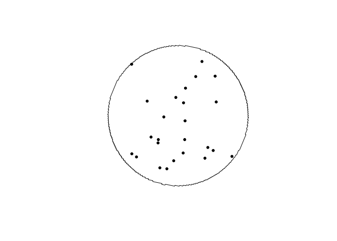
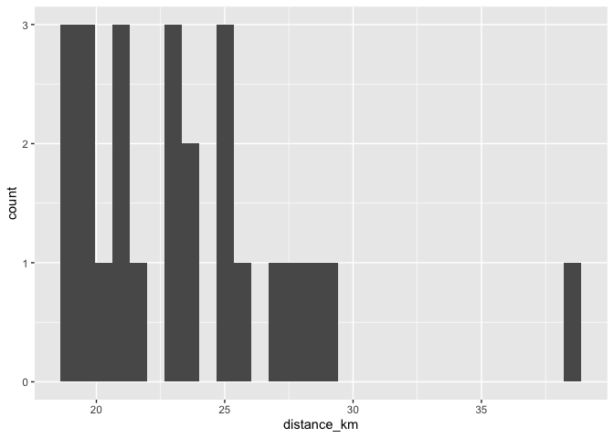
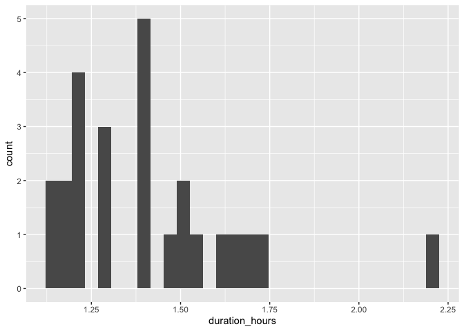
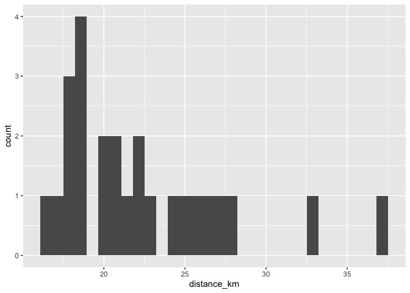
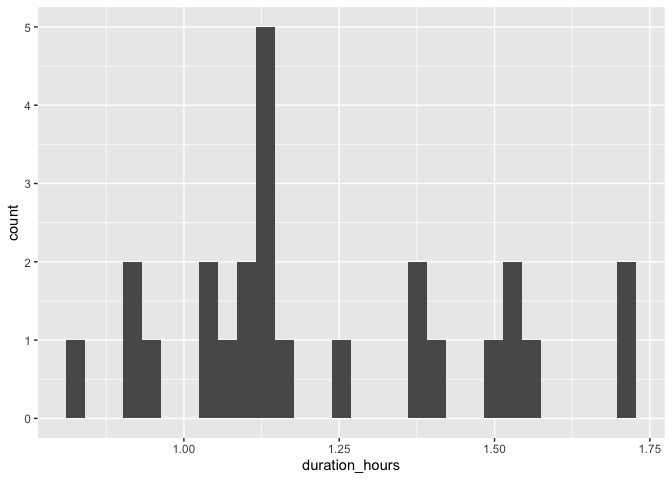
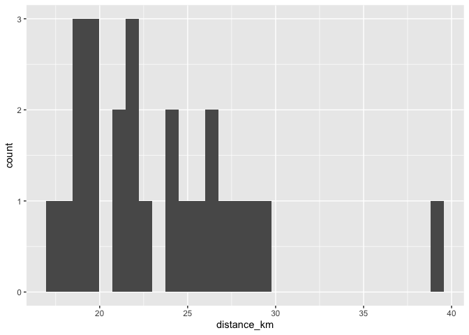
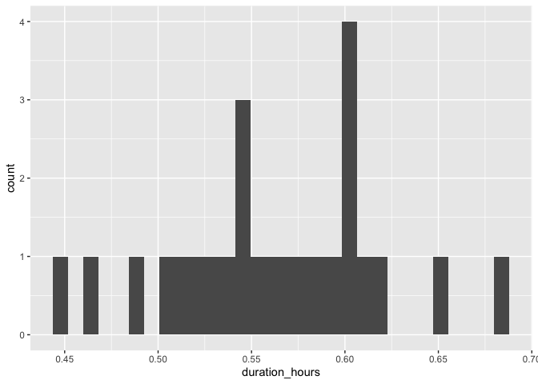
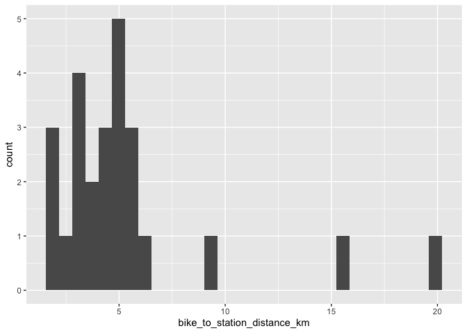
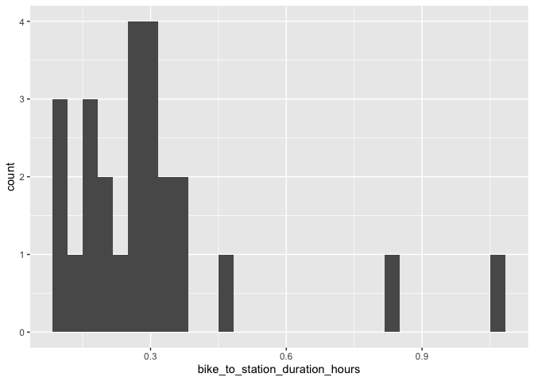

# Montreal

## Brossard Station

### Draw buffer and select points


```r
destination <- "Musee d'art contemporain de Montreal, Montreal, Canada"        #### EDIT ME
```

### Set origin point


```r
origin <- "Riviere-des-Prairies Station, Montreal, Canada"    #### EDIT ME
```

#### Setup departure location and arrival time


```r
arrival_time <- as.POSIXct("2024-06-11 08:30:00", tz = "America/Toronto")       #### EDIT ME
```

#### List of variables for geocoding


```r
var_list <- c("var1", "var2", "var3", "var4", "var5", "var6", "var7", "var8", "var9", "var10", "var11", "var12", "var13", "var14", "var15", "var16", "var17", "var18", "var19", "var20", "var21", "var22", "var23", "var24", "var25")
```


```r
stations <- geocode(location = origin, output = "more", source = "google")
```

```
## ℹ <https://maps.googleapis.com/maps/api/geocode/json?address=Riviere-des-Prairies+Station,+Montreal,+Canada&key=xxx>
```

```r
stations_sf <- stations %>%
                st_as_sf(coords = c("lon", "lat"), crs = 4326)

stations_buffer = st_buffer(stations_sf, 5000)

stations_buffer <- as_sf(stations_buffer)
```

#### Interactive map view of buffers


```r
mapview(stations_buffer)
```

```{=html}
<div class="leaflet html-widget html-fill-item" id="htmlwidget-fe2a9f273fad8dbc774c" style="width:672px;height:480px;"></div>
<script type="application/json" data-for="htmlwidget-fe2a9f273fad8dbc774c">{"x":{"options":{"minZoom":1,"maxZoom":52,"crs":{"crsClass":"L.CRS.EPSG3857","code":null,"proj4def":null,"projectedBounds":null,"options":{}},"preferCanvas":false,"bounceAtZoomLimits":false,"maxBounds":[[[-90,-370]],[[90,370]]]},"calls":[{"method":"addProviderTiles","args":["CartoDB.Positron","CartoDB.Positron","CartoDB.Positron",{"errorTileUrl":"","noWrap":false,"detectRetina":false,"pane":"tilePane"}]},{"method":"addProviderTiles","args":["CartoDB.DarkMatter","CartoDB.DarkMatter","CartoDB.DarkMatter",{"errorTileUrl":"","noWrap":false,"detectRetina":false,"pane":"tilePane"}]},{"method":"addProviderTiles","args":["OpenStreetMap","OpenStreetMap","OpenStreetMap",{"errorTileUrl":"","noWrap":false,"detectRetina":false,"pane":"tilePane"}]},{"method":"addProviderTiles","args":["Esri.WorldImagery","Esri.WorldImagery","Esri.WorldImagery",{"errorTileUrl":"","noWrap":false,"detectRetina":false,"pane":"tilePane"}]},{"method":"addProviderTiles","args":["OpenTopoMap","OpenTopoMap","OpenTopoMap",{"errorTileUrl":"","noWrap":false,"detectRetina":false,"pane":"tilePane"}]},{"method":"createMapPane","args":["polygon",420]},{"method":"addPolygons","args":[[[[{"lng":[-73.58910225082059,-73.58934885807173,-73.58857582377487,-73.58890463823464,-73.58813161511557,-73.58755184608464,-73.58763405411679,-73.58744079831067,-73.58768742114425,-73.5869144066252,-73.58724324186024,-73.58569723260011,-73.58602608509823,-73.58525309035707,-73.58467334261056,-73.58475556015141,-73.58456231144015,-73.5848089627993,-73.58364948262331,-73.5838139239756,-73.58342743273398,-73.58359187496292,-73.58281889742447,-73.58243240768962,-73.58259685767118,-73.58221037073061,-73.58237482158859,-73.5812153672188,-73.5813798258288,-73.58099334318955,-73.58115780267575,-73.58038484234223,-73.57999836121033,-73.58016282844794,-73.57977635011029,-73.57994081822387,-73.57839491219046,-73.57872386823246,-73.57795092510612,-73.57717797940742,-73.57750695270094,-73.57596108108544,-73.57518814142053,-73.57551714571194,-73.57474421722398,-73.57397128616533,-73.57329496938058,-73.57333609913699,-73.57323948250763,-73.57352738782249,-73.57198154034928,-73.57120861275865,-73.57153767903608,-73.57076476262272,-73.56999184364076,-73.56921892209068,-73.5688324603527,-73.56899701370293,-73.56861055475937,-73.5687751089835,-73.56800219604328,-73.56645636246201,-73.5657075956306,-73.56571788188917,-73.56569372809375,-73.56601259756033,-73.56523968809807,-73.56446677607019,-73.56369386147709,-73.5629209443192,-73.56214802459695,-73.5617615637743,-73.5619261755934,-73.56153971756545,-73.56170433025721,-73.56093141914978,-73.55783974909097,-73.55474803804563,-73.55320216716133,-73.55353153600758,-73.55275861046634,-73.55198568236618,-73.5512127517075,-73.5504398184907,-73.55011039468609,-73.54856449310182,-73.5454726592566,-73.54238078453135,-73.54160780946565,-73.54136062153941,-73.54116737479832,-73.54108497668174,-73.54050523292551,-73.5397322390173,-73.53895924255718,-73.53818624354558,-73.53741324198293,-73.53724841120025,-73.53686190602825,-73.53669706924576,-73.53553753960203,-73.53399149115363,-73.53374419511064,-73.53355093576214,-73.53346850160627,-73.5328887200295,-73.53211567569755,-73.53134262881784,-73.53117773969419,-73.53079121186506,-73.53062631674101,-73.52869365087541,-73.52844627762218,-73.52825300758491,-73.52817054769196,-73.52759073405011,-73.52681764696722,-73.52604455733946,-73.52571467357717,-73.52494156766954,-73.52416845921806,-73.52383853771589,-73.52306541298564,-73.52229228571257,-73.52196232646956,-73.52118918291883,-73.52041603682629,-73.5200860398415,-73.51931287747239,-73.51914786826035,-73.51876128268914,-73.51859626747513,-73.51743649664961,-73.51714769581751,-73.51705104648846,-73.51700978837002,-73.51633324045332,-73.51556004045382,-73.51522994397321,-73.51445672769979,-73.51414724004061,-73.51409891313445,-73.51407828024907,-73.51335337466205,-73.51318830369553,-73.51280168303667,-73.51263660606722,-73.51147672998351,-73.51114654773379,-73.51037328010526,-73.51004307384247,-73.50926978994258,-73.50894987951757,-73.50892571393901,-73.50891539407387,-73.50816625949506,-73.50787728755209,-73.50778062335016,-73.50773934078693,-73.50706268876229,-73.50681498099559,-73.50662164891385,-73.50653907751474,-73.50595907774388,-73.50571135196482,-73.50551801581565,-73.50543543841235,-73.50485542643945,-73.50456639145305,-73.50446972114999,-73.5044284295804,-73.50375173484858,-73.50342138448889,-73.50264800297089,-73.50231762859194,-73.50154423080596,-73.5012138324069,-73.50044041835341,-73.49994478086651,-73.49955806258825,-73.49939284151586,-73.49900611917089,-73.49867566244332,-73.49790220211912,-73.49757172136805,-73.49740647713497,-73.49701973572145,-73.4968544854822,-73.49646774000217,-73.49613722493915,-73.49536371834535,-73.49474394911338,-73.49464725739158,-73.494605937942,-73.49392909328115,-73.49359851987569,-73.49343322931426,-73.49304644976424,-73.4928811531956,-73.49249436957936,-73.49191579930766,-73.49172240125196,-73.4916397449245,-73.49105954723424,-73.49072890518754,-73.49039825284855,-73.48962462624007,-73.48896326320353,-73.48879791601084,-73.48841108458502,-73.4882457313837,-73.48785889589192,-73.48752817489807,-73.48719744360916,-73.48703207410392,-73.4866452208054,-73.48647984529093,-73.4860929879265,-73.48543144638631,-73.48510066017079,-73.48432690232565,-73.48399609207037,-73.48366527151684,-73.48333444066458,-73.48300359951317,-73.4826727480622,-73.48250731847425,-73.48212040081353,-73.48195496521458,-73.48156804348797,-73.48123715769262,-73.48057535519794,-73.47925162658068,-73.47792773310334,-73.47660367473848,-73.47594158371466,-73.47561052274089,-73.4761910906748,-73.47610832639874,-73.4763018495882,-73.47605355547245,-73.47572248763143,-73.4753914094814,-73.47506032102194,-73.47472922225262,-73.474398113173,-73.47517228342528,-73.47484117778689,-73.47417893557717,-73.47384779900501,-73.47462202175204,-73.4742908886212,-73.47395974517813,-73.47362859142241,-73.47401572248356,-73.47385014517694,-73.47423727904798,-73.47374054197441,-73.47340937103343,-73.473990096452,-73.47390730468437,-73.47410088036928,-73.47385250377792,-73.47352132596453,-73.47319013783658,-73.47396447683418,-73.47330209714706,-73.47388287038083,-73.47380007259834,-73.47399366422178,-73.47374526958558,-73.47341406771108,-73.47380126252482,-73.4736356611587,-73.47402285878343,-73.47352604952987,-73.47391325684517,-73.47374765204226,-73.47413486216875,-73.47396925822657,-73.47363804260466,-73.47402526242236,-73.47385965418255,-73.47424687681165,-73.4737500469367,-73.47433089518232,-73.47424809052642,-73.47444170715401,-73.47419329189742,-73.47386206252719,-73.47463655154849,-73.47397408937738,-73.47474860340847,-73.47441737060791,-73.47509508036471,-73.47505367704446,-73.47515049278186,-73.47486066653104,-73.47452942685609,-73.47530397714755,-73.47497274091747,-73.4756504824031,-73.47560907865426,-73.47570589892436,-73.47541606967332,-73.47580335638284,-73.4756377395619,-73.47602502908386,-73.47585941312438,-73.47552817346561,-73.47630277127138,-73.47597153505862,-73.47664931812054,-73.47660791437401,-73.47670474058359,-73.47641491134868,-73.47680222181683,-73.47663660500534,-73.47702391828629,-73.47685830233655,-73.47652706269666,-73.47730170802289,-73.47697047183019,-73.47774512840847,-73.47741389566336,-73.478188563494,-73.4778573341969,-73.47863201328018,-73.47830078743152,-73.47905126873283,-73.47904091817563,-73.47906512722399,-73.47874425536794,-73.47947053818183,-73.47944983724601,-73.47949825607539,-73.47918773800686,-73.4798656118822,-73.47982421029387,-73.47992104947676,-73.47963123534905,-73.48035753926366,-73.48033683875907,-73.48038525899517,-73.48007474739521,-73.48083737752577,-73.48083220246741,-73.48084430769126,-73.48051827414604,-73.48129302075156,-73.48096181560227,-73.48173657346257,-73.48140537176465,-73.48218014088,-73.48184894263386,-73.48262372300458,-73.48229252821064,-73.48306731983703,-73.48345471470562,-73.48328912376893,-73.48367652145144,-73.48351093137808,-73.48418888183356,-73.4841474854187,-73.48424433554155,-73.48395455762842,-73.48472936924757,-73.48439819858882,-73.48517302146431,-73.48556043195703,-73.48539485308928,-73.4857822663961,-73.48561668839211,-73.48629466619026,-73.48625327279294,-73.48635012682183,-73.48606037003168,-73.4868352129002,-73.48650406638374,-73.4872789205093,-73.48786005944893,-73.48777727723501,-73.48797099076087,-73.48772264283194,-73.48849750569337,-73.4881663798688,-73.48961926677279,-73.48957787854856,-73.48967473757553,-73.48938501699725,-73.49015989985152,-73.49054734033265,-73.49038179250361,-73.49076923579915,-73.49060368883488,-73.491378580424,-73.49104749253524,-73.49182239538224,-73.49259729570566,-73.49226622505853,-73.4930411366399,-73.49371918220297,-73.49367780087657,-73.493774664586,-73.4934849922932,-73.4942599126084,-73.49493796581302,-73.49489658664223,-73.49499345144326,-73.49470379423984,-73.49547872328827,-73.4962294333956,-73.49621908919734,-73.49624330562641,-73.49592263089895,-73.49669756868008,-73.49747250393503,-73.49714150227106,-73.49791644878432,-73.49907886381632,-73.49891337634571,-73.49930085020578,-73.49913536360158,-73.49991031631897,-73.50068526650851,-73.50035431313239,-73.5019042334994,-73.50248545102927,-73.50240272055127,-73.50259646027344,-73.50234826755486,-73.50312323520329,-73.50389820032217,-73.50447942250102,-73.50439669978405,-73.50459044105581,-73.5043422716207,-73.50589221678374,-73.50666718556892,-73.50633632532637,-73.50711130536936,-73.50788628288065,-73.50866125785986,-73.50943623030653,-73.50910541490532,-73.50988039860944,-73.5114303584178,-73.51298030809018,-73.51264955132709,-73.51342453615293,-73.51419951844369,-73.514974498199,-73.51574947541842,-73.5165244501015,-73.51729942224787,-73.5180743918571,-73.51774372132608,-73.51851870219112,-73.5200686563074,-73.52316853407308,-73.52626837119388,-73.529368167643,-73.5309180506073,-73.53169298827292,-73.53202341049285,-73.53279833181662,-73.53357325059487,-73.53434816682717,-73.53512308051312,-73.53589799165228,-73.53667290024423,-73.53744780628855,-73.53777812162019,-73.53932789846816,-73.54087766511985,-73.54116663428864,-73.54126349285654,-73.54130477330679,-73.54198278065724,-73.54275764380945,-73.54353250441072,-73.54430736246061,-73.54463754679819,-73.54618722764425,-73.54696206423826,-73.54729219687779,-73.54806701711944,-73.54884183480721,-73.54900688346532,-73.54939428790158,-73.54955933053505,-73.54994673088287,-73.55149632588638,-73.55182636893124,-73.55260114880015,-73.55337592611272,-73.55370593126126,-73.55525545061646,-73.55558541786962,-73.55636015991114,-73.55713489939426,-73.55746482875301,-73.55823955187765,-73.55848698179133,-73.55868065958519,-73.55876313407387,-73.55934416390814,-73.56011886811376,-73.56044873548616,-73.56122342333171,-73.56138834625844,-73.56177568577095,-73.56194060267478,-73.5623279380971,-73.56310260702041,-73.56343241241036,-73.56420706497201,-73.56452654076202,-73.56455074819551,-73.5645610536919,-73.5653114824714,-73.56547636236293,-73.56586367605165,-73.56602854992099,-73.56641585951898,-73.56658072736626,-73.56696803287348,-73.56713289469879,-73.56752019611515,-73.56829479702444,-73.56862449226034,-73.56939907680542,-73.56972874795493,-73.57050331613536,-73.57083296319934,-73.57160751501463,-73.571937137994,-73.57271167344366,-73.57304127233928,-73.57381579142285,-73.57431014978559,-73.57469739801559,-73.57486217554514,-73.57524941968343,-73.57549657598334,-73.57569019522451,-73.5757725785101,-73.57635343268312,-73.57668294905066,-73.57745740523508,-73.5777868975232,-73.57795163981183,-73.57833885659204,-73.57850359286114,-73.57889080554934,-73.57921511577754,-73.57922721595148,-73.5792323636492,-73.57999467312945,-73.58032410698188,-73.58048882005339,-73.58087601356671,-73.58104072061933,-73.58142791004042,-73.5817573095385,-73.58253167265465,-73.5828610480784,-73.583190413225,-73.58396474617533,-73.58462341804713,-73.58539772083175,-73.58572702755862,-73.58605632401071,-73.58683059662972,-73.58748913112149,-73.5877360709615,-73.5879296292299,-73.58801194036364,-73.58859261161635,-73.58892183938528,-73.58925105688219,-73.58949796326415,-73.58969151054292,-73.58977381052424,-73.59035444880782,-73.59134196747945,-73.5921161082224,-73.59244524678067,-73.59277437507018,-73.59310349309136,-73.59343260084464,-73.59376169833044,-73.59453576753403,-73.59519390412278,-73.59585199964812,-73.59651005411342,-73.59716806752213,-73.59782603987767,-73.59848397118348,-73.59914186144299,-73.5997997106596,-73.60045751883675,-73.60111528597787,-73.60144415416099,-73.60067037450408,-73.60099924621379,-73.60132810766589,-73.6016569588608,-73.60198579979894,-73.60231463048072,-73.6019277741423,-73.60209218908285,-73.601705335544,-73.60219857531875,-73.60285619245816,-73.60227594711571,-73.60235814895796,-73.60216473438206,-73.6024113386472,-73.60274013536147,-73.60306892182173,-73.60268211113353,-73.60284650396353,-73.60245969607413,-73.60262408978566,-73.60328163899868,-73.60289484768721,-73.60305923202714,-73.60267244351409,-73.60283682873552,-73.60316559148902,-73.60349434399041,-73.60272079947093,-73.60304955549813,-73.60337830127376,-73.60279816185354,-73.60288034927883,-73.60268697001001,-73.60293353102479,-73.60326227007488,-73.6028755231068,-73.60303989223182,-73.60265314806146,-73.60281751806774,-73.60314625039247,-73.60275951590742,-73.60292388166975,-73.60253714998221,-73.60270151662571,-73.6030302422253,-73.60264352022244,-73.60280788262217,-73.60242116341661,-73.60258552669745,-73.60291424557212,-73.6022375034854,-73.60227859413055,-73.60218191674325,-73.60246954828173,-73.60279826043167,-73.60202486570347,-73.60235358137727,-73.60196688993003,-73.60213124736674,-73.60174455871632,-73.60190891703387,-73.60223762598282,-73.60146426740073,-73.60179297987281,-73.60140630649802,-73.60157066233377,-73.60118399175552,-73.60134834847193,-73.60167705421905,-73.60090373177945,-73.60123244104895,-73.60084578574482,-73.60101013997918,-73.6006234874713,-73.60078784258613,-73.60111654513055,-73.60034325882987,-73.60067196489592,-73.59989868977941,-73.6002273993667,-73.59955079356695,-73.59959188305071,-73.59949522513294,-73.59978284854218,-73.59939622249058,-73.59956057864395,-73.59917395538817,-73.59933831242162,-73.59895169196163,-73.59911604987509,-73.59872943221087,-73.59922250090662,-73.59844928428953,-73.59877799771149,-73.59800479227657,-73.59833350921775,-73.59756031496471,-73.59788903542469,-73.59711585235321,-73.59744457633158,-73.59667140444139,-73.59700013193772,-73.59622697122852,-73.59655570224237,-73.59578255271387,-73.59611128724482,-73.59533814889672,-73.59566688694437,-73.59489375977634,-73.59522250134029,-73.59444938535206,-73.59406282639006,-73.59422720365072,-73.59384064748366,-73.5940050256231,-73.59342519532294,-73.59350738601221,-73.59331410978291,-73.59356068058879,-73.59278758437875,-73.59311635024841,-73.59234326521749,-73.59267203460121,-73.59189896074911,-73.59151242285567,-73.59167681402454,-73.5912902789258,-73.59145467097292,-73.59072992237381,-73.59075047200572,-73.59070215540559,-73.59101039588819,-73.59023734181366,-73.5905661354942,-73.58921330873335,-73.58929551157127,-73.58910225082059],"lat":[45.63355577645458,45.63313721966735,45.63302340836537,45.63246534169969,45.63235152872863,45.63226616502655,45.63212665111208,45.63209819606197,45.63167965713997,45.63156583644492,45.63100779359962,45.63078014281753,45.63022211407594,45.63010828398927,45.63002290745077,45.62988340301748,45.62985494368865,45.62943643321015,45.62926567422568,45.62898667219598,45.62892975060394,45.62865075100353,45.6285369054721,45.62847998043593,45.62820098545848,45.62814406000552,45.62786506745736,45.62769428530737,45.62741529738231,45.62735836806868,45.62707938257294,45.62696552159878,45.62690858884131,45.6266296079688,45.62657267479474,45.62629369635155,45.62606595290774,45.62550800879448,45.62539413237955,45.62528024991055,45.624722319903,45.62449454557994,45.6243806493374,45.62382273782474,45.62370883991722,45.62359493595581,45.62349526502346,45.6234255280364,45.62341128902199,45.62292313292368,45.62269530351031,45.62258137972287,45.62202350520292,45.62190957975159,45.62179564824653,45.62168171068772,45.62162473963815,45.62134581205878,45.62128884059337,45.62100991544342,45.62089597016762,45.62066806145497,45.62055765946709,45.620540227234,45.62053666578925,45.61999626927671,45.61988230417728,45.61976833302425,45.61965435581754,45.61954037255713,45.61942638324299,45.61936938631577,45.61909048601958,45.61903348867696,45.61875459081028,45.6186405937809,45.61818454512648,45.61772839961107,45.6175002905297,45.61694254711627,45.61682848788899,45.61671442260785,45.61660035127277,45.61648627388374,45.61704399971805,45.61681581798712,45.61635938187348,45.61590284888869,45.61578870050607,45.61620696210423,45.61617842323798,45.61631784416102,45.61623222446711,45.61611805957721,45.61600388863238,45.61588971163257,45.61577552857776,45.61605436097555,45.61599726607778,45.61627609870592,45.6161048016305,45.61587638433621,45.61629462422368,45.61626606953384,45.61640548321962,45.61631981605425,45.61620558786839,45.61609135362683,45.61637017594533,45.6163130554535,45.61659187800154,45.61630624733142,45.61672447539449,45.61669590942044,45.61683531916449,45.61674961814596,45.61663534482199,45.61652106544166,45.61707869563632,45.61696440579727,45.61685010990158,45.61740773660858,45.61729343025331,45.6171791178411,45.61773674105879,45.61762241818614,45.61750808925628,45.618065708983,45.6179513695918,45.61823017924661,45.61817300617836,45.61845181606102,45.61828028446635,45.61876819917746,45.61875390378087,45.61882360614584,45.61872353523755,45.61860916280582,45.61916677645541,45.61905239355998,45.619575157053,45.61956800766271,45.61960285871113,45.61949561475887,45.61977442182807,45.61971722177467,45.61999602907085,45.61982441651768,45.62038202848557,45.62026760813628,45.62082522101076,45.62071079019504,45.62125097846438,45.62124740227032,45.62126482777708,45.62115396269266,45.62164187525205,45.62162756918351,45.62169727124089,45.62159712562784,45.62201533682241,45.62198672211138,45.62212612623145,45.62204027899924,45.62245849087174,45.62242987354353,45.62256927788951,45.62248342280559,45.62297133773765,45.62295702774332,45.62302673013957,45.62292655704556,45.62348417534523,45.62336968171782,45.6239273009193,45.62381279682109,45.62437041692368,45.62425590235405,45.62509233585006,45.62503507298421,45.62531388570213,45.62525662021812,45.6258142474312,45.62569970750558,45.6262573356174,45.62653615166452,45.62647887611972,45.62675769239134,45.62670041422797,45.62725804854741,45.62714348326162,45.62818905364771,45.6281747315265,45.62824443681359,45.6281441788299,45.62870182025159,45.6289806429532,45.62892334728274,45.62920217020818,45.62914487191851,45.63012075874654,45.63009210710226,45.63023152055745,45.630145562523,45.63070321635072,45.63126087548623,45.63114625063893,45.63226157600342,45.63254041066158,45.63248309044516,45.63276192532633,45.63270460248985,45.63326227402472,45.63381995086633,45.63409879127712,45.63404146140487,45.63432030203834,45.63426296954568,45.63537834092919,45.63593603458003,45.63582135179618,45.63637904633617,45.63693674618173,45.63749445133271,45.63805216178899,45.63860987755042,45.63888873742052,45.63883138160617,45.63911024169806,45.63905288326233,45.63961060521568,45.64072606503592,45.64295704832666,45.645188116477,45.64741926947801,45.64853487779472,45.64909268990664,45.64917878665375,45.64931824133914,45.64934693977221,45.64976530664566,45.65032313378301,45.65088096622245,45.65143880396383,45.65199664700702,45.65255449535186,45.65266931071176,45.65322716877997,45.65434290082093,45.65490077479339,45.65501560176818,45.6555734854641,45.65613137446117,45.65668926875929,45.65674668660263,45.65702563684519,45.65708305427565,45.65791991627162,45.65847783089494,45.65856396248585,45.6587034427992,45.65873215284661,45.65915059660371,45.65970852625126,45.66026646119935,45.66038130975529,45.66149720439913,45.66158334346392,45.66172283261451,45.66175154515311,45.66217001542186,45.66272798041795,45.66278540822637,45.66306439381786,45.66312182121314,45.66395878925553,45.66401621844939,45.66429521155283,45.66435264033348,45.66463163586784,45.66518963091161,45.66524706149087,45.66552606210619,45.66558349227216,45.6664205053859,45.66650665276305,45.6666461569375,45.66667487224673,45.66709338758703,45.66765141267813,45.66776627785848,45.66888235278803,45.66899722073875,45.6695552705772,45.66965577891931,45.66972553600564,45.66973989402948,45.67022819643628,45.67078626129822,45.67090113036505,45.67145920495081,45.67155971426917,45.67162947444891,45.67164383261218,45.67213215667289,45.67218959031172,45.67246863555992,45.67252606878507,45.67280511646423,45.67336321579726,45.67347808432464,45.6740361933815,45.6741367022273,45.67420646671594,45.67422082481166,45.67470917903457,45.6747666124031,45.67504567488687,45.67510310784157,45.67538217275629,45.67594030656039,45.67605517454641,45.67661331807436,45.67672818440474,45.67728633765653,45.67740120233105,45.6779593653067,45.67807422832517,45.67863240102462,45.67874367306131,45.6787611161775,45.67876470550735,45.67930544481012,45.67941312596241,45.67944801279906,45.6794551913698,45.67997849666298,45.68007899778847,45.68014877266338,45.68016312965609,45.68065155658297,45.68075923462882,45.68079412268094,45.68080130104457,45.6813246245699,45.68143768474656,45.68144640691282,45.68144820147236,45.68199770062354,45.68211255370138,45.68267078474369,45.68278563616403,45.68334387693014,45.68345872669279,45.68401697718267,45.68413182528742,45.68469008550107,45.68480493194772,45.68486235289027,45.68514148830242,45.68519890883038,45.68547804667346,45.68557853087394,45.68564831602558,45.68566267060034,45.68615116946445,45.68626600651189,45.68682430032047,45.68693913570902,45.68699655112236,45.68727570333184,45.68733311833038,45.68761227297076,45.68771274749436,45.68778253684529,45.68779689003761,45.6882854182969,45.68840024428423,45.68895857168724,45.68907339601488,45.68915951026867,45.68929909488273,45.68932779915007,45.6897465558093,45.68986137239394,45.69041972366729,45.69063499666033,45.6907047919788,45.69071914282036,45.69120771285253,45.69132252003303,45.691379921342,45.69165910935668,45.69171651025042,45.69199570069598,45.69211050013208,45.69266888942145,45.69278368719633,45.69289847888754,45.69345688232269,45.69357167235231,45.69367210863759,45.69374191047616,45.69375625820577,45.69424487387874,45.69435965616259,45.69446008567022,45.69452988927693,45.69454423603829,45.69503286408833,45.69514763862589,45.69525882065732,45.6952762720062,45.69527985843261,45.69582085295013,45.69593561974092,45.69605038044752,45.69660884046287,45.69672359950638,45.69689572666353,45.69717496418581,45.6972323379679,45.69751157792097,45.69762632313223,45.69774106225908,45.69829955498339,45.69852902382453,45.6986150683653,45.69875469541387,45.69878337644315,45.69920226040628,45.69931698403552,45.69943170158013,45.69951773574557,45.6996573674348,45.6996860450056,45.70010494289075,45.70033435639586,45.70044905402137,45.70100760243365,45.70112229839352,45.70123698826858,45.70135167205887,45.70146634976442,45.70202492115592,45.70213959719513,45.70236893101898,45.70259824050368,45.70315683929002,45.70327148932278,45.70338613327066,45.7035007711337,45.70361540291194,45.70373002860543,45.70384464821419,45.70395926173828,45.70451789674883,45.70463250860448,45.7048617140614,45.7053200519588,45.70577829250308,45.70623643569678,45.70646547078797,45.70657997920728,45.70602126473698,45.70613576265969,45.70625025449853,45.70636474025352,45.7064792199247,45.70659369351212,45.70670816101581,45.70682262243582,45.70626388239316,45.70649277816084,45.70672164959506,45.70623274097785,45.70624704415221,45.7061772003271,45.70627731940398,45.70639173550331,45.70650614551964,45.70662054945301,45.70606178475364,45.70629056555427,45.70640494683062,45.70584617421816,45.70596054500391,45.70607490970733,45.70579552098562,45.70585269995458,45.70557331145934,45.70563048780593,45.70585917798719,45.7053003939643,45.70541472552532,45.7055290510046,45.70497026348301,45.70519888738468,45.70464009636601,45.70475439478928,45.70486868713139,45.70430989261731,45.70442417447345,45.7040050787726,45.70403364746064,45.70389394928286,45.70397965224089,45.70409391753105,45.70353512043503,45.7036493752407,45.70336997648439,45.70342710050619,45.70314770197811,45.70320482337901,45.70331906162075,45.70276026194728,45.70287448970604,45.70233315332754,45.70233672271376,45.70231926032872,45.70242990822321,45.70215050863638,45.70220761389417,45.70192821453618,45.70198531717361,45.70170591804455,45.70176301806167,45.70148361916164,45.70154071655853,45.70165490679305,45.7010961063793,45.7012102861336,45.70065148663724,45.70076565591193,45.70020685733364,45.70032101612935,45.69976221846984,45.6998763667872,45.69931757004714,45.69943170788678,45.6985935161519,45.69865057949303,45.69837118380828,45.69842824453031,45.69800915184743,45.6980376808139,45.69789798364307,45.6979835674388,45.69742477878185,45.69753888079367,45.69698009305922,45.6967007011874,45.69675774661597,45.69647835497495,45.69653539778496,45.69598534721496,45.69598712971066,45.69597839878973,45.69609069296038,45.69553191239472,45.69525252410757,45.69530955686382,45.6950301688079,45.69508719894601,45.69452842462737,45.69464247595029,45.69408370255755,45.69352493448739,45.6936389709427,45.69252144197919,45.69263546356846,45.6920767026761,45.69151794710722,45.691631953832,45.69051444987592,45.69009539138278,45.69012388909371,45.68998420332021,45.69006969335157,45.68951095028974,45.68895221255244,45.68853316274376,45.688561655641,45.68842197276244,45.68850744835314,45.68683126988508,45.68694521884693,45.68638649894891,45.68582778437657,45.68526907513008,45.68471037120955,45.68415167261514,45.68426559354471,45.68314820355187,45.68203083486581,45.68091348748765,45.67979616141851,45.6786788566595,45.67756157321171,45.67644431107627,45.67532707025428,45.67420985074688,45.67309265255513,45.67253406145299,45.67242023271006,45.67186165132522,45.67130307526969,45.6707445045436,45.67018593914709,45.6696273790803,45.66957047340332,45.66929119646545,45.66923429036893,45.66839647084058,45.66727939679107,45.66719404631952,45.66705441438497,45.66702596374387,45.66660707076163,45.66604855144924,45.66549003746721,45.66543314107975,45.66515388718429,45.66509699037743,45.66481773891123,45.66370074637278,45.66364385353301,45.66336460982662,45.66330771656752,45.66302847529038,45.66246999673415,45.66191152350877,45.66179774340852,45.66123927990007,45.66068082172256,45.66059548924757,45.66045587635851,45.66042743171647,45.66000859587081,45.65945015274127,45.65939326615807,45.65911404768891,45.65905716068657,45.65877794464664,45.65821951656515,45.65816263133654,45.65788342039142,45.65782653474375,45.65754732622784,45.6569889131945,45.65693202932054,45.6566528258995,45.65659594160653,45.65631674061469,45.65575834262957,45.65565879722647,45.65558899833285,45.65557477725068,45.65508618780747,45.65452780487065,45.65441404102648,45.65385566780645,45.65379878580422,45.65351960228984,45.65346271986877,45.65318353878359,45.65262518061192,45.65251141780227,45.65195306934736,45.65189618786253,45.65161701673074,45.65156013482719,45.65128096612457,45.65072263271809,45.65060887094376,45.65005054725403,45.64999366628702,45.6497145075378,45.64965762615218,45.64937846983216,45.64882016119089,45.64870640045267,45.64814810152816,45.64803433911582,45.64747604990804,45.64737650666391,45.64730672136744,45.64729250059384,45.64680400633076,45.6467471242081,45.64646798755825,45.64641110501719,45.64613197079651,45.64607508783709,45.6457959560456,45.64573907266782,45.64490168857971,45.644787923858,45.64422967884892,45.64411591245416,45.64355767716182,45.6434439090942,45.64288568351862,45.64277191377834,45.64221369791952,45.6420999265068,45.64154172036474,45.64142794727978,45.64086975085448,45.64075597609748,45.64019778938896,45.64008401296014,45.63952583596841,45.63941205786795,45.638853890593,45.63874011082113,45.63868321866394,45.6384041403148,45.63834724773983,45.63806817181989,45.63798283176299,45.63784329512512,45.63781484795653,45.63739624086443,45.637282451694,45.63672431795499,45.63661052711391,45.63605240309175,45.63593861058023,45.63588171205347,45.63560265533087,45.63554575638657,45.63526670209318,45.63516001454784,45.63512513311187,45.63511802043674,45.63459480165298,45.63448099974551,45.63392290925982,45.63372374902589,45.63358422915633,45.63355577645458]}]]],null,"stations_buffer",{"crs":{"crsClass":"L.CRS.EPSG3857","code":null,"proj4def":null,"projectedBounds":null,"options":{}},"pane":"polygon","stroke":true,"color":"#333333","weight":0.5,"opacity":0.9,"fill":true,"fillColor":"#6666FF","fillOpacity":0.6,"smoothFactor":1,"noClip":false},"<div class='scrollableContainer'><table class=mapview-popup id='popup'><tr class='coord'><td><\/td><th><b>Feature ID&emsp;<\/b><\/th><td>1&emsp;<\/td><\/tr><tr><td>1<\/td><th>type&emsp;<\/th><td>establishment&emsp;<\/td><\/tr><tr><td>2<\/td><th>loctype&emsp;<\/th><td>rooftop&emsp;<\/td><\/tr><tr><td>3<\/td><th>address&emsp;<\/th><td>rivière-des-prairies, 10801 bd maurice-duplessis, montréal, qc h1c 1s7, canada&emsp;<\/td><\/tr><tr><td>4<\/td><th>north&emsp;<\/th><td>45.66207&emsp;<\/td><\/tr><tr><td>5<\/td><th>south&emsp;<\/th><td>45.65937&emsp;<\/td><\/tr><tr><td>6<\/td><th>east&emsp;<\/th><td>-73.53794&emsp;<\/td><\/tr><tr><td>7<\/td><th>west&emsp;<\/th><td>-73.54063&emsp;<\/td><\/tr><tr><td>8<\/td><th>geometry&emsp;<\/th><td>sfc_POLYGON&emsp;<\/td><\/tr><\/table><\/div>",{"maxWidth":800,"minWidth":50,"autoPan":true,"keepInView":false,"closeButton":true,"closeOnClick":true,"className":""},"1",{"interactive":false,"permanent":false,"direction":"auto","opacity":1,"offset":[0,0],"textsize":"10px","textOnly":false,"className":"","sticky":true},{"stroke":true,"weight":1,"opacity":0.9,"fillOpacity":0.84,"bringToFront":false,"sendToBack":false}]},{"method":"addScaleBar","args":[{"maxWidth":100,"metric":true,"imperial":true,"updateWhenIdle":true,"position":"bottomleft"}]},{"method":"addHomeButton","args":[-73.60349434399041,45.61577552857776,-73.47319013783658,45.70682262243582,true,"stations_buffer","Zoom to stations_buffer","<strong> stations_buffer <\/strong>","bottomright"]},{"method":"addLayersControl","args":[["CartoDB.Positron","CartoDB.DarkMatter","OpenStreetMap","Esri.WorldImagery","OpenTopoMap"],"stations_buffer",{"collapsed":true,"autoZIndex":true,"position":"topleft"}]},{"method":"addLegend","args":[{"colors":["#6666FF"],"labels":["stations_buffer"],"na_color":null,"na_label":"NA","opacity":1,"position":"topright","type":"factor","title":"","extra":null,"layerId":null,"className":"info legend","group":"stations_buffer"}]}],"limits":{"lat":[45.61577552857776,45.70682262243582],"lng":[-73.60349434399041,-73.47319013783658]},"fitBounds":[45.61577552857776,-73.60349434399041,45.70682262243582,-73.47319013783658,[]]},"evals":[],"jsHooks":{"render":[{"code":"function(el, x, data) {\n  return (\n      function(el, x, data) {\n      // get the leaflet map\n      var map = this; //HTMLWidgets.find('#' + el.id);\n      // we need a new div element because we have to handle\n      // the mouseover output separately\n      // debugger;\n      function addElement () {\n      // generate new div Element\n      var newDiv = $(document.createElement('div'));\n      // append at end of leaflet htmlwidget container\n      $(el).append(newDiv);\n      //provide ID and style\n      newDiv.addClass('lnlt');\n      newDiv.css({\n      'position': 'relative',\n      'bottomleft':  '0px',\n      'background-color': 'rgba(255, 255, 255, 0.7)',\n      'box-shadow': '0 0 2px #bbb',\n      'background-clip': 'padding-box',\n      'margin': '0',\n      'padding-left': '5px',\n      'color': '#333',\n      'font': '9px/1.5 \"Helvetica Neue\", Arial, Helvetica, sans-serif',\n      'z-index': '700',\n      });\n      return newDiv;\n      }\n\n\n      // check for already existing lnlt class to not duplicate\n      var lnlt = $(el).find('.lnlt');\n\n      if(!lnlt.length) {\n      lnlt = addElement();\n\n      // grab the special div we generated in the beginning\n      // and put the mousmove output there\n\n      map.on('mousemove', function (e) {\n      if (e.originalEvent.ctrlKey) {\n      if (document.querySelector('.lnlt') === null) lnlt = addElement();\n      lnlt.text(\n                           ' lon: ' + (e.latlng.lng).toFixed(5) +\n                           ' | lat: ' + (e.latlng.lat).toFixed(5) +\n                           ' | zoom: ' + map.getZoom() +\n                           ' | x: ' + L.CRS.EPSG3857.project(e.latlng).x.toFixed(0) +\n                           ' | y: ' + L.CRS.EPSG3857.project(e.latlng).y.toFixed(0) +\n                           ' | epsg: 3857 ' +\n                           ' | proj4: +proj=merc +a=6378137 +b=6378137 +lat_ts=0.0 +lon_0=0.0 +x_0=0.0 +y_0=0 +k=1.0 +units=m +nadgrids=@null +no_defs ');\n      } else {\n      if (document.querySelector('.lnlt') === null) lnlt = addElement();\n      lnlt.text(\n                      ' lon: ' + (e.latlng.lng).toFixed(5) +\n                      ' | lat: ' + (e.latlng.lat).toFixed(5) +\n                      ' | zoom: ' + map.getZoom() + ' ');\n      }\n      });\n\n      // remove the lnlt div when mouse leaves map\n      map.on('mouseout', function (e) {\n      var strip = document.querySelector('.lnlt');\n      if( strip !==null) strip.remove();\n      });\n\n      };\n\n      //$(el).keypress(67, function(e) {\n      map.on('preclick', function(e) {\n      if (e.originalEvent.ctrlKey) {\n      if (document.querySelector('.lnlt') === null) lnlt = addElement();\n      lnlt.text(\n                      ' lon: ' + (e.latlng.lng).toFixed(5) +\n                      ' | lat: ' + (e.latlng.lat).toFixed(5) +\n                      ' | zoom: ' + map.getZoom() + ' ');\n      var txt = document.querySelector('.lnlt').textContent;\n      console.log(txt);\n      //txt.innerText.focus();\n      //txt.select();\n      setClipboardText('\"' + txt + '\"');\n      }\n      });\n\n      }\n      ).call(this.getMap(), el, x, data);\n}","data":null},{"code":"function(el, x, data) {\n  return (function(el,x,data){\n           var map = this;\n\n           map.on('keypress', function(e) {\n               console.log(e.originalEvent.code);\n               var key = e.originalEvent.code;\n               if (key === 'KeyE') {\n                   var bb = this.getBounds();\n                   var txt = JSON.stringify(bb);\n                   console.log(txt);\n\n                   setClipboardText('\\'' + txt + '\\'');\n               }\n           })\n        }).call(this.getMap(), el, x, data);\n}","data":null}]}}</script>
```

#### Generate points within buffer


```r
set.seed(100)
points_sample_sf <- st_sample(stations_buffer, size = c(25,25), type = "random")
```

```
## Warning in st_poly_sample(x, size = size, ..., type = type, by_polygon =
## by_polygon, : coordinate ranges not computed along great circles; install
## package lwgeom to get rid of this warning
```

```r
points_sample_sf <- st_as_sf(points_sample_sf)
points_sample <- sf_to_df(points_sample_sf)
```

#### Check to see if they worked


```r
check_buffer <- stations_buffer %>% slice(1:2)

plot(st_geometry(check_buffer))
plot(points_sample_sf, pch = 20, add= TRUE)
```

<!-- -->


```r
points_sample$destination <- destination
points_sample$origin <- origin
points_sample$lat_lon <- paste(points_sample$lat, points_sample$lon)
```

#### Checking points and general mapping


```r
lst_directions <- apply(points_sample, 1, function(x){
  res <- google_directions(
    origin = x[['lat_lon']], 
    destination = x[['destination']]    
  )
df_result <- data.frame(
    origin = x[['lat_lon']], 
    destination = x[['destination']], 
    route = res$routes$overview_polyline$points 
)
return(df_result)
})

df_directions <- do.call(rbind, lst_directions)

google_map() %>%
  add_polylines(data = df_directions, polyline = "route") 
```

```{=html}
<div class="google_map html-widget html-fill-item" id="htmlwidget-5b6d5f02f477856b5532" style="width:672px;height:480px;"></div>
<script type="application/json" data-for="htmlwidget-5b6d5f02f477856b5532">{"x":{"lat":0,"lng":0,"zoom":1,"min_zoom":null,"max_zoom":null,"mapBounds":{"west":-180,"south":-90,"east":180,"north":90},"styles":null,"search_box":false,"update_map_view":true,"zoomControl":true,"mapType":"roadmap","mapTypeControl":true,"scaleControl":false,"streetViewControl":true,"rotateControl":true,"fullscreenControl":true,"event_return_type":"list","split_view":null,"split_view_options":{"heading":34,"pitch":10},"geolocation":false,"calls":[{"functions":"add_polylines","args":[[{"id":1,"geodesic":true,"stroke_colour":"#0000FF","stroke_weight":2,"stroke_opacity":0.6,"z_index":3,"polyline":["ynruGh|~_MdGwGgCwFqD{I_@}@m@wAj@m@hCuC|OoPtCyCp@}@xAsBn@kAZs@bAqCrA{DzB}GtL_^vIoWfCoH|FpE~ArAbR|OjP`NjHbGjKxI|F`FjDbDpE`EzG~EzDbD|AzAdEfDxDnD\\Zz@x@VCdBlAr@h@^D`TlQjEpD~EfExE|DpAhAvBlBTTJ?H?zAnAvExDhAl@jA\\jAL^?r@En@K\\Kd@S~@o@VWp@_AR_@l@}AnBwG`CyHjIwVrD{KH?bB_FbCcH|C_JjAqD`AgDvGcSbC{HrAaEh@wB\\}Ah@yCn@eFh@wEdAuJ`CwTx@kHdAwIPsA^uBz@eDh@{Ar@eBj@iAl@aALBBAPSdAmA|@q@`Ai@j@OXEb@Eh@AxAHtBTpDb@xB\\hLbBbBZXBv@RfATzCt@bB^vGbBl@P`AXxC|@nBr@p@Vr@ZhDpA~BfAhBv@lB~@pCvAfA`@bBx@|FvCtCzAr@VzBx@pDlA|DpBrAx@h@}BbBmHTkAJaAJsBHu@`AmEhF_UjAoFj@iCP[P[d@]|C|@|Ct@|@RnBZ~EnA|Ab@NFh@XjB`B~AjAhBnA|@l@fCvAdEvBxDfBZBz@b@jDnB`CxAbDfBfG`D`@RfDdBLTJJzBhAtClAzAx@bB|@hBhAl@^xBfAnDpBlCrAbAd@`D|@zAj@pBfAzA~@fLlIvCzBpFhEx@p@tArA~A`Bx@r@|AfAdAj@`AZvBf@xHjBfDt@tD|@nEhA`AZnBt@fBz@j@ZnC~@rAb@jCr@tA\\~AVlAJlGXzCPn@F\\Hr@Th@Zr@^d@Vn@d@RNhD|BvBtArChBrInF`HhE~BlBvAlAv@r@bCbC|@z@nB~ApA~@hBhAzDzBxD`C|@p@`E~ClJhHhF~DfBtAjFnE~BlBPh@v@l@lIrGb@XdAr@rAz@~CtBh@Tb@Jf@Fh@Bj@Gx@Ox@[`@QPARO`@a@j@y@x@oAROVGV@TFPL^^LTN`@Jr@?t@Cf@I`@s@xB{DdK_EjKcBnE{AxDi@pAs@w@"]},{"id":2,"geodesic":true,"stroke_colour":"#0000FF","stroke_weight":2,"stroke_opacity":0.6,"z_index":3,"polyline":["_rxuGdix_Mj@Tp@AdAOd@OLMPYL_@rAwIVFzCfALBN?z@e@rOqJt@g@NOvBiG`ByEZe@tAaBwA}CS[SUUKgBWoAUMEJaBCu@Ig@Qm@Ea@@c@La@TKZA~@DdCHjCBNJHPBPfB]lCg@dAOvK{A|IaAlC]p@OhEa@zHD|BTLBnB\\j@RxBr@jBv@nB~@vBrAvAbArAhAvNhMpEzDhI|GXFf@XTNxB~AZ@r@j@|@v@zAnAt@n@hGjF~JrI`KvI|J|IdGfFfSxPhYdVtRtPvcAf{@hh@fc@jEpD~EfExE|DpAhAvBlBTTJ?H?zAnAvExDhAl@jA\\jAL^?r@En@K\\Kd@S~@o@VWp@_AR_@l@}AnBwG`CyHjIwVrD{KH?bB_FbCcH|C_JjAqD`AgDvGcSvE}Nh@wB\\}Ah@yCn@eFh@wEdAuJ`CwTx@kHdAwIPsA^uBz@eDh@{Ar@eBj@iAl@aALBBAPSdAmA|@q@`Ai@j@OXEb@Eh@AxAHtBTpDb@xB\\hLbBbBZXBv@RfATzCt@bB^vGbBl@P`AXxC|@nBr@p@Vr@ZhDpA~BfAhBv@lB~@pCvAfA`@bBx@|FvCtCzAr@VzBx@pDlA|DpBrAx@h@}BbBmHTkAJaAJsBHu@`AmEhF_UjAoFj@iCP[P[d@]|C|@|Ct@|@RnBZ~EnA|Ab@NFh@XjB`B~AjAhBnA|@l@fCvAdEvBxDfBZBz@b@jDnB`CxAbDfBfG`D`@RfDdBLTJJzBhAtClAzAx@bB|@hBhAl@^xBfAnDpBlCrAbAd@`D|@zAj@pBfAzA~@fLlIvCzBpFhEx@p@tArA~A`Bx@r@|AfAdAj@`AZvBf@xHjBfDt@tD|@nEhA`AZnBt@fBz@j@ZnC~@rAb@jCr@tA\\~AVlAJlGXzCPn@F\\Hr@Th@Zr@^d@Vn@d@RNhD|BvBtArChBrInF`HhE~BlBvAlAv@r@bCbC|@z@nB~ApA~@hBhAzDzBxD`C|@p@`E~ClJhHhF~DfBtAjFnE~BlBPh@v@l@lIrGb@XdAr@rAz@~CtBh@Tb@Jf@Fh@Bj@Gx@Ox@[`@QPARO`@a@j@y@x@oAROVGV@TFPL^^LTN`@Jr@?t@Cf@I`@s@xB{DdK_EjKcBnE{AxDi@pAs@w@"]},{"id":3,"geodesic":true,"stroke_colour":"#0000FF","stroke_weight":2,"stroke_opacity":0.6,"z_index":3,"polyline":["kpouGrwz_MvItHlK|Idj@xd@ls@`m@|BlBhGjFrIhH~DhDp@p@T?^ZvFtEz@l@d@V~@X~@LnAB|@K`@Kr@Yj@_@ROp@w@Xc@d@_Ab@oA~@eD`AeD~AcF~FgQdGwQDAFG|@iC~AuEr@qB|C_JlAqDx@oCt@eCzByGtAiEdC}HpBgGNk@z@oD\\aBl@eEv@cHdAsJ|BeTz@}H~@_IT_Bb@kCv@aDfA}Cj@oAjAsBP@lAwA|@u@fAm@t@St@IpA?tCZvCZ`BT|LhBdAPhBXbCj@nFnAfHfBdGhBrEdBpEhB`CdApCpAnDhBfA`@n@ZhG|CbEtBdDlAnBp@dA\\jDfBtAv@NJFWXiAd@}BxAkGBQN_BHcBJw@v@iDrD_PpDgPZk@RWXQ|C|@pEdAvAT`@H~DdA~@Tl@Pp@Th@^lAfAtCxBxAbAx@f@dG`DpEvBXLZBrBfAtFdDdDfBnMzGRZj@XzAx@nChAn@^nCvA~BxApCvAnDpBlB~@r@^n@V~Bp@jBn@|Ax@zBpAhPxLvFlExBjBpDnDdBpAbAj@h@RxBj@|M`DvCp@rFtAjA\\lBr@jBx@\\Rb@T~Bx@^JfD`AjBf@|AXpALdFTtDRx@F^Fx@Tf@Vp@`@`@Rn@b@f@\\l@d@lErC~CpBzGfE~E~ClC~AjBzA~ArAbA|@~B~Bp@n@vBhBrA`AbBfAxCdBpC`BbC`BfEbDtItG|EvDnCtBhCtBfCxBdBvANf@RPrJpH~B|AhErClAh@b@Hn@FX?fAOl@QbAc@PAPOPOz@gAt@mAJMXKZAPBTJ^ZRXNb@Jh@@v@?^If@_@lA]hAaAbCu@pBiE~KyB|FcDhIs@w@"]},{"id":4,"geodesic":true,"stroke_colour":"#0000FF","stroke_weight":2,"stroke_opacity":0.6,"z_index":3,"polyline":["eowuGdjz_MtArBbDwBzBuAlHaFnE{CfGkE`HwEd@[`@M~B{A~DgCv@i@zG{EdGeE\\WHMHOjA{@hFqD|EiD~@o@dD}BrBeBTSeBsEsDuJoCkHgB{EK[?G?EM{@Ec@?e@Bs@Ji@Pg@Zi@ZWZOh@Wj@Ex@Dn@Hz@TbA`@f@PpKjJpEzDhI|GXFf@XlAz@`Ar@Z@r@j@|@v@xBjBjFnErK`J|IxHxJxI|G~FbSvPhUrRxJlIfHhG|EfEjFlEhf@na@xr@ll@hNjL~EfE|DfDbAx@pAfAnAjATTJ?H?HFbCrBjB|Ax@n@x@d@z@Z~@PjADr@En@Kt@Wl@[v@s@p@_AR_@l@}AX{@hBmGnAeEtGyRdGyQBAF?\\cAhBkFdAyCjCwHtAcEr@}BlA_EbEaM`CuH`CoHr@kC\\}Ah@yCn@eFZoCl@wFxCqX|@gI`AkIVgBZiBp@}C~@wCr@eBj@iAl@aALBBAhAsAZYlA{@b@Sj@Oh@I|@CxAHl@HvANdEf@tK~AlEt@XBv@RfAT~EjAvHlBnBj@xC|@nBr@p@V|ElBdDzApDbBpCvAfA`@bBx@rKrFpBt@zCdArAb@|DpBrAx@T_Ad@sBpAwFTkAJaAJsBHu@P{@xCqM~B_KjAoFj@iCP[P[d@]|C|@|Ct@|@RnBZjHjB`@Nh@XpAhAxBbBfD|BzEjChDbB`Bt@^PZBz@b@jDnB`CxAbDfBfG`D`@RfDdBLTJJzBhAtClAzAx@bB|@hBhAl@^xBfAnDpBlCrAh@VlCx@zAd@jAh@hCxAhN`K~HfGhCvBjDjDhBtAzAz@rBj@~JbCpEbAtG`BfBd@jAb@xB|@|Ax@bFbB~DdAjAV|APrFXdDPdBLx@Rf@VrBfAv@j@JHhD|BdElCxGhE~E|CtDzBp@f@~@v@xCfCtBvBnD`DlBtA`DnBfDnBtD`CnEhDrIrGnElDjG|EjC|B~BlBPh@v@l@lIrGb@XdAr@fErCj@\\h@Tb@Jf@Fh@Bj@Gx@Ox@[`@QPARO`@a@V]Xc@l@aAXUVGL?^Hb@ZTZN^Jf@Dr@CbAc@`BYx@o@`By@zBiE|KgG~Oi@pAs@w@"]},{"id":5,"geodesic":true,"stroke_colour":"#0000FF","stroke_weight":2,"stroke_opacity":0.6,"z_index":3,"polyline":["gxnuGn{|_MJKrA{DvBkG|BB?H@\\J\\Td@Zh@VV|BhBb@\\H[`FwO|AxA~AzA~DnDjBtAnDhCzDbD|AzAxBhBjBzA~BvBv@t@z@x@VCxCvB^DbKrIhNjL~EfE|DfDbAx@pAfAnAjATTJ?H?HFbCrBjB|Ax@n@x@d@z@Z~@PjADr@En@Kt@Wl@[v@s@p@_AR_@l@}AX{@hBmGnAeEtGyRdGyQBAF?\\cAhBkFdAyCjCwHtAcEr@}BlA_EbEaM`CuH`CoHr@kC\\}Ah@yCn@eFZoCl@wFxCqX|@gI`AkIVgBZiBp@}C~@wCr@eBj@iAl@aALBBAhAsAZYlA{@b@Sj@Oh@I|@CxAHl@HvANdEf@tK~AlEt@XBv@RfAT~EjAvHlBnBj@xC|@nBr@p@V|ElBdDzApDbBpCvAfA`@bBx@rKrFpBt@zCdArAb@|DpBrAx@T_Ad@sBpAwFTkAJaAJsBHu@P{@xCqM~B_KjAoFj@iCP[P[d@]|C|@|Ct@|@RnBZjHjB`@Nh@XpAhAxBbBfD|BzEjChDbB`Bt@^PZBz@b@jDnB`CxAbDfBfG`D`@RfDdBLTJJzBhAtClAzAx@bB|@hBhAl@^xBfAnDpBlCrAh@VlCx@zAd@jAh@hCxAhN`K~HfGhCvBjDjDhBtAzAz@rBj@~JbCpEbAtG`BfBd@jAb@xB|@|Ax@bFbB~DdAjAV|APrFXdDPdBLx@Rf@VrBfAv@j@JHhD|BdElCxGhE~E|CtDzBp@f@~@v@xCfCtBvBnD`DlBtA`DnBfDnBtD`CnEhDrIrGnElDjG|EjC|B~BlBPh@v@l@lIrGb@XdAr@fErCj@\\h@Tb@Jf@Fh@Bj@Gx@Ox@[`@QPARO`@a@V]Xc@l@aAXUVGL?^Hb@ZTZN^Jf@Dr@CbAc@`BYx@o@`By@zBiE|KgG~Oi@pAs@w@"]},{"id":6,"geodesic":true,"stroke_colour":"#0000FF","stroke_weight":2,"stroke_opacity":0.6,"z_index":3,"polyline":["gbruGlpx_MfC`CjH|G`Az@jEpDlK|Il@d@z@j@pEtDfCzBN@JFXPbAr@x@l@RE`@^|BlBvCdCzBlBxJlIfHhG|EfEjFlEhf@na@xr@ll@hNjL~EfE|DfDbAx@pAfAnAjATTJ?H?HFbCrBjB|Ax@n@x@d@z@Z~@PjADr@En@Kt@Wl@[v@s@p@_AR_@l@}AX{@hBmGnAeEtGyRdGyQBAF?\\cAhBkFdAyCjCwHtAcEr@}BlA_EbEaM`CuH`CoHr@kC\\}Ah@yCn@eFZoCl@wFxCqX|@gI`AkIVgBZiBp@}C~@wCr@eBj@iAl@aALBBAhAsAZYlA{@b@Sj@Oh@I|@CxAHl@HvANdEf@tK~AlEt@XBv@RfAT~EjAvHlBnBj@xC|@nBr@p@V|ElBdDzApDbBpCvAfA`@bBx@rKrFpBt@zCdArAb@|DpBrAx@T_Ad@sBpAwFTkAJaAJsBHu@P{@xCqM~B_KjAoFj@iCP[P[d@]|C|@|Ct@|@RnBZjHjB`@Nh@XpAhAxBbBfD|BzEjChDbB`Bt@^PZBz@b@jDnB`CxAbDfBfG`D`@RfDdBLTJJzBhAtClAzAx@bB|@hBhAl@^xBfAnDpBlCrAh@VlCx@zAd@jAh@hCxAhN`K~HfGhCvBjDjDhBtAzAz@rBj@~JbCpEbAtG`BfBd@jAb@xB|@|Ax@bFbB~DdAjAV|APrFXdDPdBLx@Rf@VrBfAv@j@JHhD|BdElCxGhE~E|CtDzBp@f@~@v@xCfCtBvBnD`DlBtA`DnBfDnBtD`CnEhDrIrGnElDjG|EjC|B~BlBPh@v@l@lIrGb@XdAr@fErCj@\\h@Tb@Jf@Fh@Bj@Gx@Ox@[`@QPARO`@a@V]Xc@l@aAXUVGL?^Hb@ZTZN^Jf@Dr@CbAc@`BYx@o@`By@zBiE|KgG~Oi@pAs@w@"]},{"id":7,"geodesic":true,"stroke_colour":"#0000FF","stroke_weight":2,"stroke_opacity":0.6,"z_index":3,"polyline":["k~{uGrhb`MaAV_Fb@KDKPw@aA}AyBQc@_@sAaAsHScBoCKwEQ}Qk@sRw@uSs@}Om@DqC?sCMiB[aBm@qAm@o@eBoAo@y@[y@_@yAMu@SwBYcD_@iDk@eEIc@MO{CuPyDgT}BoMoIme@{F_\\aUsoAcTqlAoQwbA{@{Ek@}Da@_FKiEBmETaEL}A`@sCn@eDz@wClAeDb@_APCj@_AdAwAxA{Al@g@z@k@n@W~@UzFg@nEc@p@Av@Fr@VjAr@fA`A|A~ATTVB~@fAtDjE`CtCvGzH`DrDrArAdBvAnBnAjAl@dBp@`Cn@vAXpBTnBF~EDrIF`FDxECtEIxD?jKHfHFh^XbJJrBHjBRfCb@fCp@|MxExV~Ifj@|Rf\\nLnJhDjC|@hCn@lBZ~BTxCJnA?vBGfAIbD_@hQoB|OeBpAIxBE|CDjCRtAR`E|@xCdAfCpAhC|AzBfBhJ~HfKzItVxS`OdMlV~ShHnG|JnI`P`NnZfWzF`FfNpL~oA`fA`TlQjLxJjHfGvBlBTTJ?H?zAnAhBzAlB|AhAl@jA\\jALrAElAWd@S~@o@VWp@_AR_@l@}AnBwGv@kCbFmO|IcXFOH?zDcLtGqR`AgDpEeNjB_GlCgIb@sAfAuEh@yCn@eFh@wE|BeTdB{ObBoNp@iEz@eDh@{Ar@eBj@iAl@aALBBAPSdAmA|@q@`Ai@dAUb@Eh@AxAHtBTpDb@dJrA|Dl@bBZpAVbFjAbB^dItB`AXhGpBdBr@hDpA~BfAhBv@lB~@pCvAfA`@bBx@|FvChErBlHfC|DpBrAx@h@}BbBmHTkAJaAJsBHu@`AmEhF_UjAoFj@iCP[P[d@]zHrB|@RnBZ~EnA|Ab@x@`@jB`B~AjAhBnA|@l@fCvAdEvBzBdA|@`@ZBz@b@jDnBdH`EfG`D`@RfDdBLTJJzBhAtClAzAx@lEfCl@^hHxDlCrAbAd@`D|@zAj@pBfAzA~@fLlI~HfGbCnBtDtDnB|Af@\\dAj@`AZvBf@`N`DtG`BpD`AnBt@fBz@j@ZnC~@~EvAtA\\~AVlEVhH^n@F\\Hr@T|Az@tA|@RN`HrErChBnOtJdBbAz@r@zCfCjBfBlCjCnB~AzDhCtJ|F~C`CnPhMnFdEjFnE~BlBPh@v@l@pJlHxCnB~CtBlA`@pAJdBWx@[`@QPARO`@a@j@y@b@u@TYROVGV@f@T^^LTN`@Jr@?t@Cf@I`@s@xBqAdDcDvIiFbN{AxDi@pAs@w@"]},{"id":8,"geodesic":true,"stroke_colour":"#0000FF","stroke_weight":2,"stroke_opacity":0.6,"z_index":3,"polyline":["wlzuGfew_MGI_@Ue@MoA]_Am@s@g@a@Ms@MU?s@JcCrAMHMOsBuBaAy@cAe@mAWyAg@iCmAUQa@e@oBeCk@{@s@oAeBqDm@kAq@aBu@gBg@_B[}AmAwG}@{Fe@eCq@sCwAuGu@_Es@_Ez@_@h@O\\ErHFxDFfBThCn@TK~DvA|EdBpIzCfLbEtXxJp]bMfOnFnJhDjC|@hCn@lBZ~BTxCJnA?vBGfAIbD_@hQoB|OeBpAIxBE|CDjCRtARxAXfBb@xCdAfCpAhC|AzBfBhJ~HfKzItVxS`OdMjMxK`HdGhHnG|JnI`P`NnZfWzF`FfFpE~F~Ejb@`^rl@~f@`TlQjEpD~EfExE|DpAhAvBlBTTJ?H?zAnAhBzAlB|AhAl@jA\\jAL^?r@En@K\\Kd@S~@o@VWp@_AR_@l@}AnBwGv@kChAmDxC_J|IcXFOH?zDcL~AuEtD{K`AgDpEeNjB_GlCgIb@sAh@wB\\}Ah@yCn@eFh@wE|BeTdB{ObBoNp@iEz@eDh@{Ar@eBj@iAl@aALBBAPSdAmA|@q@`Ai@j@OXEb@Eh@AxAHtBTpDb@dJrA|Dl@bBZXBv@RfATzCt@bB^vGbBl@P`AXxC|@nBr@p@Vr@ZhDpA~BfAhBv@lB~@pCvAfA`@bBx@|FvCtCzAr@VzBx@pDlA|DpBrAx@h@}BbBmHTkAJaAJsBHu@`AmEhF_UjAoFj@iCP[P[d@]|C|@|Ct@|@RnBZ~EnA|Ab@NFh@XjB`B~AjAhBnA|@l@fCvAdEvBzBdA|@`@ZBz@b@jDnB`CxAbDfBfG`D`@RfDdBLTJJzBhAtClAzAx@bB|@hBhAl@^xBfAnDpBlCrAbAd@`D|@zAj@pBfAzA~@fLlI~HfGbCnBtDtDx@r@t@h@f@\\dAj@`AZvBf@xHjBfDt@tD|@~Ab@pD`AnBt@fBz@j@ZnC~@rAb@jCr@tA\\~AVlAJ~BJhH^n@F\\Hr@T|Az@d@Vn@d@RNhD|BvBtArChBnOtJdBbAz@r@zCfCjBfBlCjCnB~ApA~@hBhAzDzBxD`C~C`ClJhH`E~CnFdEjFnE~BlBPh@v@l@lIrGb@XdAr@rAz@~CtBh@Tb@Jf@Fh@Bj@Gx@Ox@[`@QPARO`@a@j@y@b@u@TYROVGV@TFPL^^LTN`@Jr@?t@Cf@I`@s@xBqAdDcDvIeCrGcBnE{AxDi@pAs@w@"]},{"id":9,"geodesic":true,"stroke_colour":"#0000FF","stroke_weight":2,"stroke_opacity":0.6,"z_index":3,"polyline":["m`wuG|p_`M`FwF`@zAThAfApIR`BXfA\\p@|BhCxAfB~@tAnBpDrA|Cx@pBvCfGt@zB`DzKnDpNNdAAt@o@jGQvCIzDFlCJhALv@`@bB^dA\\x@t@pAlAnBzCrErC|Dz@lAl@|@`DjFtGxKvKbRbEdH`AbBrB|DlCnFpF`LlDjHhCvFfAzBl@vAj@`BpA`FpHtYxAjFv@pBv@zA~ApCtDrG|CpEhCnDrCtDR\\dAzAjBxCdBnCbErGjAdBnAzBt@`BmAjBoDnFe@`@IDWD]CWM[_@O_@Iq@@y@L{@h@gAx@gAH]`CkCnD}DfBmBrGeH~RgTrT{UxGeHbIyIdRkSfe@sg@lCwCpBcCrAqBlAqBf@eAr@{A~@eCbA{C\\qAj@aCxBwJlDuOxE_TdN_n@rBcJzAiHr@kCzAsFbDmK^kARk@d@w@f@cA^s@nAqBrAaBhEaFhAgBv@eB^aAXeAn@aDxAaJf@mCv@gD`@aBbBqFvFuPpCkIvH{T|C_JlAqDx@oCt@eCzByGtAiEdC}HpBgGNk@z@oD\\aBl@eEv@cHdAsJ|BeTz@}H~@_IT_Bb@kCv@aDfA}Cj@oAjAsBP@lAwA|@u@fAm@t@St@IpA?tCZvCZ`BT|LhBdAPhBXbCj@nFnAfHfBdGhBrEdBpEhB`CdApCpAnDhBfA`@n@ZhG|CbEtBdDlAnBp@dA\\jDfBtAv@NJFWXiAd@}BxAkGBQN_BHcBJw@v@iDrD_PpDgPZk@RWXQ|C|@pEdAvAT`@H~DdA~@Tl@Pp@Th@^lAfAtCxBxAbAx@f@dG`DpEvBXLZBrBfAtFdDdDfBnMzGRZj@XzAx@nChAn@^nCvA~BxApCvAnDpBlB~@r@^n@V~Bp@jBn@|Ax@zBpAhPxLvFlExBjBpDnDdBpAbAj@h@RxBj@|M`DvCp@rFtAjA\\lBr@jBx@\\Rb@T~Bx@^JfD`AjBf@|AXpALdFTtDRx@F^Fx@Tf@Vp@`@`@Rn@b@f@\\l@d@lErC~CpBzGfE~E~ClC~AjBzA~ArAbA|@~B~Bp@n@vBhBrA`AbBfAxCdBpC`BbC`BfEbDtItG|EvDnCtBhCtBfCxBdBvANf@RPrJpH~B|AhErClAh@b@Hn@FX?fAOl@QbAc@PAPOPOz@gAt@mAJMXKZAPBTJ^ZRXNb@Jh@@v@?^If@_@lA]hAaAbCu@pBiE~KyB|FcDhIs@w@"]},{"id":10,"geodesic":true,"stroke_colour":"#0000FF","stroke_weight":2,"stroke_opacity":0.6,"z_index":3,"polyline":["eauuGdp|_Mv@yEbC|@dA\\~@Xl@eE`@D|@IRGn@[nAy@TIP?LDPJbCdCZj@t@xCpBlInBmA~CpMt@rCr@tBhBpEzDpJ`C~F~BfFrPmQ~CkDfDoDjN{NfAkAl@w@fA}AVc@fAaCz@_CzAqEtBqG|Ls^dIcVlAmDx@aCdE`Dz@r@rGpFdQ`OlLtJlHdGbG`FpB`BvGxFtCpC|AtAjCzBfAz@nDfCdDpCrAlAxChCnA`AfE|DfAbAVCrBvAf@^\\D|HvGzFzE|BlBhGjFjErDdDnCnAdAbCzBT?pBbBlB|Av@n@z@l@v@^jAX~@Hp@?|@Kz@Wf@Up@g@p@w@Xc@d@_Ab@oAdBcGpC}IlJcY|BeHDCBAFGpB}FjCwH|C}IbAeDlA_EfGcRhCaIfAoDz@oD\\aBl@eEZuCz@{Hh@eFnC{Vn@wFbAkIXmBj@oCv@qCl@_Bj@oAjAsBNBr@{@p@q@~@s@n@[RIdAQb@A~@?|@HpBTzDd@jBXxG`A`Df@hBXzA\\pFpApFpAjD`AtDhAzCfA`A`@fEdBfBv@jD~AnDhBfA`@n@ZhG|ClAn@tBdA|@^xCbA|@ZdA\\jDfBtAv@NJFWXiAVmAfB{HRqBHcBJw@xAqGjFeUvAyGZk@RWXQ|C|@pEdAvAT`@H~DdA~@TfA\\VHh@^lAfAtAfA~@p@xAbAnFxCzC|AjBz@XLXLZBrBfAtFdDlM|GfDdBRZfCrAnChAn@^nCvA~BxApCvAnDpBlB~@r@^nAd@vCx@lAf@~BrA~@h@jA|@nJ`HjDlC|EvD|@t@tBvBz@x@l@h@z@l@vAz@|Af@nIrBbGrAjEdAzDbArAd@jBt@vAr@b@T~Bx@^JfD`AlAZdAV~ATjAH`HZnCP`ARj@Tf@X~@f@bAp@`At@`HnEjOrJdF~ClB~AfBxAn@n@hChClAfArCvBbI|ElDvB~@r@~GjF|N`L~CbC`ElDdBvANf@RPrJpHvA~@zCrBtA|@n@Z`AVn@FX?fAOl@QbAc@PAPOPOb@g@Zc@n@gALOXKVCTDh@ZVZNVLd@Ft@?z@If@K`@q@tBkE`LsEtLaCjG}@xBs@w@"]},{"id":11,"geodesic":true,"stroke_colour":"#0000FF","stroke_weight":2,"stroke_opacity":0.6,"z_index":3,"polyline":["y}yuGbis_M?NFHHBFAHY`@cFfCt@dAcMf@{FjQnEjXzGnLtCdThFfE`A^X~B`AlAn@x@h@fA`Ar@p@j@^fBtA^j@XX~AzA~@bAz@vAj@hAzExMfHtQhJhUjBzEjBpENJNJh@l@|@t@p@`@x@\\n@Ln@HfADbBKl@?p@Dx@Pb@LdBp@dQjOfJxHXFPHZR^VhBrAZ@fA|@tCbC|@v@vGvF~KlJtUpSbi@dd@xKdJrHrGpIpH`\\lXboAheAhGjFjErDdDnCnAdAbCzBT?pBbBlB|Av@n@z@l@v@^jAX~@Hp@?|@Kz@Wf@Up@g@p@w@Xc@d@_Ab@oAdBcGpC}IlJcY|BeHDCBAFGpB}FjCwH|C}IbAeDlA_EfGcRhCaIfAoDz@oD\\aBl@eEZuCz@{Hh@eFnC{Vn@wFbAkIXmBj@oCv@qCl@_Bj@oAjAsBNBr@{@p@q@~@s@n@[RIdAQb@A~@?|@HpBTzDd@jBXxG`A`Df@hBXzA\\pFpApFpAjD`AtDhAzCfA`A`@fEdBfBv@jD~AnDhBfA`@n@ZhG|ClAn@tBdA|@^xCbA|@ZdA\\jDfBtAv@NJFWXiAVmAfB{HRqBHcBJw@xAqGjFeUvAyGZk@RWXQ|C|@pEdAvAT`@H~DdA~@TfA\\VHh@^lAfAtAfA~@p@xAbAnFxCzC|AjBz@XLXLZBrBfAtFdDlM|GfDdBRZfCrAnChAn@^nCvA~BxApCvAnDpBlB~@r@^nAd@vCx@lAf@~BrA~@h@jA|@nJ`HjDlC|EvD|@t@tBvBz@x@l@h@z@l@vAz@|Af@nIrBbGrAjEdAzDbArAd@jBt@vAr@b@T~Bx@^JfD`AlAZdAV~ATjAH`HZnCP`ARj@Tf@X~@f@bAp@`At@`HnEjOrJdF~ClB~AfBxAn@n@hChClAfArCvBbI|ElDvB~@r@~GjF|N`L~CbC`ElDdBvANf@RPrJpHvA~@zCrBtA|@n@Z`AVn@FX?fAOl@QbAc@PAPOPOb@g@Zc@n@gALOXKVCTDh@ZVZNVLd@Ft@?z@If@K`@q@tBkE`LsEtLaCjG}@xBs@w@"]},{"id":12,"geodesic":true,"stroke_colour":"#0000FF","stroke_weight":2,"stroke_opacity":0.6,"z_index":3,"polyline":["uc|uGvuu_Mu@_E}@{Fe@eCq@sCwAuGu@_Es@_Ez@_@h@O\\ErHFxDFfBThCn@TK~DvA|EdBpIzCxXzJhUhI`ZnK`UdIjC|@hCn@lBZ~BTxCJnA?vBGfAIbD_@hQoB|OeBpAIxBE|CDjCRtARxAXfBb@xCdAfCpAhC|AzBfBhJ~H~YzVhMrK`XdUjQtOpUzR`UjRvRrPfFpE~F~Ejb@`^rl@~f@`TlQjEpD~EfExE|DpAhAvBlBTTJ?H?zAnAhBzAlB|AhAl@jA\\jAL^?r@En@K\\Kd@S~@o@VWp@_AR_@l@}AnBwGv@kChAmDxC_J|IcXFOH?zDcL~AuEtD{K`AgDpEeNjB_GlCgIb@sAh@wB\\}Ah@yCn@eFh@wE|BeTdB{ObBoNp@iEz@eDh@{Ar@eBj@iAl@aALBBAPSdAmA|@q@`Ai@j@OXEb@Eh@AxAHtBTpDb@dJrA|Dl@bBZXBv@RfATzCt@bB^vGbBl@P`AXxC|@nBr@p@Vr@ZhDpA~BfAhBv@lB~@pCvAfA`@bBx@|FvCtCzAr@VzBx@pDlA|DpBrAx@h@}BbBmHTkAJaAJsBHu@`AmEhF_UjAoFj@iCP[P[d@]|C|@|Ct@|@RnBZ~EnA|Ab@NFh@XjB`B~AjAhBnA|@l@fCvAdEvBzBdA|@`@ZBz@b@jDnB`CxAbDfBfG`D`@RfDdBLTJJzBhAtClAzAx@bB|@hBhAl@^xBfAnDpBlCrAbAd@`D|@zAj@pBfAzA~@fLlI~HfGbCnBtDtDx@r@t@h@f@\\dAj@`AZvBf@xHjBfDt@tD|@~Ab@pD`AnBt@fBz@j@ZnC~@rAb@jCr@tA\\~AVlAJ~BJhH^n@F\\Hr@T|Az@d@Vn@d@RNhD|BvBtArChBnOtJdBbAz@r@zCfCxFrFnB~ApA~@hBhAzDzBxD`C~C`ClJhHpLdJjFnE~BlBPh@v@l@lIrGb@XdAr@rAz@~CtBh@Tb@Jf@Fh@Bj@Gx@Ox@[`@QPARO`@a@j@y@b@u@TYROVGV@TFPL^^LTN`@Jr@?t@Cf@I`@s@xBqAdDcDvIeCrGcBnE{AxDi@pAs@w@"]},{"id":13,"geodesic":true,"stroke_colour":"#0000FF","stroke_weight":2,"stroke_opacity":0.6,"z_index":3,"polyline":["k`puGdoa`MhWj_@vAxBuB`CU^GV?TFTHPpDzFxDjGd@r@l@}@`CqDzBmDfFaItCqEbAcBfA_B|@wAz@cCjJsY|CgJj@gB`@qAnFgPjCeIvCgJdGyQ|BcHfCoIpBwFzBmH`BvAfB|A~@t@T@\\T~AfAZBjEpD~EfE|DfDbAx@pAfAnAjATTJ?H?HFbCrBjB|Ax@n@x@d@z@Z~@PjADr@En@Kt@Wl@[v@s@p@_AR_@l@}AX{@hBmGnAeEtGyRdGyQBAF?\\cAhBkFdAyCjCwHtAcEr@}BlA_EbEaM`CuH`CoHr@kC\\}Ah@yCn@eFZoCl@wFxCqX|@gI`AkIVgBZiBp@}C~@wCr@eBj@iAl@aALBBAhAsAZYlA{@b@Sj@Oh@I|@CxAHl@HvANdEf@tK~AlEt@XBv@RfAT~EjAvHlBnBj@xC|@nBr@p@V|ElBdDzApDbBpCvAfA`@bBx@rKrFpBt@zCdArAb@|DpBrAx@T_Ad@sBpAwFTkAJaAJsBHu@P{@xCqM~B_KjAoFj@iCP[P[d@]|C|@|Ct@|@RnBZjHjB`@Nh@XpAhAxBbBfD|BzEjChDbB`Bt@^PZBz@b@jDnB`CxAbDfBfG`D`@RfDdBLTJJzBhAtClAzAx@bB|@hBhAl@^xBfAnDpBlCrAh@VlCx@zAd@jAh@hCxAhN`K~HfGhCvBjDjDhBtAzAz@rBj@~JbCpEbAtG`BfBd@jAb@xB|@|Ax@bFbB~DdAjAV|APrFXdDPdBLx@Rf@VrBfAv@j@JHhD|BdElCxGhE~E|CtDzBp@f@~@v@xCfCtBvBnD`DlBtA`DnBfDnBtD`CnEhDrIrGnElDjG|EjC|B~BlBPh@v@l@lIrGb@XdAr@fErCj@\\h@Tb@Jf@Fh@Bj@Gx@Ox@[`@QPARO`@a@V]Xc@l@aAXUVGL?^Hb@ZTZN^Jf@Dr@CbAc@`BYx@o@`By@zBiE|KgG~Oi@pAs@w@"]},{"id":14,"geodesic":true,"stroke_colour":"#0000FF","stroke_weight":2,"stroke_opacity":0.6,"z_index":3,"polyline":["sxquG|p}_MtFaGgBcDk@iAEUE[?WJw@fA}AVc@fAaCz@_CzAqEtBqGrE}MbNka@jAmDlAmDx@aCdE`Dz@r@rGpFdQ`OlLtJlHdGbG`FpB`BvGxFtCpC|AtAjCzBfAz@nDfCdDpCrAlAxChCnA`AfE|DfAbAVCrBvAf@^\\D|HvGzFzE|BlBhGjFjErDdDnCnAdAbCzBT?pBbBlB|Av@n@z@l@v@^jAX~@Hp@?|@Kz@Wf@Up@g@p@w@Xc@d@_Ab@oAdBcGpC}IlJcY|BeHDCBAFGpB}FjCwH|C}IbAeDlA_EfGcRpEqNz@oD\\aBl@eEZuCz@{Hh@eFnC{Vn@wFbAkIXmBj@oCv@qCl@_Bj@oAjAsBNBr@{@p@q@~@s@n@[RIdAQb@A~@?|@HpBTzDd@jBXxG`A`Df@hBXzA\\pFpApFpAjD`AtDhAzCfA`A`@fEdBfBv@jD~AnDhBfA`@n@ZhG|ClAn@tBdA|@^xCbA|@ZdA\\jDfBtAv@NJFWXiAVmAfB{HRqBHcBJw@xAqGjFeUvAyGZk@RWXQ|C|@pEdAvAT`@H~DdA~@TfA\\VHh@^lAfAtAfA~@p@xAbAnFxCzC|AjBz@XLXLZBrBfAtFdDlM|GfDdBRZfCrAnChAn@^nCvA~BxApCvAnDpBlB~@r@^nAd@vCx@lAf@~BrA~@h@jA|@nJ`HjDlC|EvD|@t@tBvBz@x@l@h@z@l@vAz@|Af@nIrBbGrAjEdAzDbArAd@jBt@vAr@b@T~Bx@^JfD`AlAZdAV~ATjAH`HZnCP`ARj@Tf@X~@f@bAp@`At@`HnEjOrJdF~ClB~AfBxAn@n@hChClAfArCvBbI|ElDvB~@r@~GjF`HlFzErD~CbC`ElDdBvANf@RPrJpHvA~@zCrBtA|@n@Z`AVn@FX?fAOl@QbAc@PAPOPOb@g@Zc@n@gALOXKVCTDh@ZVZNVLd@Ft@?z@If@K`@q@tBkE`LsEtLaCjG}@xBs@w@"]},{"id":15,"geodesic":true,"stroke_colour":"#0000FF","stroke_weight":2,"stroke_opacity":0.6,"z_index":3,"polyline":["efruGzn}_MrMaNjBeC^k@n@kAt@gBpCiInCkIfMe_@vImWlAmD|FpEzGxF`Q|N~M~KdIzG|EbEvAfAjFrE|AxA~AzA~DnDjBtAnDhCzDbD|AzAxBhBjBzAvDlDz@x@VCxCvB^DbKrIhNjL~EfE|DfDbAx@pAfAnAjATTJ?H?HFbCrBjB|Ax@n@x@d@z@Z~@PjADr@En@Kt@Wl@[v@s@p@_AR_@l@}AX{@hBmGtCeJlJcYfBoFBAF?\\cAhBkFfCmH~CgJ`C}HrKi\\r@}Br@kC\\}Ah@yCn@eFZoCl@wFn@wFhCiV~AcNr@qEp@}C~@wCr@eBj@iAl@aALBBAhAsAZYlA{@b@Sj@Oh@I|@CxAHl@HvANdEf@tDj@~Er@lEt@XBv@RfAT~EjAvHlBnBj@xC|@nBr@p@V|ElBdDzApDbBpCvAfA`@bBx@rKrFpBt@zCdArAb@|DpBrAx@T_Ad@sBpAwFTkAJaAJsBHu@P{@xCqM~B_KjAoFj@iCP[P[d@]|C|@|Ct@|@RnBZjHjB`@Nh@XpAhAxBbBfD|BzEjChDbB`Bt@^PZBz@b@jDnB`CxAbDfBfG`D`@RfDdBLTJJzBhAtClAzAx@bB|@hBhAl@^xBfAnDpBlCrAh@VlCx@zAd@jAh@hCxAfDbC`I|FxEpDlDpC`Az@lBlB|@|@t@l@r@f@zAz@rBj@~JbCpEbAnDz@lEjAjAb@xB|@|Ax@bFbB~DdAjAV|APnAHhI`@dBLx@RtAt@dAh@v@j@JHhD|BdElCxNfJtDzBp@f@hBzAnBbBb@b@tCrCjB`BlBtAhI~EtD`Cl@d@vH|FtOtLbCnBjC|B~BlBPh@v@l@lIrGb@XdAr@fErCj@\\h@Tb@Jf@Fh@Bj@Gx@Ox@[`@QPARO`@a@V]Xc@l@aAXUVGL?^Hb@ZTZN^Jf@Dr@CbAc@`BYx@o@`By@zBoBfF{E`MeCrGi@pAs@w@"]},{"id":16,"geodesic":true,"stroke_colour":"#0000FF","stroke_weight":2,"stroke_opacity":0.6,"z_index":3,"polyline":["yzouGrbu_MqAnN?JB`@bAYbAObACj@?~@Hb@FtA\\hEhBrIrDlN|FbFvA`LpCrIvBtAb@r@ZzLlFnEpB~An@\\}ADODK|@sAR[X{@XwBPcBp@eHbCqVPaATg@^q@XcATyBTiB~@qKHy@l@kG|UlGlNnD`B`@vAPbAX|A\\pATjC\\bCTxCRfCJfCDjAFnBErCK~CU`D]nIm@vHcAzFgAnFyAlEwAnImC|G{BVBzI{CdBg@l@Kx@GxBGr@DdARjAb@lAv@`Ax@pFfFlDtCrOvM~ItHpEhDjDvCjNnLlCxBfH|FbD|BvElCxBdApClAtCz@zFxAvDdAx@X|C|@|Ct@|@RnBZ~EnA|Ab@NFh@XjB`B~AjAhBnA|@l@fCvAdEvBzBdA|@`@ZBz@b@jDnB`CxAbDfBfG`D`@RfDdBLTJJzBhAtClAzAx@bB|@hBhAl@^xBfAnDpBlCrAbAd@`D|@zAj@pBfAzA~@fLlI~HfGbCnBtDtDx@r@t@h@f@\\dAj@`AZvBf@xHjBfDt@tD|@~Ab@pD`AnBt@fBz@j@ZnC~@rAb@jCr@tA\\~AVlAJ~BJhH^n@F\\Hr@T|Az@d@Vn@d@RNhD|BvBtArChBnOtJdBbAz@r@zCfCxFrFnB~ApA~@hBhAzDzBxD`C~C`ClJhHpLdJjFnE~BlBPh@v@l@lIrGb@XdAr@rAz@~CtBh@Tb@Jf@Fh@Bj@Gx@Ox@[`@QPARO`@a@j@y@b@u@TYROVGV@TFPL^^LTN`@Jr@?t@Cf@I`@s@xBqAdDcDvIeCrGcBnE{AxDi@pAs@w@"]},{"id":17,"geodesic":true,"stroke_colour":"#0000FF","stroke_weight":2,"stroke_opacity":0.6,"z_index":3,"polyline":["sfpuGxhy_MpB{F~CuJlE}M}KmJz@}IfBwQfAsL`BgRVaDZaDhAA|@BpB^n@RzB`ApH`DnP`HdBl@fM`DtAX`G|ArCr@hAb@nKtExJhEd@qBLY\\e@d@q@P[XuARyBj@uFx@uI`BaPRu@\\g@Zu@Jg@LiA\\yCbAkLh@kFH_AhJbC|ErA|O`EvCt@n@NvAP|A`@vBb@`C\\xAP|CVhDN~CFjAFl@@~CIhF]`D]vCQvD[~Dg@xDm@dFeA|DeA`EsA|E{A`LuDVBlDoAnDmAlA]j@Mx@KdBGbAAbANn@Px@ZVLzAhA|BtBnCjCpAfAtExD~BpBnQhOtB~AdF`ErRhPnGjFfDdChAx@rBpAtAt@|Ax@|DhB`Ct@hDz@dI|BhEnApEdAvAT`@H~DdA~@Tl@Pp@Th@^lAfAtCxBxAbAx@f@dG`D|CzAr@ZXLZBrBfAtFdDdDfBnMzGRZj@XzAx@nChAn@^nCvA~BxApCvAnDpBlB~@r@^n@V~Bp@jBn@|Ax@zBpAxFdEnHrFrCxBdDjCv@r@|B~Br@n@~@r@d@\\bAj@h@RxBj@|M`DvCp@jCp@rD`AlBr@jBx@\\Rb@T~Bx@^JfD`AjBf@|AXpALrAFfI`@x@F^Fx@TxAx@`@Rn@b@f@\\l@d@lErC~CpBzNfJlC~A|@t@lCxBbA|@j@l@dC`CvBhBrA`AbBfAxCdBpC`BbC`Bz@p@~JtHnM~JhCtBfCxBdBvANf@RPrJpH~B|AhErClAh@b@Hn@FX?fAOl@QbAc@PAPOPOz@gAZi@Xc@JMXKZAPBTJ^ZRXNb@Jh@@v@?^If@_@lA]hAaAbCu@pBcBlEeBpEyB|FcDhIs@w@"]},{"id":18,"geodesic":true,"stroke_colour":"#0000FF","stroke_weight":2,"stroke_opacity":0.6,"z_index":3,"polyline":["uequG`rt_Mu@zIKrAi@I{Aa@u@`JdGzAdKbCtHjBhAVf@?h@DlAJpB@x@CXAnASlCm@bAObACj@?~@Hb@FtA\\tAl@nH|C`QnHzBv@|MhDnHhBrCt@tAb@zDbBbOvG~An@\\}ADODKVc@x@kAX{@XwBh@uF|@{I~AiPPaATg@^q@XcATyBTiB~@qKHy@l@kGtL`DfQrEnHhBvAPbAX|A\\jDf@p@JbCTxCRfCJfCDjAFdDI|AG~CU`D]nIm@vHcAzFgA`Bc@bHsBhCy@|FmB|G{BVBzI{Ct@U|A]lBKdACr@DdARn@TZLlAv@rH`HdIzGxPxN`DlCpEhDvSfQ|GvFvC~BpA~@pA|@vCbB~@h@xBdApClAtCz@zFxAvDdAx@X|C|@|Ct@|@RnBZjHjB`@Nh@XpAhAxBbBfD|BzEjChDbB`Bt@^PZBz@b@jDnB`CxAbDfBfG`D`@RfDdBLTJJzBhAtClAzAx@bB|@hBhAl@^xBfAnDpBlCrAh@VlCx@zAd@jAh@hCxAfDbC`I|FxEpDlDpC`Az@lBlB|@|@t@l@r@f@zAz@rBj@~JbCpEbAnDz@lEjAjAb@xB|@|Ax@bFbB~DdAjAV|APnAHhI`@dBLx@RtAt@dAh@v@j@JHhD|BdElCxNfJtDzBp@f@hBzAnBbBb@b@tCrCjB`BlBtAhI~EtD`Cl@d@vH|FfGvElG|EbCnBjC|B~BlBPh@v@l@lIrGb@XdAr@fErCj@\\h@Tb@Jf@Fh@Bj@Gx@Ox@[`@QPARO`@a@V]Xc@l@aAXUVGL?^Hb@ZTZN^Jf@Dr@CbAc@`BYx@o@`By@zBoBfF{E`MeCrGi@pAs@w@"]},{"id":19,"geodesic":true,"stroke_colour":"#0000FF","stroke_weight":2,"stroke_opacity":0.6,"z_index":3,"polyline":["s~vuGd~x_M_@Ig@Nq@t@{@|@cAv@{GhEeHtEdEhGp@x@Zn@Xd@rC~E`BnDd@[tAy@~DoC|DmC~AgAnGqEpGkElAy@`@MtBsAhCcBh@[l@a@~QqMR]tGuE~AgAbKgHhCyB_DmIiF_NwA_E{@_C?IKg@Em@AiAHs@Li@`@w@`@]j@SVQXCl@?p@Dx@Pb@LdBp@dQjOfJxHXFPHZR^VhBrAZ@fA|@tCbClEvD`KrIdKzI~I`IzF~EzJnInRbPbKvIxKjJlGnFdFnElFnE~c@l_@|s@nm@xJhIhGjFjErDdDnCnAdAbCzBT?~E`Ev@n@z@l@v@^jAX~@Hp@?|@Kz@Wf@Up@g@p@w@Xc@d@_Ab@oAdBcGx@mCvAoEnEwMzGqSDCBAFGpB}FtA}DhBmFhBiFbAeDlA_E|DuLfC_InBeGb@yAz@oD\\aBl@eEZuCz@{HfCuUlA{KvAsLXmBj@oCv@qCl@_Bj@oAjAsBNBr@{@p@q@~@s@n@[RIdAQb@A~@?|@HpBTzDd@dKzA`Df@hBXzA\\pFpApFpAjD`AtDhAzCfA`A`@fEdBfBv@jD~AnDhBfA`@n@ZhG|ClAn@tBdA|@^xCbA|@ZdA\\jDfBtAv@NJFWXiAVmAfB{HRqBHcBJw@xAqGjFeUvAyGZk@RWXQ|C|@pEdAvAT`@H~DdA~@TfA\\VHh@^lAfAtAfA~@p@xAbAnFxCfGxCXLXLZBrBfAtFdDlM|GfDdBRZfCrAnChAn@^nCvA~BxApCvAnDpBlB~@r@^nAd@vCx@lAf@~BrA~@h@jA|@nJ`HpHzFtC~BpDpDhBvAvAz@|Af@nIrBbGrAvG`BnBf@rAd@jBt@vAr@b@T~Bx@^JfD`AlAZdAV~ATrEThH`@`ARj@TfB`AbAp@`At@vLzH`P~Jx@f@dAz@nC|BlBnBxCpCrCvBbDpB~CjBlDvBzC`CtQfNjGzE`ElDdBvANf@RPrJpHvA~@zCrBtA|@n@Z`AVn@FX?fAOl@QbAc@PAPOPOb@g@Zc@n@gALOXKVCTDh@ZVZNVLd@Ft@?z@If@K`@q@tByAtD_EjKgG`P}@xBs@w@"]},{"id":20,"geodesic":true,"stroke_colour":"#0000FF","stroke_weight":2,"stroke_opacity":0.6,"z_index":3,"polyline":["axpuGhss_Ml@_H|Bn@dCj@rHfBtD|@bB`@Dg@|AkQlCqZTaC`AqKX}CtFjGdJlKvEnFtPnRxEnFjAhAzBbBvBlAfNpG|LvFzAp@bFlBrC`ArErAvRfF|O`EvCt@n@NvAP|A`@vBb@`C\\xAP|CVhDN~CFjAFl@@~CIhF]`D]vCQvD[~Dg@xDm@dFeA|DeA`EsA|E{A`LuDVBlDoAnDmAlA]j@Mx@KdBGbAAbANn@Px@ZVLzAhA|BtBnCjCpAfAtExD~BpBnQhOtB~AdF`ErRhPnGjFfDdChAx@rBpAtAt@|Ax@|DhB`Ct@hDz@dI|BhEnApEdAvAT`@H~DdA~@Tl@Pp@Th@^lAfAtCxBxAbAx@f@dG`DpEvBXLZBrBfAtFdDdDfBnMzGRZj@XzAx@nChAn@^nCvA~BxApCvAnDpBlB~@r@^n@V~Bp@jBn@|Ax@zBpAhPxLvFlExBjBpDnDdBpAbAj@h@RxBj@|M`DvCp@rFtAjA\\lBr@jBx@\\Rb@T~Bx@^JfD`AjBf@|AXpALdFTtDRx@F^Fx@Tf@Vp@`@`@Rn@b@f@\\l@d@lErC~CpBzGfE~E~ClC~AjBzA~ArAbA|@~B~Bp@n@vBhBrA`AbBfAxCdBpC`BbC`BfEbDtItG|EvDnCtBhCtBfCxBdBvANf@RPrJpH~B|AhErClAh@b@Hn@FX?fAOl@QbAc@PAPOPOz@gAt@mAJMXKZAPBTJ^ZRXNb@Jh@@v@?^If@_@lA]hAaAbCu@pBiE~KyB|FcDhIs@w@"]},{"id":21,"geodesic":true,"stroke_colour":"#0000FF","stroke_weight":2,"stroke_opacity":0.6,"z_index":3,"polyline":["_mnuGda|_MIh@?f@Jl@FLp@~@LJPc@k@_@UWISC[Be@n@_C`@cANIL@NBx@l@RPTP`GfF`A~@pDfDjCzBfAz@nDfCdDpCrAlAxChC^XvAlA`CxBdB`BVCx@h@`BlA\\D|HvGzFzE|BlBhGjFrIhH~DhDp@p@T?^ZvFtEz@l@d@V~@X~@LnAB|@K`@Kr@Yj@_@ROp@w@Xc@d@_Ab@oA~@eD`AeD~AcF~FgQdGwQDAFG|@iC~AuEr@qB|C_JlAqDx@oCt@eCzByGtAiEdC}HpBgGNk@z@oD\\aBl@eEv@cHdAsJ|BeTz@}H~@_IT_Bb@kCv@aDfA}Cj@oAjAsBP@lAwA|@u@fAm@t@St@IpA?tCZvCZ`BT|LhBdAPhBXbCj@nFnAfHfBdGhBrEdBpEhB`CdApCpAnDhBfA`@n@ZhG|CbEtBdDlAnBp@dA\\jDfBtAv@NJFWXiAd@}BxAkGBQN_BHcBJw@v@iDrD_PpDgPZk@RWXQ|C|@pEdAvAT`@H~DdA~@Tl@Pp@Th@^lAfAtCxBxAbAx@f@dG`DpEvBXLZBrBfAtFdDdDfBnMzGRZj@XzAx@nChAn@^nCvA~BxApCvAnDpBlB~@r@^n@V~Bp@jBn@|Ax@zBpAhPxLvFlExBjBpDnDdBpAbAj@h@RxBj@|M`DvCp@rFtAjA\\lBr@jBx@\\Rb@T~Bx@^JfD`AjBf@|AXpALdFTtDRx@F^Fx@Tf@Vp@`@`@Rn@b@f@\\l@d@lErC~CpBzGfE~E~ClC~AjBzA~ArAbA|@~B~Bp@n@vBhBrA`AbBfAxCdBpC`BbC`BfEbDtItG|EvDnCtBhCtBfCxBdBvANf@RPrJpH~B|AhErClAh@b@Hn@FX?fAOl@QbAc@PAPOPOz@gAt@mAJMXKZAPBTJ^ZRXNb@Jh@@v@?^If@_@lA]hAaAbCu@pBiE~KyB|FcDhIs@w@"]},{"id":22,"geodesic":true,"stroke_colour":"#0000FF","stroke_weight":2,"stroke_opacity":0.6,"z_index":3,"polyline":["clpuG|hb`MvDrF{B|BSV|E|GxB`DjDxExE|GxGvJ~K|OdCnDhC|DbArB~K|WvC|GjDpItAlDt@jBv@nB~@pBR`@V[lByBhG_Hl@k@fF{FtDaEdDwDbDcFh@eArAoDv@yBJURg@L]lAiFdAqEjAuElC}LtBiJpDkOj@kCBoApA{GlAkF~@aF@m@lBwIrBcJzAiHr@kCzAsFbDmK^kARk@d@w@f@cA^s@nAqBrAaBhEaFhAgBv@eB^aAXeAn@aDxAaJf@mCv@gD`@aBbBqFvFuPpCkIvH{T|C_JlAqDx@oCt@eCzByGtAiEdC}HpBgGNk@z@oD\\aBl@eEv@cHdAsJ|BeTz@}H~@_IT_Bb@kCv@aDfA}Cj@oAjAsBP@lAwA|@u@fAm@t@St@IpA?tCZvCZ`BT|LhBdAPhBXbCj@nFnAfHfBdGhBrEdBpEhB`CdApCpAnDhBfA`@n@ZhG|CbEtBdDlAnBp@dA\\jDfBtAv@NJFWXiAd@}BxAkGBQN_BHcBJw@v@iDrD_PpDgPZk@RWXQ|C|@pEdAvAT`@H~DdA~@Tl@Pp@Th@^lAfAtCxBxAbAx@f@dG`DpEvBXLZBrBfAtFdDdDfBnMzGRZj@XzAx@nChAn@^nCvA~BxApCvAnDpBlB~@r@^n@V~Bp@jBn@|Ax@zBpAhPxLvFlExBjBpDnDdBpAbAj@h@RxBj@|M`DvCp@rFtAjA\\lBr@jBx@\\Rb@T~Bx@^JfD`AjBf@|AXpALdFTtDRx@F^Fx@Tf@Vp@`@`@Rn@b@f@\\l@d@lErC~CpBzGfE~E~ClC~AjBzA~ArAbA|@~B~Bp@n@vBhBrA`AbBfAxCdBpC`BbC`BfEbDtItG|EvDnCtBhCtBfCxBdBvANf@RPrJpH~B|AhErClAh@b@Hn@FX?fAOl@QbAc@PAPOPOz@gAt@mAJMXKZAPBTJ^ZRXNb@Jh@@v@?^If@_@lA]hAaAbCu@pBiE~KyB|FcDhIs@w@"]},{"id":23,"geodesic":true,"stroke_colour":"#0000FF","stroke_weight":2,"stroke_opacity":0.6,"z_index":3,"polyline":["g{vuGhbs_MRsB~Bf@k@hHWnBI~@RJb@Vv@l@lBdBtB~A\\T^j@fAdA~@|@bAnAz@zAdCrGxBbGhEvK`G~N~EzLrDfJd@^b@d@lA`An@\\`AZhAPb@Bf@@pBMx@Dn@Hz@TbA`@f@PpKjJpEzDhI|GXFf@XlAz@`Ar@Z@r@j@|@v@xBjBjFnErK`J|IxHxJxI|G~FlIdHlRbPjWnTfHhG|EfEjFlEhf@na@xr@ll@hNjL~EfE|DfDbAx@pAfAnAjATTJ?H?HFbCrBjB|Ax@n@x@d@z@Z~@PjADr@En@Kt@Wl@[v@s@p@_AR_@l@}AX{@hBmGnAeEtGyRdGyQBAF?\\cAhBkFdAyCjCwHtAcEr@}BlA_EbEaM`CuH`CoHr@kC\\}Ah@yCn@eFZoCl@wFxCqX|@gI`AkIVgBZiBp@}C~@wCr@eBj@iAl@aALBBAhAsAZYlA{@b@Sj@Oh@I|@CxAHl@HvANdEf@tK~AlEt@XBv@RfAT~EjAvHlBnBj@xC|@nBr@p@V|ElBdDzApDbBpCvAfA`@bBx@rKrFpBt@zCdArAb@|DpBrAx@T_Ad@sBpAwFTkAJaAJsBHu@P{@xCqM~B_KjAoFj@iCP[P[d@]|C|@|Ct@|@RnBZjHjB`@Nh@XpAhAxBbBfD|BzEjChDbB`Bt@^PZBz@b@jDnB`CxAbDfBfG`D`@RfDdBLTJJzBhAtClAzAx@bB|@hBhAl@^xBfAnDpBlCrAh@VlCx@zAd@jAh@hCxAhN`K~HfGhCvBjDjDhBtAzAz@rBj@~JbCpEbAtG`BfBd@jAb@xB|@|Ax@bFbB~DdAjAV|APrFXdDPdBLx@Rf@VrBfAv@j@JHhD|BdElCxGhE~E|CtDzBp@f@~@v@xCfCtBvBnD`DlBtA`DnBfDnBtD`CnEhDrIrGnElDjG|EjC|B~BlBPh@v@l@lIrGb@XdAr@fErCj@\\h@Tb@Jf@Fh@Bj@Gx@Ox@[`@QPARO`@a@V]Xc@l@aAXUVGL?^Hb@ZTZN^Jf@Dr@CbAc@`BYx@o@`By@zBiE|KgG~Oi@pAs@w@"]},{"id":24,"geodesic":true,"stroke_colour":"#0000FF","stroke_weight":2,"stroke_opacity":0.6,"z_index":3,"polyline":["_apuG`zp_Ma@lEh@Pd@PjAj@`BlAvBhBp@l@zBnCtFjGdJlKlKxL~JdLxEnFjAhAzBbBvBlAfNpG|LvFzAp@bFlBrC`ArErAvRfF|O`EvCt@n@NvAP|A`@vBb@`C\\xAP|CVhDN~CFjAFl@@~CIhF]`D]vCQvD[~Dg@xDm@dFeA|DeA`EsA|E{A`LuDVBlDoAnDmAlA]j@Mx@KdBGbAAbANn@Px@ZVLzAhA|BtBnCjCpAfAtExD~BpBnQhOtB~AdF`ErRhPnGjFfDdChAx@rBpAtAt@|Ax@|DhB`Ct@hDz@dI|BhEnApEdAvAT`@H~DdA~@Tl@Pp@Th@^lAfAtCxBxAbAx@f@dG`D|CzAr@ZXLZBrBfAtFdDdDfBnMzGRZj@XzAx@nChAn@^nCvA~BxApCvAnDpBlB~@r@^n@V~Bp@jBn@|Ax@zBpAxFdEnHrFrCxBdDjCv@r@|B~Br@n@~@r@d@\\bAj@h@RxBj@|M`DvCp@jCp@rD`AlBr@jBx@\\Rb@T~Bx@^JfD`AjBf@|AXpALrAFfI`@x@F^Fx@TxAx@`@Rn@b@f@\\l@d@lErC~CpBzNfJlC~A|@t@lCxBbA|@j@l@dC`CvBhBrA`AbBfAxCdBpC`BbC`Bz@p@~JtH`E`DlG|EhCtBfCxBdBvANf@RPrJpH~B|AhErClAh@b@Hn@FX?fAOl@QbAc@PAPOPOz@gAZi@Xc@JMXKZAPBTJ^ZRXNb@Jh@@v@?^If@_@lA]hAaAbCu@pBcBlEeBpEyB|FcDhIs@w@"]},{"id":25,"geodesic":true,"stroke_colour":"#0000FF","stroke_weight":2,"stroke_opacity":0.6,"z_index":3,"polyline":["}ttuG`lx_MbJmGhCyB_DmIiF_NwA_E{@_C?IKg@Em@AiAHs@Li@`@w@`@]j@SVQXCl@?p@Dx@Pb@LdBp@dQjOfJxHXFPHZR^VhBrAZ@fA|@tCbClEvD`KrIdKzI~I`IzF~EvTfRvTbRxKjJlGnFdFnElFnE~c@l_@|s@nm@xJhIhGjFjErDdDnCnAdAbCzBT?~E`Ev@n@z@l@v@^jAX~@Hp@?|@Kz@Wf@Up@g@p@w@Xc@d@_Ab@oAdBcGx@mCvAoEnEwMzGqSDCBAFGpB}FtA}DhBmFhBiFbAeDlA_E|DuLfC_InBeGb@yAz@oD\\aBl@eEZuCz@{HfCuUlA{KvAsLXmBj@oCv@qCl@_Bj@oAjAsBNBr@{@p@q@~@s@n@[RIdAQb@A~@?|@HpBTzDd@dKzA`Df@hBXzA\\pFpApFpAjD`AtDhAzCfA`A`@fEdBfBv@jD~AnDhBfA`@n@ZhG|ClAn@tBdA|@^xCbA|@ZdA\\jDfBtAv@NJFWXiAVmAfB{HRqBHcBJw@xAqGjFeUvAyGZk@RWXQ|C|@pEdAvAT`@H~DdA~@TfA\\VHh@^lAfAtAfA~@p@xAbAnFxCfGxCXLXLZBrBfAtFdDlM|GfDdBRZfCrAnChAn@^nCvA~BxApCvAnDpBlB~@r@^nAd@vCx@lAf@~BrA~@h@jA|@nJ`HpHzFtC~BpDpDhBvAvAz@|Af@nIrBbGrAvG`BnBf@rAd@jBt@vAr@b@T~Bx@^JfD`AlAZdAV~ATrEThH`@`ARj@TfB`AbAp@`At@vLzH`P~Jx@f@dAz@nC|BlBnBxCpCrCvBbDpB~CjBlDvBzC`CfKzHxMfK`ElDdBvANf@RPrJpHvA~@zCrBtA|@n@Z`AVn@FX?fAOl@QbAc@PAPOPOb@g@Zc@n@gALOXKVCTDh@ZVZNVLd@Ft@?z@If@K`@q@tByAtD_EjKgG`P}@xBs@w@"]}],true,"defaultLayerId",true,false,0,false]}]},"evals":[],"jsHooks":[]}</script>
```


# BIKE: Getting cycling routes and points


```r
bike_directions <- apply(points_sample, 1, function(x){
  res <- google_directions(
    origin = x[['lat_lon']], 
    destination = x[['destination']],
    arrival_time =  arrival_time,
    mode = "bicycling",
    alternatives = FALSE,
    units = "metric"
  )
})
```

### Checking geocode and route status


```r
get_elem(bike_directions, "status", recursive = TRUE, DF.as.list = TRUE)
```

```
## $`1`
## [1] "OK"
## 
## $`2`
## [1] "OK"
## 
## $`3`
## [1] "OK"
## 
## $`4`
## [1] "OK"
## 
## $`5`
## [1] "OK"
## 
## $`6`
## [1] "OK"
## 
## $`7`
## [1] "OK"
## 
## $`8`
## [1] "OK"
## 
## $`9`
## [1] "OK"
## 
## $`10`
## [1] "OK"
## 
## $`11`
## [1] "OK"
## 
## $`12`
## [1] "OK"
## 
## $`13`
## [1] "OK"
## 
## $`14`
## [1] "OK"
## 
## $`15`
## [1] "OK"
## 
## $`16`
## [1] "OK"
## 
## $`17`
## [1] "OK"
## 
## $`18`
## [1] "OK"
## 
## $`19`
## [1] "OK"
## 
## $`20`
## [1] "OK"
## 
## $`21`
## [1] "OK"
## 
## $`22`
## [1] "OK"
## 
## $`23`
## [1] "OK"
## 
## $`24`
## [1] "OK"
## 
## $`25`
## [1] "OK"
```

### Getting the distance data from bike


```r
distance_bike <- get_elem(bike_directions, "distance", recursive = TRUE, DF.as.list = TRUE)
distance_bike <- as_tibble(distance_bike)
distance_bike <- distance_bike %>% 
                            rename_with(~paste0("var", seq_along(.)))
distance_bike <- distance_bike %>%
                            filter(!row_number() %in% c(2))

distance_bike <- distance_bike %>% unnest(all_of(var_list), names_sep = "unique", names_repair = "universal")

distance_bike <- distance_bike %>%
                    select(contains("value"))

distance_bike <- distance_bike %>% 
                    pivot_longer(cols = starts_with("var"),
                                names_to = "route",
                                names_prefix = "wk",
                                values_to = "distance_meters",
                                values_drop_na = FALSE
                              )

distance_bike$distance_km <- distance_bike$distance_meters / 1000

ggplot(distance_bike) + 
  geom_histogram(aes(distance_km))
```

```
## `stat_bin()` using `bins = 30`. Pick better value with `binwidth`.
```

<!-- -->

```r
summary(distance_bike$distance_km)
```

```
##    Min. 1st Qu.  Median    Mean 3rd Qu.    Max. 
##   18.64   20.20   23.17   23.52   25.33   38.25
```

### Getting duration data for bike


```r
duration_bike <- get_elem(bike_directions, "duration", recursive = TRUE, DF.as.list = TRUE)
duration_bike <- as_tibble(duration_bike)
duration_bike <- duration_bike %>% 
                            rename_with(~paste0("var", seq_along(.)))
duration_bike <- duration_bike %>%
                            filter(!row_number() %in% c(2))

duration_bike <- duration_bike %>% unnest(all_of(var_list), names_sep = "unique", names_repair = "universal")

duration_bike <- duration_bike %>%
                    select(contains("value"))

duration_bike <- duration_bike %>% 
                    pivot_longer(cols = starts_with("var"),
                                names_to = "route",
                                names_prefix = "wk",
                                values_to = "duration_seconds",
                                values_drop_na = FALSE
                              )

duration_bike$duration_hours <- duration_bike$duration_seconds / 3600

ggplot(duration_bike) + 
  geom_histogram(aes(duration_hours))
```

```
## `stat_bin()` using `bins = 30`. Pick better value with `binwidth`.
```

<!-- -->

```r
summary(duration_bike$duration_hours)
```

```
##    Min. 1st Qu.  Median    Mean 3rd Qu.    Max. 
##   1.139   1.222   1.395   1.410   1.517   2.206
```

### Combining distance and duration for bike


```r
distance_duration_bike <- full_join(distance_bike, duration_bike)
```

```
## Joining with `by = join_by(route)`
```


# TRANSIT: Getting transit routes and points


```r
transit_directions <- apply(points_sample, 1, function(x){
  res <- google_directions(
    origin = x[['lat_lon']], 
    destination = x[['destination']],
    arrival_time =  arrival_time,
    mode = "transit",
    alternatives = FALSE,
    units = "metric"
  )
})

get_elem(transit_directions, "status", recursive = TRUE, DF.as.list = TRUE)
```

```
## $`1`
## [1] "OK"
## 
## $`2`
## [1] "OK"
## 
## $`3`
## [1] "OK"
## 
## $`4`
## [1] "OK"
## 
## $`5`
## [1] "OK"
## 
## $`6`
## [1] "OK"
## 
## $`7`
## [1] "OK"
## 
## $`8`
## [1] "OK"
## 
## $`9`
## [1] "OK"
## 
## $`10`
## [1] "OK"
## 
## $`11`
## [1] "OK"
## 
## $`12`
## [1] "OK"
## 
## $`13`
## [1] "OK"
## 
## $`14`
## [1] "OK"
## 
## $`15`
## [1] "OK"
## 
## $`16`
## [1] "OK"
## 
## $`17`
## [1] "OK"
## 
## $`18`
## [1] "OK"
## 
## $`19`
## [1] "OK"
## 
## $`20`
## [1] "OK"
## 
## $`21`
## [1] "OK"
## 
## $`22`
## [1] "OK"
## 
## $`23`
## [1] "OK"
## 
## $`24`
## [1] "OK"
## 
## $`25`
## [1] "OK"
```

### Getting the distance data for transit


```r
distance_transit <- get_elem(transit_directions, "distance", recursive = TRUE, DF.as.list = TRUE)
distance_transit <- as_tibble(distance_transit)
distance_transit <- distance_transit %>% 
                            rename_with(~paste0("var", seq_along(.)))
distance_transit <- distance_transit %>%
                            filter(!row_number() %in% c(2))

distance_transit <- distance_transit %>% unnest(all_of(var_list), names_sep = "unique", names_repair = "universal")

distance_transit <- distance_transit %>%
                      select(contains("value"))

distance_transit <- distance_transit %>% 
                    pivot_longer(cols = starts_with("var"),
                                names_to = "route",
                                names_prefix = "wk",
                                values_to = "distance_meters",
                                values_drop_na = FALSE
                              )

distance_transit$distance_km <- distance_transit$distance_meters / 1000

ggplot(distance_transit) + 
  geom_histogram(aes(distance_km))
```

```
## `stat_bin()` using `bins = 30`. Pick better value with `binwidth`.
```

<!-- -->

```r
summary(distance_transit$distance_km)
```

```
##    Min. 1st Qu.  Median    Mean 3rd Qu.    Max. 
##   16.30   18.32   20.77   22.28   24.85   37.03
```

### Getting duration data for transit


```r
duration_transit <- get_elem(transit_directions, "duration", recursive = TRUE, DF.as.list = TRUE)
duration_transit <- as_tibble(duration_transit)
duration_transit <- duration_transit %>% 
                            rename_with(~paste0("var", seq_along(.)))
duration_transit <- duration_transit %>%
                            filter(!row_number() %in% c(2))

duration_transit <- duration_transit %>% unnest(all_of(var_list), names_sep = "unique", names_repair = "universal")

duration_transit <- duration_transit %>%
                    select(contains("value"))

duration_transit <- duration_transit %>% 
                    pivot_longer(cols = starts_with("var"),
                                names_to = "route",
                                names_prefix = "wk",
                                values_to = "duration_seconds",
                                values_drop_na = FALSE
                              )

duration_transit$duration_hours <- duration_transit$duration_seconds / 3600

ggplot(duration_transit) + 
  geom_histogram(aes(duration_hours))
```

```
## `stat_bin()` using `bins = 30`. Pick better value with `binwidth`.
```

<!-- -->

```r
summary(duration_transit$duration_hours)
```

```
##    Min. 1st Qu.  Median    Mean 3rd Qu.    Max. 
##  0.8225  1.0708  1.1422  1.2273  1.3953  1.7094
```

### Combining distance and duration for transit


```r
distance_duration_transit <- full_join(distance_transit, duration_transit)
```

```
## Joining with `by = join_by(route)`
```

# DRIVING: Getting driving routes and points


```r
car_directions <- apply(points_sample, 1, function(x){
  res <- google_directions(
    origin = x[['lat_lon']], 
    destination = x[['destination']],
    arrival_time =  arrival_time,
    mode = "driving",
    alternatives = FALSE,
    units = "metric"
  )
})
```

### Checking geocode and route status


```r
get_elem(car_directions, "status", recursive = TRUE, DF.as.list = TRUE)
```

```
## $`1`
## [1] "OK"
## 
## $`2`
## [1] "OK"
## 
## $`3`
## [1] "OK"
## 
## $`4`
## [1] "OK"
## 
## $`5`
## [1] "OK"
## 
## $`6`
## [1] "OK"
## 
## $`7`
## [1] "OK"
## 
## $`8`
## [1] "OK"
## 
## $`9`
## [1] "OK"
## 
## $`10`
## [1] "OK"
## 
## $`11`
## [1] "OK"
## 
## $`12`
## [1] "OK"
## 
## $`13`
## [1] "OK"
## 
## $`14`
## [1] "OK"
## 
## $`15`
## [1] "OK"
## 
## $`16`
## [1] "OK"
## 
## $`17`
## [1] "OK"
## 
## $`18`
## [1] "OK"
## 
## $`19`
## [1] "OK"
## 
## $`20`
## [1] "OK"
## 
## $`21`
## [1] "OK"
## 
## $`22`
## [1] "OK"
## 
## $`23`
## [1] "OK"
## 
## $`24`
## [1] "OK"
## 
## $`25`
## [1] "OK"
```

### Getting the distance data from car


```r
distance_car <- get_elem(car_directions, "distance", recursive = TRUE, DF.as.list = TRUE)
distance_car <- as_tibble(distance_car)
distance_car <- distance_car %>% 
                            rename_with(~paste0("var", seq_along(.)))
distance_car <- distance_car %>%
                            filter(!row_number() %in% c(2))

distance_car <- distance_car %>% unnest(all_of(var_list), names_sep = "unique", names_repair = "universal")

distance_car <- distance_car %>%
                    select(contains("value"))

distance_car <- distance_car %>% 
                    pivot_longer(cols = starts_with("var"),
                                names_to = "route",
                                names_prefix = "wk",
                                values_to = "distance_meters",
                                values_drop_na = FALSE
                              )

distance_car$distance_km <- distance_car$distance_meters / 1000

ggplot(distance_car) + 
  geom_histogram(aes(distance_km))
```

```
## `stat_bin()` using `bins = 30`. Pick better value with `binwidth`.
```

<!-- -->

```r
summary(distance_car$distance_km)
```

```
##    Min. 1st Qu.  Median    Mean 3rd Qu.    Max. 
##   17.66   19.49   22.20   23.42   26.04   39.51
```

### Getting duration data for car


```r
duration_car <- get_elem(car_directions, "duration", recursive = TRUE, DF.as.list = TRUE)
duration_car <- as_tibble(duration_car)
duration_car <- duration_car %>% 
                            rename_with(~paste0("var", seq_along(.)))
duration_car <- duration_car %>%
                            filter(!row_number() %in% c(2))

duration_car <- duration_car %>% unnest(all_of(var_list), names_sep = "unique", names_repair = "universal")

duration_car <- duration_car %>%
                    select(contains("value"))

duration_car <- duration_car %>% 
                    pivot_longer(cols = starts_with("var"),
                                names_to = "route",
                                names_prefix = "wk",
                                values_to = "duration_seconds",
                                values_drop_na = FALSE
                              )

duration_car$duration_hours <- duration_car$duration_seconds / 3600

ggplot(duration_car) + 
  geom_histogram(aes(duration_hours))
```

```
## `stat_bin()` using `bins = 30`. Pick better value with `binwidth`.
```

<!-- -->

```r
summary(duration_car$duration_hours)
```

```
##    Min. 1st Qu.  Median    Mean 3rd Qu.    Max. 
##  0.4517  0.5300  0.5653  0.5634  0.6014  0.6878
```

### Combining distance and duration for car


```r
distance_duration_car <- full_join(distance_car, duration_car)
```

```
## Joining with `by = join_by(route)`
```

# BIKE+TRANSIT: Getting bike+transit routes and points


```r
points_sample_bt <- points_sample %>% select(lat_lon)
points_sample_bt$station <- origin     

bike_transit_directions <- apply(points_sample_bt, 1, function(x){
  res <- google_directions(
    origin = x[['lat_lon']], 
    destination = x[['station']],
    arrival_time =  arrival_time,
    mode = "bicycling",
    alternatives = FALSE,
    units = "metric"
  )
})
```

### Checking geocode and route status


```r
get_elem(bike_transit_directions, "status", recursive = TRUE, DF.as.list = TRUE)
```

```
## $`1`
## [1] "OK"
## 
## $`2`
## [1] "OK"
## 
## $`3`
## [1] "OK"
## 
## $`4`
## [1] "OK"
## 
## $`5`
## [1] "OK"
## 
## $`6`
## [1] "OK"
## 
## $`7`
## [1] "OK"
## 
## $`8`
## [1] "OK"
## 
## $`9`
## [1] "OK"
## 
## $`10`
## [1] "OK"
## 
## $`11`
## [1] "OK"
## 
## $`12`
## [1] "OK"
## 
## $`13`
## [1] "OK"
## 
## $`14`
## [1] "OK"
## 
## $`15`
## [1] "OK"
## 
## $`16`
## [1] "OK"
## 
## $`17`
## [1] "OK"
## 
## $`18`
## [1] "OK"
## 
## $`19`
## [1] "OK"
## 
## $`20`
## [1] "OK"
## 
## $`21`
## [1] "OK"
## 
## $`22`
## [1] "OK"
## 
## $`23`
## [1] "OK"
## 
## $`24`
## [1] "OK"
## 
## $`25`
## [1] "OK"
```

### Getting the distance data for bike+transit (bike portion)


```r
distance_bike_transit <- get_elem(bike_transit_directions, "distance", recursive = TRUE, DF.as.list = TRUE)
distance_bike_transit <- as_tibble(distance_bike_transit)
distance_bike_transit <- distance_bike_transit %>% 
                            rename_with(~paste0("var", seq_along(.)))
distance_bike_transit <- distance_bike_transit %>%
                            filter(!row_number() %in% c(2))

distance_bike_transit <- distance_bike_transit %>% unnest(all_of(var_list), names_sep = "unique", names_repair = "universal")

distance_bike_transit <- distance_bike_transit %>%
                      select(contains("value"))

distance_bike_transit <- distance_bike_transit %>% 
                    pivot_longer(cols = starts_with("var"),
                                names_to = "route",
                                names_prefix = "wk",
                                values_to = "bike_to_station_distance_meters",
                                values_drop_na = FALSE
                              )

distance_bike_transit$bike_to_station_distance_km <- distance_bike_transit$bike_to_station_distance_meters / 1000

ggplot(distance_bike_transit) + 
  geom_histogram(aes(bike_to_station_distance_km))
```

```
## `stat_bin()` using `bins = 30`. Pick better value with `binwidth`.
```

<!-- -->

```r
summary(distance_bike_transit$bike_to_station_distance_km)
```

```
##    Min. 1st Qu.  Median    Mean 3rd Qu.    Max. 
##   1.620   3.322   4.646   5.393   5.554  19.662
```

### Getting duration data for bike+transit (bike portion)


```r
duration_bike_transit <- get_elem(bike_transit_directions, "duration", recursive = TRUE, DF.as.list = TRUE)
duration_bike_transit <- as_tibble(duration_bike_transit)
duration_bike_transit <- duration_bike_transit %>% 
                            rename_with(~paste0("var", seq_along(.)))
duration_bike_transit <- duration_bike_transit %>%
                            filter(!row_number() %in% c(2))

duration_bike_transit <- duration_bike_transit %>% unnest(all_of(var_list), names_sep = "unique", names_repair = "universal")

duration_bike_transit <- duration_bike_transit %>%
                    select(contains("value"))

duration_bike_transit <- duration_bike_transit %>% 
                    pivot_longer(cols = starts_with("var"),
                                names_to = "route",
                                names_prefix = "wk",
                                values_to = "bike_to_station_duration_seconds",
                                values_drop_na = FALSE
                              )

duration_bike_transit$bike_to_station_duration_hours <- duration_bike_transit$bike_to_station_duration_seconds / 3600

ggplot(duration_bike_transit) + 
  geom_histogram(aes(bike_to_station_duration_hours))
```

```
## `stat_bin()` using `bins = 30`. Pick better value with `binwidth`.
```

<!-- -->

```r
summary(duration_bike_transit$bike_to_station_duration_hours)
```

```
##    Min. 1st Qu.  Median    Mean 3rd Qu.    Max. 
## 0.08778 0.17417 0.25778 0.30149 0.32556 1.05556
```

## Bike+Transit (Transit portion)


```r
transit_bike <- google_directions(origin = origin,  
                          destination = destination,             
                          arrival_time =  arrival_time,
                          mode = "bicycling",
                          alternatives = FALSE,
                          units = "metric"
                          )
```


```r
distance_transit_bike <- get_elem(transit_bike, "distance", recursive = TRUE, DF.as.list = TRUE)
distance_transit_bike <- as_tibble(distance_transit_bike)
distance_transit_bike <- distance_transit_bike %>% slice(1)
distance_transit_bike <- distance_transit_bike$distance
distance_transit_bike <- distance_transit_bike %>% select(contains("value"))
distance_transit_bike <- as.vector(distance_transit_bike$value)
```


```r
duration_transit_bike <- get_elem(transit_bike, "duration", recursive = TRUE, DF.as.list = TRUE)
duration_transit_bike <- as_tibble(duration_transit_bike)
duration_transit_bike <- duration_transit_bike %>% slice(1)
duration_transit_bike <- duration_transit_bike$duration
duration_transit_bike <- duration_transit_bike %>% select(contains("value"))
duration_transit_bike <- as.vector(duration_transit_bike$value)
```


### Combining distance and duration for transit


```r
distance_duration_transit__bike <- full_join(distance_bike_transit, duration_bike_transit)
```

```
## Joining with `by = join_by(route)`
```

```r
#### Distance
distance_duration_transit__bike$transit_to_location_distance_meters <- distance_transit_bike
distance_duration_transit__bike$transit_to_location_distance_km <- distance_duration_transit__bike$transit_to_location_distance_meters / 1000

distance_duration_transit__bike$distance_km <- distance_duration_transit__bike$bike_to_station_distance_km + distance_duration_transit__bike$transit_to_location_distance_km

distance_duration_transit__bike$distance_meters <- distance_duration_transit__bike$bike_to_station_distance_meters + distance_duration_transit__bike$transit_to_location_distance_meters

#### Duration
distance_duration_transit__bike$transit_to_location_duration_seconds <- duration_transit_bike
distance_duration_transit__bike$transit_to_location_duration_hours <- distance_duration_transit__bike$transit_to_location_duration_seconds / 3600

distance_duration_transit__bike$duration_hours <- distance_duration_transit__bike$bike_to_station_duration_hours + distance_duration_transit__bike$bike_to_station_duration_hours

distance_duration_transit__bike$duration_seconds <- distance_duration_transit__bike$bike_to_station_duration_seconds + distance_duration_transit__bike$bike_to_station_duration_seconds

distance_duration_transit_bike <- select(distance_duration_transit__bike, route, distance_meters, duration_hours, distance_km, duration_hours, duration_seconds)
```

# Combining bike, transit, and car data


```r
distance_duration_bike$mode <- "bike"
distance_duration_transit$mode <- "transit"
distance_duration_car$mode <- "car"
distance_duration_transit_bike$mode <- "bike_transit"


full_data1 <- full_join(distance_duration_bike, distance_duration_transit)
```

```
## Joining with `by = join_by(route, distance_meters, distance_km,
## duration_seconds, duration_hours, mode)`
```

```r
full_data2 <- full_join(full_data1, distance_duration_car)
```

```
## Joining with `by = join_by(route, distance_meters, distance_km,
## duration_seconds, duration_hours, mode)`
```

```r
full_data <- full_join(full_data2, distance_duration_transit_bike)
```

```
## Joining with `by = join_by(route, distance_meters, distance_km,
## duration_seconds, duration_hours, mode)`
```

```r
full_data$station <- origin
full_data$destination <- destination
```

# Writing CSV Files


```r
write_csv(distance_duration_transit__bike, file = "montreal_riviereprairie_bike_plus_transit.csv")    #### EDIT ME
write_csv(full_data, file = "montreal_riviereprairie_bike_transit_drive.csv")  #### EDIT ME
```


