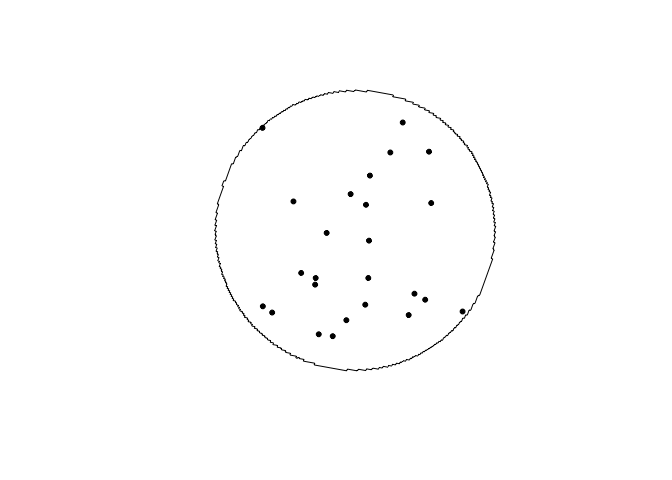
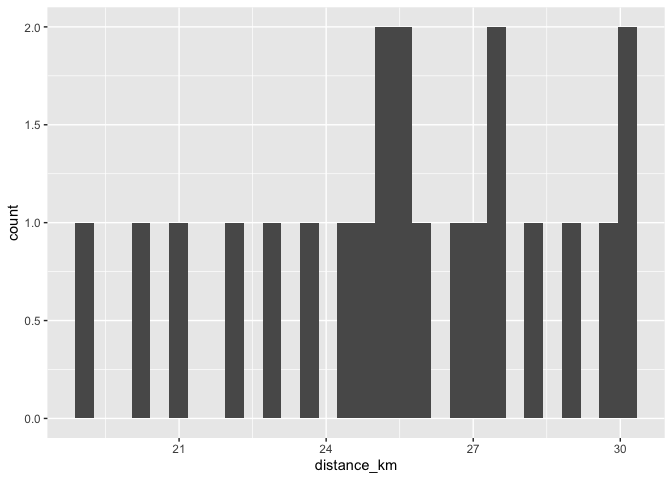
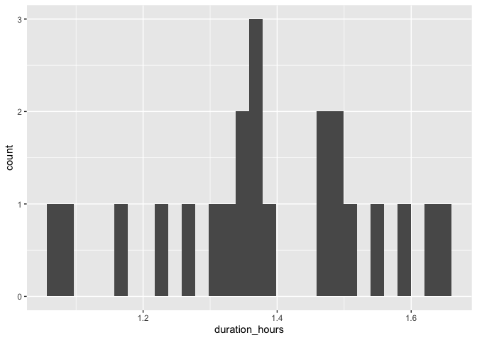
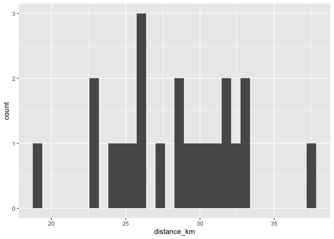
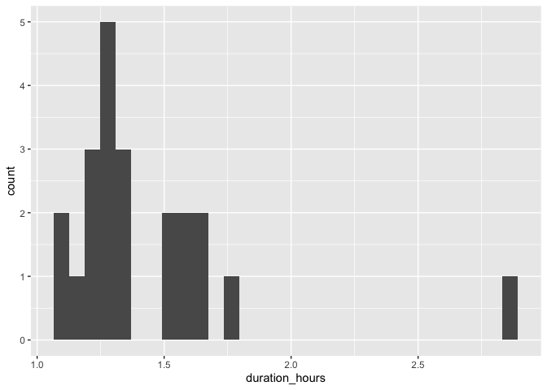
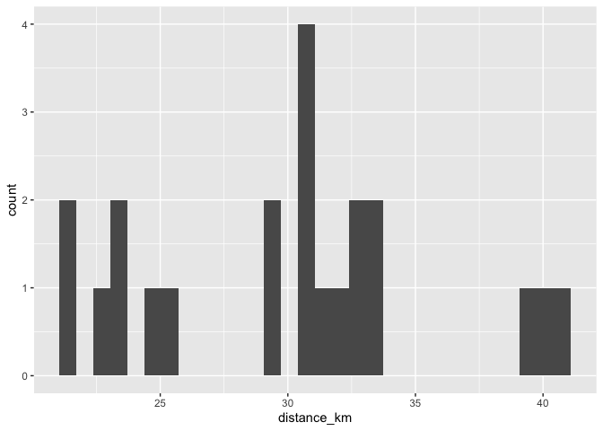
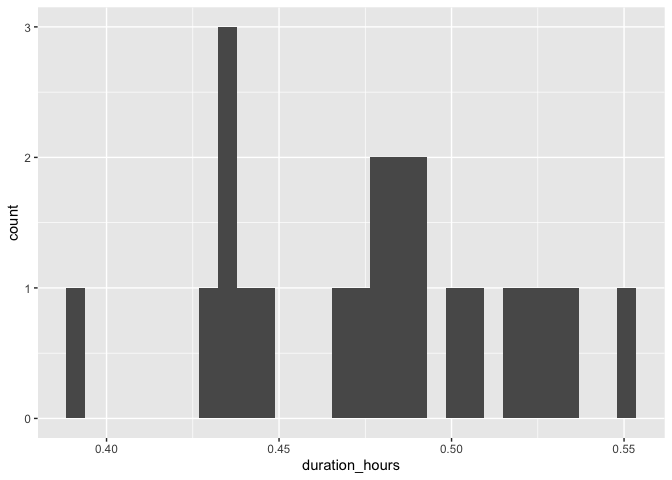
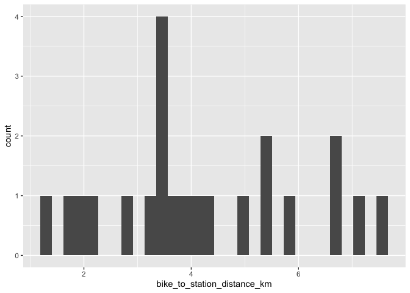
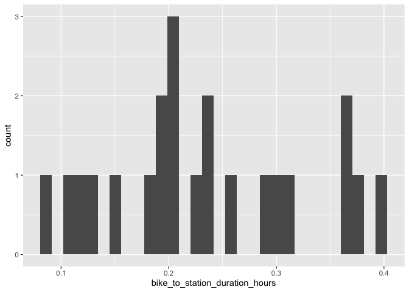

# Ottawa

## Barrhaven Center Station

### Draw buffer and select points


``` r
destination <- "National Gallery of Canada, Ottawa, Canada"        #### EDIT ME
```

### Set origin point


``` r
origin <- "Barrhaven Center Station, Ottawa, Canada"    #### EDIT ME
```

#### Setup departure location and arrival time

June 22, 2024


``` r
arrival_time <- as.POSIXct("2024-09-24 08:30:00", tz = "America/Toronto")       #### EDIT ME
```


``` r
stations <- geocode(location = origin, output = "more", source = "google")
```

```
## ℹ <https://maps.googleapis.com/maps/api/geocode/json?address=Barrhaven+Center+Station,+Ottawa,+Canada&key=xxx>
```

``` r
stations_sf <- stations %>%
                st_as_sf(coords = c("lon", "lat"), crs = 4326)

stations_buffer = st_buffer(stations_sf, 5000)

stations_buffer <- as_sf(stations_buffer)
```

#### Interactive map view of buffers


``` r
mapview(stations_buffer)
```

```{=html}
<div class="leaflet html-widget html-fill-item" id="htmlwidget-8204d940cec49da78cb2" style="width:672px;height:480px;"></div>
<script type="application/json" data-for="htmlwidget-8204d940cec49da78cb2">{"x":{"options":{"minZoom":1,"maxZoom":52,"crs":{"crsClass":"L.CRS.EPSG3857","code":null,"proj4def":null,"projectedBounds":null,"options":{}},"preferCanvas":false,"bounceAtZoomLimits":false,"maxBounds":[[[-90,-370]],[[90,370]]]},"calls":[{"method":"addProviderTiles","args":["CartoDB.Positron","CartoDB.Positron","CartoDB.Positron",{"errorTileUrl":"","noWrap":false,"detectRetina":false,"pane":"tilePane"}]},{"method":"addProviderTiles","args":["CartoDB.DarkMatter","CartoDB.DarkMatter","CartoDB.DarkMatter",{"errorTileUrl":"","noWrap":false,"detectRetina":false,"pane":"tilePane"}]},{"method":"addProviderTiles","args":["OpenStreetMap","OpenStreetMap","OpenStreetMap",{"errorTileUrl":"","noWrap":false,"detectRetina":false,"pane":"tilePane"}]},{"method":"addProviderTiles","args":["Esri.WorldImagery","Esri.WorldImagery","Esri.WorldImagery",{"errorTileUrl":"","noWrap":false,"detectRetina":false,"pane":"tilePane"}]},{"method":"addProviderTiles","args":["OpenTopoMap","OpenTopoMap","OpenTopoMap",{"errorTileUrl":"","noWrap":false,"detectRetina":false,"pane":"tilePane"}]},{"method":"createMapPane","args":["polygon",420]},{"method":"addPolygons","args":[[[[{"lng":[-75.78427053421872,-75.78441294669206,-75.78478832429373,-75.78493073107759,-75.78530610430055,-75.78559090424694,-75.78634163411002,-75.78662641129992,-75.78683998830606,-75.78702766415778,-75.78709885451038,-75.7876618780822,-75.78808899291739,-75.78846433046063,-75.78860669414186,-75.7889820273063,-75.7892667410504,-75.78940909455969,-75.78978441645285,-75.78992676427418,-75.79030208178852,-75.79080026944906,-75.79098792182582,-75.79105908838859,-75.79162204153516,-75.79190669184486,-75.79219133318954,-75.79294190655244,-75.79351113478208,-75.79379573545144,-75.79454626373331,-75.79483084165722,-75.79511541061875,-75.79539997061826,-75.79554224725739,-75.79591748588017,-75.79605975683363,-75.79643499107775,-75.79671951937341,-75.79728854908363,-75.79757305049894,-75.79832346106464,-75.79860793974095,-75.79889240945863,-75.7991768702181,-75.79946132201974,-75.79974576486391,-75.80003019875103,-75.80031462368144,-75.80059903965555,-75.80088344667375,-75.80116784473641,-75.80191811378585,-75.80220248911716,-75.80277121291692,-75.80202098519497,-75.8023053474393,-75.80258970073001,-75.80287404506748,-75.8031583804521,-75.80344270688425,-75.80372702436432,-75.80401133289267,-75.8042956324697,-75.80457992309579,-75.80486420477132,-75.80448915837624,-75.80463129930055,-75.80425625541402,-75.80468267509019,-75.80525120333448,-75.80553545403293,-75.80497293292669,-75.80504399678486,-75.80485649014287,-75.80506968094339,-75.80535392751409,-75.80563816513659,-75.80592239381124,-75.80517241654029,-75.80602509018375,-75.80532202181872,-75.80533978580335,-75.805292914516,-75.80555937089828,-75.80584358237235,-75.80612778490016,-75.80537788275518,-75.80566209010262,-75.8059462885042,-75.80557134979537,-75.80571344908279,-75.80533851288075,-75.80548061337294,-75.80576480764826,-75.80604899297853,-75.80529915218166,-75.8058675235351,-75.80511770652718,-75.80540189254991,-75.80568606962839,-75.80493627640787,-75.80550463125678,-75.8047548618221,-75.8050390395921,-75.80466416035378,-75.80480624932511,-75.8044313725927,-75.80457346276825,-75.80485763641181,-75.80410790078454,-75.80439207924466,-75.80467624876179,-75.80392653691653,-75.80421071124975,-75.8035547223589,-75.8035902450266,-75.80349653230937,-75.80374518857558,-75.80402935878188,-75.80327968073853,-75.80356385576005,-75.80281418773795,-75.80309836757421,-75.80272353904064,-75.80286562904458,-75.8024908030162,-75.80291706993212,-75.80216743570777,-75.80245161623007,-75.80170199202577,-75.80198617736146,-75.80133026515432,-75.80136578919698,-75.80127208743458,-75.8015207533256,-75.80114595171003,-75.80128804686974,-75.80091324775901,-75.80105534412182,-75.80068054751591,-75.80082264508174,-75.80044785098062,-75.80058994974942,-75.80087414058087,-75.8001245702077,-75.80040876585073,-75.79965920549598,-75.7999434059501,-75.79919385561357,-75.79947806087834,-75.79872852055976,-75.7990127306347,-75.79826320033386,-75.79854741521852,-75.79779789493519,-75.7980821146291,-75.79733260436304,-75.79761682886576,-75.79686732861674,-75.79649257709251,-75.79663469630304,-75.7962599472831,-75.79640206769558,-75.79602732117986,-75.79616944279421,-75.79579469878271,-75.79593682159889,-75.79528102334881,-75.79531655520732,-75.7952228697246,-75.79547159032593,-75.79472211639494,-75.79500637387608,-75.79425690996145,-75.79454117224859,-75.79341699000177,-75.79355912810252,-75.79318440225822,-75.79332654156019,-75.79257709394706,-75.79286137959107,-75.79211194199387,-75.79239623244202,-75.79164680486051,-75.79108473172674,-75.79115580895525,-75.79096845163689,-75.79118168254631,-75.79043226125083,-75.79071657505054,-75.78996716377058,-75.78940510286355,-75.7894761859294,-75.78928883268668,-75.78950208110786,-75.7887526761146,-75.78903701326198,-75.788287618284,-75.78753821957814,-75.78782257526933,-75.78651114261481,-75.78658223615268,-75.78639488855771,-75.78660816839441,-75.78585878599189,-75.78548409339314,-75.7856262874627,-75.78525159736776,-75.78539379263692,-75.78426972706897,-75.78441193040831,-75.78403724345799,-75.78417944799669,-75.78343007817226,-75.78305539186302,-75.78319760447135,-75.78282292066595,-75.7829651344734,-75.78184108777502,-75.78198330965158,-75.78160862899142,-75.78175085206686,-75.78100149482314,-75.78043947444641,-75.78051059115663,-75.78032325142428,-75.78053660077681,-75.77903789514858,-75.77932238060298,-75.77857303594261,-75.77782368755939,-75.77726167382907,-75.77733280324006,-75.77714546572329,-75.77735885317742,-75.77660951108749,-75.77548549097426,-75.77562776365333,-75.77525309185589,-75.77539536573266,-75.77464602621546,-75.77389668297745,-75.77352200996324,-75.77366429877435,-75.77328962826422,-75.77343191827268,-75.77268258133051,-75.77118389628717,-75.77146851080147,-75.77071917643666,-75.76996983835306,-75.76922049655104,-75.76847115103101,-75.76875581153789,-75.76800647603494,-75.76786414003278,-75.76748946745363,-75.7671147939452,-75.76725713681461,-75.76505593136001,-75.7650737265829,-75.76502689212953,-75.76529381708184,-75.76454447672948,-75.76379513266149,-75.76304578487826,-75.76229643338014,-75.76154707816757,-75.76079771924087,-75.76009519187427,-75.76011299254604,-75.76006615732585,-75.76033316401029,-75.7588344550547,-75.75733573124826,-75.75583699259403,-75.75433823909502,-75.75283947075427,-75.75134068757484,-75.74984188955976,-75.74834307671206,-75.74684424903479,-75.74534540653099,-75.74506032449511,-75.74431088395426,-75.74356143970802,-75.7428119917568,-75.74206254010097,-75.74131308474091,-75.74056362567703,-75.74042104010944,-75.74004630575629,-75.73990371451576,-75.7372805240974,-75.73653103279092,-75.73624578180461,-75.73549627306741,-75.73474676062928,-75.7339972444906,-75.73385459504166,-75.73347983215244,-75.73333717702972,-75.7322128725154,-75.73071378688242,-75.7304284218595,-75.72967885976591,-75.72892929397432,-75.72871524372805,-75.72852784912816,-75.72845649706689,-75.72714472239088,-75.72639513177856,-75.72610968017199,-75.72536007213415,-75.72461046040044,-75.72432497236464,-75.72357534320618,-75.72282571035272,-75.72254018588642,-75.721790535609,-75.72104088163751,-75.72075532073937,-75.7200056493447,-75.71986285866568,-75.71948801815095,-75.71934522179596,-75.71897037692555,-75.71822068441529,-75.71797076737472,-75.71787705404962,-75.71784135083978,-75.71643564082287,-75.71614998435136,-75.71540025330586,-75.71513242933922,-75.71508557022182,-75.71506771495653,-75.71436482566102,-75.71422197584025,-75.71384709679046,-75.7137042412926,-75.71332935788767,-75.71257958831046,-75.71229384998513,-75.71154406298793,-75.71125830195268,-75.7105084975358,-75.71025843724904,-75.71016470993575,-75.71012898626182,-75.70947289195334,-75.70925853795184,-75.70907107934191,-75.70899962602722,-75.70843724623991,-75.70829433277724,-75.70791940833386,-75.70777648919284,-75.70740156039479,-75.70725863557533,-75.70688370242264,-75.70674077192459,-75.70636583441731,-75.70622289824055,-75.7058479563787,-75.70570501452313,-75.70533006830676,-75.70511564616272,-75.70492817013422,-75.70485669410493,-75.70429426206249,-75.70404408252605,-75.70395034214879,-75.70391460143888,-75.70325841568378,-75.70297247293433,-75.70222252916994,-75.70193656370188,-75.70118660252029,-75.70090061433262,-75.70075761686861,-75.70038262459651,-75.70023962145227,-75.69986462482593,-75.69957860492973,-75.69882859518106,-75.69854255256259,-75.69839952788247,-75.69802451132662,-75.69788148096562,-75.69750646005564,-75.69722038572408,-75.69647032740821,-75.69618423035169,-75.695969651659,-75.69578213049579,-75.69571060228255,-75.69514803483713,-75.69471883830391,-75.69434378188851,-75.69420070844744,-75.69382564767797,-75.69353948718337,-75.69339640356365,-75.69302133157217,-75.69287824227003,-75.69250316592451,-75.69196654813783,-75.6918727756882,-75.69183699983014,-75.69118058957056,-75.69089436562655,-75.69060813268707,-75.6898579186099,-75.68899912460087,-75.68824886563161,-75.68796256922913,-75.68767626382856,-75.68738994942953,-75.68717520772478,-75.68698762952749,-75.68691604697561,-75.68635330842868,-75.68606696229163,-75.6854942430172,-75.68506467993458,-75.68468948883832,-75.68454629320819,-75.68417109775761,-75.68388469287525,-75.68359827899063,-75.68331185610336,-75.68302542421306,-75.68273898331934,-75.68245253342182,-75.68216607452011,-75.68187960661385,-75.68159312970262,-75.68130664378607,-75.68102014886379,-75.6807336449354,-75.68044713200052,-75.68016061005876,-75.67987407910975,-75.67958753915309,-75.67930099018841,-75.6790144322153,-75.67872786523341,-75.67844128924231,-75.67815470424166,-75.67871771355846,-75.67864606847841,-75.67883373865082,-75.67861880261,-75.67804561505659,-75.67747239146016,-75.67784776377226,-75.67770445567879,-75.67807983051041,-75.67793652360183,-75.67764990302595,-75.67736327343815,-75.67707663483802,-75.67763973146192,-75.67756807298224,-75.6777557722573,-75.67725415314412,-75.67696750125798,-75.67734291802982,-75.67719959214512,-75.67757501143718,-75.67743168673756,-75.67714503057813,-75.67685836540477,-75.67742151841047,-75.67734985328769,-75.67753757135684,-75.67703590574018,-75.67674922727845,-75.6775001350869,-75.67721346136618,-75.67692677863035,-75.6776307771583,-75.67761285999404,-75.67765979316819,-75.67739103228436,-75.67710434527447,-75.67766756223621,-75.67759589165458,-75.67778363104254,-75.67756861849632,-75.67728192721241,-75.67784516205643,-75.67777349040638,-75.67796123575516,-75.6777462200037,-75.67745952444572,-75.67811665242694,-75.67808081635314,-75.67817469176444,-75.67792383680805,-75.67763713697607,-75.67838816399978,-75.67810146891101,-75.67781476480505,-75.67856581567651,-75.67827911631417,-75.6788424123779,-75.67877073870864,-75.67895850446408,-75.67845677901916,-75.67920786382827,-75.67892116493694,-75.67948448645467,-75.67941281290331,-75.67960058714347,-75.67938556568828,-75.67909886252386,-75.67984998127388,-75.67956328285487,-75.68031441169444,-75.68002771802131,-75.68040328794532,-75.68025994116802,-75.68063551361453,-75.68049216802385,-75.6802054700785,-75.6809566328632,-75.68066993966463,-75.68142111254004,-75.6811344240887,-75.68188560705509,-75.68159892335143,-75.68225621747783,-75.6822203828865,-75.68231428203279,-75.68206343745352,-75.6826268401599,-75.68255517159322,-75.68274297289632,-75.68252796639563,-75.6829035734755,-75.68276023643192,-75.68313584603477,-75.68299251017849,-75.68336812230434,-75.68322478763542,-75.68360040228431,-75.6834570688028,-75.68383268597475,-75.68368935368069,-75.68406497337574,-75.68392164226921,-75.68429726448738,-75.68415393456844,-75.68452955930977,-75.68438623057845,-75.68476185784297,-75.68461853029937,-75.68499416008709,-75.68485083373123,-75.6852264660422,-75.68508314087416,-75.68545877570838,-75.68531545172821,-75.68587890741975,-75.68580724716615,-75.68599506613096,-75.68578008457011,-75.6864374581741,-75.68640162892696,-75.68649553942711,-75.68624473225761,-75.68699602624012,-75.68670939479142,-75.68746069886771,-75.6871740721722,-75.68792538634253,-75.68763876440069,-75.68839008866527,-75.68876574941791,-75.68862244539483,-75.68899810867103,-75.68885480583663,-75.6896061365163,-75.68931953785732,-75.69007087863146,-75.68978428472801,-75.69053563559686,-75.69109914633334,-75.69102750247482,-75.69121533978787,-75.6910004074132,-75.69175176469648,-75.69146519408119,-75.69259224376806,-75.69244896541051,-75.69282465024291,-75.69268137307486,-75.69343274686679,-75.69314619954359,-75.69389758343067,-75.69446111892965,-75.69438948671726,-75.69457733228438,-75.69436243484874,-75.69511382514888,-75.69548951891798,-75.69534626147612,-75.69572195776898,-75.69557870151721,-75.69633009822977,-75.69604359274136,-75.69679499954925,-75.69754640267358,-75.6972599157255,-75.69876273848057,-75.69847627007438,-75.6992276897051,-75.69997910565098,-75.69969265578827,-75.70119550418509,-75.7009090728674,-75.70166050531834,-75.70241193408316,-75.70212552131207,-75.70419196930577,-75.70412037417941,-75.70430823256666,-75.70409344639106,-75.7048448879722,-75.70559632586556,-75.70530996397535,-75.70606141196367,-75.70756429687468,-75.70727796732012,-75.70802941802592,-75.70878086504227,-75.70953230836881,-75.70924601115286,-75.7099974645738,-75.71215787260076,-75.71212209149208,-75.71221602179916,-75.71196555160333,-75.71271700404567,-75.71346845279615,-75.71421989785439,-75.71497133922003,-75.71468513426234,-75.71543658572133,-75.71693947755917,-75.7184423546209,-75.71815620958644,-75.71890765636269,-75.71965909944389,-75.72041053882967,-75.72116197451965,-75.72191340651344,-75.72266483481066,-75.72341625941093,-75.72416768031385,-75.72388163657453,-75.72688733836102,-75.73289856435166,-75.73590408850683,-75.73618991161058,-75.73694126960021,-75.73769262388564,-75.73844397446646,-75.73919532134228,-75.73994666451274,-75.74069800397743,-75.74144933973599,-75.74159219964395,-75.74196786268546,-75.74211071689588,-75.74248637556285,-75.74398900096274,-75.74549161153143,-75.74574154668322,-75.7458354578428,-75.7458711620867,-75.74652853707266,-75.74727981929365,-75.74803109780518,-75.74878237260687,-75.74906794805558,-75.75057045894421,-75.75132170882206,-75.75160723390135,-75.75235846627587,-75.75310969493839,-75.75386091988851,-75.75414639459977,-75.75564880577751,-75.75586288522268,-75.75605068298954,-75.75612204081877,-75.75668543014071,-75.75743661265336,-75.75757931455847,-75.75795490097394,-75.75809759718372,-75.75922434051398,-75.75936702413281,-75.75974259993735,-75.75988527786116,-75.7602608492889,-75.76101198935734,-75.76115465469056,-75.76153021988331,-75.76167287952181,-75.76279955918139,-75.76301352891129,-75.76320130545557,-75.76327262671361,-75.76383595236655,-75.76458704998407,-75.76487230526561,-75.7656233853738,-75.76576600274963,-75.7661415379615,-75.76628414964347,-75.76665968047787,-75.76741073935729,-75.76769593529697,-75.76844697666598,-75.7686608573825,-75.76884861455775,-75.76891990614517,-75.76948317369013,-75.7702341938279,-75.77051933043045,-75.77127033305673,-75.77155544688762,-75.77230643200215,-75.77259152306235,-75.77334249066485,-75.77359192591008,-75.7736857950904,-75.77372142792018,-75.77437850904553,-75.77459229402859,-75.77478002838389,-75.77485128806073,-75.77541448714489,-75.77562825505206,-75.77581598502918,-75.77588723901417,-75.77645042496363,-75.77666417579564,-75.77685190139451,-75.7769231496879,-75.77748632250245,-75.77773567806207,-75.77782953848599,-75.77786515993233,-75.77852217976205,-75.77880713421862,-75.77955799674314,-75.77984292843587,-75.78059377344641,-75.78087868237627,-75.78162950987257,-75.78191439604052,-75.78205683575951,-75.78243223776933,-75.78257467179814,-75.78295006942935,-75.78323492386384,-75.78398570254342,-75.78427053421872],"lat":[45.30058862648811,45.30030756067311,45.30035510430687,45.30007403902667,45.30012158030503,45.29955945227734,45.29965452684023,45.2990924009526,45.29867081037726,45.29869457650214,45.29855404680993,45.29862534234798,45.2977821677006,45.2978296934921,45.29754863727481,45.29759616071156,45.29703405081109,45.29675299805562,45.29680051728246,45.29651946506262,45.29656698193494,45.29558330744224,45.29560706372017,45.29546654002407,45.29553780602207,45.2949757121137,45.29441362405883,45.29450863297689,45.29338446700982,45.29282239280721,45.292917384892,45.29235531283492,45.29179324663219,45.29123118628392,45.29095015830524,45.29099764571848,45.29071661827648,45.29076410333644,45.29020205098965,45.28907796386101,45.28851592907938,45.2886108800911,45.28804884745776,45.28748682067993,45.28692479975776,45.28636278469133,45.28580077548077,45.28523877212618,45.28467677462766,45.28411478298532,45.2835527971993,45.28299081726968,45.28308572551606,45.28252374773766,45.2813998097513,45.28130491262038,45.28074295611749,45.28018100547157,45.27961906068271,45.27905712175104,45.27849518867664,45.27793326145967,45.2773713401002,45.27680942459833,45.27624751495421,45.27568561116792,45.27563817898609,45.27535723021556,45.27530979753475,45.27446696278776,45.27334320362825,45.27278133283581,45.27271019364204,45.27256972755362,45.27254601400815,45.27212461863407,45.27156276326134,45.27100091374702,45.27043907009124,45.27034422623405,45.26865874152657,45.2685698306495,45.2685347171624,45.26852878960702,45.26800209026376,45.26744028330666,45.26687848220844,45.26678364917163,45.26622185763462,45.26566007195657,45.26561265700413,45.26533176728778,45.26528435183679,45.26500346451073,45.26444169425291,45.26387992985423,45.26378510393528,45.26266160011939,45.2625667759085,45.26200503649128,45.26144330293334,45.2613484804307,45.26022503829638,45.26013021750214,45.25956850892572,45.25952109824389,45.25924024707838,45.25919283589832,45.25891198712307,45.25835029396713,45.25825547288864,45.25769378929377,45.25713211155837,45.25703729218885,45.25647562401451,45.25639265563422,45.25632244792929,45.2563105950055,45.25581914403932,45.25525749128555,45.25516267163304,45.25460102844032,45.25450620679587,45.25394457316422,45.25389716205778,45.25361634836466,45.25356893676032,45.2527265072464,45.25263168532029,45.25207007667028,45.25197525275289,45.25141365366397,45.25133068130535,45.25126048223611,45.25124862874407,45.25075723822767,45.25070982498954,45.25042903334833,45.25038161961252,45.2501008303616,45.2500534161281,45.24977262926746,45.24972521453633,45.24944443006597,45.24888286551985,45.24878803734101,45.248226482356,45.24813165218692,45.24757010676306,45.24747527460393,45.24691373874122,45.24681890459223,45.24625737829071,45.24616254215207,45.24560102541174,45.24550618728364,45.24494468010452,45.24484983998716,45.24428834236927,45.24419350026285,45.24414607707549,45.24386533324032,45.24381790955576,45.24353716811092,45.24348974392918,45.24320900487466,45.24316158019577,45.24288084353159,45.24279784853989,45.24272766500766,45.24271580828245,45.24222452652506,45.24212967276197,45.24156821709156,45.24147336134033,45.24091191523131,45.24076962648864,45.24048890840814,45.24044147690773,45.24016076121759,45.24006589580038,45.23950447251691,45.23940960511229,45.2388481913903,45.23875332199847,45.23868216622049,45.23854181532546,45.23851809625299,45.23809704645915,45.23800216939037,45.23744077849454,45.23734589943907,45.23727473641351,45.23713439122512,45.23711066973684,45.2366896370629,45.23659475033124,45.23603338226206,45.23593849354425,45.23584359913679,45.23528224433299,45.23511617191101,45.23497583574582,45.23495210992322,45.23453110431882,45.23443620025051,45.23438874608282,45.23410808028851,45.23406062562452,45.23377996222069,45.2336375924728,45.23335693331165,45.23330947481044,45.23302881803979,45.23293389862266,45.23288643678059,45.23260578425277,45.23255832191457,45.23227767177725,45.23213527900739,45.23185463311304,45.23180716693806,45.23152652343425,45.23143158866992,45.23136038386318,45.23122006428137,45.23119632886623,45.23077537301193,45.23058548244825,45.23002422051147,45.22992927040161,45.22983431460274,45.22976309402012,45.22962278199876,45.22959904132505,45.22917810815201,45.22908314468106,45.22894068880773,45.22866007315525,45.22861258594623,45.22833197268439,45.22823699585285,45.2281420133323,45.22809451993864,45.22781391277416,45.22776641888497,45.22748581411116,45.22739082391953,45.22720082646924,45.22663963243488,45.22654462888366,45.22644961964347,45.22635460471424,45.22625958409592,45.22569841074782,45.22560338814856,45.22588397223664,45.22583645787655,45.22578894209417,45.22550835986027,45.22522918136206,45.22519410936664,45.22518816887972,45.2246620919099,45.22456704457397,45.22447199154892,45.22437693283468,45.22428186843118,45.22418679833834,45.22409172255612,45.2240025838431,45.22396751383653,45.22396157109236,45.22343552395488,45.22324535136386,45.22305515601508,45.22286493790804,45.22267469704224,45.22248443341716,45.22229414703229,45.22210383788714,45.22191350598118,45.22172315131395,45.22153277388488,45.22209381676834,45.22199861580354,45.22190340914788,45.22180819680132,45.2217129787638,45.22161775503523,45.22152252561557,45.22180303810598,45.22175542033304,45.22203593335684,45.22170256260338,45.22160730101066,45.22216831472132,45.22207304371993,45.22197776702661,45.22188248464128,45.22216298811385,45.22211534385725,45.22239584786238,45.22225290376578,45.22206229171356,45.22262329109584,45.22252797281227,45.2224326488359,45.22285339663146,45.22282956405051,45.22296981381411,45.22280297415742,45.22270762938263,45.22326862186223,45.22317326767418,45.22307790779261,45.22363889867794,45.22354352938222,45.22344815439266,45.2240091436822,45.22391375927761,45.22381836917884,45.2243793568711,45.22428395735641,45.22456445153353,45.22451674871027,45.2247972434181,45.22474953824065,45.22465412361466,45.22514498798377,45.22513306034796,45.22520318413637,45.22502425804842,45.22558524466282,45.22548980550601,45.22601573227394,45.22600976691935,45.22604482887196,45.22595534566534,45.22623584036248,45.22618811300779,45.22646860823485,45.22642087852522,45.22632541483397,45.22688640408439,45.22679093097273,45.22735192234165,45.22725643980894,45.22774730879038,45.22773537266584,45.227805497113,45.22772194134139,45.22814268749675,45.22811881291952,45.22825906213542,45.22818743556884,45.22846793369896,45.2284201799428,45.228700678602,45.22865292249006,45.22893342167826,45.22888566321046,45.22916616292756,45.22911840210383,45.22939890234979,45.22935113917004,45.22963163994476,45.22958387440892,45.23000462691165,45.22998074291079,45.23012099424227,45.23004933940412,45.23054021949337,45.23052827630107,45.23059840233493,45.23051479708815,45.23107580538314,45.23098024745984,45.23154125786782,45.23144569051793,45.23200670303832,45.2322872114886,45.23223942288035,45.23251993185858,45.23247214089338,45.23303316136551,45.23293757143177,45.23349859401483,45.23377910749621,45.23373130759513,45.23401182160408,45.23396401934565,45.23452504987834,45.23442943735675,45.23499046999889,45.23541124831231,45.23538734265937,45.2355276025939,45.23545588279785,45.23629744587183,45.2362496280951,45.23653015110639,45.23648233097167,45.23704337950763,45.23732390596494,45.23727608160666,45.23755660859073,45.23750878187422,45.23856076756498,45.23854880978857,45.23861894283937,45.23853523550158,45.23909629992642,45.23965737018871,45.23956169184981,45.24124492646323,45.24114923122368,45.24171031736916,45.24227140935126,45.24283250716989,45.24325333436401,45.24322940616305,45.24336968239062,45.24329789494855,45.24385900070617,45.24498122972941,45.24582291681592,45.24577504833682,45.24605561268321,45.24600774184415,45.24656887304619,45.24713001008357,45.2476911529562,45.24825230166393,45.24881345620667,45.2493746165843,45.24993578279673,45.25049695484383,45.25105813272548,45.25161931644161,45.25218050599206,45.25274170137675,45.25330290259556,45.25386410964838,45.2544253225351,45.25498654125561,45.2555477658098,45.25610899619755,45.25667023241878,45.25723147447333,45.25779272236113,45.25786458692954,45.25800490051375,45.25802885488979,45.25844979853067,45.25957233094745,45.26069488669599,45.2607428032551,45.2610234467723,45.26107136283832,45.26135200874828,45.26191330494276,45.26247460696988,45.26303591482954,45.26310779606496,45.2632481246422,45.26327208457376,45.2642543964569,45.2648157255525,45.26486364948546,45.2651443171551,45.26519224059478,45.26547291065722,45.2660342551563,45.26659560548754,45.26666749498012,45.26680783417527,45.2668317968591,45.26781418306731,45.26837555463388,45.26847141208153,45.26903279321942,45.26959418018919,45.26968404836901,45.26971913546737,45.26972512651542,45.27025143594356,45.2708128383165,45.2708847345862,45.27102508679182,45.27104905173456,45.27147011123951,45.27203152901554,45.27210342660926,45.27224378266565,45.27226774804969,45.27268881910697,45.27325025228606,45.27333413404407,45.27340431401052,45.27341629682009,45.27390755954568,45.27446900812778,45.27456487440189,45.27512633255539,45.27568779654043,45.27578366457936,45.27634513813582,45.27641703821935,45.27655740822087,45.27658137443471,45.27756397628669,45.27765984411474,45.27822134264553,45.27829324257061,45.27843361881571,45.27845758497668,45.27887871660003,45.2794402305337,45.27953609815,45.28009762165509,45.28019348729519,45.2807550203717,45.28080295291811,45.28108372257815,45.28113165463044,45.28141242668332,45.28197397516268,45.28206984058973,45.2826313986405,45.28272726209072,45.28328882971288,45.28338469118607,45.2839462683796,45.28403014575123,45.28410034371949,45.28411232590226,45.28460371464044,45.28467560831535,45.28481600661896,45.28483997069634,45.2852611684952,45.28530909698035,45.28558989827024,45.28563782626095,45.28591862994367,45.28596655743992,45.28624736351547,45.28629529051724,45.28657609898561,45.28662402549287,45.28690483635407,45.28695276236679,45.28723357562082,45.28728150113899,45.28756231678582,45.28761024180942,45.28789105984908,45.28793898437807,45.28821980481053,45.28826772884489,45.28854855167017,45.28859647520987,45.28887730042796,45.28892522347299,45.28920605108389,45.28927793437327,45.28941834942659,45.28944231004198,45.28986355809,45.28994741988329,45.29001762861921,45.29002960857642,45.29052107268831,45.29061691240118,45.29117859487858,45.29127443261207,45.29183612466062,45.29193196041451,45.29249366203419,45.29258949580829,45.29263741055074,45.29291826635188,45.29296618059931,45.29324703879321,45.29334286486824,45.29390458936904,45.29400041346376,45.29456214753557,45.29465796964975,45.2947298324821,45.294870268547,45.2948942223432,45.29531553342604,45.29541134784007,45.29597310479239,45.29611682129702,45.29639770476414,45.29644560834048,45.29672649420031,45.29682229893236,45.29738407876469,45.29747988151516,45.29755172982441,45.29769217732924,45.29771612628431,45.29813747168697,45.29823326673576,45.29828116211522,45.29856206367644,45.29860995856036,45.29889086251426,45.29898664986095,45.29954846588114,45.29964425124537,45.29974003088956,45.30030186021777,45.30049340982042,45.30105525245631,45.30115102241444,45.30124678665236,45.3018086425956,45.3020001613842,45.30256203063446,45.3026577851848,45.30275353401479,45.30331541657172,45.30357870663299,45.30371918075232,45.30374311430077,45.30416453954711,45.30426027296749,45.30435600066743,45.30491791357233,45.30501363928727,45.30520507355568,45.30576700350111,45.30586271578962,45.30595842235758,45.30605412320508,45.30661607019001,45.30671176905155,45.30698687141344,45.30705711700563,45.30706907696365,45.30756079907048,45.307656478784,45.30775215277699,45.30784782104956,45.30794348360174,45.30850547212934,45.30860113269433,45.30879243666301,45.30898371775037,45.30954573077846,45.30964136647405,45.3097369964493,45.30983262070427,45.30992823923901,45.31002385205361,45.3101194591481,45.31021506052257,45.31031065617709,45.31087270489546,45.31125504523691,45.3120194513709,45.31240151717155,45.31183940878548,45.31193490721025,45.31203039991622,45.3121258869034,45.3122213681719,45.31231684372176,45.31241231355305,45.31250777766583,45.31222671261924,45.31227444159971,45.31199337708199,45.31204110370143,45.31223199588382,45.31242286519402,45.31193099113366,45.31194291929874,45.31187265188277,45.31195614612935,45.31205156276514,45.31214697368334,45.31224237888402,45.31168022841111,45.31187101421281,45.31196639853791,45.3114042427378,45.31149961762284,45.31159498679107,45.31169035024257,45.31112818911809,45.31131889142684,45.31089726883568,45.31092110431871,45.31078056395294,45.31085206756067,45.31094740070273,45.31066631781081,45.31071398130803,45.31043289894703,45.31057587807422,45.31029479438384,45.31034245030488,45.31006136714569,45.31010902070773,45.31020432354525,45.30992323905719,45.30997088740266,45.30968980344602,45.3098327371198,45.30941110974038,45.30943493007177,45.30929438811026,45.30936584626395,45.30946111880182,45.30889894810115,45.30899421120542,45.30871312618815,45.30876075466772,45.30847967018251,45.30852729630389,45.30862254426106,45.30806037409848,45.30815561262358,45.3077339860505,45.30775779409191,45.30761725239947,45.30768867368405,45.30778389706415,45.30722172744373,45.30731694139325,45.30675477390382,45.3068499784234,45.30628781306558,45.30638300815583,45.30589111501357,45.30590301359173,45.30583274345032,45.30591603059178,45.30549440922386,45.30551820404997,45.30537766409288,45.30544904573247,45.3050274259646,45.3050512184338,45.30491067901012,45.30498205357912,45.30456043541177,45.30458422552422,45.30444368663409,45.304515054133,45.30402316845879,45.30403506232329,45.30396479324882,45.30404804739531,45.30348589483994,45.30358103336729,45.3030188829478,45.30311401205016,45.30255186376718,45.30264698344518,45.30208483729929,45.30180376642038,45.30185132133301,45.30157025098853,45.30161780354538,45.30105566538824,45.30115076250667,45.30058862648811]}]]],null,"stations_buffer",{"crs":{"crsClass":"L.CRS.EPSG3857","code":null,"proj4def":null,"projectedBounds":null,"options":{}},"pane":"polygon","stroke":true,"color":"#333333","weight":0.5,"opacity":0.9,"fill":true,"fillColor":"#6666FF","fillOpacity":0.6,"smoothFactor":1,"noClip":false},"<div class='scrollableContainer'><table class=mapview-popup id='popup'><tr class='coord'><td><\/td><th><b>Feature ID&emsp;<\/b><\/th><td>1&emsp;<\/td><\/tr><tr><td>1<\/td><th>type&emsp;<\/th><td>establishment&emsp;<\/td><\/tr><tr><td>2<\/td><th>loctype&emsp;<\/th><td>geometric_center&emsp;<\/td><\/tr><tr><td>3<\/td><th>address&emsp;<\/th><td>barrhaven centre, ottawa, on k2j 5g4, canada&emsp;<\/td><\/tr><tr><td>4<\/td><th>north&emsp;<\/th><td>45.26836&emsp;<\/td><\/tr><tr><td>5<\/td><th>south&emsp;<\/th><td>45.26566&emsp;<\/td><\/tr><tr><td>6<\/td><th>east&emsp;<\/th><td>-75.74009&emsp;<\/td><\/tr><tr><td>7<\/td><th>west&emsp;<\/th><td>-75.74278&emsp;<\/td><\/tr><tr><td>8<\/td><th>geometry&emsp;<\/th><td>sfc_POLYGON&emsp;<\/td><\/tr><\/table><\/div>",{"maxWidth":800,"minWidth":50,"autoPan":true,"keepInView":false,"closeButton":true,"closeOnClick":true,"className":""},"1",{"interactive":false,"permanent":false,"direction":"auto","opacity":1,"offset":[0,0],"textsize":"10px","textOnly":false,"className":"","sticky":true},{"stroke":true,"weight":1,"opacity":0.9,"fillOpacity":0.84,"bringToFront":false,"sendToBack":false}]},{"method":"addScaleBar","args":[{"maxWidth":100,"metric":true,"imperial":true,"updateWhenIdle":true,"position":"bottomleft"}]},{"method":"addHomeButton","args":[-75.80612778490016,45.22152252561557,-75.67674922727845,45.31250777766583,true,"stations_buffer","Zoom to stations_buffer","<strong> stations_buffer <\/strong>","bottomright"]},{"method":"addLayersControl","args":[["CartoDB.Positron","CartoDB.DarkMatter","OpenStreetMap","Esri.WorldImagery","OpenTopoMap"],"stations_buffer",{"collapsed":true,"autoZIndex":true,"position":"topleft"}]},{"method":"addLegend","args":[{"colors":["#6666FF"],"labels":["stations_buffer"],"na_color":null,"na_label":"NA","opacity":1,"position":"topright","type":"factor","title":"","extra":null,"layerId":null,"className":"info legend","group":"stations_buffer"}]}],"limits":{"lat":[45.22152252561557,45.31250777766583],"lng":[-75.80612778490016,-75.67674922727845]},"fitBounds":[45.22152252561557,-75.80612778490016,45.31250777766583,-75.67674922727845,[]]},"evals":[],"jsHooks":{"render":[{"code":"function(el, x, data) {\n  return (\n      function(el, x, data) {\n      // get the leaflet map\n      var map = this; //HTMLWidgets.find('#' + el.id);\n      // we need a new div element because we have to handle\n      // the mouseover output separately\n      // debugger;\n      function addElement () {\n      // generate new div Element\n      var newDiv = $(document.createElement('div'));\n      // append at end of leaflet htmlwidget container\n      $(el).append(newDiv);\n      //provide ID and style\n      newDiv.addClass('lnlt');\n      newDiv.css({\n      'position': 'relative',\n      'bottomleft':  '0px',\n      'background-color': 'rgba(255, 255, 255, 0.7)',\n      'box-shadow': '0 0 2px #bbb',\n      'background-clip': 'padding-box',\n      'margin': '0',\n      'padding-left': '5px',\n      'color': '#333',\n      'font': '9px/1.5 \"Helvetica Neue\", Arial, Helvetica, sans-serif',\n      'z-index': '700',\n      });\n      return newDiv;\n      }\n\n\n      // check for already existing lnlt class to not duplicate\n      var lnlt = $(el).find('.lnlt');\n\n      if(!lnlt.length) {\n      lnlt = addElement();\n\n      // grab the special div we generated in the beginning\n      // and put the mousmove output there\n\n      map.on('mousemove', function (e) {\n      if (e.originalEvent.ctrlKey) {\n      if (document.querySelector('.lnlt') === null) lnlt = addElement();\n      lnlt.text(\n                           ' lon: ' + (e.latlng.lng).toFixed(5) +\n                           ' | lat: ' + (e.latlng.lat).toFixed(5) +\n                           ' | zoom: ' + map.getZoom() +\n                           ' | x: ' + L.CRS.EPSG3857.project(e.latlng).x.toFixed(0) +\n                           ' | y: ' + L.CRS.EPSG3857.project(e.latlng).y.toFixed(0) +\n                           ' | epsg: 3857 ' +\n                           ' | proj4: +proj=merc +a=6378137 +b=6378137 +lat_ts=0.0 +lon_0=0.0 +x_0=0.0 +y_0=0 +k=1.0 +units=m +nadgrids=@null +no_defs ');\n      } else {\n      if (document.querySelector('.lnlt') === null) lnlt = addElement();\n      lnlt.text(\n                      ' lon: ' + (e.latlng.lng).toFixed(5) +\n                      ' | lat: ' + (e.latlng.lat).toFixed(5) +\n                      ' | zoom: ' + map.getZoom() + ' ');\n      }\n      });\n\n      // remove the lnlt div when mouse leaves map\n      map.on('mouseout', function (e) {\n      var strip = document.querySelector('.lnlt');\n      if( strip !==null) strip.remove();\n      });\n\n      };\n\n      //$(el).keypress(67, function(e) {\n      map.on('preclick', function(e) {\n      if (e.originalEvent.ctrlKey) {\n      if (document.querySelector('.lnlt') === null) lnlt = addElement();\n      lnlt.text(\n                      ' lon: ' + (e.latlng.lng).toFixed(5) +\n                      ' | lat: ' + (e.latlng.lat).toFixed(5) +\n                      ' | zoom: ' + map.getZoom() + ' ');\n      var txt = document.querySelector('.lnlt').textContent;\n      console.log(txt);\n      //txt.innerText.focus();\n      //txt.select();\n      setClipboardText('\"' + txt + '\"');\n      }\n      });\n\n      }\n      ).call(this.getMap(), el, x, data);\n}","data":null},{"code":"function(el, x, data) {\n  return (function(el,x,data){\n           var map = this;\n\n           map.on('keypress', function(e) {\n               console.log(e.originalEvent.code);\n               var key = e.originalEvent.code;\n               if (key === 'KeyE') {\n                   var bb = this.getBounds();\n                   var txt = JSON.stringify(bb);\n                   console.log(txt);\n\n                   setClipboardText('\\'' + txt + '\\'');\n               }\n           })\n        }).call(this.getMap(), el, x, data);\n}","data":null}]}}</script>
```

#### Generate points within buffer


``` r
set.seed(100)
points_sample_sf <- st_sample(stations_buffer, size = c(25,25), type = "random")
```

```
## Warning in st_poly_sample(x, size = size, ..., type = type, by_polygon =
## by_polygon, : coordinate ranges not computed along great circles; install
## package lwgeom to get rid of this warning
```

``` r
points_sample_sf <- st_as_sf(points_sample_sf)
points_sample <- sf_to_df(points_sample_sf)
```

#### Check to see if they worked


``` r
ottawa_check_buffer <- stations_buffer %>% slice(1:2)

plot(st_geometry(ottawa_check_buffer))
plot(points_sample_sf, pch = 20, add= TRUE)
```

<!-- -->


``` r
points_sample$destination <- destination
points_sample$origin <- origin
points_sample$lat_lon <- paste(points_sample$lat, points_sample$lon)
```

#### Checking points and general mapping


``` r
lst_directions <- apply(points_sample, 1, function(x){
  res <- google_directions(
    origin = x[['lat_lon']], 
    destination = x[['destination']]    
  )
df_result <- data.frame(
    origin = x[['lat_lon']], 
    destination = x[['destination']], 
    route = res$routes$overview_polyline$points 
)
return(df_result)
})

df_directions <- do.call(rbind, lst_directions)

google_map() %>%
  add_polylines(data = df_directions, polyline = "route") 
```

```{=html}
<div class="google_map html-widget html-fill-item" id="htmlwidget-c280f0ea16b73d75e7e8" style="width:672px;height:480px;"></div>
<script type="application/json" data-for="htmlwidget-c280f0ea16b73d75e7e8">{"x":{"lat":0,"lng":0,"zoom":1,"min_zoom":null,"max_zoom":null,"mapBounds":{"west":-180,"south":-90,"east":180,"north":90},"styles":null,"search_box":false,"update_map_view":true,"zoomControl":true,"mapType":"roadmap","mapTypeControl":true,"scaleControl":false,"streetViewControl":true,"rotateControl":true,"fullscreenControl":true,"event_return_type":"list","split_view":null,"split_view_options":{"heading":34,"pitch":10},"geolocation":false,"calls":[{"functions":"add_polylines","args":[[{"id":1,"geodesic":true,"stroke_colour":"#0000FF","stroke_weight":2,"stroke_opacity":0.6,"z_index":3,"polyline":["gqesG||lmM{TdKiAR{@?oBCgAEoA@gBBU?@jC?bAQlFUrDWzBUxAo@rCu@vCY~@e@nAq@zAk@hAu@hAu@bA{@~@yBpB}AhAuBjAaIvDgJrEgCjAmElB{Az@]TmAdAsAtAu@bAw@lAaAfB_AzBe@tAm@pCWtAQvAUfCSjF?lEJrBJhA\\jBz@pI?dATlCPlBJzA@bCGfBGp@QtAg@tBm@zAo@jA_AjAcD`DmEjEsAlAMJGXeAz@kB|AqCzBwD|CoJzH_ClBcCjBaAn@cAf@gBv@mBl@iAVwC`@}@FwADuAAaBIqBUqAWaAWuAe@kAg@oAq@kAs@_CiBeAeAmAuAwAoB}@uAoGgK{HgM_FeIkByC}@yAcAwAcAmAoAoA_Au@wA_AwAu@kAc@qA_@uAUwAOwAGoA?wAFsANuAXaAVw@Z_A`@eB`A}EpDeOjLuX`T_b@v[oBlAqB`Au@XiA^cBd@wAVmBV_CLgE?}DCmDCoCB{AHyBXcARqCt@wDxAaDpAkChAwGvCgEtBqGjDqDrBWAQHaDdBuBfAwC~A{K~F_G|CiCtAmAh@eAZmARiBFk@Aq@EaB]sAg@g@We@[w@q@s@s@_AsAi@}@u@gB_@iAi@gBg@mBQy@QO_@gCUuBQ{BGqAk@cOmBoi@SwCSuBWsBe@oCa@mBe@oBk@kBy@{BaH}OcG}MoXmn@aOs\\aCqFyHiQ]k@oBoEoOs]}BiF_@eAaG{MeGaNi@cAsAuBm@u@cHmHeMsMqGiHyCkD{S}UoD{DuHuIcBkBwBcCkBaCe@]q@w@cEsEuGoHmEaFwEiFgIgJ_BeBuBuBwBmBkCwBiDcC}JgHkFwDcHiFiCmBkA_A}A}A}@eAeA{A}@_Bu@cBwB}F{CiIwE{MmAyDiBiGkAqEcAcEqA}FaAeFiBsKo@kEq@iF{B}R}@gHgBwMoA{H_AeFaCgLuAyF{AuF}@_DoBgGuA_E}DkKuE{LsBaGaBeF_BwFaBoGgFeTsAqEo@kBEq@g@}AsAeEgByFQeAEgABu@N{@b@}AHc@Fs@?YEe@Sq@QUQOg@MU?WDq@ZmBpAeDfCm@n@k@t@_AhBq@lBa@|AQl@kAdFoApFYjAu@jCi@vAq@bBeDrH{FnMkDhI}@jA[\\a@PYLa@Hg@DiAE{DYa@@e@N}@`@e@RHTvBvG|@vCvAhFn@nB\\r@N\\YPkA|@o@h@wAhAQD[Xg@`@GJCJ_Ar@k@^sCzBsGjFyAlAiG`FQn@Jj@HDLCHG"]},{"id":2,"geodesic":true,"stroke_colour":"#0000FF","stroke_weight":2,"stroke_opacity":0.6,"z_index":3,"polyline":["{uksGn}fmMyDiNWsAIeCGyDC}ACs@QcAgDgLi@gBc@_Cs@mDgMlFcCbA}CvAgDbBcCfAiHjDiBz@mGnCuEtB{DpBsHrD}GhDqHjDeAf@eFlCoDfBuI|DsKdFaFtBwAj@sCvAeK`FuLvFcF|Bq@XqAt@_CnAiB`AeDlB_JpEwDhBuO~HiO~HsFxCoDdB_DzAkGhDsE~BmGdDiAj@wExB}B`AgClAwD`BcGjCoD~A_DzAkGbDcCjA_GnCyFtCiFfCyDlByDhBu@d@k@b@w@t@w@z@aDfD}ApAUN{BbAwBbAuCjA}Av@w@`@cBv@wKfFeIpDwAp@kAj@{BdAsB~@eChA[Ao@JY?i@EYK[Oa@_@q@cAoDkGwBaEK?Wm@cA{B}D_JeGaNi@cAsAuBm@u@cHmHeMsMqGiHyCkD{S}UoD{DuHuIcBkBwBcCkBaCe@]q@w@cEsEuGoHmEaFwEiFgIgJ_BeBuBuBwBmBkCwBiDcC}JgHoOaLiCmBkA_A}A}A}@eAeA{A}@_Bu@cBwB}F{CiIwE{MmAyDiBiGkAqEcAcEqA}FaAeFiBsKo@kEq@iF{B}R}@gHgBwMoA{H_AeFaCgLuAyF{AuF}@_DoBgGuA_E}DkKuE{LsBaGaBeF_BwFaBoGgFeTsAqEo@kBEq@g@}AsAeEgByFQeAEgABu@N{@b@}AHc@Fs@?YEe@Sq@QUQOg@MU?WDq@ZmBpAeDfCm@n@k@t@_AhBq@lBa@|AQl@kAdFoApFYjAu@jCi@vAq@bBeDrH{FnMkDhI}@jA[\\a@PYLa@Hg@DiAE{DYa@@e@N}@`@e@RHTvBvG|@vCvAhFn@nB\\r@N\\YPkA|@o@h@wAhAQD[Xg@`@GJCJ_Ar@k@^sCzBsGjFyAlAiG`FQn@Jj@HDLCHG"]},{"id":3,"geodesic":true,"stroke_colour":"#0000FF","stroke_weight":2,"stroke_opacity":0.6,"z_index":3,"polyline":["}obsGr`imMmHnF}@p@`@vAfApDpB~GNr@PzALbBjA~DBTBDdAfDjBzGaPlIiHzDkO`I{Av@aAn@k@t@o@nAaAxBeAnBk@l@w@j@_EnB{SzJuI`EiOdHqK|EyATwEK{BB}A@@jDAbBO|Da@`Fg@lDk@bCeA|DSj@aBvDq@lAq@~@{@fAq@p@oC`Cu@f@qAt@{DlBwJrEiFjC{@^{EvBmAr@cCrB{BnCmAtBw@bBw@nBe@bBc@zBc@|CUpDOpEAlBFvB\\zDPr@\\`D\\nDAn@Dp@ZlDJlAHdBAvBKvBa@hC_@tAiAhC]d@iApAoGjGiD`DA?EX]Ze@^_@Z_BnAgA|@yD~CwD|CeIvGcCnBuBrAiClAmAb@aAXkB^}BVaAFqABiBC_CSwCi@kC{@oAk@uAu@_C_BoCiCqA}AqAkBcDkFaGsJkGcKeFiIwBkDaAqAsA}AgAeAkA{@kAs@{Au@iAa@uA[sAUqAMuAEuA@uAJyARqAX}@V}BbAsBpAmBvAiEdD}O|LqM~Jo\\bWoHzFcBlAmBjAcBv@iC|@sBf@sATwBTqCHaHCwCEuEBiBLkBVqCl@sAb@iBr@{ClAoH|CyEzBoFlCcInEYPULWAG@SL_DbB_Af@gCtAiHvD}F|C_G~CoAn@oAf@}@Tm@L{@FeA@cAEs@IwA]qAi@mAy@u@q@s@y@{@qAw@_Be@oA]cAi@iBo@mC?AQMKo@My@K{@UwBMqB_@kJ_AoWi@yNYwHSwCm@eFg@sCa@mBsAuEaAgCcCsFeJyS_NwZgQ}`@iVej@i@cA}GqOoLcXq@cBy@gB{L{X_AoBgAgBaBuBqGyGmN_OkHeI_CqCwJ{K}LeNeHaIwEkFkBaCe@]_DmD_CiCsFiGuGqHoKuL_DkD{B{BsCeCoFcEqDgCsHmF{OmLuC{B_BaBaAqAeA_Bu@wAu@cB}@eCiDgJwBcGiD_KkBkGoAuEuCyL}BmLiBcLwA{K_CuSuAgKmB}M}@cFkBiJeBqHqAeFgA{DmBgGuDuKkD_JeFcNoBaGgBcGgBwGcCcKwAcGoA{E_ByEAg@Qk@_@kAoBgGgAoDM_ACmAFu@TcAf@uBBo@IaAWq@c@_@k@Go@Js@^sCpBiCvB_@d@s@bAy@dBs@|B[pAQf@gA|EsBxIwAfEyHhQsCnG}BtF_@z@Yh@kAtAkAd@eAJiE[mACWFa@NsAl@v@~BvAtElA~D~@fDr@tBb@|@cAr@eBtAu@l@_@Pw@n@OPGPoA~@eE`DkGbFuBfB}BhBaBrAEPK\\Hd@BDJDRK"]},{"id":4,"geodesic":true,"stroke_colour":"#0000FF","stroke_weight":2,"stroke_opacity":0.6,"z_index":3,"polyline":["yojsGvrhmM`DuBHIJZL`@JJJV^~@z@rAhDpEj@~@z@xBZdA^dB`A`F^~BVpA{BfAmAn@q@ZeCxA_FhCsOjI_FlCeD`BcGtC{J`F}FpCsBhAgB|@cJzEYXeEvBm\\nPoNdHg`@`SeI`EeC~@oD`BaDxAqGtCaPpHqQnIeJpEaClAyHbEwCzAyB|@_DvAcCnAuBjAgCpA{Ar@uEfCwBdAgEtBiEvBaClAgDdBaI|DwE~Bg\\zO_ItDuDbB{EzBYRyAn@UHgBx@{Az@iBt@iA^YB[JWBo@BUAKCg@B{CG}EMcEGw@@uAJu@LyAV_B^c@LWFu@Jy@Bw@AoAIYKe@_@}@qAkEeIeDyGYEeAcCWk@iBaE_CoFeI_RiVej@Qa@Wa@}GqOoLcXq@cBy@gB{L{X_AoBgAgBaBuBqGyGmN_OkHeI_CqCwJ{K}LeNeHaIwEkFkBaCe@]_DmD_CiCsFiGuGqHoPaR{B{BsCeCkCsBcBoAqDgCgEyCkFyDqGyEiCmBuC{B_BaBaAqAeA_Bu@wAu@cB}@eCiDgJyE{MgAgDkBkGkCyJyAuGaAwEsBkL{AgK}BaSo@uFuAgK_A_Hm@}D}@cFkBiJeBqHqAeFgA{DmBgGuAcEaEyKoEkL_BoEoBaGgBcGgBwG{EgSoA{E_ByEAg@Qk@_@kAoBgGw@cCOk@M_ACk@?a@Fu@TcA`@yAD[Bo@Ae@G[IYMWSSOKOE[Ao@Js@^sCpBiCvB_@d@s@bAy@dBs@|B[pAQf@gA|EsA`G_@vAm@nBi@vAcB`EuEfKsCnG}BtF_@z@Yh@kAtAkAd@eAJuAKsBO_@Cm@?WFa@NsAl@v@~BvAtElA~D~@fD\\hATj@b@|@cAr@eBtAu@l@MJQDw@n@OPGPoA~@qCxBs@f@kGbFuBfB}BhBaBrAEPK\\Hd@BDJDRK"]},{"id":5,"geodesic":true,"stroke_colour":"#0000FF","stroke_weight":2,"stroke_opacity":0.6,"z_index":3,"polyline":["sdasGzokmMCbCI~Dm@bJe@bOg@rKK|AYpC{@zFgBzJu@zDm@jCOl@m@vBi@zB[hAq@pCMx@q@lEw@hH[tDIrCAtFL|IBz@MFg@V}Av@wAh@{BnAaAd@gEpBaCb@kD`CkGpCmHdDiN|G_BnAgCx@cBz@sOxHwXlNwMxGgPbIqg@zVk[`Pc@PQgBGm@MYGg@OuAqC{UkAcKSgBHg@?CQuCAkAHkARm@\\i@XWVIXCP?\\Hf@V\\j@VhA@~@OhAUj@a@j@qBtBUPEXsC|BeHzFmJzHwSxPiIxGaCnBcCbBsBdAcBn@oCr@cC\\sALcABsA?wCMsCc@mCw@wAi@iAk@uCkBcCwBeAkAaByBcDgFsF_J_HaL}E}HwBmDcA{A_AiAuAyAw@s@}AeAqAs@oAg@oA_@wA[qAOuAKyAAuAFqALuCj@kCdAcAh@sCpBsDrCsPnMsX~SuPnMsH|FwB`ByA`AoBbAmCfAuA^wBd@aBRyBNsCB}CCoDCiF?aAFsCX}Bd@sA^yBv@aDpAyGrCoFbCyE~BgHzD_B~@ULWAG@wC~A{@d@sCzA{GpDyFxCuGlDeClAsAb@aAR_BHeBEoAQcBi@qAq@w@m@w@u@}@mA]i@w@_Bu@oBkAcE[yAQMKo@My@WuBQ{BSoE{@oUu@{SYkHSsEk@mFa@mCa@qBoAyEm@eB_CuF_IoQeKsUuUai@oLaXkJcTe@{@gNi[wEqKq@cBsDoIaKcUgAgB_AoAaDiD}IeJyJoKmLwM}T_W{OoQkBaCe@]_DmDgDuDkMwNgHcIyFoGgFeFmC{BkCmBkCmB_JmG{FgEgHkFeCmBaB{AaAgAaAwA}@{Ay@aBs@kBuDeKkBeF}DeLyDsMmCyKuAuGy@kEgB{KyA_L}BgSaAsHmBkNkAaHeByIaBsHwAwFcDcLcEwLiKsXwBqGmBiGuAcFkCqK_BaHwAqF{AwEOc@Ag@Qk@_@kAk@eB{BeHYoAGgA@q@LaAn@aCHw@Ay@Qu@a@k@_@Q[AWBk@PgAt@kBpAiCvBs@|@aA`Bm@|Ay@`DQf@s@`Dw@lDs@|C_AdDc@nA}ApD_EbJsG~NiApCYh@e@j@e@h@m@V]Le@FaA?{BQkAIm@?WF_A`@u@Zv@~BtBzGpArEz@vCx@hBgClBwAhA_@Pw@n@Wb@aFxDs@f@iCvBeDlCoEnDaBrAEPK\\Hd@BDBDNAJI"]},{"id":6,"geodesic":true,"stroke_colour":"#0000FF","stroke_weight":2,"stroke_opacity":0.6,"z_index":3,"polyline":["oeesG~`gmMRBHNjB|G@^GNk@d@z@vCBL_D~Bw@j@J\\n@tBn@zBfApDxEfPpCjJ~@dDtAxD|CrKvApEjCxIpEtO|EzPt@pCy@b@aAn@k@t@o@nAaAxBeAnBk@l@w@j@_EnB{SzJuI`EkFdCoT|JyATgAAoCI{BB}A@@jDAbBO|Da@`Fg@lDk@bCeA|DSj@aBvDq@lAq@~@{@fAq@p@oC`Cu@f@qAt@{DlBwJrEiFjC{@^{EvBmAr@cCrB{BnCmAtBw@bBw@nBe@bBc@zBc@|CUpDOpEAlBFvB\\zDPr@\\`D\\nDAn@Dp@ZlDJlAFdA?vCKvBa@hC_@tAs@bBs@jAiApAuCrCeF`F}@v@A?EX]Ze@^_@Z_BnAsC|BaKjIcHzFeChBsBjAkBv@sBn@kB^}BVsCJiBCaAGaC[mCo@qAe@oAk@uAu@kAu@}BmBeAeAqA}A}CyEqLqRsF_JaFeI}BeDsA}AgAeAkA{@kAs@{Au@iAa@uA[sAUqAMuAEuA@uAJyARqAX}Bv@}@b@sBpAcE|CqEnDaQxM{ZxUmOpLiGtEmBjAcBv@iC|@sBf@sATwBTqCHsDAmDCmDC_CBiBL_En@qCx@uIjDyGtCgEnBaGzC{CbBmBfAYPULWAG@SL_DbBuC|AuKzFsGhD_G~CoAf@}@Tm@L{@FeA@cAEs@IwA]qAi@mAy@u@q@s@y@{@qAw@_Be@oA]cAi@iBo@mC?AQMKo@My@K{@UwBWoEiBig@o@eQSwCUuB_AcGiAyEk@iBaAgCsH{PwWwl@gX{m@gKyUi@cAmUuh@q@cBy@gB{L{X_AoBgAgBaBuB_WyWkHeI_CqCkTiVoLyMwEkFkBaCe@]_DmD_CiCsFiGgF_GiF_GmHiIaEeEsCeCkCsBiDcCyFaEwEgDqGyEoHsF}@s@_BaBaAqAeA_Bu@wAu@cBuC_IuFqOqD}KeDsL{CyMwBmL_BmKyBsQoBsPoBwNkAmHcAiFaCcLuAyF{AuF_A_DsBoG_E}K_DgIeCwGsB_GaBoF}AoFaBuGgCkK}AsGaBkF]aAAg@Qk@_@kAoBgGgAoDM_ACmAFu@TcAf@uBBo@IaAWq@c@_@k@Go@Js@^sCpBiCvB_@d@s@bAy@dBs@|B[pAQf@gA|EsA`GmAfE}AxDyKvV}BtF_@z@Yh@kAtAkAd@eAJuAKsBOmACWFa@NsAl@v@~BvAtElA~D~@fDr@tBb@|@cAr@eBtAu@l@_@Pw@n@OPGPoA~@eE`DaKjI}BhBaBrAEPK\\Hd@BDJDRK"]},{"id":7,"geodesic":true,"stroke_colour":"#0000FF","stroke_weight":2,"stroke_opacity":0.6,"z_index":3,"polyline":["kmnsGbkpmMfBdGtBhHNj@BTCREPOReElCs@h@QVIVAXB`@Lf@vA`FfAnDt@dC`@xAe@Ly@LWDkCFyBAeBDqBPuCn@cBl@{Ar@eAn@{C|BcJ`HiIlGuIxGcEzCc@V}@\\iAXsALkDJy@F[Ds@PsAh@y@j@aAx@{A`AeBtA{DzCh@~ATx@Hp@Br@GlAMj@Qf@QX_@b@oAlAk@d@ARoAt@qB`Au@XiA^cBd@wAVmBV_CLgE?}DCmDCoCB{AHyBXcARqCt@wDxAaDpAkChAwGvCgEtBqGjDqDrBWAQHaDdBuBfAwC~A{K~F_G|CiCtAmAh@eAZmARiBFk@Aq@EaB]sAg@g@We@[w@q@s@s@_AsAi@}@u@gB_@iAi@gBg@mBQy@QO_@gCUuBQ{BGqAk@cOmBoi@SwCSuBWsBe@oCa@mBe@oBk@kBy@{BaH}OcG}MoXmn@aOs\\aCqFyHiQ]k@oBoEoOs]}BiF_@eAaG{MeGaNi@cAsAuBm@u@cHmHeMsMqGiHyCkD{S}UoD{DuHuIcBkBwBcCkBaCe@]q@w@cEsEuGoHmEaFwEiFgIgJ_BeBuBuBwBmBkCwBiDcC}JgHkFwDcHiFiCmBkA_A}A}A}@eAeA{A}@_Bu@cBwB}F{CiIwE{MmAyDiBiGkAqEcAcEqA}FaAeFiBsKo@kEq@iF{B}R}@gHgBwMoA{H_AeFaCgLuAyF{AuF}@_DoBgGuA_E}DkKuE{LsBaGaBeF_BwFaBoGgFeTsAqEo@kBEq@g@}AsAeEgByFQeAEgABu@N{@b@}AHc@Fs@?YEe@Sq@QUQOg@MU?WDq@ZmBpAeDfCm@n@k@t@_AhBq@lBa@|AQl@kAdFoApFYjAu@jCi@vAq@bBeDrH{FnMkDhI}@jA[\\a@PYLa@Hg@DiAE{DYa@@e@N}@`@e@RHTvBvG|@vCvAhFn@nB\\r@N\\YPkA|@o@h@wAhAQD[Xg@`@GJCJ_Ar@k@^sCzBsGjFyAlAiG`FQn@Jj@HDLCHG"]},{"id":8,"geodesic":true,"stroke_colour":"#0000FF","stroke_weight":2,"stroke_opacity":0.6,"z_index":3,"polyline":["ccmsGjaemMr@xADt@Pj@n@zBXbA{At@}CxAgErB}FnCkLdFiClA}C~AgN`HmLrFaIdEiKzE_DxAsG|CgEfBqBx@yOxHaPtHiDxAiBfAuBfA{BlAgAn@sCxAcEtBuIfEeYzNmFrC}EfCc@VgBx@kAj@aFhCqJbF{EfCwK`FeF|BmGpCaGjCoEvBmAr@kDdB{BdAeAd@iFhCcD`BgErB[NiGxCyBfAcBpAeBjBgDjDyAhA}CvAmCnAaC`AqAn@m@\\uCtA_O|GcGnCqCpAgGrCa@PUCWDg@F]?g@K]MYSWWaBmCsDwG_AgBK?y@gB{L{X_AoBgAgBaBuBqGyGmN_OkHeI_CqCwJ{K}LeNeHaIwEkFkBaCe@]_DmD_CiCsFiGuGqHoKuL_DkD{B{BsCeCkCsBcBoAqDgCsHmF{OmLuC{B_BaBaAqAeA_Bu@wAu@cB}@eCiDgJwBcGaBwEgAgDkBkGoAuE{@cDyAuGaAwE{@uEiBcLwA{K_CuSuAgK_A_Hm@}D}@cFkBiJeBqHqAeFgA{DmBgGuAcE_BqEkD_JeFcNoBaGgBcGgBwGcCcKwAcGoA{E_ByEAg@Qk@_@kAoBgGw@cCOk@M_ACk@?a@Fu@TcA`@yAD[Bo@Ae@G[IYMWSSOKOE[Ao@Js@^sCpBiCvB_@d@s@bAy@dBs@|B[pAQf@gA|EsA`G_@vAm@nBi@vAcB`EuEfKsCnG}BtF_@z@Yh@kAtAkAd@eAJuAKsBO_@Cm@?WFa@NsAl@v@~BvAtElA~D~@fD\\hATj@b@|@cAr@eBtAu@l@MJQDw@n@OPGPoA~@qCxBs@f@kGbFuBfB}BhBaBrAEPK\\Hd@BDJDRK"]},{"id":9,"geodesic":true,"stroke_colour":"#0000FF","stroke_weight":2,"stroke_opacity":0.6,"z_index":3,"polyline":["u_jsGbymmMo@~CGJKBQIgBeGiAsD}B~Al@lBh@jBn@nBHZ@RCL_@jA[]KEe@@c@DBRBj@AXGl@Kl@Sh@Yb@}AlAuJhHjDtLfB`GzNfe@x@tB~@hBr@~@r@x@pAfAp@b@|A~@lAd@n@P`AFVN\\@PJXB|@JTDf@TLXJb@NbADx@JtAPdBPr@\\`D\\nDAn@Dp@ZlDJlAFdA?vCKvBKt@UrA_@tAs@bBs@jAiApAuCrCeF`F}@v@A?EX]Ze@^_@Z_BnAsC|BaKjIcHzFiA|@{@j@sBjAkBv@sBn@kB^}BVaAFqABiBCaAGaC[mCo@qAe@oAk@uAu@kAu@s@i@iAcAeAeAqA}AqAkBkAmB{FkJuDeGsF_JaFeI{@sAaAqAsA}AgAeAkA{@kAs@{Au@iAa@uA[sAUqAMuAEuA@uAJyARqAX}@V_A^}@b@sBpAcE|CqEnDaQxM{ZxUmOpLiGtEmBjAcBv@_Bl@i@NsBf@sATwBTqCHsDAmDCmDC_CBiBLkBVsAVqCx@uIjDyGtCgEnBaGzC{CbBmBfAYPULWAG@SL_DbBuC|AuKzFsGhD_G~CoAf@}@Tm@L{@FeA@cAEs@IwA]qAi@mAy@u@q@s@y@{@qAw@_Be@oA]cAi@iBo@mC?AQMKo@My@K{@UwBWoEiBig@o@eQSwCUuBWoBg@sCa@mBg@kBk@iBaAgCsH{PwWwl@gX{m@gKyUQa@Wa@}GqOoLcXq@cBy@gB{L{X_AoBgAgBaBuBqGyGmN_OkHeI_CqCkTiVoLyMwEkFkBaCe@]_DmD_CiCsFiGgF_GiF_GmHiIeAiA{B{BsCeCkCsBiDcCyFaEwEgDqGyEoHsF}@s@_BaBaAqAeA_Bu@wAu@cBuC_IuFqO}AqEsAkEaBwFcA{DiAyEqA_GaAeFu@gE_BmKq@eFgAmJu@{Gy@wGoBwNkAmHcAiFaCcLuAyF{AuF_A_DsBoGsAwDkBeF_DgIeCwGsB_GaBoF}AoFaBuGgCkK}AsGaBkF]aAAg@Qk@_@kAoBgGw@cCOk@M_ACk@?a@Fu@TcA`@yAD[Bo@Ae@G[IYMWSSOKOE[Ao@Js@^sCpBiCvB_@d@s@bAy@dBs@|B[pAQf@gA|EsA`G_@vAm@nB}AxDoDhIiFlL}BtF_@z@Yh@kAtAkAd@eAJuAKsBO_@Cm@?WFa@NsAl@v@~BvAtElA~D~@fD\\hATj@b@|@cAr@eBtAu@l@MJQDw@n@OPGPoA~@qCxBs@f@kGbFuBfB}BhBaBrAEPK\\Hd@BDJDRK"]},{"id":10,"geodesic":true,"stroke_colour":"#0000FF","stroke_weight":2,"stroke_opacity":0.6,"z_index":3,"polyline":["w`hsG~xjmMbByAh@bBaBtAQPi@dAtFxHhElGjBdCjGtIfCtDt@tAjAfC~@hCv@rCd@zBp@rEZxDHzB@jDAbBO|Da@`Fg@lDk@bCeA|DSj@aBvDq@lAq@~@{@fAq@p@oC`Cu@f@qAt@{DlBwJrEiFjC{@^{EvBmAr@cCrB{BnCmAtBw@bBw@nBe@bBc@zBc@|CUpDOpEAlBFvB\\zDPr@\\`D\\nDAn@Dp@ZlDJlAHdBAvBKvBa@hC_@tAiAhC]d@iApAoGjGiD`DA?EX]Ze@^_@Z_BnAgA|@yD~CiIzGwHhGuBrAiClAmAb@aAXkB^}BVaAFqABiBC_CSwCi@kC{@oAk@uAu@_C_BoCiCqA}AqAkBcDkFwKkQ_GsJsEmHaAqAsA}AgAeAkA{@kAs@{Au@iAa@uA[sAUqAMuAEuA@uAJyARqAX}@V}BbAsBpAmBvAiEdDuGdFyN~KkZlUsQhNcBlAmBjAcBv@iC|@sBf@sATwBTqCHaHCwCEuEBiBLkBVqCl@sAb@iBr@{ClAmCfAwGvCkEtBuGjDuDtBYPULWAG@SL_DbB_Af@gCtAqLjG_G~CuBhAoAn@oAf@}@Tm@L{@FeA@cAEs@IwA]qAi@mAy@u@q@s@y@{@qAw@_Be@oA]cAi@iBo@mC?AQMKo@My@K{@UwBMqB_@kJiBig@YwHSwCm@eFg@sCa@mBsAuEaAgCcCsFeJySaVui@o`@e}@i@cA}GqOoLcXq@cBy@gB{L{X_AoBgAgBaBuBqGyGmN_OkHeI_CqCwJ{K}LeNeHaIwEkFkBaCe@]_DmD_CiCsFiGuGqHoPaR{B{BsCeCoFcEyJaH}NsK_HiF_BaBaAqAeA_Bu@wAu@cB}@eCiDgJyE{MsDsLkCyJ{CmNsBkL{AgK}BaSo@uFuAgKmB}M}@cFkBiJeBqHyCaLmBgGuAcEaEyKoEkL_BoEoBaGgBcGgBwG{EgSoA{E_ByEAg@Qk@_@kAoBgGgAoDM_ACmAFu@TcAf@uBBo@IaAWq@c@_@k@Go@Js@^sCpBiCvB_@d@s@bAy@dBs@|B[pAQf@gA|EsBxIwAfEcB`EuEfKsCnG}BtF_@z@Yh@kAtAkAd@eAJiE[mACWFa@NsAl@v@~BvAtElA~D~@fDr@tBb@|@cAr@eBtAu@l@_@Pw@n@OPGPoA~@eE`DkGbFuBfB}BhBaBrAEPK\\Hd@BDJDRK"]},{"id":11,"geodesic":true,"stroke_colour":"#0000FF","stroke_weight":2,"stroke_opacity":0.6,"z_index":3,"polyline":["chmsG`oamMUZsB~AeBrA[Z]v@Kl@UdDkApOu@fIKd@Qb@g@p@a@Zg@PiAb@YBUGM@KJGT@THNLFHLFJn@`CRd@jDhMnIjZh@dBr@`Bx@pAZ`@~@pAjArB`@z@Dt@f@dBr@dCgDbBcCfAcD|AeClAiBz@mGnCuEtB_ChAgCrAeOpHqHjDeAf@eFlCoDfBuI|DsKdFaFtBwAj@sCvAeK`FuLvFcF|Bq@XqAt@_CnA}@d@wBnA}DrBgIbEeGvCePlIuH|DmE`CyDpBaDzAcAd@kGhDkIhE_FfCmGvCaGjCeGlCiElBqD~AqDhB{FxCqCpAgD|A{BjA}BhAuCrAcFhCyDhBi@Vu@d@k@b@w@t@wA~AaCbCo@j@cAt@iEnBi@VuCjA}Av@w@`@yG`DaF|BeIpDkBz@mEtB_FzB[AQDg@Dk@Cg@M[OSQ]a@iCkE_EqHK?Wm@cA{BcMaYi@cAsAuBm@u@mBsBkGqGqLaMgHeIkD}D}JaLmGeHoN_PwBcCkBaCe@]q@w@cEsEw@{@eF{FwFmG{FsGsGmH}AcBiBeBuCgC{C_C}CyBkJyGmFyDeHkFqCuBiBaBq@y@cAqA_A}Au@{Ay@mByDmKmAiDuB_GeBeFyAwE{AkFy@aDqAsFqAaGaAeFiBwKwAmK_C{S}@aHoBwNkAiHqA{GsBoJwAwFuAcFuAsEyAuE}AmEyD_KwEcMsBeGaBkF}AuFoCyKaB_HuAyFwAqEYu@Eq@iAmDoBeGi@iBKg@K_A@aAHy@j@yBPaA?o@Ee@GWKYQUa@WWEU?o@P{@f@kAx@eDfCcAhAy@tAs@|AY~@a@|AQl@s@vCc@lBoAvFm@zBg@~AeBfEqDfIoFxLqB|E]v@e@n@WZ[\\a@PYLa@H_AF_CSmAI_@Ca@@e@Nc@RYLe@RHTvBvGj@hBp@bClAfEXz@\\r@N\\YPkA|@kBzA[VQD[Xg@`@GJCJ_Ar@k@^{D~CoMlK_ChBQn@Jj@B@LBNK"]},{"id":12,"geodesic":true,"stroke_colour":"#0000FF","stroke_weight":2,"stroke_opacity":0.6,"z_index":3,"polyline":["}hosG~ddmMpK|_@h@`BlAzCv@|ApAvBd@t@Hd@d@`Af@fA`@hAf@dBfAvDkB~@cJpE}IdEoAl@aIdEiPtHsG|CgEfBqBx@yOxHaPtHiDxAiBfAgDbBqC`BcKhFuBdAsDfByHzDyIrEoGbDsEdC}DtBsDdBmJ`FyJfFgAj@oB~@{FhCkClAwDbBcGjCgDxAiB|@wCtA{@f@c@VmEvBmClAiFhCcAh@gHjD_EpBgEpBkAt@o@h@qAtAq@t@iCjCu@l@w@h@iChAoAn@_E`B_ClAmI|DgItDyEtB}@b@kCpA{Ap@}CvAa@PUCWDSD]@m@Ek@Se@_@e@m@qDmGiC}EK?sDoIaIsQ_AoBgAgB_AoAaDiD}IeJaHoHwA_BcH_IiCwCuMcOyK_MiJkKkBaCe@]_DmDgDuDmJqKyEmFqIqJwDaEcC}BmC{BcEyC_GeEmFwDcPsLkA_AaB{AaAgAaAwA}@{Ay@aBoBkF_HkR}AkEmAwDgBiGoAwEaA}DsAaGu@wDeAwFaBmKo@_Fw@sGgAwJy@{GaBcMuA_J_AcF_CcLuA{FwAmFaAiDmBcGuAcEmBiF}CeIgCwGqByF{AwEgBiGeBsGaCaK}AsGmAiEy@cCOc@Ag@Qk@_@kAk@eB{BeHYoAGgA@q@LaAn@aCHw@Ay@Qu@MWSS_@Q[AWBk@PgAt@kBpAiCvBs@|@aA`Bm@|Ay@`DQf@s@`Dw@lDs@|C_AdDc@nAg@fAaDrHuFbMqBtEiApCYh@e@j@e@h@m@V]Le@F_@Ba@C{BQkAIm@?WF_A`@u@Zv@~BvAtE\\dApArEz@vCx@hBcAr@cAx@wAhAMJQDw@n@OPGPaFxDs@f@iCvBeDlCoEnDaBrAEPK\\Hd@BDBDNAJI"]},{"id":13,"geodesic":true,"stroke_colour":"#0000FF","stroke_weight":2,"stroke_opacity":0.6,"z_index":3,"polyline":["gtbsGftpmMgD|ByDdBuDbBcH~CmHpDaBx@_BnAgCx@cBz@iHnDyHxDk\\pP}NjH{a@tScSxJwLdGyFvCiAl@c@PQgBGm@MYGg@gA{IcBiOaAoISgBHg@?CGu@KmCBmANu@Xk@\\a@`@Qb@CZB^N`@`@Rb@Lj@Dp@?^Eb@Or@]p@g@n@sBnBEXmB|A{AlAkGfFwD|C{HnGkThQwHhGuBrAy@b@oAh@mAb@aAXkB^}BVaAFqABiBC_CScAOsAYy@UqAe@oAk@uAu@kAu@s@i@iAcAeAeAqA}AqAkBcDkFwKkQ_GsJsEmHaAqAsA}AgAeAkA{@kAs@{Au@iAa@uA[sAUqAMuAEuA@uAJyARqAX}@V_A^}@b@sBpAmBvAiEdDuGdFyN~KkZlUsQhNcBlAmBjAcBv@_Bl@i@NsBf@sATwBTqCHaHCwCEuA?_CBiBLkBVqCl@sAb@iBr@{ClAmCfAwGvCkEtBuGjDuDtBYPULWAG@SL_DbB_Af@gCtAqLjG_G~CuBhAoAn@oAf@}@Tm@L{@FeA@cAEs@IwA]qAi@mAy@u@q@s@y@{@qAw@_Be@oA]cAi@iBo@mC?AQMKo@My@K{@UwBMqB_@kJiBig@YwHSwCUuBWoBg@sCa@mBg@kBk@iBaAgCcCsFeJySaVui@o`@e}@Qa@Wa@}GqOoLcXq@cBy@gB{L{X_AoBgAgBaBuBqGyGmN_OkHeI_CqCwJ{K}LeNeHaIwEkFkBaCe@]_DmD_CiCsFiGuGqHoPaR{B{BsCeCkCsBcBoAqDgCgEyCkFyDqGyEiCmBuC{B_BaBaAqAeA_Bu@wAu@cB}@eCiDgJyE{MgAgDkBkGkCyJyAuGaAwEsBkL{AgK}BaSo@uFuAgK_A_Hm@}D}@cFkBiJeBqHqAeFgA{DmBgGuAcEaEyKoEkL_BoEoBaGgBcGgBwG{EgSoA{E_ByEAg@Qk@_@kAoBgGw@cCOk@M_ACk@?a@Fu@TcA`@yAD[Bo@Ae@G[IYMWSSOKOE[Ao@Js@^sCpBiCvB_@d@s@bAy@dBs@|B[pAQf@gA|EsA`G_@vAm@nBi@vAcB`EuEfKsCnG}BtF_@z@Yh@kAtAkAd@eAJuAKsBO_@Cm@?WFa@NsAl@v@~BvAtElA~D~@fD\\hATj@b@|@cAr@eBtAu@l@MJQDw@n@OPGPoA~@qCxBs@f@kGbFuBfB}BhBaBrAEPK\\Hd@BDJDRK"]},{"id":14,"geodesic":true,"stroke_colour":"#0000FF","stroke_weight":2,"stroke_opacity":0.6,"z_index":3,"polyline":["{vdsGb}kmM|C_C|@u@Pf@jA~EjAjF{SzJuI`EiOdHqK|EyATwEK{BB}A@@jDAbBO|Da@`Fg@lDk@bCeA|DSj@aBvDq@lAq@~@{@fAq@p@oC`Cu@f@qAt@{DlBwJrEiFjC{@^{EvBmAr@cCrB{BnCmAtBw@bBw@nBe@bBc@zBc@|CUpDOpEAlBFvB\\zDPr@\\`D\\nDAn@Dp@ZlDJlAHdBAvBKvBa@hC_@tAiAhC]d@iApAoGjGiD`DA?EX]Ze@^_@Z_BnAgA|@yD~CiIzGwHhGuBrAiClAmAb@aAXkB^}BVaAFqABiBC_CSwCi@kC{@oAk@uAu@_C_BoCiCqA}AqAkBcDkFwKkQ_GsJsEmHaAqAsA}AgAeAkA{@kAs@{Au@iAa@uA[sAUqAMuAEuA@uAJyARqAX}@V}BbAsBpAmBvAiEdDuGdFyN~KkZlUsQhNcBlAmBjAcBv@iC|@sBf@sATwBTqCHaHCwCEuEBiBLkBVqCl@sAb@iBr@{ClAmCfAwGvCkEtBuGjDuDtBYPULWAG@SL_DbB_Af@gCtAqLjG_G~CuBhAoAn@oAf@}@Tm@L{@FeA@cAEs@IwA]qAi@mAy@u@q@s@y@{@qAw@_Be@oA]cAi@iBo@mC?AQMKo@My@K{@UwBMqB_@kJiBig@YwHSwCm@eFg@sCa@mBsAuEaAgCcCsFeJySaVui@o`@e}@i@cA}GqOoLcXq@cBy@gB{L{X_AoBgAgBaBuBqGyGmN_OkHeI_CqCwJ{K}LeNeHaIwEkFkBaCe@]_DmD_CiCsFiGuGqHoPaR{B{BsCeCoFcEyJaH}NsK_HiF_BaBaAqAeA_Bu@wAu@cB}@eCiDgJyE{MsDsLkCyJ{CmNsBkL{AgK}BaSo@uFuAgKmB}M}@cFkBiJeBqHyCaLmBgGuAcEaEyKoEkL_BoEoBaGgBcGgBwG{EgSoA{E_ByEAg@Qk@_@kAoBgGgAoDM_ACmAFu@TcAf@uBBo@IaAWq@c@_@k@Go@Js@^sCpBiCvB_@d@s@bAy@dBs@|B[pAQf@gA|EsBxIwAfEcB`EuEfKsCnG}BtF_@z@Yh@kAtAkAd@eAJiE[mACWFa@NsAl@v@~BvAtElA~D~@fDr@tBb@|@cAr@eBtAu@l@_@Pw@n@OPGPoA~@eE`DkGbFuBfB}BhBaBrAEPK\\Hd@BDJDRK"]},{"id":15,"geodesic":true,"stroke_colour":"#0000FF","stroke_weight":2,"stroke_opacity":0.6,"z_index":3,"polyline":["weesGtwkmMj@_@rBmAx@xCPGL@PHn@nBh@hBvAeAzDuC|@u@Pf@jA~EjAjF{SzJuI`EkFdCoT|JyATgAAoCI{BB}A@@jDAbBO|Da@`Fg@lDk@bCeA|DSj@aBvDq@lAq@~@{@fAq@p@oC`Cu@f@qAt@{DlBwJrEiFjC{@^{EvBmAr@cCrB{BnCmAtBw@bBw@nBe@bBc@zBc@|CUpDOpEAlBFvB\\zDPr@\\`D\\nDAn@Dp@ZlDJlAFdA?vCKvBa@hC_@tAs@bBs@jAiApAuCrCeF`F}@v@A?EX]Ze@^_@Z_BnAsC|BaKjIcHzFeChBsBjAkBv@sBn@kB^}BVsCJiBCaAGaC[mCo@qAe@oAk@uAu@kAu@}BmBeAeAqA}A}CyEqLqRuMeT}BeDsA}AgAeAkA{@kAs@{Au@iAa@uA[sAUqAMuAEuA@uAJyARqAX}Bv@}@b@sBpAcE|CqEnDaQxM{KnIm^zXiGtEmBjAcBv@iC|@sBf@sATwBTqCHsDAmDCmDC_CBiBL_En@qCx@uIjDyGtCgEnBaGzC{CbBmBfAYPULWAG@SL_DbBuC|AuKzFsOhIoAf@}@Tm@L{@FeA@cAEs@IwA]qAi@mAy@u@q@s@y@{@qAw@_Be@oA]cAi@iBo@mC?AQMKo@My@K{@UwBWoEiBig@o@eQSwCUuB_AcGiAyEk@iBaAgCsH{PwWwl@gX{m@gKyUi@cAmUuh@q@cBy@gB{L{X_AoBgAgBaBuB_WyWkHeI_CqCkTiVoLyMwEkFkBaCe@]_DmD_CiCsFiGgF_GiF_GmHiIaEeEsCeCkCsBiDcCyFaEwEgDaQmM}@s@_BaBaAqAeA_Bu@wAu@cBuC_IuFqOqD}KeDsL{CyMwBmL_BmKyBsQoBsPoBwNkAmHcAiFaCcLuAyF{AuF_A_DsBoG_E}K_DgIeCwGsB_GaBoF}AoFaBuGgCkK}AsGaBkF]aAAg@Qk@_@kAoBgGgAoDM_ACmAFu@TcAf@uBBo@IaAWq@c@_@k@Go@Js@^sCpBiCvB_@d@s@bAy@dBs@|B[pAQf@gA|EsA`GmAfE}AxDyKvV}BtF_@z@Yh@kAtAkAd@eAJuAKsBOmACWFa@NsAl@v@~BvAtElA~D~@fDr@tBb@|@cAr@eBtAu@l@_@Pw@n@OPGPoA~@eE`DaKjI}BhBaBrAEPK\\Hd@BDJDRK"]},{"id":16,"geodesic":true,"stroke_colour":"#0000FF","stroke_weight":2,"stroke_opacity":0.6,"z_index":3,"polyline":["uxbsGtkcmMyG_UWcAGW?WJ[BGx@WnCHlDNvALhCb@lBh@n\\`L`NtEhRnG`IjClAVjBPzA?vBKdCa@nA_@xFgBlFkBlEmAVI|Cy@d@fBxAxFRv@vEhPbFdQjHfVrLva@Dl@z@dD^`BNhAHnA?rAEjAM`AQ|@[`Ai@hA_AjA}GnGiFvEIXQNYRy@n@aAv@eCjBiGpEmGvDmGfDwNrHed@rUar@d^mMvGsDnB{ClBeCnB{B~BqBjCgCdEgA|Bq@bBqAtDwA|F}@dFm@rF_@lFuBv[e@nHe@tFs@jFoA~FcBrF_A|BsAnCiB|CaArAuA`BkCjCaBlAaBdAaD~AkOjHiTfKaM`GkLtFmJtEyEtCkF~DqHfGqc@j^oSpPgThQaCbBwBjAcBp@}Bp@iBZ_CV}@DyA@yCMmC_@oCs@uAg@iAk@qAu@iAu@cCsBaAeAqA_BiDkFeLcRaNuTqBqCuA{Au@s@}AiAmAs@}Aq@gA]uA[mAQ{AMwACqABwALuCh@kA^cAb@w@^cC`BmEfDyDxCaQzM{KpIk_@pYcFvDqBhAeCfAaCt@aB^aBVwBPaCDyDCmDCiDAaCDsCXeCb@_D~@wIlDwGtCgEpBaGzCmDnBoAt@g@XWAmCtAy@d@{C`BwKzFoGhDaG|CqAd@_AR}ANaB?wAOeBe@qAm@}@o@cA_Ao@y@iAiBiAuCkA{Dc@oBQOSoAWsBSwBUkEkBqh@o@ePW}CQiBc@oC_@sBkAyEm@gBeBeEiHkPkWcl@{W_m@_KmUi@aAqVwj@_@eAcA{BcMaYi@cAsAuBm@u@mBsBkGqGqLaMsMcO}JaLmGeHoN_PcFeGwAuA{FoG}MiOoOaQgEiEuCgC{C_C}CyBiFsDgFsD_QmMiBaBq@y@cAqA_A}Au@{Ay@mByDmKcEiLeBeFyAwEuCmKqAsFqAaGwBoLwAqJs@iFoAcLmByOoBwNkAiHqA{GsBoJwAwFuAcFoDiLmEuLgDyIyBaGsBeGaBkF}AuFoCyKaB_HuAyFwAqEYu@Eq@iAmDoBeGu@qCK_A@aAHy@j@yBPaA?o@M}@]o@a@Wm@Eo@P{@f@kAx@eDfCcAhAy@tAs@|A{@|CQl@s@vCc@lBoAvFuAzEeBfEaL`WqB|E]v@e@n@WZ[\\a@PYLa@H_AF_CSmAIaAAiAb@YLe@RHTvBvGj@hBp@bClAfEv@nBN\\YPkA|@kBzA[VQD[Xg@`@GJCJ_Ar@k@^{D~CoMlK_ChBQn@Nl@LBNK"]},{"id":17,"geodesic":true,"stroke_colour":"#0000FF","stroke_weight":2,"stroke_opacity":0.6,"z_index":3,"polyline":["aocsG`kgmMyC|BuA`Al@xByDtCoDjCsQzMkDdCyB~A`@xAlD|L~@tCh@rAvBbH`ChI~BvHlFzQlEvOdAvD{BrAcA~A_@p@y@lBs@rAQZk@l@w@j@yAt@oJpEgVdLmD`BmV`LiAR{@?oBCgAEoA@gBBU?@jC?bAQlFUrDm@tEo@rCu@vCY~@wAjDk@hAu@hAu@bA{@~@yBpB}AhAuBjAaIvDgJrEgCjAmElB{Az@kBzAsAtAu@bAw@lAaAfB_AzBe@tAm@pCi@lDUfCSjF?lEV|D\\jBz@pI?dATlCPlBJzA@bCGfBYfCg@tBm@zAo@jA_AjAcD`DmEjEsAlAMJGXeAz@kB|AqCzBcKlIcHxFcCjBeCvAgBv@mBl@iAVwC`@uCLuAAaBIqBUsCo@uAe@kAg@{CeB_CiBeAeAmAuAwAoB}@uAoGgKeDoF_GsJaFcIaCqDcAmAoAoA_Au@wA_AwAu@kAc@qA_@uAUwAOwAGoA?wAFsANuAXyBr@_A`@eB`A}EpDkEhD_QvMyXdTsPnMaHlFoBlAqB`A_Cx@cBd@wAVmBV_CLgE?}DCmDCoCB{AHyBXcARqCt@yIjDgHzCgEpBuFtCiIrEWAQHaDdBuBfAgLhGuGhD_G~CmAh@eAZmARiBF}AGaB]sAg@mAs@w@q@s@s@_AsAi@}@u@gB_@iAi@gBg@mBQy@QO_@gCUuBYmEgBsf@q@_RSwCSuBWsBe@oCgA}Ek@kBy@{BaH}OwV_k@}X_o@aCqFyHiQ]k@oBoEoOs]}BiF_@eAaG{MeGaNi@cAsAuBm@u@cHmHeMsMkLuM{S}UeNqOcBkBcFeGwAuAcEsEuGoHmEaFwEiFgIgJuE{EwBmBkCwBiDcCgGkEyEgDyGaF{GaFkA_A}A}A}@eAeA{A}@_Bu@cBwB}FwGwQiDgKiBiGkAqEuCaMyBoLaBuKiBaOaCmSgBwMoA{H_AeFaCgLuAyF{AuFmDgLcEgL_DgIeCwGsBaGaBeF_BwFaBoGgCqK_BsGsAqEo@kBEq@g@}AsAeEgByFQeAEgABu@N{@l@aCFs@E_ASq@c@e@g@Mm@Dq@ZmBpAeDfCm@n@k@t@_AhBq@lBa@|AQl@kAdFoApFYjAu@jC{AzDeDrH{FnMkDhI}@jA[\\a@PYLa@Hg@DiAE{DYa@@e@N}@`@e@RHTvBvG|@vCvAhFn@nB\\r@N\\YPkA|@o@h@wAhAQD[Xg@`@GJCJ_Ar@k@^sCzBsGjFyAlAiG`FQn@Jj@HDLCHG"]},{"id":18,"geodesic":true,"stroke_colour":"#0000FF","stroke_weight":2,"stroke_opacity":0.6,"z_index":3,"polyline":["{hdsG~~bmMXdAkBfBaDrDkArAo@\\c@Fg@AeAUk@WTaAn@cDb@}An@gBd@_AjAcBv@y@zCmCXW^u@RcBH_BlHl@`Gn@~Fp@rBF~@Lv@Nj@?^C`@JFJVN\\MHOx@WnCHnER|BXbCj@hFdB`Z|Jje@~O~Cx@jBPp@@bBC|@IdCa@zEyAzIyCdFwA|Cy@d@fBxAxFxAlFdDdL`GnSxFjR|Jp]t@dCDl@tApFLr@RxCCrAU~BYjAg@rAm@|@cAfAuLxKq@l@IXQNYR]Xw@l@gAz@iCnBqBzAqGdEoGlDoGdDoUvLqy@tb@{XxNgLbGiCbBmC|BaChCoBnC_CfEqBxEsAfEsAzFy@hFi@pF}A~U}A|Ui@nF{@tFyAhG}ArEwClGmBxCwCnDuChCaEhCuCvAk\\zOm]lPoJpEgEzBcEjCiItGgUbRsZtVuSvPiIzG_CjB{B|AaChAyAh@gCp@wC`@}@FmDBwCSmCc@wC}@{CyAaC}AoCeCeDeEcL{QoGgKeFkIyBoDgCeDoCeCoDuB}CcAmDe@gDGkDVwCp@wB|@eB`A_CdByDxCoPhMsX`TyPrM}HdGsE~CqB`A_Cx@{D|@mBV_CLeIAwCCeF@{AHyBXcCh@kExAoChAkHzCiMfGkIrE}@f@WAQHaDdB{@b@cCrAeHtD_G|CaG`DyCvAeAZmARiBF}AGaB]sAg@mAs@w@q@sBgC_BeD_@iAqAuEQy@QO_@gCg@qFmAa\\u@gSq@sOk@iFgA}FqA{Ey@{BmCkGaJmSeLkWyR{c@iMmYyHiQ]k@oBoEoOs]}CoHaG{MoHePaCkDcHmHeMsMqGiHiM{N{OiQuHuIgIqJwAuAcEsEuGoHqGkH_KcL{DiEmFcF_GsEqCoB}ImG}FiE_HeFkCqB{CcDcC{DqBaFeHqRkDcK}D}MqCmLiCsMeBuKyAeL}BaSyDcYiDwQ{DmPsDeMoDeKyKyYyEcO{AwFmC{KgDaNeBkFEq@g@}AsAeEgByFQeAEgABu@N{@l@aCFs@E_ASq@c@e@g@Mm@Dq@ZmBpAeDfCm@n@k@t@_AhBq@lBs@jCkAdFiB|H_BbFeHfPgHhPq@~A}@jA[\\a@PYLiAN_EWeAGa@@e@N}@`@e@RHTvBvG|@vCvAhFn@nB\\r@N\\YPkA|@o@h@wAhAm@^g@`@GJcA~@_EzCsGjFcJnHQn@Jj@HDVK"]},{"id":19,"geodesic":true,"stroke_colour":"#0000FF","stroke_weight":2,"stroke_opacity":0.6,"z_index":3,"polyline":["iyisGzigmMNf@\\Wr@o@dBfG|ArFd@dBpA`EtBdGbCzGb@pAr@fBlBdGZdAA^CZCTM\\cErBuHtDsFrC}DjBmAn@q@ZeCxA_FhCsOjI_FlCeD`BcGtC{J`F}FpCsBhAgB|@cJzEYXeEvBm\\nPoNdHg`@`SeI`EeC~@oD`BaDxAqGtCaPpHqQnIeJpEaClAyHbEwCzAyB|@_DvAcCnAuBjAgCpA{Ar@uEfCwBdAgEtBiEvBaClAgDdBaI|DwE~Bg\\zO_ItDuDbB{EzBYRyAn@UHgBx@{Az@iBt@iA^YB[JWBo@BUAKCg@B{CG}EMcEGw@@uAJu@LyAV_B^c@LWFu@Jy@Bw@AoAIYKe@_@}@qAkEeIeDyGYEeAcCWk@iBaE_CoFeI_RiVej@Qa@Wa@}GqOoLcXq@cBy@gB{L{X_AoBgAgBaBuBqGyGmN_OkHeI_CqCwJ{K}LeNeHaIwEkFkBaCe@]_DmD_CiCsFiGuGqHoPaR{B{BsCeCkCsBcBoAqDgCgEyCkFyDqGyEiCmBuC{B_BaBaAqAeA_Bu@wAu@cB}@eCiDgJyE{MgAgDkBkGkCyJyAuGaAwEsBkL{AgK}BaSo@uFuAgK_A_Hm@}D}@cFkBiJeBqHqAeFgA{DmBgGuAcEaEyKoEkL_BoEoBaGgBcGgBwG{EgSoA{E_ByEAg@Qk@_@kAoBgGw@cCOk@M_ACk@?a@Fu@TcA`@yAD[Bo@Ae@G[IYMWSSOKOE[Ao@Js@^sCpBiCvB_@d@s@bAy@dBs@|B[pAQf@gA|EsA`G_@vAm@nBi@vAcB`EuEfKsCnG}BtF_@z@Yh@kAtAkAd@eAJuAKsBO_@Cm@?WFa@NsAl@v@~BvAtElA~D~@fD\\hATj@b@|@cAr@eBtAu@l@MJQDw@n@OPGPoA~@qCxBs@f@kGbFuBfB}BhBaBrAEPK\\Hd@BDJDRK"]},{"id":20,"geodesic":true,"stroke_colour":"#0000FF","stroke_weight":2,"stroke_opacity":0.6,"z_index":3,"polyline":["s}csGxxamMhFaJvAaCT_@j@zBBH~@pDdAtDdFhQn@|AHp@EL?d@L\\XJLCT[x@Ut@@|ERvBLtB\\hCr@n[pKha@fN~HjChAX`BThBH~BItAOfB]fH}BdHaCrI}BfGdUnGtTlGvShNff@^lA@Xh@zBn@lC\\jC@nBQjCg@tBi@lAq@`AcGxFwG`GKZc@\\y@n@w@l@cClBeCjBoGhEcGfD_PjIyz@lc@}q@b^wDzB_ChB{BzBwBlCwBhDsAjCu@hBsAvDyAxFaAfFm@jFyAbTcBvWc@pFq@nFoA`GkBjG_CrFmBdDuCvDmCnC{AlAcBfAkCtAkY`NkSvJ{VtLsE|ByEpCoEfDkCvBwPfNqP`NgV|RyTvQ_ClBeChBsBjAkBv@sBn@kB^}BVsCJkDKaC[mCo@aDqAaDkB}BmBwCcD}CyE{FkJ}HiMsEqHyBoD}BeDsA}AgAeAwCoB{Au@iAa@uA[sAUqAMuAEuA@uAJkDl@}Bv@}@b@sBpAcE|CcQ|MuM`Km[jV_O~KmBjAcBv@iC|@sBf@sATwBTqCHsDAmDCmDC_CBiBL_En@qCx@kEbBwGpCcGlC{E`CqGjDmBfAYPULWAG@SL_DbBuC|AcCpA{K~F}F|CkCtAoAf@}@TiBTeA@wBOwA]qAi@mAy@iBkB{@qA}AoDgAmDo@mC?AQMKo@My@K{@UwBWoEu@wScBwd@i@mG_AcGiAyEk@iBaAgCsH{PeGeNoYap@iNk[gKyUi@cAmUuh@q@cBy@gB{L{X_AoBgAgBaBuB_WyWkLwMkTiVoLyMwEkFkBaCe@]_DmD_CiCsFiGgF_GiF_GmHiIaEeEsCeCkCsBiDcCoJ{GqOeLqCuB}@s@_BaBaAqAeA_BkB{DkG}P}EeNuDcMmCuKsCeNiBqK}AiL}BiSiDoWkAmHcAiFaCcLuAyF{CuKgEgMwDaKyEcMuEoN}AoFaBuGeF_TaBkF]aAAg@Qk@_@kAoBgGgAoDM_ACmAFu@TcAf@uBBo@IaAWq@c@_@k@Go@Js@^sCpBiCvB_@d@s@bAy@dBs@|Bm@xB{C~MmAfE}AxDoDhIiFlL}BtFy@dBkAtAkAd@eAJuAKsBOmACWFa@NsAl@v@~BvAtElA~D~@fDr@tBb@|@cAr@eBtAu@l@_@PgA`AGPoA~@eE`DaKjI}BhBaBrAEPK\\Hd@BDJDRK"]},{"id":21,"geodesic":true,"stroke_colour":"#0000FF","stroke_weight":2,"stroke_opacity":0.6,"z_index":3,"polyline":["yoasGfgjmMwb@tTyc@xUaAn@k@t@o@nAaAxBeAnBk@l@w@j@_EnBcVdLuR`JoM`GcBv@w@NeABmAAkCEsDB?nG_@zHg@jE]nBcA`Eg@`BeAnC{AtCmBfCsBlBaBrAsBnA_IvDsFhCiFjCwGvCaC|AoAhAyAdBa@h@mAtBw@bBw@nBq@jCi@vCa@hEQ`EE~DFvBJtAPdBPr@\\`D\\nDAn@Dp@`@|ELrB@lAExBSlBc@|Bm@dB_@x@W`@u@`A_G|F}DvDe@`@EX]Ze@^u@l@oB~AcDjCoJzHgH|FcCbBsBdAcBn@oCr@cC\\sALcABsA?wCMsCc@mCw@wAi@iAk@uCkBcCwBeAkAaByBcDgFwKmQ_GqJqEmHcA{A_AiAuAyAw@s@}AeAqAs@oAg@oA_@wA[qAOuAKyAAuAFqALuCj@kCdAcAh@sCpBsDrCeF|D{OxLa[~UmQdNwB`ByA`AoBbAmCfAuA^wBd@aBRyBNsCB}CCoDCiF?aAFsCX}Bd@sA^yBv@aDpAmCfAwGvCeEnBuGhDiCxA_B~@ULWAG@wC~A{@d@sCzA_L`G}F~CmCvAeClAsAb@aAR_BHeBEoAQcBi@qAq@w@m@w@u@}@mA]i@w@_Bu@oBkAcE[yAQMKo@My@WuBQ{BSoEqBkj@YkHSsEk@mFa@mCa@qBoAyEm@eB_CuF_IoQwV_k@sWwl@kJcTe@{@gNi[wEqKq@cBsDoIaKcUgAgB_AoAaDiD}IeJyJoKmLwMye@oi@kBaCe@]_DmDgDuDkMwNaPsQgFeFmC{BkCmBkCmBgFqDmFwD_GkEsHyFaB{AaAgAaAwA}@{Ay@aBs@kBuDeKiEsL_BwEaBqFoCaKuAyFuAuGoBwKwAwJaCgSqBkPmBkNkAaHeByIaBsHgDmMuDqLoEwLuDyJeBuEwBqGmBiGuAcFkFsTwAqF{AwEOc@Ag@Qk@_@kAk@eB{BeHYoAGgA@q@LaAn@aCHw@Ay@Qu@a@k@_@Q[AWBk@PgAt@kBpAiCvBs@|@aA`Bm@|Ay@`DQf@s@`Dw@lDs@|C_AdDc@nA}ApDsMbZiApCYh@e@j@e@h@m@V]Le@FaA?{BQkAIm@?WF_A`@u@Zv@~BtBzGpArEz@vCx@hBgClBwAhA_@Pw@n@Wb@aFxDs@f@iCvBeDlCoEnDaBrAEPK\\Hd@BDBDNAJI"]},{"id":22,"geodesic":true,"stroke_colour":"#0000FF","stroke_weight":2,"stroke_opacity":0.6,"z_index":3,"polyline":["}gcsGb`qmMmClAcJnEaAf@a@P_BnAgCx@g@V}BhAyNjHmKjFeRnJwHxDkJtEsOxH_SzJiQxIiNdHqB`AYuCM[o@sFmAeKm@mF}A{MHi@Ec@KyB?}AJaAVm@^e@\\Ud@EV@^JRJRPVj@Lf@Ff@AbAOx@Yp@g@n@eAfAs@p@A@EVgA|@w@n@e@^kB|AcG|EoI~GcItGgTfQcCjBaAn@cAf@gBv@mBl@iAVwC`@}@FwADuAAaBIqBUqAWaAWuAe@kAg@oAq@kAs@_CiBeAeAmAuAwAoB}@uAoGgKeDoF_GsJaFcI}@yAcAwAcAmAoAoA_Au@wA_AwAu@kAc@qA_@uAUwAOwAGoA?wAFsANuAXaAVw@Z_A`@eB`A}EpDkEhD_QvM{KpIq]bXaHlFoBlAqB`Au@XiA^cBd@wAVmBV_CLgE?}DCmDCoCB{AHyBXcARqCt@yIjDgHzCgEpBuFtCwC~AqDrBWAQHaDdBuBfAgLhGuOhImAh@eAZmARiBFk@Aq@EaB]sAg@g@We@[w@q@s@s@_AsAi@}@u@gB_@iAi@gBg@mBQy@QO_@gCUuBQ{BGqAk@cO{@oVq@_RSwCSuBWsBe@oCa@mBe@oBk@kBy@{BaH}OwV_k@{HkQaOs\\aCqFyHiQ]k@oBoEoOs]}BiF_@eAaG{MeGaNi@cAsAuBm@u@cHmHeMsMqGiHyCkD{S}UoD{DuHuIcBkBwBcCkBaCe@]q@w@cEsEuGoHmEaFwEiFgIgJ_BeBuBuBwBmBkCwBiDcCgGkEyEgDuPcMkA_A}A}A}@eAeA{A}@_Bu@cBwB}FwGwQ{AmEmAyDiBiGkAqEcAcEqA}FaAeFw@iEaBuKq@iFw@wGcAeJ}@gHgBwMoA{H_AeFaCgLuAyF{AuF}@_DoBgGuA_EmBgF_DgIeCwGsBaGaBeF_BwFaBoGgCqK_BsGsAqEo@kBEq@g@}AsAeEgByFQeAEgABu@N{@b@}AHc@Fs@?YEe@Sq@QUQOg@MU?WDq@ZmBpAeDfCm@n@k@t@_AhBq@lBa@|AQl@kAdFoApFYjAu@jCi@vAq@bBeDrH{FnMkDhI}@jA[\\a@PYLa@Hg@DiAE{DYa@@e@N}@`@e@RHTvBvG|@vCvAhFn@nB\\r@N\\YPkA|@o@h@wAhAQD[Xg@`@GJCJ_Ar@k@^sCzBsGjFyAlAiG`FQn@Jj@HDLCHG"]},{"id":23,"geodesic":true,"stroke_colour":"#0000FF","stroke_weight":2,"stroke_opacity":0.6,"z_index":3,"polyline":["o}isGrlamMOk@E[BkBVcJkHm@_Jm@yQqAuMaAiJq@gCQk\\cC}Kw@mCK_GIuLIaOK}HKgLCcH?}DBaBDgCTwDl@qDl@cDVcDRsDVwC\\w@B}A?yCOeAOiAS}Aa@cBk@oEkBaCy@gCk@s@KsBQo@EuBAeCLmC`@qCn@qEdAaE|@eNfBcCXu@DiBB}@?s@Cs@GgAMc@EEGOIcASeEeAqG_BwD_AeASs@_@QSWcALiFFkGGaGMqCa@oEUmBc@uC}AAaCBs@CaAKcASuImCkCy@wBk@sBa@{B]kEu@_BQy@Ek@?kBB_BPcADc@He@NgA`@{CfAeAXgAPaBJoADiFLqBN_BRqDn@oF~@{AVg@DkA@WCu@My@Y{B_AeDaBcBaA_IgFc@_@w@e@[]e@YoCkBy@k@eDuBa@QaB{@}As@}AUcAGs@?o@Fc@FoE`AwDx@kGvAmDx@eI~AM?o@Ly@LaOnCmATiBTqE^eCLcDTsAFyDXk@N{AJeADeE\\eAFk@@o@Gu@Mk@Sk@]o@a@{@{@aByB}CgEuAqBs@uAcFwKyDkHmGcLeDcG}@wB]{A[uC}@iJQu@Wk@IOWYoBkCoAyAg@]eBa@mF}@gA]u@e@o@o@sCeDeCyCaGaHu@s@KGu@q@m@_@uB}@uAc@eAUwCY}DWwAEm@Ko@Qw@[_Aa@uAq@m@c@[[Yc@MUEa@KWCU@]JYJMTAZ@b@H`C`ALNL`@@RB\\Kn@]zBYhBmAhHW~Ae@zA]l@_@b@MFu@b@iErBwBlAyAv@qBx@mBz@KPy@^SJwFlCiAf@s@Zu@^eD~AkCnAaFdCmGbDsExBm@Z[Lc@RSJqAr@UHo@\\kAl@y@b@oEvBOJM@]HUB]AoCiASEg@Ui@[{@i@y@q@wAaAa@QWIk@G_@?i@He@PiAt@]d@o@xAyAxDo@bB_@jA}@xB{CnH{@xBm@vBc@jBu@|DYvAQhAe@fB{AtEo@vB_@~AM\\KZe@bBg@`Aa@f@cAr@cAx@wAhAMJQDw@n@OPGPaFxDs@f@iCvBeDlCoEnDaBrAEPK\\Hd@BDBDNAJI"]},{"id":24,"geodesic":true,"stroke_colour":"#0000FF","stroke_weight":2,"stroke_opacity":0.6,"z_index":3,"polyline":["ebcsGxl~lMB{AQw@Si@KY?SJc@GKk@uBcNnIqBrA{CjB_MzH}BvAqBpAsBjAyOvJaI`F{CnB}@h@cAd@uBp@kBX_I`AyBTkH~@eM`B_KrAkKbBgBFmAAsAKaAQwAo@m@[aE}BeCkA{E{ByCyASCS?{MaHmPqImCsAg@Sa@O_ASkC]oD_@iGo@iIy@wDY}Ms@{FS{@ByANaIdAuAP}AH}DJcBH_AJkB^cH|BoAXcANwALqA@}AEqE_@aM}@i_@qCkCWcBa@QEiBe@a@Ge@GQCwAIkA?eAFqDZaAFaIXm@DeB@sBKaAQoEmAgM{DaJkC}CaAoAk@sC}AyBmA_@S_@a@]q@Us@QoAM_AeE~@uElAkCl@aA\\g@Ro@\\oA|@iTxPeAf@kAd@gAVw@Ly@F}@BqAC}AKc@EeBc@_Co@o@McAMm@CkBC_B@oC@a@?i@?sAMs@MaF{AyHaCsBg@gAUgFw@qDk@wAImB?sAHw@J[@m@Fg@JmAb@}ChAgAZ_APgCPoFN_BD}CZyB`@eHnAuBZkBDy@Kc@MgAc@qCmAaAg@yBoAi@Wq@e@}EcDs@g@e@[]SY[QMmBoAsDiCcBaASG_Ai@gB{@q@Wm@KsAMq@?q@DoANaPpDaO`DkARM?mARoMbCqCd@aBTwCVaHb@iFZwBPk@N}BLiAFyBT}AJk@@]AuASaAc@u@c@k@e@qA_B{DkF{A{Bq@mAeCqF{ByEeDgGkEyHmEaIq@uA_@}@a@{AUaBeAcLQ{@Um@Ye@_@a@mA_BqAcBg@a@[MkAYgBWgDo@g@Os@a@]Y}AeB}DyEmGqHs@u@YSy@s@iBcAkBo@mAYgAQwAMmCSuAIuAG}@Qk@U{Am@eAg@w@g@u@}@IOIOC]EICKGU?]J[DGFIHAT?N@b@FlAd@|@d@JPFTDr@eCpOWbBa@dBe@bAW\\WRo@^uDhBcCpAwAz@_@NuElBKR_Ad@mEtBuB~@iAh@yDfBuCvAqB`AeJvEoFjCiAj@SDi@ZmAn@cAd@iCtAeClA_Bx@a@Hi@DSAkAg@}@]q@Wq@_@e@WkA}@_BiAw@[o@GYAg@Fg@Le@X_@Xa@`@QVa@fAk@zAk@vA]~@aBjEuEbLq@vBo@jCo@~Ck@hDm@dC{B`H}@lDIN_@xAWn@Wd@Y^qB|AkBzA[VQD[Xg@`@GJCJ_Ar@k@^{D~CmGdFaEfD_ChBQn@Jj@B@LBNK"]},{"id":25,"geodesic":true,"stroke_colour":"#0000FF","stroke_weight":2,"stroke_opacity":0.6,"z_index":3,"polyline":["cqgsGf_gmMs@Hu@Ac@EsA[wGkB{A[cAMs@AkAH{A\\i@Tq@b@WRgTvOg@NmAZu@Ps@Tu@`@yA`ASNHVjAjEdAdDv@xBtAdEvChIf@lAx@dCdBrFGbAEXIPa@ReCnAaAf@kHlDoCvAiCnAaFbC}BtA}Av@}IvE_NnH}J`FsPlIoFjCsBfAuBfAoE|BgB`ASTi@VuFtCi]~P}KrFkc@`U}DlBeC~@aGnCyNvGka@jR}GhDaHpDqDlBwAt@_@LaChAcA^mB`A_CjAuAz@_ChAwDnBsBfA}CzAoIhEmExBcDbBgHjDsTpK}Q~I}I`EyBbAmAj@KHmAj@o@VgD~A[Ts@X[Nw@X_@Lc@F]Jq@Dc@@SEg@ByBEuAEaHOsAAeAByBVyBb@gAVi@PS?q@Ju@BcAAm@E]I_@Ua@a@iAmB}EcJwBmEYEqAyCoCkGkCeGaJmSmTyf@]k@KUmJcTcKsU_@eAcA{BcMaYi@cAsAuBm@u@mBsBkGqGqLaMgHeIkD}D}JaLmGeHqB}B}JaLwBcCkBaCe@]q@w@cEsEw@{@eF{FsHqIwJ{KyDeEiBeBuCgCoFaEsF{DkFuDePuLuAeAiBaBq@y@cAqA_A}Au@{Ay@mBy@}BiDkJuB_G}AkEkAsDkBmGoAsEaA}DsAaG{BiLeBuKk@kEu@iG_CmSyA_Lu@kFm@yD_AeF_CcLsA{FqA}EgA{DkBcGwAeEkBgF_DiIeCsGaBuEkB{FkBkGcBoGcCcK}AwGkAgEu@_CYu@Eq@iAmDoBeGi@iBKg@K_A@aAHy@j@yBPaA?o@Ee@GWKYQUa@WWEU?o@P{@f@kAx@eDfCcAhAy@tAs@|AY~@a@|AQl@s@vCc@lBoAvFm@zBg@~Ai@nAyC`HoEbKsBrEqB|E]v@e@n@WZ[\\a@PYLa@H_AFmE]_@Ca@@e@Nc@RYLe@RHTvBvGj@hBp@bClAfEXz@\\r@N\\YPkA|@kBzA[VQD[Xg@`@GJCJ_Ar@k@^{D~CmGdFaEfD_ChBQn@Jj@B@LBNK"]}],true,"defaultLayerId",true,false,0,false]}]},"evals":[],"jsHooks":[]}</script>
```


# BIKE: Getting cycling routes and points


``` r
bike_directions <- apply(points_sample, 1, function(x){
  res <- google_directions(
    origin = x[['lat_lon']], 
    destination = x[['destination']],
    arrival_time =  arrival_time,
    mode = "bicycling",
    alternatives = FALSE,
    units = "metric"
  )
})
```

### Checking geocode and route status


``` r
get_elem(bike_directions, "status", recursive = TRUE, DF.as.list = TRUE)
```

```
## $`1`
## [1] "OK"
## 
## $`2`
## [1] "OK"
## 
## $`3`
## [1] "OK"
## 
## $`4`
## [1] "OK"
## 
## $`5`
## [1] "OK"
## 
## $`6`
## [1] "OK"
## 
## $`7`
## [1] "OK"
## 
## $`8`
## [1] "OK"
## 
## $`9`
## [1] "OK"
## 
## $`10`
## [1] "OK"
## 
## $`11`
## [1] "OK"
## 
## $`12`
## [1] "OK"
## 
## $`13`
## [1] "OK"
## 
## $`14`
## [1] "OK"
## 
## $`15`
## [1] "OK"
## 
## $`16`
## [1] "OK"
## 
## $`17`
## [1] "OK"
## 
## $`18`
## [1] "OK"
## 
## $`19`
## [1] "OK"
## 
## $`20`
## [1] "OK"
## 
## $`21`
## [1] "OK"
## 
## $`22`
## [1] "OK"
## 
## $`23`
## [1] "OK"
## 
## $`24`
## [1] "OK"
## 
## $`25`
## [1] "OK"
```

### Getting the distance data from bike


``` r
distance_bike <- get_elem(bike_directions, "distance", recursive = TRUE, DF.as.list = TRUE)
distance_bike <- as_tibble(distance_bike)
distance_bike <- distance_bike %>% 
                            rename_with(~paste0("var", seq_along(.)))
distance_bike <- distance_bike %>%
                            filter(!row_number() %in% c(2))

distance_bike <- distance_bike %>% unnest(c(var1, var2, var3, var4, var5, var6, var7, var8, var9, var10, var11, var12, var13, var14, var15, var16, var17, var18, var19, var20, var21, var22), names_sep = "unique", names_repair = "universal")

distance_bike <- distance_bike %>%
                    select(contains("value"))

distance_bike <- distance_bike %>% 
                    pivot_longer(cols = starts_with("var"),
                                names_to = "route",
                                names_prefix = "wk",
                                values_to = "distance_meters",
                                values_drop_na = FALSE
                              )

distance_bike$distance_km <- distance_bike$distance_meters / 1000

ggplot(distance_bike) + 
  geom_histogram(aes(distance_km))
```

```
## `stat_bin()` using `bins = 30`. Pick better value with `binwidth`.
```

<!-- -->

``` r
summary(distance_bike$distance_km)
```

```
##    Min. 1st Qu.  Median    Mean 3rd Qu.    Max. 
##   19.11   23.93   25.60   25.55   27.58   30.18
```

### Getting duration data for bike


``` r
duration_bike <- get_elem(bike_directions, "duration", recursive = TRUE, DF.as.list = TRUE)
duration_bike <- as_tibble(duration_bike)
duration_bike <- duration_bike %>% 
                            rename_with(~paste0("var", seq_along(.)))
duration_bike <- duration_bike %>%
                            filter(!row_number() %in% c(2))

duration_bike <- duration_bike %>% unnest(c(var1, var2, var3, var4, var5, var6, var7, var8, var9, var10, var11, var12, var13, var14, var15, var16, var17, var18, var19, var20, var21, var22), names_sep = "unique", names_repair = "universal")

duration_bike <- duration_bike %>%
                    select(contains("value"))

duration_bike <- duration_bike %>% 
                    pivot_longer(cols = starts_with("var"),
                                names_to = "route",
                                names_prefix = "wk",
                                values_to = "duration_seconds",
                                values_drop_na = FALSE
                              )

duration_bike$duration_hours <- duration_bike$duration_seconds / 3600

ggplot(duration_bike) + 
  geom_histogram(aes(duration_hours))
```

```
## `stat_bin()` using `bins = 30`. Pick better value with `binwidth`.
```

<!-- -->

``` r
summary(duration_bike$duration_hours)
```

```
##    Min. 1st Qu.  Median    Mean 3rd Qu.    Max. 
##   1.057   1.316   1.375   1.385   1.488   1.640
```

### Combining distance and duration for bike


``` r
distance_duration_bike <- full_join(distance_bike, duration_bike)
```

```
## Joining with `by = join_by(route)`
```


# TRANSIT: Getting transit routes and points


``` r
transit_directions <- apply(points_sample, 1, function(x){
  res <- google_directions(
    origin = x[['lat_lon']], 
    destination = x[['destination']],
    arrival_time =  arrival_time,
    mode = "transit",
    alternatives = FALSE,
    units = "metric"
  )
})

get_elem(transit_directions, "status", recursive = TRUE, DF.as.list = TRUE)
```

```
## $`1`
## [1] "OK"
## 
## $`2`
## [1] "OK"
## 
## $`3`
## [1] "OK"
## 
## $`4`
## [1] "OK"
## 
## $`5`
## [1] "OK"
## 
## $`6`
## [1] "OK"
## 
## $`7`
## [1] "ZERO_RESULTS"
## 
## $`8`
## [1] "OK"
## 
## $`9`
## [1] "OK"
## 
## $`10`
## [1] "OK"
## 
## $`11`
## [1] "OK"
## 
## $`12`
## [1] "OK"
## 
## $`13`
## [1] "ZERO_RESULTS"
## 
## $`14`
## [1] "OK"
## 
## $`15`
## [1] "OK"
## 
## $`16`
## [1] "OK"
## 
## $`17`
## [1] "OK"
## 
## $`18`
## [1] "OK"
## 
## $`19`
## [1] "OK"
## 
## $`20`
## [1] "OK"
## 
## $`21`
## [1] "OK"
## 
## $`22`
## [1] "ZERO_RESULTS"
## 
## $`23`
## [1] "OK"
## 
## $`24`
## [1] "OK"
## 
## $`25`
## [1] "OK"
```

### Getting the distance data for transit


``` r
distance_transit <- get_elem(transit_directions, "distance", recursive = TRUE, DF.as.list = TRUE)
distance_transit <- as_tibble(distance_transit)
distance_transit <- distance_transit %>% 
                            rename_with(~paste0("var", seq_along(.)))
distance_transit <- distance_transit %>%
                            filter(!row_number() %in% c(2))

distance_transit <- distance_transit %>% unnest(c(var1, var2, var3, var4, var5, var6, var7, var8, var9, var10, var11, var12, var13, var14, var15, var16, var17, var18, var19, var20, var21, var22), names_sep = "unique", names_repair = "universal")

distance_transit <- distance_transit %>%
                      select(contains("value"))

distance_transit <- distance_transit %>% 
                    pivot_longer(cols = starts_with("var"),
                                names_to = "route",
                                names_prefix = "wk",
                                values_to = "distance_meters",
                                values_drop_na = FALSE
                              )

distance_transit$distance_km <- distance_transit$distance_meters / 1000

ggplot(distance_transit) + 
  geom_histogram(aes(distance_km))
```

```
## `stat_bin()` using `bins = 30`. Pick better value with `binwidth`.
```

<!-- -->

``` r
summary(distance_transit$distance_km)
```

```
##    Min. 1st Qu.  Median    Mean 3rd Qu.    Max. 
##   19.16   25.33   28.46   28.25   31.53   37.59
```

### Getting duration data for transit


``` r
duration_transit <- get_elem(transit_directions, "duration", recursive = TRUE, DF.as.list = TRUE)
duration_transit <- as_tibble(duration_transit)
duration_transit <- duration_transit %>% 
                            rename_with(~paste0("var", seq_along(.)))
duration_transit <- duration_transit %>%
                            filter(!row_number() %in% c(2))

duration_transit <- duration_transit %>% unnest(c(var1, var2, var3, var4, var5, var6, var7, var8, var9, var10, var11, var12, var13, var14, var15, var16, var17, var18, var19, var20, var21, var22), names_sep = "unique", names_repair = "universal")

duration_transit <- duration_transit %>%
                    select(contains("value"))

duration_transit <- duration_transit %>% 
                    pivot_longer(cols = starts_with("var"),
                                names_to = "route",
                                names_prefix = "wk",
                                values_to = "duration_seconds",
                                values_drop_na = FALSE
                              )

duration_transit$duration_hours <- duration_transit$duration_seconds / 3600

ggplot(duration_transit) + 
  geom_histogram(aes(duration_hours))
```

```
## `stat_bin()` using `bins = 30`. Pick better value with `binwidth`.
```

<!-- -->

``` r
summary(duration_transit$duration_hours)
```

```
##    Min. 1st Qu.  Median    Mean 3rd Qu.    Max. 
##   1.109   1.250   1.311   1.442   1.580   2.876
```

### Combining distance and duration for transit


``` r
distance_duration_transit <- full_join(distance_transit, duration_transit)
```

```
## Joining with `by = join_by(route)`
```

# DRIVING: Getting driving routes and points


``` r
car_directions <- apply(points_sample, 1, function(x){
  res <- google_directions(
    origin = x[['lat_lon']], 
    destination = x[['destination']],
    arrival_time =  arrival_time,
    mode = "driving",
    alternatives = FALSE,
    units = "metric"
  )
})
```

### Checking geocode and route status


``` r
get_elem(car_directions, "status", recursive = TRUE, DF.as.list = TRUE)
```

```
## $`1`
## [1] "OK"
## 
## $`2`
## [1] "OK"
## 
## $`3`
## [1] "OK"
## 
## $`4`
## [1] "OK"
## 
## $`5`
## [1] "OK"
## 
## $`6`
## [1] "OK"
## 
## $`7`
## [1] "OK"
## 
## $`8`
## [1] "OK"
## 
## $`9`
## [1] "OK"
## 
## $`10`
## [1] "OK"
## 
## $`11`
## [1] "OK"
## 
## $`12`
## [1] "OK"
## 
## $`13`
## [1] "OK"
## 
## $`14`
## [1] "OK"
## 
## $`15`
## [1] "OK"
## 
## $`16`
## [1] "OK"
## 
## $`17`
## [1] "OK"
## 
## $`18`
## [1] "OK"
## 
## $`19`
## [1] "OK"
## 
## $`20`
## [1] "OK"
## 
## $`21`
## [1] "OK"
## 
## $`22`
## [1] "OK"
## 
## $`23`
## [1] "OK"
## 
## $`24`
## [1] "OK"
## 
## $`25`
## [1] "OK"
```

### Getting the distance data from car


``` r
distance_car <- get_elem(car_directions, "distance", recursive = TRUE, DF.as.list = TRUE)
distance_car <- as_tibble(distance_car)
distance_car <- distance_car %>% 
                            rename_with(~paste0("var", seq_along(.)))
distance_car <- distance_car %>%
                            filter(!row_number() %in% c(2))

distance_car <- distance_car %>% unnest(c(var1, var2, var3, var4, var5, var6, var7, var8, var9, var10, var11, var12, var13, var14, var15, var16, var17, var18, var19, var20, var21, var22), names_sep = "unique", names_repair = "universal")

distance_car <- distance_car %>%
                    select(contains("value"))

distance_car <- distance_car %>% 
                    pivot_longer(cols = starts_with("var"),
                                names_to = "route",
                                names_prefix = "wk",
                                values_to = "distance_meters",
                                values_drop_na = FALSE
                              )

distance_car$distance_km <- distance_car$distance_meters / 1000

ggplot(distance_car) + 
  geom_histogram(aes(distance_km))
```

```
## `stat_bin()` using `bins = 30`. Pick better value with `binwidth`.
```

<!-- -->

``` r
summary(distance_car$distance_km)
```

```
##    Min. 1st Qu.  Median    Mean 3rd Qu.    Max. 
##   21.39   24.81   30.72   30.00   32.96   40.77
```

### Getting duration data for car


``` r
duration_car <- get_elem(car_directions, "duration", recursive = TRUE, DF.as.list = TRUE)
duration_car <- as_tibble(duration_car)
duration_car <- duration_car %>% 
                            rename_with(~paste0("var", seq_along(.)))
duration_car <- duration_car %>%
                            filter(!row_number() %in% c(2))

duration_car <- duration_car %>% unnest(c(var1, var2, var3, var4, var5, var6, var7, var8, var9, var10, var11, var12, var13, var14, var15, var16, var17, var18, var19, var20, var21, var22), names_sep = "unique", names_repair = "universal")

duration_car <- duration_car %>%
                    select(contains("value"))

duration_car <- duration_car %>% 
                    pivot_longer(cols = starts_with("var"),
                                names_to = "route",
                                names_prefix = "wk",
                                values_to = "duration_seconds",
                                values_drop_na = FALSE
                              )

duration_car$duration_hours <- duration_car$duration_seconds / 3600

ggplot(duration_car) + 
  geom_histogram(aes(duration_hours))
```

```
## `stat_bin()` using `bins = 30`. Pick better value with `binwidth`.
```

<!-- -->

``` r
summary(duration_car$duration_hours)
```

```
##    Min. 1st Qu.  Median    Mean 3rd Qu.    Max. 
##  0.3914  0.4437  0.4817  0.4781  0.5038  0.5511
```

### Combining distance and duration for car


``` r
distance_duration_car <- full_join(distance_car, duration_car)
```

```
## Joining with `by = join_by(route)`
```

# BIKE+TRANSIT: Getting bike+transit routes and points


``` r
points_sample_bt <- points_sample %>% select(lat_lon)
points_sample_bt$station <- origin     

bike_transit_directions <- apply(points_sample_bt, 1, function(x){
  res <- google_directions(
    origin = x[['lat_lon']], 
    destination = x[['station']],
    arrival_time =  arrival_time,
    mode = "bicycling",
    alternatives = FALSE,
    units = "metric"
  )
})
```

### Checking geocode and route status


``` r
get_elem(bike_transit_directions, "status", recursive = TRUE, DF.as.list = TRUE)
```

```
## $`1`
## [1] "OK"
## 
## $`2`
## [1] "OK"
## 
## $`3`
## [1] "OK"
## 
## $`4`
## [1] "OK"
## 
## $`5`
## [1] "OK"
## 
## $`6`
## [1] "OK"
## 
## $`7`
## [1] "OK"
## 
## $`8`
## [1] "OK"
## 
## $`9`
## [1] "OK"
## 
## $`10`
## [1] "OK"
## 
## $`11`
## [1] "OK"
## 
## $`12`
## [1] "OK"
## 
## $`13`
## [1] "OK"
## 
## $`14`
## [1] "OK"
## 
## $`15`
## [1] "OK"
## 
## $`16`
## [1] "OK"
## 
## $`17`
## [1] "OK"
## 
## $`18`
## [1] "OK"
## 
## $`19`
## [1] "OK"
## 
## $`20`
## [1] "OK"
## 
## $`21`
## [1] "OK"
## 
## $`22`
## [1] "OK"
## 
## $`23`
## [1] "OK"
## 
## $`24`
## [1] "OK"
## 
## $`25`
## [1] "OK"
```

### Getting the distance data for bike+transit (bike portion)


``` r
distance_bike_transit <- get_elem(bike_transit_directions, "distance", recursive = TRUE, DF.as.list = TRUE)
distance_bike_transit <- as_tibble(distance_bike_transit)
distance_bike_transit <- distance_bike_transit %>% 
                            rename_with(~paste0("var", seq_along(.)))
distance_bike_transit <- distance_bike_transit %>%
                            filter(!row_number() %in% c(2))

distance_bike_transit <- distance_bike_transit %>% unnest(c(var1, var2, var3, var4, var5, var6, var7, var8, var9, var10, var11, var12, var13, var14, var15, var16, var17, var18, var19, var20, var21, var22), names_sep = "unique", names_repair = "universal")

distance_bike_transit <- distance_bike_transit %>%
                      select(contains("value"))

distance_bike_transit <- distance_bike_transit %>% 
                    pivot_longer(cols = starts_with("var"),
                                names_to = "route",
                                names_prefix = "wk",
                                values_to = "bike_to_station_distance_meters",
                                values_drop_na = FALSE
                              )

distance_bike_transit$bike_to_station_distance_km <- distance_bike_transit$bike_to_station_distance_meters / 1000

ggplot(distance_bike_transit) + 
  geom_histogram(aes(bike_to_station_distance_km))
```

```
## `stat_bin()` using `bins = 30`. Pick better value with `binwidth`.
```

<!-- -->

``` r
summary(distance_bike_transit$bike_to_station_distance_km)
```

```
##    Min. 1st Qu.  Median    Mean 3rd Qu.    Max. 
##   1.305   3.285   3.752   4.208   5.379   7.571
```

### Getting duration data for bike+transit (bike portion)


``` r
duration_bike_transit <- get_elem(bike_transit_directions, "duration", recursive = TRUE, DF.as.list = TRUE)
duration_bike_transit <- as_tibble(duration_bike_transit)
duration_bike_transit <- duration_bike_transit %>% 
                            rename_with(~paste0("var", seq_along(.)))
duration_bike_transit <- duration_bike_transit %>%
                            filter(!row_number() %in% c(2))

duration_bike_transit <- duration_bike_transit %>% unnest(c(var1, var2, var3, var4, var5, var6, var7, var8, var9, var10, var11, var12, var13, var14, var15, var16, var17, var18, var19, var20, var21, var22), names_sep = "unique", names_repair = "universal")

duration_bike_transit <- duration_bike_transit %>%
                    select(contains("value"))

duration_bike_transit <- duration_bike_transit %>% 
                    pivot_longer(cols = starts_with("var"),
                                names_to = "route",
                                names_prefix = "wk",
                                values_to = "bike_to_station_duration_seconds",
                                values_drop_na = FALSE
                              )

duration_bike_transit$bike_to_station_duration_hours <- duration_bike_transit$bike_to_station_duration_seconds / 3600

ggplot(duration_bike_transit) + 
  geom_histogram(aes(bike_to_station_duration_hours))
```

```
## `stat_bin()` using `bins = 30`. Pick better value with `binwidth`.
```

<!-- -->

``` r
summary(duration_bike_transit$bike_to_station_duration_hours)
```

```
##    Min. 1st Qu.  Median    Mean 3rd Qu.    Max. 
## 0.08333 0.18840 0.21778 0.23466 0.29875 0.39500
```

## Bike+Transit (Transit portion)


``` r
transit_bike <- google_directions(origin = origin,  
                          destination = destination,             
                          arrival_time =  arrival_time,
                          mode = "bicycling",
                          alternatives = FALSE,
                          units = "metric"
                          )
```


``` r
distance_transit_bike <- get_elem(transit_bike, "distance", recursive = TRUE, DF.as.list = TRUE)
distance_transit_bike <- as_tibble(distance_transit_bike)
distance_transit_bike <- distance_transit_bike %>% slice(1)
distance_transit_bike <- distance_transit_bike$distance
distance_transit_bike <- distance_transit_bike %>% select(contains("value"))
distance_transit_bike <- as.vector(distance_transit_bike$value)
```


``` r
duration_transit_bike <- get_elem(transit_bike, "duration", recursive = TRUE, DF.as.list = TRUE)
duration_transit_bike <- as_tibble(duration_transit_bike)
duration_transit_bike <- duration_transit_bike %>% slice(1)
duration_transit_bike <- duration_transit_bike$duration
duration_transit_bike <- duration_transit_bike %>% select(contains("value"))
duration_transit_bike <- as.vector(duration_transit_bike$value)
```


### Combining distance and duration for transit


``` r
distance_duration_transit__bike <- full_join(distance_bike_transit, duration_bike_transit)
```

```
## Joining with `by = join_by(route)`
```

``` r
#### Distance
distance_duration_transit__bike$transit_to_location_distance_meters <- distance_transit_bike
distance_duration_transit__bike$transit_to_location_distance_km <- distance_duration_transit__bike$transit_to_location_distance_meters / 1000

distance_duration_transit__bike$distance_km <- distance_duration_transit__bike$bike_to_station_distance_km + distance_duration_transit__bike$transit_to_location_distance_km

distance_duration_transit__bike$distance_meters <- distance_duration_transit__bike$bike_to_station_distance_meters + distance_duration_transit__bike$transit_to_location_distance_meters

#### Duration
distance_duration_transit__bike$transit_to_location_duration_seconds <- duration_transit_bike
distance_duration_transit__bike$transit_to_location_duration_hours <- distance_duration_transit__bike$transit_to_location_duration_seconds / 3600

distance_duration_transit__bike$duration_hours <- distance_duration_transit__bike$bike_to_station_duration_hours + distance_duration_transit__bike$transit_to_location_duration_hours

distance_duration_transit__bike$duration_seconds <- distance_duration_transit__bike$bike_to_station_duration_seconds + distance_duration_transit__bike$transit_to_location_duration_seconds

distance_duration_transit_bike <- select(distance_duration_transit__bike, route, distance_meters, duration_hours, distance_km, duration_hours, duration_seconds)
```

# Combining bike, transit, and car data


``` r
distance_duration_bike$mode <- "bike"
distance_duration_transit$mode <- "transit"
distance_duration_car$mode <- "car"
distance_duration_transit_bike$mode <- "bike_transit"


full_data1 <- full_join(distance_duration_bike, distance_duration_transit)
```

```
## Joining with `by = join_by(route, distance_meters, distance_km,
## duration_seconds, duration_hours, mode)`
```

``` r
full_data2 <- full_join(full_data1, distance_duration_car)
```

```
## Joining with `by = join_by(route, distance_meters, distance_km,
## duration_seconds, duration_hours, mode)`
```

``` r
full_data <- full_join(full_data2, distance_duration_transit_bike)
```

```
## Joining with `by = join_by(route, distance_meters, distance_km,
## duration_seconds, duration_hours, mode)`
```

``` r
full_data$station <- origin
full_data$destination <- destination
```

# Writing CSV Files


``` r
write_csv(distance_duration_transit__bike, file = "ottawa_barrhaven_bike_plus_transit.csv")    #### EDIT ME
write_csv(full_data, file = "ottawa_barrhaven_bike_transit_drive.csv")  #### EDIT ME
```


