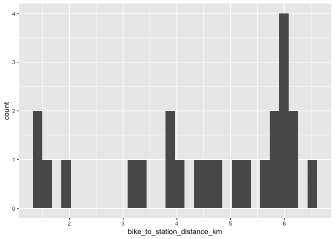
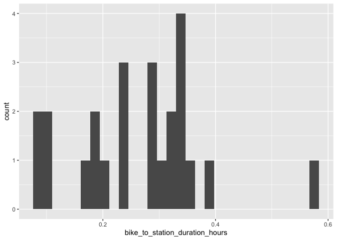

# Ottawa

## Blaire Station

### Draw buffer and select points


```r
destination <- "Wellington Building, Ottawa, Canada"        #### EDIT ME
```

### Set origin point


```r
origin <- "Blair Station, Ottawa, Canada"    #### EDIT ME
```

#### Setup departure location and arrival time

June 22, 2024


```r
arrival_time <- as.POSIXct("2024-06-11 08:30:00", tz = "America/Toronto")       #### EDIT ME
```


```r
stations <- geocode(location = origin, output = "more", source = "google")
```

```
## ℹ <https://maps.googleapis.com/maps/api/geocode/json?address=Blair+Station,+Ottawa,+Canada&key=xxx>
```

```r
stations_sf <- stations %>%
                st_as_sf(coords = c("lon", "lat"), crs = 4326)

stations_buffer = st_buffer(stations_sf, 5000)

stations_buffer <- as_sf(stations_buffer)
```

#### Interactive map view of buffers


```r
mapview(stations_buffer)
```

```{=html}
<div class="leaflet html-widget html-fill-item-overflow-hidden html-fill-item" id="htmlwidget-e4e6ef67722e62ac2574" style="width:672px;height:480px;"></div>
<script type="application/json" data-for="htmlwidget-e4e6ef67722e62ac2574">{"x":{"options":{"minZoom":1,"maxZoom":52,"crs":{"crsClass":"L.CRS.EPSG3857","code":null,"proj4def":null,"projectedBounds":null,"options":{}},"preferCanvas":false,"bounceAtZoomLimits":false,"maxBounds":[[[-90,-370]],[[90,370]]]},"calls":[{"method":"addProviderTiles","args":["CartoDB.Positron","CartoDB.Positron","CartoDB.Positron",{"errorTileUrl":"","noWrap":false,"detectRetina":false,"pane":"tilePane"}]},{"method":"addProviderTiles","args":["CartoDB.DarkMatter","CartoDB.DarkMatter","CartoDB.DarkMatter",{"errorTileUrl":"","noWrap":false,"detectRetina":false,"pane":"tilePane"}]},{"method":"addProviderTiles","args":["OpenStreetMap","OpenStreetMap","OpenStreetMap",{"errorTileUrl":"","noWrap":false,"detectRetina":false,"pane":"tilePane"}]},{"method":"addProviderTiles","args":["Esri.WorldImagery","Esri.WorldImagery","Esri.WorldImagery",{"errorTileUrl":"","noWrap":false,"detectRetina":false,"pane":"tilePane"}]},{"method":"addProviderTiles","args":["OpenTopoMap","OpenTopoMap","OpenTopoMap",{"errorTileUrl":"","noWrap":false,"detectRetina":false,"pane":"tilePane"}]},{"method":"createMapPane","args":["polygon",420]},{"method":"addPolygons","args":[[[[{"lng":[-75.65757735112159,-75.65786561496238,-75.6586206511335,-75.65919712372781,-75.65948534636817,-75.66024033721445,-75.66052853686605,-75.66081672741439,-75.66110490885985,-75.66185985438337,-75.66243616220005,-75.66294040167575,-75.66312912446756,-75.6632011555355,-75.66376731993137,-75.66405542810352,-75.66434352717589,-75.66463161714883,-75.66491969802276,-75.66520776979804,-75.66596258303773,-75.66625063183398,-75.66682670213441,-75.667402736048,-75.66797873357788,-75.66855469472718,-75.66913061949901,-75.66970650789649,-75.67028235992275,-75.6708581755809,-75.67114606977292,-75.67048582696313,-75.67052181461543,-75.67042749420119,-75.67067940530752,-75.67096729519213,-75.6712551759863,-75.67154304769042,-75.67183091030489,-75.67211876383007,-75.67136427995473,-75.671652138263,-75.67222782761343,-75.67251565865634,-75.6717612265918,-75.67204906241741,-75.67233688915539,-75.6726247068061,-75.67224751020076,-75.67239141908584,-75.67201422502912,-75.6724459484559,-75.67273375271563,-75.67216798591174,-75.67223993815723,-75.67205134963002,-75.67226720555938,-75.67255500551495,-75.67284279638488,-75.67208847811489,-75.67266406033248,-75.67209834001821,-75.67217028784012,-75.67198171480932,-75.67219755746802,-75.67248533973043,-75.67210820511227,-75.67225209630308,-75.67187496423256,-75.67230663457713,-75.67192951198652,-75.67207340102539,-75.67169628098222,-75.6718401712161,-75.67212794487092,-75.67175083430708,-75.67189472119398,-75.6715176131774,-75.67194927061021,-75.67124221009819,-75.6712601961933,-75.67121305876516,-75.6714828467462,-75.67177061179336,-75.67101643784942,-75.67130420767545,-75.67092712625652,-75.67107101122879,-75.67069393235674,-75.67083781852358,-75.6711255840453,-75.67037144433708,-75.67065921463676,-75.67028215033515,-75.6704260355441,-75.67004897378912,-75.6701928601924,-75.67048062618731,-75.66972652071154,-75.67001429148351,-75.66944872036031,-75.66952066423273,-75.66933214093204,-75.66954797174201,-75.66983573820879,-75.66908166696214,-75.66936943820507,-75.66861537714317,-75.66890315316179,-75.66819623057184,-75.66821421708339,-75.6681670888501,-75.66843688307824,-75.66805986319072,-75.66820375364617,-75.66782673630463,-75.66797062795375,-75.6675936131582,-75.66773750600092,-75.66736049375133,-75.66750438778759,-75.66779216904921,-75.66703816257906,-75.66732594861453,-75.66657195232746,-75.66685974313631,-75.66610575703208,-75.66639355261388,-75.66563957669223,-75.66592737704649,-75.66517341130719,-75.66546121643346,-75.66470726087628,-75.66499507077407,-75.66424112539877,-75.66452894006764,-75.66377500487397,-75.66339803590095,-75.66354195021863,-75.66316498379102,-75.66330889930119,-75.66293193541898,-75.66307585212158,-75.66269889078471,-75.66284280867971,-75.66227737014842,-75.66234933084151,-75.66216085173808,-75.66237673300881,-75.66162282468966,-75.66191067228783,-75.6611567741496,-75.66144462651604,-75.66069073855853,-75.6603137932042,-75.66045772636862,-75.66008078355948,-75.6602247179157,-75.65965930717584,-75.65973127609912,-75.65954280625958,-75.65975871222039,-75.65900484095597,-75.65929272147197,-75.65853886038778,-75.65816192847056,-75.65830587570845,-75.65792894633628,-75.6580728947655,-75.65731904019461,-75.65760694408841,-75.65647617612733,-75.65662013505316,-75.65624321402794,-75.65638717414475,-75.65563333626787,-75.65592126353552,-75.65516743583842,-75.65460206266032,-75.65467404911534,-75.6544855917965,-75.65470155035159,-75.65394772916916,-75.65357081720371,-75.65371479711881,-75.65333788769834,-75.65348186880381,-75.65272805413667,-75.65301602337946,-75.65226221889191,-75.65150841074073,-75.65179639858717,-75.65028879898102,-75.65057680542957,-75.64982301397463,-75.64906921885732,-75.64935724390635,-75.64784967036934,-75.64813771401728,-75.64738393559756,-75.64663015351678,-75.64606481455384,-75.64613683356193,-75.6459483876484,-75.64616444386094,-75.64541066829941,-75.64465688907782,-75.64494498375859,-75.64419121471694,-75.64343744201588,-75.64268366565581,-75.6429717927691,-75.64071048325476,-75.6409986427976,-75.64024487948184,-75.63949111250874,-75.63873734187865,-75.6390255338481,-75.63751800929312,-75.63601047011439,-75.63629870834401,-75.63554494710813,-75.63479118221734,-75.63403741367202,-75.63328364147256,-75.63271830992517,-75.63279038449278,-75.63260194105169,-75.63281816394012,-75.63206439826894,-75.62904929905697,-75.62829551512411,-75.62858388736385,-75.62783011361404,-75.62707633621329,-75.62632255516202,-75.62556877046057,-75.62481498210937,-75.62406119010876,-75.62330739445919,-75.62255359516098,-75.62179979221455,-75.62104598562027,-75.62029217537857,-75.61953836148977,-75.61878454395429,-75.61803072277253,-75.61727689794485,-75.61652306947165,-75.61576923735332,-75.61501540159024,-75.61426156218279,-75.61350771913136,-75.61275387243636,-75.61200002209813,-75.61124616811709,-75.61049231049363,-75.6102036062685,-75.60794197005457,-75.6064341943742,-75.60568030107386,-75.60539150476211,-75.60463759399153,-75.6038836795819,-75.60312976153358,-75.60237583984694,-75.60208697910942,-75.60133303995443,-75.59982515073263,-75.59960846808579,-75.599419978317,-75.59934774876541,-75.59878227550219,-75.59802830796966,-75.59727433680141,-75.59705761620631,-75.59686912025302,-75.59679687805185,-75.59472339806366,-75.59443438553262,-75.5936803721651,-75.59292635516402,-75.59270956904221,-75.59252106163105,-75.59244879758731,-75.59112923330106,-75.59098469140365,-75.59060766753531,-75.59046311990252,-75.59008609166857,-75.5893320324769,-75.58918747219329,-75.58881043777806,-75.58866587175876,-75.58753475269374,-75.58728173852529,-75.58718747672174,-75.58715133105487,-75.58649149532906,-75.58573739395369,-75.5854481975592,-75.58469407872357,-75.58454947019291,-75.58417240595647,-75.58402779168928,-75.58365072308789,-75.58289658316379,-75.58260732704599,-75.58185316966271,-75.58170853126956,-75.58133144775974,-75.58118680362951,-75.58080971575502,-75.58005553728584,-75.57976622144007,-75.57901202551281,-75.57872268671713,-75.57796847333212,-75.57775145287714,-75.57756289637091,-75.5774905542148,-75.57692488074306,-75.57678018953388,-75.57640306929521,-75.57625837234792,-75.575881247745,-75.5757365450595,-75.57535941609237,-75.57521470766852,-75.57408330495666,-75.57379386051907,-75.57303957368244,-75.57275010628986,-75.57199580199747,-75.57156156305328,-75.57118439917383,-75.57103964483886,-75.56990813739253,-75.56936524941311,-75.56927095351585,-75.56923475962705,-75.5685746852489,-75.56828511690063,-75.56753072895425,-75.56724113764535,-75.56648673224448,-75.56619711797399,-75.56597990128098,-75.56579129331254,-75.5657188857425,-75.56515305788585,-75.56486341152419,-75.56410895738027,-75.5638192880543,-75.56354771476957,-75.56350055959004,-75.56348245436503,-75.56277512416534,-75.56248542274363,-75.5623405686087,-75.56196331415839,-75.56181845428165,-75.56144119546789,-75.56115146194755,-75.56100659176288,-75.56062932166746,-75.56048444574053,-75.56010717128169,-75.55981740565984,-75.55967251942398,-75.5592952336832,-75.55915034170467,-75.55877305160047,-75.55848325387426,-75.55826589958522,-75.55807724814015,-75.55800479470378,-75.55743883641802,-75.55714900658458,-75.5568591676157,-75.55610452572807,-75.55581466378457,-75.55552479270445,-75.55523491248734,-75.55448022546797,-75.55390040994141,-75.55332055786077,-75.55256581186694,-75.55227585827684,-75.55198589554668,-75.55169592367608,-75.55140594266462,-75.55111595251195,-75.55036113369707,-75.55007112056009,-75.54949106685865,-75.5483308497348,-75.54717048629546,-75.54600997651558,-75.54484932037012,-75.54455913346119,-75.54531422919794,-75.54502404698907,-75.54473385563037,-75.54444365512144,-75.54415344546186,-75.54386322665131,-75.54442959802518,-75.54435704448981,-75.54454583536234,-75.54403795066017,-75.54345747668104,-75.54402388690528,-75.54395132768126,-75.54414013150404,-75.54392245299731,-75.54363220697974,-75.54334195180914,-75.54371957782705,-75.54357445027284,-75.54395207885214,-75.54322642407358,-75.54360406906949,-75.54345893471222,-75.54383658226983,-75.54369144908797,-75.54340117585846,-75.54311089347431,-75.54386622052361,-75.54357594284139,-75.54328565600407,-75.54385216970853,-75.543779599167,-75.54396843748346,-75.54375072502393,-75.54346043373347,-75.54383812181557,-75.54369297620154,-75.54407066684601,-75.54392552240772,-75.54363522666414,-75.54401292680056,-75.54386777896003,-75.54424548165903,-75.54410033499433,-75.5438100347976,-75.54418774698921,-75.54404259692217,-75.54442031167649,-75.54427516278538,-75.54398485813554,-75.54469309035944,-75.54467494682696,-75.5447221622499,-75.54445000578248,-75.54415969667953,-75.54491516838569,-75.54462486398724,-75.54500260541776,-75.54485745325009,-75.54523519724377,-75.54509004625235,-75.54479973740125,-75.5455552434756,-75.5452649393299,-75.54564269794506,-75.5454975459039,-75.54587530708248,-75.54573015621783,-75.5454398476199,-75.54619538806575,-75.54590508417412,-75.54647174753781,-75.54639917273362,-75.54658806093674,-75.54637033568953,-75.5467481166183,-75.54660296705788,-75.54698075055038,-75.54683560216677,-75.54654529853053,-75.54730088360658,-75.54701058467802,-75.54776322847243,-75.54776209452824,-75.54776504606569,-75.54747588578925,-75.54804259031845,-75.54797001793241,-75.54815891985741,-75.5479412018649,-75.54831901023817,-75.54817386551463,-75.54855167645196,-75.54840653290572,-75.54878434640716,-75.54863920403827,-75.54901702010386,-75.54887187891237,-75.54858158965997,-75.54933723988559,-75.54904695534313,-75.54980261582605,-75.54951233599404,-75.5502680067345,-75.54997773161335,-75.55073341261162,-75.55044314220183,-75.55119883345812,-75.55090856776015,-75.55204211867689,-75.55189699279698,-75.55227484476376,-75.55212972006207,-75.55250757459343,-75.55236245107002,-75.55274030816602,-75.55259518582095,-75.55316197497308,-75.55308941554303,-75.55327834567568,-75.55306066655201,-75.55372192934161,-75.55368565050416,-75.55378011660783,-75.55352616225602,-75.55428190119147,-75.55399167293362,-75.55474742212832,-75.55445719858555,-75.55521295803972,-75.555590836411,-75.5554457316111,-75.55582361254726,-75.55567850892639,-75.5564342750245,-75.55614407478906,-75.55689985114687,-75.55660965562838,-75.55736544224615,-75.55707525144511,-75.5585868415841,-75.55829666937834,-75.55905247289954,-75.55961932316643,-75.55954678475544,-75.55973573525955,-75.55951811919428,-75.56027392935808,-75.559983780469,-75.56073960089321,-75.56149541769895,-75.56120528740931,-75.56196111447545,-75.56252798240004,-75.56245545446895,-75.56264441085887,-75.56242682623383,-75.56318265994125,-75.56356057543758,-75.56341552656916,-75.56379344463058,-75.56364839694287,-75.56440423729092,-75.56411414892804,-75.56486999953671,-75.56562584652471,-75.565335776767,-75.56684748764295,-75.5672254130985,-75.56708039213815,-75.56745832015881,-75.56731330037989,-75.56806916064588,-75.56863605346824,-75.568563548794,-75.56875251348299,-75.5685349986298,-75.5692908655338,-75.57004672881482,-75.56975672876565,-75.57051260230701,-75.57126847222472,-75.57164640582462,-75.5715014197216,-75.57187935588651,-75.57173437096576,-75.57324612044867,-75.57295617151036,-75.57371205469954,-75.57446793426344,-75.57522381020165,-75.575601746811,-75.57545679320839,-75.57583473238262,-75.575689779963,-75.57720154147964,-75.5779101746964,-75.57789205803248,-75.57793930018781,-75.57766754675215,-75.57842343232926,-75.57917931427863,-75.57993519259988,-75.58059658315446,-75.58056035548179,-75.58065483983692,-75.58040124364321,-75.58115712859467,-75.5826688876097,-75.58380269734256,-75.58365781333416,-75.58403575156869,-75.58389086874475,-75.58464674943518,-75.58540262649464,-75.58615849992272,-75.58691436971905,-75.58767023588325,-75.5884260984149,-75.58880402831841,-75.58865918834709,-75.58903712081475,-75.58889228202875,-75.58964815118418,-75.59115987859394,-75.60325317426509,-75.60400897431623,-75.6042983717756,-75.60505415429311,-75.60580993316913,-75.60656570840328,-75.60732147999519,-75.60807724794444,-75.60883301225064,-75.60897766587414,-75.60935554318769,-75.60950019105324,-75.60987806398261,-75.61138954658968,-75.61290101461785,-75.61319024097641,-75.61394595562899,-75.61470166663555,-75.61545737399568,-75.61560196290885,-75.61597981174802,-75.61612439490411,-75.61650223935814,-75.61801360805546,-75.61815817156115,-75.61853600798214,-75.61868056573108,-75.61905839776662,-75.61981405910116,-75.62056971678669,-75.62082265696149,-75.620917112396,-75.62095324591884,-75.62161443084399,-75.62237006733662,-75.62251458697615,-75.62289240038024,-75.62303691426368,-75.62341472328177,-75.62417033857977,-75.62492595022654,-75.62521493641235,-75.62672612096348,-75.62701507023357,-75.62777064313713,-75.62852621238764,-75.6288151247433,-75.62957067644705,-75.62971512225569,-75.63009289326406,-75.63023733331782,-75.63061509993938,-75.63137063044158,-75.63165948286532,-75.63241499581966,-75.63255941166318,-75.63293716329639,-75.63308157338561,-75.63345932063172,-75.63421481238198,-75.6345036048785,-75.63525907907977,-75.63547565704567,-75.6356645224198,-75.63573671306649,-75.63630330521264,-75.63705875820727,-75.63734749078128,-75.63810292622583,-75.63839163578639,-75.63914705368057,-75.63943574022866,-75.64019114057217,-75.64046176290491,-75.64050897449093,-75.64052701564053,-75.6412351869013,-75.64148774786034,-75.6415821689327,-75.64161824828275,-75.64227919266868,-75.64253173349435,-75.6426261523728,-75.64266222884669,-75.643323157875,-75.64357567856815,-75.64367009525265,-75.64370616885051,-75.64436708252093,-75.64464663630005,-75.64467023988735,-75.64467925759517,-75.64541096660717,-75.64569951510113,-75.64645481013441,-75.64674333562277,-75.64749861310334,-75.64778711558709,-75.64854237551464,-75.64908326706426,-75.64917767104224,-75.64921372912272,-75.64987455384652,-75.65016300121161,-75.65091821214298,-75.65120663650718,-75.65142294880103,-75.65161174488493,-75.65168384697597,-75.65225023124917,-75.65253862350292,-75.65329378543827,-75.65387051484002,-75.65462564533351,-75.65491398248325,-75.65520231052477,-75.65595740957694,-75.65653401056346,-75.65728907817484,-75.65757735112159],"lat":[45.46127621111827,45.46071257029823,45.46080907903151,45.45968180728687,45.45911818013008,45.45921467178862,45.45865104667553,45.45808742737323,45.45752381388179,45.45762028846824,45.45649307138637,45.45550677550827,45.45553088972255,45.45538999152893,45.45546233130153,45.45489873933536,45.45433515318106,45.45377157283873,45.45320799830849,45.45264442959048,45.4527408587467,45.45217729207664,45.45105017617438,45.44992308352338,45.44879601412456,45.44766896797883,45.4465419450871,45.44541494545029,45.44428796906931,45.44316101594507,45.44259754810451,45.44251323217701,45.4424427995172,45.44243075408308,45.44193772841975,45.4413742759699,45.44081082933464,45.44024738851412,45.43968395350841,45.43912052431767,45.43902417969985,45.43846076008516,45.43733393830095,45.43677053613167,45.43667420079244,45.43611080819912,45.43554742142115,45.43498404045861,45.4349358762682,45.43465418890784,45.43460602421656,45.43376097367908,45.43319761392362,45.43312537123552,45.4329845329104,45.43296045152894,45.43253793943948,45.43197459507559,45.43141125652755,45.43131493774006,45.43018828561151,45.43011604837897,45.4299752192036,45.42995113964077,45.42952865500063,45.42896534723609,45.42891719031982,45.4286355395585,45.42858738214164,45.42774244140158,45.42769428536398,45.42741264229861,45.42736448576049,45.42708284508904,45.42651956810827,45.42647141294945,45.42618977758002,45.42614162192073,45.42529672735645,45.42520643690002,45.42517123346412,45.42516521393501,45.42463716534316,45.4240739191464,45.42397761090412,45.42341437428308,45.42336621988139,45.42308460469184,45.42303644978986,45.42275483699425,45.4221916157653,45.42209530728012,45.42153209562691,45.42148394110392,45.42120233839829,45.42115418337514,45.42087258306344,45.42030938680236,45.42021307807514,45.41964989138978,45.41957765888407,45.41943686382644,45.41941278583955,45.41899040355263,45.41842723225947,45.41833092329109,45.41776776157367,45.4176714506054,45.41710829846375,45.41701800522498,45.41698280862953,45.416976788915,45.41644884292989,45.41640068616601,45.41611911800406,45.41607096074033,45.41578939497234,45.41574123720879,45.41545967383475,45.41541151557139,45.41512995459131,45.41456683699342,45.41447052178702,45.41390741376495,45.41381109655971,45.41324799811346,45.41315167890956,45.41258859003916,45.41249226883682,45.41192918954229,45.4118328663417,45.41126979662307,45.41117347142443,45.4106104112817,45.4105140840852,45.4099510335184,45.40985470432425,45.40980653756817,45.40952501728572,45.40947685003027,45.40919533214182,45.40914716438705,45.4088656488926,45.40881748063854,45.40853596753809,45.40846371386835,45.40832295856839,45.40829887352718,45.40787661051331,45.40778026957043,45.40721726106768,45.40712091812809,45.40655791920142,45.40646157426532,45.40641339963849,45.40613190517634,45.40608373005045,45.40580223798234,45.40572997400526,45.40558922922153,45.40556514074463,45.40514290927938,45.40504655459439,45.40448358815666,45.40438723147589,45.40433905097687,45.40405757275937,45.40400939176147,45.40372791593804,45.40363155150546,45.40306860798106,45.4029240561808,45.40264258942012,45.40259440354892,45.40231293918233,45.40221656500348,45.40165364439292,45.40155726821937,45.40148498231187,45.40134425471346,45.40132015892657,45.40089797901718,45.40080159509336,45.400753400973,45.40047195233845,45.40042375771957,45.40014231147916,45.40004591980547,45.39948303544753,45.39938664178003,45.3992902423569,45.39872737133758,45.39853456274884,45.39797170506845,45.39787529590318,45.39777888098243,45.39721603664134,45.39702319705889,45.39646036605742,45.39636394139606,45.39626751097938,45.39619518438993,45.39605448013513,45.39603037078776,45.39560826090911,45.39551182274511,45.39541537882581,45.39485257826814,45.39475613235722,45.3946596806911,45.39456322326971,45.39400043981692,45.39371104431368,45.39314827796687,45.39305180505323,45.39295532638442,45.39285884196038,45.39229609272058,45.39210311413702,45.39191011253255,45.39134738416645,45.39125087849704,45.39115436707242,45.39105784989254,45.39096132695732,45.39088893097894,45.39074825426778,45.39072412179098,45.39030209454301,45.39020556386364,45.38981938359239,45.38972282413583,45.38916014882584,45.38906358738142,45.38896702018152,45.38887044722608,45.38877386851503,45.38867728404831,45.38858069382586,45.38848409784761,45.3883874961135,45.38829088862347,45.38819427537746,45.3880976563754,45.38800103161724,45.38790440110291,45.38780776483234,45.38771112280548,45.38761447502225,45.38751782148261,45.38742116218648,45.38732449713381,45.38722782632453,45.38713114975859,45.3870344674359,45.38693777935642,45.38684108552008,45.38740367034682,45.38711354297731,45.38692009594451,45.38682336379198,45.38738593178541,45.38728919010129,45.38719244265941,45.38709568945969,45.3869989305021,45.38756148920323,45.3874647207126,45.38727116645663,45.3876930807975,45.38766888418802,45.38780952279124,45.3877369300954,45.38764013479548,45.38754333373687,45.38796524393485,45.3879410420623,45.38808167928444,45.38781543233414,45.38837797446348,45.38828114281498,45.38818430540707,45.38860621014624,45.38858199918601,45.38872263458833,45.38855314613438,45.3888344147212,45.38878598526419,45.38906725435707,45.38901882251542,45.38892195451206,45.38920322222154,45.38915478511508,45.38943605333037,45.38929073053617,45.38978294844291,45.38977083721163,45.389841154359,45.38975637280638,45.38965947420269,45.39022200755798,45.39012509941335,45.39040636637639,45.39035790919858,45.3906391766668,45.39059071710354,45.39049379365601,45.39105632727201,45.39095939428203,45.39124066137471,45.39119219177377,45.39147345937123,45.39142498738446,45.39132803908947,45.39189057296207,45.39179361512311,45.39235615101362,45.39225918363005,45.39268108651719,45.39265684306167,45.39279747784591,45.39272474460905,45.39300601384638,45.3929575222752,45.39323879201659,45.3931902980589,45.39347156830427,45.39342307195998,45.39370434270928,45.39355884219388,45.39412138236606,45.39402437103426,45.3945869132209,45.39448989234112,45.3953337108161,45.39528519537623,45.39556647015404,45.39542091234926,45.39647569502932,45.39646356373962,45.39653388325048,45.3964489612863,45.39701151732182,45.39691445445795,45.39747701250456,45.39737994008922,45.39794250014631,45.39836442399315,45.39834015333182,45.398480795102,45.39840798024581,45.3989705481091,45.39887345280183,45.39943602267407,45.39996343719324,45.39995736808645,45.39999252922071,45.39990148969373,45.40046406737002,45.40074535838153,45.40069679905376,45.40097809056712,45.40092952885054,45.40149211432963,45.4017734092424,45.40172484324266,45.40200613865706,45.40195757026826,45.40252016354889,45.40280146236228,45.40275288968984,45.40303418900463,45.40298561394288,45.40354821502378,45.40397016963707,45.40394587990752,45.40408653193275,45.40401365987038,45.40457626875028,45.40513888342425,45.40504170804674,45.40560432472437,45.40616694719569,45.40672957546062,45.40663238294204,45.40775764927009,45.40888293877054,45.40878572531659,45.40934837496439,45.40991103040479,45.41047369163768,45.41103635866294,45.41159903148046,45.41150179329444,45.41206446811136,45.41318983512073,45.41544063863834,45.41769153481504,45.41994252364346,45.42219360511623,45.42275638995925,45.42285370402879,45.42341649845727,45.42397929867547,45.4245421046833,45.42510491648063,45.42566773406735,45.42574073006372,45.42588143607678,45.42590576759073,45.42689072147433,45.42801640476503,45.42808940781789,45.42823012056927,45.42825445443532,45.42867659557221,45.42923945548677,45.42980232119022,45.42985099305952,45.43013242903128,45.43018110040529,45.4315883067181,45.4316369813938,45.43191842794715,45.43196710212747,45.43224855107727,45.43281145331832,45.43337436134786,45.43347171486741,45.43403463248276,45.43459755588655,45.43467057292964,45.43481130539706,45.43483564392631,45.43525784421119,45.43582078298915,45.43586946228679,45.43615093479578,45.43619961359783,45.43648108850328,45.43704404265536,45.43709272286062,45.43737420305664,45.43742288276626,45.43770436535876,45.43826733488488,45.43831601599768,45.43859750388074,45.43864618449782,45.43892767477734,45.43949065967745,45.43958193727988,45.43961712425085,45.43962320925853,45.44015101675873,45.44071401703276,45.44081138144271,45.44137439130265,45.44142307323858,45.44170458128853,45.44175326272857,45.44203477317499,45.4425977984088,45.44269516264956,45.44325819746929,45.44330687932045,45.44358839985029,45.44363708120544,45.44391860413176,45.44448165432531,45.44457901839599,45.44514207817545,45.4452151002823,45.44535586684365,45.4453802070605,45.44580250962712,45.44585119040083,45.44613272820347,45.446181408481,45.4464629486801,45.44702603341925,45.44712339533417,45.4476864896592,45.44778346928814,45.44778566890147,45.44778604920251,45.4483469535,45.4484199725007,45.4485607500949,45.44858508927627,45.44900742494144,45.449056103644,45.44933766351232,45.4493863417185,45.44966790398328,45.44971658169305,45.44999814635429,45.45004682356763,45.45032839062531,45.45089152908164,45.45098888486731,45.45155203290947,45.45164938670906,45.45221254433702,45.45230989615035,45.45287306336407,45.45297041319093,45.45353358999041,45.45363093783062,45.45419412421584,45.45434014082662,45.45462173903795,45.45467040929863,45.45495200990636,45.45500067967024,45.45528228267438,45.45533095194143,45.45561255734199,45.45568555995494,45.45582636390987,45.45585069762842,45.45627311237583,45.45635828003543,45.45642868322521,45.45644084973149,45.45693367500765,45.4570310071264,45.45759424523725,45.45769157536798,45.45825482306439,45.45835215120691,45.45840081310867,45.45868244197531,45.45873110337996,45.45901273464296,45.4591100550116,45.45967332567593,45.45977064405582,45.46033392430559,45.46043124069651,45.46099453053169,45.46118915354938,45.46175245676648,45.4618497633929,45.46192273956569,45.46206356793537,45.46208789284032,45.46251038083204,45.46260767968267,45.46317100586657,45.46326830272717,45.4633655938016,45.46392893336665,45.4640262224507,45.46409918546652,45.46424002292299,45.4642643434422,45.46468685869435,45.46478414000143,45.4648327784851,45.46511445997572,45.46516309796162,45.4654447818485,45.46554205537817,45.46610543128948,45.46620270282789,45.46629996857973,45.46686335787109,45.46705787960492,45.46710650642176,45.46738820798219,45.46743683430101,45.46771853825764,45.46781578845255,45.46788872230125,45.46802957648245,45.46805388727917,45.46847645270561,45.46857369512142,45.46867093175051,45.46923436497406,45.46933159961035,45.46942882845982,45.46947744071452,45.46975916424006,45.46980777599646,45.47008950191814,45.47028393827016,45.4708474020436,45.47094461533256,45.47104182283461,45.47113902454981,45.47118762323736,45.47146936393349,45.4715179621225,45.47179970521469,45.4719940872961,45.47208519592856,45.47212041461314,45.47212648835595,45.47265477156186,45.47275195192757,45.47284912650638,45.47294629529837,45.47303131324439,45.47310175322644,45.47311389834488,45.47360698116817,45.473704142178,45.47389844683718,45.47404416014139,45.47432593227575,45.47437450143147,45.47465627596176,45.47475341182842,45.47485054190832,45.47494766620155,45.47504478470815,45.4751418974282,45.47523900436176,45.47528755565862,45.47556934395462,45.4756178947522,45.47589968544403,45.47599678459392,45.47619096553425,45.47774357985924,45.47784056907612,45.47727691339742,45.47737389304396,45.47747086690546,45.47756783498196,45.47766479727353,45.47776175378024,45.47785870450215,45.47757686748358,45.47762533972933,45.47734350321436,45.47739197306807,45.47758583802184,45.47777967983821,45.47721599413345,45.47731290258285,45.47740980524829,45.47750670212984,45.47722485577891,45.47727330110531,45.47699145525884,45.47703989819393,45.47723365547547,45.47695180635229,45.47700024111276,45.47671839249438,45.47676682486383,45.47686368526537,45.47696053988381,45.47646730002101,45.47647940602823,45.47640894349416,45.47649368260129,45.47659052187381,45.47630866910025,45.47635708562309,45.4760752333549,45.47612364748723,45.47622047141505,45.47631728956052,45.47575357992718,45.47594719131386,45.47538347992514,45.47548027316726,45.47557706062769,45.4750133474851,45.47511012538622,45.4748282691021,45.47487665494029,45.47459479916251,45.47464318261108,45.47473994517242,45.47417623230353,45.47427298530707,45.47399112916051,45.47403950255037,45.47375764691055,45.47380601791117,45.47390275557706,45.47333904298597,45.47343577109559,45.47301298762929,45.47303716804563,45.47289624071308,45.4729687790867,45.47306549186079,45.47250177955162,45.47259848277097,45.47203477249159,45.47213146615683,45.47156775790788,45.47166444201963,45.47113596727027,45.47114200961425,45.47110677813097,45.47119741036062,45.47070416888018,45.47071625238097,45.47064578961623,45.47073037118103,45.47023713147883,45.47024921378566,45.47017875127497,45.47026332448213,45.46977008655871,45.46978216767165,45.46971170541509,45.46979627026516,45.469250187655,45.46925320763219,45.46923559215116,45.46932920853136,45.46876551247801,45.46886213928197,45.4682984452634,45.46839506251826,45.46783137053508,45.46792797824146,45.46687106435445,45.46688313902774,45.46681267876895,45.46689719854228,45.46633351643949,45.46643010128032,45.46586642121504,45.46544366497765,45.4654678086359,45.4653268903805,45.46539931848248,45.46483564626374,45.46493220824308,45.46380487369238,45.46390142235798,45.46333776002693,45.46277410350501,45.46287063885835,45.46174333570562,45.46183985774819,45.46127621111827]}]]],null,"stations_buffer",{"crs":{"crsClass":"L.CRS.EPSG3857","code":null,"proj4def":null,"projectedBounds":null,"options":{}},"pane":"polygon","stroke":true,"color":"#333333","weight":0.5,"opacity":0.9,"fill":true,"fillColor":"#6666FF","fillOpacity":0.6,"smoothFactor":1,"noClip":false},"<div class='scrollableContainer'><table class=mapview-popup id='popup'><tr class='coord'><td><\/td><th><b>Feature ID&emsp;<\/b><\/th><td>1&emsp;<\/td><\/tr><tr><td>1<\/td><th>type&emsp;<\/th><td>establishment&emsp;<\/td><\/tr><tr><td>2<\/td><th>loctype&emsp;<\/th><td>geometric_center&emsp;<\/td><\/tr><tr><td>3<\/td><th>address&emsp;<\/th><td>blair, ottawa, on k1j 9l3, canada&emsp;<\/td><\/tr><tr><td>4<\/td><th>north&emsp;<\/th><td>45.43237&emsp;<\/td><\/tr><tr><td>5<\/td><th>south&emsp;<\/th><td>45.42956&emsp;<\/td><\/tr><tr><td>6<\/td><th>east&emsp;<\/th><td>-75.60674&emsp;<\/td><\/tr><tr><td>7<\/td><th>west&emsp;<\/th><td>-75.60944&emsp;<\/td><\/tr><tr><td>8<\/td><th>geometry&emsp;<\/th><td>sfc_POLYGON&emsp;<\/td><\/tr><\/table><\/div>",{"maxWidth":800,"minWidth":50,"autoPan":true,"keepInView":false,"closeButton":true,"closeOnClick":true,"className":""},"1",{"interactive":false,"permanent":false,"direction":"auto","opacity":1,"offset":[0,0],"textsize":"10px","textOnly":false,"className":"","sticky":true},{"stroke":true,"weight":1,"opacity":0.9,"fillOpacity":0.84,"bringToFront":false,"sendToBack":false}]},{"method":"addScaleBar","args":[{"maxWidth":100,"metric":true,"imperial":true,"updateWhenIdle":true,"position":"bottomleft"}]},{"method":"addHomeButton","args":[-75.67284279638488,45.38682336379198,-75.54311089347431,45.47785870450215,true,"stations_buffer","Zoom to stations_buffer","<strong> stations_buffer <\/strong>","bottomright"]},{"method":"addLayersControl","args":[["CartoDB.Positron","CartoDB.DarkMatter","OpenStreetMap","Esri.WorldImagery","OpenTopoMap"],"stations_buffer",{"collapsed":true,"autoZIndex":true,"position":"topleft"}]},{"method":"addLegend","args":[{"colors":["#6666FF"],"labels":["stations_buffer"],"na_color":null,"na_label":"NA","opacity":1,"position":"topright","type":"factor","title":"","extra":null,"layerId":null,"className":"info legend","group":"stations_buffer"}]}],"limits":{"lat":[45.38682336379198,45.47785870450215],"lng":[-75.67284279638488,-75.54311089347431]},"fitBounds":[45.38682336379198,-75.67284279638488,45.47785870450215,-75.54311089347431,[]]},"evals":[],"jsHooks":{"render":[{"code":"function(el, x, data) {\n  return (\n      function(el, x, data) {\n      // get the leaflet map\n      var map = this; //HTMLWidgets.find('#' + el.id);\n      // we need a new div element because we have to handle\n      // the mouseover output separately\n      // debugger;\n      function addElement () {\n      // generate new div Element\n      var newDiv = $(document.createElement('div'));\n      // append at end of leaflet htmlwidget container\n      $(el).append(newDiv);\n      //provide ID and style\n      newDiv.addClass('lnlt');\n      newDiv.css({\n      'position': 'relative',\n      'bottomleft':  '0px',\n      'background-color': 'rgba(255, 255, 255, 0.7)',\n      'box-shadow': '0 0 2px #bbb',\n      'background-clip': 'padding-box',\n      'margin': '0',\n      'padding-left': '5px',\n      'color': '#333',\n      'font': '9px/1.5 \"Helvetica Neue\", Arial, Helvetica, sans-serif',\n      'z-index': '700',\n      });\n      return newDiv;\n      }\n\n\n      // check for already existing lnlt class to not duplicate\n      var lnlt = $(el).find('.lnlt');\n\n      if(!lnlt.length) {\n      lnlt = addElement();\n\n      // grab the special div we generated in the beginning\n      // and put the mousmove output there\n\n      map.on('mousemove', function (e) {\n      if (e.originalEvent.ctrlKey) {\n      if (document.querySelector('.lnlt') === null) lnlt = addElement();\n      lnlt.text(\n                           ' lon: ' + (e.latlng.lng).toFixed(5) +\n                           ' | lat: ' + (e.latlng.lat).toFixed(5) +\n                           ' | zoom: ' + map.getZoom() +\n                           ' | x: ' + L.CRS.EPSG3857.project(e.latlng).x.toFixed(0) +\n                           ' | y: ' + L.CRS.EPSG3857.project(e.latlng).y.toFixed(0) +\n                           ' | epsg: 3857 ' +\n                           ' | proj4: +proj=merc +a=6378137 +b=6378137 +lat_ts=0.0 +lon_0=0.0 +x_0=0.0 +y_0=0 +k=1.0 +units=m +nadgrids=@null +no_defs ');\n      } else {\n      if (document.querySelector('.lnlt') === null) lnlt = addElement();\n      lnlt.text(\n                      ' lon: ' + (e.latlng.lng).toFixed(5) +\n                      ' | lat: ' + (e.latlng.lat).toFixed(5) +\n                      ' | zoom: ' + map.getZoom() + ' ');\n      }\n      });\n\n      // remove the lnlt div when mouse leaves map\n      map.on('mouseout', function (e) {\n      var strip = document.querySelector('.lnlt');\n      if( strip !==null) strip.remove();\n      });\n\n      };\n\n      //$(el).keypress(67, function(e) {\n      map.on('preclick', function(e) {\n      if (e.originalEvent.ctrlKey) {\n      if (document.querySelector('.lnlt') === null) lnlt = addElement();\n      lnlt.text(\n                      ' lon: ' + (e.latlng.lng).toFixed(5) +\n                      ' | lat: ' + (e.latlng.lat).toFixed(5) +\n                      ' | zoom: ' + map.getZoom() + ' ');\n      var txt = document.querySelector('.lnlt').textContent;\n      console.log(txt);\n      //txt.innerText.focus();\n      //txt.select();\n      setClipboardText('\"' + txt + '\"');\n      }\n      });\n\n      }\n      ).call(this.getMap(), el, x, data);\n}","data":null},{"code":"function(el, x, data) {\n  return (function(el,x,data){\n           var map = this;\n\n           map.on('keypress', function(e) {\n               console.log(e.originalEvent.code);\n               var key = e.originalEvent.code;\n               if (key === 'KeyE') {\n                   var bb = this.getBounds();\n                   var txt = JSON.stringify(bb);\n                   console.log(txt);\n\n                   setClipboardText('\\'' + txt + '\\'');\n               }\n           })\n        }).call(this.getMap(), el, x, data);\n}","data":null}]}}</script>
```

#### Generate points within buffer


```r
set.seed(100)
points_sample_sf <- st_sample(stations_buffer, size = c(25,25), type = "random")
points_sample_sf <- st_as_sf(points_sample_sf)
points_sample <- sf_to_df(points_sample_sf)
```

#### Check to see if they worked


```r
ottawa_check_buffer <- stations_buffer %>% slice(1:2)

plot(st_geometry(ottawa_check_buffer))
plot(points_sample_sf, pch = 20, add= TRUE)
```

<!-- -->


```r
points_sample$destination <- destination
points_sample$origin <- origin
points_sample$lat_lon <- paste(points_sample$lat, points_sample$lon)
```

#### Checking points and general mapping


```r
lst_directions <- apply(points_sample, 1, function(x){
  res <- google_directions(
    origin = x[['lat_lon']], 
    destination = x[['destination']]    
  )
df_result <- data.frame(
    origin = x[['lat_lon']], 
    destination = x[['destination']], 
    route = res$routes$overview_polyline$points 
)
return(df_result)
})

df_directions <- do.call(rbind, lst_directions)

google_map() %>%
  add_polylines(data = df_directions, polyline = "route") 
```

```{=html}
<div class="google_map html-widget html-fill-item-overflow-hidden html-fill-item" id="htmlwidget-da6e554289072a63930b" style="width:672px;height:480px;"></div>
<script type="application/json" data-for="htmlwidget-da6e554289072a63930b">{"x":{"lat":0,"lng":0,"zoom":1,"min_zoom":null,"max_zoom":null,"mapBounds":{"west":-180,"south":-90,"east":180,"north":90},"styles":null,"search_box":false,"update_map_view":true,"zoomControl":true,"mapType":"roadmap","mapTypeControl":true,"scaleControl":false,"streetViewControl":true,"rotateControl":true,"fullscreenControl":true,"event_return_type":"list","split_view":null,"split_view_options":{"heading":34,"pitch":10},"geolocation":false,"calls":[{"functions":"add_polylines","args":[[{"id":1,"geodesic":true,"stroke_colour":"#0000FF","stroke_weight":2,"stroke_opacity":0.6,"z_index":3,"polyline":["yxetGj`slMKo@tAq@fA`GwBz@yD~AcD|Ae@@m@Pq@N_@?YGW[Oi@?e@Fk@R_@NKNE^@RJPVNb@Hf@RtCDf@PRj@nTTtInAbc@`@xM`@tLJxBRtBZvB`@rBzApFlAvE^rB^|CNlBJvB~@xU\\nIHlCD|CC`BG`Ba@xFMfBMpBGvAAr@Oh@@lG@`FCzBAx@EbGKxAYbBcArEu@hDKn@gA|EsA`G_@vAm@nBi@vAcB`EuEfKsCnG}BtF_@z@Yh@kAtAlBjGhArDdAxDrAlEdDjKdArDRp@Xz@uAjAiCpBcAx@sBfBkBzAoAbAaAt@\\`Ad@tAzE`O"]},{"id":2,"geodesic":true,"stroke_colour":"#0000FF","stroke_weight":2,"stroke_opacity":0.6,"z_index":3,"polyline":["o}ktGx|llMfAe@FBX`Br@IImC@u@Fs@No@Rg@V_@lAoA\\k@Pe@Lw@Bi@CoA_@}KIoCQcBB]xBaAzB{@eAaDWm@iAqDm@cBkAoDyCaJuAmE{@sDCk@G}@D_AHg@L_@@AZi@VWRI\\Ij@@p@Hn@TrFnCvE~Bf@VZ@lF~CrFxCbDhBpDvBlFvD|DzDjBzBbBtBdD|EvBrDv@zAtAvChBjEvFpMbCxF~CvHtFvM`Tng@tRzd@|DhJFTTt@PR`A|BtAdDfArC`ApCnBdG`AfDRJtA|Fx@bEn@zDr@pFRjBXnD\\nFHrBb@nNl@vUt@tWdBtl@^|JPvBXtB\\nBf@nB|ArFd@lB`@pB`@pCPtBZvG|@tU\\lIBdA?nDGxBKxAa@pFW|DCzAOh@AdBDhKCxCEvFGfBWdB_AbE_AjEC\\kAdFoApFYjAu@jCi@vAq@bBeDrH{FnMkDhI}@jA[\\L\\Rr@hAtDf@`BlAbExAjFfC|Hx@jCz@xCp@vBkFhEuB`BsCbCy@p@_At@e@\\DJ\\bAN`@t@vBtDnL"]},{"id":3,"geodesic":true,"stroke_colour":"#0000FF","stroke_weight":2,"stroke_opacity":0.6,"z_index":3,"polyline":["ixbtGjaolMeDbBgFdC`CnL@ZEVOXOJ{^`R]PWNWUc@a@g@aBKWwAyEwAwEq@}BkByFcB}FkCsIsBqGi@yBUaAAq@Ky@QuBAc@D}@Rm@RUXI^?RFNLRZHb@Bb@Ad@UjB_@`BK^?^eApCw@xAo@hAcAvA}A`BgA~@oBnAuAl@eBh@g@JqARcE`@{@HqATm@NcA\\o@X{Az@gA|@w@x@q@|@_A|Au@`Bq@hB_@|Ak@xC]lDKvC?pBF~BF|@ZxCZnBhA|EtC`Lv@rD~@lFx@bGl@hG`@lGHfBp@zTp@tW^|MdAt]b@bO\\fKPxBTtBZdBf@|B|ApFf@lB`@nB`@nCTvBXnF`A|V\\tIDrA?zCExBI|Aa@jFUjDGvAAr@Oh@@lG@`FCzBAx@?pAEpDEz@QnAgCnLKn@s@`Dw@lDs@|C_AdDc@nAg@fAaDrHuFbMqBtEiApCYh@e@j@e@h@Vx@`AbDv@fCp@xB`B|FlCvIbCzHXfAXz@uAjAiCpBcAx@sBfBqCzBkBxAzAnEbEhM"]},{"id":4,"geodesic":true,"stroke_colour":"#0000FF","stroke_weight":2,"stroke_opacity":0.6,"z_index":3,"polyline":["uvjtGhrnlMIxC?HHl@~Aq@n@YRGDAL??H?XHj@jAhHLt@NIjEkBnB}@~G{CtB_AdNcG~@c@JATGvBy@tAg@l@[xAiAb@a@jByB`AsAp@s@f@Wr@Ud@AVDf@RNJf@p@bBnCt@lApBnDVNbAbCpHjQnFjM~GjPhCjGTt@PR`A|B|CxHbCfHvAxEV|@RJtA|Fx@bEhAnHl@hFh@jHRfDZvJfAva@`An\\n@dUj@rQHvBLvBTzB\\rB`@pBf@fB|AtFb@nB`@`CXfCNrBr@`Qb@jLXnHB`DErBWpEe@lGKdBCzAOh@AdBDhKEvECxDElAMlA[bBoB|IC\\s@vCc@lBoAvFm@zBg@~AeBfEqDfIoFxLqB|E]v@e@n@WZ[\\L\\Rr@Vx@dAjDb@vAX~@nAlEnAdE~C~JnAhE\\fAeDnC{DzCmDxC_BpAe@\\DJ\\bAf@zA|AxEtBrG"]},{"id":5,"geodesic":true,"stroke_colour":"#0000FF","stroke_weight":2,"stroke_opacity":0.6,"z_index":3,"polyline":["o|atGtnqlMiAh@}ALBj@mCT{BNC?OCA[AIK_Ai@sB]u@KWOPURs@l@[XWNwCvA}@\\eChAWH}@b@wEpCsCtA}BdA}HrDeP|HcEnBqAl@gKxEmFfCgH`DoChAwBz@yD~AcD|Ae@@m@Pq@N_@?YGW[Oi@?e@Fk@R_@NKNE^@RJPVNb@Hf@RtCDf@PRj@nTTtIf@rPr@vVj@lQJxCJxBRtBZvB`@rBd@hB|ArFd@jB^rB^|CNlBf@jLp@~PXbID|CC`BG`BMpBa@nFMpBGvAAr@Oh@@lG@`FCzBAx@EbGKxAYbBcArEu@hDKn@gA|EsA`G_@vAm@nB}AxDoDhIiFlL}BtF_@z@Yh@kAtAl@nBlBjG`B|FrAlEdDjKdArDRp@Xz@uAjAiCpBcAx@sBfBkBzAoAbAaAt@\\`Ad@tA|@jC|CtJ"]},{"id":6,"geodesic":true,"stroke_colour":"#0000FF","stroke_weight":2,"stroke_opacity":0.6,"z_index":3,"polyline":["enetGt~llMp@nBb@fAxA|Dh@bBfAlEh@pCT|A?b@HdAT~BPvCD~B?tAE~AIhAQlA_@dAQ`@_ArA}@`AcCnBKVk@VcBn@sAZqARwBTgCT_Cd@cA\\o@X{Az@c@\\c@^w@x@oAfBu@vAa@|@q@hB_@|AYnAc@bDSlDEpB@|@F~BT|Cb@pCVrA~BfJlAzEv@rD~@lFTzA|@pHf@pGPfDl@pRjAjc@nAbc@bAn[JxBRtBZvB`@rBzApFlAvE^rB^|CNlBJvB~@xU\\nIHlCD|CC`BG`Ba@xFMfBMpBGvAAr@Oh@@lG@`FCzBAx@EbGKxAYbBcArEu@hDKn@gA|EsA`G_@vAm@nBi@vAcB`EuEfKsCnG}BtF_@z@Yh@kAtAlBjGhArDdAxDrAlEdDjKdArDRp@Xz@uAjAiCpBcAx@sBfBkBzAoAbAaAt@\\`Ad@tAzE`O"]},{"id":7,"geodesic":true,"stroke_colour":"#0000FF","stroke_weight":2,"stroke_opacity":0.6,"z_index":3,"polyline":["ijntGtlulMe@_EYyCG}@]}A@G?IGO]w@O}@YgICkB@mEDaGB_BHq@Ni@Ta@\\[b@M|BK`EG~GOhACb@GBPb@pCbA|Db@rAj@pA|DbIlBrDl@pAp@pBd@tBRpAPdBFzA@dBEdCUtCYjB[pAe@vAi@pAe@z@eA|A}ClEuBzCgAlBiAnC_@lAq@vC_@jCUzCIvCDrDf@tIhA`SPfCVvBZrBf@bC^bBx@nEXbCRhCRfE^jEh@jDhAzE`@vAN`AVzBJxB?pCCzEFpCNdE\\fJD|BAzACxAS|AMf@_@~@e@jAWhAEl@@`@FhBA~AFl@d@jBh@~AFVh@jC`@|A`@|@\\j@nAzAt@nAP\\lA`Bh@p@z@|@Zf@Rj@Nv@Jf@JZV^VT^J^?RCh@Up@c@h@g@n@o@d@o@f@i@d@c@n@e@x@_@p@Wd@YdAeAXY`Ac@^I\\E^FLD\\ZR^Lj@BjAFhCN`BVrAZp@ZX\\Rv@Pt@BfAGbAEjADXDPBLHTHLBTT@B@BBFDDJBDADAh@Xh@Zb@d@\\b@Vb@ZpAP|@Fj@H~AH~ACL?DAr@BZDFJBXVFBj@V`ClAhCtA`CrAfAj@l@ZjAv@zBpAzDzBt@d@dAj@b@RBPd@\\RPr@\\zDtBpBfAnEbC|@b@`DbBz@Zv@PlANlBBrAE`@MHIdAc@xFqEP?^U~D}Cv@k@RCh@Hb@ZJBV@FA\\Ot@k@nBaBnC_CrBaBb@e@z@u@lC_CpAbD^jAfBxF\\jAFFFBBHlAtDd@xAdCtHtBrG"]},{"id":8,"geodesic":true,"stroke_colour":"#0000FF","stroke_weight":2,"stroke_opacity":0.6,"z_index":3,"polyline":["ylmtGj_klMBN]Ns@\\PdAvIwDvK_FfF}BxHeDlBw@`By@`A]RKa@}AYuA?OI{@?kALy@L_@N[\\_@HGb@QZClALn@TzAt@rG`DvBhATFP?TNnJnF|FbDbDlBjD|BrC~BzB~BrA~An@v@h@n@lA`BtB|CnCzEnAhCrBvEd@jAxErK~BzFpDnI`EtJ~Qpc@fUvi@~BvFnBvEX~@PR^z@fBfEn@~AhBdFxAnEvA|ERJz@hDv@rD~@lFx@bGl@hG`@lGHfBp@zTp@tW^|MdAt]b@bO\\fKPxBTtBZdBf@|B|ApFf@lB`@nB`@nCTvBXnF`A|V\\tIDrA?zCExBI|Aa@jFUjDGvAAr@Oh@@lG@`FCzBAx@?pAEpDEz@QnAgCnLKn@s@`Dw@lDs@|C_AdDc@nAg@fAaDrHuFbMqBtEiApCYh@e@j@e@h@Vx@`AbDv@fCp@xB`B|FlCvIbCzHXfAXz@uAjAiCpBcAx@sBfBqCzBkBxAzAnEbEhM"]},{"id":9,"geodesic":true,"stroke_colour":"#0000FF","stroke_weight":2,"stroke_opacity":0.6,"z_index":3,"polyline":["}ijtGdwslMNNRHN@RCp@Yl@]FAP@JFR^P|@Nv@VItCgAbGiBbDaArDiAnDgAdBo@fB_AzAaA`Au@pAkA`BkB`AoAtA}BrAkCx@qBbCcHn@yAv@kAz@w@^Wp@[`A]nDwAb@Uf@P\\ZxBhHv@fC`AjDvApFtC~KhC`JZlATjATxAL~ADj@XQt@a@`@OtBaAjD}AfAc@^CXK`@I^Mv@SZAXDRNLPHVFb@FrARjFXjGX`FHVHN@f@NlFp@`URrGb@bO\\fKPxBTtBZdBf@|B|ApFf@lB`@nB`@nCTvBXnF~Ara@DrA?zCExBI|Aa@jFUjDGvAAr@Oh@@lG@`FCzBAx@?pAEpDEz@QnAgCnLKn@s@`Dw@lDs@|C_AdDc@nAg@fAaDrHuFbMqBtEiApCYh@e@j@e@h@Vx@`AbDv@fCp@xB`B|FlCvIbCzHXfAXz@uAjAiCpBcAx@sBfBqCzBkBxAzAnEbEhM"]},{"id":10,"geodesic":true,"stroke_colour":"#0000FF","stroke_weight":2,"stroke_opacity":0.6,"z_index":3,"polyline":["{ihtGtwplMrCoA^SJVh@fBr@zB~B~HfAnDtEnOpAhEfDzK~A`G`CrJzArFlBxGh@zCRpCnAs@rAi@dFaCTIz@]^Cd@Od@Mr@Q^I\\@VJNNJTH\\FdANpETtF`@zGDb@NXDdBj@~Qn@dUj@rQHvBLvBTzB\\rB`@pBf@fB|AtFb@nB`@`CXfCNrBr@`Qb@jLXnHB`DErBWpEe@lGKdBCzAOh@AdBDhKEvECxDElAMlA[bBoB|IC\\s@vCc@lBoAvFm@zBg@~AeBfEqDfIoFxLqB|E]v@e@n@WZ[\\L\\Rr@Vx@dAjDb@vAX~@nAlEnAdE~C~JnAhE\\fAeDnC{DzCmDxC_BpAe@\\DJ\\bAf@zA|AxEtBrG"]},{"id":11,"geodesic":true,"stroke_colour":"#0000FF","stroke_weight":2,"stroke_opacity":0.6,"z_index":3,"polyline":["uomtG|pglMcAcDqE{OcE}Nm\\akAqE_PiCeJYaABW?Ag@qBkAmFUuAIcACsABiAP}DEm@Gy@Su@c@y@u@}@oDbCa@VI@QHkAl@OBYBWIQKQUOg@AY@k@J_@HQJO^Q\\?TJVTPXP^pAxD@@JBDNh@hBh@hBvB`HjAzDdCzI|Jx]lLxa@pSrs@jBpG|@|CnCnJt@jC~AvFbAlDv@fCrAlDv@lBzAzCp@hAtAjBnB~BlAfAtA`AxA|@|FfDfCtArGnDvAp@xLnGfDrBnJnF|FbDbDlBjD|BrC~BzB~BrA~An@v@h@n@lA`BtB|CnCzEnAhCrBvEd@jAxErK~BzFpDnI`EtJ`JjT~Shg@dHrP~BvFnBvEX~@PR^z@fBfEn@~AhBdFxAnEvA|ERJz@hDv@rD~@lFx@bGl@hG`@lGHfBp@zTp@tW^|MdAt]b@bO\\fKPxBTtBZdBf@|B|ApFf@lB`@nB`@nCTvBXnF~Ara@DrA?zCExBI|Aa@jFUjDGvAAr@Oh@@lG@`FCzBAx@?pAEpDEz@QnAgCnLKn@s@`Dw@lDs@|C_AdDc@nAg@fAaDrHuFbMqBtEiApCYh@e@j@e@h@Vx@`AbDv@fCp@xB`B|FlCvIbCzHXfAXz@uAjAiCpBcAx@sBfBqCzBkBxAzAnEbEhM"]},{"id":12,"geodesic":true,"stroke_colour":"#0000FF","stroke_weight":2,"stroke_opacity":0.6,"z_index":3,"polyline":["ceotGzxilMlBdItA~Ej@`C`@zBz@xF`@~ELpBH`DBlC?lBIzEIfH?nBF|DNhEPbDXbDf@lE|AdKTrBNjC@lAEdEK|F?fDFzBLdCn@~Gh@zE\\rE^rGLrEFtD@lDA`GDdCJ|BPnBf@~Cv@`Dh@|AvBlFdEdK~@|Bz@tC`@xBFj@R|C@zBCdBSvIAnBDpCLhCHjAd@|DVdB`@rBnAnEN^bAxBlDbHxBnEr@hBV~@h@nCFd@RdCD`B?z@EbCI~@MvAKx@[vAu@bCO`@o@pAe@t@_ArA_BxBgBhCcBhCw@bBo@~As@dC[|AUrAWpCGbAEtAC`BBdBBp@f@zIr@|LZpFRdCXvBjAdGT|@f@jCJx@`@nDd@~I^nDP~@f@dC`@~A^rAb@~BVnCHdCCdDAfEHtC\\vIN~DDbCCtAI`BGb@S|@oA`DI^Gh@?bADxB?lAHl@VbA\\~@f@nBb@xBXhAVp@`@v@h@p@|@hAx@tA|AxB`AdA^d@Zl@^fBVt@RVLLRJZD`@A^Md@W^WrAoAdAsAnAgAj@[x@[l@Y\\YfAiAp@_@^Mh@O^@ZJPJV^Pb@Hx@B|ABzANzAN~@J^Vd@f@b@b@Px@Lp@?|AKn@?fAF\\DXNVFTVBFDFJFJA`@Nf@V`AbAXb@Rb@XpAN~@VvEEX?r@?LDHDFD@VPXPf@P~DvB`CnAlBhAz@`@rAx@JJxFbDdBbAfB`AJDBN@B`@XDF`CpApCzAdCpAvC`BtC|AhBz@t@Tt@Nx@LnADtAAf@CZILIXMj@Wp@e@|CiCj@c@P?@?bAq@jDqCf@]TARBPDTRTHLDb@I`@W`BsAxAoAlEuDLG\\_@RSrAkAvAmANMp@~An@fB^pAhB~FN^JFrAhEzAnEbEhM"]},{"id":13,"geodesic":true,"stroke_colour":"#0000FF","stroke_weight":2,"stroke_opacity":0.6,"z_index":3,"polyline":["gjctGptulMPrIEbAQh@GHUJw@Rb@zCFRNPn@d@^d@kDlAsBx@gAd@uBhAqA~@gB|AuAxA[^c@SWMc@e@]d@YXURi@RQB}@FcBLAjAS~Da@hFa@hGQtAMj@Qd@Y^k@T[@oCgAuBs@_C}@aDmAiAWi@Mm@Eu@@kEJcDJiAFUOKCYOSSQ]Mg@Ey@Fu@H]N[PUNITIVARBVHRNZ^Zj@x@|BVfA^tB@@LTBTFv@Fz@JvBf@hMb@jLXnHB`DErBWpEe@lGKdBCzAOh@AdBDhKEvECxDElAMlA[bBoB|IC\\s@vCc@lBoAvFm@zBg@~AeBfEqDfIoFxLqB|E]v@e@n@WZ[\\L\\Rr@Vx@dAjDb@vAX~@nAlEnAdE~C~JnAhE\\fAeDnC{DzCmDxC_BpAe@\\DJ\\bAf@zA|AxEtBrG"]},{"id":14,"geodesic":true,"stroke_colour":"#0000FF","stroke_weight":2,"stroke_opacity":0.6,"z_index":3,"polyline":["ybetGnxqlMA\\InIbBy@jDaBvBaApAg@~AhKt@hEAn@CVKZE?gAj@kJhEsLtFwJbE_DnAmAj@aChASAi@Ls@Pk@DYCMIMMOe@Eg@Dk@Pa@\\W\\ARFRNP\\Hb@VvCF|@PR`@jPLfENhFVbJx@tX\\vL`@hMJzBPvBXtB\\nBf@nBr@fCnAxE`@pB`@pCPtBJhB|@dU\\rIR|F?nDGxB[pEQxBW|DCzAOh@AdBDhKCxCEvFGfBWdB_AbE_AjEC\\kAdFiB|Hu@jCi@vAaB|DuBxEmAnCmD~HyBhFq@~A}@jA[\\L\\Rr@hAtDbAfDjChJfC|Hx@jCz@xCp@vBkFhEuB`BsCbCy@p@_At@e@\\DJ\\bAN`@t@vB`DfKRf@"]},{"id":15,"geodesic":true,"stroke_colour":"#0000FF","stroke_weight":2,"stroke_opacity":0.6,"z_index":3,"polyline":["oqetGnxqlMnCtOwLnFW`NVCPEtBcAfA`GaA`@sBx@{B~@cD|Ae@@m@Pq@NU@UC[QSa@Gc@@i@F[FOZ[XET@RJPVNb@Hf@HjANpBPRp@tW^|MdAt]b@bO\\fKPxBTtBZdBf@|B|ApFf@lB`@nB`@nCTvBXnF`A|V\\tIDrA?zCExBI|Aa@jFUjDGvAAr@Oh@@lG@`FCzBAx@?pAEpDEz@QnAgCnLKn@s@`Dw@lDs@|C_AdDc@nAg@fAaDrHuFbMqBtEiApCYh@e@j@e@h@Vx@`AbDv@fCp@xB`B|FlCvIbCzHXfAXz@uAjAiCpBcAx@sBfBqCzBkBxAzAnEbEhM"]},{"id":16,"geodesic":true,"stroke_colour":"#0000FF","stroke_weight":2,"stroke_opacity":0.6,"z_index":3,"polyline":["ukbtGlsilM@b@F^`ArDhDjMt@lC@j@r@lDLfA?hAIfAOj@Sf@o@|@eIjHuDbDwBlBMZaHvFiBpAuBnAo@ZcCdAgA^oCr@eDx@wA\\kA^{An@eAh@s@f@_BtAaAfAo@z@gAdBmAlC_@|@a@pAg@pB_@nBa@tCQxBu@jLI`A_@vCW|Aw@bDy@hCqApCq@hAw@jA_BhBkAdA}AfAcBx@eBl@_B\\wEd@uC^yA\\kBv@{A`Ao@h@{AbBkAfBm@nAi@rAg@|As@fDSvAO~AMxCC`BJ|DZlD\\xB`@nBdCtJtA|Fx@bEhAnHl@hFh@jHRfDl@nSjAnc@lA~a@b@nN^`LLvBTzB\\rB`@pB|ApFf@jBb@nB`@`CXfCNrBJvB~@dV\\xIFdBB`DErBGvAa@pFStCKdBCzAOh@AdBDhKEvECxDElAMlA[bBoB|IC\\s@vCc@lBoAvFm@zBg@~Ai@nAyC`HoEbKsBrEqB|E]v@e@n@WZ[\\L\\Rr@Vx@dAjD|@vCnAlEnAdE~C~JnAhE\\fAeDnC{DzCmDxC_BpAe@\\DJ\\bAf@zA|AxEtBrG"]},{"id":17,"geodesic":true,"stroke_colour":"#0000FF","stroke_weight":2,"stroke_opacity":0.6,"z_index":3,"polyline":["eyctGjzmlMHDJ^dAvF`@~Ai@X_EpBeIbEKLGPCXK`HO~GMxDe@~I@v@T`A|CdKrApE]PWNWUc@a@g@aBKW}CeKoDcLcB}FuAoEuAsEmBgGe@uBAq@Ky@QuB?eAJo@JYRUXI^?RFNLRZHb@Bb@Ad@KhASbAa@~A?^eApCqAbCg@x@{AjBuArA}AhAcB|@cBn@sAZqARwBTgCT_Cd@cA\\o@X{Az@c@\\c@^w@x@oAfBu@vAa@|@q@hB_@|AYnAc@bDSlDEpB@|@F~BT|Cb@pCVrA~BfJlAzEv@rD~@lFTzA|@pHf@pGPfDl@pRjAjc@nAbc@bAn[JxBRtBZvB`@rBzApFlAvE^rB^|CNlBJvB~@xU\\nIHlCD|CC`BG`Ba@xFMfBMpBGvAAr@Oh@@lG@`FCzBAx@EbGKxAYbBcArEu@hDKn@gA|EsA`G_@vAm@nBi@vAcB`EuEfKsCnG}BtF_@z@Yh@kAtAlBjGhArDdAxDrAlEdDjKdArDRp@Xz@uAjAiCpBcAx@sBfBkBzAoAbAaAt@\\`Ad@tAzE`O"]},{"id":18,"geodesic":true,"stroke_colour":"#0000FF","stroke_weight":2,"stroke_opacity":0.6,"z_index":3,"polyline":["izdtGxpjlM}GlDmJtEgAf@mBfA_A\\S?oAFs@Be@DQ@i@Aw@SkAa@eAQe@AWFe@TE[u@gDo@sCiAyE[gAYeAYTr@fCTv@pAxFf@~BtArFl@rBhAhDtAdD|AjEP`@d@dBjA~D|FtRh@bBb@hAh@`Br@hBrAnDt@zBfA`Et@xDXfB?b@Fn@Fp@JnAR~CDvAB|ACvAGbBSvAUx@Sf@a@t@s@~@s@t@iBzA[TITQHm@V{@\\uA\\s@NsANgD\\qBVg@Jq@PeA`@e@T{A`AqAjAwAfBaAbBcA`Cg@|A_@~Ag@~CO~AIvAGzBBnCFtANlBVtB^tBrBhIzBfJx@bEn@zDr@pFRjBXnD\\nFHrBb@nNl@vUt@tWbAb]`@pN^|JPvBXtB\\nBf@nB|ArFd@lB`@pB`@pCPtBZvGzAb`@BdA?nDGxBKxAa@pFW|DCzAOh@AdBDhKCxCEvFGfBWdB_AbE_AjEC\\kAdFoApFYjAu@jCi@vAq@bBeDrH{FnMkDhI}@jA[\\L\\Rr@hAtDf@`BlAbExAjFfC|Hx@jCz@xCp@vBkFhEuB`BsCbCy@p@_At@e@\\DJ\\bAN`@t@vBtDnL"]},{"id":19,"geodesic":true,"stroke_colour":"#0000FF","stroke_weight":2,"stroke_opacity":0.6,"z_index":3,"polyline":["{cjtGffmlM`DnQV~A~G{C`Ae@b@QRCLDHJJXzAzEz@rDn@nCJ`@TfAf@jC~@c@TCTItCgA`Aa@lAu@n@m@lAqAfAqAjA{AVY`@SFC`@Ob@G^BZFh@^t@dArAxB~AlCfAlBTLd@hAl@vA`IlRpEnKrHpQnBvEX~@PR^z@fBfEn@~AhBdFxAnEvA|ERJz@hDv@rD~@lFx@bGl@hG`@lGHfB`@rMNfFp@tWpA~c@f@tPb@nNHxBPxBTtBZdBf@|Bt@hCnAtE`@nB`@nCTvBLhBr@xQb@`LXpH?zCExBYnEg@dHGvAAr@Oh@@lG@`FCzBAx@?pAEpDEz@QnAq@~CuAnGKn@s@`Dw@lDs@|C_AdDc@nA}ApD_EbJsG~NiApCYh@e@j@e@h@Vx@`AbDjAvD\\hA`B|FpGrSXfAXz@uAjAiCpBcAx@sBfBqCzBkBxAh@|AjC`IhBxF"]},{"id":20,"geodesic":true,"stroke_colour":"#0000FF","stroke_weight":2,"stroke_opacity":0.6,"z_index":3,"polyline":["wxdtGbqelMwZxO}EhCc@NeALm@JAAACUCIDGFIT@\\JTDDH\\CnAKzAOdAYbCAZ[tC{@~Ho@hHGlAAfBR|h@C|AOrA[nAa@jAoC`HqBzEm@lAS\\YXUTfApDRp@fApDhA~DxBxJtArFl@rBhAhDtAdD|AjEP`@d@dBjA~D|FtRh@bBb@hAh@`Br@hBrAnDt@zBfA`Et@xDXfB?b@Fn@Fp@JnAR~CDvAB|ACvAGbBSvAUx@Sf@a@t@s@~@s@t@iBzA[TITQHm@V{@\\uA\\s@NsANgD\\qBVg@Jq@PeA`@e@T{A`AqAjAwAfBaAbBcA`Cg@|A_@~Ag@~CO~AIvAGzBBnCFtANlBVtB^tBrBhIzBfJx@bEn@zDr@pFRjBXnD\\nFHrBb@nNl@vUt@tWbAb]`@pN^|JPvBXtB\\nBf@nB|ArFd@lB`@pB`@pCPtBZvGzAb`@BdA?nDGxBKxAa@pFW|DCzAOh@AdBDhKCxCEvFGfBWdB_AbE_AjEC\\kAdFoApFYjAu@jCi@vAq@bBeDrH{FnMkDhI}@jA[\\L\\Rr@hAtDf@`BlAbExAjFfC|Hx@jCz@xCp@vBkFhEuB`BsCbCy@p@_At@e@\\DJ\\bAN`@t@vBtDnL"]},{"id":21,"geodesic":true,"stroke_colour":"#0000FF","stroke_weight":2,"stroke_opacity":0.6,"z_index":3,"polyline":["{xatGreplMYv@j@xC}AbAMNm@o@SUYn@sAhDc@`A]f@_@~@c@~@gAlCsAfDgAtBe@n@_@^eA~@YRYNmD`B}Ar@yAj@qAr@gBfAcB~@_DzAcDxA_JhEgNxGcChAi@TmAn@uTdK}FfCqDzAaBn@wD`BaChASAi@Ls@P]D_@AUKW_@Kk@@e@Ji@V[NINAL?RFRNP\\Hb@Hz@TvC?@PR`@jPLfETnIj@~Qn@dUj@rQHvBLvBTzB\\rB`@pBf@fB|AtFb@nB`@`CXfCNrBr@`Qb@jLXnHB`DErBWpEe@lGKdBCzAOh@AdBDhKEvECxDElAMlA[bBoB|IC\\s@vCc@lBoAvFm@zBg@~AeBfEqDfIoFxLqB|E]v@e@n@WZ[\\L\\Rr@Vx@dAjDb@vAX~@nAlEnAdE~C~JnAhE\\fAeDnC{DzCmDxC_BpAe@\\DJ\\bAf@zA|AxEtBrG"]},{"id":22,"geodesic":true,"stroke_colour":"#0000FF","stroke_weight":2,"stroke_opacity":0.6,"z_index":3,"polyline":["uuctGlovlMX|AKDmAp@qA~@gB|AuAxA[^c@SWMc@e@]d@YXURi@RQB}@FcBLAjAS~Da@hFa@hGQtAMj@Qd@Y^k@T[@oCgAuBs@_C}@aDmAiAWi@Mm@Eu@@kEJcDJiAFUOKCYOSSQ]Mg@Ey@Fu@H]N[PUNITIVARBVHRNZ^Zj@x@|BVfA^tB@@LTBTFv@Fz@JvBf@hMb@jLXnHB`DErBWpEe@lGKdBCzAOh@AdBDhKEvECxDElAMlA[bBoB|IC\\s@vCc@lBoAvFm@zBg@~AeBfEqDfIoFxLqB|E]v@e@n@WZ[\\L\\Rr@Vx@dAjDb@vAX~@nAlEnAdE~C~JnAhE\\fAeDnC{DzCmDxC_BpAe@\\DJ\\bAf@zA|AxEtBrG"]},{"id":23,"geodesic":true,"stroke_colour":"#0000FF","stroke_weight":2,"stroke_opacity":0.6,"z_index":3,"polyline":["oejtGnjglMs@rBe@fA}@tAg@l@i@d@q@f@_@TaNfGeF|BqCrA_AZ_@Hq@Hs@?o@Ek@KUIo@Ys@a@{JaH_DuBy@_@c@Mo@GSI]?cAHi@L[LWRHRLl@l@~Bt@|DN\\D^DdAJnEJdCDp@ZtB\\lBj@nChAjFx@bD^bCBd@KJOPm@Zi@T]Dc@AUGMGQOU_@Mi@AO@g@F_@HSLQ`@QPC^Ld@PN@NFjK|F~GjDpFtCpCbBlF~CrFxCbDhBpDvBlFvD|DzDjBzBbBtBdD|EvBrDv@zAtAvChBjEvFpMbCxFlGhOtQ|b@jSbf@zJxUFTTt@PR`A|BtAdDfArC`ApCnBdG`AfDRJtA|Fx@bEn@zDr@pFRjBXnD\\nFHrBb@nNl@vU\\pLpAxc@\\vL`@hMJzBPvBXtB\\nBf@nBr@fCnAxE`@pB`@pCPtBJhB|@dU\\rIR|F?nDGxB[pEQxBW|DCzAOh@AdBDhKCxCEvFGfBWdB_AbE_AjEC\\kAdFiB|Hu@jCi@vAaB|DuBxEmAnCmD~HyBhFq@~A}@jA[\\L\\Rr@hAtDbAfDjChJfC|Hx@jCz@xCp@vBkFhEuB`BsCbCy@p@_At@e@\\DJ\\bAN`@t@vB`DfKRf@"]},{"id":24,"geodesic":true,"stroke_colour":"#0000FF","stroke_weight":2,"stroke_opacity":0.6,"z_index":3,"polyline":["iictGptdlMmVpLsDjB_DhB}F~Cg[`P}C`B}EhCc@NeALm@JAAACKCSDMPCXDZLNH\\CnAKzAOdAYbCAZ[tC{@~Ho@hHGlAAfBHzRH`UC|AOrA[nAa@jAoC`HqBzEm@lAS\\YXUTfApDRp@fApDhA~DpAxF|@bE~@nDl@rBhAhDtAdD|AjEP`@d@dBjA~DfB`GtCrJh@bBb@hAh@`Br@hBrAnDt@zBfA`Et@xDXfB?b@Fn@Fp@JnAR~CDvAB|ACvAGbBSvAUx@Sf@a@t@s@~@s@t@iBzA[TITQHm@V{@\\uA\\s@NsANgD\\qBVg@Jq@PeA`@e@T{A`AqAjAwAfBaAbBcA`Cg@|A_@~Ag@~CO~AIvAGzBBnCFtANlBVtB^tBnFpTx@bEn@zDr@pFRjBXnD\\nFHrBb@nNl@vU\\pLpAxc@\\vL`@hMJzBPvBXtB\\nBf@nBr@fCnAxE`@pB`@pCPtBJhB|@dU\\rIR|F?nDGxB[pEQxBW|DCzAOh@AdBDhKCxCEvFGfBWdB_AbE_AjEC\\kAdFiB|Hu@jCi@vAaB|DuBxEmAnCmD~HyBhFq@~A}@jA[\\L\\Rr@hAtDbAfDjChJfC|Hx@jCz@xCp@vBkFhEuB`BsCbCy@p@_At@e@\\DJ\\bAN`@t@vB`DfKRf@"]},{"id":25,"geodesic":true,"stroke_colour":"#0000FF","stroke_weight":2,"stroke_opacity":0.6,"z_index":3,"polyline":["mxgtGh`mlMeBvByA~A_CzCcBlBwBfC{@fAMLMD[Zi@l@KHM?WJUF[B[C[MYSUWU{@Ck@Dm@Lg@T]XOZI^D\\N^`@h@~@t@tAXn@ZZvCfH|BpF~BrF`LbXdHrP~BvFnBvEX~@PR^z@fBfEn@~AhBdFxAnEvA|ERJz@hDv@rD~@lFx@bGl@hG`@lGHfBp@zTp@tW^|MdAt]b@bO\\fKPxBTtBZdBf@|B|ApFf@lB`@nB`@nCTvBXnF`A|V\\tIDrA?zCExBI|Aa@jFUjDGvAAr@Oh@@lG@`FCzBAx@?pAEpDEz@QnAgCnLKn@s@`Dw@lDs@|C_AdDc@nAg@fAaDrHuFbMqBtEiApCYh@e@j@e@h@Vx@`AbDv@fCp@xB`B|FlCvIbCzHXfAXz@uAjAiCpBcAx@sBfBqCzBkBxAzAnEbEhM"]}],true,"defaultLayerId",true,false,0,false]}]},"evals":[],"jsHooks":[]}</script>
```


# BIKE: Getting cycling routes and points


```r
bike_directions <- apply(points_sample, 1, function(x){
  res <- google_directions(
    origin = x[['lat_lon']], 
    destination = x[['destination']],
    arrival_time =  arrival_time,
    mode = "bicycling",
    alternatives = FALSE,
    units = "metric"
  )
})
```

### Checking geocode and route status


```r
get_elem(bike_directions, "status", recursive = TRUE, DF.as.list = TRUE)
```

```
## $`1`
## [1] "OK"
## 
## $`2`
## [1] "OK"
## 
## $`3`
## [1] "OK"
## 
## $`4`
## [1] "OK"
## 
## $`5`
## [1] "OK"
## 
## $`6`
## [1] "OK"
## 
## $`7`
## [1] "OK"
## 
## $`8`
## [1] "OK"
## 
## $`9`
## [1] "OK"
## 
## $`10`
## [1] "OK"
## 
## $`11`
## [1] "OK"
## 
## $`12`
## [1] "OK"
## 
## $`13`
## [1] "OK"
## 
## $`14`
## [1] "OK"
## 
## $`15`
## [1] "OK"
## 
## $`16`
## [1] "OK"
## 
## $`17`
## [1] "OK"
## 
## $`18`
## [1] "OK"
## 
## $`19`
## [1] "OK"
## 
## $`20`
## [1] "OK"
## 
## $`21`
## [1] "OK"
## 
## $`22`
## [1] "OK"
## 
## $`23`
## [1] "OK"
## 
## $`24`
## [1] "OK"
## 
## $`25`
## [1] "OK"
```

### Getting the distance data from bike


```r
distance_bike <- get_elem(bike_directions, "distance", recursive = TRUE, DF.as.list = TRUE)
distance_bike <- as_tibble(distance_bike)
distance_bike <- distance_bike %>% 
                            rename_with(~paste0("var", seq_along(.)))
distance_bike <- distance_bike %>%
                            filter(!row_number() %in% c(2))

distance_bike <- distance_bike %>% unnest(c(var1, var2, var3, var4, var5, var6, var7, var8, var9, var10, var11, var12, var13, var14, var15, var16, var17, var18, var19, var20, var21, var22, var23, var24), names_sep = "unique", names_repair = "universal")

distance_bike <- distance_bike %>%
                    select(contains("value"))

distance_bike <- distance_bike %>% 
                    pivot_longer(cols = starts_with("var"),
                                names_to = "route",
                                names_prefix = "wk",
                                values_to = "distance_meters",
                                values_drop_na = FALSE
                              )

distance_bike$distance_km <- distance_bike$distance_meters / 1000

ggplot(distance_bike) + 
  geom_histogram(aes(distance_km))
```

```
## `stat_bin()` using `bins = 30`. Pick better value with `binwidth`.
```

<!-- -->

```r
summary(distance_bike$distance_km)
```

```
##    Min. 1st Qu.  Median    Mean 3rd Qu.    Max. 
##   5.458   7.639   9.560  10.032  13.103  14.954
```

### Getting duration data for bike


```r
duration_bike <- get_elem(bike_directions, "duration", recursive = TRUE, DF.as.list = TRUE)
duration_bike <- as_tibble(duration_bike)
duration_bike <- duration_bike %>% 
                            rename_with(~paste0("var", seq_along(.)))
duration_bike <- duration_bike %>%
                            filter(!row_number() %in% c(2))

duration_bike <- duration_bike %>% unnest(c(var1, var2, var3, var4, var5, var6, var7, var8, var9, var10, var11, var12, var13, var14, var15, var16, var17, var18, var19, var20, var21, var22, var23, var24), names_sep = "unique", names_repair = "universal")

duration_bike <- duration_bike %>%
                    select(contains("value"))

duration_bike <- duration_bike %>% 
                    pivot_longer(cols = starts_with("var"),
                                names_to = "route",
                                names_prefix = "wk",
                                values_to = "duration_seconds",
                                values_drop_na = FALSE
                              )

duration_bike$duration_hours <- duration_bike$duration_seconds / 3600

ggplot(duration_bike) + 
  geom_histogram(aes(duration_hours))
```

```
## `stat_bin()` using `bins = 30`. Pick better value with `binwidth`.
```

<!-- -->

```r
summary(duration_bike$duration_hours)
```

```
##    Min. 1st Qu.  Median    Mean 3rd Qu.    Max. 
##  0.3294  0.4587  0.5503  0.5973  0.7644  1.0958
```

### Combining distance and duration for bike


```r
distance_duration_bike <- full_join(distance_bike, duration_bike)
```

```
## Joining with `by = join_by(route)`
```


# TRANSIT: Getting transit routes and points


```r
transit_directions <- apply(points_sample, 1, function(x){
  res <- google_directions(
    origin = x[['lat_lon']], 
    destination = x[['destination']],
    arrival_time =  arrival_time,
    mode = "transit",
    alternatives = FALSE,
    units = "metric"
  )
})
```

### Getting the distance data for transit


```r
distance_transit <- get_elem(transit_directions, "distance", recursive = TRUE, DF.as.list = TRUE)
distance_transit <- as_tibble(distance_transit)
distance_transit <- distance_transit %>% 
                            rename_with(~paste0("var", seq_along(.)))
distance_transit <- distance_transit %>%
                            filter(!row_number() %in% c(2))

distance_transit <- distance_transit %>% unnest(c(var1, var2, var3, var4, var5, var6, var7, var8, var9, var10, var11, var12, var13, var14, var15, var16, var17, var18, var19, var20, var21, var22, var23, var24), names_sep = "unique", names_repair = "universal")

distance_transit <- distance_transit %>%
                      select(contains("value"))

distance_transit <- distance_transit %>% 
                    pivot_longer(cols = starts_with("var"),
                                names_to = "route",
                                names_prefix = "wk",
                                values_to = "distance_meters",
                                values_drop_na = FALSE
                              )

distance_transit$distance_km <- distance_transit$distance_meters / 1000

ggplot(distance_transit) + 
  geom_histogram(aes(distance_km))
```

```
## `stat_bin()` using `bins = 30`. Pick better value with `binwidth`.
```

<!-- -->

```r
summary(distance_transit$distance_km)
```

```
##    Min. 1st Qu.  Median    Mean 3rd Qu.    Max. 
##   5.608   8.860   9.960  11.457  14.847  20.216
```

### Getting duration data for transit


```r
duration_transit <- get_elem(transit_directions, "duration", recursive = TRUE, DF.as.list = TRUE)
duration_transit <- as_tibble(duration_transit)
duration_transit <- duration_transit %>% 
                            rename_with(~paste0("var", seq_along(.)))
duration_transit <- duration_transit %>%
                            filter(!row_number() %in% c(2))

duration_transit <- duration_transit %>% unnest(c(var1, var2, var3, var4, var5, var6, var7, var8, var9, var10, var11, var12, var13, var14, var15, var16, var17, var18, var19, var20, var21, var22, var23, var24), names_sep = "unique", names_repair = "universal")

duration_transit <- duration_transit %>%
                    select(contains("value"))

duration_transit <- duration_transit %>% 
                    pivot_longer(cols = starts_with("var"),
                                names_to = "route",
                                names_prefix = "wk",
                                values_to = "duration_seconds",
                                values_drop_na = FALSE
                              )

duration_transit$duration_hours <- duration_transit$duration_seconds / 3600

ggplot(duration_transit) + 
  geom_histogram(aes(duration_hours))
```

```
## `stat_bin()` using `bins = 30`. Pick better value with `binwidth`.
```

<!-- -->

```r
summary(duration_transit$duration_hours)
```

```
##    Min. 1st Qu.  Median    Mean 3rd Qu.    Max. 
##  0.5767  0.6302  0.7388  0.8566  0.9213  2.5103
```

### Combining distance and duration for transit


```r
distance_duration_transit <- full_join(distance_transit, duration_transit)
```

```
## Joining with `by = join_by(route)`
```

# DRIVING: Getting driving routes and points


```r
car_directions <- apply(points_sample, 1, function(x){
  res <- google_directions(
    origin = x[['lat_lon']], 
    destination = x[['destination']],
    arrival_time =  arrival_time,
    mode = "driving",
    alternatives = FALSE,
    units = "metric"
  )
})
```

### Checking geocode and route status


```r
get_elem(car_directions, "status", recursive = TRUE, DF.as.list = TRUE)
```

```
## $`1`
## [1] "OK"
## 
## $`2`
## [1] "OK"
## 
## $`3`
## [1] "OK"
## 
## $`4`
## [1] "OK"
## 
## $`5`
## [1] "OK"
## 
## $`6`
## [1] "OK"
## 
## $`7`
## [1] "OK"
## 
## $`8`
## [1] "OK"
## 
## $`9`
## [1] "OK"
## 
## $`10`
## [1] "OK"
## 
## $`11`
## [1] "OK"
## 
## $`12`
## [1] "OK"
## 
## $`13`
## [1] "OK"
## 
## $`14`
## [1] "OK"
## 
## $`15`
## [1] "OK"
## 
## $`16`
## [1] "OK"
## 
## $`17`
## [1] "OK"
## 
## $`18`
## [1] "OK"
## 
## $`19`
## [1] "OK"
## 
## $`20`
## [1] "OK"
## 
## $`21`
## [1] "OK"
## 
## $`22`
## [1] "OK"
## 
## $`23`
## [1] "OK"
## 
## $`24`
## [1] "OK"
## 
## $`25`
## [1] "OK"
```

### Getting the distance data from car


```r
distance_car <- get_elem(car_directions, "distance", recursive = TRUE, DF.as.list = TRUE)
distance_car <- as_tibble(distance_car)
distance_car <- distance_car %>% 
                            rename_with(~paste0("var", seq_along(.)))
distance_car <- distance_car %>%
                            filter(!row_number() %in% c(2))

distance_car <- distance_car %>% unnest(c(var1, var2, var3, var4, var5, var6, var7, var8, var9, var10, var11, var12, var13, var14, var15, var16, var17, var18, var19, var20, var21, var22, var23, var24), names_sep = "unique", names_repair = "universal")

distance_car <- distance_car %>%
                    select(contains("value"))

distance_car <- distance_car %>% 
                    pivot_longer(cols = starts_with("var"),
                                names_to = "route",
                                names_prefix = "wk",
                                values_to = "distance_meters",
                                values_drop_na = FALSE
                              )

distance_car$distance_km <- distance_car$distance_meters / 1000

ggplot(distance_car) + 
  geom_histogram(aes(distance_km))
```

```
## `stat_bin()` using `bins = 30`. Pick better value with `binwidth`.
```

<!-- -->

```r
summary(distance_car$distance_km)
```

```
##    Min. 1st Qu.  Median    Mean 3rd Qu.    Max. 
##   6.098   8.514  10.134  10.387  12.417  17.927
```

### Getting duration data for car


```r
duration_car <- get_elem(car_directions, "duration", recursive = TRUE, DF.as.list = TRUE)
duration_car <- as_tibble(duration_car)
duration_car <- duration_car %>% 
                            rename_with(~paste0("var", seq_along(.)))
duration_car <- duration_car %>%
                            filter(!row_number() %in% c(2))

duration_car <- duration_car %>% unnest(c(var1, var2, var3, var4, var5, var6, var7, var8, var9, var10, var11, var12, var13, var14, var15, var16, var17, var18, var19, var20, var21, var22, var23, var24), names_sep = "unique", names_repair = "universal")

duration_car <- duration_car %>%
                    select(contains("value"))

duration_car <- duration_car %>% 
                    pivot_longer(cols = starts_with("var"),
                                names_to = "route",
                                names_prefix = "wk",
                                values_to = "duration_seconds",
                                values_drop_na = FALSE
                              )

duration_car$duration_hours <- duration_car$duration_seconds / 3600

ggplot(duration_car) + 
  geom_histogram(aes(duration_hours))
```

```
## `stat_bin()` using `bins = 30`. Pick better value with `binwidth`.
```

<!-- -->

```r
summary(duration_car$duration_hours)
```

```
##    Min. 1st Qu.  Median    Mean 3rd Qu.    Max. 
##  0.1694  0.2129  0.2403  0.2363  0.2609  0.2825
```

### Combining distance and duration for car


```r
distance_duration_car <- full_join(distance_car, duration_car)
```

```
## Joining with `by = join_by(route)`
```

# BIKE+TRANSIT: Getting bike+transit routes and points


```r
points_sample_bt <- points_sample %>% select(lat_lon)
points_sample_bt$station <- "Fallowfield Station, Ottawa, Canada"     #### EDIT ME

bike_transit_directions <- apply(points_sample_bt, 1, function(x){
  res <- google_directions(
    origin = x[['lat_lon']], 
    destination = x[['station']],
    arrival_time =  arrival_time,
    mode = "bicycling",
    alternatives = FALSE,
    units = "metric"
  )
})
```

### Checking geocode and route status


```r
get_elem(bike_transit_directions, "status", recursive = TRUE, DF.as.list = TRUE)
```

```
## $`1`
## [1] "OK"
## 
## $`2`
## [1] "OK"
## 
## $`3`
## [1] "OK"
## 
## $`4`
## [1] "OK"
## 
## $`5`
## [1] "OK"
## 
## $`6`
## [1] "OK"
## 
## $`7`
## [1] "OK"
## 
## $`8`
## [1] "OK"
## 
## $`9`
## [1] "OK"
## 
## $`10`
## [1] "OK"
## 
## $`11`
## [1] "OK"
## 
## $`12`
## [1] "OK"
## 
## $`13`
## [1] "OK"
## 
## $`14`
## [1] "OK"
## 
## $`15`
## [1] "OK"
## 
## $`16`
## [1] "OK"
## 
## $`17`
## [1] "OK"
## 
## $`18`
## [1] "OK"
## 
## $`19`
## [1] "OK"
## 
## $`20`
## [1] "OK"
## 
## $`21`
## [1] "OK"
## 
## $`22`
## [1] "OK"
## 
## $`23`
## [1] "OK"
## 
## $`24`
## [1] "OK"
## 
## $`25`
## [1] "OK"
```

### Getting the distance data for bike+transit (bike portion)


```r
distance_bike_transit <- get_elem(bike_transit_directions, "distance", recursive = TRUE, DF.as.list = TRUE)
distance_bike_transit <- as_tibble(distance_bike_transit)
distance_bike_transit <- distance_bike_transit %>% 
                            rename_with(~paste0("var", seq_along(.)))
distance_bike_transit <- distance_bike_transit %>%
                            filter(!row_number() %in% c(2))

distance_bike_transit <- distance_bike_transit %>% unnest(c(var1, var2, var3, var4, var5, var6, var7, var8, var9, var10, var11, var12, var13, var14, var15, var16, var17, var18, var19, var20, var21, var22, var23, var24), names_sep = "unique", names_repair = "universal")

distance_bike_transit <- distance_bike_transit %>%
                      select(contains("value"))

distance_bike_transit <- distance_bike_transit %>% 
                    pivot_longer(cols = starts_with("var"),
                                names_to = "route",
                                names_prefix = "wk",
                                values_to = "bike_to_station_distance_meters",
                                values_drop_na = FALSE
                              )

distance_bike_transit$bike_to_station_distance_km <- distance_bike_transit$bike_to_station_distance_meters / 1000

ggplot(distance_bike_transit) + 
  geom_histogram(aes(bike_to_station_distance_km))
```

```
## `stat_bin()` using `bins = 30`. Pick better value with `binwidth`.
```

<!-- -->

```r
summary(distance_bike_transit$bike_to_station_distance_km)
```

```
##    Min. 1st Qu.  Median    Mean 3rd Qu.    Max. 
##   17.59   21.12   23.62   23.81   26.70   28.47
```

### Getting duration data for bike+transit (bike portion)


```r
duration_bike_transit <- get_elem(bike_transit_directions, "duration", recursive = TRUE, DF.as.list = TRUE)
duration_bike_transit <- as_tibble(duration_bike_transit)
duration_bike_transit <- duration_bike_transit %>% 
                            rename_with(~paste0("var", seq_along(.)))
duration_bike_transit <- duration_bike_transit %>%
                            filter(!row_number() %in% c(2))

duration_bike_transit <- duration_bike_transit %>% unnest(c(var1, var2, var3, var4, var5, var6, var7, var8, var9, var10, var11, var12, var13, var14, var15, var16, var17, var18, var19, var20, var21, var22, var23, var24), names_sep = "unique", names_repair = "universal")

duration_bike_transit <- duration_bike_transit %>%
                    select(contains("value"))

duration_bike_transit <- duration_bike_transit %>% 
                    pivot_longer(cols = starts_with("var"),
                                names_to = "route",
                                names_prefix = "wk",
                                values_to = "bike_to_station_duration_seconds",
                                values_drop_na = FALSE
                              )

duration_bike_transit$bike_to_station_duration_hours <- duration_bike_transit$bike_to_station_duration_seconds / 3600

ggplot(duration_bike_transit) + 
  geom_histogram(aes(bike_to_station_duration_hours))
```

```
## `stat_bin()` using `bins = 30`. Pick better value with `binwidth`.
```

<!-- -->

```r
summary(duration_bike_transit$bike_to_station_duration_hours)
```

```
##    Min. 1st Qu.  Median    Mean 3rd Qu.    Max. 
##  0.9458  1.1283  1.2774  1.2952  1.4513  1.7786
```

## Bike+Transit (Transit portion)


```r
transit_bike <- google_directions(origin = origin,  
                          destination = destination,             
                          arrival_time =  arrival_time,
                          mode = "bicycling",
                          alternatives = FALSE,
                          units = "metric"
                          )
```


```r
distance_transit_bike <- get_elem(transit_bike, "distance", recursive = TRUE, DF.as.list = TRUE)
distance_transit_bike <- as_tibble(distance_transit_bike)
distance_transit_bike <- distance_transit_bike %>% slice(1)
distance_transit_bike <- distance_transit_bike$distance
distance_transit_bike <- distance_transit_bike %>% select(contains("value"))
distance_transit_bike <- as.vector(distance_transit_bike$value)
```


```r
duration_transit_bike <- get_elem(transit_bike, "duration", recursive = TRUE, DF.as.list = TRUE)
duration_transit_bike <- as_tibble(duration_transit_bike)
duration_transit_bike <- duration_transit_bike %>% slice(1)
duration_transit_bike <- duration_transit_bike$duration
duration_transit_bike <- duration_transit_bike %>% select(contains("value"))
duration_transit_bike <- as.vector(duration_transit_bike$value)
```


### Combining distance and duration for transit


```r
distance_duration_transit__bike <- full_join(distance_bike_transit, duration_bike_transit)
```

```
## Joining with `by = join_by(route)`
```

```r
#### Distance
distance_duration_transit__bike$transit_to_location_distance_meters <- distance_transit_bike
distance_duration_transit__bike$transit_to_location_distance_km <- distance_duration_transit__bike$transit_to_location_distance_meters / 1000

#### Duration
distance_duration_transit__bike$transit_to_location_distance_seconds <- duration_transit_bike
distance_duration_transit__bike$transit_to_location_distance_hours <- distance_duration_transit__bike$transit_to_location_distance_seconds / 3600
```

# Combining bike, transit, and car data


```r
distance_duration_bike$mode <- "bike"
distance_duration_transit$mode <- "transit"
distance_duration_car$mode <- "car"

full_data1 <- full_join(distance_duration_bike, distance_duration_transit)
```

```
## Joining with `by = join_by(route, distance_meters, distance_km,
## duration_seconds, duration_hours, mode)`
```

```r
full_data <- full_join(full_data1, distance_duration_car)
```

```
## Joining with `by = join_by(route, distance_meters, distance_km,
## duration_seconds, duration_hours, mode)`
```

```r
full_data$station <- origin
full_data$destination <- destination
```

# Writing CSV Files


```r
write_csv(distance_duration_transit__bike, file = "ottawa_blaire_bike_plus_transit.csv")    #### EDIT ME
write_csv(full_data, file = "ottawa_blaire_bike_transit_drive.csv")  #### EDIT ME
```


