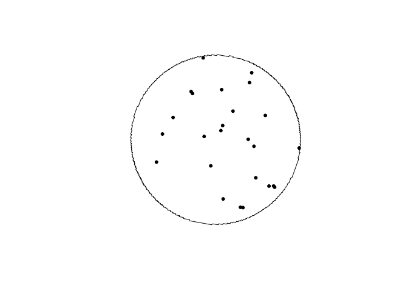

https://stackoverflow.com/questions/59775761/drawing-driving-routes-in-r

# Setup data frame to be filled in

Cities and stations

1. Ottawa
    * Fallowfield Station
    * Millennium / Trim
2. Montreal 
    * Brossard Station
    * Rivière-des-Prairies Station
3. Toronto
    * Vaughan Metropolitan Centre Stations
    * Scarborough GO Station
4. Vancouver
    * Surrey Central Station
    * Edgemont Village Exchange
5. Edmonton
    * Heritage Valley Station
    * Nakî Transit Centre & Park and Ride
6. Calgary
    * North Pointe Transit Terminal
    * McKenzie Towne

# Ottawa
## Fallowfield Station

### Draw buffer and select points


```r
destination <- "Downtown, Ottawa, Canada"
```

### Set origin point


```r
origin <- "Fallowfield Station, Ottawa, Canada"

stations <- geocode(location = origin, output = "more", source = "google")
```

```
## ℹ <https://maps.googleapis.com/maps/api/geocode/json?address=Fallowfield+Station,+Ottawa,+Canada&key=xxx>
```

```r
stations_sf <- stations %>%
                st_as_sf(coords = c("lon", "lat"), crs = 4326)

stations_buffer = st_buffer(stations_sf, 5000)

stations_buffer <- as_sf(stations_buffer)
```

#### Interactive map view of buffers


```r
mapview(stations_buffer)
```

```{=html}
<div class="leaflet html-widget html-fill-item-overflow-hidden html-fill-item" id="htmlwidget-a22bc2625e517dfaa0b2" style="width:672px;height:480px;"></div>
<script type="application/json" data-for="htmlwidget-a22bc2625e517dfaa0b2">{"x":{"options":{"minZoom":1,"maxZoom":52,"crs":{"crsClass":"L.CRS.EPSG3857","code":null,"proj4def":null,"projectedBounds":null,"options":{}},"preferCanvas":false,"bounceAtZoomLimits":false,"maxBounds":[[[-90,-370]],[[90,370]]]},"calls":[{"method":"addProviderTiles","args":["CartoDB.Positron","CartoDB.Positron","CartoDB.Positron",{"errorTileUrl":"","noWrap":false,"detectRetina":false,"pane":"tilePane"}]},{"method":"addProviderTiles","args":["CartoDB.DarkMatter","CartoDB.DarkMatter","CartoDB.DarkMatter",{"errorTileUrl":"","noWrap":false,"detectRetina":false,"pane":"tilePane"}]},{"method":"addProviderTiles","args":["OpenStreetMap","OpenStreetMap","OpenStreetMap",{"errorTileUrl":"","noWrap":false,"detectRetina":false,"pane":"tilePane"}]},{"method":"addProviderTiles","args":["Esri.WorldImagery","Esri.WorldImagery","Esri.WorldImagery",{"errorTileUrl":"","noWrap":false,"detectRetina":false,"pane":"tilePane"}]},{"method":"addProviderTiles","args":["OpenTopoMap","OpenTopoMap","OpenTopoMap",{"errorTileUrl":"","noWrap":false,"detectRetina":false,"pane":"tilePane"}]},{"method":"createMapPane","args":["polygon",420]},{"method":"addPolygons","args":[[[[{"lng":[-75.69033657591565,-75.69108867947882,-75.69184077936046,-75.69155398430719,-75.69230609430724,-75.69287017439086,-75.69279848025383,-75.69298650735062,-75.69277142413971,-75.69352354057597,-75.69408762548635,-75.69401593599159,-75.69420396469725,-75.69398889541344,-75.69474101828526,-75.69530510802187,-75.6952334231698,-75.69542145348417,-75.69520639812865,-75.69595852743538,-75.69671065305801,-75.6964239322856,-75.69717606802658,-75.69792820008281,-75.69764149788456,-75.69839364005912,-75.69914577854833,-75.69970987999646,-75.69963821252577,-75.69982624674381,-75.69961124353328,-75.70111552968987,-75.7008288784493,-75.70158102980244,-75.70233317746855,-75.70308532144725,-75.70279870259158,-75.70355085668804,-75.7050551538164,-75.70543122579311,-75.70528793713943,-75.70566401164544,-75.70552072418606,-75.70627287733444,-75.70702502679337,-75.70777717256246,-75.70749063229252,-75.70899494037414,-75.71087530471469,-75.71073206226134,-75.71110813581278,-75.71096489455469,-75.71171704579271,-75.71246919333845,-75.71322133719154,-75.7139734773516,-75.71472561381823,-75.71491364735775,-75.71484204400633,-75.71503007817805,-75.71495847512561,-75.71533454450257,-75.715710612956,-75.71608668048583,-75.71594348304576,-75.71744775773803,-75.71895201764943,-75.72045626277693,-75.72196049311748,-75.72346470866795,-75.72317844512312,-75.72393056116226,-75.72468267350287,-75.72543478214456,-75.72618688708694,-75.72640154415724,-75.72658956722509,-75.72666111759112,-75.72797726654839,-75.72948142290799,-75.7309855644622,-75.73248969120793,-75.73399380314214,-75.73549790026175,-75.73578393379736,-75.73653596298792,-75.73728798847351,-75.73804001025381,-75.7387920283284,-75.73954404269692,-75.73982999815362,-75.74208597757912,-75.74283796330597,-75.7431238544978,-75.74387582270326,-75.74462778720006,-75.74537974798787,-75.74559412938864,-75.74578211641601,-75.74585357489336,-75.74716947154957,-75.74792140739444,-75.74817147439298,-75.74826546460186,-75.74830118767993,-75.74895911600775,-75.74971103061742,-75.75046294151551,-75.75074868136036,-75.75225246439344,-75.75253816760531,-75.75329003973951,-75.75404190816032,-75.75430972084311,-75.75435671168675,-75.75437456553024,-75.75583127281415,-75.75611662383295,-75.75611735804343,-75.75611763697452,-75.75686873241604,-75.75762055835285,-75.75790615167372,-75.75865796008208,-75.75880074646024,-75.75917664581773,-75.7593194264923,-75.75969532146753,-75.76044710863054,-75.76069695126724,-75.76079092289052,-75.7608266139174,-75.7614844121434,-75.7622361780594,-75.76252167531362,-75.76327342369927,-75.76355889814188,-75.76431062899692,-75.7644533559377,-75.76482921651764,-75.76497193775589,-75.76534779395307,-75.76609950355784,-75.76638491856841,-75.76713661064149,-75.7674220028436,-75.76817367738471,-75.76845904677938,-75.76921070378826,-75.7694938211411,-75.76949969333978,-75.76950192257431,-75.77024768985281,-75.77051518116259,-75.77056215769707,-75.77057999011605,-75.77128463557908,-75.77155210550961,-75.77159908094826,-75.77161691194198,-75.77232154096774,-75.7726068191424,-75.77335840601951,-75.77364366139162,-75.7743952307351,-75.77468046330563,-75.77543201511519,-75.77571722488511,-75.77646875916049,-75.77675394613081,-75.77696783045923,-75.77715570740445,-75.77722700019388,-75.77779062704339,-75.7780757822264,-75.77882726762356,-75.77911240000965,-75.77925496283235,-75.77963069377721,-75.779773250901,-75.78014897746219,-75.78043407806557,-75.78118551458471,-75.78147059239386,-75.78168439485388,-75.78187224736041,-75.78194351286095,-75.78250706639382,-75.78279211242484,-75.78293463207115,-75.78331032290603,-75.78345283685454,-75.78382852330566,-75.78411353756141,-75.78425604132049,-75.78463171648451,-75.78477421454623,-75.78514988532646,-75.7854348678098,-75.78557735568309,-75.78595301517652,-75.78609549735289,-75.78647115246251,-75.78675610317629,-75.7870410449089,-75.78779232472009,-75.78807724366712,-75.78861144248923,-75.78870534724231,-75.788740959159,-75.78939828928857,-75.78968316749288,-75.7899680367187,-75.79025289696645,-75.79100408649136,-75.79128892395843,-75.79185857196208,-75.79228578440214,-75.79266134670975,-75.7928037429182,-75.79317930084225,-75.7934640796271,-75.79374884943725,-75.79403361027312,-75.79431836213504,-75.79460310502347,-75.79488783893873,-75.79517256388124,-75.79592358032751,-75.79620828249878,-75.79677765992682,-75.79734700147138,-75.79791630713558,-75.79848557692247,-75.7987701983629,-75.79801931988901,-75.79830394615651,-75.79858856345585,-75.79887317178745,-75.79915777115164,-75.79944236154886,-75.79972694297946,-75.80001151544381,-75.80029607894235,-75.79954530708432,-75.79982987540961,-75.80039898516431,-75.80068352659445,-75.80002664642477,-75.80006221498159,-75.79996837493934,-75.80021735242357,-75.80050188971585,-75.80078641804424,-75.80107093740914,-75.80032026840594,-75.80060479259684,-75.80117381408978,-75.80042318271647,-75.80070769380717,-75.80099219593558,-75.80127668910205,-75.80052609535505,-75.8008105933467,-75.80109508237686,-75.80034451246668,-75.80062900632156,-75.80091349121533,-75.80035058200937,-75.8004217044174,-75.80023406841002,-75.80044743485847,-75.80073191561586,-75.8003566549622,-75.80049889542681,-75.8001236372853,-75.80026587895584,-75.80055035557677,-75.80017510683918,-75.80031734523553,-75.79994209900985,-75.80008433861202,-75.80036881109649,-75.79971214604456,-75.79974770598261,-75.79965389667137,-75.7999028138254,-75.80018728217335,-75.79943683142383,-75.79972130459431,-75.80000576880575,-75.79925534188365,-75.79953981091717,-75.79888319635445,-75.79891875586097,-75.79882495376249,-75.79935833279229,-75.79860793974095,-75.79889240945863,-75.79818892549925,-75.79820670536652,-75.79815980637302,-75.79842650099033,-75.79805131497596,-75.79819355233046,-75.79781836882714,-75.79796060738667,-75.79824507778719,-75.79749472864701,-75.79777920386734,-75.7971226573619,-75.79715821764148,-75.79706442526546,-75.79731334481029,-75.79693818075026,-75.79708042085511,-75.79670525930582,-75.79713197651623,-75.79638167128188,-75.79666615200118,-75.7959158568091,-75.7962003423464,-75.79545005719636,-75.79573454755119,-75.79498427244297,-75.79526876761486,-75.79456539422424,-75.79458317568213,-75.79453628405993,-75.79480300253671,-75.79414652959369,-75.79418209296892,-75.79408831110186,-75.79433725231605,-75.79368078815899,-75.7937163521362,-75.79362257152428,-75.79387151695219,-75.7932150615809,-75.79325062615999,-75.7931568468032,-75.79340579644443,-75.79270246070752,-75.7927202433693,-75.79267335425736,-75.79294009079207,-75.79218987592985,-75.79247439999442,-75.79172419517239,-75.7920087240508,-75.7912585292687,-75.79154306296049,-75.79079287821813,-75.7910774167228,-75.79032724201993,-75.78995215326971,-75.79009442949028,-75.78971934324991,-75.78986162067345,-75.78920522353316,-75.78924079404513,-75.78914702300712,-75.78939601417797,-75.78864585582382,-75.78893042253281,-75.78818027421771,-75.78780519866177,-75.78794748898322,-75.78757241593705,-75.78771470746098,-75.78705833341053,-75.78709390744741,-75.787000139708,-75.78724915555294,-75.78649902358681,-75.7867836184929,-75.78603349656539,-75.78547090267335,-75.78554205602303,-75.78535452512014,-75.78556798439105,-75.78481786877435,-75.78510248706307,-75.78435238148479,-75.78369603604654,-75.78373161592901,-75.78363785227714,-75.78388690904067,-75.78276175874313,-75.7829040841378,-75.78252903561663,-75.78267136221274,-75.78192126925813,-75.78220592949542,-75.78145584657901,-75.78070575993723,-75.78099043874282,-75.78024036213927,-75.77958404205569,-75.77961962950215,-75.77952586947248,-75.77977497918327,-75.77902490889323,-75.77836859433451,-75.77840418410165,-75.77831042486126,-75.77855955081657,-75.7778094868407,-75.77707113897776,-75.7770755880199,-75.77706386818681,-75.77734415364243,-75.77659409598137,-75.77584403459745,-75.77612878766061,-75.77537873631503,-75.77462868124724,-75.77425365231763,-75.77439604268962,-75.77402101626966,-75.77416340784144,-75.77266330661818,-75.77294811056032,-75.77219806812671,-75.77144802197255,-75.77088548491552,-75.77095669396023,-75.77076918200284,-75.77098280835592,-75.77023276852046,-75.76892018985849,-75.76899140698147,-75.76880389567417,-75.76901754626171,-75.76826750902671,-75.76751746807317,-75.76676742340149,-75.76705232428165,-75.76630228964942,-75.76406388294309,-75.76406833530467,-75.76405661581407,-75.76433711039262,-75.76358707464895,-75.76283703518916,-75.76208699201364,-75.76133694512275,-75.76096192028416,-75.76110442134491,-75.76072939901651,-75.76087190127465,-75.75937181643009,-75.75787171672968,-75.75639504158056,-75.75640395046287,-75.75638051107221,-75.75665668249648,-75.75590663340526,-75.75515658060183,-75.75440652408662,-75.75365646385997,-75.75290639992228,-75.75215633227393,-75.7514062609153,-75.75065618584675,-75.7499061070687,-75.74915602458151,-75.74840593838555,-75.74765584848122,-75.74690575486888,-75.74615565754893,-75.74540555652175,-75.74465545178771,-75.74390534334719,-75.74315523120059,-75.74240511534828,-75.74165499579063,-75.74090487252802,-75.74015474556086,-75.73940461488949,-75.7391905682547,-75.73900303242975,-75.73893168156999,-75.73836907012796,-75.73686876276551,-75.73536844059292,-75.73461827395379,-75.73436847234041,-75.73427469974627,-75.73423901302547,-75.73358260174307,-75.73283241395076,-75.73208222245795,-75.73133202726501,-75.73118925233643,-75.73081414991486,-75.73067136930349,-75.73029626251936,-75.72879582613521,-75.72804560239526,-75.72775998630888,-75.72700974512024,-75.72625950023402,-75.72550925165061,-75.72522358532946,-75.72372304957157,-75.72358019929133,-75.72320505960414,-75.72306220364003,-75.72268705959124,-75.72193676872214,-75.72118647415802,-75.72090072111378,-75.72015040910438,-75.71940009340082,-75.71911437364233,-75.71911419045597,-75.71911412068204,-75.71836397072033,-75.71761363387903,-75.71732780785707,-75.71657745357206,-75.71582709559469,-75.71554123308192,-75.71479085766164,-75.71404047854988,-75.713754579545,-75.71300418299111,-75.71278974252378,-75.71260214023027,-75.71253065809111,-75.71196784724836,-75.71121742956257,-75.71093147132092,-75.71018103619406,-75.70993080332316,-75.70983699716881,-75.70980124883887,-75.70914460264046,-75.70900160189906,-75.70862637079405,-75.70848336436617,-75.70735765520482,-75.70707161497523,-75.70632112383926,-75.70603506086221,-75.70528455228683,-75.70503422776902,-75.70494041243369,-75.70490465101112,-75.70424794054681,-75.70403336003413,-75.70384572537588,-75.70377419655412,-75.70321128861855,-75.70306822413065,-75.70269294758359,-75.70254987740796,-75.70217459650131,-75.70203152063782,-75.70165623537162,-75.70151315382016,-75.70113786419444,-75.70092323249142,-75.70073558475437,-75.70066403886882,-75.70010109169723,-75.69988644292931,-75.6996987908328,-75.69962723925886,-75.69906427900902,-75.69879594592598,-75.69874903167241,-75.69873114246519,-75.69802742612909,-75.69774118113733,-75.69699053305678,-75.69670426530881,-75.69595359979135,-75.69566730928622,-75.69552416065743,-75.69514881620195,-75.69500566188354,-75.69463031306888,-75.69434399080151,-75.69359327665615,-75.6933069316289,-75.69316375573835,-75.69278838696873,-75.69264520538789,-75.6922698322592,-75.69198345546516,-75.6912326926917,-75.69094629313514,-75.69066100337244,-75.69065807059087,-75.69065695178969,-75.68990909060567,-75.68962265927773,-75.68937202447626,-75.68927817174757,-75.68924236599794,-75.68858539378292,-75.68829893068079,-75.68804826807597,-75.68795441144808,-75.68791860172648,-75.68726160221725,-75.68697510733811,-75.68668860344849,-75.68593771590247,-75.68565118924346,-75.68536465357283,-75.68514974590578,-75.68496201398553,-75.68489037611002,-75.68432717639062,-75.68375403246858,-75.68353909420281,-75.68335135104364,-75.68327970296831,-75.68271646953225,-75.68242986127687,-75.68214324400685,-75.68185661772182,-75.68171330119856,-75.68133778701115,-75.68119446479362,-75.68081894624707,-75.68053228816913,-75.67938556568828,-75.67863445702756,-75.67834774009975,-75.67806101415313,-75.67777427918732,-75.67748753520192,-75.67720078219656,-75.67691402017084,-75.67662724912439,-75.67634046905681,-75.67605367996772,-75.67576688185675,-75.67548007472348,-75.67519325856756,-75.67490643338857,-75.67461959918616,-75.67433275595991,-75.67404590370948,-75.67375904243443,-75.67347217213441,-75.67384785082153,-75.67370441572946,-75.67408009694111,-75.67364978845421,-75.67250219986873,-75.67320667067274,-75.67318873926206,-75.67323570392139,-75.67296672933666,-75.67267981436771,-75.67239289037101,-75.6721059573462,-75.67276350852246,-75.67272764276602,-75.6728215786341,-75.67228357858747,-75.67199663225034,-75.67237239494936,-75.67222892183852,-75.67260468706347,-75.67246121513904,-75.67217426451815,-75.67188730486752,-75.67226308639391,-75.67211960662632,-75.67249539067892,-75.67206494816308,-75.67177797519776,-75.67252957499109,-75.67224260677216,-75.67195562952229,-75.67233144181979,-75.67218795325263,-75.67256376807684,-75.67242028069641,-75.67213329916198,-75.67250912340221,-75.67236563269284,-75.67274145945997,-75.67259796993743,-75.67231098411847,-75.67268682030222,-75.67254332745063,-75.67291916616144,-75.6727756744968,-75.67248868439334,-75.67286453252139,-75.67272103752761,-75.6730968881829,-75.67295339437617,-75.67266639998822,-75.67323018975368,-75.67315844232931,-75.67334637265351,-75.67313112957713,-75.67284413090469,-75.67359587402474,-75.67330888010127,-75.67302187714439,-75.67377364415771,-75.67348664595023,-75.67414445113499,-75.67410857723144,-75.67420254938655,-75.67395142961709,-75.6736644271256,-75.67441622814567,-75.67412923040447,-75.67488104153666,-75.67459404854621,-75.6749699596276,-75.6748264631909,-75.67520237680043,-75.67477188427797,-75.67552372942113,-75.67523673689921,-75.67598859215569,-75.67570160438586,-75.67626550375778,-75.67619375798876,-75.67638172484858,-75.67616648673867,-75.67654242493978,-75.67639893349008,-75.67677487421969,-75.67663138395827,-75.67634439665922,-75.67709629604539,-75.67680931349982,-75.67756122300072,-75.67727424520908,-75.67802616482496,-75.67773919178771,-75.67849112151883,-75.67820415323639,-75.67895609308299,-75.67866912955589,-75.67942107951815,-75.67913412074681,-75.67988608082501,-75.6795991268099,-75.68035109700429,-75.68006414774585,-75.68081612805663,-75.68052918355538,-75.68128117398278,-75.68099423423914,-75.68174623478342,-75.68212223367688,-75.68197877076189,-75.68235477218455,-75.68221131045925,-75.68277531604238,-75.68270358691906,-75.6828915891826,-75.68267640101095,-75.6834284181126,-75.68314150643924,-75.68389353365822,-75.6836066267448,-75.68435866408134,-75.68407176192835,-75.68557291549496,-75.68557179487327,-75.68557473253732,-75.68528896956295,-75.68604102345682,-75.68575414462281,-75.68650620863471,-75.68707025422923,-75.68699853914528,-75.68718655474586,-75.68697140869313,-75.6877234791439,-75.68743662363278,-75.68884677168091,-75.68881091734075,-75.68890492696622,-75.68865394414186,-75.68940603114906,-75.68978207327244,-75.68963866175932,-75.69001470641226,-75.68987129609046,-75.6906233895352,-75.69033657591565],"lat":[45.33114257943345,45.33123849234023,45.33133439951671,45.33189659235293,45.33199249754175,45.33206442267283,45.33220497343006,45.33222894799135,45.33265060315077,45.33274650062123,45.33281841996347,45.3329589740492,45.33298294668086,45.33340461182579,45.33350050157746,45.33357241513057,45.3337129725447,45.33373694324663,45.33415861837681,45.33425450040929,45.33435037671118,45.33491262280268,45.33500849711554,45.33510436569773,45.33566662510221,45.33576249169503,45.33585835255711,45.3359302444429,45.33607081277702,45.33609477625642,45.33651648414659,45.33670818469892,45.33727047446905,45.33736631988965,45.3374621595794,45.33755799353839,45.33812030036047,45.33821613232877,45.3384077790729,45.3384556871772,45.33873684931967,45.33878475692617,45.33906592146137,45.33916173424602,45.33925754129987,45.33935334262296,45.33991568728484,45.34010728021666,45.340346739146,45.34062792207583,45.34067581049825,45.34095699582072,45.34105277023659,45.34114853892177,45.3412443018763,45.34134005910025,45.34143581059369,45.34145974757167,45.34160034568539,45.34162428253877,45.34176488125065,45.3418127543501,45.34186062601692,45.34190849625114,45.34218969757136,45.34238116791888,45.34257261534479,45.34276403984957,45.34295544143375,45.34314682009784,45.34370926447288,45.34380494894488,45.34390062768683,45.34399630069881,45.34409196798087,45.34367012294894,45.34369403817402,45.34355342365942,45.34372081857455,45.3439121055633,45.3441033696345,45.34429461078864,45.34448582902623,45.3446770243478,45.34411452607718,45.3442101114132,45.34430569102062,45.34440126489947,45.34449683304984,45.34459239547179,45.34402988438424,45.3443165260901,45.34441206186938,45.34384954170088,45.34394506802299,45.34404058861748,45.3441361034844,45.34371420879967,45.34373808592236,45.34359745485767,45.3437645830626,45.34386007701911,45.343367862196,45.34337979813015,45.3433094820336,45.34339303065936,45.34348850943419,45.34358398248223,45.34302144627864,45.34321236774092,45.3426498299244,45.34274527833953,45.34284072102854,45.34231334014375,45.34231930490337,45.3422841463457,45.34246904234908,45.34190705066493,45.34190714384943,45.34190659449578,45.34200191937162,45.34209733170649,45.34153478906036,45.34163019194511,45.34134892095053,45.34139661931486,45.34111534884978,45.34116304485178,45.3412584325622,45.34076620787504,45.34077813052902,45.34070781302356,45.34079126868956,45.34088664122685,45.34032409748808,45.34041946057765,45.33985691895899,45.33995227260146,45.33967100212204,45.33971867586613,45.33943740591698,45.33948507729951,45.33958041577187,45.33901787467305,45.33911320369982,45.3385506647233,45.3386459843051,45.33808344745149,45.33817875758895,45.33762061763878,45.33762136219786,45.33761696741771,45.3377115235526,45.33718414906328,45.33719010494863,45.33715494681746,45.3372442821973,45.33671690969991,45.33672286499509,45.33668770699673,45.33677703352426,45.33621450516841,45.33630977753472,45.33574725130485,45.33584251422992,45.33527999012664,45.3353752436111,45.33481272163501,45.33490796567948,45.3343454458312,45.33392355978192,45.3339473682723,45.33380674008765,45.33387816271645,45.33331565084359,45.33341087229198,45.33284836254841,45.33256710986939,45.3326147156603,45.33233346351376,45.33238106694536,45.33181856517934,45.33191376403568,45.33135126440042,45.33092939351174,45.33095319070607,45.33081256757523,45.33088395631673,45.33032146466113,45.33004022102647,45.33008780894642,45.32980656584483,45.32985415140612,45.32929166773142,45.32901042808735,45.32905800943218,45.3287767703214,45.32882434930783,45.32826187361527,45.3279806379624,45.32802821273286,45.3277469776135,45.3277945500258,45.32723208231661,45.3266696204569,45.32676475356399,45.32620229383941,45.32514769762312,45.32515958752472,45.32508928178352,45.32517250818763,45.32461006229913,45.32404762226097,45.32348518807326,45.32358028746417,45.32301785541384,45.32189300886576,45.32104938931364,45.32109692851198,45.3208157239921,45.32086326083368,45.32030085432633,45.3197384536705,45.3191760588663,45.31861366991384,45.31805128681324,45.3174889095646,45.31692653816803,45.31702158158416,45.31645921232878,45.31533449137547,45.31420979383281,45.31308511970171,45.31196046898302,45.31139815240363,45.31130314609081,45.31074083907436,45.31017853791132,45.30961624260178,45.30905395314588,45.30849166954371,45.30792939179538,45.307367119901,45.3068048538607,45.30670987151042,45.30614761503283,45.30502311964017,45.30446088072532,45.30437777946502,45.30430750041789,45.30429562851042,45.30380367814739,45.3032414546496,45.30267923700636,45.30211702521777,45.30202206111584,45.30145985888977,45.30033547200195,45.30024051331547,45.29967833236145,45.29911615726234,45.29855398801826,45.29845903474706,45.29789687506539,45.29733472123883,45.29723976967554,45.29667762541138,45.2961154870024,45.29604427514595,45.29590374215367,45.29588000438661,45.29545840830058,45.29489628530921,45.29484881194897,45.29456775357578,45.29452027971585,45.29423922373326,45.29367711615958,45.2936296436535,45.29334859298916,45.29330111998344,45.29302007170969,45.29245797955375,45.29237490322701,45.29230464252468,45.29229277417935,45.29180095223016,45.29123887549201,45.29114393247076,45.29058186529492,45.29001980397462,45.28992486266228,45.28936281090426,45.28927973581996,45.28920948016736,45.28919761199956,45.28814378905845,45.28804884745776,45.28748682067993,45.287397811224,45.28736268496201,45.28735675083451,45.28682985986654,45.28678238778204,45.28650138229682,45.2864539097131,45.28617290661847,45.28561090482089,45.28551596093595,45.28495396870068,45.28487089136627,45.28480064315401,45.28478877466485,45.28429704014626,45.28424956692022,45.28396857870629,45.28392110498119,45.28307815190285,45.28298320573564,45.28242124804299,45.28232629987987,45.28176435174957,45.28166940159075,45.28110746302283,45.28101251086849,45.28045058186297,45.28036156251473,45.2803264423635,45.28032050757657,45.27979370827022,45.27971062195536,45.27964038284214,45.27962851307014,45.27913684224478,45.27905375418435,45.27898351626644,45.27897164624508,45.27847998378687,45.27839689398105,45.27832665725844,45.27831478698775,45.27782313289671,45.27773410606783,45.27769898830723,45.27769305302161,45.27716628957451,45.2770713254512,45.27650945382049,45.27641448770304,45.27585262563487,45.27575765752347,45.27519580501785,45.27510083491272,45.27453899196968,45.27444401987099,45.27439653168379,45.27411561518858,45.27406812650306,45.2737872123985,45.27370410539152,45.27363387749962,45.27362200477168,45.27313041249547,45.2730354307096,45.27247362016211,45.27237863638342,45.27233114235635,45.27205024205909,45.27200274753388,45.27172184962733,45.27163873240126,45.2715685085589,45.27155663437112,45.27106507044154,45.27097007697748,45.27040829882626,45.27031330337012,45.27024205303722,45.27010161103658,45.27007786044486,45.26965653733369,45.26956153418554,45.26899977886841,45.2689047737287,45.26882163955566,45.26875142142187,45.26873954481313,45.26824802084342,45.26810549945953,45.26782463341371,45.26777712436301,45.26749626070796,45.26740124018617,45.26683952097562,45.26674449846315,45.26664947025095,45.26608776431274,45.26599273411018,45.26590957800746,45.26583936604618,45.26582748630467,45.26533600554243,45.26524096765021,45.26515780481909,45.26508759451694,45.26507571381423,45.26458424466588,45.2644891990844,45.26439563302352,45.26438685694448,45.2643853717253,45.26383248168423,45.26373742841392,45.26364236944417,45.26308071659865,45.26298565563991,45.2628905889818,45.26284305351548,45.26256223392581,45.26251469796233,45.26223388076355,45.26204372637213,45.26148210378601,45.26138702175244,45.26129193401962,45.26122061447981,45.26108021229927,45.26105643863889,45.26063523498776,45.2605401395679,45.26037370886927,45.2602333109356,45.26020953392869,45.25978834301814,45.25969323421248,45.25959811970758,45.25950299950338,45.25894142787973,45.25884630568878,45.25856239151553,45.25855361723647,45.25855213064217,45.25799935399935,45.25790421272438,45.25780906575015,45.25771391307658,45.2576187547036,45.25757117337982,45.25729040846894,45.2572428266488,45.25696206412904,45.25677172631401,45.25658136570117,45.25639395720614,45.25637641029007,45.25637343537757,45.25582948392549,45.25573428738561,45.25563908514616,45.25554387720708,45.25544866356831,45.25535344422978,45.25525821919143,45.25516298845319,45.25506775201501,45.25497250987681,45.25487726203854,45.25478200850013,45.25468674926152,45.25459148432265,45.25449621368344,45.25440093734385,45.2543056553038,45.25421036756322,45.25411507412208,45.25401977498029,45.25392447013779,45.25382915959452,45.25373384335041,45.25363852140539,45.25405958050422,45.25403574842974,45.25417610196096,45.25410460290205,45.25391392306653,45.25372322042557,45.2536278605529,45.25411908207033,45.25410716127836,45.25417733608802,45.25409388764264,45.25399851264532,45.25390313194613,45.253807745545,45.25408843848615,45.25404074221679,45.25432143568852,45.25427373706304,45.25408292830539,45.25398751537301,45.25454889367009,45.25445347131203,45.25435804325122,45.25426260948765,45.25482398245779,45.25463309037384,45.25491377532594,45.25486604780937,45.25514673329106,45.2550990034175,45.2550035393928,45.25490806966459,45.25546943569766,45.25537395654057,45.25527847167963,45.25583969905131,45.25583967573796,45.25583981279054,45.25574434181318,45.25564884181833,45.25621020463223,45.25611469520673,45.25601918007672,45.25658054127876,45.25648501671722,45.25638948645085,45.25695084603952,45.25685530634072,45.25727632706941,45.25725244055432,45.25739278129429,45.25732111891053,45.25722556407328,45.25778692415905,45.25769135988787,45.25818255149105,45.25817060514814,45.25824077568388,45.25815714837933,45.25843782980338,45.2583900398785,45.25867072183015,45.25852734069924,45.25908870338792,45.25899310510469,45.25955446990257,45.25945886218268,45.25995005790656,45.2599381061323,45.26000827725662,45.25992461193199,45.26034563814551,45.26032173226498,45.26046207483277,45.26039035435139,45.26067103918257,45.26062322281199,45.26090390816992,45.26085608943965,45.26113677532425,45.26108895423422,45.26136964064541,45.26132181719554,45.26174284814937,45.26171893518962,45.26185927933736,45.26178753761783,45.26220857015085,45.26218465483105,45.26232499950513,45.26225325070529,45.262779543858,45.2627735644277,45.26280865080571,45.26271895645668,45.26328033810631,45.26318465487078,45.26374603862411,45.26365034594636,45.2642117318028,45.2644924269196,45.26444457563958,45.26472527128199,45.26467741764111,45.26523881143599,45.26514309613783,45.26570449203433,45.26598519217093,45.26593732957978,45.26621803024162,45.26617016528922,45.26673156912207,45.26663583119944,45.26719723713242,45.26775645587428,45.2677560818577,45.26775827488372,45.26766289779628,45.26822431166348,45.26871555358345,45.26870358341831,45.26877376114173,45.26868996707824,45.26925138887841,45.26974263773944,45.26973066592628,45.26980084464125,45.26971703904137,45.27027846877328,45.27083990433903,45.27074411368172,45.27130555134412,45.27186699484,45.27228808129006,45.27226413016371,45.27240449280929,45.27233263658698,45.27345554526949,45.27387664204064,45.2738526866825,45.27399305276835,45.27392118385031,45.27448264903533,45.27504412005285,45.27560559690277,45.27588633751485,45.27583841657445,45.27611915770983,45.27607123440595,45.27663271918117,45.27887871660003,45.27878284700775,45.2793443572013,45.27990587322606,45.28046739508192,45.28102892276876,45.28159045628649,45.28215199563498,45.28271354081412,45.28327509182381,45.28383664866393,45.28439821133437,45.28495977983502,45.28552135416577,45.2860829343265,45.28664452031711,45.28720611213749,45.28776770978752,45.28832931326708,45.28889092257609,45.28893889175963,45.28921969953583,45.28926766822517,45.29011010310488,45.2923566602381,45.2924466169764,45.29248172039095,45.29248771734269,45.29301427151258,45.29357593494049,45.29413760419712,45.29469927928237,45.29478324715787,45.29485345736281,45.29486545247451,45.29591861735484,45.29648031366944,45.29652829860402,45.29680914988297,45.29685713432305,45.29713798799511,45.29769969971049,45.29826141725411,45.29830940494383,45.29859026683729,45.29863825403243,45.29948085126329,45.30004259003564,45.30013856949473,45.30070031783962,45.30126207201248,45.30131006334037,45.30159094354843,45.3016389343816,45.30191981698281,45.30248158655615,45.30252957876689,45.3028104666752,45.30285845839115,45.3031393486926,45.30370113366636,45.30374912675988,45.30403002236839,45.30407801496705,45.30435891296872,45.30492071334283,45.30496870731906,45.30524961062775,45.30529760410905,45.30557850981089,45.30614032558532,45.30621231733687,45.30635277289323,45.30637676966219,45.30679813921885,45.30735997039353,45.30745596044498,45.30801780119232,45.30857964776719,45.30867563958348,45.30923749573102,45.30932148715044,45.30939171998826,45.30940371846311,45.30989535128699,45.3104572228347,45.31055321443487,45.31111509555526,45.31121108517446,45.31177297586751,45.31182097040231,45.31210191887043,45.31214991290992,45.31299276986439,45.31308875926617,45.31365067493201,45.31374666235216,45.31430858759063,45.31438057720629,45.31452106012866,45.3145450561854,45.31496650784005,45.31501450028411,45.31529547081126,45.31534346275976,45.31562443568008,45.31618638589131,45.31628237111044,45.3168443308943,45.31694031413095,45.31750228348742,45.31759826474141,45.31816024367045,45.31825622294158,45.31881821144318,45.31891418873124,45.3194761868054,45.31957216211018,45.32013416975686,45.3202301430782,45.32079216029739,45.32088813163506,45.32145015842673,45.32154612778055,45.32210816414469,45.32220413151446,45.32276617745105,45.32286214283656,45.32291012338099,45.32319115134313,45.32323913139142,45.32352016174666,45.32359213053778,45.32373264696383,45.32375663607876,45.3241781882445,45.32427414393175,45.32483622232991,45.32493217603217,45.32549426400265,45.32559021571972,45.32615231326249,45.32634383222624,45.32634602796038,45.32634640273056,45.32690631785536,45.3270022598718,45.327564380303,45.32766032033353,45.32773227159627,45.32787280425262,45.32789678752462,45.32831838838133,45.32841432069583,45.32897646401497,45.32915632867971,45.32922659788177,45.32923858820166,45.32973047557566,45.32982639818695,45.32987435734381,45.33015544065425,45.33020339931436,45.33048448501779,45.3305803999119,45.33114257943345]}]]],null,"stations_buffer",{"crs":{"crsClass":"L.CRS.EPSG3857","code":null,"proj4def":null,"projectedBounds":null,"options":{}},"pane":"polygon","stroke":true,"color":"#333333","weight":0.5,"opacity":0.9,"fill":true,"fillColor":"#6666FF","fillOpacity":0.6,"smoothFactor":1,"noClip":false},"<div class='scrollableContainer'><table class=mapview-popup id='popup'><tr class='coord'><td><\/td><th><b>Feature ID&emsp;<\/b><\/th><td>1&emsp;<\/td><\/tr><tr><td>1<\/td><th>type&emsp;<\/th><td>neighborhood&emsp;<\/td><\/tr><tr><td>2<\/td><th>loctype&emsp;<\/th><td>approximate&emsp;<\/td><\/tr><tr><td>3<\/td><th>address&emsp;<\/th><td>fallowfield station, ottawa, on k2j 5k9, canada&emsp;<\/td><\/tr><tr><td>4<\/td><th>north&emsp;<\/th><td>45.30045&emsp;<\/td><\/tr><tr><td>5<\/td><th>south&emsp;<\/th><td>45.29776&emsp;<\/td><\/tr><tr><td>6<\/td><th>east&emsp;<\/th><td>-75.73508&emsp;<\/td><\/tr><tr><td>7<\/td><th>west&emsp;<\/th><td>-75.73778&emsp;<\/td><\/tr><tr><td>8<\/td><th>geometry&emsp;<\/th><td>sfc_POLYGON&emsp;<\/td><\/tr><\/table><\/div>",{"maxWidth":800,"minWidth":50,"autoPan":true,"keepInView":false,"closeButton":true,"closeOnClick":true,"className":""},"1",{"interactive":false,"permanent":false,"direction":"auto","opacity":1,"offset":[0,0],"textsize":"10px","textOnly":false,"className":"","sticky":true},{"stroke":true,"weight":1,"opacity":0.9,"fillOpacity":0.84,"bringToFront":false,"sendToBack":false}]},{"method":"addScaleBar","args":[{"maxWidth":100,"metric":true,"imperial":true,"updateWhenIdle":true,"position":"bottomleft"}]},{"method":"addHomeButton","args":[-75.80127668910205,45.2536278605529,-75.67177797519776,45.3446770243478,true,"stations_buffer","Zoom to stations_buffer","<strong> stations_buffer <\/strong>","bottomright"]},{"method":"addLayersControl","args":[["CartoDB.Positron","CartoDB.DarkMatter","OpenStreetMap","Esri.WorldImagery","OpenTopoMap"],"stations_buffer",{"collapsed":true,"autoZIndex":true,"position":"topleft"}]},{"method":"addLegend","args":[{"colors":["#6666FF"],"labels":["stations_buffer"],"na_color":null,"na_label":"NA","opacity":1,"position":"topright","type":"factor","title":"","extra":null,"layerId":null,"className":"info legend","group":"stations_buffer"}]}],"limits":{"lat":[45.2536278605529,45.3446770243478],"lng":[-75.80127668910205,-75.67177797519776]},"fitBounds":[45.2536278605529,-75.80127668910205,45.3446770243478,-75.67177797519776,[]]},"evals":[],"jsHooks":{"render":[{"code":"function(el, x, data) {\n  return (\n      function(el, x, data) {\n      // get the leaflet map\n      var map = this; //HTMLWidgets.find('#' + el.id);\n      // we need a new div element because we have to handle\n      // the mouseover output separately\n      // debugger;\n      function addElement () {\n      // generate new div Element\n      var newDiv = $(document.createElement('div'));\n      // append at end of leaflet htmlwidget container\n      $(el).append(newDiv);\n      //provide ID and style\n      newDiv.addClass('lnlt');\n      newDiv.css({\n      'position': 'relative',\n      'bottomleft':  '0px',\n      'background-color': 'rgba(255, 255, 255, 0.7)',\n      'box-shadow': '0 0 2px #bbb',\n      'background-clip': 'padding-box',\n      'margin': '0',\n      'padding-left': '5px',\n      'color': '#333',\n      'font': '9px/1.5 \"Helvetica Neue\", Arial, Helvetica, sans-serif',\n      'z-index': '700',\n      });\n      return newDiv;\n      }\n\n\n      // check for already existing lnlt class to not duplicate\n      var lnlt = $(el).find('.lnlt');\n\n      if(!lnlt.length) {\n      lnlt = addElement();\n\n      // grab the special div we generated in the beginning\n      // and put the mousmove output there\n\n      map.on('mousemove', function (e) {\n      if (e.originalEvent.ctrlKey) {\n      if (document.querySelector('.lnlt') === null) lnlt = addElement();\n      lnlt.text(\n                           ' lon: ' + (e.latlng.lng).toFixed(5) +\n                           ' | lat: ' + (e.latlng.lat).toFixed(5) +\n                           ' | zoom: ' + map.getZoom() +\n                           ' | x: ' + L.CRS.EPSG3857.project(e.latlng).x.toFixed(0) +\n                           ' | y: ' + L.CRS.EPSG3857.project(e.latlng).y.toFixed(0) +\n                           ' | epsg: 3857 ' +\n                           ' | proj4: +proj=merc +a=6378137 +b=6378137 +lat_ts=0.0 +lon_0=0.0 +x_0=0.0 +y_0=0 +k=1.0 +units=m +nadgrids=@null +no_defs ');\n      } else {\n      if (document.querySelector('.lnlt') === null) lnlt = addElement();\n      lnlt.text(\n                      ' lon: ' + (e.latlng.lng).toFixed(5) +\n                      ' | lat: ' + (e.latlng.lat).toFixed(5) +\n                      ' | zoom: ' + map.getZoom() + ' ');\n      }\n      });\n\n      // remove the lnlt div when mouse leaves map\n      map.on('mouseout', function (e) {\n      var strip = document.querySelector('.lnlt');\n      if( strip !==null) strip.remove();\n      });\n\n      };\n\n      //$(el).keypress(67, function(e) {\n      map.on('preclick', function(e) {\n      if (e.originalEvent.ctrlKey) {\n      if (document.querySelector('.lnlt') === null) lnlt = addElement();\n      lnlt.text(\n                      ' lon: ' + (e.latlng.lng).toFixed(5) +\n                      ' | lat: ' + (e.latlng.lat).toFixed(5) +\n                      ' | zoom: ' + map.getZoom() + ' ');\n      var txt = document.querySelector('.lnlt').textContent;\n      console.log(txt);\n      //txt.innerText.focus();\n      //txt.select();\n      setClipboardText('\"' + txt + '\"');\n      }\n      });\n\n      }\n      ).call(this.getMap(), el, x, data);\n}","data":null},{"code":"function(el, x, data) {\n  return (function(el,x,data){\n           var map = this;\n\n           map.on('keypress', function(e) {\n               console.log(e.originalEvent.code);\n               var key = e.originalEvent.code;\n               if (key === 'KeyE') {\n                   var bb = this.getBounds();\n                   var txt = JSON.stringify(bb);\n                   console.log(txt);\n\n                   setClipboardText('\\'' + txt + '\\'');\n               }\n           })\n        }).call(this.getMap(), el, x, data);\n}","data":null}]}}</script>
```

#### Generate points within buffer


```r
points_sample_sf <- st_sample(stations_buffer, size = c(25,25), type = "random")
points_sample_sf <- st_as_sf(points_sample_sf)
points_sample <- sf_to_df(points_sample_sf)
```

#### Check to see if they worked


```r
ottawa_check_buffer <- stations_buffer %>% slice(1:2)

plot(st_geometry(ottawa_check_buffer))
plot(points_sample_sf, pch = 20, add= TRUE)
```

<!-- -->

Setup departure location and arrival time


```r
arrival_time <- as.POSIXct("2024-06-01 08:30:00", tz = "America/Toronto")
```

## Reverse 

## Bicycle routes for Ottawa

Need to reverse geocode to get the randomly selected to origins to work


```r
points_sample$destination <- destination
points_sample$lat_lon <- paste(points_sample$lat, points_sample$lon)
```

### Checking points and general mapping


```r
lst_directions <- apply(points_sample, 1, function(x){
  res <- google_directions(
    origin = x[['lat_lon']], 
    destination = x[['destination']],    
  )
df_result <- data.frame(
    origin = x[['lat_lon']], 
    destination = x[['destination']], 
    route = res$routes$overview_polyline$points
)
return(df_result)
})

df_directions <- do.call(rbind, lst_directions)

google_map() %>%
  add_polylines(data = df_directions, polyline = "route") 
```

```{=html}
<div class="google_map html-widget html-fill-item-overflow-hidden html-fill-item" id="htmlwidget-a6a4146a4353aa7b2d9f" style="width:672px;height:480px;"></div>
<script type="application/json" data-for="htmlwidget-a6a4146a4353aa7b2d9f">{"x":{"lat":0,"lng":0,"zoom":1,"min_zoom":null,"max_zoom":null,"mapBounds":{"west":-180,"south":-90,"east":180,"north":90},"styles":null,"search_box":false,"update_map_view":true,"zoomControl":true,"mapType":"roadmap","mapTypeControl":true,"scaleControl":false,"streetViewControl":true,"rotateControl":true,"fullscreenControl":true,"event_return_type":"list","split_view":null,"split_view_options":{"heading":34,"pitch":10},"geolocation":false,"calls":[{"functions":"add_polylines","args":[[{"id":1,"geodesic":true,"stroke_colour":"#0000FF","stroke_weight":2,"stroke_opacity":0.6,"z_index":3,"polyline":["mrnsGb~omMrDjMnDbMf@zADX?TCRIPOPsEtCSLUVMVEX@\\D`@pBbHhAnDdArDiB^iAF{D?oA@wAHsAP_ARaCr@oAh@kBbAqDnCeMpJuJpHyErDuDlC}An@uAXoAFwDL_ANs@Pm@Vu@b@sB~AgAp@eAx@oB|AqAbAYTZ`AXz@Nt@Ft@Al@KhAOl@U`@}@fAqAhAQPAPk@\\y@d@cBv@_Bl@i@NsBf@sATwBTqCHaHCwCEuA?_CBiBLkBVqCl@sAb@iBr@{ClAmCfAwGvCkEtBuGjDuDtBYPULWAG@SL_DbB_Af@gCtAqLjG_G~CuBhAoAn@oAf@}@Tm@L{@FeA@cAEs@IwA]qAi@mAy@u@q@s@y@{@qAw@_Be@oA]cAi@iBo@mC?AQMKo@My@K{@UwBMqB_@kJiBig@YwHSwCUuBWoBg@sCa@mBg@kBk@iBaAgCcCsFeJySaVui@o`@e}@Qa@Wa@}GqOoLcXq@cBy@gB{L{X_AoBgAgBaBuBqGyGmN_OkHeI_CqCwJ{K}LeNeHaIwEkFkBaCe@]_DmD_CiCsFiGuGqHoPaR{B{BsCeCkCsBcBoAqDgCgEyCkFyDqGyEiCmBuC{B_BaBaAqAeA_Bu@wAu@cB}@eCiDgJyE{MgAgDkBkGkCyJyAuGaAwEsBkL{AgK}BaSo@uFuAgK_A_Hm@}D}@cFkBiJeBqHqAeF[gA?i@sAeF}@gD_AqDSk@U[QOSIi@Ca@HiAr@]Z_@JmDfCuB`BsDzCyDzC_KhI{HjGMH{BhBgEbDuDxCi@f@sDvCc@^q@wBeCoHEO"]},{"id":2,"geodesic":true,"stroke_colour":"#0000FF","stroke_weight":2,"stroke_opacity":0.6,"z_index":3,"polyline":["{{psGthhmMdEpNVpAEBaI|DaLxFYLwFnAkGpAo@TULsIhGeBnAEP@TfBfGiBrAY}@aBuFaAgDSc@e@k@cCmCuBaCsAsAYW[W[Sa@Og@Cc@Bo@VqDhBsEbCcD~Ay@`@YBMAKGOUYkAMe@kBbAcAh@}DtBsDdBmJ`FkGbDiAr@kBz@oB~@{FhCkClAwDbBsGrCoD~A_DzAkGbDcCjA_GnCyFtCiFfCyDlByDhBu@d@k@b@w@t@w@z@aDfD}ApAUN{BbAwBbAsB|@_CdAw@`@cBv@wKfFeIpDwAp@kAj@{BdAsB~@eChA[Ao@JY?i@EYK[Oa@_@q@cAoDkGwBaEK?Wm@cA{B}D_JeGaNi@cAsAuBm@u@cHmHeMsMqGiHyCkD{S}UoD{DuHuIcBkBwBcCkBaCe@]q@w@cEsEuGoHmEaFwEiFgIgJ_BeBuBuBwBmBkCwBiDcCgGkEyEgDuPcMkA_A}A}A}@eAeA{A}@_Bu@cBwB}FwGwQ{AmEmAyDiBiGkAqEcAcEqA}FaAeFw@iEaBuKq@iFw@wGcAeJ}@gHgBwMoA{H_AeFaCgLuAyFg@mBUw@Ok@?i@Ka@w@wCe@kBcBmGGYKUQYOQWMa@GU@QBcAj@SNWVOFOBq@d@q@f@aDbCeEhD{BhBgGzEgKrImBzAMHuB`B{BhBc@XcBtAgCpBUVg@^eCpB}@t@sAaEiBuF"]},{"id":3,"geodesic":true,"stroke_colour":"#0000FF","stroke_weight":2,"stroke_opacity":0.6,"z_index":3,"polyline":["mwfsG`kmmMA`FO|DO|Bg@jE]nBcA`Eg@`BeAnCi@fAq@lAq@~@{@fAsBlBmAdASLsBnA_IvDsFhCiFjCwGvCmAr@s@h@oAhAyAdBa@h@mAtBw@bBw@nBq@jCi@vCQxAOnBQ`EE~DFvBJtAPdBPr@\\`D\\nDAn@Dp@`@|ELrB@lAExBSlBc@|BQj@[x@_@x@W`@u@`A_G|F}DvDe@`@EX]Ze@^u@l@oB~AcDjCoJzHgH|FcCbBsBdAcBn@}@XqAXcC\\sALcABsA?kBGk@E_AMsAUkA[aA[wAi@iAk@kAs@iAw@y@q@iAeAeAkAaByBcDgFwKmQcNyTcAwAcAmAoAoA_Au@wA_AwAu@kAc@qA_@uAUwAOwAGoA?wAFsANuAXaAVwB|@eB`A_CdByDxC_FvD_QxMuJpHea@`[cBpAoBlAqB`Au@XiA^cBd@wAVmBV_CLgE?}BAwCCuAAoCB{AHyBXcCh@qA^yBx@oChA}CnAqGrCmEvBuGhDmDpB}@f@WAQHaDdB{@b@cCrAoLhG}F~CyBjAkAl@mAh@eAZmARiBFk@Aq@EaB]sAg@g@We@[w@q@s@s@_AsAi@}@u@gB_@iAi@gBg@mBQy@QO_@gCUuBQ{BWiGkB_h@]{JSwCSuBWsBe@oCa@mBe@oBk@kBy@{BmCkGaJmSuUai@iIeRiMmYyHiQ]k@oBoEoOs]}BiF_@eAaG{MeGaNi@cAsAuBm@u@cHmHeMsMqGiHyCkDoHoI{OiQuHuIcBkBwBcCkBaCe@]q@w@cEsEuGoHqGkH{PmRuBuBwBmBkCwBsB{AqCoBeFqDmFwD{FiEwH{F}A}A}@eAeA{A}@_Bu@cB{@}BmDqJiEsLyAoEkBiGiCuJyAkGgAkFaAgFu@iEwAwJ}B_Sq@{FqA}JgBeMcAaGeBuI{A_H_BmGUw@Ok@?i@Ka@w@wCe@kBe@aB}@kDGYKUQYOQWMa@GU@QBcAj@SNWVOFOBq@d@q@f@aDbCeEhD{BhBgGzE_ClBuJ`IMHuB`B{BhBc@XcBtAgCpBUVg@^eCpB}@t@sAaEiBuF"]},{"id":4,"geodesic":true,"stroke_colour":"#0000FF","stroke_weight":2,"stroke_opacity":0.6,"z_index":3,"polyline":["ejssGlgmmM_@gAgCrAeDdBqInEiAwDmCcJmEiOaIiXaEoNuCwJgD_LS}@WyAIa@g@ZyEtB}B`AgClAwD`BiH`DcDvAoEvBmAr@kDdB{BdAeAd@iFhCcD`BgErB[NiGxCyBfAcBpAeBjBgDjDyAhA}CvAmCnAaC`AqAn@m@\\uCtA_O|GcGnCyEzB_EhBa@PUCWDg@F]?g@K]MYSWWaBmCsF_KK?y@gB{L{X_AoBgAgBaBuBqGyGmN_OkHeI_CqCkTiVoLyMwEkFkBaCe@]_DmD_CiCsFiGgF_GiF_GmHiIeAiA{B{BsCeCkCsBiDcCoJ{GqOeLqCuB}@s@_BaBaAqAeA_Bu@wAu@cBuC_IuB}F}EeNsAkEaBwFmCuKqA_GaAeFiBqKk@cEq@eF}BiSy@wGoBwNkAmHcAiFaCcLuAyFg@mB[gA?i@sAeF[qAaBgGSk@U[QOSIi@Ca@HiAr@]Z_@JmDfCuB`BsDzCyDzCaEdDmMjKk@b@MH{BhBgEbDuDxCi@f@sDvCc@^q@wBeCoHEO"]},{"id":5,"geodesic":true,"stroke_colour":"#0000FF","stroke_weight":2,"stroke_opacity":0.6,"z_index":3,"polyline":["ylrsGdhnmMiGcTiAqF{Ha`@C}@@_@z@mHf@aExBkR\\qCVq@PUx@o@cIuXKw@Fy@Lm@dEwJVm@uBaCwAuAc@a@[U]Qe@Ie@?_@FkAj@sE|BqFrCaBx@]LU?KCOOKYa@cBsFxCoDdB_DzAkGhDsE~BoC|AwBhAmAl@yEtB}B`AoFbC{GxCaGjCoEvBmAr@kDdB{BdAeAd@iFhCcD`BgErB[NiGxCyBfAcBpAeBjBgDjDyAhA}CvAmCnAaC`AqAn@m@\\uCtA_O|GcGnCqCpAgGrCa@PUCWDg@F]?g@K]MYSWWaBmCsDwG_AgBK?y@gB{L{X_AoBgAgBaBuBqGyGmN_OkHeI_CqCwJ{K}LeNeHaIwEkFkBaCe@]_DmD_CiCsFiGuGqHoKuL_DkD{B{BsCeCkCsBcBoAqDgCsHmFgGqEsG{EuC{B_BaBaAqAeA_Bu@wAu@cB}@eCiDgJwBcGaBwEgAgDkBkGoAuE{@cDyAuGaAwE{@uEiBcLwA{K_CuSuAgK_A_Hm@}D}@cFkBiJeBqHqAeF[gA?i@sAeF}@gD_AqDSk@U[QOSIi@Ca@HiAr@]Z_@JmDfCuB`BsDzCyDzC_KhI{HjGMH{BhBgEbDuDxCi@f@sDvCc@^q@wBeCoHEO"]},{"id":6,"geodesic":true,"stroke_colour":"#0000FF","stroke_weight":2,"stroke_opacity":0.6,"z_index":3,"polyline":["e_tsGz`pmMEHi@VSLCLA`@GN_ChAGYg@qCMq@E?]NGCEEKOI[{@`@kAl@kCpAcI|DuKhFyRjJwI~DmAj@KHmAj@o@VgD~A[Ts@X[NwAf@c@F]JuAFSEg@ByBEuAEo@AiHOy@?kBNcBVuBd@gAZS?SD_AH_@?w@Am@E]I_@Ua@a@g@w@uD}G}BqEcAwBYEcCwF{HkQaOs\\aCqFyHiQ]k@oBoEoOs]}BiF_@eAaG{MeGaNi@cAsAuBm@u@cHmHeMsMqGiHyCkD{S}UoD{DuHuIcBkBwBcCkBaCe@]q@w@cEsEuGoHmEaFwEiFgIgJ_BeBuBuBwBmBkCwBiDcCgGkEyEgDyGaF{GaFkA_A}A}A}@eAeA{A}@_Bu@cBwB}FwGwQ{AmEmAyDiBiGkAqEcAcEqA}FaAeFw@iEaBuKq@iFw@wGcAeJ}@gHgBwMoA{H_AeFaCgLuAyFg@mBUw@Ok@?i@Ka@w@wCe@kBcBmGGYKUQYOQWMa@GU@QBcAj@SNWVOFOBq@d@q@f@aDbCeEhD{BhBgGzEgKrImBzAMHuB`B{BhBc@XcBtAgCpBUVg@^eCpB}@t@sAaEiBuF"]},{"id":7,"geodesic":true,"stroke_colour":"#0000FF","stroke_weight":2,"stroke_opacity":0.6,"z_index":3,"polyline":["qdlsGtynmMTGdBoAPY?W_Kg]lDgCz@s@DCJ?dCb@PCvDuCbDaCLELAfAHPAJG|@s@`@vA\\fAbAlDx@rCfCrIpEjOtDjMxBpHrHbV`F~OZ|@p@zAhAdBf@n@x@v@zAhAz@f@zAt@r@T`ALV@VN\\@PJp@Hn@F^LRJLXZfBJrBJhA\\jBz@pI?dATlCPlBJzA@bCGfBGp@QtAg@tBm@zAo@jA_AjAcD`DmEjEsAlAMJGXeAz@kB|AqCzBcKlIcHxFcCjBaAn@cAf@gBv@mBl@iAVwC`@}@FwADuAAaBIqBUqAWaAWuAe@kAg@oAq@kAs@_CiBeAeAmAuAwAoB}@uAoGgKeDoF_GsJqF{I{@sAaAqAsA}AgAeAkA{@kAs@{Au@iAa@uA[sAUqAMuAEuA@uAJyARqAX}@V_A^}@b@sBpAcE|CqEnDaQxM{KnIm^zXiGtEmBjAcBv@_Bl@i@NsBf@sATwBTqCHsDAmDCmDC_CBiBLkBVsAVqCx@uIjDyGtCgEnBaGzC{CbBmBfAYPULWAG@SL_DbBuC|AuKzFsOhIoAf@}@Tm@L{@FeA@cAEs@IwA]qAi@mAy@u@q@s@y@{@qAw@_Be@oA]cAi@iBo@mC?AQMKo@My@K{@UwBWoEiBig@o@eQSwCUuBWoBg@sCa@mBg@kBk@iBaAgCsH{PwWwl@gX{m@gKyUQa@Wa@}GqOoLcXq@cBy@gB{L{X_AoBgAgBaBuBqGyGmN_OkHeI_CqCkTiVoLyMwEkFkBaCe@]_DmD_CiCsFiGgF_GiF_GmHiIeAiA{B{BsCeCkCsBiDcCyFaEwEgDaQmM}@s@_BaBaAqAeA_Bu@wAu@cBuC_IuFqO}AqEsAkEaBwFcA{DiAyEqA_GaAeFu@gE_BmKq@eFgAmJu@{Gy@wGoBwNkAmHcAiFaCcLuAyFg@mB[gA?i@sAeF[qAaBgGSk@U[QOSIi@Ca@HiAr@]Z_@JmDfCuB`BsDzCyDzCaEdDmMjKk@b@MH{BhBgEbDuDxCi@f@sDvCc@^q@wBeCoHEO"]},{"id":8,"geodesic":true,"stroke_colour":"#0000FF","stroke_weight":2,"stroke_opacity":0.6,"z_index":3,"polyline":["mmmsGz|omMg@u@u@y@]Q_Bs@KIQYg@mASy@k@yBc@yAMc@Ci@?{@K]OQyASsA[SKKSIe@oDlC}MbKUNPn@~B`IfG~StBhHLb@D\\CREPORONuEtCSPQVIVAXB`@Lf@lBzGjApDZhA`@xAe@Ly@LWDkCFyBAeBDcBLu@LmBd@cBl@{Ar@eAn@{DvCkUhQ{KnIcBhA{Ah@uATaBFmDPg@J_AV{@\\y@j@aAx@{A`AgF~Dy@p@h@~ATx@Hp@Br@Cp@QfAQf@QXcAhAuAjACTqBhAeCfAaCt@aB^aBVwBPaCDyDCmDCiDAaCD_AFsAP_ANeARmA\\qA`@kEdBkCfAwGtCgEpBaGzCmDnBoAt@g@XWAmCtAy@d@{C`BwKzFoGhDwBhAiCrAqAd@_ARi@Hs@DaB?wAO{@Si@QqAm@}@o@cA_Ao@y@iAiBiAuCkA{Dc@oBQOSoAWsBSwBUkEkBqh@o@ePW}CQiBc@oC_@sBkAyEm@gBeBeEiHkPkWcl@eJySuLeX_KmU]k@KUmJcTcKsU_@eAcA{BcMaYi@cAsAuBm@u@mBsBkGqGqLaMgHeIkD}D}JaLmGeHoN_PwBcCkBaCe@]q@w@cEsEw@{@eF{FwFmG{FsGsGmH}AcBiBeBuCgC{C_C}CyBiFsDgFsD_QmMiBaBq@y@cAqA_A}Au@{Ay@mByDmKcEiLeBeFyAwE{AkFy@aDqAsFqAaGaAeFu@iEwAqJs@iFoAcLo@wF}@aHoBwNkAiHqA{GsBoJwAwFi@oBOk@?i@Ka@qA_F_@yAwAqFQa@[_@_@Qo@AQBOFgAr@WVOFOBq@d@q@f@yB~AwBdBmDrCiEjDsC~BmMjKc@ZqFjEc@XcBtAgCpBUVg@^cEfD}DwL"]},{"id":9,"geodesic":true,"stroke_colour":"#0000FF","stroke_weight":2,"stroke_opacity":0.6,"z_index":3,"polyline":["sdmsGpjlmMhGbSbCgBJCL?JDNXjDpL~CfLlDgCz@s@DCJ?dCb@PCvDuCbDaCZGpAHRI|@s@`@vA\\fAtAzEhBhG~FxRvGjUfFjP|IjYlAxChAdBf@n@x@v@zAhAz@f@zAt@r@T`ALV@VN\\@PJp@Hn@F^LRJLXZfBJrBJhA\\jBz@pI?dAb@dFHbAFlBAzBM`BQtASx@Sz@Sh@m@tAOTm@z@kBnBiFdF{CrCGXo@h@w@n@wDzCqJ|HuHhGmCxByBrA}BdA_Bh@_AViBZ_CV}@DyA@cBEyBSiASqA[}@WuAg@iAk@qAu@iAu@{@s@gA_AaAeAqA_B}A}BsDeGsF_J{FkJsFaJ_CoD_AiAuAyAw@s@}AeAqAs@oAg@oA_@wA[qAOuAKyAAuAFqAL{AVy@R_AZkAh@cAh@kAv@gAx@}AjAiEfDaQxM{KpIiLzI_ObLmIrGyA`AoBbAmCfAuA^wBd@aBRyBNsCBsFEmDCuC@aAF}@FuAP_APqCr@wDvA_DpAoH|CeEnBaGzCiCtAmDrBULWAG@wC~AuBhAiLhGsOhImAj@sAb@aAR_BHa@?cAEoAQ{@Ug@SqAq@w@m@w@u@}@mA]i@w@_Bu@oBc@wAg@kB[yAQMKo@My@WuBQ{BIwAk@eOw@kTq@}QSsESuBWwBa@mCa@qBe@oBi@iBm@eB_CuFiDyHgGkNyMkZqUyh@yQ_b@Wa@MYgNi[wEqKq@cBsDoIaIsQ_AoBgAgB_AoAaDiD}IeJaHoHwA_BcH_IiCwCuMcOyK_MiJkKkBaCe@]_DmDgDuDmJqKyEmFqIqJwDaEcC}BmC{BcEyC_GeEmFwDcPsLkA_AaB{AaAgAaAwA}@{Ay@aBoBkF_HkR}AkEmAwDgBiGoAwEaA}DsAaGu@wDeAwFaBmKo@_Fw@sGgAwJy@{GaBcMuA_J_AcF_CcLuA{FwAmF?i@U{@iAiEaBqGYaAQ]_@_@_@Kk@?SF_@Ri@^]Z_@Ju@h@_ExC_CjBkDpCkFfE{KbJoCzBa@V{BhB{BbBaGxEi@f@}AlAuAhAc@^q@wBeCoHEO"]},{"id":10,"geodesic":true,"stroke_colour":"#0000FF","stroke_weight":2,"stroke_opacity":0.6,"z_index":3,"polyline":["{upsGx`}lMz{@e`@lLmF~Aw@Ic@SJmClAmNpGgLjFmJ`EqOhHaGjCmMzFeNhGcE~AgCv@eEdAoG|A{Bf@kGvA_G|AeE~@uElAkCl@aA\\g@Ro@\\oA|@aK`IgHvFeAf@kAd@gAVw@Ly@F}@BqAC}AKc@EeBc@_Co@o@McAMm@CkBC_B@oC@a@?i@?sAMs@MaF{AyHaCsBg@gAUgFw@qDk@wAImB?sAHw@J[@m@Fg@JmAb@}ChAgAZ_APgCPoFN_BD}CZyB`@sEx@qATuBZkBDy@Kc@MgAc@qCmAaAg@yBoAi@Wq@e@}EcDs@g@e@[]SY[QMmBoAsDiCcBaASG_Ai@gB{@q@Wm@KsAMq@?q@DoANsIlBuMxCeI~AM?o@Ly@LaOnCmATiBTeAJ_AFMAUAGEMOYkAIkCMuEWcHKyEBSAYAu@CmAI}@MeACo@@SEWKKKCE?SUm@}@kAsAWc@M]Kg@C_AB_@Lo@^{@RQ\\KRAN@VLNZFV@\\G\\MX[\\{@t@[Ra@ROHyEdByHnCgC~@gAd@oAr@iAx@_AdAmCvDc@h@_@b@mAdAa@TsA|@]L_@Vo@^UP_KlGyGrEuClB_C~Au@j@mA|@uPvLyC|BeEvCaAd@cA\\[FgBL_BJ{@BmAH}@Nm@Pa@RkEtB{@b@[RMN_CfAeFdCcHhDwAr@{DlBoDdBiEvBeAd@g@e@IAS]]QII_@]QYQg@aAcDkA}DsCyImGoS[YYOe@M_@@a@Jo@ZkA~@IPq@d@q@f@aDbCeEhD{BhBgGzE_ClBuJ`IMHuB`B{BhBc@XcBtAgCpBUVg@^eCpB}@t@sAaEiBuF"]},{"id":11,"geodesic":true,"stroke_colour":"#0000FF","stroke_weight":2,"stroke_opacity":0.6,"z_index":3,"polyline":["ggmsG~cpmMw@}@k@aAw@q@aAqAg@u@m@c@cBu@_@]m@sAq@oCg@iBSi@Ig@?aACa@MUIIa@EyB_@]MMOIUEYoCrB}BdByGbF{BbBrAtEnF`RnDbMf@zADX?TCRIPOPsEtCSLUVMVEX@\\D`@pBbHhAnDdArDiB^iAF{D?oA@wAHsAP_ARaCr@oAh@kBbAqDnCeMpJuJpHyErDuDlC}An@uAXoAFwDL_ANs@Pm@Vu@b@sB~AgAp@eAx@oB|AqAbAYTZ`AXz@Nt@Ft@Al@KhAOl@U`@}@fAqAhAQPAPk@\\y@d@cBv@_Bl@i@NsBf@sATwBTqCHaHCwCEuA?_CBiBLkBVqCl@sAb@iBr@{ClAmCfAwGvCkEtBuGjDuDtBYPULWAG@SL_DbB_Af@gCtAqLjG_G~CuBhAoAn@oAf@}@Tm@L{@FeA@cAEs@IwA]qAi@mAy@u@q@s@y@{@qAw@_Be@oA]cAi@iBo@mC?AQMKo@My@K{@UwBMqB_@kJiBig@YwHSwCUuBWoBg@sCa@mBg@kBk@iBaAgCcCsFeJySaVui@o`@e}@Qa@Wa@}GqOoLcXq@cBy@gB{L{X_AoBgAgBaBuBqGyGmN_OkHeI_CqCwJ{K}LeNeHaIwEkFkBaCe@]_DmD_CiCsFiGuGqHoPaR{B{BsCeCkCsBcBoAqDgCgEyCkFyDqGyEiCmBuC{B_BaBaAqAeA_Bu@wAu@cB}@eCiDgJyE{MgAgDkBkGkCyJyAuGaAwEsBkL{AgK}BaSo@uFuAgK_A_Hm@}D}@cFkBiJeBqHqAeF[gA?i@sAeF}@gD_AqDSk@U[QOSIi@Ca@HiAr@]Z_@JmDfCuB`BsDzCyDzC_KhI{HjGMH{BhBgEbDuDxCi@f@sDvCc@^q@wBeCoHEO"]},{"id":12,"geodesic":true,"stroke_colour":"#0000FF","stroke_weight":2,"stroke_opacity":0.6,"z_index":3,"polyline":["m|psGj~qmMtZwORSJQBQ?UEWaCiIqFgR}DaN`@UdD}Dp@]zG{CpJmErAKp@QtHqDbGsCJ?HHTj@fCvIbB~F~B`IfG~StBhHLb@D\\CREPORONuEtCSPQVIVAXB`@Lf@lBzGjApDZhA`@xAe@Ly@LWDkCFyBAeBDcBLu@LmBd@cBl@{Ar@eAn@{DvCiMrJ_J`H}HbGcBhA{Ah@uATaBFmDPg@J_AV{@\\y@j@aAx@{A`AgF~Dy@p@h@~ATx@Hp@Br@Cp@QfAQf@QXcAhAuAjACTqBhAeCfAaCt@aB^aBVwBPaCDoGCmDCsAAaCD_AFsAP_ANeARmA\\qA`@eBp@aDrAkH|CqErBwFtCiCtAoDrBg@XWAmCtAuBhAqLnGeG`DaG`DoAl@qAd@_ARi@Hs@DaB?wAO{@Si@QqAm@}@o@cA_Ao@y@iAiBiAuCa@qAi@iBc@oBQOSoAWsB_@qEaBwc@m@{PUuFW}CQiBc@oC_@sBc@kBg@mBm@gBeBeEuDqI_HwOoMyY}R_d@mTyf@]k@KUmJcTcKsU_@eAcA{BcMaYi@cAsAuBm@u@mBsBkGqGqLaMgHeIkD}D}JaLmGeHqB}B}JaLwBcCkBaCe@]q@w@cEsEw@{@eF{FsHqIwJ{KyDeEiBeBuCgCoFaEsF{DkFuDqGyEsG{EuAeAiBaBq@y@cAqA_A}Au@{Ay@mBy@}BiDkJuB_G}AkEkAsDkBmGoAsEaA}DsAaG{BiLeBuKk@kEu@iG_CmSyA_Lu@kFm@yD_AeF_CcLsA{FqA}EOk@?i@Ka@qA_FuAkFa@_BQa@[_@_@Qo@AQBOFgAr@WVOFOBq@d@q@f@yB~AwBdBmDrCiEjDcKlIaGxEqFjEc@XcBtAgCpBUVg@^cEfD}DwL"]},{"id":13,"geodesic":true,"stroke_colour":"#0000FF","stroke_weight":2,"stroke_opacity":0.6,"z_index":3,"polyline":["uynsG~_|lMnHgDfFcCJEIc@w@\\uOhHiKxEmMvFwVfLkD|A{QhIkH|CcDhAsElA_EdAeFjAcFhAsBf@oEjA}Cp@wA^iCp@gCj@{Ad@cAb@qAx@aTtP{@h@mAj@mA\\y@R}@J_ABqA?_AGgAGiAUgEiAaAOm@EiAE{B@}AAcBBq@?mAKg@I}@SsMaEkD}@{Dm@yF_Aq@Gy@EsA?cABc@D{@J[@kALoAb@eBn@wBt@eARc@FaBJ{CJ}CFqBN_BRaBXgEt@_BXsB\\g@DkA@o@GwAc@{B_A{As@cB_AiAo@cAq@uBsAeCaBc@_@w@e@[]cBkAkCeBeDuBa@QiCsAu@[YG{AQk@Cs@?sANmH|A}EfAqFnA}HbBkARM?mARoMbCqCd@aBTwCVc@COKIQGUMm@AUE_B[sJSeHCoABSA{@I{BO{AG{@@SCSIOKEI?MOc@o@qA{A]g@Yy@GaA@e@Lw@Tk@Za@XMb@CXJRVDPD\\CZI\\U\\iA`Am@\\q@\\oMrEaBl@_DnAoAr@g@^a@X_AdA_DjEa@h@sAjA_C|A]L]Ta@Va@VuChBqHxEkDbCuDbC{DnC]Vm@b@{CvB}MvJiA|@gExCg@Z}@^a@LmATkCLeCLkALq@R}E~BqBdAMNaA`@iEvBaJlEkB~@gHjDaIzDYL_@]KGEAIQGIMK[QYUOSM[gAqD{@uCy@gCqEsNiD}Kk@g@YMi@EWDa@Ly@f@q@f@OVu@h@_ExC_CjBkDpCkFfE{KbJoCzBa@V{BhB{BbBaGxEi@f@}AlAuAhAc@^q@wBeCoHEO"]},{"id":14,"geodesic":true,"stroke_colour":"#0000FF","stroke_weight":2,"stroke_opacity":0.6,"z_index":3,"polyline":["wtnsGxugmMIMKCQDsBfAaPdIeD`BcJpEoMnGsJ|EcVvLYLwFnAkGpAo@TULsIhGeBnAEP@TfBfGiBrAY}@aBuFaAgDSc@e@k@cCmCuBaCsAsAYW[W[Sa@Og@Cc@Bo@VqDhBsEbCcD~Ay@`@YBMAKGOUYkAMe@kBbAcAh@}DtBsDdBmJ`FkGbDiAr@kBz@oB~@{FhCkClAuB|@_FzBeH|C_DzAkCtA_ClAcCjA_GnCyFtCiFfCyDlByDhBu@d@k@b@w@t@w@z@aDfD}ApAUN{BbAwBbAsB|@_CdAw@`@cBv@wKfFeIpDwAp@kAj@oFdCeChA[Ao@JY?i@EYK[Oa@_@q@cAoDkGwBaEK?Wm@cA{B}D_JeGaNi@cAsAuBm@u@cHmHeMsMqGiHyCkDoHoI{OiQuHuIcBkBwBcCkBaCe@]q@w@cEsEuGoHqGkH{PmRuBuBwBmBkCwBsB{AqCoBeFqDmFwD{FiEwH{F}A}A}@eAeA{A}@_Bu@cB{@}BmDqJiEsLyAoEkBiGiCuJyAkGgAkFaAgFu@iEwAwJ}B_Sq@{FqA}JgBeMcAaGeBuI{A_H_BmGUw@Ok@?i@Ka@w@wCe@kBe@aB}@kDGYKUQYOQWMa@GU@QBcAj@SNWVOFOBq@d@q@f@aDbCeEhD{BhBgGzE_ClBuJ`IMHuB`B{BhBc@XcBtAgCpBUVg@^eCpB}@t@sAaEiBuF"]},{"id":15,"geodesic":true,"stroke_colour":"#0000FF","stroke_weight":2,"stroke_opacity":0.6,"z_index":3,"polyline":["szlsGdmqmMSRkBbAaAf@e@VeAoDS_AwAr@cBz@cBz@gFhCoEzBgEpB_CfAk@RcATe@HiAFkG@sCTwAXaCr@oAh@kBbAaAp@_GpEmMzJ{GdFoHvFgAl@{Ad@qAPmBFwCNq@NqAb@u@b@w@l@{@p@gAp@eAx@oB|AqAbAYTZ`AXz@Nt@Ft@Al@Ep@UdAU`@SXsAtAy@p@?@APk@\\y@d@u@\\mCfAuA^wBd@aBRyBNsCBsFEmDCuC@aAF}@FuAP_APqCr@wDvA_DpAoH|CeEnBaGzCiCtAmDrBULWAG@wC~AuBhAiLhGqGhDaG~CmAj@sAb@aAR_BHa@?cAEoAQ{@Ug@SqAq@w@m@w@u@}@mA]i@w@_Bu@oBc@wAg@kB[yAQMKo@My@WuBQ{BIwAk@eOw@kTq@}QSsESuBWwBa@mCa@qBe@oBi@iBm@eB_CuFiDyHgGkNyMkZqUyh@yQ_b@Wa@MYgNi[wEqKq@cBsDoIaIsQ_AoBgAgB_AoAaDiD}IeJaHoHwA_BcH_IiCwCuMcOyK_MiJkKkBaCe@]_DmDgDuDmJqKyEmFqIqJwDaEcC}BmC{BcEyC_GeEmFwDqGwEqG{EkA_AaB{AaAgAaAwA}@{Ay@aBoBkF_HkR}AkEmAwDgBiGoAwEaA}DsAaGu@wDeAwFaBmKo@_Fw@sGgAwJy@{GaBcMuA_J_AcF_CcLuA{FwAmF?i@U{@iAiEaBqGYaAQ]_@_@_@Kk@?SF_@Ri@^]Z_@Ju@h@_ExC_CjBkDpCkFfE{KbJoCzBa@V{BhB{BbBaGxEi@f@}AlAuAhAc@^q@wBeCoHEO"]},{"id":16,"geodesic":true,"stroke_colour":"#0000FF","stroke_weight":2,"stroke_opacity":0.6,"z_index":3,"polyline":["i{psGzo`mMuCRwC\\w@B}A?aAEwAIeAOiAS}Aa@cBk@eDuAkDoAgCk@s@KsBQo@EuBAaADcAFmANsCj@qCp@mHbBsC^}KvA_CRcCBoBGgCWKMWImDw@q@QoL{C_B[[Ek@[MGGIGQSw@HsCB_BFgD?cBCwDQqEk@eGe@gDIe@_@?oC@a@?i@?sAMs@MaF{AyHaCsBg@gAUgFw@qDk@wAImB?sAHw@J[@m@Fg@JmAb@}ChAgAZ_APgCPoFN_BD}CZyB`@sEx@qATuBZkBDy@Kc@MgAc@qCmAaAg@yBoAi@Wq@e@}EcDs@g@e@[]SY[QMmBoAsDiCcBaASG_Ai@gB{@q@Wm@KsAMq@?q@DoANsIlBuMxCeI~AM?o@Ly@LaOnCmATiBTeAJ_AFMAUAGEMOYkAIkCMuEWcHKyEBSAYAu@CmAI}@MeACo@@SEWKKKCE?SUm@}@kAsAWc@M]Kg@C_AB_@Lo@^{@RQ\\KRAN@VLNZFV@\\G\\MX[\\{@t@[Ra@ROHyEdByHnCgC~@gAd@oAr@iAx@_AdAmCvDc@h@_@b@mAdAa@TsA|@]L_@Vo@^UP_KlGyGrEuClB_C~Au@j@mA|@uPvLyC|BeEvCaAd@cA\\[FgBL_BJ{@BmAH}@Nm@Pa@RkEtB{@b@[RMN_CfAeFdCcHhDwAr@{DlBoDdBiEvBeAd@g@e@IAS]]QII_@]QYQg@aAcDkA}DsCyImGoS[YYOe@M_@@a@Jo@ZkA~@IPq@d@q@f@aDbCeEhD{BhBgGzE_ClBuJ`IMHuB`B{BhBc@XcBtAgCpBUVg@^eCpB}@t@sAaEiBuF"]},{"id":17,"geodesic":true,"stroke_colour":"#0000FF","stroke_weight":2,"stroke_opacity":0.6,"z_index":3,"polyline":["}kjsGvydmMIBqAj@KRALDTv@|C?ZCHKJcBnAoAkEgBiGgAqDu@{Ca@cC}HvDaKtEqDbBwD~A_GnCqKpEgEfB}DdBqBbA}CxAiFdC{E|BkLdFsEzBwE`CcJpE}IdEoAl@aIdEiPtHsG|CgEfBqBx@yOxHaPtHiDxAiBfAgDbBqC`BcKhFuBdAsDfByHzDyIrEoGbDsEdC}DtBsDdBmJ`FkGbDiAr@kBz@oB~@{FhCkClAwDbBsGrCoD~A_DzAkGbDcCjA_GnCyFtCiFfCyDlByDhBu@d@k@b@w@t@w@z@aDfD}ApAUN{BbAwBbAsB|@_CdAw@`@cBv@wKfFeIpDwAp@kAj@{BdAsB~@eChA[Ao@JY?i@EYK[Oa@_@q@cAoDkGwBaEK?Wm@cA{B}D_JeGaNi@cAsAuBm@u@cHmHeMsMqGiHyCkD{S}UoD{DuHuIcBkBwBcCkBaCe@]q@w@cEsEuGoHmEaFwEiFgIgJ_BeBuBuBwBmBkCwBiDcC}JgHkFwDcHiFiCmBkA_A}A}A}@eAeA{A}@_Bu@cBwB}F{CiIwE{MmAyDiBiGkAqEcAcEqA}FaAeFiBsKo@kEq@iF{B}R}@gHgBwMoA{H_AeFaCgLuAyFg@mBUw@Ok@?i@Ka@w@wCe@kBcBmGGYKUQYOQWMa@GU@QBcAj@SNWVOFOBq@d@q@f@aDbCeEhD{BhBgGzEgKrImBzAMHuB`B{BhBc@XcBtAgCpBUVg@^eCpB}@t@sAaEiBuF"]},{"id":18,"geodesic":true,"stroke_colour":"#0000FF","stroke_weight":2,"stroke_opacity":0.6,"z_index":3,"polyline":["mzqsGzgrmMwAkGg@kCqAuHw@}DcBkHaCkIkSir@gCpA{Ar@uEfCwBdAgEtBiEvBaClAgDdBaI|DmU~K}Q~I}I`EyBbAmAj@KHmAj@o@VgD~A[Ts@X[Nw@X_@Lc@F]Jq@Dc@@SEg@ByBEuAEaHOsAAeAByBVyBb@gAVi@PS?q@Ju@BcAAm@E]I_@Ua@a@iAmB}EcJwBmEYEqAyCoCkGkCeGaJmSmTyf@]k@KUmJcTcKsU_@eAcA{BcMaYi@cAsAuBm@u@mBsBkGqGqLaMgHeIkD}D}JaLmGeHqB}B}JaLwBcCkBaCe@]q@w@cEsEw@{@eF{FsHqIwJ{KyDeEiBeBuCgCoFaEsF{DkFuDqGyEsG{EuAeAiBaBq@y@cAqA_A}Au@{Ay@mBy@}BiDkJuB_G}AkEkAsDkBmGoAsEaA}DsAaG{BiLeBuKk@kEu@iG_CmSyA_Lu@kFm@yD_AeF_CcLsA{FqA}EOk@?i@Ka@qA_FuAkFa@_BQa@[_@_@Qo@AQBOFgAr@WVOFOBq@d@q@f@yB~AwBdBmDrCiEjDcKlIaGxEqFjEc@XcBtAgCpBUVg@^cEfD}DwL"]},{"id":19,"geodesic":true,"stroke_colour":"#0000FF","stroke_weight":2,"stroke_opacity":0.6,"z_index":3,"polyline":["{~osGhpomMvHkDrAKp@QtHqDbGsCJ?HHTj@fCvIbB~F~B`IfG~StBhHLb@D\\CREPORONuEtCSPQVIVAXB`@Lf@lBzGjApDZhA`@xAe@Ly@LWDkCFyBAeBDcBLu@LmBd@cBl@{Ar@eAn@{DvCkUhQ{KnIcBhA{Ah@uATaBFmDPg@J_AV{@\\y@j@aAx@{A`AgF~Dy@p@h@~ATx@Hp@Br@Cp@QfAQf@QXcAhAuAjACTqBhAeCfAaCt@aB^aBVwBPaCDyDCmDCiDAaCD_AFsAP_ANeARmA\\qA`@kEdBkCfAwGtCgEpBaGzCmDnBoAt@g@XWAmCtAy@d@{C`BwKzFoGhDwBhAiCrAqAd@_ARi@Hs@DaB?wAO{@Si@QqAm@}@o@cA_Ao@y@iAiBiAuCkA{Dc@oBQOSoAWsBSwBUkEkBqh@o@ePW}CQiBc@oC_@sBkAyEm@gBeBeEiHkPkWcl@eJySuLeX_KmU]k@KUmJcTcKsU_@eAcA{BcMaYi@cAsAuBm@u@mBsBkGqGqLaMgHeIkD}D}JaLmGeHoN_PwBcCkBaCe@]q@w@cEsEw@{@eF{FwFmG{FsGsGmH}AcBiBeBuCgC{C_C}CyBiFsDgFsDoGyEoHsFiBaBq@y@cAqA_A}Au@{Ay@mByDmKcEiLeBeFyAwE{AkFy@aDqAsFqAaGaAeFu@iEwAqJs@iFoAcLo@wF}@aHoBwNkAiHqA{GsBoJwAwFi@oBOk@?i@Ka@qA_F_@yAwAqFQa@[_@_@Qo@AQBOFgAr@WVOFOBq@d@q@f@yB~AwBdBmDrCiEjDsC~BmMjKc@ZqFjEc@XcBtAgCpBUVg@^cEfD}DwL"]},{"id":20,"geodesic":true,"stroke_colour":"#0000FF","stroke_weight":2,"stroke_opacity":0.6,"z_index":3,"polyline":["gkfsGvfkmMHJnBtG^nA?FDHbAhDnA`E@PGJoAbAyAfAC@dGfTpAjIoFbCcBv@w@Na@DgAAoCI{BB}A@@jDAbBO|DO|BQbBg@lDk@bCc@fBa@tASj@aBvDq@lAq@~@{@fAq@p@oC`Cu@f@qAt@{DlBwJrEiFjC{@^{EvBmAr@s@h@oAhAyAdBa@h@mAtBw@bBw@nBe@bBc@zBc@|CUpDOpEAlBFvBJtAPdBPr@\\`D\\nDAn@Dp@ZlDJlAFdA?vCKvBKt@UrA_@tAs@bBs@jAiApAuCrCeF`F}@v@A?EX]Ze@^_@Z_BnAsC|BaKjIcHzFiA|@{@j@sBjAkBv@sBn@kB^}BVaAFqABiBCaAGaC[mCo@qAe@oAk@uAu@kAu@s@i@iAcAeAeAqA}AqAkBkAmB{FkJuDeGsF_J}FmJo@aAaAoAuA{Au@s@}AiAmAs@}Aq@gA]uA[mAQ{AMwACqABwALuAT_ARkA^cAb@w@^cC`BmEfDyDxCaQzM{KpIk_@pYcFvDqBhAeCfAaCt@aB^aBVwBPaCDyDCmDCiDAaCD_AFsAP_ANeARmA\\qA`@kEdBkCfAwGtCgEpBaGzCmDnBoAt@g@XWAmCtAy@d@{C`BwKzFoGhDwBhAiCrAqAd@_ARi@Hs@DaB?wAO{@Si@QqAm@}@o@cA_Ao@y@iAiBiAuCkA{Dc@oBQOSoAWsBSwBUkEkBqh@o@ePW}CQiBc@oC_@sBkAyEm@gBeBeEiHkPkWcl@eJySuLeX_KmU]k@KUmJcTcKsU_@eAcA{BcMaYi@cAsAuBm@u@mBsBkGqGqLaMgHeIkD}D}JaLmGeHoN_PwBcCkBaCe@]q@w@cEsEw@{@eF{FwFmG{FsGsGmH}AcBiBeBuCgC{C_C}CyBiFsDgFsD_QmMiBaBq@y@cAqA_A}Au@{Ay@mByDmKcEiLeBeFyAwE{AkFy@aDqAsFqAaGaAeFu@iEwAqJs@iFoAcLo@wF}@aHoBwNkAiHqA{GsBoJwAwFi@oBOk@?i@Ka@qA_F_@yAwAqFQa@[_@_@Qo@AQBOFgAr@WVOFOBq@d@q@f@yB~AwBdBmDrCiEjDsC~BmMjKc@ZqFjEc@XcBtAgCpBUVg@^cEfD}DwL"]},{"id":21,"geodesic":true,"stroke_colour":"#0000FF","stroke_weight":2,"stroke_opacity":0.6,"z_index":3,"polyline":["anqsG|hpmMbHoDhMwGp@]REP?NFLNLVNf@Rn@RKn@m@pBeCb@]pEqBtE{BdGoCNCl@CfAUlPaIVCHHTj@xEfPrAtEnF`RnDbMf@zADX?TCRIPOPsEtCSLUVMVEX@\\D`@pBbHhAnDdArDiB^iAF{D?oA@wAHsAP_ARaCr@oAh@kBbAqDnC_U|PuIxGuDlC}An@uAXoAFwDL_ANs@Pm@Vu@b@sB~AgAp@eAx@oB|AqAbAYTZ`AXz@Nt@Ft@Al@KhAOl@U`@}@fAcBzAAPk@\\y@d@cBv@_Bl@i@NsBf@sATwBTqCHsDAmDCmDC_CBiBLkBVsAVqCx@uIjDyGtCgEnBaGzC{CbBmBfAYPULWAG@SL_DbBuC|AuKzFsGhD_G~CoAf@}@Tm@L{@FeA@cAEs@IwA]qAi@mAy@u@q@s@y@{@qAw@_Be@oA]cAi@iBo@mC?AQMKo@My@K{@UwBWoEiBig@o@eQSwCUuBWoBg@sCa@mBg@kBk@iBaAgCsH{PwWwl@gX{m@gKyUQa@Wa@}GqOoLcXq@cBy@gB{L{X_AoBgAgBaBuBqGyGmN_OkHeI_CqCkTiVoLyMwEkFkBaCe@]_DmD_CiCsFiGgF_GiF_GmHiIeAiA{B{BsCeCkCsBiDcCyFaEwEgDqGyEoHsF}@s@_BaBaAqAeA_Bu@wAu@cBuC_IuFqO}AqEsAkEaBwFcA{DiAyEqA_GaAeFu@gE_BmKq@eFgAmJu@{Gy@wGoBwNkAmHcAiFaCcLuAyFg@mB[gA?i@sAeF[qAaBgGSk@U[QOSIi@Ca@HiAr@]Z_@JmDfCuB`BsDzCyDzCaEdDmMjKk@b@MH{BhBgEbDuDxCi@f@sDvCc@^q@wBeCoHEO"]},{"id":22,"geodesic":true,"stroke_colour":"#0000FF","stroke_weight":2,"stroke_opacity":0.6,"z_index":3,"polyline":["_rosGzvrmMhJiHbCaBz@a@bBo@tA]pAStAMtACtABdAHnAP~@RdBh@nAj@jAp@bAr@l@f@~@~@fApAp@|@dDlFhBvCnFzIhIzMxBnDzBlDxAjBjApAp@p@jA`AnBrAnAr@rAj@lAd@jBd@`ARpAPpBNvABhA?nAG`CWvBa@tBo@z@[pAo@fC{AhDoClHaGvR}ORQXA?AxCyBnBkA`@Ol@IZA^Bn@PvAr@v@^p@V\\D`@?n@OhCs@m@mF}A{MHi@Ec@KyB?}AJaAVm@^e@\\Ud@EV@^JRJRPVj@Lf@Ff@AbAOx@Yp@g@n@eAfAs@p@A@EVgA|@w@n@e@^kB|AcG|EeDnC{IhHyTtQ_ClBcCjBaAn@cAf@gBv@mBl@iAVwC`@}@FwADuAAaBIqBUqAWaAWuAe@kAg@oAq@kAs@_CiBeAeAmAuAwAoB}@uAoGgK{HgM_FeI{BqD{@sAaAqAsA}AgAeAkA{@kAs@{Au@iAa@uA[sAUqAMuAEuA@uAJyARqAX}@V_A^}@b@sBpAcE|CcQ|MuM`Km[jV_O~KmBjAcBv@_Bl@i@NsBf@sATwBTqCHsDAmDCmDC_CBiBLkBVsAVqCx@kEbBwGpCcGlC{E`CqGjDmBfAYPULWAG@SL_DbBuC|AcCpA{K~F}F|CkCtAoAf@}@Tm@L{@FeA@cAEs@IwA]qAi@mAy@u@q@s@y@{@qAw@_Be@oA]cAi@iBo@mC?AQMKo@My@K{@UwBWoEu@wScBwd@SwCUuBWoBg@sCa@mBg@kBk@iBaAgCsH{PeGeNoYap@iNk[gKyUQa@Wa@}GqOoLcXq@cBy@gB{L{X_AoBgAgBaBuBqGyGmN_OkHeI_CqCkTiVoLyMwEkFkBaCe@]_DmD_CiCsFiGgF_GiF_GmHiIeAiA{B{BsCeCkCsBiDcCoJ{GqOeLqCuB}@s@_BaBaAqAeA_Bu@wAu@cBuC_IuB}F}EeNsAkEaBwFmCuKqA_GaAeFiBqKk@cEq@eF}BiSy@wGoBwNkAmHcAiFaCcLuAyFg@mB[gA?i@sAeF[qAaBgGSk@U[QOSIi@Ca@HiAr@]Z_@JmDfCuB`BsDzCyDzCaEdDmMjKk@b@MH{BhBgEbDuDxCi@f@sDvCc@^q@wBeCoHEO"]},{"id":23,"geodesic":true,"stroke_colour":"#0000FF","stroke_weight":2,"stroke_opacity":0.6,"z_index":3,"polyline":["izjsGjkpmMBf@DvEQ@i@HUHkB~Ay@t@MP{@aBy@_B]aA}@yEY_B{GjDiEtBaCnA_KdFiLzFqMlGsFnCmAp@uKnF{G`DwAj@iB^iAF{D?oA@wAHsAP_ARaCr@oAh@kBbAqDnCeMpJuJpHyErDuDlC}An@uAXoAFwDL_ANs@Pm@Vu@b@sB~AgAp@eAx@oB|AqAbAYTZ`AXz@Nt@Ft@Al@KhAOl@U`@}@fAqAhAQPAPk@\\y@d@cBv@_Bl@i@NsBf@sATwBTqCHaHCwCEuA?_CBiBLkBVqCl@sAb@iBr@{ClAmCfAaDtAyEzBoFlCmCxAuDtBYPULWAG@SL_DbB_Af@gCtAiHvD}F|C_G~CoAn@oAf@}@Tm@L{@FeA@cAEs@IwA]qAi@mAy@u@q@s@y@{@qAw@_Be@oA]cAi@iBo@mC?AQMKo@My@K{@UwBMqB_@kJ_AoWi@yNYwHSwCUuBWoBg@sCa@mBg@kBk@iBaAgCcCsFeJyS_NwZgQ}`@iVej@Qa@Wa@}GqOoLcXq@cBy@gB{L{X_AoBgAgBaBuBqGyGmN_OkHeI_CqCwJ{K}LeNeHaIwEkFkBaCe@]_DmD_CiCsFiGuGqHoKuL_DkD{B{BsCeCkCsBcBoAqDgCsHmF{OmLuC{B_BaBaAqAeA_Bu@wAu@cB}@eCiDgJwBcGaBwEgAgDkBkGoAuE{@cDyAuGaAwE{@uEiBcLwA{K_CuSuAgK_A_Hm@}D}@cFkBiJeBqHqAeF[gA?i@sAeF}@gD_AqDSk@U[QOSIi@Ca@HiAr@]Z_@JmDfCuB`BsDzCyDzC_KhI{HjGMH{BhBgEbDuDxCi@f@sDvCc@^q@wBeCoHEO"]},{"id":24,"geodesic":true,"stroke_colour":"#0000FF","stroke_weight":2,"stroke_opacity":0.6,"z_index":3,"polyline":["efjsG~timMrBcAXbAZr@f@xBeCxA_FhCsOjI_FlCeD`BcGtC{J`F}FpCsBhAgB|@cJzEYXeEvBm\\nPoNdHg`@`SeI`EeC~@oD`BaDxAqGtCaPpHqQnIeJpEaClAyHbEwCzAyB|@_DvAcCnAuBjAgCpA{Ar@uEfCwBdAgEtBiEvBaClAgDdBaI|DkHlD__@pQ}I`EyBbAmAj@KHmAj@o@VgD~A[Ts@X[Nw@X_@Lc@F]Jq@Dc@@SEg@ByBEuAEaHOsAAeAByBVyBb@gAVi@PS?q@Ju@BcAAm@E]I_@Ua@a@iAmB}EcJwBmEYEqAyCoCkGkCeGaJmSmTyf@]k@KUmJcTcKsU_@eAcA{BcMaYi@cAsAuBm@u@mBsBkGqGqLaMgHeIkD}D}JaLmGeHqB}B}JaLwBcCkBaCe@]q@w@cEsEw@{@eF{FsHqIwJ{KyDeEiBeBuCgCoFaEwJ_HqF}DoGyEkCoBuAeAiBaBq@y@cAqA_A}Au@{Ay@mBy@}BiDkJsEkMkAsDkBmGoAsEaA}DsAaG{@eEsBmL}AwK_CmSu@iGyA_Lu@kFm@yD_AeF_CcLsA{FqA}EOk@?i@Ka@qA_FuAkFa@_BQa@[_@_@Qo@AQBOFgAr@WVOFOBq@d@q@f@yB~AwBdBmDrCiEjDcKlIaGxEqFjEc@XcBtAgCpBUVg@^cEfD}DwL"]},{"id":25,"geodesic":true,"stroke_colour":"#0000FF","stroke_weight":2,"stroke_opacity":0.6,"z_index":3,"polyline":["e|hsGfm~lM]iA\\YZWWu@cAcDo@sBoAj@SHmABQ?KAIAeC{H_AsC}BkHeHoTiGqRyAsEeBgFo@uBgA{D]}A_BaJ{AsIkAcHiAeFw@iDm@eCwA^gGdBeDz@oBr@kB~@iBjAeB`BuBfBq@d@[NuGdDaCfAsB~@uIdEoG~CkIfEoKbFaMfGeF~BmNpGgLjFmJ`EqOhHaGjCmMzFeNhGcE~AgCv@eEdAoG|A{Bf@kGvA_G|AeE~@uElAkCl@aA\\g@Ro@\\oA|@aK`IgHvFeAf@kAd@gAVw@Ly@F}@BqAC}AKc@EeBc@_Co@o@McAMm@CkBC_B@oC@a@?i@?sAMs@MaF{AyHaCsBg@gAUgFw@qDk@wAImB?sAHw@J[@m@Fg@JmAb@}ChAgAZ_APgCPoFN_BD}CZyB`@sEx@qATuBZkBDy@Kc@MgAc@qCmAaAg@yBoAi@Wq@e@}EcDs@g@e@[]SY[QMmBoAsDiCcBaASG_Ai@gB{@q@Wm@KsAMq@?q@DoANsIlBuMxCeI~AM?o@Ly@LaOnCmATiBTeAJ_AFMAUAGEMOYkAIkCMuEWcHKyEBSAYAu@CmAI}@MeACo@@SEWKKKCE?SUm@}@kAsAWc@M]Kg@C_AB_@Lo@^{@RQ\\KRAN@VLNZFV@\\G\\MX[\\{@t@[Ra@ROHyEdByHnCgC~@gAd@oAr@iAx@_AdAmCvDc@h@_@b@mAdAa@TsA|@]L_@Vo@^UP_KlGyGrEuClB_C~Au@j@mA|@uPvLyC|BeEvCaAd@cA\\[FgBL_BJ{@BmAH}@Nm@Pa@RkEtB{@b@[RMN_CfAeFdCcHhDwAr@{DlBoDdBiEvBeAd@g@e@IAS]]QII_@]QYQg@aAcDkA}DsCyImGoS[YYOe@M_@@a@Jo@ZkA~@IPq@d@q@f@aDbCeEhD{BhBgGzE_ClBuJ`IMHuB`B{BhBc@XcBtAgCpBUVg@^eCpB}@t@sAaEiBuF"]}],true,"defaultLayerId",true,false,0,false]}]},"evals":[],"jsHooks":[]}</script>
```


# Not run

### Working on cycling data

```{}
lst_directions <- apply(points_sample, 1, function(x){
  res <- google_directions(
    origin = x[['lat_lon']], 
    destination = x[['destination']],    
    arrival_time =  arrival_time,
    mode = "bicycling",
    alternatives = FALSE,
    units = "metric", 
    simplify = TRUE
  )
})  
df_result <- data.frame(
    origin = x[['lat_lon']], 
    destination = x[['destination']], 
    route = res$routes$overview_polyline$points
)
return(df_result)
})

df_directions <- do.call(rbind, lst_directions)
google_map() %>%
  add_polylines(data = df_directions, polyline = "route") r)
```


    
```{}    
lst_directions_json <- toJSON(lst_directions)
parsed_locations <- fromJSON(lst_directions_json, flatten = TRUE)
parsed_locations <- fromJSON(lst_directions)

write_json(lst_directions, "test.json")

test <- access_result(lst_directions, "polyline")

direction_polyline(lst_directions)


edf_result <- data.frame(
    route = lst_directions$routes$overview_polyline$points,
    status = res$status
  )

test <- data.frame(lst_directions[["routes"]][["legs"]][["distance"]][["value"]])

duration_seconds <- ottawa_bike[["routes"]][["legs"]][[1]][["duration"]][["value"]]

data$polylines <- cbind(data, lst_directions$routes$overview_polyline$points)


lst_directions_json <- toJSON(lst_directions)
parsed_locations <- fromJSON(lst_directions_json, simplifyDataFrame = TRUE, flatten = TRUE)

glimpse(parsed_locations)

ottawa_bike_lines <- decode_pl(lst_directions$overview_polyline$points)

## plot the map
google_map() %>%
  add_polylines(data = df_directions, polyline = "route")
```


```{}
ottawa_bike <- google_directions(origin = "Fallowfield, Ottawa, Canada",
         destination = "Downtown, Ottawa, Canada",
         arrival_time =  arrival_time,
         mode = "bicycling",
         alternatives = FALSE,
         units = "metric")

ottawa_bike[[1]]
```

### Create a data frame and map for route

```{}
ottawa_bike_df <- ottawa_bike$routes

ottawa_bike_lines <- decode_pl(ottawa_bike_df$overview_polyline$points)

ggmap(map) +
  geom_point(data = ottawa_bike_lines, aes(x = lon, y = lat)) 
```

Add in distance and time to the data final data frame

```{}
distance_meters <- ottawa_bike[["routes"]][["legs"]][[1]][["distance"]][["value"]]
duration_seconds <- ottawa_bike[["routes"]][["legs"]][[1]][["duration"]][["value"]]
```

# Transit routes for Ottawa

```{}
ottawa_transit <- google_directions(origin = "Fallowfield, Ottawa, Canada",
         destination = "Downtown, Ottawa, Canada",
         arrival_time =  arrival_time,
         mode = "transit",
         alternatives = FALSE,
         units = "metric")

ottawa_transit[[1]]
```

### Create a data frame and map for route

```{}
ottawa_transit_df <- ottawa_transit$routes

ottawa_transit_lines <- decode_pl(ottawa_transit_df$overview_polyline$points)

map <- get_googlemap(origin)

ggmap(origin) +
  geom_point(data = ottawa_transit_lines, aes(x = lon, y = lat)) 
```


## NOT RUN

```{}
df_locations<-structure(list(origin = c("WARWICK", "EAST PROVIDENCE", "WARREN", 
                                        "CENTERDALE", "CENTRAL FALLS", "DAVISVILLE", "NORTH PROVIDENCE", 
                                        "EAST PROVIDENCE", "PROVIDENCE", "CHEPACHET"), destination = c("CENTERDALE", "EAST PROVIDENCE", "BRISTOL", "JOHNSTON", "CRANSTON", "WARWICK","NORTH PROVIDENCE", "EAST PROVIDENCE", "WARREN", "CHEPACHET")), class = "data.frame", row.names = c(NA, -10L))

## loop over each pair of locations, and extract the polyline from the result
lst_directions <- apply(df_locations, 1, function(x){
  res <- google_directions(
    origin = x[['origin']]
    , destination = x[['destination']]
  )
})

lst_directions[[2]][ , "geocoded_waypoints"] 

lst_directions <- apply(df_locations, 1, function(x){
  df_result <- data.frame(
    origin = x[['origin']]
    , destination = x[['destination']]
    , route = res$routes$overview_polyline$points
  )
  return(df_result)
})

df_directions <- do.call(rbind, lst_directions)

## plot the map
google_map() %>%
  add_polylines(data = df_directions, polyline = "route")
```

         


