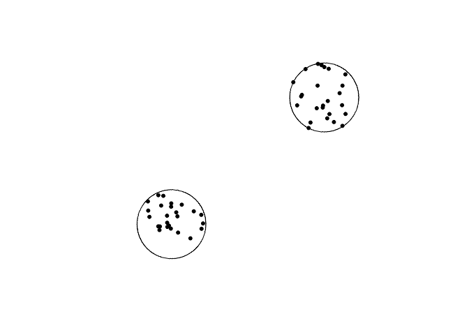
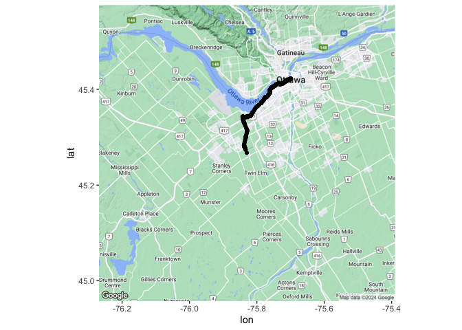
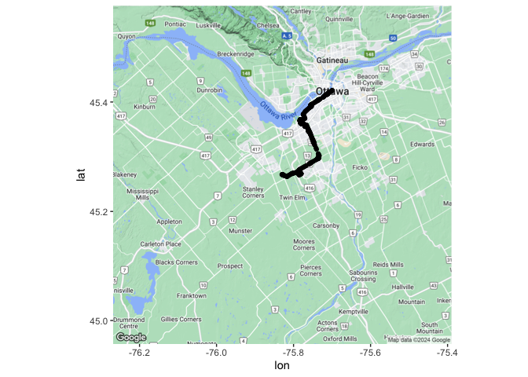

https://stackoverflow.com/questions/59775761/drawing-driving-routes-in-r

# Setup data frame to be filled in

Cities and stations

1. Ottawa
    * Fallowfield Station
    * Millennium / Trim
2. Montreal 
    * Brossard Station
    * Rivière-des-Prairies Station
3. Toronto
    * Vaughan Metropolitan Centre Stations
    * Scarborough GO Station
4. Vancouver
    * Surrey Central Station
    * Edgemont Village Exchange
5. Edmonton
    * Heritage Valley Station
    * Nakî Transit Centre & Park and Ride
6. Calgary
    * North Pointe Transit Terminal
    * McKenzie Towne


```r
city <- c("Ottawa", "Montreal", "Toronto", "Vancouver", "Edmonton", "Calgary")
stations <- c("Fallowfield Station, Ottawa, ON", "Millennium / Trim Station, Ottawa, ON", "Brossard Station, Montreal, QC", "Rivière-des-Prairies Station, Montreal, QC", "Vaughan Metropolitan Centre Stations, Toronto, ON", "Scarborough GO Station, Toronto, ON", "Surrey Central Station, Vancouver, BC", "Edgemont Village Exchange, Vancouver, BC", "Heritage Valley Station, Edmonton, AB", "Nakî Transit Centre & Park and Ride, Edmonton, AB", "North Pointe Transit Terminal, Calgary, AB", "McKenzie Towne, Calgary, AB")
```

# Ottawa
## Fallowfield Station

### Draw buffer and select points


```r
departure <- "Fallowfield, Ottawa, Canada"

map <- get_googlemap(departure)
```

```
## ℹ <https://maps.googleapis.com/maps/api/staticmap?center=Fallowfield,%20Ottawa,%20Canada&zoom=10&size=640x640&scale=2&maptype=terrain&key=xxx>
```

```
## ℹ <https://maps.googleapis.com/maps/api/geocode/json?address=Fallowfield,+Ottawa,+Canada&key=xxx>
```

```r
stations_list <- c("The Angel, Bermondsey")

stations <- geocode(location = stations, output = "more", source = "google")
```

```
## ℹ <https://maps.googleapis.com/maps/api/geocode/json?address=Fallowfield+Station,+Ottawa,+ON&key=xxx>
```

```
## ℹ <https://maps.googleapis.com/maps/api/geocode/json?address=Millennium+/+Trim+Station,+Ottawa,+ON&key=xxx>
```

```
## Warning: "Millennium / Trim..." not uniquely geocoded, using "millennium / trim, ottawa,
## on k4a 3r2, canada"
```

```
## ℹ <https://maps.googleapis.com/maps/api/geocode/json?address=Brossard+Station,+Montreal,+QC&key=xxx>
```

```
## ℹ <https://maps.googleapis.com/maps/api/geocode/json?address=Rivi%C3%A8re-des-Prairies+Station,+Montreal,+QC&key=xxx>
```

```
## ℹ <https://maps.googleapis.com/maps/api/geocode/json?address=Vaughan+Metropolitan+Centre+Stations,+Toronto,+ON&key=xxx>
```

```
## ℹ <https://maps.googleapis.com/maps/api/geocode/json?address=Scarborough+GO+Station,+Toronto,+ON&key=xxx>
```

```
## ℹ <https://maps.googleapis.com/maps/api/geocode/json?address=Surrey+Central+Station,+Vancouver,+BC&key=xxx>
```

```
## ℹ <https://maps.googleapis.com/maps/api/geocode/json?address=Edgemont+Village+Exchange,+Vancouver,+BC&key=xxx>
```

```
## Warning: "Edgemont Village ..." not uniquely geocoded, using "3902 ruby ave, north
## vancouver, bc v7r 4b2, canada"
```

```
## ℹ <https://maps.googleapis.com/maps/api/geocode/json?address=Heritage+Valley+Station,+Edmonton,+AB&key=xxx>
```

```
## ℹ <https://maps.googleapis.com/maps/api/geocode/json?address=Nak%C3%AE+Transit+Centre+&+Park+and+Ride,+Edmonton,+AB&key=xxx>
```

```
## ℹ <https://maps.googleapis.com/maps/api/geocode/json?address=North+Pointe+Transit+Terminal,+Calgary,+AB&key=xxx>
```

```
## ℹ <https://maps.googleapis.com/maps/api/geocode/json?address=McKenzie+Towne,+Calgary,+AB&key=xxx>
```

```r
stations_sf <- stations %>%
                st_as_sf(coords = c("lon", "lat"), crs = 4326)

stations_buffer = st_buffer(stations_sf, 5000)
```

#### Interactive map view of buffers


```r
mapview(stations_buffer)
```

```{=html}
<div class="leaflet html-widget html-fill-item" id="htmlwidget-2e8bd96e950bc562c209" style="width:672px;height:480px;"></div>
<script type="application/json" data-for="htmlwidget-2e8bd96e950bc562c209">{"x":{"options":{"minZoom":1,"maxZoom":52,"crs":{"crsClass":"L.CRS.EPSG3857","code":null,"proj4def":null,"projectedBounds":null,"options":{}},"preferCanvas":false,"bounceAtZoomLimits":false,"maxBounds":[[[-90,-370]],[[90,370]]]},"calls":[{"method":"addProviderTiles","args":["CartoDB.Positron","CartoDB.Positron","CartoDB.Positron",{"errorTileUrl":"","noWrap":false,"detectRetina":false,"pane":"tilePane"}]},{"method":"addProviderTiles","args":["CartoDB.DarkMatter","CartoDB.DarkMatter","CartoDB.DarkMatter",{"errorTileUrl":"","noWrap":false,"detectRetina":false,"pane":"tilePane"}]},{"method":"addProviderTiles","args":["OpenStreetMap","OpenStreetMap","OpenStreetMap",{"errorTileUrl":"","noWrap":false,"detectRetina":false,"pane":"tilePane"}]},{"method":"addProviderTiles","args":["Esri.WorldImagery","Esri.WorldImagery","Esri.WorldImagery",{"errorTileUrl":"","noWrap":false,"detectRetina":false,"pane":"tilePane"}]},{"method":"addProviderTiles","args":["OpenTopoMap","OpenTopoMap","OpenTopoMap",{"errorTileUrl":"","noWrap":false,"detectRetina":false,"pane":"tilePane"}]},{"method":"createMapPane","args":["polygon",420]},{"method":"addPolygons","args":[[[[{"lng":[-75.69033657591565,-75.69108867947882,-75.69184077936046,-75.69155398430719,-75.69230609430724,-75.69287017439086,-75.69279848025383,-75.69298650735062,-75.69277142413971,-75.69352354057597,-75.69408762548635,-75.69401593599159,-75.69420396469725,-75.69398889541344,-75.69474101828526,-75.69530510802187,-75.6952334231698,-75.69542145348417,-75.69520639812865,-75.69595852743538,-75.69671065305801,-75.6964239322856,-75.69717606802658,-75.69792820008281,-75.69764149788456,-75.69839364005912,-75.69914577854833,-75.69970987999646,-75.69963821252577,-75.69982624674381,-75.69961124353328,-75.70111552968987,-75.7008288784493,-75.70158102980244,-75.70233317746855,-75.70308532144725,-75.70279870259158,-75.70355085668804,-75.7050551538164,-75.70543122579311,-75.70528793713943,-75.70566401164544,-75.70552072418606,-75.70627287733444,-75.70702502679337,-75.70777717256246,-75.70749063229252,-75.70899494037414,-75.71087530471469,-75.71073206226134,-75.71110813581278,-75.71096489455469,-75.71171704579271,-75.71246919333845,-75.71322133719154,-75.7139734773516,-75.71472561381823,-75.71491364735775,-75.71484204400633,-75.71503007817805,-75.71495847512561,-75.71533454450257,-75.715710612956,-75.71608668048583,-75.71594348304576,-75.71744775773803,-75.71895201764943,-75.72045626277693,-75.72196049311748,-75.72346470866795,-75.72317844512312,-75.72393056116226,-75.72468267350287,-75.72543478214456,-75.72618688708694,-75.72640154415724,-75.72658956722509,-75.72666111759112,-75.72797726654839,-75.72948142290799,-75.7309855644622,-75.73248969120793,-75.73399380314214,-75.73549790026175,-75.73578393379736,-75.73653596298792,-75.73728798847351,-75.73804001025381,-75.7387920283284,-75.73954404269692,-75.73982999815362,-75.74208597757912,-75.74283796330597,-75.7431238544978,-75.74387582270326,-75.74462778720006,-75.74537974798787,-75.74559412938864,-75.74578211641601,-75.74585357489336,-75.74716947154957,-75.74792140739444,-75.74817147439298,-75.74826546460186,-75.74830118767993,-75.74895911600775,-75.74971103061742,-75.75046294151551,-75.75074868136036,-75.75225246439344,-75.75253816760531,-75.75329003973951,-75.75404190816032,-75.75430972084311,-75.75435671168675,-75.75437456553024,-75.75583127281415,-75.75611662383295,-75.75611735804343,-75.75611763697452,-75.75686873241604,-75.75762055835285,-75.75790615167372,-75.75865796008208,-75.75880074646024,-75.75917664581773,-75.7593194264923,-75.75969532146753,-75.76044710863054,-75.76069695126724,-75.76079092289052,-75.7608266139174,-75.7614844121434,-75.7622361780594,-75.76252167531362,-75.76327342369927,-75.76355889814188,-75.76431062899692,-75.7644533559377,-75.76482921651764,-75.76497193775589,-75.76534779395307,-75.76609950355784,-75.76638491856841,-75.76713661064149,-75.7674220028436,-75.76817367738471,-75.76845904677938,-75.76921070378826,-75.7694938211411,-75.76949969333978,-75.76950192257431,-75.77024768985281,-75.77051518116259,-75.77056215769707,-75.77057999011605,-75.77128463557908,-75.77155210550961,-75.77159908094826,-75.77161691194198,-75.77232154096774,-75.7726068191424,-75.77335840601951,-75.77364366139162,-75.7743952307351,-75.77468046330563,-75.77543201511519,-75.77571722488511,-75.77646875916049,-75.77675394613081,-75.77696783045923,-75.77715570740445,-75.77722700019388,-75.77779062704339,-75.7780757822264,-75.77882726762356,-75.77911240000965,-75.77925496283235,-75.77963069377721,-75.779773250901,-75.78014897746219,-75.78043407806557,-75.78118551458471,-75.78147059239386,-75.78168439485388,-75.78187224736041,-75.78194351286095,-75.78250706639382,-75.78279211242484,-75.78293463207115,-75.78331032290603,-75.78345283685454,-75.78382852330566,-75.78411353756141,-75.78425604132049,-75.78463171648451,-75.78477421454623,-75.78514988532646,-75.7854348678098,-75.78557735568309,-75.78595301517652,-75.78609549735289,-75.78647115246251,-75.78675610317629,-75.7870410449089,-75.78779232472009,-75.78807724366712,-75.78861144248923,-75.78870534724231,-75.788740959159,-75.78939828928857,-75.78968316749288,-75.7899680367187,-75.79025289696645,-75.79100408649136,-75.79128892395843,-75.79185857196208,-75.79228578440214,-75.79266134670975,-75.7928037429182,-75.79317930084225,-75.7934640796271,-75.79374884943725,-75.79403361027312,-75.79431836213504,-75.79460310502347,-75.79488783893873,-75.79517256388124,-75.79592358032751,-75.79620828249878,-75.79677765992682,-75.79734700147138,-75.79791630713558,-75.79848557692247,-75.7987701983629,-75.79801931988901,-75.79830394615651,-75.79858856345585,-75.79887317178745,-75.79915777115164,-75.79944236154886,-75.79972694297946,-75.80001151544381,-75.80029607894235,-75.79954530708432,-75.79982987540961,-75.80039898516431,-75.80068352659445,-75.80002664642477,-75.80006221498159,-75.79996837493934,-75.80021735242357,-75.80050188971585,-75.80078641804424,-75.80107093740914,-75.80032026840594,-75.80060479259684,-75.80117381408978,-75.80042318271647,-75.80070769380717,-75.80099219593558,-75.80127668910205,-75.80052609535505,-75.8008105933467,-75.80109508237686,-75.80034451246668,-75.80062900632156,-75.80091349121533,-75.80035058200937,-75.8004217044174,-75.80023406841002,-75.80044743485847,-75.80073191561586,-75.8003566549622,-75.80049889542681,-75.8001236372853,-75.80026587895584,-75.80055035557677,-75.80017510683918,-75.80031734523553,-75.79994209900985,-75.80008433861202,-75.80036881109649,-75.79971214604456,-75.79974770598261,-75.79965389667137,-75.7999028138254,-75.80018728217335,-75.79943683142383,-75.79972130459431,-75.80000576880575,-75.79925534188365,-75.79953981091717,-75.79888319635445,-75.79891875586097,-75.79882495376249,-75.79935833279229,-75.79860793974095,-75.79889240945863,-75.79818892549925,-75.79820670536652,-75.79815980637302,-75.79842650099033,-75.79805131497596,-75.79819355233046,-75.79781836882714,-75.79796060738667,-75.79824507778719,-75.79749472864701,-75.79777920386734,-75.7971226573619,-75.79715821764148,-75.79706442526546,-75.79731334481029,-75.79693818075026,-75.79708042085511,-75.79670525930582,-75.79713197651623,-75.79638167128188,-75.79666615200118,-75.7959158568091,-75.7962003423464,-75.79545005719636,-75.79573454755119,-75.79498427244297,-75.79526876761486,-75.79456539422424,-75.79458317568213,-75.79453628405993,-75.79480300253671,-75.79414652959369,-75.79418209296892,-75.79408831110186,-75.79433725231605,-75.79368078815899,-75.7937163521362,-75.79362257152428,-75.79387151695219,-75.7932150615809,-75.79325062615999,-75.7931568468032,-75.79340579644443,-75.79270246070752,-75.7927202433693,-75.79267335425736,-75.79294009079207,-75.79218987592985,-75.79247439999442,-75.79172419517239,-75.7920087240508,-75.7912585292687,-75.79154306296049,-75.79079287821813,-75.7910774167228,-75.79032724201993,-75.78995215326971,-75.79009442949028,-75.78971934324991,-75.78986162067345,-75.78920522353316,-75.78924079404513,-75.78914702300712,-75.78939601417797,-75.78864585582382,-75.78893042253281,-75.78818027421771,-75.78780519866177,-75.78794748898322,-75.78757241593705,-75.78771470746098,-75.78705833341053,-75.78709390744741,-75.787000139708,-75.78724915555294,-75.78649902358681,-75.7867836184929,-75.78603349656539,-75.78547090267335,-75.78554205602303,-75.78535452512014,-75.78556798439105,-75.78481786877435,-75.78510248706307,-75.78435238148479,-75.78369603604654,-75.78373161592901,-75.78363785227714,-75.78388690904067,-75.78276175874313,-75.7829040841378,-75.78252903561663,-75.78267136221274,-75.78192126925813,-75.78220592949542,-75.78145584657901,-75.78070575993723,-75.78099043874282,-75.78024036213927,-75.77958404205569,-75.77961962950215,-75.77952586947248,-75.77977497918327,-75.77902490889323,-75.77836859433451,-75.77840418410165,-75.77831042486126,-75.77855955081657,-75.7778094868407,-75.77707113897776,-75.7770755880199,-75.77706386818681,-75.77734415364243,-75.77659409598137,-75.77584403459745,-75.77612878766061,-75.77537873631503,-75.77462868124724,-75.77425365231763,-75.77439604268962,-75.77402101626966,-75.77416340784144,-75.77266330661818,-75.77294811056032,-75.77219806812671,-75.77144802197255,-75.77088548491552,-75.77095669396023,-75.77076918200284,-75.77098280835592,-75.77023276852046,-75.76892018985849,-75.76899140698147,-75.76880389567417,-75.76901754626171,-75.76826750902671,-75.76751746807317,-75.76676742340149,-75.76705232428165,-75.76630228964942,-75.76406388294309,-75.76406833530467,-75.76405661581407,-75.76433711039262,-75.76358707464895,-75.76283703518916,-75.76208699201364,-75.76133694512275,-75.76096192028416,-75.76110442134491,-75.76072939901651,-75.76087190127465,-75.75937181643009,-75.75787171672968,-75.75639504158056,-75.75640395046287,-75.75638051107221,-75.75665668249648,-75.75590663340526,-75.75515658060183,-75.75440652408662,-75.75365646385997,-75.75290639992228,-75.75215633227393,-75.7514062609153,-75.75065618584675,-75.7499061070687,-75.74915602458151,-75.74840593838555,-75.74765584848122,-75.74690575486888,-75.74615565754893,-75.74540555652175,-75.74465545178771,-75.74390534334719,-75.74315523120059,-75.74240511534828,-75.74165499579063,-75.74090487252802,-75.74015474556086,-75.73940461488949,-75.7391905682547,-75.73900303242975,-75.73893168156999,-75.73836907012796,-75.73686876276551,-75.73536844059292,-75.73461827395379,-75.73436847234041,-75.73427469974627,-75.73423901302547,-75.73358260174307,-75.73283241395076,-75.73208222245795,-75.73133202726501,-75.73118925233643,-75.73081414991486,-75.73067136930349,-75.73029626251936,-75.72879582613521,-75.72804560239526,-75.72775998630888,-75.72700974512024,-75.72625950023402,-75.72550925165061,-75.72522358532946,-75.72372304957157,-75.72358019929133,-75.72320505960414,-75.72306220364003,-75.72268705959124,-75.72193676872214,-75.72118647415802,-75.72090072111378,-75.72015040910438,-75.71940009340082,-75.71911437364233,-75.71911419045597,-75.71911412068204,-75.71836397072033,-75.71761363387903,-75.71732780785707,-75.71657745357206,-75.71582709559469,-75.71554123308192,-75.71479085766164,-75.71404047854988,-75.713754579545,-75.71300418299111,-75.71278974252378,-75.71260214023027,-75.71253065809111,-75.71196784724836,-75.71121742956257,-75.71093147132092,-75.71018103619406,-75.70993080332316,-75.70983699716881,-75.70980124883887,-75.70914460264046,-75.70900160189906,-75.70862637079405,-75.70848336436617,-75.70735765520482,-75.70707161497523,-75.70632112383926,-75.70603506086221,-75.70528455228683,-75.70503422776902,-75.70494041243369,-75.70490465101112,-75.70424794054681,-75.70403336003413,-75.70384572537588,-75.70377419655412,-75.70321128861855,-75.70306822413065,-75.70269294758359,-75.70254987740796,-75.70217459650131,-75.70203152063782,-75.70165623537162,-75.70151315382016,-75.70113786419444,-75.70092323249142,-75.70073558475437,-75.70066403886882,-75.70010109169723,-75.69988644292931,-75.6996987908328,-75.69962723925886,-75.69906427900902,-75.69879594592598,-75.69874903167241,-75.69873114246519,-75.69802742612909,-75.69774118113733,-75.69699053305678,-75.69670426530881,-75.69595359979135,-75.69566730928622,-75.69552416065743,-75.69514881620195,-75.69500566188354,-75.69463031306888,-75.69434399080151,-75.69359327665615,-75.6933069316289,-75.69316375573835,-75.69278838696873,-75.69264520538789,-75.6922698322592,-75.69198345546516,-75.6912326926917,-75.69094629313514,-75.69066100337244,-75.69065807059087,-75.69065695178969,-75.68990909060567,-75.68962265927773,-75.68937202447626,-75.68927817174757,-75.68924236599794,-75.68858539378292,-75.68829893068079,-75.68804826807597,-75.68795441144808,-75.68791860172648,-75.68726160221725,-75.68697510733811,-75.68668860344849,-75.68593771590247,-75.68565118924346,-75.68536465357283,-75.68514974590578,-75.68496201398553,-75.68489037611002,-75.68432717639062,-75.68375403246858,-75.68353909420281,-75.68335135104364,-75.68327970296831,-75.68271646953225,-75.68242986127687,-75.68214324400685,-75.68185661772182,-75.68171330119856,-75.68133778701115,-75.68119446479362,-75.68081894624707,-75.68053228816913,-75.67938556568828,-75.67863445702756,-75.67834774009975,-75.67806101415313,-75.67777427918732,-75.67748753520192,-75.67720078219656,-75.67691402017084,-75.67662724912439,-75.67634046905681,-75.67605367996772,-75.67576688185675,-75.67548007472348,-75.67519325856756,-75.67490643338857,-75.67461959918616,-75.67433275595991,-75.67404590370948,-75.67375904243443,-75.67347217213441,-75.67384785082153,-75.67370441572946,-75.67408009694111,-75.67364978845421,-75.67250219986873,-75.67320667067274,-75.67318873926206,-75.67323570392139,-75.67296672933666,-75.67267981436771,-75.67239289037101,-75.6721059573462,-75.67276350852246,-75.67272764276602,-75.6728215786341,-75.67228357858747,-75.67199663225034,-75.67237239494936,-75.67222892183852,-75.67260468706347,-75.67246121513904,-75.67217426451815,-75.67188730486752,-75.67226308639391,-75.67211960662632,-75.67249539067892,-75.67206494816308,-75.67177797519776,-75.67252957499109,-75.67224260677216,-75.67195562952229,-75.67233144181979,-75.67218795325263,-75.67256376807684,-75.67242028069641,-75.67213329916198,-75.67250912340221,-75.67236563269284,-75.67274145945997,-75.67259796993743,-75.67231098411847,-75.67268682030222,-75.67254332745063,-75.67291916616144,-75.6727756744968,-75.67248868439334,-75.67286453252139,-75.67272103752761,-75.6730968881829,-75.67295339437617,-75.67266639998822,-75.67323018975368,-75.67315844232931,-75.67334637265351,-75.67313112957713,-75.67284413090469,-75.67359587402474,-75.67330888010127,-75.67302187714439,-75.67377364415771,-75.67348664595023,-75.67414445113499,-75.67410857723144,-75.67420254938655,-75.67395142961709,-75.6736644271256,-75.67441622814567,-75.67412923040447,-75.67488104153666,-75.67459404854621,-75.6749699596276,-75.6748264631909,-75.67520237680043,-75.67477188427797,-75.67552372942113,-75.67523673689921,-75.67598859215569,-75.67570160438586,-75.67626550375778,-75.67619375798876,-75.67638172484858,-75.67616648673867,-75.67654242493978,-75.67639893349008,-75.67677487421969,-75.67663138395827,-75.67634439665922,-75.67709629604539,-75.67680931349982,-75.67756122300072,-75.67727424520908,-75.67802616482496,-75.67773919178771,-75.67849112151883,-75.67820415323639,-75.67895609308299,-75.67866912955589,-75.67942107951815,-75.67913412074681,-75.67988608082501,-75.6795991268099,-75.68035109700429,-75.68006414774585,-75.68081612805663,-75.68052918355538,-75.68128117398278,-75.68099423423914,-75.68174623478342,-75.68212223367688,-75.68197877076189,-75.68235477218455,-75.68221131045925,-75.68277531604238,-75.68270358691906,-75.6828915891826,-75.68267640101095,-75.6834284181126,-75.68314150643924,-75.68389353365822,-75.6836066267448,-75.68435866408134,-75.68407176192835,-75.68557291549496,-75.68557179487327,-75.68557473253732,-75.68528896956295,-75.68604102345682,-75.68575414462281,-75.68650620863471,-75.68707025422923,-75.68699853914528,-75.68718655474586,-75.68697140869313,-75.6877234791439,-75.68743662363278,-75.68884677168091,-75.68881091734075,-75.68890492696622,-75.68865394414186,-75.68940603114906,-75.68978207327244,-75.68963866175932,-75.69001470641226,-75.68987129609046,-75.6906233895352,-75.69033657591565],"lat":[45.33114257943345,45.33123849234023,45.33133439951671,45.33189659235293,45.33199249754175,45.33206442267283,45.33220497343006,45.33222894799135,45.33265060315077,45.33274650062123,45.33281841996347,45.3329589740492,45.33298294668086,45.33340461182579,45.33350050157746,45.33357241513057,45.3337129725447,45.33373694324663,45.33415861837681,45.33425450040929,45.33435037671118,45.33491262280268,45.33500849711554,45.33510436569773,45.33566662510221,45.33576249169503,45.33585835255711,45.3359302444429,45.33607081277702,45.33609477625642,45.33651648414659,45.33670818469892,45.33727047446905,45.33736631988965,45.3374621595794,45.33755799353839,45.33812030036047,45.33821613232877,45.3384077790729,45.3384556871772,45.33873684931967,45.33878475692617,45.33906592146137,45.33916173424602,45.33925754129987,45.33935334262296,45.33991568728484,45.34010728021666,45.340346739146,45.34062792207583,45.34067581049825,45.34095699582072,45.34105277023659,45.34114853892177,45.3412443018763,45.34134005910025,45.34143581059369,45.34145974757167,45.34160034568539,45.34162428253877,45.34176488125065,45.3418127543501,45.34186062601692,45.34190849625114,45.34218969757136,45.34238116791888,45.34257261534479,45.34276403984957,45.34295544143375,45.34314682009784,45.34370926447288,45.34380494894488,45.34390062768683,45.34399630069881,45.34409196798087,45.34367012294894,45.34369403817402,45.34355342365942,45.34372081857455,45.3439121055633,45.3441033696345,45.34429461078864,45.34448582902623,45.3446770243478,45.34411452607718,45.3442101114132,45.34430569102062,45.34440126489947,45.34449683304984,45.34459239547179,45.34402988438424,45.3443165260901,45.34441206186938,45.34384954170088,45.34394506802299,45.34404058861748,45.3441361034844,45.34371420879967,45.34373808592236,45.34359745485767,45.3437645830626,45.34386007701911,45.343367862196,45.34337979813015,45.3433094820336,45.34339303065936,45.34348850943419,45.34358398248223,45.34302144627864,45.34321236774092,45.3426498299244,45.34274527833953,45.34284072102854,45.34231334014375,45.34231930490337,45.3422841463457,45.34246904234908,45.34190705066493,45.34190714384943,45.34190659449578,45.34200191937162,45.34209733170649,45.34153478906036,45.34163019194511,45.34134892095053,45.34139661931486,45.34111534884978,45.34116304485178,45.3412584325622,45.34076620787504,45.34077813052902,45.34070781302356,45.34079126868956,45.34088664122685,45.34032409748808,45.34041946057765,45.33985691895899,45.33995227260146,45.33967100212204,45.33971867586613,45.33943740591698,45.33948507729951,45.33958041577187,45.33901787467305,45.33911320369982,45.3385506647233,45.3386459843051,45.33808344745149,45.33817875758895,45.33762061763878,45.33762136219786,45.33761696741771,45.3377115235526,45.33718414906328,45.33719010494863,45.33715494681746,45.3372442821973,45.33671690969991,45.33672286499509,45.33668770699673,45.33677703352426,45.33621450516841,45.33630977753472,45.33574725130485,45.33584251422992,45.33527999012664,45.3353752436111,45.33481272163501,45.33490796567948,45.3343454458312,45.33392355978192,45.3339473682723,45.33380674008765,45.33387816271645,45.33331565084359,45.33341087229198,45.33284836254841,45.33256710986939,45.3326147156603,45.33233346351376,45.33238106694536,45.33181856517934,45.33191376403568,45.33135126440042,45.33092939351174,45.33095319070607,45.33081256757523,45.33088395631673,45.33032146466113,45.33004022102647,45.33008780894642,45.32980656584483,45.32985415140612,45.32929166773142,45.32901042808735,45.32905800943218,45.3287767703214,45.32882434930783,45.32826187361527,45.3279806379624,45.32802821273286,45.3277469776135,45.3277945500258,45.32723208231661,45.3266696204569,45.32676475356399,45.32620229383941,45.32514769762312,45.32515958752472,45.32508928178352,45.32517250818763,45.32461006229913,45.32404762226097,45.32348518807326,45.32358028746417,45.32301785541384,45.32189300886576,45.32104938931364,45.32109692851198,45.3208157239921,45.32086326083368,45.32030085432633,45.3197384536705,45.3191760588663,45.31861366991384,45.31805128681324,45.3174889095646,45.31692653816803,45.31702158158416,45.31645921232878,45.31533449137547,45.31420979383281,45.31308511970171,45.31196046898302,45.31139815240363,45.31130314609081,45.31074083907436,45.31017853791132,45.30961624260178,45.30905395314588,45.30849166954371,45.30792939179538,45.307367119901,45.3068048538607,45.30670987151042,45.30614761503283,45.30502311964017,45.30446088072532,45.30437777946502,45.30430750041789,45.30429562851042,45.30380367814739,45.3032414546496,45.30267923700636,45.30211702521777,45.30202206111584,45.30145985888977,45.30033547200195,45.30024051331547,45.29967833236145,45.29911615726234,45.29855398801826,45.29845903474706,45.29789687506539,45.29733472123883,45.29723976967554,45.29667762541138,45.2961154870024,45.29604427514595,45.29590374215367,45.29588000438661,45.29545840830058,45.29489628530921,45.29484881194897,45.29456775357578,45.29452027971585,45.29423922373326,45.29367711615958,45.2936296436535,45.29334859298916,45.29330111998344,45.29302007170969,45.29245797955375,45.29237490322701,45.29230464252468,45.29229277417935,45.29180095223016,45.29123887549201,45.29114393247076,45.29058186529492,45.29001980397462,45.28992486266228,45.28936281090426,45.28927973581996,45.28920948016736,45.28919761199956,45.28814378905845,45.28804884745776,45.28748682067993,45.287397811224,45.28736268496201,45.28735675083451,45.28682985986654,45.28678238778204,45.28650138229682,45.2864539097131,45.28617290661847,45.28561090482089,45.28551596093595,45.28495396870068,45.28487089136627,45.28480064315401,45.28478877466485,45.28429704014626,45.28424956692022,45.28396857870629,45.28392110498119,45.28307815190285,45.28298320573564,45.28242124804299,45.28232629987987,45.28176435174957,45.28166940159075,45.28110746302283,45.28101251086849,45.28045058186297,45.28036156251473,45.2803264423635,45.28032050757657,45.27979370827022,45.27971062195536,45.27964038284214,45.27962851307014,45.27913684224478,45.27905375418435,45.27898351626644,45.27897164624508,45.27847998378687,45.27839689398105,45.27832665725844,45.27831478698775,45.27782313289671,45.27773410606783,45.27769898830723,45.27769305302161,45.27716628957451,45.2770713254512,45.27650945382049,45.27641448770304,45.27585262563487,45.27575765752347,45.27519580501785,45.27510083491272,45.27453899196968,45.27444401987099,45.27439653168379,45.27411561518858,45.27406812650306,45.2737872123985,45.27370410539152,45.27363387749962,45.27362200477168,45.27313041249547,45.2730354307096,45.27247362016211,45.27237863638342,45.27233114235635,45.27205024205909,45.27200274753388,45.27172184962733,45.27163873240126,45.2715685085589,45.27155663437112,45.27106507044154,45.27097007697748,45.27040829882626,45.27031330337012,45.27024205303722,45.27010161103658,45.27007786044486,45.26965653733369,45.26956153418554,45.26899977886841,45.2689047737287,45.26882163955566,45.26875142142187,45.26873954481313,45.26824802084342,45.26810549945953,45.26782463341371,45.26777712436301,45.26749626070796,45.26740124018617,45.26683952097562,45.26674449846315,45.26664947025095,45.26608776431274,45.26599273411018,45.26590957800746,45.26583936604618,45.26582748630467,45.26533600554243,45.26524096765021,45.26515780481909,45.26508759451694,45.26507571381423,45.26458424466588,45.2644891990844,45.26439563302352,45.26438685694448,45.2643853717253,45.26383248168423,45.26373742841392,45.26364236944417,45.26308071659865,45.26298565563991,45.2628905889818,45.26284305351548,45.26256223392581,45.26251469796233,45.26223388076355,45.26204372637213,45.26148210378601,45.26138702175244,45.26129193401962,45.26122061447981,45.26108021229927,45.26105643863889,45.26063523498776,45.2605401395679,45.26037370886927,45.2602333109356,45.26020953392869,45.25978834301814,45.25969323421248,45.25959811970758,45.25950299950338,45.25894142787973,45.25884630568878,45.25856239151553,45.25855361723647,45.25855213064217,45.25799935399935,45.25790421272438,45.25780906575015,45.25771391307658,45.2576187547036,45.25757117337982,45.25729040846894,45.2572428266488,45.25696206412904,45.25677172631401,45.25658136570117,45.25639395720614,45.25637641029007,45.25637343537757,45.25582948392549,45.25573428738561,45.25563908514616,45.25554387720708,45.25544866356831,45.25535344422978,45.25525821919143,45.25516298845319,45.25506775201501,45.25497250987681,45.25487726203854,45.25478200850013,45.25468674926152,45.25459148432265,45.25449621368344,45.25440093734385,45.2543056553038,45.25421036756322,45.25411507412208,45.25401977498029,45.25392447013779,45.25382915959452,45.25373384335041,45.25363852140539,45.25405958050422,45.25403574842974,45.25417610196096,45.25410460290205,45.25391392306653,45.25372322042557,45.2536278605529,45.25411908207033,45.25410716127836,45.25417733608802,45.25409388764264,45.25399851264532,45.25390313194613,45.253807745545,45.25408843848615,45.25404074221679,45.25432143568852,45.25427373706304,45.25408292830539,45.25398751537301,45.25454889367009,45.25445347131203,45.25435804325122,45.25426260948765,45.25482398245779,45.25463309037384,45.25491377532594,45.25486604780937,45.25514673329106,45.2550990034175,45.2550035393928,45.25490806966459,45.25546943569766,45.25537395654057,45.25527847167963,45.25583969905131,45.25583967573796,45.25583981279054,45.25574434181318,45.25564884181833,45.25621020463223,45.25611469520673,45.25601918007672,45.25658054127876,45.25648501671722,45.25638948645085,45.25695084603952,45.25685530634072,45.25727632706941,45.25725244055432,45.25739278129429,45.25732111891053,45.25722556407328,45.25778692415905,45.25769135988787,45.25818255149105,45.25817060514814,45.25824077568388,45.25815714837933,45.25843782980338,45.2583900398785,45.25867072183015,45.25852734069924,45.25908870338792,45.25899310510469,45.25955446990257,45.25945886218268,45.25995005790656,45.2599381061323,45.26000827725662,45.25992461193199,45.26034563814551,45.26032173226498,45.26046207483277,45.26039035435139,45.26067103918257,45.26062322281199,45.26090390816992,45.26085608943965,45.26113677532425,45.26108895423422,45.26136964064541,45.26132181719554,45.26174284814937,45.26171893518962,45.26185927933736,45.26178753761783,45.26220857015085,45.26218465483105,45.26232499950513,45.26225325070529,45.262779543858,45.2627735644277,45.26280865080571,45.26271895645668,45.26328033810631,45.26318465487078,45.26374603862411,45.26365034594636,45.2642117318028,45.2644924269196,45.26444457563958,45.26472527128199,45.26467741764111,45.26523881143599,45.26514309613783,45.26570449203433,45.26598519217093,45.26593732957978,45.26621803024162,45.26617016528922,45.26673156912207,45.26663583119944,45.26719723713242,45.26775645587428,45.2677560818577,45.26775827488372,45.26766289779628,45.26822431166348,45.26871555358345,45.26870358341831,45.26877376114173,45.26868996707824,45.26925138887841,45.26974263773944,45.26973066592628,45.26980084464125,45.26971703904137,45.27027846877328,45.27083990433903,45.27074411368172,45.27130555134412,45.27186699484,45.27228808129006,45.27226413016371,45.27240449280929,45.27233263658698,45.27345554526949,45.27387664204064,45.2738526866825,45.27399305276835,45.27392118385031,45.27448264903533,45.27504412005285,45.27560559690277,45.27588633751485,45.27583841657445,45.27611915770983,45.27607123440595,45.27663271918117,45.27887871660003,45.27878284700775,45.2793443572013,45.27990587322606,45.28046739508192,45.28102892276876,45.28159045628649,45.28215199563498,45.28271354081412,45.28327509182381,45.28383664866393,45.28439821133437,45.28495977983502,45.28552135416577,45.2860829343265,45.28664452031711,45.28720611213749,45.28776770978752,45.28832931326708,45.28889092257609,45.28893889175963,45.28921969953583,45.28926766822517,45.29011010310488,45.2923566602381,45.2924466169764,45.29248172039095,45.29248771734269,45.29301427151258,45.29357593494049,45.29413760419712,45.29469927928237,45.29478324715787,45.29485345736281,45.29486545247451,45.29591861735484,45.29648031366944,45.29652829860402,45.29680914988297,45.29685713432305,45.29713798799511,45.29769969971049,45.29826141725411,45.29830940494383,45.29859026683729,45.29863825403243,45.29948085126329,45.30004259003564,45.30013856949473,45.30070031783962,45.30126207201248,45.30131006334037,45.30159094354843,45.3016389343816,45.30191981698281,45.30248158655615,45.30252957876689,45.3028104666752,45.30285845839115,45.3031393486926,45.30370113366636,45.30374912675988,45.30403002236839,45.30407801496705,45.30435891296872,45.30492071334283,45.30496870731906,45.30524961062775,45.30529760410905,45.30557850981089,45.30614032558532,45.30621231733687,45.30635277289323,45.30637676966219,45.30679813921885,45.30735997039353,45.30745596044498,45.30801780119232,45.30857964776719,45.30867563958348,45.30923749573102,45.30932148715044,45.30939171998826,45.30940371846311,45.30989535128699,45.3104572228347,45.31055321443487,45.31111509555526,45.31121108517446,45.31177297586751,45.31182097040231,45.31210191887043,45.31214991290992,45.31299276986439,45.31308875926617,45.31365067493201,45.31374666235216,45.31430858759063,45.31438057720629,45.31452106012866,45.3145450561854,45.31496650784005,45.31501450028411,45.31529547081126,45.31534346275976,45.31562443568008,45.31618638589131,45.31628237111044,45.3168443308943,45.31694031413095,45.31750228348742,45.31759826474141,45.31816024367045,45.31825622294158,45.31881821144318,45.31891418873124,45.3194761868054,45.31957216211018,45.32013416975686,45.3202301430782,45.32079216029739,45.32088813163506,45.32145015842673,45.32154612778055,45.32210816414469,45.32220413151446,45.32276617745105,45.32286214283656,45.32291012338099,45.32319115134313,45.32323913139142,45.32352016174666,45.32359213053778,45.32373264696383,45.32375663607876,45.3241781882445,45.32427414393175,45.32483622232991,45.32493217603217,45.32549426400265,45.32559021571972,45.32615231326249,45.32634383222624,45.32634602796038,45.32634640273056,45.32690631785536,45.3270022598718,45.327564380303,45.32766032033353,45.32773227159627,45.32787280425262,45.32789678752462,45.32831838838133,45.32841432069583,45.32897646401497,45.32915632867971,45.32922659788177,45.32923858820166,45.32973047557566,45.32982639818695,45.32987435734381,45.33015544065425,45.33020339931436,45.33048448501779,45.3305803999119,45.33114257943345]}]],[[{"lng":[-75.43800121224915,-75.43790672935302,-75.4378702010199,-75.43720881767827,-75.43569707410779,-75.43540480247778,-75.43464891152344,-75.43389301701612,-75.43360070850113,-75.43208888115183,-75.43179653575055,-75.43104060290941,-75.43089441983575,-75.43051644862375,-75.43037025978782,-75.42999228422832,-75.4292363304464,-75.42901702730605,-75.42882803571101,-75.42875493264788,-75.42818795393666,-75.42743197921571,-75.42713953698721,-75.42638354487779,-75.42623731338921,-75.42585931254385,-75.42571307529218,-75.42533507009982,-75.42457905705399,-75.42428655488116,-75.423530524448,-75.42331113139174,-75.42312212063422,-75.42304898759863,-75.42248195140095,-75.42233567841197,-75.42195764971183,-75.42181137095898,-75.42067726915903,-75.4203846839811,-75.41962859784203,-75.41933598960695,-75.41857988608234,-75.41828725478913,-75.41753113387927,-75.41723847952697,-75.41648234123217,-75.41618966381981,-75.41543350814038,-75.41514080766699,-75.41438463460324,-75.41409191106786,-75.4133357206201,-75.41304297402174,-75.41228676619029,-75.41184760823832,-75.41146949261307,-75.41132309855708,-75.41094497858596,-75.41072537798762,-75.41053631507467,-75.41046311285709,-75.40989592019498,-75.40960309517759,-75.4088468213544,-75.40855397326942,-75.4084075457674,-75.40802939714615,-75.40788296387692,-75.40750481091,-75.40721193053024,-75.40645560809871,-75.40616270464865,-75.40594302100568,-75.40575393378823,-75.40568070388854,-75.40511343831356,-75.40482050256415,-75.40467403122877,-75.40429584268996,-75.40414936558626,-75.40377117270191,-75.40347820465026,-75.40272180238387,-75.40198930726088,-75.40161108749483,-75.40146457808575,-75.40108635397421,-75.40079332130949,-75.40050027941284,-75.39974380084576,-75.3994507358702,-75.39893784994561,-75.39874872023178,-75.39867544764013,-75.39810805457668,-75.39781494805318,-75.39752183229507,-75.39722870730191,-75.39647213858153,-75.39617899050454,-75.39529949085494,-75.3945428632056,-75.39424966433184,-75.39395645621998,-75.39366323886962,-75.39337001228036,-75.39307677645179,-75.39278353138354,-75.39249027707521,-75.39173354893866,-75.39114698489568,-75.3905603838862,-75.38997374590706,-75.38938707095508,-75.3890937196133,-75.38947214646355,-75.38932547078983,-75.389178792805,-75.38880035902713,-75.38821361012003,-75.3889705045048,-75.38867713003941,-75.38838374632843,-75.38809035337141,-75.38779695116801,-75.38750353971781,-75.38721011902041,-75.38691668907541,-75.38767367693289,-75.38679337318644,-75.38649992010717,-75.3868784404316,-75.38673171388865,-75.38711023679591,-75.38696351140581,-75.38667005368865,-75.38637658672187,-75.38608311050501,-75.38679288406034,-75.38677454230188,-75.38682186048277,-75.38654673058193,-75.38595975961982,-75.38662224833593,-75.38658556293842,-75.38668020417964,-75.3864234038661,-75.38612990912038,-75.38583640512297,-75.38659357292597,-75.38630007354102,-75.38600656490394,-75.38657445923748,-75.38650108323225,-75.38669038176886,-75.38647025288331,-75.38617673960654,-75.38655534815057,-75.38640859150887,-75.38678720263714,-75.38664044714882,-75.38605340206252,-75.38681065633912,-75.38651713378296,-75.38689576653157,-75.38674900525029,-75.38712764058353,-75.38698088045581,-75.38668735325993,-75.38706599811204,-75.38691923451096,-75.38729788194789,-75.38715111950046,-75.38685758766485,-75.38756756873427,-75.38754922349993,-75.3875965555151,-75.38732137347465,-75.38702783699931,-75.38778517423988,-75.38749164237996,-75.38787031661185,-75.38772355067897,-75.38810222749612,-75.38766192621796,-75.3884192980118,-75.38812576612884,-75.38869380306149,-75.38862042124562,-75.38880976731556,-75.38858962099822,-75.38829608447634,-75.38905349082677,-75.38875995892207,-75.38951737561523,-75.38922384832819,-75.38960256228761,-75.38945579864158,-75.38983451518683,-75.38968775269535,-75.38939422077021,-75.39015167202432,-75.38985814471769,-75.39061560631576,-75.39032208362812,-75.3910795555704,-75.39078603750221,-75.39151984852094,-75.39151067635225,-75.39153434763381,-75.39125000634067,-75.39191281258634,-75.39187612427223,-75.39197081087482,-75.39171399014418,-75.39228211770764,-75.39220874165633,-75.39239811793662,-75.39217798891349,-75.39274612423587,-75.39267274933985,-75.39286212820645,-75.3926420026493,-75.39321014573078,-75.39313677199017,-75.39332615344313,-75.39310603135229,-75.39367418219307,-75.39360080960799,-75.39379019364738,-75.39357007502319,-75.39413823362345,-75.394064862194,-75.39425424881989,-75.3940341336627,-75.3946969942227,-75.39466030937506,-75.39475500373679,-75.39449820727154,-75.39525540241888,-75.39525525912208,-75.39525562902604,-75.39496229585041,-75.39571987124839,-75.39542639940002,-75.39618398514493,-75.39589051792106,-75.39664811401317,-75.39702691073369,-75.3968801840619,-75.39725898336921,-75.39711225785381,-75.3976804603636,-75.39760709934107,-75.39779650060342,-75.39757641666758,-75.39833402991947,-75.39804059045514,-75.39879821405471,-75.39850477921725,-75.39926241316473,-75.39964122881243,-75.39949451833552,-75.39987333657018,-75.39972662725026,-75.40048426800946,-75.40019085631197,-75.40094850741933,-75.40132733164663,-75.40118063274066,-75.40155945955499,-75.40141276180634,-75.40217041972478,-75.40187703117124,-75.40263469943807,-75.40301353224477,-75.40286684491173,-75.40324568030553,-75.40309899413018,-75.40385666920743,-75.4035633038018,-75.40432098922771,-75.40507867111472,-75.40478532422846,-75.40554301646414,-75.40620599426683,-75.4061693285103,-75.40626403962075,-75.40600737679496,-75.40676507583974,-75.4073333478001,-75.40726002033901,-75.40744944475132,-75.40722946150161,-75.40798716735486,-75.40855544442115,-75.40848212159102,-75.40867154770525,-75.40845157834873,-75.40920929100977,-75.40891600432664,-75.41043144680481,-75.41118916273093,-75.41089590846551,-75.41165363474026,-75.41241135747225,-75.41211812173579,-75.41287585481641,-75.41434395257635,-75.41432562758607,-75.41437298541109,-75.4140981070336,-75.41485584337539,-75.4156135761728,-75.41599244124221,-75.41584585348168,-75.41622472113812,-75.41607813453784,-75.4168358741385,-75.41797247689166,-75.41782590534537,-75.41820477463028,-75.41805820424456,-75.41881594710176,-75.41957368641249,-75.42033142217632,-75.42003831614979,-75.42079606226122,-75.42231154384105,-75.42306335951412,-75.42306107002025,-75.42306698981569,-75.42277621961286,-75.42353396542759,-75.42429170769336,-75.42504944640977,-75.42580718157645,-75.42618604782851,-75.42603954577852,-75.42641841461716,-75.42627191372924,-75.4308183122368,-75.43052538690978,-75.4312831214601,-75.43204085245745,-75.4327985799014,-75.43355630379158,-75.43431402412759,-75.43507174090904,-75.43582945413553,-75.43658716380668,-75.43734486992209,-75.43810257248136,-75.43886027148412,-75.43961796692997,-75.4403756588185,-75.44113334714936,-75.44189103192211,-75.44264871313638,-75.44340639079178,-75.44416406488791,-75.44492173542439,-75.44567940240081,-75.44643706581682,-75.44719472567198,-75.44748734520975,-75.4505178934089,-75.45203314613246,-75.45232567302506,-75.45308328013988,-75.45384088369043,-75.45459848367636,-75.45535608009726,-75.45550231227698,-75.45588110567496,-75.45602733207066,-75.45716369648952,-75.45867883656558,-75.4589712337757,-75.45972878456124,-75.46048633177914,-75.46124387542896,-75.46153622170146,-75.46380878953221,-75.46410108486839,-75.46485858643756,-75.46561608443645,-75.46590834273961,-75.46742330022079,-75.46767899433793,-75.46777367718568,-75.46781020412277,-75.4684729809737,-75.46923043688302,-75.46948609859848,-75.46958077881544,-75.4696173011238,-75.4710374944209,-75.47132964163278,-75.47208705901946,-75.47284447283218,-75.47313658301617,-75.47389397935285,-75.47404002403519,-75.47441871738758,-75.47456475628879,-75.47494344527203,-75.47570082055692,-75.47599287059042,-75.4767502283981,-75.4769692494455,-75.47715858573217,-75.4772315907265,-75.47779959563883,-75.47855693239212,-75.47884892227977,-75.47960624155472,-75.47989820832159,-75.48065551011791,-75.48091096131324,-75.48100562226581,-75.48104211450035,-75.48170473808233,-75.48185069949871,-75.48222933684022,-75.48237529247702,-75.48275392544868,-75.48289987530603,-75.48327850390777,-75.4834244479858,-75.4838030722176,-75.48394901051641,-75.48432763037823,-75.48447356289799,-75.48485217838979,-75.48499810513057,-75.4853767162523,-75.48552263721425,-75.48590124396588,-75.48604715914912,-75.48642576153063,-75.48657167093526,-75.48695026894659,-75.48709617257276,-75.48747476621386,-75.48762066406171,-75.48799925333256,-75.4882180905732,-75.48840738226674,-75.48848032599327,-75.48904819712446,-75.48932172119798,-75.48936904288692,-75.48938727748296,-75.49009710032297,-75.49038883593585,-75.49114596292877,-75.49143767543161,-75.49158352822887,-75.49196207995779,-75.49210792697789,-75.49248647433629,-75.49274169500059,-75.4928363301801,-75.49287278948222,-75.49353523265059,-75.49382688972683,-75.49458395037513,-75.49487558434505,-75.49516720910663,-75.49592423837518,-75.49621584003214,-75.49636163740792,-75.49674014027497,-75.4968859318749,-75.49726443037125,-75.49755599971814,-75.49770178093931,-75.49808026811692,-75.4982260435627,-75.49860452636959,-75.49889606340932,-75.4990418284773,-75.49942029996573,-75.49956605925878,-75.49994452637648,-75.5002360311119,-75.50049109020543,-75.5005857035881,-75.50062213980915,-75.50128443039817,-75.50157590283219,-75.50186736606359,-75.50262423844093,-75.5029156785764,-75.50320710951044,-75.50349853124341,-75.50425535835085,-75.50454675699036,-75.50416835083182,-75.50431405017473,-75.50445974721767,-75.50483814642999,-75.5054208977111,-75.50617766565881,-75.5064690136096,-75.50676035236242,-75.50705168191767,-75.50734300227573,-75.50763431343702,-75.50839100833907,-75.50868229641416,-75.50926484497779,-75.51392390969386,-75.51421502311925,-75.5134586059454,-75.51374972406526,-75.51404083299703,-75.51433193274106,-75.51462302329774,-75.51491410466751,-75.51434684148492,-75.5144196129946,-75.51423052568524,-75.51473991624931,-75.51532204244616,-75.51475481820752,-75.51482758400104,-75.51463850967289,-75.51485680621126,-75.51514786022531,-75.51543890505445,-75.51506077480717,-75.51520629724703,-75.51482816957045,-75.51555576467568,-75.51517765344701,-75.51532316904928,-75.514945060391,-75.5150905771665,-75.51538160382982,-75.51567262130986,-75.51491643598727,-75.51520745815992,-75.51549847114974,-75.51493135061129,-75.51500410502548,-75.51481506526378,-75.5150333276644,-75.51532433616397,-75.51494626810653,-75.5150917723815,-75.51471370689374,-75.51485921234163,-75.51515021635096,-75.51477216036953,-75.51491766239933,-75.51453960898742,-75.51468511219002,-75.51497611170912,-75.51459806780289,-75.51474356758753,-75.51436552625066,-75.51451102720796,-75.51480202223679,-75.51409321181502,-75.51411139951227,-75.51406414542602,-75.51433695739387,-75.51462794793245,-75.51387190751751,-75.51416290274612,-75.51378488812587,-75.51393038576502,-75.51355237371368,-75.51369787252521,-75.51398886326312,-75.513232857269,-75.51381483894329,-75.51305885709252,-75.51334984802845,-75.51259387645182,-75.51288487207599,-75.51231790143582,-75.51239065150769,-75.5122016617118,-75.51241991108519,-75.5120419360198,-75.51218743620019,-75.51180946370316,-75.51195496505535,-75.51224596087532,-75.51149003398577,-75.51178103449261,-75.51102548697651,-75.51102562907113,-75.51102525997034,-75.51131612306899,-75.51074919364746,-75.51082194611124,-75.51063297005487,-75.51085122660376,-75.51047327901667,-75.51061878398032,-75.5102408389612,-75.51067735048215,-75.50992147854559,-75.51021248861663,-75.50945662695126,-75.50974764170689,-75.50899179031249,-75.50928280975226,-75.50852696862856,-75.50881799275201,-75.50806216189878,-75.50835319070545,-75.50759737012244,-75.50788840361186,-75.50675468679582,-75.50690021049408,-75.50652230655857,-75.5069588742808,-75.50563623982062,-75.50570900516347,-75.50552005735216,-75.50573835253735,-75.50507704252607,-75.50511342607082,-75.50501895320426,-75.50527363551763,-75.50451786269251,-75.50480893344711,-75.504053170891,-75.50434424632509,-75.50358849403774,-75.50321061654829,-75.5033561612165,-75.50297828629425,-75.50312383213205,-75.50236808652481,-75.5026591851732,-75.5019034498345,-75.50219455316052,-75.50143882809009,-75.50087203193294,-75.50094481239219,-75.50075588075738,-75.50097422129089,-75.50021850290123,-75.50050962943617,-75.49975392131456,-75.49918713786963,-75.49925992413057,-75.4990709967332,-75.49928935467145,-75.49853365323129,-75.49882480297116,-75.49806911179883,-75.49731341704074,-75.49760458530825,-75.49684890081799,-75.49628213509756,-75.49635493179078,-75.49616601030165,-75.4963843995362,-75.49562872172868,-75.49525088148073,-75.49539648182424,-75.49501864414324,-75.49516424565472,-75.49440857453058,-75.49469978452004,-75.49394412366351,-75.49318845922342,-75.49347968773478,-75.49196837580688,-75.49159054558569,-75.49173617371174,-75.49135834605751,-75.49150397535078,-75.49074832428072,-75.4901815836275,-75.49025440347268,-75.4900654903395,-75.49028394902869,-75.48952830464458,-75.48877265667923,-75.48906395459569,-75.48830831689824,-75.48755267562015,-75.48717485363852,-75.48732051646405,-75.48694269704944,-75.48708836104137,-75.48557708828147,-75.48586843707371,-75.48511280917211,-75.48435717769159,-75.4836015426325,-75.48389292378258,-75.48313729899191,-75.48162603867722,-75.48096485778997,-75.48100128649476,-75.48090683207508,-75.4811618305047,-75.48040620525038,-75.47965057641956,-75.47889494401264,-75.47832821736084,-75.47840108574339,-75.47821217727784,-75.47843078157675,-75.47767515586355,-75.47616389371227,-75.47503043771611,-75.4751762021945,-75.47479838520317,-75.47494415084577,-75.47418852110479,-75.47343288779054,-75.4726772509034,-75.47192161044377,-75.47116596641203,-75.47041031880856,-75.47070192626184,-75.46465672763564,-75.45861130063489,-75.45558850155632,-75.45483279287649,-75.45454089475852,-75.45378516867574,-75.4530294390302,-75.45227370582228,-75.45151796905236,-75.45076222872086,-75.45000648482815,-75.44986049080171,-75.44948261406023,-75.44933661427423,-75.44895873318281,-75.44744719991685,-75.44593565241286,-75.44564358366475,-75.44488779073559,-75.44413199424821,-75.44337619420303,-75.44323013562004,-75.44285223080369,-75.44270616646033,-75.44232825729497,-75.44081661174182,-75.4406705277991,-75.44029261072845,-75.44014652102497,-75.43976859960566,-75.43901275410036,-75.43825690503986,-75.43800121224915],"lat":[45.42150100070671,45.42148872997074,45.42155903014254,45.42147313203984,45.42127677687781,45.42183917049434,45.42174098040351,45.42164278452392,45.42220517625225,45.42200875947098,45.42257114930955,45.42247292840699,45.42275412357424,45.42270500999481,45.42298620564629,45.42293708966229,45.42283885335204,45.42326064522426,45.4232360845241,45.42337668229616,45.42330299730646,45.42320474558731,45.42376713357709,45.42366887223811,45.42395006647981,45.42390093268145,45.42418212740673,45.42413299120321,45.42403471445322,45.42459710248136,45.42449881611005,45.42492060804065,45.4248960348247,45.42503663261593,45.42496291007806,45.42524410530451,45.42519495417836,45.42547614988784,45.42532868494871,45.42589107494261,45.42579275391185,45.42635514583665,45.4262568151818,45.42681920903686,45.42672086875731,45.42728326454201,45.4271849146371,45.42774731235082,45.42764895281996,45.42821135246208,45.42811298330462,45.42867538487449,45.42857700608983,45.42913940958685,45.42904102117433,45.42988463146995,45.42983543221498,45.43011663756854,45.4300674359063,45.43048924519876,45.43046464310534,45.43060524668319,45.43053143751091,45.43109385254592,45.43099543141045,45.43155784836982,45.43183905900948,45.43178984339174,45.43207105451233,45.43202183648677,45.43258426112954,45.43248581689549,45.43304824346112,45.43347006716488,45.43344545352221,45.43358606190355,45.43351221808262,45.43407465232949,45.43435587161251,45.4343066377093,45.43458785747265,45.43453862116096,45.43510106308779,45.43500258227922,45.43640870269406,45.43635945531811,45.43664068276004,45.43659143297513,45.43715389025805,45.43771635329871,45.43761784170283,45.43818030666187,45.43916463419379,45.43914000274924,45.4392806221674,45.43920672493943,45.43976920333029,45.44033168747801,45.4408941773825,45.4407956311507,45.44135812297122,45.44304563297049,45.44294706557547,45.44350957657934,45.44407209333895,45.44463461585418,45.44519714412494,45.44575967815108,45.44632221793252,45.4468847634691,45.44678616337959,45.44791126403227,45.44903638770359,45.45016153439261,45.45128670409841,45.4518492975823,45.45189861564728,45.45217991550794,45.45246121680707,45.45241189682004,45.45353711255656,45.4536357587683,45.45419837911137,45.45476100520797,45.45532363705797,45.45588627466125,45.45644891801773,45.45701156712725,45.45757422198972,45.45767288931088,45.45936089995133,45.45992358167021,45.45997292084469,45.46025426482277,45.46030360350715,45.46058494988481,45.46114764695453,45.46171034977666,45.46227305835112,45.46236557709112,45.46240074679338,45.46240691454293,45.46293446299848,45.46405991660068,45.4641462725986,45.46421661463338,45.46422895090164,45.46472134808234,45.46528409310994,45.46584684388945,45.46594554182727,45.46650830220526,45.46707106833507,45.46714509374683,45.46728578689926,45.46731046155089,45.46773254388634,45.4682953253664,45.46834467694646,45.46862607080508,45.46867542189467,45.46895681815291,45.4700824175649,45.47018112500467,45.47074393718498,45.47079329064991,45.47107469985864,45.47112405283296,45.47140546444133,45.47196829197168,45.47201764637891,45.47229906326266,45.47234841717922,45.47262983646261,45.47319267934294,45.47328521943164,45.47332039752804,45.47332656670075,45.47385424106821,45.47441709929844,45.47451581042904,45.47507867825785,45.47512803356785,45.47540947060081,45.47545882541997,45.47630314803124,45.47640185908239,45.47696475185963,45.47703878422001,45.47717950903432,45.47720418600184,45.47762636332288,45.47818927144993,45.47828798242077,45.47885090014639,45.47894960915306,45.47951253647725,45.47956189072486,45.4798433575055,45.479892711262,45.48017418044228,45.48073712311622,45.48083583204126,45.48139878431376,45.48149749127398,45.48206045314502,45.48215915814021,45.48272212960977,45.48281774825804,45.4828353413256,45.48283842571107,45.48338381370779,45.48347017745716,45.48354055091584,45.48355288829114,45.48404550543888,45.48411953030804,45.48426027959465,45.48428495406486,45.4847072048028,45.4847812281976,45.48492197988382,45.48494665386257,45.48536891179933,45.48544293371963,45.48558368780546,45.48560836129268,45.48603062642827,45.48610464687391,45.48624540335934,45.486270076355,45.48669234868937,45.48676636766022,45.48690712654523,45.48693179904927,45.48735407858243,45.48744043200971,45.4875108126672,45.48752314856785,45.48801581610724,45.4881144552225,45.48811473015169,45.48811477833743,45.48867756126356,45.48877624659753,45.48933931405117,45.48943799741792,45.49000107446986,45.49009975586918,45.49014909438855,45.49043063795632,45.49047997598377,45.49076152195111,45.49083552770927,45.49097630195335,45.49100097005303,45.49142329566345,45.49152196731292,45.49208507700602,45.49218374668732,45.49274686597857,45.49284553369149,45.49289486536747,45.49317643005469,45.49322576123851,45.49350732832525,45.49360598825483,45.49416913058836,45.49426778854901,45.49431711534876,45.49459869155697,45.49464801786442,45.49492959647213,45.49502824664865,45.49559141202396,45.49569006023101,45.49573938215387,45.49602096988281,45.49607029131324,45.49635188144166,45.4964505218638,45.49701371028037,45.49711234873249,45.49721098136929,45.49777418322884,45.49787281389528,45.49795911095795,45.49802951249603,45.49804184034446,45.49853465404848,45.49863327692879,45.49870724027261,45.49884804667909,45.49887270064037,45.49929512273809,45.49939373783185,45.4994676953357,45.49960850510266,45.49963315711727,45.50005558929647,45.50015419660325,45.50071744838726,45.50091465324178,45.50101324694539,45.50157651601474,45.50167510774624,45.50177369366192,45.50233697617222,45.50243556011544,45.50262654995511,45.50266175600865,45.50266791662273,45.50319601034818,45.50329458068668,45.50339314520924,45.50344242528955,45.5037240821479,45.50377336173489,45.50405502099251,45.50415357772575,45.50430140192068,45.50458306741988,45.50463234020408,45.50491400810253,45.50501255122995,45.5051110885414,45.50520962003689,45.50577297167553,45.50587150119661,45.50606854279078,45.50616628526095,45.50617068658809,45.50617145619135,45.506730427623,45.50682893772115,45.50692744200332,45.50702594046956,45.50712443311994,45.50717367726421,45.5074553744433,45.50750461809363,45.50778631767184,45.5083771395872,45.50894056609803,45.50903901990118,45.50913746788859,45.50923591006035,45.50933434641649,45.5094327769571,45.50953120168223,45.50962962059192,45.50972803368627,45.50982644096531,45.50992484242911,45.51002323807774,45.51012162791125,45.51022001192971,45.51031839013318,45.51041676252171,45.51051512909536,45.51061348985421,45.51071184479831,45.51081019392772,45.5109085372425,45.51100687474271,45.51110520642843,45.51054169551178,45.51093494877506,45.5111315405225,45.51056801236502,45.51066629568505,45.51076457319148,45.51086284488436,45.51096111076377,45.51067934118079,45.51072847098247,45.5104467018821,45.51059407969348,45.51079056309621,45.51022701580756,45.51032524495855,45.51042346829685,45.51052168582251,45.50995813280537,45.5102527390174,45.50968918027465,45.50978736689154,45.50988554769651,45.50932198705981,45.50951832357689,45.50902520604868,45.50903747589043,45.50896703082976,45.50905291676084,45.50915106666259,45.50865794747988,45.50867021539034,45.50859977009334,45.50878377695758,45.5082202106484,45.50831833546244,45.50841645446587,45.50785288626898,45.50795099563536,45.50766921178609,45.50771826333386,45.50743647996968,45.50748552910841,45.50758362302837,45.50702005488627,45.5071181391707,45.50669546397965,45.50671998342574,45.50657909217722,45.50665264761973,45.50675071645986,45.50618714837672,45.50628520758283,45.5057216414429,45.50581969101565,45.50532657202861,45.50533882739852,45.50526838212971,45.50535416675955,45.50507238491267,45.50512140174854,45.50483962038788,45.50488863481578,45.50460685394142,45.50465586596142,45.50437408557344,45.50442309518562,45.50414131528409,45.50419032248853,45.50390854307352,45.5039575478703,45.50367576894191,45.50372477133111,45.5034429928894,45.5034919928711,45.50321021491616,45.50325921249043,45.50297743502233,45.50302643018925,45.50274465320808,45.50279364596773,45.50251186947356,45.50256085982601,45.50213819635633,45.50216269027162,45.50202180293081,45.50209528178264,45.50156695477972,45.50157307764605,45.50153785601125,45.5016296960604,45.50106614938709,45.50116410266052,45.50060055793733,45.50031878773983,45.50036775933397,45.50008598962416,45.50013495881183,45.49964186362011,45.49965410527245,45.49958366340322,45.49966935201183,45.49910581696221,45.4992037375386,45.49864020444125,45.49807667711578,45.49817458424892,45.4976110588766,45.49732929835503,45.49737824688088,45.49709648684777,45.49714543296795,45.49658191532193,45.49630015866366,45.4963491004692,45.4960673442996,45.49611628369973,45.4955527737813,45.49527102098696,45.49531995607295,45.49503820376751,45.49508713644832,45.49452363425876,45.49403057457889,45.49404280662776,45.49397236983184,45.49405799121779,45.49349449675836,45.49293100807274,45.49302884801217,45.49246536128416,45.49190188033034,45.49133840515082,45.49143622784021,45.49087275461947,45.49082384590777,45.49054211241676,45.49026038036942,45.49030928717342,45.48918236960582,45.48928017123287,45.48871671729675,45.48815326913592,45.48758982675051,45.48702639014063,45.48646295930639,45.48656073606125,45.48599730718893,45.4848704667725,45.47585657530121,45.47529325619337,45.47519555568677,45.474632246168,45.47406894242742,45.47350564446516,45.47294235228134,45.47237906587607,45.47230580098296,45.47216498099898,45.47214055888178,45.47115483077359,45.47002830603457,45.46995504822625,45.46981423497355,45.46978981521801,45.46936737834137,45.4688041342291,45.46824089589589,45.46819206053705,45.46791044449004,45.46786160863532,45.46645355483426,45.46640472229327,45.46612311681987,45.46607428378309,45.46579268070688,45.46522947888898,45.46466628285054,45.46456862195606,45.46400543550632,45.46344225483612,45.46336901107805,45.46322821752777,45.46320380245585,45.46278142468655,45.46221825938466,45.46216943148785,45.46188785195653,45.46183902356414,45.46155744642999,45.46099429649646,45.46094546951299,45.46066389766586,45.46061507018686,45.46033350073689,45.45977036617182,45.45972154010175,45.45943997593884,45.45939114937332,45.45910958760759,45.45854646841101,45.45845492005496,45.45841972552025,45.45841362213044,45.45788570704233,45.45732260321433,45.45722495328081,45.45666185904143,45.45661303380779,45.45633148980775,45.45628266407883,45.45600112247594,45.45543804360518,45.45534039351809,45.45421426073385,45.45411661247456,45.45355355856108,45.45345590832127,45.45289286399642,45.45281962537403,45.45267886591006,45.45265445255036,45.45223217704009,45.45218335066354,45.45190183641511,45.45185300954357,45.45157149769229,45.45100847832479,45.45091082595327,45.45034781617441,45.45025020950743,45.45024993460358,45.45024988691939,45.44968716163305,45.44961391992769,45.44947317149739,45.44944875711015,45.4490265147009,45.44897768626943,45.44869619408836,45.4486473651621,45.44780290014543,45.44770524366515,45.44714227802108,45.44704461956201,45.44648166350664,45.44638400306896,45.44582105660233,45.44572339418624,45.44516045730835,45.44506279291405,45.44449986562494,45.44440219925264,45.44383928155231,45.44369277685712,45.44341132303116,45.44336248619171,45.44251813624028,45.44234720590895,45.44220648384788,45.4421820640206,45.44175990071896,45.44167443097536,45.44160407115781,45.44159186089232,45.44109934511465,45.44100166306917,45.44043879712241,45.44034111310026,45.43977825674249,45.43968057074386,45.43963172557484,45.43935030242042,45.43930145675734,45.43902003600017,45.43892234223953,45.43835950886942,45.43826181313285,45.43769898935183,45.43760129163954,45.43752801455857,45.43738731118318,45.43736288500445,45.43694077775981,45.43684307228661,45.43628027149386,45.43618256404549,45.4361092796626,45.43596858203437,45.43594415342174,45.43552206341857,45.43542434821006,45.4348615704061,45.43476385322295,45.43466613025473,45.4341033658507,45.43400564090818,45.4339323434049,45.43379165487404,45.43376722188802,45.4333451591769,45.43324742647546,45.4331985579554,45.43291718747871,45.43286831846524,45.43258695038593,45.43248920992597,45.43192648191231,45.43182873947895,45.43173099126091,45.43116827664824,45.43097277048147,45.43092389032437,45.43064253994947,45.43059365929922,45.43031231132175,45.43021454758883,45.43014122099302,45.43000054921374,45.42997610653034,45.4295540940739,45.42945632258419,45.42935854530999,45.42879587471483,45.42869809546875,45.42860031043826,45.42855141575383,45.42827008738865,45.42822119221137,45.42793986624368,45.4277442748866,45.42718163491019,45.42708383436841,45.42698602804233,45.42688821593188,45.42632559317268,45.42622777909168,45.42603213357677,45.42594653138834,45.42587620579704,45.42586397661105,45.42537170041615,45.42527386701221,45.42517602782394,45.42507818285129,45.42500479532578,45.42486414937294,45.42483968637981,45.42441775140242,45.42431989867605,45.42412417587017,45.42397736858152,45.42369608898623,45.42364715128507,45.42336587408747,45.42326799625479,45.42317011263766,45.42307222323601,45.42297432804978,45.4228764270789,45.42277852032333,45.42221599315806,45.42143256140011,45.42064875939928,45.42025671954806,45.42015869512096,45.42072114208219,45.42062310804775,45.42052506822721,45.4204270226205,45.42032897122757,45.42023091404835,45.42013285108279,45.42041406526106,45.42036503065267,45.42064624531768,45.42059720830691,45.42040104579709,45.42020486014009,45.42076727659155,45.42066917125863,45.42057106013853,45.42047294323118,45.42075414788366,45.42070508630356,45.42098629144192,45.42093722745872,45.42074095705694,45.42102215885585,45.42097308668173,45.42125428896619,45.42120521438869,45.42110706089271,45.42100890160871,45.42150100070671]}]],[[{"lng":[-73.49368976433844,-73.49401900773449,-73.49467746391912,-73.49500667670854,-73.49423698255394,-73.49456619875653,-73.49489540475787,-73.49522460055837,-73.49445494471374,-73.49511333294039,-73.49544251175364,-73.49467289421537,-73.49500207644141,-73.49533124846806,-73.49475405407028,-73.49483634803551,-73.49464395043707,-73.49489083106025,-73.49554915134237,-73.49477959679567,-73.49510875524979,-73.495437903506,-73.49466837364648,-73.49532666678545,-73.49455716161148,-73.49488630649391,-73.4952154411795,-73.49444596068945,-73.49477509878636,-73.49439036439541,-73.49455493302207,-73.49417020139981,-73.49433477087919,-73.49466390219079,-73.49399063818743,-73.49403178037269,-73.49393559985512,-73.49422359217948,-73.494552716706,-73.49378329665227,-73.4941124245891,-73.49353536809106,-73.49361765103323,-73.49342529940101,-73.4940012681069,-73.49323188380366,-73.49356100836492,-73.49298397867888,-73.49306626077701,-73.49287391808207,-73.49312076310413,-73.49344988088011,-73.49268053232383,-73.49300965350868,-73.49224031602333,-73.49256944061663,-73.4919924460429,-73.49207472814881,-73.49188239715791,-73.49212924220325,-73.49174458484745,-73.49190914842583,-73.49152449383756,-73.49201817948321,-73.49124888880968,-73.49157801343239,-73.49080873382809,-73.49113786185771,-73.49036859332233,-73.49069772475848,-73.48992846729175,-73.49025760213398,-73.48953643370962,-73.48955700509562,-73.4895089271747,-73.48981749398352,-73.48914441320784,-73.48918555625944,-73.48908940191725,-73.48937740030641,-73.488704329215,-73.4887454726922,-73.48864931973348,-73.4889373211019,-73.4882642596945,-73.48830540359728,-73.488209252022,-73.48849725636931,-73.48777612944845,-73.48779670168562,-73.48774862653164,-73.48805720610797,-73.48728801504687,-73.48761717031712,-73.48684799032262,-73.4871771489961,-73.48640798006788,-73.48673714214419,-73.48596798428194,-73.48629714976067,-73.48552800296413,-73.48514342861773,-73.48530801773055,-73.48492344615056,-73.48508803611372,-73.48441504027517,-73.48445618885461,-73.48436004664636,-73.48464808373002,-73.48387895653616,-73.48420814581232,-73.48343902968348,-73.48305447067135,-73.48321907168157,-73.48283451543567,-73.48299911729583,-73.4823261482918,-73.48236729984529,-73.48227116147059,-73.48255921937246,-73.48179012284604,-73.4821193359127,-73.48135025045065,-73.48077343469629,-73.48085574231629,-73.48066347093183,-73.48091039251786,-73.48014131559395,-73.48047054904696,-73.47970148318706,-73.47912468213488,-73.4792069948509,-73.47901472836719,-73.47926166524105,-73.47810807831235,-73.47827270990125,-73.47788818305979,-73.47805281549761,-73.4772837667155,-73.47761303753464,-73.4768439998161,-73.47607495957372,-73.47640424737489,-73.47563521819599,-73.47496231559464,-73.47500347903747,-73.47490735014902,-73.47519549127547,-73.47442647063677,-73.4738497035023,-73.47393203404889,-73.47373977887122,-73.47398676923586,-73.47321775713793,-73.47249680600569,-73.47251738992236,-73.4724693264878,-73.47277808125557,-73.47200907769894,-73.47124007162101,-73.47156942733405,-73.47080043231928,-73.47003143478383,-73.47036080747077,-73.46959182099843,-73.46805384049398,-73.46838324373587,-73.46761426328706,-73.46684528031925,-73.46646078789082,-73.46662550266655,-73.46624101300397,-73.46640572862641,-73.46563675420336,-73.46429104290439,-73.46437340909694,-73.46418116484509,-73.46442826214583,-73.46365929375077,-73.46289032283875,-73.4621213494102,-73.46245084429756,-73.46168188193269,-73.46014394965563,-73.45937497974428,-73.45970451875257,-73.45893555990524,-73.45816659854344,-73.45739763466761,-73.45662866827814,-73.45605194183672,-73.45613434111959,-73.45594209950693,-73.45618929607707,-73.4546513778883,-73.4531134496508,-73.45157551136784,-73.45119102522787,-73.45135586387856,-73.45097138050501,-73.45113621999974,-73.45036725815784,-73.44959829380603,-73.44882932694472,-73.44806035757432,-73.44729138569522,-73.44652241130787,-73.44575343441265,-73.44498445500997,-73.44421547310026,-73.44344648868392,-73.44267750176134,-73.44190851233297,-73.44113952039919,-73.44037052596043,-73.4396015290171,-73.43943658771506,-73.43905208491111,-73.43866758148117,-73.43883252956958,-73.43806352761831,-73.4372945231637,-73.43652551620615,-73.43619557676077,-73.43465752819455,-73.4331194696223,-73.4315814010473,-73.43133387869219,-73.43114161687255,-73.4310591072966,-73.43048231835573,-73.42971326424774,-73.42894420764088,-73.42817514853557,-73.42740608693225,-73.42707597778526,-73.42630690011376,-73.42476873728008,-73.42447984777773,-73.42438371078481,-73.42434244000563,-73.42366947847896,-73.42290037725172,-73.42213127352932,-73.42181138178488,-73.42178734684254,-73.42177702758117,-73.42103194274954,-73.41949369569299,-73.41916343377682,-73.41839429293854,-73.41762514960755,-73.41729485033684,-73.41575652905902,-73.41546748506987,-73.41537133817491,-73.4153300453259,-73.41465701448718,-73.41388783405075,-73.41356262224032,-73.41355060356753,-73.41354544139216,-73.41201906458602,-73.41168865324626,-73.41091943820152,-73.41075422191476,-73.41036961006671,-73.41020438783271,-73.40981977197015,-73.40905053837903,-73.40874072072144,-73.40869264274431,-73.40867198786141,-73.40795081624324,-73.40718156410787,-73.4068510542603,-73.40608178606882,-73.40575125242987,-73.40498196818274,-73.40473405106773,-73.40454172707325,-73.40445908590893,-73.40388211044926,-73.40371682111504,-73.40333216663961,-73.403166871357,-73.40278221286798,-73.40201289402681,-73.40168227543853,-73.40091294054379,-73.40058229816054,-73.39981294721271,-73.39948228103363,-73.39871291403317,-73.3983822240574,-73.39761284100481,-73.39728212723149,-73.39651272812726,-73.39618199055553,-73.39541257540013,-73.39508181402913,-73.39491642950765,-73.39453171082188,-73.39436632035027,-73.39398159765189,-73.39381620123005,-73.39343147451909,-73.39326607214694,-73.39288134142348,-73.39255052222052,-73.39178104534348,-73.39145020233792,-73.39068070941153,-73.39006032575061,-73.38996413577979,-73.3899227753779,-73.38924944301391,-73.38891854216712,-73.38814900357175,-73.38781807891904,-73.38748714403172,-73.38671757581614,-73.3863866171213,-73.38605564819069,-73.38528605035484,-73.3849550576151,-73.38462405463845,-73.38385442718221,-73.38352340039484,-73.38319236336937,-73.38242270629272,-73.38209164545491,-73.38151226435031,-73.38131984036262,-73.38123706822505,-73.3806597927897,-73.38032868765831,-73.37999757228607,-73.37974922903609,-73.37955679424937,-73.3794740110374,-73.37889670320511,-73.37856555377462,-73.37790322418593,-73.37713343752117,-73.37680224378603,-73.37647103980692,-73.37613982558334,-73.37580860111493,-73.37547736640124,-73.37531174520228,-73.37492681360784,-73.37476118645301,-73.37437625084704,-73.37371370303354,-73.37305111423093,-73.3723884844358,-73.37172581364473,-73.37106310185438,-73.37040034906134,-73.36973755526222,-73.36907472045364,-73.36841184463223,-73.36774892779458,-73.3685190700055,-73.36818760978866,-73.36785613931681,-73.36752465858955,-73.3671931676064,-73.36686166636697,-73.36763187403788,-73.36730037612766,-73.36663734953638,-73.36630582085446,-73.36707608040741,-73.36674455505479,-73.36641301944398,-73.36608147357457,-73.36646662280887,-73.36630084942415,-73.3666860014397,-73.3661886760883,-73.36585711302966,-73.36643486537771,-73.36635197555796,-73.36654456021542,-73.36629588945684,-73.36596431946779,-73.36563273921821,-73.36640311368136,-73.36573994958094,-73.36641404899999,-73.36637260136747,-73.3664689013429,-73.36617876491249,-73.36584717080035,-73.36623238305963,-73.36606658555343,-73.366451800595,-73.36595440287766,-73.36633962749808,-73.36617382652607,-73.36655905392898,-73.36639325378968,-73.36606164581406,-73.36644688279642,-73.3662810783585,-73.36666631812358,-73.36616889961071,-73.36684308556057,-73.36680163446239,-73.3668979467994,-73.36660778610883,-73.3662761642688,-73.36704668707044,-73.3667150685621,-73.36710033583711,-73.36693452613294,-73.36731979619114,-73.36715398731999,-73.3668223618794,-73.36758088058302,-73.36757569906321,-73.36758773902669,-73.36726129843501,-73.36692966606194,-73.36770024945702,-73.36736862041664,-73.36813921494614,-73.36780758923888,-73.368192892379,-73.36802707907555,-73.36841238499942,-73.36824657252936,-73.36791493988999,-73.36868557028878,-73.36835394098323,-73.36912458251786,-73.36879295654651,-73.36937094628063,-73.36928804073385,-73.36948070452054,-73.36923198658056,-73.36961731879222,-73.36945150702434,-73.36983684202019,-73.36967103108607,-73.36933940151793,-73.37011009006375,-73.36977846383095,-73.37054916351433,-73.37021754061726,-73.37098825143846,-73.37065663187755,-73.37142735383689,-73.37109573761256,-73.37186647071033,-73.37153485782295,-73.37230560205946,-73.37197399250947,-73.37274474788499,-73.37241314167278,-73.37318390818764,-73.37285230531363,-73.37362308296811,-73.37329148343268,-73.37406227222709,-73.37373067603069,-73.37450147596532,-73.37416988310834,-73.37494069418346,-73.37532609879585,-73.37516030872276,-73.37554571612027,-73.37537992688229,-73.37576533706498,-73.37559954866214,-73.37598496163007,-73.37581917406243,-73.37656591652386,-73.37655555512765,-73.37657964356887,-73.37625843572464,-73.3770292777552,-73.37669771186961,-73.37746856504168,-73.37785399070202,-73.37768821411628,-73.37807364256201,-73.37790786681191,-73.37858237106138,-73.37854092821145,-73.37863728601972,-73.37834718306659,-73.37911805605357,-73.3787865138065,-73.37955739793564,-73.38013555941184,-73.38005267820085,-73.38024539923495,-73.37999675430387,-73.38076764710566,-73.38043612515901,-73.38188156802811,-73.38184013025337,-73.3819364930152,-73.38164642558893,-73.38241733820543,-73.38280279358706,-73.38263704745283,-73.38302250562012,-73.38285676032254,-73.38362768161069,-73.38329619692925,-73.38406712936042,-73.38483805931963,-73.38450659160075,-73.38527753270306,-73.38585573690719,-73.38577287433007,-73.38596560960667,-73.38571702057811,-73.38648797035103,-73.3870661810577,-73.38698332272197,-73.38717606016606,-73.38692748386187,-73.38769844230485,-73.38837302891316,-73.38833160215918,-73.3884279717328,-73.38813798145257,-73.38890894856507,-73.38967991320311,-73.38934851335077,-73.39011948913223,-73.39089046243859,-73.39055907955697,-73.39133006400684,-73.39210104598099,-73.3927756531772,-73.39273423448959,-73.39283060700423,-73.39254067318946,-73.39408265199548,-73.39446814514889,-73.39430248217977,-73.39468797811895,-73.39452231598868,-73.39529331281938,-73.39606430717224,-73.39644980341939,-73.39628415574926,-73.39666965478216,-73.39650400795124,-73.39804601150789,-73.39872063494569,-73.39867922773243,-73.39877560256713,-73.3984857490737,-73.39925675827631,-73.40002776499901,-73.40079876924142,-73.40118427043238,-73.40101866017679,-73.40140416415339,-73.40123855473787,-73.40200956764215,-73.40432259146527,-73.40399141943391,-73.40476243603517,-73.40553345015361,-73.40630446178884,-73.40707547094041,-73.40784647760796,-73.40861748179105,-73.40934029595593,-73.4093196032712,-73.40936779085774,-73.40905739657545,-73.4098284094149,-73.40999394734108,-73.41037944942208,-73.41076495088164,-73.41059941976884,-73.41214143301858,-73.41368343632134,-73.41522542967382,-73.41676741307272,-73.41830938651471,-73.41985134999653,-73.42139330351482,-73.42293524706631,-73.42447718064766,-73.42524814369851,-73.42557894441424,-73.42634989134069,-73.42712083577277,-73.42789177771004,-73.42866271715214,-73.42943365409859,-73.43020458854902,-73.43053529722624,-73.43284804470215,-73.43361895553225,-73.43390826950532,-73.43400463169245,-73.43404596140643,-73.43472049413215,-73.43549138633311,-73.43626227603475,-73.43703316323666,-73.43736374235939,-73.43813461342876,-73.43890548199737,-73.43907075408347,-73.43945618402174,-73.43962145013796,-73.44000687604277,-73.44077772597598,-73.44154857340699,-73.44186873620149,-73.44189282473066,-73.44190315238934,-73.44342072396164,-73.44358595172018,-73.44397136176939,-73.4441365835586,-73.44452198957363,-73.44529279972545,-73.44545800872906,-73.44584340945754,-73.44600861249207,-73.44716480069513,-73.44732999094427,-73.44771538235096,-73.44788056663126,-73.44826595400322,-73.4490367268674,-73.44928448314997,-73.44947717341816,-73.44955975671346,-73.45090857823895,-73.45123888116203,-73.4520096192384,-73.45217476004342,-73.45256012473277,-73.45272525956968,-73.45311062022364,-73.45388133964983,-73.45421158119505,-73.45498228447889,-73.45522994869428,-73.45542262156692,-73.45550517417362,-73.45608318929401,-73.45624828747562,-73.45663362669647,-73.45679871891065,-73.45718405409561,-73.45795472258212,-73.45828487888406,-73.45905553122614,-73.45938566365975,-73.46015629985693,-73.46048382948956,-73.46048984996929,-73.46049242890197,-73.46125702847488,-73.46154585314663,-73.46164217898534,-73.46168343880012,-73.46235771708037,-73.46264652086957,-73.46274284469003,-73.46278410152162,-73.46345836567379,-73.46376777563194,-73.46381593648466,-73.46383656344221,-73.46455897425551,-73.46488898736047,-73.46565954282595,-73.46598953206779,-73.46676007138548,-73.46709003676509,-73.46786055993451,-73.46835546837589,-73.46874071879306,-73.46890567975117,-73.46929092613111,-73.46962083356046,-73.47039131080065,-73.47072119437108,-73.47088613232108,-73.47127135977354,-73.47143629175912,-73.47182151517411,-73.47215136466009,-73.47292179596995,-73.47341653057978,-73.47380173506696,-73.47396663808344,-73.47435183853298,-73.47468163008246,-73.47484652202313,-73.47523171162001,-73.47539659759728,-73.47578178315644,-73.47627641553107,-73.47666159023771,-73.47682645917718,-73.477211629846,-73.47754135324367,-73.47770621110931,-73.47809137092574,-73.47825622282878,-73.47864137860731,-73.47930074703855,-73.48007102944604,-73.480400684703,-73.48073032974054,-73.48105996455904,-73.48183020355863,-73.48215981453116,-73.48281900582306,-73.48298379726026,-73.48336889196581,-73.48353367744221,-73.48391876810967,-73.48424832458701,-73.48457787084851,-73.48490740689459,-73.48523693272566,-73.48600705766205,-73.48633655965335,-73.48699553299487,-73.48831335712543,-73.48963101787525,-73.49094851527141,-73.49226584934098,-73.49358302011098,-73.49281320847302,-73.49314248927097,-73.49347175986448,-73.49380102025398,-73.49413027043992,-73.49445951042267,-73.49368976433844],"lat":[45.44587520732297,45.44531973980575,45.44420882075662,45.44365336922498,45.44353934670293,45.44298390488781,45.44242846840147,45.44187303724403,45.44175902187986,45.4406481843269,45.44009277354407,45.43997876533746,45.43942336427102,45.43886796853382,45.43878246501941,45.43864361774038,45.43861511609262,45.43819857707661,45.43708782102311,45.43697382274394,45.43641845709822,45.43586309678208,45.43574910127323,45.43463840540317,45.43452441266474,45.43396907711079,45.43341374688662,45.43329975691871,45.43274443641074,45.4326874413692,45.43240978421049,45.43235278876504,45.43207513403539,45.43151982857347,45.43142008869055,45.43135067636232,45.43133642750104,45.430850544015,45.4302952535992,45.43018126755745,45.4296259868578,45.42954049667784,45.42940167815814,45.42937318095548,45.42840146256403,45.42828747767859,45.4277322217412,45.42764673242876,45.42750792009961,45.42747942318619,45.42706298901991,45.42650774812871,45.42639376440037,45.42583853322525,45.42572454788277,45.42516932642372,45.42508383676891,45.42494503305934,45.42491653603189,45.42450012772436,45.42444313418925,45.42416553141305,45.42410853747454,45.42327574043055,45.42316175463289,45.42260656765214,45.4224925802412,45.4219374029765,45.42182341395248,45.42126824640383,45.42115425576692,45.42059909793432,45.42049223037608,45.42045753344551,45.4204504087713,45.41992995756819,45.41983021326693,45.41976082060685,45.41974657111459,45.41926082530563,45.41916107959362,45.41909168814805,45.41907743845426,45.41859170114685,45.41849195402427,45.41842256379321,45.41840831389792,45.41792258509206,45.41781571148815,45.41778101698659,45.41777389190936,45.41725347714145,45.4171394768315,45.41658437729523,45.41647037537381,45.41591528555361,45.41580128202092,45.41524620191677,45.41513219677301,45.41457712638493,45.41446311963031,45.41440611400407,45.41412858409848,45.41407157806959,45.41379405059301,45.41369428835399,45.41362490717281,45.41361065511811,45.41312498966131,45.41301097368876,45.41245593683542,45.41234191925277,45.41228490821268,45.4120073950746,45.41195038363205,45.411672872923,45.4115731012105,45.41150372422123,45.41148947081321,45.41100383469963,45.41088980790104,45.4103348045829,45.41022077617497,45.41013525093403,45.40999650285651,45.40996799396753,45.40955175255593,45.40943771654285,45.4088827370441,45.40876869942226,45.40868316727105,45.40854442514846,45.40851591395613,45.4080996904093,45.40792862032164,45.40765114291298,45.40759411764944,45.40731664266983,45.40720258983985,45.40664764826476,45.40653359382696,45.40641953339365,45.40586460592269,45.40575054388193,45.40565073467818,45.40558137014742,45.4055671113836,45.40508156247927,45.40496749283604,45.40488193666924,45.40474321108001,45.40471469188262,45.40429851793574,45.40418444069054,45.40407748782837,45.40404280733285,45.40403567697184,45.40351547229337,45.4034013874467,45.40328729660504,45.40273242555343,45.40261833310579,45.40250423466328,45.40194937771719,45.40183527766907,45.40160705958856,45.40105222113782,45.40093810749509,45.40082398785772,45.40076692579103,45.40048951405046,45.4004324515826,45.40015504227119,45.40004091503459,45.39984117794609,45.39970247680805,45.39967394171402,45.39925784112044,45.39914370029066,45.39902955346641,45.39891540064765,45.39836061768866,45.39824646326642,45.39801813643876,45.39790396403327,45.39734920396495,45.39723502995668,45.39712084995408,45.39700666395711,45.39689247196574,45.39680682403836,45.39666814006885,45.39663959028494,45.3962235411967,45.39599513602693,45.39576670687975,45.39553825375486,45.39548113672709,45.39520378660946,45.39514666918148,45.39486932149315,45.39475508433825,45.39464084118899,45.3945265920453,45.39441233690716,45.39429807577453,45.39418380864738,45.39406953552565,45.39395525640933,45.39384097129837,45.39372668019272,45.39361238309235,45.39349807999724,45.39338377090732,45.39326945582258,45.39315513474297,45.39343244946717,45.39337528558007,45.39331812019423,45.39304080766845,45.39292647459899,45.39281213553454,45.39269779047507,45.3932524036649,45.39302368676513,45.39279494588401,45.39256618102124,45.39298212461232,45.39295352649343,45.39309217474707,45.39300637731719,45.39289197549775,45.39277756768254,45.39266315387153,45.39254873406468,45.39310330950494,45.39298887930191,45.39276000090742,45.39324524722841,45.39323094105103,45.39330026221759,45.39320011587114,45.3930856572821,45.39297119269658,45.3935084222958,45.39350484504762,45.39352217511346,45.39341127738204,45.39318230942393,45.39373686120334,45.39362236382642,45.3935078604524,45.39406240874211,45.39383337519607,45.39431860160396,45.39430428572915,45.3943736040508,45.39427338982154,45.39415885365101,45.39470473020761,45.39470294046462,45.39471160521231,45.39448429581331,45.39503883362408,45.39492427065068,45.39520153934637,45.39514425450904,45.39542152343189,45.39536423599363,45.39524965661826,45.39576953323375,45.39576237156547,45.39579703015534,45.39568960206108,45.39557500628262,45.39612953800626,45.39601493182256,45.3965694644525,45.39645484786296,45.39687074751659,45.39684209160549,45.39698072521196,45.39689475440249,45.39717202095873,45.39711470410904,45.39739197089141,45.39733465143988,45.39722000803705,45.39777453897385,45.39765988516306,45.39821441700306,45.39809975278371,45.39865428552624,45.39853961089772,45.3990941445421,45.39897945950379,45.39953399404933,45.39941929860061,45.39997383404664,45.39985912818689,45.40041366453274,45.40069093469682,45.40063357620867,45.40091084659752,45.40085348550631,45.40113075611985,45.40107339242551,45.40135066326363,45.40129329696609,45.40184784041863,45.40173309891075,45.40228764326076,45.40217289133901,45.40321266803127,45.40319832258492,45.40326764162567,45.40316722039246,45.40372177184341,45.40360699467945,45.40416154702551,45.4047161046792,45.40460131268596,45.40515587123377,45.40571043508878,45.40559562826472,45.40615019301286,45.40670476306774,45.40658994141133,45.40714451235836,45.40769908861169,45.4075842521214,45.40813882926589,45.40910935203589,45.40908063893956,45.40921928610001,45.40913314373105,45.40968773237699,45.41024232632822,45.41065827527313,45.41062955736347,45.41076820739889,45.41068205058955,45.41123665073449,45.4123458669383,45.41223097268674,45.4127855843282,45.41334020127379,45.41389482352336,45.41444945107677,45.41500408393389,45.4152814023513,45.41522394082436,45.4155012594631,45.41544379532959,45.41655307872423,45.41766238333084,45.41877170914833,45.41988105617558,45.42099042441154,45.42209981385508,45.42320922450512,45.42431865636058,45.42542810942034,45.42653758368333,45.42665259884804,45.42720734835218,45.42776210315687,45.428316863262,45.42887162866742,45.42942639937299,45.42954143063514,45.43009621106316,45.4312057878192,45.43176058414696,45.4318756270859,45.4324304331362,45.43298524448616,45.43354006113567,45.43359758698431,45.43387499840215,45.43393252385295,45.43476476937298,45.43531960634383,45.43540589999427,45.43554461089439,45.43557337496912,45.43598951048607,45.43654436247878,45.43709921977054,45.43721428447464,45.43832402380261,45.43842470822552,45.43849406812114,45.43850845130325,45.43899397337474,45.43954886070982,45.43960639664566,45.43988384340625,45.43994137894399,45.44077373049192,45.44083126784359,45.44110872211495,45.44116625906848,45.44144371577055,45.44199863314866,45.44205617191613,45.44233363369823,45.44239117206748,45.44322356867982,45.44332426301318,45.4433936304196,45.4434080150174,45.44389358966428,45.44444853708514,45.44456361877847,45.44511857592225,45.44517611672446,45.44545359838939,45.44551113879322,45.4457886228889,45.44634359505398,45.44645687986034,45.44646555141051,45.44646734953611,45.44701365987289,45.44756864705922,45.44768373282094,45.44823872973025,45.44835381389787,45.44890882053019,45.44896636256924,45.44924386897844,45.44930141061889,45.44957891945882,45.45013394111236,45.45024902651598,45.45080405789253,45.45091914170142,45.45147418280101,45.45156049502582,45.45169925695823,45.4517280272239,45.45214431583758,45.45220185689948,45.45247938540383,45.45253692606692,45.45281445700203,45.4533695228459,45.45348460629418,45.4540396818611,45.45415476371381,45.45470984900379,45.45482492926073,45.45538002427377,45.45549510293472,45.45605020767081,45.45616528473559,45.45672039919474,45.45683547466314,45.45739059884533,45.45750567271715,45.45806080662238,45.45817587889742,45.45873102252572,45.45884609320376,45.4594012465551,45.45951631563596,45.46007147871036,45.46018654619381,45.46074171899126,45.46085678487712,45.46091431556174,45.46119190726576,45.4612494375509,45.46152703168568,45.46158456157133,45.46186215813687,45.46191968762299,45.46219728661929,45.46230874785713,45.46232609797232,45.46232969340635,45.46286754967773,45.46298260474691,45.46353782086081,45.46365287433142,45.46371039880817,45.46398801217028,45.46404553624731,45.46432315204016,45.46442381748728,45.46449322212636,45.46450760259721,45.46499343787294,45.46510848212265,45.46566373182954,45.4657787744799,45.46586505251489,45.46600386770501,45.46603262657356,45.46644907496057,45.46656410998793,45.46711938356447,45.46733506629969,45.46740447690612,45.4674188550713,45.46790473211868,45.46801975792226,45.46807726856514,45.46835491773142,45.46841242797416,45.46869007957115,45.46880509775034,45.46936040934225,45.46947542592059,45.4695904364749,45.47014576221261,45.47026077116571,45.47034702392717,45.47048585812468,45.47051460856856,45.47093111397789,45.47104611530523,45.4711323623473,45.47127120008113,45.47129994861852,45.4717164646368,45.47183145833791,45.47193207288446,45.47200149354718,45.4720158667464,45.47250181418808,45.47261680026243,45.47273178031224,45.47328716263043,45.47340214107754,45.47351711349997,45.4740725099626,45.47418748078196,45.47430244557652,45.47440303482956,45.47447246134907,45.4744868309349,45.47497281937439,45.47520272768188,45.47526020099319,45.47553791602158,45.47559538893189,45.4758731063909,45.47598804990318,45.47610298739048,45.47616045387478,45.47643817818499,45.47649564426814,45.47677337100897,45.47700322469922,45.47710377811032,45.47717321159111,45.47718757605663,45.47767361322548,45.47778852942779,45.47790343960495,45.47801834375697,45.47807579357357,45.4783535386557,45.47841098807084,45.47868873558354,45.47880363210454,45.47914828551634,45.47970380219486,45.47981867903366,45.47993354984718,45.48004841463546,45.48016327339855,45.48027812613647,45.48039297284926,45.48050063617049,45.48053535805459,45.48054253543831,45.48106336644513,45.48117820552498,45.4809004261992,45.48095784237539,45.48101525704531,45.48129303857962,45.48152268661338,45.48175231054672,45.48198191037995,45.48221148611336,45.48244103774724,45.48267056528192,45.48290006871769,45.48312954805485,45.48335900329371,45.48347372187636,45.48291807625009,45.48303278439539,45.48314748651648,45.48326218261339,45.48337687268614,45.4834915567348,45.48360623475939,45.48305056796815,45.48339455266404,45.48350920218188,45.48302298265636,45.48303731294014,45.4829678532709,45.48306816213969,45.48318279519992,45.48329742223675,45.48341204325024,45.48285635179458,45.48297096237525,45.48308556693284,45.48280771878738,45.48286501770528,45.48258716978545,45.48264446609542,45.48275905419826,45.48287363627836,45.4823352990357,45.4823388794952,45.48232151385639,45.48254707067721,45.48226921682279,45.48232649627585,45.48204864264768,45.48210591949329,45.48222046866789,45.48194261306246,45.48199988428967,45.48172202891076,45.48189383025431,45.48161597289869,45.48167323590065,45.48139537877181,45.48145263916675,45.48156715544042,45.48115036728111,45.48117899458255,45.48104006558501,45.48124044423013,45.48068472385166,45.48079921325004,45.48052135285121,45.48057859419126,45.48030073401992,45.48035797275355,45.48047244570519,45.47991672274195,45.48003118526854,45.4796143932312,45.47964300709639,45.47950407680648,45.47958991531868,45.47931205408418,45.47936927677672,45.4790914157703,45.47914863585694,45.47926307151522,45.47870734688463,45.47882177211994,45.47826604840302,45.47838046321599,45.47782908197722,45.47782997578512,45.47782563422106,45.47793914480468,45.47745288786229,45.47746718750651,45.47739772249259,45.4774978168873,45.47701156074616,45.47702585908779,45.47695639418835,45.47705647946515,45.47653549175741,45.47654264027153,45.47650790790667,45.47661513253955,45.47605941340121,45.47617377611177,45.4756180578912,45.47573241018313,45.47517669288101,45.47529103475492,45.47445746217513,45.47451462755572,45.47423677158888,45.47429393436528,45.47373822422161,45.47385254086234,45.47329683163947,45.473018979023,45.47307613178795,45.47279827940186,45.47285542956303,45.47229972658188,45.47241401799358,45.47158046690083,45.4716376070522,45.47135975824892,45.47141689579691,45.4708611999824,45.47058335407057,45.47064048681666,45.47036264113587,45.47041977127881,45.46958623892102,45.46964336426259,45.46936552170501,45.4694226444437,45.46886696112179,45.4685891214566,45.46864623939442,45.46836839996076,45.46842551529595,45.46731416647151,45.46742838383995,45.46687271301638,45.46631704751572,45.46576138733811,45.46587558550786,45.46531992625895,45.46420862373176,45.46393080142727,45.46398789056734,45.46371006849537,45.46376715503381,45.46321151268609,45.46265587566259,45.46210024396343,45.46154461758876,45.46165876858352,45.46110314314074,45.45999190823009,45.45776950231229,45.45554718160638,45.45332494612107,45.45110279586508,45.44888073084709,45.44876668084226,45.44821118229605,45.44765568907773,45.44710020118744,45.4465447186253,45.44598924139145,45.44587520732297]}]],[[{"lng":[-73.58910225082059,-73.58934885807173,-73.58857582377487,-73.58890463823464,-73.58813161511557,-73.58755184608464,-73.58763405411679,-73.58744079831067,-73.58768742114425,-73.5869144066252,-73.58724324186024,-73.58569723260011,-73.58602608509823,-73.58525309035707,-73.58467334261056,-73.58475556015141,-73.58456231144015,-73.5848089627993,-73.58364948262331,-73.5838139239756,-73.58342743273398,-73.58359187496292,-73.58281889742447,-73.58243240768962,-73.58259685767118,-73.58221037073061,-73.58237482158859,-73.5812153672188,-73.5813798258288,-73.58099334318955,-73.58115780267575,-73.58038484234223,-73.57999836121033,-73.58016282844794,-73.57977635011029,-73.57994081822387,-73.57839491219046,-73.57872386823246,-73.57795092510612,-73.57717797940742,-73.57750695270094,-73.57596108108544,-73.57518814142053,-73.57551714571194,-73.57474421722398,-73.57397128616533,-73.57329496938058,-73.57333609913699,-73.57323948250763,-73.57352738782249,-73.57198154034928,-73.57120861275865,-73.57153767903608,-73.57076476262272,-73.56999184364076,-73.56921892209068,-73.5688324603527,-73.56899701370293,-73.56861055475937,-73.5687751089835,-73.56800219604328,-73.56645636246201,-73.5657075956306,-73.56571788188917,-73.56569372809375,-73.56601259756033,-73.56523968809807,-73.56446677607019,-73.56369386147709,-73.5629209443192,-73.56214802459695,-73.5617615637743,-73.5619261755934,-73.56153971756545,-73.56170433025721,-73.56093141914978,-73.55783974909097,-73.55474803804563,-73.55320216716133,-73.55353153600758,-73.55275861046634,-73.55198568236618,-73.5512127517075,-73.5504398184907,-73.55011039468609,-73.54856449310182,-73.5454726592566,-73.54238078453135,-73.54160780946565,-73.54136062153941,-73.54116737479832,-73.54108497668174,-73.54050523292551,-73.5397322390173,-73.53895924255718,-73.53818624354558,-73.53741324198293,-73.53724841120025,-73.53686190602825,-73.53669706924576,-73.53553753960203,-73.53399149115363,-73.53374419511064,-73.53355093576214,-73.53346850160627,-73.5328887200295,-73.53211567569755,-73.53134262881784,-73.53117773969419,-73.53079121186506,-73.53062631674101,-73.52869365087541,-73.52844627762218,-73.52825300758491,-73.52817054769196,-73.52759073405011,-73.52681764696722,-73.52604455733946,-73.52571467357717,-73.52494156766954,-73.52416845921806,-73.52383853771589,-73.52306541298564,-73.52229228571257,-73.52196232646956,-73.52118918291883,-73.52041603682629,-73.5200860398415,-73.51931287747239,-73.51914786826035,-73.51876128268914,-73.51859626747513,-73.51743649664961,-73.51714769581751,-73.51705104648846,-73.51700978837002,-73.51633324045332,-73.51556004045382,-73.51522994397321,-73.51445672769979,-73.51414724004061,-73.51409891313445,-73.51407828024907,-73.51335337466205,-73.51318830369553,-73.51280168303667,-73.51263660606722,-73.51147672998351,-73.51114654773379,-73.51037328010526,-73.51004307384247,-73.50926978994258,-73.50894987951757,-73.50892571393901,-73.50891539407387,-73.50816625949506,-73.50787728755209,-73.50778062335016,-73.50773934078693,-73.50706268876229,-73.50681498099559,-73.50662164891385,-73.50653907751474,-73.50595907774388,-73.50571135196482,-73.50551801581565,-73.50543543841235,-73.50485542643945,-73.50456639145305,-73.50446972114999,-73.5044284295804,-73.50375173484858,-73.50342138448889,-73.50264800297089,-73.50231762859194,-73.50154423080596,-73.5012138324069,-73.50044041835341,-73.49994478086651,-73.49955806258825,-73.49939284151586,-73.49900611917089,-73.49867566244332,-73.49790220211912,-73.49757172136805,-73.49740647713497,-73.49701973572145,-73.4968544854822,-73.49646774000217,-73.49613722493915,-73.49536371834535,-73.49474394911338,-73.49464725739158,-73.494605937942,-73.49392909328115,-73.49359851987569,-73.49343322931426,-73.49304644976424,-73.4928811531956,-73.49249436957936,-73.49191579930766,-73.49172240125196,-73.4916397449245,-73.49105954723424,-73.49072890518754,-73.49039825284855,-73.48962462624007,-73.48896326320353,-73.48879791601084,-73.48841108458502,-73.4882457313837,-73.48785889589192,-73.48752817489807,-73.48719744360916,-73.48703207410392,-73.4866452208054,-73.48647984529093,-73.4860929879265,-73.48543144638631,-73.48510066017079,-73.48432690232565,-73.48399609207037,-73.48366527151684,-73.48333444066458,-73.48300359951317,-73.4826727480622,-73.48250731847425,-73.48212040081353,-73.48195496521458,-73.48156804348797,-73.48123715769262,-73.48057535519794,-73.47925162658068,-73.47792773310334,-73.47660367473848,-73.47594158371466,-73.47561052274089,-73.4761910906748,-73.47610832639874,-73.4763018495882,-73.47605355547245,-73.47572248763143,-73.4753914094814,-73.47506032102194,-73.47472922225262,-73.474398113173,-73.47517228342528,-73.47484117778689,-73.47417893557717,-73.47384779900501,-73.47462202175204,-73.4742908886212,-73.47395974517813,-73.47362859142241,-73.47401572248356,-73.47385014517694,-73.47423727904798,-73.47374054197441,-73.47340937103343,-73.473990096452,-73.47390730468437,-73.47410088036928,-73.47385250377792,-73.47352132596453,-73.47319013783658,-73.47396447683418,-73.47330209714706,-73.47388287038083,-73.47380007259834,-73.47399366422178,-73.47374526958558,-73.47341406771108,-73.47380126252482,-73.4736356611587,-73.47402285878343,-73.47352604952987,-73.47391325684517,-73.47374765204226,-73.47413486216875,-73.47396925822657,-73.47363804260466,-73.47402526242236,-73.47385965418255,-73.47424687681165,-73.4737500469367,-73.47433089518232,-73.47424809052642,-73.47444170715401,-73.47419329189742,-73.47386206252719,-73.47463655154849,-73.47397408937738,-73.47474860340847,-73.47441737060791,-73.47509508036471,-73.47505367704446,-73.47515049278186,-73.47486066653104,-73.47452942685609,-73.47530397714755,-73.47497274091747,-73.4756504824031,-73.47560907865426,-73.47570589892436,-73.47541606967332,-73.47580335638284,-73.4756377395619,-73.47602502908386,-73.47585941312438,-73.47552817346561,-73.47630277127138,-73.47597153505862,-73.47664931812054,-73.47660791437401,-73.47670474058359,-73.47641491134868,-73.47680222181683,-73.47663660500534,-73.47702391828629,-73.47685830233655,-73.47652706269666,-73.47730170802289,-73.47697047183019,-73.47774512840847,-73.47741389566336,-73.478188563494,-73.4778573341969,-73.47863201328018,-73.47830078743152,-73.47905126873283,-73.47904091817563,-73.47906512722399,-73.47874425536794,-73.47947053818183,-73.47944983724601,-73.47949825607539,-73.47918773800686,-73.4798656118822,-73.47982421029387,-73.47992104947676,-73.47963123534905,-73.48035753926366,-73.48033683875907,-73.48038525899517,-73.48007474739521,-73.48083737752577,-73.48083220246741,-73.48084430769126,-73.48051827414604,-73.48129302075156,-73.48096181560227,-73.48173657346257,-73.48140537176465,-73.48218014088,-73.48184894263386,-73.48262372300458,-73.48229252821064,-73.48306731983703,-73.48345471470562,-73.48328912376893,-73.48367652145144,-73.48351093137808,-73.48418888183356,-73.4841474854187,-73.48424433554155,-73.48395455762842,-73.48472936924757,-73.48439819858882,-73.48517302146431,-73.48556043195703,-73.48539485308928,-73.4857822663961,-73.48561668839211,-73.48629466619026,-73.48625327279294,-73.48635012682183,-73.48606037003168,-73.4868352129002,-73.48650406638374,-73.4872789205093,-73.48786005944893,-73.48777727723501,-73.48797099076087,-73.48772264283194,-73.48849750569337,-73.4881663798688,-73.48961926677279,-73.48957787854856,-73.48967473757553,-73.48938501699725,-73.49015989985152,-73.49054734033265,-73.49038179250361,-73.49076923579915,-73.49060368883488,-73.491378580424,-73.49104749253524,-73.49182239538224,-73.49259729570566,-73.49226622505853,-73.4930411366399,-73.49371918220297,-73.49367780087657,-73.493774664586,-73.4934849922932,-73.4942599126084,-73.49493796581302,-73.49489658664223,-73.49499345144326,-73.49470379423984,-73.49547872328827,-73.4962294333956,-73.49621908919734,-73.49624330562641,-73.49592263089895,-73.49669756868008,-73.49747250393503,-73.49714150227106,-73.49791644878432,-73.49907886381632,-73.49891337634571,-73.49930085020578,-73.49913536360158,-73.49991031631897,-73.50068526650851,-73.50035431313239,-73.5019042334994,-73.50248545102927,-73.50240272055127,-73.50259646027344,-73.50234826755486,-73.50312323520329,-73.50389820032217,-73.50447942250102,-73.50439669978405,-73.50459044105581,-73.5043422716207,-73.50589221678374,-73.50666718556892,-73.50633632532637,-73.50711130536936,-73.50788628288065,-73.50866125785986,-73.50943623030653,-73.50910541490532,-73.50988039860944,-73.5114303584178,-73.51298030809018,-73.51264955132709,-73.51342453615293,-73.51419951844369,-73.514974498199,-73.51574947541842,-73.5165244501015,-73.51729942224787,-73.5180743918571,-73.51774372132608,-73.51851870219112,-73.5200686563074,-73.52316853407308,-73.52626837119388,-73.529368167643,-73.5309180506073,-73.53169298827292,-73.53202341049285,-73.53279833181662,-73.53357325059487,-73.53434816682717,-73.53512308051312,-73.53589799165228,-73.53667290024423,-73.53744780628855,-73.53777812162019,-73.53932789846816,-73.54087766511985,-73.54116663428864,-73.54126349285654,-73.54130477330679,-73.54198278065724,-73.54275764380945,-73.54353250441072,-73.54430736246061,-73.54463754679819,-73.54618722764425,-73.54696206423826,-73.54729219687779,-73.54806701711944,-73.54884183480721,-73.54900688346532,-73.54939428790158,-73.54955933053505,-73.54994673088287,-73.55149632588638,-73.55182636893124,-73.55260114880015,-73.55337592611272,-73.55370593126126,-73.55525545061646,-73.55558541786962,-73.55636015991114,-73.55713489939426,-73.55746482875301,-73.55823955187765,-73.55848698179133,-73.55868065958519,-73.55876313407387,-73.55934416390814,-73.56011886811376,-73.56044873548616,-73.56122342333171,-73.56138834625844,-73.56177568577095,-73.56194060267478,-73.5623279380971,-73.56310260702041,-73.56343241241036,-73.56420706497201,-73.56452654076202,-73.56455074819551,-73.5645610536919,-73.5653114824714,-73.56547636236293,-73.56586367605165,-73.56602854992099,-73.56641585951898,-73.56658072736626,-73.56696803287348,-73.56713289469879,-73.56752019611515,-73.56829479702444,-73.56862449226034,-73.56939907680542,-73.56972874795493,-73.57050331613536,-73.57083296319934,-73.57160751501463,-73.571937137994,-73.57271167344366,-73.57304127233928,-73.57381579142285,-73.57431014978559,-73.57469739801559,-73.57486217554514,-73.57524941968343,-73.57549657598334,-73.57569019522451,-73.5757725785101,-73.57635343268312,-73.57668294905066,-73.57745740523508,-73.5777868975232,-73.57795163981183,-73.57833885659204,-73.57850359286114,-73.57889080554934,-73.57921511577754,-73.57922721595148,-73.5792323636492,-73.57999467312945,-73.58032410698188,-73.58048882005339,-73.58087601356671,-73.58104072061933,-73.58142791004042,-73.5817573095385,-73.58253167265465,-73.5828610480784,-73.583190413225,-73.58396474617533,-73.58462341804713,-73.58539772083175,-73.58572702755862,-73.58605632401071,-73.58683059662972,-73.58748913112149,-73.5877360709615,-73.5879296292299,-73.58801194036364,-73.58859261161635,-73.58892183938528,-73.58925105688219,-73.58949796326415,-73.58969151054292,-73.58977381052424,-73.59035444880782,-73.59134196747945,-73.5921161082224,-73.59244524678067,-73.59277437507018,-73.59310349309136,-73.59343260084464,-73.59376169833044,-73.59453576753403,-73.59519390412278,-73.59585199964812,-73.59651005411342,-73.59716806752213,-73.59782603987767,-73.59848397118348,-73.59914186144299,-73.5997997106596,-73.60045751883675,-73.60111528597787,-73.60144415416099,-73.60067037450408,-73.60099924621379,-73.60132810766589,-73.6016569588608,-73.60198579979894,-73.60231463048072,-73.6019277741423,-73.60209218908285,-73.601705335544,-73.60219857531875,-73.60285619245816,-73.60227594711571,-73.60235814895796,-73.60216473438206,-73.6024113386472,-73.60274013536147,-73.60306892182173,-73.60268211113353,-73.60284650396353,-73.60245969607413,-73.60262408978566,-73.60328163899868,-73.60289484768721,-73.60305923202714,-73.60267244351409,-73.60283682873552,-73.60316559148902,-73.60349434399041,-73.60272079947093,-73.60304955549813,-73.60337830127376,-73.60279816185354,-73.60288034927883,-73.60268697001001,-73.60293353102479,-73.60326227007488,-73.6028755231068,-73.60303989223182,-73.60265314806146,-73.60281751806774,-73.60314625039247,-73.60275951590742,-73.60292388166975,-73.60253714998221,-73.60270151662571,-73.6030302422253,-73.60264352022244,-73.60280788262217,-73.60242116341661,-73.60258552669745,-73.60291424557212,-73.6022375034854,-73.60227859413055,-73.60218191674325,-73.60246954828173,-73.60279826043167,-73.60202486570347,-73.60235358137727,-73.60196688993003,-73.60213124736674,-73.60174455871632,-73.60190891703387,-73.60223762598282,-73.60146426740073,-73.60179297987281,-73.60140630649802,-73.60157066233377,-73.60118399175552,-73.60134834847193,-73.60167705421905,-73.60090373177945,-73.60123244104895,-73.60084578574482,-73.60101013997918,-73.6006234874713,-73.60078784258613,-73.60111654513055,-73.60034325882987,-73.60067196489592,-73.59989868977941,-73.6002273993667,-73.59955079356695,-73.59959188305071,-73.59949522513294,-73.59978284854218,-73.59939622249058,-73.59956057864395,-73.59917395538817,-73.59933831242162,-73.59895169196163,-73.59911604987509,-73.59872943221087,-73.59922250090662,-73.59844928428953,-73.59877799771149,-73.59800479227657,-73.59833350921775,-73.59756031496471,-73.59788903542469,-73.59711585235321,-73.59744457633158,-73.59667140444139,-73.59700013193772,-73.59622697122852,-73.59655570224237,-73.59578255271387,-73.59611128724482,-73.59533814889672,-73.59566688694437,-73.59489375977634,-73.59522250134029,-73.59444938535206,-73.59406282639006,-73.59422720365072,-73.59384064748366,-73.5940050256231,-73.59342519532294,-73.59350738601221,-73.59331410978291,-73.59356068058879,-73.59278758437875,-73.59311635024841,-73.59234326521749,-73.59267203460121,-73.59189896074911,-73.59151242285567,-73.59167681402454,-73.5912902789258,-73.59145467097292,-73.59072992237381,-73.59075047200572,-73.59070215540559,-73.59101039588819,-73.59023734181366,-73.5905661354942,-73.58921330873335,-73.58929551157127,-73.58910225082059],"lat":[45.63355577645458,45.63313721966735,45.63302340836537,45.63246534169969,45.63235152872863,45.63226616502655,45.63212665111208,45.63209819606197,45.63167965713997,45.63156583644492,45.63100779359962,45.63078014281753,45.63022211407594,45.63010828398927,45.63002290745077,45.62988340301748,45.62985494368865,45.62943643321015,45.62926567422568,45.62898667219598,45.62892975060394,45.62865075100353,45.6285369054721,45.62847998043593,45.62820098545848,45.62814406000552,45.62786506745736,45.62769428530737,45.62741529738231,45.62735836806868,45.62707938257294,45.62696552159878,45.62690858884131,45.6266296079688,45.62657267479474,45.62629369635155,45.62606595290774,45.62550800879448,45.62539413237955,45.62528024991055,45.624722319903,45.62449454557994,45.6243806493374,45.62382273782474,45.62370883991722,45.62359493595581,45.62349526502346,45.6234255280364,45.62341128902199,45.62292313292368,45.62269530351031,45.62258137972287,45.62202350520292,45.62190957975159,45.62179564824653,45.62168171068772,45.62162473963815,45.62134581205878,45.62128884059337,45.62100991544342,45.62089597016762,45.62066806145497,45.62055765946709,45.620540227234,45.62053666578925,45.61999626927671,45.61988230417728,45.61976833302425,45.61965435581754,45.61954037255713,45.61942638324299,45.61936938631577,45.61909048601958,45.61903348867696,45.61875459081028,45.6186405937809,45.61818454512648,45.61772839961107,45.6175002905297,45.61694254711627,45.61682848788899,45.61671442260785,45.61660035127277,45.61648627388374,45.61704399971805,45.61681581798712,45.61635938187348,45.61590284888869,45.61578870050607,45.61620696210423,45.61617842323798,45.61631784416102,45.61623222446711,45.61611805957721,45.61600388863238,45.61588971163257,45.61577552857776,45.61605436097555,45.61599726607778,45.61627609870592,45.6161048016305,45.61587638433621,45.61629462422368,45.61626606953384,45.61640548321962,45.61631981605425,45.61620558786839,45.61609135362683,45.61637017594533,45.6163130554535,45.61659187800154,45.61630624733142,45.61672447539449,45.61669590942044,45.61683531916449,45.61674961814596,45.61663534482199,45.61652106544166,45.61707869563632,45.61696440579727,45.61685010990158,45.61740773660858,45.61729343025331,45.6171791178411,45.61773674105879,45.61762241818614,45.61750808925628,45.618065708983,45.6179513695918,45.61823017924661,45.61817300617836,45.61845181606102,45.61828028446635,45.61876819917746,45.61875390378087,45.61882360614584,45.61872353523755,45.61860916280582,45.61916677645541,45.61905239355998,45.619575157053,45.61956800766271,45.61960285871113,45.61949561475887,45.61977442182807,45.61971722177467,45.61999602907085,45.61982441651768,45.62038202848557,45.62026760813628,45.62082522101076,45.62071079019504,45.62125097846438,45.62124740227032,45.62126482777708,45.62115396269266,45.62164187525205,45.62162756918351,45.62169727124089,45.62159712562784,45.62201533682241,45.62198672211138,45.62212612623145,45.62204027899924,45.62245849087174,45.62242987354353,45.62256927788951,45.62248342280559,45.62297133773765,45.62295702774332,45.62302673013957,45.62292655704556,45.62348417534523,45.62336968171782,45.6239273009193,45.62381279682109,45.62437041692368,45.62425590235405,45.62509233585006,45.62503507298421,45.62531388570213,45.62525662021812,45.6258142474312,45.62569970750558,45.6262573356174,45.62653615166452,45.62647887611972,45.62675769239134,45.62670041422797,45.62725804854741,45.62714348326162,45.62818905364771,45.6281747315265,45.62824443681359,45.6281441788299,45.62870182025159,45.6289806429532,45.62892334728274,45.62920217020818,45.62914487191851,45.63012075874654,45.63009210710226,45.63023152055745,45.630145562523,45.63070321635072,45.63126087548623,45.63114625063893,45.63226157600342,45.63254041066158,45.63248309044516,45.63276192532633,45.63270460248985,45.63326227402472,45.63381995086633,45.63409879127712,45.63404146140487,45.63432030203834,45.63426296954568,45.63537834092919,45.63593603458003,45.63582135179618,45.63637904633617,45.63693674618173,45.63749445133271,45.63805216178899,45.63860987755042,45.63888873742052,45.63883138160617,45.63911024169806,45.63905288326233,45.63961060521568,45.64072606503592,45.64295704832666,45.645188116477,45.64741926947801,45.64853487779472,45.64909268990664,45.64917878665375,45.64931824133914,45.64934693977221,45.64976530664566,45.65032313378301,45.65088096622245,45.65143880396383,45.65199664700702,45.65255449535186,45.65266931071176,45.65322716877997,45.65434290082093,45.65490077479339,45.65501560176818,45.6555734854641,45.65613137446117,45.65668926875929,45.65674668660263,45.65702563684519,45.65708305427565,45.65791991627162,45.65847783089494,45.65856396248585,45.6587034427992,45.65873215284661,45.65915059660371,45.65970852625126,45.66026646119935,45.66038130975529,45.66149720439913,45.66158334346392,45.66172283261451,45.66175154515311,45.66217001542186,45.66272798041795,45.66278540822637,45.66306439381786,45.66312182121314,45.66395878925553,45.66401621844939,45.66429521155283,45.66435264033348,45.66463163586784,45.66518963091161,45.66524706149087,45.66552606210619,45.66558349227216,45.6664205053859,45.66650665276305,45.6666461569375,45.66667487224673,45.66709338758703,45.66765141267813,45.66776627785848,45.66888235278803,45.66899722073875,45.6695552705772,45.66965577891931,45.66972553600564,45.66973989402948,45.67022819643628,45.67078626129822,45.67090113036505,45.67145920495081,45.67155971426917,45.67162947444891,45.67164383261218,45.67213215667289,45.67218959031172,45.67246863555992,45.67252606878507,45.67280511646423,45.67336321579726,45.67347808432464,45.6740361933815,45.6741367022273,45.67420646671594,45.67422082481166,45.67470917903457,45.6747666124031,45.67504567488687,45.67510310784157,45.67538217275629,45.67594030656039,45.67605517454641,45.67661331807436,45.67672818440474,45.67728633765653,45.67740120233105,45.6779593653067,45.67807422832517,45.67863240102462,45.67874367306131,45.6787611161775,45.67876470550735,45.67930544481012,45.67941312596241,45.67944801279906,45.6794551913698,45.67997849666298,45.68007899778847,45.68014877266338,45.68016312965609,45.68065155658297,45.68075923462882,45.68079412268094,45.68080130104457,45.6813246245699,45.68143768474656,45.68144640691282,45.68144820147236,45.68199770062354,45.68211255370138,45.68267078474369,45.68278563616403,45.68334387693014,45.68345872669279,45.68401697718267,45.68413182528742,45.68469008550107,45.68480493194772,45.68486235289027,45.68514148830242,45.68519890883038,45.68547804667346,45.68557853087394,45.68564831602558,45.68566267060034,45.68615116946445,45.68626600651189,45.68682430032047,45.68693913570902,45.68699655112236,45.68727570333184,45.68733311833038,45.68761227297076,45.68771274749436,45.68778253684529,45.68779689003761,45.6882854182969,45.68840024428423,45.68895857168724,45.68907339601488,45.68915951026867,45.68929909488273,45.68932779915007,45.6897465558093,45.68986137239394,45.69041972366729,45.69063499666033,45.6907047919788,45.69071914282036,45.69120771285253,45.69132252003303,45.691379921342,45.69165910935668,45.69171651025042,45.69199570069598,45.69211050013208,45.69266888942145,45.69278368719633,45.69289847888754,45.69345688232269,45.69357167235231,45.69367210863759,45.69374191047616,45.69375625820577,45.69424487387874,45.69435965616259,45.69446008567022,45.69452988927693,45.69454423603829,45.69503286408833,45.69514763862589,45.69525882065732,45.6952762720062,45.69527985843261,45.69582085295013,45.69593561974092,45.69605038044752,45.69660884046287,45.69672359950638,45.69689572666353,45.69717496418581,45.6972323379679,45.69751157792097,45.69762632313223,45.69774106225908,45.69829955498339,45.69852902382453,45.6986150683653,45.69875469541387,45.69878337644315,45.69920226040628,45.69931698403552,45.69943170158013,45.69951773574557,45.6996573674348,45.6996860450056,45.70010494289075,45.70033435639586,45.70044905402137,45.70100760243365,45.70112229839352,45.70123698826858,45.70135167205887,45.70146634976442,45.70202492115592,45.70213959719513,45.70236893101898,45.70259824050368,45.70315683929002,45.70327148932278,45.70338613327066,45.7035007711337,45.70361540291194,45.70373002860543,45.70384464821419,45.70395926173828,45.70451789674883,45.70463250860448,45.7048617140614,45.7053200519588,45.70577829250308,45.70623643569678,45.70646547078797,45.70657997920728,45.70602126473698,45.70613576265969,45.70625025449853,45.70636474025352,45.7064792199247,45.70659369351212,45.70670816101581,45.70682262243582,45.70626388239316,45.70649277816084,45.70672164959506,45.70623274097785,45.70624704415221,45.7061772003271,45.70627731940398,45.70639173550331,45.70650614551964,45.70662054945301,45.70606178475364,45.70629056555427,45.70640494683062,45.70584617421816,45.70596054500391,45.70607490970733,45.70579552098562,45.70585269995458,45.70557331145934,45.70563048780593,45.70585917798719,45.7053003939643,45.70541472552532,45.7055290510046,45.70497026348301,45.70519888738468,45.70464009636601,45.70475439478928,45.70486868713139,45.70430989261731,45.70442417447345,45.7040050787726,45.70403364746064,45.70389394928286,45.70397965224089,45.70409391753105,45.70353512043503,45.7036493752407,45.70336997648439,45.70342710050619,45.70314770197811,45.70320482337901,45.70331906162075,45.70276026194728,45.70287448970604,45.70233315332754,45.70233672271376,45.70231926032872,45.70242990822321,45.70215050863638,45.70220761389417,45.70192821453618,45.70198531717361,45.70170591804455,45.70176301806167,45.70148361916164,45.70154071655853,45.70165490679305,45.7010961063793,45.7012102861336,45.70065148663724,45.70076565591193,45.70020685733364,45.70032101612935,45.69976221846984,45.6998763667872,45.69931757004714,45.69943170788678,45.6985935161519,45.69865057949303,45.69837118380828,45.69842824453031,45.69800915184743,45.6980376808139,45.69789798364307,45.6979835674388,45.69742477878185,45.69753888079367,45.69698009305922,45.6967007011874,45.69675774661597,45.69647835497495,45.69653539778496,45.69598534721496,45.69598712971066,45.69597839878973,45.69609069296038,45.69553191239472,45.69525252410757,45.69530955686382,45.6950301688079,45.69508719894601,45.69452842462737,45.69464247595029,45.69408370255755,45.69352493448739,45.6936389709427,45.69252144197919,45.69263546356846,45.6920767026761,45.69151794710722,45.691631953832,45.69051444987592,45.69009539138278,45.69012388909371,45.68998420332021,45.69006969335157,45.68951095028974,45.68895221255244,45.68853316274376,45.688561655641,45.68842197276244,45.68850744835314,45.68683126988508,45.68694521884693,45.68638649894891,45.68582778437657,45.68526907513008,45.68471037120955,45.68415167261514,45.68426559354471,45.68314820355187,45.68203083486581,45.68091348748765,45.67979616141851,45.6786788566595,45.67756157321171,45.67644431107627,45.67532707025428,45.67420985074688,45.67309265255513,45.67253406145299,45.67242023271006,45.67186165132522,45.67130307526969,45.6707445045436,45.67018593914709,45.6696273790803,45.66957047340332,45.66929119646545,45.66923429036893,45.66839647084058,45.66727939679107,45.66719404631952,45.66705441438497,45.66702596374387,45.66660707076163,45.66604855144924,45.66549003746721,45.66543314107975,45.66515388718429,45.66509699037743,45.66481773891123,45.66370074637278,45.66364385353301,45.66336460982662,45.66330771656752,45.66302847529038,45.66246999673415,45.66191152350877,45.66179774340852,45.66123927990007,45.66068082172256,45.66059548924757,45.66045587635851,45.66042743171647,45.66000859587081,45.65945015274127,45.65939326615807,45.65911404768891,45.65905716068657,45.65877794464664,45.65821951656515,45.65816263133654,45.65788342039142,45.65782653474375,45.65754732622784,45.6569889131945,45.65693202932054,45.6566528258995,45.65659594160653,45.65631674061469,45.65575834262957,45.65565879722647,45.65558899833285,45.65557477725068,45.65508618780747,45.65452780487065,45.65441404102648,45.65385566780645,45.65379878580422,45.65351960228984,45.65346271986877,45.65318353878359,45.65262518061192,45.65251141780227,45.65195306934736,45.65189618786253,45.65161701673074,45.65156013482719,45.65128096612457,45.65072263271809,45.65060887094376,45.65005054725403,45.64999366628702,45.6497145075378,45.64965762615218,45.64937846983216,45.64882016119089,45.64870640045267,45.64814810152816,45.64803433911582,45.64747604990804,45.64737650666391,45.64730672136744,45.64729250059384,45.64680400633076,45.6467471242081,45.64646798755825,45.64641110501719,45.64613197079651,45.64607508783709,45.6457959560456,45.64573907266782,45.64490168857971,45.644787923858,45.64422967884892,45.64411591245416,45.64355767716182,45.6434439090942,45.64288568351862,45.64277191377834,45.64221369791952,45.6420999265068,45.64154172036474,45.64142794727978,45.64086975085448,45.64075597609748,45.64019778938896,45.64008401296014,45.63952583596841,45.63941205786795,45.638853890593,45.63874011082113,45.63868321866394,45.6384041403148,45.63834724773983,45.63806817181989,45.63798283176299,45.63784329512512,45.63781484795653,45.63739624086443,45.637282451694,45.63672431795499,45.63661052711391,45.63605240309175,45.63593861058023,45.63588171205347,45.63560265533087,45.63554575638657,45.63526670209318,45.63516001454784,45.63512513311187,45.63511802043674,45.63459480165298,45.63448099974551,45.63392290925982,45.63372374902589,45.63358422915633,45.63355577645458]}]],[[{"lng":[-79.58141445661606,-79.58141445661606,-79.58071218622452,-79.58071218622452,-79.580009910396,-79.580009910396,-79.57939541458629,-79.57939541458629,-79.57930762913084,-79.57930762913084,-79.57895648645959,-79.57895648645959,-79.5786053424293,-79.57860534242928,-79.57825419703998,-79.57825419703998,-79.5779030502917,-79.5779030502917,-79.57755190218447,-79.57755190218447,-79.57720075271835,-79.57720075271835,-79.57684960189339,-79.57684960189339,-79.57649844970958,-79.57649844970956,-79.57614729616698,-79.57614729616698,-79.57579614126566,-79.57579614126564,-79.57544498500559,-79.57544498500559,-79.57509382738688,-79.57509382738688,-79.5745670884114,-79.5745670884114,-79.5743915080736,-79.5743915080736,-79.57373307878203,-79.57373307878203,-79.57368918332611,-79.57368918332611,-79.5729868531447,-79.5729868531447,-79.57197724398956,-79.57197724398956,-79.57193334768466,-79.57193334768466,-79.57158217648136,-79.57158217648136,-79.57017747808604,-79.57017747808604,-79.56947512073964,-79.56912394002939,-79.56912394002939,-79.56877275796117,-79.56877275796117,-79.56807038975093,-79.56807038975093,-79.56736801610923,-79.56675343471748,-79.56675343471748,-79.56666563703637,-79.56666563703637,-79.56596325253265,-79.56561205824433,-79.56561205824433,-79.56526086259839,-79.56526086259839,-79.56455846723389,-79.5642072675154,-79.5642072675154,-79.56385606643947,-79.56385606643947,-79.56315366021539,-79.56280245506736,-79.56280245506736,-79.56245124856201,-79.56245124856201,-79.56174883147962,-79.56139762090264,-79.56139762090264,-79.56104640896851,-79.56104640896851,-79.56034398102899,-79.55964154766139,-79.55964154766139,-79.55893910886599,-79.5582366646431,-79.55788544049645,-79.55788544049645,-79.55753421499304,-79.55753421499304,-79.5561292994126,-79.55577806712598,-79.55577806712598,-79.55542683348284,-79.55542683348284,-79.55472436212713,-79.55402188534578,-79.55349502419936,-79.55349502419936,-79.55331940313908,-79.55331940313908,-79.55191442245088,-79.55086067269551,-79.55086067269551,-79.55050942006501,-79.55050942006501,-79.54980691073619,-79.54910439598389,-79.54840187580838,-79.54769935020998,-79.54769935020998,-79.54629428274575,-79.54488919359365,-79.54348408275608,-79.54243023539834,-79.54243023539834,-79.54207895023556,-79.54207895023556,-79.54137637584495,-79.54067379603453,-79.53997121080455,-79.53926862015538,-79.53856602408732,-79.53786342260064,-79.53716081569567,-79.53645820337272,-79.53575558563209,-79.53505296247408,-79.53435033389901,-79.53364769990718,-79.53294506049889,-79.53224241567446,-79.53153976543419,-79.53083710977837,-79.53013444870734,-79.52943178222139,-79.52872911032082,-79.52802643300595,-79.52802643300595,-79.52662106213451,-79.52521566960954,-79.52381025543345,-79.52310754022702,-79.52310754022702,-79.5230855802896,-79.5230855802896,-79.52240481960872,-79.5217020935789,-79.52099936213783,-79.52029662528582,-79.51959388302318,-79.51959388302318,-79.51941819661215,-79.51941819661215,-79.51818838226727,-79.51678285987252,-79.51678285987252,-79.51643147589306,-79.51643147589306,-79.51608009056137,-79.51537731584142,-79.514674535713,-79.5139717501764,-79.5139717501764,-79.51256616287992,-79.51186336112065,-79.51186336112065,-79.51184139847855,-79.51184139847855,-79.51116055395443,-79.51045774138159,-79.5097549234024,-79.5097549234024,-79.50834927122628,-79.50764643702993,-79.50764643702993,-79.50694359742852,-79.50624075242227,-79.50624075242227,-79.50623526142439,-79.50623526142439,-79.50553790201157,-79.50483504619666,-79.50483504619666,-79.50448361626275,-79.50448361626275,-79.50413218497791,-79.50342931835554,-79.50342931835554,-79.50307788301814,-79.50307788301814,-79.50132068607019,-79.50132068607019,-79.50061779783665,-79.50061779783665,-79.50026635169411,-79.50026635169409,-79.49991490420108,-79.49921200516378,-79.49921200516377,-79.49886055361959,-79.49886055361959,-79.49850910072506,-79.49780619088524,-79.49780619088524,-79.49771832677551,-79.49771832677551,-79.4971032756446,-79.49640035500349,-79.49640035500349,-79.49569742896216,-79.49569742896216,-79.49534596391653,-79.49534596391653,-79.49429156068018,-79.49429156068018,-79.49428606896485,-79.49428606896485,-79.49358861844014,-79.49288567080113,-79.49288567080113,-79.49218271776347,-79.49218271776347,-79.49147975932746,-79.49147975932746,-79.49112827808517,-79.49112827808517,-79.49007382626164,-79.49007382626164,-79.48937085163243,-79.48937085163243,-79.4893269155389,-79.4893269155389,-79.4886678716061,-79.4886678716061,-79.48831637956911,-79.48831637956911,-79.48796488618297,-79.48726189536333,-79.48726189536333,-79.4865588991475,-79.4865588991475,-79.48585589753577,-79.48585589753577,-79.48515289052847,-79.48515289052847,-79.48513092147255,-79.48513092147255,-79.48444987812589,-79.48444987812589,-79.48436200119622,-79.48436200119622,-79.48304383713612,-79.48304383713612,-79.48286808049519,-79.48286808049519,-79.48234080854957,-79.48234080854957,-79.48216505056008,-79.48216505056008,-79.48163777456895,-79.48163777456895,-79.48146201523102,-79.48146201523102,-79.48023169042683,-79.48023169042683,-79.48022070530953,-79.48022070530953,-79.47952864026594,-79.47952864026594,-79.47882558471223,-79.47882558471223,-79.47812252376599,-79.47812252376599,-79.47741945742757,-79.47741945742757,-79.47741945742757,-79.47706792223637,-79.47706792223637,-79.47671638569724,-79.47671638569724,-79.47601330857533,-79.47601330857533,-79.47531022606215,-79.47531022606215,-79.47531022606215,-79.4751344545915,-79.4751344545915,-79.47460713815799,-79.47460713815799,-79.47390404486318,-79.47390404486318,-79.47390404486318,-79.47355249619434,-79.47355249619434,-79.47320094617798,-79.47320094617798,-79.47249784210275,-79.47249784210275,-79.47249784210275,-79.47179473263778,-79.47179473263778,-79.47179473263778,-79.47161895442943,-79.47161895442943,-79.47109161778337,-79.47109161778337,-79.47109161778337,-79.47074005833524,-79.47074005833524,-79.47038849753984,-79.47038849753984,-79.47038849753984,-79.47003693539725,-79.47003693539725,-79.46968537190749,-79.46968537190749,-79.46968537190749,-79.46950958965743,-79.46950958965743,-79.46898224088663,-79.46898224088663,-79.46898224088663,-79.46827910447755,-79.46827910447755,-79.46827910447755,-79.46827910447755,-79.46810331953341,-79.46810331953341,-79.46757596268058,-79.46757596268058,-79.46722438976172,-79.46722438976172,-79.46687281549602,-79.46687281549602,-79.46687281549602,-79.46687281549602,-79.46616966292417,-79.46616966292417,-79.46616966292417,-79.46546650496536,-79.46546650496536,-79.46546650496536,-79.46546650496536,-79.46546650496536,-79.46546650496536,-79.46546650496536,-79.46546650496536,-79.46511492396594,-79.46511492396594,-79.46476334161987,-79.46476334161987,-79.46476334161987,-79.46476334161987,-79.46476334161987,-79.46476334161987,-79.46476334161987,-79.46546650496536,-79.46546650496536,-79.46546650496536,-79.46546650496536,-79.46546650496536,-79.46546650496536,-79.46546650496536,-79.4659938739395,-79.4659938739395,-79.46616966292417,-79.46616966292417,-79.46616966292417,-79.46616966292417,-79.4666970278581,-79.4666970278581,-79.46687281549602,-79.46687281549602,-79.46687281549602,-79.46687281549602,-79.46722438976172,-79.46722438976172,-79.46757596268058,-79.46757596268058,-79.46757596268058,-79.46825713137795,-79.46825713137795,-79.46827910447755,-79.46827910447755,-79.46827910447755,-79.46863067335559,-79.46863067335559,-79.46898224088663,-79.46898224088663,-79.46898224088663,-79.46968537190749,-79.46968537190749,-79.47003693539725,-79.47003693539725,-79.47038849753984,-79.47038849753984,-79.47038849753984,-79.4709158382277,-79.47091583822771,-79.47109161778337,-79.47109161778337,-79.47109161778337,-79.47179473263778,-79.47179473263778,-79.47214628804396,-79.47214628804396,-79.47249784210275,-79.47249784210275,-79.47249784210275,-79.47320094617798,-79.47320094617798,-79.47355249619434,-79.47355249619434,-79.47390404486318,-79.47390404486318,-79.47390404486316,-79.47460713815799,-79.47460713815799,-79.47531022606215,-79.47531022606215,-79.47601330857533,-79.47601330857533,-79.47662850135184,-79.47662850135184,-79.47671638569724,-79.47671638569724,-79.47724369000045,-79.47724369000046,-79.47741945742757,-79.47741945742757,-79.47794675768689,-79.47794675768689,-79.47812252376599,-79.47812252376599,-79.4786498199812,-79.4786498199812,-79.47882558471223,-79.47882558471223,-79.47935287688307,-79.47935287688307,-79.47952864026594,-79.47952864026594,-79.48018774994978,-79.48018774994978,-79.48023169042683,-79.48023169042683,-79.48093473519461,-79.48093473519461,-79.48163777456895,-79.48163777456895,-79.48269232351711,-79.48269232351711,-79.48304383713612,-79.48304383713612,-79.48365898272432,-79.48365898272432,-79.48374686032834,-79.48374686032834,-79.48444987812589,-79.48444987812589,-79.48515289052847,-79.48550439470654,-79.48550439470654,-79.48585589753577,-79.48585589753577,-79.4865588991475,-79.48655889914748,-79.48726189536333,-79.48787701262563,-79.48787701262563,-79.48796488618297,-79.48796488618297,-79.4886678716061,-79.48901936229389,-79.48901936229389,-79.48937085163243,-79.48937085163243,-79.49007382626164,-79.49007382626164,-79.49147975932746,-79.49147975932746,-79.49218271776347,-79.49288567080113,-79.49323714529548,-79.49323714529548,-79.49358861844014,-79.49358861844014,-79.49429156068018,-79.49481876381697,-79.49481876381697,-79.49499449752096,-79.49499449752096,-79.49569742896216,-79.49640035500349,-79.49640035500349,-79.4971032756446,-79.49850910072506,-79.49850910072506,-79.49921200516378,-79.49991490420108,-79.50061779783665,-79.50061779783665,-79.50132068607019,-79.50342931835554,-79.50342931835554,-79.50413218497791,-79.50483504619666,-79.50553790201157,-79.50624075242227,-79.50659217560099,-79.50659217560099,-79.50694359742852,-79.50694359742852,-79.50834927122627,-79.5097549234024,-79.51098485131809,-79.51098485131809,-79.51116055395443,-79.51116055395443,-79.51186336112065,-79.51256616287992,-79.51326895923194,-79.5139717501764,-79.514674535713,-79.51537731584142,-79.51608009056137,-79.51678285987252,-79.51748562377459,-79.51818838226727,-79.51889113535023,-79.51959388302318,-79.52029662528582,-79.52099936213783,-79.5217020935789,-79.52240481960872,-79.523107540227,-79.52381025543345,-79.52451296522771,-79.52521566960954,-79.52591836857856,-79.52662106213451,-79.52732375027709,-79.52802643300595,-79.52802643300595,-79.52837777234016,-79.52837777234016,-79.52943178222139,-79.53083710977837,-79.53224241567445,-79.53294506049889,-79.53294506049889,-79.53364769990718,-79.53435033389901,-79.53505296247408,-79.53575558563209,-79.53645820337272,-79.53645820337272,-79.53786342260064,-79.53926862015538,-79.53926862015538,-79.53997121080455,-79.54067379603451,-79.54137637584495,-79.54137637584495,-79.54155201995073,-79.54155201995073,-79.54207895023556,-79.54348408275608,-79.54348408275608,-79.54383536249836,-79.54383536249836,-79.5441866408854,-79.54488919359365,-79.54559174088052,-79.54559174088052,-79.54567955891018,-79.54567955891018,-79.54629428274575,-79.54769935020998,-79.54769935020998,-79.54840187580838,-79.54910439598389,-79.54910439598389,-79.54919221062451,-79.54919221062451,-79.55050942006501,-79.55050942006501,-79.55086067269551,-79.55086067269551,-79.55121192397,-79.55191442245088,-79.55191442245088,-79.55226566965719,-79.55226566965719,-79.55331940313908,-79.55402188534578,-79.55402188534578,-79.55472436212713,-79.55472436212713,-79.55507559848323,-79.55507559848321,-79.5561292994126,-79.5561292994126,-79.55648053034265,-79.55648053034265,-79.55683175991611,-79.55753421499304,-79.55753421499304,-79.55755616662675,-79.55755616662675,-79.55893910886599,-79.55893910886599,-79.55964154766139,-79.55964154766139,-79.55999276502368,-79.55999276502368,-79.56034398102899,-79.56104640896851,-79.56104640896851,-79.56174883147962,-79.56174883147962,-79.56210004069943,-79.56210004069942,-79.56315366021541,-79.56315366021541,-79.56385606643947,-79.56385606643947,-79.56403166714711,-79.56403166714711,-79.56455846723389,-79.56526086259839,-79.56526086259839,-79.56596325253265,-79.56596325253265,-79.56666563703637,-79.56666563703637,-79.56684123231373,-79.56684123231373,-79.56736801610923,-79.56736801610923,-79.567719203609,-79.567719203609,-79.56877275796117,-79.56877275796117,-79.56947512073964,-79.56947512073964,-79.57017747808604,-79.57017747808604,-79.57087983000004,-79.57087983000004,-79.57158217648136,-79.57158217648136,-79.57228451752968,-79.57228451752968,-79.5729868531447,-79.5729868531447,-79.57368918332611,-79.57368918332611,-79.5743915080736,-79.5743915080736,-79.57509382738688,-79.57509382738688,-79.57579614126566,-79.57579614126566,-79.57649844970958,-79.57649844970958,-79.57649844970956,-79.57684960189339,-79.57684960189339,-79.57720075271835,-79.57720075271835,-79.57737632762127,-79.57737632762127,-79.5779030502917,-79.5779030502917,-79.5786053424293,-79.5786053424293,-79.57930762913084,-79.57930762913084,-79.57930762913084,-79.5794831999568,-79.5794831999568,-79.580009910396,-79.580009910396,-79.58071218622452,-79.58071218622452,-79.58071218622452,-79.58106332209992,-79.58106332209992,-79.58141445661605,-79.58141445661606,-79.58211672157032,-79.58211672157032,-79.58211672157032,-79.58229228695926,-79.58229228695926,-79.58281898108699,-79.58281898108699,-79.58317010880613,-79.58317010880613,-79.58352123516576,-79.58352123516576,-79.58422348380634,-79.58422348380635,-79.58422348380634,-79.58492572700843,-79.58492572700843,-79.58492572700843,-79.58562796477169,-79.58562796477169,-79.58562796477169,-79.58597908161369,-79.58597908161369,-79.58633019709586,-79.58633019709586,-79.58633019709586,-79.58703242398059,-79.58703242398059,-79.58703242398059,-79.58720797985184,-79.58720797985184,-79.5877346454256,-79.5877346454256,-79.5877346454256,-79.5877346454256,-79.58782242272373,-79.58782242272373,-79.58843686143059,-79.58843686143059,-79.58878796739297,-79.58878796739297,-79.58913907199523,-79.58913907199523,-79.58913907199523,-79.58913907199523,-79.58913907199523,-79.58913907199523,-79.58949017523732,-79.58949017523732,-79.58984127711922,-79.58984127711922,-79.58984127711922,-79.58984127711923,-79.58984127711922,-79.58984127711922,-79.58984127711922,-79.58984127711922,-79.58984127711923,-79.58984127711922,-79.58984127711922,-79.58984127711922,-79.58949017523732,-79.58949017523732,-79.58913907199523,-79.58913907199523,-79.58913907199523,-79.58913907199523,-79.58913907199523,-79.58913907199523,-79.58852463804868,-79.58852463804868,-79.58843686143059,-79.58843686143059,-79.58843686143059,-79.58843686143059,-79.5877346454256,-79.5877346454256,-79.5877346454256,-79.58738353538308,-79.58738353538308,-79.58703242398059,-79.58703242398059,-79.58703242398059,-79.58633019709586,-79.58633019709586,-79.58633019709586,-79.58580352336267,-79.58580352336267,-79.58562796477169,-79.58562796477169,-79.58510128695914,-79.58510128695914,-79.58492572700843,-79.58492572700843,-79.58492572700843,-79.58431126450404,-79.58431126450404,-79.58422348380634,-79.58422348380634,-79.58352123516576,-79.58352123516576,-79.58317010880613,-79.58317010880613,-79.58281898108699,-79.58281898108699,-79.58281898108699,-79.58211672157032,-79.58211672157032,-79.58176558977286,-79.58176558977286,-79.58141445661606],"lat":[43.7716367371995,43.77074878204927,43.77068427614414,43.77009229715431,43.77002778636795,43.76943580027795,43.76937934933884,43.7693053505806,43.76929728585296,43.76877929142024,43.76874703176309,43.76845103249842,43.76841877162092,43.76812277058127,43.76809050848344,43.76779450566882,43.76776224235064,43.76746623776108,43.76743397322254,43.76713796685805,43.76710570109915,43.76680969295975,43.76677742598048,43.76648141606616,43.76644914786652,43.76615313617732,43.76612086675729,43.76582485329322,43.7657925826528,43.76549656741388,43.76546429555306,43.76516827853928,43.76513600545807,43.76483998666946,43.76479157475398,43.76464356469951,43.76462742678054,43.76418339394415,43.7641228740391,43.76408587112439,43.76408183630994,43.763526789238,43.76346222963653,43.76287017255109,43.76277735955316,43.76274035575288,43.76273632017383,43.76247729279068,43.76244500747627,43.76155690323519,43.76142774980153,43.76083567147741,43.76077108740871,43.76073879352192,43.76044275171957,43.76041045661224,43.76011441303528,43.76004981914455,43.75945772668128,43.75939312790834,43.75933659992957,43.75926258788204,43.75925451214866,43.75873642469159,43.75867181609618,43.75863950994584,43.75834345755392,43.75831115018299,43.75801509601654,43.75795047759832,43.75791816653653,43.75762211062457,43.75758979834214,43.7572937406557,43.75722911241437,43.75719679644096,43.75690073700905,43.75686841981496,43.75657235860862,43.75650772054387,43.75647539965868,43.75617933670693,43.75614701460103,43.75585094987487,43.75578630198638,43.75572164915685,43.75512951445402,43.75506485674146,43.7550001940877,43.75496786090783,43.75467179094575,43.75463945654507,43.75434338480869,43.75421403491058,43.75418169434759,43.75388562089507,43.75385327911123,43.75355720388444,43.7534925166396,43.753427824453,43.75337930206997,43.7532312638258,43.75321508908402,43.75277097167925,43.75264156271297,43.75254449301522,43.75224841261139,43.75221605358894,43.75191997141095,43.75185524968845,43.75179052302358,43.75172579141621,43.75166105486627,43.75106888537746,43.75093939756622,43.75080988998357,43.7506803626288,43.75058320413679,43.75028711692838,43.75025472830733,43.7499586393249,43.74989385840446,43.74982907254051,43.74976428173299,43.74969948598178,43.7496346852868,43.74956987964796,43.74950506906516,43.7494402535383,43.74937543306729,43.74931060765206,43.74924577729248,43.7491809419885,43.74911610173998,43.74905125654686,43.74898640640904,43.74892155132642,43.74885669129891,43.74879182632642,43.74872695640885,43.74866208154612,43.74925425655181,43.74912449187325,43.74899470741287,43.74886490316993,43.74879999362977,43.74937365594702,43.74937162744242,43.74939013256662,43.74932724652658,43.74926232703584,43.749197402599,43.74913247321594,43.74906753888661,43.74951165955321,43.74949542518701,43.74964346451134,43.74952981526596,43.74939991186438,43.74969598906178,43.74966351010502,43.74995958549933,43.74992710529121,43.7498621411648,43.74979717209143,43.749732198071,43.75032434328919,43.7501943802895,43.7501293913687,43.75070302505667,43.7507009940714,43.75071949827209,43.75065653533053,43.75059153645611,43.75052653263406,43.75111866319335,43.75098864058874,43.75092362186461,43.75151574509453,43.75145072136376,43.75138569268488,43.7519731827659,43.75197267470941,43.75197730058761,43.75191277495843,43.75184773632445,43.7521437915629,43.75211127037561,43.75240732381106,43.75237480137201,43.75230975278254,43.75260580438569,43.75257327822059,43.75286932802072,43.75270667856439,43.75329877265312,43.75323370415157,43.75352974848412,43.75349721236284,43.75379325489239,43.75376071751922,43.75369563906106,43.75399167975834,43.7539591386587,43.75425517755298,43.75422263520139,43.75415754678627,43.7546756104712,43.75466747406491,43.75474148271476,43.75468452569895,43.75461942732647,43.75521149239169,43.75514638901115,43.75544241883198,43.75540986527098,43.75570589328881,43.75560822513732,43.75619565035274,43.75619514163484,43.7561997670023,43.75613515737343,43.75607003407673,43.75666207738922,43.75659694908401,43.75718898518461,43.75712385187082,43.75741986720934,43.75738729868151,43.75768331221708,43.75758559916426,43.75817762078267,43.75811247250102,43.75866748621672,43.75866341428132,43.75870041497193,43.75863933361699,43.7589353381085,43.75890275959215,43.7591987622807,43.75916618251208,43.75910101926179,43.75969301918622,43.75962785092675,43.76021984363933,43.76015467037059,43.76074665587132,43.76068147759325,43.76125495666887,43.76125291976614,43.76127141897933,43.76120827259463,43.76172624767823,43.76171809941278,43.7617920954053,43.76166986212635,43.7627057940939,43.76268949498269,43.76283748347173,43.76278858427036,43.76323254702212,43.76321624665848,43.76336423334455,43.76331533038588,43.76375928772874,43.76374298611265,43.76389097099576,43.76377685099224,43.76495146494078,43.76495044594207,43.76495969475901,43.7648954954021,43.76548741599616,43.76542219263048,43.76601410601268,43.76594887763688,43.76654078380724,43.76647555042123,43.76706744937972,43.76736339617629,43.76733077758266,43.76762672257627,43.76759410273007,43.76818598732289,43.7681207438582,43.76871262123915,43.76864737276405,43.76923924293312,43.76968314086516,43.7696668279472,43.76981479302668,43.76976585240472,43.77035770820797,43.77029244965387,43.77088429824522,43.77118021985815,43.77114758868041,43.77144350849036,43.77141087605995,43.77200271028538,43.77193744165207,43.77252926866559,43.773121088525,43.7730558148231,43.77364762747058,43.77409148226126,43.77407516303661,43.77422311373561,43.77417415419342,43.77476595247476,43.77506184893259,43.77502920764663,43.77532510230147,43.77529245976279,43.77588424367791,43.7761801329526,43.77614748913234,43.77644337660405,43.77641073153105,43.77700250107986,43.77744632354641,43.77743000052032,43.7775779404446,43.77752896949801,43.77812072468042,43.77871247270837,43.77864717366348,43.7792389144794,43.77983064814079,43.78027444369164,43.78025811811689,43.78040604906926,43.78035707047662,43.78183635529849,43.78180370128356,43.78209955286757,43.78206689759987,43.78265859537314,43.78325028599166,43.78384196945537,43.78377665503253,43.78496000038074,43.7861433171092,43.78607799750343,43.78666964507794,43.78726128549742,43.78785291876179,43.78844454487101,43.78903616382502,43.78962777562379,43.78992357883994,43.78989091699368,43.79018671840675,43.7901540553077,43.79074565273883,43.79192882613495,43.7942950870612,43.79666123349686,43.79784426377975,43.79843576818728,43.79850109394209,43.79909259125021,43.79968408140225,43.80027556439816,43.8008670402379,43.8014585089214,43.80204997044863,43.80209896176781,43.80224682604204,43.80226315586602,43.80270674601559,43.80388963340097,43.80448106635893,43.80453005413158,43.80467791126342,43.80469423990522,43.80513780862757,43.80572922732864,43.80632063887305,43.80635329530511,43.80664899840758,43.80668165361516,43.80756875222959,43.80816014235982,43.80822340843609,43.80824188926404,43.80824393002786,43.80881683222928,43.80940820810174,43.80944085972011,43.80973654498646,43.80976919538035,43.81006487887146,43.81124759494304,43.81131289215541,43.81190423951139,43.81193688628786,43.81223255729585,43.81226520284785,43.81256087208049,43.81315220517774,43.81320117124655,43.813349003413,43.81336532482023,43.81380881864599,43.81440013748421,43.81446542011475,43.81505673185123,43.81508937133679,43.81538502453488,43.81541766279599,43.8157133142186,43.81630461169554,43.81636988458624,43.81696117496114,43.81699380957679,43.81728945209397,43.8173220854852,43.81761772622684,43.81820900234169,43.81827426549259,43.81886553450509,43.81893079275832,43.81952205466835,43.81958730802396,43.82017856283142,43.82023565550307,43.82030956185677,43.82031771764402,43.82083505899423,43.82088399212896,43.82103180294708,43.82104811337633,43.82149154315672,43.82154047261833,43.82168828166073,43.82170459086562,43.82214801531882,43.82219694110736,43.82234474837401,43.82236105635455,43.82280447548047,43.82285339759598,43.82300120308685,43.82301750984305,43.82346092364161,43.82352207125945,43.82355902223081,43.82356309858412,43.82411735980218,43.82418257887583,43.82477378396212,43.82483899813853,43.82543019612134,43.82552800818309,43.82582360453136,43.82585620608959,43.82615180066194,43.82620885043392,43.8262827488034,43.82629089846218,43.8268081839225,43.82687337845542,43.82746455518223,43.82752974481821,43.82756233777921,43.82785792349928,43.82789051523607,43.82818609918014,43.82825127896736,43.82884244154116,43.82890761643163,43.82896464039884,43.82903853523008,43.8290466812025,43.82956394189497,43.82962910693713,43.82966168760137,43.82995726272013,43.82998984216025,43.8302854155029,43.83035057069705,43.83094171206768,43.83107200771187,43.83166314203272,43.83172828248289,43.83179341798199,43.83182598387492,43.83212154841903,43.83215411308795,43.83244967585584,43.83251480150788,43.83256364249794,43.83271142323463,43.83272770294923,43.83317104248466,43.83323615828995,43.83330126914462,43.83389238236978,43.83395748832864,43.83408768539514,43.83467879162441,43.8347438827869,43.83480896899921,43.83487405026144,43.83546514949454,43.8355302258614,43.83572542526296,43.8363165175542,43.83638157417657,43.83644662584942,43.83651167257282,43.83657671434687,43.83660923337791,43.83690477696108,43.83693729476845,43.83723283657512,43.83736289548629,43.83749293460151,43.83760670258905,43.83775447289938,43.83777072423526,43.83821403249114,43.83827903478262,43.83834403212555,43.83840902452005,43.83847401196621,43.83853899446411,43.83860397201387,43.83866894461554,43.83873391226926,43.83879887497509,43.83886383273313,43.83892878554348,43.83899373340623,43.83905867632146,43.8391236142893,43.8391885473098,43.83925347538308,43.83931839850923,43.83938331668833,43.83944822992048,43.83951313820578,43.8395780415443,43.83964293993617,43.83970783338146,43.83977272188025,43.83947718283844,43.83950962521938,43.83921408437362,43.83931140405627,43.83944114632149,43.83957086880267,43.83963572262447,43.83904463520918,43.83910948403103,43.83917432790722,43.83923916683789,43.83930400082311,43.83936882986298,43.83877773501487,43.83890737815047,43.8390370015058,43.83844589927904,43.83851070348511,43.83857550274639,43.83864029706301,43.83819696557098,43.83821316336738,43.83806538530476,43.83811397682954,43.83824354063172,43.83794798308904,43.83798037093582,43.83768481158913,43.83771719818627,43.8377819676724,43.83784673221442,43.83732949893075,43.83733759414494,43.83726370322739,43.83732036755779,43.83744987181364,43.8368587402886,43.83692348494662,43.83698822466102,43.83647097860663,43.8364790707174,43.83640517797546,43.83652655035526,43.83623097821753,43.83626334123677,43.83596776729498,43.83600012906483,43.8360648488971,43.83576927312411,43.83580163117298,43.83550605359594,43.83560312028723,43.83566782523605,43.83507666457471,43.83514136452636,43.83484578148281,43.83487812959152,43.83458254474389,43.83467958161522,43.83438399493636,43.83441633807526,43.83412074959232,43.83415309148199,43.83421777155451,43.83364506369465,43.83364708486563,43.83362861030658,43.83375593434494,43.83316474465538,43.83322940979235,43.83293381223464,43.83296614293624,43.83267054357444,43.83270287302695,43.83276752822545,43.83217632404881,43.83224097425103,43.83194536944978,43.8319776926841,43.83168208607875,43.83177904832836,43.83118782966455,43.83125246493285,43.83080904619413,43.83082520422888,43.830677397084,43.83072586932499,43.83079049465594,43.83019926150488,43.83026388184006,43.82967264147261,43.82973725681209,43.82929382179562,43.82930997484821,43.82916216227741,43.82921061957209,43.82891499306719,43.82894729637261,43.82865166806361,43.8287485705276,43.82815730845637,43.82822190386845,43.82763063458079,43.8276952249976,43.82710394849352,43.82716853391514,43.82657725019461,43.82664183062112,43.82605053968415,43.82611511511564,43.82552381696224,43.82558838739877,43.82499708202894,43.82506164747059,43.82447033488432,43.82453489533118,43.82394357552847,43.82400813098062,43.82341680396149,43.82348135441899,43.82289002018342,43.82295456564636,43.82236322419435,43.82206755078273,43.82209982162072,43.821804146405,43.82183641599438,43.82139289979324,43.82140903411455,43.82126119448222,43.82130959558356,43.8207182325371,43.820782762962,43.82019139269912,43.82025591812976,43.81966454065044,43.81922100284122,43.81923713340309,43.81908928656807,43.81913767639118,43.81854628453397,43.81861079992139,43.81801940084778,43.81772369862544,43.81775595442577,43.81746025039934,43.81749250495115,43.81690109149976,43.81696559684417,43.81637417617639,43.81593060597592,43.81594673151624,43.81579887388416,43.81584724864274,43.81496009338905,43.81499234164342,43.81469661963113,43.81472886663705,43.81413741721398,43.81420190746671,43.8136104508273,43.81301898702674,43.81308347223057,43.81249200121368,43.8119005230357,43.81196500319066,43.81137351779637,43.81048627627803,43.81051851443455,43.81022276366745,43.81025500057557,43.80966349364302,43.80907197954956,43.80913644955145,43.80795339977121,43.80750974871905,43.80752586540984,43.80737798082723,43.80742632903746,43.80683478618994,43.80624323618169,43.80572562405048,43.80573368179553,43.80565973675696,43.8057161388059,43.8036456321306,43.8036778600782,43.80338206623587,43.80341429293512,43.80282269985229,43.80223109960902,43.80163949220536,43.80104787764137,43.80075206767425,43.80078429301377,43.80048848124265,43.80052070533382,43.79992907639352,43.7987457970323,43.79756248903061,43.79637915238882,43.79519578710732,43.79401239318651,43.79282897062678,43.79164551942851,43.79046203959211,43.78927853111796,43.78809499400645,43.78806277050388,43.78776688176556,43.78773465704269,43.78743876652866,43.78684698013123,43.78625518657467,43.78566338585905,43.78507157798443,43.78501518197138,43.78494120548987,43.78493314860886,43.7844153101124,43.78323165868161,43.78263982222801,43.78257536462171,43.78198352106599,43.78139167035161,43.78135943975348,43.78106351172599,43.78103127990759,43.78073535010463,43.77955161299646,43.77948714579822,43.77889526656325,43.77830338016991,43.77825502661598,43.77810705390982,43.77809093544483,43.77705511399961,43.77700675682757,43.77685878055652,43.77684266088548,43.77639872939868,43.77580681448626,43.77575039329441,43.77567640343328,43.77566834295528,43.77455848163054,43.77449399513573,43.77390205886336,43.77386981379267,43.77357384298656,43.77354159669559,43.7732456241143,43.77265367358338,43.77258917738342,43.77199721975192,43.77196496982865,43.77166898834307,43.7716367371995]}]],[[{"lng":[-79.19858454347795,-79.19858454347795,-79.19928972086598,-79.19928972086598,-79.19964230758386,-79.19964230758386,-79.19999489298428,-79.19999489298428,-79.19999489298428,-79.20070005983254,-79.20070005983254,-79.20105264128031,-79.20105264128031,-79.20140522141045,-79.20140522141045,-79.20211037771772,-79.20211037771772,-79.20281552875402,-79.20281552875402,-79.20352067451904,-79.20352067451904,-79.20418174388608,-79.20418174388608,-79.20422581501248,-79.20422581501248,-79.20484280861963,-79.20484280861963,-79.204930950234,-79.204930950234,-79.20545979819029,-79.20545979819029,-79.20563608018333,-79.20563608018333,-79.20625306456388,-79.20625306456388,-79.20634120486014,-79.20634120486014,-79.20700225445583,-79.20700225445583,-79.2070463242641,-79.2070463242641,-79.20775143839492,-79.20775143839492,-79.2084565472523,-79.2084565472523,-79.20916165083588,-79.20916165083588,-79.20986674914541,-79.21039556941625,-79.21039556941625,-79.21057184218056,-79.21057184218056,-79.21127692994099,-79.21127692994098,-79.2119820124264,-79.21233455169089,-79.21233455169089,-79.21268708963652,-79.21268708963652,-79.21339216157098,-79.21339216157098,-79.21409722822951,-79.21444975958019,-79.21444975958019,-79.21480228961177,-79.21480228961178,-79.21550734571748,-79.21550734571748,-79.21621239654631,-79.21691744209795,-79.21691744209795,-79.21828345283579,-79.21828345283579,-79.21832751736842,-79.21832751736842,-79.21903254708664,-79.21973757152641,-79.21973757152641,-79.22114760456944,-79.22114760456944,-79.22185261317206,-79.22255761649501,-79.22291011617651,-79.22291011617651,-79.22326261453796,-79.22326261453796,-79.22396760730062,-79.22467259478267,-79.22467259478267,-79.22537757698383,-79.22608255390372,-79.22678752554209,-79.22678752554209,-79.22819745297296,-79.22925488467976,-79.22925488467976,-79.22960735927394,-79.22960735927394,-79.23031230449993,-79.23101724444253,-79.23172217910141,-79.23207464444936,-79.23207464444936,-79.23242710847626,-79.23242710847626,-79.23383695137265,-79.23524677312919,-79.23595167607925,-79.23595167607925,-79.23665657374343,-79.23736146612138,-79.23806635321284,-79.23877123501748,-79.23947611153497,-79.24018098276501,-79.24088584870732,-79.24159070936155,-79.2422955647274,-79.2422955647274,-79.24511493330084,-79.24793421723541,-79.25075341651123,-79.25075341651123,-79.25084151512426,-79.25084151512425,-79.25145820309994,-79.25216298439591,-79.25286776039884,-79.25357253110843,-79.25427729652436,-79.25498205664636,-79.25568681147405,-79.25639156100715,-79.25709630524535,-79.25780104418837,-79.25780104418837,-79.2592105061875,-79.26061994700207,-79.26132465946439,-79.26132465946439,-79.2615008367523,-79.2615008367523,-79.26202936662962,-79.26273406849748,-79.26343876506765,-79.26414345633981,-79.26484814231367,-79.26484814231365,-79.26625749836519,-79.26696216844225,-79.26696216844225,-79.26731450149346,-79.26731450149346,-79.26766683321975,-79.26837149269738,-79.26907614687485,-79.26978079575184,-79.26978079575184,-79.27048543932803,-79.27189471057677,-79.27189471057677,-79.27259933824874,-79.27330396061865,-79.27330396061865,-79.27348011538265,-79.27348011538264,-79.27471318945113,-79.27541779591307,-79.27541779591307,-79.27612239707175,-79.27682699292683,-79.27682699292683,-79.2769150670358,-79.2769150670358,-79.27753158347801,-79.278236168725,-79.278236168725,-79.27858845935931,-79.27858845935933,-79.27894074866747,-79.27964532330512,-79.27964532330512,-79.27999760863453,-79.27999760863453,-79.28034989263762,-79.28105445666468,-79.28105445666468,-79.28140673668857,-79.28140673668857,-79.28175901538599,-79.28246356880122,-79.28246356880122,-79.28263970632591,-79.28263970632591,-79.28316811691008,-79.28387265971226,-79.28387265971226,-79.2838946765893,-79.2838946765893,-79.28457719720743,-79.28528172939531,-79.28528172939531,-79.28598625627556,-79.28598625627555,-79.28633851772523,-79.28633851772523,-79.28669077784788,-79.28739529411197,-79.28739529411197,-79.2888043107142,-79.2888043107142,-79.28950881105172,-79.28950881105172,-79.29021330607976,-79.29021330607976,-79.29056555160263,-79.29056555160263,-79.29091779579802,-79.29162228020617,-79.29162228020617,-79.29232675930392,-79.29232675930392,-79.29241481881775,-79.29241481881775,-79.29303123309096,-79.29303123309096,-79.29338346799287,-79.29338346799287,-79.29444016473164,-79.29444016473164,-79.29514462258467,-79.29514462258467,-79.29584907512574,-79.29584907512573,-79.29655352235454,-79.29655352235454,-79.29664157788461,-79.29664157788461,-79.29725796427077,-79.29725796427077,-79.2974340739197,-79.2974340739197,-79.29796240087413,-79.29796240087413,-79.29831461718335,-79.29831461718335,-79.29866683216427,-79.29866683216427,-79.29901904581679,-79.29901904581679,-79.29937125814091,-79.29937125814091,-79.29972346913657,-79.29972346913657,-79.30007567880374,-79.30007567880374,-79.30042788714236,-79.30042788714236,-79.30078009415243,-79.30078009415243,-79.30113229983388,-79.30113229983388,-79.3014845041867,-79.3014845041867,-79.30166060586484,-79.30166060586484,-79.30218890890622,-79.30218890890622,-79.30227695912244,-79.30227695912244,-79.30289330831069,-79.30289330831069,-79.30359770239978,-79.30359770239978,-79.30430209117321,-79.30430209117321,-79.30500647463066,-79.30500647463066,-79.30500647463066,-79.30535866436578,-79.30535866436578,-79.3057108527718,-79.3057108527718,-79.30641522559635,-79.30641522559635,-79.30711959310398,-79.30711959310398,-79.30711959310398,-79.30729568415008,-79.30729568415008,-79.3078239552944,-79.3078239552944,-79.30852831216727,-79.30852831216727,-79.30861635640248,-79.30861635640248,-79.3092326637223,-79.3092326637223,-79.3092326637223,-79.30958483750553,-79.30958483750553,-79.30993700995917,-79.30993700995917,-79.3106413508776,-79.3106413508776,-79.3106413508776,-79.31134568647725,-79.31134568647725,-79.31134568647725,-79.31134843777775,-79.31134843777775,-79.31205001675781,-79.31205001675781,-79.31205001675781,-79.31275434171899,-79.31275434171899,-79.31275434171899,-79.31345866136047,-79.31345866136047,-79.31345866136047,-79.31345866136047,-79.3136347404396,-79.3136347404396,-79.31416297568192,-79.31416297568194,-79.31486728468307,-79.31486728468307,-79.31486728468307,-79.31486728468307,-79.31486728468307,-79.31521943718845,-79.31521943718845,-79.3155715883636,-79.3155715883636,-79.31627588672316,-79.31627588672316,-79.31627588672316,-79.31627588672316,-79.31627588672316,-79.31627588672316,-79.3169801797615,-79.3169801797615,-79.3169801797615,-79.3169801797615,-79.3169801797615,-79.3169801797615,-79.3169801797615,-79.3169801797615,-79.3169801797615,-79.3169801797615,-79.3169801797615,-79.3169801797615,-79.31645196048163,-79.31645196048163,-79.31627588672316,-79.31627588672316,-79.31627588672316,-79.31627588672316,-79.31627588672316,-79.31627588672316,-79.3155715883636,-79.3155715883636,-79.3155715883636,-79.31521943718845,-79.31521943718845,-79.31486728468307,-79.31486728468307,-79.31486728468307,-79.31486728468307,-79.31451513084757,-79.31451513084757,-79.31416297568194,-79.31416297568194,-79.31416297568194,-79.31345866136047,-79.31345866136047,-79.31345866136047,-79.31277635178832,-79.31277635178832,-79.31275434171899,-79.31275434171899,-79.31209403722373,-79.31209403722373,-79.31205001675781,-79.31205001675781,-79.31205001675781,-79.31134568647725,-79.31134568647725,-79.3106413508776,-79.3106413508776,-79.3101130956874,-79.3101130956874,-79.30993700995917,-79.30993700995917,-79.30993700995917,-79.3092326637223,-79.3092326637223,-79.30861635640248,-79.30861635640248,-79.30852831216727,-79.30852831216727,-79.30817613439554,-79.30817613439554,-79.3078239552944,-79.3078239552944,-79.3078239552944,-79.30711959310398,-79.30711959310398,-79.30641522559635,-79.30641522559635,-79.3057548762291,-79.3057548762291,-79.3057108527718,-79.3057108527718,-79.30518256966435,-79.30518256966435,-79.30500647463066,-79.30500647463066,-79.30447818753595,-79.30447818753595,-79.30430209117321,-79.30430209117321,-79.30377380009149,-79.30377380009149,-79.30359770239978,-79.30359770239978,-79.30306940733129,-79.30306940733129,-79.30289330831069,-79.30289330831069,-79.30227695912244,-79.30227695912244,-79.30218890890622,-79.30218890890622,-79.3014845041867,-79.3014845041867,-79.30078009415243,-79.30078009415243,-79.30007567880374,-79.30007567880374,-79.29884293915659,-79.29884293915657,-79.29866683216427,-79.29866683216427,-79.29796240087413,-79.29796240087413,-79.29725796427077,-79.29690574397675,-79.29690574397674,-79.29655352235454,-79.29655352235454,-79.29584907512574,-79.29584907512574,-79.29479239432214,-79.29479239432214,-79.29444016473164,-79.29444016473164,-79.29373570156697,-79.29373570156697,-79.29303123309096,-79.29232675930392,-79.29232675930392,-79.29162228020617,-79.29091779579802,-79.29091779579802,-79.29021330607976,-79.28950881105172,-79.28950881105172,-79.2888043107142,-79.28809980506752,-79.28809980506752,-79.28739529411197,-79.28607432176237,-79.28607432176238,-79.28598625627555,-79.28598625627555,-79.28528172939531,-79.28457719720743,-79.28422492912323,-79.28422492912323,-79.28387265971226,-79.28387265971226,-79.28316811691008,-79.28211129275687,-79.28211129275687,-79.28175901538599,-79.28175901538599,-79.28105445666468,-79.28034989263762,-79.27964532330512,-79.27964532330512,-79.27894074866747,-79.27682699292683,-79.27682699292683,-79.27612239707175,-79.27541779591307,-79.27471318945112,-79.2740085776862,-79.27330396061865,-79.27259933824874,-79.27259933824874,-79.27189471057677,-79.27048543932803,-79.26907614687485,-79.26766683321975,-79.26625749836519,-79.26484814231365,-79.26343876506765,-79.26202936662962,-79.26061994700207,-79.2592105061875,-79.25780104418837,-79.25639156100715,-79.25498205664634,-79.25357253110843,-79.25286776039884,-79.25286776039884,-79.25216298439591,-79.25145820309993,-79.25075341651123,-79.25004862463013,-79.24934382745691,-79.2486390249919,-79.2486390249919,-79.24793421723541,-79.24511493330084,-79.24511493330084,-79.2444100990916,-79.24370525959274,-79.24300041480457,-79.24300041480457,-79.2426479904271,-79.2426479904271,-79.2422955647274,-79.24088584870732,-79.24018098276501,-79.24018098276501,-79.23947611153497,-79.23877123501748,-79.23806635321284,-79.23806635321284,-79.23665657374343,-79.23665657374343,-79.2363041255721,-79.2363041255721,-79.23595167607927,-79.23524677312919,-79.23454186489356,-79.23454186489356,-79.23383695137265,-79.23313203256679,-79.23313203256679,-79.23277957118209,-79.23277957118209,-79.23242710847626,-79.23172217910141,-79.23101724444253,-79.23101724444253,-79.22960735927394,-79.22960735927394,-79.22890240876484,-79.22819745297296,-79.22819745297296,-79.22678752554209,-79.22678752554209,-79.22608255390372,-79.22608255390372,-79.22573006610395,-79.22573006610395,-79.22537757698383,-79.22467259478267,-79.22467259478267,-79.22449634840724,-79.22449634840724,-79.22396760730062,-79.22326261453796,-79.22326261453796,-79.22255761649501,-79.22255761649501,-79.22220511549351,-79.22220511549351,-79.22185261317206,-79.22114760456944,-79.22114760456944,-79.22044259068745,-79.22044259068745,-79.2200900817668,-79.2200900817668,-79.21973757152641,-79.21903254708664,-79.21903254708664,-79.21832751736842,-79.21832751736842,-79.21815125911415,-79.21815125911415,-79.21762248237209,-79.21691744209795,-79.21691744209795,-79.21621239654631,-79.21621239654631,-79.21550734571748,-79.21550734571748,-79.21541921399285,-79.21541921399285,-79.21480228961177,-79.21480228961177,-79.21444975958019,-79.21444975958019,-79.21409722822951,-79.21409722822951,-79.21374469555975,-79.21374469555975,-79.21268708963652,-79.21268708963652,-79.2119820124264,-79.2119820124264,-79.21127692994098,-79.21127692994098,-79.21057184218056,-79.21057184218056,-79.20986674914541,-79.20986674914541,-79.20916165083588,-79.20916165083588,-79.2084565472523,-79.2084565472523,-79.20775143839492,-79.20775143839492,-79.2070463242641,-79.2070463242641,-79.20634120486014,-79.20634120486014,-79.20634120486014,-79.20598864318082,-79.20598864318082,-79.20563608018333,-79.20563608018333,-79.20545979819029,-79.20545979819029,-79.204930950234,-79.204930950234,-79.20422581501248,-79.20422581501248,-79.20352067451904,-79.20352067451904,-79.20352067451904,-79.20316810229546,-79.20316810229546,-79.20281552875402,-79.20281552875402,-79.20211037771772,-79.20211037771772,-79.20211037771772,-79.20175780022294,-79.20175780022294,-79.20140522141045,-79.20140522141045,-79.20070005983254,-79.20070005983254,-79.20070005983254,-79.20034747706718,-79.20034747706718,-79.19999489298428,-79.19999489298428,-79.19928972086598,-79.19928972086598,-79.19928972086598,-79.19858454347795,-79.19858454347795,-79.19858454347795,-79.1984082483076,-79.1984082483076,-79.19787936082052,-79.19787936082052,-79.19787936082052,-79.19770306433286,-79.19770306433286,-79.19717417289399,-79.19717417289399,-79.19717417289399,-79.19715213568639,-79.19715213568639,-79.19646897969868,-79.19646897969868,-79.19646897969868,-79.19576378123489,-79.19576378123489,-79.19576378123489,-79.19558748079578,-79.19558748079578,-79.19505857750293,-79.19505857750293,-79.19505857750293,-79.19505857750293,-79.19470597366147,-79.19470597366147,-79.1943533685031,-79.1943533685031,-79.1943533685031,-79.19426521700775,-79.19426521700775,-79.19364815423576,-79.19364815423576,-79.19364815423576,-79.19364815423576,-79.19364815423576,-79.19356000208197,-79.19356000208197,-79.19294293470116,-79.19294293470116,-79.19294293470115,-79.19294293470116,-79.19259032295876,-79.19259032295876,-79.19223770989966,-79.19223770989966,-79.19223770989966,-79.19223770989966,-79.19223770989966,-79.19223770989966,-79.19223770989966,-79.19223770989966,-79.19223770989966,-79.19223770989966,-79.19223770989966,-79.19223770989966,-79.19223770989966,-79.19223770989966,-79.19223770989966,-79.19223770989966,-79.19223770989966,-79.19223770989966,-79.19259032295876,-79.19259032295876,-79.19294293470116,-79.19294293470116,-79.19294293470116,-79.19294293470116,-79.19294293470116,-79.19364815423576,-79.19364815423576,-79.19364815423576,-79.19364815423576,-79.19364815423576,-79.1943533685031,-79.1943533685031,-79.1943533685031,-79.19505857750293,-79.19505857750293,-79.19505857750293,-79.19541118002741,-79.19541118002741,-79.19576378123489,-79.19576378123489,-79.19576378123489,-79.19646897969868,-79.19646897969868,-79.19646897969868,-79.19717417289399,-79.19717417289399,-79.19717417289399,-79.19787936082052,-79.19787936082052,-79.1982319528079,-79.1982319528079,-79.19858454347795],"lat":[43.73640553872339,43.73729341874096,43.73736062008277,43.73795253122816,43.73798613005906,43.73828208296877,43.73831568056789,43.73861163170735,43.73920352862962,43.73927072017845,43.73986261001959,43.739896203954,43.74019214621148,43.74022573891413,43.74111355501877,43.74118073677464,43.74177260531068,43.74183978213956,43.74243164359405,43.74249881549601,43.74309066986882,43.74315363905409,43.7431906297188,43.74319482750884,43.74374968413493,43.74380845119989,43.74388243161571,43.74389082659992,43.74440868639228,43.74445905470094,43.74460701364856,43.74462380246514,43.74506767664082,43.74512643508392,43.74520041372921,43.74520880748175,43.74572665488046,43.7457896055903,43.74582659448451,43.74583079104288,43.74638562111114,43.74645276345247,43.74704457533279,43.74711171274752,43.74770351754536,43.7477706500335,43.74836244774874,43.74842957531037,43.74847991770882,43.748627866048,43.7486446462279,43.74908848857805,43.7491556062262,43.74974738983644,43.74981450255825,43.74984805704909,43.7501439462208,43.75017749948008,43.75047338688102,43.75054048968978,43.75113225919442,43.75119935707701,43.75123290414833,43.7515287862671,43.75156233210691,43.75185821245484,43.75192530042482,43.75251705582323,43.7525841388672,43.75265121692487,43.7532429653001,43.75337291496453,43.75340989900809,43.75341409062135,43.75396884792941,43.75403591114933,43.75410296938328,43.75469470371157,43.75482880534246,43.75542053264698,43.75548757604403,43.75555461445548,43.75558813179162,43.75588399283999,43.75591750894481,43.75621336822211,43.75628039672276,43.75634742023804,43.75693913355456,43.7570061521447,43.75707316574966,43.75714017436953,43.75773188072171,43.75786588312666,43.75796637184517,43.75826222244706,43.7582957162092,43.75859156503988,43.75865854885569,43.75872552768695,43.75879250153373,43.75882598658798,43.75912183373738,43.75915531756053,43.75945116293867,43.75958508583059,43.75971898878601,43.75978593278779,43.76037761848477,43.76044455756258,43.76051149165662,43.76057842076699,43.76064534489377,43.76071226403707,43.76077917819697,43.76084608737357,43.76091299156693,43.76097989077719,43.76157156986726,43.76183911711784,43.76210658464551,43.76237397245608,43.76185625301586,43.76186460759397,43.76179064722639,43.76184912708705,43.76191595654304,43.76198278101726,43.7620496005098,43.76211641502075,43.76218322455021,43.76225002909826,43.762316828665,43.76238362325052,43.76245041285492,43.76185872530542,43.7619922894519,43.76212583367496,43.76219259831545,43.76174882774002,43.76176551811075,43.7616175936886,43.76166766292189,43.76173441754168,43.76180116718109,43.7618679118402,43.76193465151911,43.76134294908086,43.76147641337917,43.76154313805839,43.76124728406997,43.76128064452723,43.7609847887373,43.76101814793471,43.76108486259473,43.7611515722751,43.76121827697591,43.76062655982758,43.76069325948931,43.76082664387472,43.76023491940109,43.76030160406535,43.76036828375052,43.75992448561597,43.75994115474811,43.75979322113955,43.75990989632531,43.75997656101414,43.75938482194933,43.7594514815998,43.75951813627164,43.75900035862317,43.75900869010056,43.75893472141748,43.75899303957467,43.7590596842299,43.75876380832497,43.75879712877078,43.7585012510643,43.75853457025062,43.7586012048896,43.75830532535172,43.75833864078947,43.75804275945004,43.75807607362835,43.75814269825144,43.7578468150806,43.75788012551048,43.75758424053807,43.75761754970854,43.75768416431611,43.75724033344039,43.7572569863033,43.75710904178101,43.7571589984919,43.75722560308431,43.75665231374033,43.75665439505184,43.75663590173546,43.75670041997912,43.75676701455674,43.75617522463042,43.75624181417089,43.75594591649789,43.7559792093867,43.75568330991212,43.75571660154168,43.75578318106791,43.75519137666917,43.75532452067088,43.75473270900599,43.75479927348164,43.7542074546104,43.75427401404942,43.75397810190393,43.75401137974221,43.75371546579514,43.75374874237428,43.75381529180012,43.75322345845632,43.75329000284579,43.75277214275519,43.75278046044742,43.75270647998688,43.75276470164876,43.75246877866379,43.75250204645928,43.7522061216727,43.75230591754987,43.75171406252699,43.75178058683166,43.75118872460239,43.7512552438711,43.75066337443541,43.75072988866823,43.75021199699722,43.75022031091989,43.75014632594787,43.75020452122315,43.74976060900674,43.74977723551728,43.74962926388142,43.74967914153591,43.74938319690175,43.74941644710151,43.74912050066575,43.74915374960661,43.74885780136923,43.74889104905121,43.74859509901223,43.74862834543531,43.74833239359473,43.74836563875894,43.74806968511675,43.7481029290221,43.74780697357832,43.74784021622479,43.74754425897941,43.74757750036705,43.74728154132006,43.74731478144886,43.74701882060026,43.74705205947024,43.74660811482497,43.74662473378226,43.7464767513368,43.74652660633173,43.74600866421582,43.746016973103,43.74594298092457,43.74600114095163,43.74540919945182,43.74547566332998,43.74488371462375,43.74495017346689,43.74435821755424,43.7444246713624,43.74383270824335,43.743536724004,43.7435699489974,43.74327396295645,43.74330718669114,43.74271520921951,43.7427816528977,43.74218966821968,43.74225610686312,43.7416641149787,43.74122011637578,43.741236725233,43.74108872480167,43.74113854949665,43.74054654325978,43.74061297177359,43.73950294070559,43.73951124390591,43.73943724094052,43.73949536115998,43.73890333336443,43.73860731678693,43.73864052658573,43.73834450820666,43.73837771674685,43.73778567459907,43.73785208788852,43.73726003853439,43.73666798203446,43.73673439022902,43.73614232652276,43.73555256846145,43.73555282785824,43.73555051506757,43.73561665877045,43.73502458071217,43.73443249550823,43.73449889351301,43.73390680110279,43.73331470154698,43.73338109445688,43.73278898769482,43.73219687378724,43.73175278366734,43.73176938107594,43.73162135013901,43.73167114048844,43.73048687682451,43.73055325948383,43.72996111687298,43.72936896711679,43.72877681021534,43.72848072908513,43.7285139184433,43.72821783551158,43.72825102361123,43.72647448841735,43.7265408607039,43.72594866795473,43.72535646806052,43.72476426102132,43.7241720468372,43.7235798255082,43.72364619251633,43.72246172830148,43.72127723550759,43.72009271413504,43.71890816418426,43.71772358565563,43.71653897854956,43.71535434286645,43.7141696786067,43.71298498577072,43.71180026435889,43.71061551437162,43.71056574059627,43.71041764485026,43.71040105297408,43.70995676306876,43.7093643702776,43.70877197034282,43.70817956326447,43.70758714904257,43.70752077872389,43.7069283574205,43.70574349338357,43.70571030645245,43.70541408599416,43.70538089783536,43.70508467560677,43.70449222579219,43.70389976883443,43.70386657951006,43.70357034836805,43.703537157816,43.70324092490376,43.70205597539729,43.70198959071901,43.7013971053136,43.70080461276533,43.70074029798661,43.70072178248127,43.70071970773334,43.6995532168384,43.69949097225746,43.69945394035074,43.69944979055685,43.69889430861156,43.69830178761721,43.69823538839381,43.69705032510246,43.69698392103081,43.69639137873401,43.69634157246345,43.69619343578498,43.69617683307705,43.69573242037502,43.69513986385618,43.69507345002556,43.69448088642714,43.69442277030038,43.69434869935525,43.69434039674157,43.69382189700784,43.69378868580338,43.69349239780184,43.69345918536968,43.69316289559832,43.69257031069911,43.69250388219866,43.69191129022032,43.69184485680893,43.69125225775156,43.69118997197008,43.69115293429555,43.69114878175493,43.69059321329292,43.69054338133421,43.69039522869604,43.69037861742532,43.68993415684448,43.68988432120248,43.68973616679462,43.68971955429614,43.6892750884063,43.68922524908098,43.68907709290347,43.68906047917721,43.68861600797845,43.68856616496977,43.68841800702264,43.68840139206859,43.687956915561,43.6878987608149,43.68782468101332,43.68781637288254,43.68729781115402,43.68723134336492,43.68663869475758,43.68657222205721,43.68597956637178,43.68591308876006,43.68532042599664,43.68520407831664,43.68505591153765,43.68503928920079,43.68459478619776,43.68452829378855,43.68393561693275,43.68386911961198,43.68383586908602,43.68353952802774,43.68350627627387,43.68320993344622,43.6831434262389,43.68255073529134,43.6824509652471,43.68215461714308,43.68212135798992,43.68182500811659,43.68175848611056,43.68116578107187,43.68109925415393,43.68103272226061,43.6804400102083,43.68037347340295,43.68030693162204,43.67971421255632,43.67964766586325,43.67958111419445,43.67898838811551,43.67892183153442,43.67885526997742,43.67826253688546,43.67819597041605,43.67807114487374,43.67799705275807,43.67798873043422,43.67747008250775,43.67740350117344,43.67733691486282,43.67730361984135,43.67700724722287,43.6769739509732,43.6766775765857,43.67661098038579,43.67651107675476,43.67621470066196,43.67618139697919,43.6758850191174,43.67581840805114,43.67575179200801,43.6756851709879,43.67509241010093,43.67502578416757,43.67482587650429,43.67423310873317,43.67416646295457,43.67409981219846,43.67403315646479,43.67396649575343,43.67389983006431,43.67383315939734,43.6732403848703,43.67317370928931,43.67304034319314,43.67290695718415,43.67277355126159,43.67264012542472,43.67250667967285,43.67237321400523,43.67223972842113,43.67210622291985,43.67197269750065,43.6718391521628,43.67170558690557,43.67157200172826,43.67143839663011,43.6713715866105,43.67196435934456,43.67189754428032,43.67183072423552,43.67176389921004,43.6716970692038,43.67163023421673,43.67156339424871,43.67215615945959,43.67208931444637,43.67182188458133,43.67241464233323,43.67234777234929,43.67228089738376,43.67221401743656,43.67251039353948,43.67247695168167,43.67277332598404,43.67273988286474,43.67260609793274,43.67253919799371,43.67313194102035,43.67306503603501,43.67299812606743,43.67293121111752,43.6735239468137,43.67339010183818,43.67368646694539,43.67365300257136,43.67394936587805,43.67391590024232,43.67384896523384,43.67378202524255,43.67437474634212,43.67430780130379,43.67424085128247,43.6745372090914,43.67450373219607,43.6748000882045,43.67476661004734,43.67469964999564,43.67463268496067,43.67522539146381,43.67509144631543,43.6756841455525,43.67561716543892,43.67555018034169,43.67614287231271,43.67600888703875,43.67660157174375,43.67653457156683,43.67683091121062,43.67679740923714,43.67709374708044,43.67706024384493,43.67699323363581,43.67743773698283,43.67742098363976,43.67756915052587,43.67751888861555,43.67745186837384,43.67804453134506,43.67797750605492,43.67827383483183,43.67824032030156,43.67853664727801,43.67850313148561,43.67843609616235,43.67902874466585,43.67896170429389,43.67925802583694,43.67922450376567,43.67952082350828,43.67948730017481,43.67942024976919,43.68001288380503,43.67994582835048,43.68039029914517,43.68037353449062,43.68052169052596,43.68047139468092,43.68040432919216,43.68099694876044,43.68092987822248,43.68152249058896,43.68145541500172,43.68197394491118,43.68196556010525,43.68203963535948,43.68198093952982,43.6822772394035,43.68224369719967,43.6825399952729,43.6825064518067,43.68280274807949,43.68276920335089,43.68306549782324,43.68296485611098,43.68355743960645,43.68349033883548,43.68408291512918,43.68401580930846,43.68460837840039,43.68454126752982,43.68513382941997,43.68506671349949,43.68565926818788,43.68559214721742,43.68618469470402,43.68611756868349,43.68671010896833,43.68664297789766,43.68723551098072,43.68716837485984,43.68776090074113,43.68769375956993,43.68828627824946,43.68858253491242,43.68854896240908,43.68884521727158,43.68881164350564,43.68925602242955,43.68923923506713,43.68938736047885,43.68933699650962,43.68992949364741,43.6898623372613,43.6904548271973,43.6903876657606,43.69098014849482,43.69127638718507,43.69124280454891,43.69153904143872,43.69150545753988,43.69209792593401,43.69203075433242,43.69262321552474,43.69291944344401,43.69288585572539,43.6931820818442,43.69314849286288,43.69374093971498,43.69367375794833,43.69426619759861,43.69456241474683,43.69452882194565,43.69482503729341,43.6947914432295,43.69538386853944,43.69531667660754,43.69590909471565,43.6965015056852,43.69643430863896,43.69702671240663,43.69747101054767,43.69745421047909,43.69760230896314,43.69755190687508,43.69814429630225,43.69858858368783,43.69857178234067,43.69871987723958,43.69866947131575,43.69926184640229,43.69983570295975,43.69983360264813,43.69985211403839,43.69978700196076,43.70037936270659,43.70097171631358,43.70090449880993,43.70149684521497,43.70253343424573,43.70251662904707,43.70266471140564,43.70261429392723,43.70320661885238,43.7037989366385,43.70409509285441,43.70406147956457,43.70435763397997,43.70432401942728,43.70491632287228,43.70602687258933,43.70601846873372,43.70609250448813,43.70603367530938,43.70662595727393,43.7072182320992,43.70781049978513,43.70832872815379,43.70832032364321,43.70839435582012,43.70833552205662,43.70952002160599,43.71070449259735,43.71159282709943,43.71155920591887,43.71185531383409,43.71182169139068,43.71241390183508,43.71300610513976,43.71359830130467,43.71419049032974,43.71478267221493,43.7153748469602,43.7159670145655,43.71655917503076,43.71715132835596,43.71774347454102,43.71833561358591,43.71892774549056,43.71951987025494,43.72011198787899,43.72070409836266,43.72129620170591,43.72188829790868,43.72192192088161,43.72221796632081,43.72225158806202,43.72254763173159,43.72373178855825,43.72491591682208,43.72550797024282,43.72557521032424,43.72616725666595,43.72675929586674,43.72735132792653,43.7279433528453,43.72801058818501,43.7286026060244,43.72978662027965,43.72985385081559,43.73044584729297,43.73103783662899,43.73107145008779,43.73136744209317,43.73140105432017,43.7322890196703,43.73288098764349,43.73294820850978,43.73354016940286,43.73413212315428,43.73419933915485,43.73479128582596,43.73538322535529,43.73545043649008,43.7360423689389,43.73607597266627,43.7363719362278,43.73640553872339]}]],[[{"lng":[-123.0300434994723,-123.029603212385,-123.029931425429,-123.0294911338673,-123.0298193490481,-123.029379053012,-123.0297072703296,-123.0292669698189,-123.0295951892733,-123.029154884288,-123.0296472183163,-123.0294270633056,-123.0295911762768,-123.0289307062126,-123.0295051043489,-123.029395024536,-123.0294770823669,-123.028706518785,-123.0293629834402,-123.0284823220048,-123.0291387952082,-123.0282581158712,-123.0292428450653,-123.0288024953229,-123.0291307449023,-123.0286903906843,-123.0292648340614,-123.0291547441774,-123.0292368084714,-123.0284661743911,-123.0291226907517,-123.0282419487431,-123.0288984736533,-123.0292267426756,-123.0287863615959,-123.0291146327558,-123.0286742471997,-123.0293307981729,-123.0284500113901,-123.0291065709141,-123.0294348572439,-123.0289944537761,-123.0293227422437,-123.0288823342989,-123.0295389198887,-123.0286580883268,-123.0293146824684,-123.029889216711,-123.0297791100359,-123.029861187311,-123.0290904356907,-123.0300753725753,-123.0296349332795,-123.029963252092,-123.0295228083184,-123.0301794545996,-123.0292985513773,-123.0299552062122,-123.0306118785661,-123.0297309484661,-123.0303876293746,-123.0310443278033,-123.0301633708239,-123.0308200778081,-123.031805171137,-123.0313646780844,-123.031693049047,-123.0312525515152,-123.0319093020995,-123.0325660702067,-123.0321255614715,-123.032453949855,-123.0327823426194,-123.0323418271634,-123.0329986213525,-123.0333270250187,-123.0328865006002,-123.0332149064062,-123.0327743775077,-123.0334311977808,-123.0340880355796,-123.0344164610512,-123.0339759187069,-123.0343043463187,-123.0338637994941,-123.035177544793,-123.0356702173553,-123.0354499369395,-123.0356141627576,-123.0349533164698,-123.0356102239731,-123.0362671490052,-123.0369240915666,-123.0374168099915,-123.0371965183706,-123.0373607594765,-123.0366998795726,-123.0373568482286,-123.0399848981656,-123.0391036722923,-123.0397607196422,-123.0404177845254,-123.0410748669426,-123.0417319668939,-123.0423890843801,-123.0430462194014,-123.0437033719584,-123.0443605420516,-123.0450177296813,-123.0456749348481,-123.0463321575523,-123.0469893977945,-123.0476466555751,-123.0483039308945,-123.0489612237533,-123.0496185341519,-123.0502758620907,-123.0509332075702,-123.0515905705907,-123.0523617927305,-123.0524439653215,-123.0525541394919,-123.0531293562838,-123.0557590897985,-123.0564201646337,-123.056584533978,-123.0568048916938,-123.0572980079852,-123.0579555117246,-123.0586130330085,-123.0592705718371,-123.0601520306788,-123.0614671788866,-123.0621247793092,-123.0630062560359,-123.0636638829608,-123.0643215274323,-123.0652030130825,-123.0658606840559,-123.0665183725765,-123.0672896808165,-123.0673718940947,-123.0674820805642,-123.0680575821681,-123.0687153147381,-123.0695968182228,-123.0702545772937,-123.0709123539133,-123.0717938663091,-123.072451669429,-123.0728924267295,-123.0732213371081,-123.0736620943975,-123.0746488585702,-123.0755303798264,-123.0761882534948,-123.0770146798906,-123.0770557981019,-123.0771108929488,-123.0777276748694,-123.0781684365728,-123.0784973954746,-123.0789381571651,-123.0792671226912,-123.0797078843685,-123.0800368565189,-123.0804776181827,-123.0808065969574,-123.0814645676702,-123.0823460976653,-123.0830040948746,-123.0838856248121,-123.0845436485173,-123.085425178395,-123.0860832285953,-123.0869647584112,-123.0874055199421,-123.087734558331,-123.0881753198458,-123.088504364858,-123.0889451263565,-123.089274177992,-123.089714939474,-123.0900439977326,-123.0909255184109,-123.0915836570321,-123.0924651776414,-123.093123342754,-123.0946659977824,-123.0948305457135,-123.0950509233092,-123.09554457536,-123.0964260868133,-123.0970843138427,-123.0979658252195,-123.0988473275833,-123.0995055900355,-123.1003870923197,-123.1012685855893,-123.1019268834609,-123.1028083766478,-123.1036898608185,-123.1043481941064,-123.1052296781911,-123.1061111532582,-123.10655188741,-123.1068810717986,-123.107321805928,-123.1076509969369,-123.1094139198349,-123.1100723328724,-123.1109537897182,-123.1118352375428,-123.112716676346,-123.113487927898,-123.1135702350851,-123.1136804134538,-123.1142565724184,-123.1160194227597,-123.1177822370058,-123.118222934927,-123.118552194729,-123.1189928926241,-123.1193221590441,-123.1202035525249,-123.1210849369795,-123.1219663124076,-123.1228476788088,-123.1237290361825,-123.1246103845284,-123.1254917238462,-123.1263730541353,-123.1272543753955,-123.1281356876262,-123.1290169908271,-123.1298982849979,-123.1307795701379,-123.1316608462469,-123.1325421133245,-123.1334233713703,-123.1343046203837,-123.1351858603646,-123.1360670913123,-123.1369483132266,-123.1378295261071,-123.1387107299532,-123.138381365501,-123.1388219618101,-123.1384925995186,-123.1389331913431,-123.1406955360547,-123.1424578446256,-123.1433389853572,-123.1426802249719,-123.1435613477674,-123.1444424615267,-123.1453235662495,-123.1462046619355,-123.1455458834987,-123.1464269612502,-123.1481890896416,-123.1475303020578,-123.1484113438018,-123.1492923765082,-123.1501734001767,-123.1495146034505,-123.1503956091873,-123.1512766058862,-123.1509472052077,-123.1513876979447,-123.1510582994282,-123.1514987876826,-123.1523797574128,-123.1532607181045,-123.1526019119974,-123.1543637884839,-123.1538696820782,-123.1540899124301,-123.1539252119316,-123.1545858979312,-123.1554668046884,-123.1549726981027,-123.1551929217132,-123.1550282211546,-123.1565697667214,-123.156075659957,-123.1562958768262,-123.156131176208,-123.1567918217598,-123.1576726745866,-123.1570962174464,-123.1572063224422,-123.1571239723793,-123.1587755282873,-123.1581167209874,-123.1589975289268,-123.1598783278271,-123.1592195202931,-123.1601003012709,-123.1596062004642,-123.1598263926308,-123.1596616939983,-123.1603222654429,-123.1612030194601,-123.1605442203437,-123.1614249564403,-123.1610955590157,-123.1615359214542,-123.1612065261921,-123.1616468841507,-123.1625275932888,-123.1618688025918,-123.1627494938112,-123.1621730585616,-123.1622831433573,-123.1622007964213,-123.1629713850658,-123.1626419961762,-123.1630823272178,-123.1627529404907,-123.1640739133993,-123.1634151397739,-123.164295768204,-123.1636370032286,-123.1645176137434,-123.1640235448561,-123.1642436944083,-123.1640790064152,-123.1647394500182,-123.1644100739895,-123.1648503646816,-123.1645209908153,-123.164961277029,-123.1658418426784,-123.1651830947763,-123.1660636425131,-123.1654049032607,-123.1662854330858,-123.1656267024829,-123.166507214397,-123.1658484924434,-123.1667289864473,-123.1660702731428,-123.1669507492373,-123.1662920445817,-123.1671725027677,-123.1665138067608,-123.1673942470389,-123.1667355596805,-123.1676159820517,-123.1669573033416,-123.1678377078065,-123.1671790377445,-123.1668497092831,-123.1672899014744,-123.1669605751748,-123.16740076289,-123.1670714387522,-123.1675116219914,-123.1671823000154,-123.1676224787786,-123.1670461719777,-123.1671562153454,-123.1670738867587,-123.1678441854108,-123.1671855588086,-123.1680658827873,-123.1674072648317,-123.1682875709086,-123.1676289615995,-123.1671350161118,-123.1673550873397,-123.1671904404788,-123.1678506491126,-123.1671920659638,-123.1680723273715,-123.1674137528682,-123.1670844721839,-123.1675245928502,-123.167195314327,-123.1676354305187,-123.1669768821728,-123.1678570989162,-123.1671985592146,-123.1668692959304,-123.1673093942656,-123.1669801331424,-123.1674202270035,-123.1667617134565,-123.1676418855403,-123.1669833806365,-123.1664072032088,-123.1665172220063,-123.166434911901,-123.1672050385647,-123.1662173270021,-123.1666573896286,-123.1663281589786,-123.1667682171318,-123.1661097645294,-123.1657805447933,-123.1662205940406,-123.1658913764647,-123.1663314212391,-123.1653437881216,-123.1657838239904,-123.1654546194878,-123.165894650884,-123.1652362505748,-123.1649070569846,-123.1653470794757,-123.1650178880452,-123.1654579060641,-123.1641823220153,-123.1642373230355,-123.1641961762223,-123.1650211867769,-123.164362838753,-123.1637045082317,-123.1645844930199,-123.1632678667528,-123.1626095798709,-123.1634895290439,-123.1628312507976,-123.162172990051,-123.1615147468039,-123.1623946603635,-123.1610782086354,-123.1599263707881,-123.1601463394582,-123.1599817950145,-123.1606416959816,-123.1599835224935,-123.1593253665017,-123.1586672280056,-123.1580091070049,-123.1588889316131,-123.1562565870913,-123.1539535152293,-123.1543933909074,-123.1540643959165,-123.1545042671261,-123.1538462858292,-123.1531883220227,-123.152530375706,-123.1518724468788,-123.1512145355406,-123.150556641691,-123.1498987653294,-123.1492409064555,-123.1485830650687,-123.1479252411687,-123.147267434755,-123.146387787628,-123.1457300075692,-123.1430990621855,-123.1424413695502,-123.1420015692222,-123.1416727316785,-123.1412329313195,-123.1409041003645,-123.1402464515668,-123.1395888202518,-123.138931206419,-123.1384914193374,-123.1381626211948,-123.1377228340834,-123.1373940425295,-123.1360789200172,-123.1354213849822,-123.1345418350743,-123.1338843263939,-123.1332268351935,-123.1325671801765,-123.1324028117717,-123.1321829261974,-123.131689829202,-123.1310323818359,-123.130592616769,-123.1302639018597,-123.1298241367657,-123.1294954284453,-123.1288380249133,-123.1283982642313,-123.128069571239,-123.1276298105306,-123.1273011241274,-123.1266437644295,-123.1259841291447,-123.1258197936158,-123.1255999146199,-123.1251069162523,-123.1244496003881,-123.1235700943309,-123.1229128048237,-123.1224730528681,-123.1221444168885,-123.1217046649086,-123.1213760355184,-123.1207187898453,-123.1198392924751,-123.1191820731602,-123.118357544551,-123.1183164694445,-123.1182615006248,-123.1176453827405,-123.1169857604156,-123.1168214665729,-123.116601591898,-123.116108718589,-123.1156689708885,-123.1153403963647,-123.1149006486422,-123.1145720807085,-123.1141323329642,-123.1138037716207,-123.1133640238549,-123.1130354691017,-123.1125957213146,-123.1122671731518,-123.1118274253437,-123.1114988837714,-123.1110591359426,-123.1107306009608,-123.1102908531115,-123.1099623247204,-123.1095225768508,-123.1091940550504,-123.1087543071609,-123.1084257919513,-123.1077661692467,-123.1076019149469,-123.1073820401467,-123.106889285467,-123.1060097873295,-123.1053528052703,-123.1044733070577,-123.1038163513638,-123.1029368530783,-123.1021672847251,-123.1020851685762,-123.1019752298187,-123.101400425394,-123.1005209180746,-123.0998640240075,-123.0989845166203,-123.0981050002716,-123.0974481414688,-123.0965686250555,-123.0956890996822,-123.0950322761469,-123.0941527507121,-123.0932732163188,-123.0926164280544,-123.0917368936028,-123.0908573501943,-123.0902005972039,-123.0893210537403,-123.0884415013213,-123.0875619399472,-123.0869052311373,-123.0851460993339,-123.0842665200023,-123.0836098553802,-123.0827302760021,-123.0818506876724,-123.0809710903914,-123.0800914841597,-123.0796516776874,-123.0793233719711,-123.0788835654886,-123.0785552663683,-123.0767960269751,-123.075036751788,-123.0732774408103,-123.0723977719009,-123.0717412491524,-123.0708615802117,-123.0699819023258,-123.0691022154949,-123.0682225197195,-123.0673428149999,-123.0664631013367,-123.0655833787301,-123.0647036471807,-123.0638239066888,-123.0629441572547,-123.0632723718524,-123.0628324915517,-123.0631607082884,-123.0627208235216,-123.0609612621001,-123.059201664914,-123.0574420319664,-123.0565622020831,-123.0568903897214,-123.0564504691957,-123.0567786589722,-123.0563387339796,-123.05545887729,-123.0545790116613,-123.053699137094,-123.0528192535885,-123.0533935610547,-123.0532835740113,-123.0533656188881,-123.0499559469464,-123.0506122811834,-123.0497323351252,-123.0488523801299,-123.0479724161978,-123.0485466995447,-123.0484367024476,-123.0485187438789,-123.0477487593116,-123.0459887688937,-123.0466450844878,-123.0457650669374,-123.0448850404508,-123.0440050050283,-123.0446613112942,-123.043781257997,-123.0429011957641,-123.0435575016376,-123.0426774215289,-123.0417973324847,-123.042371598823,-123.0422615860862,-123.0423436250878,-123.0415735310431,-123.0406934151864,-123.04118564236,-123.040965610323,-123.0411296876748,-123.040469586536,-123.0395894438659,-123.040163709511,-123.0400536900708,-123.0401357289735,-123.0393655880042,-123.0384854185197,-123.039141722809,-123.0382615354443,-123.0373813391444,-123.0380376430339,-123.0371574288527,-123.0374855828837,-123.0370454702057,-123.0373736263732,-123.0369335092246,-123.0360532682259,-123.0366890702437,-123.0366615622977,-123.0366820723048,-123.0358293213777,-123.0361574794806,-123.0357173444518,-123.0359634642212,-123.0358534296955,-123.0359354700255,-123.0356053651911,-123.0347250794897,-123.0353403791421,-123.0352853604647,-123.0353263809533,-123.0345010960792,-123.0348292582529,-123.0343891008713,-123.0347172651815,-123.0342771033283,-123.0333967729201,-123.0340531012365,-123.0331727529413,-123.0336650039473,-123.0334449137989,-123.0336089990952,-123.0329487236203,-123.0332768941367,-123.0328367054562,-123.0331648781091,-123.0318442919486,-123.0325006369488,-123.0316202260515,-123.0322765795972,-123.0313961508094,-123.0318884207374,-123.0316683104652,-123.031832402069,-123.0311720662219,-123.031500249353,-123.0310600204234,-123.031388205691,-123.0309479722883,-123.0312761596924,-123.0308359218165,-123.0311641113571,-123.030723869008,-123.0310520606851,-123.0306118138626,-123.0309400076763,-123.0304997563804,-123.0308279523307,-123.0303876965612,-123.0307158946481,-123.0302756344049,-123.0293951072151,-123.0300515030809,-123.0291709579956,-123.0298273624078,-123.0301555711782,-123.0297152885652,-123.0300434994723],"lat":[49.26698032191259,49.26712186303939,49.26737148266339,49.26751302433269,49.26776264613882,49.26790418835061,49.26815381233887,49.26829535509312,49.26854498126351,49.26868652456019,49.26906096704131,49.26913173975902,49.26925655443315,49.26946887166794,49.26990572883889,49.26994111566847,49.2700035239483,49.27025122967366,49.27075050370859,49.27103359857719,49.2715328813406,49.27181597837832,49.27256491542524,49.27270646822156,49.27295611595869,49.27309766929722,49.27353455657229,49.27356994564118,49.27363235822154,49.27388007962146,49.27437938806088,49.27466250084273,49.27516181801049,49.27541147640315,49.27555303707161,49.27580269764634,49.27594425885692,49.27644358424293,49.27672671059999,49.2772260447142,49.27747571157985,49.27761727903601,49.27786694808369,49.27800851608193,49.27850785841359,49.27879099834591,49.27929034940562,49.27972728116352,49.27976267532333,49.27982509425829,49.28007285129373,49.28082189001645,49.28096346996409,49.28121315159236,49.28135473208201,49.28185409957443,49.28213726448958,49.28263664070977,49.28313601641756,49.28341919274059,49.28391857717601,49.28441796109855,49.28470114882975,49.28520054147977,49.28594962949207,49.28609123225635,49.28634093031384,49.28648253362007,49.28698193397012,49.28748133380591,49.28762294458514,49.28787264662048,49.28812234852714,49.28826396215874,49.28876337020681,49.28901307403769,49.28915469283222,49.2894043988448,49.28954601818128,49.29004543444098,49.29054485018503,49.29079455786356,49.29093618698442,49.2911858968446,49.29132752650742,49.29232637389994,49.29270094113923,49.29277176166196,49.29289661792146,49.29310907856951,49.29360851021683,49.29410794134672,49.29460737195885,49.29498194457793,49.29505277257553,49.2951776306282,49.29539011370079,49.29588955252058,49.29788730260949,49.29817065340475,49.29867009887295,49.2991695438209,49.29966898824819,49.30016843215448,49.3006678755394,49.30116731840258,49.30166676074364,49.30216620256222,49.30266564385796,49.30316508463046,49.30366452487939,49.30416396460435,49.30466340380499,49.30516284248094,49.30566228063181,49.30616171825726,49.3066611553569,49.30716059193037,49.3076600279773,49.30741194267976,49.30747437113691,49.30743892979319,49.30787592775084,49.30987362755312,49.30966094334678,49.30978579756911,49.30971490137063,49.31008946210454,49.31058887595297,49.31108828927146,49.31158770205963,49.31130407814865,49.31230288362828,49.31280228557078,49.31251862682404,49.31301801898171,49.31351741060675,49.31323372627518,49.31373310811387,49.31423248941896,49.3139842436283,49.31404666524176,49.31401120097036,49.31444815101869,49.31494752200134,49.31466378649689,49.31516314769014,49.31566250834784,49.31537874725535,49.31587809812214,49.31573621029384,49.31598588321226,49.31584399130048,49.31659300230864,49.31630919929277,49.31680853003722,49.31654244960365,49.31657365721496,49.31655591826203,49.31702403163703,49.31688211467932,49.31713177263831,49.31698985159688,49.31723950710695,49.31709758198181,49.31734723504287,49.31720530583396,49.31745495644589,49.31795425726481,49.31767037965271,49.31816967067396,49.31788577672631,49.31838505794897,49.31810114766557,49.31860041908871,49.31831649246939,49.3181745265056,49.31842415507015,49.31828218502237,49.31853181113664,49.31838983700484,49.31863946066871,49.31849748245286,49.31874710366622,49.31846313729709,49.318962370057,49.31867838735152,49.31917761030789,49.31868060734012,49.31880540894299,49.31873440617108,49.31910880903899,49.31882478658348,49.3193239806698,49.31903994187751,49.31875589600884,49.31925507102791,49.31897100882241,49.31868693954091,49.31918609549105,49.31890200987266,49.31861791717863,49.31911705405818,49.3188329450272,49.31854882892096,49.31840676821469,49.31865632487153,49.31851426008104,49.31876381428502,49.31819552817407,49.31869461764507,49.31841045471534,49.31812628471131,49.3178421076332,49.31759344688709,49.31765582854563,49.31762030499506,49.31805697535037,49.31748856729961,49.31692013095586,49.31677801744937,49.31702752233433,49.31688540474374,49.31713490717451,49.31685066205701,49.31656640986709,49.31628215060498,49.3159978842709,49.3157136108651,49.3154293303878,49.31514504283923,49.31486074821963,49.31457644652922,49.31429213776823,49.3140078219369,49.31372349903544,49.3134391690641,49.31315483202311,49.31287048791268,49.31258613673307,49.31230177848447,49.31201741316715,49.31173304078133,49.31144866132722,49.31116427480508,49.31087988121512,49.31063048069743,49.31048828356856,49.31023888522777,49.31009668864849,49.30952788466353,49.30895905241138,49.30867462568568,49.30817587954785,49.30789145502222,49.30760702343079,49.30732258477381,49.30703813905152,49.30653942941903,49.30625498589796,49.30568607766172,49.30518739526823,49.30490293981991,49.30461847730758,49.30433400773151,49.30383535257686,49.30355088520368,49.30326641076729,49.30301709224617,49.30287485469595,49.30262553835129,49.30248330135196,49.30219882205633,49.30191433569828,49.30141572575436,49.30084675038487,49.30047280645843,49.30040168428857,49.30027703682213,49.30006366940191,49.29977917332968,49.29940524288204,49.29933411949811,49.29920947652459,49.29871160453465,49.29833768756568,49.29826656296795,49.29814192448731,49.29792854978392,49.29764404400174,49.2972078232322,49.29717226052652,49.29710994338344,49.29657649173291,49.29607797164669,49.29579346321793,49.29550894773008,49.29501044561487,49.29472593233432,49.29435206232913,49.29428093464347,49.29415631181738,49.29394292785086,49.29365840971958,49.29315993427988,49.29287541835659,49.29262618505921,49.29248392676741,49.29223469564619,49.29209243790646,49.29180791713402,49.29130946836938,49.29102494980563,49.29058881478373,49.29055325048051,49.29049094558709,49.29024199339067,49.28999277778301,49.28985051927578,49.28960130584425,49.28917452668737,49.28867611330178,49.2883915943094,49.28789318962824,49.28760867284562,49.28723487591563,49.28716374735481,49.28703914888712,49.28682576229621,49.28657656873013,49.28643431111445,49.28618511972447,49.28604286266136,49.28575834324422,49.28525997394127,49.28497545673476,49.28447709613611,49.28419258114045,49.2836942292461,49.28340971646144,49.2829113732714,49.28262686269794,49.2821285282122,49.28184401985014,49.28134569406872,49.28106118791823,49.28056287084112,49.2802783669024,49.2797800585296,49.27949555680283,49.27899725713435,49.27871275761972,49.27821446665556,49.27796532096374,49.2778230755099,49.2775739319942,49.27743168709343,49.27718254575382,49.27704030140615,49.27679116224266,49.27664891844811,49.27621292862851,49.27617736841763,49.27611508426751,49.27586616071984,49.27536789530985,49.27508341390878,49.27458515720327,49.27430067801513,49.27380243001409,49.273428743647,49.27335762680087,49.27323306518768,49.27301971374252,49.27252147388792,49.27223700838872,49.27173877723876,49.27148966145468,49.27134743300841,49.27109831940051,49.27095609150758,49.27045786850484,49.27017341669455,49.2696752023966,49.26942609503877,49.26928387343685,49.26903476825523,49.26889254720671,49.26839434105679,49.26810990293537,49.26761170549036,49.2671757822697,49.26714022917958,49.26707795454372,49.26682908084269,49.26608179669,49.26593958766979,49.26569049498957,49.26554828652282,49.26505010537613,49.26480101459455,49.26465881131154,49.26440972270629,49.26426751997676,49.26352026027388,49.26337806272792,49.26312897819796,49.2629867812055,49.2624886163597,49.26223953372897,49.2620973419199,49.26184826146556,49.26170607021,49.26074089111182,49.26072311820228,49.26069198339424,49.26042538699127,49.259927238449,49.25942908935355,49.25914473155028,49.25814845021853,49.25765030872402,49.25736597165187,49.25686783886355,49.25636970552345,49.25587157163191,49.25558725528959,49.25459100436855,49.25371928300607,49.2536482114986,49.25352368031642,49.2533104648885,49.25281234675869,49.25231422807922,49.25181610885044,49.25131798907273,49.25103373269869,49.24904128512804,49.24729788631934,49.24715579019841,49.24690673499291,49.24676463942517,49.24626653323182,49.24576842649278,49.2452703192084,49.24477221137904,49.2442741030051,49.24377599408692,49.24327788462487,49.24277977461932,49.24228166407065,49.24178355297922,49.2412854413454,49.2415695289376,49.24107140751013,49.23907891638974,49.23858079225884,49.23872280566178,49.23847374108141,49.23861575041175,49.23836668338404,49.23786854892442,49.23737041392619,49.23687227838972,49.23701426977306,49.23676519949078,49.2369071868018,49.23665811407287,49.23566182181439,49.23516367488015,49.2354476118518,49.23494945513326,49.23445129787913,49.23466423211595,49.23453969098484,49.23461066760579,49.23423704227798,49.23373887470643,49.2338808185369,49.233631732239,49.2337736719977,49.23352458325456,49.2330264053681,49.2331683364317,49.23291924497683,49.23306117196878,49.23281207806906,49.23231388987017,49.23252676665602,49.23240221778948,49.2324731752602,49.23209952672748,49.23160132821864,49.23188513752144,49.23138692923587,49.23152882662453,49.23127971997141,49.23142161328872,49.23117250419175,49.23067428560023,49.2309580530874,49.2304598247216,49.23072584168003,49.23069470184794,49.23071243605571,49.23024533778474,49.23045813963304,49.2303335782824,49.23040451077402,49.23003082479079,49.23017268498747,49.22992355852275,49.23006541464835,49.22981628574084,49.2299581377954,49.2297090064452,49.22985085442873,49.22960172063599,49.22974356454851,49.22949442831334,49.22963626815487,49.22938712947737,49.22952896524794,49.22927982412823,49.22942165582786,49.22917251226605,49.22931433989478,49.22906519389099,49.22920701744883,49.22895786900317,49.22917059757349,49.22904602156856,49.22911692963421,49.22874319968982,49.22902682062006,49.22852850432712,49.22881210897418,49.22831378291616,49.22859737128024,49.22884550532223,49.22878321236232,49.22881865949807,49.22838260753934,49.22866617257855,49.22816781775261,49.22845136650907,49.22873490822309,49.22823653439503,49.22852005982634,49.22880357821487,49.22830518538637,49.22858868749224,49.22887218255494,49.22837377072766,49.22865724950777,49.22894072124435,49.22844229041993,49.22872574587398,49.22900919428412,49.22929263565014,49.2287941765919,49.2293610197142,49.2296444307084,49.22914594341892,49.22942933813041,49.22971272579681,49.22999610641791,49.23027947999345,49.23042116413907,49.23017189951649,49.23031357959135,49.23006431253073,49.23063100597803,49.2311976712399,49.23176430831449,49.23204761628098,49.23154901711786,49.23183230880068,49.23211559343586,49.23239887102317,49.23268214156239,49.23296540505328,49.23324866149562,49.23353191088917,49.23381515323372,49.23409838852901,49.23438161677486,49.23463096259897,49.23477257638707,49.2350219243923,49.23516353872675,49.2357299784392,49.23629638994976,49.23686277325658,49.23714595433302,49.23739533684197,49.23753692704452,49.23778631173484,49.23792790248313,49.23821107869072,49.23849424784614,49.23877740994917,49.23906056499958,49.23949702426285,49.23953241915827,49.2395947705941,49.24069196216249,49.2411908091468,49.24147394739907,49.24175707859715,49.24204020274082,49.24247671767566,49.24251210870759,49.24257446809655,49.24282220324363,49.24338843472511,49.24388733609997,49.24417045049191,49.24445355782811,49.24473665810835,49.24523558667875,49.24551868913694,49.24580178453861,49.24630073107051,49.24658382864964,49.24686691917169,49.24730351313128,49.24733889996033,49.24740127063859,49.24764897636425,49.24793206200563,49.2483062988947,49.24837707093369,49.24850181707718,49.24871413227884,49.24899721303848,49.24943383843144,49.24946922404011,49.24953159920886,49.24977929639147,49.25006237226831,49.25056139064792,49.25084446870017,49.25112753969315,49.25162657603513,49.25190964920301,49.25215917180133,49.25230070804648,49.2525502328268,49.25269176961559,49.25297483789804,49.25345830521859,49.25346715126823,49.25348274698935,49.25375697138737,49.25400650733109,49.25414804222034,49.25433519582653,49.25437057970591,49.25443296436977,49.25453911577883,49.25482218134848,49.25529007797936,49.25530776988411,49.25533896301308,49.25560433881542,49.25585388810477,49.255995421637,49.25624497310842,49.25638650718394,49.25666957003854,49.25716868645386,49.25745175148126,49.25782609538656,49.25789686227149,49.25802164408712,49.25823394382501,49.25848351082443,49.25862504408471,49.25887461326622,49.25929920937897,49.25979836121481,49.26008142569611,49.26058058626047,49.26086365291351,49.2612380299307,49.2613087972219,49.26143359007481,49.26164589103099,49.26189548010509,49.2620370141772,49.26228660543343,49.26242814004835,49.26267773348672,49.26281926864442,49.26306886426493,49.26321039996539,49.26345999776804,49.26360153401125,49.26385113399603,49.26399267078195,49.26424227294887,49.26438381027748,49.26463341462654,49.26477495249782,49.26505802294116,49.26555724511281,49.26584031772645,49.26633954862673,49.26658916388646,49.26673070447073,49.26698032191259]}]],[[{"lng":[-123.0365640443817,-123.0357091389869,-123.0363669991749,-123.0370248769458,-123.0361423671201,-123.037458157429,-123.0365756206238,-123.0372335331626,-123.0378914632867,-123.0383849224204,-123.0381642806312,-123.0383287686453,-123.0376668382176,-123.0383247945213,-123.0389827684119,-123.0381001686501,-123.0387581511354,-123.0394161512088,-123.0400741688706,-123.0391915331314,-123.0405076032374,-123.0418031784678,-123.0417755948406,-123.0417961600678,-123.0409410629926,-123.0415991506196,-123.0422572558383,-123.0429153786491,-123.0435735190526,-123.0426907933678,-123.0440071089701,-123.0453234949492,-123.0466399513089,-123.0472570644563,-123.0472018899031,-123.0472430312944,-123.0464154082468,-123.0470736714257,-123.0477319522016,-123.0483902505753,-123.0490485665471,-123.0497069001174,-123.0503652512868,-123.0510236200557,-123.0516820064245,-123.0523404103938,-123.0529988319639,-123.0536572711353,-123.0543157279086,-123.054974202284,-123.0556326942622,-123.0565156177574,-123.057174136327,-123.0584912262769,-123.059808386644,-123.0604669932352,-123.0613499616324,-123.0620085948155,-123.0626672456045,-123.0633259139999,-123.0639846000022,-123.0648675953154,-123.0668437859208,-123.0677267991571,-123.0683855735584,-123.0690443655683,-123.069706633043,-123.0698713354811,-123.0700920907384,-123.0712450425505,-123.0716865592301,-123.0720159861842,-123.0724575028506,-123.0727869364524,-123.0734458168636,-123.0738873380064,-123.0742167870609,-123.0746583081897,-123.0756466885038,-123.076419356828,-123.0765017246248,-123.0766121053894,-123.0771886886541,-123.0778476574673,-123.0787307153335,-123.0793897107359,-123.0800520049359,-123.0802167582214,-123.0804375223857,-123.08093179053,-123.0815908301333,-123.0824738968469,-123.0831329630382,-123.0840160296837,-123.0846751224623,-123.0855305933441,-123.0855511905489,-123.0855787862512,-123.0862173084029,-123.0868796091283,-123.087044393404,-123.0872651597425,-123.0877595208571,-123.0884218215269,-123.088586612449,-123.0888073787687,-123.0893017598222,-123.0899640604349,-123.0901288580031,-123.0903496243036,-123.0908440252954,-123.0915063258493,-123.0916711300635,-123.0918918963443,-123.0923863172739,-123.093241787786,-123.0932623891446,-123.0932899848349,-123.0939286357549,-123.094811701866,-123.0954709807356,-123.0963540467621,-123.0970133522133,-123.097896418153,-123.0985587116663,-123.0987235447039,-123.0989443086368,-123.0994388160361,-123.1003218728321,-123.1009812404084,-123.1018642971124,-123.1026369642993,-123.1027193885856,-123.1028297691863,-123.1034067478771,-123.104731315809,-123.1050610306943,-123.1055025510494,-123.1058322725786,-123.1067153109746,-123.1071568267754,-123.1074865594282,-123.1079280752037,-123.1082578145001,-123.1095823549546,-123.1099121053732,-123.1103536165668,-123.1106833736286,-123.1115663936977,-123.1124494047042,-123.1131089499515,-123.1148749626843,-123.1157579554541,-123.116417545179,-123.1173005378365,-123.118183521428,-123.1190664959529,-123.1195079798154,-123.1198377969487,-123.1202792807819,-123.1206091045564,-123.1214920698967,-123.1232579733716,-123.1241409115054,-123.1248006080583,-123.1256835460689,-123.1265664750088,-123.1274493948774,-123.1283323056745,-123.1292152073996,-123.1300981000523,-123.1309809836322,-123.1318638581388,-123.1327467235719,-123.1336295799309,-123.1345124272155,-123.1353952654252,-123.1362780945597,-123.1371609146185,-123.1380437256013,-123.1389265275076,-123.139809320337,-123.1406921040891,-123.1415748787635,-123.1424576443598,-123.1433404008776,-123.1442231483165,-123.1438931995114,-123.1443345675934,-123.1440046209578,-123.1444459845374,-123.147976811459,-123.1488594954889,-123.1481995663152,-123.1490822323374,-123.1499648892789,-123.1508475371393,-123.1517301759181,-123.1510702286486,-123.1519528494216,-123.1537180637222,-123.1530993540493,-123.1531545158881,-123.1531132690918,-123.1539406918928,-123.1548232674155,-123.1557058338556,-123.1550458682614,-123.1559284166985,-123.1576934863244,-123.1570335115747,-123.1579160238445,-123.1587985270313,-123.158221047958,-123.1583313592423,-123.1582488631926,-123.1599035133368,-123.1595735235287,-123.1600147559449,-123.1596847683079,-123.1601259962244,-123.1610084452447,-123.1606784553212,-123.1611196741963,-123.1607896864441,-123.1621133227583,-123.1617833327202,-123.1622245380548,-123.161894550188,-123.1623357510233,-123.1632181458813,-123.1628881557293,-123.1633293475238,-123.1629993595432,-123.1643229146171,-123.1637454345402,-123.1638557288992,-123.1637732327059,-123.1645452882696,-123.1654276289693,-123.1647676526134,-123.1656499753193,-123.1653199892849,-123.1657611450041,-123.165431161141,-123.1658723123621,-123.1667546079914,-123.1660946400981,-123.1669769177356,-123.1666469359327,-123.1670880691182,-123.1667580894867,-123.1671992181745,-123.1680814687376,-123.1674215093087,-123.1683037418818,-123.1679737643113,-123.1684148749651,-123.1680848995662,-123.1685260057227,-123.1694082112236,-123.168748260261,-123.1696304477737,-123.1689705054972,-123.1698526750226,-123.1693577231805,-123.1695782624733,-123.1694132801681,-123.1700748929708,-123.1697449283196,-123.1701859984574,-123.1698560359776,-123.170297101619,-123.17117922609,-123.1705193009676,-123.1714014074541,-123.1707414910173,-123.17162357952,-123.1709636717687,-123.1718457422885,-123.1711858432225,-123.17206789576,-123.1714492480127,-123.1715043754733,-123.1714631328049,-123.1722900399353,-123.1716714003301,-123.1717265266669,-123.1716852845413,-123.1725121748148,-123.1718935433516,-123.1719486685646,-123.1719074269818,-123.1727343003993,-123.1720950565665,-123.1721226186069,-123.1721019981042,-123.1729564166893,-123.1722965610467,-123.1731785236853,-123.1725186767268,-123.1734006213881,-123.1727407831135,-123.1736227097981,-123.1729628802072,-123.173844788916,-123.1731849680086,-123.1728550641473,-123.1732960084249,-123.1729661067343,-123.1734070465183,-123.1729121988864,-123.1731326662593,-123.1729677186901,-123.1736291157369,-123.1729693297741,-123.173851175665,-123.1731913983844,-123.1740732263031,-123.1729186427902,-123.1731390944602,-123.1729741577965,-123.1736355077352,-123.1729757653942,-123.1738575484769,-123.1731978148169,-123.1728679545773,-123.173308836045,-123.1729789779755,-123.173419854951,-123.1727601475456,-123.1736418857972,-123.1724874245596,-123.1727078538139,-123.1725429346173,-123.1732042173102,-123.1725445448363,-123.1722147151888,-123.1726555608124,-123.1723257333344,-123.1727665744667,-123.1721069282426,-123.1729885948105,-123.1723289572643,-123.1716693372878,-123.1725509769998,-123.1718913657004,-123.1712317719697,-123.1721133848272,-123.1714537997726,-123.1707942322855,-123.1716758182902,-123.1710162594783,-123.1703567182328,-123.1712382773862,-123.1705787448151,-123.1699192298092,-123.1694246050818,-123.1696449873404,-123.1694801140711,-123.1701412557804,-123.1688222958075,-123.1684925667914,-123.1689333139838,-123.1686035871356,-123.169044329839,-123.1683848848688,-123.1677254574607,-123.1686069182873,-123.1679474995496,-123.1666287147564,-123.1660105585642,-123.1660656473769,-123.166024437478,-123.1668507648997,-123.1661914075115,-123.1655320676822,-123.1648727454113,-123.1642134406984,-123.1650948122727,-123.1644355162256,-123.1631169768016,-123.1617985076013,-123.1608097017833,-123.1612503552752,-123.1609207598899,-123.1613614088953,-123.1607022268441,-123.1600430623463,-123.1593839154015,-123.1587247860092,-123.1580656741691,-123.1574065798805,-123.1567475031432,-123.1560884439565,-123.1554294023202,-123.1547703782336,-123.1541113716965,-123.1534523827082,-123.1527934112684,-123.1521344573765,-123.1516938706287,-123.1513644024871,-123.1509238157023,-123.1499354442704,-123.1486176771083,-123.1472999801301,-123.1468594155513,-123.146530004497,-123.146089439883,-123.1457600354395,-123.1451012397109,-123.1444424615267,-123.1437837008864,-123.143012734628,-123.1429303917549,-123.1428202532923,-123.1415851451752,-123.1409264460639,-123.1401554952632,-123.1400731600813,-123.1399630238271,-123.139386686202,-123.1387280310762,-123.138069393492,-123.1371883239709,-123.1358711192307,-123.1349900584856,-123.13433149133,-123.1336729417147,-123.1327918897499,-123.1321333665791,-123.1316928416643,-123.1313635888826,-123.1309230639378,-123.1305938177675,-123.1299353385814,-123.1291644261886,-123.1290821184977,-123.1289719877311,-123.1283958425424,-123.1277374073407,-123.1268563728337,-123.1261979640782,-123.1253169294581,-123.1246585471495,-123.1239977719467,-123.1238331807804,-123.1236129218089,-123.1231191565574,-123.1226786402646,-123.1223494711384,-123.1219089548187,-123.1215797923047,-123.1211392759582,-123.1208101200564,-123.1203696036836,-123.120040454394,-123.1193821689678,-123.1185011428283,-123.1178428838516,-123.1169618576103,-123.1163036250839,-123.1154225987427,-123.1149820821921,-123.1146529791912,-123.1142124626163,-123.1138833662284,-123.1132225904849,-123.1130580456068,-123.1128377864564,-123.11234416007,-123.1114631245243,-123.1108049802705,-123.1099239446322,-123.1092658268325,-123.1083847911038,-123.1077240083955,-123.1075594855877,-123.1073392241164,-123.1068456639417,-123.1059646191173,-123.1053065631488,-123.1044255182392,-123.1035444643237,-123.102886443735,-123.1020053897376,-123.101151860091,-123.1011312977792,-123.1011037644328,-123.1004663415303,-123.0995852784497,-123.0987042063665,-123.0980462565472,-123.0971651843883,-123.0962841032282,-123.0956261887985,-123.0947451075659,-123.0938640173337,-123.0929829181022,-123.0923250479955,-123.0905628403984,-123.0896817231037,-123.0890238973272,-123.0881427799685,-123.0872616536142,-123.0863805182644,-123.0854993739197,-123.0847283652397,-123.0846461436951,-123.0845359991755,-123.0839604570129,-123.0804357894698,-123.0769109780578,-123.0762533035427,-123.075372087156,-123.0744908617802,-123.0736096274157,-123.072728384063,-123.0718471317225,-123.0709658703945,-123.0700846000796,-123.069203320778,-123.0698609237314,-123.066335680869,-123.0628102942421,-123.0619289251251,-123.0625864650592,-123.0617050780044,-123.060823681966,-123.0599422769445,-123.0590608629403,-123.0581794399537,-123.0588369526511,-123.057074061816,-123.0561926029254,-123.0565213524154,-123.0560806173621,-123.0564093689984,-123.0559686294598,-123.0550871436463,-123.0542056488514,-123.0533241450756,-123.0539816301442,-123.0513370380458,-123.051994513772,-123.0511129561476,-123.0502313895429,-123.0508066795099,-123.0506964820723,-123.05077866731,-123.049125686807,-123.0494544220943,-123.04901361972,-123.049342357153,-123.0489015502919,-123.0480199298348,-123.0471383003981,-123.0477957660076,-123.0469141186228,-123.0460324622584,-123.0466899274808,-123.0458082531673,-123.0449265698743,-123.0455840347081,-123.0447023334649,-123.0438206232423,-123.0444780876861,-123.0435963595122,-123.0439250938305,-123.0434842241331,-123.0438129605967,-123.0424903313056,-123.0430656188996,-123.0429553978986,-123.0430375827975,-123.04226603088,-123.0413842488417,-123.0420417210815,-123.0411599210889,-123.0416530300585,-123.0414325769744,-123.0415969482645,-123.0409355839618,-123.0400537570344,-123.0407112374599,-123.0398293925763,-123.0403225076849,-123.0401020433778,-123.0402664167143,-123.0396050187419,-123.0387231469214,-123.0393806355307,-123.0384987457521,-123.0391562429421,-123.0382743352045,-123.0387674628864,-123.0385469828652,-123.038711360393,-123.0380499152781,-123.038378670259,-123.0379377017976,-123.0382664589238,-123.0378254859722,-123.0369435333338,-123.0376010472863,-123.0367190766863,-123.0373765992198,-123.0364946106573,-123.0371521417719,-123.0362701352463,-123.0368454815197,-123.0367352290901,-123.0368174223722,-123.0360456504526,-123.036538810014,-123.0363183008039,-123.0364826889585,-123.0358211562756,-123.0363143222733,-123.0360938085719,-123.0362581988719,-123.0355966527148,-123.0360898251489,-123.0358693069559,-123.0360336994015,-123.0353721397695,-123.0358653186401,-123.0356447959554,-123.0358091905465,-123.0351476174392,-123.0356408027464,-123.0354202755698,-123.0355846723065,-123.0349230857232,-123.0354984770519,-123.0353882111473,-123.0354704108662,-123.0346985446209,-123.03534586926,-123.0353320857335,-123.0353423608628,-123.0344739941317,-123.0351316024852,-123.034249434255,-123.0349070511916,-123.0340248649902,-123.0346824905101,-123.0338002863367,-123.03445792044,-123.034786744081,-123.0343456318842,-123.0346744576712,-123.0342333409809,-123.0348704490911,-123.0348428789512,-123.0348634310916,-123.0340087521321,-123.0346664209759,-123.033784153893,-123.0344418313214,-123.0347706766259,-123.0343295329727,-123.0346583804236,-123.0342172322762,-123.0348749358644,-123.0339926238398,-123.0349791986916,-123.0345380325665,-123.034866897391,-123.0344257267712,-123.0350834651078,-123.0342011081364,-123.0348588550598,-123.0351877351131,-123.0347465465136,-123.0350754287138,-123.0346342356191,-123.0352920087079,-123.034409606785,-123.0357251877181,-123.0348427588219,-123.035500566667,-123.0361583920928,-123.0352759362217,-123.036571063706,-123.0365434862619,-123.0365640443817],"lat":[49.35444969841859,49.35472446775337,49.35522444567345,49.35572442305872,49.35600806744788,49.3570080391284,49.35729169493442,49.35779168922953,49.35829168298882,49.35866667795643,49.35873759716379,49.35886259599794,49.35907535269366,49.35957535463897,49.36007535604758,49.36035904394718,49.36085905407787,49.36135906367134,49.36185907272723,49.36214278130451,49.36314281632179,49.36412722368831,49.36413609061539,49.36415171612136,49.3644265877018,49.36492661258546,49.36542663692979,49.3659266607344,49.36642668399892,49.36671045245749,49.36771051588784,49.36871057715432,49.36971063625399,49.37017941321022,49.37019715251904,49.37022840433534,49.37049449118099,49.37099452863745,49.37149456555094,49.37199460192111,49.37249463774758,49.37299467302997,49.37349470776793,49.37399474196108,49.37449477560906,49.37499480871148,49.37549484126797,49.37599487327817,49.37649490474172,49.37699493565822,49.37749496602733,49.37721101013479,49.37771103068997,49.37871107015482,49.37971110742321,49.3802111252328,49.37992710663541,49.38042711462715,49.38092712206805,49.38142712895775,49.38192713529588,49.38164307252196,49.38314306041655,49.38285896273132,49.38335894832068,49.38385893335613,49.38364584152545,49.38377083595962,49.38369980388196,49.38457475989473,49.38443268629589,49.38468267109826,49.38454059340567,49.3847905757515,49.38529054002625,49.38514845360447,49.38539843321553,49.38525634269987,49.38600627374464,49.38575759889984,49.38582009208293,49.38578456651621,49.38622201753979,49.38672196104382,49.38643773512914,49.38693766880279,49.38672448775039,49.38684946934293,49.38677840752457,49.38715335035392,49.38765327363694,49.38736900569608,49.38786891914629,49.38758463482815,49.3880845384446,49.38780912225328,49.38782474395151,49.38781585943818,49.3883001315308,49.38808689439185,49.3882118660107,49.38814078549679,49.38851569840374,49.3883024489814,49.38842741814119,49.3883563335328,49.38873123906232,49.38851797735644,49.38864294405695,49.38857185535407,49.38894675350542,49.38873347951586,49.38885844375686,49.3887873509594,49.38916224173192,49.38888674620951,49.38890236637069,49.38889347929831,49.38937770374071,49.38909330477639,49.38959313953069,49.38930872418756,49.38980854910071,49.38952411737861,49.38931078892586,49.38943574100739,49.38936463005554,49.3897394843484,49.38945502914456,49.38995482509583,49.38967035351278,49.38942143505154,49.38948390733128,49.38944834696227,49.38988565165732,49.38945890639727,49.3897087876411,49.38956653335079,49.38981641213307,49.38953189358733,49.38938963165139,49.38963950333304,49.38949723730227,49.38974710652204,49.38932029081921,49.38957015293784,49.38942787516675,49.3896777348232,49.38939316931606,49.38910859670816,49.38960829703549,49.38903911196036,49.38875450877244,49.38925418069061,49.3889695611233,49.38868493445619,49.38840030068954,49.38825798114396,49.38850780064883,49.38836547700844,49.38861529404997,49.3883306368048,49.38776130101785,49.38747662247651,49.38797621900744,49.38769152408715,49.38740682206873,49.3871221129524,49.38683739673841,49.38655267342698,49.38626794301834,49.38598320551273,49.38569846091037,49.38541370921151,49.38512895041635,49.38484418452515,49.38455941153812,49.3842746314555,49.38398984427753,49.38370505000444,49.38342024863645,49.38313544017378,49.38285062461668,49.38256580196538,49.38228097222012,49.3819961353811,49.38171129144858,49.38146159535395,49.38131917304839,49.38106947912946,49.3809270573713,49.37978761947187,49.37950274226636,49.37900340504898,49.37871853003475,49.37843364792905,49.37814875873211,49.37786386244416,49.37736456177806,49.37707966768255,49.37650985822042,49.37604178942676,49.37602398296802,49.37599277839986,49.37572567873944,49.37544076556687,49.37515584530487,49.37465659917467,49.37437168110678,49.37380182370461,49.37330260484211,49.37301767479166,49.37273273765311,49.37229593691645,49.37226032029113,49.37219792029453,49.37166365980113,49.37141406842681,49.37127159707459,49.37102200787542,49.37087953707223,49.37059459015062,49.37034500776825,49.37020253397072,49.36995295376346,49.36952552870357,49.36927595531302,49.36913347907073,49.36888390785529,49.36874143216228,49.3684564754619,49.36820691106312,49.3680644323766,49.36781487015289,49.36738743042761,49.36695070836954,49.36691508868817,49.36685269993135,49.36660336007753,49.36631839360263,49.36581930062584,49.3655343363495,49.36528479428398,49.36514231180995,49.36489277191944,49.36475028999514,49.36446532083365,49.36396625453974,49.36368128757751,49.36343175885335,49.36328927503668,49.36303974848749,49.3628972652207,49.36261229337492,49.36211325376343,49.36182828411761,49.3615787687346,49.3614362835764,49.36118677036833,49.36104428576021,49.36075931123239,49.36026029830292,49.35997532597575,49.35947632174593,49.35919135161961,49.3588171050266,49.35874586312899,49.35862111477197,49.35840738816415,49.35815789482171,49.35801541052425,49.35776591935669,49.35762343560957,49.3573384628049,49.35683949395605,49.35655452335312,49.3560555632038,49.35577059480278,49.35527164335299,49.35498667715407,49.35448773440383,49.3542027704072,49.35373501975172,49.35371720981072,49.35368602645176,49.35341887456236,49.35295113206271,49.35293332225935,49.35290213944413,49.35263498961973,49.3521672552759,49.35214944561022,49.35211826333872,49.35185111557951,49.35136779850978,49.3513588937583,49.35134330288506,49.35106725244189,49.35056835318943,49.35028340020707,49.34978450965416,49.34949955887522,49.3490006770219,49.34871572844656,49.3482168552928,49.34793190892126,49.3474330444671,49.34718361202225,49.34704114314307,49.34679171287314,49.34664924454494,49.34627510234805,49.34620386926057,49.34607915570241,49.34586545552655,49.34536660789121,49.3450816774121,49.3445828384765,49.3442979102018,49.34342495690859,49.34335372779423,49.34322902061596,49.34301533235971,49.34251651024402,49.34223159565801,49.34173278224222,49.34148337531716,49.34134092233057,49.34109151758051,49.34094906514513,49.34045025985034,49.34016535895296,49.33929246453253,49.3392212422623,49.3390965434947,49.33888287577117,49.3383840872982,49.338134692845,49.33799225244426,49.33774286016612,49.33760042031667,49.33710163996616,49.33681676424063,49.33631799259044,49.33581922036304,49.33553435612043,49.3350355925935,49.33453682848986,49.33425197572986,49.33375322032683,49.3332544643476,49.33296962306989,49.33247087579143,49.33197212793728,49.33168729814153,49.33118855898829,49.33068981925986,49.33031576408631,49.33024456190986,49.33011987735993,49.32990626991841,49.32890880614004,49.32865943983663,49.32851704426057,49.32826768013251,49.32812528510779,49.32762656105901,49.32712783643681,49.32684305963512,49.32634434371455,49.32534691015505,49.32487936238601,49.32486156588354,49.32483039605063,49.32456344574353,49.32406473680739,49.32356602729961,49.32306731722053,49.32256860657053,49.32228388982286,49.32178518787535,49.32078778226948,49.31979037438495,49.31904231697797,49.31889998608906,49.31865063565373,49.3185083053159,49.31800960865484,49.31751091142573,49.31701221362894,49.31651351526485,49.31601481633384,49.31551611683626,49.31501741677247,49.31451871614287,49.31402001494781,49.31352131318768,49.31302261086282,49.31252390797362,49.31202520452045,49.31152650050367,49.31166876595125,49.31141941141453,49.31156167277852,49.31081360137308,49.30981617086479,49.30881873811039,49.30896097222197,49.30871161136604,49.30885384139448,49.30860447808175,49.30810575103617,49.30760702343079,49.30710829526596,49.30735716518708,49.30729482311369,49.30733037537318,49.30639524105343,49.30589650194713,49.30614534136386,49.30608299792299,49.30611854582472,49.3056821404813,49.3051833909951,49.30468464095213,49.30496899355563,49.3039714732726,49.30425580028243,49.30375703004389,49.30325825925052,49.30354256066776,49.3030437800568,49.30318592348426,49.30293653065534,49.30307867000067,49.30282927471767,49.30233048373677,49.30257921118348,49.30251686125891,49.30255239316497,49.30211594243819,49.30161714108984,49.30190137499738,49.30140256383538,49.3016867814154,49.3011879604407,49.30140111204266,49.30127640497646,49.30134745404837,49.30097333090691,49.30111542425295,49.30086600633818,49.30100809560248,49.3007586752351,49.30090076041769,49.30065133759779,49.30079341869867,49.30054399342639,49.30004514247018,49.3003292854819,49.29983042471726,49.30011455140274,49.2996156808306,49.29989979118999,49.30004184371968,49.29979240128389,49.29993444973206,49.2996850048448,49.2998980707323,49.29977334650139,49.29984436700182,49.29947019236826,49.29975426300904,49.29925535376147,49.29953940807661,49.29904048902556,49.29932452701524,49.29953755086945,49.29941281697123,49.29948382346056,49.29910961982605,49.29939363442278,49.29889468651013,49.29917868478164,49.29946267598512,49.29896370901509,49.2992476838934,49.29952277781624,49.29950718452018,49.2995160583982,49.29903266567755,49.29931661716234,49.29960056157837,49.29910155649856,49.29938548458952,49.29966940561135,49.29917038147916,49.29945428617597,49.29973818380329,49.30002207436086,49.29952302192272,49.30009076331761,49.30037462340967,49.29987554266818,49.30015938643508,49.30044322313128,49.30072705275657,49.30101087531072,49.30125921424485,49.30119682347499,49.30123229987903,49.30079556324309,49.30193071744065,49.30306575847933,49.30256655636573,49.30285028968967,49.30313401594012,49.30341773511687,49.30370144721966,49.30398515224829,49.30426885020252,49.30455254108212,49.30483622488687,49.30533550102132,49.30647020249528,49.30760479075168,49.30788842012382,49.3083877789939,49.30867141054036,49.30895503500925,49.30923865240033,49.30952226271339,49.30980586594821,49.31030527054533,49.31087247428182,49.31115606553161,49.31140578150848,49.31154757679148,49.31179729494875,49.31193909077471,49.31222267711693,49.31250625637932,49.31278982856166,49.31328929685851,49.31413999867605,49.31463949419734,49.31492305655911,49.31520661183949,49.31564368617636,49.31567913110032,49.31574157040281,49.3162732331521,49.31652299895241,49.31666477379336,49.31691454177433,49.31705631715749,49.31733986261193,49.31762340098365,49.31812295967715,49.31840650021702,49.31869003367361,49.31918961034117,49.3194731459654,49.3197566745058,49.3202562691476,49.32053979985513,49.32082332347829,49.32132293609448,49.32160646188424,49.32185627261997,49.32199803517086,49.3222478480874,49.3226731320508,49.32311031647954,49.32314575710208,49.32320821213202,49.32345629440177,49.32373981035281,49.32423946764182,49.32452298575826,49.32489773531715,49.32496861547369,49.32509353250553,49.3253061720524,49.32558968524737,49.32608936923506,49.32637288459472,49.32674765417772,49.32681853364496,49.32694345735151,49.32715609483019,49.3274396052668,49.3279393159536,49.3282228285542,49.32872254796474,49.32900606272916,49.3293808588794,49.32945173819771,49.32957667076,49.32978930779147,49.33003917628653,49.33018093440533,49.33043080508133,49.33057256374094,49.33085607574333,49.33135583057739,49.33163934474269,49.33213910830064,49.33242262462866,49.33292239691046,49.33320591540102,49.3336432238099,49.33367866413471,49.33374113687606,49.3339892170596,49.33436405940633,49.33443494019655,49.33455988815765,49.33477252960419,49.33514737849382,49.33521825982457,49.33534320996662,49.33555585303461,49.33593070846714,49.33600159033834,49.33612654266135,49.33633918735066,49.33671404932608,49.33678493173772,49.33690988624167,49.33712253255214,49.33749740107046,49.33756828402247,49.33769324070738,49.33790588863888,49.33834324284799,49.33837868479416,49.33844116407837,49.33868925561067,49.33918128765493,49.33918571795384,49.33919352798441,49.33947263346732,49.33997248426372,49.34025602220865,49.34075588172886,49.34103942183444,49.34153929007848,49.34182283234453,49.34232270931237,49.34257264759736,49.34271442301087,49.34296436347679,49.34310613943036,49.3435904031881,49.34359926440647,49.34361488581875,49.34388958043223,49.34438947431688,49.34467303231781,49.34517293492614,49.34542288603107,49.34556466931208,49.34581462259791,49.34595640641889,49.34645631721939,49.34673988879495,49.34748976788152,49.34763155794995,49.34788151969335,49.34802331030168,49.34852323801709,49.34880682316729,49.34930675960609,49.34955672762577,49.34969852448161,49.34994849468212,49.35009029207779,49.35059023670719,49.35087383543204,49.351873741604,49.35215735174446,49.35265731328689,49.35315727429553,49.3534408958519,49.35442521075144,49.35443407438024,49.35444969841859]}]],[[{"lng":[-113.6065044432798,-113.6074949949439,-113.6072206165043,-113.607715886455,-113.6074415084369,-113.609917821327,-113.6109083395222,-113.6106339355871,-113.6111291888033,-113.6108547852907,-113.6113500331228,-113.6123405258029,-113.6133310145035,-113.6143214992238,-113.6137726451876,-113.6147631083724,-113.6167440227983,-113.6161951353489,-113.6171855690364,-113.6181759987413,-113.6179015446828,-113.618396753654,-113.6181223000197,-113.6196079077955,-113.6205983079993,-113.6200493712931,-113.6210397499642,-113.6220301246505,-113.6214811720964,-113.6224715252509,-113.6234618744198,-113.6229214835041,-113.6229369574084,-113.6229283799209,-113.6239032336589,-113.6248935573105,-113.62434457307,-113.6253348751916,-113.6263251733261,-113.6257761732469,-113.6267664498524,-113.6277567224699,-113.6272077065552,-113.6281979576446,-113.6279234481346,-113.6284185677989,-113.6281440587154,-113.6286391729981,-113.6296293985716,-113.6290803685316,-113.630070572579,-113.6297960560073,-113.630291152151,-113.6300166360063,-113.6305117267687,-113.6315019053013,-113.6309528611422,-113.6319430181505,-113.6315312345091,-113.6317787698502,-113.6316415099459,-113.6323841111856,-113.6333742426803,-113.6328251844081,-113.6338152943803,-113.6332662378192,-113.63425632627,-113.6338445333289,-113.6340920515312,-113.633954788527,-113.6346973383506,-113.6344228093766,-113.634917836963,-113.634643308417,-113.6351383306235,-113.6361283720431,-113.6355793030901,-113.636569322991,-113.6360202557515,-113.6370102541348,-113.6364611886093,-113.6374511654759,-113.6369021016647,-113.6378920570155,-113.637342994919,-113.638332928755,-113.6377838683736,-113.6387737806958,-113.6382247220299,-113.6392146128391,-113.6386655558891,-113.6396554251864,-113.6391063699525,-113.6388318495489,-113.6393267695613,-113.6390522495866,-113.6395471642216,-113.639272644676,-113.6397675539337,-113.6394930348172,-113.6399879386977,-113.6395075341504,-113.6396312580487,-113.639562629756,-113.640428693382,-113.6398796625325,-113.6408694282759,-113.6403203991436,-113.6413101433808,-113.640761115966,-113.6403493580255,-113.6405967857988,-113.6404595344613,-113.641201813001,-113.6406528065349,-113.6416424902501,-113.6406817445596,-113.6409291572035,-113.640791911532,-113.6415341446841,-113.6409851608825,-113.6407792969141,-113.6409029992116,-113.6408343782161,-113.6412054839139,-113.6409309996529,-113.6414258019998,-113.6408768391433,-113.6418664233359,-113.641317462197,-113.6409057539599,-113.6411531417249,-113.6410159069547,-113.6417580654712,-113.6412091252756,-113.6409346623871,-113.6414294203546,-113.6411549578954,-113.6416497104893,-113.6411007912354,-113.64068911441,-113.6409364826744,-113.6407992583746,-113.6415413583902,-113.6409924600762,-113.6404778853639,-113.6405397248109,-113.6405054203623,-113.6414330091735,-113.6408841317978,-113.6403352736422,-113.6413246628393,-113.6407758064002,-113.6396781511771,-113.640667483883,-113.6401186675961,-113.6395698705256,-113.6390210926705,-113.6400103688912,-113.6394615927511,-113.6383640981122,-113.6378239531906,-113.6378394095105,-113.6378308359274,-113.6388045818548,-113.6382558650678,-113.6377071674919,-113.6371584891259,-113.6366098299693,-113.636061190021,-113.6370503007991,-113.6359530435326,-113.6337587594662,-113.6315647826436,-113.6293711130108,-113.6271777505137,-113.6262198545577,-113.6262027206517,-113.6261718207373,-113.6256406794771,-113.6250924235195,-113.6245441867526,-113.6239959691755,-113.6234477707873,-113.6224590583944,-113.6219108966854,-113.6208146308277,-113.6203202993833,-113.6200462492826,-113.6195519212216,-113.61927788029,-113.6187298128148,-113.6181817645231,-113.6176874573369,-113.6174134447572,-113.6169191409553,-113.6166451375439,-113.615549171851,-113.6145606050103,-113.6140126684249,-113.6134647510181,-113.6124762152093,-113.6113804729106,-113.6103919681363,-113.6098441432426,-113.6093498981213,-113.609075997238,-113.6085817555033,-113.6083078637865,-113.6077600947332,-113.606895192283,-113.6068267244127,-113.6067031669467,-113.6062239021553,-113.6056761889388,-113.6046877597915,-113.6041400832381,-113.6031516676428,-113.6026040277521,-113.6018627265904,-113.6017258228928,-113.6014787231066,-113.6010680224821,-113.6005738287315,-113.6003000386784,-113.5998058483171,-113.5995320674293,-113.5989845200285,-113.5979961625952,-113.5974486518539,-113.5964603079809,-113.5959128338987,-113.5949245035879,-113.5943770661641,-113.5933887494175,-113.5928413486514,-113.5918530454708,-113.5913056813619,-113.5903173917494,-113.5898232454705,-113.5895495837235,-113.5890554408372,-113.5887817882544,-113.587917043497,-113.5878486330135,-113.5877250980762,-113.5872462349872,-113.5862579685925,-113.5857107319491,-113.5842283512493,-113.5839547532354,-113.5834606287494,-113.5831870398993,-113.5821987967367,-113.5816516509025,-113.5806634213206,-113.5801693050603,-113.5798957524513,-113.5794016395868,-113.5791280961414,-113.5781398762253,-113.5775928212004,-113.5756164046257,-113.5750694037567,-113.5740812071016,-113.5730930065341,-113.572546059822,-113.5705696819627,-113.5700755850542,-113.56980214076,-113.5693080472508,-113.5690346121201,-113.5680464309237,-113.5670582458201,-113.5665114249318,-113.5655232534294,-113.5635468987105,-113.5630001494921,-113.5620119837865,-113.561023814179,-113.5600356406703,-113.5595415524532,-113.5592682156659,-113.5587741308516,-113.5585008032279,-113.5565244717359,-113.554548124654,-113.5540015538146,-113.5530133919439,-113.5520252261786,-113.5522984916907,-113.551804402969,-113.5513103132737,-113.5510370565196,-113.5500488829675,-113.5490607055232,-113.5480725241873,-113.5470843389606,-113.5460961498439,-113.5455497382802,-113.5415970130126,-113.5376442255757,-113.5356678085587,-113.5346795942282,-113.5352258130315,-113.5342375772926,-113.5332493376735,-113.5322610941747,-113.5312728467971,-113.5302845955415,-113.5292963404085,-113.528308081399,-113.5273198185136,-113.5277293899896,-113.5274823203752,-113.5276188454964,-113.5268776319123,-113.5249010516989,-113.5229244559913,-113.5233339760596,-113.5230868972187,-113.5232234052038,-113.5224821639407,-113.5214938388685,-113.5205055099251,-113.5195171771111,-113.519994906926,-113.5198713631336,-113.5199396111718,-113.518086442919,-113.5170980809555,-113.5173710508816,-113.5168768640633,-113.5171498343871,-113.5166556422159,-113.5156672549725,-113.5146788638616,-113.5149518170382,-113.5144576156463,-113.51473056922,-113.5132479460847,-113.5122595258286,-113.5128054034594,-113.5118169617899,-113.5108285162552,-113.5111014446972,-113.5106072160932,-113.5108801449314,-113.5103859109737,-113.5084089654832,-113.5089547936329,-113.5079662975406,-113.5069777975853,-113.5075236097641,-113.5055465631593,-113.5060923593639,-113.5051038127134,-113.5053767092136,-113.5048824300512,-113.5051553269461,-113.5046610424291,-113.5036724704994,-113.5040818050596,-113.5038346581818,-113.5039711043299,-113.5032296589564,-113.5022410617472,-113.5027868275713,-113.5017982089423,-113.5020710902505,-113.5015767750983,-113.5018496568005,-113.5013553362931,-113.5003666923836,-113.5009124437983,-113.4999237784671,-113.5001966525695,-113.4997023140659,-113.4999751885619,-113.4994808447026,-113.4984921540899,-113.4990378910888,-113.4980491790526,-113.4984584811872,-113.4982112992817,-113.498347734621,-113.4976061841637,-113.4978790518436,-113.4973846792745,-113.4976575473474,-113.497163169422,-113.4961744106777,-113.496720134826,-113.4957313546554,-113.4962770803745,-113.4952882787766,-113.4957998975498,-113.4957380962923,-113.49577220474,-113.49484518304,-113.4952544778901,-113.4950072682362,-113.4951437011474,-113.4944020674442,-113.494674930266,-113.4941805021987,-113.4944533654128,-113.4939589319879,-113.4942317955943,-113.4937373568116,-113.4940102208102,-113.4935157766698,-113.4937886410605,-113.4932941915621,-113.4935670563449,-113.4930726014885,-113.4933454666634,-113.4928510064487,-113.4931238720156,-113.4926294064427,-113.4929022724015,-113.4924078014702,-113.4926806678209,-113.492186191531,-113.4925954934398,-113.4923482516375,-113.4924846869016,-113.4917429567522,-113.4922204780642,-113.492096854239,-113.4921650724912,-113.4912997021049,-113.4918454435106,-113.4908564275877,-113.49140217056,-113.4904131331994,-113.4909588777378,-113.4899698189386,-113.4905155650427,-113.4909248871869,-113.4906776141921,-113.4908140562015,-113.4900722324734,-113.4906179992919,-113.4896288800285,-113.4901746484125,-113.4904475397859,-113.489952965519,-113.4902258572837,-113.4897312776559,-113.490277066756,-113.4892878870207,-113.4898336776862,-113.490106580201,-113.4896119756962,-113.4898848786024,-113.4893902687359,-113.4899360801194,-113.488946839904,-113.4894926528526,-113.4899702548953,-113.4898465954745,-113.4899148252601,-113.4890492057025,-113.4895950393709,-113.4898679633885,-113.4893733091217,-113.4896462335306,-113.489151573901,-113.4896974282908,-113.4899703626697,-113.4894756888811,-113.4897486236514,-113.4892539444996,-113.4897998196125,-113.4902092385201,-113.4899618908853,-113.4900983651498,-113.4893563174985,-113.4899022133361,-113.4904481283339,-113.4894586928977,-113.4900046094617,-113.4908235202358,-113.4903287790749,-113.4906017545152,-113.4901070079893,-113.4906529644442,-113.491198940063,-113.4914719350591,-113.490977165571,-113.491250160959,-113.4907553861051,-113.4913013824564,-113.4923934326582,-113.4914038272553,-113.4919498635083,-113.4924959189297,-113.4930419935203,-113.4935880872811,-113.4925984076101,-113.4936906174431,-113.4947829039658,-113.4958752671849,-113.4969677071073,-113.4959778827461,-113.4965241138693,-113.4970703641706,-113.4976166336508,-113.4981629223107,-113.4987092301514,-113.4992555571735,-113.4998019033779,-113.5003482687655,-113.5013382339647,-113.502431057505,-113.5035239577892,-113.5046169348241,-113.5051634521252,-113.5056584948913,-113.5059317651399,-113.5064268113363,-113.5067000907843,-113.507246664074,-113.5077932565558,-113.5083398682307,-113.5088864990994,-113.5098766678081,-113.510970022346,-113.5115167284096,-113.5125069460492,-113.5130536889179,-113.5136004509853,-113.5140955759523,-113.5143689685876,-113.5148640969827,-113.5151374988199,-113.516231154171,-113.5172214520567,-113.5177683261427,-113.5183152194322,-113.5193055486333,-113.5198524787342,-113.5203476506754,-113.5206211273295,-113.521116302697,-113.5213897885542,-113.5219367746737,-113.5228033523274,-113.5228717288685,-113.5229955257073,-113.5234741718244,-113.5240212139662,-113.5250116194913,-113.5255586984487,-113.5264253154836,-113.5264937036296,-113.526617506094,-113.5270962334466,-113.527591450396,-113.5278650198885,-113.5283602402618,-113.5286338189587,-113.5291809907618,-113.5301714549836,-113.5307186636054,-113.5317091415201,-113.5322563869612,-113.5332468785667,-113.5337941608278,-113.5347691895073,-113.5347777412158,-113.5347932178352,-113.535331985204,-113.5363070273567,-113.5363155796406,-113.5363310564738,-113.5368698600885,-113.5378603927552,-113.5384077854799,-113.5393983318299,-113.539945761377,-113.5409363214082,-113.5414837877785,-113.542474361489,-113.542969646873,-113.5432434004673,-113.5437386892705,-113.5440124520708,-113.5448792128155,-113.5449476561916,-113.5450714791848,-113.5455505931525,-113.5465411902893,-113.5470887847326,-113.5480793955414,-113.54882235107,-113.5489592603844,-113.549206912836,-113.5496176512888,-113.5506082718376,-113.5511559575301,-113.5531372220286,-113.553684962144,-113.5546756060903,-113.5556662461021,-113.5562140406395,-113.5581953440458,-113.5587431930041,-113.5597338563953,-113.5607245158474,-113.5612724192256,-113.5632537614944,-113.5642434592717,-113.5642439943945,-113.5642449618391,-113.5647924021048,-113.5657830809747,-113.5667737559004,-113.5677334684727,-113.5677505946454,-113.567781553071,-113.5683124742758,-113.5702938395763,-113.5717798531887,-113.572053914879,-113.5725492551721,-113.5728233260687,-113.5738140124855,-113.5748046949513,-113.5757953734655,-113.5767860480273,-113.5773342745911,-113.5793156470208,-113.5812970036288,-113.5832783444093,-113.5852596693561,-113.58625032589,-113.5867987299224,-113.5877894000729,-113.5887800662613,-113.5897707284868,-113.5907613867486,-113.5917520410461,-113.5927426913784,-113.5937333377448,-113.5947239801446,-113.594244002541,-113.5943678306401,-113.5942992633393,-113.5951660563757,-113.5971472861946,-113.5991285001378,-113.6011096981992,-113.603090880373,-113.6028165362175,-113.6033118248865,-113.6030374811516,-113.6035327644362,-113.6045233280252,-113.60551388764,-113.6065044432798],"lat":[53.44869179363063,53.44848468559812,53.44818433284316,53.44808077724856,53.44778042682438,53.44726262337135,53.44705548557394,53.44675514911865,53.44665157864203,53.44635124451754,53.44624767363562,53.44604052483662,53.4458333666575,53.44562619909829,53.4450255591804,53.4448183900012,53.44440402350396,53.44380340842968,53.44359621887231,53.44338901993578,53.44308872074529,53.44298511970006,53.44268482284043,53.44237401145717,53.442166792145,53.4415662190001,53.44135899807066,53.44115176776302,53.4405512117031,53.44034397977887,53.44013673847685,53.43954558291172,53.43954234481136,53.43953296140378,53.43932895658435,53.43912170428906,53.43852118240016,53.43831392848966,53.43810666520221,53.43750616039937,53.43729889549739,53.43709162121888,53.43649113350245,53.43628385761009,53.43598361821874,53.43587997869717,53.43557974163689,53.43547610171198,53.43526881483036,53.43466835352497,53.43446106503053,53.43416083884481,53.43405719302255,53.43375696916793,53.4336533229426,53.43344602346068,53.43284558856698,53.43263828747328,53.43218796815003,53.43213614286739,53.4319860371067,53.43183055919899,53.43162324711959,53.43102283863826,53.43081552494808,53.43021512579153,53.43000781049092,53.42955751797076,53.42950568913661,53.42935559231032,53.42920010374854,53.42889991329997,53.42879625327053,53.42849606515321,53.42839240472139,53.42818507682815,53.42758471340989,53.42737738390759,53.42677702981452,53.42656969870348,53.42596935393568,53.42576202121625,53.42516168577386,53.42495435144637,53.42435402532946,53.42414668939425,53.42354637260293,53.42333903506036,53.42273872759472,53.42253138844511,53.42193109030529,53.42172374954898,53.42112346073504,53.42082331691406,53.42071964884477,53.42041950735529,53.42031583888445,53.4200156997265,53.41991203085416,53.41961189402775,53.41950822475394,53.41898298964439,53.41895707280906,53.41888203944097,53.41870061834396,53.41810035907134,53.41789301965495,53.41729276970874,53.41708542868736,53.41648518806767,53.41603500862898,53.41598317530624,53.415833116174,53.41567761414855,53.41507738441917,53.41487004795182,53.41381966327383,53.41376783108964,53.41361777701186,53.41346227840233,53.41286206889098,53.4126369907276,53.41261107511465,53.41253604923037,53.41245830187731,53.41215820004016,53.41205453679456,53.41145433817513,53.41124701242206,53.41064682312998,53.41019668218809,53.41014485268246,53.40999480638263,53.40983931580929,53.40923913741002,53.4089390487975,53.40883539131031,53.40853530502973,53.40843164714192,53.40783147963613,53.4073813550346,53.40732952860856,53.40717948775561,53.40702400642135,53.40642384980976,53.40586120440926,53.40584824833352,53.40581073871944,53.40561639364905,53.40501624793234,53.4044161037828,53.40420880882647,53.40360867400532,53.40240840906637,53.40220112803016,53.4016010056734,53.40100088488516,53.40040076566582,53.40019349854894,53.39959338865863,53.39839317358648,53.39780244503677,53.39779920689686,53.39778983026738,53.39758582296633,53.39698572711469,53.39638563283366,53.3957855401236,53.39518544898491,53.39458535941794,53.39437814341272,53.39317798451093,53.39077768558143,53.3883774118373,53.38597716330258,53.38357694000128,53.38377754540993,53.38375879353006,53.38376526451856,53.38318395677317,53.38258389871957,53.38198384224558,53.38138378735157,53.38078373403793,53.38099076232805,53.38039070284371,53.37919058861952,53.37929408763108,53.37899405812612,53.37909755286223,53.37879752181533,53.37819746090865,53.37759740158511,53.37770088429611,53.37740085329079,53.37750433172678,53.37720429918012,53.37600417295437,53.37621110344165,53.37561103495775,53.37501096805939,53.375217873701,53.3740177291679,53.37422460996589,53.37362453233295,53.37372796535281,53.37342792519512,53.37353135394122,53.37323131224402,53.37263123004083,53.37281221455648,53.37273720354561,53.37276305777112,53.37223798054315,53.37163789377255,53.37184470779644,53.37124461487099,53.37145141180261,53.37085131272349,53.37100639847989,53.37085637250676,53.37090806610647,53.37045798733195,53.370561369875,53.37026131592025,53.37036469419071,53.37006463869824,53.36946452890751,53.36967126682428,53.36907115088405,53.36927787171197,53.3686777496234,53.36888445336318,53.36828432512747,53.36849101177983,53.36789087739814,53.3680975469638,53.36749740643733,53.367704058917,53.36780738165204,53.36750730618265,53.36761062464636,53.36731054764131,53.36749134594484,53.36741632590952,53.36744215353356,53.36691701313864,53.36712362210276,53.36652345541088,53.36683333972702,53.36653325117714,53.36663653934203,53.36633644925751,53.36654301470964,53.36594282800307,53.36614937637319,53.36625264705376,53.36595254849813,53.36605581490836,53.3657557148188,53.36596223676248,53.36536203004834,53.36577503042992,53.36517480984736,53.36538128828617,53.36558775738003,53.36498752293159,53.36540041761738,53.3655036354483,53.3652035091587,53.36530672272018,53.36500659489838,53.36521301114652,53.36541941804985,53.36481914814518,53.36502553797195,53.36543828959142,53.36483799809828,53.36504435216018,53.36525069687742,53.36545703224996,53.36556019643194,53.36526003776,53.36536319767337,53.3650630374709,53.36547564603333,53.36588821721673,53.36528786710303,53.36549413094942,53.36570038545108,53.36600056803459,53.36610369371298,53.36620681705513,53.36590663060795,53.36611286641991,53.36631909288693,53.36652531000891,53.36673151778578,53.36693771621746,53.36633730589866,53.36716197527124,53.36798649511893,53.3683986989694,53.36860478687603,53.36920528216162,53.36941136844506,53.36961744538233,53.36982351297334,53.37002957121801,53.37023562011627,53.37044165966805,53.37064768987325,53.37085371073183,53.37130412958714,53.37135563478903,53.37150577509203,53.37166028864025,53.37207229906432,53.37248427209955,53.37293472111877,53.3729862165667,53.3731363669244,53.37329085121033,53.37349682207898,53.37370278359985,53.37390873577286,53.37443428815047,53.3744600323591,53.37453511149192,53.37492125890248,53.37512719074989,53.37542751862976,53.37553048297741,53.37583081319147,53.37593377713159,53.37613969800023,53.37634560952003,53.37664594978651,53.37674890397004,53.37704924657069,53.37735810088595,53.37756399207613,53.37816469778592,53.37837058734406,53.37857646755244,53.37887682873189,53.37897976725917,53.37928013077275,53.3793830688918,53.37979479799252,53.38039554552662,53.38060140376811,53.38080725265894,53.38140801724596,53.38181970240768,53.38242048404726,53.38262632031746,53.38292671560284,53.38302963216015,53.38333002977954,53.38343294592795,53.38363877121088,53.38408937707985,53.38414083338608,53.38429103602716,53.38444540288548,53.38465121718001,53.38525204225957,53.38545785491729,53.38575827192248,53.38586117667297,53.3861615960121,53.38626450035326,53.38647030202083,53.38707115348748,53.38727695351722,53.38757738371585,53.387680282152,53.38798071468451,53.38808361271109,53.38828940174887,53.38889027960197,53.38909606700092,53.38954673224043,53.38959817907515,53.38974840150637,53.38990273994921,53.39020318800863,53.3903060793093,53.39060652970254,53.3907094205933,53.39091519535865,53.39151610893276,53.3917218820579,53.39232280496714,53.39252857645173,53.39309195038327,53.39310481124246,53.39314236958532,53.39333527853971,53.39378598457221,53.3938374270178,53.39398766304665,53.39414198832137,53.39444246357588,53.3945453460972,53.3948458236854,53.39494870579628,53.39524918571816,53.39535206741858,53.39565254967412,53.39575543096402,53.39605591555321,53.39615879643254,53.39645928335538,53.39656216382411,53.39686265308058,53.39696553313865,53.39726602472874,53.39736890437613,53.39766939829982,53.39777227753648,53.39807277379376,53.39817565261964,53.39862640065773,53.39867784063988,53.39882809067052,53.39898240855419,53.39950828952127,53.39953400950058,53.39960913557477,53.39978917217934,53.40039018843417,53.40059594349464,53.40119696908346,53.40140272249965,53.40200375742237,53.40220950919394,53.40281055345044,53.40326133770506,53.40331277756081,53.40346303966351,53.40361735716724,53.40421841237595,53.40442416857232,53.40502523311451,53.40532576599239,53.40542864636671,53.40572918157793,53.40583206154079,53.4064331370343,53.40663889765438,53.40723998248104,53.40754052550096,53.40764340808698,53.40794395344014,53.40804683561453,53.40864793139163,53.40885369643434,53.40945480154427,53.40998076984184,53.41000649162226,53.41008163017209,53.41026167938268,53.41086279544215,53.41116335407806,53.41126624190965,53.41156680287868,53.4116696902984,53.41227081730671,53.41257138141685,53.41267427228283,53.41297483872604,53.41307772918006,53.41367886713651,53.414129721664,53.41418116938912,53.41433145491582,53.41448579602621,53.41508694493012,53.41568809544899,53.4158938908354,53.41649505068607,53.41739679348915,53.41749969731676,53.41780028098756,53.41790318440296,53.41850435681373,53.41910553083813,53.41940611845533,53.4195090291763,53.4198096191263,53.41991252943499,53.42051371440382,53.42171608917945,53.42192192592616,53.42252312345104,53.42312432258785,53.42372552333619,53.42432672569572,53.42453258395005,53.42573500894068,53.4269374403726,53.42813987824281,53.42934232254832,53.42954823319576,53.43014946548233,53.43075069937687,53.43135193487901,53.43195317198837,53.43255441070458,53.43315565102725,53.43375689295601,53.4343581364905,53.43415216406337,53.43535464050041,53.43655712335478,53.43775961262346,53.43836085966223,53.43825784289717,53.43855846508608,53.43845544404569,53.43875606470365,53.43935730722087,53.43995855133954,53.44055979705927,53.44116104437968,53.44095496049713,53.4421574444834,53.44275868887567,53.44255257243252,53.44315381069521,53.44375505055616,53.44365198108922,53.44395259968664,53.44384952594287,53.44415014300734,53.44535261525787,53.44514644141207,53.4457476722019,53.44634890458759,53.44614270590164,53.44674393215166,53.44664082542582,53.44694143721603,53.44683832621244,53.44713893646831,53.44774015817565,53.44755969812864,53.4476348501084,53.44760906939462,53.44813513310432,53.44873635026614,53.44853008478063,53.44913129580193,53.44895079904055,53.44902594968429,53.44900016372555,53.44952621808226,53.44942306939795,53.44972367050103,53.44962051753797,53.44992111710522,53.45052231743282,53.45031599286892,53.45091718705181,53.45071084537145,53.45131203340847,53.4511056746109,53.45170685650086,53.4515037052812,53.45151309864184,53.45150987394412,53.45210165632709,53.45189848825628,53.45190788152082,53.45190465655563,53.45249643288525,53.45229002273175,53.45289118617345,53.45268475889985,53.45328591618977,53.45307947179536,53.4536806229323,53.45347416141635,53.45337092713991,53.45367149749831,53.45356825894132,53.45386882776093,53.45368815125573,53.45376329267593,53.45373748103926,53.45426347082721,53.45405696568307,53.45465809061326,53.45445156834522,53.45429667048658,53.45444694857967,53.4543953143034,53.45484614772451,53.45463959894864,53.45524070381906,53.45482756263289,53.45542865359924,53.45522206118804,53.45501545939342,53.45561653645318,53.45520328922563,53.4558043523763,53.45559770694248,53.45539105212499,53.45599210136404,53.45557874808691,53.45537225922376,53.455372846164,53.45537264431301,53.45597308495126,53.45576637710683,53.4555596598786,53.4553593936153,53.45537817503382,53.45537171467759,53.45595393918018,53.45554044230963,53.45523029502434,53.45553078501244,53.45542739595497,53.45572788439944,53.45552109537213,53.45531429696103,53.45510748916622,53.45490067198777,53.45550161905818,53.45508794104958,53.45467422550632,53.45426047242901,53.45384668181828,53.45363977243809,53.45424065131528,53.45403372479886,53.45382678889914,53.45361984361617,53.45341288895006,53.45320592490087,53.45299895146868,53.45279196865356,53.45258497645561,53.45205926163049,53.45203338779422,53.45195828589553,53.45177716578511,53.45136314998692,53.45094909665966,53.45053500580396,53.45012087742045,53.44982050448832,53.44971696846813,53.44941659786677,53.4493130614405,53.4491059815519,53.44889889228191,53.44869179363063]}]],[[{"lng":[-113.6681198250391,-113.6675676997234,-113.6670155938415,-113.6680106250683,-113.6674585209457,-113.6663543709964,-113.6660783456534,-113.6665758288031,-113.6662998038996,-113.6667972816076,-113.666245237537,-113.6656932128955,-113.6651412076823,-113.6645913780531,-113.6645952643178,-113.6645931081609,-113.665584103558,-113.6650321195285,-113.6639282097464,-113.6617206232654,-113.6614446968047,-113.661942069843,-113.6616661438205,-113.66216351142,-113.6616116651063,-113.6610598382119,-113.6605080307359,-113.6599562426774,-113.6594044740356,-113.6588527248097,-113.6583009949988,-113.657749284602,-113.6567546897127,-113.6550997279936,-113.6528933841102,-113.652023218434,-113.6519542771234,-113.6518299677624,-113.6513473890101,-113.6507958886291,-113.6502444076531,-113.6496929460813,-113.6489471399157,-113.6488092808666,-113.6485606794064,-113.6475957077448,-113.6470443220438,-113.6465471426486,-113.6462714614893,-113.645774285493,-113.6454986135997,-113.6449472843626,-113.6443959745241,-113.6434016636414,-113.6422991374841,-113.6415534281508,-113.6414156211484,-113.6411670519667,-113.6407536415446,-113.6402024446187,-113.6394567587349,-113.6393189658458,-113.639070404481,-113.6381058959231,-113.6371738175262,-113.6371393729254,-113.6370772343078,-113.6365605754208,-113.6360094913926,-113.6350153055808,-113.6344642586073,-113.6337186298355,-113.6335808744339,-113.6333323321071,-113.6329190764852,-113.6323680859533,-113.6313739450274,-113.6308229915479,-113.6298443975059,-113.6298357892833,-113.6298202560172,-113.6292779478076,-113.6287808914654,-113.6285054449373,-113.6280083919993,-113.6277329547338,-113.6272359052002,-113.6269604771973,-113.6264634310683,-113.6261880123279,-113.6256371893836,-113.6246431205911,-113.6240923346956,-113.623098279525,-113.6225475306774,-113.6215534891306,-113.6210027773305,-113.6200087494095,-113.6194580746561,-113.618464060363,-113.6179670517013,-113.6176917348431,-113.617194729589,-113.6169194219923,-113.6161739188444,-113.6160362701757,-113.615787769726,-113.6153748342989,-113.6143808432301,-113.6138302972841,-113.6128363198505,-113.6122858109493,-113.6104221255222,-113.6103533174136,-113.6102290714905,-113.6097474251383,-113.6087534709491,-113.6082030538084,-113.6072091132618,-113.6062151686855,-113.6056648062624,-113.6046708753321,-113.6037390614273,-113.6037046665593,-113.6036425455755,-113.60312663267,-113.6021327113618,-113.6012630269153,-113.6011942439569,-113.6010700033463,-113.6005885330437,-113.5995946213634,-113.5986007056601,-113.5980505073961,-113.5970566053493,-113.5960626992818,-113.5955125557395,-113.5945186633319,-113.5935247669059,-113.5925308664622,-113.5919807953239,-113.5899930177508,-113.5889991229419,-113.5884491242116,-113.5874552430726,-113.586461357921,-113.5854674687578,-113.5844735755837,-113.5839236669515,-113.5829297874537,-113.5809420164328,-113.5779603298498,-113.5774105467033,-113.5764166608554,-113.5754227710042,-113.5744288771504,-113.5734349792946,-113.5724410774378,-113.5714471715806,-113.5704532617239,-113.5694593478683,-113.5684654300146,-113.5674715081636,-113.5664775823161,-113.5654836524728,-113.5644897186344,-113.5634957808017,-113.5625018389756,-113.5615078931566,-113.5605139433457,-113.5595199895435,-113.5585260317508,-113.5575320699684,-113.5578067821476,-113.5573097953342,-113.5575845079248,-113.5531115418996,-113.5521175384859,-113.5523922072188,-113.5518951995901,-113.5521698687331,-113.5516728556805,-113.5506788265866,-113.5496847935083,-113.5486907564465,-113.5476967154017,-113.5482459884976,-113.5462578590343,-113.5452637883303,-113.5456757159924,-113.5454271943727,-113.5455645049048,-113.544818935231,-113.5438248388497,-113.5428307384887,-113.5431053388199,-113.5426082827176,-113.5428828834566,-113.5413916958921,-113.5403975658761,-113.5408780900475,-113.5407538215776,-113.5408224688203,-113.5399525858525,-113.5389584301605,-113.5379642704918,-113.5385134083665,-113.5365250416543,-113.5370741634308,-113.5360799563863,-113.5350857453666,-113.5356005313703,-113.5355383920109,-113.5355727116133,-113.5336463816255,-113.5341268339418,-113.5340025521364,-113.5340711891141,-113.5332012127987,-113.5322069504275,-113.5327560238909,-113.5307674517692,-113.531316509122,-113.5303221993706,-113.5305967264377,-113.5300995656392,-113.5303740931112,-113.5298769268863,-113.5288825914578,-113.5293630028995,-113.529238708752,-113.5293073398904,-113.5284372771804,-113.5274429160745,-113.5279919428136,-113.5269975600007,-113.5274093294529,-113.5271607298035,-113.5272979875982,-113.5265521838353,-113.5255577753441,-113.5261067875768,-113.5251123573766,-113.5256613712239,-113.5246669193138,-113.5249414246252,-113.5244441927463,-113.5247186984611,-113.5232269835639,-113.5237759828968,-113.5227814835946,-113.5233304845399,-113.5223359635248,-113.5228849660821,-113.5218904233533,-113.5223708009425,-113.5222464808814,-113.5223151071838,-113.5214448630787,-113.521856615599,-113.5216079705405,-113.5217452226912,-113.5209992826996,-113.521411036428,-113.5211623859404,-113.5212996384938,-113.5205536822148,-113.5208281842956,-113.5203308744322,-113.5206053769156,-113.5201080616227,-113.5203825645085,-113.5198852437861,-113.5201597470742,-113.5196624209221,-113.5199369246127,-113.5194395930307,-113.5197140971235,-113.5192167601116,-113.5196285186693,-113.5193798464629,-113.519517100626,-113.5187710791899,-113.5192514666403,-113.5191271275756,-113.5191957552869,-113.5183253781555,-113.5188743952032,-113.5178796570071,-113.5184286756629,-113.5174339157434,-113.5179829360069,-113.516988154363,-113.5178116944306,-113.5173142888029,-113.5175888074016,-113.5170913963422,-113.5176404391845,-113.5166455963308,-113.5171946407802,-113.5161997761982,-113.5167488222544,-113.5172292534403,-113.5171048909259,-113.5171735248855,-113.5163029836056,-113.5168520506354,-113.5158571248325,-113.5164061934689,-113.516950991649,-113.516943218499,-113.5169475083231,-113.5159603161762,-113.5165094057882,-113.516783957858,-113.5162864603974,-113.5165610128689,-113.5160635099745,-113.5166126205636,-113.5156175940316,-113.5167158377954,-113.51572077176,-113.5162699049348,-113.5168190574835,-113.5158239519416,-113.5171968736596,-113.5166992971883,-113.5169738916216,-113.5164763097145,-113.5170255042293,-113.5175747181218,-113.5165795157869,-113.5171287312873,-113.5181928914672,-113.5181306879266,-113.5181650168162,-113.5172319608021,-113.5177812166703,-113.5183304919199,-113.5188797865518,-113.5178844696324,-113.5184337658739,-113.5200817709041,-113.5190863789084,-113.5196357349146,-113.5201851103077,-113.5207345050886,-113.5212839192582,-113.5218333528173,-113.5223828057667,-113.5213873031309,-113.5219367576939,-113.5230357249963,-113.524134769873,-113.5252338923308,-113.5263330923766,-113.5274323700174,-113.5285317252601,-113.5290814319842,-113.529579308257,-113.5298541733405,-113.53035205306,-113.5306269274398,-113.5311766907524,-113.5317264734702,-113.5322762755938,-113.5328260971242,-113.5333759380622,-113.5343640122065,-113.5343683080531,-113.5343760881499,-113.5360214849179,-113.536571421278,-113.5375673426457,-113.5381173162005,-113.5386673091685,-113.5392173215507,-113.5402132922612,-113.5413134108369,-113.5420604129137,-113.5421979365307,-113.5424469378334,-113.5428595193002,-113.5434096449137,-113.5439076623264,-113.5441827368608,-113.5446807577164,-113.5455060237858,-113.546004056975,-113.5462791598206,-113.5467771964521,-113.5470523085985,-113.5476025474582,-113.548474132487,-113.5485429156549,-113.5486674278288,-113.5496992159357,-113.5506953444074,-113.5512456771022,-113.551743748722,-113.5520189267994,-113.5525170018598,-113.5527921892391,-113.5533425785682,-113.554338752345,-113.5548891788829,-113.5558853664185,-113.5564358301659,-113.5571829815125,-113.557320603819,-113.5575696548761,-113.5579825324159,-113.5584806404428,-113.5587559026531,-113.5592540141185,-113.5595292856316,-113.5600274005351,-113.5603026813512,-113.5608007996926,-113.5610760898116,-113.5615742115908,-113.5618495110128,-113.5623476362295,-113.5626229449547,-113.5631210736085,-113.5633963916369,-113.5638945237277,-113.5641698510593,-113.5646679865869,-113.5649433232219,-113.5654414621859,-113.5657168081243,-113.5662149505246,-113.5664903057665,-113.5669884516027,-113.5672638161483,-113.568011039678,-113.5681487271062,-113.5683978022228,-113.56881087513,-113.5698071864064,-113.570357985068,-113.5713543100834,-113.5719051459609,-113.5729014847135,-113.5733996525751,-113.5736750911355,-113.5741732624307,-113.5744487102952,-113.5754450587422,-113.5759959868273,-113.5769923490059,-113.5777396179868,-113.5778773608218,-113.5781264510874,-113.5785396902166,-113.5795360620805,-113.5800342464955,-113.5803097586539,-113.5808079465003,-113.581083467963,-113.5820798495064,-113.5826309247879,-113.5846237112711,-113.5851748415405,-113.5861712464769,-113.587167647362,-113.5876658462851,-113.587941440924,-113.5884396432759,-113.5887152472192,-113.5897116577666,-113.5907080642597,-113.5912593222684,-113.5922557424723,-113.5932521586197,-113.5942485707098,-113.5947999014665,-113.5967927489988,-113.59828737399,-113.5985630777489,-113.5990612884891,-113.5993370015522,-113.6003334288665,-113.6013298521175,-113.6023262713044,-113.6032915485155,-113.603308782946,-113.6033399208744,-113.6038741981855,-113.6058670517481,-113.6098527100528,-113.6108491144536,-113.6114007699652,-113.6123971880478,-113.6133936020571,-113.6143900119926,-113.6153864178533,-113.6163828196386,-113.6173792173477,-113.6183756109798,-113.6193720005341,-113.6203683860099,-113.6213647674065,-113.622361144723,-113.6233575179587,-113.6243538871129,-113.6253502521847,-113.6247983481924,-113.6257946914381,-113.6297800235821,-113.6317726651402,-113.6313586567804,-113.6316077324998,-113.6314697310377,-113.6322169533372,-113.6332132461598,-113.6342095348939,-113.6352058195388,-113.6362021000937,-113.6356500221651,-113.6366462808956,-113.6386387860835,-113.6396350325394,-113.639082903146,-113.6400791277784,-113.6410753483177,-113.6420715647632,-113.6415366564489,-113.6415677876101,-113.64155053279,-113.6435117867972,-113.6445079732301,-113.6439557763967,-113.6449519410079,-113.645948101523,-113.6456719926805,-113.6461700669708,-113.6458939585635,-113.6463920273986,-113.6483842924958,-113.6478320459728,-113.6488281546528,-113.6498242592342,-113.64930651257,-113.6493687679319,-113.6493342520267,-113.65126415816,-113.6507809134304,-113.6509054210372,-113.6508363870154,-113.6517079365311,-113.6527039892766,-113.6521862126636,-113.652248464786,-113.6522139468842,-113.6541437525873,-113.6535914421738,-113.6545874471856,-113.6555834480958,-113.6550311217174,-113.6560271008126,-113.6557509360656,-113.6562489196469,-113.6559727553374,-113.6564707334653,-113.657466686644,-113.6569143460552,-113.6579102774209,-113.6576341055696,-113.6581320652865,-113.6578558938733,-113.6583538481373,-113.6593497535876,-113.6587973987946,-113.6597932824338,-113.6593790158297,-113.6596279827783,-113.6594898952361,-113.6602367912232,-113.6612326489483,-113.6606802799573,-113.6616761158731,-113.6611237486373,-113.6621195627449,-113.6616017195371,-113.6616639567453,-113.6616294344037,-113.662562989565,-113.6621487149476,-113.6623976590622,-113.662259568849,-113.6630063963347,-113.6627302129186,-113.6632280922012,-113.6629519092242,-113.6634497830555,-113.6644455276393,-113.6638931497287,-113.6648888725081,-113.6643364963556,-113.6653321973317,-113.6647798229376,-113.6657755021113,-113.665223129476,-113.6662187868483,-113.6656664159723,-113.6666620515441,-113.6661096824278,-113.6671052962,-113.6665529288438,-113.6662767524605,-113.6667745445374,-113.6664983685941,-113.6669961552217,-113.6667199797184,-113.6672177608967,-113.6669415858335,-113.6674393615628,-113.6669560591636,-113.6670805010006,-113.66701145874,-113.6678825478685,-113.6673302052457,-113.6683257141402,-113.6677733732784,-113.6687688603792,-113.6678022797169,-113.6680511431124,-113.6679130639173,-113.6686596492482,-113.6681073313579,-113.6691027571881,-113.6685504410593,-113.6682742902875,-113.6687719883994,-113.668495838068,-113.6689935307328,-113.6684412358122,-113.6694366003799,-113.6684701001125,-113.6687189328768,-113.668580865166,-113.6693273586049,-113.6687750866523,-113.6684989579674,-113.6689966057163,-113.6687204774717,-113.6692181197748,-113.6686658690268,-113.6696611328755,-113.6691088838892,-113.6685566543442,-113.6695518787317,-113.668999650948,-113.6682058575665,-113.6682680562614,-113.6682335443478,-113.6686689342798,-113.6683928378377,-113.6688904209511,-113.6683382338069,-113.6680621475239,-113.6685597163545,-113.6682836305116,-113.6687811938982,-113.6676768814415,-113.6686719697893,-113.6681198250391],"lat":[53.60772054999322,53.60711891760943,53.60651728671938,53.60630899533924,53.60570737374677,53.60450413504491,53.60420332630369,53.60409919072563,53.60379838430892,53.60369424831931,53.60309264050869,53.60249103419356,53.60188942937428,53.60129017606131,53.6012893626114,53.60128701260144,53.60107957819534,53.60047798417077,53.59927480061218,53.59686845146793,53.59656765951078,53.59646356129422,53.5961627716619,53.59605867303395,53.59545709879379,53.59485552605313,53.59425395481234,53.59365238507183,53.59305081683195,53.59244925009308,53.59184768485562,53.59124612111994,53.5914542536225,53.58964954803741,53.58724329497569,53.5874253554139,53.58735015954096,53.58737616746307,53.58684979615855,53.586248230365,53.58564666607758,53.58504510329666,53.58520112507716,53.58505073315592,53.58510273874885,53.58404999452814,53.58344842847526,53.58355242717457,53.58325164276538,53.58335563715639,53.58305485117609,53.58245328034724,53.5818517110277,53.58205967324832,53.58085652355474,53.58101247733802,53.58086208259027,53.58091406551787,53.58046288038041,53.57986130151959,53.58001723653732,53.57986684059756,53.57991881727009,53.57886604493005,53.57906093941767,53.57902334003477,53.57903633267525,53.57847234218453,53.5778707537939,53.57807861593589,53.57747702127019,53.57763290584182,53.57748250595169,53.57753446580913,53.57708326524646,53.576481665822,53.57668948572463,53.57608788002813,53.57629243586233,53.57628303566558,53.57628628250796,53.57569407073924,53.57579796464632,53.57549715728477,53.57560104688612,53.57530023795726,53.57540412325297,53.57510331275695,53.57520719374712,53.57490638168409,53.57430475869666,53.57451250192165,53.57391087266757,53.57411859867186,53.57351696315231,53.57372467193662,53.57312303015279,53.57333072171784,53.57272907367092,53.57293674801744,53.57304058165252,53.57273975236222,53.57284358169286,53.57254275083731,53.57269848749218,53.57254807074792,53.57259998130046,53.57214873017941,53.5723563606563,53.57175468604561,53.57196229930634,53.57136061843784,53.57174985328355,53.57167464145856,53.5717005891474,53.57117410618856,53.57138167558488,53.57077997442459,53.57098752660711,53.57119506935548,53.57059335416254,53.57080087969803,53.57099542631953,53.57095781822874,53.57097078767831,53.57040666657643,53.57061416546593,53.57079571925547,53.5707205013871,53.5707464369316,53.57021991167085,53.57042738391536,53.57063484672607,53.57003308945036,53.57024053505094,53.57044797121781,53.56984619991955,53.57005361887721,53.57026102840127,53.57046842849167,53.56986663539877,53.57028139172978,53.57048875574488,53.56988694086173,53.57009428766982,53.57030162504438,53.57050895298535,53.57071627149264,53.57011442705141,53.57032172835299,53.57073630265537,53.57135809335585,53.57075620382237,53.57096344075131,53.57117066824648,53.57137788630781,53.57158509493522,53.57179229412863,53.57199948388798,53.57220666421317,53.57241383510412,53.57262099656078,53.57282814858304,53.57303529117085,53.57324242432411,53.57344954804277,53.57365666232671,53.57386376717589,53.57407086259021,53.57427794856961,53.57448502511401,53.57469209222332,53.57489914989746,53.57520017214707,53.57530369938712,53.57560472396322,53.57653638044359,53.57674338926855,53.57704443558149,53.57714793839634,53.57744898703576,53.57755248943241,53.57775948714848,53.57796647542817,53.57817345427138,53.57838042367804,53.57898255704738,53.57939648307516,53.5796034319335,53.58005505043841,53.5801067876338,53.58025732781353,53.58041253731604,53.5806194750616,53.5808264033696,53.58112749469083,53.58123095724604,53.58153205089367,53.58184243022343,53.58204933797906,53.58257626976887,53.58260213342356,53.58267740961133,53.58285845191362,53.58306534855339,53.58327223575461,53.58387446843759,53.58428823004421,53.58489047979274,53.58509735419746,53.58530421916277,53.58586884425534,53.58588177345693,53.58591941520837,53.58632020310768,53.58684720141687,53.58687305833253,53.58694834402311,53.58712933915141,53.58733618187638,53.58793848281933,53.58835215546625,53.58895447347327,53.58916130339454,53.58946246685723,53.58956588021718,53.58986704600608,53.58997045894542,53.59017727774305,53.59070432898702,53.59073018152147,53.59080547477417,53.5909864392332,53.59119324690607,53.59179560834472,53.592002414334,53.59245419224644,53.59250589372311,53.59265648703875,53.59281158938251,53.59301838424523,53.59362077205114,53.59382756522924,53.59442996233945,53.59463675383257,53.59493795684654,53.59504135099135,53.59534255633135,53.59565273041889,53.59625515389545,53.59646193257354,53.59706436535408,53.59727114234583,53.59787358443024,53.59808035973531,53.59860750461542,53.59863335171299,53.59870865834226,53.59888958474151,53.59934143011548,53.59939312349879,53.59954373930152,53.599698817364,53.60015066971565,53.60020236267705,53.60035298080567,53.60050805760233,53.60080929705857,53.60091268057728,53.60121392235937,53.60131730545604,53.60161854956396,53.60172193223851,53.60202317867226,53.60212656092467,53.60242780968423,53.60253119151445,53.6028324425998,53.60293582400779,53.60338770426934,53.6034393955423,53.60359002297417,53.60374509470495,53.60427229656808,53.60429814218842,53.60437345695806,53.60455437301568,53.60515689883016,53.60536365893955,53.60596619405682,53.60617295247608,53.60677549689606,53.60698225362485,53.60788608478786,53.60798946542749,53.60829074519356,53.60839412541044,53.60899668997978,53.60920345108467,53.60980602495628,53.61001278436969,53.61061536754345,53.61114262908681,53.6111684751674,53.61124379846272,53.61142471774082,53.61202731176022,53.61223407554796,53.6128366788692,53.61343457587704,53.61343619130268,53.61344089915964,53.61364605358737,53.61424866775332,53.61454997541478,53.61465336261648,53.61495467260332,53.61505805938175,53.61566068439171,53.61586745861836,53.61707272878289,53.61727950907517,53.61788215422952,53.61848480092539,53.61869158728322,53.62019823016439,53.62030162949784,53.62060296116965,53.62070636007947,53.62130902845843,53.62191169837757,53.62211850462656,53.62272118384602,53.62388887921487,53.62390180571631,53.62393947343537,53.62413336697902,53.62473605857747,53.62533875171473,53.62594144639041,53.62614828029297,53.62675098426835,53.62855910542062,53.62876596091325,53.62936867880057,53.62997139822458,53.63057411918493,53.63117684168121,53.63177956571305,53.63238229128009,53.63258918389163,53.63319191875725,53.63439739309221,53.63560287356292,53.63680836016634,53.63801385289945,53.63921935175919,53.64042485674258,53.64102761152967,53.64092411204803,53.6412254880734,53.64112198428399,53.64142335874979,53.6420261088282,53.64262886043534,53.64323161357083,53.64383436823431,53.64443712442537,53.64423168469427,53.64423639367281,53.64423477599968,53.64603832144742,53.64664107597481,53.64643397802546,53.64703672630748,53.64763947611426,53.64824222744544,53.648035096716,53.64924058840599,53.64908522248794,53.64923590792024,53.64918411761168,53.64963617302215,53.65023891490145,53.65013532570779,53.65043669527486,53.65033310177089,53.65123720692402,53.65113360522265,53.65143497242401,53.65133136641201,53.6516327320499,53.65223546446585,53.6520541380447,53.65212947885318,53.65210357436546,53.65323368751915,53.65302643171207,53.65362915313496,53.65352551779244,53.65382687712915,53.65372323747518,53.65402459524722,53.6546273119294,53.65442001385401,53.65502272427609,53.65481540895341,53.65541811311419,53.655262614574,53.65541328939265,53.65536145487599,53.6558134784418,53.65570980471588,53.65601115228856,53.65590747425031,53.65620882025698,53.65610513790633,53.6564064823468,53.65630279568367,53.65660413855781,53.65650044758209,53.65680178888976,53.65669809360134,53.65699943334238,53.65689573374122,53.65719707191547,53.65709336800144,53.65739470460876,53.65729099638178,53.65759233142204,53.65748861888202,53.65778995235505,53.65768623550188,53.65798756740755,53.65788384624116,53.6581851765793,53.65802958747179,53.65818025132342,53.65812838661726,53.6585803772796,53.65837290669847,53.65897555445403,53.65876806661831,53.65937070810067,53.65916320300962,53.65905944691209,53.65936076238149,53.65925700196995,53.6595583158705,53.65935078405119,53.65995340519902,53.65974585612274,53.65959018809932,53.6597408402159,53.65968894920413,53.66014090465927,53.65993332885278,53.65982953739737,53.6601308356656,53.66002703989554,53.66032833659375,53.66012073405602,53.66072332079514,53.66030807172785,53.66091064439747,53.66070299786699,53.66049534186367,53.66039151030972,53.66069278747344,53.66058895160414,53.66089022719655,53.66068254445889,53.66047485224833,53.66107738898192,53.66086967950888,53.66066196056285,53.66045423214391,53.66105674700906,53.66064124617095,53.66032959567583,53.66063084003655,53.66052694985379,53.6608281926415,53.66062040127521,53.66041260043595,53.66020479012379,53.66000346485046,53.66002229157068,53.66001579705139,53.66059942586772,53.6601837422924,53.65935226146817,53.65914436758057,53.6597467700459,53.65953885889022,53.6593309382619,53.65912300816102,53.65891506858765,53.65870711954185,53.65849916102373,53.65829119303335,53.65808321557079,53.65787522863614,53.65766723222947,53.65745922635087,53.65725121100041,53.65704318617816,53.65683515188422,53.65623285858187,53.65602482261566,53.65519258403892,53.65477640792449,53.65432472987678,53.65427270666147,53.65412214798613,53.65396607625141,53.65375797231847,53.65354985891516,53.65334173604157,53.65313360369775,53.65253140698431,53.6523232729724,53.65190697653931,53.65169881411828,53.6510966501035,53.65088848601576,53.65068031245883,53.65047212943277,53.64988880714066,53.64988230150475,53.64986348468749,53.64945361146364,53.64924540783461,53.64864329361659,53.64843508832293,53.64822687356109,53.64792582481404,53.64782171583362,53.64752066940959,53.64741656001323,53.64700009875846,53.64639802653714,53.64618978951302,53.64598154302165,53.64541711629899,53.64540410103625,53.64536647266505,53.64496298212331,53.64443619876831,53.64441016675381,53.64433491220373,53.64415268481435,53.64394441606604,53.64338002140121,53.64336700474747,53.64332937851345,53.64292584485244,53.64232384102117,53.64211555948592,53.64190726848513,53.64130528175228,53.64109698909206,53.64079600018615,53.64069185225812,53.64039086567542,53.64028671733266,53.64007841354857,53.63947645320739,53.63926814776489,53.63896717205495,53.63886301773613,53.63856204434943,53.63845788961616,53.6382495730516,53.63764763910278,53.63743932088087,53.63698787724976,53.63693579767931,53.63678531714269,53.63662907634631,53.63642074700415,53.63581883944836,53.63561050844987,53.6350086101875,53.63480027753302,53.63423600658113,53.63422298593347,53.63418536794698,53.63399005425402,53.63353864435817,53.63348656076595,53.63333609147446,53.63317983861336,53.6328789032367,53.63277473365753,53.63247380060431,53.63236963061145,53.63216128352967,53.63155943024876,53.63135108151271,53.63074923752573,53.63054088713578,53.62993905244284,53.6297307003993,53.6291288750005,53.62892052130374,53.6283187051992,53.62811034984954,53.62750854303935,53.62730018603716,53.62669838852143,53.62639749032148,53.62629331412834,53.62599241825203,53.62588824164589,53.62558734809326,53.62548317107414,53.62518227984518,53.62507810241316,53.62455154707312,53.6245255031995,53.62445028122307,53.6242679708237,53.62366620268013,53.62345784687797,53.62285608802941,53.6226477305764,53.62159466983481,53.62154258240923,53.62139214602053,53.62123588166121,53.62063414289182,53.62042578994467,53.61982406047068,53.61952319629218,53.61941902212725,53.61911816027263,53.6190139856953,53.6184122670063,53.6182039185661,53.61715092810564,53.61709884293333,53.61694841658505,53.61679215898612,53.61619046037877,53.61588961163397,53.6157854428011,53.61548459638034,53.61538042713531,53.61477873931456,53.61457040153961,53.61396872301514,53.6133670459817,53.61315871436403,53.61255704662709,53.61169215186839,53.61167913201746,53.61164152799793,53.61155038822099,53.6112495579819,53.61114539797262,53.61054374251591,53.61024291534718,53.61013875882836,53.60983793398386,53.60973377705323,53.60853048921153,53.60832218387038,53.60772054999322]}]],[[{"lng":[-114.1382642102648,-114.1391957322719,-114.1386657430809,-114.1384007549958,-114.1388665031655,-114.138601515579,-114.1390672590345,-114.1386697800303,-114.1389026485498,-114.138770156758,-114.1394687581265,-114.1389387902857,-114.139870240358,-114.1393402745124,-114.1402717057301,-114.1393442803834,-114.1395771309212,-114.1394446449653,-114.1401431923894,-114.1396132478923,-114.1405446260418,-114.1400146835402,-114.139749718798,-114.1402153950432,-114.1399504307998,-114.1404161023324,-114.1398861791822,-114.1408175042701,-114.1397659589286,-114.1397805103791,-114.139772230762,-114.1406889701953,-114.1401590683904,-114.1398941239954,-114.1403597566084,-114.1400948127122,-114.1405604406137,-114.1397656234356,-114.1402312389471,-114.1399663047245,-114.1404319155248,-114.1399020524148,-114.1396371273664,-114.1401027257776,-114.1398378012279,-114.1403033949283,-114.1395086357874,-114.1399742170996,-114.139709302222,-114.1401748788238,-114.139645054403,-114.1391152473305,-114.140046367211,-114.1389867744013,-114.1387218870406,-114.1391874264823,-114.1389225396199,-114.1393880743521,-114.1388583059605,-114.1383285549141,-114.1380636858951,-114.1385292005663,-114.1382643320455,-114.1387298420078,-114.1376703959323,-114.1372731215387,-114.1375058656397,-114.1373734420502,-114.138071670169,-114.1375419751372,-114.1370122974467,-114.1364826370967,-114.1359529940867,-114.1368839004677,-114.1363542594482,-114.1342358687499,-114.1337063144168,-114.1346371252313,-114.1341075728863,-114.133578037876,-114.1330485201997,-114.1325190198566,-114.1319895368459,-114.1314600711672,-114.1309306228195,-114.1304011918022,-114.1298717781147,-114.1293423817562,-114.1288130027259,-114.1282836410233,-114.1277542966476,-114.1272249695981,-114.1262943736235,-114.1257650792438,-114.1236480749641,-114.1231188672004,-114.1221883598238,-114.121659184725,-114.1211300269465,-114.1206008864875,-114.1200717633472,-114.1191413138827,-114.1186122234043,-114.1175540943984,-114.1166236875049,-114.1160946643198,-114.1155656584496,-114.1151004690498,-114.1148359764436,-114.1143707900155,-114.1135773496751,-114.1130484110891,-114.1121180740014,-114.1115891680714,-114.1110602794525,-114.1101299695993,-114.1096011136351,-114.1091359650861,-114.1088715474312,-114.1084064018554,-114.108141992364,-114.1076131863625,-114.1066829156405,-114.1056253862502,-114.1046951427696,-114.1041664193794,-114.1032361877969,-114.1027074970577,-114.1020098326187,-114.1018776655152,-114.1016451112306,-114.1012486192864,-114.1007835158263,-114.1005191971075,-114.100054096623,-114.0997897860667,-114.0992611779309,-114.0983309973996,-114.0978024219127,-114.0968722532866,-114.096343710448,-114.0954135537288,-114.0948850435381,-114.0939548987274,-114.0934264211841,-114.0924962882837,-114.0919678433873,-114.0910377223988,-114.0905093101489,-114.0895792010739,-114.0891141452484,-114.0888499571219,-114.0883849042753,-114.0881207243104,-114.0872196894128,-114.0872031787732,-114.0871741130927,-114.0866622921093,-114.0857322034344,-114.085203904472,-114.0835762678994,-114.0834442025773,-114.0832116831689,-114.082815496566,-114.0818854283034,-114.081357209983,-114.0804271536448,-114.0794970938795,-114.0789689235569,-114.078038875719,-114.07716695276,-114.0771339445483,-114.077075816304,-114.0765807021321,-114.0756506627991,-114.0747787478154,-114.0747457426036,-114.074687614891,-114.074192545719,-114.0732625148959,-114.0723324806512,-114.0718044543284,-114.0708744320198,-114.0694793921455,-114.0692154046636,-114.0687503935022,-114.0684864141816,-114.0675563969748,-114.0666263763508,-114.0661613647576,-114.0658974089573,-114.06543240035,-114.0651684527111,-114.0642384406151,-114.0623784061799,-114.061850569948,-114.0609205629721,-114.0599905525841,-114.0590605387846,-114.0581305215743,-114.0576655116903,-114.0574016346224,-114.056936627727,-114.0566727588209,-114.0557427501557,-114.0520226814182,-114.0501626266123,-114.0496350093271,-114.0487049921861,-114.0477749716418,-114.0468449476949,-114.045914920346,-114.0449848895958,-114.0440548554448,-114.0431248178938,-114.0421947769433,-114.041264732594,-114.0403346848466,-114.0394046337016,-114.0396683556382,-114.039203324948,-114.0394670473603,-114.0371418619517,-114.0334215211591,-114.0315613304018,-114.0320886574684,-114.0311585416204,-114.0302284223806,-114.0292982997496,-114.0283681737282,-114.0274380443169,-114.0279653117472,-114.027035163562,-114.0251748570246,-114.0254384741407,-114.0249733915421,-114.0252370091308,-114.0247719218385,-114.023841744713,-114.0229115642002,-114.0219813803008,-114.0225085745789,-114.0206481658434,-114.0197179563973,-114.0202451217827,-114.0193148935605,-114.0183846619537,-114.0186482357337,-114.0181831148131,-114.0184466890644,-114.0179815634496,-114.0161210525309,-114.0166481755077,-114.0157178995792,-114.0147876202679,-114.0152982573001,-114.015269185551,-114.0152856579683,-114.0134541301712,-114.0139153381822,-114.0137990485764,-114.0138649362745,-114.0130509058702,-114.0121205822381,-114.0125817784214,-114.0124654860455,-114.0125313720539,-114.0107869764659,-114.0113140453784,-114.0103836808052,-114.009453312852,-114.0099803682421,-114.0090499815075,-114.0093135079815,-114.0088483094963,-114.0091118364397,-114.0086466332589,-114.0077162243628,-114.0082103273647,-114.0081521757939,-114.0081851164739,-114.0073128404259,-114.0063824093683,-114.0069094395819,-114.0059789897407,-114.0064401418734,-114.0063238337207,-114.0063897134361,-114.005575553204,-114.0058390680258,-114.0053738285944,-114.0056373438849,-114.0051720997572,-114.0042416089685,-114.0047686293993,-114.0038381198246,-114.0042333849327,-114.0040007541221,-114.0041325103554,-114.0034346137678,-114.0036981236963,-114.0032328543966,-114.0034963647934,-114.0030310907968,-114.0021005402707,-114.0026275509108,-114.0016969815965,-114.0022239941084,-114.0012934060052,-114.0017874814835,-114.0017293187119,-114.001762257557,-114.0008898134958,-114.0012850740667,-114.0010524189258,-114.0011841736466,-114.0004862040674,-114.0007497109698,-114.0002843930081,-114.0005479003783,-114.0000825777187,-114.0003460855565,-113.999880758199,-114.0001442665044,-113.9996789344488,-113.9999424432218,-113.999477106468,-113.9997406157085,-113.9992752742565,-113.9995387839646,-113.9990734378142,-113.9993369479897,-113.9988715971408,-113.9991351077838,-113.9986697522364,-113.9989332633468,-113.9984679031007,-113.9988631720881,-113.9986304887575,-113.998762246284,-113.998064192135,-113.9985253418681,-113.9984089976388,-113.9984748770116,-113.9976604642428,-113.9981874954587,-113.9972567194228,-113.9977837525075,-113.9968529576741,-113.9973799926273,-113.9964491789956,-113.9969762158171,-113.9972397407118,-113.9967743210628,-113.9970378464247,-113.9965724220756,-113.9970994780564,-113.9961686114019,-113.9966956692508,-113.9957647837949,-113.9966871496479,-113.9964544210077,-113.9965861909174,-113.9958880008379,-113.9964150797159,-113.9954841412284,-113.9960112219742,-113.9964065438832,-113.9961738019843,-113.9963055771516,-113.9956073472953,-113.996134447204,-113.9963980036443,-113.9959325044467,-113.9961960613541,-113.9957305574547,-113.9962576765277,-113.9953266507659,-113.9958537717068,-113.9963809099455,-113.9954498499451,-113.9965041474579,-113.9955730532162,-113.9961002124905,-113.996627389065,-113.9956962605795,-113.9967506347672,-113.9958194720354,-113.9963466696488,-113.9968738845649,-113.9973352118106,-113.9972188106849,-113.9972847154174,-113.9964699043692,-113.9969971384582,-113.9977880220381,-113.9973223952683,-113.9975860279222,-113.9971203964476,-113.9976476670169,-113.9981749548926,-113.9986363459813,-113.9985199324331,-113.9985858462863,-113.9977709482796,-113.9982982553337,-113.9993529213679,-113.9997484389812,-113.9995155960306,-113.999647436434,-113.9989489034177,-113.9994762642715,-114.0000036424364,-114.0005310379131,-114.0010584507023,-114.0015858808046,-114.0006544232904,-114.0048743639449,-114.0090954130379,-114.010150848547,-114.0110825840072,-114.0116103431942,-114.0121381197086,-114.012665913551,-114.0131937247221,-114.0137215532227,-114.0146533624974,-114.0151812237717,-114.016236998314,-114.0167029248398,-114.0169668831689,-114.017432812704,-114.0176967792271,-114.0182247252735,-114.0187526886539,-114.0192186366413,-114.0194826286929,-114.019948579689,-114.0212686242603,-114.022200562303,-114.0227286259143,-114.0232567068634,-114.0241886723804,-114.0252449171821,-114.0261769101709,-114.0267050740248,-114.0272332552199,-114.0281652756782,-114.0286934896579,-114.0291595063268,-114.0294236236808,-114.0298896433557,-114.030153768906,-114.0306820330144,-114.0316140929627,-114.0321423898577,-114.0328414441555,-114.0329735239847,-114.0332065426214,-114.0336027915089,-114.0340688339312,-114.0343330091372,-114.034799054564,-114.035063237967,-114.0355916177834,-114.0365237292307,-114.0370521418358,-114.0379842652988,-114.0385127106931,-114.03944484617,-114.0399733243541,-114.0409054718432,-114.0414339828175,-114.0423661423171,-114.0428946860821,-114.0438268575906,-114.0443554341467,-114.0452876176625,-114.0458162270101,-114.0467484225314,-114.0472145190045,-114.0474788417644,-114.0479449412383,-114.0482092721963,-114.048908425586,-114.0490405955864,-114.0492736472518,-114.0496701666558,-114.050602382747,-114.0511311059088,-114.0520633339992,-114.0525294467552,-114.0527938264218,-114.0532599421771,-114.053524330042,-114.0544565666907,-114.0549853708741,-114.0559176195174,-114.0568498647196,-114.0573787171306,-114.0590101649604,-114.0591423875277,-114.0593754516071,-114.0597721287129,-114.0607043944524,-114.0615201241486,-114.0615862415659,-114.0617027744054,-114.0621656056102,-114.0640301507242,-114.0645591478119,-114.0654914306283,-114.066423709996,-114.0668898483864,-114.0671543727289,-114.0676205141142,-114.067885046655,-114.068817334552,-114.0702157599262,-114.0704803160935,-114.0709464600158,-114.0712110243813,-114.0721433173496,-114.0730756068642,-114.0740078929243,-114.0745370809593,-114.0754693789897,-114.0789654658158,-114.0790977838544,-114.0793308555445,-114.0797278190652,-114.08066011523,-114.0815924079348,-114.0825246971789,-114.0834569829616,-114.0843892652822,-114.0853215441401,-114.0862538195348,-114.0871860914655,-114.0877155147207,-114.0895800790224,-114.0914446294583,-114.093309166023,-114.0951736887118,-114.096105944851,-114.0958411616836,-114.0963072845986,-114.0960425019213,-114.0965086201156,-114.0974408539008,-114.0983730842145,-114.0993053110558,-114.1002375344244,-114.1011697543194,-114.1021019707402,-114.1030341836863,-114.1039663931569,-114.1035691290499,-114.1038021779857,-114.1036697578255,-114.105301087553,-114.1071654513465,-114.1080976280266,-114.1077003191809,-114.1079333599192,-114.1078009248463,-114.108500042869,-114.1094321971888,-114.1103643480292,-114.1112964953897,-114.1108329306479,-114.1109494471388,-114.1108832244494,-114.1116988366787,-114.1135630831954,-114.1132981730157,-114.1137642286192,-114.1134993189333,-114.1139653698168,-114.1148974689725,-114.1158295646456,-114.1155646400561,-114.1160306827373,-114.1157657586421,-114.1180959397406,-114.1175660660913,-114.1184981170393,-114.1194301645027,-114.119165218799,-114.1196312373756,-114.1193662921669,-114.1207643311244,-114.1216963527391,-114.1211664368712,-114.1220984396086,-114.1230304388596,-114.1225005095833,-114.1234324899579,-114.1243644668453,-114.1238345241632,-114.124766482175,-114.1256984366991,-114.1251684806136,-114.1261004162628,-114.1258354370411,-114.1263013997111,-114.1260364209857,-114.1265023789372,-114.1274342922238,-114.1269705697111,-114.1270870569439,-114.1270208117159,-114.1287681100609,-114.1282381291633,-114.1291700012149,-114.1289050095886,-114.1293709404602,-114.1291059493308,-114.1295718754845,-114.1305037251746,-114.1299737328706,-114.1309055636897,-114.1305080693249,-114.1307410236005,-114.1306085266888,-114.1322391937816,-114.1317091900763,-114.1326409796651,-114.1321109779499,-114.1330427486701,-114.1326452472482,-114.1328781864996,-114.1327456872355,-114.1334445007975,-114.1331794997595,-114.1336453705324,-114.1333803699922,-114.1338462360484,-114.1347779655424,-114.1342479544238,-114.1351796650515,-114.1346496559249,-114.135581347687,-114.1350513405527,-114.13598301345,-114.1354530083083,-114.1363846623416,-114.1358587997751,-114.1358660781893,-114.1358619376061,-114.1367862943628,-114.1362728554804,-114.1363019685579,-114.1362854062696,-114.1371879095147,-114.1366661914558,-114.1366807476965,-114.1366724665894,-114.1375895077984,-114.1370595106298,-114.1379910892149,-114.1374610940402,-114.1383926537652,-114.1378626605849,-114.1387942014506,-114.1382642102648],"lat":[51.16704326528524,51.16683935981394,51.16626168162622,51.16597284330405,51.16587089304384,51.1655820571158,51.16548010662626,51.16504685651836,51.16499588189247,51.164851465917,51.16469854028571,51.16412088330907,51.16391698260493,51.16333933520495,51.16313543358424,51.16212456874445,51.16207359531059,51.1619291870323,51.16177626497751,51.16119863878966,51.16099474285488,51.16041712624394,51.16012831871059,51.16002637321902,51.15973756807993,51.15963562235945,51.1590580173846,51.15885412713655,51.15770796328064,51.1577047776617,51.15769575278346,51.15749505475497,51.15691747099397,51.15662867988594,51.15652674053905,51.15623795182534,51.15613601224976,51.15526965483684,51.15516771879117,51.15487893589631,51.154776999622,51.15419943913616,51.15391065966601,51.15380872692154,51.15351994984579,51.15341801687275,51.15255169437451,51.15244976493124,51.15216099367488,51.1520590640031,51.1514815267946,51.15090399164768,51.15070014101413,51.14954509193809,51.14925633095793,51.14915441187492,51.14886565328927,51.14876373397789,51.14818622211131,51.14760871230746,51.14731995817917,51.1472180461548,51.14692929442109,51.14682738216843,51.14567238790699,51.14523926718711,51.14518831543709,51.14504394259145,51.14489108558999,51.14431360113336,51.14373611874095,51.14315863841309,51.14258116015012,51.14237737349774,51.14179990481359,51.13949005073329,51.13891259237896,51.13870884237923,51.13813139360416,51.13755394689611,51.13697650225544,51.13639905968247,51.13582161917754,51.13524418074097,51.13466674437309,51.13408931007424,51.13351187784475,51.13293444768496,51.13235701959519,51.13177959357577,51.13120216962704,51.13062474774934,51.13082839259999,51.13025096528489,51.12794127674717,51.12736385979508,51.12756745117662,51.12699002879113,51.12641260847981,51.125835190243,51.12525777408104,51.12546132701652,51.124883905424,51.12372906846656,51.12393259046656,51.12335516759757,51.12277774680557,51.12287949714396,51.12259078565091,51.12269253200864,51.12182639501827,51.12124897295579,51.12145244059861,51.1208750131117,51.12029758770395,51.12050103192334,51.11992360109282,51.12002531629481,51.11973659978408,51.11983831100624,51.1195495931402,51.11897215896865,51.1191755638478,51.11802068674617,51.11822406820671,51.1176466252783,51.11784999082194,51.11727254247619,51.11742505548576,51.11728069231864,51.11733152846773,51.11689843834155,51.11700010624946,51.11671137827506,51.11681304220416,51.11652431287608,51.11594685578315,51.11615016608148,51.11557270357501,51.11577599795945,51.11519853004052,51.11540180851171,51.11482433518137,51.11502759773993,51.11445011899927,51.11465336564585,51.11407588149592,51.11427911223116,51.11370162267304,51.11390483749756,51.11400644175416,51.1137176921367,51.11381929241577,51.11353054144675,51.11372738237051,51.1137093352254,51.11371568479381,51.11315622408045,51.11335939867063,51.11278188540033,51.11313740757086,51.11299302630142,51.1130438126109,51.11261066818164,51.11281380254056,51.11223627097165,51.11243938942334,51.11264249946053,51.11206495499869,51.11226804912942,51.11245844223497,51.11242234486838,51.11243503744987,51.11189357749323,51.11209664730386,51.11228701760938,51.11225091943723,51.11226361049873,51.11172213845926,51.11192518395064,51.11212822102772,51.11155063790074,51.11175365907373,51.11205817505652,51.11176937491687,51.11187087416506,51.11158207267711,51.11178506111841,51.11198804114548,51.11208952800365,51.11180071767917,51.11190220056174,51.11161338888946,51.11181634459999,51.11222223077825,51.11164458654447,51.11184750952516,51.11205042409159,51.11225333024369,51.11245622798138,51.11255767369479,51.11226883552052,51.11237027725888,51.11208143773807,51.11228431116122,51.11309572070886,51.11350137499458,51.11292364513604,51.11312645217297,51.11332925079517,51.11353204100254,51.11373482279501,51.11393759617248,51.11414036113489,51.11434311768217,51.11454586581421,51.11474860553097,51.11495133683232,51.11515405971822,51.11544296553797,51.11554432569536,51.11583323391152,51.11634001249049,51.11715074880814,51.1175560664693,51.11813394806286,51.11833660174798,51.11853924701632,51.11874188386777,51.11894451230226,51.11914713231972,51.11972505341473,51.11992767249341,51.1203328853984,51.12062185795359,51.12072315778835,51.12101213273999,51.12111343233978,51.12131602522594,51.12151860969413,51.12172118574425,51.12229916340045,51.12270430520044,51.12290686347268,51.12348486566896,51.12368742299939,51.1238899719109,51.12417898127671,51.12428025444449,51.12456926620676,51.12467053913889,51.12507560981908,51.12565365361672,51.12585618380379,51.12605870557109,51.12661870199685,51.12662503089273,51.12664309533383,51.12704179965723,51.12754761772293,51.12757293199896,51.1276451919713,51.12782238903715,51.12802489207527,51.12853072506971,51.12855603817505,51.12862830028008,51.129007982823,51.12958609486686,51.12978858759319,51.12999107189818,51.130569201003,51.13077168436168,51.13106075344308,51.13116199383305,51.13145106531085,51.13155230546413,51.13175477945416,51.13229680040894,51.13230945519168,51.13234559001715,51.13253540824804,51.13273787286843,51.13331604567993,51.1335185093525,51.13402441883443,51.13404972701882,51.13412200005067,51.13429915447394,51.13458825020133,51.13468948027358,51.1349785783973,51.13507980823242,51.13528226158507,51.13586047062757,51.13606292303124,51.13649658680423,51.13654719999041,51.13669175531241,51.13684359311344,51.13713270695618,51.13723393139296,51.137523047632,51.13762427183136,51.13782671391173,51.13840495918464,51.13860740031483,51.13918565517294,51.13938809535268,51.13993021820637,51.13994287087583,51.13997901249456,51.14016879902491,51.14060250434827,51.14065311424051,51.14079768341261,51.14094951133116,51.14123865287402,51.14133987072196,51.14162901466107,51.14173023227113,51.14201937860648,51.14212059597864,51.14240974471022,51.14251096184444,51.14280011297225,51.14290132986849,51.14319048339253,51.14329170005076,51.143580855971,51.14368207239119,51.14397123070763,51.14407244688974,51.14436160760239,51.14446282354637,51.14475198665522,51.14485320236103,51.14528695081641,51.14533755928075,51.14548214283013,51.14563396646431,51.14614001483091,51.1461653191266,51.14623761199906,51.14641473919921,51.1469930899061,51.1471955205654,51.14777388085687,51.14797631056252,51.14855468043852,51.14875710919024,51.14933548865071,51.14962467917202,51.14972589599314,51.15001508891055,51.15011630549309,51.15069469664738,51.15089713096532,51.15147553170389,51.15167796506706,51.15269018451595,51.15274079480994,51.15288539858278,51.15303722770492,51.15361564972073,51.15381808864875,51.1543965202486,51.15483034533217,51.15488095701736,51.15502556610932,51.15517739940483,51.15575584269701,51.15604506513365,51.15614629030259,51.15643551513517,51.15653674006511,51.15711519504911,51.15731764606081,51.15789611062853,51.1584745773038,51.15867703483516,51.15983398946,51.16003645351104,51.16061494146049,51.16119343151666,51.16139590208737,51.16255290347269,51.16275538056309,51.16333389189209,51.16391240532703,51.16441860630983,51.16444391804023,51.16451623271479,51.16469341195509,51.16527193707857,51.16613972871092,51.16624098043864,51.16653024723801,51.16663149872628,51.16721003764257,51.16778857866328,51.16829480378245,51.16832011901252,51.16839243713504,51.16856964087242,51.1691481935798,51.17030530530535,51.17073922437132,51.17078985983569,51.17093450025467,51.17108640488603,51.17166497348579,51.17224354418818,51.17282211699288,51.17340069189953,51.17397926890783,51.17418183843238,51.1788105899698,51.1834394758374,51.18459671827351,51.18439401405943,51.18497263093587,51.18555124990733,51.18612987097346,51.18670849413393,51.18728711938842,51.18708436930167,51.18766298916318,51.18882023516515,51.18871884572453,51.18900815666102,51.18890676323728,51.18919607282484,51.18977469356884,51.19035331640433,51.19025191150916,51.19054122183899,51.19043981296027,51.19188636308817,51.19168352027354,51.19226213649272,51.19284075480125,51.19263788856053,51.19379511646327,51.19359222679459,51.19417083638714,51.19474944806721,51.19454653496869,51.19512514124407,51.19502367778107,51.19531297982819,51.19521151238025,51.19550081307582,51.19607941603145,51.19587646356077,51.19645506110898,51.19630283559214,51.19644748389997,51.19639674053668,51.1968306848369,51.19672919371616,51.19701848869423,51.19691699358794,51.19720628721353,51.19778487602758,51.19758186823713,51.19816045163996,51.19795742790599,51.19853600589653,51.19833296621842,51.19891153879558,51.19870848317269,51.19928705033541,51.1990839787671,51.1996625405143,51.19945945299993,51.20003800933055,51.19983490586949,51.20041345678244,51.20021033737403,51.20010877450125,51.20039804511389,51.20029647825412,51.20058574751187,51.20043339044947,51.20057802386719,51.20052723665484,51.20096113628129,51.20075797652645,51.20133650368057,51.20113332797634,51.20103173695549,51.2013209956867,51.20121940067837,51.20150865805373,51.2013054579494,51.20188396675694,51.20168075070178,51.20147752619648,51.20205602207761,51.20170034573256,51.20184496674505,51.2017941532572,51.20222801566601,51.20202475080649,51.20184688712253,51.20191919587904,51.20189378613597,51.20239994751815,51.20199336054181,51.20257181763003,51.2023685039627,51.20216518184495,51.2020635176172,51.20235273755846,51.20225106934204,51.20254028792512,51.20233694140212,51.20203190577312,51.2023211154928,51.2022194308483,51.20250863920929,51.20230525982969,51.20210187199969,51.20189847571937,51.20247687147583,51.20227345923871,51.20151058808891,51.2016551784366,51.20160431566563,51.20203808607652,51.20183462408028,51.20163115363384,51.20142767473726,51.20122418739063,51.20102069159403,51.20081718734754,51.20061367465124,51.20041015350521,51.20098845578989,51.20058137312854,51.20017425666832,51.19976710640987,51.19935992235386,51.19915631765195,51.19886720005134,51.19876539641,51.19847628120321,51.19837447732768,51.19817086323998,51.19796724070352,51.19776360971839,51.19755997028466,51.19735632240241,51.19715266607174,51.19694900129271,51.19674532806542,51.19631170411749,51.1962607858995,51.1961162453108,51.19575980628836,51.19535241572636,51.19514870777387,51.1947151135505,51.19466418665149,51.19451965597092,51.19436687351514,51.19416315618277,51.19395943040325,51.19375569617666,51.19324986446765,51.1932243979174,51.19315213649084,51.19297386776566,51.19256637210968,51.19227733752906,51.19217546021498,51.19188642802816,51.19178455048149,51.19158078905349,51.19137701917938,51.19108799690256,51.19098611067734,51.19069709079432,51.19018763739225,51.18960961796169,51.18940582933794,51.18920203226895,51.18891303084245,51.18881113102029,51.1885221319876,51.18821642549154,51.18801261060483,51.1874346328761,51.18723081706226,51.18702699280403,51.18644903216811,51.18624520698334,51.18604137335457,51.1854634298117,51.185259595257,51.18505575225869,51.18447782580915,51.1842739818855,51.18398502319125,51.18388309994275,51.18359414364235,51.18349222016264,51.18328836687105,51.18278270445052,51.18275722301775,51.18268498577515,51.1823027502159,51.18172486752911,51.18152100394674,51.18123206713396,51.18113013405662,51.18084119963772,51.18073926632952,51.1805353933818,51.17995753736461,51.17975366349393,51.17932027846988,51.179269310093,51.17912484914535,51.17876805902457,51.17819022967732,51.17798634552085,51.17740852574927,51.17720464067101,51.17677128283129,51.1767203116527,51.1765758597665,51.17642294447543,51.17613404390828,51.1760320996231,51.17574320144989,51.17564125693445,51.17543736157376,51.17485957804841,51.17465568176713,51.17407790781764,51.17387401061607,51.17329624624249,51.17309234812091,51.17251459332333,51.17231069428202,51.17173746268705,51.17173586975085,51.17173135612475,51.17152904909974,51.17096936766207,51.17096299587995,51.17094494167951,51.17074741257439,51.17017871345911,51.17017552755655,51.17016650060437,51.16996578470634,51.16938806821324,51.16918416549593,51.16860645857909,51.16840255494349,51.16782485760297,51.16762095304938,51.16704326528524]}]],[[{"lng":[-113.9704604887266,-113.9700681317074,-113.9691442209205,-113.9682203068767,-113.9676972095456,-113.9667733074699,-113.9649254935537,-113.964402458941,-113.9634785623278,-113.9625546624621,-113.9616307593443,-113.9609378298722,-113.960807088157,-113.9605761122116,-113.9601838963119,-113.958336104279,-113.9560263459632,-113.9557649082877,-113.9553029579964,-113.9550415283884,-113.9541176329863,-113.9531937343384,-113.9522698324453,-113.9513459273076,-113.950422018926,-113.9494981073011,-113.9485741924335,-113.9476520788545,-113.9476510578914,-113.9476492533608,-113.947127549751,-113.9462036436355,-113.9443558216846,-113.9425079867778,-113.9406601389201,-113.9388122781166,-113.9393348655472,-113.9384109150513,-113.9374869613202,-113.9365630043546,-113.935639044155,-113.9347150807222,-113.9337911140566,-113.932867144159,-113.93194317103,-113.9310191946702,-113.9315416619448,-113.9287696677453,-113.9269216554669,-113.9274440635369,-113.9265200373062,-113.9255960078478,-113.9246719751624,-113.9237479392507,-113.9242703033524,-113.9224221913472,-113.9214981305066,-113.9219551730302,-113.92183966353,-113.9219049561454,-113.9210963865646,-113.9201723040209,-113.9192482182533,-113.9197378802359,-113.9196801238745,-113.9197127684794,-113.9179223131833,-113.9169982024907,-113.9175204804017,-113.9165963512289,-113.9156722188342,-113.9160639155588,-113.9158328790957,-113.9159634458462,-113.9152703323875,-113.9143461782908,-113.9146073016334,-113.9141452195621,-113.9144063433483,-113.9139442566565,-113.9130200808576,-113.9120959018388,-113.9126181240334,-113.9107697258119,-113.9112919345154,-113.910367715312,-113.9106288184201,-113.9101667037951,-113.910427807346,-113.9099656881001,-113.9090414471943,-113.9094330933326,-113.9092020297409,-113.9093325796292,-113.9086393847847,-113.9077151221765,-113.9082373056602,-113.9073130245667,-113.9075741150636,-113.9071119694932,-113.9073730604322,-113.9069109102403,-113.9059866074436,-113.9064761429624,-113.9064183730361,-113.9064510092101,-113.9046601334126,-113.9051822916621,-113.9042579486746,-113.904780108691,-113.9038557472152,-113.9041168259768,-113.9036546402147,-113.9039157194178,-113.9034535290335,-113.9025291458529,-113.9030512941282,-113.902126892458,-113.9026490424985,-113.9017246223378,-113.9021162345942,-113.9018851261875,-113.9020156647816,-113.9013223354912,-113.9015834101461,-113.9011211857952,-113.9013822608912,-113.9009200319173,-113.8999955715583,-113.900517711615,-113.8995932327632,-113.9001153745832,-113.899190877238,-113.8997130208209,-113.8987885049815,-113.899310650327,-113.8983861159926,-113.8989082631006,-113.8979837102704,-113.8985058591405,-113.8975812878138,-113.8981034384457,-113.8971788486218,-113.8977010010152,-113.8967763926932,-113.8972985468478,-113.8963739200271,-113.8971571602927,-113.896694834213,-113.8969559190033,-113.8964935882986,-113.8967546735291,-113.8962923381991,-113.8965534238698,-113.8960910839146,-113.8965806238685,-113.8965228304219,-113.8965554668919,-113.8956885627896,-113.8962107410338,-113.8952860249225,-113.8958082049271,-113.8960693013226,-113.895606930595,-113.8958680274306,-113.8954056520769,-113.8958952129654,-113.8958374150938,-113.8958700529594,-113.8950030824824,-113.8955252830564,-113.8946004961424,-113.8951226984763,-113.8955796395057,-113.8954640373315,-113.8955293154482,-113.8947200971494,-113.8952423182945,-113.8943174790747,-113.8948397019796,-113.8953619419372,-113.8944370689155,-113.895351003113,-113.8951197776639,-113.8952503429998,-113.8945566625785,-113.8950789231103,-113.8953400597719,-113.8948775936813,-113.8951387307829,-113.8946762600641,-113.8954596854813,-113.8949972024863,-113.8952583489962,-113.8947958613725,-113.8953181595369,-113.8957098943541,-113.8954786435483,-113.8956092229969,-113.8949154665041,-113.8959601175282,-113.8950350754589,-113.8955574112615,-113.8960797641239,-113.8963409469527,-113.8958784055873,-113.8961395888566,-113.8956770428612,-113.8961994145459,-113.8969830040641,-113.8965204381386,-113.8967816393508,-113.8963190687947,-113.8968414763662,-113.8973639010014,-113.8977557306762,-113.8975244345766,-113.8976550456449,-113.8969611532684,-113.8974835967311,-113.8985285348538,-113.8989204042498,-113.8986890920421,-113.8988197163511,-113.8981257756493,-113.8986482720751,-113.8991707855691,-113.8996933161318,-113.9002158637641,-113.9007384284665,-113.9011303631961,-113.9008990272263,-113.9010296733135,-113.900335661324,-113.900858244864,-113.9019034631609,-113.9039941046418,-113.9081762073073,-113.9086389969668,-113.9089004185055,-113.9093632111828,-113.909624640819,-113.9101475129034,-113.9106704020712,-113.911193308323,-113.9117162316596,-113.9122391720816,-113.9131648392006,-113.9142108019207,-113.9152568329916,-113.9161825581017,-113.916705614579,-113.9172286881463,-113.9177517788042,-113.9186775465944,-113.9192006696522,-113.9197238098023,-113.9206206739122,-113.9206370227808,-113.9206659538453,-113.9211727775131,-113.9216959671583,-113.9223903343579,-113.9225211373104,-113.9227525935941,-113.9231450117326,-113.9236682508758,-113.9243626385992,-113.9244934539264,-113.9247249170511,-113.9251173723143,-113.9256406609585,-113.9265665382123,-113.9270898592618,-113.9276131974099,-113.928539102024,-113.9290624725787,-113.9298726498388,-113.9299380740347,-113.9300538136789,-113.9310352122687,-113.9319611562898,-113.9324846087613,-113.9334105648297,-113.9339340497101,-113.9348021449126,-113.9348348641824,-113.9348927371537,-113.9353835351141,-113.9360780205385,-113.9362089054034,-113.9364404010936,-113.9368330649721,-113.9372960614803,-113.937557846571,-113.9380208460895,-113.9382826392829,-113.9387456418116,-113.9390074431077,-113.9394704486464,-113.9397322580453,-113.9401952665937,-113.9404570840955,-113.9409200956535,-113.9411819212582,-113.9416449358255,-113.9419067695332,-113.9423697871097,-113.9426316289205,-113.9433261594921,-113.9434570848709,-113.9436885956093,-113.9440813810308,-113.9450074334187,-113.9455311775882,-113.9464572420086,-113.9469810185913,-113.9479070950426,-113.9483701320412,-113.9486320382259,-113.9490950782316,-113.9493569925197,-113.9502830777266,-113.9508069344386,-113.9517330316719,-113.9521960790603,-113.9524580253093,-113.9529210757037,-113.9531830300562,-113.9541091360375,-113.9546330728784,-113.9555591908816,-113.9564563645707,-113.956472738814,-113.9565016798645,-113.9570092901607,-113.9579354169043,-113.958745775114,-113.9588112779723,-113.9589270434648,-113.9593855726346,-113.9603117081139,-113.9612378403109,-113.9617619202898,-113.9626880645,-113.9636142054261,-113.9641383331157,-113.9650644860522,-113.9659906357027,-113.9669167820664,-113.96744097276,-113.9692932862116,-113.9702194380041,-113.970743691698,-113.9716698554926,-113.9725960159961,-113.9735221732081,-113.9744483271277,-113.9749726591088,-113.9758988250253,-113.9777511469753,-113.9802980681325,-113.9804291757804,-113.9806607137866,-113.9810540460184,-113.9819802074471,-113.9829063655772,-113.9838325204081,-113.9847586719394,-113.9856848201702,-113.9866109651,-113.9875371067282,-113.9884632450541,-113.9893893800771,-113.9903155117966,-113.9912416402119,-113.9921677653224,-113.9930938871275,-113.9940200056265,-113.9949461208189,-113.995872232704,-113.9967983412811,-113.9977244465497,-113.998650548509,-113.9995766471586,-113.9991830857179,-113.9994146069991,-113.9992834210387,-113.999977980777,-114.0036822679254,-114.0046083314316,-114.0042147141109,-114.0044462266065,-114.0043150220197,-114.0050095554007,-114.0059355970092,-114.0068616353034,-114.0077876702828,-114.0087137019466,-114.0081888217773,-114.0100408446219,-114.0109668510693,-114.0105075548981,-114.0106233038011,-114.0105576908944,-114.0113679300947,-114.012293914642,-114.0132198958712,-114.0128261911376,-114.0130576830645,-114.0129264493405,-114.0145468803433,-114.0154728363524,-114.0149478701904,-114.0158738076183,-114.0167997417261,-114.0177256725133,-114.0172006776988,-114.0190524987908,-114.0185274905875,-114.0194533808931,-114.0203792678767,-114.0198706529525,-114.0198995864053,-114.019883179725,-114.0217059797735,-114.021246573235,-114.0213623044681,-114.0212966757947,-114.0221067913037,-114.023032634484,-114.0225075861291,-114.0243592320108,-114.0238341702769,-114.024759972979,-114.0256857723564,-114.0251606972461,-114.0260864780475,-114.0256926715162,-114.0259241133376,-114.0257928456815,-114.0264871670393,-114.0274129259401,-114.026887839333,-114.0278135796592,-114.0275510351536,-114.0280139002575,-114.0277513562214,-114.0282142166819,-114.0291399351084,-114.0286148370093,-114.0295405368627,-114.029146713092,-114.029378134677,-114.0292468612745,-114.0299411219235,-114.0308667998779,-114.0303416902918,-114.0312673496747,-114.0307422419687,-114.0316678827808,-114.031208414247,-114.0313241174474,-114.0312584799174,-114.0320683991973,-114.0318058450845,-114.0322686511472,-114.0320060975047,-114.0324688989252,-114.032206345753,-114.0326691425313,-114.0324065898294,-114.0328693819657,-114.0337949637425,-114.0332698483196,-114.0341954115287,-114.0336702979882,-114.0345958426303,-114.0340707309723,-114.0349962570482,-114.0344711472732,-114.0353966547836,-114.0348715468918,-114.0357970358374,-114.0352719298291,-114.0361974002108,-114.0356722960863,-114.0365977479048,-114.0360726456643,-114.0369980789204,-114.0364729785642,-114.0362104348054,-114.0366731387603,-114.0364105954725,-114.0368732947871,-114.0366107519704,-114.037073446645,-114.0368109042995,-114.037273594334,-114.036814148862,-114.0369298195746,-114.036864185339,-114.037673877206,-114.0371487996209,-114.038074143404,-114.0375490677039,-114.0384743929292,-114.0375555249848,-114.0377868491082,-114.0376555855858,-114.0383495538532,-114.0378244990381,-114.0387497719216,-114.0382247189918,-114.0379621989443,-114.0384248227176,-114.0381623031414,-114.0386249222763,-114.0380998883445,-114.0390251088927,-114.0380406878423,-114.0381563366083,-114.0380907104393,-114.0389002486813,-114.0383752356313,-114.0381127355226,-114.0385753162417,-114.0383128166043,-114.0387753926859,-114.0382503986309,-114.0391755330762,-114.0386505409063,-114.0381255658449,-114.0390506665187,-114.0385256933422,-114.0380007372729,-114.0389258041777,-114.0384008499932,-114.0378759129146,-114.0376134507898,-114.0380759639692,-114.0378135023155,-114.038276010859,-114.0372261917846,-114.0381511759392,-114.0376262768379,-114.0371013948394,-114.0367077445639,-114.0369389796204,-114.0368077640484,-114.0375014651188,-114.0369766021056,-114.0360581329814,-114.0362893557941,-114.0361581492431,-114.0368518135828,-114.0363269866533,-114.0358021768229,-114.0352773840909,-114.0350149941366,-114.0354774093631,-114.0352150198791,-114.0356774304721,-114.0346279000624,-114.0335784380361,-114.0345031958727,-114.033978475287,-114.0334537717953,-114.0329290853969,-114.0324044160911,-114.0318797638772,-114.0313551287545,-114.0308305107223,-114.03030590978,-114.0297813259267,-114.029256759162,-114.028732209485,-114.0282076768951,-114.0276831613915,-114.0271586629737,-114.0266341816408,-114.0261097173923,-114.0255852702274,-114.0250608401454,-114.0245364271457,-114.0240120312275,-114.0234876523901,-114.0230254336188,-114.0227632544079,-114.0223010386134,-114.0220388674752,-114.0199416520755,-114.0190172864583,-114.0184930405119,-114.0179688116411,-114.0174445998452,-114.0169824386152,-114.0167203429227,-114.0162581846709,-114.0159960970496,-114.0149477892469,-114.0141390435965,-114.0140735282899,-114.0139579932287,-114.0134993952151,-114.0129752992038,-114.0125131727044,-114.0122511349028,-114.0117890113828,-114.0110029349908,-114.0104789053991,-114.0095546939172,-114.0090306966044,-114.008568597235,-114.0083066087817,-114.0078445123927,-114.0070585840411,-114.0063654550288,-114.0062344735556,-114.0060034310912,-114.0056104959231,-114.0050865972973,-114.0041624520062,-114.0036385856562,-114.0029454859406,-114.0028145248716,-114.0025834921732,-114.0021906182169,-114.0016668012047,-114.0007426949805,-114.0002189102423,-113.9992948159482,-113.9987710634836,-113.9978614199333,-113.9978532366704,-113.997838797862,-113.9973232609297,-113.9966302084154,-113.9964992838855,-113.9962682669217,-113.9958755025818,-113.9951824590186,-113.9950515425569,-113.994820528577,-113.994427788441,-113.9937347538303,-113.9936038454365,-113.9933728344409,-113.9929801185087,-113.9922870928515,-113.9921561925256,-113.9919251845147,-113.9915324927858,-113.9907239731207,-113.9906585270961,-113.9905430243199,-113.9900849112736,-113.9891609005361,-113.9886373739733,-113.987713375179,-113.9871898808861,-113.9862658940366,-113.9858038993854,-113.9855421700462,-113.9850801783818,-113.98481845711,-113.9839522276692,-113.9839195137017,-113.9838617650295,-113.9833710644004,-113.9824470981774,-113.981923715909,-113.980999761637,-113.9800776087065,-113.9800765865516,-113.9800747819439,-113.9795524693175,-113.9786285237331,-113.9781665497167,-113.9779049001341,-113.9774429291067,-113.9771812875912,-113.9762573506992,-113.9757953810296,-113.9755337551914,-113.9750717885116,-113.9748101707405,-113.9738862425455,-113.9734242772252,-113.9731626751319,-113.972700712802,-113.9724391187758,-113.9715151992825,-113.9708222575239,-113.9706914687687,-113.9704604887266],"lat":[50.87351813216399,50.87308613252392,50.87328721371372,50.87348828658418,50.87291227414613,50.87311333127947,50.87351542058823,50.87293938809152,50.87314041285003,50.87334142928926,50.87354243740914,50.87369318803942,50.87354917330528,50.87359942201195,50.87316737724227,50.87356933705359,50.8740717400208,50.87378369417667,50.87388416667682,50.87359611952827,50.87379705458183,50.87399798131587,50.87419889973031,50.87439980982507,50.87460071160009,50.87480160505527,50.87500249019053,50.87520297467641,50.8752018493775,50.87520224170689,50.87462721505145,50.87482807613458,50.87522977334103,50.87563143726721,50.87603306791252,50.87643466527633,50.87701088393132,50.8772116775425,50.87741246283286,50.8776132398023,50.87781400845076,50.87801476877816,50.8782155207844,50.87841626446944,50.87861699983317,50.87881772687555,50.87939401441604,50.8799961678381,50.8803975618434,50.8809738886271,50.88117458055402,50.88137526415857,50.88157593944067,50.88177660640026,50.88235296501696,50.88275428878134,50.8829549381791,50.88345927321981,50.88348435461938,50.88355640273591,50.88373196970153,50.88393260985908,50.88413324169319,50.88467362362741,50.88468616327461,50.88472218883476,50.88511090266755,50.88531151693621,50.88588794882467,50.88608856217471,50.88628916720043,50.88672150367271,50.88677165501694,50.88691576791299,50.88706622021245,50.88726681599429,50.88755504867961,50.8876553453,50.88794358038822,50.8880438767786,50.8882444633156,50.88844504152746,50.88902153187101,50.88942267812781,50.88999918548746,50.8901997535318,50.89048801174152,50.89058829449256,50.89087655510516,50.89097683762577,50.89117739642234,50.89160979670568,50.89165993649213,50.89180407065859,50.89195448828377,50.89215503783158,50.89273158883422,50.89293213745927,50.89322041749039,50.89332069053128,50.89360897296526,50.89370924577536,50.89390978515009,50.894450326613,50.89446286048123,50.89449889667667,50.89488743135403,50.89546402599854,50.89566455519775,50.8962411594536,50.8964416877283,50.89672999438591,50.89683025725102,50.89711856631146,50.89721882894533,50.89741934796658,50.89799597884851,50.89819649694437,50.89877313743752,50.8989736546077,50.89940614197896,50.8994562713582,50.89960043455395,50.89975082095622,50.90003915053798,50.90013940738733,50.90042773937185,50.90052799598961,50.90072850297764,50.90130517970751,50.9015056857687,50.90208237210961,50.90228287724369,50.90285957319556,50.90306007740223,50.90363678296504,50.90383728624401,50.90441400141769,50.90461450376869,50.90519122855319,50.90539172997593,50.9059684643712,50.9061689648654,50.90674570887138,50.90694620843675,50.90752296205341,50.90772346068966,50.90858860635817,50.90868885810415,50.90897724294803,50.90907749446161,50.90936588170813,50.9094661329893,50.90975452263842,50.90985477368714,50.91039550923667,50.91040804090509,50.91044409003961,50.91063206159316,50.91120885585867,50.91140935817933,50.91198616205517,50.91227456482049,50.91237481840837,50.91266322357624,50.91276347693145,50.91330424157843,50.91331677353516,50.91335282460948,50.91354080048717,50.91411762578971,50.91431813272199,50.91489496763462,50.91539969999263,50.91542476450845,50.91549686938457,50.91567231815826,50.91624916488666,50.91644967736026,50.91702653369861,50.91760339224223,50.91780391118853,50.91881343190405,50.9188635635776,50.91900778183669,50.91915817511931,50.91973505508735,50.92002349589808,50.92012376103483,50.92041220424796,50.92051246915158,50.92137780765129,50.92147807602441,50.92176652514438,50.92186679328429,50.92244369687994,50.92287637602288,50.92292651255106,50.92307073967034,50.92322114751642,50.92437498053707,50.92457553184693,50.9251524590681,50.92572938849217,50.92601785403021,50.92611813581562,50.92640660375591,50.92650688530792,50.92708382654358,50.92794924252608,50.92804953125147,50.92833800619832,50.92843829469025,50.92901524993876,50.92959220738873,50.93002492692073,50.93007507547726,50.93021931605937,50.93036975998979,50.93094672924951,50.93210067437084,50.93253340606032,50.93258355993938,50.93272780457391,50.93287826447168,50.93345524994098,50.93403223760997,50.93460922747833,50.93518621954575,50.93576321381188,50.93619596095419,50.93624612386105,50.93639037364638,50.93654086062725,50.93711786669969,50.93827188543823,50.94057994928087,50.94519618235564,50.94509580263669,50.94538432001329,50.94528393635403,50.94557245242549,50.946149486213,50.94672652219307,50.94730356036535,50.94788060072953,50.94845764328527,50.94825682892603,50.94941090577995,50.95056499139521,50.95036413902324,50.95094117769897,50.95151821856381,50.95209526161744,50.95189437864451,50.952471416469,50.9530484564814,50.95285382876612,50.95287186107718,50.95286558262605,50.95342458510387,50.95400162207247,50.95385092584496,50.95399518403774,50.95394495045431,50.95437772446144,50.95495475838372,50.9548040447638,50.95494830219472,50.95489806281374,50.95533083453481,50.95590786540822,50.95570688967927,50.95628391531702,50.95686094313903,50.95665994421644,50.95723696680115,50.95706107939863,50.95713320656349,50.95710807915372,50.95818998898025,50.95798895108732,50.95856596537643,50.95836491170797,50.95894192075601,50.95875341839642,50.95878948109939,50.95877691398538,50.95931785511733,50.95916704198441,50.95931129188467,50.95926101933222,50.95969376845867,50.95959321900345,50.95988171724632,50.95978116384664,50.96006966077834,50.95996910343412,50.96025759905453,50.96015703776568,50.96044553207466,50.96034496684111,50.96063345983853,50.9605328906602,50.96082138234591,50.96072080922274,50.96100929959663,50.96090872252849,50.96119721159042,50.96104633928751,50.96119058263024,50.96114029035419,50.96157301980648,50.96137183991108,50.96194880699239,50.96174761131577,50.96232457314646,50.96212336168797,50.96202275282579,50.96231122898637,50.96221061617857,50.962499091026,50.96229785543038,50.96287479932818,50.96267354794927,50.96257291912678,50.96286138631948,50.96276075355103,50.96304921942995,50.96284794391224,50.96342486987073,50.96322357856831,50.9630285696517,50.9630465981658,50.96304030741779,50.96359919218217,50.96339787673931,50.96322171887308,50.96329383144313,50.96326866539537,50.9637734535231,50.96357211393894,50.96337076599968,50.96394765388957,50.96374629016324,50.96354491808174,50.96412179327758,50.96392040540822,50.96371900918361,50.96351760460383,50.9640944596699,50.96369161057751,50.96349017349852,50.96406700843091,50.96386555556219,50.96366409433822,50.9634626247591,50.9632611468249,50.96383795418409,50.96363646045906,50.96323344794359,50.96267925116636,50.96282344265467,50.96277305753157,50.96320563141385,50.96300408012158,50.9628025204744,50.96260095247237,50.96239937611558,50.96219779140409,50.96199619833801,50.9617945969174,50.96159298714232,50.96139136901288,50.96118974252915,50.96098810769119,50.9607864644991,50.96058481295295,50.96038315305281,50.96018148479877,50.95997980819091,50.9597781232293,50.95957642991402,50.95937472824514,50.95917301822276,50.95874055593548,50.95869012852003,50.95854597515935,50.95839469117592,50.95758776391036,50.95738601121174,50.95695358403516,50.95690314595097,50.95675900429377,50.95660768830461,50.956405926344,50.95620415603106,50.95600237736584,50.95580059034843,50.95522406042507,50.95482047622237,50.95461867159339,50.95411422922115,50.95408900386953,50.95401694092465,50.95384036062383,50.95363854673636,50.95343672449764,50.95300436358845,50.95295390811982,50.95280978855165,50.9524565889142,50.95225474906756,50.95167829261657,50.95147645186461,50.95127460276223,50.95107274530954,50.95049631335109,50.95009258828687,50.94951617337581,50.9493143057649,50.94911242980442,50.94855404434161,50.94854773580872,50.94852972341539,50.94813226986437,50.9476279365329,50.94760270110869,50.94753065374097,50.94735400293327,50.94715210846894,50.94657574470151,50.9461719456203,50.94559559890121,50.94539369428494,50.94519178132067,50.94461545165014,50.94441353778499,50.94398129753142,50.94393081915711,50.94378673980738,50.9436353029505,50.94343337983744,50.94285707681754,50.94265515280448,50.94236700582611,50.94226604255127,50.94197789797337,50.94187693447366,50.94167500121426,50.94109872484533,50.9408967906868,50.94046459040955,50.94041410696219,50.9402700409379,50.94011858886245,50.93991664545917,50.93934039574152,50.93913845144002,50.9385622113244,50.93836026612491,50.93785606430772,50.93783082138557,50.93775879280557,50.9375820895142,50.93729397878915,50.9371930044731,50.93690489614858,50.93680392160823,50.93651581568425,50.93641484091961,50.93612673739619,50.93602576240732,50.93582380617136,50.93524761191181,50.93504565477934,50.93446947012205,50.93426751209334,50.93369133703835,50.93348937811371,50.93291321266107,50.93271125284077,50.93213509699054,50.93193313627486,50.93135699002709,50.93115502841631,50.93057889177104,50.93037692926547,50.92980080222276,50.92959883882267,50.92902272138256,50.92873466347076,50.9286336842281,50.92834562871697,50.92824464925079,50.92795659614034,50.92785561645066,50.9275675657409,50.92746658582777,50.92696250164057,50.92693725715101,50.92686524537535,50.92668853111385,50.92611244463748,50.92591048510936,50.92533440823588,50.92513244781464,50.92412433150609,50.92407384335571,50.92392982774466,50.92377836156245,50.92320230605105,50.9230003512913,50.922424305383,50.92213628323755,50.92203530831554,50.92174728857088,50.92164631342583,50.92107027927734,50.92086833017988,50.91978828592703,50.9197630434488,50.91969104088459,50.91951434070359,50.91893832791882,50.91865032233545,50.91854935352195,50.91826135033946,50.91816038130313,50.91758438027933,50.91738244339975,50.91680645197955,50.91623046271724,50.91602853239245,50.91545255273387,50.91487657523357,50.91467465146356,50.91409868356712,50.91352271782937,50.91323473577012,50.91313378006564,50.9128458004074,50.91274484448035,50.91159293869043,50.91139103547459,50.91081509326351,50.91023915321225,50.9098071995914,50.90975672760313,50.90961274379814,50.90946132610391,50.90888539781717,50.90787752851442,50.90782706002555,50.90768307970204,50.9075316725062,50.90695575814547,50.90637984594602,50.90580393590817,50.90551598169996,50.90541505399093,50.9051271021839,50.90502617425254,50.90387437987271,50.90272259414354,50.90252076180146,50.90194487962346,50.90136899960886,50.90079312175796,50.90021724607109,50.89964137254861,50.8990655011908,50.89848963199802,50.89791376497057,50.89733790010879,50.896762037413,50.89618617688355,50.89561031852072,50.89503446232486,50.8944586082963,50.89388275643537,50.89330690674237,50.89273105921766,50.89215521386154,50.89157937067434,50.89100352965639,50.89042769080802,50.89052852990755,50.8902406094379,50.89034144459674,50.89005352281055,50.88775016805869,50.88795179867108,50.88737595797673,50.88680011945475,50.88622428310546,50.88632508413781,50.88603716491948,50.88613796201219,50.8858500414787,50.88469836477915,50.88487473842288,50.88480275810489,50.88482795370332,50.88432409161582,50.883748251269,50.88384902539391,50.88356110417806,50.88366187436398,50.88279810840565,50.88222226715342,50.88242378270321,50.88184793619602,50.88194868713421,50.8816607628392,50.88176150983897,50.88089773464701,50.88104884288608,50.8809048794373,50.88095524734563,50.88052335642296,50.87994750376554,50.88014895719531,50.87957309928726,50.87972417832631,50.87958021279686,50.87963057097199,50.87919867380812,50.87862281283039,50.87882422732982,50.87824836110414,50.87844975985403,50.87787388838147,50.87807212483706,50.87806312674837,50.87806627329195,50.87749939466407,50.87765042088371,50.87750645065249,50.8775567912214,50.87712487995363,50.87727589436251,50.87713192282029,50.87718225945232,50.87675034425183,50.87690134685043,50.87675737399746,50.87680770669278,50.87637578756035,50.87652677834916,50.8763828041857,50.87643313294447,50.8760012098809,50.87617735156859,50.87610536369868,50.87613052616088,50.87562661121515,50.87582789973593,50.8752519915648,50.87545326434109,50.87487735093153,50.87507860796397,50.87517923336015,50.87489127190757,50.87499189336794,50.87470393060624,50.87489258675867,50.87485659101697,50.8748691678048,50.87432923226961,50.87453044949643,50.87395451295576,50.87415571444076,50.87435651465876,50.87435538975588,50.87435578270314,50.87378095841019,50.87398213583445,50.87408272142671,50.87379474208383,50.87389532374098,50.87360734309027,50.87380849645463,50.87390907001698,50.87362108434846,50.87372165397589,50.87343366699995,50.87363479630526,50.87373535783811,50.8734473658451,50.87354792344323,50.87325993014318,50.87346103539031,50.87361185886604,50.87346785917568,50.87351813216399]}]]],null,"stations_buffer",{"crs":{"crsClass":"L.CRS.EPSG3857","code":null,"proj4def":null,"projectedBounds":null,"options":{}},"pane":"polygon","stroke":true,"color":"#333333","weight":0.5,"opacity":0.9,"fill":true,"fillColor":"#6666FF","fillOpacity":0.6,"smoothFactor":1,"noClip":false},["<div class='scrollableContainer'><table class=mapview-popup id='popup'><tr class='coord'><td><\/td><th><b>Feature ID&emsp;<\/b><\/th><td>1&emsp;<\/td><\/tr><tr><td>1<\/td><th>type&emsp;<\/th><td>neighborhood&emsp;<\/td><\/tr><tr><td>2<\/td><th>loctype&emsp;<\/th><td>approximate&emsp;<\/td><\/tr><tr><td>3<\/td><th>address&emsp;<\/th><td>fallowfield station, ottawa, on k2j 5k9, canada&emsp;<\/td><\/tr><tr><td>4<\/td><th>north&emsp;<\/th><td>45.30045&emsp;<\/td><\/tr><tr><td>5<\/td><th>south&emsp;<\/th><td>45.29776&emsp;<\/td><\/tr><tr><td>6<\/td><th>east&emsp;<\/th><td> -75.73508&emsp;<\/td><\/tr><tr><td>7<\/td><th>west&emsp;<\/th><td> -75.73778&emsp;<\/td><\/tr><tr><td>8<\/td><th>geometry&emsp;<\/th><td>sfc_POLYGON&emsp;<\/td><\/tr><\/table><\/div>","<div class='scrollableContainer'><table class=mapview-popup id='popup'><tr class='coord'><td><\/td><th><b>Feature ID&emsp;<\/b><\/th><td>2&emsp;<\/td><\/tr><tr><td>1<\/td><th>type&emsp;<\/th><td>establishment&emsp;<\/td><\/tr><tr><td>2<\/td><th>loctype&emsp;<\/th><td>geometric_center&emsp;<\/td><\/tr><tr><td>3<\/td><th>address&emsp;<\/th><td>millennium / trim, ottawa, on k4a 3r2, canada&emsp;<\/td><\/tr><tr><td>4<\/td><th>north&emsp;<\/th><td>45.46695&emsp;<\/td><\/tr><tr><td>5<\/td><th>south&emsp;<\/th><td>45.46426&emsp;<\/td><\/tr><tr><td>6<\/td><th>east&emsp;<\/th><td> -75.44942&emsp;<\/td><\/tr><tr><td>7<\/td><th>west&emsp;<\/th><td> -75.45212&emsp;<\/td><\/tr><tr><td>8<\/td><th>geometry&emsp;<\/th><td>sfc_POLYGON&emsp;<\/td><\/tr><\/table><\/div>","<div class='scrollableContainer'><table class=mapview-popup id='popup'><tr class='coord'><td><\/td><th><b>Feature ID&emsp;<\/b><\/th><td>3&emsp;<\/td><\/tr><tr><td>1<\/td><th>type&emsp;<\/th><td>establishment&emsp;<\/td><\/tr><tr><td>2<\/td><th>loctype&emsp;<\/th><td>geometric_center&emsp;<\/td><\/tr><tr><td>3<\/td><th>address&emsp;<\/th><td>station brossard, brossard, qc j4z 3h8, canada&emsp;<\/td><\/tr><tr><td>4<\/td><th>north&emsp;<\/th><td>45.43927&emsp;<\/td><\/tr><tr><td>5<\/td><th>south&emsp;<\/th><td>45.43657&emsp;<\/td><\/tr><tr><td>6<\/td><th>east&emsp;<\/th><td> -73.42931&emsp;<\/td><\/tr><tr><td>7<\/td><th>west&emsp;<\/th><td> -73.43200&emsp;<\/td><\/tr><tr><td>8<\/td><th>geometry&emsp;<\/th><td>sfc_POLYGON&emsp;<\/td><\/tr><\/table><\/div>","<div class='scrollableContainer'><table class=mapview-popup id='popup'><tr class='coord'><td><\/td><th><b>Feature ID&emsp;<\/b><\/th><td>4&emsp;<\/td><\/tr><tr><td>1<\/td><th>type&emsp;<\/th><td>establishment&emsp;<\/td><\/tr><tr><td>2<\/td><th>loctype&emsp;<\/th><td>rooftop&emsp;<\/td><\/tr><tr><td>3<\/td><th>address&emsp;<\/th><td>rivière-des-prairies, 10801 bd maurice-duplessis, montréal, qc h1c 1s7, canada&emsp;<\/td><\/tr><tr><td>4<\/td><th>north&emsp;<\/th><td>45.66207&emsp;<\/td><\/tr><tr><td>5<\/td><th>south&emsp;<\/th><td>45.65937&emsp;<\/td><\/tr><tr><td>6<\/td><th>east&emsp;<\/th><td> -73.53794&emsp;<\/td><\/tr><tr><td>7<\/td><th>west&emsp;<\/th><td> -73.54063&emsp;<\/td><\/tr><tr><td>8<\/td><th>geometry&emsp;<\/th><td>sfc_POLYGON&emsp;<\/td><\/tr><\/table><\/div>","<div class='scrollableContainer'><table class=mapview-popup id='popup'><tr class='coord'><td><\/td><th><b>Feature ID&emsp;<\/b><\/th><td>5&emsp;<\/td><\/tr><tr><td>1<\/td><th>type&emsp;<\/th><td>establishment&emsp;<\/td><\/tr><tr><td>2<\/td><th>loctype&emsp;<\/th><td>rooftop&emsp;<\/td><\/tr><tr><td>3<\/td><th>address&emsp;<\/th><td>vaughan metropolitan centre, 3150 hwy 7, vaughan, on l4k 4r6, canada&emsp;<\/td><\/tr><tr><td>4<\/td><th>north&emsp;<\/th><td>43.79551&emsp;<\/td><\/tr><tr><td>5<\/td><th>south&emsp;<\/th><td>43.79281&emsp;<\/td><\/tr><tr><td>6<\/td><th>east&emsp;<\/th><td> -79.52597&emsp;<\/td><\/tr><tr><td>7<\/td><th>west&emsp;<\/th><td> -79.52867&emsp;<\/td><\/tr><tr><td>8<\/td><th>geometry&emsp;<\/th><td>sfc_POLYGON&emsp;<\/td><\/tr><\/table><\/div>","<div class='scrollableContainer'><table class=mapview-popup id='popup'><tr class='coord'><td><\/td><th><b>Feature ID&emsp;<\/b><\/th><td>6&emsp;<\/td><\/tr><tr><td>1<\/td><th>type&emsp;<\/th><td>establishment&emsp;<\/td><\/tr><tr><td>2<\/td><th>loctype&emsp;<\/th><td>rooftop&emsp;<\/td><\/tr><tr><td>3<\/td><th>address&emsp;<\/th><td>scarborough go, 3615 st clair ave e, scarborough, on m1n 3w6, canada&emsp;<\/td><\/tr><tr><td>4<\/td><th>north&emsp;<\/th><td>43.71861&emsp;<\/td><\/tr><tr><td>5<\/td><th>south&emsp;<\/th><td>43.71591&emsp;<\/td><\/tr><tr><td>6<\/td><th>east&emsp;<\/th><td> -79.25313&emsp;<\/td><\/tr><tr><td>7<\/td><th>west&emsp;<\/th><td> -79.25583&emsp;<\/td><\/tr><tr><td>8<\/td><th>geometry&emsp;<\/th><td>sfc_POLYGON&emsp;<\/td><\/tr><\/table><\/div>","<div class='scrollableContainer'><table class=mapview-popup id='popup'><tr class='coord'><td><\/td><th><b>Feature ID&emsp;<\/b><\/th><td>7&emsp;<\/td><\/tr><tr><td>1<\/td><th>type&emsp;<\/th><td>establishment&emsp;<\/td><\/tr><tr><td>2<\/td><th>loctype&emsp;<\/th><td>rooftop&emsp;<\/td><\/tr><tr><td>3<\/td><th>address&emsp;<\/th><td>1150 station st #225, vancouver, bc v6a 4c7, canada&emsp;<\/td><\/tr><tr><td>4<\/td><th>north&emsp;<\/th><td>49.27510&emsp;<\/td><\/tr><tr><td>5<\/td><th>south&emsp;<\/th><td>49.27240&emsp;<\/td><\/tr><tr><td>6<\/td><th>east&emsp;<\/th><td>-123.09693&emsp;<\/td><\/tr><tr><td>7<\/td><th>west&emsp;<\/th><td>-123.09963&emsp;<\/td><\/tr><tr><td>8<\/td><th>geometry&emsp;<\/th><td>sfc_POLYGON&emsp;<\/td><\/tr><\/table><\/div>","<div class='scrollableContainer'><table class=mapview-popup id='popup'><tr class='coord'><td><\/td><th><b>Feature ID&emsp;<\/b><\/th><td>8&emsp;<\/td><\/tr><tr><td>1<\/td><th>type&emsp;<\/th><td>establishment&emsp;<\/td><\/tr><tr><td>2<\/td><th>loctype&emsp;<\/th><td>rooftop&emsp;<\/td><\/tr><tr><td>3<\/td><th>address&emsp;<\/th><td>3902 ruby ave, north vancouver, bc v7r 4b2, canada&emsp;<\/td><\/tr><tr><td>4<\/td><th>north&emsp;<\/th><td>49.34577&emsp;<\/td><\/tr><tr><td>5<\/td><th>south&emsp;<\/th><td>49.34307&emsp;<\/td><\/tr><tr><td>6<\/td><th>east&emsp;<\/th><td>-123.10265&emsp;<\/td><\/tr><tr><td>7<\/td><th>west&emsp;<\/th><td>-123.10534&emsp;<\/td><\/tr><tr><td>8<\/td><th>geometry&emsp;<\/th><td>sfc_POLYGON&emsp;<\/td><\/tr><\/table><\/div>","<div class='scrollableContainer'><table class=mapview-popup id='popup'><tr class='coord'><td><\/td><th><b>Feature ID&emsp;<\/b><\/th><td>9&emsp;<\/td><\/tr><tr><td>1<\/td><th>type&emsp;<\/th><td>neighborhood&emsp;<\/td><\/tr><tr><td>2<\/td><th>loctype&emsp;<\/th><td>approximate&emsp;<\/td><\/tr><tr><td>3<\/td><th>address&emsp;<\/th><td>heritage valley, edmonton, ab t6w, canada&emsp;<\/td><\/tr><tr><td>4<\/td><th>north&emsp;<\/th><td>53.42491&emsp;<\/td><\/tr><tr><td>5<\/td><th>south&emsp;<\/th><td>53.39561&emsp;<\/td><\/tr><tr><td>6<\/td><th>east&emsp;<\/th><td>-113.49369&emsp;<\/td><\/tr><tr><td>7<\/td><th>west&emsp;<\/th><td>-113.60848&emsp;<\/td><\/tr><tr><td>8<\/td><th>geometry&emsp;<\/th><td>sfc_POLYGON&emsp;<\/td><\/tr><\/table><\/div>","<div class='scrollableContainer'><table class=mapview-popup id='popup'><tr class='coord'><td><\/td><th><b>Feature ID&emsp;<\/b><\/th><td>10&emsp;<\/td><\/tr><tr><td>1<\/td><th>type&emsp;<\/th><td>establishment&emsp;<\/td><\/tr><tr><td>2<\/td><th>loctype&emsp;<\/th><td>rooftop&emsp;<\/td><\/tr><tr><td>3<\/td><th>address&emsp;<\/th><td>15520 campbell rd nw, edmonton, ab t6v 1k1, canada&emsp;<\/td><\/tr><tr><td>4<\/td><th>north&emsp;<\/th><td>53.61677&emsp;<\/td><\/tr><tr><td>5<\/td><th>south&emsp;<\/th><td>53.61408&emsp;<\/td><\/tr><tr><td>6<\/td><th>east&emsp;<\/th><td>-113.59133&emsp;<\/td><\/tr><tr><td>7<\/td><th>west&emsp;<\/th><td>-113.59402&emsp;<\/td><\/tr><tr><td>8<\/td><th>geometry&emsp;<\/th><td>sfc_POLYGON&emsp;<\/td><\/tr><\/table><\/div>","<div class='scrollableContainer'><table class=mapview-popup id='popup'><tr class='coord'><td><\/td><th><b>Feature ID&emsp;<\/b><\/th><td>11&emsp;<\/td><\/tr><tr><td>1<\/td><th>type&emsp;<\/th><td>establishment&emsp;<\/td><\/tr><tr><td>2<\/td><th>loctype&emsp;<\/th><td>geometric_center&emsp;<\/td><\/tr><tr><td>3<\/td><th>address&emsp;<\/th><td>wb country village wy @, bv n, calgary, ab t3k, canada&emsp;<\/td><\/tr><tr><td>4<\/td><th>north&emsp;<\/th><td>51.15841&emsp;<\/td><\/tr><tr><td>5<\/td><th>south&emsp;<\/th><td>51.15571&emsp;<\/td><\/tr><tr><td>6<\/td><th>east&emsp;<\/th><td>-114.06672&emsp;<\/td><\/tr><tr><td>7<\/td><th>west&emsp;<\/th><td>-114.06942&emsp;<\/td><\/tr><tr><td>8<\/td><th>geometry&emsp;<\/th><td>sfc_POLYGON&emsp;<\/td><\/tr><\/table><\/div>","<div class='scrollableContainer'><table class=mapview-popup id='popup'><tr class='coord'><td><\/td><th><b>Feature ID&emsp;<\/b><\/th><td>12&emsp;<\/td><\/tr><tr><td>1<\/td><th>type&emsp;<\/th><td>neighborhood&emsp;<\/td><\/tr><tr><td>2<\/td><th>loctype&emsp;<\/th><td>approximate&emsp;<\/td><\/tr><tr><td>3<\/td><th>address&emsp;<\/th><td>mckenzie towne, calgary, ab t2z, canada&emsp;<\/td><\/tr><tr><td>4<\/td><th>north&emsp;<\/th><td>50.93193&emsp;<\/td><\/tr><tr><td>5<\/td><th>south&emsp;<\/th><td>50.90067&emsp;<\/td><\/tr><tr><td>6<\/td><th>east&emsp;<\/th><td>-113.94688&emsp;<\/td><\/tr><tr><td>7<\/td><th>west&emsp;<\/th><td>-113.97594&emsp;<\/td><\/tr><tr><td>8<\/td><th>geometry&emsp;<\/th><td>sfc_POLYGON&emsp;<\/td><\/tr><\/table><\/div>"],{"maxWidth":800,"minWidth":50,"autoPan":true,"keepInView":false,"closeButton":true,"closeOnClick":true,"className":""},["1","2","3","4","5","6","7","8","9","10","11","12"],{"interactive":false,"permanent":false,"direction":"auto","opacity":1,"offset":[0,0],"textsize":"10px","textOnly":false,"className":"","sticky":true},{"stroke":true,"weight":1,"opacity":0.9,"fillOpacity":0.84,"bringToFront":false,"sendToBack":false}]},{"method":"addScaleBar","args":[{"maxWidth":100,"metric":true,"imperial":true,"updateWhenIdle":true,"position":"bottomleft"}]},{"method":"addHomeButton","args":[-123.1740732263031,43.6713715866105,-73.36563273921821,53.66107738898192,true,"stations_buffer","Zoom to stations_buffer","<strong> stations_buffer <\/strong>","bottomright"]},{"method":"addLayersControl","args":[["CartoDB.Positron","CartoDB.DarkMatter","OpenStreetMap","Esri.WorldImagery","OpenTopoMap"],"stations_buffer",{"collapsed":true,"autoZIndex":true,"position":"topleft"}]},{"method":"addLegend","args":[{"colors":["#6666FF"],"labels":["stations_buffer"],"na_color":null,"na_label":"NA","opacity":1,"position":"topright","type":"factor","title":"","extra":null,"layerId":null,"className":"info legend","group":"stations_buffer"}]}],"limits":{"lat":[43.6713715866105,53.66107738898192],"lng":[-123.1740732263031,-73.36563273921821]},"fitBounds":[43.6713715866105,-123.1740732263031,53.66107738898192,-73.36563273921821,[]]},"evals":[],"jsHooks":{"render":[{"code":"function(el, x, data) {\n  return (\n      function(el, x, data) {\n      // get the leaflet map\n      var map = this; //HTMLWidgets.find('#' + el.id);\n      // we need a new div element because we have to handle\n      // the mouseover output separately\n      // debugger;\n      function addElement () {\n      // generate new div Element\n      var newDiv = $(document.createElement('div'));\n      // append at end of leaflet htmlwidget container\n      $(el).append(newDiv);\n      //provide ID and style\n      newDiv.addClass('lnlt');\n      newDiv.css({\n      'position': 'relative',\n      'bottomleft':  '0px',\n      'background-color': 'rgba(255, 255, 255, 0.7)',\n      'box-shadow': '0 0 2px #bbb',\n      'background-clip': 'padding-box',\n      'margin': '0',\n      'padding-left': '5px',\n      'color': '#333',\n      'font': '9px/1.5 \"Helvetica Neue\", Arial, Helvetica, sans-serif',\n      'z-index': '700',\n      });\n      return newDiv;\n      }\n\n\n      // check for already existing lnlt class to not duplicate\n      var lnlt = $(el).find('.lnlt');\n\n      if(!lnlt.length) {\n      lnlt = addElement();\n\n      // grab the special div we generated in the beginning\n      // and put the mousmove output there\n\n      map.on('mousemove', function (e) {\n      if (e.originalEvent.ctrlKey) {\n      if (document.querySelector('.lnlt') === null) lnlt = addElement();\n      lnlt.text(\n                           ' lon: ' + (e.latlng.lng).toFixed(5) +\n                           ' | lat: ' + (e.latlng.lat).toFixed(5) +\n                           ' | zoom: ' + map.getZoom() +\n                           ' | x: ' + L.CRS.EPSG3857.project(e.latlng).x.toFixed(0) +\n                           ' | y: ' + L.CRS.EPSG3857.project(e.latlng).y.toFixed(0) +\n                           ' | epsg: 3857 ' +\n                           ' | proj4: +proj=merc +a=6378137 +b=6378137 +lat_ts=0.0 +lon_0=0.0 +x_0=0.0 +y_0=0 +k=1.0 +units=m +nadgrids=@null +no_defs ');\n      } else {\n      if (document.querySelector('.lnlt') === null) lnlt = addElement();\n      lnlt.text(\n                      ' lon: ' + (e.latlng.lng).toFixed(5) +\n                      ' | lat: ' + (e.latlng.lat).toFixed(5) +\n                      ' | zoom: ' + map.getZoom() + ' ');\n      }\n      });\n\n      // remove the lnlt div when mouse leaves map\n      map.on('mouseout', function (e) {\n      var strip = document.querySelector('.lnlt');\n      if( strip !==null) strip.remove();\n      });\n\n      };\n\n      //$(el).keypress(67, function(e) {\n      map.on('preclick', function(e) {\n      if (e.originalEvent.ctrlKey) {\n      if (document.querySelector('.lnlt') === null) lnlt = addElement();\n      lnlt.text(\n                      ' lon: ' + (e.latlng.lng).toFixed(5) +\n                      ' | lat: ' + (e.latlng.lat).toFixed(5) +\n                      ' | zoom: ' + map.getZoom() + ' ');\n      var txt = document.querySelector('.lnlt').textContent;\n      console.log(txt);\n      //txt.innerText.focus();\n      //txt.select();\n      setClipboardText('\"' + txt + '\"');\n      }\n      });\n\n      }\n      ).call(this.getMap(), el, x, data);\n}","data":null},{"code":"function(el, x, data) {\n  return (function(el,x,data){\n           var map = this;\n\n           map.on('keypress', function(e) {\n               console.log(e.originalEvent.code);\n               var key = e.originalEvent.code;\n               if (key === 'KeyE') {\n                   var bb = this.getBounds();\n                   var txt = JSON.stringify(bb);\n                   console.log(txt);\n\n                   setClipboardText('\\'' + txt + '\\'');\n               }\n           })\n        }).call(this.getMap(), el, x, data);\n}","data":null}]}}</script>
```

#### Generate points within buffer


```r
points_sample_sf <- st_sample(stations_buffer, size = c(25,25), type = "random")
```

```
## Warning in st_poly_sample(x, size = size, ..., type = type, by_polygon =
## by_polygon, : coordinate ranges not computed along great circles; install
## package lwgeom to get rid of this warning
## Warning in st_poly_sample(x, size = size, ..., type = type, by_polygon =
## by_polygon, : coordinate ranges not computed along great circles; install
## package lwgeom to get rid of this warning
## Warning in st_poly_sample(x, size = size, ..., type = type, by_polygon =
## by_polygon, : coordinate ranges not computed along great circles; install
## package lwgeom to get rid of this warning
## Warning in st_poly_sample(x, size = size, ..., type = type, by_polygon =
## by_polygon, : coordinate ranges not computed along great circles; install
## package lwgeom to get rid of this warning
## Warning in st_poly_sample(x, size = size, ..., type = type, by_polygon =
## by_polygon, : coordinate ranges not computed along great circles; install
## package lwgeom to get rid of this warning
## Warning in st_poly_sample(x, size = size, ..., type = type, by_polygon =
## by_polygon, : coordinate ranges not computed along great circles; install
## package lwgeom to get rid of this warning
## Warning in st_poly_sample(x, size = size, ..., type = type, by_polygon =
## by_polygon, : coordinate ranges not computed along great circles; install
## package lwgeom to get rid of this warning
## Warning in st_poly_sample(x, size = size, ..., type = type, by_polygon =
## by_polygon, : coordinate ranges not computed along great circles; install
## package lwgeom to get rid of this warning
## Warning in st_poly_sample(x, size = size, ..., type = type, by_polygon =
## by_polygon, : coordinate ranges not computed along great circles; install
## package lwgeom to get rid of this warning
## Warning in st_poly_sample(x, size = size, ..., type = type, by_polygon =
## by_polygon, : coordinate ranges not computed along great circles; install
## package lwgeom to get rid of this warning
## Warning in st_poly_sample(x, size = size, ..., type = type, by_polygon =
## by_polygon, : coordinate ranges not computed along great circles; install
## package lwgeom to get rid of this warning
## Warning in st_poly_sample(x, size = size, ..., type = type, by_polygon =
## by_polygon, : coordinate ranges not computed along great circles; install
## package lwgeom to get rid of this warning
## Warning in st_poly_sample(x, size = size, ..., type = type, by_polygon =
## by_polygon, : coordinate ranges not computed along great circles; install
## package lwgeom to get rid of this warning
## Warning in st_poly_sample(x, size = size, ..., type = type, by_polygon =
## by_polygon, : coordinate ranges not computed along great circles; install
## package lwgeom to get rid of this warning
## Warning in st_poly_sample(x, size = size, ..., type = type, by_polygon =
## by_polygon, : coordinate ranges not computed along great circles; install
## package lwgeom to get rid of this warning
## Warning in st_poly_sample(x, size = size, ..., type = type, by_polygon =
## by_polygon, : coordinate ranges not computed along great circles; install
## package lwgeom to get rid of this warning
## Warning in st_poly_sample(x, size = size, ..., type = type, by_polygon =
## by_polygon, : coordinate ranges not computed along great circles; install
## package lwgeom to get rid of this warning
```

```r
points_sample <- sf_to_df(points_sample_sf)
```

```
## New names:
## • `` -> `...1`
```

#### Check to see if they worked


```r
ottawa_check_buffer <- stations_buffer %>% slice(1:2)

plot(st_geometry(ottawa_check_buffer))
plot(points_sample_sf, pch = 20, add= TRUE)
```

<!-- -->

Setup departure location and arrival time


```r
arrival_time <- as.POSIXct("2024-06-01 08:30:00", tz = "America/Toronto")
```

## Bicycle routes for Ottawa


```r
ottawa_bike <- google_directions(origin = "Fallowfield, Ottawa, Canada",
         destination = "Downtown, Ottawa, Canada",
         arrival_time =  arrival_time,
         mode = "bicycling",
         alternatives = FALSE,
         units = "metric")

ottawa_bike[[1]]
```

```
##   geocoder_status                    place_id                   types
## 1              OK ChIJnVUwZZ_-zUwRDYZ-p2Bz_8w neighborhood, political
## 2              OK ChIJEUfTA1UEzkwR0TOAqN4szxA neighborhood, political
```

### Create a data frame and map for route


```r
ottawa_bike_df <- ottawa_bike$routes

ottawa_bike_lines <- decode_pl(ottawa_bike_df$overview_polyline$points)

ggmap(map) +
  geom_point(data = ottawa_bike_lines, aes(x = lon, y = lat)) 
```

<!-- -->

Add in distance and time to the data final data frame


```r
distance_meters <- ottawa_bike[["routes"]][["legs"]][[1]][["distance"]][["value"]]
duration_seconds <- ottawa_bike[["routes"]][["legs"]][[1]][["duration"]][["value"]]
```

# Transit routes for Ottawa


```r
ottawa_transit <- google_directions(origin = "Fallowfield, Ottawa, Canada",
         destination = "Downtown, Ottawa, Canada",
         arrival_time =  arrival_time,
         mode = "transit",
         alternatives = FALSE,
         units = "metric")

ottawa_transit[[1]]
```

```
##   geocoder_status                    place_id                   types
## 1              OK ChIJnVUwZZ_-zUwRDYZ-p2Bz_8w neighborhood, political
## 2              OK ChIJEUfTA1UEzkwR0TOAqN4szxA neighborhood, political
```

### Create a data frame and map for route


```r
ottawa_transit_df <- ottawa_transit$routes

ottawa_transit_lines <- decode_pl(ottawa_transit_df$overview_polyline$points)

map <- get_googlemap(departure)
```

```
## ℹ <https://maps.googleapis.com/maps/api/staticmap?center=Fallowfield,%20Ottawa,%20Canada&zoom=10&size=640x640&scale=2&maptype=terrain&key=xxx>
```

```
## ℹ <https://maps.googleapis.com/maps/api/geocode/json?address=Fallowfield,+Ottawa,+Canada&key=xxx>
```

```r
ggmap(map) +
  geom_point(data = ottawa_transit_lines, aes(x = lon, y = lat)) 
```

<!-- -->


## NOT RUN

```{}
df_locations<-structure(list(origin = c("WARWICK", "EAST PROVIDENCE", "WARREN", 
                                        "CENTERDALE", "CENTRAL FALLS", "DAVISVILLE", "NORTH PROVIDENCE", 
                                        "EAST PROVIDENCE", "PROVIDENCE", "CHEPACHET"), destination = c("CENTERDALE", "EAST PROVIDENCE", "BRISTOL", "JOHNSTON", "CRANSTON", "WARWICK","NORTH PROVIDENCE", "EAST PROVIDENCE", "WARREN", "CHEPACHET")), class = "data.frame", row.names = c(NA, -10L))

## loop over each pair of locations, and extract the polyline from the result
lst_directions <- apply(df_locations, 1, function(x){
  res <- google_directions(
    origin = x[['origin']]
    , destination = x[['destination']]
  )
})

lst_directions[[2]][ , "geocoded_waypoints"] 

lst_directions <- apply(df_locations, 1, function(x){
  df_result <- data.frame(
    origin = x[['origin']]
    , destination = x[['destination']]
    , route = res$routes$overview_polyline$points
  )
  return(df_result)
})

df_directions <- do.call(rbind, lst_directions)

## plot the map
google_map() %>%
  add_polylines(data = df_directions, polyline = "route")
```

         


