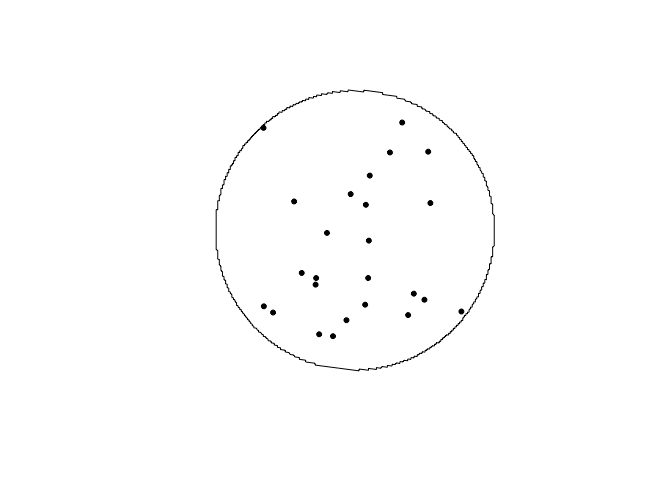
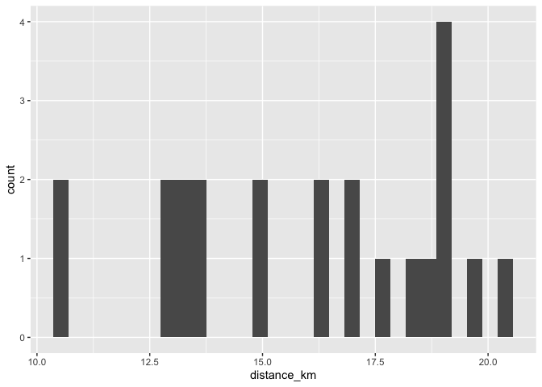
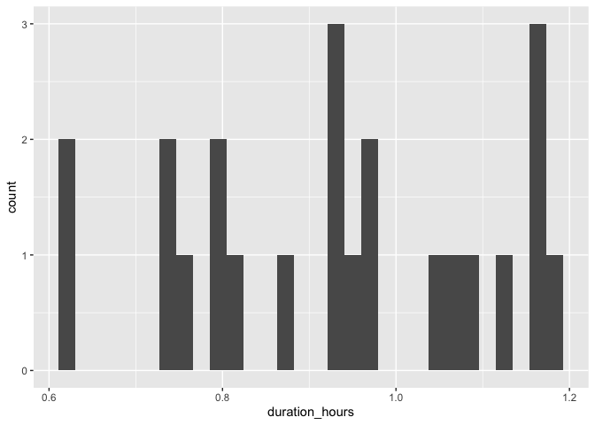
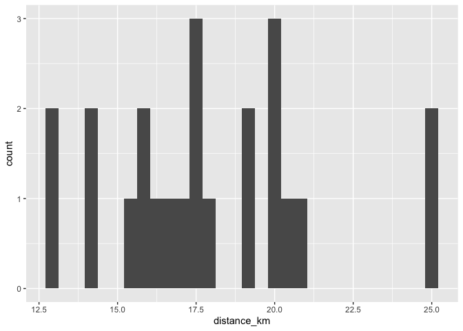
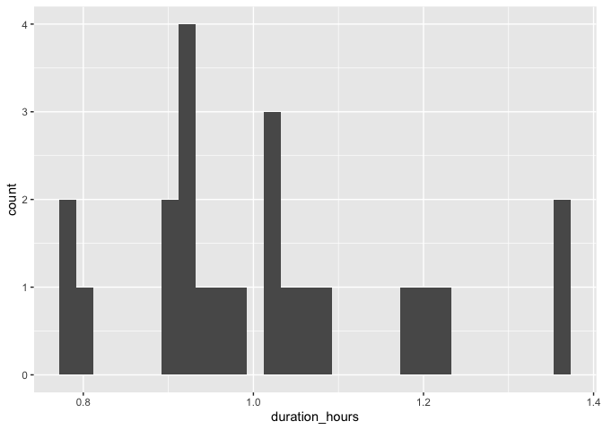
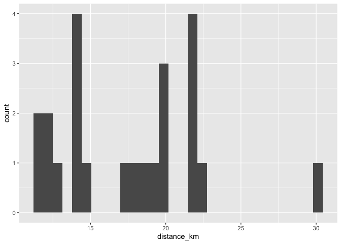
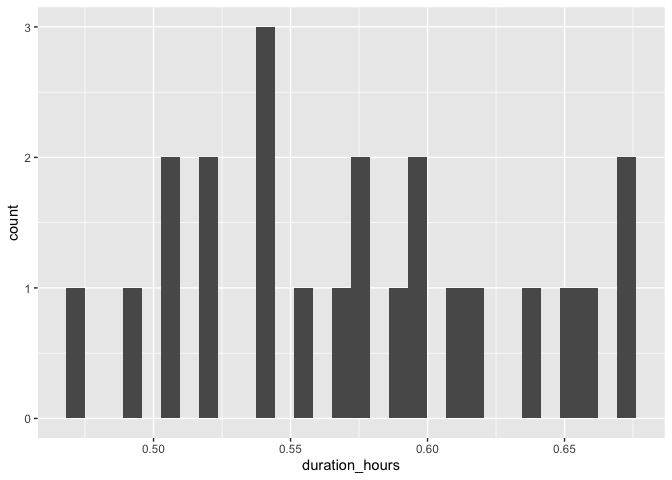
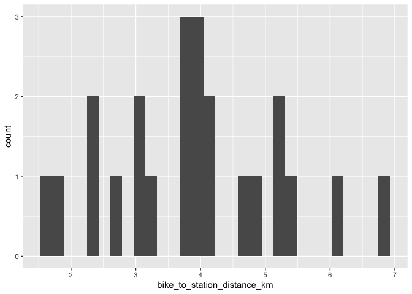

# Toronto

## Vaughan Metropolitan Centre Station

### Draw buffer and select points


```r
destination <- "Art Gallery of Ontario, Toronto, Canada"        #### EDIT ME
```

### Set origin point


```r
origin <- "Scarborough GO Station, Toronto, Canada"    #### EDIT ME
```

#### Setup departure location and arrival time


```r
arrival_time <- as.POSIXct("2024-06-11 08:30:00", tz = "America/Toronto")       #### EDIT ME
```

#### List of variables for geocoding


```r
var_list <- c("var1", "var2", "var3", "var4", "var5", "var6", "var7", "var8", "var9", "var10", "var11", "var12", "var13", "var14", "var15", "var16", "var17", "var18", "var19", "var20", "var21", "var22", "var23")
```


```r
stations <- geocode(location = origin, output = "more", source = "google")
```

```
## ℹ <https://maps.googleapis.com/maps/api/geocode/json?address=Scarborough+GO+Station,+Toronto,+Canada&key=xxx>
```

```r
stations_sf <- stations %>%
                st_as_sf(coords = c("lon", "lat"), crs = 4326)

stations_buffer = st_buffer(stations_sf, 5000)

stations_buffer <- as_sf(stations_buffer)
```

#### Interactive map view of buffers


```r
mapview(stations_buffer)
```

```{=html}
<div class="leaflet html-widget html-fill-item" id="htmlwidget-2332135cf7fc4489e0a8" style="width:672px;height:480px;"></div>
<script type="application/json" data-for="htmlwidget-2332135cf7fc4489e0a8">{"x":{"options":{"minZoom":1,"maxZoom":52,"crs":{"crsClass":"L.CRS.EPSG3857","code":null,"proj4def":null,"projectedBounds":null,"options":{}},"preferCanvas":false,"bounceAtZoomLimits":false,"maxBounds":[[[-90,-370]],[[90,370]]]},"calls":[{"method":"addProviderTiles","args":["CartoDB.Positron","CartoDB.Positron","CartoDB.Positron",{"errorTileUrl":"","noWrap":false,"detectRetina":false,"pane":"tilePane"}]},{"method":"addProviderTiles","args":["CartoDB.DarkMatter","CartoDB.DarkMatter","CartoDB.DarkMatter",{"errorTileUrl":"","noWrap":false,"detectRetina":false,"pane":"tilePane"}]},{"method":"addProviderTiles","args":["OpenStreetMap","OpenStreetMap","OpenStreetMap",{"errorTileUrl":"","noWrap":false,"detectRetina":false,"pane":"tilePane"}]},{"method":"addProviderTiles","args":["Esri.WorldImagery","Esri.WorldImagery","Esri.WorldImagery",{"errorTileUrl":"","noWrap":false,"detectRetina":false,"pane":"tilePane"}]},{"method":"addProviderTiles","args":["OpenTopoMap","OpenTopoMap","OpenTopoMap",{"errorTileUrl":"","noWrap":false,"detectRetina":false,"pane":"tilePane"}]},{"method":"createMapPane","args":["polygon",420]},{"method":"addPolygons","args":[[[[{"lng":[-79.19858454347795,-79.19858454347795,-79.19928972086598,-79.19928972086598,-79.19964230758386,-79.19964230758386,-79.19999489298428,-79.19999489298428,-79.19999489298428,-79.20070005983254,-79.20070005983254,-79.20105264128031,-79.20105264128031,-79.20140522141045,-79.20140522141045,-79.20211037771772,-79.20211037771772,-79.20281552875402,-79.20281552875402,-79.20352067451904,-79.20352067451904,-79.20418174388608,-79.20418174388608,-79.20422581501248,-79.20422581501248,-79.20484280861963,-79.20484280861963,-79.204930950234,-79.204930950234,-79.20545979819029,-79.20545979819029,-79.20563608018333,-79.20563608018333,-79.20625306456388,-79.20625306456388,-79.20634120486014,-79.20634120486014,-79.20700225445583,-79.20700225445583,-79.2070463242641,-79.2070463242641,-79.20775143839492,-79.20775143839492,-79.2084565472523,-79.2084565472523,-79.20916165083588,-79.20916165083588,-79.20986674914541,-79.21039556941625,-79.21039556941625,-79.21057184218056,-79.21057184218056,-79.21127692994099,-79.21127692994098,-79.2119820124264,-79.21233455169089,-79.21233455169089,-79.21268708963652,-79.21268708963652,-79.21339216157098,-79.21339216157098,-79.21409722822951,-79.21444975958019,-79.21444975958019,-79.21480228961177,-79.21480228961178,-79.21550734571748,-79.21550734571748,-79.21621239654631,-79.21691744209795,-79.21691744209795,-79.21828345283579,-79.21828345283579,-79.21832751736842,-79.21832751736842,-79.21903254708664,-79.21973757152641,-79.21973757152641,-79.22114760456944,-79.22114760456944,-79.22185261317206,-79.22255761649501,-79.22291011617651,-79.22291011617651,-79.22326261453796,-79.22326261453796,-79.22396760730062,-79.22467259478267,-79.22467259478267,-79.22537757698383,-79.22608255390372,-79.22678752554209,-79.22678752554209,-79.22819745297296,-79.22925488467976,-79.22925488467976,-79.22960735927394,-79.22960735927394,-79.23031230449993,-79.23101724444253,-79.23172217910141,-79.23207464444936,-79.23207464444936,-79.23242710847626,-79.23242710847626,-79.23383695137265,-79.23524677312919,-79.23595167607925,-79.23595167607925,-79.23665657374343,-79.23736146612138,-79.23806635321284,-79.23877123501748,-79.23947611153497,-79.24018098276501,-79.24088584870732,-79.24159070936155,-79.2422955647274,-79.2422955647274,-79.24511493330084,-79.24793421723541,-79.25075341651123,-79.25075341651123,-79.25084151512426,-79.25084151512425,-79.25145820309994,-79.25216298439591,-79.25286776039884,-79.25357253110843,-79.25427729652436,-79.25498205664636,-79.25568681147405,-79.25639156100715,-79.25709630524535,-79.25780104418837,-79.25780104418837,-79.2592105061875,-79.26061994700207,-79.26132465946439,-79.26132465946439,-79.2615008367523,-79.2615008367523,-79.26202936662962,-79.26273406849748,-79.26343876506765,-79.26414345633981,-79.26484814231367,-79.26484814231365,-79.26625749836519,-79.26696216844225,-79.26696216844225,-79.26731450149346,-79.26731450149346,-79.26766683321975,-79.26837149269738,-79.26907614687485,-79.26978079575184,-79.26978079575184,-79.27048543932803,-79.27189471057677,-79.27189471057677,-79.27259933824874,-79.27330396061865,-79.27330396061865,-79.27348011538265,-79.27348011538264,-79.27471318945113,-79.27541779591307,-79.27541779591307,-79.27612239707175,-79.27682699292683,-79.27682699292683,-79.2769150670358,-79.2769150670358,-79.27753158347801,-79.278236168725,-79.278236168725,-79.27858845935931,-79.27858845935933,-79.27894074866747,-79.27964532330512,-79.27964532330512,-79.27999760863453,-79.27999760863453,-79.28034989263762,-79.28105445666468,-79.28105445666468,-79.28140673668857,-79.28140673668857,-79.28175901538599,-79.28246356880122,-79.28246356880122,-79.28263970632591,-79.28263970632591,-79.28316811691008,-79.28387265971226,-79.28387265971226,-79.2838946765893,-79.2838946765893,-79.28457719720743,-79.28528172939531,-79.28528172939531,-79.28598625627556,-79.28598625627555,-79.28633851772523,-79.28633851772523,-79.28669077784788,-79.28739529411197,-79.28739529411197,-79.2888043107142,-79.2888043107142,-79.28950881105172,-79.28950881105172,-79.29021330607976,-79.29021330607976,-79.29056555160263,-79.29056555160263,-79.29091779579802,-79.29162228020617,-79.29162228020617,-79.29232675930392,-79.29232675930392,-79.29241481881775,-79.29241481881775,-79.29303123309096,-79.29303123309096,-79.29338346799287,-79.29338346799287,-79.29444016473164,-79.29444016473164,-79.29514462258467,-79.29514462258467,-79.29584907512574,-79.29584907512573,-79.29655352235454,-79.29655352235454,-79.29664157788461,-79.29664157788461,-79.29725796427077,-79.29725796427077,-79.2974340739197,-79.2974340739197,-79.29796240087413,-79.29796240087413,-79.29831461718335,-79.29831461718335,-79.29866683216427,-79.29866683216427,-79.29901904581679,-79.29901904581679,-79.29937125814091,-79.29937125814091,-79.29972346913657,-79.29972346913657,-79.30007567880374,-79.30007567880374,-79.30042788714236,-79.30042788714236,-79.30078009415243,-79.30078009415243,-79.30113229983388,-79.30113229983388,-79.3014845041867,-79.3014845041867,-79.30166060586484,-79.30166060586484,-79.30218890890622,-79.30218890890622,-79.30227695912244,-79.30227695912244,-79.30289330831069,-79.30289330831069,-79.30359770239978,-79.30359770239978,-79.30430209117321,-79.30430209117321,-79.30500647463066,-79.30500647463066,-79.30500647463066,-79.30535866436578,-79.30535866436578,-79.3057108527718,-79.3057108527718,-79.30641522559635,-79.30641522559635,-79.30711959310398,-79.30711959310398,-79.30711959310398,-79.30729568415008,-79.30729568415008,-79.3078239552944,-79.3078239552944,-79.30852831216727,-79.30852831216727,-79.30861635640248,-79.30861635640248,-79.3092326637223,-79.3092326637223,-79.3092326637223,-79.30958483750553,-79.30958483750553,-79.30993700995917,-79.30993700995917,-79.3106413508776,-79.3106413508776,-79.3106413508776,-79.31134568647725,-79.31134568647725,-79.31134568647725,-79.31134843777775,-79.31134843777775,-79.31205001675781,-79.31205001675781,-79.31205001675781,-79.31275434171899,-79.31275434171899,-79.31275434171899,-79.31345866136047,-79.31345866136047,-79.31345866136047,-79.31345866136047,-79.3136347404396,-79.3136347404396,-79.31416297568192,-79.31416297568194,-79.31486728468307,-79.31486728468307,-79.31486728468307,-79.31486728468307,-79.31486728468307,-79.31521943718845,-79.31521943718845,-79.3155715883636,-79.3155715883636,-79.31627588672316,-79.31627588672316,-79.31627588672316,-79.31627588672316,-79.31627588672316,-79.31627588672316,-79.3169801797615,-79.3169801797615,-79.3169801797615,-79.3169801797615,-79.3169801797615,-79.3169801797615,-79.3169801797615,-79.3169801797615,-79.3169801797615,-79.3169801797615,-79.3169801797615,-79.3169801797615,-79.31645196048163,-79.31645196048163,-79.31627588672316,-79.31627588672316,-79.31627588672316,-79.31627588672316,-79.31627588672316,-79.31627588672316,-79.3155715883636,-79.3155715883636,-79.3155715883636,-79.31521943718845,-79.31521943718845,-79.31486728468307,-79.31486728468307,-79.31486728468307,-79.31486728468307,-79.31451513084757,-79.31451513084757,-79.31416297568194,-79.31416297568194,-79.31416297568194,-79.31345866136047,-79.31345866136047,-79.31345866136047,-79.31277635178832,-79.31277635178832,-79.31275434171899,-79.31275434171899,-79.31209403722373,-79.31209403722373,-79.31205001675781,-79.31205001675781,-79.31205001675781,-79.31134568647725,-79.31134568647725,-79.3106413508776,-79.3106413508776,-79.3101130956874,-79.3101130956874,-79.30993700995917,-79.30993700995917,-79.30993700995917,-79.3092326637223,-79.3092326637223,-79.30861635640248,-79.30861635640248,-79.30852831216727,-79.30852831216727,-79.30817613439554,-79.30817613439554,-79.3078239552944,-79.3078239552944,-79.3078239552944,-79.30711959310398,-79.30711959310398,-79.30641522559635,-79.30641522559635,-79.3057548762291,-79.3057548762291,-79.3057108527718,-79.3057108527718,-79.30518256966435,-79.30518256966435,-79.30500647463066,-79.30500647463066,-79.30447818753595,-79.30447818753595,-79.30430209117321,-79.30430209117321,-79.30377380009149,-79.30377380009149,-79.30359770239978,-79.30359770239978,-79.30306940733129,-79.30306940733129,-79.30289330831069,-79.30289330831069,-79.30227695912244,-79.30227695912244,-79.30218890890622,-79.30218890890622,-79.3014845041867,-79.3014845041867,-79.30078009415243,-79.30078009415243,-79.30007567880374,-79.30007567880374,-79.29884293915659,-79.29884293915657,-79.29866683216427,-79.29866683216427,-79.29796240087413,-79.29796240087413,-79.29725796427077,-79.29690574397675,-79.29690574397674,-79.29655352235454,-79.29655352235454,-79.29584907512574,-79.29584907512574,-79.29479239432214,-79.29479239432214,-79.29444016473164,-79.29444016473164,-79.29373570156697,-79.29373570156697,-79.29303123309096,-79.29232675930392,-79.29232675930392,-79.29162228020617,-79.29091779579802,-79.29091779579802,-79.29021330607976,-79.28950881105172,-79.28950881105172,-79.2888043107142,-79.28809980506752,-79.28809980506752,-79.28739529411197,-79.28607432176237,-79.28607432176238,-79.28598625627555,-79.28598625627555,-79.28528172939531,-79.28457719720743,-79.28422492912323,-79.28422492912323,-79.28387265971226,-79.28387265971226,-79.28316811691008,-79.28211129275687,-79.28211129275687,-79.28175901538599,-79.28175901538599,-79.28105445666468,-79.28034989263762,-79.27964532330512,-79.27964532330512,-79.27894074866747,-79.27682699292683,-79.27682699292683,-79.27612239707175,-79.27541779591307,-79.27471318945112,-79.2740085776862,-79.27330396061865,-79.27259933824874,-79.27259933824874,-79.27189471057677,-79.27048543932803,-79.26907614687485,-79.26766683321975,-79.26625749836519,-79.26484814231365,-79.26343876506765,-79.26202936662962,-79.26061994700207,-79.2592105061875,-79.25780104418837,-79.25639156100715,-79.25498205664634,-79.25357253110843,-79.25286776039884,-79.25286776039884,-79.25216298439591,-79.25145820309993,-79.25075341651123,-79.25004862463013,-79.24934382745691,-79.2486390249919,-79.2486390249919,-79.24793421723541,-79.24511493330084,-79.24511493330084,-79.2444100990916,-79.24370525959274,-79.24300041480457,-79.24300041480457,-79.2426479904271,-79.2426479904271,-79.2422955647274,-79.24088584870732,-79.24018098276501,-79.24018098276501,-79.23947611153497,-79.23877123501748,-79.23806635321284,-79.23806635321284,-79.23665657374343,-79.23665657374343,-79.2363041255721,-79.2363041255721,-79.23595167607927,-79.23524677312919,-79.23454186489356,-79.23454186489356,-79.23383695137265,-79.23313203256679,-79.23313203256679,-79.23277957118209,-79.23277957118209,-79.23242710847626,-79.23172217910141,-79.23101724444253,-79.23101724444253,-79.22960735927394,-79.22960735927394,-79.22890240876484,-79.22819745297296,-79.22819745297296,-79.22678752554209,-79.22678752554209,-79.22608255390372,-79.22608255390372,-79.22573006610395,-79.22573006610395,-79.22537757698383,-79.22467259478267,-79.22467259478267,-79.22449634840724,-79.22449634840724,-79.22396760730062,-79.22326261453796,-79.22326261453796,-79.22255761649501,-79.22255761649501,-79.22220511549351,-79.22220511549351,-79.22185261317206,-79.22114760456944,-79.22114760456944,-79.22044259068745,-79.22044259068745,-79.2200900817668,-79.2200900817668,-79.21973757152641,-79.21903254708664,-79.21903254708664,-79.21832751736842,-79.21832751736842,-79.21815125911415,-79.21815125911415,-79.21762248237209,-79.21691744209795,-79.21691744209795,-79.21621239654631,-79.21621239654631,-79.21550734571748,-79.21550734571748,-79.21541921399285,-79.21541921399285,-79.21480228961177,-79.21480228961177,-79.21444975958019,-79.21444975958019,-79.21409722822951,-79.21409722822951,-79.21374469555975,-79.21374469555975,-79.21268708963652,-79.21268708963652,-79.2119820124264,-79.2119820124264,-79.21127692994098,-79.21127692994098,-79.21057184218056,-79.21057184218056,-79.20986674914541,-79.20986674914541,-79.20916165083588,-79.20916165083588,-79.2084565472523,-79.2084565472523,-79.20775143839492,-79.20775143839492,-79.2070463242641,-79.2070463242641,-79.20634120486014,-79.20634120486014,-79.20634120486014,-79.20598864318082,-79.20598864318082,-79.20563608018333,-79.20563608018333,-79.20545979819029,-79.20545979819029,-79.204930950234,-79.204930950234,-79.20422581501248,-79.20422581501248,-79.20352067451904,-79.20352067451904,-79.20352067451904,-79.20316810229546,-79.20316810229546,-79.20281552875402,-79.20281552875402,-79.20211037771772,-79.20211037771772,-79.20211037771772,-79.20175780022294,-79.20175780022294,-79.20140522141045,-79.20140522141045,-79.20070005983254,-79.20070005983254,-79.20070005983254,-79.20034747706718,-79.20034747706718,-79.19999489298428,-79.19999489298428,-79.19928972086598,-79.19928972086598,-79.19928972086598,-79.19858454347795,-79.19858454347795,-79.19858454347795,-79.1984082483076,-79.1984082483076,-79.19787936082052,-79.19787936082052,-79.19787936082052,-79.19770306433286,-79.19770306433286,-79.19717417289399,-79.19717417289399,-79.19717417289399,-79.19715213568639,-79.19715213568639,-79.19646897969868,-79.19646897969868,-79.19646897969868,-79.19576378123489,-79.19576378123489,-79.19576378123489,-79.19558748079578,-79.19558748079578,-79.19505857750293,-79.19505857750293,-79.19505857750293,-79.19505857750293,-79.19470597366147,-79.19470597366147,-79.1943533685031,-79.1943533685031,-79.1943533685031,-79.19426521700775,-79.19426521700775,-79.19364815423576,-79.19364815423576,-79.19364815423576,-79.19364815423576,-79.19364815423576,-79.19356000208197,-79.19356000208197,-79.19294293470116,-79.19294293470116,-79.19294293470115,-79.19294293470116,-79.19259032295876,-79.19259032295876,-79.19223770989966,-79.19223770989966,-79.19223770989966,-79.19223770989966,-79.19223770989966,-79.19223770989966,-79.19223770989966,-79.19223770989966,-79.19223770989966,-79.19223770989966,-79.19223770989966,-79.19223770989966,-79.19223770989966,-79.19223770989966,-79.19223770989966,-79.19223770989966,-79.19223770989966,-79.19223770989966,-79.19259032295876,-79.19259032295876,-79.19294293470116,-79.19294293470116,-79.19294293470116,-79.19294293470116,-79.19294293470116,-79.19364815423576,-79.19364815423576,-79.19364815423576,-79.19364815423576,-79.19364815423576,-79.1943533685031,-79.1943533685031,-79.1943533685031,-79.19505857750293,-79.19505857750293,-79.19505857750293,-79.19541118002741,-79.19541118002741,-79.19576378123489,-79.19576378123489,-79.19576378123489,-79.19646897969868,-79.19646897969868,-79.19646897969868,-79.19717417289399,-79.19717417289399,-79.19717417289399,-79.19787936082052,-79.19787936082052,-79.1982319528079,-79.1982319528079,-79.19858454347795],"lat":[43.73640553872339,43.73729341874096,43.73736062008277,43.73795253122816,43.73798613005906,43.73828208296877,43.73831568056789,43.73861163170735,43.73920352862962,43.73927072017845,43.73986261001959,43.739896203954,43.74019214621148,43.74022573891413,43.74111355501877,43.74118073677464,43.74177260531068,43.74183978213956,43.74243164359405,43.74249881549601,43.74309066986882,43.74315363905409,43.7431906297188,43.74319482750884,43.74374968413493,43.74380845119989,43.74388243161571,43.74389082659992,43.74440868639228,43.74445905470094,43.74460701364856,43.74462380246514,43.74506767664082,43.74512643508392,43.74520041372921,43.74520880748175,43.74572665488046,43.7457896055903,43.74582659448451,43.74583079104288,43.74638562111114,43.74645276345247,43.74704457533279,43.74711171274752,43.74770351754536,43.7477706500335,43.74836244774874,43.74842957531037,43.74847991770882,43.748627866048,43.7486446462279,43.74908848857805,43.7491556062262,43.74974738983644,43.74981450255825,43.74984805704909,43.7501439462208,43.75017749948008,43.75047338688102,43.75054048968978,43.75113225919442,43.75119935707701,43.75123290414833,43.7515287862671,43.75156233210691,43.75185821245484,43.75192530042482,43.75251705582323,43.7525841388672,43.75265121692487,43.7532429653001,43.75337291496453,43.75340989900809,43.75341409062135,43.75396884792941,43.75403591114933,43.75410296938328,43.75469470371157,43.75482880534246,43.75542053264698,43.75548757604403,43.75555461445548,43.75558813179162,43.75588399283999,43.75591750894481,43.75621336822211,43.75628039672276,43.75634742023804,43.75693913355456,43.7570061521447,43.75707316574966,43.75714017436953,43.75773188072171,43.75786588312666,43.75796637184517,43.75826222244706,43.7582957162092,43.75859156503988,43.75865854885569,43.75872552768695,43.75879250153373,43.75882598658798,43.75912183373738,43.75915531756053,43.75945116293867,43.75958508583059,43.75971898878601,43.75978593278779,43.76037761848477,43.76044455756258,43.76051149165662,43.76057842076699,43.76064534489377,43.76071226403707,43.76077917819697,43.76084608737357,43.76091299156693,43.76097989077719,43.76157156986726,43.76183911711784,43.76210658464551,43.76237397245608,43.76185625301586,43.76186460759397,43.76179064722639,43.76184912708705,43.76191595654304,43.76198278101726,43.7620496005098,43.76211641502075,43.76218322455021,43.76225002909826,43.762316828665,43.76238362325052,43.76245041285492,43.76185872530542,43.7619922894519,43.76212583367496,43.76219259831545,43.76174882774002,43.76176551811075,43.7616175936886,43.76166766292189,43.76173441754168,43.76180116718109,43.7618679118402,43.76193465151911,43.76134294908086,43.76147641337917,43.76154313805839,43.76124728406997,43.76128064452723,43.7609847887373,43.76101814793471,43.76108486259473,43.7611515722751,43.76121827697591,43.76062655982758,43.76069325948931,43.76082664387472,43.76023491940109,43.76030160406535,43.76036828375052,43.75992448561597,43.75994115474811,43.75979322113955,43.75990989632531,43.75997656101414,43.75938482194933,43.7594514815998,43.75951813627164,43.75900035862317,43.75900869010056,43.75893472141748,43.75899303957467,43.7590596842299,43.75876380832497,43.75879712877078,43.7585012510643,43.75853457025062,43.7586012048896,43.75830532535172,43.75833864078947,43.75804275945004,43.75807607362835,43.75814269825144,43.7578468150806,43.75788012551048,43.75758424053807,43.75761754970854,43.75768416431611,43.75724033344039,43.7572569863033,43.75710904178101,43.7571589984919,43.75722560308431,43.75665231374033,43.75665439505184,43.75663590173546,43.75670041997912,43.75676701455674,43.75617522463042,43.75624181417089,43.75594591649789,43.7559792093867,43.75568330991212,43.75571660154168,43.75578318106791,43.75519137666917,43.75532452067088,43.75473270900599,43.75479927348164,43.7542074546104,43.75427401404942,43.75397810190393,43.75401137974221,43.75371546579514,43.75374874237428,43.75381529180012,43.75322345845632,43.75329000284579,43.75277214275519,43.75278046044742,43.75270647998688,43.75276470164876,43.75246877866379,43.75250204645928,43.7522061216727,43.75230591754987,43.75171406252699,43.75178058683166,43.75118872460239,43.7512552438711,43.75066337443541,43.75072988866823,43.75021199699722,43.75022031091989,43.75014632594787,43.75020452122315,43.74976060900674,43.74977723551728,43.74962926388142,43.74967914153591,43.74938319690175,43.74941644710151,43.74912050066575,43.74915374960661,43.74885780136923,43.74889104905121,43.74859509901223,43.74862834543531,43.74833239359473,43.74836563875894,43.74806968511675,43.7481029290221,43.74780697357832,43.74784021622479,43.74754425897941,43.74757750036705,43.74728154132006,43.74731478144886,43.74701882060026,43.74705205947024,43.74660811482497,43.74662473378226,43.7464767513368,43.74652660633173,43.74600866421582,43.746016973103,43.74594298092457,43.74600114095163,43.74540919945182,43.74547566332998,43.74488371462375,43.74495017346689,43.74435821755424,43.7444246713624,43.74383270824335,43.743536724004,43.7435699489974,43.74327396295645,43.74330718669114,43.74271520921951,43.7427816528977,43.74218966821968,43.74225610686312,43.7416641149787,43.74122011637578,43.741236725233,43.74108872480167,43.74113854949665,43.74054654325978,43.74061297177359,43.73950294070559,43.73951124390591,43.73943724094052,43.73949536115998,43.73890333336443,43.73860731678693,43.73864052658573,43.73834450820666,43.73837771674685,43.73778567459907,43.73785208788852,43.73726003853439,43.73666798203446,43.73673439022902,43.73614232652276,43.73555256846145,43.73555282785824,43.73555051506757,43.73561665877045,43.73502458071217,43.73443249550823,43.73449889351301,43.73390680110279,43.73331470154698,43.73338109445688,43.73278898769482,43.73219687378724,43.73175278366734,43.73176938107594,43.73162135013901,43.73167114048844,43.73048687682451,43.73055325948383,43.72996111687298,43.72936896711679,43.72877681021534,43.72848072908513,43.7285139184433,43.72821783551158,43.72825102361123,43.72647448841735,43.7265408607039,43.72594866795473,43.72535646806052,43.72476426102132,43.7241720468372,43.7235798255082,43.72364619251633,43.72246172830148,43.72127723550759,43.72009271413504,43.71890816418426,43.71772358565563,43.71653897854956,43.71535434286645,43.7141696786067,43.71298498577072,43.71180026435889,43.71061551437162,43.71056574059627,43.71041764485026,43.71040105297408,43.70995676306876,43.7093643702776,43.70877197034282,43.70817956326447,43.70758714904257,43.70752077872389,43.7069283574205,43.70574349338357,43.70571030645245,43.70541408599416,43.70538089783536,43.70508467560677,43.70449222579219,43.70389976883443,43.70386657951006,43.70357034836805,43.703537157816,43.70324092490376,43.70205597539729,43.70198959071901,43.7013971053136,43.70080461276533,43.70074029798661,43.70072178248127,43.70071970773334,43.6995532168384,43.69949097225746,43.69945394035074,43.69944979055685,43.69889430861156,43.69830178761721,43.69823538839381,43.69705032510246,43.69698392103081,43.69639137873401,43.69634157246345,43.69619343578498,43.69617683307705,43.69573242037502,43.69513986385618,43.69507345002556,43.69448088642714,43.69442277030038,43.69434869935525,43.69434039674157,43.69382189700784,43.69378868580338,43.69349239780184,43.69345918536968,43.69316289559832,43.69257031069911,43.69250388219866,43.69191129022032,43.69184485680893,43.69125225775156,43.69118997197008,43.69115293429555,43.69114878175493,43.69059321329292,43.69054338133421,43.69039522869604,43.69037861742532,43.68993415684448,43.68988432120248,43.68973616679462,43.68971955429614,43.6892750884063,43.68922524908098,43.68907709290347,43.68906047917721,43.68861600797845,43.68856616496977,43.68841800702264,43.68840139206859,43.687956915561,43.6878987608149,43.68782468101332,43.68781637288254,43.68729781115402,43.68723134336492,43.68663869475758,43.68657222205721,43.68597956637178,43.68591308876006,43.68532042599664,43.68520407831664,43.68505591153765,43.68503928920079,43.68459478619776,43.68452829378855,43.68393561693275,43.68386911961198,43.68383586908602,43.68353952802774,43.68350627627387,43.68320993344622,43.6831434262389,43.68255073529134,43.6824509652471,43.68215461714308,43.68212135798992,43.68182500811659,43.68175848611056,43.68116578107187,43.68109925415393,43.68103272226061,43.6804400102083,43.68037347340295,43.68030693162204,43.67971421255632,43.67964766586325,43.67958111419445,43.67898838811551,43.67892183153442,43.67885526997742,43.67826253688546,43.67819597041605,43.67807114487374,43.67799705275807,43.67798873043422,43.67747008250775,43.67740350117344,43.67733691486282,43.67730361984135,43.67700724722287,43.6769739509732,43.6766775765857,43.67661098038579,43.67651107675476,43.67621470066196,43.67618139697919,43.6758850191174,43.67581840805114,43.67575179200801,43.6756851709879,43.67509241010093,43.67502578416757,43.67482587650429,43.67423310873317,43.67416646295457,43.67409981219846,43.67403315646479,43.67396649575343,43.67389983006431,43.67383315939734,43.6732403848703,43.67317370928931,43.67304034319314,43.67290695718415,43.67277355126159,43.67264012542472,43.67250667967285,43.67237321400523,43.67223972842113,43.67210622291985,43.67197269750065,43.6718391521628,43.67170558690557,43.67157200172826,43.67143839663011,43.6713715866105,43.67196435934456,43.67189754428032,43.67183072423552,43.67176389921004,43.6716970692038,43.67163023421673,43.67156339424871,43.67215615945959,43.67208931444637,43.67182188458133,43.67241464233323,43.67234777234929,43.67228089738376,43.67221401743656,43.67251039353948,43.67247695168167,43.67277332598404,43.67273988286474,43.67260609793274,43.67253919799371,43.67313194102035,43.67306503603501,43.67299812606743,43.67293121111752,43.6735239468137,43.67339010183818,43.67368646694539,43.67365300257136,43.67394936587805,43.67391590024232,43.67384896523384,43.67378202524255,43.67437474634212,43.67430780130379,43.67424085128247,43.6745372090914,43.67450373219607,43.6748000882045,43.67476661004734,43.67469964999564,43.67463268496067,43.67522539146381,43.67509144631543,43.6756841455525,43.67561716543892,43.67555018034169,43.67614287231271,43.67600888703875,43.67660157174375,43.67653457156683,43.67683091121062,43.67679740923714,43.67709374708044,43.67706024384493,43.67699323363581,43.67743773698283,43.67742098363976,43.67756915052587,43.67751888861555,43.67745186837384,43.67804453134506,43.67797750605492,43.67827383483183,43.67824032030156,43.67853664727801,43.67850313148561,43.67843609616235,43.67902874466585,43.67896170429389,43.67925802583694,43.67922450376567,43.67952082350828,43.67948730017481,43.67942024976919,43.68001288380503,43.67994582835048,43.68039029914517,43.68037353449062,43.68052169052596,43.68047139468092,43.68040432919216,43.68099694876044,43.68092987822248,43.68152249058896,43.68145541500172,43.68197394491118,43.68196556010525,43.68203963535948,43.68198093952982,43.6822772394035,43.68224369719967,43.6825399952729,43.6825064518067,43.68280274807949,43.68276920335089,43.68306549782324,43.68296485611098,43.68355743960645,43.68349033883548,43.68408291512918,43.68401580930846,43.68460837840039,43.68454126752982,43.68513382941997,43.68506671349949,43.68565926818788,43.68559214721742,43.68618469470402,43.68611756868349,43.68671010896833,43.68664297789766,43.68723551098072,43.68716837485984,43.68776090074113,43.68769375956993,43.68828627824946,43.68858253491242,43.68854896240908,43.68884521727158,43.68881164350564,43.68925602242955,43.68923923506713,43.68938736047885,43.68933699650962,43.68992949364741,43.6898623372613,43.6904548271973,43.6903876657606,43.69098014849482,43.69127638718507,43.69124280454891,43.69153904143872,43.69150545753988,43.69209792593401,43.69203075433242,43.69262321552474,43.69291944344401,43.69288585572539,43.6931820818442,43.69314849286288,43.69374093971498,43.69367375794833,43.69426619759861,43.69456241474683,43.69452882194565,43.69482503729341,43.6947914432295,43.69538386853944,43.69531667660754,43.69590909471565,43.6965015056852,43.69643430863896,43.69702671240663,43.69747101054767,43.69745421047909,43.69760230896314,43.69755190687508,43.69814429630225,43.69858858368783,43.69857178234067,43.69871987723958,43.69866947131575,43.69926184640229,43.69983570295975,43.69983360264813,43.69985211403839,43.69978700196076,43.70037936270659,43.70097171631358,43.70090449880993,43.70149684521497,43.70253343424573,43.70251662904707,43.70266471140564,43.70261429392723,43.70320661885238,43.7037989366385,43.70409509285441,43.70406147956457,43.70435763397997,43.70432401942728,43.70491632287228,43.70602687258933,43.70601846873372,43.70609250448813,43.70603367530938,43.70662595727393,43.7072182320992,43.70781049978513,43.70832872815379,43.70832032364321,43.70839435582012,43.70833552205662,43.70952002160599,43.71070449259735,43.71159282709943,43.71155920591887,43.71185531383409,43.71182169139068,43.71241390183508,43.71300610513976,43.71359830130467,43.71419049032974,43.71478267221493,43.7153748469602,43.7159670145655,43.71655917503076,43.71715132835596,43.71774347454102,43.71833561358591,43.71892774549056,43.71951987025494,43.72011198787899,43.72070409836266,43.72129620170591,43.72188829790868,43.72192192088161,43.72221796632081,43.72225158806202,43.72254763173159,43.72373178855825,43.72491591682208,43.72550797024282,43.72557521032424,43.72616725666595,43.72675929586674,43.72735132792653,43.7279433528453,43.72801058818501,43.7286026060244,43.72978662027965,43.72985385081559,43.73044584729297,43.73103783662899,43.73107145008779,43.73136744209317,43.73140105432017,43.7322890196703,43.73288098764349,43.73294820850978,43.73354016940286,43.73413212315428,43.73419933915485,43.73479128582596,43.73538322535529,43.73545043649008,43.7360423689389,43.73607597266627,43.7363719362278,43.73640553872339]}]]],null,"stations_buffer",{"crs":{"crsClass":"L.CRS.EPSG3857","code":null,"proj4def":null,"projectedBounds":null,"options":{}},"pane":"polygon","stroke":true,"color":"#333333","weight":0.5,"opacity":0.9,"fill":true,"fillColor":"#6666FF","fillOpacity":0.6,"smoothFactor":1,"noClip":false},"<div class='scrollableContainer'><table class=mapview-popup id='popup'><tr class='coord'><td><\/td><th><b>Feature ID&emsp;<\/b><\/th><td>1&emsp;<\/td><\/tr><tr><td>1<\/td><th>type&emsp;<\/th><td>establishment&emsp;<\/td><\/tr><tr><td>2<\/td><th>loctype&emsp;<\/th><td>rooftop&emsp;<\/td><\/tr><tr><td>3<\/td><th>address&emsp;<\/th><td>scarborough go, 3615 st clair ave e, scarborough, on m1n 3w6, canada&emsp;<\/td><\/tr><tr><td>4<\/td><th>north&emsp;<\/th><td>43.71861&emsp;<\/td><\/tr><tr><td>5<\/td><th>south&emsp;<\/th><td>43.71591&emsp;<\/td><\/tr><tr><td>6<\/td><th>east&emsp;<\/th><td>-79.25313&emsp;<\/td><\/tr><tr><td>7<\/td><th>west&emsp;<\/th><td>-79.25583&emsp;<\/td><\/tr><tr><td>8<\/td><th>geometry&emsp;<\/th><td>sfc_POLYGON&emsp;<\/td><\/tr><\/table><\/div>",{"maxWidth":800,"minWidth":50,"autoPan":true,"keepInView":false,"closeButton":true,"closeOnClick":true,"className":""},"1",{"interactive":false,"permanent":false,"direction":"auto","opacity":1,"offset":[0,0],"textsize":"10px","textOnly":false,"className":"","sticky":true},{"stroke":true,"weight":1,"opacity":0.9,"fillOpacity":0.84,"bringToFront":false,"sendToBack":false}]},{"method":"addScaleBar","args":[{"maxWidth":100,"metric":true,"imperial":true,"updateWhenIdle":true,"position":"bottomleft"}]},{"method":"addHomeButton","args":[-79.3169801797615,43.6713715866105,-79.19223770989966,43.76245041285492,true,"stations_buffer","Zoom to stations_buffer","<strong> stations_buffer <\/strong>","bottomright"]},{"method":"addLayersControl","args":[["CartoDB.Positron","CartoDB.DarkMatter","OpenStreetMap","Esri.WorldImagery","OpenTopoMap"],"stations_buffer",{"collapsed":true,"autoZIndex":true,"position":"topleft"}]},{"method":"addLegend","args":[{"colors":["#6666FF"],"labels":["stations_buffer"],"na_color":null,"na_label":"NA","opacity":1,"position":"topright","type":"factor","title":"","extra":null,"layerId":null,"className":"info legend","group":"stations_buffer"}]}],"limits":{"lat":[43.6713715866105,43.76245041285492],"lng":[-79.3169801797615,-79.19223770989966]},"fitBounds":[43.6713715866105,-79.3169801797615,43.76245041285492,-79.19223770989966,[]]},"evals":[],"jsHooks":{"render":[{"code":"function(el, x, data) {\n  return (\n      function(el, x, data) {\n      // get the leaflet map\n      var map = this; //HTMLWidgets.find('#' + el.id);\n      // we need a new div element because we have to handle\n      // the mouseover output separately\n      // debugger;\n      function addElement () {\n      // generate new div Element\n      var newDiv = $(document.createElement('div'));\n      // append at end of leaflet htmlwidget container\n      $(el).append(newDiv);\n      //provide ID and style\n      newDiv.addClass('lnlt');\n      newDiv.css({\n      'position': 'relative',\n      'bottomleft':  '0px',\n      'background-color': 'rgba(255, 255, 255, 0.7)',\n      'box-shadow': '0 0 2px #bbb',\n      'background-clip': 'padding-box',\n      'margin': '0',\n      'padding-left': '5px',\n      'color': '#333',\n      'font': '9px/1.5 \"Helvetica Neue\", Arial, Helvetica, sans-serif',\n      'z-index': '700',\n      });\n      return newDiv;\n      }\n\n\n      // check for already existing lnlt class to not duplicate\n      var lnlt = $(el).find('.lnlt');\n\n      if(!lnlt.length) {\n      lnlt = addElement();\n\n      // grab the special div we generated in the beginning\n      // and put the mousmove output there\n\n      map.on('mousemove', function (e) {\n      if (e.originalEvent.ctrlKey) {\n      if (document.querySelector('.lnlt') === null) lnlt = addElement();\n      lnlt.text(\n                           ' lon: ' + (e.latlng.lng).toFixed(5) +\n                           ' | lat: ' + (e.latlng.lat).toFixed(5) +\n                           ' | zoom: ' + map.getZoom() +\n                           ' | x: ' + L.CRS.EPSG3857.project(e.latlng).x.toFixed(0) +\n                           ' | y: ' + L.CRS.EPSG3857.project(e.latlng).y.toFixed(0) +\n                           ' | epsg: 3857 ' +\n                           ' | proj4: +proj=merc +a=6378137 +b=6378137 +lat_ts=0.0 +lon_0=0.0 +x_0=0.0 +y_0=0 +k=1.0 +units=m +nadgrids=@null +no_defs ');\n      } else {\n      if (document.querySelector('.lnlt') === null) lnlt = addElement();\n      lnlt.text(\n                      ' lon: ' + (e.latlng.lng).toFixed(5) +\n                      ' | lat: ' + (e.latlng.lat).toFixed(5) +\n                      ' | zoom: ' + map.getZoom() + ' ');\n      }\n      });\n\n      // remove the lnlt div when mouse leaves map\n      map.on('mouseout', function (e) {\n      var strip = document.querySelector('.lnlt');\n      if( strip !==null) strip.remove();\n      });\n\n      };\n\n      //$(el).keypress(67, function(e) {\n      map.on('preclick', function(e) {\n      if (e.originalEvent.ctrlKey) {\n      if (document.querySelector('.lnlt') === null) lnlt = addElement();\n      lnlt.text(\n                      ' lon: ' + (e.latlng.lng).toFixed(5) +\n                      ' | lat: ' + (e.latlng.lat).toFixed(5) +\n                      ' | zoom: ' + map.getZoom() + ' ');\n      var txt = document.querySelector('.lnlt').textContent;\n      console.log(txt);\n      //txt.innerText.focus();\n      //txt.select();\n      setClipboardText('\"' + txt + '\"');\n      }\n      });\n\n      }\n      ).call(this.getMap(), el, x, data);\n}","data":null},{"code":"function(el, x, data) {\n  return (function(el,x,data){\n           var map = this;\n\n           map.on('keypress', function(e) {\n               console.log(e.originalEvent.code);\n               var key = e.originalEvent.code;\n               if (key === 'KeyE') {\n                   var bb = this.getBounds();\n                   var txt = JSON.stringify(bb);\n                   console.log(txt);\n\n                   setClipboardText('\\'' + txt + '\\'');\n               }\n           })\n        }).call(this.getMap(), el, x, data);\n}","data":null}]}}</script>
```

#### Generate points within buffer


```r
set.seed(100)
points_sample_sf <- st_sample(stations_buffer, size = c(25,25), type = "random")
```

```
## Warning in st_poly_sample(x, size = size, ..., type = type, by_polygon =
## by_polygon, : coordinate ranges not computed along great circles; install
## package lwgeom to get rid of this warning
```

```r
points_sample_sf <- st_as_sf(points_sample_sf)
points_sample <- sf_to_df(points_sample_sf)
```

#### Check to see if they worked


```r
check_buffer <- stations_buffer %>% slice(1:2)

plot(st_geometry(check_buffer))
plot(points_sample_sf, pch = 20, add= TRUE)
```

<!-- -->


```r
points_sample$destination <- destination
points_sample$origin <- origin
points_sample$lat_lon <- paste(points_sample$lat, points_sample$lon)
```

#### Checking points and general mapping


```r
lst_directions <- apply(points_sample, 1, function(x){
  res <- google_directions(
    origin = x[['lat_lon']], 
    destination = x[['destination']]    
  )
df_result <- data.frame(
    origin = x[['lat_lon']], 
    destination = x[['destination']], 
    route = res$routes$overview_polyline$points 
)
return(df_result)
})

df_directions <- do.call(rbind, lst_directions)

google_map() %>%
  add_polylines(data = df_directions, polyline = "route") 
```

```{=html}
<div class="google_map html-widget html-fill-item" id="htmlwidget-24462cba046dfa0c4510" style="width:672px;height:480px;"></div>
<script type="application/json" data-for="htmlwidget-24462cba046dfa0c4510">{"x":{"lat":0,"lng":0,"zoom":1,"min_zoom":null,"max_zoom":null,"mapBounds":{"west":-180,"south":-90,"east":180,"north":90},"styles":null,"search_box":false,"update_map_view":true,"zoomControl":true,"mapType":"roadmap","mapTypeControl":true,"scaleControl":false,"streetViewControl":true,"rotateControl":true,"fullscreenControl":true,"event_return_type":"list","split_view":null,"split_view_options":{"heading":34,"pitch":10},"geolocation":false,"calls":[{"functions":"add_polylines","args":[[{"id":1,"geodesic":true,"stroke_colour":"#0000FF","stroke_weight":2,"stroke_opacity":0.6,"z_index":3,"polyline":["ywviGh`{bNi@LW@CUS{AMs@iIfCwExAoM`EeNhEUAI@_D`AXzBF`@LNl@~D`@`DpB`OvBbPbAhH`@bDlA`IRdBTfBf@xDXpBJz@@z@KnCAnABh@Hv@f@pDrAzJ\\xBD\\AP?F@Xh@|DdCnQdErZ`A`H\\zBj@|D@XPHxA`AZTd@h@j@f@|CrDnDpEjHhKrExG^t@VrApBhObCnRvBnPlBlNhEl\\fA|IlAvIVlB@TiBl@SF_Bd@y@POBUCi@MMIc@i@e@oAq@aCs@}Ac@k@g@a@QKu@Ye@EsA?o@?yABw@Cu@Kg@OaAg@i@k@[i@AgAB]Tq@XUNGJAT@RFLLJLJZRh@TNn@pB^`Af@dAn@hAvDnFdBjCb@z@p@`Bn@zB\\~ANnALrAFhB@fBEpBYrEaApLSbEApBDfBFnAP~ARlAf@|B\\fA\\|@v@zAd@t@`ArAzGnIzMlPzAdBxBrBhCjBbB`A`Ab@fAb@|Ah@lBd@jBX`BPbCHhFJpBRlAXxC`AhG~BbA\\lAVbAJlADrAAhBKzKk@lBQnBW~Ba@bCg@tCm@dAYjBo@vAo@`B_AbBmApDaDnE_E~AqAtA{@tAo@hA_@rEaApJkBnPaD~@SjAURI`@K^It@OfB_@nB_@lF_AxBa@d@MJJn@M|@U|@]lAs@fAw@^STGX?VDNFb@VNNb@l@j@rANJv@bCfA|CXzA\\bBTtBFjA?jAKhCSpCKzACpAAdAF~AFx@PxAh@`Dd@tCd@hDXpBNjAn@`Ez@dGzAtKxAdKVvBBP?p@K~@G\\IzAAZ@n@jAfIf@rD`@~CfBxMr@jFXtB}Bp@ILGTShAIXOR_AZk@H{@TyAb@u@Rw@VwA^mCx@mBn@OB~@bHpAzJ`@zCDvBJjAt@~F?\\Af@TtBfA|I"]},{"id":2,"geodesic":true,"stroke_colour":"#0000FF","stroke_weight":2,"stroke_opacity":0.6,"z_index":3,"polyline":["i||iGdbubNRJTDt@`@~ClBjDjCtJrH|@p@nAv@pAn@~B|@vG~B|DvAn@Vp@XNVXLfAd@v@X`@ThAz@nD`CRNL@fDbCjE`DzCzBtDnCjEzClA~@nAz@|At@~CjAvA~Jb@pCHd@JXVjBpAdJl@tDjCzOn@hEDVAL?RRtAXhBH|@h@`ERhBXtCRjB^pChCjRfC|QXzBF`@LNl@~D`@`DpB`OvBbPbAhH`@bDlA`IRdBTfBf@xDXpBJz@@z@KnCAnABh@Hv@f@pDrAzJ\\xBD\\AP?F@Xh@|DdCnQdErZ`A`H\\zBj@|D@XPHxA`AZTd@h@j@f@|CrDnDpEjHhKrExG^t@VrApBhObCnRvBnPlBlNhEl\\fA|IlAvIVlB@TiBl@SF_Bd@y@POBUCi@MMIc@i@e@oAq@aCs@}Ac@k@g@a@QKu@Ye@EsA?o@?yABw@Cu@Kg@OaAg@i@k@[i@AgAB]Tq@XUNGJAT@RFLLJLJZRh@TNn@pB^`Af@dAn@hAvDnFdBjCb@z@p@`Bn@zB\\~ANnALrAFhB@fBEpBYrEaApLSbEApBDfBFnAP~ARlAf@|B\\fA\\|@v@zAd@t@`ArAzGnIzMlPzAdBxBrBhCjBbB`A`Ab@fAb@|Ah@lBd@jBX`BPbCHhFJpBRlAXxC`AhG~BbA\\lAVbAJlADrAAhBKzKk@lBQnBW~Ba@bCg@tCm@dAYjBo@vAo@`B_AbBmApDaDnE_E~AqAtA{@tAo@hA_@rEaApJkBnPaD~@SjAURI`@K^It@OfB_@nB_@lF_AxBa@d@MJJn@M|@U|@]lAs@fAw@^STGX?VDNFb@VNNb@l@j@rANJv@bCfA|CXzA\\bBTtBFjA?jAKhCSpCKzACpAAdAF~AFx@PxAh@`Dd@tCd@hDXpBNjAn@`Ez@dGzAtKxAdKVvBBP?p@K~@G\\IzAAZ@n@jAfIf@rD`@~CfBxMr@jFXtB}Bp@ILGTShAIXOR_AZk@H{@TyAb@u@Rw@VwA^mCx@mBn@OB~@bHpAzJ`@zCDvBJjAt@~F?\\Af@TtBfA|I"]},{"id":3,"geodesic":true,"stroke_colour":"#0000FF","stroke_weight":2,"stroke_opacity":0.6,"z_index":3,"polyline":["cetiGh}wbNOE{FfBcCv@w@ZIH^t@T`@xAvC`@`A|GdOn@rAlA~BlArBfF~IhBrCvDvGjGdKpDzFfG|Jf@hAXv@pBdHpAnEz@bEl@`DJjB\\xGb@jKVnG\\zKF|CHlABdANjDNlAt@~F~@jG`CfPdA|IVnAzA~E`DdK^hA\\z@l@rAdA~AlFjGjBvBlCdD|CnD~CrDf@^lAn@fGbCjBz@bDtA~BbAvBbAp@ZN?F?T`Bf@pDd@lDtBfO`AfH`@rCBPh@SzBw@hA_@PKPSVXZb@Xn@Nl@bDfUj@hE`AzGzCpTRbAL\\^h@`Ax@bBpAj@h@JPPl@\\fCbBbM|CtU^zCzAzKXzBhAnIz@zGn@dErAzJBn@B|@?ZEv@Iv@WxAm@zCQzAAhA@fADtAFt@PfBLfAZzAr@`CdArCv@bCfA|CXzAH^\\pBJfAFjA?jACz@[~EKzACpAAdAF~AFx@PxAh@`Dd@tCd@hDXpBNjAn@`Ez@dGtDzWVvBBP?p@K~@G\\IzAAZ@n@jAfIf@rD`@~CfBxMr@jFXtB}Bp@IL[~AIXOR_AZk@H{@TyAb@u@Rw@VwA^mCx@mBn@OB~@bHpAzJ`@zC@TB`BJjAt@~F?\\Af@@T\\rC|@hH"]},{"id":4,"geodesic":true,"stroke_colour":"#0000FF","stroke_weight":2,"stroke_opacity":0.6,"z_index":3,"polyline":["{w{iGvyvbNKCSFG_@a@{CYHyBr@uMfEeGnBoDlAcA\\R\\Tn@ZzAt@tE\\jCv@`FhAtHxAxJ`@`Dr@rEj@dFNtAXdBnBpNz@fFv@rF`@`CZzB`@fDd@nDf@fEx@`Gt@lFTlBNx@n@xEp@zEdA~H~@vHjClRj@hEXlBBf@t@fFnBjNn@|E`@hD\\vBv@jFd@zCXfCLrB`@zGH`C@hDInCCv@W|CoAbNk@xGeA~LS|Ck@dHKlBInCChC@vBL`Er@zGf@jDl@`EXnAx@fFn@rD|AjJ~@rG^|B`@bBR|ALv@`@rBb@nCr@hEAH@bAAd@G^ELKRONUJWDWAi@OUOSQ]m@IUE]?_@DWLa@TYZKRENWhAKpC_@|AYrCs@hC{@pD_B`E{BrM{JdBkAZSxAo@bBc@~AOv@C~@BxALlBd@~At@t@d@t@l@j@h@x@bAhA~AlExGjDbFtAzAd@b@bAr@r@^v@\\hAZv@N~KvAbBVjATv@Vr@XzA~@t@n@v@z@t@dA^n@f@dAh@vAj@lBrA`Fx@jCdAnCj@dAzBfD|CpEn@fAd@`Af@vAr@nCVzAN~AFbADpBAtBG~Ak@pHq@nII`BErB@jBF`BLnANnA\\jB\\tAb@jAn@vAj@bAn@~@zNvQpHfJrBvBlBdBnAz@jAt@jAn@~@`@lAd@`Bf@bB^xBZpBNnEHlABlAHj@Fz@NpBj@~CjA|EhBpAZbANz@FlA@fBGfDQvFYnBOnBUjBYzGsAbB_@rAa@fBs@|Ay@lAu@jBwAxEiEnDaDhAy@xA{@xAk@rA_@vE_AxDu@vV}EjAURI`@Kn@MlDs@|E}@pCe@lBc@LJnAWp@UjAi@`CaBZKXCR@PDr@`@\\b@Zd@Xr@LTHDLd@lAjDb@nAJl@Nt@`@rBR|BBpAAhAOhCMlBKzACpAAdAF~APlBZpBz@jFh@|Dd@hDn@`Eb@xCbAhHvAfKhAlIBP?p@QpAEf@GzA@n@jAfIf@rD|ApLdAvHr@pF}Bp@EFGNQ|@Kf@IPIJ_AZk@H{@TyAb@u@Rw@VmDbAcBf@aA\\OB~@bHpAzJZzBFj@DlC`AxHC`A\\hC~@|H"]},{"id":5,"geodesic":true,"stroke_colour":"#0000FF","stroke_weight":2,"stroke_opacity":0.6,"z_index":3,"polyline":["oasiGdoybNiMzD{Ad@YHWJr@nAhB~C~AjClFxIvCxEjEbHT\\f@bAd@dAZbAjBzGnAjE|@jETjAPrANvC\\jH|@xTTjID~ADr@PjFJ|A`@lC\\tCp@fE`@xC~ArKVlB~@~Hn@dCfCdIjBfG|@vBf@`AXd@zBrCzEtFnGtHxChDt@|@\\\\f@\\pClAbFrB`DxAfAb@dCfAbChA\\JN?hAlIvAdK~CbUnE{Af@SZ[v@dAZt@Nt@hBnMlB`NxDjXZ`CPt@Rb@`@f@vDxCZf@LZFf@`@`Dx@`GpCtS|AvLnAfJXzBvAhKt@`GvA`KRlAH~@Br@Br@Av@EZIz@]lBk@rCGn@Ex@?|@DrADjAHhALnATpA^`BPn@b@jA|@jCnArDPf@Tn@DZNr@DRJ^N|@Jn@L|AB|BE|AIjA[lECrDF|AJ~@VdBj@dD`A`HTbBb@nCn@nEz@`GnA~IdB`MHhACj@Mv@E\\I`B@z@|AzKpAvJzA~Kr@rFJn@yBn@EDILOt@Mn@IRUTu@Tk@HsBj@aAXm@R{DfAyAb@gA^e@LxC|TXbCBTBtB~@xHAbAX|BbAnI"]},{"id":6,"geodesic":true,"stroke_colour":"#0000FF","stroke_weight":2,"stroke_opacity":0.6,"z_index":3,"polyline":["ylviG|gubNHQzCyA\\MFCDVFr@@t@Et@Gr@Gv@EdA?dAD`AHr@j@fCb@hBv@tCx@nC?NO`@`AxARb@Rl@h@nAp@z@bCrCJPBZ@XMd@jBvA~@z@z@|@jDvE~FfI~@pABBF?^h@d@n@l@x@vA|B|@nAhBtCnAbC~@jBVp@r@zArGpN|AzCtHrMhBrClCvE|EbIlD|FdDfFtCzEf@x@f@hAv@fCfCzI\\hA^fBr@hDTrAFr@TdFJjBNpDTbFb@jLTzI@v@HlARpFdAlIdDtTjAtJZ|BPv@z@tCxBbHfBtFx@jBf@dAn@|@dE~ExBfCbAlAzG`IfBtBp@n@r@d@pEjBfDvAxCtAtChAz@`@hClAN?F?T`Bf@pDZxBp@bFrApJbApHXnBBPh@SzBw@hA_@PKPSVXZb@JTVp@f@~CtCvS~@vG~A~K~AlLPl@Xh@ZXnB|Ad@^j@h@Td@P`At@zFlBjNrB`PjApIx@jG`AzHTxAd@pDThBZvBh@nDl@nENhA?ND|@@z@GbAMhAk@tC]jBGp@AhADrBH~AVnC^lBRx@b@tA\\~@t@xBlAjDb@nAJl@Nt@Nl@PdAJx@FbABpAGfCIjAMlBKzACpAAdAF~APlBvA|InAfJn@`Eb@xCbAhHvAfKhAlIBP?p@QpAEf@GzA@n@jAfIf@rD|ApLxBhP}Bp@EFGN]dBIPIJ_AZk@H{@TyAb@u@Rw@VmDbAcBf@aA\\OB~@bHpAzJZzBFj@@f@BdBv@hGHn@C^?`@BX^vCx@tG"]},{"id":7,"geodesic":true,"stroke_colour":"#0000FF","stroke_weight":2,"stroke_opacity":0.6,"z_index":3,"polyline":["{}_jGlk~bNxEwA~@_@l@_@J\\ZzAZ~BtIiCbF}Ap@`FhAnIjBzNnD`X~En_@LdAIRJ~@ZxBb@`EVdDZpIP~GRhK^vMZdKP~Fb@pJDhAL|AZpD`@pDpAdL|AjMd@~D@bACPETM\\WXIDUFO@_@ASIQOQQO[I[E}@B_@DYDOTc@TSVKNCj@C@?LOtA?nE@r@AzBIbBK`D]dGw@`AOzIkArEe@dNoAxCIfGKfKOhEKrCShC_@rBa@nCu@vCcAtCuA|@c@rAw@x@i@~AmAlDkCrEkDvA_Ar@]bA]h@OfAQ|@G`AC`AD|APx@RvAj@~@d@j@b@`BzAx@bAjAdBjEtG`BdCzAnBx@|@h@d@fAr@l@Z|@\\jAX~@PzKtA~AVdATx@V`Af@zAbAp@n@p@v@f@t@`@t@t@bBjArDxAnFt@`Cb@jAf@bAh@bAtCfEbCpDl@dAd@bA`@nAn@jCV|ANzAHdB@lBAxAIfBw@vJi@dHGhBAlABrBHzALrANjAd@|BXbA^dAt@|A`@p@z@lAxRhVrDrErBxBvBfBhAv@zA|@~@f@hAb@nAd@rA^`B\\vC^|AHvEHx@@`AHr@H|@Pp@PpBr@jCbA`ExApAX`ALhAFtAAjIa@hDQnBOrBW`Ca@pGqArA[bBi@vAm@`B}@`BiAhB{ApEaEtCgCzAgAdB}@lAc@|A_@hE{@tQmDtKuBh@QZGl@MnDu@nB]zFcA\\Il@MTGHJ@?XG`AS|@[lAo@tByATEVAVBLD`@RRN^h@V`@Zx@JLD@FTPl@nAlDTn@DZNr@FV`@vBJ~@FvA@`AAbAUtDSpCEpCH~BRhBZlBlAzH\\fCn@dEhAbIxCbTbAlHBf@Cj@QhAG`ACj@@z@|BfPdBzMjAzINfAJn@yBn@EDEDGPSfAI\\MRMJu@Tk@HsBj@aAXm@RkBf@wBn@yBr@e@LbBbMlAlJBZ@r@DvAx@vGDb@Cf@?X^pC|@nH"]},{"id":8,"geodesic":true,"stroke_colour":"#0000FF","stroke_weight":2,"stroke_opacity":0.6,"z_index":3,"polyline":["uj~iG~hsbNHBB?l@pEpDiAjEuAlAe@zA{@ZEXlBJx@l@pEx@|FfCbRJx@Jn@CN?FHt@n@lFv@jGb@rCRf@d@rDdBlN^zCt@fFN`B`@vCDZATBr@IlDD~@Jx@ZjAVn@R\\Tn@ZzA~@bGh@zDn@vDj@vD~BbPXxBd@zC^xCVjCHh@t@dFh@|DVhB^zBv@~EVrBb@dCr@jFd@xDr@jFnAnJt@|Ff@|Cl@tEzBxPnCpSrBdOBf@V`Bn@tE`BhLn@`Fb@nDp@rEh@lDf@pDP|ARjDVbFH|B?`CCz@E`BIdBcArK{@|J_AxK}@bLWjDMdCGzCAxBFnDBl@Bx@PfBRlBZfCfAjHXnA\\rBfAtGf@|Cz@fFjAdIPbA`@bBT`BjAbHx@|EAV@fAEf@IXOXQLQH]BUCc@MYSUSYi@I[CY@e@BOVm@TQd@I?ANWFAn@Eb@EbBUjASlCm@|Bq@hBq@|@a@tCwArAw@x@i@~AmA~GiF`BmAvA_Ar@]bA]h@OfAQ|@G`AC`AD|APx@RvAj@~@d@j@b@`BzAx@bApEzGdA~A`BdCzAnBx@|@h@d@fAr@l@Z|@\\jAXvDj@bHz@~AVdATx@V`Af@zAbAp@n@p@v@hAjBt@bB^dAdC|It@`Cb@jAf@bAh@bAtCfEbCpDl@dAd@bA`@nAV|@VlAV|ANzAHdB@lBAxA[hFaApLMhBGhBAlABrBHzALrANjAd@|Bx@hCt@|A`@p@z@lAnFzGvOvRvA~AzBvBfCjBzA|@~@f@hAb@nAd@dCn@nB\\vAN|AHpGJtBR|@Pp@PpBr@jCbArBt@lAb@pAX`ALhAFtAAlAEfLm@nBOrBW`Ca@~Be@dFgAbBi@vAm@`B}@`BiAhB{AnAgAhE}DlAcAzAgAdB}@lAc@|A_@rAWxDu@tWgFpCi@h@QZGl@M~@S~Cm@lB_@jF_Al@MTGHJ@?XG`AS|@[lAo@|@o@v@i@TEVAVBLD`@RRN^h@V`@Zx@JLD@FTPl@nAlDTn@DZNr@FVR~@XvBFvA@`AGbCOtBSpCEpCH~BRhBhBhL\\fCn@dE|CpTdAtHbAlHBf@Cj@QhAG`ACj@@z@|BfPdBzMjAzINfAJn@yBn@EDEDGP]dBMRMJu@Tk@HsBj@aAXm@RkBf@wBn@yBr@e@LbBbMlAlJDnADvAx@vGDb@Cf@?XRzAhAdJ"]},{"id":9,"geodesic":true,"stroke_colour":"#0000FF","stroke_weight":2,"stroke_opacity":0.6,"z_index":3,"polyline":["_i{iGzw{bNEOGAw@Te@~AQz@UGs@C}ACM@D^`@vCPhA\\hCfAbIh@tDc@NWCsCn@fA|Hx@|FVtBXlBBf@t@fFz@zFxAbLRhBd@`DzA~Jj@nELrB`@zGJ|DCfDQhEqAfNsBhVOpBs@xII|AOhDGfD@jCHnCBz@ZdDVtBf@jDl@`EXnAx@fF~BjNTvAvAlJ`@bBR|ALv@dAbGr@hEAH@bAAd@G^GPSXOLSF_@@YE[OYQWYWi@Ia@?SBe@BOJWTYn@QNWVCpBSbAOzAW`Ck@hCy@vCmAzDqB`Ak@v@k@rAcAtGcFrB{A~@k@xAo@f@Oz@Sx@K|@E`A?fAF`BTz@V~At@t@d@t@l@dAfA`BxBjDjFtB~C~A|Br@z@j@h@`Av@x@f@h@XfA^fAV|En@nGx@lAR|@Tx@XlAl@tAbAl@n@x@bAdAjBr@dB\\bAhCfJn@pB^`Af@dAn@hAvDnFdBjCb@z@p@`Bn@zB\\~ANnALrAFhB@fBEpBYrEaApLSbEApBDfBFnAP~ARlAf@|B\\fA\\|@v@zAd@t@`ArAzGnIzMlPzAdBxBrBhCjBbB`A`Ab@fAb@|Ah@lBd@jBX`BPbCHhFJpBRlAXxC`AhG~BbA\\lAVbAJlADrAAhBKzKk@lBQnBW~Ba@bCg@tCm@dAYjBo@vAo@`B_AbBmApDaDnE_E~AqAtA{@tAo@hA_@rEaApJkBnPaD~@SjAURI`@K^It@OfB_@nB_@lF_AxBa@d@MJJn@M|@U|@]lAs@fAw@^STGX?VDNFb@VNNb@l@j@rANJv@bCfA|CXzA\\bBTtBFjA?jAKhCSpCKzACpAAdAF~AFx@PxAh@`Dd@tCd@hDXpBNjAn@`Ez@dGzAtKxAdKVvBBP?p@K~@G\\IzAAZ@n@jAfIf@rD`@~CfBxMr@jFXtB}Bp@ILGTShAIXOR_AZk@H{@TyAb@u@Rw@VwA^mCx@mBn@OB~@bHpAzJ`@zCDvBJjAt@~F?\\Af@TtBfA|I"]},{"id":10,"geodesic":true,"stroke_colour":"#0000FF","stroke_weight":2,"stroke_opacity":0.6,"z_index":3,"polyline":["_iyiGt{xbNWwAWr@GJo@VgBj@kGpBGFCV?^TtCLjA@j@ElAB|AFf@Lf@v@~Bj@Ub@fDLt@kEvAaEpA_H|BqIpCyAd@wBt@\\lCTxAj@bEzB|O|AzKbAvH|@pGt@|FdBpMh@`Ep@vE|@pGV~AdApHR~AJr@eBj@sBn@aA\\mDfA_KdDkA^]?q@R_@Ne@NiCr@UD}@Fp@rEh@lDf@pDP|ARjDVbFH|B?`CCz@E`BIdB_@|DgArLk@zGcAtLe@jGWjDMdCGzCAxBFnDBl@Bx@PfBRlBZfCfAjHXnA\\rBfAtGf@|Cz@fFjAdIPbA`@bBT`BjAbHx@|EAV@fAEf@IXOXQLQH]BUCc@MYSUSYi@I[CY@e@BOVm@TQd@I?ANWFAn@Eb@EbBUd@IrBa@nCu@vCcAtCuA|@c@rAw@x@i@~AmAlDkCrEkDvA_Ar@]bA]h@OfAQ|@G`AC`AD|APx@RvAj@~@d@j@b@`BzAx@bAjAdBjEtG`BdCzAnBx@|@h@d@fAr@l@Z|@\\jAX~@PzKtA~AVdATx@V`Af@zAbAp@n@p@v@f@t@`@t@t@bBjArDxAnFt@`Cb@jAf@bAh@bAtCfEbCpDl@dAd@bA`@nAn@jCV|ANzAHdB@lBAxAIfBw@vJi@dHGhBAlABrBHzALrANjAd@|BXbA^dAt@|A`@p@z@lAxRhVrDrErBxBvBfBhAv@zA|@~@f@hAb@nAd@rA^`B\\vC^|AHvEHx@@`AHr@H|@Pp@PpBr@jCbA`ExApAX`ALhAFtAAjIa@hDQnBOrBW`Ca@pGqArA[bBi@vAm@`B}@`BiAhB{ApEaEtCgCzAgAdB}@lAc@|A_@hE{@lDq@|XqFh@QZGl@MnDu@vEy@rCg@\\Il@MTGHJ@?XG`AS|@[lAo@tByATEVAVBLD`@RRN^h@V`@Zx@JLD@FTPl@nAlDTn@DZNr@FV`@vBJ~@FvA@`AAbAUtDSpCEpCH~BRhBZlBlAzH\\fCn@dEhAbIxCbTbAlHBf@Cj@QhAG`ACj@@z@|BfPdBzMjAzINfAJn@yBn@EDEDGPSfAI\\MRMJu@Tk@HsBj@aAXm@RkBf@wBn@yBr@e@LbBbMlAlJBZ@r@DvAx@vGDb@Cf@?X^pC|@nH"]},{"id":11,"geodesic":true,"stroke_colour":"#0000FF","stroke_weight":2,"stroke_opacity":0.6,"z_index":3,"polyline":["{m~iGz_pbN`BrLTbBCTJ|@|ChUtA`KjBvMPrANLhAdId@vD`@xCjAhIxAvKvCbTh@|DJx@Jn@CN?FHt@n@lFv@jGb@rCRf@d@rDdBlN^zCt@fFN`B`@vCDZATBr@IlDD~@Jx@ZjAVn@R\\Tn@ZzA~@bGh@zDn@vDrA`JvAxJXxBd@zC^xCVjCHh@t@dFh@|DVhB^zBv@~EVrBb@dCr@jFd@xDr@jFnAnJt@|Ff@|CtAlKtCpTbCrQ|@rGBf@V`Bn@tE`BhLn@`Fb@nDp@rEh@lDf@pDP|ARjDVbFH|B?`CCz@E`BIdB_@|DgArLk@zGcAtLe@jGWjDMdCGzCAxBFnDBl@Bx@PfBRlBZfCfAjHXnA\\rBfAtGf@|Cz@fFjAdIPbA`@bBT`BjAbHx@|EAV@fAEf@IXOXQLQH]BUCc@MYSUSYi@I[CY@e@BOVm@TQd@I?ANWFAn@Eb@EbBUd@IrBa@nCu@vCcAtCuA|@c@rAw@x@i@~AmAlDkCrEkDvA_Ar@]bA]h@OfAQ|@G`AC`AD|APx@RvAj@~@d@j@b@`BzAx@bAjAdBjEtG`BdCzAnBx@|@h@d@fAr@l@Z|@\\jAX~@PzKtA~AVdATx@V`Af@zAbAp@n@p@v@f@t@`@t@t@bBjArDxAnFt@`Cb@jAf@bAh@bAtCfEbCpDl@dAd@bA`@nAn@jCV|ANzAHdB@lBAxAIfBw@vJi@dHGhBAlABrBHzALrANjAd@|BXbA^dAt@|A`@p@z@lAxRhVrDrErBxBvBfBhAv@zA|@~@f@hAb@nAd@rA^`B\\vC^|AHvEHx@@`AHr@H|@Pp@PpBr@jCbA`ExApAX`ALhAFtAAjIa@hDQnBOrBW`Ca@pGqArA[bBi@vAm@`B}@`BiAhB{ApEaEtCgCzAgAdB}@lAc@|A_@hE{@lDq@|XqFh@QZGl@MnDu@vEy@rCg@\\Il@MTGHJ@?XG`AS|@[lAo@tByATEVAVBLD`@RRN^h@V`@Zx@JLD@FTPl@nAlDTn@DZNr@FV`@vBJ~@FvA@`AAbAUtDSpCEpCH~BRhBZlBlAzH\\fCn@dEhAbIxCbTbAlHBf@Cj@QhAG`ACj@@z@|BfPdBzMjAzINfAJn@yBn@EDEDGPSfAI\\MRMJu@Tk@HsBj@aAXm@RkBf@wBn@yBr@e@LbBbMlAlJBZ@r@DvAx@vGDb@Cf@?X^pC|@nH"]},{"id":12,"geodesic":true,"stroke_colour":"#0000FF","stroke_weight":2,"stroke_opacity":0.6,"z_index":3,"polyline":["sh`jGlgrbNa[vJaALsCI]@{A\\{@TsEpAgc@pMeVjHmU|GiBj@oB`@eBZUDWBJp@F`@L|@VbBzAvKnA`Jh@|DVlBT`Bm@PsAb@_@J{@h@k@l@WJ[^g@b@q@Rc@HYLOZHDFHLf@?N?JDXDf@At@InAId@Q^UTc@Z{At@EDADAHoBd@JCgCv@{Bl@oEpAkErA}DzAkBh@kAXa@?g@BWCc@K_@o@Ig@@q@He@P[TQVKZAZLXVVn@VxAh@pDPTpB`QlA`LrCdX~AdQ~Inq@dBdOv@hFbA~Fh@zC|AlK~@hHdArG|AdKtBpN~ClS~A`Lf@zEf@jEr@dF~ArJlBhLhAzHjBhMfBjMlAvJ^lEJz@JxBNpDJrDBpEB`^BjW@jH@pD?zBKZAD?lACdDEtCCtDBT@hCJdGD|BC~@UxAk@|AmAnCUr@Op@Ir@ChAA^BT@N\\zA^t@RXd@b@TLv@Tv@F~AAjAGtAQ@?RJREx@SlA]~Bu@bDgA|DmAx@UdB[zB[`Eq@tQoCxFeAbIyBzEkAlGgAbDc@vCYfF[bCKp@Cp@CdAIlDM|AIdCUzGaAbLgBpC]hCM~ACxF?jM@vBIrD[tAQjFs@dBW`JkAxDa@nNmA`GMdPWjEKfD[fBWvBc@nCw@vCgAtCsA`B}@xBwAvFkEdFwD~@k@xAo@f@OtB_@|@E`A?fAF`BTz@V~At@jBrAdAfAlCtDtFnI~A|Br@z@j@h@`Av@x@f@h@XfA^lCf@fLxAjCh@x@XlAl@tAbAl@n@x@bA\\j@f@~@r@dBtBnH`BlFfAfCn@hAvDnFdBjCb@z@p@`BZ~@p@zC\\bDFhB@fBMdEaA|L]xEInEDfBFnAd@lDf@|B\\fA\\|@v@zAfBhCnR|UlDhErBxB~BjBdAt@bB`AhCfAnCz@jCf@|BVbCHtDFtBLn@HlAXxC`A|ClAnDnAlAVbAJlADrAAtIc@nDSlBQnBW~Ba@xGuAdAYjBo@vAo@`B_AbBmAfB}A`EsDvAoA~AqAtA{@tAo@hA_@pA[lE{@zDu@nL}BhFcA~@S~A_@`AUt@OfDq@lEw@nCg@x@Od@MJJn@M|@U|@]lAs@fAw@^Sn@Gf@Lr@f@b@l@Rb@Vn@NJv@bCfA|Cb@zB\\pBRrCCfC[~EOlDAdANxCz@zFjA~HXpB~@lGz@dGtDzWZhC?p@K~@G\\IzAAZ@n@jAfIf@rD`@~CfBxMr@jFXtB}Bp@IL[~AIXOR_AZgB^oCv@w@VwA^mCx@mBn@OB~@bHpAzJ`@zC@TB`BJjAt@~F?\\?|@\\rC|@hH"]},{"id":13,"geodesic":true,"stroke_colour":"#0000FF","stroke_weight":2,"stroke_opacity":0.6,"z_index":3,"polyline":["qhtiGds}bNlAbJhCvQbF~]L|@Ff@h@QlAc@NE~Ak@dDcAvC}@zDkAz@WN?VF^G`IcCxFgBZWPUz@iANQ^Sr@Ul@DzAJJ@VENGLKL~@VlBt@rGRnA~AlFzCzJt@vBv@fBn@dAzBrCrB`CtBbCnHvI`DtDd@`@^Xh@V~FbCtBz@hCjAnCjA~At@nAj@\\JN?h@xDv@vFrA|J`BjLRvATbB`Bk@tCcAZ[d@h@`@x@Rj@p@xElBbN|AtKbDpURzAJf@L^Zd@h@f@nB~An@d@RXTh@T`B`BbMpCtSn@hFpAdJb@lDdAbIbAvHPrARpAl@bEh@xDH~@?NDdA?hAI`AObAq@bDU~AEx@?|@DrBNtBX|BZ~A^tAbAnCn@tBnAlDTn@DZNr@FV`@vBJ~@FvA@`AAbAUtDSpCEpCH~BRhBZlBlAzH\\fCn@dEhAbIxCbTbAlHBf@Cj@QhAG`ACj@@z@|BfPdBzMjAzINfAJn@yBn@EDEDGPSfAI\\MRMJu@Tk@HsBj@aAXm@RkBf@wBn@yBr@e@LbBbMlAlJBZ@r@DvAx@vGDb@Cf@?X^pC|@nH"]},{"id":14,"geodesic":true,"stroke_colour":"#0000FF","stroke_weight":2,"stroke_opacity":0.6,"z_index":3,"polyline":["c`viGtyybNnHuBlDeAj@vErAhKHn@bA]~DqAZKX@D?hBm@`A[vBq@VNNN`@n@JHNDLZbA|ArFnIvCnEV^ZVr@`@~CxAd@f@R`@Lr@j@jEpCnSv@pGbBfMlBnNdAhIbAlHrCnThDvWfEz[v@~FZlBn@jD~@jFNn@Rd@`DzHp@`BLf@jA_@`@MlFaBpDiAvDiAjM_E|Bq@nA]fC{@lEuAzDkAfDaAzKiDhH{Bh@OL@p@Sf@Ep@@PDh@Pj@\\dA|@|@fAT`@j@dAv@`CXvAhAfIlAxI~B~PfA~HTzATr@XjBj@rEpAjJdBbMHbATfBXlBb@rCd@lDlAxIfAbIRvAu@ZcBl@oBn@TbBR`BT`BKv@Zf@LZFf@`@`Dx@`GpCtS|AvLnAfJXzBvAhKt@`GvA`KRlAH~@Br@Br@Av@EZIz@]lBk@rCGn@Ex@?|@DrADjAHhALnATpA^`BPn@b@jA|@jCnArDPf@Tn@DZNr@DRJ^N|@Jn@L|AB|BE|AIjA[lECrDF|AJ~@VdBj@dD`A`HTbBb@nCn@nEz@`GnA~IdB`MHhACj@Mv@E\\I`B@z@|AzKpAvJzA~Kr@rFJn@yBn@EDILOt@Mn@IRUTu@Tk@HsBj@aAXm@R{DfAyAb@gA^e@LxC|TXbCBTBtB~@xHAbA|AlM"]},{"id":15,"geodesic":true,"stroke_colour":"#0000FF","stroke_weight":2,"stroke_opacity":0.6,"z_index":3,"polyline":["olviGdxybNpEvCvErC^TxAhAhA`Az@n@|@d@rAl@n@SjA_@~Bu@|CaA|@[\\@dA]~E}A^TRX\\f@FBJBBJR^bG`JpApBbBhCl@z@h@\\rAn@zAp@f@`@Xh@Nn@`B`Mr@dFvAxKvC~Tl@lEr@nFpC`TrBpOvDvYfBdN~@`HbAvHj@fDvA~HLr@Nd@lCtGdAjCZ|@xGsB~E{AhJuC~KkDl@QhCy@jFaBfHuBjW_If@SP@f@Md@Il@A`@DXHr@^x@p@j@h@Zb@v@nAb@dAXx@f@|Bz@dGdAzHpA|IjBdNr@pFBHTp@NdAN`ADb@fBpMz@hGr@fFBj@ZzBNlAx@fFvAlKt@vFh@vDJt@SFoAf@m@TqAb@e@NJl@TjB\\bCA\\Ib@LNJPPl@\\fCbBbM|CtU^zCzAzKXzBhAnIz@zGn@dErAzJBn@B|@?ZEv@Iv@WxAm@zCQzAAhA@fADtAFt@PfBLfAZzAr@`CdArCv@bCfA|CXzAH^\\pBJfAFjA?jACz@[~EKzACpAAdAF~AFx@PxAh@`Dd@tCd@hDXpBNjAn@`Ez@dGtDzWVvBBP?p@K~@G\\IzAAZ@n@jAfIf@rD`@~CfBxMr@jFXtB}Bp@IL[~AIXOR_AZk@H{@TyAb@u@Rw@VwA^mCx@mBn@OB~@bHpAzJ`@zC@TB`BJjAt@~F?\\Af@@T\\rC|@hH"]},{"id":16,"geodesic":true,"stroke_colour":"#0000FF","stroke_weight":2,"stroke_opacity":0.6,"z_index":3,"polyline":["opviGtktbNBTDNR|ALv@Vt@tCvG|@zBb@fBRfB@t@Et@OjBEdA?dAH|AtAhGpBnHALMX`AxARb@HVVt@Zn@V^jBvBp@v@JPBZ@XMd@fAv@bBzAz@|@bApAxHrKzAtBTXF?^h@d@n@~AzBd@z@X\\|A~BdB~CxAvC`@`A|GdOn@rAlA~BlArBfF~IhBrCvDvGjGdKpDzFfG|Jf@hAXv@pBdHpAnEz@bEl@`DJjB\\xGb@jKVnG\\zKF|CHlABdANjDNlAt@~F~@jG`CfPdA|IVnAzA~E`DdK^hA\\z@l@rAdA~AlFjGjBvBlCdD|CnD~CrDf@^lAn@fGbCjBz@bDtA~BbAvBbAp@ZN?F?T`Bf@pDd@lDtBfO`AfH`@rCBPh@SzBw@hA_@PKPSVXZb@Xn@Nl@bDfUj@hE`AzGzCpTRbAL\\^h@`Ax@bBpAj@h@JPPl@\\fCbBbM|CtU^zCzAzKXzBhAnIz@zGn@dErAzJBn@B|@?ZEv@Iv@WxAm@zCQzAAhA@fADtAFt@PfBLfAZzAr@`CdArCv@bCfA|CXzAH^\\pBJfAFjA?jACz@[~EKzACpAAdAF~AFx@PxAh@`Dd@tCd@hDXpBNjAn@`Ez@dGtDzWVvBBP?p@K~@G\\IzAAZ@n@jAfIf@rD`@~CfBxMr@jFXtB}Bp@IL[~AIXOR_AZk@H{@TyAb@u@Rw@VwA^mCx@mBn@OB~@bHpAzJ`@zC@TB`BJjAt@~F?\\Af@@T\\rC|@hH"]},{"id":17,"geodesic":true,"stroke_colour":"#0000FF","stroke_weight":2,"stroke_opacity":0.6,"z_index":3,"polyline":["guuiGzfvbN}DlAeBl@v@zBZf@X^fCtCHJJZ@r@KZd@\\`@XhA`A`A`ApCpDpG`JvAnBDDH@jBjCvAxBt@bApApBhBfDzA|Cb@dAzG`OjA~BrC~EtE`IlCnEhEjHlFxIvCxEjEbHT\\f@bAd@dAZbAjBzGnAjE|@jETjAPrANvC\\jHZnH`@hKTjID~ADr@PjFJ|A`@lC\\tCp@fE`@xC~ArKVlB~@~Hn@dCfCdIjBfG|@vBf@`AXd@zBrCzEtFj@p@lHtInAvAt@|@\\\\f@\\pClAbFrB`DxAfAb@dCfAbChA\\JN?hAlIj@bEdBdM`AdHb@xCnE{Af@SZ[v@dAZt@Nt@bDnUjCdR|BhPPt@Rb@`@f@vAhA~AnAZf@LZFf@`@`DlBdNhC`Sp@fFnAfJXzBvAhKt@`Gj@vDj@hERlAH~@Br@Br@Av@EZIz@iA`GGn@Ex@?|@DrADjAHhALnATpA^`BPn@b@jA|@jCnArDPf@Tn@DZNr@DRJ^ZlBL|ABjA?p@E|Ae@xGCrDF|AJ~@VdBj@dD`A`HTbBb@nCn@nEz@`GtD`XHhACj@Mv@E\\I`B@z@|AzKpAvJnCrSJn@yBn@EDIL]dBIRUTu@Tk@HsBj@aAXm@R{DfAyAb@gA^e@LxC|T\\xCBtBVtBf@bE?ZAf@@V^tCz@~G"]},{"id":18,"geodesic":true,"stroke_colour":"#0000FF","stroke_weight":2,"stroke_opacity":0.6,"z_index":3,"polyline":["sgwiGvwqbNQ|@EFOFSEW?K@MZCAIBEFAL?D?HCr@Kl@OXa@b@qA`Cc@|@gBhEYh@]TOLGLGNAFFFJLVPZXT`@Pf@F^@fAG|@]bAuClFm@r@[Xa@PYLe@DeA@y@E{AYoAYgB]}A[gAEcAH{@Ro@TcDnAqH~B{LxDuA^{EzAiIhCzCtUlBfNhAbJlAbKh@tDdBlMjFn`@vA~Jb@pCHd@JXVjBpAdJl@tDjCzOn@hEDVAL?RRtAXhBH|@h@`ERhBXtCRjB^pChCjRfC|QXzBF`@LNl@~D`@`DpB`OvBbPbAhH`@bDlA`Ih@lE`AjHJz@@z@KnCAnABh@Hv@f@pDrAzJ\\xBD\\AP?F@Xh@|DdCnQdErZ~A|Kj@|D@XPHxA`AZTd@h@j@f@|CrDnDpEjHhKrExG^t@VrApBhObCnRvBnPlBlNhEl\\fA|IlAvIVlB@TiBl@SF_Bd@y@POBUCi@MMIc@i@e@oAq@aCs@}Ac@k@g@a@QKu@Ye@EsA?o@?yABw@Cu@Kg@OaAg@i@k@[i@AgAB]Tq@XUNGJAT@RFLLJLJZRh@TNn@pB^`Af@dAn@hAvDnFdBjCb@z@p@`Bn@zB\\~ANnALrAFhB@fBEpBYrEaApLSbEApBDfBFnAP~ARlAf@|B\\fA\\|@v@zAd@t@`ArAzGnIzMlPzAdBxBrBhCjBbB`A`Ab@fAb@|Ah@lBd@jBX`BPbCHhFJpBRlAXxC`AhG~BbA\\lAVbAJlADrAAhBKzKk@lBQnBW~Ba@bCg@tCm@dAYjBo@vAo@`B_AbBmApDaDnE_E~AqAtA{@tAo@hA_@rEaAdDo@zV}E~@SjAURI`@K^It@OfB_@nB_@nB]vFcAd@MJJn@M|@U|@]lAs@fAw@^STGX?VDNFb@VNNb@l@j@rANJv@bCfA|CXzA\\bBTtBFjA?jAKhCSpCKzACpAAdAF~AFx@PxAh@`Dd@tCd@hDXpBNjAn@`Ez@dGzAtKxAdKVvBBP?p@K~@G\\IzAAZ@n@jAfIf@rD`@~CfBxMr@jFXtB}Bp@ILGTShAIXOR_AZk@H{@TyAb@u@Rw@VwA^mCx@mBn@OB~@bHpAzJ`@zCDvBJjAt@~F?\\Af@TtBfA|I"]},{"id":19,"geodesic":true,"stroke_colour":"#0000FF","stroke_weight":2,"stroke_opacity":0.6,"z_index":3,"polyline":["mh{iG~vubNANEFQdA}@e@m@|AKTSDI?AG?C?CCEAEEEGAMDGTFTFFUvAv@ZtDrAp@XNVXLfAd@v@X`@ThAz@bEpCL@fDbCjE`DbHfFnDfCvCvBnAz@\\P~@b@jAb@rAf@XhBj@`E\\`CVbBHd@JXVjB^jC`A|GtBbMr@hEn@hEDVAL?Rl@~DRhBf@zDVnCLhAFj@XdCpBvN`CdQn@vELbARxALNV|A`@|Cv@bGl@lEfCbRfAlIZpBd@jDp@nEXvBRjBf@rDZvBJn@Dr@CnBIxBBfAh@jEhAdIb@bDJh@D\\AP?F?JHt@lCrRxGdf@^~BT`BZxB@XPHxA`AZTd@h@j@f@`ItJpErGlIzLTp@rAzJ~AxLpCtTbCvQjEv\\hAvIZjC`@zCbAhH@TiBl@SFyBp@o@He@Ga@MUWSWO_@u@iCQg@e@eAMWc@k@g@a@QKu@Ye@EiB@aAA_AB}@Eu@Og@Sm@]OMg@q@MUAw@Be@Je@R]ROPEP?LB\\RPZXv@TN\\fAd@rA^z@j@dAzBfD|CpEn@fAd@`Af@vAX`AXlAVzAN~AFbADpBAtBO~CgA|MWdEErB@jBF`BLnANnA\\jB\\tAb@jAn@vAj@bAn@~@vCtDbRnU`BlBrBpB|@v@nAz@jAt@jAn@lCfA`Bf@r@PtB\\r@JpBN|GLxBPz@NpBj@pGbCjBp@pAZbANz@FlA@fBG~Kk@nBOnBUjBY~Bc@~FoArAa@fBs@|Ay@lAu@jBwAfB_BtEgEjAcAhAy@xA{@xAk@rA_@rBa@hDq@fEy@bMcC~EaAjAURI`@Kn@M|@S~Cm@rFaAtB_@bAWLJnAWp@UjAi@rA}@l@c@ZKXCR@PDZNVP\\b@Zd@Xr@LTHDLd@lAjDb@nAJl@Nt@Nl@PdAJx@FbABpAGfCIjAMlBKzACpAAdAF~APlBvA|InAfJn@`Eb@xCbAhHvAfKhAlIBP?p@QpAEf@GzA@n@jAfIf@rD|ApLxBhP}Bp@EFGN]dBIPIJ_AZk@H{@TyAb@u@Rw@VmDbAcBf@aA\\OB~@bHpAzJZzBFj@@f@BdBv@hGHn@C^?`@BX^vCx@tG"]},{"id":20,"geodesic":true,"stroke_colour":"#0000FF","stroke_weight":2,"stroke_opacity":0.6,"z_index":3,"polyline":["sgwiGvwqbNQ|@EFOFSEW?K@MZCAIBEFAL?D?HCr@Kl@OXa@b@qA`Cc@|@gBhEYh@]TOLGLGNAFFFJLVPZXT`@Pf@F^@fAG|@]bAuClFm@r@[Xa@PYLe@DeA@y@E{AYoAYgB]}A[gAEcAH{@Ro@TcDnAqH~B{LxDuA^{EzAiIhCzCtUlBfNhAbJlAbKh@tDdBlMjFn`@vA~Jb@pCHd@JXVjBpAdJl@tDjCzOn@hEDVAL?RRtAXhBH|@h@`ERhBXtCRjB^pChCjRfC|QXzBF`@LNl@~D`@`DpB`OvBbPbAhH`@bDlA`Ih@lE`AjHJz@@z@KnCAnABh@Hv@f@pDrAzJ\\xBD\\AP?F@Xh@|DdCnQdErZ~A|Kj@|D@XPHxA`AZTd@h@j@f@|CrDnDpEjHhKrExG^t@VrApBhObCnRvBnPlBlNhEl\\fA|IlAvIVlB@TiBl@SF_Bd@y@POBUCi@MMIc@i@e@oAq@aCs@}Ac@k@g@a@QKu@Ye@EsA?o@?yABw@Cu@Kg@OaAg@i@k@[i@AgAB]Tq@XUNGJAT@RFLLJLJZRh@TNn@pB^`Af@dAn@hAvDnFdBjCb@z@p@`Bn@zB\\~ANnALrAFhB@fBEpBYrEaApLSbEApBDfBFnAP~ARlAf@|B\\fA\\|@v@zAd@t@`ArAzGnIzMlPzAdBxBrBhCjBbB`A`Ab@fAb@|Ah@lBd@jBX`BPbCHhFJpBRlAXxC`AhG~BbA\\lAVbAJlADrAAhBKzKk@lBQnBW~Ba@bCg@tCm@dAYjBo@vAo@`B_AbBmApDaDnE_E~AqAtA{@tAo@hA_@rEaAdDo@zV}E~@SjAURI`@K^It@OfB_@nB_@nB]vFcAd@MJJn@M|@U|@]lAs@fAw@^STGX?VDNFb@VNNb@l@j@rANJv@bCfA|CXzA\\bBTtBFjA?jAKhCSpCKzACpAAdAF~AFx@PxAh@`Dd@tCd@hDXpBNjAn@`Ez@dGzAtKxAdKVvBBP?p@K~@G\\IzAAZ@n@jAfIf@rD`@~CfBxMr@jFXtB}Bp@ILGTShAIXOR_AZk@H{@TyAb@u@Rw@VwA^mCx@mBn@OB~@bHpAzJ`@zCDvBJjAt@~F?\\Af@TtBfA|I"]},{"id":21,"geodesic":true,"stroke_colour":"#0000FF","stroke_weight":2,"stroke_opacity":0.6,"z_index":3,"polyline":["kisiGf|xbNLt@Fb@Nh@HPPV`BlA^XJTTtA@PIT{HbCiHxBa@L[JNRlCnEhB~CbGzJzDhGfGzJf@bAd@dAdAtD`CfIv@rDj@pCPrAFdAZlGR~Ed@bLZzILtFDr@DpAJxCJ|A`@lC\\tCp@fE`@xC~ArKlA`KRnA~AlFzCzJt@vBv@fBn@dAzBrCrB`CtBbCnHvI`DtDd@`@^Xh@V~FbCtBz@hCjAnCjA~At@nAj@\\JN?h@xDv@vFrA|J`BjLRvATbB`Bk@tCcAZ[d@h@`@x@Rj@p@xElBbN|AtKbDpURzAJf@L^Zd@h@f@nB~An@d@RXTh@T`B`BbMpCtSn@hFpAdJb@lDdAbIbAvHPrARpAl@bEh@xDH~@?NDdA?hAI`AObAq@bDU~AEx@?|@DrBNtBX|BZ~A^tAbAnCn@tBnAlDTn@DZNr@FV`@vBJ~@FvA@`AAbAUtDSpCEpCH~BRhBZlBlAzH\\fCn@dEhAbIxCbTbAlHBf@Cj@QhAG`ACj@@z@|BfPdBzMjAzINfAJn@yBn@EDEDGPSfAI\\MRMJu@Tk@HsBj@aAXm@RkBf@wBn@yBr@e@LbBbMlAlJBZ@r@DvAx@vGDb@Cf@?X^pC|@nH"]},{"id":22,"geodesic":true,"stroke_colour":"#0000FF","stroke_weight":2,"stroke_opacity":0.6,"z_index":3,"polyline":["iutiGbm~bNN`Ap@pETA~CQ~G]jBIh@tDb@vCxBzO\\`C~By@pFeBdDcAxDkA`AYTCH@PDLAJCfA]rBm@~J}CPKTYh@m@b@q@^Wr@WT?V@vALR@TCNETOjAtJZ|BPv@z@tCxBbHfBtFx@jBf@dAn@|@dE~ExBfChHtI|CnDp@n@r@d@pEjBfDvAxCtAtChAdEnBN?F?T`Bf@pDZxBp@bFd@dD|A`LRzAXnBBPh@SzBw@hA_@PKPSVXZb@JTVp@f@~CfBfMl@nE~@vGbDnUZ|BPl@Xh@ZXnB|Ad@^j@h@Td@P`A`BdMtCdT^|CjApIzBfQTxAd@pDThBZvBh@nDl@nENhA?ND|@@z@GbAMhAk@tC]jBGp@AhADrBH~AVnC^lBRx@b@tA\\~@t@xBlAjDb@nAJl@Nt@`@rBR|BBpAAhAOhCMlBKzACpAAdAF~APlBZpBz@jFh@|Dd@hDn@`Eb@xCbAhHvAfKhAlIBP?p@QpAEf@GzA@n@jAfIf@rD|ApLdAvHr@pF}Bp@EFGNQ|@Kf@IPIJ_AZk@H{@TyAb@u@Rw@VmDbAcBf@aA\\OB~@bHpAzJZzBFj@DlC`AxHC`A|AfM"]},{"id":23,"geodesic":true,"stroke_colour":"#0000FF","stroke_weight":2,"stroke_opacity":0.6,"z_index":3,"polyline":["{d{iGz~obNSBSLU\\e@Xg@XBHFj@Dl@?VM~Am@lGKtAd@nDv@zFd@hDcA\\YJSLWX]p@mBrDK`@bBrBdCvC~EbGbIvJfC|CZb@bBlB~@hAEL?Pt@jGdH~i@lBlNzAlLdAjJf@dDtAdKfBzMpCrSr@bFf@lDd@zCPhAJXDT`@vCl@jEn@hEhBzKv@rEp@pEAVD`@j@dEb@jDp@|FVhC\\tCtBfOrBjObApHLx@JLJh@ZzB\\nCn@bF~@xGtBrOfBpMrAjJVjBTjBd@pDXpBLz@Bl@EzBGrBFtAh@zDtA~JXjBJv@AP@XVxBrChSjG`d@ZvBd@dDHz@`BdAVPXVj@n@XRvAdBdFhGHJ|GvJ~ElHb@p@Rv@hBbNdBlN~BlQfCnRfE~[^vCl@fFr@zEh@bEPvA{C`AmBh@g@Di@KUM[[QYUk@q@eCw@gBy@iAw@c@o@So@E}A@qC@y@Im@Mk@Wg@YQSe@q@EKAa@?YBg@Pi@T[PIJCX@LBZTd@pATLJ`@Z|@b@jAf@bAh@bAtCfEbCpDl@dAd@bA`@nAV|@VlAV|ANzAHdB@lBAxA[hFaApLMhBGhBAlABrBHzALrANjAd@|Bx@hCt@|A`@p@z@lAnFzGvOvRvA~AzBvBfCjBzA|@~@f@hAb@nAd@dCn@nB\\vAN|AHpGJtBR|@Pp@PpBr@jCbArBt@lAb@pAX`ALhAFtAAlAEfLm@nBOrBW`Ca@~Be@dFgAbBi@vAm@`B}@`BiAhB{AnAgAhE}DlAcAzAgAdB}@lAc@|A_@rAWxDu@rE}@`QiDpCi@h@QZGl@M~@S~Cm@hF_AnB_@l@MTGHJ@?XG`AS|@[lAo@|@o@v@i@TEVAVBLD`@RRN^h@V`@Zx@JLD@FTPl@nAlDTn@DZNr@FVR~@XvBFvA@`AGbCOtBSpCEpCH~BRhBhBhL\\fCn@dE|CpTdAtHbAlHBf@Cj@QhAG`ACj@@z@|BfPdBzMjAzINfAJn@yBn@EDEDGP]dBMRMJu@Tk@HsBj@aAXm@RkBf@wBn@yBr@e@LbBbMlAlJDnADvAx@vGDb@Cf@?XRzAhAdJ"]},{"id":24,"geodesic":true,"stroke_colour":"#0000FF","stroke_weight":2,"stroke_opacity":0.6,"z_index":3,"polyline":["sgwiGvwqbNQ|@EFOFSEW?K@MZCAIBEFAL?D?HCr@Kl@OXa@b@qA`Cc@|@gBhEYh@]TOLGLGNAFFFJLVPZXT`@Pf@F^@fAG|@]bAuClFm@r@[Xa@PYLe@DeA@y@E{AYoAYgB]}A[gAEcAH{@Ro@TcDnAqH~B{LxDuA^{EzAiIhCzCtUlBfNhAbJlAbKh@tDdBlMjFn`@vA~Jb@pCHd@JXVjBpAdJl@tDjCzOn@hEDVAL?RRtAXhBH|@h@`ERhBXtCRjB^pChCjRfC|QXzBF`@LNl@~D`@`DpB`OvBbPbAhH`@bDlA`Ih@lE`AjHJz@@z@KnCAnABh@Hv@f@pDrAzJ\\xBD\\AP?F@Xh@|DdCnQdErZ~A|Kj@|D@XPHxA`AZTd@h@j@f@|CrDnDpEjHhKrExG^t@VrApBhObCnRvBnPlBlNhEl\\fA|IlAvIVlB@TiBl@SF_Bd@y@POBUCi@MMIc@i@e@oAq@aCs@}Ac@k@g@a@QKu@Ye@EsA?o@?yABw@Cu@Kg@OaAg@i@k@[i@AgAB]Tq@XUNGJAT@RFLLJLJZRh@TNn@pB^`Af@dAn@hAvDnFdBjCb@z@p@`Bn@zB\\~ANnALrAFhB@fBEpBYrEaApLSbEApBDfBFnAP~ARlAf@|B\\fA\\|@v@zAd@t@`ArAzGnIzMlPzAdBxBrBhCjBbB`A`Ab@fAb@|Ah@lBd@jBX`BPbCHhFJpBRlAXxC`AhG~BbA\\lAVbAJlADrAAhBKzKk@lBQnBW~Ba@bCg@tCm@dAYjBo@vAo@`B_AbBmApDaDnE_E~AqAtA{@tAo@hA_@rEaAdDo@zV}E~@SjAURI`@K^It@OfB_@nB_@nB]vFcAd@MJJn@M|@U|@]lAs@fAw@^STGX?VDNFb@VNNb@l@j@rANJv@bCfA|CXzA\\bBTtBFjA?jAKhCSpCKzACpAAdAF~AFx@PxAh@`Dd@tCd@hDXpBNjAn@`Ez@dGzAtKxAdKVvBBP?p@K~@G\\IzAAZ@n@jAfIf@rD`@~CfBxMr@jFXtB}Bp@ILGTShAIXOR_AZk@H{@TyAb@u@Rw@VwA^mCx@mBn@OB~@bHpAzJ`@zCDvBJjAt@~F?\\Af@TtBfA|I"]},{"id":25,"geodesic":true,"stroke_colour":"#0000FF","stroke_weight":2,"stroke_opacity":0.6,"z_index":3,"polyline":["_zxiGzfubNZvB{Br@}E|AeMxDsCv@YAm@LUHD^V|A|@tGVnBfBzMpCrSr@bFf@lDd@zCPhAJXDT`@vCl@jEn@hEhBzKv@rEp@pEAVD`@j@dEb@jDp@|FVhC\\tCtBfOrBjObApHLx@JLJh@ZzB\\nCn@bF~@xGtBrOfBpMrAjJl@vE~@bHLz@Bl@EzBGrBFtAh@zDtA~JXjBJv@AP@XVxBrChSxDzXpAdJZvBd@dDHz@`BdAVPXVj@n@XRvAdBdFhGHJ|GvJ~ElHb@p@Rv@hBbNdBlN~BlQfCnRfE~[^vCl@fFr@zEh@bEPvA{C`AmBh@g@Di@KUM[[QYUk@q@eCw@gBy@iAw@c@o@So@E}A@qC@y@Im@Mk@Wg@YQSe@q@EKAa@?YBg@Pi@T[PIJCX@LBZTd@pATLJ`@Z|@b@jAf@bAh@bAtCfEbCpDl@dAd@bA`@nAV|@VlAV|ANzAHdB@lBAxA[hFaApLMhBGhBAlABrBHzALrANjAd@|Bx@hCt@|A`@p@z@lAnFzGvOvRvA~AzBvBfCjBzA|@~@f@hAb@nAd@dCn@nB\\vAN|AHpGJtBR|@Pp@PpBr@jCbArBt@lAb@pAX`ALhAFtAAlAEfLm@nBOrBW`Ca@~Be@dFgAbBi@vAm@`B}@`BiAhB{AnAgAhE}DlAcAzAgAdB}@lAc@|A_@rAWxDu@tWgFpCi@h@QZGl@M~@S~Cm@lB_@jF_Al@MTGHJ@?XG`AS|@[lAo@|@o@v@i@TEVAVBLD`@RRN^h@V`@Zx@JLD@FTPl@nAlDTn@DZNr@FVR~@XvBFvA@`AGbCOtBSpCEpCH~BRhBhBhL\\fCn@dE|CpTdAtHbAlHBf@Cj@QhAG`ACj@@z@|BfPdBzMjAzINfAJn@yBn@EDEDGP]dBMRMJu@Tk@HsBj@aAXm@RkBf@wBn@yBr@e@LbBbMlAlJDnADvAx@vGDb@Cf@?XRzAhAdJ"]}],true,"defaultLayerId",true,false,0,false]}]},"evals":[],"jsHooks":[]}</script>
```


# BIKE: Getting cycling routes and points


```r
bike_directions <- apply(points_sample, 1, function(x){
  res <- google_directions(
    origin = x[['lat_lon']], 
    destination = x[['destination']],
    arrival_time =  arrival_time,
    mode = "bicycling",
    alternatives = FALSE,
    units = "metric"
  )
})
```

### Checking geocode and route status


```r
get_elem(bike_directions, "status", recursive = TRUE, DF.as.list = TRUE)
```

```
## $`1`
## [1] "OK"
## 
## $`2`
## [1] "OK"
## 
## $`3`
## [1] "OK"
## 
## $`4`
## [1] "OK"
## 
## $`5`
## [1] "OK"
## 
## $`6`
## [1] "OK"
## 
## $`7`
## [1] "OK"
## 
## $`8`
## [1] "OK"
## 
## $`9`
## [1] "OK"
## 
## $`10`
## [1] "OK"
## 
## $`11`
## [1] "OK"
## 
## $`12`
## [1] "OK"
## 
## $`13`
## [1] "OK"
## 
## $`14`
## [1] "OK"
## 
## $`15`
## [1] "OK"
## 
## $`16`
## [1] "OK"
## 
## $`17`
## [1] "OK"
## 
## $`18`
## [1] "OK"
## 
## $`19`
## [1] "OK"
## 
## $`20`
## [1] "OK"
## 
## $`21`
## [1] "OK"
## 
## $`22`
## [1] "OK"
## 
## $`23`
## [1] "OK"
## 
## $`24`
## [1] "OK"
## 
## $`25`
## [1] "OK"
```

### Getting the distance data from bike


```r
distance_bike <- get_elem(bike_directions, "distance", recursive = TRUE, DF.as.list = TRUE)
distance_bike <- as_tibble(distance_bike)
distance_bike <- distance_bike %>% 
                            rename_with(~paste0("var", seq_along(.)))
distance_bike <- distance_bike %>%
                            filter(!row_number() %in% c(2))

distance_bike <- distance_bike %>% unnest(all_of(var_list), names_sep = "unique", names_repair = "universal")

distance_bike <- distance_bike %>%
                    select(contains("value"))

distance_bike <- distance_bike %>% 
                    pivot_longer(cols = starts_with("var"),
                                names_to = "route",
                                names_prefix = "wk",
                                values_to = "distance_meters",
                                values_drop_na = FALSE
                              )

distance_bike$distance_km <- distance_bike$distance_meters / 1000

ggplot(distance_bike) + 
  geom_histogram(aes(distance_km))
```

```
## `stat_bin()` using `bins = 30`. Pick better value with `binwidth`.
```

<!-- -->

```r
summary(distance_bike$distance_km)
```

```
##    Min. 1st Qu.  Median    Mean 3rd Qu.    Max. 
##   10.66   13.47   16.44   16.04   18.88   20.52
```

### Getting duration data for bike


```r
duration_bike <- get_elem(bike_directions, "duration", recursive = TRUE, DF.as.list = TRUE)
duration_bike <- as_tibble(duration_bike)
duration_bike <- duration_bike %>% 
                            rename_with(~paste0("var", seq_along(.)))
duration_bike <- duration_bike %>%
                            filter(!row_number() %in% c(2))

duration_bike <- duration_bike %>% unnest(all_of(var_list), names_sep = "unique", names_repair = "universal")

duration_bike <- duration_bike %>%
                    select(contains("value"))

duration_bike <- duration_bike %>% 
                    pivot_longer(cols = starts_with("var"),
                                names_to = "route",
                                names_prefix = "wk",
                                values_to = "duration_seconds",
                                values_drop_na = FALSE
                              )

duration_bike$duration_hours <- duration_bike$duration_seconds / 3600

ggplot(duration_bike) + 
  geom_histogram(aes(duration_hours))
```

```
## `stat_bin()` using `bins = 30`. Pick better value with `binwidth`.
```

<!-- -->

```r
summary(duration_bike$duration_hours)
```

```
##    Min. 1st Qu.  Median    Mean 3rd Qu.    Max. 
##  0.6131  0.7976  0.9392  0.9336  1.0783  1.1756
```

### Combining distance and duration for bike


```r
distance_duration_bike <- full_join(distance_bike, duration_bike)
```

```
## Joining with `by = join_by(route)`
```


# TRANSIT: Getting transit routes and points


```r
transit_directions <- apply(points_sample, 1, function(x){
  res <- google_directions(
    origin = x[['lat_lon']], 
    destination = x[['destination']],
    arrival_time =  arrival_time,
    mode = "transit",
    alternatives = FALSE,
    units = "metric"
  )
})
```

### Getting the distance data for transit


```r
distance_transit <- get_elem(transit_directions, "distance", recursive = TRUE, DF.as.list = TRUE)
distance_transit <- as_tibble(distance_transit)
distance_transit <- distance_transit %>% 
                            rename_with(~paste0("var", seq_along(.)))
distance_transit <- distance_transit %>%
                            filter(!row_number() %in% c(2))

distance_transit <- distance_transit %>% unnest(all_of(var_list), names_sep = "unique", names_repair = "universal")

distance_transit <- distance_transit %>%
                      select(contains("value"))

distance_transit <- distance_transit %>% 
                    pivot_longer(cols = starts_with("var"),
                                names_to = "route",
                                names_prefix = "wk",
                                values_to = "distance_meters",
                                values_drop_na = FALSE
                              )

distance_transit$distance_km <- distance_transit$distance_meters / 1000

ggplot(distance_transit) + 
  geom_histogram(aes(distance_km))
```

```
## `stat_bin()` using `bins = 30`. Pick better value with `binwidth`.
```

<!-- -->

```r
summary(distance_transit$distance_km)
```

```
##    Min. 1st Qu.  Median    Mean 3rd Qu.    Max. 
##   12.72   15.76   17.60   17.83   19.89   24.80
```

### Getting duration data for transit


```r
duration_transit <- get_elem(transit_directions, "duration", recursive = TRUE, DF.as.list = TRUE)
duration_transit <- as_tibble(duration_transit)
duration_transit <- duration_transit %>% 
                            rename_with(~paste0("var", seq_along(.)))
duration_transit <- duration_transit %>%
                            filter(!row_number() %in% c(2))

duration_transit <- duration_transit %>% unnest(all_of(var_list), names_sep = "unique", names_repair = "universal")

duration_transit <- duration_transit %>%
                    select(contains("value"))

duration_transit <- duration_transit %>% 
                    pivot_longer(cols = starts_with("var"),
                                names_to = "route",
                                names_prefix = "wk",
                                values_to = "duration_seconds",
                                values_drop_na = FALSE
                              )

duration_transit$duration_hours <- duration_transit$duration_seconds / 3600

ggplot(duration_transit) + 
  geom_histogram(aes(duration_hours))
```

```
## `stat_bin()` using `bins = 30`. Pick better value with `binwidth`.
```

<!-- -->

```r
summary(duration_transit$duration_hours)
```

```
##    Min. 1st Qu.  Median    Mean 3rd Qu.    Max. 
##  0.7881  0.9196  0.9750  1.0153  1.0694  1.3694
```

### Combining distance and duration for transit


```r
distance_duration_transit <- full_join(distance_transit, duration_transit)
```

```
## Joining with `by = join_by(route)`
```

# DRIVING: Getting driving routes and points


```r
car_directions <- apply(points_sample, 1, function(x){
  res <- google_directions(
    origin = x[['lat_lon']], 
    destination = x[['destination']],
    arrival_time =  arrival_time,
    mode = "driving",
    alternatives = FALSE,
    units = "metric"
  )
})
```

### Checking geocode and route status


```r
get_elem(car_directions, "status", recursive = TRUE, DF.as.list = TRUE)
```

```
## $`1`
## [1] "OK"
## 
## $`2`
## [1] "OK"
## 
## $`3`
## [1] "OK"
## 
## $`4`
## [1] "OK"
## 
## $`5`
## [1] "OK"
## 
## $`6`
## [1] "OK"
## 
## $`7`
## [1] "OK"
## 
## $`8`
## [1] "OK"
## 
## $`9`
## [1] "OK"
## 
## $`10`
## [1] "OK"
## 
## $`11`
## [1] "OK"
## 
## $`12`
## [1] "OK"
## 
## $`13`
## [1] "OK"
## 
## $`14`
## [1] "OK"
## 
## $`15`
## [1] "OK"
## 
## $`16`
## [1] "OK"
## 
## $`17`
## [1] "OK"
## 
## $`18`
## [1] "OK"
## 
## $`19`
## [1] "OK"
## 
## $`20`
## [1] "OK"
## 
## $`21`
## [1] "OK"
## 
## $`22`
## [1] "OK"
## 
## $`23`
## [1] "OK"
## 
## $`24`
## [1] "OK"
## 
## $`25`
## [1] "OK"
```

### Getting the distance data from car


```r
distance_car <- get_elem(car_directions, "distance", recursive = TRUE, DF.as.list = TRUE)
distance_car <- as_tibble(distance_car)
distance_car <- distance_car %>% 
                            rename_with(~paste0("var", seq_along(.)))
distance_car <- distance_car %>%
                            filter(!row_number() %in% c(2))

distance_car <- distance_car %>% unnest(all_of(var_list), names_sep = "unique", names_repair = "universal")

distance_car <- distance_car %>%
                    select(contains("value"))

distance_car <- distance_car %>% 
                    pivot_longer(cols = starts_with("var"),
                                names_to = "route",
                                names_prefix = "wk",
                                values_to = "distance_meters",
                                values_drop_na = FALSE
                              )

distance_car$distance_km <- distance_car$distance_meters / 1000

ggplot(distance_car) + 
  geom_histogram(aes(distance_km))
```

```
## `stat_bin()` using `bins = 30`. Pick better value with `binwidth`.
```

<!-- -->

```r
summary(distance_car$distance_km)
```

```
##    Min. 1st Qu.  Median    Mean 3rd Qu.    Max. 
##   11.23   13.91   17.64   17.52   20.84   29.82
```

### Getting duration data for car


```r
duration_car <- get_elem(car_directions, "duration", recursive = TRUE, DF.as.list = TRUE)
duration_car <- as_tibble(duration_car)
duration_car <- duration_car %>% 
                            rename_with(~paste0("var", seq_along(.)))
duration_car <- duration_car %>%
                            filter(!row_number() %in% c(2))

duration_car <- duration_car %>% unnest(all_of(var_list), names_sep = "unique", names_repair = "universal")

duration_car <- duration_car %>%
                    select(contains("value"))

duration_car <- duration_car %>% 
                    pivot_longer(cols = starts_with("var"),
                                names_to = "route",
                                names_prefix = "wk",
                                values_to = "duration_seconds",
                                values_drop_na = FALSE
                              )

duration_car$duration_hours <- duration_car$duration_seconds / 3600

ggplot(duration_car) + 
  geom_histogram(aes(duration_hours))
```

```
## `stat_bin()` using `bins = 30`. Pick better value with `binwidth`.
```

<!-- -->

```r
summary(duration_car$duration_hours)
```

```
##    Min. 1st Qu.  Median    Mean 3rd Qu.    Max. 
##  0.4697  0.5299  0.5750  0.5738  0.6126  0.6708
```

### Combining distance and duration for car


```r
distance_duration_car <- full_join(distance_car, duration_car)
```

```
## Joining with `by = join_by(route)`
```

# BIKE+TRANSIT: Getting bike+transit routes and points


```r
points_sample_bt <- points_sample %>% select(lat_lon)
points_sample_bt$station <- origin     

bike_transit_directions <- apply(points_sample_bt, 1, function(x){
  res <- google_directions(
    origin = x[['lat_lon']], 
    destination = x[['station']],
    arrival_time =  arrival_time,
    mode = "bicycling",
    alternatives = FALSE,
    units = "metric"
  )
})
```

### Checking geocode and route status


```r
get_elem(bike_transit_directions, "status", recursive = TRUE, DF.as.list = TRUE)
```

```
## $`1`
## [1] "OK"
## 
## $`2`
## [1] "OK"
## 
## $`3`
## [1] "OK"
## 
## $`4`
## [1] "OK"
## 
## $`5`
## [1] "OK"
## 
## $`6`
## [1] "OK"
## 
## $`7`
## [1] "OK"
## 
## $`8`
## [1] "OK"
## 
## $`9`
## [1] "OK"
## 
## $`10`
## [1] "OK"
## 
## $`11`
## [1] "OK"
## 
## $`12`
## [1] "OK"
## 
## $`13`
## [1] "OK"
## 
## $`14`
## [1] "OK"
## 
## $`15`
## [1] "OK"
## 
## $`16`
## [1] "OK"
## 
## $`17`
## [1] "OK"
## 
## $`18`
## [1] "OK"
## 
## $`19`
## [1] "OK"
## 
## $`20`
## [1] "OK"
## 
## $`21`
## [1] "OK"
## 
## $`22`
## [1] "OK"
## 
## $`23`
## [1] "OK"
## 
## $`24`
## [1] "OK"
## 
## $`25`
## [1] "OK"
```

### Getting the distance data for bike+transit (bike portion)


```r
distance_bike_transit <- get_elem(bike_transit_directions, "distance", recursive = TRUE, DF.as.list = TRUE)
distance_bike_transit <- as_tibble(distance_bike_transit)
distance_bike_transit <- distance_bike_transit %>% 
                            rename_with(~paste0("var", seq_along(.)))
distance_bike_transit <- distance_bike_transit %>%
                            filter(!row_number() %in% c(2))

distance_bike_transit <- distance_bike_transit %>% unnest(all_of(var_list), names_sep = "unique", names_repair = "universal")

distance_bike_transit <- distance_bike_transit %>%
                      select(contains("value"))

distance_bike_transit <- distance_bike_transit %>% 
                    pivot_longer(cols = starts_with("var"),
                                names_to = "route",
                                names_prefix = "wk",
                                values_to = "bike_to_station_distance_meters",
                                values_drop_na = FALSE
                              )

distance_bike_transit$bike_to_station_distance_km <- distance_bike_transit$bike_to_station_distance_meters / 1000

ggplot(distance_bike_transit) + 
  geom_histogram(aes(bike_to_station_distance_km))
```

```
## `stat_bin()` using `bins = 30`. Pick better value with `binwidth`.
```

<!-- -->

```r
summary(distance_bike_transit$bike_to_station_distance_km)
```

```
##    Min. 1st Qu.  Median    Mean 3rd Qu.    Max. 
##   1.630   3.021   3.876   3.903   4.729   6.847
```

### Getting duration data for bike+transit (bike portion)


```r
duration_bike_transit <- get_elem(bike_transit_directions, "duration", recursive = TRUE, DF.as.list = TRUE)
duration_bike_transit <- as_tibble(duration_bike_transit)
duration_bike_transit <- duration_bike_transit %>% 
                            rename_with(~paste0("var", seq_along(.)))
duration_bike_transit <- duration_bike_transit %>%
                            filter(!row_number() %in% c(2))

duration_bike_transit <- duration_bike_transit %>% unnest(all_of(var_list), names_sep = "unique", names_repair = "universal")

duration_bike_transit <- duration_bike_transit %>%
                    select(contains("value"))

duration_bike_transit <- duration_bike_transit %>% 
                    pivot_longer(cols = starts_with("var"),
                                names_to = "route",
                                names_prefix = "wk",
                                values_to = "bike_to_station_duration_seconds",
                                values_drop_na = FALSE
                              )

duration_bike_transit$bike_to_station_duration_hours <- duration_bike_transit$bike_to_station_duration_seconds / 3600

ggplot(duration_bike_transit) + 
  geom_histogram(aes(bike_to_station_duration_hours))
```

```
## `stat_bin()` using `bins = 30`. Pick better value with `binwidth`.
```

<!-- -->

```r
summary(duration_bike_transit$bike_to_station_duration_hours)
```

```
##    Min. 1st Qu.  Median    Mean 3rd Qu.    Max. 
##  0.1083  0.1913  0.2497  0.2543  0.3265  0.3956
```

## Bike+Transit (Transit portion)


```r
transit_bike <- google_directions(origin = origin,  
                          destination = destination,             
                          arrival_time =  arrival_time,
                          mode = "bicycling",
                          alternatives = FALSE,
                          units = "metric"
                          )
```


```r
distance_transit_bike <- get_elem(transit_bike, "distance", recursive = TRUE, DF.as.list = TRUE)
distance_transit_bike <- as_tibble(distance_transit_bike)
distance_transit_bike <- distance_transit_bike %>% slice(1)
distance_transit_bike <- distance_transit_bike$distance
distance_transit_bike <- distance_transit_bike %>% select(contains("value"))
distance_transit_bike <- as.vector(distance_transit_bike$value)
```


```r
duration_transit_bike <- get_elem(transit_bike, "duration", recursive = TRUE, DF.as.list = TRUE)
duration_transit_bike <- as_tibble(duration_transit_bike)
duration_transit_bike <- duration_transit_bike %>% slice(1)
duration_transit_bike <- duration_transit_bike$duration
duration_transit_bike <- duration_transit_bike %>% select(contains("value"))
duration_transit_bike <- as.vector(duration_transit_bike$value)
```


### Combining distance and duration for transit


```r
distance_duration_transit__bike <- full_join(distance_bike_transit, duration_bike_transit)
```

```
## Joining with `by = join_by(route)`
```

```r
#### Distance
distance_duration_transit__bike$transit_to_location_distance_meters <- distance_transit_bike
distance_duration_transit__bike$transit_to_location_distance_km <- distance_duration_transit__bike$transit_to_location_distance_meters / 1000

distance_duration_transit__bike$distance_km <- distance_duration_transit__bike$bike_to_station_distance_km + distance_duration_transit__bike$transit_to_location_distance_km

distance_duration_transit__bike$distance_meters <- distance_duration_transit__bike$bike_to_station_distance_meters + distance_duration_transit__bike$transit_to_location_distance_meters

#### Duration
distance_duration_transit__bike$transit_to_location_duration_seconds <- duration_transit_bike
distance_duration_transit__bike$transit_to_location_duration_hours <- distance_duration_transit__bike$transit_to_location_duration_seconds / 3600

distance_duration_transit__bike$duration_hours <- distance_duration_transit__bike$bike_to_station_duration_hours + distance_duration_transit__bike$bike_to_station_duration_hours

distance_duration_transit__bike$duration_seconds <- distance_duration_transit__bike$bike_to_station_duration_seconds + distance_duration_transit__bike$bike_to_station_duration_seconds

distance_duration_transit_bike <- select(distance_duration_transit__bike, route, distance_meters, duration_hours, distance_km, duration_hours, duration_seconds)
```

# Combining bike, transit, and car data


```r
distance_duration_bike$mode <- "bike"
distance_duration_transit$mode <- "transit"
distance_duration_car$mode <- "car"
distance_duration_transit_bike$mode <- "bike_transit"


full_data1 <- full_join(distance_duration_bike, distance_duration_transit)
```

```
## Joining with `by = join_by(route, distance_meters, distance_km,
## duration_seconds, duration_hours, mode)`
```

```r
full_data2 <- full_join(full_data1, distance_duration_car)
```

```
## Joining with `by = join_by(route, distance_meters, distance_km,
## duration_seconds, duration_hours, mode)`
```

```r
full_data <- full_join(full_data2, distance_duration_transit_bike)
```

```
## Joining with `by = join_by(route, distance_meters, distance_km,
## duration_seconds, duration_hours, mode)`
```

```r
full_data$station <- origin
full_data$destination <- destination
```

# Writing CSV Files


```r
write_csv(distance_duration_transit__bike, file = "toronto_scarborough_bike_plus_transit.csv")    #### EDIT ME
write_csv(full_data, file = "toronto_scarborough_bike_transit_drive.csv")  #### EDIT ME
```


