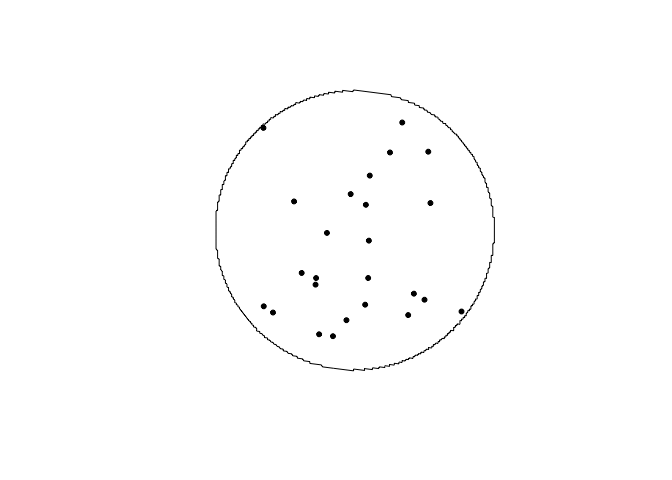
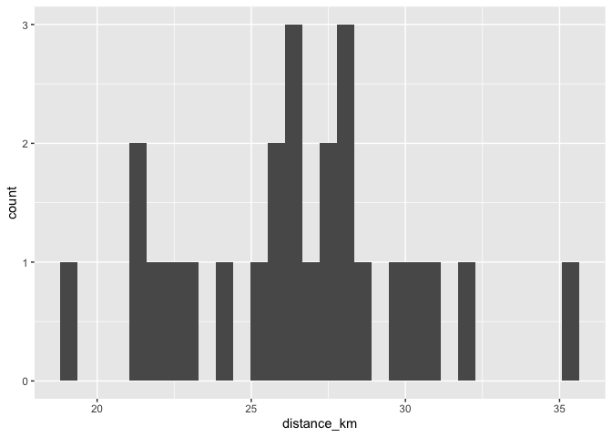
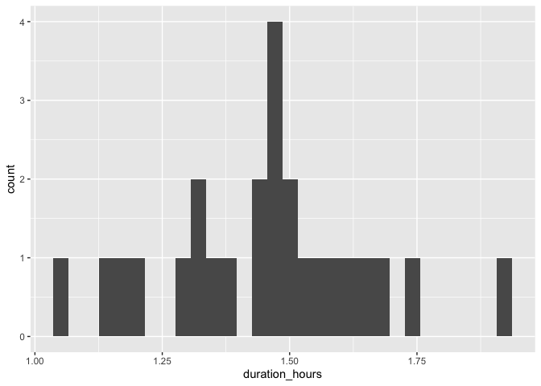
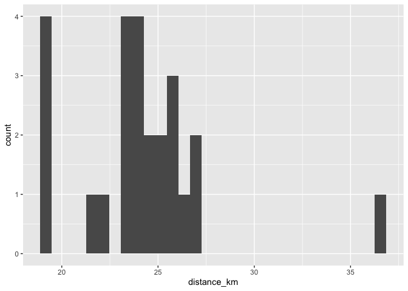
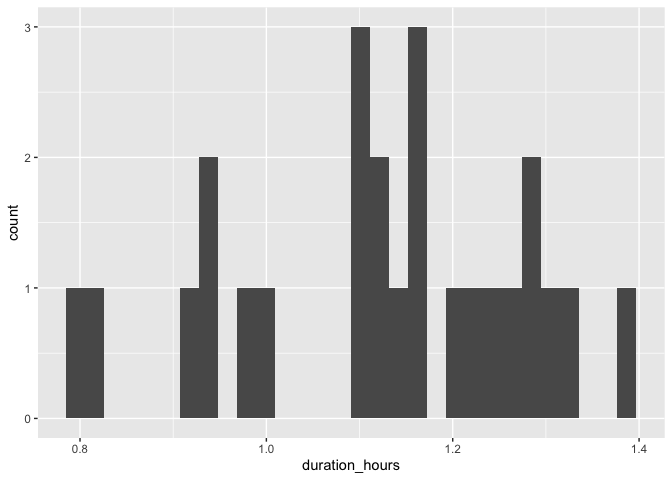
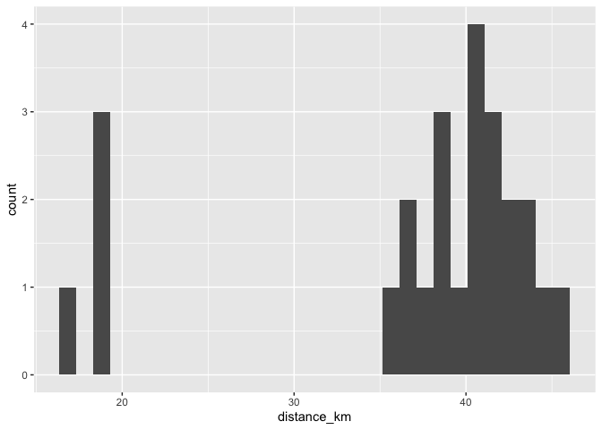
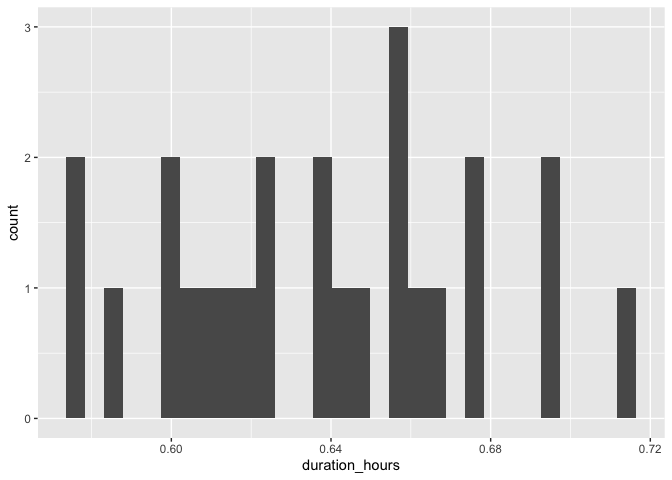
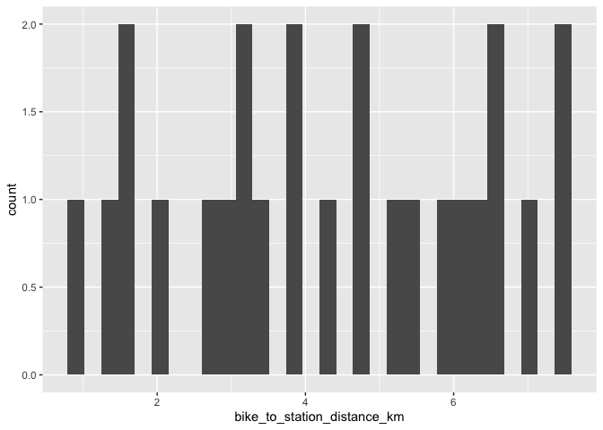
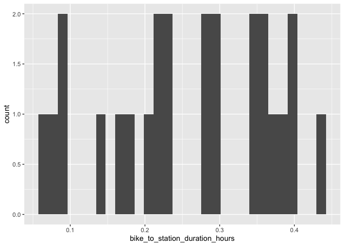

# Toronto

## Vaughan Metropolitan Centre Station

### Draw buffer and select points


```r
destination <- "Art Gallery of Ontario, Toronto, Canada"        #### EDIT ME
```

### Set origin point


```r
origin <- "Vaughan Metropolitan Centre Station, Toronto, Canada"    #### EDIT ME
```

#### Setup departure location and arrival time


```r
arrival_time <- as.POSIXct("2024-06-11 08:30:00", tz = "America/Toronto")       #### EDIT ME
```

#### List of variables for geocoding


```r
var_list <- c("var1", "var2", "var3", "var4", "var5", "var6", "var7", "var8", "var9", "var10", "var11", "var12", "var13", "var14", "var15", "var16", "var17", "var18", "var19", "var20", "var21", "var22", "var23", "var24", "var25")
```


```r
stations <- geocode(location = origin, output = "more", source = "google")
```

```
## ℹ <https://maps.googleapis.com/maps/api/geocode/json?address=Vaughan+Metropolitan+Centre+Station,+Toronto,+Canada&key=xxx>
```

```r
stations_sf <- stations %>%
                st_as_sf(coords = c("lon", "lat"), crs = 4326)

stations_buffer = st_buffer(stations_sf, 5000)

stations_buffer <- as_sf(stations_buffer)
```

#### Interactive map view of buffers


```r
mapview(stations_buffer)
```

```{=html}
<div class="leaflet html-widget html-fill-item" id="htmlwidget-5ceaebb69961178e03c4" style="width:672px;height:480px;"></div>
<script type="application/json" data-for="htmlwidget-5ceaebb69961178e03c4">{"x":{"options":{"minZoom":1,"maxZoom":52,"crs":{"crsClass":"L.CRS.EPSG3857","code":null,"proj4def":null,"projectedBounds":null,"options":{}},"preferCanvas":false,"bounceAtZoomLimits":false,"maxBounds":[[[-90,-370]],[[90,370]]]},"calls":[{"method":"addProviderTiles","args":["CartoDB.Positron","CartoDB.Positron","CartoDB.Positron",{"errorTileUrl":"","noWrap":false,"detectRetina":false,"pane":"tilePane"}]},{"method":"addProviderTiles","args":["CartoDB.DarkMatter","CartoDB.DarkMatter","CartoDB.DarkMatter",{"errorTileUrl":"","noWrap":false,"detectRetina":false,"pane":"tilePane"}]},{"method":"addProviderTiles","args":["OpenStreetMap","OpenStreetMap","OpenStreetMap",{"errorTileUrl":"","noWrap":false,"detectRetina":false,"pane":"tilePane"}]},{"method":"addProviderTiles","args":["Esri.WorldImagery","Esri.WorldImagery","Esri.WorldImagery",{"errorTileUrl":"","noWrap":false,"detectRetina":false,"pane":"tilePane"}]},{"method":"addProviderTiles","args":["OpenTopoMap","OpenTopoMap","OpenTopoMap",{"errorTileUrl":"","noWrap":false,"detectRetina":false,"pane":"tilePane"}]},{"method":"createMapPane","args":["polygon",420]},{"method":"addPolygons","args":[[[[{"lng":[-79.58141445661606,-79.58141445661606,-79.58071218622452,-79.58071218622452,-79.580009910396,-79.580009910396,-79.57939541458629,-79.57939541458629,-79.57930762913084,-79.57930762913084,-79.57895648645959,-79.57895648645959,-79.5786053424293,-79.57860534242928,-79.57825419703998,-79.57825419703998,-79.5779030502917,-79.5779030502917,-79.57755190218447,-79.57755190218447,-79.57720075271835,-79.57720075271835,-79.57684960189339,-79.57684960189339,-79.57649844970958,-79.57649844970956,-79.57614729616698,-79.57614729616698,-79.57579614126566,-79.57579614126564,-79.57544498500559,-79.57544498500559,-79.57509382738688,-79.57509382738688,-79.5745670884114,-79.5745670884114,-79.5743915080736,-79.5743915080736,-79.57373307878203,-79.57373307878203,-79.57368918332611,-79.57368918332611,-79.5729868531447,-79.5729868531447,-79.57197724398956,-79.57197724398956,-79.57193334768466,-79.57193334768466,-79.57158217648136,-79.57158217648136,-79.57017747808604,-79.57017747808604,-79.56947512073964,-79.56912394002939,-79.56912394002939,-79.56877275796117,-79.56877275796117,-79.56807038975093,-79.56807038975093,-79.56736801610923,-79.56675343471748,-79.56675343471748,-79.56666563703637,-79.56666563703637,-79.56596325253265,-79.56561205824433,-79.56561205824433,-79.56526086259839,-79.56526086259839,-79.56455846723389,-79.5642072675154,-79.5642072675154,-79.56385606643947,-79.56385606643947,-79.56315366021539,-79.56280245506736,-79.56280245506736,-79.56245124856201,-79.56245124856201,-79.56174883147962,-79.56139762090264,-79.56139762090264,-79.56104640896851,-79.56104640896851,-79.56034398102899,-79.55964154766139,-79.55964154766139,-79.55893910886599,-79.5582366646431,-79.55788544049645,-79.55788544049645,-79.55753421499304,-79.55753421499304,-79.5561292994126,-79.55577806712598,-79.55577806712598,-79.55542683348284,-79.55542683348284,-79.55472436212713,-79.55402188534578,-79.55349502419936,-79.55349502419936,-79.55331940313908,-79.55331940313908,-79.55191442245088,-79.55086067269551,-79.55086067269551,-79.55050942006501,-79.55050942006501,-79.54980691073619,-79.54910439598389,-79.54840187580838,-79.54769935020998,-79.54769935020998,-79.54629428274575,-79.54488919359365,-79.54348408275608,-79.54243023539834,-79.54243023539834,-79.54207895023556,-79.54207895023556,-79.54137637584495,-79.54067379603453,-79.53997121080455,-79.53926862015538,-79.53856602408732,-79.53786342260064,-79.53716081569567,-79.53645820337272,-79.53575558563209,-79.53505296247408,-79.53435033389901,-79.53364769990718,-79.53294506049889,-79.53224241567446,-79.53153976543419,-79.53083710977837,-79.53013444870734,-79.52943178222139,-79.52872911032082,-79.52802643300595,-79.52802643300595,-79.52662106213451,-79.52521566960954,-79.52381025543345,-79.52310754022702,-79.52310754022702,-79.5230855802896,-79.5230855802896,-79.52240481960872,-79.5217020935789,-79.52099936213783,-79.52029662528582,-79.51959388302318,-79.51959388302318,-79.51941819661215,-79.51941819661215,-79.51818838226727,-79.51678285987252,-79.51678285987252,-79.51643147589306,-79.51643147589306,-79.51608009056137,-79.51537731584142,-79.514674535713,-79.5139717501764,-79.5139717501764,-79.51256616287992,-79.51186336112065,-79.51186336112065,-79.51184139847855,-79.51184139847855,-79.51116055395443,-79.51045774138159,-79.5097549234024,-79.5097549234024,-79.50834927122628,-79.50764643702993,-79.50764643702993,-79.50694359742852,-79.50624075242227,-79.50624075242227,-79.50623526142439,-79.50623526142439,-79.50553790201157,-79.50483504619666,-79.50483504619666,-79.50448361626275,-79.50448361626275,-79.50413218497791,-79.50342931835554,-79.50342931835554,-79.50307788301814,-79.50307788301814,-79.50132068607019,-79.50132068607019,-79.50061779783665,-79.50061779783665,-79.50026635169411,-79.50026635169409,-79.49991490420108,-79.49921200516378,-79.49921200516377,-79.49886055361959,-79.49886055361959,-79.49850910072506,-79.49780619088524,-79.49780619088524,-79.49771832677551,-79.49771832677551,-79.4971032756446,-79.49640035500349,-79.49640035500349,-79.49569742896216,-79.49569742896216,-79.49534596391653,-79.49534596391653,-79.49429156068018,-79.49429156068018,-79.49428606896485,-79.49428606896485,-79.49358861844014,-79.49288567080113,-79.49288567080113,-79.49218271776347,-79.49218271776347,-79.49147975932746,-79.49147975932746,-79.49112827808517,-79.49112827808517,-79.49007382626164,-79.49007382626164,-79.48937085163243,-79.48937085163243,-79.4893269155389,-79.4893269155389,-79.4886678716061,-79.4886678716061,-79.48831637956911,-79.48831637956911,-79.48796488618297,-79.48726189536333,-79.48726189536333,-79.4865588991475,-79.4865588991475,-79.48585589753577,-79.48585589753577,-79.48515289052847,-79.48515289052847,-79.48513092147255,-79.48513092147255,-79.48444987812589,-79.48444987812589,-79.48436200119622,-79.48436200119622,-79.48304383713612,-79.48304383713612,-79.48286808049519,-79.48286808049519,-79.48234080854957,-79.48234080854957,-79.48216505056008,-79.48216505056008,-79.48163777456895,-79.48163777456895,-79.48146201523102,-79.48146201523102,-79.48023169042683,-79.48023169042683,-79.48022070530953,-79.48022070530953,-79.47952864026594,-79.47952864026594,-79.47882558471223,-79.47882558471223,-79.47812252376599,-79.47812252376599,-79.47741945742757,-79.47741945742757,-79.47741945742757,-79.47706792223637,-79.47706792223637,-79.47671638569724,-79.47671638569724,-79.47601330857533,-79.47601330857533,-79.47531022606215,-79.47531022606215,-79.47531022606215,-79.4751344545915,-79.4751344545915,-79.47460713815799,-79.47460713815799,-79.47390404486318,-79.47390404486318,-79.47390404486318,-79.47355249619434,-79.47355249619434,-79.47320094617798,-79.47320094617798,-79.47249784210275,-79.47249784210275,-79.47249784210275,-79.47179473263778,-79.47179473263778,-79.47179473263778,-79.47161895442943,-79.47161895442943,-79.47109161778337,-79.47109161778337,-79.47109161778337,-79.47074005833524,-79.47074005833524,-79.47038849753984,-79.47038849753984,-79.47038849753984,-79.47003693539725,-79.47003693539725,-79.46968537190749,-79.46968537190749,-79.46968537190749,-79.46950958965743,-79.46950958965743,-79.46898224088663,-79.46898224088663,-79.46898224088663,-79.46827910447755,-79.46827910447755,-79.46827910447755,-79.46827910447755,-79.46810331953341,-79.46810331953341,-79.46757596268058,-79.46757596268058,-79.46722438976172,-79.46722438976172,-79.46687281549602,-79.46687281549602,-79.46687281549602,-79.46687281549602,-79.46616966292417,-79.46616966292417,-79.46616966292417,-79.46546650496536,-79.46546650496536,-79.46546650496536,-79.46546650496536,-79.46546650496536,-79.46546650496536,-79.46546650496536,-79.46546650496536,-79.46511492396594,-79.46511492396594,-79.46476334161987,-79.46476334161987,-79.46476334161987,-79.46476334161987,-79.46476334161987,-79.46476334161987,-79.46476334161987,-79.46546650496536,-79.46546650496536,-79.46546650496536,-79.46546650496536,-79.46546650496536,-79.46546650496536,-79.46546650496536,-79.4659938739395,-79.4659938739395,-79.46616966292417,-79.46616966292417,-79.46616966292417,-79.46616966292417,-79.4666970278581,-79.4666970278581,-79.46687281549602,-79.46687281549602,-79.46687281549602,-79.46687281549602,-79.46722438976172,-79.46722438976172,-79.46757596268058,-79.46757596268058,-79.46757596268058,-79.46825713137795,-79.46825713137795,-79.46827910447755,-79.46827910447755,-79.46827910447755,-79.46863067335559,-79.46863067335559,-79.46898224088663,-79.46898224088663,-79.46898224088663,-79.46968537190749,-79.46968537190749,-79.47003693539725,-79.47003693539725,-79.47038849753984,-79.47038849753984,-79.47038849753984,-79.4709158382277,-79.47091583822771,-79.47109161778337,-79.47109161778337,-79.47109161778337,-79.47179473263778,-79.47179473263778,-79.47214628804396,-79.47214628804396,-79.47249784210275,-79.47249784210275,-79.47249784210275,-79.47320094617798,-79.47320094617798,-79.47355249619434,-79.47355249619434,-79.47390404486318,-79.47390404486318,-79.47390404486316,-79.47460713815799,-79.47460713815799,-79.47531022606215,-79.47531022606215,-79.47601330857533,-79.47601330857533,-79.47662850135184,-79.47662850135184,-79.47671638569724,-79.47671638569724,-79.47724369000045,-79.47724369000046,-79.47741945742757,-79.47741945742757,-79.47794675768689,-79.47794675768689,-79.47812252376599,-79.47812252376599,-79.4786498199812,-79.4786498199812,-79.47882558471223,-79.47882558471223,-79.47935287688307,-79.47935287688307,-79.47952864026594,-79.47952864026594,-79.48018774994978,-79.48018774994978,-79.48023169042683,-79.48023169042683,-79.48093473519461,-79.48093473519461,-79.48163777456895,-79.48163777456895,-79.48269232351711,-79.48269232351711,-79.48304383713612,-79.48304383713612,-79.48365898272432,-79.48365898272432,-79.48374686032834,-79.48374686032834,-79.48444987812589,-79.48444987812589,-79.48515289052847,-79.48550439470654,-79.48550439470654,-79.48585589753577,-79.48585589753577,-79.4865588991475,-79.48655889914748,-79.48726189536333,-79.48787701262563,-79.48787701262563,-79.48796488618297,-79.48796488618297,-79.4886678716061,-79.48901936229389,-79.48901936229389,-79.48937085163243,-79.48937085163243,-79.49007382626164,-79.49007382626164,-79.49147975932746,-79.49147975932746,-79.49218271776347,-79.49288567080113,-79.49323714529548,-79.49323714529548,-79.49358861844014,-79.49358861844014,-79.49429156068018,-79.49481876381697,-79.49481876381697,-79.49499449752096,-79.49499449752096,-79.49569742896216,-79.49640035500349,-79.49640035500349,-79.4971032756446,-79.49850910072506,-79.49850910072506,-79.49921200516378,-79.49991490420108,-79.50061779783665,-79.50061779783665,-79.50132068607019,-79.50342931835554,-79.50342931835554,-79.50413218497791,-79.50483504619666,-79.50553790201157,-79.50624075242227,-79.50659217560099,-79.50659217560099,-79.50694359742852,-79.50694359742852,-79.50834927122627,-79.5097549234024,-79.51098485131809,-79.51098485131809,-79.51116055395443,-79.51116055395443,-79.51186336112065,-79.51256616287992,-79.51326895923194,-79.5139717501764,-79.514674535713,-79.51537731584142,-79.51608009056137,-79.51678285987252,-79.51748562377459,-79.51818838226727,-79.51889113535023,-79.51959388302318,-79.52029662528582,-79.52099936213783,-79.5217020935789,-79.52240481960872,-79.523107540227,-79.52381025543345,-79.52451296522771,-79.52521566960954,-79.52591836857856,-79.52662106213451,-79.52732375027709,-79.52802643300595,-79.52802643300595,-79.52837777234016,-79.52837777234016,-79.52943178222139,-79.53083710977837,-79.53224241567445,-79.53294506049889,-79.53294506049889,-79.53364769990718,-79.53435033389901,-79.53505296247408,-79.53575558563209,-79.53645820337272,-79.53645820337272,-79.53786342260064,-79.53926862015538,-79.53926862015538,-79.53997121080455,-79.54067379603451,-79.54137637584495,-79.54137637584495,-79.54155201995073,-79.54155201995073,-79.54207895023556,-79.54348408275608,-79.54348408275608,-79.54383536249836,-79.54383536249836,-79.5441866408854,-79.54488919359365,-79.54559174088052,-79.54559174088052,-79.54567955891018,-79.54567955891018,-79.54629428274575,-79.54769935020998,-79.54769935020998,-79.54840187580838,-79.54910439598389,-79.54910439598389,-79.54919221062451,-79.54919221062451,-79.55050942006501,-79.55050942006501,-79.55086067269551,-79.55086067269551,-79.55121192397,-79.55191442245088,-79.55191442245088,-79.55226566965719,-79.55226566965719,-79.55331940313908,-79.55402188534578,-79.55402188534578,-79.55472436212713,-79.55472436212713,-79.55507559848323,-79.55507559848321,-79.5561292994126,-79.5561292994126,-79.55648053034265,-79.55648053034265,-79.55683175991611,-79.55753421499304,-79.55753421499304,-79.55755616662675,-79.55755616662675,-79.55893910886599,-79.55893910886599,-79.55964154766139,-79.55964154766139,-79.55999276502368,-79.55999276502368,-79.56034398102899,-79.56104640896851,-79.56104640896851,-79.56174883147962,-79.56174883147962,-79.56210004069943,-79.56210004069942,-79.56315366021541,-79.56315366021541,-79.56385606643947,-79.56385606643947,-79.56403166714711,-79.56403166714711,-79.56455846723389,-79.56526086259839,-79.56526086259839,-79.56596325253265,-79.56596325253265,-79.56666563703637,-79.56666563703637,-79.56684123231373,-79.56684123231373,-79.56736801610923,-79.56736801610923,-79.567719203609,-79.567719203609,-79.56877275796117,-79.56877275796117,-79.56947512073964,-79.56947512073964,-79.57017747808604,-79.57017747808604,-79.57087983000004,-79.57087983000004,-79.57158217648136,-79.57158217648136,-79.57228451752968,-79.57228451752968,-79.5729868531447,-79.5729868531447,-79.57368918332611,-79.57368918332611,-79.5743915080736,-79.5743915080736,-79.57509382738688,-79.57509382738688,-79.57579614126566,-79.57579614126566,-79.57649844970958,-79.57649844970958,-79.57649844970956,-79.57684960189339,-79.57684960189339,-79.57720075271835,-79.57720075271835,-79.57737632762127,-79.57737632762127,-79.5779030502917,-79.5779030502917,-79.5786053424293,-79.5786053424293,-79.57930762913084,-79.57930762913084,-79.57930762913084,-79.5794831999568,-79.5794831999568,-79.580009910396,-79.580009910396,-79.58071218622452,-79.58071218622452,-79.58071218622452,-79.58106332209992,-79.58106332209992,-79.58141445661605,-79.58141445661606,-79.58211672157032,-79.58211672157032,-79.58211672157032,-79.58229228695926,-79.58229228695926,-79.58281898108699,-79.58281898108699,-79.58317010880613,-79.58317010880613,-79.58352123516576,-79.58352123516576,-79.58422348380634,-79.58422348380635,-79.58422348380634,-79.58492572700843,-79.58492572700843,-79.58492572700843,-79.58562796477169,-79.58562796477169,-79.58562796477169,-79.58597908161369,-79.58597908161369,-79.58633019709586,-79.58633019709586,-79.58633019709586,-79.58703242398059,-79.58703242398059,-79.58703242398059,-79.58720797985184,-79.58720797985184,-79.5877346454256,-79.5877346454256,-79.5877346454256,-79.5877346454256,-79.58782242272373,-79.58782242272373,-79.58843686143059,-79.58843686143059,-79.58878796739297,-79.58878796739297,-79.58913907199523,-79.58913907199523,-79.58913907199523,-79.58913907199523,-79.58913907199523,-79.58913907199523,-79.58949017523732,-79.58949017523732,-79.58984127711922,-79.58984127711922,-79.58984127711922,-79.58984127711923,-79.58984127711922,-79.58984127711922,-79.58984127711922,-79.58984127711922,-79.58984127711923,-79.58984127711922,-79.58984127711922,-79.58984127711922,-79.58949017523732,-79.58949017523732,-79.58913907199523,-79.58913907199523,-79.58913907199523,-79.58913907199523,-79.58913907199523,-79.58913907199523,-79.58852463804868,-79.58852463804868,-79.58843686143059,-79.58843686143059,-79.58843686143059,-79.58843686143059,-79.5877346454256,-79.5877346454256,-79.5877346454256,-79.58738353538308,-79.58738353538308,-79.58703242398059,-79.58703242398059,-79.58703242398059,-79.58633019709586,-79.58633019709586,-79.58633019709586,-79.58580352336267,-79.58580352336267,-79.58562796477169,-79.58562796477169,-79.58510128695914,-79.58510128695914,-79.58492572700843,-79.58492572700843,-79.58492572700843,-79.58431126450404,-79.58431126450404,-79.58422348380634,-79.58422348380634,-79.58352123516576,-79.58352123516576,-79.58317010880613,-79.58317010880613,-79.58281898108699,-79.58281898108699,-79.58281898108699,-79.58211672157032,-79.58211672157032,-79.58176558977286,-79.58176558977286,-79.58141445661606],"lat":[43.7716367371995,43.77074878204927,43.77068427614414,43.77009229715431,43.77002778636795,43.76943580027795,43.76937934933884,43.7693053505806,43.76929728585296,43.76877929142024,43.76874703176309,43.76845103249842,43.76841877162092,43.76812277058127,43.76809050848344,43.76779450566882,43.76776224235064,43.76746623776108,43.76743397322254,43.76713796685805,43.76710570109915,43.76680969295975,43.76677742598048,43.76648141606616,43.76644914786652,43.76615313617732,43.76612086675729,43.76582485329322,43.7657925826528,43.76549656741388,43.76546429555306,43.76516827853928,43.76513600545807,43.76483998666946,43.76479157475398,43.76464356469951,43.76462742678054,43.76418339394415,43.7641228740391,43.76408587112439,43.76408183630994,43.763526789238,43.76346222963653,43.76287017255109,43.76277735955316,43.76274035575288,43.76273632017383,43.76247729279068,43.76244500747627,43.76155690323519,43.76142774980153,43.76083567147741,43.76077108740871,43.76073879352192,43.76044275171957,43.76041045661224,43.76011441303528,43.76004981914455,43.75945772668128,43.75939312790834,43.75933659992957,43.75926258788204,43.75925451214866,43.75873642469159,43.75867181609618,43.75863950994584,43.75834345755392,43.75831115018299,43.75801509601654,43.75795047759832,43.75791816653653,43.75762211062457,43.75758979834214,43.7572937406557,43.75722911241437,43.75719679644096,43.75690073700905,43.75686841981496,43.75657235860862,43.75650772054387,43.75647539965868,43.75617933670693,43.75614701460103,43.75585094987487,43.75578630198638,43.75572164915685,43.75512951445402,43.75506485674146,43.7550001940877,43.75496786090783,43.75467179094575,43.75463945654507,43.75434338480869,43.75421403491058,43.75418169434759,43.75388562089507,43.75385327911123,43.75355720388444,43.7534925166396,43.753427824453,43.75337930206997,43.7532312638258,43.75321508908402,43.75277097167925,43.75264156271297,43.75254449301522,43.75224841261139,43.75221605358894,43.75191997141095,43.75185524968845,43.75179052302358,43.75172579141621,43.75166105486627,43.75106888537746,43.75093939756622,43.75080988998357,43.7506803626288,43.75058320413679,43.75028711692838,43.75025472830733,43.7499586393249,43.74989385840446,43.74982907254051,43.74976428173299,43.74969948598178,43.7496346852868,43.74956987964796,43.74950506906516,43.7494402535383,43.74937543306729,43.74931060765206,43.74924577729248,43.7491809419885,43.74911610173998,43.74905125654686,43.74898640640904,43.74892155132642,43.74885669129891,43.74879182632642,43.74872695640885,43.74866208154612,43.74925425655181,43.74912449187325,43.74899470741287,43.74886490316993,43.74879999362977,43.74937365594702,43.74937162744242,43.74939013256662,43.74932724652658,43.74926232703584,43.749197402599,43.74913247321594,43.74906753888661,43.74951165955321,43.74949542518701,43.74964346451134,43.74952981526596,43.74939991186438,43.74969598906178,43.74966351010502,43.74995958549933,43.74992710529121,43.7498621411648,43.74979717209143,43.749732198071,43.75032434328919,43.7501943802895,43.7501293913687,43.75070302505667,43.7507009940714,43.75071949827209,43.75065653533053,43.75059153645611,43.75052653263406,43.75111866319335,43.75098864058874,43.75092362186461,43.75151574509453,43.75145072136376,43.75138569268488,43.7519731827659,43.75197267470941,43.75197730058761,43.75191277495843,43.75184773632445,43.7521437915629,43.75211127037561,43.75240732381106,43.75237480137201,43.75230975278254,43.75260580438569,43.75257327822059,43.75286932802072,43.75270667856439,43.75329877265312,43.75323370415157,43.75352974848412,43.75349721236284,43.75379325489239,43.75376071751922,43.75369563906106,43.75399167975834,43.7539591386587,43.75425517755298,43.75422263520139,43.75415754678627,43.7546756104712,43.75466747406491,43.75474148271476,43.75468452569895,43.75461942732647,43.75521149239169,43.75514638901115,43.75544241883198,43.75540986527098,43.75570589328881,43.75560822513732,43.75619565035274,43.75619514163484,43.7561997670023,43.75613515737343,43.75607003407673,43.75666207738922,43.75659694908401,43.75718898518461,43.75712385187082,43.75741986720934,43.75738729868151,43.75768331221708,43.75758559916426,43.75817762078267,43.75811247250102,43.75866748621672,43.75866341428132,43.75870041497193,43.75863933361699,43.7589353381085,43.75890275959215,43.7591987622807,43.75916618251208,43.75910101926179,43.75969301918622,43.75962785092675,43.76021984363933,43.76015467037059,43.76074665587132,43.76068147759325,43.76125495666887,43.76125291976614,43.76127141897933,43.76120827259463,43.76172624767823,43.76171809941278,43.7617920954053,43.76166986212635,43.7627057940939,43.76268949498269,43.76283748347173,43.76278858427036,43.76323254702212,43.76321624665848,43.76336423334455,43.76331533038588,43.76375928772874,43.76374298611265,43.76389097099576,43.76377685099224,43.76495146494078,43.76495044594207,43.76495969475901,43.7648954954021,43.76548741599616,43.76542219263048,43.76601410601268,43.76594887763688,43.76654078380724,43.76647555042123,43.76706744937972,43.76736339617629,43.76733077758266,43.76762672257627,43.76759410273007,43.76818598732289,43.7681207438582,43.76871262123915,43.76864737276405,43.76923924293312,43.76968314086516,43.7696668279472,43.76981479302668,43.76976585240472,43.77035770820797,43.77029244965387,43.77088429824522,43.77118021985815,43.77114758868041,43.77144350849036,43.77141087605995,43.77200271028538,43.77193744165207,43.77252926866559,43.773121088525,43.7730558148231,43.77364762747058,43.77409148226126,43.77407516303661,43.77422311373561,43.77417415419342,43.77476595247476,43.77506184893259,43.77502920764663,43.77532510230147,43.77529245976279,43.77588424367791,43.7761801329526,43.77614748913234,43.77644337660405,43.77641073153105,43.77700250107986,43.77744632354641,43.77743000052032,43.7775779404446,43.77752896949801,43.77812072468042,43.77871247270837,43.77864717366348,43.7792389144794,43.77983064814079,43.78027444369164,43.78025811811689,43.78040604906926,43.78035707047662,43.78183635529849,43.78180370128356,43.78209955286757,43.78206689759987,43.78265859537314,43.78325028599166,43.78384196945537,43.78377665503253,43.78496000038074,43.7861433171092,43.78607799750343,43.78666964507794,43.78726128549742,43.78785291876179,43.78844454487101,43.78903616382502,43.78962777562379,43.78992357883994,43.78989091699368,43.79018671840675,43.7901540553077,43.79074565273883,43.79192882613495,43.7942950870612,43.79666123349686,43.79784426377975,43.79843576818728,43.79850109394209,43.79909259125021,43.79968408140225,43.80027556439816,43.8008670402379,43.8014585089214,43.80204997044863,43.80209896176781,43.80224682604204,43.80226315586602,43.80270674601559,43.80388963340097,43.80448106635893,43.80453005413158,43.80467791126342,43.80469423990522,43.80513780862757,43.80572922732864,43.80632063887305,43.80635329530511,43.80664899840758,43.80668165361516,43.80756875222959,43.80816014235982,43.80822340843609,43.80824188926404,43.80824393002786,43.80881683222928,43.80940820810174,43.80944085972011,43.80973654498646,43.80976919538035,43.81006487887146,43.81124759494304,43.81131289215541,43.81190423951139,43.81193688628786,43.81223255729585,43.81226520284785,43.81256087208049,43.81315220517774,43.81320117124655,43.813349003413,43.81336532482023,43.81380881864599,43.81440013748421,43.81446542011475,43.81505673185123,43.81508937133679,43.81538502453488,43.81541766279599,43.8157133142186,43.81630461169554,43.81636988458624,43.81696117496114,43.81699380957679,43.81728945209397,43.8173220854852,43.81761772622684,43.81820900234169,43.81827426549259,43.81886553450509,43.81893079275832,43.81952205466835,43.81958730802396,43.82017856283142,43.82023565550307,43.82030956185677,43.82031771764402,43.82083505899423,43.82088399212896,43.82103180294708,43.82104811337633,43.82149154315672,43.82154047261833,43.82168828166073,43.82170459086562,43.82214801531882,43.82219694110736,43.82234474837401,43.82236105635455,43.82280447548047,43.82285339759598,43.82300120308685,43.82301750984305,43.82346092364161,43.82352207125945,43.82355902223081,43.82356309858412,43.82411735980218,43.82418257887583,43.82477378396212,43.82483899813853,43.82543019612134,43.82552800818309,43.82582360453136,43.82585620608959,43.82615180066194,43.82620885043392,43.8262827488034,43.82629089846218,43.8268081839225,43.82687337845542,43.82746455518223,43.82752974481821,43.82756233777921,43.82785792349928,43.82789051523607,43.82818609918014,43.82825127896736,43.82884244154116,43.82890761643163,43.82896464039884,43.82903853523008,43.8290466812025,43.82956394189497,43.82962910693713,43.82966168760137,43.82995726272013,43.82998984216025,43.8302854155029,43.83035057069705,43.83094171206768,43.83107200771187,43.83166314203272,43.83172828248289,43.83179341798199,43.83182598387492,43.83212154841903,43.83215411308795,43.83244967585584,43.83251480150788,43.83256364249794,43.83271142323463,43.83272770294923,43.83317104248466,43.83323615828995,43.83330126914462,43.83389238236978,43.83395748832864,43.83408768539514,43.83467879162441,43.8347438827869,43.83480896899921,43.83487405026144,43.83546514949454,43.8355302258614,43.83572542526296,43.8363165175542,43.83638157417657,43.83644662584942,43.83651167257282,43.83657671434687,43.83660923337791,43.83690477696108,43.83693729476845,43.83723283657512,43.83736289548629,43.83749293460151,43.83760670258905,43.83775447289938,43.83777072423526,43.83821403249114,43.83827903478262,43.83834403212555,43.83840902452005,43.83847401196621,43.83853899446411,43.83860397201387,43.83866894461554,43.83873391226926,43.83879887497509,43.83886383273313,43.83892878554348,43.83899373340623,43.83905867632146,43.8391236142893,43.8391885473098,43.83925347538308,43.83931839850923,43.83938331668833,43.83944822992048,43.83951313820578,43.8395780415443,43.83964293993617,43.83970783338146,43.83977272188025,43.83947718283844,43.83950962521938,43.83921408437362,43.83931140405627,43.83944114632149,43.83957086880267,43.83963572262447,43.83904463520918,43.83910948403103,43.83917432790722,43.83923916683789,43.83930400082311,43.83936882986298,43.83877773501487,43.83890737815047,43.8390370015058,43.83844589927904,43.83851070348511,43.83857550274639,43.83864029706301,43.83819696557098,43.83821316336738,43.83806538530476,43.83811397682954,43.83824354063172,43.83794798308904,43.83798037093582,43.83768481158913,43.83771719818627,43.8377819676724,43.83784673221442,43.83732949893075,43.83733759414494,43.83726370322739,43.83732036755779,43.83744987181364,43.8368587402886,43.83692348494662,43.83698822466102,43.83647097860663,43.8364790707174,43.83640517797546,43.83652655035526,43.83623097821753,43.83626334123677,43.83596776729498,43.83600012906483,43.8360648488971,43.83576927312411,43.83580163117298,43.83550605359594,43.83560312028723,43.83566782523605,43.83507666457471,43.83514136452636,43.83484578148281,43.83487812959152,43.83458254474389,43.83467958161522,43.83438399493636,43.83441633807526,43.83412074959232,43.83415309148199,43.83421777155451,43.83364506369465,43.83364708486563,43.83362861030658,43.83375593434494,43.83316474465538,43.83322940979235,43.83293381223464,43.83296614293624,43.83267054357444,43.83270287302695,43.83276752822545,43.83217632404881,43.83224097425103,43.83194536944978,43.8319776926841,43.83168208607875,43.83177904832836,43.83118782966455,43.83125246493285,43.83080904619413,43.83082520422888,43.830677397084,43.83072586932499,43.83079049465594,43.83019926150488,43.83026388184006,43.82967264147261,43.82973725681209,43.82929382179562,43.82930997484821,43.82916216227741,43.82921061957209,43.82891499306719,43.82894729637261,43.82865166806361,43.8287485705276,43.82815730845637,43.82822190386845,43.82763063458079,43.8276952249976,43.82710394849352,43.82716853391514,43.82657725019461,43.82664183062112,43.82605053968415,43.82611511511564,43.82552381696224,43.82558838739877,43.82499708202894,43.82506164747059,43.82447033488432,43.82453489533118,43.82394357552847,43.82400813098062,43.82341680396149,43.82348135441899,43.82289002018342,43.82295456564636,43.82236322419435,43.82206755078273,43.82209982162072,43.821804146405,43.82183641599438,43.82139289979324,43.82140903411455,43.82126119448222,43.82130959558356,43.8207182325371,43.820782762962,43.82019139269912,43.82025591812976,43.81966454065044,43.81922100284122,43.81923713340309,43.81908928656807,43.81913767639118,43.81854628453397,43.81861079992139,43.81801940084778,43.81772369862544,43.81775595442577,43.81746025039934,43.81749250495115,43.81690109149976,43.81696559684417,43.81637417617639,43.81593060597592,43.81594673151624,43.81579887388416,43.81584724864274,43.81496009338905,43.81499234164342,43.81469661963113,43.81472886663705,43.81413741721398,43.81420190746671,43.8136104508273,43.81301898702674,43.81308347223057,43.81249200121368,43.8119005230357,43.81196500319066,43.81137351779637,43.81048627627803,43.81051851443455,43.81022276366745,43.81025500057557,43.80966349364302,43.80907197954956,43.80913644955145,43.80795339977121,43.80750974871905,43.80752586540984,43.80737798082723,43.80742632903746,43.80683478618994,43.80624323618169,43.80572562405048,43.80573368179553,43.80565973675696,43.8057161388059,43.8036456321306,43.8036778600782,43.80338206623587,43.80341429293512,43.80282269985229,43.80223109960902,43.80163949220536,43.80104787764137,43.80075206767425,43.80078429301377,43.80048848124265,43.80052070533382,43.79992907639352,43.7987457970323,43.79756248903061,43.79637915238882,43.79519578710732,43.79401239318651,43.79282897062678,43.79164551942851,43.79046203959211,43.78927853111796,43.78809499400645,43.78806277050388,43.78776688176556,43.78773465704269,43.78743876652866,43.78684698013123,43.78625518657467,43.78566338585905,43.78507157798443,43.78501518197138,43.78494120548987,43.78493314860886,43.7844153101124,43.78323165868161,43.78263982222801,43.78257536462171,43.78198352106599,43.78139167035161,43.78135943975348,43.78106351172599,43.78103127990759,43.78073535010463,43.77955161299646,43.77948714579822,43.77889526656325,43.77830338016991,43.77825502661598,43.77810705390982,43.77809093544483,43.77705511399961,43.77700675682757,43.77685878055652,43.77684266088548,43.77639872939868,43.77580681448626,43.77575039329441,43.77567640343328,43.77566834295528,43.77455848163054,43.77449399513573,43.77390205886336,43.77386981379267,43.77357384298656,43.77354159669559,43.7732456241143,43.77265367358338,43.77258917738342,43.77199721975192,43.77196496982865,43.77166898834307,43.7716367371995]}]]],null,"stations_buffer",{"crs":{"crsClass":"L.CRS.EPSG3857","code":null,"proj4def":null,"projectedBounds":null,"options":{}},"pane":"polygon","stroke":true,"color":"#333333","weight":0.5,"opacity":0.9,"fill":true,"fillColor":"#6666FF","fillOpacity":0.6,"smoothFactor":1,"noClip":false},"<div class='scrollableContainer'><table class=mapview-popup id='popup'><tr class='coord'><td><\/td><th><b>Feature ID&emsp;<\/b><\/th><td>1&emsp;<\/td><\/tr><tr><td>1<\/td><th>type&emsp;<\/th><td>establishment&emsp;<\/td><\/tr><tr><td>2<\/td><th>loctype&emsp;<\/th><td>rooftop&emsp;<\/td><\/tr><tr><td>3<\/td><th>address&emsp;<\/th><td>vaughan metropolitan centre, 3150 hwy 7, vaughan, on l4k 4r6, canada&emsp;<\/td><\/tr><tr><td>4<\/td><th>north&emsp;<\/th><td>43.79551&emsp;<\/td><\/tr><tr><td>5<\/td><th>south&emsp;<\/th><td>43.79281&emsp;<\/td><\/tr><tr><td>6<\/td><th>east&emsp;<\/th><td>-79.52597&emsp;<\/td><\/tr><tr><td>7<\/td><th>west&emsp;<\/th><td>-79.52867&emsp;<\/td><\/tr><tr><td>8<\/td><th>geometry&emsp;<\/th><td>sfc_POLYGON&emsp;<\/td><\/tr><\/table><\/div>",{"maxWidth":800,"minWidth":50,"autoPan":true,"keepInView":false,"closeButton":true,"closeOnClick":true,"className":""},"1",{"interactive":false,"permanent":false,"direction":"auto","opacity":1,"offset":[0,0],"textsize":"10px","textOnly":false,"className":"","sticky":true},{"stroke":true,"weight":1,"opacity":0.9,"fillOpacity":0.84,"bringToFront":false,"sendToBack":false}]},{"method":"addScaleBar","args":[{"maxWidth":100,"metric":true,"imperial":true,"updateWhenIdle":true,"position":"bottomleft"}]},{"method":"addHomeButton","args":[-79.58984127711923,43.74866208154612,-79.46476334161987,43.83977272188025,true,"stations_buffer","Zoom to stations_buffer","<strong> stations_buffer <\/strong>","bottomright"]},{"method":"addLayersControl","args":[["CartoDB.Positron","CartoDB.DarkMatter","OpenStreetMap","Esri.WorldImagery","OpenTopoMap"],"stations_buffer",{"collapsed":true,"autoZIndex":true,"position":"topleft"}]},{"method":"addLegend","args":[{"colors":["#6666FF"],"labels":["stations_buffer"],"na_color":null,"na_label":"NA","opacity":1,"position":"topright","type":"factor","title":"","extra":null,"layerId":null,"className":"info legend","group":"stations_buffer"}]}],"limits":{"lat":[43.74866208154612,43.83977272188025],"lng":[-79.58984127711923,-79.46476334161987]},"fitBounds":[43.74866208154612,-79.58984127711923,43.83977272188025,-79.46476334161987,[]]},"evals":[],"jsHooks":{"render":[{"code":"function(el, x, data) {\n  return (\n      function(el, x, data) {\n      // get the leaflet map\n      var map = this; //HTMLWidgets.find('#' + el.id);\n      // we need a new div element because we have to handle\n      // the mouseover output separately\n      // debugger;\n      function addElement () {\n      // generate new div Element\n      var newDiv = $(document.createElement('div'));\n      // append at end of leaflet htmlwidget container\n      $(el).append(newDiv);\n      //provide ID and style\n      newDiv.addClass('lnlt');\n      newDiv.css({\n      'position': 'relative',\n      'bottomleft':  '0px',\n      'background-color': 'rgba(255, 255, 255, 0.7)',\n      'box-shadow': '0 0 2px #bbb',\n      'background-clip': 'padding-box',\n      'margin': '0',\n      'padding-left': '5px',\n      'color': '#333',\n      'font': '9px/1.5 \"Helvetica Neue\", Arial, Helvetica, sans-serif',\n      'z-index': '700',\n      });\n      return newDiv;\n      }\n\n\n      // check for already existing lnlt class to not duplicate\n      var lnlt = $(el).find('.lnlt');\n\n      if(!lnlt.length) {\n      lnlt = addElement();\n\n      // grab the special div we generated in the beginning\n      // and put the mousmove output there\n\n      map.on('mousemove', function (e) {\n      if (e.originalEvent.ctrlKey) {\n      if (document.querySelector('.lnlt') === null) lnlt = addElement();\n      lnlt.text(\n                           ' lon: ' + (e.latlng.lng).toFixed(5) +\n                           ' | lat: ' + (e.latlng.lat).toFixed(5) +\n                           ' | zoom: ' + map.getZoom() +\n                           ' | x: ' + L.CRS.EPSG3857.project(e.latlng).x.toFixed(0) +\n                           ' | y: ' + L.CRS.EPSG3857.project(e.latlng).y.toFixed(0) +\n                           ' | epsg: 3857 ' +\n                           ' | proj4: +proj=merc +a=6378137 +b=6378137 +lat_ts=0.0 +lon_0=0.0 +x_0=0.0 +y_0=0 +k=1.0 +units=m +nadgrids=@null +no_defs ');\n      } else {\n      if (document.querySelector('.lnlt') === null) lnlt = addElement();\n      lnlt.text(\n                      ' lon: ' + (e.latlng.lng).toFixed(5) +\n                      ' | lat: ' + (e.latlng.lat).toFixed(5) +\n                      ' | zoom: ' + map.getZoom() + ' ');\n      }\n      });\n\n      // remove the lnlt div when mouse leaves map\n      map.on('mouseout', function (e) {\n      var strip = document.querySelector('.lnlt');\n      if( strip !==null) strip.remove();\n      });\n\n      };\n\n      //$(el).keypress(67, function(e) {\n      map.on('preclick', function(e) {\n      if (e.originalEvent.ctrlKey) {\n      if (document.querySelector('.lnlt') === null) lnlt = addElement();\n      lnlt.text(\n                      ' lon: ' + (e.latlng.lng).toFixed(5) +\n                      ' | lat: ' + (e.latlng.lat).toFixed(5) +\n                      ' | zoom: ' + map.getZoom() + ' ');\n      var txt = document.querySelector('.lnlt').textContent;\n      console.log(txt);\n      //txt.innerText.focus();\n      //txt.select();\n      setClipboardText('\"' + txt + '\"');\n      }\n      });\n\n      }\n      ).call(this.getMap(), el, x, data);\n}","data":null},{"code":"function(el, x, data) {\n  return (function(el,x,data){\n           var map = this;\n\n           map.on('keypress', function(e) {\n               console.log(e.originalEvent.code);\n               var key = e.originalEvent.code;\n               if (key === 'KeyE') {\n                   var bb = this.getBounds();\n                   var txt = JSON.stringify(bb);\n                   console.log(txt);\n\n                   setClipboardText('\\'' + txt + '\\'');\n               }\n           })\n        }).call(this.getMap(), el, x, data);\n}","data":null}]}}</script>
```

#### Generate points within buffer


```r
set.seed(100)
points_sample_sf <- st_sample(stations_buffer, size = c(25,25), type = "random")
```

```
## Warning in st_poly_sample(x, size = size, ..., type = type, by_polygon =
## by_polygon, : coordinate ranges not computed along great circles; install
## package lwgeom to get rid of this warning
```

```r
points_sample_sf <- st_as_sf(points_sample_sf)
points_sample <- sf_to_df(points_sample_sf)
```

#### Check to see if they worked


```r
ottawa_check_buffer <- stations_buffer %>% slice(1:2)

plot(st_geometry(ottawa_check_buffer))
plot(points_sample_sf, pch = 20, add= TRUE)
```

<!-- -->


```r
points_sample$destination <- destination
points_sample$origin <- origin
points_sample$lat_lon <- paste(points_sample$lat, points_sample$lon)
```

#### Checking points and general mapping


```r
lst_directions <- apply(points_sample, 1, function(x){
  res <- google_directions(
    origin = x[['lat_lon']], 
    destination = x[['destination']]    
  )
df_result <- data.frame(
    origin = x[['lat_lon']], 
    destination = x[['destination']], 
    route = res$routes$overview_polyline$points 
)
return(df_result)
})

df_directions <- do.call(rbind, lst_directions)

google_map() %>%
  add_polylines(data = df_directions, polyline = "route") 
```

```{=html}
<div class="google_map html-widget html-fill-item" id="htmlwidget-6da98719d5131d8071b9" style="width:672px;height:480px;"></div>
<script type="application/json" data-for="htmlwidget-6da98719d5131d8071b9">{"x":{"lat":0,"lng":0,"zoom":1,"min_zoom":null,"max_zoom":null,"mapBounds":{"west":-180,"south":-90,"east":180,"north":90},"styles":null,"search_box":false,"update_map_view":true,"zoomControl":true,"mapType":"roadmap","mapTypeControl":true,"scaleControl":false,"streetViewControl":true,"rotateControl":true,"fullscreenControl":true,"event_return_type":"list","split_view":null,"split_view_options":{"heading":34,"pitch":10},"geolocation":false,"calls":[{"functions":"add_polylines","args":[[{"id":1,"geodesic":true,"stroke_colour":"#0000FF","stroke_weight":2,"stroke_opacity":0.6,"z_index":3,"polyline":["_zejGtjpdNbCtRpBxMdBxJzBlKpChLpAzEpB`H|Lx`@|Spq@lDhLnAbEpEvOfCrJdBhHfAbFjDrO~CtLhDnLzBvHfBzGfDdN|CtN`DpPxCpQ|Eh\\^`CIb@?@hAfKdA~JbDj[dC`Vt@nH^|CVnAZhAn@dBXj@|@xAl@t@ZZl@d@v@f@z@`@`Bb@|@J~@BxAG~@Ov@UdAe@zA{@dBeA`FwCf@Wf@SfB_@|Aa@hE}@lEs@@?VWXCxBW`Ek@|G{@rYoDrg@mGjG_A~D}@rBk@pC{@`DsA~OsHxG_DvIiEzOoH~JuE~JyEzJcFfLuFdEsBlK}ENYb@WxAq@zF}CxCcBvUkMnJkFhOiIbFuCxCaBpHuDvCqAvAq@lCgAlDyA`CeAdEaBfBs@zFoCfBeAtE_DdCgBr@o@bAmAbA_B`BoDf@kAh@}ArAiDfAiCvAqCdA_BzAaBrBcBbAk@~@a@vBs@fB[dAOtCe@vCYzC_@jBQdDUrAQnAWp@QbAa@jBeAvB}A~@y@dBiBhBeCvAeCr@gBh@iBb@gCPeBH{BAqBKgCUiBuBqM?A@UG[UeBE[OwAGy@KwB?wBFuBRuBX_Bl@{Br@cBfAkBbBsBbB}A~@s@Vg@pAw@|Au@t@[|@[bBk@r^cLnJyCtJgDnLsExTcJrJwDxJqD`MkEvNyEnM_E|K}CdUqFhNiDzQ_FhHuB~J{CjKgDp`@_NxCaArCy@HM~@UbEgApBg@xBi@l@Ov@[`Ak@t@s@X_@f@{@\\w@d@cBPmAFi@DoA?mCO}BY_Cu@sEgAyGk@_Ea@qDs@iI?AOSKwA_@cEc@aEaAaJkDiZaZkiCoDyZ{A_MaD_V}Heh@iLav@w@cFw@aEu@eCo@aBeAuB{@wA_CcDeDsEyByCoC{D{@sAaAcB}A}CcCwFq@_BqAoCmBqDwCwFcAyBu@qBqCoIgByFs@gC_AuDa@gBu@}D_AeGc@yD_@wDa@qGQaFEsC?uCHiHHcDViGT}DXoDr@gHf@sDt@wElAiG^_B|AwF~Je[vGgSjAwDVeAd@gCXyBP}BFaBBsAAgAKsDOuBSiBWuA_DiQw@gEsEwVqGa^mBkKw@qE]wCQ}BGiBEcD?oHGaFUeHYcGi@oMEiC?cCLgHJ}FLY?QDkCAmAE_AOkBYwCWiCg@oFQoBm@yEgBj@cAXqAXQ@aAT{A`@uBl@aCx@uFfBeCz@uC~@e@JkA\\oFdB{DjAgErAwDdA_FzAsA`@qCv@{DjA_Bb@EWWoBIm@aBqNgAsI"]},{"id":2,"geodesic":true,"stroke_colour":"#0000FF","stroke_weight":2,"stroke_opacity":0.6,"z_index":3,"polyline":["a_ljGvojdNmEzAqFdBjArIl@fDjAvF`AlGn@zDpA|IbA`HjCpTnHbn@j@vED`@GZFp@NxBEbAKb@W^]P[Be@OYYQe@Ea@Bw@Ro@TYVOf@SpAY@ANSTEl@IhJuAvKaBlK}AdX}DhDg@bJeAdLcB`Ee@jDYvAI~DKbCA`CBxB@rBCtASvAc@j@Wp@[xB{ApAy@b@WnAk@vBo@bCe@tAUFARORCf@IjAQjAQlIsA`SgDpTeD`n@cJd`AmNza@eGf[wEdj@eIv}@{MxK_BbQoCrAShB[xAWxBo@lBw@tIgFjCaB`CyAPC@?f@YTKjAa@TCb@@d@Fp@Z\\Zp@jAVbAP`AZhD?@PVXxGZzERfBb@|DxArKv@rFj@vE`DtTjEtYlB~Mn@`Hn@bIv@bG^jBbBnHzAzGtAbIf@fDf@lCbAxDrAnDrAhChBlClCvC~E`EhA~@t@j@d@C`BfBrAjAbCrBdI`HtEzDz[pXzJvIvCjCxAjAjBzAjBpA`DhB|AbA~A~@pB~@tEtBvDfBlCtA|CzAzLbGnFdCbBr@\\b@zDpBfLrGhIxEbDpBxBbA|@XpAVjALhABpDc@fAWzAo@jAs@t@k@dAcA~B_DtDmFtAiBpAwA|BsBzAiAPAnDmBrBw@bBk@r^cLnJyCtJgDnLsExTcJrJwDxJqD`MkEvNyEnM_E|K}CdUqFhNiDzQ_FhTqGjKgDp`@_NxCaArCy@HM~@UbEgApBg@xBi@dBk@`Ak@t@s@X_@f@{@\\w@d@cBPmALyB?mCO}BY_Cu@sEgAyGmAqJs@iI?AOSKwA_@cEc@aEaAaJkDiZaZkiCoDyZ{A_MaD_VgVg_Bw@cFw@aEu@eCo@aBeAuB{@wA_CcDeDsEiGuI}BwD}A}CcCwFcCoFmBqDwCwFcAyBgEaMgByFsB}HwAeH_AeGcAqJa@qGQaFEiHHiHHcDViGn@mJr@gH|AkKlAiG^_B|AwF~Je[vGgSjAwD|@mEXyBP}BJuDAgAKsDOuBk@_EwEqWsEwVqGa^eD}Q]wCQ}BGiBEcD?oHGaFUeHYcGi@oMEiC?cCLgHJ}FLY?QByEUkDq@aHg@oFQoBm@yEgBj@cAXqAXsAV{A`@uBl@aCx@uFfB{GzBe@JkA\\oFdB{DjAgErAwDdA_FzAsA`@qCv@{DjA_Bb@EWWoBIm@aBqNgAsI"]},{"id":3,"geodesic":true,"stroke_colour":"#0000FF","stroke_weight":2,"stroke_opacity":0.6,"z_index":3,"polyline":["{zbjGfmldN[eCCm@Ck@tB[pASxJyAbImAh@GzAKvH]x@Ib@M\\Q^YX[`@o@L[Ru@Jg@R}BPaC^{DNq@Xq@TY`@[hAa@Fd@n@`E~BxO~AvKRxAXrBCR?PDl@B`@Al@Kl@QZ]^a@L_@A]MYUW]Oc@G_@?c@Jk@JWVYVOjBm@DYNCtAUlBWjHeAzQoCvK_BpTaDzn@iJ`{@gMnLmBhBWrAWnBe@hBm@lCuAlJ}F`DoBRCh@[j@Uj@SPCPAb@@j@Jl@\\VVZd@Xt@XfALz@VzCPVh@zKj@jGZjCvA`Kh@~DVzBr@dFHZx@|FpA`J~Eh\\v@nFb@tDj@`Gn@bIVtB`@nCf@bCbBfHxAzGtAnI`@hC`@vBp@nCf@xA`@hAr@~AvAfC`BxBbAhAdAdAxExDpB~AB@b@CrAxA~@x@hAbArBdBhIdH`QxN|QzO`GdFdB~ApCdCzAjA~BfBbBdAdCtAbBhAjFhCdFxBxLfGdLtFdGnCz@^Z`@nAn@~BlAtDtB|KpGpDvBhDpBbBp@z@T~AV~@Hb@@bCSdAQb@K|@YlAk@fAs@v@o@bAgAtBuCzDsFdByBfAiA|BqBhAy@PApAw@fB{@`C}@xBs@p_@mLxHcCtJiD|F{BdNuFhPwGrKcEbMoEdNuE`KaDhNcExDeAjFqArOqD|NsDnOcEjIaCrKeD~IwCzQkGrMqEfDeAhA[h@QHMpBg@pDaAdBc@tBe@x@Wf@Ud@Yj@e@d@g@Xa@`@u@^cA`@_BPkADi@DiBAiACgAM}Ac@aDmAoH_AcGw@uGm@oHOUa@{Eu@wH}@cIwEga@aGch@iVcvByDiZaA{GmBeMqLiw@}Fy_@WsAc@mBu@aCy@oB_AeB}@uA_CcDoHcKgCqDsBmD}AaDaCuFs@aBqAkCaCuEcCwEaA{BaAmC_CeHmBkGo@{BgAqEmAgGcAkHy@aIc@yGOsEEsC?wCHgIPeFRyETaD^uEx@wHnAcIlAiGl@eCbBaGtGgSrFyP~BeHfAqDd@uBZiBTsBNaCHkDC{BMsCQqB[{BQgAmDsRaAmFsDcSgD}Q}BiMkBaKk@qD]}COyBGqBA{DAkHIeFW{GWsFY}GMuDCkB?eCNgIDeCBkAJW@ADcCEmCSoCu@}Hw@oIUsBOcACK}@Z_AXo@N{AZM?mAZw@R_AZeBh@cBj@mGpBmC~@sCz@_ARiA`@sC~@y@TgGhBuDnAiCr@mEpAuAb@wDdAcFxAUeBS}Au@wGiAyIg@eE"]},{"id":4,"geodesic":true,"stroke_colour":"#0000FF","stroke_weight":2,"stroke_opacity":0.6,"z_index":3,"polyline":["qzjjGjaldNl@dKV~CfAjJPbB\\dFuBRaDf@wD`AaFxA_CbBc@XmAd@cDv@bEp]j@vED`@GZFp@NxBEbAKb@W^]P[Be@OYYQe@Ea@Bw@Ro@TYVOf@SpAY@ANSTEl@IhJuAvKaBlK}AdX}DhDg@bJeAdLcB`Ee@jDYvAI~DKbCA`CBxB@rBCtASvAc@j@Wp@[xB{ApAy@b@WnAk@vBo@bCe@tAUFARORCf@IjAQjAQlIsAjHmAjTkDlo@oJjcAcOn_@wF|^qFdi@}H|z@eM~YkEvKgBrAShB[xAWxBo@lBw@tIgFjCaB`CyAPC@?f@YTKjAa@TCb@@d@Fp@Z\\Zp@jAVbAP`AZhD?@PVXxGZzERfBb@|DxArKv@rFj@vE`DtTjEtYlB~Mn@`Hn@bIv@bG^jBbBnHzAzGtAbIf@fDf@lCbAxDrAnDrAhChBlClCvC~E`EhA~@t@j@d@C`BfBrAjAbCrBdI`HpQhO~ObNzJvIvCjCxAjAjBzAjBpA`DhB|AbA~A~@pB~@tEtBvDfBlCtA|CzAzLbGnFdCbBr@\\b@zDpBfLrGhIxEbDpBxBbA|@XpAVjALhABpDc@fAWzAo@jAs@t@k@dAcA~B_DtDmFtAiBpAwA|BsBzAiAPAnDmBrBw@bBk@r^cLnJyCtJgDvFwB|MqFxP_H`K{DvMyEbMgE`LoDxNiEpKqCr]mIzQ_FhTqGjKgDbOeFfU{HrCy@HM~@UbEgApBg@xBi@dBk@`Ak@t@s@X_@f@{@\\w@d@cBPmALyB?mCO}BY_Cu@sEgAyGmAqJs@iI?AOSKwA_@cEc@aEaAaJkDiZoGoj@aWuyBaEy[aDmTmLwv@kGka@w@aEu@eCo@aBeAuB{@wA_CcD_HmJoC{D}BwD}A}CcCwFcCoFmBqDwCwFcAyBgEaMgByFsB}HwAeH_AeGcAqJa@qGQaFEsC?uCHiHHcDViGn@mJr@gH|AkKlAiG^_B|AwFzGwSzEaOjFkP|@mEXyBP}BJuDAgAKsDOuBk@_EwEqWkJ}g@_Hy_@]wCQ}BGiBEcD?oHGaFUeHYcGi@oMEiC?cCLgHJ}FLY?QByEUkDq@aHy@_Jm@yEgBj@cAXqAXsAV{A`@uBl@aCx@uFfB{GzBe@JkA\\oFdB{DjAgErAwDdA_FzAsA`@qCv@{DjA_Bb@EWWoBIm@aBqNgAsI"]},{"id":5,"geodesic":true,"stroke_colour":"#0000FF","stroke_weight":2,"stroke_opacity":0.6,"z_index":3,"polyline":["oabjGj|ndNTtB|AUzAQFFRCxG{@zAU~AW@WA_@Gs@o@wEoAqJWeB]kCG_@\\MTINGx@[|EqBdOmGnCmAf@WQaBUuBk@qE@q@OwCAuAHuAHe@Ry@Vm@Vc@f@q@n@k@r@[|@WhCi@~@WVe@`C_@xJyAtDi@vIqAzS}Cfr@cKv`@_GxK_BlDg@tGiAhDg@bEs@xBo@lBw@rAu@`GqDjCaB`CyAPC@?p@_@p@Yr@Q\\?\\Bn@Ph@^VXXh@Xv@Rz@NfARhCPVXxGZzEf@xEpAtJz@`GRzAZnCNfAXlBrBpN|@|FpEtZj@`E`@lDl@`HRnCXtCVrBd@tCh@dC|AtGd@rBz@bElAvHb@rCdArEz@jCrA~Cl@dA|@vAnA~AdAhAfAdA`F~DxAjAd@C`BfBzCjCnB`BjEtDhCxBzF|EvInHbVpShGtFdEfDjBpA`DhB|AbA~A~@bF|BbBv@vDfB|EbCrDhBdKbFbH|C\\b@hCpAdB~@lEbCrJvF~D`C~CfB`Bl@|@TzATfAFZ?hCY|@Op@Qt@[jAm@x@g@dA_Ax@}@bCiDpDeFjB}BfAiA`CqBr@g@PApAw@|Au@t@[dBm@jC{@n`@{LlGqBtJiDxMkFdTuIxIiD~MaF|I}CzN{EjM{DpEqAjFuAhV}FfPaE|MqDrJsCrJyCpL{D|]yL|C_ArAa@HM~Cy@pG_BjBe@v@[`@S^Wt@s@n@_AZo@b@iA^cBJy@F}@B_CAw@I{AKgAk@wDiA_HgAoHm@oFg@mGOSKwA_@cE}@uIgAoJiEe_@c[unCeBaOwAeL}AgLcAgHmJsn@uJgo@w@_FYuAo@eCk@gBaAyB{@wA}@sAmCuDqC{DoCuD_CeDyB{D{AaDaCwFaAwBeAsBkDwGuAoCoA{CsD}KiB_G}@eDy@mDg@aCm@iDaAiHq@cHa@mGMgEEcD@gEJyHRuFTmEPsC`@qEz@uHhAkHv@_EVkAj@aC~@gDtAgEnFqP`BeFhGkRhAyDf@aCVcBTwBJ}BFcDE_CKyB_@yDqAkHsE_WkDaRsH_b@eBiJa@{CUcCKoBGgCAmECgHIwEw@oQUsFI_DA{B@aCNaIFaDLYD}CAmAE_Aa@kEg@qFa@oEWmC[cCIg@gBj@eBb@aAPwBd@{Af@_AVeA^iBl@uGvBgCz@eAZe@JgF~AyC~@uBn@gErAwDdAcBh@kDdAmCt@cFzA_Bb@EWWoBi@}EgCmSAG"]},{"id":6,"geodesic":true,"stroke_colour":"#0000FF","stroke_weight":2,"stroke_opacity":0.6,"z_index":3,"polyline":["kpejGfljdN^?z@JfCf@VB`@LpBdATFLL^HzAL~A?|@`F`AtHjDbYbAtJlBzOZ|Bb@zCf@dEn@hGHn@Fl@E^CNELSTk@ZKJw@V}Br@{Cz@e@Ha@@c@Ca@Ia@QYWa@k@IMQi@ScAG{AJsAZoA\\g@\\[j@UnA_@vAYDQTCpB[jG}@lHgApHgAlRsCp\\_F`d@yGtz@aMdj@eIt}@{MzKaB~Ce@vHoAbEm@rAWnBe@hBm@lCuAnOmJRCVO^ShAa@XE^?b@Dn@Vf@^V^Td@Tt@VlAL~@JbBBRPVh@zKX|Cd@jEhCnRVzBXpBXrBHZvBjOpAnIfElYd@lD`@vDb@rFXnDV|BXrBb@lCdCrKt@bDf@jCtArIj@fDz@pDhAbDnAlCz@xAj@x@tA`BdAhAdA~@bFbEhAz@b@CrAxA~@x@lC~BdCvBtHnGfGfFfIbHnWvTvFdFzErDbBdAdCtAbBhAjCpAjD~AxCpAhExBjCpA|E`CfJpE`CfAfAd@z@^Z`@nAn@xAv@jBbAxPvJtFdDx@d@z@^jA^`ARtAPbADbCSj@K|@Q|@Yf@UjAo@t@k@dA_Ap@w@~CoElD_F|AgBfAeA`CoB`@YPApAw@fB{@rAg@`A]zFiBl`@yLlEyAvI}CxMkFvT_J|IkDdMsEnIuClQ}FlKaDhF{AfEgAnV_GlPcExRoFnKaDvFiB|KsDh\\aL|DkAh@QHMjFuAlFqAd@Kx@WlAo@j@e@d@g@r@iATg@`@qAZ_BFg@HmA?kCMmCMgAq@kEeAuGiA}Hu@oHU{COUa@{Ec@qEu@_HsBmQyCqWe[eoC_B}MsAoK}AgLaAcHwJqo@mJmn@q@eEa@mBq@eCm@eBcAwB{@wA_AsA_CcD_DkEqCwDuB{C_CgEqBkEkBmEcAwBcAsBaEyHoAmCy@sBoEaNcB{F_BsGq@iD]sBa@mCe@_Eq@iH]kGMiECyC@aENaJReFVqEp@aIVkCf@yDlAoHbAgFp@mCz@{CrCyIbEkM|AyEhGmR`AgDd@aCXqBP}BHiBDgDIwCI_BOyA[{ByAiIsEyVmDsRqHqa@wA_I_@uCSeCIeBG}C?}FGgHMyEu@mPUqFEmC?gCByBPkJBkAJW@ADaEKiCe@}Ee@}E]{D[aD[aCCK}@Z_AXsAZw@NM?eCn@sBn@_F`B_D`AeBl@sC~@kA\\_AR}E`BcCt@}DhAuDnAiCr@{Bp@gCt@oCv@kHtBc@iD{@qHoByOAE"]},{"id":7,"geodesic":true,"stroke_colour":"#0000FF","stroke_weight":2,"stroke_opacity":0.6,"z_index":3,"polyline":["{`ojGlvsdNGeADK`AOAYFa@AEGSWgEaA{NO}BrB[zEs@v@MzBm@PGs@uF_@sDQs@o@_Ga@_GQoDDc@_@eISoDYwC{BgR?{@Gs@I{BBwAH{@Ly@ZmAXq@t@kA`@_@d@_@j@W~@SvBUdCUfIu@rAKXGRUvFUjHWdMi@tHm@dBQhGu@hC]`AWhG{@jHgA`Es@jNsB~OaCrc@uGnVqDbMkB~LeBzNoBlIoAbFq@bAMVFpBYhAQfIqA`HkApSgD`p@qJ`cAcOrjBmXfy@yLv[yE`KaBbEm@rAWnBe@hBm@lCuAnOmJRCVO^ShAa@XE^?b@Dn@Vf@^l@dATt@VlAXbDBRPVh@zKX|Cd@jErAxJt@tFp@lFb@nCvBjOrEtZjBtMp@~Gl@zHp@pFb@lCpAxFhB|HtAxHrAlIz@pDhAbDnAlCfBrCtA`BdAhAnEvDbDfCb@CrAxA~@x@lC~BzHvG|OzMnPrNpKbJvFdFzErDhFzCbBhAjCpAjD~AxCpAhExBjCpAnMnGvFjCfAd@z@^Z`@nAn@xAv@jBbA~FfDvKlGvCfBtBdAjA^`ARtAPbADnD_@|@QdBo@jAo@t@k@dA_Ap@w@nAeBzDuF`AsA|AgB|BwBjA}@`@YPApAw@fB{@rAg@`A]z\\mKjM}DtJgDtFuBdMeFvQoH|JyDvMyElKoDtMiExNiErKqCr[wHzSuF`S_G~IuCjPuFvVoIxBo@h@QHMjFuAdBa@fCo@~Ac@lAo@j@e@d@g@r@iATg@`@qAZ_BPuB?kCMmCMgAq@kEeAuGiA}Hu@oHU{COUeAmLu@_HqDg[oGij@eWuzB{D_[iCsQmMwz@mG{a@w@cEq@eCm@eBcAwB{@wA_CcD_HoJoC{Dw@gAoAwBwAsCcCuFuBwE{BoEiC}EoAmCy@sBuCuIcBsF_B{Fy@kDq@iD_AaGiAeKc@kGQeFEkCAaDFaH\\{Kj@yIt@eIpAeJzAaI`@iBvAiFrGeSjFgPhFcPVcAd@aCXqBP}BLcE@mAIwCI_BOyA[{ByAiI{B_McE{TgDcRcH_`@_@uCSeCIeBG}C?}FGgHMyEUmFu@qPEmC?gCJsGHqEBkAJW@ADaEKiCu@}H}@{Jm@aFCK}@Z_AXsAZeANeCn@}FjBuFfByFlBkA\\_AR}E`BcCt@sJxCmKzC{LlD_B{MqB_P"]},{"id":8,"geodesic":true,"stroke_colour":"#0000FF","stroke_weight":2,"stroke_opacity":0.6,"z_index":3,"polyline":["_rmjGh{gdNuNzB}AN{@?wCU}ANoD\\{Cb@uCr@kCp@W@OKe@sDUo@c@Bk@PcALYsBu@_GrDe@nFq@dEk@bXsE~LkB|Cg@hBWWyBi@eEs@sFyA{LiBsMuBgPgAeJkCaSmAuIKsAk@yEgBuM]kBs@cFcByLC_AMmArAShHmA|Ci@v@MlNkBhIeAjCEbAGf@@n@R\\j@JlAUfA_@`@s@JsA]_FuC]BmDeDiBqBqE}FyBkDiDqGsBsE}CaIiCqH}CgKgE}P}CiPcC_QoCwU}CsVuBmNsHue@gIuh@qBuKeAsEwAkFuCaJuK{\\_DqKaCuKwAkJmAeNa@wJIsGFaL^cJvBo^lBa]fA{Sd@iQNsPGmTMiJEcCNg@Q_K{@sSc@sHg@_HSyDSmEIcEF_FZ{CZeB~@aDr@{Az@yA~AiB|@q@vC}Az@g@bBq@n@YLSnDeApC{@`LoDrE{AjMeEhIkC`QmF|OaFvFoBrDmBnByAlCkCnBeChAgBnB}D|AiEtCqJpEkOzAqEjBoDdCyCvC{BpCiArCk@`L{AlIiA`V_Djg@yGbi@eHfK_BvEo@tU}C`KkAtIo@|NmAbKqAvHy@jPUhE]rE{@~NuErA_@dDo@vDm@|YsE~QyE|FgAxH_AxFa@fFQvCQ~CKpCUhEi@xLmBlCc@zCYtEM|QDrGWfM}AtHcApQgBxGe@bCEzKQjIOlCOtFy@lCo@hC{@tD_BlDmB`NaK~AkAdB_AlBm@rBWrBCvAJ`B\\vAj@~@d@pAbAjAnAbBzBrDtFjC~D~BvChBzAlB~@bCn@`IdAhG~@bBh@xAv@dAx@lB|BfApBrAvDfCfJfAvClCtErFjIlApCr@nCf@jDPtDG|Eg@rGs@bJSzEFlEXzC~@vEdAnC|AhClKxM`LjNlBtBhB`B~CxBlCtA`DhApBf@~B\\xALhCHpFLbBTrFdBdGzBfCl@pCLpEQpKk@`Fm@vGoA|D_AlEkB|DmCzJ_JrAeAhBgAnCaApKyBrV{EtEeA`Do@|E}@xFeATGHJ@?x@O~By@lCgBt@Wl@Dr@`@v@bAh@nAR\\nArDl@rBTfAZ|AXlCB|BOhD[lECrDR|CVdBlBfMhBbMjC`RdB`MHhAW`CI`B@z@|AzKpAvJzA~Kr@rFJn@yBn@EDILOt@WbAUTuEjAkHtBgEpArD`YFjC~@xHAbAX|BbAnI"]},{"id":9,"geodesic":true,"stroke_colour":"#0000FF","stroke_weight":2,"stroke_opacity":0.6,"z_index":3,"polyline":["{ljjGz`qdNs@eGIg@Kc@TK`@ONEhBUjBUAq@Gw@o@}DOcBA[gDb@oAPuFz@sHjAsCb@O_BOcBoAsNm@_HD]AOGqAImB@_AJcAVaAb@{@VYb@]n@UdKyB`Cg@l@KNSlK}AnUiDjDg@bEi@rFo@nHgAhEm@xGm@vAI~DKbCAzFDrBCtASvAc@j@Wp@[xB{ApAy@b@WnAk@vBo@dASrCg@FARORCf@IjAQjAQbDg@vIyA~RcDpo@oJzc@wG`~@}MleBeW`}@uMzCe@pIuArAShB[xAWxBo@lBw@tIgFjCaB`CyAPC@?f@YTKjAa@x@Ad@Fp@Z\\ZZb@Tf@VbAP`AL~@LhB?@PVXxGZzERfBb@|DpCfSj@vEz@zFtEj[fDdU~@bIb@nF\\nEVrB~@zFjCfL|AtHrAxIf@lCbAxDrAnDrAhChBlCbAjArCnC~E|Dt@j@d@C`BfBrAjAbCrBdDrCdGdFbH`GrKdJrIlHzJvIvCjCxAjAjBzAjBpA`DhB|AbA~A~@pB~@tEtBvDfBlCtA|CzAxGdDdGtCjClAbBr@\\b@zDpBrC|ApO|InFbDxBbA|@XpAVjALhABpDc@fAWzAo@jAs@t@k@dAcAn@w@tDkFdDsExC}CpCwBPAnDmBrBw@~IuCt_@oL`H_CxFsB`PqGhRwH`JkDzM}ExHmCfQyFrM}D|JmC~VcGdQmE|RuFnQsF|KuDt\\eLfEoAHM~@UbEgAjFqAdBk@`Ak@t@s@X_@f@{@\\w@d@cBXwBDoA?mCO}BY_C}BmNmAqJs@iI?AOSKwA_@cEc@aEaAaJaBuNqDc[{ZomCaEc\\eCsQ{Kqt@iIui@s@eEa@mBu@eCo@aBeAuB{BiDoHcKcCiDwBaDwByD}BgF_BwDiCkFmEmIcAyBu@qB_FgOmAiEaB}GuA{HcAaIq@uHYcGIwDCaCBoFN_IViGT}Dn@wHdAsIlAsH|@gE`A{DxFsQtFyPdGaRx@}Cd@gCXyBP}BFaB@{CKsDOuBk@_E_DiQyCgPyCcPwIaf@w@qE]wCQ}BGiBEcD?oHGaFUeHq@}NQuEEiCDyGRoKLY?QByEUkDYwCg@kF_@_EYyC]}BgBj@cAXqAXsAVqEnA}N|EuC~@e@JkA\\oFdB{DjAgErAwDdA_FzAeFxA{DjA_Bb@EWWoBIm@aBqNgAsI"]},{"id":10,"geodesic":true,"stroke_colour":"#0000FF","stroke_weight":2,"stroke_opacity":0.6,"z_index":3,"polyline":["wkhjGbdndNdNsBvMgBnKyA|Ce@dGy@nC_@VFd@GjBYdAO|IyA`IsAvIwA`ImAnYgE`i@_Ix~@cNfz@_M|jBoXvIqAnLmBhBWrAWnBe@hBm@lCuAlJ}F`DoBRCh@[j@Uj@SPCPAb@@j@Jl@\\VVZd@Xt@XfALz@VzCPVh@zKj@jGZjCvA`Kh@~DVzBr@dFHZx@|FpA`J~Eh\\v@nFb@tDj@`Gn@bIVtB`@nCf@bCbBfHxAzGtAnI`@hC`@vBp@nCf@xA`@hAr@~AvAfC`BxBbAhAdAdAxExDpB~AB@b@CrAxA~@x@hAbArBdBhIdH`QxN|QzO`GdFdB~ApCdCzAjA~BfBbBdAdCtAbBhAjFhCdFxBxLfGdLtFdGnCz@^Z`@nAn@~BlAtDtB|KpGpDvBhDpBbBp@z@T~AV~@Hb@@bCSdAQb@K|@YlAk@fAs@v@o@bAgAtBuCzDsFdByBfAiA|BqBhAy@PApAw@fB{@`C}@xBs@p_@mLxHcCtJiD|F{BdNuFhPwGrKcEbMoEdNuE`KaDhNcExDeAjFqArOqD|NsDnOcEjIaCrKeD~IwCzQkGrMqEfDeAhA[h@QHMpBg@pDaAdBc@tBe@x@Wf@Ud@Yj@e@d@g@Xa@`@u@^cA`@_BPkADi@DiBAiACgAM}Ac@aDmAoH_AcGw@uGm@oHOUa@{Eu@wH}@cIwEga@aGch@iVcvByDiZaA{GmBeMqLiw@}Fy_@WsAc@mBu@aCy@oB_AeB}@uA_CcDoHcKgCqDsBmD}AaDaCuFs@aBqAkCaCuEcCwEaA{BaAmC_CeHmBkGo@{BgAqEmAgGcAkHy@aIc@yGOsEEsC?wCHgIPeFRyETaD^uEx@wHnAcIlAiGl@eCbBaGtGgSrFyP~BeHfAqDd@uBZiBTsBNaCHkDC{BMsCQqB[{BQgAmDsRaAmFsDcSgD}Q}BiMkBaKk@qD]}COyBGqBA{DAkHIeFW{GWsFY}GMuDCkB?eCNgIDeCBkAJW@ADcCEmCSoCu@}Hw@oIUsBOcACK}@Z_AXo@N{AZM?mAZw@R_AZeBh@cBj@mGpBmC~@sCz@_ARiA`@sC~@y@TgGhBuDnAiCr@mEpAuAb@wDdAcFxAUeBS}Au@wGiAyIg@eE"]},{"id":11,"geodesic":true,"stroke_colour":"#0000FF","stroke_weight":2,"stroke_opacity":0.6,"z_index":3,"polyline":["kpmjGlgedNSj@]Jg@FMOWoBa@yDE@GCMBUESKCc@s@eGgAmI}@}FiAsIKmAcA}IoAyIg@sCs@gFcAkHQsBQgBrCa@zKoBv@KtP{BjC]vAQx@@lBK`AE`@Bl@XZr@BhAId@Q^i@^k@BYGgAc@iEgC?A[DWUuBmBcAgA_BiBgEsFyBmDuDmHsBwE}CcImCgI}CkK}AkG{BcK{BcMyB_PuCwVaD}VkBaMcIsg@_Iog@sBuKuC}KmPeh@{CgKaBkHk@}C{A}K}@eL]gJGkHH}J`@mJrBu]vBg_@`AiS`@sPNuRGqQSqMNw@_@uPm@gNu@mLk@yHCuAQsEEeDJ{E^yC\\eBfAgD~AsCnBwB`Aq@nC}AhDsAZWHK`Cq@hA_@lDeAnKkDrEyAjLyD~IsClHyB`OwEhH{BrCaAxCmAtBmAtB_BjCmClBiCfAiBlB}DzAkE|CeKbEeNbB_FnBoDdCsClAaAlAu@rCeAtCi@rKwAtVeDlf@sGdj@mHhIeA|J}AbGy@jTsC|JkAvIm@nHi@dFi@fJmArC]jDY`GGrGKlE_@~E_AjO{E|Ac@jCc@vEu@`YmEpJeCjFqAzFgAzH}@xF_@vFUdAIdBGzBIhCSfG{@fKaBrCa@fDYfGIfPBpBEdF_@lJoAdIgAzTyBrDOpBChMS|GMpCSnFy@rCs@hC{@pD_B`E{BrM{JdBkAtBcAbBc@~AOvB?xALlBd@tCzA`BvAbCbDlExGjDbFtAzAhBvAjB|@`Cj@~KvAnDl@jBp@zA~@t@n@lB`CfAtBtAdElClJdAnCj@dAzBfDlExGlAxCr@nCf@zDLtDItEk@pHq@nIOtEHlE\\~Cz@`ErAbDzAbCzNvQpHfJrBvBlBdBzCpBjCpAnDlAbB^xBZpBNnEHzCLfBVpBj@~CjA|EhBpAZbANhCHnGYfJi@zEo@zGsAvDaAfBs@|Ay@xDmChKkJhAy@xA{@xAk@rA_@vE_AxDu@vV}EpDy@lDs@|E}@~FiALJnAWp@UjAi@`CaBt@Od@Fr@`@x@hAf@hAVj@lAjDn@|BNt@`@rBR|B@zCOhCMlBOlDDdDPlBZpBdBhLxBdOzCpThAlIBbAWxBGzA@n@jAfIf@rD|ApLdAvHr@pFcCx@YlAUx@IJ_AZgB^yAb@mBj@mDbAcBf@aA\\OB~@bHpAzJZzBFj@DlC`AxHC`A\\hC~@|H"]},{"id":12,"geodesic":true,"stroke_colour":"#0000FF","stroke_weight":2,"stroke_opacity":0.6,"z_index":3,"polyline":["kkojGtrgdNrOoBdZcFfLeBtDk@lBYo@kF{@sGmA}JqBsOs@uF[oBqAyJMwAcDyV{@cGa@mDaCgRg@uCc@yCiB{Mc@{E|MyBjB]hJoAlMaBx@@vAIr@Ev@Af@Lb@d@PhACp@M^W^o@Tg@Cy@WsAs@oCeB[DWUuBmBgCqCsDsEkCaEkDsGyEyKkDuJeDmKiB}GmBkIyCmO_CaP{BkRwD_[oBuMmHge@uIgj@oBwK_AgE_BeG{BeHuIeXgFoPaBuGk@sCiA}GmAkK]qE_@oJKkFBkKX}IxBs_@nBc]dAuR`@_MZiWAgNQqOGaDNs@KqGw@uT]kGmAuPYgKBaFRuCV}AbA{Dz@qBn@gA`BoBbAy@fAo@bBaA~Ao@|Ao@FKHK`Cq@hA_@lA_@zDmAvDmAtGwBpMgE~HgCdQmF|OcF|FqBlDeB~BcB`C}BdAmArB{CpB{D~AeEtAqErGmTvAoEjBwDlAeBt@y@fAaApA}@jCkAxCq@pHaAtL_BpVeDjQ_Cdi@eHlTuCfK_B`Ei@xU_DpKoAvIq@tMcAzL}A~BYrD]bFI`HGtE]nEs@fGgBvFkBhBi@~Cq@nDi@nZwEvEgAhDaA|EmAxFiAxHaAxFa@fFSvBMlDMfDSrEm@tIsAbJqAhFQfQBtFKhGm@jFs@~HgAzQkBtE_@lAE`CEbJOrJO`CMtDc@zAW`Ck@hCy@vCmAzDqBxBwArAcAtGcFrDgC`C_AtB_@~BEfAF`BTz@V~At@jBrAdAfA`BxBjDjFtB~CrCxDlB`BbB`AnCv@|En@|IlAvBn@lAl@tAbAfBrBdAjBpAhDhCfJnArDvAnC|GzJtA|Cn@zBl@nDT|DCxEYrEaApLSbEBxEXnDz@jEz@dC|ApC|IbLvPrSxBrBhCjBdDdBdDlAlBd@jBX`BPbCHhFJpBRlAXxC`AhG~BpCt@pCP|DMzKk@|Ei@bGiAzEgAbE_B`B_AbBmApDaDnE_E~AqAtA{@~CoAxJqBzV}E`FiA|Co@~E}@vFcAd@MJJn@MzBs@tCkB^STGp@Dr@^r@|@j@rANJv@bCfA|CXzA\\bBTtBFvCKhCSpCOlDAdANxCPxAtB`NxA~JvCzStBnO?p@K~@G\\IzAAZ@n@jAfIf@rD`@~CfBxMr@jFXtB}Bp@ILGT]bBOR_AZgB^oCv@oCv@{FhBOB~@bHpAzJ`@zCDvB`AjIAdATtBfA|I"]},{"id":13,"geodesic":true,"stroke_colour":"#0000FF","stroke_weight":2,"stroke_opacity":0.6,"z_index":3,"polyline":["ojcjGhyrdNgAJP~AJjARtBPz@HNn@^c@pBmAnEYlA_@`A]j@_AjA_@\\w@b@s@VSEi@DsB^uAP{Bb@c@HwJbByATs@J_Df@KGQA]CQIUQQa@Gq@@]Ji@NWVSZG`@D^\\x@hBfAvCZDNf@r@|BpC|IdCbIpDnLhArDnExN~EhPbDnLdD|M~CtNxD`PrC`KjEzNdEfPzCvMnC`N|CpPxAfJ|Eh\\^`CIb@?@hAfKdC`VdDp[hC~Vf@vCZhAn@dBv@xAlA`BhA`Av@f@z@`@`Bb@b@FxAFxAG~@Ov@UdAe@dCwA|EwC~@i@f@Wf@SfB_@|Aa@hE}@lEs@@?VWXCxBW`Ek@|G{@lOmBvSgC`OkB~L{AjG_A~D}@dGgB`DsA~C{AxSwJvIiEzCwA~VmL~JyEzJcFlRiJlK}ENYb@WxAq@tKaGvUkMpUkMfDiBbFuClImE|BiAvCqAdFyBlDyAfIgDfBs@zFoCfBeAtE_DdCgBr@o@bAmAbA_B`BoDpAiDrAiDfAiCvAqCdA_BzAaBrBcBbAk@~@a@vBs@fB[dAOtCe@rHy@pGg@rAQnAWtBs@jBeAvB}A~@y@dBiBr@_AfBoCd@{@r@gBh@iBb@gCPeBH{BAqBKgCUiB}@{Fw@uE?A@UG[UeBE[OwASqD?wBFuBRuBX_Bl@{Br@cBfAkBbBsBbB}A~@s@Vg@nDmBrBw@~IuCt_@oL`H_CxFsB|GmCjPyGtMkF~JwDbMmEdOcFxLwDzLkD|PeE~JcCdQmE|RuFnQsFx`@_NxG{BfEoAHM~@UbEgAjFqAdBk@`Ak@t@s@X_@f@{@\\w@d@cBXwBDoA?mCO}BY_C}BmNmAqJs@iI?AOSKwA_@cEc@aEaAaJaBuNqDc[uPsyA_L}`AkD{WqFq^mLsv@{DaWa@mBu@eCo@aBeAuB{BiDoCwDcHuJwBaDwByD}E_LiCkFmEmIcAyBu@qB_FgOmAiEaB}GuA{HcAaIq@uHYcGMyHBoFN_IViGT}Dn@wHdAsIlAsH|@gE`A{DxFsQvCaJ`GwQ`BaFx@}Cd@gCXyBP}BFaB@{CKsDOuBk@_E_DiQyCgPwIue@yCoPw@qE]wCQ}BGiBEcD?oHGaFUeHq@}NQuEEiCDyGRoKLY?QByEUkDYwCg@kFy@yI]}BgBj@cAXqAXsAVqEnA{FlBaGnBuC~@e@JkA\\oFdB{DjAgErAwDdA_FzAeFxA{DjA_Bb@EWWoBIm@aBqNgAsI"]},{"id":14,"geodesic":true,"stroke_colour":"#0000FF","stroke_weight":2,"stroke_opacity":0.6,"z_index":3,"polyline":["scejGhaodN_@GcCVcH~@wIfAsJrA}ARU@Bb@Bb@JjAVbAlA`DzAtCrA|BdApBxAtDZbA\\xAl@zCzAfJhB~K@@^ZVbBd@nCTpAh@vC|AjHfBzHdBdHzApFxKd^rMhb@jM|a@~EhPbDnLdD|M~CtNxD`PrC`KjEzNdEfPzCvMnC`N|CpPxAfJ|Eh\\^`CIb@?@hAfKdC`VdDp[hC~Vf@vCZhAn@dBv@xAlA`BhA`Av@f@z@`@`Bb@b@FxAFxAG~@Ov@UdAe@dCwA|EwC~@i@f@Wf@SfB_@|Aa@hE}@lEs@@?VWXCxBW`Ek@|G{@lOmBvSgC`OkB~L{AjG_A~D}@dGgB`DsA~C{AxSwJvIiEzCwA~VmL~JyEzJcFlRiJlK}ENYb@WxAq@tKaGvUkMpUkMfDiBbFuClImE|BiAvCqAdFyBlDyAfIgDfBs@zFoCfBeAtE_DdCgBr@o@bAmAbA_B`BoDpAiDrAiDfAiCvAqCdA_BzAaBrBcBbAk@~@a@vBs@fB[dAOtCe@rHy@pGg@rAQnAWtBs@jBeAvB}A~@y@dBiBr@_AfBoCd@{@r@gBh@iBb@gCPeBH{BAqBKgCUiB}@{Fw@uE?A@UG[UeBE[OwASqD?wBFuBRuBX_Bl@{Br@cBfAkBbBsBbB}A~@s@Vg@nDmBrBw@~IuCt_@oL`H_CxFsB|GmCjPyGtMkF~JwDbMmEdOcFxLwDzLkD|PeE~JcCdQmE|RuFnQsFx`@_NxG{BfEoAHM~@UbEgAjFqAdBk@`Ak@t@s@X_@f@{@\\w@d@cBXwBDoA?mCO}BY_C}BmNmAqJs@iI?AOSKwA_@cEc@aEaAaJaBuNqDc[uPsyA_L}`AkD{W_TevA{DaWa@mBu@eCo@aBeAuB{BiDoCwDcHuJwBaDwByD}E_LiCkFmEmIcAyBu@qB_FgOmAiEaB}GuA{HcAaIq@uHYcGMyHBoFN_IViGT}Dn@wHdAsIlAsH|@gE`A{DxFsQvCaJ`GwQ`BaFx@}Cd@gCXyBP}BFaB@{CKsDOuBk@_E_DiQyCgPwIue@yCoPw@qE]wCQ}BGiBEcD?oHGaFUeHq@}NQuEEiCDyGRoKLY?QByEUkDYwCg@kFy@yI]}BgBj@cAXqAXsAVqEnA{FlBaGnBuC~@e@JkA\\oFdB{DjAgErAwDdA_FzAeFxA{DjA_Bb@EWWoBIm@aBqNgAsI"]},{"id":15,"geodesic":true,"stroke_colour":"#0000FF","stroke_weight":2,"stroke_opacity":0.6,"z_index":3,"polyline":["epejGlcodNaI`A_KvAwBXe@FU@Bb@Bb@Dh@Jp@Pr@`@jA~@xBrDrGnAjCfA`DdAlEhEpWNx@^ZVbBd@nCn@pDhAtFdBzHxB~IxAnFrBbH`M`a@fNxc@~IvYnAbEvElPvDbO|CpNnDdOlC~JjEzNnEvPrCrLnCpMvCtO`BnJzEx[h@vD^`CIb@?@`@tDlAdLn@jGnDf]tBnSp@rG^hCb@jBVz@dA~B~@tApArAv@j@z@b@tAb@h@LtAJpA?`AK|@Qx@Y~Ay@z@g@bEeCxCcBf@SfB_@|Aa@hHuAnB[VWXCxBWrG}@xKsApZwDnKqA~KuAjL}AdFaAdD}@pC{@jAe@tCqArQoIrQyIbSiJxNyGvEaCxTyK~C}AlK}ENYb@WxAq@zF}CtI{EjToLdNuHjIsEfGiDbCqAtCwAfCkAlDaBrGkChD{ArFwBvAm@jG}CrCiB`GeEjAkA`AmAl@cAh@kA~AoDvA{DlAuCv@iBdB}C~@oAjBgBjBqAzAs@vBs@fB[vDm@`Hw@nFe@`CSxBa@tBs@jBeAvB}Ab@_@t@s@hBsB|A{Bv@uAh@iAl@gBf@yBZaCHyADcCEsBQ}B]gCcBcK@UG[UeBMgAWaDEwBBqBRqCTaB`@iBn@iBt@{Aj@}@`AoAhBiBv@o@b@[Vg@nDmBt@[dBm@jC{@n`@{LlGqBtJiDxMkFdTuIxIiD~MaF|I}CzN{EjM{D|LgDhV}FfPaE|MqDrJsCrJyCpL{D|]yL|C_ArAa@HM~Cy@pG_BjBe@xAo@^Wt@s@n@_AZo@b@iA^cBJy@F}@B_CKsCKgAk@wDiA_HgAoHm@oFg@mGOSKwA_@cE}@uIgAoJiEe_@c[unC}Dg\\aDoUcV{~Aw@_FYuAo@eCk@gBaAyB{@wA}@sAmCuDqC{DoCuD_CeDyB{D{AaDaCwFgCkFkDwGuAoCoA{CsD}KiB_G}@eDy@mDuAkHaAiHq@cHa@mGMgEEcD@gEJyHRuFTmEr@eJz@uHhAkHnAkGj@aC~@gDtAgEnFqP`BeFhGkRhAyDf@aCVcBTwBJ}BFcDE_CKyB_@yDqAkHsE_WkDaRsH_b@eBiJa@{CUcCKoBGgCAmECgHIwEw@oQ_@sK?}FNaIFaDLYD}CGmCa@kEg@qFa@oEWmC[cCIg@gBj@eBb@aAPwBd@{Af@eCv@iBl@uGvBgCz@eAZe@JgF~AyC~@}HbC{GnByHzBcFzA_Bb@EWWoBi@}EgCmSAG"]},{"id":16,"geodesic":true,"stroke_colour":"#0000FF","stroke_weight":2,"stroke_opacity":0.6,"z_index":3,"polyline":["cecjGf`gdNTGJEE[QwAOcAKy@]eCQiAz@Uh@E`@@n@L`@Rr@Zp@Jt@AtAUxFmAzDy@|Bi@rDkAZ[PEh@QhAWbBQCs@AcCSoFKi@e@_BSs@S_AScBCo@NuFDy@Z{@Xa@\\S|C{@d@MXO^YhDmDVSh@Ur@OW_HKwCrAUx@M~@OM}@a@_Dk@iEg@sDuB}OiBwM?GFKvDg@lJgAbD_@j@IGg@u@qFu@mFQ_AGI[{Bk@kEOqAKgBC}AL{CZ_C`@cBdDgLt@kBbAgBj@y@fCmCxA}APCbEaE|BgCb@s@Zw@`@{AL}@Bk@A{AC_@MmA`C[f@Iv@MtAc@hAm@v@m@d@g@b@k@\\e@Xi@tAcDzBoFl@oAdAiBt@cAnKaMnFgG`BiBbAoA^c@pAqA~@{@tAaApA{@zA{@pAg@zCaAbCo@tDaA|GiBpBk@zCs@vA]h@Sr@OhAWlAQn^wDhDw@T@v@UdBg@xDiAzBk@~J_DzRsF`FsA|I{BhIyB|GkBfCw@fBs@|Aq@fB}@lEeC`DiBtGwDhGkDhBy@jBq@|CaA`Cu@lDaAzCw@|A[jEs@tAUpAYpA]p@KKaAo@{Eo@yFwBmPk@cFo@wEu@uFU_Bs@mFMiAnA]nBk@dNcE`QiFxLsDvFgBlDgAfCs@lA[rBq@rGqBtH{BhIgCnGmB`LaD`N}DrGmBl@QAk@Ag@Ce@GaECaD?}MAkAIkAq@eE}@aFdBi@`GeBtBm@`@MSeBeBcNUiBbA[`@OlCw@`@MTMpF{Db@SjGmBtH}BrEwArA_@v@[zDiA|DkAnCy@pDiApBi@~Ak@fCu@`MwDxBq@jCy@l@[XQRUNe@PKj@ShC}@fC{@zFeB~HeCdA]e@}DAG"]},{"id":17,"geodesic":true,"stroke_colour":"#0000FF","stroke_weight":2,"stroke_opacity":0.6,"z_index":3,"polyline":["szcjGfyjdNj@p@VRl@Nb@@\\GzGgBRI\\W|EoE`Ak@d@SlA[nCe@l@Cx@B|@H|D|@dAThADfAFZDBIBKdAwCHSPLFDXJVBfAI`A@l@J~AfAxAjAp@Rp@Bj@Gp@WxGoChBvMzAnKdCpPjBfMl@pEE\\BXFpAGv@Ob@_@`@_@P_@@]K[SW[Q_@Ie@Aa@Fi@J[RWXSbA_@l@QDY|@OhBW~B]|GaAvS}C~HkAhUgDxn@iJpz@cMpIuArAShB[xAWxBo@lBw@tIgFjCaB`CyAPC@?f@YTKjAa@x@Ad@Fp@Z\\ZZb@Tf@VbAP`AL~@LhB?@PVXxGZzERfBb@|DpCfSj@vEz@zFtEj[fDdU~@bIb@nF\\nEVrB~@zFjCfL|AtHrAxIf@lCbAxDrAnDrAhChBlCbAjArCnC~E|Dt@j@d@C`BfBrAjAbCrBdDrCdGdFvTfRrIlHzJvIvCjCxAjAjBzAjBpA`DhB|AbA~A~@pB~@tEtBvDfBlCtA|CzAxGdDdGtCjClAbBr@\\b@zDpBrC|ApO|InFbDxBbA|@XpAVjALhABpDc@fAWzAo@jAs@t@k@dAcAn@w@tDkFdDsExC}CpCwBPAnDmBrBw@~IuCt_@oL`H_CxFsB|GmCjPyGtMkF~JwDbMmEdOcFxLwDzLkD|PeE~JcCdQmE|RuFnQsFx`@_NxG{BfEoAHM~@UbEgAjFqAdBk@`Ak@t@s@X_@f@{@\\w@d@cBXwBDoA?mCO}BY_C}BmNmAqJs@iI?AOSKwA_@cEc@aEaAaJaBuNqDc[uPsyA_L}`AkD{W_TevA{DaWa@mBu@eCo@aBeAuB{BiDoCwDcHuJwBaDwByD}E_LiCkFmEmIcAyBu@qB_FgOmAiEaB}GuA{HcAaIq@uHYcGMyHBoFN_IViGT}Dn@wHdAsIlAsH|@gE`A{DxFsQvCaJ`GwQ`BaFx@}Cd@gCXyBP}BFaB@{CKsDOuBk@_E_DiQyCgPwIue@yCoPw@qE]wCQ}BGiBEcD?oHGaFUeHq@}NQuEEiCDyGRoKLY?QByEUkDYwCg@kFy@yI]}BgBj@cAXqAXsAVqEnA{FlBaGnBuC~@e@JkA\\oFdB{DjAgErAwDdA_FzAeFxA{DjA_Bb@EWWoBIm@aBqNgAsI"]},{"id":18,"geodesic":true,"stroke_colour":"#0000FF","stroke_weight":2,"stroke_opacity":0.6,"z_index":3,"polyline":["wqdjGngfdNp@UPEESKg@Uo@g@y@We@Sm@WuAm@}DmBeMW}AfCa@`Dg@hBWnFy@tF_AjHqAtB[vDm@~ASxDu@tAUxAQxB[t@QzBc@zAQ|A]JM@CPEd@K|Ck@vCe@xHqAxKcBjCc@tAUa@yCoAmJS{A}B}PaAiH]iCBKDExFs@nJgAzBWLCAC_@yCg@kDw@uFCIGGWgBOoAc@aDQ{AGiB?kBPuCZqB`B}FhBiGRg@j@sAt@mAr@aAbCeCnAsALADChAgAfEmE`AkA^w@Vs@\\cBJaBCaAQmBjC]`AOv@QrAi@~@m@t@q@hAwAr@uAbC{FlAyCh@eAz@uA`C{CzIeKhHeI`BmBpBuBn@k@vB{AvA}@xAq@~Am@zC{@lBg@`MeDlA]n@OxEiApA_@XIrAWpAOpSwBlHw@v@M`Ck@X?`GcBbD}@xAc@tJ{CjSwF|DgA~JeCxHuBzGiBvBu@lBu@fBy@fB_AlEeCrC_BbHaEpC_BhBaAvB_A|Bu@jCy@fCw@tDcAlCq@fB[zDo@~AYfAWrA]VCEe@Kw@o@}EaAkI{@mGg@iEcAcIi@_Ea@{CmAgJGg@`AYPChDcAjNgEnOuEbUaHrDiAfEmAhK_DjSiGxFeBxMyDhQeFlCw@CkAE_CIyE?cH?gGCgAKoAiBcKAMfA[`@MzGoB|Ae@ZKIu@e@qD_BkMhCy@bCs@f@YjFwDr@W`HuBjJuCzGuBpDeApDgAfDeAjDcA`AYpAa@|Ae@rAc@rM}DfBk@t@Ux@Wj@W^OXULOHSLWRK|@[zCcAfBm@dK_DlFcBg@eE"]},{"id":19,"geodesic":true,"stroke_colour":"#0000FF","stroke_weight":2,"stroke_opacity":0.6,"z_index":3,"polyline":["cejjGv|jdNNJF^wAz@qBXh@xJJbBxC]XSr@K`BYtGaAjC_@p@FxC[vEi@tHeAzFu@fFq@RMDGp@KtBWfGo@zAE`@?t@@l@TtFRtA?nAGt@I|@QzAY\\vGTjFNhBn@xCz@`CdBdE|@hCr@lC~@nEbBhLB@PJBN\\nC^vCnA`K|AxLfG~e@dIro@zAvK|AtJxBfLdBzHxB~IlErO`M`a@bT`r@bDnKfHpVvDbO|CpNnDdOlC~JjEzNnEvPrCrLnCpMvCtO`BnJzEx[h@vD^`CIb@?@`@tDlAdLn@jGnDf]tBnSp@rG^hCb@jBVz@dA~B~@tApArAv@j@z@b@tAb@h@LtAJpA?`AKvBk@~Ay@z@g@bEeCxCcBf@SfB_@|Aa@hHuAnB[VWXCxBWrG}@xKsApZwDnKqAjYsDdFaAdD}@pC{@jAe@tCqArQoIrQyIbSiJxNyGvEaCxTyKlP{HNYb@WxAq@zF}CtI{Epc@eVjIsEfGiDbCqA|GcDlDaBrGkC|KsEvAm@jG}CrCiB`GeEjAkA`AmAvAoC~AoDvA{DlAuCv@iBdB}C~@oAjBgBjBqAzAs@vBs@fB[vDm@`Hw@nFe@`CSxBa@tBs@jBeAvB}Ab@_@t@s@hBsB|A{B`B_Dl@gBf@yBZaCHyADcCEsBQ}B]gCcBcKEq@UeBMgAWaDEwBBqBRqCTaB`@iBn@iBt@{AlBmChBiBv@o@b@[Vg@nDmBt@[dBm@jC{@n`@{LlGqBtJiDxMkF~^_O~MaF|I}CzN{EjM{D|LgDhV}FfPaE|MqDfVmHpL{D|]yL|C_ArAa@HM~Cy@pG_BjBe@xAo@tAkAn@_A~@yB^cBJy@F}@B_CKsCKgAuBwMgAoHm@oFg@mGOSKwA_@cE}@uIgAoJiEe_@c[unC}Dg\\aDoUmJsn@uJgo@w@_FYuAo@eCk@gBaAyByBkD_HqJoG{IyB{D{AaDaCwFgCkFkDwGuAoCoA{CsD}KiB_GwBsIuAkHaAiHq@cHa@mGMgECkJJyHh@cMr@eJz@uHhAkHnAkGj@aCtCoJpIwWhGkRhAyD~@eFTwBJ}BFcDQyF_@yDqAkHsE_WkDaRsH_b@eBiJa@{Ca@sFGgCAmECgHIwEw@oQ_@sK?}FNaIFaDLYD}CGmCa@kEg@qFa@oEWmC[cCIg@gBj@eBb@aAPwBd@{Af@oFdBuGvBgCz@kBf@aK~C}HbC{GnByHzBcFzA_Bb@EWWoBi@}EgCmSAG"]},{"id":20,"geodesic":true,"stroke_colour":"#0000FF","stroke_weight":2,"stroke_opacity":0.6,"z_index":3,"polyline":["gbdjGbqedNy@{Gu@aGzB_@xHsAv@OnB[rGcA|@Kn@OvAUfCe@xAQxB[t@QzBc@zAQzA[JK@C@CPEd@K`B[|Dq@rGeArJ{AbIqA_CiQcF}^BYDEt@I~HaAfDa@dCY`AKLCAC_@yCQkAa@{Cm@_EACGGWgBOoAWkBUcBKcBEmBFsBJsAJs@X}AdDeLn@iBj@sAVc@n@aA`@i@nAqAr@s@nAsALADChAgA|EeFj@s@^w@b@sAPcAFq@@{AScClEm@hAY`Aa@~@m@t@q@^c@z@oApAuCzBoFx@iBdAiBt@gA~CwDjFeG`CoChFaGhBuBjBiBzAkAfC_BxAq@~Am@zC{@j@MhD}@vF{AbEkAbB_@pCq@pA_@XIx@O`AOh^wDv@M`Ck@X?lBi@rCy@bD}@`GiBlEuAnEoAvJmC`FuAnIuBjI{BxHsBxBs@jBs@dDyApDqBzEoCzG{DbGiDhB{@xAi@|CaAhHwBpDaAxAYrEw@nAQzA[`AYp@OVCEe@Kw@SsAo@wFcCkRqAmKeAaIQgAq@gFOqAGg@`AYPChA]hCw@xH}BtOwE`MwDpIkCbJoChA[RItH}BrH{BrH}BrGqBxK}C~M}D`KwCEoBMwI?kPGcAWqByAcIAMfA[`@MnEsAjCu@\\KZKIu@e@qDq@kFm@_FtAe@~Ae@bBg@jFsDn@a@lGoBzFgBjF}AnDiAdJoC|C_AhDeAnBk@tBq@bCu@bK}CpH}B~@a@VOZ[HSLW`@QtBu@nC}@jEuAjKaDhA_@e@_EAE"]},{"id":21,"geodesic":true,"stroke_colour":"#0000FF","stroke_weight":2,"stroke_opacity":0.6,"z_index":3,"polyline":["ktajGppmdNvAxKvBy@fEeBpNcGrCmArAo@[wCOoAg@aE@c@A]KeBCqBDiAVwA^cAr@iAr@s@n@[fA]bB_@fBa@BCTc@\\G~@MfDi@hDg@jFu@vIqAzS}C|TeD`~@}MzKaBjDg@nLmBhBWrAWnBe@hBm@lCuAlJ}F`DoBRCh@[j@Uj@SPCPAb@@j@Jl@\\VVZd@Xt@XfALz@VzCPVh@zKj@jGZjCvA`Kh@~DVzBr@dFHZx@|FpA`J~Eh\\v@nFb@tDj@`Gn@bIVtB`@nCf@bCbBfHxAzGtAnI`@hC`@vBp@nCf@xA`@hAr@~AvAfC`BxBbAhAdAdAxExDpB~AB@b@CrAxA~@x@hAbArBdBhIdH~F~E`IxG|QzO`GdFdB~ApCdCzAjA~BfBbBdAdCtAbBhAjFhCdFxBxLfGdLtFdGnCz@^Z`@nAn@~BlAtDtB|KpGpDvBhDpBbBp@z@T~AV~@Hb@@bCSdAQb@K|@YlAk@fAs@v@o@bAgAtBuCzDsFdByBfAiA|BqBhAy@PApAw@fB{@`C}@xBs@p_@mLxHcCtJiDvLyE`UeJ`JmDpLmEjKqDjOaFxLuDpKyC~VcG|NsDnOcEjIaCrKeD~IwCn`@}MfDeAhA[h@QHMpBg@pDaAdBc@tBe@x@Wf@Ud@Yj@e@d@g@Xa@`@u@^cA`@_BPkADi@DiBAiACgAM}Ac@aDmAoH_AcGw@uGm@oHOUa@{Eu@wH}@cIwEga@oZqkC{BuR}AaM}CcUeVe_Bw@cFWsAc@mBu@aCy@oB_AeB}@uA_CcDyCeEuC}DgCqDsBmD}AaDaCuFs@aBqAkCaCuEcCwEaA{BaAmC_CeHmBkGo@{BgAqEmAgGcAkHy@aIc@yGOsEEsC?wCHgIPeFRyETaD^uEx@wHnAcIlAiGl@eCbBaGrJcZtGcSfAqDd@uBZiBTsBNaCHkDC{BMsCQqB[{BQgAmDsRaAmFsDcSeHg`@kBaKk@qD]}COyBGqBA{DAkHIeFW{GWsFY}GMuDCkB?eCNgIDeCBkAJW@ADcCEmCSoCu@}Ha@mEUaCUsBOcACK}@Z_AXo@N{AZM?mAZw@R_AZeBh@cBj@mGpBmC~@sCz@_ARiA`@sC~@y@TgGhBuDnAiCr@mEpAuAb@wDdAcFxAUeBS}Au@wGiAyIg@eE"]},{"id":22,"geodesic":true,"stroke_colour":"#0000FF","stroke_weight":2,"stroke_opacity":0.6,"z_index":3,"polyline":["mvcjGfusdN[eCHe@fCs@t@Yl@_@FL^`@lAn@Y|@_@lA[l@u@hA]\\o@h@]PWJa@NSEU@K@iARwAPmCd@y@RyDl@sGhAqARiBZc@FEEOC[AUGUOS]Ks@?[Jk@LYRSZK`@@LDXXj@nArApD\\Dd@|AxBbH~GvTlBhGhEjNlCzIjE`OlC~JfDxNpDdPlCpKbEpNrArEbC|InD|N|BbKrDhRlCpOjFb^r@tEIb@b@bE~AlOtCzXlEnb@f@`ELv@d@fB^fAf@hAz@tAlArA\\Z|@l@`Ad@vA`@hANr@BtAEz@K|@U|@[|A}@tBoArEmCbBy@~FsAvGmAdAQXW|AOlCa@vFs@|YsDpQwBlUwCpJsAfE{@rEqAzD{AdNsGjFaCpMoGrOmHhWsLnHwDdKaFbD_BbEoBhJkEHQNOhAi@bKqFxSiLjIqEbSuKnCaBlFuCzH}DhIsDzMuFrDyArGyC~@k@fFiDhDcC`BgBh@u@`AmBz@iBnA{CpAmD`A{BrAsCfAiBz@gAhAiAlAaAdAo@f@W~B}@hAW~AUfDi@rAMzH{@`Gg@bAOvA_@rB_AlBmAzBiBfAgAtAaBn@}@xAgCv@gBf@}Ad@cCT{BHwA@_CI_CSuBoB_MKk@@Wa@oCY{CI}ACwBFyBNsB\\qBh@uBj@}Av@yA~@qAp@w@hBgBv@m@`@e@FOpAw@fB{@rAg@`A]z\\mKjM}DtJgDtFuBdMeFvQoH|JyDvMyElKoDtMiExNiErKqCr[wHzSuF`S_G~IuCjPuFvVoIxBo@h@QHMjFuAdBa@fCo@~Ac@lAo@j@e@d@g@r@iATg@`@qAZ_BPuB?kCMmCMgAq@kEeAuGiA}Hu@oHU{COUeAmLu@_HqDg[oGij@eWuzB{D_[iCsQ{Us}Aw@cEq@eCm@eBcAwB{@wA_CcD_HoJoC{Dw@gAoAwBwAsCcCuFuBwE{BoEiC}EoAmCy@sBuCuIcBsF_B{Fy@kDq@iD_AaGiAeKc@kGQeFEkCAaDFaH\\{Kj@yIt@eIpAeJzAaI`@iBvAiFrGeSjFgPhFcPVcAd@aCXqBP}BLcE@mAIwCI_BOyA[{ByAiI{B_McE{TgDcRcH_`@_@uCSeCIeBG}C?}FGgHMyEUmFu@qPEmC?gCJsGHqEBkAJW@ADaEKiCu@}H}@{Jm@aFCK}@Z_AXsAZeANeCn@}FjBuFfByFlBkA\\_AR}E`BcCt@sJxCmKzC{LlD_B{MqB_P"]},{"id":23,"geodesic":true,"stroke_colour":"#0000FF","stroke_weight":2,"stroke_opacity":0.6,"z_index":3,"polyline":["mfjjGp`edNc@aCUc@Sk@gAuDjBkB|@o@nAa@kA{J{A{Mk@mDi@uB{@oBuAsBqBeBo@]cA]cASISk@SUYIs@HmAAURoBz@yGx@}GXkCFqCGyCYqDW{BcAHyJrAgHbAuWtCiH`AmFf@QGs@@yB@kAQaCiAaBcAqCqB{A{AqCsDoAoB]Ke@{@oAkCsBwE}CcImCgI}CkK}AkG{BcK_AcFkBgL_CgRmDeZ_CsPeDkTeH{c@uEcZyAwIoCwLiBkGqQyj@oAqEaBkHmAcHy@wGc@yEk@{JOmGAkKRaJt@}MbCqb@lBg\\l@{P\\{S?gOMcPKmGNw@_@uPWiGkAkSk@yHCuAQsECsGHmB^yCz@sD|AoDbB_CxBgBnC}AhDsAZWHK`Cq@hA_@lDeAzCcArIqCfF_BdKkD|RcGtOaFjJ{CxCmA`Ag@pBuAnCcC`DcE`CgEbBaE`HgU|CgKdB_E~BeDnCeCjCwAtAc@rAYnCa@zKyAvVcDze@oGtj@qHtC_@tJ{A`SkChNkB~JcAtKw@hFa@hFo@zIiAvD_@jDKjHGhEO`CW|B_@vF{AdGqBlEqAtMuBzRyC~Dy@dI{BjFmAzFaA|H{@hFYbCI`AEdAIdBGzBI|AKjC[bUkDfDYrAErK?fI?pBEdF_@tFu@fJoAnEi@bGk@|Hu@rBK`CEpBElQW~CMhD_@tE{@hCu@dDqAxCyA`CsA`BoAbHkFrDkCtBcAbBc@vCS~@BxALlBd@tCzA`BvAx@bAdEfG|FtIzB~BvBrA`Cx@|Dl@|JpAbCl@r@XzA~@lBjBtAtBpA|C~BnI~A~EjA`CxGxJtAhC`AxCp@hDVbDBfFO~CgA|MWdEC~ETpDl@zD`A`DzAzCfEtFbRnU`BlBrBpBlCrBvCdBlCfAtCx@tB\\dDZ|GLxBPlDz@pGbC|DlA~BVtDE~Kk@~Ee@jF}@~FoAzDuAjDoBrEwDtEgEtC}BxA{@xAk@fEaApJkBbMcC~EaA`Ck@lBa@~Cm@rFaAtB_@bAWLJ`Cm@jAi@rA}@l@c@ZKl@Al@TVP\\b@t@xALTVj@lAjDn@|B^bB\\~BJtCGfCIjAMlBOlDDdDPlBvA|InAfJvCdS`DtUBbAQpAMbC@n@jAfIf@rD|ApLxBhPcCx@GN]dBIPIJ_AZgB^yAb@mBj@qGjBaA\\OB~@bHpAzJZzBFj@@f@BdBv@hGDnABz@^vCx@tG"]},{"id":24,"geodesic":true,"stroke_colour":"#0000FF","stroke_weight":2,"stroke_opacity":0.6,"z_index":3,"polyline":["ajcjG|ebdNq@uAMg@ISBWHOb@S~Ck@z@Wt@S|CcAtGqBjBe@bA?f@F~@Xj@\\f@b@hCfCnDjDLHTHVBTA`Bi@nEwANIRMZ[NYJYx@{D\\{ANa@Zm@Z_@t@s@zAmAr@c@f@QnAUlAE@q@PuCZqB`B}FhBiGRg@j@sAt@mAr@aAbCeCnAsALADChAgAfEmE`AkA^w@Vs@\\cBJaBCaAQmBjC]`AOv@QrAi@~@m@t@q@hAwAr@uAbC{FlAyCh@eAz@uA`C{CzIeKhHeI`BmBpBuBn@k@vB{AvA}@xAq@~Am@zC{@lBg@`MeDlA]n@OxEiApA_@XIrAWpAOpSwBlHw@v@M`Ck@X?`GcBbD}@xAc@tJ{CjSwF|DgA~JeCxHuBzGiBvBu@lBu@fBy@fB_AlEeCrC_BbHaEpC_BhBaAvB_A|Bu@jCy@fCw@tDcAlCq@fB[zDo@~AYfAWrA]VCEe@Kw@o@}EaAkI{@mGg@iEcAcIi@_Ea@{CmAgJGg@`AYPChDcAjNgEnOuEbUaHrDiAfEmAhK_DjSiGxFeBxMyDhQeFlCw@CkAE_CIyE?cH?gGCgAKoAiBcKAMfA[`@MzGoB|Ae@ZKIu@e@qD_BkMhCy@bCs@f@YjFwDr@W`HuBjJuCzGuBpDeApDgAfDeAjDcA`AYpAa@|Ae@rAc@rM}DfBk@t@Ux@Wj@W^OXULOHSLWRK|@[zCcAfBm@dK_DlFcBg@eE"]},{"id":25,"geodesic":true,"stroke_colour":"#0000FF","stroke_weight":2,"stroke_opacity":0.6,"z_index":3,"polyline":["e|gjGhnjdNFv@TvA[LNrA?^G|@QZc@JS@D`AHbBHA|@E~@?t@@l@TtFRrBAfBOxCk@l@dMNdCXjBZnAd@vAh@pAdBfEdAdDb@jB~@|EzAxJPJBN\\nCfArIxCbVzQrxApBxMz@`Fh@vC|AjHfBzHdBdHzApF~BxHtMrb@hS`p@zC~J|CfKbDnLdD|M~CtNxD`PrC`KjEzNdEfPzCvMnC`N|CpPxAfJ|Eh\\^`CIb@?@hAfKdC`VbG~k@j@pFf@vCZhAn@dBv@xAlA`BhA`Av@f@z@`@`Bb@b@FxAFxAG~@Ov@UdAe@dCwA|EwC~@i@f@Wf@SfB_@|Aa@hE}@lEs@@?VWXCxBW`Ek@|G{@lOmBvSgC`OkB~L{AjG_A~D}@dGgB`DsA~C{AxSwJvIiEzCwA~VmL~JyEzJcFlRiJlK}ENYb@WxAq@tKaGvUkMpUkMfDiBbFuClImE|BiAvCqAdFyBlDyAfIgDfBs@zFoCfBeAtE_DdCgBr@o@bAmAbA_B`BoDpAiDrAiDfAiCvAqCdA_BzAaBrBcBbAk@~@a@vBs@fB[dAOtCe@rHy@pGg@rAQnAWtBs@jBeAvB}A~@y@dBiBr@_AfBoCd@{@r@gBh@iBb@gCPeBH{BAqBKgCUiB}@{Fw@uE?A@UG[UeBE[OwASqD?wBFuBRuBX_Bl@{Br@cBfAkBbBsBbB}A~@s@Vg@nDmBrBw@~IuCt_@oL`H_CxFsB`PqGhRwH`JkDzM}ExHmCfQyFrM}D|JmC~VcGdQmE|RuFnQsF|KuDt\\eLfEoAHM~@UbEgAjFqAdBk@`Ak@t@s@X_@f@{@\\w@d@cBXwBDoA?mCO}BY_C}BmNmAqJs@iI?AOSKwA_@cEc@aEaAaJaBuNqDc[{ZomCaEc\\eCsQ{Kqt@iIui@s@eEa@mBu@eCo@aBeAuB{BiDoHcKcCiDwBaDwByD}BgF_BwDiCkFmEmIcAyBu@qB_FgOmAiEaB}GuA{HcAaIq@uHYcGIwDCaCBoFN_IViGT}Dn@wHdAsIlAsH|@gE`A{DxFsQtFyPdGaRx@}Cd@gCXyBP}BFaB@{CKsDOuBk@_E_DiQyCgPyCcPwIaf@w@qE]wCQ}BGiBEcD?oHGaFUeHq@}NQuEEiCDyGRoKLY?QByEUkDYwCg@kF_@_EYyC]}BgBj@cAXqAXsAVqEnA}N|EuC~@e@JkA\\oFdB{DjAgErAwDdA_FzAeFxA{DjA_Bb@EWWoBIm@aBqNgAsI"]}],true,"defaultLayerId",true,false,0,false]}]},"evals":[],"jsHooks":[]}</script>
```


# BIKE: Getting cycling routes and points


```r
bike_directions <- apply(points_sample, 1, function(x){
  res <- google_directions(
    origin = x[['lat_lon']], 
    destination = x[['destination']],
    arrival_time =  arrival_time,
    mode = "bicycling",
    alternatives = FALSE,
    units = "metric"
  )
})
```

### Checking geocode and route status


```r
get_elem(bike_directions, "status", recursive = TRUE, DF.as.list = TRUE)
```

```
## $`1`
## [1] "OK"
## 
## $`2`
## [1] "OK"
## 
## $`3`
## [1] "OK"
## 
## $`4`
## [1] "OK"
## 
## $`5`
## [1] "OK"
## 
## $`6`
## [1] "OK"
## 
## $`7`
## [1] "OK"
## 
## $`8`
## [1] "OK"
## 
## $`9`
## [1] "OK"
## 
## $`10`
## [1] "OK"
## 
## $`11`
## [1] "OK"
## 
## $`12`
## [1] "OK"
## 
## $`13`
## [1] "OK"
## 
## $`14`
## [1] "OK"
## 
## $`15`
## [1] "OK"
## 
## $`16`
## [1] "OK"
## 
## $`17`
## [1] "OK"
## 
## $`18`
## [1] "OK"
## 
## $`19`
## [1] "OK"
## 
## $`20`
## [1] "OK"
## 
## $`21`
## [1] "OK"
## 
## $`22`
## [1] "OK"
## 
## $`23`
## [1] "OK"
## 
## $`24`
## [1] "OK"
## 
## $`25`
## [1] "OK"
```

### Getting the distance data from bike


```r
distance_bike <- get_elem(bike_directions, "distance", recursive = TRUE, DF.as.list = TRUE)
distance_bike <- as_tibble(distance_bike)
distance_bike <- distance_bike %>% 
                            rename_with(~paste0("var", seq_along(.)))
distance_bike <- distance_bike %>%
                            filter(!row_number() %in% c(2))

distance_bike <- distance_bike %>% unnest(all_of(var_list), names_sep = "unique", names_repair = "universal")

distance_bike <- distance_bike %>%
                    select(contains("value"))

distance_bike <- distance_bike %>% 
                    pivot_longer(cols = starts_with("var"),
                                names_to = "route",
                                names_prefix = "wk",
                                values_to = "distance_meters",
                                values_drop_na = FALSE
                              )

distance_bike$distance_km <- distance_bike$distance_meters / 1000

ggplot(distance_bike) + 
  geom_histogram(aes(distance_km))
```

```
## `stat_bin()` using `bins = 30`. Pick better value with `binwidth`.
```

<!-- -->

```r
summary(distance_bike$distance_km)
```

```
##    Min. 1st Qu.  Median    Mean 3rd Qu.    Max. 
##   19.12   24.14   26.59   26.51   28.31   35.40
```

### Getting duration data for bike


```r
duration_bike <- get_elem(bike_directions, "duration", recursive = TRUE, DF.as.list = TRUE)
duration_bike <- as_tibble(duration_bike)
duration_bike <- duration_bike %>% 
                            rename_with(~paste0("var", seq_along(.)))
duration_bike <- duration_bike %>%
                            filter(!row_number() %in% c(2))

duration_bike <- duration_bike %>% unnest(all_of(var_list), names_sep = "unique", names_repair = "universal")

duration_bike <- duration_bike %>%
                    select(contains("value"))

duration_bike <- duration_bike %>% 
                    pivot_longer(cols = starts_with("var"),
                                names_to = "route",
                                names_prefix = "wk",
                                values_to = "duration_seconds",
                                values_drop_na = FALSE
                              )

duration_bike$duration_hours <- duration_bike$duration_seconds / 3600

ggplot(duration_bike) + 
  geom_histogram(aes(duration_hours))
```

```
## `stat_bin()` using `bins = 30`. Pick better value with `binwidth`.
```

<!-- -->

```r
summary(duration_bike$duration_hours)
```

```
##    Min. 1st Qu.  Median    Mean 3rd Qu.    Max. 
##   1.061   1.322   1.472   1.453   1.558   1.932
```

### Combining distance and duration for bike


```r
distance_duration_bike <- full_join(distance_bike, duration_bike)
```

```
## Joining with `by = join_by(route)`
```


# TRANSIT: Getting transit routes and points


```r
transit_directions <- apply(points_sample, 1, function(x){
  res <- google_directions(
    origin = x[['lat_lon']], 
    destination = x[['destination']],
    arrival_time =  arrival_time,
    mode = "transit",
    alternatives = FALSE,
    units = "metric"
  )
})
```

### Getting the distance data for transit


```r
distance_transit <- get_elem(transit_directions, "distance", recursive = TRUE, DF.as.list = TRUE)
distance_transit <- as_tibble(distance_transit)
distance_transit <- distance_transit %>% 
                            rename_with(~paste0("var", seq_along(.)))
distance_transit <- distance_transit %>%
                            filter(!row_number() %in% c(2))

distance_transit <- distance_transit %>% unnest(all_of(var_list), names_sep = "unique", names_repair = "universal")

distance_transit <- distance_transit %>%
                      select(contains("value"))

distance_transit <- distance_transit %>% 
                    pivot_longer(cols = starts_with("var"),
                                names_to = "route",
                                names_prefix = "wk",
                                values_to = "distance_meters",
                                values_drop_na = FALSE
                              )

distance_transit$distance_km <- distance_transit$distance_meters / 1000

ggplot(distance_transit) + 
  geom_histogram(aes(distance_km))
```

```
## `stat_bin()` using `bins = 30`. Pick better value with `binwidth`.
```

<!-- -->

```r
summary(distance_transit$distance_km)
```

```
##    Min. 1st Qu.  Median    Mean 3rd Qu.    Max. 
##   19.08   23.23   23.87   24.16   25.83   36.46
```

### Getting duration data for transit


```r
duration_transit <- get_elem(transit_directions, "duration", recursive = TRUE, DF.as.list = TRUE)
duration_transit <- as_tibble(duration_transit)
duration_transit <- duration_transit %>% 
                            rename_with(~paste0("var", seq_along(.)))
duration_transit <- duration_transit %>%
                            filter(!row_number() %in% c(2))

duration_transit <- duration_transit %>% unnest(all_of(var_list), names_sep = "unique", names_repair = "universal")

duration_transit <- duration_transit %>%
                    select(contains("value"))

duration_transit <- duration_transit %>% 
                    pivot_longer(cols = starts_with("var"),
                                names_to = "route",
                                names_prefix = "wk",
                                values_to = "duration_seconds",
                                values_drop_na = FALSE
                              )

duration_transit$duration_hours <- duration_transit$duration_seconds / 3600

ggplot(duration_transit) + 
  geom_histogram(aes(duration_hours))
```

```
## `stat_bin()` using `bins = 30`. Pick better value with `binwidth`.
```

<!-- -->

```r
summary(duration_transit$duration_hours)
```

```
##    Min. 1st Qu.  Median    Mean 3rd Qu.    Max. 
##  0.7919  0.9969  1.1425  1.1214  1.2461  1.3833
```

### Combining distance and duration for transit


```r
distance_duration_transit <- full_join(distance_transit, duration_transit)
```

```
## Joining with `by = join_by(route)`
```

# DRIVING: Getting driving routes and points


```r
car_directions <- apply(points_sample, 1, function(x){
  res <- google_directions(
    origin = x[['lat_lon']], 
    destination = x[['destination']],
    arrival_time =  arrival_time,
    mode = "driving",
    alternatives = FALSE,
    units = "metric"
  )
})
```

### Checking geocode and route status


```r
get_elem(car_directions, "status", recursive = TRUE, DF.as.list = TRUE)
```

```
## $`1`
## [1] "OK"
## 
## $`2`
## [1] "OK"
## 
## $`3`
## [1] "OK"
## 
## $`4`
## [1] "OK"
## 
## $`5`
## [1] "OK"
## 
## $`6`
## [1] "OK"
## 
## $`7`
## [1] "OK"
## 
## $`8`
## [1] "OK"
## 
## $`9`
## [1] "OK"
## 
## $`10`
## [1] "OK"
## 
## $`11`
## [1] "OK"
## 
## $`12`
## [1] "OK"
## 
## $`13`
## [1] "OK"
## 
## $`14`
## [1] "OK"
## 
## $`15`
## [1] "OK"
## 
## $`16`
## [1] "OK"
## 
## $`17`
## [1] "OK"
## 
## $`18`
## [1] "OK"
## 
## $`19`
## [1] "OK"
## 
## $`20`
## [1] "OK"
## 
## $`21`
## [1] "OK"
## 
## $`22`
## [1] "OK"
## 
## $`23`
## [1] "OK"
## 
## $`24`
## [1] "OK"
## 
## $`25`
## [1] "OK"
```

### Getting the distance data from car


```r
distance_car <- get_elem(car_directions, "distance", recursive = TRUE, DF.as.list = TRUE)
distance_car <- as_tibble(distance_car)
distance_car <- distance_car %>% 
                            rename_with(~paste0("var", seq_along(.)))
distance_car <- distance_car %>%
                            filter(!row_number() %in% c(2))

distance_car <- distance_car %>% unnest(all_of(var_list), names_sep = "unique", names_repair = "universal")

distance_car <- distance_car %>%
                    select(contains("value"))

distance_car <- distance_car %>% 
                    pivot_longer(cols = starts_with("var"),
                                names_to = "route",
                                names_prefix = "wk",
                                values_to = "distance_meters",
                                values_drop_na = FALSE
                              )

distance_car$distance_km <- distance_car$distance_meters / 1000

ggplot(distance_car) + 
  geom_histogram(aes(distance_km))
```

```
## `stat_bin()` using `bins = 30`. Pick better value with `binwidth`.
```

<!-- -->

```r
summary(distance_car$distance_km)
```

```
##    Min. 1st Qu.  Median    Mean 3rd Qu.    Max. 
##   16.62   36.79   40.28   36.95   42.07   45.34
```

### Getting duration data for car


```r
duration_car <- get_elem(car_directions, "duration", recursive = TRUE, DF.as.list = TRUE)
duration_car <- as_tibble(duration_car)
duration_car <- duration_car %>% 
                            rename_with(~paste0("var", seq_along(.)))
duration_car <- duration_car %>%
                            filter(!row_number() %in% c(2))

duration_car <- duration_car %>% unnest(all_of(var_list), names_sep = "unique", names_repair = "universal")

duration_car <- duration_car %>%
                    select(contains("value"))

duration_car <- duration_car %>% 
                    pivot_longer(cols = starts_with("var"),
                                names_to = "route",
                                names_prefix = "wk",
                                values_to = "duration_seconds",
                                values_drop_na = FALSE
                              )

duration_car$duration_hours <- duration_car$duration_seconds / 3600

ggplot(duration_car) + 
  geom_histogram(aes(duration_hours))
```

```
## `stat_bin()` using `bins = 30`. Pick better value with `binwidth`.
```

<!-- -->

```r
summary(duration_car$duration_hours)
```

```
##    Min. 1st Qu.  Median    Mean 3rd Qu.    Max. 
##  0.5756  0.6078  0.6403  0.6383  0.6617  0.7136
```

### Combining distance and duration for car


```r
distance_duration_car <- full_join(distance_car, duration_car)
```

```
## Joining with `by = join_by(route)`
```

# BIKE+TRANSIT: Getting bike+transit routes and points


```r
points_sample_bt <- points_sample %>% select(lat_lon)
points_sample_bt$station <- origin     

bike_transit_directions <- apply(points_sample_bt, 1, function(x){
  res <- google_directions(
    origin = x[['lat_lon']], 
    destination = x[['station']],
    arrival_time =  arrival_time,
    mode = "bicycling",
    alternatives = FALSE,
    units = "metric"
  )
})
```

### Checking geocode and route status


```r
get_elem(bike_transit_directions, "status", recursive = TRUE, DF.as.list = TRUE)
```

```
## $`1`
## [1] "OK"
## 
## $`2`
## [1] "OK"
## 
## $`3`
## [1] "OK"
## 
## $`4`
## [1] "OK"
## 
## $`5`
## [1] "OK"
## 
## $`6`
## [1] "OK"
## 
## $`7`
## [1] "OK"
## 
## $`8`
## [1] "OK"
## 
## $`9`
## [1] "OK"
## 
## $`10`
## [1] "OK"
## 
## $`11`
## [1] "OK"
## 
## $`12`
## [1] "OK"
## 
## $`13`
## [1] "OK"
## 
## $`14`
## [1] "OK"
## 
## $`15`
## [1] "OK"
## 
## $`16`
## [1] "OK"
## 
## $`17`
## [1] "OK"
## 
## $`18`
## [1] "OK"
## 
## $`19`
## [1] "OK"
## 
## $`20`
## [1] "OK"
## 
## $`21`
## [1] "OK"
## 
## $`22`
## [1] "OK"
## 
## $`23`
## [1] "OK"
## 
## $`24`
## [1] "OK"
## 
## $`25`
## [1] "OK"
```

### Getting the distance data for bike+transit (bike portion)


```r
distance_bike_transit <- get_elem(bike_transit_directions, "distance", recursive = TRUE, DF.as.list = TRUE)
distance_bike_transit <- as_tibble(distance_bike_transit)
distance_bike_transit <- distance_bike_transit %>% 
                            rename_with(~paste0("var", seq_along(.)))
distance_bike_transit <- distance_bike_transit %>%
                            filter(!row_number() %in% c(2))

distance_bike_transit <- distance_bike_transit %>% unnest(all_of(var_list), names_sep = "unique", names_repair = "universal")

distance_bike_transit <- distance_bike_transit %>%
                      select(contains("value"))

distance_bike_transit <- distance_bike_transit %>% 
                    pivot_longer(cols = starts_with("var"),
                                names_to = "route",
                                names_prefix = "wk",
                                values_to = "bike_to_station_distance_meters",
                                values_drop_na = FALSE
                              )

distance_bike_transit$bike_to_station_distance_km <- distance_bike_transit$bike_to_station_distance_meters / 1000

ggplot(distance_bike_transit) + 
  geom_histogram(aes(bike_to_station_distance_km))
```

```
## `stat_bin()` using `bins = 30`. Pick better value with `binwidth`.
```

<!-- -->

```r
summary(distance_bike_transit$bike_to_station_distance_km)
```

```
##    Min. 1st Qu.  Median    Mean 3rd Qu.    Max. 
##   0.870   3.014   4.273   4.337   6.178   7.438
```

### Getting duration data for bike+transit (bike portion)


```r
duration_bike_transit <- get_elem(bike_transit_directions, "duration", recursive = TRUE, DF.as.list = TRUE)
duration_bike_transit <- as_tibble(duration_bike_transit)
duration_bike_transit <- duration_bike_transit %>% 
                            rename_with(~paste0("var", seq_along(.)))
duration_bike_transit <- duration_bike_transit %>%
                            filter(!row_number() %in% c(2))

duration_bike_transit <- duration_bike_transit %>% unnest(all_of(var_list), names_sep = "unique", names_repair = "universal")

duration_bike_transit <- duration_bike_transit %>%
                    select(contains("value"))

duration_bike_transit <- duration_bike_transit %>% 
                    pivot_longer(cols = starts_with("var"),
                                names_to = "route",
                                names_prefix = "wk",
                                values_to = "bike_to_station_duration_seconds",
                                values_drop_na = FALSE
                              )

duration_bike_transit$bike_to_station_duration_hours <- duration_bike_transit$bike_to_station_duration_seconds / 3600

ggplot(duration_bike_transit) + 
  geom_histogram(aes(bike_to_station_duration_hours))
```

```
## `stat_bin()` using `bins = 30`. Pick better value with `binwidth`.
```

<!-- -->

```r
summary(duration_bike_transit$bike_to_station_duration_hours)
```

```
##    Min. 1st Qu.  Median    Mean 3rd Qu.    Max. 
## 0.06417 0.18389 0.27806 0.25688 0.35417 0.43583
```

## Bike+Transit (Transit portion)


```r
transit_bike <- google_directions(origin = origin,  
                          destination = destination,             
                          arrival_time =  arrival_time,
                          mode = "bicycling",
                          alternatives = FALSE,
                          units = "metric"
                          )
```


```r
distance_transit_bike <- get_elem(transit_bike, "distance", recursive = TRUE, DF.as.list = TRUE)
distance_transit_bike <- as_tibble(distance_transit_bike)
distance_transit_bike <- distance_transit_bike %>% slice(1)
distance_transit_bike <- distance_transit_bike$distance
distance_transit_bike <- distance_transit_bike %>% select(contains("value"))
distance_transit_bike <- as.vector(distance_transit_bike$value)
```


```r
duration_transit_bike <- get_elem(transit_bike, "duration", recursive = TRUE, DF.as.list = TRUE)
duration_transit_bike <- as_tibble(duration_transit_bike)
duration_transit_bike <- duration_transit_bike %>% slice(1)
duration_transit_bike <- duration_transit_bike$duration
duration_transit_bike <- duration_transit_bike %>% select(contains("value"))
duration_transit_bike <- as.vector(duration_transit_bike$value)
```


### Combining distance and duration for transit


```r
distance_duration_transit__bike <- full_join(distance_bike_transit, duration_bike_transit)
```

```
## Joining with `by = join_by(route)`
```

```r
#### Distance
distance_duration_transit__bike$transit_to_location_distance_meters <- distance_transit_bike
distance_duration_transit__bike$transit_to_location_distance_km <- distance_duration_transit__bike$transit_to_location_distance_meters / 1000

distance_duration_transit__bike$distance_km <- distance_duration_transit__bike$bike_to_station_distance_km + distance_duration_transit__bike$transit_to_location_distance_km

distance_duration_transit__bike$distance_meters <- distance_duration_transit__bike$bike_to_station_distance_meters + distance_duration_transit__bike$transit_to_location_distance_meters

#### Duration
distance_duration_transit__bike$transit_to_location_duration_seconds <- duration_transit_bike
distance_duration_transit__bike$transit_to_location_duration_hours <- distance_duration_transit__bike$transit_to_location_duration_seconds / 3600

distance_duration_transit__bike$duration_hours <- distance_duration_transit__bike$bike_to_station_duration_hours + distance_duration_transit__bike$bike_to_station_duration_hours

distance_duration_transit__bike$duration_seconds <- distance_duration_transit__bike$bike_to_station_duration_seconds + distance_duration_transit__bike$bike_to_station_duration_seconds

distance_duration_transit_bike <- select(distance_duration_transit__bike, route, distance_meters, duration_hours, distance_km, duration_hours, duration_seconds)
```

# Combining bike, transit, and car data


```r
distance_duration_bike$mode <- "bike"
distance_duration_transit$mode <- "transit"
distance_duration_car$mode <- "car"
distance_duration_transit_bike$mode <- "bike_transit"


full_data1 <- full_join(distance_duration_bike, distance_duration_transit)
```

```
## Joining with `by = join_by(route, distance_meters, distance_km,
## duration_seconds, duration_hours, mode)`
```

```r
full_data2 <- full_join(full_data1, distance_duration_car)
```

```
## Joining with `by = join_by(route, distance_meters, distance_km,
## duration_seconds, duration_hours, mode)`
```

```r
full_data <- full_join(full_data2, distance_duration_transit_bike)
```

```
## Joining with `by = join_by(route, distance_meters, distance_km,
## duration_seconds, duration_hours, mode)`
```

```r
full_data$station <- origin
full_data$destination <- destination
```

# Writing CSV Files


```r
write_csv(distance_duration_transit__bike, file = "toronto_vaughn_bike_plus_transit.csv")    #### EDIT ME
write_csv(full_data, file = "toronto_vaughn_bike_transit_drive.csv")  #### EDIT ME
```


