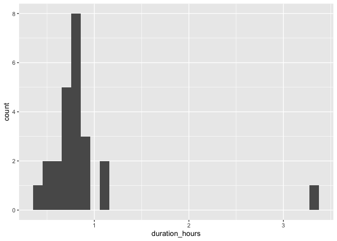

# Vancouver

## Bridgeport Station

### Draw buffer and select points


```r
destination <- "Vancouver Art Gallery, Vancouver, Canada"        #### EDIT ME
```

### Set origin point


```r
origin <- "Bridgeport Station, Vancouver, Canada"    #### EDIT ME
```

#### Setup departure location and arrival time


```r
arrival_time <- as.POSIXct("2024-06-11 08:30:00", tz = "America/Vancouver")       #### EDIT ME
```

#### List of variables for geocoding


```r
var_list <- c("var1", "var2", "var3", "var4", "var5", "var6", "var7", "var8", "var9", "var10", "var11", "var12", "var13", "var14", "var15", "var16", "var17", "var18", "var19", "var20", "var21", "var22", "var23", "var24")
```


```r
stations <- geocode(location = origin, output = "more", source = "google")
```

```
## ℹ <https://maps.googleapis.com/maps/api/geocode/json?address=Bridgeport+Station,+Vancouver,+Canada&key=xxx>
```

```r
stations_sf <- stations %>%
                st_as_sf(coords = c("lon", "lat"), crs = 4326)

stations_buffer = st_buffer(stations_sf, 5000)

stations_buffer <- as_sf(stations_buffer)
```

#### Interactive map view of buffers


```r
mapview(stations_buffer)
```

```{=html}
<div class="leaflet html-widget html-fill-item" id="htmlwidget-dbe1b9d8987da3b753cd" style="width:672px;height:480px;"></div>
<script type="application/json" data-for="htmlwidget-dbe1b9d8987da3b753cd">{"x":{"options":{"minZoom":1,"maxZoom":52,"crs":{"crsClass":"L.CRS.EPSG3857","code":null,"proj4def":null,"projectedBounds":null,"options":{}},"preferCanvas":false,"bounceAtZoomLimits":false,"maxBounds":[[[-90,-370]],[[90,370]]]},"calls":[{"method":"addProviderTiles","args":["CartoDB.Positron","CartoDB.Positron","CartoDB.Positron",{"errorTileUrl":"","noWrap":false,"detectRetina":false,"pane":"tilePane"}]},{"method":"addProviderTiles","args":["CartoDB.DarkMatter","CartoDB.DarkMatter","CartoDB.DarkMatter",{"errorTileUrl":"","noWrap":false,"detectRetina":false,"pane":"tilePane"}]},{"method":"addProviderTiles","args":["OpenStreetMap","OpenStreetMap","OpenStreetMap",{"errorTileUrl":"","noWrap":false,"detectRetina":false,"pane":"tilePane"}]},{"method":"addProviderTiles","args":["Esri.WorldImagery","Esri.WorldImagery","Esri.WorldImagery",{"errorTileUrl":"","noWrap":false,"detectRetina":false,"pane":"tilePane"}]},{"method":"addProviderTiles","args":["OpenTopoMap","OpenTopoMap","OpenTopoMap",{"errorTileUrl":"","noWrap":false,"detectRetina":false,"pane":"tilePane"}]},{"method":"createMapPane","args":["polygon",420]},{"method":"addPolygons","args":[[[[{"lng":[-123.0595074977871,-123.0586832761915,-123.0593392340521,-123.0599952093672,-123.0591160131937,-123.0597719970506,-123.0604279983631,-123.0607560055653,-123.0603163929901,-123.0606444023281,-123.060204785293,-123.0615168573739,-123.0606375987818,-123.061293652095,-123.0619497228665,-123.0626058110968,-123.0617265168359,-123.062382613612,-123.063694859544,-123.064351008701,-123.0634716698562,-123.0641278275611,-123.064784002728,-123.0654401953572,-123.0660964054492,-123.0664245170438,-123.0659848242171,-123.0663129379495,-123.0658732406609,-123.066529476767,-123.0669691785121,-123.0672973053425,-123.067625436539,-123.0671857303376,-123.0684982898735,-123.0701390875387,-123.0696993590502,-123.0700275294552,-123.0695877965039,-123.0702441459582,-123.0709005128804,-123.0715568972707,-123.0722132991297,-123.0728697184579,-123.0735261552556,-123.0741826095234,-123.0748390812617,-123.0754955704709,-123.0761520771515,-123.0768086013039,-123.0772483832657,-123.0775766541214,-123.0780164360737,-123.0790012815316,-123.0816277282928,-123.0822843836689,-123.0831639987649,-123.0838206805235,-123.0844773797575,-123.0851340964675,-123.0857908306538,-123.0866704724216,-123.0873272329904,-123.0886408065594,-123.0894654876274,-123.0895065384496,-123.0895615169423,-123.0901772879907,-123.0908341273743,-123.0914909842366,-123.0923706615138,-123.0930275447579,-123.0936844454814,-123.0945641316015,-123.0952210587064,-123.0958780032912,-123.0967576982503,-123.097414669216,-123.0980716576625,-123.0989513614562,-123.0996083762831,-123.100048229267,-123.1003767454606,-123.1008165984271,-123.1018021799038,-123.1026818924573,-123.1033389775247,-123.1039987627261,-123.1041630383927,-123.1043829662279,-123.1048758014513,-123.1053156587756,-123.1056442232783,-123.1060840805836,-123.1064126516808,-123.1070698069873,-123.1079495282104,-123.1086067098943,-123.1094864310374,-123.1101436390979,-123.1110233601591,-123.1116805945955,-123.1125603155726,-123.1132175763841,-123.1140972972751,-123.1147545844612,-123.115634305264,-123.1162916188239,-123.1171713395365,-123.1176111965253,-123.1179398665282,-123.1183797234939,-123.1187084000898,-123.1194781482652,-123.1195603190692,-123.1196702826717,-123.1202454869211,-123.1211251984648,-123.1217826000277,-123.1226623114739,-123.1233220891629,-123.1234864461727,-123.1237063715013,-123.1241994507534,-123.1250791531151,-123.1257366163007,-123.1266163185596,-123.1274960118321,-123.128153510267,-123.1299128876121,-123.1305704212932,-123.1314501053627,-123.1323297804426,-123.1329873493664,-123.1347466903109,-123.1356263472962,-123.1362839603355,-123.1371636172042,-123.13804326508,-123.1389229039624,-123.13958056111,-123.1428791600849,-123.1430435854211,-123.1432634880761,-123.1437567723045,-123.1446363839541,-123.1455159866064,-123.1463955802611,-123.1472751649178,-123.148154740576,-123.1488125125207,-123.1496920880463,-123.1514512120971,-123.1532103001448,-123.1549693521863,-123.1567283682183,-123.1584873482376,-123.1602462922408,-123.1620052002249,-123.1637640721867,-123.1646434946581,-123.1641500444494,-123.1643698969999,-123.1642054152285,-123.1648649678426,-123.1657443634474,-123.1666237500452,-123.1675031276358,-123.1683824962186,-123.1692618557933,-123.1687683788609,-123.1689882156877,-123.1688237250085,-123.1712418868603,-123.173000507233,-123.1723425134109,-123.1732218012367,-123.174101080053,-123.1749803498593,-123.1744045963811,-123.174514503506,-123.174432253963,-123.1752015989283,-123.1769600758017,-123.176466565209,-123.176686370626,-123.1765218687266,-123.1771812799408,-123.1780604870087,-123.1789396850658,-123.1782816640746,-123.1791608442801,-123.1800400154745,-123.1797110026909,-123.180150582699,-123.1798215720735,-123.1802611476191,-123.1811402919519,-123.1820194272732,-123.1813613970293,-123.1831196229621,-123.1824615925142,-123.1833406831268,-123.1842197647277,-123.1835617340773,-123.1853198525734,-123.1846618217219,-123.1855408586183,-123.1864198865028,-123.1857618554517,-123.1866408654915,-123.1863118520996,-123.186751351532,-123.1864223402986,-123.1868618352701,-123.1877408184543,-123.1870827958392,-123.1879617611805,-123.1888407175101,-123.1881826946986,-123.1890616331865,-123.1884858698264,-123.188595735538,-123.1885134845829,-123.1901614512915,-123.1895034369197,-123.1903823307151,-123.1897243249776,-123.190603200934,-123.1902742001996,-123.1907136325919,-123.190384634016,-123.1908240619487,-123.1917029110558,-123.1910449137599,-123.1919237450298,-123.191265756368,-123.1921445698015,-123.1916510831439,-123.1918707834396,-123.1917062895179,-123.1923653853716,-123.1920363974923,-123.1924757897062,-123.1921468039854,-123.1925861917406,-123.1934649604935,-123.1928069889093,-123.1936857398285,-123.1930277768781,-123.1939065099643,-123.1932485556476,-123.1941272709017,-123.1934693252184,-123.1943480226412,-123.1936900855912,-123.1945687651834,-123.1939108367665,-123.1947894985288,-123.1941315787448,-123.1950102226782,-123.1943523115269,-123.1952309376321,-123.1945730351132,-123.195451643391,-123.1947937495044,-123.1956723399555,-123.1950144547011,-123.1946855186178,-123.1951248038517,-123.1947958699262,-123.1952351507038,-123.1947417546883,-123.1949613925793,-123.1947969288708,-123.1954558375131,-123.1948031263611,-123.1948099898978,-123.1948048505075,-123.1956765151297,-123.1950186732187,-123.1958971835541,-123.1952393502738,-123.1949104401763,-123.1953496853543,-123.1950207774144,-123.1954600181369,-123.19488443588,-123.1949942447445,-123.1949120196605,-123.1956806768089,-123.1950228782352,-123.1959013262903,-123.1947502053358,-123.1949698120858,-123.1948053700453,-123.1954641852664,-123.1948064213953,-123.1956848249973,-123.1950270697544,-123.1944515482257,-123.1945613459769,-123.1944791295681,-123.1952477089243,-123.1945899797519,-123.1942611217064,-123.1947003002046,-123.1943714443159,-123.1948106183603,-123.1941529152563,-123.1950312477805,-123.1943735533028,-123.1937158762651,-123.1945941821614,-123.1932788627759,-123.1941571420458,-123.1934994996971,-123.1928418747863,-123.1937201274312,-123.1924049122937,-123.1932831383152,-123.1926255480876,-123.1919679752955,-123.1916391954377,-123.1920782940586,-123.1917495163562,-123.1921886105251,-123.1915310637895,-123.1908735344878,-123.1917516984542,-123.191094177773,-123.1904366745246,-123.1897791887087,-123.1906573172436,-123.1893423802808,-123.1886849379459,-123.189563031051,-123.1889055973335,-123.1882481810456,-123.187590782187,-123.1869334007573,-123.1878114496214,-123.1871540768068,-123.1845247598209,-123.1841961148024,-123.1846351116275,-123.184306468762,-123.1847454611378,-123.1840881840687,-123.1834309244245,-123.1827736822046,-123.1821164574086,-123.1814592500361,-123.1808020600866,-123.1801448875596,-123.1794877324548,-123.1788305947716,-123.1781734745097,-123.1775163716685,-123.1768592862477,-123.1762022182467,-123.1755451676652,-123.1748881345026,-123.1742311187586,-123.1735741204327,-123.1729171395244,-123.1722601760334,-123.1718212674082,-123.1714927943985,-123.1710538857354,-123.1687547120138,-123.1680978444212,-123.1676589533593,-123.1673305282985,-123.1668916372001,-123.1665632186981,-123.1659063947549,-123.1652495882258,-123.1645927991103,-123.1637150410637,-123.1630582781832,-123.1617448046605,-123.1608670641193,-123.1602103622994,-123.1595536778914,-123.1586759460379,-123.1573626471045,-123.1565946398278,-123.1565125619222,-123.156402846175,-123.1558283094179,-123.1551717123035,-123.1542939978378,-123.1529808734922,-123.1521031677267,-123.1514466404959,-123.1507883619177,-123.1506242344856,-123.1504048077256,-123.1499124336131,-123.1492559500293,-123.1483782528465,-123.147721795501,-123.146857812288,-123.1468475554159,-123.1468338413289,-123.1461876670925,-123.1457488195012,-123.1454206126839,-123.1449817650635,-123.1446535648063,-123.1442147171571,-123.14388652346,-123.1434476757823,-123.1424631274269,-123.1415854386121,-123.1409291036347,-123.1400514147096,-123.139395105974,-123.1380785690703,-123.1377504278569,-123.1373115799601,-123.1369834453076,-123.1365445973846,-123.1362164692931,-123.1357776213441,-123.1354494998136,-123.1347912270134,-123.1346271695372,-123.1344077447053,-123.1339155804612,-123.1330378821757,-123.1323816872533,-123.1315039888687,-123.1310651363246,-123.1307370520209,-123.1302981994527,-123.1299701217108,-123.1290924142924,-123.128436280705,-123.1271197160858,-123.1267916624514,-123.1263528053217,-123.1260247582497,-123.1251470417114,-123.1244909694661,-123.1236132528392,-123.1227355272797,-123.1220794901313,-123.1212017644862,-123.12032402991,-123.1198851592728,-123.119557158285,-123.1191182876273,-123.1187902932031,-123.1170347970975,-123.1163788390027,-123.1155010864071,-123.1146233248839,-123.1138004153479,-123.11375942017,-123.1137045592899,-123.1130896402992,-123.1122118697748,-123.1104563019489,-123.1100174044141,-123.1096894693691,-123.109250571817,-123.1089226433375,-123.1080448459684,-123.1071670396758,-123.1062892244601,-123.1054114003217,-123.1049724849067,-123.1046445807081,-123.1042056652773,-123.1038777676455,-123.0968548529056,-123.0898313674181,-123.0863194107085,-123.0869750329934,-123.0860970126583,-123.0852189834098,-123.0843409452483,-123.0834628981742,-123.082584842188,-123.0817067772899,-123.082362363734,-123.0806061894476,-123.0788499795161,-123.079505547859,-123.0786274206468,-123.0777492845238,-123.0768711394904,-123.0774447527636,-123.0773349830365,-123.0774169287395,-123.0748921833978,-123.0754657885926,-123.0753560144137,-123.0754379589627,-123.0746695348407,-123.0737913274913,-123.0729131112325,-123.0735686518781,-123.0726904178241,-123.0718121748609,-123.0721399428293,-123.071700815785,-123.0720285858864,-123.0715894543929,-123.0707111847243,-123.0698329061468,-123.0704884371942,-123.0687318355354,-123.0693873662245,-123.068509043142,-123.067630711151,-123.0682862414804,-123.0665295329902,-123.0671850629585,-123.0663066864582,-123.0666344535297,-123.0661952597156,-123.0665230289198,-123.0660838306552,-123.0652054274446,-123.0657790223607,-123.0656692203601,-123.0657511634411,-123.0649825445672,-123.0641041146452,-123.0647596524167,-123.0638812046909,-123.0642089756635,-123.0637697462359,-123.0640975193411,-123.0636582854622,-123.062779811023,-123.0634353569586,-123.0625568647136,-123.062884639768,-123.0624453880803,-123.0627731652672,-123.0623339091278,-123.0614553901674,-123.0621109442651,-123.061232407497,-123.06184699695,-123.0617920875848,-123.0618330607249,-123.0610094155484,-123.0613371989487,-123.0608979160945,-123.0612257016274,-123.0607864143208,-123.0599078330257,-123.0605634038138,-123.0596848047083,-123.0603403840266,-123.0594617671101,-123.0600763802075,-123.0600214658328,-123.0600624405493,-123.0592387202304,-123.0597304158805,-123.059510754137,-123.0596746543097,-123.0590156640686,-123.0593434643444,-123.0589041325068,-123.0592319349153,-123.0587925986242,-123.0591204031654,-123.0586810624208,-123.0590088690947,-123.0585695238965,-123.0588973327032,-123.0584579830512,-123.0587857939907,-123.0583464398849,-123.0574677249901,-123.0581233465889,-123.057244613878,-123.0579002440079,-123.0570214934801,-123.0576771321412,-123.0580049580108,-123.0575655727256,-123.0578934007281,-123.0574540109883,-123.0577818411239,-123.0573424469293,-123.0576702791979,-123.0572308805485,-123.0575587149502,-123.0571193118459,-123.0574471483806,-123.0570077408214,-123.0574995004581,-123.0572797941727,-123.0574437156749,-123.0567845918062,-123.0574402820344,-123.0565614335024,-123.0572171322635,-123.0563382659094,-123.0569939732036,-123.0561150890266,-123.056770804854,-123.0570986693087,-123.0566592171954,-123.0569870837836,-123.0565476272143,-123.0572033690185,-123.0563244402837,-123.0569801906223,-123.0561012440618,-123.0567570029349,-123.0572488335381,-123.0570290916065,-123.0571930367647,-123.0565338059556,-123.0571895908093,-123.056310599684,-123.0569663930732,-123.0575402266007,-123.0574303499945,-123.057512327164,-123.0567431860443,-123.0577269216463,-123.0572874026858,-123.0576153210494,-123.0571757976313,-123.0578316429894,-123.0569525805519,-123.0576084344474,-123.0582540576689,-123.0582403219712,-123.058250570093,-123.0573852166113,-123.0580410964951,-123.0585330178602,-123.0583132402718,-123.0584772156845,-123.0578178779027,-123.0584737837768,-123.0589657246353,-123.0587459403602,-123.0589099222709,-123.0582505644286,-123.058906496295,-123.0595214482708,-123.0594665004781,-123.0595074977871],"lat":[49.20709460727279,49.20735995246883,49.20785843344458,49.20835691391835,49.20863996043089,49.20913844963113,49.20963693832888,49.20988618248921,49.21002771464143,49.2102769609833,49.21041849368258,49.21141548702138,49.21169856559796,49.21219707074174,49.21269557538164,49.21319407951729,49.21347717874212,49.21397569160355,49.21497271581183,49.21547122715791,49.21575435626325,49.21625287633472,49.2167513959002,49.21724991495931,49.21774843351172,49.21799769259777,49.21813927528045,49.21838853654771,49.2185301197776,49.21902864654773,49.21888705870172,49.21913631958835,49.219385580348,49.21952717281027,49.22052422381106,49.2217705347003,49.22191214617607,49.22216141028029,49.22230302230343,49.22280155474647,49.22330008667956,49.22379861810234,49.22429714901445,49.22479567941553,49.22529420930519,49.22579273868308,49.22629126754882,49.22678979590204,49.22728832374239,49.22778685106949,49.22764518825432,49.22789444941623,49.22775278253068,49.22850055831798,49.23049462142033,49.23099313590671,49.23070973681028,49.23120824154222,49.23170674575716,49.2322052494547,49.23270375263451,49.23242030953873,49.23291880296137,49.23391578825014,49.2336500279633,49.23368118317872,49.23366346556999,49.23413079301624,49.23462927512177,49.23512775670688,49.23484424408128,49.23534271590501,49.23584118720736,49.2355576490544,49.23605611059384,49.23655457161094,49.23627100792955,49.23676945918223,49.23726790991159,49.23698432070073,49.23748276166415,49.23734095979543,49.23759017776994,49.23744837182918,49.23819601803356,49.23791238700366,49.23841080790697,49.23819807307854,49.2383226764891,49.23825176342124,49.23862557172242,49.23848374079936,49.23873294385805,49.23859110886274,49.23884030947879,49.23933871031554,49.23905502117496,49.23955341223999,49.23926970680985,49.23976808810222,49.23948436638234,49.23998273790114,49.23969899989132,49.24019736163562,49.23991360733569,49.24041195930458,49.24012818871434,49.24062653090689,49.24034274402617,49.24020084794417,49.24045001190667,49.24030811175204,49.24055727327005,49.24030893971663,49.24037122906401,49.24033575225737,49.24077177644489,49.24048794993857,49.24098625354959,49.24070241075235,49.240489524032,49.24061409580581,49.24054313210728,49.24091684549469,49.24063297936281,49.24113125416448,49.24084737174145,49.24056348227525,49.24106173804624,49.24049391948863,49.2409921562273,49.24070822713583,49.24042429100191,49.24092250870661,49.24035459681411,49.24007063030496,49.24056881972452,49.24028483692415,49.24000084708231,49.23971685019921,49.24021501133107,49.23914992562381,49.23927445715035,49.23920344733811,49.23957703998068,49.23929298939358,49.23900893176641,49.23872486709941,49.2384407953928,49.23815671664682,49.23865479344188,49.23837069840536,49.23780248721553,49.23723424787151,49.23666598037513,49.23609768472823,49.23552936093265,49.23496100899025,49.23439262890282,49.23382422067225,49.23354000600384,49.23316657336313,49.23309552033174,49.23297104329492,49.23275788329757,49.23247366381235,49.23218943729258,49.23190520373849,49.23162096315033,49.23133671552828,49.23096332411724,49.23089226284772,49.23076779955403,49.22998610293868,49.22941756290305,49.22891975334007,49.22863548202718,49.22835120368222,49.22806691830543,49.2276313587792,49.22759582362481,49.22753360094569,49.22728485280077,49.22671626539768,49.2263429490963,49.22627187542853,49.22614743717123,49.22593421526647,49.2256499132418,49.22536560418685,49.22486787626251,49.22458356943128,49.22429925557034,49.22405040065615,49.22390824340305,49.22365939066512,49.2235172339681,49.22323291530223,49.22294858960741,49.22245090685418,49.22188225288628,49.22138458809147,49.2211002598189,49.22081592451848,49.22031827768191,49.21974960450596,49.21925197562744,49.2189676377524,49.21868329285063,49.21818568192998,49.21790133925531,49.21765253821575,49.21751036655695,49.21726156769345,49.21711939659149,49.21683504911823,49.21633746485939,49.2160531196139,49.21576876734311,49.21527120104165,49.21498685099915,49.21455148813138,49.21451594489421,49.21445375030908,49.2139205907492,49.21342305110877,49.21313869849929,49.21264116756271,49.2123568171824,49.21210805613466,49.21196588062389,49.21171712175211,49.21157494679871,49.2112905916245,49.21079308734839,49.21050873440405,49.21001123883165,49.20972688811735,49.20935377301728,49.20928268597632,49.20915831478597,49.20894505276459,49.20869631375069,49.20855413918849,49.20830540235053,49.20816322834596,49.20787887507057,49.20738141486164,49.20709706381718,49.20659961231183,49.20631526349846,49.2058178206967,49.20553347411462,49.20503604001646,49.20475169566583,49.20425427027127,49.20396992815231,49.20347251146134,49.20318817157422,49.20269076358684,49.20240642593174,49.20190902664797,49.20162469122508,49.2011273006449,49.2008429674544,49.20034558557784,49.2000612546199,49.19956388144694,49.19931519465524,49.19917303348263,49.19892434886685,49.19878218825242,49.19840916454138,49.19833808531074,49.19821374458353,49.19800050599446,49.1975070352801,49.19750481409574,49.19750092849799,49.19721883467324,49.19672148706432,49.19643717428895,49.19593983538378,49.19569116572632,49.19554901364491,49.19530034616342,49.19515819464035,49.1947230302661,49.19468749312296,49.1946253268942,49.19437656483423,49.19387924279058,49.19359494596559,49.19272464726303,49.19265357600721,49.19252924806286,49.19231603339878,49.19181872821758,49.19153444510958,49.19103714863242,49.19060201376795,49.19056648005393,49.19050431804091,49.1902555799853,49.18975829166749,49.18950964730443,49.18936751579785,49.18911887361086,49.18897674266279,49.18847946250496,49.18819520459652,49.18769793314301,49.1872006611458,49.18691641471967,49.18592188759101,49.18563765264685,49.18514039751553,49.18464314184154,49.18435891837904,49.18336442389837,49.18308021191722,49.18258297311068,49.18208573376248,49.18183711388536,49.18169501682339,49.18144639912256,49.18130430261917,49.18080707143483,49.18030983970971,49.18002565993623,49.17952843691641,49.17903121335631,49.17853398925629,49.17824983020818,49.17725539887989,49.17675818240699,49.17647404408299,49.17597683631595,49.17547962801037,49.17498241916664,49.1744852097851,49.17420110142785,49.17370390075258,49.17171509268221,49.17146649107012,49.17132445968179,49.17107586024644,49.17093382941648,49.17043663476536,49.16993943957893,49.16944224385754,49.16894504760157,49.16844785081137,49.16795065348731,49.16745345562977,49.16695625723911,49.1664590583157,49.1659618588599,49.16546465887209,49.16496745835262,49.16447025730186,49.16397305572019,49.16347585360797,49.16297865096556,49.16248144779334,49.16198424409166,49.1614870398609,49.16162898290716,49.16138037828394,49.16152231726883,49.15978206504407,49.15928484893623,49.15942676538489,49.15917815482422,49.15932006721188,49.15907145421043,49.15857422781303,49.15807700088993,49.1575797734415,49.15786356063417,49.15736632342495,49.1563718474338,49.1566555999128,49.15615835189653,49.15566110335723,49.15594483035946,49.15495031324443,49.15519855246334,49.15513639406434,49.15517185622768,49.15473674619673,49.15423947710141,49.15452315315327,49.15352859493415,49.15381224551241,49.15331495639014,49.15352768280076,49.15340335870795,49.15347426605854,49.1531012918544,49.1526039924618,49.15288760132802,49.1523902921852,49.1526694537312,49.15266168312974,49.15266611420839,49.15217656591999,49.15231835498982,49.152069693042,49.15221147805209,49.15196281366727,49.15210459461764,49.15185592779594,49.15199770468661,49.15125169652432,49.15153523120367,49.15103788255391,49.15132140099499,49.1508240426002,49.15124929327667,49.15100060696399,49.15114235137794,49.15089366262941,49.15103540298388,49.1507867117996,49.1509284480946,49.15067975447469,49.15089235217099,49.15076800358248,49.15083886802835,49.15046582034018,49.15074926682152,49.15025186022695,49.15053529047082,49.15067700296442,49.15042829255388,49.15057000098811,49.1503212881427,49.15060469514022,49.15010725983826,49.15053234335017,49.15028361858701,49.15042530727933,49.15017658008185,49.15045994759551,49.14996248359121,49.15024583486788,49.15052917913464,49.15003169616759,49.1503150241974,49.15059834521691,49.15074000309773,49.15049124989048,49.15063290371204,49.15038414807141,49.15095073660444,49.15045320649095,49.15073648101504,49.15101974852789,49.15128530545334,49.15125420811066,49.15127191165055,49.15080545073295,49.15108869499725,49.15165516249012,49.15179677498072,49.15154797949923,49.15168958793051,49.15144079001681,49.15172399700762,49.15200719698577,49.15229038995106,49.15257357590321,49.1527151662493,49.15246634745466,49.15260793374134,49.15235911251501,49.15462421772792,49.15688887396163,49.15802103367481,49.15851886046582,49.15880189207182,49.15908491665945,49.15936793422851,49.15965094477875,49.15993394830995,49.16021694482188,49.16071482644814,49.16128081685698,49.16184677918564,49.16234469720278,49.16262767705821,49.16291064989284,49.1631936157064,49.16362931777153,49.16366468901317,49.16372693227842,49.16454044386963,49.16497616970789,49.1650115394691,49.16507378613052,49.16532137239538,49.16560432154316,49.16588726366835,49.16638526319343,49.16666820751738,49.16695114481816,49.16720015361663,49.16734162193868,49.16759063291875,49.16773210179033,49.16801503426568,49.16829795971709,49.16879600436007,49.1693618526333,49.16985991522469,49.17014283804599,49.17042575384227,49.17092383438224,49.17148966334206,49.17198776183081,49.17227067499383,49.1725197286636,49.17266118491578,49.17291024076734,49.17305169756843,49.17333460590073,49.1737704654471,49.17380582950322,49.17386809526588,49.17411564159318,49.17439854509372,49.17489668820789,49.17517959390314,49.17542866988575,49.17557012240357,49.17581920056804,49.17596065363445,49.17624355449637,49.17674172428747,49.17702462734341,49.17727371666456,49.17741516786243,49.17766425936547,49.17780571111178,49.17808860933281,49.17858680580128,49.17886970621565,49.17933677360149,49.17935445518438,49.17938559303066,49.17965081401926,49.179899921043,49.1800413720163,49.18029048122195,49.18043193274345,49.18071483051399,49.18121306238805,49.18149596235104,49.18199420295285,49.18227710510811,49.18274421386909,49.18276189556075,49.18279303616537,49.18305825878502,49.18343195237445,49.18350267909199,49.18362724413632,49.18383942338158,49.18408855683604,49.18423000977466,49.18447914541108,49.1846205988976,49.18486973671596,49.18501119075035,49.18526033075067,49.18540178533289,49.18565092751516,49.18579238264521,49.18604152700942,49.18618298268729,49.18646588876869,49.18696419096058,49.18724709923281,49.18774541015259,49.18802832061547,49.18852664026313,49.18877579990096,49.1889172594128,49.18916642123256,49.18930788129202,49.18955704529374,49.18969850590079,49.18994767208444,49.19008913323906,49.19033830160466,49.19047976330683,49.19072893385438,49.19087039610407,49.19124415515174,49.19131488734669,49.19143947421036,49.19165166988684,49.1921500239494,49.19243295458723,49.19293131737753,49.19321425020501,49.19371262172305,49.19399555674003,49.1944939369858,49.19474312692218,49.19488459871107,49.19513379082936,49.19527526316558,49.19577365164154,49.19605660026219,49.19655499746575,49.19683794827547,49.19733635420662,49.19771015832806,49.19778089896725,49.19790550085539,49.19811772186394,49.19861613602438,49.19889910043757,49.19939752332544,49.19983364294315,49.19986901516238,49.19993131807788,49.20017892154261,49.20092656802993,49.20106806022468,49.20131727777743,49.20145877051934,49.20195720986355,49.20224019929543,49.20273864736681,49.20322930669877,49.20323372863889,49.2032415168806,49.20352009578561,49.20401855208405,49.20439239397945,49.20446314712846,49.20458776160774,49.20480002014521,49.20529848467007,49.20567233273496,49.20574308873802,49.20586770527375,49.20607997237327,49.2065784451239,49.20704576287217,49.20706345273587,49.20709460727279]}]]],null,"stations_buffer",{"crs":{"crsClass":"L.CRS.EPSG3857","code":null,"proj4def":null,"projectedBounds":null,"options":{}},"pane":"polygon","stroke":true,"color":"#333333","weight":0.5,"opacity":0.9,"fill":true,"fillColor":"#6666FF","fillOpacity":0.6,"smoothFactor":1,"noClip":false},"<div class='scrollableContainer'><table class=mapview-popup id='popup'><tr class='coord'><td><\/td><th><b>Feature ID&emsp;<\/b><\/th><td>1&emsp;<\/td><\/tr><tr><td>1<\/td><th>type&emsp;<\/th><td>establishment&emsp;<\/td><\/tr><tr><td>2<\/td><th>loctype&emsp;<\/th><td>geometric_center&emsp;<\/td><\/tr><tr><td>3<\/td><th>address&emsp;<\/th><td>bridgeport station, richmond, bc v6x, canada&emsp;<\/td><\/tr><tr><td>4<\/td><th>north&emsp;<\/th><td>49.19656&emsp;<\/td><\/tr><tr><td>5<\/td><th>south&emsp;<\/th><td>49.19386&emsp;<\/td><\/tr><tr><td>6<\/td><th>east&emsp;<\/th><td>-123.1248&emsp;<\/td><\/tr><tr><td>7<\/td><th>west&emsp;<\/th><td>-123.1275&emsp;<\/td><\/tr><tr><td>8<\/td><th>geometry&emsp;<\/th><td>sfc_POLYGON&emsp;<\/td><\/tr><\/table><\/div>",{"maxWidth":800,"minWidth":50,"autoPan":true,"keepInView":false,"closeButton":true,"closeOnClick":true,"className":""},"1",{"interactive":false,"permanent":false,"direction":"auto","opacity":1,"offset":[0,0],"textsize":"10px","textOnly":false,"className":"","sticky":true},{"stroke":true,"weight":1,"opacity":0.9,"fillOpacity":0.84,"bringToFront":false,"sendToBack":false}]},{"method":"addScaleBar","args":[{"maxWidth":100,"metric":true,"imperial":true,"updateWhenIdle":true,"position":"bottomleft"}]},{"method":"addHomeButton","args":[-123.1959013262903,49.14996248359121,-123.0561012440618,49.24113125416448,true,"stations_buffer","Zoom to stations_buffer","<strong> stations_buffer <\/strong>","bottomright"]},{"method":"addLayersControl","args":[["CartoDB.Positron","CartoDB.DarkMatter","OpenStreetMap","Esri.WorldImagery","OpenTopoMap"],"stations_buffer",{"collapsed":true,"autoZIndex":true,"position":"topleft"}]},{"method":"addLegend","args":[{"colors":["#6666FF"],"labels":["stations_buffer"],"na_color":null,"na_label":"NA","opacity":1,"position":"topright","type":"factor","title":"","extra":null,"layerId":null,"className":"info legend","group":"stations_buffer"}]}],"limits":{"lat":[49.14996248359121,49.24113125416448],"lng":[-123.1959013262903,-123.0561012440618]},"fitBounds":[49.14996248359121,-123.1959013262903,49.24113125416448,-123.0561012440618,[]]},"evals":[],"jsHooks":{"render":[{"code":"function(el, x, data) {\n  return (\n      function(el, x, data) {\n      // get the leaflet map\n      var map = this; //HTMLWidgets.find('#' + el.id);\n      // we need a new div element because we have to handle\n      // the mouseover output separately\n      // debugger;\n      function addElement () {\n      // generate new div Element\n      var newDiv = $(document.createElement('div'));\n      // append at end of leaflet htmlwidget container\n      $(el).append(newDiv);\n      //provide ID and style\n      newDiv.addClass('lnlt');\n      newDiv.css({\n      'position': 'relative',\n      'bottomleft':  '0px',\n      'background-color': 'rgba(255, 255, 255, 0.7)',\n      'box-shadow': '0 0 2px #bbb',\n      'background-clip': 'padding-box',\n      'margin': '0',\n      'padding-left': '5px',\n      'color': '#333',\n      'font': '9px/1.5 \"Helvetica Neue\", Arial, Helvetica, sans-serif',\n      'z-index': '700',\n      });\n      return newDiv;\n      }\n\n\n      // check for already existing lnlt class to not duplicate\n      var lnlt = $(el).find('.lnlt');\n\n      if(!lnlt.length) {\n      lnlt = addElement();\n\n      // grab the special div we generated in the beginning\n      // and put the mousmove output there\n\n      map.on('mousemove', function (e) {\n      if (e.originalEvent.ctrlKey) {\n      if (document.querySelector('.lnlt') === null) lnlt = addElement();\n      lnlt.text(\n                           ' lon: ' + (e.latlng.lng).toFixed(5) +\n                           ' | lat: ' + (e.latlng.lat).toFixed(5) +\n                           ' | zoom: ' + map.getZoom() +\n                           ' | x: ' + L.CRS.EPSG3857.project(e.latlng).x.toFixed(0) +\n                           ' | y: ' + L.CRS.EPSG3857.project(e.latlng).y.toFixed(0) +\n                           ' | epsg: 3857 ' +\n                           ' | proj4: +proj=merc +a=6378137 +b=6378137 +lat_ts=0.0 +lon_0=0.0 +x_0=0.0 +y_0=0 +k=1.0 +units=m +nadgrids=@null +no_defs ');\n      } else {\n      if (document.querySelector('.lnlt') === null) lnlt = addElement();\n      lnlt.text(\n                      ' lon: ' + (e.latlng.lng).toFixed(5) +\n                      ' | lat: ' + (e.latlng.lat).toFixed(5) +\n                      ' | zoom: ' + map.getZoom() + ' ');\n      }\n      });\n\n      // remove the lnlt div when mouse leaves map\n      map.on('mouseout', function (e) {\n      var strip = document.querySelector('.lnlt');\n      if( strip !==null) strip.remove();\n      });\n\n      };\n\n      //$(el).keypress(67, function(e) {\n      map.on('preclick', function(e) {\n      if (e.originalEvent.ctrlKey) {\n      if (document.querySelector('.lnlt') === null) lnlt = addElement();\n      lnlt.text(\n                      ' lon: ' + (e.latlng.lng).toFixed(5) +\n                      ' | lat: ' + (e.latlng.lat).toFixed(5) +\n                      ' | zoom: ' + map.getZoom() + ' ');\n      var txt = document.querySelector('.lnlt').textContent;\n      console.log(txt);\n      //txt.innerText.focus();\n      //txt.select();\n      setClipboardText('\"' + txt + '\"');\n      }\n      });\n\n      }\n      ).call(this.getMap(), el, x, data);\n}","data":null},{"code":"function(el, x, data) {\n  return (function(el,x,data){\n           var map = this;\n\n           map.on('keypress', function(e) {\n               console.log(e.originalEvent.code);\n               var key = e.originalEvent.code;\n               if (key === 'KeyE') {\n                   var bb = this.getBounds();\n                   var txt = JSON.stringify(bb);\n                   console.log(txt);\n\n                   setClipboardText('\\'' + txt + '\\'');\n               }\n           })\n        }).call(this.getMap(), el, x, data);\n}","data":null}]}}</script>
```

#### Generate points within buffer


```r
set.seed(109)
points_sample_sf <- st_sample(stations_buffer, size = c(25,25), type = "random")
```

```
## Warning in st_poly_sample(x, size = size, ..., type = type, by_polygon =
## by_polygon, : coordinate ranges not computed along great circles; install
## package lwgeom to get rid of this warning
## Warning in st_poly_sample(x, size = size, ..., type = type, by_polygon =
## by_polygon, : coordinate ranges not computed along great circles; install
## package lwgeom to get rid of this warning
```

```r
points_sample_sf <- st_as_sf(points_sample_sf)
points_sample <- sf_to_df(points_sample_sf)
```

#### Check to see if they worked


```r
check_buffer <- stations_buffer %>% slice(1:2)

plot(st_geometry(check_buffer))
plot(points_sample_sf, pch = 20, add= TRUE)
```

<!-- -->


```r
points_sample$destination <- destination
points_sample$origin <- origin
points_sample$lat_lon <- paste(points_sample$lat, points_sample$lon)
```

#### Checking points and general mapping


```r
lst_directions <- apply(points_sample, 1, function(x){
  res <- google_directions(
    origin = x[['lat_lon']], 
    destination = x[['destination']]    
  )
df_result <- data.frame(
    origin = x[['lat_lon']], 
    destination = x[['destination']], 
    route = res$routes$overview_polyline$points 
)
return(df_result)
})

df_directions <- do.call(rbind, lst_directions)

google_map() %>%
  add_polylines(data = df_directions, polyline = "route") 
```

```{=html}
<div class="google_map html-widget html-fill-item" id="htmlwidget-51f689a964c863836717" style="width:672px;height:480px;"></div>
<script type="application/json" data-for="htmlwidget-51f689a964c863836717">{"x":{"lat":0,"lng":0,"zoom":1,"min_zoom":null,"max_zoom":null,"mapBounds":{"west":-180,"south":-90,"east":180,"north":90},"styles":null,"search_box":false,"update_map_view":true,"zoomControl":true,"mapType":"roadmap","mapTypeControl":true,"scaleControl":false,"streetViewControl":true,"rotateControl":true,"fullscreenControl":true,"event_return_type":"list","split_view":null,"split_view_options":{"heading":34,"pitch":10},"geolocation":false,"calls":[{"functions":"add_polylines","args":[[{"id":1,"geodesic":true,"stroke_colour":"#0000FF","stroke_weight":2,"stroke_opacity":0.6,"z_index":3,"polyline":["klckHpulnV{H?}C@]i@Q_@?}IAoRBiQFqCHoBLqIyAKcB?q@@SHmDA_AAoBAYEe@M{AI{CB]B}@Lw@FMHM\\UvAQx@[rA_@zAe@nA{@fBgAzBeB|Cy@`B}DnH?F?TwC~EcHvLwBrDqHtMeElHc@p@o@t@iC`CeWlU{K~JqE~DuH`HuG`GmItHwAbAiAj@a@RkA`@{@PqCVgDJuAHaTU{OSmEE[`Ba@xB{A`I}CbP{CdPs@fDINSbAi@lCI?[AmMOeHMkLOoT]iJGiFIqIKwCC{BCuCB_DGoAIqCC_HGwDI{JM_KIyDIwIIkKMyQOiGMwEGoZa@yBAwEGcPSaEGsHEiCCaJIgAAAAAAQOkBCW?sACcDG_AMc@Ks@Us@]s@g@W[iBwCsBoD_E_HgByCqAsB_GkKi@aAQc@[aB{AwKQm@sAaC{@}AoE_Iy@xAcAfBcAhBkDhGU\\kEwH_CeEuA}ByAoCgIsN"]},{"id":2,"geodesic":true,"stroke_colour":"#0000FF","stroke_weight":2,"stroke_opacity":0.6,"z_index":3,"polyline":["{cdkHxpknVu@wBj@o@Xc@Vw@Fi@?q@Y_L@mG?WSHmDAk@AcCAYEe@M{AIqB@i@@]BuAR_@@IDIJ]lBm@lC_@zAe@nAcCbFeCrEeBbDqB~D?TwC~EcHvLoGzKgHfMoAvBa@f@gBdBkXrVuH|GaOzMeUrS_Ax@wA|@kAh@kA`@{@PqCVyAD{BFg@F}@AaEGaTU{GImEE[`Ba@xBc@|BgCtM}CfPkAnGs@fDINSbAi@lCI?[AqDEoMQeJOgPUwNSgJIqIKgIIuCBkBEcCKqLKsPW_KIyDIwIIoCEeMKyJKeLQwRWiIMcA?eEGmX]aKGgDC}HICCQOkBCW?uCEaBE_AMwAa@s@]s@g@W[cA_BsA}Bw@uAiD}FqDgGiB{CyB{DqBqDa@wAu@iFm@gEIg@Ym@aCkEoE_Iy@xAcAfB{DbHiAlBkEwH_CeEuA}BoA}B_BuCmDeGcAiB"]},{"id":3,"geodesic":true,"stroke_colour":"#0000FF","stroke_weight":2,"stroke_opacity":0.6,"z_index":3,"polyline":["_zekHtvanVbCApBINEFMJJRFX?L@FDDb@BvAFR\\Xj@DX@AdGC`K?H?h_@@~JuODeUFgDBg@?AN?p@?vAChB?zC?zDBlQ?~@Ml@UxAW~@Sb@[d@e@f@_@Re@Nm@DU@mABuDBUNw@?Y?wA?iG?_J@gS?_H@mHAqDEiFKcEKwDKmAG}JSuAEqA@QDGFyA@_FA_FCoECwD?u@A_@QyAA}A@yCAu@FYFm@TIJy@ZYH_@Hi@BsGAiMSm@UmEEOE{@Ao@AiCBg@H}KO{HGoBAc@@k@UcDEgACmEGk@A[LwCE}EEaCA_CCMCcACiBM_Eq@QO[GqDSoD?oBCUJK@wCCaGIaIEaHI[?QMw@GqBGaEGc@?OAqAA_BCw@lBm@rAYj@eA`C{@tBiCbH?Z_AfCiA~CgB|EwGvQ_DnI]b@qBvFs@nB_@x@Yv@uAbEWpASxAGv@KbAWpAI\\w@lBeChFu@vAe@~@kAbCe@v@e@f@uAtAuCtCW\\w@t@_A~@eA|@qCjC}ApA{CjCENe@d@YH[\\Av@AxAExNExGGlMIhQMtRIhBG\\kAAgAFkCBaB?yDLgEJ}BBm@G}GIo@AqISu@?iACcCOkACsBCq@Jg@R_Aj@_@`@]`@[l@uAjCmB`Ds@vAeAjBaEhHgB~C}CrFaClE{AdCOVEF_@q@qDoG"]},{"id":4,"geodesic":true,"stroke_colour":"#0000FF","stroke_weight":2,"stroke_opacity":0.6,"z_index":3,"polyline":["s_jkH|mcnVR_ANq@iEEiA?{@AoCCuA?sJGgA?uFE_DAcGEuSSiGEoGGiIGwDBaCCgJOqJKcHG{ECcCC{CC_HGyROeEGsDAmAEeFGkLKq@CYMkBBo@CkAISn@q@nBy@~B_AnC@No@hBaEdL_DvIURO\\Uj@[|@{BxGaDzJe@pAgAdC]p@Wh@{ApDqAjDmAbD?ZmAbD_DzI{ClIeFbNy@zB]b@oC|Hg@hA}BtGc@dCK`AMtAUpAc@tAqCdGy@|AkB|De@v@q@|@cAdAsDrDu@z@aCzBiGrF}@v@aBvACJUVQPYH[\\Av@?d@G|OCpFGxMGvJOnYGpBKx@kAAq@Dy@@aA@cA@aCB}AF}EJmCDe@GsDGeBAa@AaEIcCImB?_DO{AGoBEq@Jc@N_Af@}@z@a@r@_AhBgB|CmCzEiGzK}DbH_ClEaC|DqEaI"]},{"id":5,"geodesic":true,"stroke_colour":"#0000FF","stroke_weight":2,"stroke_opacity":0.6,"z_index":3,"polyline":["mwdkH`ixnVKCKHE\\C|@EjBFj@NSLi@FeCDOHGlBLn@?^E\\BhCRjCFb@A`@If@[\\i@Vu@PiAd@uF^gFLmE?wBA}EI}Hw@of@W{OQ{AMk@Uq@]m@a@c@q@q@OQeBeAiAs@IIUWGOAc@Ls@L[JYRUPe@u@eAsAgBwByCq@}@y@qAO[mAsBmAsByCgFqB_DoBkCyEkG{AeBeBwA}LuF}CoAaCgA{As@cA]qBe@q@G_BGqBCaCCmAEm@Gc@O[Sa@_@OSSa@Si@_@uAOa@KmAOsAWcBScASy@a@kAg@gA{@sAo@{@i@i@o@e@m@YeBm@yC}@sEmA{Bo@}Ai@WIGKEEcBq@o@WeBo@c@Ka@Gi@?YBa@LSNa@\\[b@a@v@eBpGsBrIIVS^UbAeA|DMXe@v@ONe@RYJWNaBAsCEMMoBIuDGoEEMDEBGH_@A}BEiDEaIIgZ_@cOQeHMkLOoT]iJGiFIqIKwCC{BCuCB_DGoAIqCC_HGwDI{JM_KIyDIwIIkKMyQOiGMwEGoZa@yBAwEGcPSaEGsHEiCCaJIgAAAAAAQOkBCW?sACcDG_AMc@Ks@Us@]s@g@W[iBwCsBoD_E_HgByCqAsB_GkKi@aAQc@[aB{AwKQm@sAaC{@}AoE_Iy@xAcAfBcAhBkDhGU\\kEwH_CeEuA}ByAoCgIsN"]},{"id":6,"geodesic":true,"stroke_colour":"#0000FF","stroke_weight":2,"stroke_opacity":0.6,"z_index":3,"polyline":["}rikHfihnVWBiAEAaAm@Ac@?kHAyEKM?UGqAI_DEiBC}CESLuFCyC?{DA{E?}@AOGu@CcAEaAAwCA{A@MHs@AcAAk@Ew@AmA?aFGsDC{JI_OO}D@qDE{GKwGGWI{BGi@CkBAi@AQDWJmDAqBAoFE{JI}EEIAmAEiDCyKGkIKiDAqLQ{FCwEEeQSgJKsB?c@?[OoBGo@?}@CUM_BxEc@dCK`AMtAG^Mp@c@tAqCdGy@|AkB|De@v@q@|@cAdAsDrDu@z@aCzBiGrF}@v@aBvACJUVQPYH[\\Av@?d@G|OI~OYrj@GpBKx@kAAq@Dy@@aA@cA@aCB}AF}EJmCDe@GsDGeBAa@AaEIcCImB?_DO{AGoBEq@Jc@N_Af@}@z@a@r@_AhBgB|CcIvNqGbL_ClEwA~Bi@|@qEaI"]},{"id":7,"geodesic":true,"stroke_colour":"#0000FF","stroke_weight":2,"stroke_opacity":0.6,"z_index":3,"polyline":["sapkHdlonVwGE_BAS@EjCEtDKrGMzJS`OGrGKnGApBErCuACqGIiDEcQQ}JKsIMaU[gEGoDC}BEqV[eJKyD?mBCsJIUCAASO_CCsCEgBEsASq@Q]OiAo@[Yo@aA_BmCcAeBkCsE}DwGaBkCwB{DgCsES_@Wy@Mo@_@kCs@qFOw@GWKQgBcDqFuJ{@~AeElHqBnDOTYg@}DeHyCkFoAuBmC{EaAcBqDoG"]},{"id":8,"geodesic":true,"stroke_colour":"#0000FF","stroke_weight":2,"stroke_opacity":0.6,"z_index":3,"polyline":["gvekH`yinVNPd@@FHPB`BC?D@`LCLsJO@tF`CAjB@dH?h@LlAHn@@bD@~@?JXHV?ZIhAQ`Ae@lB]dAoArCUb@eDlGiFzJ?Z_LlRaHxLyGlLaBrCW^y@|@u@p@yIbI}J`JgZfXyUdTcA|@uA~@oAn@cA^y@RaBVmBJcDJQ?}@FcEIod@e@cEhT{ChP_D`PQh@}@pEaEGsMOaEIsU]mJMyKK{IMuHIiBAqBBaBCgCG_CGqDCaPWqSSqGIiDEcQQ}JKsIMaU[gEGoDC}BEqV[eJKyD?mBCsJIUCAASO_CCsCEgBEsASq@Q]OiAo@[Yo@aA_BmCcAeBkCsE}DwGaBkCwB{DgCsES_@Wy@Mo@_@kCs@qFOw@GWKQgBcDqFuJ{@~AeElHqBnDOTYg@}DeHyCkFoAuBmC{EaAcBqDoG"]},{"id":9,"geodesic":true,"stroke_colour":"#0000FF","stroke_weight":2,"stroke_opacity":0.6,"z_index":3,"polyline":["c`dkH`gvnVs@wc@Q{AMk@Uq@]m@a@c@q@q@OQeBeAiAs@IIUWGOAc@Ls@L[JYRUPe@u@eAsAgBwByCq@}@y@qAO[mAsBmAsByCgFqB_DoBkCyEkG{AeBeBwA}LuF}CoAaCgA{As@cA]qBe@q@G_BGqBCaCCmAEm@Gc@O[Sa@_@OSSa@Si@_@uAOa@KmAOsAWcBScASy@a@kAg@gA{@sAo@{@i@i@o@e@m@YeBm@yC}@qBk@}EqA}Ai@WIGKEEcBq@o@WeBo@c@Ka@Gi@?YBa@LSN]Z_@d@a@v@_@pAgB`HqApFIVS^UbAeA|DMXe@v@ONe@RYJWNaBAsCEMMoBIuDGoEEMDEBGH_@A}BEiDEkUWsOSmMOeHMwT[cLQiJG_KOsII{BCuCB_DGoAIqCC_HGwDI{JM_KIyDIwIIkKMqJGgFGiGMgUY_KOyBA{V[aEGsHEiCCaJIgAAAAAAQOkBCW?sACcDG_AMc@Ks@Us@]s@g@W[iBwCgAmBmCwEeEcHqAsBmBiDqCaFi@aAQc@[aBeAsHUcBQm@sAaC{@}AoE_Iy@xAcAfBcAhBkDhGU\\kEwH_CeEuA}ByAoCuBqDqEaI"]},{"id":10,"geodesic":true,"stroke_colour":"#0000FF","stroke_weight":2,"stroke_opacity":0.6,"z_index":3,"polyline":["smokHdylnVIlGuDCeAEgBC_@BYHYLa@ZwA`BoFrGe@`@o@Pg@BwACiDKm@Ec@Im@Wk@_@s@y@]i@iB}D]q@k@y@s@o@c@Y_A]e@@m@ASEqACwDGyDCqCF}@@i@FgALmACeCCaCE{DGUA}BCkEG_EGeDEYI_AIiCGyDAqC@uDGSCg@CkB@]?_GGkCMqCIeAAgEA_DGgAFkCBaB?yDLgEJ}BBm@G}GIyFMgCGu@?iACcCOkACsBCq@Jg@R_Aj@_@`@]`@[l@uAjCmB`Ds@vAeAjBaEhHeGrKaClE{AdCOVEF_@q@qDoG"]},{"id":11,"geodesic":true,"stroke_colour":"#0000FF","stroke_weight":2,"stroke_opacity":0.6,"z_index":3,"polyline":["{wfkHztpnVMQMe@Ag@Dg@?YGYQU?FEt@GzAKtBs@tMSnDEn@AtAO`D?`FGRCd@Ml@[fACb@Jf@FJNN\\@RELSP]FELBHT@f@Ah@gAAM?{AAqAEaAG]Gc@QYW_@a@_@u@{@sCQuBYqBY{Aq@_Ca@}@m@eA_AuAiAgA}@e@}Ak@oBo@uCy@eBc@iCs@{Bu@IMQKyB{@gBq@UIo@Kk@CWBa@HULi@d@WZ_@r@Wt@sAfFyA`G_@`BWf@_@~A}@dDk@fAKLa@To@TOJW?m@?oDGMM{@Ew@CsCEmFGQFIJeAC}EG}GIeY]_OQkJOcJM_SYm`@c@uCEk@AiBAqBBaBC}@AiAE_CGqDCgFKsTWwGGqGIeJMcLIyJK_MSwKMmJOgFE}EG_]c@_FAaIIyBAUCUQ{HK_ACsASq@Q]OiAo@[Yo@aAs@kAeAiBy@uAcEcHgDwF{AkCwCgFoA_CWy@Mo@}@qG_@sCMg@c@{@aIoNqCbFmDjGs@lAOTYg@}DeHyCkFoAuBs@qAaBuCkFgJ"]},{"id":12,"geodesic":true,"stroke_colour":"#0000FF","stroke_weight":2,"stroke_opacity":0.6,"z_index":3,"polyline":["ynkkHdvrnVNgW@mB?UwDGyBCO?uJMkJOcU[_HKiLOoMMiIKk@AiBAqBBaBC}@AiAE_CGqDCgFKsTWwGGqGIeJMcLIyJK{FK{QUmJOgFE{U[aMO_FAaIIyBAUCUQmDEmCE_ACsASq@Q]OiAo@[Yo@aAs@kAeAiB}B}DsEyHsAyB{AkCwCgFoA_CWy@Mo@}@qG_@sCMg@c@{@aIoNqCbFmDjGs@lAOTYg@}DeHyCkFoAuBs@qAaBuCkFgJ"]},{"id":13,"geodesic":true,"stroke_colour":"#0000FF","stroke_weight":2,"stroke_opacity":0.6,"z_index":3,"polyline":["a_bkHt{dnV_ADwBCKKAUC]AC_IGCxa@AhFc@??sB?mDBuI@_MG{@Ms@GGk@BsC?sMBgL?wC?_G?_IBmBN{@R{@Z}Ar@uLvGgCfAoBj@yA\\iBVqBLiBBmD?iJ@wO@_d@@ug@B{GEuBEsGQsDI{BIo@E}FKgAA_BGuA@[DIFmC?iJC{CAcIC_@Qw@AmB?aD?q@Be@Jo@TIJa@Pk@Pu@LgG?eJMiCEa@QKCmAAkBCc@E{AAsC?_@HyBA{FI{GGiFAk@UaCEeAAeCEwCE[LoAAkACwEEkBAiCCm@E_ACuAKcBWyAWGAMMGCaAMgAGuCEmABaACy@AUJqCAiFGcJGeIISM{BKwCG_CCe@A}BAWCQd@gAdC]p@Wh@{ApDqAjDmAbD?ZmAbD_DzI{ClIeFbNy@zB]b@oC|Hg@hA}BtGc@dCK`AMtAG^Mp@c@tAqCdGy@|AkB|De@v@q@|@cAdAsDrDu@z@aCzBiGrF}@v@aBvACJUVQPYH[\\Av@?d@G|OI~OEpJS`_@GpBKx@kAAq@Dy@@aA@cA@aCB}AF}EJmCDe@GsDGeBAa@AaEIcCImB?_DO{AGoBEq@Jc@N_Af@}@z@a@r@_AhBgB|CcIvNqGbL_ClEwA~Bi@|@qEaI"]},{"id":14,"geodesic":true,"stroke_colour":"#0000FF","stroke_weight":2,"stroke_opacity":0.6,"z_index":3,"polyline":["ikdkHjtwnVBoAHAREd@[PWLYLa@Fe@Bs@Gy@g@oBAi@B]Ne@P[TOTGl@BbABtBIGeEg@o[O_JW{OQ{AMk@Uq@]m@a@c@q@q@OQeBeAiAs@IIUWGOAc@Ls@L[JYRUPe@u@eAsAgBwByCq@}@y@qAO[mAsBmAsByCgFqB_DoBkCyEkG{AeBeBwA}LuF}CoAaCgA{As@cA]qBe@q@G_BGqBCaCCmAEm@Gc@O[Sa@_@OSSa@Si@_@uAOa@KmAOsAWcBScASy@a@kAg@gA{@sAo@{@i@i@o@e@m@YeBm@yC}@sEmA{Bo@}Ai@WIGKEEcBq@o@WeBo@c@Ka@Gi@?YBa@LSNa@\\[b@a@v@eBpGsBrIIVS^UbAeA|DMXe@v@ONe@RYJWNaBAsCEMMoBIuDGoEEMDEBGH_@A}BEiDEaIIgZ_@cOQeHMkLOoT]iJGiFIqIKwCC{BCuCB_DGoAIqCC_HGwDI{JM_KIyDIwIIkKMyQOiGMwEGoZa@yBAwEGcPSaEGsHEiCCaJIgAAAAAAQOkBCW?sACcDG_AMc@Ks@Us@]s@g@W[iBwCsBoD_E_HgByCqAsB_GkKi@aAQc@[aB{AwKQm@sAaC{@}AoE_Iy@xAcAfBcAhBkDhGU\\kEwH_CeEuA}ByAoCgIsN"]},{"id":15,"geodesic":true,"stroke_colour":"#0000FF","stroke_weight":2,"stroke_opacity":0.6,"z_index":3,"polyline":["qs_kHpgrnV?p@CTAJu@??xJ@zK?~D{B@{FAe@@q@AgKAmECmAAwCAuFDe@GO?uE@oHAe@@_B?uDE_D?gAAMI_@EgA?wCCmDC]Gc@OgBqAaHoFaCkB[Sq@Yg@M_AEcALeA`@eA`A[^eBpByAhBiAzAk@p@wHzI}AhBKFOL_A~@_@d@[`@i@r@[N[VUJQBUCMEWSUG_@m@}AmC}CoFkAkB{A{Bs@aAaCyCyByCeAoA{AuA]UgD}AkB{@sDaBaBq@oD}AaCgAqBg@eAQO?kBGuACiBAqAEaAG]Gc@QYW_@a@_@u@{@sCQuBYqBY{Aq@_Ca@}@m@eA_AuAiAgA}@e@}Ak@oBo@uCy@eBc@iCs@{Bu@IMQKyB{@gBq@UIo@Kk@CWBa@HUL]Xc@f@_@r@Wt@uBhIw@~C_@`BWf@_@~A}@dDk@fAKLa@To@TOJW?m@?oDGMM{@Ew@CsCEmFGQFIJeAC}EGeUWgPSuJMkJOcU[_HKiLOoMMiIKk@AiBAqBBaBC}@AiAE_CGqDCgFKsTWwGGqGIeJMcLIyJK{FK{QUmJOgFE{U[aMO_FAaIIyBAUCUQmDEmCE_ACsASq@Q]OiAo@[Yo@aAs@kAeAiB}B}DsEyHsAyB{AkCwCgFoA_CWy@Mo@}@qG_@sCMg@c@{@aIoNqCbFmDjGs@lAOTYg@}DeHyCkFoAuBs@qAaBuCkFgJ"]},{"id":16,"geodesic":true,"stroke_colour":"#0000FF","stroke_weight":2,"stroke_opacity":0.6,"z_index":3,"polyline":["u|dkHpwunVfAaRr@oLyBiDkDwFgAiBm@m@YMYIW?i@Do@Pa@R@aL?SK?IAYEc@S_@Yu@aAgHsKaCmDqJyNr@wA\\u@GWGUKQ{BcAaCgAqBg@eAQO?kBGuACiBAqAEaAG]Gc@QYW_@a@_@u@{@sCQuBYqBY{Aq@_Ca@}@m@eA_AuAiAgA}@e@}Ak@oBo@uCy@eBc@iCs@{Bu@IMQKyB{@gBq@UIo@Kk@CWBa@HUL]Xc@f@_@r@Wt@uBhIw@~C_@`BWf@_@~A}@dDk@fAKLa@To@TOJW?m@?oDGMM{@Ew@CsCEmFGQFIJeAC}EGeUWgPSuJMkJOcU[_HKiLOoMMiIKk@AiBAqBBaBC}@AiAE_CGqDCgFKsTWwGGqGIeJMcLIyJK{FK{QUmJOgFE{U[aMO_FAaIIyBAUCUQmDEmCE_ACsASq@Q]OiAo@[Yo@aAs@kAeAiB}B}DsEyHsAyB{AkCwCgFoA_CWy@Mo@}@qG_@sCMg@c@{@aIoNqCbFmDjGs@lAOTYg@}DeHyCkFoAuBs@qAaBuCkFgJ"]},{"id":17,"geodesic":true,"stroke_colour":"#0000FF","stroke_weight":2,"stroke_opacity":0.6,"z_index":3,"polyline":["}o`kHdrrnV?}AfA@xA?fE@fA@fDAtB?|B@@zF@hO?f@aB@w@?{FA]BuCCcHCgHEeC?eCD_B?e@GsA@eJAaE@yHEcCAMIWE[@cBCeGE]Aa@Kc@UuAgA_K{H_Aq@_A_@y@K_@Ai@F}@Ra@Rm@f@q@v@[^iCzCw@bA_@h@c@f@a@d@sA~AuHxIOH{@z@q@t@cAtAo@^SNSDO?SCu@_@{CgFyCgFqB_DoBkCyEkG{AeBeBwA}LuF}CoAaCgA{As@cA]qBe@q@G_BGqBCaCCmAEm@Gc@O[Sa@_@OSSa@Si@_@uAOa@KmAOsAWcBScASy@a@kAg@gA{@sAo@{@i@i@o@e@m@YeBm@yC}@sEmA{Bo@}Ai@WIGKEEcBq@o@WeBo@c@Ka@Gi@?YBa@LSNa@\\[b@a@v@eBpGsBrIIVS^UbAeA|DMXe@v@ONe@RYJWNaBAsCEMMoBIuDGoEEMDEBGH_@A}BEiDEaIIgZ_@cOQeHMkLOoT]iJGiFIqIKwCC{BCuCB_DGoAIqCC_HGwDI{JM_KIyDIwIIkKMyQOiGMwEGoZa@yBAwEGcPSaEGsHEiCCaJIgAAAAAAQOkBCW?sACcDG_AMc@Ks@Us@]s@g@W[iBwCsBoD_E_HgByCqAsB_GkKi@aAQc@[aB{AwKQm@sAaC{@}AoE_Iy@xAcAfBcAhBkDhGU\\kEwH_CeEuA}ByAoCgIsN"]},{"id":18,"geodesic":true,"stroke_colour":"#0000FF","stroke_weight":2,"stroke_opacity":0.6,"z_index":3,"polyline":["etkkHfsynVEfAQxAwAtG_C|ICDEBICSGi@SgCaAuGmBiQeFKMEYHaI@eG}DAoBCaLMgAABsGBiJ@kE@kD@uII]IUBOT{@Pm@Qk@CU?_F@sGBiHFwMAeCBwFBIFiMDsNFyNDsYF{UFuKHmQ@_H@eEc@?eFGaHGmDEiIKk@AiBAqBBaBC}@AiAE_CGqDCgFKsTWwGGqGIeJMcLIyJK{FK{QUmJOgFE{U[aMO_FAaIIyBAUCUQmDEmCE_ACsASq@Q]OiAo@[Yo@aAs@kAeAiB}B}DsEyHsAyB{AkCwCgFoA_CWy@Mo@}@qG_@sCMg@c@{@aIoNqCbFmDjGs@lAOTYg@}DeHyCkFoAuBs@qAaBuCkFgJ"]},{"id":19,"geodesic":true,"stroke_colour":"#0000FF","stroke_weight":2,"stroke_opacity":0.6,"z_index":3,"polyline":["_jgkHztdnVD^@@ZB?f@V?|A?lD?bC?`A?P??b@?nC@zC?`A?^IZIl@Mt@I`@Ob@_@v@Y^UT[Re@PYFg@BaABcB@iB@UNiA?iA?{B?aI?}S@wR@{GEuBEsGQsDI{BIo@E}FKgAA_BGuA@[DIFmC?iJC{CAcIC_@Qw@AmB?aD?q@Be@Jo@TIJa@Pk@Pu@LgG?eJMiCEa@QKCmAAkBCc@E{AAsC?_@HyBA{FI{GGiFAk@UaCEeAAeCEwCE[LoAAkACwEEkBAiCCm@E_ACuAKcBWyAWGAMMGCaAMgAGuCEmABaACy@AUJqCAiFGcJGeIISM{BKwCG_CCe@A}BAWCQd@gAdC]p@Wh@{ApDqAjDmAbD?ZmAbD_DzI{ClIeFbNy@zB]b@oC|Hg@hA}BtGc@dCK`AMtAG^Mp@c@tAqCdGy@|AkB|De@v@q@|@cAdAsDrDu@z@aCzBiGrF}@v@aBvACJUVQPYH[\\Av@?d@G|OI~OEpJS`_@GpBKx@kAAq@Dy@@aA@cA@aCB}AF}EJmCDe@GsDGeBAa@AaEIcCImB?_DO{AGoBEq@Jc@N_Af@}@z@a@r@_AhBgB|CcIvNqGbL_ClEwA~Bi@|@qEaI"]},{"id":20,"geodesic":true,"stroke_colour":"#0000FF","stroke_weight":2,"stroke_opacity":0.6,"z_index":3,"polyline":["ky`kHzvonV?tAxAB?nBAjAa@AyC?_B?{ABAjU?tEAhEC`U@tIB~c@_B?e@GsA@eJAoB@mC?aKGMIWE[@yDEoDC]Aa@Kc@U{HeGyEoD_A_@y@K_@Ai@F}@Ra@Rm@f@q@v@oAvAiB|BcArAmAvAkEbFuDjEOHcBdBmA`BcAn@SDO?SCUM_@QmAsBgF{IqB_De@o@{C}DkDqEw@}@k@g@y@o@qFeCkEoBsAi@yB_AmDaBcA]{@Su@Qq@G{BIcBAaEIm@Gc@O[Sa@_@c@u@Si@_@uAOa@KmAOsA_@eC_@{Aq@iBs@sA_AuAy@y@s@g@i@WaA]qBo@wBo@{Bk@kCs@yBu@WIGKEEeBs@_C}@w@Sw@G[@a@D[Ni@f@MLa@l@[x@iAfEqAlF{@lDS^UbAeA|Dc@~@_@`@_A^WNm@?s@AsCEMMoBIcACqBCoEEMDEBGH_@A}BEiAAqGIuUWiOSoMQeJOgPUwNSgJIqIKgIIuCBkBEcCKqLKsPW_KIyDIwIIoCEeMKyJKeLQwRWiIMcA?eEGmX]aKGgDC}HICCQOkBCW?uCEaBE_AMwAa@s@]s@g@W[cA_BsA}Bw@uAiD}FqDgGiB{CyB{DqBqDa@wAu@iFm@gEIg@Ym@aCkEoE_Iy@xAcAfB{DbHiAlBkEwH_CeEuA}BoA}B_BuCmDeGcAiB"]},{"id":21,"geodesic":true,"stroke_colour":"#0000FF","stroke_weight":2,"stroke_opacity":0.6,"z_index":3,"polyline":["shmkHtnsnVgBCAx@ArAoCByAA_@B@{C?oCDqEDaKHsS@qJiJGiFIqIKwCC{BCuCB_DGoAIqCC_HGwDI{JM_KIyDIwIIkKMyQOiGMwEGoZa@yBAwEGcPSaEGsHEiCCaJIgAAAAAAQOkBCW?sACcDG_AMc@Ks@Us@]s@g@W[iBwCsBoD_E_HgByCqAsB_GkKi@aAQc@[aB{AwKQm@sAaC{@}AoE_Iy@xAcAfBcAhBkDhGU\\kEwH_CeEuA}ByAoCgIsN"]},{"id":22,"geodesic":true,"stroke_colour":"#0000FF","stroke_weight":2,"stroke_opacity":0.6,"z_index":3,"polyline":["gylkHxcknVsIKmDEwA?ApCGzIMbJMnIMtIEzCGRCRC|BEdFuACuBCaJImDIoGI}ACkAIcBA{DCuLUcHGwDI]@]HUHg@\\gFhGmAvAc@d@UPg@Pc@DkEIkBKc@Gg@Qg@YWS]c@c@k@Ym@qBiEc@q@w@w@g@]m@UUIY@y@ASEiAAwBGoFG_@BmBBgABYBcBPmBCyEI}DEq@EyFGsFG[AuCEYI_AIkACyCCgE@kAAcDKi@CwB?gB?{CEuBKgCGcAEuC?uDGkAAq@Dy@@aA@cA@aCB}AF}EJmCDe@GsDGeBAa@AaEIcCImB?_DO{AGoBEq@Jc@N_Af@}@z@a@r@_AhBgB|CmCzEiGzK}DbH_ClEaC|DqEaI"]},{"id":23,"geodesic":true,"stroke_colour":"#0000FF","stroke_weight":2,"stroke_opacity":0.6,"z_index":3,"polyline":["kcnkHntunV?h@vA@rGD|AD?W@_GHyQDgOBmSBeKF{JL_^@}FwDEgJIqIKgIIuCBkBEcCKqLKsPW_KIyDIwIIoCEeMKyJKeLQwRWiIMcA?eEGmX]aKGgDC}HICCQOkBCW?uCEaBE_AMwAa@s@]s@g@W[cA_BsA}Bw@uAiD}FqDgGiB{CyB{DqBqDa@wAu@iFm@gEIg@Ym@aCkEoE_Iy@xAcAfB{DbHiAlBkEwH_CeEuA}BoA}B_BuCmDeGcAiB"]},{"id":24,"geodesic":true,"stroke_colour":"#0000FF","stroke_weight":2,"stroke_opacity":0.6,"z_index":3,"polyline":["k_bkHpgnnVgA?aEN{@Le@Lq@ByB@?{B@wQ?qC?oMDsdA?gH]?iB?wPBgJF{AC_@GgAEyBIk@EiBKkBBSHQ@gDAo@C_A?aAC_@IsAOe@CyCD_BTU@[DIHQz@WlAQ`Ae@lB]dAoArCUb@eDlGo@nAyDjH?Z_LlRaHxLsDpGgEnHW^y@|@{BrByMvLkVtTuZvX{EhEuA~@oAn@cA^y@RaBVmBJcDJQ?}@FcEI}OOqSUkAlGsGd]_D`PQh@}@pEaEGsMOaEI{MSeRWeQQ{IKiCEiBAqBBaBCgCG_CGqDCaPWqSSqGIiDEcQQ}JKgDGwJMuNSgEGoDC}BEqJM_KMeJKyD?mBCsJIUCAASO_CCsCEgBEsASq@Q]OiAo@[Yo@aA_BmC}AkCsE{H{AiCaBkC_GoKS_@Wy@Mo@_@kCs@qFOw@GWKQgBcDqFuJ{@~AeElHqBnDOTYg@}DeHyCkFoAuBmC{EsFsJ"]},{"id":25,"geodesic":true,"stroke_colour":"#0000FF","stroke_weight":2,"stroke_opacity":0.6,"z_index":3,"polyline":["mnokH`dpnVEpCyDE{ACAjAClBIpGQ`NI`ICzC_EGyJKwGGqGIiDEcQQ}JKgDGwJMuNSgEGoDC}BEqJM_KMeJKyD?mBCsJIUCAASO_CCsCEgBEsASq@Q]OiAo@[Yo@aA_BmC}AkCsE{H{AiCaBkC_GoKS_@Wy@Mo@_@kCs@qFOw@GWKQgBcDqFuJ{@~AeElHqBnDOTYg@}DeHyCkFoAuBmC{EsFsJ"]}],true,"defaultLayerId",true,false,0,false]}]},"evals":[],"jsHooks":[]}</script>
```


# BIKE: Getting cycling routes and points


```r
bike_directions <- apply(points_sample, 1, function(x){
  res <- google_directions(
    origin = x[['lat_lon']], 
    destination = x[['destination']],
    arrival_time =  arrival_time,
    mode = "bicycling",
    alternatives = FALSE,
    units = "metric"
  )
})
```

### Checking geocode and route status


```r
get_elem(bike_directions, "status", recursive = TRUE, DF.as.list = TRUE)
```

```
## $`1`
## [1] "OK"
## 
## $`2`
## [1] "OK"
## 
## $`3`
## [1] "OK"
## 
## $`4`
## [1] "OK"
## 
## $`5`
## [1] "OK"
## 
## $`6`
## [1] "OK"
## 
## $`7`
## [1] "OK"
## 
## $`8`
## [1] "OK"
## 
## $`9`
## [1] "OK"
## 
## $`10`
## [1] "OK"
## 
## $`11`
## [1] "OK"
## 
## $`12`
## [1] "OK"
## 
## $`13`
## [1] "OK"
## 
## $`14`
## [1] "OK"
## 
## $`15`
## [1] "OK"
## 
## $`16`
## [1] "OK"
## 
## $`17`
## [1] "OK"
## 
## $`18`
## [1] "OK"
## 
## $`19`
## [1] "OK"
## 
## $`20`
## [1] "OK"
## 
## $`21`
## [1] "OK"
## 
## $`22`
## [1] "OK"
## 
## $`23`
## [1] "OK"
## 
## $`24`
## [1] "OK"
## 
## $`25`
## [1] "OK"
```

### Getting the distance data from bike


```r
distance_bike <- get_elem(bike_directions, "distance", recursive = TRUE, DF.as.list = TRUE)
distance_bike <- as_tibble(distance_bike)
distance_bike <- distance_bike %>% 
                            rename_with(~paste0("var", seq_along(.)))
distance_bike <- distance_bike %>%
                            filter(!row_number() %in% c(2))

distance_bike <- distance_bike %>% unnest(all_of(var_list), names_sep = "unique", names_repair = "universal")

distance_bike <- distance_bike %>%
                    select(contains("value"))

distance_bike <- distance_bike %>% 
                    pivot_longer(cols = starts_with("var"),
                                names_to = "route",
                                names_prefix = "wk",
                                values_to = "distance_meters",
                                values_drop_na = FALSE
                              )

distance_bike$distance_km <- distance_bike$distance_meters / 1000

ggplot(distance_bike) + 
  geom_histogram(aes(distance_km))
```

```
## `stat_bin()` using `bins = 30`. Pick better value with `binwidth`.
```

<!-- -->

```r
summary(distance_bike$distance_km)
```

```
##    Min. 1st Qu.  Median    Mean 3rd Qu.    Max. 
##   5.759  10.731  14.108  13.159  15.973  18.049
```

### Getting duration data for bike


```r
duration_bike <- get_elem(bike_directions, "duration", recursive = TRUE, DF.as.list = TRUE)
duration_bike <- as_tibble(duration_bike)
duration_bike <- duration_bike %>% 
                            rename_with(~paste0("var", seq_along(.)))
duration_bike <- duration_bike %>%
                            filter(!row_number() %in% c(2))

duration_bike <- duration_bike %>% unnest(all_of(var_list), names_sep = "unique", names_repair = "universal")

duration_bike <- duration_bike %>%
                    select(contains("value"))

duration_bike <- duration_bike %>% 
                    pivot_longer(cols = starts_with("var"),
                                names_to = "route",
                                names_prefix = "wk",
                                values_to = "duration_seconds",
                                values_drop_na = FALSE
                              )

duration_bike$duration_hours <- duration_bike$duration_seconds / 3600

ggplot(duration_bike) + 
  geom_histogram(aes(duration_hours))
```

```
## `stat_bin()` using `bins = 30`. Pick better value with `binwidth`.
```

<!-- -->

```r
summary(duration_bike$duration_hours)
```

```
##    Min. 1st Qu.  Median    Mean 3rd Qu.    Max. 
##  0.3531  0.7093  0.9557  0.8581  1.0260  1.1714
```

### Combining distance and duration for bike


```r
distance_duration_bike <- full_join(distance_bike, duration_bike)
```

```
## Joining with `by = join_by(route)`
```


# TRANSIT: Getting transit routes and points


```r
transit_directions <- apply(points_sample, 1, function(x){
  res <- google_directions(
    origin = x[['lat_lon']], 
    destination = x[['destination']],
    arrival_time =  arrival_time,
    mode = "transit",
    alternatives = FALSE,
    units = "metric"
  )
})

get_elem(transit_directions, "status", recursive = TRUE, DF.as.list = TRUE)
```

```
## $`1`
## [1] "OK"
## 
## $`2`
## [1] "OK"
## 
## $`3`
## [1] "OK"
## 
## $`4`
## [1] "OK"
## 
## $`5`
## [1] "OK"
## 
## $`6`
## [1] "OK"
## 
## $`7`
## [1] "OK"
## 
## $`8`
## [1] "OK"
## 
## $`9`
## [1] "OK"
## 
## $`10`
## [1] "OK"
## 
## $`11`
## [1] "OK"
## 
## $`12`
## [1] "OK"
## 
## $`13`
## [1] "OK"
## 
## $`14`
## [1] "OK"
## 
## $`15`
## [1] "OK"
## 
## $`16`
## [1] "OK"
## 
## $`17`
## [1] "OK"
## 
## $`18`
## [1] "OK"
## 
## $`19`
## [1] "OK"
## 
## $`20`
## [1] "OK"
## 
## $`21`
## [1] "OK"
## 
## $`22`
## [1] "OK"
## 
## $`23`
## [1] "OK"
## 
## $`24`
## [1] "OK"
## 
## $`25`
## [1] "OK"
```

### Getting the distance data for transit


```r
distance_transit <- get_elem(transit_directions, "distance", recursive = TRUE, DF.as.list = TRUE)
distance_transit <- as_tibble(distance_transit)
distance_transit <- distance_transit %>% 
                            rename_with(~paste0("var", seq_along(.)))
distance_transit <- distance_transit %>%
                            filter(!row_number() %in% c(2))

distance_transit <- distance_transit %>% unnest(all_of(var_list), names_sep = "unique", names_repair = "universal")

distance_transit <- distance_transit %>%
                      select(contains("value"))

distance_transit <- distance_transit %>% 
                    pivot_longer(cols = starts_with("var"),
                                names_to = "route",
                                names_prefix = "wk",
                                values_to = "distance_meters",
                                values_drop_na = FALSE
                              )

distance_transit$distance_km <- distance_transit$distance_meters / 1000

ggplot(distance_transit) + 
  geom_histogram(aes(distance_km))
```

```
## `stat_bin()` using `bins = 30`. Pick better value with `binwidth`.
```

<!-- -->

```r
summary(distance_transit$distance_km)
```

```
##    Min. 1st Qu.  Median    Mean 3rd Qu.    Max. 
##   5.976  11.383  15.655  14.545  17.653  22.968
```

### Getting duration data for transit


```r
duration_transit <- get_elem(transit_directions, "duration", recursive = TRUE, DF.as.list = TRUE)
duration_transit <- as_tibble(duration_transit)
duration_transit <- duration_transit %>% 
                            rename_with(~paste0("var", seq_along(.)))
duration_transit <- duration_transit %>%
                            filter(!row_number() %in% c(2))

duration_transit <- duration_transit %>% unnest(all_of(var_list), names_sep = "unique", names_repair = "universal")

duration_transit <- duration_transit %>%
                    select(contains("value"))

duration_transit <- duration_transit %>% 
                    pivot_longer(cols = starts_with("var"),
                                names_to = "route",
                                names_prefix = "wk",
                                values_to = "duration_seconds",
                                values_drop_na = FALSE
                              )

duration_transit$duration_hours <- duration_transit$duration_seconds / 3600

ggplot(duration_transit) + 
  geom_histogram(aes(duration_hours))
```

```
## `stat_bin()` using `bins = 30`. Pick better value with `binwidth`.
```

<!-- -->

```r
summary(duration_transit$duration_hours)
```

```
##    Min. 1st Qu.  Median    Mean 3rd Qu.    Max. 
##  0.4028  0.6806  0.7851  0.8670  0.8492  3.3261
```

### Combining distance and duration for transit


```r
distance_duration_transit <- full_join(distance_transit, duration_transit)
```

```
## Joining with `by = join_by(route)`
```

# DRIVING: Getting driving routes and points


```r
car_directions <- apply(points_sample, 1, function(x){
  res <- google_directions(
    origin = x[['lat_lon']], 
    destination = x[['destination']],
    arrival_time =  arrival_time,
    mode = "driving",
    alternatives = FALSE,
    units = "metric"
  )
})
```

### Checking geocode and route status


```r
get_elem(car_directions, "status", recursive = TRUE, DF.as.list = TRUE)
```

```
## $`1`
## [1] "OK"
## 
## $`2`
## [1] "OK"
## 
## $`3`
## [1] "OK"
## 
## $`4`
## [1] "OK"
## 
## $`5`
## [1] "OK"
## 
## $`6`
## [1] "OK"
## 
## $`7`
## [1] "OK"
## 
## $`8`
## [1] "OK"
## 
## $`9`
## [1] "OK"
## 
## $`10`
## [1] "OK"
## 
## $`11`
## [1] "OK"
## 
## $`12`
## [1] "OK"
## 
## $`13`
## [1] "OK"
## 
## $`14`
## [1] "OK"
## 
## $`15`
## [1] "OK"
## 
## $`16`
## [1] "OK"
## 
## $`17`
## [1] "OK"
## 
## $`18`
## [1] "OK"
## 
## $`19`
## [1] "OK"
## 
## $`20`
## [1] "OK"
## 
## $`21`
## [1] "OK"
## 
## $`22`
## [1] "OK"
## 
## $`23`
## [1] "OK"
## 
## $`24`
## [1] "OK"
## 
## $`25`
## [1] "OK"
```

### Getting the distance data from car


```r
distance_car <- get_elem(car_directions, "distance", recursive = TRUE, DF.as.list = TRUE)
distance_car <- as_tibble(distance_car)
distance_car <- distance_car %>% 
                            rename_with(~paste0("var", seq_along(.)))
distance_car <- distance_car %>%
                            filter(!row_number() %in% c(2))

distance_car <- distance_car %>% unnest(all_of(var_list), names_sep = "unique", names_repair = "universal")

distance_car <- distance_car %>%
                    select(contains("value"))

distance_car <- distance_car %>% 
                    pivot_longer(cols = starts_with("var"),
                                names_to = "route",
                                names_prefix = "wk",
                                values_to = "distance_meters",
                                values_drop_na = FALSE
                              )

distance_car$distance_km <- distance_car$distance_meters / 1000

ggplot(distance_car) + 
  geom_histogram(aes(distance_km))
```

```
## `stat_bin()` using `bins = 30`. Pick better value with `binwidth`.
```

<!-- -->

```r
summary(distance_car$distance_km)
```

```
##    Min. 1st Qu.  Median    Mean 3rd Qu.    Max. 
##   5.688   9.769  13.530  12.389  14.837  16.502
```

### Getting duration data for car


```r
duration_car <- get_elem(car_directions, "duration", recursive = TRUE, DF.as.list = TRUE)
duration_car <- as_tibble(duration_car)
duration_car <- duration_car %>% 
                            rename_with(~paste0("var", seq_along(.)))
duration_car <- duration_car %>%
                            filter(!row_number() %in% c(2))

duration_car <- duration_car %>% unnest(all_of(var_list), names_sep = "unique", names_repair = "universal")

duration_car <- duration_car %>%
                    select(contains("value"))

duration_car <- duration_car %>% 
                    pivot_longer(cols = starts_with("var"),
                                names_to = "route",
                                names_prefix = "wk",
                                values_to = "duration_seconds",
                                values_drop_na = FALSE
                              )

duration_car$duration_hours <- duration_car$duration_seconds / 3600

ggplot(duration_car) + 
  geom_histogram(aes(duration_hours))
```

```
## `stat_bin()` using `bins = 30`. Pick better value with `binwidth`.
```

<!-- -->

```r
summary(duration_car$duration_hours)
```

```
##    Min. 1st Qu.  Median    Mean 3rd Qu.    Max. 
##  0.2381  0.3740  0.4294  0.4114  0.4643  0.5242
```

### Combining distance and duration for car


```r
distance_duration_car <- full_join(distance_car, duration_car)
```

```
## Joining with `by = join_by(route)`
```

# BIKE+TRANSIT: Getting bike+transit routes and points


```r
points_sample_bt <- points_sample %>% select(lat_lon)
points_sample_bt$station <- origin     

bike_transit_directions <- apply(points_sample_bt, 1, function(x){
  res <- google_directions(
    origin = x[['lat_lon']], 
    destination = x[['station']],
    arrival_time =  arrival_time,
    mode = "bicycling",
    alternatives = FALSE,
    units = "metric"
  )
})
```

### Checking geocode and route status


```r
get_elem(bike_transit_directions, "status", recursive = TRUE, DF.as.list = TRUE)
```

```
## $`1`
## [1] "OK"
## 
## $`2`
## [1] "OK"
## 
## $`3`
## [1] "OK"
## 
## $`4`
## [1] "OK"
## 
## $`5`
## [1] "OK"
## 
## $`6`
## [1] "OK"
## 
## $`7`
## [1] "OK"
## 
## $`8`
## [1] "OK"
## 
## $`9`
## [1] "OK"
## 
## $`10`
## [1] "OK"
## 
## $`11`
## [1] "OK"
## 
## $`12`
## [1] "OK"
## 
## $`13`
## [1] "OK"
## 
## $`14`
## [1] "OK"
## 
## $`15`
## [1] "OK"
## 
## $`16`
## [1] "OK"
## 
## $`17`
## [1] "OK"
## 
## $`18`
## [1] "OK"
## 
## $`19`
## [1] "OK"
## 
## $`20`
## [1] "OK"
## 
## $`21`
## [1] "OK"
## 
## $`22`
## [1] "OK"
## 
## $`23`
## [1] "OK"
## 
## $`24`
## [1] "OK"
## 
## $`25`
## [1] "OK"
```

### Getting the distance data for bike+transit (bike portion)


```r
distance_bike_transit <- get_elem(bike_transit_directions, "distance", recursive = TRUE, DF.as.list = TRUE)
distance_bike_transit <- as_tibble(distance_bike_transit)
distance_bike_transit <- distance_bike_transit %>% 
                            rename_with(~paste0("var", seq_along(.)))
distance_bike_transit <- distance_bike_transit %>%
                            filter(!row_number() %in% c(2))

distance_bike_transit <- distance_bike_transit %>% unnest(all_of(var_list), names_sep = "unique", names_repair = "universal")

distance_bike_transit <- distance_bike_transit %>%
                      select(contains("value"))

distance_bike_transit <- distance_bike_transit %>% 
                    pivot_longer(cols = starts_with("var"),
                                names_to = "route",
                                names_prefix = "wk",
                                values_to = "bike_to_station_distance_meters",
                                values_drop_na = FALSE
                              )

distance_bike_transit$bike_to_station_distance_km <- distance_bike_transit$bike_to_station_distance_meters / 1000

ggplot(distance_bike_transit) + 
  geom_histogram(aes(bike_to_station_distance_km))
```

```
## `stat_bin()` using `bins = 30`. Pick better value with `binwidth`.
```

<!-- -->

```r
summary(distance_bike_transit$bike_to_station_distance_km)
```

```
##    Min. 1st Qu.  Median    Mean 3rd Qu.    Max. 
##   0.727   4.071   4.921   4.849   5.935   7.223
```

### Getting duration data for bike+transit (bike portion)


```r
duration_bike_transit <- get_elem(bike_transit_directions, "duration", recursive = TRUE, DF.as.list = TRUE)
duration_bike_transit <- as_tibble(duration_bike_transit)
duration_bike_transit <- duration_bike_transit %>% 
                            rename_with(~paste0("var", seq_along(.)))
duration_bike_transit <- duration_bike_transit %>%
                            filter(!row_number() %in% c(2))

duration_bike_transit <- duration_bike_transit %>% unnest(all_of(var_list), names_sep = "unique", names_repair = "universal")

duration_bike_transit <- duration_bike_transit %>%
                    select(contains("value"))

duration_bike_transit <- duration_bike_transit %>% 
                    pivot_longer(cols = starts_with("var"),
                                names_to = "route",
                                names_prefix = "wk",
                                values_to = "bike_to_station_duration_seconds",
                                values_drop_na = FALSE
                              )

duration_bike_transit$bike_to_station_duration_hours <- duration_bike_transit$bike_to_station_duration_seconds / 3600

ggplot(duration_bike_transit) + 
  geom_histogram(aes(bike_to_station_duration_hours))
```

```
## `stat_bin()` using `bins = 30`. Pick better value with `binwidth`.
```

<!-- -->

```r
summary(duration_bike_transit$bike_to_station_duration_hours)
```

```
##    Min. 1st Qu.  Median    Mean 3rd Qu.    Max. 
##  0.0925  0.2391  0.2881  0.2866  0.3222  0.4519
```

## Bike+Transit (Transit portion)


```r
transit_bike <- google_directions(origin = origin,  
                          destination = destination,             
                          arrival_time =  arrival_time,
                          mode = "bicycling",
                          alternatives = FALSE,
                          units = "metric"
                          )
```


```r
distance_transit_bike <- get_elem(transit_bike, "distance", recursive = TRUE, DF.as.list = TRUE)
distance_transit_bike <- as_tibble(distance_transit_bike)
distance_transit_bike <- distance_transit_bike %>% slice(1)
distance_transit_bike <- distance_transit_bike$distance
distance_transit_bike <- distance_transit_bike %>% select(contains("value"))
distance_transit_bike <- as.vector(distance_transit_bike$value)
```


```r
duration_transit_bike <- get_elem(transit_bike, "duration", recursive = TRUE, DF.as.list = TRUE)
duration_transit_bike <- as_tibble(duration_transit_bike)
duration_transit_bike <- duration_transit_bike %>% slice(1)
duration_transit_bike <- duration_transit_bike$duration
duration_transit_bike <- duration_transit_bike %>% select(contains("value"))
duration_transit_bike <- as.vector(duration_transit_bike$value)
```


### Combining distance and duration for transit


```r
distance_duration_transit__bike <- full_join(distance_bike_transit, duration_bike_transit)
```

```
## Joining with `by = join_by(route)`
```

```r
#### Distance
distance_duration_transit__bike$transit_to_location_distance_meters <- distance_transit_bike
distance_duration_transit__bike$transit_to_location_distance_km <- distance_duration_transit__bike$transit_to_location_distance_meters / 1000

distance_duration_transit__bike$distance_km <- distance_duration_transit__bike$bike_to_station_distance_km + distance_duration_transit__bike$transit_to_location_distance_km

distance_duration_transit__bike$distance_meters <- distance_duration_transit__bike$bike_to_station_distance_meters + distance_duration_transit__bike$transit_to_location_distance_meters

#### Duration
distance_duration_transit__bike$transit_to_location_duration_seconds <- duration_transit_bike
distance_duration_transit__bike$transit_to_location_duration_hours <- distance_duration_transit__bike$transit_to_location_duration_seconds / 3600

distance_duration_transit__bike$duration_hours <- distance_duration_transit__bike$bike_to_station_duration_hours + distance_duration_transit__bike$bike_to_station_duration_hours

distance_duration_transit__bike$duration_seconds <- distance_duration_transit__bike$bike_to_station_duration_seconds + distance_duration_transit__bike$bike_to_station_duration_seconds

distance_duration_transit_bike <- select(distance_duration_transit__bike, route, distance_meters, duration_hours, distance_km, duration_hours, duration_seconds)
```

# Combining bike, transit, and car data


```r
distance_duration_bike$mode <- "bike"
distance_duration_transit$mode <- "transit"
distance_duration_car$mode <- "car"
distance_duration_transit_bike$mode <- "bike_transit"


full_data1 <- full_join(distance_duration_bike, distance_duration_transit)
```

```
## Joining with `by = join_by(route, distance_meters, distance_km,
## duration_seconds, duration_hours, mode)`
```

```r
full_data2 <- full_join(full_data1, distance_duration_car)
```

```
## Joining with `by = join_by(route, distance_meters, distance_km,
## duration_seconds, duration_hours, mode)`
```

```r
full_data <- full_join(full_data2, distance_duration_transit_bike)
```

```
## Joining with `by = join_by(route, distance_meters, distance_km,
## duration_seconds, duration_hours, mode)`
```

```r
full_data$station <- origin
full_data$destination <- destination
```

# Writing CSV Files


```r
write_csv(distance_duration_transit__bike, file = "vancouver_bridgeport_bike_plus_transit.csv")    #### EDIT ME
write_csv(full_data, file = "vancouver_bridgeport_bike_transit_drive.csv")  #### EDIT ME
```


