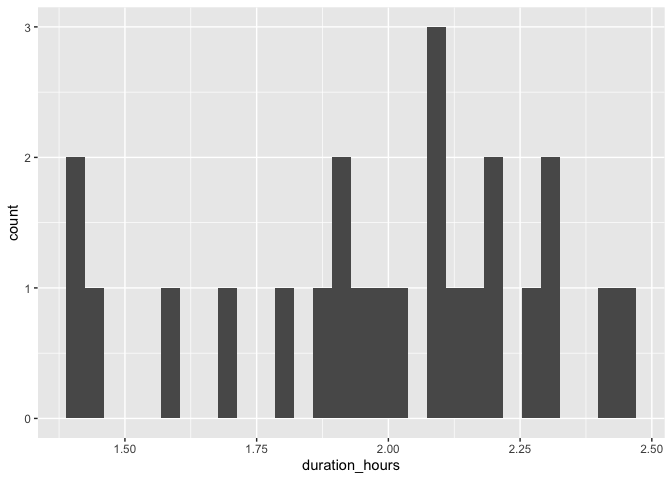
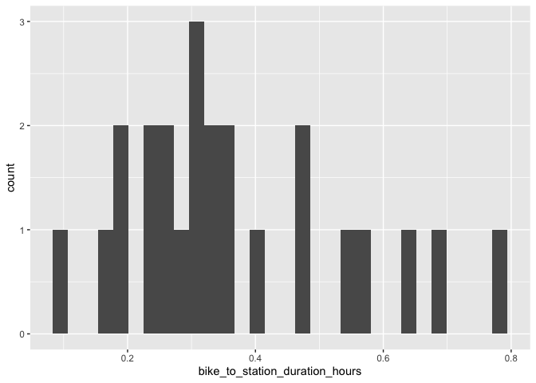

# Vancouver

## Surrey Central Station

### Draw buffer and select points


```r
destination <- "Vancouver Art Gallery, Vancouver, Canada"        #### EDIT ME
```

### Set origin point


```r
origin <- "Surrey Station, Vancouver, Canada"    #### EDIT ME
```

#### Setup departure location and arrival time


```r
arrival_time <- as.POSIXct("2024-06-11 08:30:00", tz = "America/Vancouver")       #### EDIT ME
```

#### List of variables for geocoding


```r
var_list <- c("var1", "var2", "var3", "var4", "var5", "var6", "var7", "var8", "var9", "var10", "var11", "var12", "var13", "var14", "var15", "var16", "var17", "var18", "var19", "var20", "var21", "var22", "var23", "var24")
```


```r
stations <- geocode(location = origin, output = "more", source = "google")
```

```
## ℹ <https://maps.googleapis.com/maps/api/geocode/json?address=Surrey+Station,+Vancouver,+Canada&key=xxx>
```

```r
stations_sf <- stations %>%
                st_as_sf(coords = c("lon", "lat"), crs = 4326)

stations_buffer = st_buffer(stations_sf, 5000)

stations_buffer <- as_sf(stations_buffer)
```

#### Interactive map view of buffers


```r
mapview(stations_buffer)
```

```{=html}
<div class="leaflet html-widget html-fill-item" id="htmlwidget-310f3857769723a6df46" style="width:672px;height:480px;"></div>
<script type="application/json" data-for="htmlwidget-310f3857769723a6df46">{"x":{"options":{"minZoom":1,"maxZoom":52,"crs":{"crsClass":"L.CRS.EPSG3857","code":null,"proj4def":null,"projectedBounds":null,"options":{}},"preferCanvas":false,"bounceAtZoomLimits":false,"maxBounds":[[[-90,-370]],[[90,370]]]},"calls":[{"method":"addProviderTiles","args":["CartoDB.Positron","CartoDB.Positron","CartoDB.Positron",{"errorTileUrl":"","noWrap":false,"detectRetina":false,"pane":"tilePane"}]},{"method":"addProviderTiles","args":["CartoDB.DarkMatter","CartoDB.DarkMatter","CartoDB.DarkMatter",{"errorTileUrl":"","noWrap":false,"detectRetina":false,"pane":"tilePane"}]},{"method":"addProviderTiles","args":["OpenStreetMap","OpenStreetMap","OpenStreetMap",{"errorTileUrl":"","noWrap":false,"detectRetina":false,"pane":"tilePane"}]},{"method":"addProviderTiles","args":["Esri.WorldImagery","Esri.WorldImagery","Esri.WorldImagery",{"errorTileUrl":"","noWrap":false,"detectRetina":false,"pane":"tilePane"}]},{"method":"addProviderTiles","args":["OpenTopoMap","OpenTopoMap","OpenTopoMap",{"errorTileUrl":"","noWrap":false,"detectRetina":false,"pane":"tilePane"}]},{"method":"createMapPane","args":["polygon",420]},{"method":"addPolygons","args":[[[[{"lng":[-123.0656993273498,-123.0648191132996,-123.0639388902941,-123.0645956695918,-123.0637154287006,-123.0628351788544,-123.0634919577871,-123.0626116900541,-123.0617314133661,-123.0623881919323,-123.0615078973565,-123.0606275938257,-123.061284372024,-123.0604040506043,-123.0607324417986,-123.060292275497,-123.0606206688327,-123.0601804980586,-123.059300149794,-123.0598748369317,-123.0597647917917,-123.0598468909084,-123.0581961949223,-123.0588529809451,-123.0579725879428,-123.0584651822429,-123.0582450809172,-123.0584092806465,-123.0577489716356,-123.0568685517854,-123.0575253460003,-123.0566449082562,-123.0571375087002,-123.0569173961888,-123.0570815979661,-123.0555407908033,-123.0561975932086,-123.0553171107187,-123.0559739216889,-123.0550934213025,-123.0555860343127,-123.0553659061403,-123.0555301121065,-123.0548697225541,-123.055198134416,-123.0547578696801,-123.0550862836834,-123.0546460144729,-123.0537654693349,-123.0544222970584,-123.0535417340212,-123.0541985703099,-123.0533179893727,-123.0539748342269,-123.0530942353889,-123.0537507680752,-123.0537503380888,-123.0537506588223,-123.0528704720691,-123.0534452253489,-123.0533351466483,-123.0534172552144,-123.0526466994128,-123.0532214601878,-123.0531113792494,-123.0531934888862,-123.0524229174193,-123.0529155751159,-123.0526954089026,-123.0528596297648,-123.0521991260881,-123.0527739018541,-123.0526638164396,-123.0527459282181,-123.0519753254185,-123.0525501086803,-123.0524400210276,-123.0525221338769,-123.05175151541,-123.0524032880909,-123.0523964074686,-123.0524015396048,-123.0515276960619,-123.0521846094466,-123.0513038673737,-123.0519607893255,-123.0510800293447,-123.0517369598639,-123.0508561819744,-123.0515131210612,-123.0518415971735,-123.0514011981567,-123.0517296764111,-123.0512892729167,-123.0517819951537,-123.0515617908883,-123.0517260332645,-123.0510654154298,-123.0517223891709,-123.0508415486,-123.0514985309099,-123.0506176724266,-123.0517674179626,-123.0515471980253,-123.0517114512083,-123.0510507863573,-123.0517078033266,-123.0508269000643,-123.0514839256037,-123.0519767062573,-123.0517564751248,-123.0519207369735,-123.051260038536,-123.0519170901686,-123.0510361421226,-123.0523092121829,-123.0522541515483,-123.0522952193847,-123.0514693051382,-123.0521263914381,-123.05245494116,-123.0520144436252,-123.0523429954902,-123.0519024934756,-123.0525596058736,-123.051678586166,-123.0523357071371,-123.0529928456353,-123.0521117990532,-123.0527689461254,-123.0534261107257,-123.0525450372676,-123.0532022104428,-123.0538594011473,-123.0529783008117,-123.0536355000919,-123.0546213318819,-123.0541807671574,-123.054509384281,-123.0540688150751,-123.0547260579939,-123.0553833184448,-123.0545021553949,-123.0558167109861,-123.0564329330624,-123.0563778584298,-123.0564189404145,-123.055592816195,-123.0562501288706,-123.0569074590809,-123.0575648068265,-123.0566835721006,-123.0579983022906,-123.0589843959672,-123.0585437595675,-123.0588724639898,-123.0584318231068,-123.0590892406277,-123.059746675687,-123.0604041282851,-123.0610615984226,-123.0601802741044,-123.0628102942421,-123.0654405950494,-123.0645591901182,-123.0652168002251,-123.0658744278763,-123.0665320730724,-123.0671897358137,-123.0678474161008,-123.0685051139341,-123.0691628293139,-123.0698205622409,-123.0704783127155,-123.0709190565896,-123.0712479406452,-123.0716886845088,-123.0733331817814,-123.0759646055593,-123.0766225053801,-123.077504053483,-123.0781619798037,-123.078819923676,-123.0794778851005,-123.0801358640775,-123.0810174389709,-123.0816754444478,-123.0829915080619,-123.0838731007906,-123.0845311678741,-123.085189252512,-123.0858473547048,-123.0867289652621,-123.0873870939542,-123.0880452402019,-123.0889268596382,-123.0895850323848,-123.0902432226875,-123.0911248509987,-123.0917830677999,-123.0924413021579,-123.0933229393398,-123.0939812001957,-123.0944220198768,-123.0947511591238,-123.0951919787863,-123.0961794295686,-123.0970610755408,-123.0977194069485,-123.0983806422144,-123.0985452294856,-123.0987656406723,-123.0992594107462,-123.0999177862087,-123.100799440959,-123.1014578429169,-123.102339497584,-123.1029979260367,-123.1038795806184,-123.1045380355653,-123.1054196900596,-123.1060781714998,-123.1069598259047,-123.1076183338375,-123.1084999881509,-123.1091585225757,-123.1100401767954,-123.1106987377115,-123.1115803918356,-123.1122389792421,-123.1131206332686,-123.1135614568964,-123.1138907638815,-123.1143315874842,-123.1146609010915,-123.1155425459892,-123.1162011953017,-123.1170828400965,-123.1175236591074,-123.1178529970436,-123.1182938160283,-123.1186231605861,-123.1195047962442,-123.1201635074553,-123.1210451430052,-123.1218716681293,-123.1219128392436,-123.1219679406712,-123.122585516141,-123.1242385582398,-123.124320904893,-123.1244311067096,-123.1250075419407,-123.1258891591968,-123.1267707674167,-123.1274295848416,-123.1291927920081,-123.129633588151,-123.1299630145966,-123.1304038107092,-123.1307332437743,-123.1316148336785,-123.1324964145431,-123.133155311676,-123.1340368924153,-123.1366746932819,-123.1366798412629,-123.136686728366,-123.1373405307326,-123.1382220842164,-123.1391036286567,-123.1399851640531,-123.1408666904051,-123.1416931131457,-123.1417343008752,-123.1417893954767,-123.1424072201715,-123.1441702454654,-123.1459332345726,-123.1476961874898,-123.1494591042139,-123.1512219847416,-123.1529848290696,-123.1547476371947,-123.1565104091137,-123.1582731448233,-123.1600358443203,-123.160917180488,-123.1602682809687,-123.1602820516377,-123.1602717517803,-123.161139299334,-123.1620206085004,-123.1629019086124,-123.1637831996694,-123.1646644816713,-123.1643348663381,-123.1647755017207,-123.1644458885535,-123.1657677744511,-123.1675302572858,-123.1684114851185,-123.1677522319521,-123.1686334418416,-123.1695146426744,-123.1703958344501,-123.1697365721783,-123.1714989107891,-123.1723800665082,-123.1717207951355,-123.1726019329144,-123.1734830616356,-123.1743641812987,-123.1737049008297,-123.1754670952199,-123.174849019067,-123.1749040865376,-123.1748628819744,-123.1756888892667,-123.1765699549366,-123.1762403122971,-123.1766808395155,-123.1763511990431,-123.1776727604522,-123.1773431177081,-123.1777836314293,-123.1774539908523,-123.1778945000896,-123.1787755117704,-123.1784458689224,-123.1788863691468,-123.178556728466,-123.1798782088946,-123.1795485659435,-123.1799890526716,-123.1796594118878,-123.1800998941326,-123.1809808518282,-123.1804863888926,-123.1807066252373,-123.180541805897,-123.1820834405749,-123.1814241586501,-123.1823050714235,-123.1819754326032,-123.182415883375,-123.1820862467221,-123.1825266930113,-123.1834075787958,-123.1827895094159,-123.1828445639569,-123.1828033598451,-123.1836291731939,-123.1845100319905,-123.1838507583333,-123.1847315992016,-123.1840723342142,-123.1849531571552,-123.1846235268041,-123.1850639326607,-123.184734304477,-123.1851747058519,-123.1860555018082,-123.1853962452923,-123.1862770233231,-123.1856589779536,-123.1857140257602,-123.185672823249,-123.1864985355831,-123.1861689138028,-123.1866092882427,-123.1862796686298,-123.1867200385888,-123.1876007717134,-123.1869415323407,-123.1878222475425,-123.1871630168394,-123.1880437141193,-123.1873844920857,-123.1882651714443,-123.187608533098,-123.1876119731996,-123.1876093981813,-123.1884866195182,-123.187909814451,-123.1880198955246,-123.187937495758,-123.1887080583415,-123.1882136596781,-123.1884338174809,-123.188269019564,-123.1889294879148,-123.188435095753,-123.1886552490763,-123.1884904533265,-123.1891509082388,-123.1886565225784,-123.1888766714223,-123.1887118778395,-123.189372319314,-123.1888779401548,-123.1890980845195,-123.1889332931038,-123.189593721141,-123.1890169539985,-123.1891270238737,-123.1890446295247,-123.1898151137204,-123.1891662601612,-123.1891800186083,-123.1891697194802,-123.1900364970528,-123.1893773530354,-123.1902578711389,-123.1895987357889,-123.1904792359791,-123.1898201092964,-123.1907005915741,-123.1900414735585,-123.1897119211226,-123.1901521522227,-123.1898226019534,-123.1902628285758,-123.1896861222712,-123.1897961776043,-123.1897137919462,-123.1904841743488,-123.1898250911905,-123.1907055108782,-123.1900464363857,-123.1897169057105,-123.1901571055171,-123.1898275770081,-123.1902677723377,-123.1896138727798,-123.1896207507452,-123.1896156019977,-123.190489099047,-123.1898300594068,-123.1907104165143,-123.1900513855386,-123.1894129659884,-123.1894404764573,-123.1894198825434,-123.1902727024288,-123.1896136976369,-123.1892842018106,-123.1897243569483,-123.1893948632877,-123.1898350139494,-123.1891760353393,-123.1900563210213,-123.1887795826571,-123.1888345991395,-123.1887934150912,-123.1896186575679,-123.1889597137992,-123.1884655174677,-123.1886855769113,-123.1885208464368,-123.1891810197152,-123.1881926498956,-123.1886327559469,-123.1883033058842,-123.1887434074606,-123.1880845160437,-123.1877550769029,-123.1881951695776,-123.1878657326017,-123.1883058208018,-123.1870292852964,-123.1870842950903,-123.1870431175856,-123.1878682597361,-123.1872094206629,-123.1865505991012,-123.1874307242612,-123.1861131159627,-123.1855366843566,-123.1856466961841,-123.1855643497678,-123.1863344276368,-123.1856756584084,-123.1850169066889,-123.1845228543892,-123.1847428692794,-123.1845781868146,-123.1852382264358,-123.1839207928291,-123.1832621022862,-123.1841421206459,-123.1834834387555,-123.1828247743709,-123.1821661274914,-123.1815074981167,-123.1823874720262,-123.1817288513019,-123.1790945434363,-123.1787652746433,-123.1792052338618,-123.1788759672306,-123.179315921978,-123.178657397414,-123.1779988903508,-123.1773404007878,-123.1766819287245,-123.1760234741607,-123.1753650370957,-123.1747066175292,-123.1740482154607,-123.1733898308897,-123.1727314638158,-123.1720731142386,-123.1714147821575,-123.1707564675722,-123.1700981704821,-123.1694398908869,-123.1687816287861,-123.1681233841792,-123.1674651570658,-123.1668069474454,-123.1659272039703,-123.1632945758475,-123.1626364625454,-123.1617567543547,-123.161098667404,-123.1604405979437,-123.1597825459733,-123.1591227788547,-123.1589582702564,-123.1587383473112,-123.1575868216071,-123.1569288309663,-123.1561591175506,-123.1560768709196,-123.1559669114357,-123.1553911936393,-123.1547332468385,-123.154293415806,-123.1539644511796,-123.1535246201118,-123.1518798736387,-123.1510002269138,-123.1503423677925,-123.1499025454873,-123.1495736247008,-123.1491338023619,-123.1488048881637,-123.148147072882,-123.1474873451305,-123.147322895705,-123.1471029858838,-123.1466096458272,-123.1459518743847,-123.145072244996,-123.1444144999079,-123.1437547786138,-123.143590346737,-123.1433704390687,-123.1428771516582,-123.1422194504097,-123.1413398296383,-123.1406821547455,-123.139802533851,-123.1391448853146,-123.1382652642992,-123.1376076421197,-123.1367829975698,-123.136741897284,-123.1366869207343,-123.1360704251637,-123.1353007570607,-123.135218559783,-123.1351086067736,-123.1345332344494,-123.1337085896822,-123.1336674926913,-123.1336125161272,-123.1329960699794,-123.1321164485007,-123.1314589317566,-123.1305793101672,-123.1299218197837,-123.1290421980857,-123.1283847340636,-123.127505112259,-123.1268453900089,-123.12668103062,-123.1264611226353,-123.1259680526897,-123.1250884217964,-123.1244310193807,-123.1235513883861,-123.1231115695202,-123.1227828815301,-123.1223430626395,-123.1220143812408,-123.1211347411653,-123.1204774003634,-123.1195977601918,-123.1187181110401,-123.1180608054909,-123.1163014980232,-123.1156442277299,-123.114764569417,-123.1138849021271,-123.1134450651159,-123.1131164476362,-123.1126766106034,-123.1123479997166,-123.1114683233646,-123.1105886380376,-123.1099314471578,-123.1090517617484,-123.1081720673655,-123.1072923640095,-123.1066352172911,-123.1048758014513,-123.1031163497268,-123.102676481189,-123.1023479344017,-123.1019080658459,-123.1015795256537,-123.1006997862641,-123.0998200379056,-123.0989402805787,-123.0980605142838,-123.0971807390212,-123.0963009547913,-123.0956439409214,-123.0947641566277,-123.0912449297995,-123.0903651006811,-123.0906935787165,-123.0902536585691,-123.0898137361808,-123.0894852625991,-123.0877255595457,-123.0842060458924,-123.084534492745,-123.0840945412288,-123.0844229902251,-123.0839830342406,-123.0831031155509,-123.0822231879004,-123.0813432512895,-123.0804633057187,-123.0795833511884,-123.0787033876989,-123.0778234152507,-123.0784802594995,-123.0767202698927,-123.0749602444531,-123.0755349663028,-123.0754249625475,-123.0755070666227,-123.0747370354411,-123.073856991407,-123.0729769384156,-123.0720968764674,-123.0727536843382,-123.0709935157263,-123.0701134179855,-123.0707702165783,-123.0698901009569,-123.0690099763791,-123.0681298428455,-123.0687866321558,-123.0670263203685,-123.0673547126571,-123.0669146268812,-123.0672430213116,-123.0668029310648,-123.0659227438544,-123.0650425476887,-123.0656993273498],"lat":[49.25550962626502,49.25579299275979,49.25607635219715,49.2565752310171,49.25685859263709,49.25714194719913,49.2576408439827,49.25792420072687,49.25820755041253,49.2587064651599,49.25898981702718,49.2592731618354,49.25977209454674,49.26005544153608,49.26030491231818,49.26044658547563,49.26069605843863,49.26083773214129,49.26112107425161,49.2615576637542,49.26159308203226,49.26165545207328,49.26218671517182,49.26268569253551,49.26296903194566,49.26334327155979,49.2634141070417,49.26353885409268,49.26375135962309,49.2640346941516,49.26453369820393,49.26481703491165,49.26519129454235,49.26526212934855,49.26538688307173,49.26588271839922,49.2663817491406,49.26666508314363,49.26716412260915,49.26744745879049,49.26782174498122,49.26789257965568,49.2680173422322,49.26822984533963,49.26847937386118,49.26862104270248,49.26887057340508,49.26901224279084,49.2692955762645,49.26979465114394,49.27007798679504,49.27057707039874,49.2708604082271,49.27135950055504,49.27164284056046,49.2721416979111,49.2721418362635,49.27214207996505,49.27242528379497,49.27286200487767,49.27289742316452,49.27295981200268,49.27320773793041,49.27364446664683,49.27367988520577,49.27374227513444,49.27399020296659,49.27436454843386,49.27443538569661,49.27456016803192,49.27477267890335,49.2752094228872,49.27524484199022,49.27530723409995,49.27555516574046,49.27599191735804,49.27602733673307,49.27608972993331,49.27633766347775,49.27683291724149,49.27683513098113,49.2768390306156,49.27712017211503,49.27761933423692,49.27790269165212,49.27840186249823,49.27868522208881,49.27918440165914,49.27946776342493,49.27996695171948,49.28021654567208,49.28035823083686,49.2806078269705,49.28074951267903,49.28112391010232,49.28119475402708,49.28131955368097,49.28153208453762,49.28203128976115,49.28231466729506,49.28281388124266,49.28309726095114,49.28397090028527,49.28404174815206,49.28416655421894,49.28437909690145,49.28487832777692,49.28516172107834,49.28566096067775,49.28603539003556,49.2861062413007,49.28623105159932,49.28644360447664,49.28694285227907,49.28722625917342,49.28819356821942,49.28821128203506,49.2882424855562,49.2885081900179,49.28900745474634,49.28925708691486,49.28939880035386,49.28964843470327,49.28979014868573,49.29028942161576,49.29057285352243,49.29107213517596,49.29157141630692,49.29185485963328,49.29235414948759,49.29285343881882,49.29313689356518,49.29363619161963,49.2941354891505,49.29441895531716,49.2949182615711,49.29566721996922,49.29580896195893,49.29605861680792,49.29620035934101,49.29669967326919,49.29719898667242,49.29748248492839,49.29848112865465,49.29894924217746,49.29896696228147,49.29899816986934,49.29926396865514,49.29976329845206,49.30026262772262,49.30076195646647,49.30104549606365,49.30204417046829,49.30279317488699,49.30293495821876,49.30318462840676,49.30332641228201,49.30382575688682,49.30432510096316,49.30482444451065,49.30532378752893,49.30560738697339,49.30760479075168,49.30960218603672,49.30988585241686,49.31038520916086,49.3108845653724,49.31138392105115,49.31188327619669,49.31238263080868,49.31288198488676,49.31338133843055,49.31388069143966,49.31438004391376,49.31423816996774,49.31448784369039,49.31434596566113,49.31559432069589,49.31759168177148,49.31809102069577,49.31780718991152,49.31830651904064,49.31880584763056,49.31930517568092,49.31980450319136,49.31952062830026,49.32001994601281,49.32101857981485,49.32073467007105,49.32123397690142,49.32173328318956,49.32223258893509,49.3219486443362,49.3224479402796,49.32294723567941,49.32266326548275,49.32316255107889,49.3236618361305,49.32337784033499,49.32387711558141,49.32437639028232,49.32409236888689,49.32459163378109,49.32444961579832,49.32469924572523,49.32455722365748,49.32530610567187,49.32502204233513,49.32552128706543,49.32530822797111,49.32543303733146,49.32536201616963,49.32573644230839,49.32623567667996,49.32595157139962,49.32645079595958,49.32616667433801,49.32666588908545,49.32638175112246,49.32688095605643,49.32659680175185,49.32709599687144,49.32681182622506,49.32731101152933,49.32702682454098,49.32752600002903,49.32724179669852,49.3277409623694,49.32745674269653,49.32795589854936,49.32767166253393,49.32752954187216,49.32777911264204,49.32763698789463,49.32788655620959,49.32760229677413,49.32810142372242,49.32781714794417,49.32767500740118,49.3279245637177,49.327782419089,49.32803197295008,49.32774767375204,49.32824677179072,49.32796245624967,49.32769590400307,49.32772709648989,49.32770932608278,49.32817721258074,49.32764407122507,49.32770645388248,49.32767091009614,49.32810758744032,49.32782322506055,49.32753885560505,49.32803789636844,49.32746911769576,49.32732691860556,49.32757642719267,49.32743422401671,49.3276837301468,49.32739931385458,49.32711489048761,49.32761388379062,49.32732944408052,49.32647830488327,49.32648220297715,49.32647998059814,49.32697503817083,49.32669056089536,49.32640607654632,49.32612158512396,49.3258370866285,49.32557036286542,49.32560154471535,49.32558376287392,49.32605148981568,49.32548243892145,49.32491335973815,49.32434425226764,49.32377511651174,49.32320595247231,49.32263676015121,49.32206753955026,49.32149829067131,49.32092901351621,49.32035970808681,49.32007504476982,49.3195841231138,49.319579675336,49.31957188292658,49.31929166958912,49.31900700140857,49.31872232616067,49.31843764384569,49.31815295446384,49.31790362039656,49.31776127537366,49.31751194348206,49.31708490476787,49.31651549508447,49.31623077964422,49.31573215715855,49.31544744392526,49.31516272362689,49.3148779962637,49.31437940102477,49.31380994364967,49.31352520436593,49.31302663637356,49.31274189929845,49.31245715515984,49.31217240395797,49.31167386321199,49.31110435816445,49.31063699308225,49.3106191961376,49.31058803848384,49.31032108154709,49.31003632063978,49.30978706831188,49.3096446875281,49.30939543737548,49.30896829138592,49.30871904804474,49.30857666483558,49.30832742366965,49.30818504101328,49.30790027040479,49.30765103605025,49.30750865041627,49.30725941823695,49.30683225769839,49.30658303233039,49.30644064427212,49.30619142107928,49.30604903357404,49.30576425326863,49.30539042864274,49.30531923420184,49.30519462650127,49.30469625711751,49.30419784218423,49.303913059245,49.30366385620005,49.30352146440137,49.30327226353153,49.30312987228619,49.30284508450167,49.3023778455243,49.3023600465967,49.30232889734989,49.3020619106705,49.30177711804175,49.3012787477536,49.30099395733909,49.30049559575117,49.30021080755107,49.29996163117865,49.29981923675012,49.29957006255275,49.29942766867791,49.29914287563568,49.29864454071977,49.29835974989267,49.29789256908209,49.29787476996434,49.29784362459534,49.29757663506507,49.29732747637861,49.29718508174459,49.29693592523316,49.29679353115306,49.29650873770122,49.29601043815684,49.295725646921,49.2952273560766,49.29494256705695,49.29444428491253,49.29415949810926,49.29366317104657,49.29366205862036,49.29366011223875,49.29337644007811,49.29294045845792,49.29290486090258,49.29284257792317,49.2925933929637,49.29221970098384,49.29214850602744,49.29202394254224,49.29181035676621,49.29143667131134,49.29136547690919,49.29124091559899,49.29102733148584,49.29065365255595,49.29058245870811,49.29045789957291,49.29024431712276,49.28987064471786,49.28979945142437,49.28967489446418,49.28946131367719,49.28902537011944,49.28898977394984,49.28892749640795,49.2886783211493,49.28818789318021,49.28818344371553,49.2881756591424,49.28789533953928,49.28739713569481,49.28711236884732,49.28661417370287,49.28632940907362,49.28583122262918,49.28554646021836,49.28504828247394,49.28479919338827,49.28465681649079,49.28440772958016,49.28426535323734,49.2838294548567,49.28379386150938,49.28373159042143,49.28348243491955,49.2829842740063,49.28269952752078,49.2822013753077,49.281952298988,49.28180993005309,49.28156085590846,49.2814184875283,49.2809242352,49.28092201075192,49.28091811899965,49.28063561066831,49.28013747528749,49.2798527447279,49.27935461804739,49.2788720572844,49.27886315991104,49.278847593435,49.27857177172708,49.27807365317946,49.27782459369298,49.27768223846451,49.27743318115316,49.27729082647957,49.2767927160655,49.27650801069986,49.27554293811558,49.27552514491841,49.27549401354553,49.27522711282761,49.27472901924848,49.27435544869273,49.2742842781761,49.27415975516597,49.27394624271101,49.27319911433275,49.27305677744383,49.27280773668497,49.27266540035102,49.27216732304252,49.27191828417641,49.27177595303046,49.27152691633962,49.27138458574863,49.2704195762149,49.27040178588918,49.27037065655031,49.27010379890485,49.26960573786958,49.26910767627044,49.26882303982063,49.26782693346193,49.26739113622169,49.26735555949965,49.26729330286063,49.26704426373757,49.2665462184153,49.26604817253054,49.26567463774807,49.26560348909143,49.26547897800602,49.26526553113151,49.26426945508024,49.26377141621256,49.2634868420073,49.26298881184194,49.26249078111585,49.26199274982942,49.26149471798298,49.26121017378593,49.26071215064224,49.25872005247636,49.25847103957739,49.25832879030801,49.25807977958488,49.25793753087024,49.25743951363628,49.25694149584482,49.25644347749624,49.25594545859089,49.25544743912917,49.25494941911142,49.25445139853802,49.25395337740934,49.25345535572574,49.25295733348761,49.25245931069529,49.25196128734918,49.25146326344962,49.250965238997,49.25046721399166,49.24996918843401,49.24947116232438,49.24897313566316,49.24847510845072,49.24875942819832,49.24676727681818,49.24626923759933,49.24655350402553,49.24605545500243,49.24555740543114,49.24505935531203,49.24527252968734,49.24514801533673,49.24521907200339,49.24434746654305,49.24384940552846,49.24409807812832,49.24403581945092,49.24407134352344,49.2436355315308,49.24313746017066,49.24327954668534,49.24303050848744,49.24317259092872,49.24192738633072,49.24221152280057,49.2417134307568,49.24185549172539,49.24160644318668,49.24174850008213,49.24149944909465,49.24100134671277,49.24121441834727,49.24108989093235,49.24116091335224,49.24078732916956,49.24028921645206,49.24057328554125,49.24007516303131,49.24028820328959,49.24016367084307,49.24023468280424,49.2398610835275,49.23936295068595,49.23964697794172,49.23914883531015,49.23943284627509,49.23893469385444,49.2392186885287,49.23872052631989,49.23898675626096,49.23895562056309,49.23897336896966,49.23850633270761,49.23875479992446,49.23869252737556,49.23872802210767,49.23829211301871,49.23855831241566,49.23852717549452,49.23854492186481,49.2380778672543,49.23836179676776,49.23786359541548,49.23814750863918,49.23764929750335,49.23793319443751,49.23743497351902,49.23771885416382,49.23793176002619,49.23780720066731,49.23787816782989,49.23750448781922,49.23778834513281,49.23729009540483,49.2375739364293,49.23771585430064,49.23746672230177,49.23760863610084,49.23735950165726,49.23764331935025,49.23714504081783,49.23742884222193,49.23771263658313,49.23721433902749,49.23778188812896,49.23728357155176,49.23756732629208,49.23785107398878,49.23799294519569,49.23774377515205,49.23788564228674,49.23763646979963,49.23792019416359,49.23820391148333,49.23770554762353,49.23798924865444,49.23827294264078,49.2385566295823,49.23805823746237,49.23862557172242,49.23919287780084,49.23933469991685,49.23908548286133,49.23922730090503,49.23897808140728,49.23926170758854,49.23954532672358,49.23982893881216,49.24011254385405,49.24039614184903,49.24067973279686,49.24018123795113,49.2404648126092,49.24159904076414,49.24188258018238,49.24213185539701,49.24227362477334,49.24241539238748,49.24216611255197,49.24273315614429,49.243867158735,49.24411646629482,49.24425821099771,49.24450752073762,49.2446492659882,49.24493275120141,49.24521622936381,49.24549970047517,49.24578316453527,49.24606662154387,49.24635007150076,49.2466335144057,49.24713220280263,49.24769908593694,49.24826594086032,49.24870232512397,49.24873775363064,49.24880009435169,49.24904809182316,49.24933151089218,49.24961492290746,49.24989832786877,49.25039708915244,49.25096389639285,49.25124728943106,49.25174607791775,49.25202947314128,49.25231286130951,49.25259624242222,49.25309505811209,49.25366181765041,49.25391123454156,49.25405292232609,49.25430234139795,49.25444402972844,49.25472740109691,49.25501076540853,49.25550962626502]}]]],null,"stations_buffer",{"crs":{"crsClass":"L.CRS.EPSG3857","code":null,"proj4def":null,"projectedBounds":null,"options":{}},"pane":"polygon","stroke":true,"color":"#333333","weight":0.5,"opacity":0.9,"fill":true,"fillColor":"#6666FF","fillOpacity":0.6,"smoothFactor":1,"noClip":false},"<div class='scrollableContainer'><table class=mapview-popup id='popup'><tr class='coord'><td><\/td><th><b>Feature ID&emsp;<\/b><\/th><td>1&emsp;<\/td><\/tr><tr><td>1<\/td><th>type&emsp;<\/th><td>locality&emsp;<\/td><\/tr><tr><td>2<\/td><th>loctype&emsp;<\/th><td>approximate&emsp;<\/td><\/tr><tr><td>3<\/td><th>address&emsp;<\/th><td>vancouver, bc, canada&emsp;<\/td><\/tr><tr><td>4<\/td><th>north&emsp;<\/th><td>49.31729&emsp;<\/td><\/tr><tr><td>5<\/td><th>south&emsp;<\/th><td>49.19818&emsp;<\/td><\/tr><tr><td>6<\/td><th>east&emsp;<\/th><td>-123.0231&emsp;<\/td><\/tr><tr><td>7<\/td><th>west&emsp;<\/th><td>-123.2247&emsp;<\/td><\/tr><tr><td>8<\/td><th>geometry&emsp;<\/th><td>sfc_POLYGON&emsp;<\/td><\/tr><\/table><\/div>",{"maxWidth":800,"minWidth":50,"autoPan":true,"keepInView":false,"closeButton":true,"closeOnClick":true,"className":""},"1",{"interactive":false,"permanent":false,"direction":"auto","opacity":1,"offset":[0,0],"textsize":"10px","textOnly":false,"className":"","sticky":true},{"stroke":true,"weight":1,"opacity":0.9,"fillOpacity":0.84,"bringToFront":false,"sendToBack":false}]},{"method":"addScaleBar","args":[{"maxWidth":100,"metric":true,"imperial":true,"updateWhenIdle":true,"position":"bottomleft"}]},{"method":"addHomeButton","args":[-123.1907104165143,49.23714504081783,-123.0506176724266,49.32824677179072,true,"stations_buffer","Zoom to stations_buffer","<strong> stations_buffer <\/strong>","bottomright"]},{"method":"addLayersControl","args":[["CartoDB.Positron","CartoDB.DarkMatter","OpenStreetMap","Esri.WorldImagery","OpenTopoMap"],"stations_buffer",{"collapsed":true,"autoZIndex":true,"position":"topleft"}]},{"method":"addLegend","args":[{"colors":["#6666FF"],"labels":["stations_buffer"],"na_color":null,"na_label":"NA","opacity":1,"position":"topright","type":"factor","title":"","extra":null,"layerId":null,"className":"info legend","group":"stations_buffer"}]}],"limits":{"lat":[49.23714504081783,49.32824677179072],"lng":[-123.1907104165143,-123.0506176724266]},"fitBounds":[49.23714504081783,-123.1907104165143,49.32824677179072,-123.0506176724266,[]]},"evals":[],"jsHooks":{"render":[{"code":"function(el, x, data) {\n  return (\n      function(el, x, data) {\n      // get the leaflet map\n      var map = this; //HTMLWidgets.find('#' + el.id);\n      // we need a new div element because we have to handle\n      // the mouseover output separately\n      // debugger;\n      function addElement () {\n      // generate new div Element\n      var newDiv = $(document.createElement('div'));\n      // append at end of leaflet htmlwidget container\n      $(el).append(newDiv);\n      //provide ID and style\n      newDiv.addClass('lnlt');\n      newDiv.css({\n      'position': 'relative',\n      'bottomleft':  '0px',\n      'background-color': 'rgba(255, 255, 255, 0.7)',\n      'box-shadow': '0 0 2px #bbb',\n      'background-clip': 'padding-box',\n      'margin': '0',\n      'padding-left': '5px',\n      'color': '#333',\n      'font': '9px/1.5 \"Helvetica Neue\", Arial, Helvetica, sans-serif',\n      'z-index': '700',\n      });\n      return newDiv;\n      }\n\n\n      // check for already existing lnlt class to not duplicate\n      var lnlt = $(el).find('.lnlt');\n\n      if(!lnlt.length) {\n      lnlt = addElement();\n\n      // grab the special div we generated in the beginning\n      // and put the mousmove output there\n\n      map.on('mousemove', function (e) {\n      if (e.originalEvent.ctrlKey) {\n      if (document.querySelector('.lnlt') === null) lnlt = addElement();\n      lnlt.text(\n                           ' lon: ' + (e.latlng.lng).toFixed(5) +\n                           ' | lat: ' + (e.latlng.lat).toFixed(5) +\n                           ' | zoom: ' + map.getZoom() +\n                           ' | x: ' + L.CRS.EPSG3857.project(e.latlng).x.toFixed(0) +\n                           ' | y: ' + L.CRS.EPSG3857.project(e.latlng).y.toFixed(0) +\n                           ' | epsg: 3857 ' +\n                           ' | proj4: +proj=merc +a=6378137 +b=6378137 +lat_ts=0.0 +lon_0=0.0 +x_0=0.0 +y_0=0 +k=1.0 +units=m +nadgrids=@null +no_defs ');\n      } else {\n      if (document.querySelector('.lnlt') === null) lnlt = addElement();\n      lnlt.text(\n                      ' lon: ' + (e.latlng.lng).toFixed(5) +\n                      ' | lat: ' + (e.latlng.lat).toFixed(5) +\n                      ' | zoom: ' + map.getZoom() + ' ');\n      }\n      });\n\n      // remove the lnlt div when mouse leaves map\n      map.on('mouseout', function (e) {\n      var strip = document.querySelector('.lnlt');\n      if( strip !==null) strip.remove();\n      });\n\n      };\n\n      //$(el).keypress(67, function(e) {\n      map.on('preclick', function(e) {\n      if (e.originalEvent.ctrlKey) {\n      if (document.querySelector('.lnlt') === null) lnlt = addElement();\n      lnlt.text(\n                      ' lon: ' + (e.latlng.lng).toFixed(5) +\n                      ' | lat: ' + (e.latlng.lat).toFixed(5) +\n                      ' | zoom: ' + map.getZoom() + ' ');\n      var txt = document.querySelector('.lnlt').textContent;\n      console.log(txt);\n      //txt.innerText.focus();\n      //txt.select();\n      setClipboardText('\"' + txt + '\"');\n      }\n      });\n\n      }\n      ).call(this.getMap(), el, x, data);\n}","data":null},{"code":"function(el, x, data) {\n  return (function(el,x,data){\n           var map = this;\n\n           map.on('keypress', function(e) {\n               console.log(e.originalEvent.code);\n               var key = e.originalEvent.code;\n               if (key === 'KeyE') {\n                   var bb = this.getBounds();\n                   var txt = JSON.stringify(bb);\n                   console.log(txt);\n\n                   setClipboardText('\\'' + txt + '\\'');\n               }\n           })\n        }).call(this.getMap(), el, x, data);\n}","data":null}]}}</script>
```

#### Generate points within buffer


```r
set.seed(100)
points_sample_sf <- st_sample(stations_buffer, size = c(25,25), type = "random")
```

```
## Warning in st_poly_sample(x, size = size, ..., type = type, by_polygon =
## by_polygon, : coordinate ranges not computed along great circles; install
## package lwgeom to get rid of this warning
```

```r
points_sample_sf <- st_as_sf(points_sample_sf)
points_sample <- sf_to_df(points_sample_sf)
```

#### Check to see if they worked


```r
check_buffer <- stations_buffer %>% slice(1:2)

plot(st_geometry(check_buffer))
plot(points_sample_sf, pch = 20, add= TRUE)
```

<!-- -->


```r
points_sample$destination <- destination
points_sample$origin <- origin
points_sample$lat_lon <- paste(points_sample$lat, points_sample$lon)
```

#### Checking points and general mapping


```r
lst_directions <- apply(points_sample, 1, function(x){
  res <- google_directions(
    origin = x[['lat_lon']], 
    destination = x[['destination']]    
  )
df_result <- data.frame(
    origin = x[['lat_lon']], 
    destination = x[['destination']], 
    route = res$routes$overview_polyline$points 
)
return(df_result)
})

df_directions <- do.call(rbind, lst_directions)

google_map() %>%
  add_polylines(data = df_directions, polyline = "route") 
```

```{=html}
<div class="google_map html-widget html-fill-item" id="htmlwidget-f126e8de6ecafd82690a" style="width:672px;height:480px;"></div>
<script type="application/json" data-for="htmlwidget-f126e8de6ecafd82690a">{"x":{"lat":0,"lng":0,"zoom":1,"min_zoom":null,"max_zoom":null,"mapBounds":{"west":-180,"south":-90,"east":180,"north":90},"styles":null,"search_box":false,"update_map_view":true,"zoomControl":true,"mapType":"roadmap","mapTypeControl":true,"scaleControl":false,"streetViewControl":true,"rotateControl":true,"fullscreenControl":true,"event_return_type":"list","split_view":null,"split_view_options":{"heading":34,"pitch":10},"geolocation":false,"calls":[{"functions":"add_polylines","args":[[{"id":1,"geodesic":true,"stroke_colour":"#0000FF","stroke_weight":2,"stroke_opacity":0.6,"z_index":3,"polyline":["yyukHlgsnVBeK@UwAGwA?}BG}BEeBCuAKUEYOk@c@i@g@e@m@W_@y@oB}AiH}DcQMu@gCaL{@{De@{ByAqGkAaFk@yB]s@sBoDkBgDkBeDkAqBcFsIo@iA{@eBmCsEmEiHoA{BcAiBdAiBr@sAJO"]},{"id":2,"geodesic":true,"stroke_colour":"#0000FF","stroke_weight":2,"stroke_opacity":0.6,"z_index":3,"polyline":["m~{kHjgmnVYFOLGNCZ@\\DNRX^Vv@h@b@`@PZf@zANv@Dt@AzA]vEQlBUlAiC`Jc@xAw@`C_AdBc@t@_ChCIJ]d@IVELCNEp@@XHjC@nAInAUrCOdA_@pCMp@c@pASd@[`@a@^o@Xi@RcAn@}@n@kBvAoAhAq@r@_ArB{@jBK`@m@hCIh@Ol@Xd@tArDHRLNJ?dH{BxEwArAYVEnF@|B?tDHpBHrCHxA?lBB\\JNLV`@DFBBNh@n@xAFLF?P@XGl@m@^Yb@Or@CREb@P|Av@n@Rb@?XEXK`@[nBaDJ_@hAsBhAuBbHcMfCoEfBkDpBcD`AgBxLiTnC}EnDmGpA~BlCtEzEsIf@cAlBiDVc@"]},{"id":3,"geodesic":true,"stroke_colour":"#0000FF","stroke_weight":2,"stroke_opacity":0.6,"z_index":3,"polyline":["myrkHtznnVGnMoDIAv@GlBMjA_@dB_@|@W\\MLiBfAkBtAw@v@u@~@INa@`AkA`Dg@vAa@|A]lBMx@IxAKfIGVMPMFq@AyDE_OOoB?wBCoBAmEAiBA[Ya@Ac@?eACk@EoAAgABW@QB_@Te@j@kBfEg@z@SXYV[JYDi@MYIe@YOIOEa@o@s@kAk@aAcAeBYe@sE{H{AiCaBkC_GoKS_@Wy@Mo@_@kCs@qFOw@GWKQgBcDqFuJ{@~AeElHqBnDOTYg@}DeHyCkFoAuBmC{EsFsJ"]},{"id":4,"geodesic":true,"stroke_colour":"#0000FF","stroke_weight":2,"stroke_opacity":0.6,"z_index":3,"polyline":["a~zkH`mnnVAD[HwA\\o@H@XE^IPYJ_CVoA@k@Ea@CK]YSBa@AmAIi@Sg@iAaBUi@Sw@Em@@mALgBBSOIa@WQCQ?k@Lc@Pa@PKNKXMfBMdAa@dB{BxHq@`Cu@nBgAnBuCbD_@h@M`@Ij@@pAHrCCdAIlAYzCQnA[~BOj@c@pAU`@]^e@\\i@Pm@TsA~@_BjA}@t@iAdAUT[f@iAfCk@pAK^g@|BMr@GVCHFFFLn@`Bx@tBLNF?FAjH}BbDaAhBa@`@Mb@A`G@bDDjCFhCHtAD\\CnCFX?XHFBPPPZFH@@DRVp@Vh@P`@b@@RIt@w@ROVIZGf@?NEPF\\NjB|@\\Fd@ANC^OPMTWZe@hAsBBIDO`@w@`@q@\\q@tCeFhEyHjE}H~@cBtDuGzLmTtGiLvChFfAjBzEsIlBmDr@sAJO"]},{"id":5,"geodesic":true,"stroke_colour":"#0000FF","stroke_weight":2,"stroke_opacity":0.6,"z_index":3,"polyline":["i}qkHlrqnVcBAiGMgUY_KOyBA{V[aEGsHEiCCaJIgAAAAAAQOkBCW?sACcDG_AMc@Ks@Us@]s@g@W[iBwCgAmBmCwEeEcHqAsBmBiDqCaFi@aAQc@[aBeAsHUcBQm@sAaC{@}AoE_Iy@xAcAfBcAhBkDhGU\\kEwH_CeEuA}ByAoCuBqDqEaI"]},{"id":6,"geodesic":true,"stroke_colour":"#0000FF","stroke_weight":2,"stroke_opacity":0.6,"z_index":3,"polyline":["onukHnulnVXt@?T?RYd@_BBc@@s@F}ADkELYHyFIo@?aCGmDGeAEu@?iAC_BGc@G_ACgBEW@_@F_@Jy@`@_@T_@`@]`@Q\\cAlBgB|CcIvNqGbL_ClEwA~Bi@|@qEaI"]},{"id":7,"geodesic":true,"stroke_colour":"#0000FF","stroke_weight":2,"stroke_opacity":0.6,"z_index":3,"polyline":["wdalH~bvnVYCk@Am@@[??gC@_E?kAB_H^_FVmDLuMaA?s@Ch@eGLuBNqDVwCL[l@wGdAeLNkBLuC@iDEwGG_CG{CMoF[sRSyMMgG?_CDy@JcAxAoJTaB@SVy@JYXa@`@a@^Kb@AH@H@TJ`Al@LDZ?RLPBx@l@`@Xr@l@bA`ApBhBdSxQhZbXrIrHzEbErDdDfCvBxAtAz@v@vB|ArAv@xAt@rAj@tBp@xA^|AZ`C\\vALtAFtC@hBIfAO^IdBc@fAc@rAs@~@m@dAy@zAsAzCqDvAwBv@yAl@iAp@{AdAsCp@{Bf@kBbAaEXu@Tc@Ve@FMVMh@m@f@c@l@]x@[~@OXAN?n@RhClA\\FV?TCZI\\Uh@s@\\k@v@{ADO`@w@`@q@x@}AzK{RfCwEdAiBvEkIdNkVnDmGvChFfAjBzEsIlBmD~@cB"]},{"id":8,"geodesic":true,"stroke_colour":"#0000FF","stroke_weight":2,"stroke_opacity":0.6,"z_index":3,"polyline":["k_~kHpqjnVEQy@Ac@?WKkC?gCMiFOSDMLGXMNAx@CbJ?lAMVi@Da@@[E}DCsBA@FGnAK~@Bz@R|@NVH~@XzCLjA~AfM`@bDLjBFlEJlA^|AT|@V`@VXlAj@ZBPCVSHKHUDi@AWKa@[k@MG{@C{AOmAQUEw@Mo@Ia@EQ?aAFgFGEpHApKCfLAfGCxBGvBK`BW|Ac@fB_AnFUbAQp@UKoCcAsHkCePwFYKWAk@QKIKMgBfJoB|JIl@Y~@O`@]^WLYB{@K[?SD]RW^Qj@E\\Cz@R`AJT^f@p@b@x@d@v@`@`Ap@tCzBD@N@TPt@f@FDl@h@l@h@r@p@`GpFxOrN~NxM~I~HfK`J|EdEz@v@\\ZvBjBp@l@fAdAtBdB~A|@jBbA~@b@tAf@|Bn@vAZzCd@rCRrDBd@A|@Er@IbCi@|Ak@h@W`BaA~@q@`Ay@rByBdAoAbAwAvAcCf@cAx@eBPc@h@yAn@sBdA}Dh@wB`@kAh@gAJQVQNK~@cA`@Wz@_@r@Qn@Gr@L`ChAn@RV?XARE\\QTSV]Zg@~@gBFSn@kAjAuBbDaGvJgQN]r@gAdB}CvGmLpHyMXe@nDmGpA~BlCtEzEsIf@cAlBiDVc@"]},{"id":9,"geodesic":true,"stroke_colour":"#0000FF","stroke_weight":2,"stroke_opacity":0.6,"z_index":3,"polyline":["}jzkH|lsnVJGTe@H?REPGNIV]|AqBXk@Pe@Pq@UsAgAqBmAyBcDaGGMFi@Nk@d@mAHYXe@hCwErHuMpEcI`AeBBBHA@IAIdB}C?AzAmCr@mAnDoGtF}J@@DBFC@A@Sv@}A`@u@lAuBrJ}PlBiDtAgC~BcE_@s@s@qAyAiCaAcBqDoG"]},{"id":10,"geodesic":true,"stroke_colour":"#0000FF","stroke_weight":2,"stroke_opacity":0.6,"z_index":3,"polyline":["{jxkHfxpnVQ]HOhAmBrF}JtEqIjBcDeAkBgAgBkCsEeAeBw@}AoC}EuCuEsEcIdCmE"]},{"id":11,"geodesic":true,"stroke_colour":"#0000FF","stroke_weight":2,"stroke_opacity":0.6,"z_index":3,"polyline":["a|}kHnyfnVEIcAy@BE@G?IEKGEE@MRSz@a@b@GBSWsBwBcB_B]_@}AzEg@xAaCfHSh@GHSD_FIuEGwCCuABgCpHiB|Fo@jBu@lB{AzCqAdCs@~AqCdLQl@kBtH}AlGuEnQ_@tAyAxF[fB@n@AdCArG?bAEj@E`J?~@C`KA~NAhFAxCDj@?|B?~DAvH?nJA|G?xDE\\a@pB{C~OmBdKc@pAOZIJUNWHY?w@KS?[F[VWb@Mh@C^A`@ANJl@L^JT`@b@jBdAp@`@`An@bCjBRLPBx@l@`@X|ArAvIbIvOrNrOhNxTvRnExDpAlAfCvBxAtAz@v@vB|ArAv@xAt@rAj@x@XtCv@|AZ`C\\vALtAFtC@~@Ch@EfAO^IdBc@fAc@rAs@~@m@dAy@zAsAzCqDvAwBv@yAl@iApA{Cd@sAp@{Bv@}Cr@oCXu@l@iAFMVMh@m@f@c@l@]x@[l@Mj@CN?n@RhClA\\FV?TCZI\\Uh@s@\\k@v@{ADO`@w@`@q@x@}AvD}GbF}IfCwEdAiB`BuChHiMpHwMnDmGvChFfAjBzEsIlBmD~@cB"]},{"id":12,"geodesic":true,"stroke_colour":"#0000FF","stroke_weight":2,"stroke_opacity":0.6,"z_index":3,"polyline":["qj_lHlkinVkAA?p@CvEGdPA`GNbBlA`KLfANrBtAlLmBAwICyGKyJE{FEEt]AxCDj@?|B?zFCfX?zGE\\Kb@}CjP}A`Ic@dCc@pAOZIJUNWHY?g@I_@AO@]NY\\Sh@G^Ct@ANJl@L^\\h@b@\\hBbAtAz@j@b@pB|AVDhBrAnCdCpTdS`M~K|VvThJbIbCvB|AvA~BvBvB|AXPvBjAt@^pCbAxA^hAVjCb@fALdBJhBDtBA|@E|ASz@S|Ae@zBiAdBkAfA_Ar@o@fBsBrAeB`BoCzA{C`AgCpAgEr@mCv@yC\\w@f@_A`@Uv@}@h@_@j@Yz@U^EPA\\?n@R\\NjB|@\\Fd@ANC^OPMTWZe@hAsBBIDO`@w@`@q@\\q@tCeFhEyHjE}H~@cBtDuGzLmTtGiLvChFfAjBzEsIlBmDr@sAJO"]},{"id":13,"geodesic":true,"stroke_colour":"#0000FF","stroke_weight":2,"stroke_opacity":0.6,"z_index":3,"polyline":["khskHxavnVD}G?w@yACuDEc@ABeDDuHB{EFyMBsITai@eEEqKMm\\e@}IKiBGwABc@?a@?MQgA?o@?oCIwA?}BG}BEeBCuAKUEYOk@c@i@g@e@m@W_@y@oB}AiH}DcQMu@gCaL{@{De@{ByAqGkAaFk@yB]s@sBoDkBgDkBeDkAqBcFsIo@iA{@eBmCsEmEiHoA{BcAiBdAiBr@sAJO"]},{"id":14,"geodesic":true,"stroke_colour":"#0000FF","stroke_weight":2,"stroke_opacity":0.6,"z_index":3,"polyline":["}aukHd}qnVu@EBcMyBAUCAASO_CCsCEgBEsASq@Q]OiAo@[Yo@aA_BmC}AkCsE{H{AiCaBkC_GoKS_@Wy@Mo@_@kCs@qFOw@GWKQgBcDqFuJ{@~AeElHqBnDOTYg@}DeHyCkFoAuBmC{EsFsJ"]},{"id":15,"geodesic":true,"stroke_colour":"#0000FF","stroke_weight":2,"stroke_opacity":0.6,"z_index":3,"polyline":["eoukHjyqnVhEp@n@PjBr@JDr@Rj@DjCJfBDP??U@yBAeA@sCBcCQA{@AaJIgAAAAAAQOkBCW?sACcDG_AMc@Ks@Us@]s@g@W[iBwCsBoD_E_HgByCqAsB_GkKi@aAQc@[aB{AwKQm@sAaC{@}AoE_Iy@xAcAfBcAhBkDhGU\\kEwH_CeEuA}ByAoCgIsN"]},{"id":16,"geodesic":true,"stroke_colour":"#0000FF","stroke_weight":2,"stroke_opacity":0.6,"z_index":3,"polyline":["scskHpxhnV?c@yACyAC{ACC`DCrCApCArECrM?dJEnKIzOMxNO`TEjGGpFCdA?t@{A?qC?u@@kAAcDKi@CwB?gB?{CEuBKgCGcAEuC?uDGkAAq@Dy@@aA@cA@aCB}AF}EJmCDe@GsDGeBAa@AaEIcCImB?_DO{AGoBEq@Jc@N_Af@}@z@a@t@Wh@cAjBmB`Ds@vAeAjBaEhHgB~C}CrFaClE{AdCOVEF_@q@qDoG"]},{"id":17,"geodesic":true,"stroke_colour":"#0000FF","stroke_weight":2,"stroke_opacity":0.6,"z_index":3,"polyline":["ezskHp_mnVBcBASqCGSCg@CkB@]?_FGkBIwGOgEA_DGgAFw@?eBBmEF{CJeFHm@GyFIo@?oHOeAEu@?iAC_BGc@G_ACgBEW@_@F_@Jy@`@_@T_@`@]`@Q\\cAlBgB|CmCzEiGzK}DbH_ClEaC|DqEaI"]},{"id":18,"geodesic":true,"stroke_colour":"#0000FF","stroke_weight":2,"stroke_opacity":0.6,"z_index":3,"polyline":["qotkHbfhnViAAFr@?|BA~A?pB?lEEbGCl@_@`DKfAIzGEfEExDGjEExJMtOQfUC|GE~FG|BGjA?tAArBCdDuC?uDGkAAq@Dy@@oBBwCBkDJiEJsA@e@GsDGeBAI?m@A}EKmCIq@@_BGeBKoBEu@C[Da@Hm@Zi@V_@\\]\\Wb@a@z@}B`Es@jAs@vAcElH{F`KcCpEyBvD}@zAEF_@q@qDoG"]},{"id":19,"geodesic":true,"stroke_colour":"#0000FF","stroke_weight":2,"stroke_opacity":0.6,"z_index":3,"polyline":["wtykHpimnVm@pDAXD`@DPdAhBpA`CbDxFxBzDjD`GvChFfAjBzEsIlBmDr@sAJO"]},{"id":20,"geodesic":true,"stroke_colour":"#0000FF","stroke_weight":2,"stroke_opacity":0.6,"z_index":3,"polyline":["}btkHdegnV@gBzADAbKE|IAlIG~\\GhCEfBi@xDS~AIZER@x@AlF?rGExIAb@D^ChDIxPEzN@NAfGEjCGlBGjI?~@AbDuAA{CEgAGgCGqBIuC?uDGkAAq@Dy@@oBBwCBkDJiEJsA@e@GsDGeBAI?m@A}EKmCIq@@_BGeBKoBEu@C[Da@Hm@Zi@V_@\\]\\Wb@a@z@}B`Es@jAs@vAcElH{F`KcCpEyBvD}@zAEF_@q@qDoG"]},{"id":21,"geodesic":true,"stroke_colour":"#0000FF","stroke_weight":2,"stroke_opacity":0.6,"z_index":3,"polyline":["myqkHffpnVcDGe@CAlB?lBC`GGpMG~MiGMwEGoZa@yBAwEGcPSaEGsHEiCCaJIgAAAAAAQOkBCW?sACcDG_AMc@Ks@Us@]s@g@W[iBwCsBoD_E_HgByCqAsB_GkKi@aAQc@[aB{AwKQm@sAaC{@}AoE_Iy@xAcAfBcAhBkDhGU\\kEwH_CeEuA}ByAoCgIsN"]},{"id":22,"geodesic":true,"stroke_colour":"#0000FF","stroke_weight":2,"stroke_opacity":0.6,"z_index":3,"polyline":["uvskHx~vnV@q@tADf@@DuHJiCE]D[@uA@mDVmk@FuOLe[FwM_@?{ACuIIiS[wJOkJGmCK{BBa@?MQgA?o@?oCIwA?}BG}BEeBCuAKUEYOQOu@m@Y[q@_Ay@oBe@uBmByIwBkJ]gBgDcOcB_IsB{Ie@mBUy@Q_@o@kAoAwBeAkB}BaEy@yAiF{IoAyB{@eBsA}BaC}DeCaEoA{BcAiBdAiBr@sAJO"]},{"id":23,"geodesic":true,"stroke_colour":"#0000FF","stroke_weight":2,"stroke_opacity":0.6,"z_index":3,"polyline":["{rykH|tgnVLMNApD?G|FzHPA~AAtBAj@Id@SPKD`@FL^@HBTO`AyCtP?RHJ`@Pz@b@lAf@f@jCHp@f@zDj@`EBlABh@LjAZ|BXxBLv@Fp@@^CVChHExCMdAUhAsBtKaBpIiAlGuAfHq@tC_@jAw@lCYtAcAvE{BlMk@`Dc@vCEn@@NN\\Xd@b@n@FAFKLw@Pm@ZgBPcA\\cDRsAjAnBlApBf@x@T^Yf@Yh@M`@yBvKjDjGnB`DjHjMzEsIf@cAlBiDVc@"]},{"id":24,"geodesic":true,"stroke_colour":"#0000FF","stroke_weight":2,"stroke_opacity":0.6,"z_index":3,"polyline":["sjskHxpcnVF_FkHKsGEuAAAbCApG?vAGlACfE?bFDrBAxHA`GAnIEj@CdFAbB?nB?jDDv@EtYGfYCxQCrLEnOKpCi@xDS~AIZER@x@AlF?lDAjDCrGAb@D^ChDCtDGbQCrG@v@C~HCrAGlBGjI?~@AbDuAA{CEuBKgCGcAEuC?uDGkAAq@Dy@@aA@cA@aCB}AF}EJmCDe@GsDGeBAa@AaEIcCImB?_DO{AGoBEq@Jc@N_Af@}@z@a@t@Wh@cAjBmB`Ds@vAeAjBaEhHgB~C}CrFaClE{AdCOVEF_@q@qDoG"]},{"id":25,"geodesic":true,"stroke_colour":"#0000FF","stroke_weight":2,"stroke_opacity":0.6,"z_index":3,"polyline":["_|wkHtrlnVd@y@j@bAxChFlFfJ_@l@y@xAaD~F{F~JqC`FmC~EsAzBKNmCwEcAiB"]}],true,"defaultLayerId",true,false,0,false]}]},"evals":[],"jsHooks":[]}</script>
```


# BIKE: Getting cycling routes and points


```r
bike_directions <- apply(points_sample, 1, function(x){
  res <- google_directions(
    origin = x[['lat_lon']], 
    destination = x[['destination']],
    arrival_time =  arrival_time,
    mode = "bicycling",
    alternatives = FALSE,
    units = "metric"
  )
})
```

### Checking geocode and route status


```r
get_elem(bike_directions, "status", recursive = TRUE, DF.as.list = TRUE)
```

```
## $`1`
## [1] "OK"
## 
## $`2`
## [1] "OK"
## 
## $`3`
## [1] "OK"
## 
## $`4`
## [1] "OK"
## 
## $`5`
## [1] "OK"
## 
## $`6`
## [1] "OK"
## 
## $`7`
## [1] "OK"
## 
## $`8`
## [1] "OK"
## 
## $`9`
## [1] "OK"
## 
## $`10`
## [1] "OK"
## 
## $`11`
## [1] "OK"
## 
## $`12`
## [1] "OK"
## 
## $`13`
## [1] "OK"
## 
## $`14`
## [1] "OK"
## 
## $`15`
## [1] "OK"
## 
## $`16`
## [1] "OK"
## 
## $`17`
## [1] "OK"
## 
## $`18`
## [1] "OK"
## 
## $`19`
## [1] "OK"
## 
## $`20`
## [1] "OK"
## 
## $`21`
## [1] "OK"
## 
## $`22`
## [1] "OK"
## 
## $`23`
## [1] "OK"
## 
## $`24`
## [1] "OK"
## 
## $`25`
## [1] "OK"
```

### Getting the distance data from bike


```r
distance_bike <- get_elem(bike_directions, "distance", recursive = TRUE, DF.as.list = TRUE)
distance_bike <- as_tibble(distance_bike)
distance_bike <- distance_bike %>% 
                            rename_with(~paste0("var", seq_along(.)))
distance_bike <- distance_bike %>%
                            filter(!row_number() %in% c(2))

distance_bike <- distance_bike %>% unnest(all_of(var_list), names_sep = "unique", names_repair = "universal")

distance_bike <- distance_bike %>%
                    select(contains("value"))

distance_bike <- distance_bike %>% 
                    pivot_longer(cols = starts_with("var"),
                                names_to = "route",
                                names_prefix = "wk",
                                values_to = "distance_meters",
                                values_drop_na = FALSE
                              )

distance_bike$distance_km <- distance_bike$distance_meters / 1000

ggplot(distance_bike) + 
  geom_histogram(aes(distance_km))
```

```
## `stat_bin()` using `bins = 30`. Pick better value with `binwidth`.
```

<!-- -->

```r
summary(distance_bike$distance_km)
```

```
##    Min. 1st Qu.  Median    Mean 3rd Qu.    Max. 
##   1.632   3.350   4.713   5.017   5.548  11.295
```

### Getting duration data for bike


```r
duration_bike <- get_elem(bike_directions, "duration", recursive = TRUE, DF.as.list = TRUE)
duration_bike <- as_tibble(duration_bike)
duration_bike <- duration_bike %>% 
                            rename_with(~paste0("var", seq_along(.)))
duration_bike <- duration_bike %>%
                            filter(!row_number() %in% c(2))

duration_bike <- duration_bike %>% unnest(all_of(var_list), names_sep = "unique", names_repair = "universal")

duration_bike <- duration_bike %>%
                    select(contains("value"))

duration_bike <- duration_bike %>% 
                    pivot_longer(cols = starts_with("var"),
                                names_to = "route",
                                names_prefix = "wk",
                                values_to = "duration_seconds",
                                values_drop_na = FALSE
                              )

duration_bike$duration_hours <- duration_bike$duration_seconds / 3600

ggplot(duration_bike) + 
  geom_histogram(aes(duration_hours))
```

```
## `stat_bin()` using `bins = 30`. Pick better value with `binwidth`.
```

<!-- -->

```r
summary(duration_bike$duration_hours)
```

```
##    Min. 1st Qu.  Median    Mean 3rd Qu.    Max. 
## 0.09694 0.24181 0.30431 0.32436 0.38667 0.61694
```

### Combining distance and duration for bike


```r
distance_duration_bike <- full_join(distance_bike, duration_bike)
```

```
## Joining with `by = join_by(route)`
```


# TRANSIT: Getting transit routes and points


```r
transit_directions <- apply(points_sample, 1, function(x){
  res <- google_directions(
    origin = x[['lat_lon']], 
    destination = x[['destination']],
    arrival_time =  arrival_time,
    mode = "transit",
    alternatives = FALSE,
    units = "metric"
  )
})

get_elem(transit_directions, "status", recursive = TRUE, DF.as.list = TRUE)
```

```
## $`1`
## [1] "OK"
## 
## $`2`
## [1] "OK"
## 
## $`3`
## [1] "OK"
## 
## $`4`
## [1] "OK"
## 
## $`5`
## [1] "OK"
## 
## $`6`
## [1] "OK"
## 
## $`7`
## [1] "ZERO_RESULTS"
## 
## $`8`
## [1] "OK"
## 
## $`9`
## [1] "OK"
## 
## $`10`
## [1] "OK"
## 
## $`11`
## [1] "OK"
## 
## $`12`
## [1] "OK"
## 
## $`13`
## [1] "OK"
## 
## $`14`
## [1] "OK"
## 
## $`15`
## [1] "OK"
## 
## $`16`
## [1] "OK"
## 
## $`17`
## [1] "OK"
## 
## $`18`
## [1] "OK"
## 
## $`19`
## [1] "OK"
## 
## $`20`
## [1] "OK"
## 
## $`21`
## [1] "OK"
## 
## $`22`
## [1] "OK"
## 
## $`23`
## [1] "OK"
## 
## $`24`
## [1] "OK"
## 
## $`25`
## [1] "OK"
```

### Getting the distance data for transit


```r
distance_transit <- get_elem(transit_directions, "distance", recursive = TRUE, DF.as.list = TRUE)
distance_transit <- as_tibble(distance_transit)
distance_transit <- distance_transit %>% 
                            rename_with(~paste0("var", seq_along(.)))
distance_transit <- distance_transit %>%
                            filter(!row_number() %in% c(2))

distance_transit <- distance_transit %>% unnest(all_of(var_list), names_sep = "unique", names_repair = "universal")

distance_transit <- distance_transit %>%
                      select(contains("value"))

distance_transit <- distance_transit %>% 
                    pivot_longer(cols = starts_with("var"),
                                names_to = "route",
                                names_prefix = "wk",
                                values_to = "distance_meters",
                                values_drop_na = FALSE
                              )

distance_transit$distance_km <- distance_transit$distance_meters / 1000

ggplot(distance_transit) + 
  geom_histogram(aes(distance_km))
```

```
## `stat_bin()` using `bins = 30`. Pick better value with `binwidth`.
```

<!-- -->

```r
summary(distance_transit$distance_km)
```

```
##    Min. 1st Qu.  Median    Mean 3rd Qu.    Max. 
##   0.780   3.066   4.426   4.523   5.581  11.177
```

### Getting duration data for transit


```r
duration_transit <- get_elem(transit_directions, "duration", recursive = TRUE, DF.as.list = TRUE)
duration_transit <- as_tibble(duration_transit)
duration_transit <- duration_transit %>% 
                            rename_with(~paste0("var", seq_along(.)))
duration_transit <- duration_transit %>%
                            filter(!row_number() %in% c(2))

duration_transit <- duration_transit %>% unnest(all_of(var_list), names_sep = "unique", names_repair = "universal")

duration_transit <- duration_transit %>%
                    select(contains("value"))

duration_transit <- duration_transit %>% 
                    pivot_longer(cols = starts_with("var"),
                                names_to = "route",
                                names_prefix = "wk",
                                values_to = "duration_seconds",
                                values_drop_na = FALSE
                              )

duration_transit$duration_hours <- duration_transit$duration_seconds / 3600

ggplot(duration_transit) + 
  geom_histogram(aes(duration_hours))
```

```
## `stat_bin()` using `bins = 30`. Pick better value with `binwidth`.
```

<!-- -->

```r
summary(duration_transit$duration_hours)
```

```
##    Min. 1st Qu.  Median    Mean 3rd Qu.    Max. 
##  0.1331  0.2980  0.4397  0.4411  0.4988  1.1875
```

### Combining distance and duration for transit


```r
distance_duration_transit <- full_join(distance_transit, duration_transit)
```

```
## Joining with `by = join_by(route)`
```

# DRIVING: Getting driving routes and points


```r
car_directions <- apply(points_sample, 1, function(x){
  res <- google_directions(
    origin = x[['lat_lon']], 
    destination = x[['destination']],
    arrival_time =  arrival_time,
    mode = "driving",
    alternatives = FALSE,
    units = "metric"
  )
})
```

### Checking geocode and route status


```r
get_elem(car_directions, "status", recursive = TRUE, DF.as.list = TRUE)
```

```
## $`1`
## [1] "OK"
## 
## $`2`
## [1] "OK"
## 
## $`3`
## [1] "OK"
## 
## $`4`
## [1] "OK"
## 
## $`5`
## [1] "OK"
## 
## $`6`
## [1] "OK"
## 
## $`7`
## [1] "OK"
## 
## $`8`
## [1] "OK"
## 
## $`9`
## [1] "OK"
## 
## $`10`
## [1] "OK"
## 
## $`11`
## [1] "OK"
## 
## $`12`
## [1] "OK"
## 
## $`13`
## [1] "OK"
## 
## $`14`
## [1] "OK"
## 
## $`15`
## [1] "OK"
## 
## $`16`
## [1] "OK"
## 
## $`17`
## [1] "OK"
## 
## $`18`
## [1] "OK"
## 
## $`19`
## [1] "OK"
## 
## $`20`
## [1] "OK"
## 
## $`21`
## [1] "OK"
## 
## $`22`
## [1] "OK"
## 
## $`23`
## [1] "OK"
## 
## $`24`
## [1] "OK"
## 
## $`25`
## [1] "OK"
```

### Getting the distance data from car


```r
distance_car <- get_elem(car_directions, "distance", recursive = TRUE, DF.as.list = TRUE)
distance_car <- as_tibble(distance_car)
distance_car <- distance_car %>% 
                            rename_with(~paste0("var", seq_along(.)))
distance_car <- distance_car %>%
                            filter(!row_number() %in% c(2))

distance_car <- distance_car %>% unnest(all_of(var_list), names_sep = "unique", names_repair = "universal")

distance_car <- distance_car %>%
                    select(contains("value"))

distance_car <- distance_car %>% 
                    pivot_longer(cols = starts_with("var"),
                                names_to = "route",
                                names_prefix = "wk",
                                values_to = "distance_meters",
                                values_drop_na = FALSE
                              )

distance_car$distance_km <- distance_car$distance_meters / 1000

ggplot(distance_car) + 
  geom_histogram(aes(distance_km))
```

```
## `stat_bin()` using `bins = 30`. Pick better value with `binwidth`.
```

<!-- -->

```r
summary(distance_car$distance_km)
```

```
##    Min. 1st Qu.  Median    Mean 3rd Qu.    Max. 
##   1.065   2.966   4.732   4.927   5.455  10.510
```

### Getting duration data for car


```r
duration_car <- get_elem(car_directions, "duration", recursive = TRUE, DF.as.list = TRUE)
duration_car <- as_tibble(duration_car)
duration_car <- duration_car %>% 
                            rename_with(~paste0("var", seq_along(.)))
duration_car <- duration_car %>%
                            filter(!row_number() %in% c(2))

duration_car <- duration_car %>% unnest(all_of(var_list), names_sep = "unique", names_repair = "universal")

duration_car <- duration_car %>%
                    select(contains("value"))

duration_car <- duration_car %>% 
                    pivot_longer(cols = starts_with("var"),
                                names_to = "route",
                                names_prefix = "wk",
                                values_to = "duration_seconds",
                                values_drop_na = FALSE
                              )

duration_car$duration_hours <- duration_car$duration_seconds / 3600

ggplot(duration_car) + 
  geom_histogram(aes(duration_hours))
```

```
## `stat_bin()` using `bins = 30`. Pick better value with `binwidth`.
```

<!-- -->

```r
summary(duration_car$duration_hours)
```

```
##    Min. 1st Qu.  Median    Mean 3rd Qu.    Max. 
## 0.08972 0.15257 0.20514 0.20943 0.24104 0.37417
```

### Combining distance and duration for car


```r
distance_duration_car <- full_join(distance_car, duration_car)
```

```
## Joining with `by = join_by(route)`
```

# BIKE+TRANSIT: Getting bike+transit routes and points


```r
points_sample_bt <- points_sample %>% select(lat_lon)
points_sample_bt$station <- origin     

bike_transit_directions <- apply(points_sample_bt, 1, function(x){
  res <- google_directions(
    origin = x[['lat_lon']], 
    destination = x[['station']],
    arrival_time =  arrival_time,
    mode = "bicycling",
    alternatives = FALSE,
    units = "metric"
  )
})
```

### Checking geocode and route status


```r
get_elem(bike_transit_directions, "status", recursive = TRUE, DF.as.list = TRUE)
```

```
## $`1`
## [1] "OK"
## 
## $`2`
## [1] "OK"
## 
## $`3`
## [1] "OK"
## 
## $`4`
## [1] "OK"
## 
## $`5`
## [1] "OK"
## 
## $`6`
## [1] "OK"
## 
## $`7`
## [1] "OK"
## 
## $`8`
## [1] "OK"
## 
## $`9`
## [1] "OK"
## 
## $`10`
## [1] "OK"
## 
## $`11`
## [1] "OK"
## 
## $`12`
## [1] "OK"
## 
## $`13`
## [1] "OK"
## 
## $`14`
## [1] "OK"
## 
## $`15`
## [1] "OK"
## 
## $`16`
## [1] "OK"
## 
## $`17`
## [1] "OK"
## 
## $`18`
## [1] "OK"
## 
## $`19`
## [1] "OK"
## 
## $`20`
## [1] "OK"
## 
## $`21`
## [1] "OK"
## 
## $`22`
## [1] "OK"
## 
## $`23`
## [1] "OK"
## 
## $`24`
## [1] "OK"
## 
## $`25`
## [1] "OK"
```

### Getting the distance data for bike+transit (bike portion)


```r
distance_bike_transit <- get_elem(bike_transit_directions, "distance", recursive = TRUE, DF.as.list = TRUE)
distance_bike_transit <- as_tibble(distance_bike_transit)
distance_bike_transit <- distance_bike_transit %>% 
                            rename_with(~paste0("var", seq_along(.)))
distance_bike_transit <- distance_bike_transit %>%
                            filter(!row_number() %in% c(2))

distance_bike_transit <- distance_bike_transit %>% unnest(all_of(var_list), names_sep = "unique", names_repair = "universal")

distance_bike_transit <- distance_bike_transit %>%
                      select(contains("value"))

distance_bike_transit <- distance_bike_transit %>% 
                    pivot_longer(cols = starts_with("var"),
                                names_to = "route",
                                names_prefix = "wk",
                                values_to = "bike_to_station_distance_meters",
                                values_drop_na = FALSE
                              )

distance_bike_transit$bike_to_station_distance_km <- distance_bike_transit$bike_to_station_distance_meters / 1000

ggplot(distance_bike_transit) + 
  geom_histogram(aes(bike_to_station_distance_km))
```

```
## `stat_bin()` using `bins = 30`. Pick better value with `binwidth`.
```

<!-- -->

```r
summary(distance_bike_transit$bike_to_station_distance_km)
```

```
##    Min. 1st Qu.  Median    Mean 3rd Qu.    Max. 
##   1.761   3.425   4.803   5.089   5.580  11.424
```

### Getting duration data for bike+transit (bike portion)


```r
duration_bike_transit <- get_elem(bike_transit_directions, "duration", recursive = TRUE, DF.as.list = TRUE)
duration_bike_transit <- as_tibble(duration_bike_transit)
duration_bike_transit <- duration_bike_transit %>% 
                            rename_with(~paste0("var", seq_along(.)))
duration_bike_transit <- duration_bike_transit %>%
                            filter(!row_number() %in% c(2))

duration_bike_transit <- duration_bike_transit %>% unnest(all_of(var_list), names_sep = "unique", names_repair = "universal")

duration_bike_transit <- duration_bike_transit %>%
                    select(contains("value"))

duration_bike_transit <- duration_bike_transit %>% 
                    pivot_longer(cols = starts_with("var"),
                                names_to = "route",
                                names_prefix = "wk",
                                values_to = "bike_to_station_duration_seconds",
                                values_drop_na = FALSE
                              )

duration_bike_transit$bike_to_station_duration_hours <- duration_bike_transit$bike_to_station_duration_seconds / 3600

ggplot(duration_bike_transit) + 
  geom_histogram(aes(bike_to_station_duration_hours))
```

```
## `stat_bin()` using `bins = 30`. Pick better value with `binwidth`.
```

<!-- -->

```r
summary(duration_bike_transit$bike_to_station_duration_hours)
```

```
##    Min. 1st Qu.  Median    Mean 3rd Qu.    Max. 
##  0.1039  0.2427  0.3025  0.3274  0.3886  0.6239
```

## Bike+Transit (Transit portion)


```r
transit_bike <- google_directions(origin = origin,  
                          destination = destination,             
                          arrival_time =  arrival_time,
                          mode = "bicycling",
                          alternatives = FALSE,
                          units = "metric"
                          )
```


```r
distance_transit_bike <- get_elem(transit_bike, "distance", recursive = TRUE, DF.as.list = TRUE)
distance_transit_bike <- as_tibble(distance_transit_bike)
distance_transit_bike <- distance_transit_bike %>% slice(1)
distance_transit_bike <- distance_transit_bike$distance
distance_transit_bike <- distance_transit_bike %>% select(contains("value"))
distance_transit_bike <- as.vector(distance_transit_bike$value)
```


```r
duration_transit_bike <- get_elem(transit_bike, "duration", recursive = TRUE, DF.as.list = TRUE)
duration_transit_bike <- as_tibble(duration_transit_bike)
duration_transit_bike <- duration_transit_bike %>% slice(1)
duration_transit_bike <- duration_transit_bike$duration
duration_transit_bike <- duration_transit_bike %>% select(contains("value"))
duration_transit_bike <- as.vector(duration_transit_bike$value)
```


### Combining distance and duration for transit


```r
distance_duration_transit__bike <- full_join(distance_bike_transit, duration_bike_transit)
```

```
## Joining with `by = join_by(route)`
```

```r
#### Distance
distance_duration_transit__bike$transit_to_location_distance_meters <- distance_transit_bike
distance_duration_transit__bike$transit_to_location_distance_km <- distance_duration_transit__bike$transit_to_location_distance_meters / 1000

distance_duration_transit__bike$distance_km <- distance_duration_transit__bike$bike_to_station_distance_km + distance_duration_transit__bike$transit_to_location_distance_km

distance_duration_transit__bike$distance_meters <- distance_duration_transit__bike$bike_to_station_distance_meters + distance_duration_transit__bike$transit_to_location_distance_meters

#### Duration
distance_duration_transit__bike$transit_to_location_duration_seconds <- duration_transit_bike
distance_duration_transit__bike$transit_to_location_duration_hours <- distance_duration_transit__bike$transit_to_location_duration_seconds / 3600

distance_duration_transit__bike$duration_hours <- distance_duration_transit__bike$bike_to_station_duration_hours + distance_duration_transit__bike$bike_to_station_duration_hours

distance_duration_transit__bike$duration_seconds <- distance_duration_transit__bike$bike_to_station_duration_seconds + distance_duration_transit__bike$bike_to_station_duration_seconds

distance_duration_transit_bike <- select(distance_duration_transit__bike, route, distance_meters, duration_hours, distance_km, duration_hours, duration_seconds)
```

# Combining bike, transit, and car data


```r
distance_duration_bike$mode <- "bike"
distance_duration_transit$mode <- "transit"
distance_duration_car$mode <- "car"
distance_duration_transit_bike$mode <- "bike_transit"


full_data1 <- full_join(distance_duration_bike, distance_duration_transit)
```

```
## Joining with `by = join_by(route, distance_meters, distance_km,
## duration_seconds, duration_hours, mode)`
```

```r
full_data2 <- full_join(full_data1, distance_duration_car)
```

```
## Joining with `by = join_by(route, distance_meters, distance_km,
## duration_seconds, duration_hours, mode)`
```

```r
full_data <- full_join(full_data2, distance_duration_transit_bike)
```

```
## Joining with `by = join_by(route, distance_meters, distance_km,
## duration_seconds, duration_hours, mode)`
```

```r
full_data$station <- origin
full_data$destination <- destination
```

# Writing CSV Files


```r
write_csv(distance_duration_transit__bike, file = "vancouver_surrey_bike_plus_transit.csv")    #### EDIT ME
write_csv(full_data, file = "vancouver_surrey_bike_transit_drive.csv")  #### EDIT ME
```


