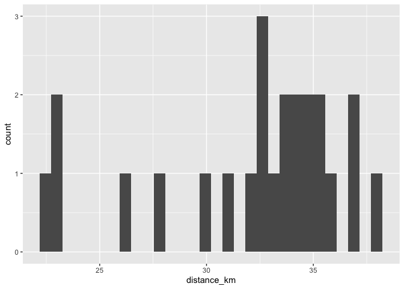

# Vancouver

## Surrey Central Station

### Draw buffer and select points


```r
destination <- "Vancouver Art Gallery, Vancouver, Canada"        #### EDIT ME
```

### Set origin point


```r
origin <- "Surrey Central Station, Surrey, Canada"    #### EDIT ME
```

#### Setup departure location and arrival time


```r
arrival_time <- as.POSIXct("2024-06-11 08:30:00", tz = "America/Vancouver")       #### EDIT ME
```

#### List of variables for geocoding


```r
var_list <- c("var1", "var2", "var3", "var4", "var5", "var6", "var7", "var8", "var9", "var10", "var11", "var12", "var13", "var14", "var15", "var16", "var17", "var18", "var19", "var20", "var21", "var22", "var23", "var24")
```


```r
stations <- geocode(location = origin, output = "more", source = "google")
```

```
## ℹ <https://maps.googleapis.com/maps/api/geocode/json?address=Surrey+Central+Station,+Surrey,+Canada&key=xxx>
```

```r
stations_sf <- stations %>%
                st_as_sf(coords = c("lon", "lat"), crs = 4326)

stations_buffer = st_buffer(stations_sf, 5000)

stations_buffer <- as_sf(stations_buffer)
```

#### Interactive map view of buffers


```r
mapview(stations_buffer)
```

```{=html}
<div class="leaflet html-widget html-fill-item" id="htmlwidget-f5127bb12b468403db7f" style="width:672px;height:480px;"></div>
<script type="application/json" data-for="htmlwidget-f5127bb12b468403db7f">{"x":{"options":{"minZoom":1,"maxZoom":52,"crs":{"crsClass":"L.CRS.EPSG3857","code":null,"proj4def":null,"projectedBounds":null,"options":{}},"preferCanvas":false,"bounceAtZoomLimits":false,"maxBounds":[[[-90,-370]],[[90,370]]]},"calls":[{"method":"addProviderTiles","args":["CartoDB.Positron","CartoDB.Positron","CartoDB.Positron",{"errorTileUrl":"","noWrap":false,"detectRetina":false,"pane":"tilePane"}]},{"method":"addProviderTiles","args":["CartoDB.DarkMatter","CartoDB.DarkMatter","CartoDB.DarkMatter",{"errorTileUrl":"","noWrap":false,"detectRetina":false,"pane":"tilePane"}]},{"method":"addProviderTiles","args":["OpenStreetMap","OpenStreetMap","OpenStreetMap",{"errorTileUrl":"","noWrap":false,"detectRetina":false,"pane":"tilePane"}]},{"method":"addProviderTiles","args":["Esri.WorldImagery","Esri.WorldImagery","Esri.WorldImagery",{"errorTileUrl":"","noWrap":false,"detectRetina":false,"pane":"tilePane"}]},{"method":"addProviderTiles","args":["OpenTopoMap","OpenTopoMap","OpenTopoMap",{"errorTileUrl":"","noWrap":false,"detectRetina":false,"pane":"tilePane"}]},{"method":"createMapPane","args":["polygon",420]},{"method":"addPolygons","args":[[[[{"lng":[-122.8479967582102,-122.8482168609353,-122.8487067562719,-122.849587168469,-122.8500273712662,-122.8503539804155,-122.8507941832776,-122.8511207990608,-122.8520012027131,-122.8524414012373,-122.8527680281855,-122.8532082267739,-122.8535348603555,-122.8544152554583,-122.8552956417544,-122.8559489401433,-122.8568293266921,-122.8581498899995,-122.8584765570698,-122.858916742699,-122.8592434164018,-122.8601237855818,-122.8610041459516,-122.8617744540476,-122.8618561264106,-122.8619661700151,-122.8625378851897,-122.8634182369929,-122.8651789141622,-122.8660592395276,-122.8667126808937,-122.8675930064977,-122.8684733232872,-122.8693536312616,-122.8702339304207,-122.871114220764,-122.871994502291,-122.8728747750015,-122.8735282971873,-122.8770493360383,-122.8840909903834,-122.8834373596804,-122.8843175177373,-122.8851976669719,-122.8860778073837,-122.8869579389722,-122.8878380617372,-122.8887181756781,-122.8895982807946,-122.8892714403654,-122.8897114873559,-122.8893846490344,-122.8898246915603,-122.8915848396021,-122.8933449523424,-122.8926912481524,-122.893571282253,-122.8944513075278,-122.8953313239763,-122.896211331598,-122.895557608753,-122.8973175794598,-122.8981975515726,-122.8975438191075,-122.8984237733667,-122.8993037187986,-122.9001836554027,-122.8995299133223,-122.9012897419984,-122.9009628684818,-122.9014028178775,-122.90107594647,-122.901515891403,-122.902395774648,-122.9032756490647,-122.9026218967883,-122.9035017533552,-122.9043816010936,-122.9037278482335,-122.9046076781233,-122.9054874991844,-122.9048337457421,-122.9057135489558,-122.9065933433407,-122.9059395893176,-122.9068193658561,-122.9076991335657,-122.9070453789634,-122.9079251288277,-122.9088048698629,-122.908151114683,-122.909030837874,-122.9085405261814,-122.9087604539094,-122.9085970182967,-122.9101364929984,-122.9094827456808,-122.9103624243571,-122.910035552736,-122.9104753865101,-122.9101485169986,-122.9105883463124,-122.9114679983185,-122.9108142588651,-122.9116938930307,-122.911367025342,-122.9118068368612,-122.9114799712821,-122.9127993858389,-122.9121456542516,-122.9130252439104,-122.9123715207617,-122.9132510925825,-122.9129242330464,-122.913364013394,-122.9130371559676,-122.913476931856,-122.9143564770118,-122.9137027617313,-122.9145822890511,-122.9139285822092,-122.9148080916938,-122.9141543932901,-122.9150338849402,-122.9144210500865,-122.9144760174938,-122.9144351623469,-122.9152596687912,-122.9147694060102,-122.9149892713965,-122.9148258520871,-122.9154854432473,-122.9149951867947,-122.9152150477229,-122.9150516305229,-122.9157112083091,-122.9153843738027,-122.9158240873173,-122.9154972549203,-122.9159369639771,-122.9156101336895,-122.9160498382887,-122.9157230101105,-122.9161627102521,-122.9158358841832,-122.9162755798673,-122.9159487559078,-122.9163884471346,-122.9160616252843,-122.9165013120538,-122.9161744923127,-122.9166141746251,-122.9161239498124,-122.9163437884531,-122.9161803817995,-122.9168398927244,-122.9162679721121,-122.9163778891323,-122.9162961871369,-122.9170656014329,-122.9164119874025,-122.9172913007513,-122.9166376951572,-122.9175169906803,-122.9168633935222,-122.9177426712203,-122.9170890824982,-122.9167622946758,-122.9172019234655,-122.9168751377519,-122.9173147620857,-122.9167428936379,-122.9168527983923,-122.9167711038488,-122.9175404322853,-122.9168868778695,-122.9177660930976,-122.9167857806637,-122.9172253782199,-122.9168986138756,-122.9173382069767,-122.916705109103,-122.9167325833261,-122.9167121610777,-122.9175638574506,-122.9169103457709,-122.9177894985388,-122.9171359952926,-122.9164927200595,-122.9165064564725,-122.9164962458885,-122.917361635429,-122.916381425892,-122.916820978812,-122.9164942487652,-122.916933797231,-122.9162803457108,-122.917159427031,-122.9165059839424,-122.9158525582822,-122.9167316127902,-122.9160781955607,-122.9155881440752,-122.9158079023884,-122.9156445535093,-122.9163038234557,-122.9156504320834,-122.9151603999902,-122.9153801516009,-122.9152168091858,-122.9158760590254,-122.9152226935083,-122.9146510129748,-122.9147608853575,-122.9146792176583,-122.9154483194967,-122.9147949798328,-122.9141416575928,-122.9150206048672,-122.9143672910545,-122.9137139946646,-122.9133873530031,-122.9138268120905,-122.9135001725355,-122.913939627171,-122.9126331035088,-122.9135119881799,-122.9128587434843,-122.9122055162089,-122.911552306353,-122.9124311552273,-122.9117779537949,-122.910471603185,-122.9101450264187,-122.9105844318103,-122.9102578571494,-122.9106972580904,-122.9100441173333,-122.9093909939927,-122.9087378880681,-122.9082480700537,-122.908467761265,-122.9083044902081,-122.9089635588538,-122.9083104787638,-122.9056983325435,-122.9052085861443,-122.9054282616603,-122.9052650144748,-122.9059240360359,-122.905271051429,-122.9046180842335,-122.9039651344491,-122.9033122020754,-122.9026592871117,-122.9020063895577,-122.901353509413,-122.900700646677,-122.9000478013493,-122.8993949734295,-122.8987421629171,-122.8980893698116,-122.8974365941127,-122.8967838358197,-122.8961310949324,-122.8954783714502,-122.8946547287005,-122.8946139345881,-122.894559024832,-122.8926417798901,-122.8913365075624,-122.8906838975027,-122.8898053901818,-122.8891528065264,-122.888500240273,-122.887847691421,-122.887408447971,-122.8870821823213,-122.8866429389267,-122.8856641748315,-122.8850116871852,-122.8843528348605,-122.8841897173561,-122.88397009938,-122.88348075508,-122.8828283112381,-122.8821758847953,-122.8812974321703,-122.8799926494931,-122.8791142061057,-122.8784618498718,-122.8778095110357,-122.8769310768901,-122.8756264694265,-122.8747480445268,-122.8740957758998,-122.8734369582267,-122.8732738954776,-122.8730542890535,-122.8725651090194,-122.8719128841956,-122.871034468788,-122.8703822703716,-122.8695038552084,-122.8688516832,-122.8681928728343,-122.8680298342402,-122.8678102302526,-122.8673211226836,-122.8668819164451,-122.8665558524219,-122.8661166462458,-122.8651384870296,-122.864260081627,-122.8636080062414,-122.8627296010922,-122.8620775521172,-122.8611991472234,-122.8605471246595,-122.8596687200232,-122.8592295144202,-122.8589035164247,-122.8584643108866,-122.8581383194944,-122.8576991140215,-122.8573731292326,-122.8569339238252,-122.8566079456397,-122.855729532767,-122.8550775984617,-122.8541991858536,-122.8535472779632,-122.8526688656218,-122.8520100506205,-122.851847080313,-122.8516274747823,-122.8511385720742,-122.850260151248,-122.8496083052136,-122.8487298846592,-122.8478514553527,-122.847199644762,-122.8463212157305,-122.845456503606,-122.8454463194834,-122.845432593828,-122.8447910028047,-122.8439125653007,-122.8430341190477,-122.8423823793542,-122.8415039333825,-122.8406254786632,-122.839973774423,-122.8390953199882,-122.8382168568074,-122.837338384881,-122.8366867251305,-122.834929773111,-122.8336120361442,-122.8332862286022,-122.8328469808341,-122.8325211798995,-122.8316426823249,-122.8307641760085,-122.8298856609509,-122.8290345911533,-122.8290142298602,-122.828986775868,-122.8283555844803,-122.8265985287427,-122.8248414380492,-122.8230843124031,-122.8213271518078,-122.8208878561985,-122.8205621248164,-122.8201228292845,-122.8197971045127,-122.8189185114204,-122.8180399095931,-122.8171612990313,-122.8162826797353,-122.8154040517056,-122.8145254149425,-122.8148511125696,-122.8144117886506,-122.8147374883642,-122.8142981599993,-122.8125408247068,-122.8107834544847,-122.8090260493363,-122.807268609265,-122.8063898761342,-122.8070412025983,-122.8061624516806,-122.805283692033,-122.8044049236561,-122.8035261465501,-122.8038517981902,-122.803412404099,-122.8037380578241,-122.8032986592857,-122.8015410433103,-122.8006622222304,-122.8009878644487,-122.8005484483702,-122.8008740926733,-122.8004346721472,-122.799555824549,-122.7986769682234,-122.7977981031706,-122.7984493731054,-122.7975704902607,-122.796691598689,-122.7970172311171,-122.7965777797922,-122.7969034143047,-122.7964639585314,-122.7955850404398,-122.7947061136218,-122.795275964654,-122.7951660971964,-122.7952475054328,-122.7935994750809,-122.7939251022444,-122.7934856200354,-122.7938112492831,-122.7933717626251,-122.7924927827647,-122.7916137941784,-122.7922650430528,-122.7913860366697,-122.7905070215609,-122.7911582696991,-122.7902792367925,-122.7894001951602,-122.7900514425608,-122.7891723831296,-122.788293314973,-122.7889445616345,-122.7880654756778,-122.7883911009997,-122.7879515524805,-122.7882771798861,-122.7869585144335,-122.7875283609548,-122.7874184702881,-122.7874998778804,-122.7867306384038,-122.7858514993933,-122.7865027529062,-122.7856235960927,-122.7861120408458,-122.7858922485769,-122.7860550651038,-122.7853956833228,-122.7845164999799,-122.7851677610829,-122.7842885599351,-122.7847770103806,-122.7845572070278,-122.7847200254523,-122.7840606104191,-122.7831813827399,-122.7838326514312,-122.7829534059452,-122.7836046829707,-122.7827254196773,-122.7832138820643,-122.7829940631746,-122.7831568855798,-122.7824974239354,-122.7828230686054,-122.7823834225115,-122.7827090692652,-122.7822694187189,-122.7813901110816,-122.7820414040274,-122.7811620785799,-122.7818133798601,-122.7809340366017,-122.7815802577925,-122.7815733878185,-122.7815784762419,-122.7807059851463,-122.7812758873994,-122.7811659656584,-122.7812473812127,-122.7804779242132,-122.7809664172933,-122.7807465695054,-122.7809094021419,-122.7802498538017,-122.7807383531331,-122.7805185008918,-122.780681335612,-122.7800217739113,-122.780347443211,-122.7799077304113,-122.7802334017948,-122.7797936845414,-122.7801193580087,-122.7796796363014,-122.7800053118525,-122.7795655856913,-122.7800541037772,-122.7798342381743,-122.7799970791463,-122.7793374773604,-122.7798260016981,-122.779606131641,-122.7797689746969,-122.7791093595481,-122.7796793128556,-122.779569375526,-122.7796507983741,-122.7788812322539,-122.7795326168876,-122.778653095477,-122.7793044884471,-122.778424949217,-122.7790763505236,-122.7781967934731,-122.7788482031165,-122.7791739144734,-122.7787341258564,-122.7790598392976,-122.7786200462251,-122.7791086211475,-122.7788887220881,-122.7790515820059,-122.7783918798489,-122.779043323595,-122.7781637039872,-122.7788151560713,-122.7791408886495,-122.7787010687522,-122.7790268034151,-122.7785869790617,-122.7791570212295,-122.7790470638056,-122.7791284993484,-122.7783587925655,-122.7790102787572,-122.7781305965824,-122.7787820911132,-122.7793521631276,-122.7792422001105,-122.7793236399172,-122.7785538939816,-122.7792054142848,-122.7795311809739,-122.779091316331,-122.7794170851053,-122.7789772160052,-122.7796287620828,-122.7787490082371,-122.7799706870743,-122.779860715098,-122.7799421623911,-122.7791723537396,-122.7798239339353,-122.7801497305719,-122.7797098300897,-122.7800356288119,-122.7795957238717,-122.7805731393732,-122.7801332254275,-122.7804590370399,-122.7800191186358,-122.780670750392,-122.7809965728096,-122.7805566453996,-122.7808824699032,-122.7804425380345,-122.7817051403559,-122.7816501476173,-122.7816908777789,-122.78086598207,-122.7815176653944,-122.7821693661599,-122.7812894507447,-122.7825928864101,-122.7832038958957,-122.7831488992221,-122.7831896336973,-122.7823646789618,-122.7830164313059,-122.7836682010936,-122.7841570398822,-122.7839370444016,-122.7840999922765,-122.7834400008497,-122.7847436094573,-122.7853954399296,-122.7845154164204,-122.7851672552433,-122.7858191115132,-122.7864709852305,-122.7871228763957,-122.7862428077557,-122.7868947072737,-122.7895024798404,-122.7900729673077,-122.7899629514331,-122.7900444505913,-122.7892743346449,-122.7899263297689,-122.7905783423449,-122.7912303723733,-122.7918824198546,-122.7925344847893,-122.7931865671778,-122.7938386670205,-122.794490784318,-122.7951429190707,-122.7957950712791,-122.7964472409435,-122.7970994280645,-122.7977516326426,-122.7984038546781,-122.7990560941716,-122.7997083511236,-122.8003606255344,-122.8010129174045,-122.801783176568,-122.8018647152737,-122.8019747518912,-122.8025455314645,-122.8051549797535,-122.8058152298176,-122.8059783313162,-122.8061984141427,-122.8066877268911,-122.8073401591684,-122.8079926089082,-122.8084327854136,-122.8087590191041,-122.8090852571605,-122.8095254360166,-122.8108304409887,-122.8114829696708,-122.8123633480634,-122.8130159032966,-122.8136684759948,-122.8144388157892,-122.8145203895982,-122.8146304377337,-122.8152014630315,-122.8158540797459,-122.8165143784533,-122.8166775370643,-122.8168976361037,-122.8173871201896,-122.8180397809206,-122.8187000866685,-122.8188632562835,-122.8190833576695,-122.8195728747676,-122.8202255795153,-122.8211059954646,-122.8217587267617,-122.8221989359833,-122.8225253104526,-122.8229655197484,-122.8239446761686,-122.8248251017917,-122.8254779036538,-122.8261382239147,-122.826301428812,-122.8265215350347,-122.8270111579796,-122.8276640038582,-122.8285444391432,-122.829197311569,-122.830077747142,-122.8307306461142,-122.8316110819731,-122.8322640074911,-122.8331444436339,-122.833797395697,-122.8346778321216,-122.8353308107292,-122.8362112474337,-122.836864252585,-122.8377446895672,-122.8383977212617,-122.8392781585195,-122.8397183738497,-122.8400449030519,-122.8404851184504,-122.840811654288,-122.8416920830215,-122.8423451768698,-122.843665817076,-122.8439923773534,-122.8444325886226,-122.8447591555347,-122.8456395760066,-122.8462927320015,-122.8471731527387,-122.8478334625151,-122.8479967582102],"lat":[49.23465795121014,49.23458767193861,49.23496291381475,49.23468178540662,49.23454121854782,49.2347913727649,49.23465080183709,49.23490095364588,49.23461980188248,49.23447922334618,49.23472936814797,49.23458878554266,49.23483892793583,49.23455775281746,49.23427657062052,49.23477683668352,49.23449563821044,49.23407382722923,49.23432394859888,49.23418333909996,49.23443345806031,49.23415222915493,49.23387099317193,49.23362490588111,49.2336874322983,49.23365227638498,49.23408996010677,49.23380870077032,49.2332461608665,49.23296488029955,49.23346505305763,49.23318375621485,49.23290245229582,49.23262114130076,49.23233982322989,49.23205849808344,49.23177716586164,49.23149582656472,49.23199593448133,49.23087046974482,49.2286192007295,49.22811920322371,49.22783777197064,49.22755633364559,49.22727488824879,49.22699343578048,49.22671197624086,49.22643050963018,49.22614903594866,49.22589906923426,49.2257583320425,49.22550836751672,49.22536763085783,49.22480466654682,49.22424167395643,49.22374178597823,49.22346028828106,49.2231787835148,49.22289727167971,49.22261575277601,49.22211590115835,49.22155286055082,49.22127132964516,49.22077150518568,49.22048997641484,49.22020844057671,49.21992689767149,49.21942710037003,49.21886401176438,49.21861412214754,49.21847334788025,49.21822346045162,49.21808268671839,49.21780113395249,49.21751957412082,49.21701982193243,49.21673826423775,49.21645669947787,49.21595696524451,49.21567540262213,49.21539383293509,49.21489411665659,49.21461254910756,49.21433097449442,49.21383127617059,49.21354970369598,49.2132681241578,49.21276844378848,49.21248686638933,49.21220528192717,49.2117056195122,49.21142403718957,49.21104929698453,49.21097890202577,49.21085398914295,49.21036121609864,49.20986158038968,49.20957999528488,49.20933018186259,49.20918938896259,49.20893957772826,49.20879878536338,49.20851719533772,49.20801758633436,49.20773599844963,49.20748619838006,49.20734540409038,49.20709560620874,49.20667321965035,49.20617363735212,49.20589204668973,49.20539247314309,49.20511088462252,49.20486110228124,49.20472030767399,49.20447052752059,49.20432973344889,49.20404814001111,49.20354859316905,49.20326700187378,49.20276746378317,49.20248587463061,49.20198634529145,49.20170475828176,49.20123645774397,49.20121885886063,49.20118763884668,49.20092365282747,49.20054901899242,49.20047862339818,49.20035374597203,49.20014255826788,49.19976793099642,49.199697535938,49.19957266069974,49.1993614746032,49.19911172749269,49.19897093685652,49.19872119193386,49.19858040183362,49.19833065909883,49.19818986953455,49.19794012898761,49.19779933995934,49.19754960160024,49.19740881310798,49.19715907693674,49.19701828898051,49.19676855499713,49.19662776757696,49.19637803578145,49.19623724889735,49.1958626544438,49.1957922620653,49.19566739776637,49.19545621971004,49.19501920048055,49.19498400475823,49.19492157355545,49.19467520141877,49.19417575959422,49.19389419402373,49.19339476095065,49.19311319752511,49.19261377320348,49.19233221192308,49.19183279635294,49.19158308839992,49.19144231201395,49.19119260624882,49.19105183039918,49.19061484906562,49.19057965583382,49.19051723004479,49.19027087534241,49.18977147682769,49.1894899311828,49.18874084637049,49.18860007780219,49.18835038494091,49.18820961690905,49.18772584112802,49.18771704334595,49.1877014376776,49.18742870329596,49.18692933058934,49.18664780058061,49.18614843662574,49.1856568747968,49.18565247611966,49.1856446735497,49.18536755356005,49.18461851991902,49.18447776484069,49.1842280890369,49.18408733449513,49.18358798715217,49.18330648197776,49.18280714338682,49.18230780435078,49.18202631051995,49.18152698023606,49.18115248223137,49.18108211169565,49.18095727954666,49.18074616702005,49.18024684504386,49.17987235327026,49.17980198557026,49.17967715549835,49.179466051479,49.17896673781114,49.17852983798787,49.17849465575445,49.17843224160996,49.17818596389777,49.17768665853888,49.17718735273689,49.17690590427733,49.17640660722805,49.17590730973617,49.17565766082436,49.17551694544544,49.17526729872187,49.17512658387959,49.17412800507558,49.17384658849448,49.17334730762473,49.17284802631374,49.17234874456189,49.17206734851594,49.17156807551747,49.17056952819982,49.17031989109552,49.17017920651868,49.16992957160282,49.16978888756258,49.16928962199791,49.16879035599411,49.16829108955154,49.16791663943189,49.16784630536939,49.16772148918259,49.16751048607628,49.1670112279495,49.16501419106707,49.1646397458735,49.16456942383709,49.16444460929248,49.16423364226453,49.16373439070678,49.1632351387131,49.16273588628385,49.16223663341938,49.16173738012007,49.16123812638629,49.1607388722184,49.16023961761676,49.15974036258174,49.1592411071137,49.15874185121302,49.15824259488004,49.15774333811515,49.15724408091871,49.15674482329107,49.15624556523262,49.15650913555999,49.15647793137872,49.15649550247785,49.15502890237725,49.15403036401914,49.15353109419728,49.15381217349613,49.15331289406046,49.15281361419736,49.15231433390716,49.15245485713699,49.15220521453559,49.15234573370829,49.15159679837604,49.15109750762227,49.15130826585846,49.15118344138148,49.15125369267243,49.15087921736006,49.15037991657191,49.14988061535934,49.15016159086529,49.1491629688017,49.14944391889774,49.14894459804825,49.14844527677624,49.14872620146345,49.147727539289,49.14800843856847,49.14750909766754,49.14771976061855,49.14759492360605,49.14766514313543,49.14729063021883,49.1467912792959,49.14707213694398,49.14657277642056,49.14685361784412,49.14635424772113,49.14656486728093,49.14644002296348,49.14651022802916,49.14613569319874,49.14627609856681,49.14602640625428,49.14616680756636,49.14541772311788,49.14569850668953,49.1451991073567,49.14547987470496,49.14498046577685,49.14526121690191,49.14476179837943,49.14504253328149,49.14518289809084,49.14493318179013,49.14507354254373,49.14482382384484,49.14496418054273,49.14471445944577,49.14485481208797,49.14460508859306,49.14488578400493,49.14438632752728,49.14466700671663,49.14416754064863,49.14444820361565,49.14465869621745,49.14453382562105,49.14460398836743,49.14422937470312,49.1445100144026,49.14401051998015,49.14429114345757,49.14457175988925,49.14407224670344,49.14435284691312,49.14462905586271,49.14462125068142,49.14462563489317,49.14413390812922,49.14441448507089,49.14469505496609,49.1441955042586,49.14447605793197,49.14475660455853,49.14425703509271,49.1445375654975,49.14481808885512,49.14509860516537,49.14459900776859,49.14516000089769,49.14558072724372,49.14533091233845,49.14547114863625,49.14522133133615,49.14550179405868,49.14578224973269,49.14606269835793,49.14633437624163,49.14631876151931,49.1463275252029,49.14584346833711,49.14640431199594,49.14696512745654,49.14752591471711,49.14808667377588,49.14822685913383,49.14797698420087,49.14811716550307,49.14786728817666,49.1481476409068,49.14842798658571,49.14870832521314,49.14898865678887,49.14926898131269,49.14954929878436,49.14979920362548,49.1499393620095,49.15018926904335,49.15032942795706,49.15089004597994,49.15145063579028,49.15201119738629,49.15257173076618,49.15285198687452,49.15335188776673,49.1536321459909,49.15391239716008,49.15419264127399,49.15447287833244,49.15472284697018,49.15486296514613,49.15511293597699,49.15525305468157,49.1558135118596,49.15609372986403,49.15634371664355,49.15648382529208,49.15673381426483,49.1568739234417,49.15715413650267,49.15743434250642,49.15771454145271,49.15821455119604,49.15849475225472,49.15877494625542,49.15902496014839,49.15916505679444,49.15941507288078,49.15955517005475,49.1598353591088,49.16011554110406,49.1605530890762,49.16058811233226,49.16065061930392,49.16117595705794,49.16142599347965,49.16156608164835,49.16181612026351,49.16195620895983,49.16223638105755,49.16251654609519,49.16301664595361,49.16329681310098,49.16357697318771,49.16407709099032,49.16435725318627,49.16463740832106,49.16513754406802,49.16541770131151,49.16569785149328,49.16619800518478,49.16647815747474,49.16672823875719,49.16686831454641,49.16711839802247,49.16753862167404,49.16797627955511,49.16801129847843,49.16807382115142,49.1683189515277,49.16859909390746,49.16909929226322,49.16937943674997,49.16975459213494,49.1698246288724,49.16994968119106,49.17015979047399,49.17043993000355,49.17094015507931,49.17122029671517,49.17159547214023,49.17166550816487,49.17179056716358,49.17200067430772,49.17228081098482,49.17278106278103,49.17306120156372,49.17356146213488,49.17384160302298,49.1742168050697,49.17428684090727,49.17441190877987,49.17462201536242,49.1748721544725,49.17501222561216,49.17526236691597,49.17540243858186,49.17568257661384,49.17618287268111,49.17646301281761,49.17696331765997,49.17724345990079,49.17773986481966,49.17774205347418,49.17774596217335,49.17802391786322,49.1784616999784,49.17849671852773,49.17855925894842,49.17880438670471,49.17917963511763,49.1792496723452,49.17937475567317,49.17958486642505,49.17996012141932,49.18003015917279,49.18015524469454,49.18036535702407,49.18061553143261,49.18075560640302,49.18100578300534,49.18114585850157,49.18139603729767,49.18153611331969,49.18178629430958,49.18192637085737,49.18230164559564,49.18237168492659,49.18249677702964,49.18270689409128,49.18308217541089,49.18315221526755,49.18327730956437,49.18348742820311,49.1839252640658,49.18396028445552,49.1840228325544,49.18426797319265,49.18476836578598,49.18504852905976,49.18554893042818,49.18582909580419,49.18632950594772,49.18660967342581,49.1871100923444,49.18736030165445,49.18750038962163,49.18775060112542,49.18789068961808,49.18826601012703,49.1883360554304,49.18846116279025,49.18867129776853,49.18917173383894,49.18945191679557,49.18995236164094,49.19020258391407,49.1903426796206,49.19059290408745,49.19073300031934,49.19117089690982,49.19120592169493,49.19126847846911,49.19151364987395,49.19201411187009,49.19229431030459,49.19279478107554,49.19323269267231,49.19326771912954,49.19333027804743,49.19357546115684,49.19407594030283,49.19432617972581,49.1944662888092,49.19471653042581,49.19485664003444,49.19535712755486,49.19563735064152,49.19657578086581,49.19661081040469,49.19667337251289,49.19691857719336,49.19741908186194,49.19766933404579,49.19780945545576,49.19805970983318,49.19819983176831,49.19895060118007,49.19909072822833,49.19934098679203,49.19948111436543,49.19998163577941,49.20023189633557,49.20037202902226,49.20062229177193,49.20076242498376,49.2017322010778,49.20174971871612,49.2017810018266,49.20204376362233,49.20254430177916,49.20304483953269,49.20332513028018,49.20432622293098,49.20479548455475,49.20481300417644,49.2048442883079,49.20510707985346,49.20560763434631,49.20610818843452,49.20648360373492,49.20655368673982,49.20667882569628,49.20688907377774,49.20789019828506,49.20839075993011,49.20867111204825,49.20917168246622,49.20967225247784,49.21017282208272,49.2106733912805,49.21095377303782,49.21145435100812,49.21345665880975,49.21389466276973,49.21392971673357,49.21399228884573,49.21423766449945,49.21473824919997,49.21523883349093,49.21573941737198,49.21624000084273,49.21674058390283,49.2172411665519,49.21774174878959,49.21824233061553,49.21874291202935,49.21924349303067,49.21974407361916,49.22024465379442,49.22074523355611,49.22124581290385,49.22174639183726,49.222246970356,49.2227475484597,49.22324812614799,49.22300260585843,49.22306517703559,49.2230301021224,49.22346809917583,49.22547036735671,49.22525988196769,49.22538502178478,49.22531485852906,49.22569027610099,49.22619083249739,49.22669138847502,49.2265510480036,49.2268013235384,49.22705159896832,49.22691125213269,49.22791234361496,49.22841288872553,49.22813216217882,49.22863269768003,49.22913323275977,49.22888757514179,49.22895014099206,49.22891504646044,49.2293530062226,49.22985353126902,49.22964294883312,49.22976807830565,49.22969788270075,49.23007326923659,49.23057378424722,49.23036318271518,49.2304883096785,49.2304181077082,49.23079348671595,49.2312939916883,49.23101316329773,49.23151365865461,49.23137323720825,49.23162348242946,49.2314830569149,49.23223378504651,49.23195291491911,49.23245339061577,49.2322427264791,49.23236784361312,49.23229762077452,49.23267297029285,49.2331734359432,49.2328925240766,49.23339298010661,49.23311205196592,49.23361249837463,49.23333155395965,49.23383199074615,49.23355103005667,49.23405145722005,49.23377048025588,49.23427089779518,49.23398990455612,49.23449031247043,49.23420930295627,49.23470970124468,49.23442867545522,49.23428815990525,49.23453835199138,49.23439783237258,49.23464802205182,49.23436697290641,49.23486734274496,49.23444574195842,49.23469591981853,49.23455538038407,49.23480555583674,49.23452446706001,49.23502480844358,49.234743703391,49.23453286995555,49.23465795121014]}]]],null,"stations_buffer",{"crs":{"crsClass":"L.CRS.EPSG3857","code":null,"proj4def":null,"projectedBounds":null,"options":{}},"pane":"polygon","stroke":true,"color":"#333333","weight":0.5,"opacity":0.9,"fill":true,"fillColor":"#6666FF","fillOpacity":0.6,"smoothFactor":1,"noClip":false},"<div class='scrollableContainer'><table class=mapview-popup id='popup'><tr class='coord'><td><\/td><th><b>Feature ID&emsp;<\/b><\/th><td>1&emsp;<\/td><\/tr><tr><td>1<\/td><th>type&emsp;<\/th><td>establishment&emsp;<\/td><\/tr><tr><td>2<\/td><th>loctype&emsp;<\/th><td>geometric_center&emsp;<\/td><\/tr><tr><td>3<\/td><th>address&emsp;<\/th><td>surrey central station, surrey, bc v3t 4c3, canada&emsp;<\/td><\/tr><tr><td>4<\/td><th>north&emsp;<\/th><td>49.19066&emsp;<\/td><\/tr><tr><td>5<\/td><th>south&emsp;<\/th><td>49.18796&emsp;<\/td><\/tr><tr><td>6<\/td><th>east&emsp;<\/th><td>-122.8467&emsp;<\/td><\/tr><tr><td>7<\/td><th>west&emsp;<\/th><td>-122.8494&emsp;<\/td><\/tr><tr><td>8<\/td><th>geometry&emsp;<\/th><td>sfc_POLYGON&emsp;<\/td><\/tr><\/table><\/div>",{"maxWidth":800,"minWidth":50,"autoPan":true,"keepInView":false,"closeButton":true,"closeOnClick":true,"className":""},"1",{"interactive":false,"permanent":false,"direction":"auto","opacity":1,"offset":[0,0],"textsize":"10px","textOnly":false,"className":"","sticky":true},{"stroke":true,"weight":1,"opacity":0.9,"fillOpacity":0.84,"bringToFront":false,"sendToBack":false}]},{"method":"addScaleBar","args":[{"maxWidth":100,"metric":true,"imperial":true,"updateWhenIdle":true,"position":"bottomleft"}]},{"method":"addHomeButton","args":[-122.9177894985388,49.14401051998015,-122.7781305965824,49.23502480844358,true,"stations_buffer","Zoom to stations_buffer","<strong> stations_buffer <\/strong>","bottomright"]},{"method":"addLayersControl","args":[["CartoDB.Positron","CartoDB.DarkMatter","OpenStreetMap","Esri.WorldImagery","OpenTopoMap"],"stations_buffer",{"collapsed":true,"autoZIndex":true,"position":"topleft"}]},{"method":"addLegend","args":[{"colors":["#6666FF"],"labels":["stations_buffer"],"na_color":null,"na_label":"NA","opacity":1,"position":"topright","type":"factor","title":"","extra":null,"layerId":null,"className":"info legend","group":"stations_buffer"}]}],"limits":{"lat":[49.14401051998015,49.23502480844358],"lng":[-122.9177894985388,-122.7781305965824]},"fitBounds":[49.14401051998015,-122.9177894985388,49.23502480844358,-122.7781305965824,[]]},"evals":[],"jsHooks":{"render":[{"code":"function(el, x, data) {\n  return (\n      function(el, x, data) {\n      // get the leaflet map\n      var map = this; //HTMLWidgets.find('#' + el.id);\n      // we need a new div element because we have to handle\n      // the mouseover output separately\n      // debugger;\n      function addElement () {\n      // generate new div Element\n      var newDiv = $(document.createElement('div'));\n      // append at end of leaflet htmlwidget container\n      $(el).append(newDiv);\n      //provide ID and style\n      newDiv.addClass('lnlt');\n      newDiv.css({\n      'position': 'relative',\n      'bottomleft':  '0px',\n      'background-color': 'rgba(255, 255, 255, 0.7)',\n      'box-shadow': '0 0 2px #bbb',\n      'background-clip': 'padding-box',\n      'margin': '0',\n      'padding-left': '5px',\n      'color': '#333',\n      'font': '9px/1.5 \"Helvetica Neue\", Arial, Helvetica, sans-serif',\n      'z-index': '700',\n      });\n      return newDiv;\n      }\n\n\n      // check for already existing lnlt class to not duplicate\n      var lnlt = $(el).find('.lnlt');\n\n      if(!lnlt.length) {\n      lnlt = addElement();\n\n      // grab the special div we generated in the beginning\n      // and put the mousmove output there\n\n      map.on('mousemove', function (e) {\n      if (e.originalEvent.ctrlKey) {\n      if (document.querySelector('.lnlt') === null) lnlt = addElement();\n      lnlt.text(\n                           ' lon: ' + (e.latlng.lng).toFixed(5) +\n                           ' | lat: ' + (e.latlng.lat).toFixed(5) +\n                           ' | zoom: ' + map.getZoom() +\n                           ' | x: ' + L.CRS.EPSG3857.project(e.latlng).x.toFixed(0) +\n                           ' | y: ' + L.CRS.EPSG3857.project(e.latlng).y.toFixed(0) +\n                           ' | epsg: 3857 ' +\n                           ' | proj4: +proj=merc +a=6378137 +b=6378137 +lat_ts=0.0 +lon_0=0.0 +x_0=0.0 +y_0=0 +k=1.0 +units=m +nadgrids=@null +no_defs ');\n      } else {\n      if (document.querySelector('.lnlt') === null) lnlt = addElement();\n      lnlt.text(\n                      ' lon: ' + (e.latlng.lng).toFixed(5) +\n                      ' | lat: ' + (e.latlng.lat).toFixed(5) +\n                      ' | zoom: ' + map.getZoom() + ' ');\n      }\n      });\n\n      // remove the lnlt div when mouse leaves map\n      map.on('mouseout', function (e) {\n      var strip = document.querySelector('.lnlt');\n      if( strip !==null) strip.remove();\n      });\n\n      };\n\n      //$(el).keypress(67, function(e) {\n      map.on('preclick', function(e) {\n      if (e.originalEvent.ctrlKey) {\n      if (document.querySelector('.lnlt') === null) lnlt = addElement();\n      lnlt.text(\n                      ' lon: ' + (e.latlng.lng).toFixed(5) +\n                      ' | lat: ' + (e.latlng.lat).toFixed(5) +\n                      ' | zoom: ' + map.getZoom() + ' ');\n      var txt = document.querySelector('.lnlt').textContent;\n      console.log(txt);\n      //txt.innerText.focus();\n      //txt.select();\n      setClipboardText('\"' + txt + '\"');\n      }\n      });\n\n      }\n      ).call(this.getMap(), el, x, data);\n}","data":null},{"code":"function(el, x, data) {\n  return (function(el,x,data){\n           var map = this;\n\n           map.on('keypress', function(e) {\n               console.log(e.originalEvent.code);\n               var key = e.originalEvent.code;\n               if (key === 'KeyE') {\n                   var bb = this.getBounds();\n                   var txt = JSON.stringify(bb);\n                   console.log(txt);\n\n                   setClipboardText('\\'' + txt + '\\'');\n               }\n           })\n        }).call(this.getMap(), el, x, data);\n}","data":null}]}}</script>
```

#### Generate points within buffer


```r
set.seed(106)
points_sample_sf <- st_sample(stations_buffer, size = c(25,25), type = "random")
```

```
## Warning in st_poly_sample(x, size = size, ..., type = type, by_polygon =
## by_polygon, : coordinate ranges not computed along great circles; install
## package lwgeom to get rid of this warning
```

```r
points_sample_sf <- st_as_sf(points_sample_sf)
points_sample <- sf_to_df(points_sample_sf)
```

#### Check to see if they worked


```r
check_buffer <- stations_buffer %>% slice(1:2)

plot(st_geometry(check_buffer))
plot(points_sample_sf, pch = 20, add= TRUE)
```

<!-- -->


```r
points_sample$destination <- destination
points_sample$origin <- origin
points_sample$lat_lon <- paste(points_sample$lat, points_sample$lon)
```

#### Checking points and general mapping


```r
lst_directions <- apply(points_sample, 1, function(x){
  res <- google_directions(
    origin = x[['lat_lon']], 
    destination = x[['destination']]    
  )
df_result <- data.frame(
    origin = x[['lat_lon']], 
    destination = x[['destination']], 
    route = res$routes$overview_polyline$points 
)
return(df_result)
})

df_directions <- do.call(rbind, lst_directions)

google_map() %>%
  add_polylines(data = df_directions, polyline = "route") 
```

```{=html}
<div class="google_map html-widget html-fill-item" id="htmlwidget-52875b189b4a8f04df4b" style="width:672px;height:480px;"></div>
<script type="application/json" data-for="htmlwidget-52875b189b4a8f04df4b">{"x":{"lat":0,"lng":0,"zoom":1,"min_zoom":null,"max_zoom":null,"mapBounds":{"west":-180,"south":-90,"east":180,"north":90},"styles":null,"search_box":false,"update_map_view":true,"zoomControl":true,"mapType":"roadmap","mapTypeControl":true,"scaleControl":false,"streetViewControl":true,"rotateControl":true,"fullscreenControl":true,"event_return_type":"list","split_view":null,"split_view_options":{"heading":34,"pitch":10},"geolocation":false,"calls":[{"functions":"add_polylines","args":[[{"id":1,"geodesic":true,"stroke_colour":"#0000FF","stroke_weight":2,"stroke_opacity":0.6,"z_index":3,"polyline":["qyjkHb`bmV{BkAaCgAeBm@Q@aAa@}EkAcDs@kDo@O@[Ee@IkAU}Es@w@GuCGsAAuAFgBCe@c@SQy@}@q@m@iGcHwAsAuB{Bu@s@y@kAqC}CgGgHaCgCcK_Lm@eAmDoDkA}@_@UiBs@qAg@q@e@KKKMk@w@Ua@g@yAq@sCe@}BKWq@uCYqAOs@Q]GMGKIIG@K@GDKJIVoApDw@`CQx@EbA@~@JhBA`BOxAU`A[v@m@pAaAvBA?@ZmBpDc@z@[l@aAhB{DpHmI~OmGhMcFtJuAjCqAvCoAjDu@zBcAvD{AzGc@dCk@vDs@nGUrCQdEEbDBbEHrCTrDVjCT~Ad@vCfAvEb@vAn@hBj@vAtAxCbAtBfA|BV\\j@lAfAzBlDlHtG|MhE|IjBzDzAdDxAbEt@dC~@rDn@|Cd@lCZxBh@zE`@nFLfCL~F?~EItFa@~Ns@hVa@~N[xIU`EUpC_@nD]dCw@`FkA`GsClN_CfL{CnOwA`Jw@|Fq@fGqA~Kg@xC{@rDy@nCg@tAk@rAeArBsAxBo@z@}@dAkAlAqBdBiGjF}KlJoWtTkL|JmAlAgAvAcAzAaAhBu@bBm@|Ac@tAm@zB_@hB_@zB]jCS|BMdCIpCAjBAdLAlL@fSJrQPdMJjJ@vJE~PGrTQzGInE?hG@~BH`DRjFLrEEjCShCWbBYtAi@fBq@nB{@nBaAhBeEbHgDrFuAzB}@lAkAlAiA|@yAv@y@ZkAXm@J{AL_ETqBJ}@JiAPeATm@RQIiDp@iG|A]H?xA?~@?vDAnKA`M?`HEbmAAjq@FrO@`ADf@?~BC~HExUEhQ?jAEn@CpECnI?rA?xCDl@ClD@tECbLAlGClJAxLExBIhAQp@yAlN_@tDkAnLKtA}@rJIb@y@hI]`EMpAwCj[s@nHQjB_@nH{CGs@DuDj@iG|@s@TYPo@h@WZOPg@z@_@bAQt@Ov@aAjLE`@_@zAgApCGZKd@Ef@AbAJfALj@~B`GPz@DZDpAKzAAp@Bp@Jp@VhAt@jBh@dAVX^X`B`@PPt@dAf@v@NTUJ_@T_@`@]`@[l@uAjCmB`Ds@vAeAjBaEhHgB~C}CrFaClE{AdCOVEF_@q@qDoG"]},{"id":2,"geodesic":true,"stroke_colour":"#0000FF","stroke_weight":2,"stroke_opacity":0.6,"z_index":3,"polyline":["ydfkHr{nlVAaIAmBwBC}EEiB?aE?SIuA?mAAk@BKFa@?}D?gA?e@ACC_@I_@Ce@Fk@\\OVUj@Sz@_AzF_AjGcAlGW\\OLc@NmCmB{DcCaCgAqDeA_@Es@UeA]a@MgBi@w@IY@a@FUHa@Nc@d@u@pAUj@q@fB_ArBeAbB_CpCg@j@CVaC`CkFtFoC|CsErFcDfEmG~IuBxCy@fAgAhAkA`AqAv@_@PkAd@iBh@cDx@qEpAqH|BqFfB{IrC}MnEw@^sBlA{B`BmBlBmAzAaAxAaAbB_ArBy@rB{@hCy@xCs@~Ci@~CwAnJi@nE]jEw@`Mw@zKgA`OuBp_@{@dOu@bKk@tH]fFc@|H[hIq@~TStEe@bJk@nJYtDe@pISbDMhCc@zHoBv]qBx^eApQs@`Iy@jHe@|C]jBq@tCy@xCu@vBcAfCmAdCmAzB_FjJsMxVaCxEyCdGiI|OgAzBm@rAo@`BkAnDc@vAmAzEq@|Cc@~Bg@~Ce@lDk@`GSjEIlD@nDFbDRnDTnCTbBf@dD|@~Dn@|BnAfDjAlClAdCh@fA`AjBh@dAxBrE`EnI|NnZfA`C`BfE`AzCdA~Dn@xCd@fC\\zBb@nDd@tFPjDNzFBfEGpFOtFe@pPqA`d@IfCWrEYhDWlCY`Cs@vE_A`Fw@xDgDjPwCvNmAjGe@rCu@rEk@dEyAxMm@jFg@~Cm@vC_AfDuAtDcArBeAhBo@`AeArA_B~AmFtE}G|FiZdWwJjIwE`EmAjAiArAeA|A_A`B}@nBk@tAWv@u@hCc@jBk@`DWjBUfCOfCK~CAtEAtOAlI@fJ@xKNnOPlMF`H?nJIjXCtHI|EO|FCbEBdGXnINtFAjCOfCUfBY|Aa@zA_AnCk@rAaAlBaBnCyDlGgDvFu@dAsA|AgA|@uAx@aA`@iA\\k@JwANwH`@aCXeAReAZQIaDn@{ElAsAZ?zB?zBCxQ?hMAvPA`o@Czi@@j^DhF@bDDf@?fAAzAAxDAhHEvTCdH?hEEn@AzAErH?zB?bGDl@?b@ApHCzKAfLE|QCfEMlBOd@o@hGYvCi@`FmAvLOxAANm@dHiAtKKxA_@~D{BrUeA`L]pDUdEOlCUAyBEq@BkLdBa@Dc@LYLk@`@a@b@UZ_@h@k@tAYrAKv@y@vJIr@WpAkAvCGTQhAEfAF`AN~@|BxFPz@Jr@Bv@GjAEr@?p@Fr@VhAl@dBXp@Zh@PX^ZZJdAVPJl@v@x@nANTi@V}@z@a@r@_AhBgB|CcIvNqGbL_ClEwA~Bi@|@qEaI"]},{"id":3,"geodesic":true,"stroke_colour":"#0000FF","stroke_weight":2,"stroke_opacity":0.6,"z_index":3,"polyline":["uldkHfg~lV?{GUEDkGdB@bDFpBHbA@pAL?dD@rBFn@@lB?~IAbZBb\\@fJ@~SAzODha@?`G|A?tKDxTD`IBnFFr@Hh@LzDxAj@Pl@Jj@FtJHjMFv@?ArE@fLCxMCfD]vHMzFEjEAbEJbGPrETnDv@nJHx@LjA\\tB\\pA`@~AvA`EfApCnAlD\\pAb@fCr@zC`@bAl@jA|AlC`@t@~AzCzB`ElCpEjAhBfBfCdCrDpA~Br@xAtBlEn@dA^f@v@v@dAl@jAXf@Fn@@tAAfAAnAAfCEfDOp@Kh@Of@WHGT@h@MPEVAR@\\RX\\Tp@NNJr@RvANnABz@Aj@Kj@GXMXQRi@`@ULeBl@W\\yC|@}Bt@_I~B{QxFwMbEmGlBuGtBoGpByIhC}InCeIbCg@PuBz@cBbAoA`AyCfDkA`BaA`BkDlGyCfFcChEoBrD_CpEkAdBe@d@k@f@m@`@k@Xo@Tm@L}ARqAJyAPcA\\g@V_Av@k@p@[h@e@dA[dAWhAOlAK`BAj@@dBFhAJdAP`Ab@`Bh@pAl@hAbJ~OtCbFfF|IdGjKz@`Bz@hBt@lBh@zA`@xAh@zBX~Af@dDVfCLdBHfBHhD@nCEjCYtGc@vII|E?`L?hh@FrUF|NNzb@FzL@lE?fBEpCKbCUlC_@~Bk@hCY`Ag@rAq@xAs@lAaArA}@|@mA~@yAx@{HtD{Ar@cBdA_At@s@r@w@`Au@lA_AlBm@`Bo@zBc@|B[dCMhBGzAElD?vS?~N?naAAn^EtLOrQ_@|`@[f[}@lbACjG@jEFlD^dPRfHZ`MF`F?fEAfQ@|EDdFXxNXnNL`HF~J?nGKl@EfBKtBGt@]pCe@bBcCrFS`@Af@kKtQuDrGsTh_@mQrZaHxLyGlLaBrCW^y@|@u@p@yIbI}J`JgZfXyUdTcA|@uA~@oAn@cA^y@RaBVmBJcDJQ?}@FcEIod@e@cEhT{ChP_D`PQh@}@pEaEGsMOaEIsU]mJMyKK{IMuHIiBAqBBaBCgCG_CGqDCaPWqSSqGIiDEcQQ}JKsIMaU[gEGoDC}BEqV[eJKyD?mBCsJIUCAASO_CCsCEgBEsASq@Q]OiAo@[Yo@aA_BmCcAeBkCsE}DwGaBkCwB{DgCsES_@Wy@Mo@_@kCs@qFOw@GWKQgBcDqFuJ{@~AeElHqBnDOTYg@}DeHyCkFoAuBmC{EaAcBqDoG"]},{"id":4,"geodesic":true,"stroke_colour":"#0000FF","stroke_weight":2,"stroke_opacity":0.6,"z_index":3,"polyline":["}makHja`mVhESNQNG^@NHHJBGH[h@aA|@bB`@r@b@fAPr@PfADd@@lBMtGEzF@pAB~BLfAh@pDJzB?xJGti@Czd@CfD]vHMzFEjEAbEJbGPrETnDv@nJHx@LjA\\tB\\pA`@~AvA`EfApCnAlD\\pAb@fCr@zC`@bAl@jA|AlC`@t@~AzCzCrFlB~CjAhBvDpFt@hApA~BxBtEn@pAn@dA^f@v@v@dAl@jAXf@Fn@@tAAfAAnAAfCEfDOp@Kh@Of@WHGT@h@MPEVAR@\\RX\\Tp@NNJr@RvANnABz@Aj@Kj@GXMXQRi@`@ULeBl@W\\yC|@}Bt@iSdGiTzGcBh@cQrFuKbDmNhEeIbCg@PuBz@cBbAoA`AyCfDkA`BcDxFqC`FuEdI_EvHo@lAkAdBe@d@k@f@m@`@k@Xo@Tm@L}ARqAJyAPcA\\g@V_Av@k@p@[h@e@dA[dAWhAOlAK`BAj@@dBFhAJdAP`APt@Pj@h@pAzItOjGvKfF|IzB|DdCnEz@hBt@lBjAtDh@zBX~Af@dDVfCVlEHhD@nCEjCGlBe@tIUpGCzG?hM@rg@Nnd@Nra@DzL@fEEpCKbCUlC_@~Bk@hCY`Ag@rAq@xAs@lAaArA}@|@mA~@k@\\kB`AyIbEcBdA_At@s@r@w@`Au@lAg@~@Wl@m@`Bo@zBc@|B[dCMhBKfDAlEAtS@pP?tbA?lNEvSWhZ}@paAw@r{@?lJFlDRpIPdH\\|LJxEF`FAtM@vODdFJnE^lRNfIHnHB`J?bCKl@EfBKtBGt@]pCe@bB{@pBgA`CS`@Af@kKtQqC|EqEzHoIpNcWdc@}Sz^W^y@|@{BrBgWnUa\\|YmR`QuA~@oAn@cA^y@RaBVmBJcDJQ?}@FcEI}OOqSUkAlGsGd]_D`PQh@}@pEaEGsMOaEI{MSeRWeQQ{IKiCEiBAqBBaBCgCG_CGqDCaPWqSSqGIiDEcQQ}JKgDGwJMuNSgEGoDC}BEqJM_KMeJKyD?mBCsJIUCAASO_CCsCEgBEsASq@Q]OiAo@[Yo@aA_BmC}AkCsE{H{AiCaBkC_GoKS_@Wy@Mo@_@kCs@qFOw@GWKQgBcDqFuJ{@~AeElHqBnDOTYg@}DeHyCkFoAuBmC{EsFsJ"]},{"id":5,"geodesic":true,"stroke_colour":"#0000FF","stroke_weight":2,"stroke_opacity":0.6,"z_index":3,"polyline":["i_ckHb{xlVlEJbABFHBP@pFBzG_F?gJG}GGaF?aBI@eHIi@B}A?q@?qE?gBHg@@qCBgDBcHAwPFyLGgHB_HDcI?yC@wBFuAVeBdBqHNs@H}@@}ACw@Ko@Ow@c@eAu@eBSk@SiAI}ACgGJq[H_^JuV?aE?iDIc@B{Q?cG?{J@oEDY@kD?uEkGCcCCwEKiBA_FEyOKsH?gN?qPAuA?SEaB?{ICaI@sC@i@Ca@GsAa@gAq@mCmB{DcCaCgAqDeAsA[gBk@gBi@w@IY@w@Pa@Nc@d@u@pAgArC_ArBeAbB_CpCg@j@CVaC`CkFtFiF`GyEdGuDfFqGbJaCpCkA`AqBhAkAd@mGbBqEpAqH|BqFfB{IrC}MnEw@^sBlA_An@{@p@mBlBmAzAaAxAaAbB_ArBy@rB{@hCy@xCs@~C}ApJ{@jGo@lHsAtSaAdM{@dNoBz]_AlOiAdOaAdPq@~Qo@~Re@bJk@nJ_AfOSbD_@`H_Eht@cArQc@zHg@xG}@bJ_AzGoA`Gy@xCu@vBcAfCmAdCoF`KeQt\\qGnMqDbHmBrDuBnEo@`BkAnDeArD}A|GkA~G{@dHUhCSjEIlD@nDFbDRnDTnCTbBf@dD|@~Dn@|Bj@|AnBvElAdCh@fA`AjBh@dAz@hBfD`HrFbLhLdV`BfE`AzCdA~Dn@xCbAbGb@nDd@tFPjDNzFBfEGpFc@fPq@bV{@dYWrEYhDq@nGs@vE_A`FoCzMuHl_@{AfJ_BvMsArLg@~Cm@vC_AfDo@fBe@lAcArBeAhBuBtC_B~AuAlA}F`FeKxI{VdToNvLmAjAiArAeA|A_A`B}@nBk@tAmA`Ec@jBk@`DWjBUfCOfCMfFCjY@|SHfPNfLN`M@nHMxg@YzMCbHHpGb@xMAjCOfCUfBY|Aa@zA_AnCk@rAaAlBgEbHgDvFiC~DsA|AgA|@uAx@aA`@iA\\k@JwANeETsDTeCb@eAZQIaDn@{ElAsAZ?zB?zBA|FAtR?fIEfcAAvy@FrN@bDDf@?fAAzAAxDAhHCnOElM?hEGjCEnL?bGDpAApHCzKAjHAzIGdQMlBOd@o@hGYvCi@`FmAvL_AnKiAtKk@xGaEtb@]pDUdEOlCUAyBEq@BoDh@{Fz@eARYLk@`@a@b@UZ_@h@k@tAYrAeAnLIr@WpAkAvCGTQhAEfAF`AN~@|BxFXtAFpAGjAEr@?p@Fr@VhAl@dBt@zAPX^Z`Bb@PJl@v@x@nANTi@V}@z@aB|CuFxJiGzK}DbH_ClEaC|DqEaI"]},{"id":6,"geodesic":true,"stroke_colour":"#0000FF","stroke_weight":2,"stroke_opacity":0.6,"z_index":3,"polyline":["yhfkHnbdmVgZ{_@_EaFuCiES_AIu@Qe@{B_D_BcCm@kAM_@Gs@Ak@Bu@Ju@Ro@JYJK|@{AFOTKRCv@Bz@z@~@t@~@p@lAfAtEhF@?L?f@l@TZ^b@lAtAdEjEhFjFvHdIpI|IhFnFdLxLvDhErGpGzHnHnE|ErG`IzCfDpDnDlJdInC~BfC`C|EfGjE|F~IjLpCrDvBnD|A`DnBdFlGxR~AnEj@nA`CnE~BdDtClDdCbDl@hAtBtElBdElAtBtAzAlAjAbBjBzCfEd@x@dCdEdFzHnBtDbDnHdAfCf@`B|@tDn@`EfAtFj@~At@|Ah@|@hApAh@d@lAt@xB~@p@\\hBbAb@d@~@pA~AhDj@rBVvAHp@J|@Mn@G\\GTKVWb@s@`@Q?a@GYMMO]mAOqB?kBPwCVwAXmAl@eBt@mBhCiGp@{Bd@oBh@eDnA_IdAsEj@gBnAkD~DuKd@mBV}Ab@kDf@cClCqEb@_BHs@Dy@AiBIs@Ou@Ui@[q@y@iA_@a@QQOe@I_@Ik@@aALy@Ze@XU\\Kb@D^Tb@t@^|@RfACtAWfAW\\UZ}FhBUHKB{Ad@cGnBiMxDoRzFwXtIaPdFoTvGyOzEwCbAoBbAgBrAqCzC_AnAkDbGkJjP{DnH}@dB{@pAiApA}AbA{Ah@oAPyD^aATi@Ty@h@cAhAYb@y@jBe@lB[tCCrCP|C`@xBr@rB~DlHfLbSbFzIbGfKtBzElArDlAvFx@hGZlELtHKdGc@fIWvGE`H?bM?tP?~TFzSPhc@Lt\\@rEMrGSjC]`Ce@|B_A`Ds@|Ay@zA{@jAy@|@mAbAo@b@yBhAeIvDaB~@oA`A_BfBeBpCeAhCo@rBe@|B[|BS~BMvCAhDAxT@|r@?~_@Exb@w@z}@_AvbAU~W?hHTjOn@|UVtM?pL?jON|Mp@d]JrHBlJ?tA?jAKf@Ap@KvC[bDg@fCy@rBiB|DAd@i@~@mDfG_IbN_DlFc[~h@s[nj@sAfBiC`CeWlUgo@xk@wAbAiAj@mBt@{@PqCVgDJuAHaTU{OSmEE[`Ba@xB{A`I}CbP{CdPs@fD]rAi@lCI?[AmMOqU]oT]e\\]wCCqG?aKUse@i@yDIwIIkKMyQOaNUoZa@qIIcPSuNMkNMiACAAQOkBCW?sACcDGcBYgBs@s@g@W[iBwCsBoD_E_HyDmG_GkK{@eB[aB{AwKQm@sAaC{@}AoE_Iy@xAcAfBcAhBkDhGU\\kEwHuEcIyAoCgIsN"]},{"id":7,"geodesic":true,"stroke_colour":"#0000FF","stroke_weight":2,"stroke_opacity":0.6,"z_index":3,"polyline":["ssikH~erlVh@m@rAmBn@kAt@}Ad@m@XIbJGdXSz@Af@A?}CAwF?gJ?{FAyLBu@JYB{@Jw@f@}A`AcDnB_Fh@wALIDIZu@Po@He@QKeBgAy@o@uEwCeCmAcBi@sBc@qC}@}Ag@m@Ki@Cs@J]Li@Zu@hAUb@e@pAcAhCU`@Yh@aBxB_AfAs@x@CTw@t@a@b@yC|CoF~FyDtEeElFuF~HaChDyAnBsBnBw@l@eAj@sAj@{Ab@eDz@kKzCwThHeNnEeAb@wAv@mCnBoBhBoAvAgA~A_A~AcAtBu@fB_AnC{@zCs@vCe@fCyApJo@dFWjCy@zM}@bMiAnO}@|OiBf\\u@~KsArQu@vNu@xVWvGg@vJuAvTqAtUkE|v@aAfQa@~Gm@hH{@bIcAlGe@~BcAtDiBdFwA|CaAjBmF~JsQl]iG~LuE~I_C|Ei@tAoApDc@tAmAvEwA~GoAjIo@hGQpCMtEAdDFrDNtDTlCz@jGz@dEj@vBnAnDtClGhBxDr@nArBhEvMjXzEzJpAnClAxCtA`E`AfDz@tDb@bCbAhHf@bFT|DP`FD~EEvFKrEe@jPk@tRg@vQ[tHw@fJy@rGcA~Fw@xDqDpQ_CdLqCzNsA`J_B`No@xFi@vDm@zC_AlDsApDw@hBeAjBeBfCmBvBuDbDyVbTqXrUuHxGkApAgAzA_A`BcApBe@jA_AnCy@`Dk@zCq@|FQ|BK`DCrECjZBxULrORdOFnG?zIGjWC~II`FOnFExEBrGRtGPpEBjEMrCUrB]fBWdA}@nCe@jAcAtBaA`BwE|HiDtFs@fA_BlBw@r@uA|@_Ad@eA\\aAReALuH`@iCV_APo@Nm@RQIsB`@}Ct@aDv@]H?xA?~@?vA?bDAhJAbNAhMEpuA@`g@BlE@xC@`ADf@?~BA`CCpHC|SCzIAtDEzBG~L?tD?xCDl@ClDA~OAdLClOCdHMxBQp@cAdKk@dFcBtP_@vEe@fEy@hI]`E{AdPoCrY_@nH}AEwA?q@HsJvAs@Js@TYPo@h@c@h@SZYh@o@rB[~By@xJOz@Qj@gApCS`AGhABbALz@FThBrETl@DZJ`@Db@Bf@AbAIhBBp@Jp@n@zBr@`BVb@d@b@p@T|@TPPpAjBJPNTUJ_@T_@`@]`@Q\\[n@}B`EgBbDcElH{F`KcCpEyBvD}@zAEF_@q@qDoG"]},{"id":8,"geodesic":true,"stroke_colour":"#0000FF","stroke_weight":2,"stroke_opacity":0.6,"z_index":3,"polyline":["}_kkH~}amVw@e@i@e@gAo@aAa@}EkAcDs@kDo@O@[Ee@IkAU}Es@w@GuCGsAAuAFgBCe@c@SQy@}@q@m@iGcHwAsAuB{Bu@s@y@kAqC}CgGgHaCgCcK_Lm@eAmDoDkA}@_@UiBs@qAg@q@e@KKKMk@w@Ua@g@yAq@sCe@}BKWq@uCYqAOs@Q]GMGKIIG@K@GDKJIVoApDw@`CQx@EbA@~@JhBA`BOxAU`A[v@m@pAaAvBA?@ZmBpDc@z@[l@aAhB{DpHmI~OiD`HgI|OuAjCqAvCoAjDu@zBcAvD{AzGc@dCk@vDs@nGUrCQdEEbDBbEHrCTrDVjCT~Ad@vCfAvEb@vAn@hBj@vAtAxCbAtBfA|BV\\j@lAfAzBlDlH~MzXjBzDzAdDxAbEt@dC~@rDn@|Cd@lCZxBh@zE`@nFLfCL~F?~EItFa@~NuAhf@[xIU`EUpC_@nD]dCw@`FkA`GsClN_CfL{CnOwA`Jw@|Fq@fGqA~Kg@xC{@rDy@nCg@tAk@rAeArBsAxBo@z@}@dAkAlAqBdBiGjFmZfWkVxSmAlAgAvAcAzAaAhBu@bBm@|Ac@tAm@zB_@hB_@zB]jCS|BMdCIpCAjBAdLAxV@zHJrQPdMJjJ@vJE~PGrTQzGInE?hG@~BH`DRjFLrEEjCShCWbBYtAi@fBq@nB{@nBaAhBeEbHgDrFuAzB}@lAkAlAiA|@yAv@y@ZkAXm@J{AL_ETqBJ}@JiAPeATm@RQIiDp@iG|A]H?xA?~@?vDAnKA`MC|z@CrlAFrO@`ADf@?~BC~HExUEhQ?jAEn@CpECnI?rA?xCDl@ClD@tECbLAlGClJAxLExBIhAQp@yAlN_@tDkAnLKtA}@rJIb@y@hI]`EMpAwCj[s@nHQjB_@nH{CGs@DuDj@iG|@s@TYPo@h@WZOPg@z@_@bAQt@Ov@aAjLE`@_@zAgApCGZKd@Ef@AbAJfALj@~B`GPz@DZDpAKzAAp@Bp@Jp@VhAt@jBh@dAVX^X`B`@PPt@dAf@v@NTUJ_@T_@`@]`@[l@uAjCmB`Ds@vAeAjBaEhHgB~C}CrFaClE{AdCOVEF_@q@qDoG"]},{"id":9,"geodesic":true,"stroke_colour":"#0000FF","stroke_weight":2,"stroke_opacity":0.6,"z_index":3,"polyline":["s}jkHxmzlVIaN?yN@_KJuMVkMAeIUwFm@wHaBoKy@iF_@kDa@}GIyINiIb@iO@_HEaOQuOQwIIqJ?}JLkK|Aeg@j@uJjA}LzEyh@j@{G`@{GLoE?eHUyPC}GHoEnBk`@P{GFgIMiLAuEDyDh@qIdAwHrA}FdBiFzE_KlTsb@nHuOhJiSlU}h@dCsFtBmDfDeE`F}FpEqGxDwGxB{E|EuLvAwDj@{BtAwFz@uBbAqAv@g@`A[n@I`HBtFHhDNhGl@NPd@NpA~@X`@r@dBNf@ZjC@vAI|Aq@zF[xCoC~QS~AFj@Id@q@hEg@fDq@dEaCpOaExW_BnLkDfWeGba@mK`p@oKvo@sFv[eCjN_A|EmAbFcAfDoAjDqBhEuDrG{BdD_CxCeGbHmExE}KnKkNfNmJbKkElFaDfEaJhMu@fAqBxBaBpAoBbAeFzA{A^gP~Ek^lLoB~@gBdAuC~BaDrDgClEqB~EuBlHcBdJmAfIg@nEwArT}@lL{@zLy@~NyBl`@eCj]w@tPu@dW_AdRcB~WiArScGpfAa@nGq@xHkAnJu@dEqBrH}B|FyJhRsQl]aHfN{EfJqAvCoAjDwAtEsApFmAlGgAdIm@tGQdEEbDLvIl@~Hz@vFjBnHzA`ExCnGjChFpCzFtMjXxExJzAdDxAbEtBxHtAjHdAtIn@vJL~F?~EWjMkA|a@k@pRc@~Iu@`IuAfJ{Gx\\gDhPgB~J_BbLcBnOgApH{@rDy@nCsAhDeArBsAxBmB`CkAlAiFnE{YxVsV|SiFxEkCrDwBlEm@|AqApE_AdFq@hGWvGAnGClYD`X`@t\\BfSG~[CzEQzGIlJ@jF\\lKLrEEjCShCWbBcA|DmB~E}D~GgI|M}@lAkAlAiA|@yAv@eCt@iCXqH`@gC\\eATm@RQIiDp@iG|A]H?xA?~@?vDCjSAj\\Eb_BDpZ@hFFhB?~BC~HCxGCrUCtHEzBCpECnI?rADfEAbKCbLAdLEnSExBIhAQp@yAlN_@tDwAdO}@rJcAlJk@rGwCj[s@nHq@zK{CGs@D_MhBmAf@gAdAw@lA_@bAa@lBgAlM_@zAgApCGZQlAAbAXrB~B`GPz@Fr@Bx@KzA@bBb@zBt@jBh@dAv@r@`B`@fAvAf@v@NTUJ_@T}@bA[l@cElH{HlNeGrK}ErIOVEF_@q@qDoG"]},{"id":10,"geodesic":true,"stroke_colour":"#0000FF","stroke_weight":2,"stroke_opacity":0.6,"z_index":3,"polyline":["{gfkHbv{lV`BCjCAAbD?zB@|GDxE@nBmAAsGH{@?WI}G@oECwACgH?eD?MDkCAYAiA?eDEqG?uA?Mj@Mz@IxBXvBPz@jAhE|BxG~BlJ|AzFJp@FfADz@G~Au@rG{@|Fa@xAw@nB_DbIUn@a@Fo@FyCgDkEaF_G{HwAkB_@i@c@eAO_A_AmKMgASm@e@o@e@Wg@Kw@HqCj@w@`@QRa@z@Ux@SjBG~BE~@PtGV~L`@jMl@vPZxIGbDY|BwAxFqFvSwAlFeA~DkAdFeCrJc@r@c@d@g@\\oCrAkDfC}AbA{@Z}@m@S_@Is@@{@b@aAHU@M~@yA~@mAj@i@r@y@Z[g@o@eAeAoCoC}C_D_BwAcBmAgAo@aAa@}EkAcDs@kDo@k@CqB_@}Es@mEOiDDgBCe@c@SQy@}@q@m@iGcHmEoEu@s@y@kAqC}CgGgHaCgCcK_Lm@eAmDoDkBsAiBs@qAg@}@q@w@eAUa@g@yAq@sCq@uCkAgFa@qAGMGKQGSFUb@oApDw@`CQx@EbALhDA`BOxAq@xBoBhEA?@ZmBpDc@z@[l@aAhB{DpHmI~OiD`HgI|OgDbHoAjDu@zBcAvD{AzGoA|Hs@nGUrCQdEEbDBbEHrCTrDl@jFd@vCfAvErA`E`CpFbDpG`HvN~MzXfE`JxAbEt@dC~@rDn@|C`AfGh@zE`@nFLfCL~F?~EItFa@~NuAhf@[xIk@rI}@tHw@`FkA`GsClN_CfL{CnOwA`JiBdOqA~Kg@xC{@rDaBdFqBfEsAxBmB`C}DrDiGjFmZfWkVxSmAlAgAvAcAzAaAhBcB`EqApE_@hB}@fGa@bGK|FAdLAxV@zHJrQ\\pX@vJE~PGrT[jN?hGJ`HRjFLrEEjCShCq@xD{AvE{@nBaAhBeEbHgDrFsChEkAlAiA|@yAv@y@ZyBd@{Gb@oDVoCf@m@RQIiDp@iG|A]H?xA?~@?vDAnKA`MC|z@CrlAFrOFhB?~BC~HExUEhQEzBCpECnI?rA?xCDl@ClD@tECbLAlGClJGrPIhAQp@yAlNkBdRiAhMcAlJk@rGkEzd@QjB_@nH{CGs@DuDj@iG|@mAf@o@h@WZOPg@z@_@bAa@lBaAjLE`@_@zAgApCGZQlAAbAJfALj@~B`GVvADpAKzA@bBb@zBt@jBh@dAVX^X`B`@fAvAf@v@NTUJ_@T}@bAqBxDmB`DyBbEiHhM_H`M{AdCOVEF_@q@qDoG"]},{"id":11,"geodesic":true,"stroke_colour":"#0000FF","stroke_weight":2,"stroke_opacity":0.6,"z_index":3,"polyline":["y_gkHxnqlVBkRDgPC]O}@Ki@A[AcC@kDDwJcK?qD@y@C[EWCeA_@QKeBgAy@o@uEwCeCmAcBi@sA]_@EgA_@iA]}Ag@m@Ki@Cs@J]LUHSPSVa@p@Ub@e@pAcAhCU`@Yh@aBxB_AfAs@x@CTw@t@a@b@yC|CoF~FyDtEeElFuF~HaChDyAnBsBnBw@l@eAj@sAj@{Ab@eDz@kKzCwThHeNnEeAb@wAv@uA~@w@n@aAx@m@n@oAvAgA~A_A~AcAtBu@fB_AnC{@zCs@vCe@fCyApJo@dFWjCy@zM}@bMiAnOmBn]y@tNu@~Ko@|Hc@tGu@vN[jJYlKWvGg@vJuAvTw@`NqCtg@qBp^eApQm@hH{@bIcAlGe@~BcAtDs@vBu@lBwA|CaAjBmF~JiLtTiDvG{CjGcIrO{@`BcAzBi@tAoApDc@tAmAvEs@`Dc@|Bc@hCk@`EWvBWpCQpCMtEAdDFrDNtDTlCZdC^dCLt@l@nCj@vBnAnDhAhCjAbChBxDr@nArBhElDhHdO|ZpAnClAxCtA`E`AfDz@tDb@bC`@fC`@`Df@bFT|DP`FD~EEvFKrEe@jPsAle@KjCOhD_@~EWfCy@rGcA~Fw@xDqDpQ_CdL}A|Hs@|DsA`J_B`No@xFi@vDm@zC_AlDg@zAk@tAw@hBeAjBeBfCmBvBuDbDgIbHmZfWuJjIqFtEcAbAkApAgAzA_A`BcApBe@jA_AnCy@`Dk@zCYrBWhCQ|BK`DCrEAzMAjUB|KLrORdOFnG?zIGjWC~II`FOnFExEBrGRtGPpEDdCAdAMrCUrB]fBWdA}@nCe@jAcAtBaA`BwE|HiDtFs@fAk@v@s@t@w@r@uA|@_Ad@eA\\aAReALuH`@{ALm@H_APo@Nm@RQIsB`@}Ct@aDv@]H?xA?~@?vA?bDAhJAbNAhMArq@C|b@?f\\@xIBlE@xC@`ADf@?~BA`CCpHC|SCzIAtD?jAEn@CpEClF?tD?xCDl@ClDA~OAdLClOCdHMxBQp@cAdKk@dFoAdMSnB@Fa@nEe@fEy@hI]`E{AdPoCrY_@nH}AEwA?q@H}Cd@uEp@s@Js@TYPo@h@c@h@SZYh@]|@Qt@Ov@KfAy@xJOz@Qj@gApCS`AGhABbALz@FThBrETl@DZJ`@Db@Bf@AbAGv@Ap@Bp@Jp@VhAVp@r@`BVb@d@b@LHb@J|@TPPpAjBJPNTUJ_@T_@`@]`@Q\\[n@}B`Es@jAs@vAcElH{F`KcCpEyBvD}@zAEF_@q@qDoG"]},{"id":12,"geodesic":true,"stroke_colour":"#0000FF","stroke_weight":2,"stroke_opacity":0.6,"z_index":3,"polyline":["_omkHhh~lVeMASBMBw@V?V?LG`@IJa@rAg@zAMh@ETu@zBq@|A_ApC_AvCi@dB[tAo@|COfAkA}@_@Uu@[iBo@[Oq@e@SSc@k@a@s@g@yAq@sCe@}BKWq@uCYqAOs@Q]GMGKIIG@K@GDKJIVoApDGPo@nBIXI~@A~ABl@FnBElAK|@U`Aq@~As@zAg@dA@ZmBpDc@z@_AdB}BlEgK|R_DlGsBdEmD|GkBnD{@`BcAzBi@tAoApDiAxD{AtGgAfGcAxHWpCQpCMtEAdDFrDNtDTlCZdC^dCLt@l@nCj@vBr@tBdBbEtD|Hr@nAx@dB|ClGpMdXnEfJlAxCtA`E`AfDz@tDb@bC`@fC`@`Df@bFT|DP`FD~EEvF_@`OkAda@e@pOOhD_@~Eu@~G[zBcA~FiCfMyC~NcDfP{AzIk@bEw@jGwAnMi@vDm@zC_AlDg@zAk@tAw@hBeAjBeBfCmBvBqAjAwGvFgYfVaXdUcAbAkApAgAzA_A`BcApBe@jA_AnCy@`Dk@zCYrBWhCQ|BK`DAnAClKArV@`JDbN`@t[B`IClMGlYI`FOnFE~HFnF`@dLDdCAdAMrCUrB]fBWdA}@nCe@jAcAtBeEdHiDtFgC`Ek@v@s@t@w@r@uA|@_Ad@eA\\aAReAL{CPyCN{ALmBZo@Nm@RQIsB`@}Ct@aDv@]H?xA?~@?vA?bDC~SCtg@Cz}A@xIBlE@xC@`ADf@?~BA`CCpHClPCjMAtD?jAEn@CpEClF?tD?xCDl@ClDA~OA~FAhLEnPMxBQp@cAdKk@dFoAdMSnB@Fa@nEe@fEy@hI]`E{AdPcBfQk@jG_@nH}AEwA?q@H}Cd@uEp@s@Js@TYPo@h@c@h@m@dA]|@Qt@Ov@KfAy@xJOz@Qj@gApCS`AGhABbALz@FThBrETl@DZJ`@HjAAbAGv@Ap@Bp@Jp@VhAVp@r@`BVb@d@b@LHb@J|@TPPpAjBJPNTUJ_@T_@`@]`@Q\\[n@}B`Es@jAs@vAcElHkBdDoCzEcCpEyBvD}@zAEF_@q@qDoG"]},{"id":13,"geodesic":true,"stroke_colour":"#0000FF","stroke_weight":2,"stroke_opacity":0.6,"z_index":3,"polyline":["qtekHrd`mV}B?MA?eAC{EAmBeA@oC?}I?iIC}AIo@IEh@K`AaAdGoAtEiB`Ey@jBa@No@?gA_Ba@g@_@KyFqH{BwCmDmEcAmASWMg@MQw@_AyCcDcCcCoC_DcCsC}AsB{DgFoA_B_@u@W_Ae@eEk@yGMo@]s@g@e@c@Oa@CoCb@qAd@e@`@m@tAYfBGdBElBBjDp@bWf@xNLbEd@`MChCK~Ak@zC_FhR}EtQ_@`BgDbNYbAU`@q@v@kAp@kB~@eAv@}CzBaAf@_@Jm@[[a@Og@Cy@Js@`@w@DW~BgDj@i@JIbAkAgAoAmBmBgGiG}@u@y@g@qBuAaAa@kAWiFqAwFeAk@Ce@IuEw@kCYuCGiDDgBCQQe@c@{@}@q@m@_BgBiD{DwAsAkDoDy@kAmAuAoFiGoD}DkH_IeCoCm@eAmDoDkA}@uAq@iBo@mAu@w@_Aa@s@g@yAq@sCcBkHYqAa@qAOYQGK@GDUb@wAbEy@hCI~@A~ABl@FnBElAa@~BeBzDg@dA@ZmBpDc@z@_AdB}BlEgK|RsGrMmD|GkBnD_C|EyBfGiAxD{AtGgAfGcAxHi@bHMtEAdDFrDNtDTlCZdC^dCz@dE~AlFdBbEtD|HlBtDhJnRtMjXlAxCtA`E`AfDz@tDdAjG`@`Df@bFT|DP`FD~EEvF_@`Os@lV}@hZo@hKu@~G[zBcA~FiCfM}Hf`@{AzIcBnMwAnMi@vDm@zC_AlDg@zAcB~DeAjBeBfCmBvBqAjAwGvF{JnIiVtScOfMoCtCgAzA_A`BiB|D_AnCy@`Dk@zCYrBi@fGMpFE|X@dTDbNPdNNnLB`IKzg@YpME~HFnF`@dLBjEMrCUrB]fBuAtEiB`EoJzOgC`E_BlBw@r@uA|@_Ad@eA\\aAReAL{CPuF\\mBZo@Nm@RQIsB`@}Ct@aDv@]H?xA?~@?vA?bDC~S?lJEtaAAlx@DfP@xCFhBA`GG~YCjMAtDEzBG~L?tD?xCDl@ClDA~OA~FAhLEnPMxBQp@cAdKk@dFoAdMSnB_@vEe@fEy@hI]`E{AdPcBfQk@jG_@nH}AEwA?q@HsJvAs@Js@TiAz@c@h@m@dAo@rB[~By@xJOz@yA|DS`AGhABbALz@pBhFZhAJ`@HjAAbAIhBNbBn@zBjAdCd@b@p@T|@TPPpAjBJPNTUJ_@T_@`@o@~@[n@eFdJoHrMsGlLwDrGEF_@q@qDoG"]},{"id":14,"geodesic":true,"stroke_colour":"#0000FF","stroke_weight":2,"stroke_opacity":0.6,"z_index":3,"polyline":["elbkHhe_mVFmEHmBBQ?OmD@MjPCrCGfKO|WC`HUp{@CrGbE@vDBfBFl@J`AXbDpAj@Ll@HdADxLHnKD?zRAdHEzI]vHIdEGlBAbKL~GPpDh@bHh@hGLpAj@|Cf@tBNf@xB~FnAdDl@jB\\bBj@xC\\rAVn@Vh@vAdCtAhCnEhIzChF~DzFrB~CjAtB~@nBjB|Dl@|@l@v@x@p@`@Tj@TbAPl@Db@?fAA`BC~B?zBKxAG`AMv@Wb@WT@ZGVGPET?TDd@b@LRNf@NNR~ATpAF|@B~@O`AUp@g@d@WRi@RqAd@SZuBn@iA\\gBj@}JxCaHtBsH`C{KhDwO~EoEvA}Bp@gHvBgQnFsBl@qAf@y@`@_B~@}@t@m@l@eCvCcAzAcAdBsDxGuC`FaCfEoBrD_CnEg@r@c@j@e@d@q@d@k@\\m@Vm@Pm@JcBPeAHoAPmAb@y@h@o@p@c@l@s@xAc@vAUfAQzAI~BBvBFbAL~@Lv@Tx@Xz@`@|@p@nAdJ~OzCnFdFxIdGlK|@dBx@hBr@jBf@~A`@zAf@|Bj@dDR`BPlBP~BHhBDhD?tCEbC[rG_@xHGrCA|A?xF?pE?xQ?bUFrTFrPNha@FfM@vDA`CEhCMfCYnCa@~Bi@vB{@fC}@jBu@jAu@`AmAjAaAr@gB`AwHpD_Bv@cBfA{@v@e@d@eAvAo@fA{@fBs@rBi@vBa@~BYdCMlBExACxC?bT?vN?fcAAn_@GnMOxN_@ba@Y|Z}@lbACnGBfFFvC^fORjH\\vNBjD?zFAxP@rEFrEZ`PVzLLbIDlL?lA?R?jAKf@Ap@CbAOfCSnBQdAU`ASj@u@bByA|C?BAd@i@~@mDfGgGlK_A`Bs@lAmKnQsHjMiQnZoGzKgHfMoAvBa@f@gBdBkXrVuH|GaOzMeUrS_Ax@wA|@kAh@kA`@{@PqCVyAD{BFg@F}@AaEGaTU{GImEE[`Ba@xBc@|BgCtM}CfPkAnGs@fDINSbAi@lCI?[AqDEoMQeJOgPUwNSgJIqIKgIIuCBkBEcCKqLKsPW_KIyDIwIIoCEeMKyJKeLQwRWiIMcA?eEGmX]aKGgDC}HICCQOkBCW?uCEaBE_AMwAa@s@]s@g@W[cA_BsA}Bw@uAiD}FqDgGiB{CyB{DqBqDa@wAu@iFm@gEIg@Ym@aCkEoE_Iy@xAcAfB{DbHiAlBkEwH_CeEuA}BoA}B_BuCmDeGcAiB"]},{"id":15,"geodesic":true,"stroke_colour":"#0000FF","stroke_weight":2,"stroke_opacity":0.6,"z_index":3,"polyline":["g}bkHxqmlVsBA?kD}OAuDCuACEsE?_Z@yQA_PqDG}KSsIKkEC_EGyGCaHAoEPyCEmBAsCM_DMiBQ_@IuC{@cBy@sBgAs@gAMa@Go@@m@Ho@Zq@TQb@KV@NFXTTh@Jb@Dr@I~Aq@vE?p@eBzJy@~EcCpNcBhJwAfI_A|EmAbFcAfDoAjDcAzBm@lAaChEoDnF_CxCuCfD}EnFwEzEuEhEyMpMoJ~JuEpFaEhFcFbHiFpHqBxBaBpAoBbAcA\\}F|AgP~EqFdByVfIoB~@gBdA}@p@wAlA{A~AeArAeA`BaAjBw@hBy@tBaAzCs@pCo@|CaB`Ku@xFQbBy@xL{@lM_AvL_AzOmBf]y@tMoAdP_A~Pm@tQ]|KWrFg@pJg@jHoA`T]rGeEzu@_AjPe@~He@vGeAxJw@pFa@vBs@vC}@zCs@rBiAhCiA|BmF`KkQz\\mGhMcFtJuAjCqAvCoAjDu@zBcAvD{AzGoA|Hs@nGUrCQdEEbDBbEHrCTrDVjCT~Ad@vCfAvErA`E`CpFbAtB~AzCrBhEbMjWhE|IjBzDzAdDxAbEt@dC~@rDn@|C`AfGh@zE`@nFLfCL~F?~EItFa@~Ns@hVa@~N[xIk@rI}@tHw@`FkA`GsClN{Gv\\wA`Jw@|Fq@fGqA~Kg@xC{@rDy@nCg@tAk@rAeArBsAxBmB`CkAlAqBdBiGjF}KlJoWtTkL|JmAlAgAvAcAzAaAhBcB`EqApE_@hB_@zB]jCS|BMdCK|FCrY@fSJrQPdMJjJ@vJMrf@[jN?hGJ`HRjFLrEEjCShCWbBYtA{AvE{@nBaAhBeEbHgDrFuAzB}@lAkAlAiA|@yAv@y@ZkAXm@J{Gb@oDVoCf@m@RQIiDp@iG|A]H?xA?~@?vDAnKA`M?`HEbmAAjq@FrO@`ADf@?~BC~HExUEhQEzBCpECnI?rA?xCDl@ClD@tECbLAlGClJAxLExBIhAQp@yAlNkBdRKtA}@rJcAlJ]`EMpAwCj[s@nHQjB_@nH{CGs@DuDj@iG|@s@TYPo@h@WZOPg@z@_@bAa@lBaAjLE`@_@zAgApCGZQlAAbAJfALj@~B`GVvADpAKzA@bBJp@VhAt@jBh@dAVX^X`B`@PPt@dAf@v@NTUJ_@T_@`@]`@[l@uAjCmB`DyBbEiHhM_H`M{AdCOVEF_@q@qDoG"]},{"id":16,"geodesic":true,"stroke_colour":"#0000FF","stroke_weight":2,"stroke_opacity":0.6,"z_index":3,"polyline":["gibkH~qrlVmCAkAAAdD?hF?fD?dIAjIAfDsHB_KCsDC`G}SdFmQvCkKpBaIzAmFk@CeE?mKIgKN}D?yA@UI{BQkA?oCAsJI}MCyGEcWUaJAg@Hs@VmAh@e@JsB@wb@FcHBAwTCsUD}AJY?]Fw@ZqAhAiDn@gB^_AtAsDNMRa@Vu@Ny@gAq@cAs@iAy@eDuB_Ae@wAo@qDeAsA[eA]uBq@SEw@I{@Hw@Xc@d@]h@Yh@_@~@e@pA}@nBWh@sBlCcBlBCVkAjAsBtBmG|GmEjFuDxEgFjH}CnE{ApBaB`Bq@h@qAv@qAj@aAZyDbA}F`B{LxDsFfBmTfHkB~@gBhAo@h@kB`BmArAgAzAeAdBy@~A}@tB{@`CaAbDw@`Dc@zB{ArJu@xFSrBw@zLy@tLaAhM_AbPsBt^u@fLmAfP}@pPs@xT]dJ]~H_@bGs@lKaA|P]tGeExu@aApPc@zHg@rGeAvJy@jFc@zBcA`Eq@vBu@nBsAzCaAhBmF`KmQb]gG|LwE~IsBdE_AvBmAjDm@lBkAhEwAzGa@`Co@hEo@`GUnDMtDCxCDhELlDRnCn@nFn@hD|@rDxAjEfCvFjA`CpAfCxBpE`MhW|EzJbBnDhAhCbB~Er@dCt@zCp@bD`ApGf@bF^nFJdCHbG?vFIbEg@fQm@~Sg@xPYpH[xEWtCq@tFaA~FgAtF}CjOcCxLwCdOqAjIeBxNm@tFk@hEi@rC_AtD{AhEo@xAaAjBuAvBkBzBeEtDeTxQoZjWkIfHkApAgAvAaA~AeApB{A|DiAbEg@dCa@lCW~B]xFGpFCfY@dULzPRvMHvI?pIGxTCtKEtEQfGExE?|FBfBLpEPnEHrEIhCWlC]lB[nAyAfEq@zAuAbCeEbHqDbG}@vAsA`By@x@}AfA}@b@{@ZkAV{@LsHb@sCV{@NoBf@QIOB_FdAaFnA?vDAjPCp[EbwA?rc@H|ODf@?fAAzAC|JChTEbRGjCErH?hE?tDDpAAfJEhUCdMCfJI`CEf@Od@o@hGYvCYbCkAtLa@xD?TaA`Kw@rHKxAcBtQ{Cp[UdEOlCUAyBEW?s@FkFz@eDd@eAReAn@iAtA[j@g@xA[nB_AvKIp@Qr@kAvCQx@MjA@bAJz@Pv@|BxFRvABrAKfBFdBh@xBt@fB^p@X\\RNZJdAVPJrAhBb@r@i@V_@\\]\\Ub@Ud@}BbEyAfCaD~F{F~J_H`MsAzBKNmCwEcAiB"]},{"id":17,"geodesic":true,"stroke_colour":"#0000FF","stroke_weight":2,"stroke_opacity":0.6,"z_index":3,"polyline":["iqckHlscmV@dR`LAz@J`G|A`B`@VJm@nHSzBa@pF`Cp@vBn@pFxArF~AZBhD?nJ@zI?`GBAbEBpBNfGPdDt@jJXdDLjA\\tB\\pA`@~A\\fAbBnEpAhDn@tBl@bDr@zC`@bAl@jA|AlCfArBfEzHlDzFpDjFpBzCpAfCl@pApBbEz@lA^^z@p@b@Th@NhAP|@@~EEfCEhBI|@Ep@Kh@Of@WHGT@h@MPEVAR@\\RX\\Tp@NNJr@RvANnABz@Aj@SdAMXQRi@`@{Aj@_@NW\\cF|AeNbEq]tKuPjFoIhC}H`CeSfGuBz@e@VeBhAg@b@y@z@_BjBe@l@gAbBaBxCsCdFsDlGcBzC{BjE_AhBs@jAmAvAk@f@m@`@k@Xo@T{AXiDXgARm@Tg@V_Av@SRg@t@q@vA[dAOj@OdAMjAGlA?`ADlBHbA\\pBPp@`@hAd@`Av@vAzIlObDzFdFzI`GhK~@fBx@nBf@tAn@tB`@xAd@~Bb@pCVxB\\lEJdCDpDAlCIfC]`H[lHGnF?hN?|f@Nze@Pla@DzL@`EAjCGjCQdC[hCe@hCo@~B}@|By@~Au@hAw@~@oAfA{@l@uBfA{HpDyAz@{AbAy@v@g@j@cAvAm@fAy@hBs@vBi@|B_@dCUbCOdDAdDAjT@dP?jbA?lOCbQIvLKjMa@ja@Yb\\}@|`AAhGFdGHtEZ~KRlILzEN~G@xKAvPBnEHvFXdOVbMJjHDxK?fA?|AKl@GpCQ`C]pCMh@i@~AeCnFAf@sBnD}KpRsA|BgKdQuLrS{NvVeIpNmE|Hw@nAg@n@{BtBoWvUuJzIeGnFuEhE{I`IcJhI_At@wAx@c@RcA^y@RaBVeER}AB}@F{@AuNQ}OQcHIc@|BoAvG{C`P{C`PsAzGQh@}@pEO?uJMkJOcJM_SYm`@c@uCEk@AiBAqBBaBC}@AiAE_CGqDCgFKsTWwGGqGIeJMcLIyJK_MSwKMmJOgFE}EG_]c@_FAaIIyBAUCUQ{HK_ACsASq@Q]OiAo@[Yo@aAs@kAeAiBy@uAcEcHgDwF{AkCwCgFoA_CWy@Mo@}@qG_@sCMg@c@{@aIoNqCbFmDjGs@lAOTYg@}DeHyCkFoAuBs@qAaBuCkFgJ"]},{"id":18,"geodesic":true,"stroke_colour":"#0000FF","stroke_weight":2,"stroke_opacity":0.6,"z_index":3,"polyline":["{dmkHhxtlVCuLCyIaC@sADi@Gs@M\\sEBuAEiASmBc@cBQa@e@u@o@m@cA{@s@_@aAk@o@Y_@Um@S}Bc@cEOe@AgAH{@?yDB_CBqBAmBAcBBqB?eBLw@N_@R}@p@w@x@kAvA}@fAg@j@e@l@E?G@YRg@\\[H]?a@Qe@a@K[Kw@A{@NeADOb@u@|@EZFTNX\\PBdDlIjGxO|B~FrA|Dd@bB|@~Db@lBf@nCb@hB`@pAn@zAf@|@r@fAhDjErBhC^h@j@hA\\~@d@lBVbBNfBDxAEjC[lGgAjRQ`CQ|Aa@bFKnBa@`E[bFKrEO|IPj@I~C]|KWrFg@pJg@jH{@rNSlD]rGmB|\\wBr`@eAtQe@vG]lDg@jEw@pFa@vBs@vC}@zCs@rBiAhCiA|BmF`K}FzKmI~OiD`HgI|OuAjCqAvCoAjDu@zBcAvD{AzGc@dCk@vDs@nGUrCQdEEbDBbEHrCTrDVjCT~Ad@vCfAvEb@vAn@hBj@vAtAxCbAtBfA|BV\\j@lAfAzBlDlH~MzXjBzDzAdDxAbEt@dC~@rDn@|Cd@lCZxBh@zE`@nFLfCL~F?~EItFa@~NuAhf@[xIU`EUpC_@nD]dCw@`FkA`GsClN_CfL{CnOwA`Jw@|Fq@fGqA~Kg@xC{@rDy@nCg@tAk@rAeArBsAxBo@z@}@dAkAlAqBdBiGjFmZfWkVxSmAlAgAvAcAzAaAhBu@bBm@|Ac@tAm@zB_@hB_@zB]jCS|BMdCIpCAjBAdLAxV@zHJrQPdMJjJ@vJE~PGrTQzGInE?hG@~BH`DRjFLrEEjCShCWbBYtAi@fBq@nB{@nBaAhBeEbHgDrFuAzB}@lAkAlAiA|@yAv@y@ZkAXm@J{AL_ETqBJ}@JiAPeATm@RQIiDp@iG|A]H?xA?~@?vDAnKA`MC|z@CrlAFrO@`ADf@?~BC~HExUEhQ?jAEn@CpECnI?rA?xCDl@ClD@tECbLAlGClJAxLExBIhAQp@yAlN_@tDkAnLKtA}@rJIb@y@hI]`EMpAwCj[s@nHQjB_@nH{CGs@DuDj@iG|@s@TYPo@h@WZOPg@z@_@bAQt@Ov@aAjLE`@_@zAgApCGZKd@Ef@AbAJfALj@~B`GPz@DZDpAKzAAp@Bp@Jp@VhAt@jBh@dAVX^X`B`@PPt@dAf@v@NTUJ_@T_@`@]`@[l@uAjCmB`Ds@vAeAjBaEhHgB~C}CrFaClE{AdCOVEF_@q@qDoG"]},{"id":19,"geodesic":true,"stroke_colour":"#0000FF","stroke_weight":2,"stroke_opacity":0.6,"z_index":3,"polyline":["wxgkH~zslVkF?gB??gC?cFBeLBiZ?}XAqZA}CD}AJY?]Fw@F]Rs@h@_B^iAJc@b@cA^_AtAsDNMFMb@iANy@gAq@mCmB{DcCaCgAqDeA_@Es@UeA]a@MgBi@w@IY@a@FUHa@Nc@d@u@pAgArC_ArBeAbB_CpCg@j@CVaC`CkFtFiF`GyEdGuDfFqGbJy@fAgAhAkA`AqAv@_@PkAd@mGbBqEpAqH|BqFfB{IrC}MnEw@^sBlA_An@{@p@mBlBmAzAaAxAaAbB_ArBy@rB{@hCy@xCs@~Ci@~Cs@pE{@jGQ`B]jEsAtSaAdM{@dNoBz]_AlOiAdO]fFc@|H[hIUtG[hLStEe@bJk@nJYtDe@pISbD_@`H_Eht@cArQc@zHg@xG}@bJ_AzG]jBq@tCy@xCu@vBcAfCmAdCoF`KeQt\\qGnMqDbHmBrDgAzBm@rAo@`BkAnDeArDk@~Bq@|Cc@~Bg@~C{@dHUhCSjEIlD@nDFbDRnDTnCTbBf@dD|@~Dn@|Bj@|Ab@hAjAlClAdCh@fA`AjBh@dAz@hBfD`HrFbLfFnK`EtI`BfE`AzCdA~Dn@xCbAbGb@nDd@tFPjDNzFBfEGpFc@fPq@bV{@dYWrEYhDq@nGs@vE_A`FoCzMqChNcDbP{AfJk@dEs@pGsArLg@~Cm@vC_AfDo@fBe@lAcArBeAhBo@`AeArA_B~AuAlA}F`FeKxI{VdToNvLmAjAiArAeA|A_A`B}@nBk@tAWv@u@hCc@jBk@`DWjBUfCOfCK~CAfAAvKArL@|SHfPNfLN`M@nHMxg@I|EO|FCbHHpGRbFNtFAjCOfCUfBY|Aa@zA_AnCk@rAaAlBgEbHgDvFsAxBu@dAsA|AgA|@uAx@aA`@iA\\k@JwANeETsDT_ANeAReAZQIaDn@{ElAsAZ?zB?zBA|FAtR?fIEfcAAvy@FrN@bDDf@?fAAzAAxDAhHCnOElM?hEEn@AzAErH?zB?bGDl@?b@ApHCzKAjHAzIGdQMlBOd@o@hGYvCi@`FmAvLOxAANm@dHiAtKKxA_@~D{BrUeA`L]pDUdEOlCUAyBEq@BoDh@{Fz@a@Dc@LYLk@`@a@b@UZ_@h@k@tAYrAKv@y@vJIr@WpAkAvCGTQhAEfAF`AN~@|BxFXtAFpAGjAEr@?p@Fr@VhAl@dBXp@Zh@PX^ZZJdAVPJl@v@x@nANTi@V}@z@a@r@_AhBgB|CmCzEiGzK}DbH_ClEaC|DqEaI"]},{"id":20,"geodesic":true,"stroke_colour":"#0000FF","stroke_weight":2,"stroke_opacity":0.6,"z_index":3,"polyline":["ey`kHzkolV?m@b@?vB?lGEGpG?`@wE?wE?sMDiBAaAMoF?cACkDBqBEqCOaBAkGI_JKiQOkGGoIAsDA{FQeUM_k@CkD?SEaB?m@?yDAcK?qD@y@C[EWCwAk@eBgAy@o@uEwCeCmAcBi@sBc@qC}@}Ag@m@Ki@Cs@J]Li@Zu@hAUb@e@pAcAhCU`@Yh@aBxB_AfAs@x@CTw@t@a@b@yC|CoF~FyDtEeElFuF~HaChDyAnBsBnBw@l@eAj@sAj@{Ab@eDz@kKzCwThHeNnEeAb@wAv@mCnBoBhBoAvAgA~A_A~AcAtBu@fB_AnC{@zCs@vCe@fCyApJo@dFWjCy@zM}@bMiAnO}@|OiBf\\u@~KsArQu@vNu@xVWvGg@vJuAvTqAtUkE|v@aAfQa@~Gm@hH{@bIcAlGe@~BcAtDiBdFwA|CaAjBmF~JsQl]iG~LuE~I_C|Ei@tAoApDc@tAmAvEwA~GoAjIo@hGQpCMtEAdDFrDNtDTlCz@jGz@dEj@vBnAnDtClGhBxDr@nArBhEvMjXzEzJpAnClAxCtA`E`AfDz@tDb@bCbAhHf@bFT|DP`FD~EEvFKrEe@jPk@tRg@vQ[tHw@fJy@rGcA~Fw@xDqDpQ_CdLqCzNsA`J_B`No@xFi@vDm@zC_AlDsApDw@hBeAjBeBfCmBvBuDbDyVbTqXrUuHxGkApAgAzA_A`BcApBe@jA_AnCy@`Dk@zCq@|FQ|BK`DCrECjZBxULrORdOFnG?zIGjWC~II`FOnFExEBrGRtGPpEBjEMrCUrB]fBWdA}@nCe@jAcAtBaA`BwE|HiDtFs@fA_BlBw@r@uA|@_Ad@eA\\aAReALuH`@iCV_APo@Nm@RQIsB`@}Ct@aDv@]H?xA?~@?vA?bDAhJAbNAhMEpuA@`g@BlE@xC@`ADf@?~BA`CCpHC|SCzIAtDEzBG~L?tD?xCDl@ClDA~OAdLClOCdHMxBQp@cAdKk@dFcBtP_@vEe@fEy@hI]`E{AdPoCrY_@nH}AEwA?q@HsJvAs@Js@TYPo@h@c@h@SZYh@o@rB[~By@xJOz@Qj@gApCS`AGhABbALz@FThBrETl@DZJ`@Db@Bf@AbAIhBBp@Jp@n@zBr@`BVb@d@b@p@T|@TPPpAjBJPNTUJ_@T_@`@]`@Q\\[n@}B`EgBbDcElH{F`KcCpEyBvD}@zAEF_@q@qDoG"]},{"id":21,"geodesic":true,"stroke_colour":"#0000FF","stroke_weight":2,"stroke_opacity":0.6,"z_index":3,"polyline":["oqdkH`ktlVnCfCPDH@jA`AFV?`ADRLNPC~@CPB|@r@nC{Id@}ATg@VO`@?P?DeHBmNBaKFo[HcM?aE?iDIc@B{Q?cG?{J@oEDY@kD?uEkGCcCCwEKiBA_FEyOKoQ?}VAuA?SEaB?{ICuMBkAKsAa@gAq@mCmB{DcCaCgAqDeAsA[gBk@gBi@w@IY@w@Pa@Nc@d@u@pAUj@q@fB_ArBeAbB_CpCg@j@CVaC`C{JrKsErFcDfEmG~IuBxCaCpCkA`AqBhAkAd@iBh@cDx@qEpAqH|BqFfB{IrC}MnEw@^sBlA{B`BmBlBmAzAaAxAaAbB_ArBy@rB{@hCy@xCs@~Ci@~CwAnJi@nE]jEw@`Mw@zKgA`OuBp_@{@dOu@bKiA|Oc@|H[hIq@~Ty@xPkBvZa@lHsCrg@wDjq@s@`Iy@jHcAhGq@tCy@xCu@vBcAfC{C`GsTdb@{G~MiI|OuBnEo@`BoBfGmAzEuA|GmAlIk@`GSjEIlD@nDFbDRnDTnC|@hG|@~Dn@|BnAfDxCrGh@fA`AjBh@dAxBrE`EnI|NnZfA`C`BfE`AzCdA~DtA`H`AjHd@tFPjDNzFBfEGpFOtFe@pPqA`d@a@zIq@vHmAxIwBzK_Ib`@sB~KaBxKyAxMm@jFg@~Cm@vC_AfDuAtDcArBeAhBuBtC_B~AmFtE}G|FiZdWwJjIwE`EmAjAiArAeA|A_A`B}@nBk@tAmA`Ec@jBk@`Dm@rFOfCK~CAtEAtO?tT@xKNnOXnVIzc@CtHI|EO|FCbEBdGXnINtFAjCOfCUfBY|Aa@zA_AnCk@rAaAlBaBnCyDlGgDvFu@dAsA|AgA|@uAx@aA`@iA\\cCZwH`@aCXeAReAZQIaDn@{ElAsAZ?zB?zBCxQ?hMCx`ACzi@@j^DhF@bDDf@?fAAzAAxDAhHEvTCdH?hEGjCEnL?bGDpAApHCzKAfLE|QCfEMlBOd@o@hGYvCi@`FmAvLQhBm@dHiAtKk@xG{BrUeA`L]pDUdEOlCUAyBEq@BkLdBeARYLk@`@a@b@UZ_@h@k@tAYrAeAnLIr@WpAkAvCGTQhAEfAF`AN~@|BxFPz@Jr@Bv@GjAEr@?p@Fr@VhAl@dBt@zAPX^Z`Bb@PJl@v@x@nANTi@V}@z@a@r@_AhBgB|CcIvNqGbL_ClEwA~Bi@|@qEaI"]},{"id":22,"geodesic":true,"stroke_colour":"#0000FF","stroke_weight":2,"stroke_opacity":0.6,"z_index":3,"polyline":["a`ckHdkdmVNgBhD|@`B`@VJm@nHSzBa@pF`Cp@hJhCrF~AZBhD?nJ@zI?`GBAbEBpBNfGPdDnApOLjA\\tB\\pA`@~A\\fAbBnEpAhDn@tBl@bDr@zC`@bAl@jA|AlCfArBdCrE|B`EpB`DjAbBdDzEp@fApAfCtBlEh@fAz@lA^^z@p@b@Th@NhAP|@@~AA~BCfCEhBI|@Ep@Kh@Of@WHGT@h@MPEVAR@\\RX\\Tp@NNJr@RvANnABz@Aj@SdAMXQRi@`@{Aj@_@NW\\cF|A{Bp@iJpC}HbC_ShG_MxD{IpCqIdCeSjGiBh@uBz@e@VeBhAg@b@y@z@_BjBe@l@gAbBoDrG{B~DaFtI{DtHs@jAmAvAk@f@m@`@k@Xo@T{AXaBLgAJgARm@Tg@V_Av@SRg@t@q@vA[dAOj@OdAMjAGlA?`ADlBHbAL~@`@bB`@hAd@`AlJnPvCbFrE`IdGnK~@`B~@fBx@nBf@tAn@tB`@xAd@~Bb@pCf@zELjBJdCDpDAlCQlFi@dKGbBEhCAxF?lD?pQ?|SDdUN|b@N~^BdEA~EGjCQdC[hCe@hCo@~B}@|By@~Au@hAw@~@oAfAiBhAsCvAwCtAwAn@yAz@{AbAy@v@g@j@cAvAaAhBe@fAs@vBi@|B_@dCUbCIbBGnC?fR?tj@?bcAG`QMlO]|^aAvfAW|WGpI?jCFdG^dPJpEZfLN~G@~CApNBnOX`PXxNNdIHfJ?dG?|AKl@GpCQ`C]pCMh@i@~Ay@hBkAdCAf@sBnD}KpR[h@aG`KsIxN{Whd@aMnTiCnEg@n@}@z@yFfF{IdIsZnXgYlWmAfA_At@wAx@c@RcA^y@RaBVeER}AB}@F{@AuNQ}OQcHIc@|BoAvGwHba@sAzGQh@}@pEO?uJMkJOcU[_HKiLOoMMiIKk@AiBAqBBaBC}@AiAE_CGqDCgFKsTWwGGqGIeJMcLIyJK{FK{QUmJOgFE{U[aMO_FAaIIyBAUCUQmDEmCE_ACsASq@Q]OiAo@[Yo@aAs@kAeAiB}B}DsEyHsAyB{AkCwCgFoA_CWy@Mo@}@qG_@sCMg@c@{@aIoNqCbFmDjGs@lAOTYg@}DeHyCkFoAuBs@qAaBuCkFgJ"]},{"id":23,"geodesic":true,"stroke_colour":"#0000FF","stroke_weight":2,"stroke_opacity":0.6,"z_index":3,"polyline":["uubkHzdolVQHIMOKcHoDKAwCA?nMBpB?\\iGCoCCsGAoKGwEOaB@_LIcEEyGAkFA_G@iG?{OASEaB?m@?mLCmHBu@?e@Ee@GeA_@QKeBgAy@o@}@m@wCiB[OiB}@cBi@sA]_@EgA_@oCy@WKm@Ki@Cc@Dm@RUHSPSVq@lAoBbFk@dAeB~BqB|BABCTw@t@a@b@_A`AmGxGuEpFaEhFcFbHiFpHqBxBaBpAoBbAcA\\}F|AuJrCqDjAqFdByVfIoB~@gBdA}@p@wAlA{A~AeArAeA`BaAjBw@hBy@tBaAzCs@pCo@|CaB`Ku@xFQbBy@xL{@lM_AvL_AzOs@bMy@bOy@tMoAdP]vFa@fIUlFWfJ]|KWrFg@pJg@jH{@rNSlD]rGmB|\\wBr`@eAtQe@vG]lDg@jEw@pFa@vBs@vC}@zCs@rBiAhCiA|BmF`K}FzKmI~OiD`HgI|OuAjCqAvCoAjDu@zBcAvD{AzGc@dCk@vDs@nGUrCQdEEbDBbEHrCTrDVjCT~Ad@vCfAvEb@vAn@hBj@vAtAxCbAtBfA|BV\\j@lAfAzBlDlH~MzXjBzDzAdDxAbEt@dC~@rDn@|Cd@lCZxBh@zE`@nFLfCL~F?~EItFa@~NuAhf@[xIU`EUpC_@nD]dCw@`FkA`GsClN_CfL{CnOwA`Jw@|Fq@fGqA~Kg@xC{@rDy@nCg@tAk@rAeArBsAxBo@z@}@dAkAlAqBdBiGjFmZfWkVxSmAlAgAvAcAzAaAhBu@bBm@|Ac@tAm@zB_@hB_@zB]jCS|BMdCIpCAjBAdLAxV@zHJrQPdMJjJ@vJE~PGrTQzGInE?hG@~BH`DRjFLrEEjCShCWbBYtAi@fBq@nB{@nBaAhBeEbHgDrFuAzB}@lAkAlAiA|@yAv@y@ZkAXm@J{AL_ETqBJ}@JiAPeATm@RQIiDp@iG|A]H?xA?~@?vDAnKA`MC|z@CrlAFrO@`ADf@?~BC~HExUEhQ?jAEn@CpECnI?rA?xCDl@ClD@tECbLAlGClJAxLExBIhAQp@yAlN_@tDkAnLKtA}@rJIb@y@hI]`EMpAwCj[s@nHQjB_@nH{CGs@DuDj@iG|@s@TYPo@h@WZOPg@z@_@bAQt@Ov@aAjLE`@_@zAgApCGZKd@Ef@AbAJfALj@~B`GPz@DZDpAKzAAp@Bp@Jp@VhAt@jBh@dAVX^X`B`@PPt@dAf@v@NTUJ_@T_@`@]`@[l@uAjCmB`Ds@vAeAjBaEhHgB~C}CrFaClE{AdCOVEF_@q@qDoG"]},{"id":24,"geodesic":true,"stroke_colour":"#0000FF","stroke_weight":2,"stroke_opacity":0.6,"z_index":3,"polyline":["wufkHrmqlVCU?qD?sC@iCDg@@{BDgKAqF?uDAqG@aE?a@SEaB?kB?}JCgHB{@A_@EOCsAa@gAq@cAs@iAy@eDuB_Ae@wAo@qDeA_@Es@UeA]uBq@SEw@IY@a@Fw@Xc@d@]h@Yh@_@~@e@pA}@nBWh@sBlCcBlBCVkAjAsBtBmG|GeBpBiElF}CbE{H|K{ApBaB`Bq@h@qAv@qAj@aAZyDbA}F`BqH|BiCz@sFfBoEvA}MnEkB~@gBhAo@h@kB`BmArAgAzAeAdBy@~A}@tB{@`CaAbDw@`Dc@zBy@hF_AhGk@lF{AtUy@lK{@nMyBh`@}@lO{@fLe@pGe@tHWzF[xHW~J]dJ]~H_@bGs@lKq@lL_@zGeDhm@_BbYc@tHa@vG{@`J_@~Cc@xCy@lEcA`Eq@vBu@nBsAzCoFbKkQz\\sGpMqCnF{BjEk@hAgAzB_AvBmAjDuAvEuAzFgA`Go@hEWzBWdCUnDMtDCxCDhELlDRnCXhCTdBn@hD|@rDp@vB`BbExChG`AjBNZv@~ApCxFlEdJdNfYhAhCbB~Er@dCt@zCp@bD`@fC^hCf@bF^nFJdCHbG?vF_@`Os@dV}@n[O~C[xEWtCa@fDOlAaA~F}BdLqIdb@{AvIg@hD{@~GwAnMk@hEi@rC_AtDq@tByAlDaAjBuAvBkBzB_BzAgFlEiLvJ}VhTgMpKoBdBkApAgAvAaA~AeApBi@rAq@hBu@hCSx@g@dCa@lCW~BOhBMnCEjBCdL?|K?xSDjNPhNNtLDtHM`g@EtEQfGExEAhCDzE^`LFlC@dAIhCWlC]lB[nAs@zBe@jAq@zAuAbC}BxDeC`EqDbGsA`By@x@}AfA}@b@{@ZkAV{@LoBL}G`@uBZoBf@QIOB_FdAaFnA?~ICl`@Er`AAft@?bLDhGBrGDf@?fAAzAC|JArKEhPAnIEn@AzAErH?hE?tDDl@?b@ApH?t@E`QA|JEvPAz@GdAEf@Od@o@hGYvCYbCkAtLa@xD?TaA`Kw@rHKxAcBtQoBdSk@jGUdEOlCUAyBEW?s@FkFz@eDd@a@Dc@LYLk@`@q@t@W^[j@g@xA[nB_AvKIp@Qr@kAvCQx@MjA@bAJz@Pv@tBdFFRLp@Hz@?|@KfB?p@Fr@h@xBt@fB^p@X\\RNZJdAVPJrAhBb@r@i@V_@\\]\\Ub@Ud@}BbE_@l@y@xAaD~FcDxFwAdCqC`FmC~EsAzBKNmCwEcAiB"]},{"id":25,"geodesic":true,"stroke_colour":"#0000FF","stroke_weight":2,"stroke_opacity":0.6,"z_index":3,"polyline":["opfkHlncmVaAvBQB_@_@aF{GgF{GaDaEiF{GQVOk@m@aAgDyEu@uASg@Ko@?cBHq@Ru@Pi@PKZm@`@w@^MXCf@Dd@d@f@f@LHxAfAbAz@lBvBvB`CN?xCnDnDvDdDdDjHxHfHnH|HfIxG~GlHdIpCzCrHjHrInIvChD~GlIxCbDvDhDnJfIlC~BtC~CfLjO~IhLjBlCbCjEvAbDxBlG`ClHnCjIbAhC|@jBxBtDpCnDtCnDhAzAp@nApEzJnA`ClAxApAlAlD`EdCtDjArBpArBjFjIbAjBpBnEzBfFhAnDb@jBl@vDdAxFt@`CnAdCtAbBhA`AvExBfAf@z@p@n@r@dB~Cv@`Cb@xBXzBUnA_@`Ai@f@g@Fg@I[SQ_@YaBCg@EsAFwB\\sC\\cBb@qAr@kB|BqF`AoCXgAd@aCdB{K^gBhAgEfAyCf@yArAoDhBeFXyAl@gEf@uCbB{C`@o@l@cBDWNiB@uAMkAUeAk@iAu@iAu@u@_@{ACaAFs@F[R[TW^Qh@BPF`@`@b@z@`@vAB|@QzAy@pA}HdCsH`CoEpA_JnCgTtGsWdIgSnGw]pKiBh@{CrAeBhAaB~AeCxCgAbBoDrG}ItO{DtHs@jAmAvAyAhA{An@{AXaBLgAJgARuAl@sAjAg@t@q@vAk@pBOdAUxCDnDVbC`@bBfAjClJnPxFzJtFrJ`CdE~BhE`BdEpAnEhApGf@zEXpFDpDAlCQlFi@dKMlFAxF?fO?rO@`WFtRPlb@Ld\\A~EGjCQdC[hCe@hCo@~B}@|By@~Au@hAw@~@oAfAiBhAsCvAwCtAqDjB{AbAy@v@kBbCaAhByA~Di@|B_@dC_@fFGnC?rFAdT@hu@?~^G~`@y@`_A}@raAU|WFpK^dPf@xRN~G@~CApNBnOX`Ph@~XHfJ?dG?|AKl@GpCQ`Ck@zDi@~Ay@hBkAdCAf@sBnD}KpR[h@aG`Kob@bt@kQ~ZeBjByFfF{SlRq\\jZiMhLmC|BwAx@gBr@y@RaBVeER}AB}@F{@AuNQ}OQcHIc@|BoAvGwHba@sAzGQh@}@pEO?uJMkJOcU[iU[yWYgG?_DEiEMyKO}e@i@iWWqe@m@mJOgFE{U[aMO_FAqMOUQmDEmCE_ACsASoAa@iAo@[YcBmCeAiB}B}DsEyHoDeGgFgJe@iB}@qGm@{DeJkP_InNs@lAOTYg@}DeHyCkFcCgEaBuCkFgJ"]}],true,"defaultLayerId",true,false,0,false]}]},"evals":[],"jsHooks":[]}</script>
```


# BIKE: Getting cycling routes and points


```r
bike_directions <- apply(points_sample, 1, function(x){
  res <- google_directions(
    origin = x[['lat_lon']], 
    destination = x[['destination']],
    arrival_time =  arrival_time,
    mode = "bicycling",
    alternatives = FALSE,
    units = "metric"
  )
})
```

### Checking geocode and route status


```r
get_elem(bike_directions, "status", recursive = TRUE, DF.as.list = TRUE)
```

```
## $`1`
## [1] "OK"
## 
## $`2`
## [1] "OK"
## 
## $`3`
## [1] "OK"
## 
## $`4`
## [1] "OK"
## 
## $`5`
## [1] "OK"
## 
## $`6`
## [1] "OK"
## 
## $`7`
## [1] "OK"
## 
## $`8`
## [1] "OK"
## 
## $`9`
## [1] "OK"
## 
## $`10`
## [1] "OK"
## 
## $`11`
## [1] "OK"
## 
## $`12`
## [1] "OK"
## 
## $`13`
## [1] "OK"
## 
## $`14`
## [1] "OK"
## 
## $`15`
## [1] "OK"
## 
## $`16`
## [1] "OK"
## 
## $`17`
## [1] "OK"
## 
## $`18`
## [1] "OK"
## 
## $`19`
## [1] "OK"
## 
## $`20`
## [1] "OK"
## 
## $`21`
## [1] "OK"
## 
## $`22`
## [1] "OK"
## 
## $`23`
## [1] "OK"
## 
## $`24`
## [1] "OK"
## 
## $`25`
## [1] "OK"
```

### Getting the distance data from bike


```r
distance_bike <- get_elem(bike_directions, "distance", recursive = TRUE, DF.as.list = TRUE)
distance_bike <- as_tibble(distance_bike)
distance_bike <- distance_bike %>% 
                            rename_with(~paste0("var", seq_along(.)))
distance_bike <- distance_bike %>%
                            filter(!row_number() %in% c(2))

distance_bike <- distance_bike %>% unnest(all_of(var_list), names_sep = "unique", names_repair = "universal")

distance_bike <- distance_bike %>%
                    select(contains("value"))

distance_bike <- distance_bike %>% 
                    pivot_longer(cols = starts_with("var"),
                                names_to = "route",
                                names_prefix = "wk",
                                values_to = "distance_meters",
                                values_drop_na = FALSE
                              )

distance_bike$distance_km <- distance_bike$distance_meters / 1000

ggplot(distance_bike) + 
  geom_histogram(aes(distance_km))
```

```
## `stat_bin()` using `bins = 30`. Pick better value with `binwidth`.
```

<!-- -->

```r
summary(distance_bike$distance_km)
```

```
##    Min. 1st Qu.  Median    Mean 3rd Qu.    Max. 
##   22.43   30.82   33.43   32.10   35.03   37.94
```

### Getting duration data for bike


```r
duration_bike <- get_elem(bike_directions, "duration", recursive = TRUE, DF.as.list = TRUE)
duration_bike <- as_tibble(duration_bike)
duration_bike <- duration_bike %>% 
                            rename_with(~paste0("var", seq_along(.)))
duration_bike <- duration_bike %>%
                            filter(!row_number() %in% c(2))

duration_bike <- duration_bike %>% unnest(all_of(var_list), names_sep = "unique", names_repair = "universal")

duration_bike <- duration_bike %>%
                    select(contains("value"))

duration_bike <- duration_bike %>% 
                    pivot_longer(cols = starts_with("var"),
                                names_to = "route",
                                names_prefix = "wk",
                                values_to = "duration_seconds",
                                values_drop_na = FALSE
                              )

duration_bike$duration_hours <- duration_bike$duration_seconds / 3600

ggplot(duration_bike) + 
  geom_histogram(aes(duration_hours))
```

```
## `stat_bin()` using `bins = 30`. Pick better value with `binwidth`.
```

<!-- -->

```r
summary(duration_bike$duration_hours)
```

```
##    Min. 1st Qu.  Median    Mean 3rd Qu.    Max. 
##   1.390   1.848   2.053   1.983   2.193   2.436
```

### Combining distance and duration for bike


```r
distance_duration_bike <- full_join(distance_bike, duration_bike)
```

```
## Joining with `by = join_by(route)`
```


# TRANSIT: Getting transit routes and points


```r
transit_directions <- apply(points_sample, 1, function(x){
  res <- google_directions(
    origin = x[['lat_lon']], 
    destination = x[['destination']],
    arrival_time =  arrival_time,
    mode = "transit",
    alternatives = FALSE,
    units = "metric"
  )
})

get_elem(transit_directions, "status", recursive = TRUE, DF.as.list = TRUE)
```

```
## $`1`
## [1] "OK"
## 
## $`2`
## [1] "OK"
## 
## $`3`
## [1] "OK"
## 
## $`4`
## [1] "OK"
## 
## $`5`
## [1] "OK"
## 
## $`6`
## [1] "OK"
## 
## $`7`
## [1] "OK"
## 
## $`8`
## [1] "OK"
## 
## $`9`
## [1] "OK"
## 
## $`10`
## [1] "OK"
## 
## $`11`
## [1] "OK"
## 
## $`12`
## [1] "OK"
## 
## $`13`
## [1] "OK"
## 
## $`14`
## [1] "OK"
## 
## $`15`
## [1] "OK"
## 
## $`16`
## [1] "OK"
## 
## $`17`
## [1] "OK"
## 
## $`18`
## [1] "OK"
## 
## $`19`
## [1] "OK"
## 
## $`20`
## [1] "OK"
## 
## $`21`
## [1] "OK"
## 
## $`22`
## [1] "OK"
## 
## $`23`
## [1] "OK"
## 
## $`24`
## [1] "OK"
## 
## $`25`
## [1] "OK"
```

### Getting the distance data for transit


```r
distance_transit <- get_elem(transit_directions, "distance", recursive = TRUE, DF.as.list = TRUE)
distance_transit <- as_tibble(distance_transit)
distance_transit <- distance_transit %>% 
                            rename_with(~paste0("var", seq_along(.)))
distance_transit <- distance_transit %>%
                            filter(!row_number() %in% c(2))

distance_transit <- distance_transit %>% unnest(all_of(var_list), names_sep = "unique", names_repair = "universal")

distance_transit <- distance_transit %>%
                      select(contains("value"))

distance_transit <- distance_transit %>% 
                    pivot_longer(cols = starts_with("var"),
                                names_to = "route",
                                names_prefix = "wk",
                                values_to = "distance_meters",
                                values_drop_na = FALSE
                              )

distance_transit$distance_km <- distance_transit$distance_meters / 1000

ggplot(distance_transit) + 
  geom_histogram(aes(distance_km))
```

```
## `stat_bin()` using `bins = 30`. Pick better value with `binwidth`.
```

<!-- -->

```r
summary(distance_transit$distance_km)
```

```
##    Min. 1st Qu.  Median    Mean 3rd Qu.    Max. 
##   22.47   27.64   28.99   28.96   30.40   33.32
```

### Getting duration data for transit


```r
duration_transit <- get_elem(transit_directions, "duration", recursive = TRUE, DF.as.list = TRUE)
duration_transit <- as_tibble(duration_transit)
duration_transit <- duration_transit %>% 
                            rename_with(~paste0("var", seq_along(.)))
duration_transit <- duration_transit %>%
                            filter(!row_number() %in% c(2))

duration_transit <- duration_transit %>% unnest(all_of(var_list), names_sep = "unique", names_repair = "universal")

duration_transit <- duration_transit %>%
                    select(contains("value"))

duration_transit <- duration_transit %>% 
                    pivot_longer(cols = starts_with("var"),
                                names_to = "route",
                                names_prefix = "wk",
                                values_to = "duration_seconds",
                                values_drop_na = FALSE
                              )

duration_transit$duration_hours <- duration_transit$duration_seconds / 3600

ggplot(duration_transit) + 
  geom_histogram(aes(duration_hours))
```

```
## `stat_bin()` using `bins = 30`. Pick better value with `binwidth`.
```

<!-- -->

```r
summary(duration_transit$duration_hours)
```

```
##    Min. 1st Qu.  Median    Mean 3rd Qu.    Max. 
##  0.8892  1.0283  1.1017  1.1085  1.1576  1.4942
```

### Combining distance and duration for transit


```r
distance_duration_transit <- full_join(distance_transit, duration_transit)
```

```
## Joining with `by = join_by(route)`
```

# DRIVING: Getting driving routes and points


```r
car_directions <- apply(points_sample, 1, function(x){
  res <- google_directions(
    origin = x[['lat_lon']], 
    destination = x[['destination']],
    arrival_time =  arrival_time,
    mode = "driving",
    alternatives = FALSE,
    units = "metric"
  )
})
```

### Checking geocode and route status


```r
get_elem(car_directions, "status", recursive = TRUE, DF.as.list = TRUE)
```

```
## $`1`
## [1] "OK"
## 
## $`2`
## [1] "OK"
## 
## $`3`
## [1] "OK"
## 
## $`4`
## [1] "OK"
## 
## $`5`
## [1] "OK"
## 
## $`6`
## [1] "OK"
## 
## $`7`
## [1] "OK"
## 
## $`8`
## [1] "OK"
## 
## $`9`
## [1] "OK"
## 
## $`10`
## [1] "OK"
## 
## $`11`
## [1] "OK"
## 
## $`12`
## [1] "OK"
## 
## $`13`
## [1] "OK"
## 
## $`14`
## [1] "OK"
## 
## $`15`
## [1] "OK"
## 
## $`16`
## [1] "OK"
## 
## $`17`
## [1] "OK"
## 
## $`18`
## [1] "OK"
## 
## $`19`
## [1] "OK"
## 
## $`20`
## [1] "OK"
## 
## $`21`
## [1] "OK"
## 
## $`22`
## [1] "OK"
## 
## $`23`
## [1] "OK"
## 
## $`24`
## [1] "OK"
## 
## $`25`
## [1] "OK"
```

### Getting the distance data from car


```r
distance_car <- get_elem(car_directions, "distance", recursive = TRUE, DF.as.list = TRUE)
distance_car <- as_tibble(distance_car)
distance_car <- distance_car %>% 
                            rename_with(~paste0("var", seq_along(.)))
distance_car <- distance_car %>%
                            filter(!row_number() %in% c(2))

distance_car <- distance_car %>% unnest(all_of(var_list), names_sep = "unique", names_repair = "universal")

distance_car <- distance_car %>%
                    select(contains("value"))

distance_car <- distance_car %>% 
                    pivot_longer(cols = starts_with("var"),
                                names_to = "route",
                                names_prefix = "wk",
                                values_to = "distance_meters",
                                values_drop_na = FALSE
                              )

distance_car$distance_km <- distance_car$distance_meters / 1000

ggplot(distance_car) + 
  geom_histogram(aes(distance_km))
```

```
## `stat_bin()` using `bins = 30`. Pick better value with `binwidth`.
```

<!-- -->

```r
summary(distance_car$distance_km)
```

```
##    Min. 1st Qu.  Median    Mean 3rd Qu.    Max. 
##   23.01   31.03   32.84   32.58   34.61   44.91
```

### Getting duration data for car


```r
duration_car <- get_elem(car_directions, "duration", recursive = TRUE, DF.as.list = TRUE)
duration_car <- as_tibble(duration_car)
duration_car <- duration_car %>% 
                            rename_with(~paste0("var", seq_along(.)))
duration_car <- duration_car %>%
                            filter(!row_number() %in% c(2))

duration_car <- duration_car %>% unnest(all_of(var_list), names_sep = "unique", names_repair = "universal")

duration_car <- duration_car %>%
                    select(contains("value"))

duration_car <- duration_car %>% 
                    pivot_longer(cols = starts_with("var"),
                                names_to = "route",
                                names_prefix = "wk",
                                values_to = "duration_seconds",
                                values_drop_na = FALSE
                              )

duration_car$duration_hours <- duration_car$duration_seconds / 3600

ggplot(duration_car) + 
  geom_histogram(aes(duration_hours))
```

```
## `stat_bin()` using `bins = 30`. Pick better value with `binwidth`.
```

<!-- -->

```r
summary(duration_car$duration_hours)
```

```
##    Min. 1st Qu.  Median    Mean 3rd Qu.    Max. 
##  0.5553  0.6167  0.6854  0.6737  0.7337  0.8028
```

### Combining distance and duration for car


```r
distance_duration_car <- full_join(distance_car, duration_car)
```

```
## Joining with `by = join_by(route)`
```

# BIKE+TRANSIT: Getting bike+transit routes and points


```r
points_sample_bt <- points_sample %>% select(lat_lon)
points_sample_bt$station <- origin     

bike_transit_directions <- apply(points_sample_bt, 1, function(x){
  res <- google_directions(
    origin = x[['lat_lon']], 
    destination = x[['station']],
    arrival_time =  arrival_time,
    mode = "bicycling",
    alternatives = FALSE,
    units = "metric"
  )
})
```

### Checking geocode and route status


```r
get_elem(bike_transit_directions, "status", recursive = TRUE, DF.as.list = TRUE)
```

```
## $`1`
## [1] "OK"
## 
## $`2`
## [1] "OK"
## 
## $`3`
## [1] "OK"
## 
## $`4`
## [1] "OK"
## 
## $`5`
## [1] "OK"
## 
## $`6`
## [1] "OK"
## 
## $`7`
## [1] "OK"
## 
## $`8`
## [1] "OK"
## 
## $`9`
## [1] "OK"
## 
## $`10`
## [1] "OK"
## 
## $`11`
## [1] "OK"
## 
## $`12`
## [1] "OK"
## 
## $`13`
## [1] "OK"
## 
## $`14`
## [1] "OK"
## 
## $`15`
## [1] "OK"
## 
## $`16`
## [1] "OK"
## 
## $`17`
## [1] "OK"
## 
## $`18`
## [1] "OK"
## 
## $`19`
## [1] "OK"
## 
## $`20`
## [1] "OK"
## 
## $`21`
## [1] "OK"
## 
## $`22`
## [1] "OK"
## 
## $`23`
## [1] "OK"
## 
## $`24`
## [1] "OK"
## 
## $`25`
## [1] "OK"
```

### Getting the distance data for bike+transit (bike portion)


```r
distance_bike_transit <- get_elem(bike_transit_directions, "distance", recursive = TRUE, DF.as.list = TRUE)
distance_bike_transit <- as_tibble(distance_bike_transit)
distance_bike_transit <- distance_bike_transit %>% 
                            rename_with(~paste0("var", seq_along(.)))
distance_bike_transit <- distance_bike_transit %>%
                            filter(!row_number() %in% c(2))

distance_bike_transit <- distance_bike_transit %>% unnest(all_of(var_list), names_sep = "unique", names_repair = "universal")

distance_bike_transit <- distance_bike_transit %>%
                      select(contains("value"))

distance_bike_transit <- distance_bike_transit %>% 
                    pivot_longer(cols = starts_with("var"),
                                names_to = "route",
                                names_prefix = "wk",
                                values_to = "bike_to_station_distance_meters",
                                values_drop_na = FALSE
                              )

distance_bike_transit$bike_to_station_distance_km <- distance_bike_transit$bike_to_station_distance_meters / 1000

ggplot(distance_bike_transit) + 
  geom_histogram(aes(bike_to_station_distance_km))
```

```
## `stat_bin()` using `bins = 30`. Pick better value with `binwidth`.
```

<!-- -->

```r
summary(distance_bike_transit$bike_to_station_distance_km)
```

```
##    Min. 1st Qu.  Median    Mean 3rd Qu.    Max. 
##   1.524   4.037   5.066   5.438   6.822   9.788
```

### Getting duration data for bike+transit (bike portion)


```r
duration_bike_transit <- get_elem(bike_transit_directions, "duration", recursive = TRUE, DF.as.list = TRUE)
duration_bike_transit <- as_tibble(duration_bike_transit)
duration_bike_transit <- duration_bike_transit %>% 
                            rename_with(~paste0("var", seq_along(.)))
duration_bike_transit <- duration_bike_transit %>%
                            filter(!row_number() %in% c(2))

duration_bike_transit <- duration_bike_transit %>% unnest(all_of(var_list), names_sep = "unique", names_repair = "universal")

duration_bike_transit <- duration_bike_transit %>%
                    select(contains("value"))

duration_bike_transit <- duration_bike_transit %>% 
                    pivot_longer(cols = starts_with("var"),
                                names_to = "route",
                                names_prefix = "wk",
                                values_to = "bike_to_station_duration_seconds",
                                values_drop_na = FALSE
                              )

duration_bike_transit$bike_to_station_duration_hours <- duration_bike_transit$bike_to_station_duration_seconds / 3600

ggplot(duration_bike_transit) + 
  geom_histogram(aes(bike_to_station_duration_hours))
```

```
## `stat_bin()` using `bins = 30`. Pick better value with `binwidth`.
```

<!-- -->

```r
summary(duration_bike_transit$bike_to_station_duration_hours)
```

```
##    Min. 1st Qu.  Median    Mean 3rd Qu.    Max. 
##  0.1031  0.2502  0.3133  0.3663  0.4651  0.7906
```

## Bike+Transit (Transit portion)


```r
transit_bike <- google_directions(origin = origin,  
                          destination = destination,             
                          arrival_time =  arrival_time,
                          mode = "bicycling",
                          alternatives = FALSE,
                          units = "metric"
                          )
```


```r
distance_transit_bike <- get_elem(transit_bike, "distance", recursive = TRUE, DF.as.list = TRUE)
distance_transit_bike <- as_tibble(distance_transit_bike)
distance_transit_bike <- distance_transit_bike %>% slice(1)
distance_transit_bike <- distance_transit_bike$distance
distance_transit_bike <- distance_transit_bike %>% select(contains("value"))
distance_transit_bike <- as.vector(distance_transit_bike$value)
```


```r
duration_transit_bike <- get_elem(transit_bike, "duration", recursive = TRUE, DF.as.list = TRUE)
duration_transit_bike <- as_tibble(duration_transit_bike)
duration_transit_bike <- duration_transit_bike %>% slice(1)
duration_transit_bike <- duration_transit_bike$duration
duration_transit_bike <- duration_transit_bike %>% select(contains("value"))
duration_transit_bike <- as.vector(duration_transit_bike$value)
```


### Combining distance and duration for transit


```r
distance_duration_transit__bike <- full_join(distance_bike_transit, duration_bike_transit)
```

```
## Joining with `by = join_by(route)`
```

```r
#### Distance
distance_duration_transit__bike$transit_to_location_distance_meters <- distance_transit_bike
distance_duration_transit__bike$transit_to_location_distance_km <- distance_duration_transit__bike$transit_to_location_distance_meters / 1000

distance_duration_transit__bike$distance_km <- distance_duration_transit__bike$bike_to_station_distance_km + distance_duration_transit__bike$transit_to_location_distance_km

distance_duration_transit__bike$distance_meters <- distance_duration_transit__bike$bike_to_station_distance_meters + distance_duration_transit__bike$transit_to_location_distance_meters

#### Duration
distance_duration_transit__bike$transit_to_location_duration_seconds <- duration_transit_bike
distance_duration_transit__bike$transit_to_location_duration_hours <- distance_duration_transit__bike$transit_to_location_duration_seconds / 3600

distance_duration_transit__bike$duration_hours <- distance_duration_transit__bike$bike_to_station_duration_hours + distance_duration_transit__bike$bike_to_station_duration_hours

distance_duration_transit__bike$duration_seconds <- distance_duration_transit__bike$bike_to_station_duration_seconds + distance_duration_transit__bike$bike_to_station_duration_seconds

distance_duration_transit_bike <- select(distance_duration_transit__bike, route, distance_meters, duration_hours, distance_km, duration_hours, duration_seconds)
```

# Combining bike, transit, and car data


```r
distance_duration_bike$mode <- "bike"
distance_duration_transit$mode <- "transit"
distance_duration_car$mode <- "car"
distance_duration_transit_bike$mode <- "bike_transit"


full_data1 <- full_join(distance_duration_bike, distance_duration_transit)
```

```
## Joining with `by = join_by(route, distance_meters, distance_km,
## duration_seconds, duration_hours, mode)`
```

```r
full_data2 <- full_join(full_data1, distance_duration_car)
```

```
## Joining with `by = join_by(route, distance_meters, distance_km,
## duration_seconds, duration_hours, mode)`
```

```r
full_data <- full_join(full_data2, distance_duration_transit_bike)
```

```
## Joining with `by = join_by(route, distance_meters, distance_km,
## duration_seconds, duration_hours, mode)`
```

```r
full_data$station <- origin
full_data$destination <- destination
```

# Writing CSV Files


```r
write_csv(distance_duration_transit__bike, file = "vancouver_surrey_bike_plus_transit.csv")    #### EDIT ME
write_csv(full_data, file = "vancouver_surrey_bike_transit_drive.csv")  #### EDIT ME
```


