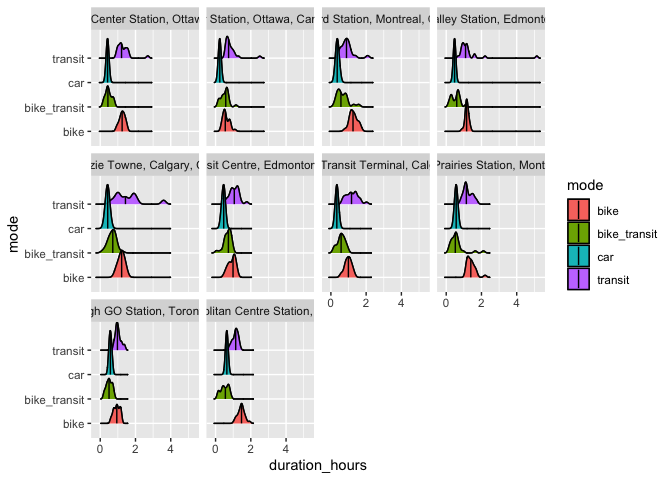

## Introduction

Active transportation (AT) is one of the four domains of physical activity and is associated with higher levels of total physical activity. Consequently, it is an important behaviour to target for health promotion and chronic disease prevention. AT is particularly attractive as a target for physical activity promotion, given that individuals generally travel to various destinations throughout the day. By replacing sedentary forms of transportation (such as motor vehicle use) with active forms of transportation (such as cycling or walking), Canadians can increase their physical activity levels. Moreover, walking and especially cycling for transportation are often carried out at intensitieis of physical activity (i.e., moderate-to-vigourous intensity) that contribute towards meeting the physical activity recommendation from the the Canadian 24-Hour Movement Guidelines.

Typically, people opt for active modes of transportation for travelling shorter distances (i.e. to and from a local shop or public transit stop). Using origin-destination survey data in Montreal, it was found that the 85th percentile of trip distance for walking to various destinations was under 2 kilometers, and for cycling it was less than 6.5 kilometers (Yasmin, F. et. al., 2010, Larsen J, 2010). This is an important consideration for the promotion of AT. Although within smaller cities, large portions of the population live within these distances of frequently visited destinations, in larger cities, there are often substantial numbers of residents living much further from these destinations in the central business district (CBD). Promoting AT to cover large distances is unlikely to be successful if the messaging suggests that they should walk or bike the entire trip. However, many recent investments in Canada have been made to expand mass rapid transit (MRT) systems (including subways, light rail and bus rapid transit). This expansion has brought higher speed transit and stations closer to suburban neighbourhoods and is often faster than the stop and start nature of typical bus routes.

In many countries with more mature MRT systems, it is common to see bikes parked at transit stations with commuters continuing their journey by bus or rail. Theoretically, such transportation choices are becoming increasingly available to more Canadians as new commuter rail, subway, Light Rapid Transit, and Bus Rapid Transit become available in large Canadian cities. Although some of the supporting infrastructure of secure bike parking and easy walking and cycling sidewalks and bikeways are not yet available, those infrastructure expenses are a fraction of the cost of the MRT projects themselves. A key question to consider before developing policy aimed at getting people to use more AT, is how do trips incorporating AT to MRT compare to those completed entirely by car and/or entirely by transit? To determine this, it is important to understand how the duration of trips to MRT by walking or cycling compare to trips taken entirely by transit or entirely by driving.

Driving has the advantage of direct transportation from home to destination, but often the disadvantage of traffic congestion and the costs of operating a vehicle and parking. While MRT is often undeterred by traffic congestion, there are often multiple legs to a trip, e.g. walking to a bus stop, waiting for a bus, travelling to a MRT station, which can make transit use a longer trip than driving. However, by investigating the potentional of taking AT to the MRT to replace the local bus portion of trips, we may see that this can reduce some of the time taken by some of the legs of the trip in cases where individuals can walk to the station, or cycle to it from a few kilometers away, AND increase physical activity levels. 

## Objective

To compare travel distance and physical activity amounts attained from point-to-point travel by automobile to CBD station, bus to MRT to CBD station, and by AT to MRT to CBD station.

## Methods

This used the [Google Route API](https://mapsplatform.google.com/maps-products/routes/) implemented in the [googleway R package](https://www.rdocumentation.org/packages/googleway/versions/2.7.8) to to compare travel time, travel distance, and estimated physical activity contribution of trips from 25 randomly selected street addresses within a 5km buffer of these two stations to the downtown central business districts (CBD) of 6 major Canadian cities. The modes of transportation used for the trip calculations were

* Transit Only
    * includes walking to stations
* Bike 
* Bike + Transit 
    * bike to main station and transit to destination
* Drive 

### Origin  - Station Selection 

Each station was selected based on distance from the city center, proximity to a transit station, and discussion with staff at PHAC. This was not an exact science but meant to represent a selection of 2 stations per city to a sense of travel times and distances for different modes of transportation. The selected stations are as follows

1. Ottawa
    * Blair Station
    * Barrhaven
2. Montreal 
    * Brossard Station
    * Rivière-des-Prairies Station
3. Toronto
    * Vaughan Metropolitan Centre Stations
    * Scarborough GO Station
4. Vancouver
    * Surrey Central Station
    * Bridgeport Station
5. Edmonton
    * Heritage Valley Station
    * Nakî Transit Centre & Park and Ride
6. Calgary
    * North Pointe Transit Terminal
    * McKenzie Towne

### Destination - City center 

Destinations were selected for each city. Each destination was either a major Art Gallery or Library located in the city of each city. These locations were selected because they are public, are located downtown, and draw considerable numbers of people. The destination locations are as follows

1. Ottawa
    * National Gallery of Canada
2. Montreal 
    * Musee d'art contemporain de Montreal
3. Toronto
    * Art Gallery of Ontario
4. Vancouver
    * Vancouver Art Gallery
5. Edmonton
    * Edmonton Public Library - Stanley A. Milner Library
6. Calgary
    * Calgary Public Library - Central Library

### Buffer and Home Selection

For each origin at a station, a 5km diameter buffer is drawn around the station. Within that 5km buffer, 25 points (ie., lat lon coordinates) are randomly selected using a seed to ensure reproducibility. A different seed is used for each station. Below is an example of the buffer and 25 points selected for the Ottawa Barrhaven Station. 


For each trip, the driving distance from the home street address to the CBD will be compared to a trip that is completed fully using public transit, and one that involves walking (if the MRT is less than 1km from the home) or biking (if the MRT is greater than 1km from the home but less than 5km) from the home. Below we provide an example with one street address (189 Portrush Ave, Ottawa, ON K2J 5K1) for the Fallowfield station BRT station in Ottawa to Downtown Ottawa. 


## Read Data


```r
barrhaven <- read_csv("Ottawa/ottawa_barrhaven_bike_transit_drive.csv")
blair <- read_csv("Ottawa/ottawa_blaire_bike_transit_drive.csv")
scar <- read_csv("Toronto/toronto_scarborough_bike_transit_drive.csv")
vaughn <- read_csv("Toronto/toronto_vaughn_bike_transit_drive.csv")
bross <- read_csv("Montreal/montreal_brossard_bike_transit_drive.csv")
rivier <- read_csv("Montreal/montreal_riviereprairie_bike_transit_drive.csv")
mckenzie <- read_csv("Calgary/calgary_mckenzie_bike_transit_drive.csv")
np <- read_csv("Calgary/calgary_northpoint_bike_transit_drive.csv")
heritage <- read_csv("Edmonton/edmonton_heritage_bike_transit_drive.csv")
naki <- read_csv("Edmonton/edmonton_naki_bike_transit_drive.csv")
surrey <- read_csv("Vancouver/vancouver_surrey_bike_transit_drive.csv")
bridge <- read_csv("Vancouver/vancouver_bridgeport_bike_transit_drive.csv")
```

## Joining Data


```r
data <- bind_rows(barrhaven, blair, scar, vaughn, bross, rivier, mckenzie, np, heritage, naki, surrey, bridge)

write_csv(data, file = "mode_city_data.csv")
```

## Summary statistics by mode


```r
#rm_covsum(data=data, maincov = 'mode',
#covs=c('distance_km','duration_hours'))
```

## Summary statistics by station


```r
#rm_covsum(data=data, maincov = 'station',
#covs=c('distance_km','duration_hours'))
```

## Data Viz by time


```r
viz <- ggplot(data, aes(x = duration_hours, y = mode, fill = mode)) +
  geom_density_ridges() + 
  stat_density_ridges(quantile_lines = TRUE, alpha = 0.75, quantiles = 2) +
  facet_wrap(~ station)
plot(viz)
```

<!-- -->


## References

* Yasmin, Farhana & Larsen, Jacob & El-Geneidy, Ahmed. (2010). Examining travel distances by walking and cycling, Montréal, Canada. https://www.researchgate.net/publication/258405294_Examining_travel_distances_by_walking_and_cycling_Montreal_Canada  Accessed February 13, 2024. 
* Larsen J., El-Geneidy A. Beyond the quarter mile: Re-examining travel distances by active transportation (2010) Canadian Journal of Urban Research, 19 (1 SUPPL.), pp. 70 - 88
