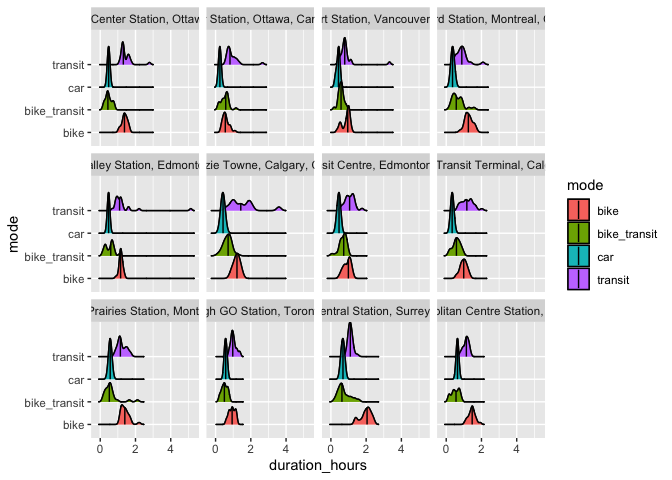

## Read Data


```r
barrhaven <- read_csv("Ottawa/ottawa_barrhaven_bike_transit_drive.csv")
blair <- read_csv("Ottawa/ottawa_blaire_bike_transit_drive.csv")
scar <- read_csv("Toronto/toronto_scarborough_bike_transit_drive.csv")
vaughn <- read_csv("Toronto/toronto_vaughn_bike_transit_drive.csv")
bross <- read_csv("Montreal/montreal_brossard_bike_transit_drive.csv")
rivier <- read_csv("Montreal/montreal_riviereprairie_bike_transit_drive.csv")
mckenzie <- read_csv("Calgary/calgary_mckenzie_bike_transit_drive.csv")
np <- read_csv("Calgary/calgary_northpoint_bike_transit_drive.csv")
heritage <- read_csv("Edmonton/edmonton_heritage_bike_transit_drive.csv")
naki <- read_csv("Edmonton/edmonton_naki_bike_transit_drive.csv")
```

## Joining Data


```r
data <- bind_rows(barrhaven, blair, scar, vaughn, bross, rivier, mckenzie, np, heritage, naki)

write_csv(data, file = "mode_city_data.csv")
```

## Summary statistics by mode


```r
rm_covsum(data=data, maincov = 'mode',
covs=c('distance_km','duration_hours'))
```

<table class="table" style="color: black; margin-left: auto; margin-right: auto;">
 <thead>
  <tr>
   <th style="text-align:left;">  </th>
   <th style="text-align:right;"> Full Sample (n=940) </th>
   <th style="text-align:right;"> bike (n=235) </th>
   <th style="text-align:right;"> bike transit (n=235) </th>
   <th style="text-align:right;"> car (n=235) </th>
   <th style="text-align:right;"> transit (n=235) </th>
   <th style="text-align:right;"> p-value </th>
  </tr>
 </thead>
<tbody>
  <tr>
   <td style="text-align:left;"> <span style="font-weight: bold;">distance km</span> </td>
   <td style="text-align:right;">  </td>
   <td style="text-align:right;">  </td>
   <td style="text-align:right;">  </td>
   <td style="text-align:right;">  </td>
   <td style="text-align:right;">  </td>
   <td style="text-align:right;"> <span style="font-weight: bold;"> </span>
</td>
  </tr>
  <tr>
   <td style="text-align:left;padding-left: 2em;" indentlevel="1"> Mean (sd) </td>
   <td style="text-align:right;"> 21.7 (6.9) </td>
   <td style="text-align:right;"> 19.9 (5.8) </td>
   <td style="text-align:right;"> 24.3 (5.5) </td>
   <td style="text-align:right;"> 21.7 (8.5) </td>
   <td style="text-align:right;"> 20.9 (6.4) </td>
   <td style="text-align:right;">  </td>
  </tr>
  <tr>
   <td style="text-align:left;padding-left: 2em;" indentlevel="1"> Median (Min,Max) </td>
   <td style="text-align:right;"> 21.5 (5.5, 46.4) </td>
   <td style="text-align:right;"> 19.9 (5.5, 38.2) </td>
   <td style="text-align:right;"> 25.2 (10.2, 43.2) </td>
   <td style="text-align:right;"> 20.1 (6.1, 45.3) </td>
   <td style="text-align:right;"> 20.6 (5.6, 46.4) </td>
   <td style="text-align:right;">  </td>
  </tr>
  <tr>
   <td style="text-align:left;"> <span style="font-weight: bold;">duration hours</span> </td>
   <td style="text-align:right;">  </td>
   <td style="text-align:right;">  </td>
   <td style="text-align:right;">  </td>
   <td style="text-align:right;">  </td>
   <td style="text-align:right;">  </td>
   <td style="text-align:right;"> <span style="font-weight: bold;"> </span>
</td>
  </tr>
  <tr>
   <td style="text-align:left;padding-left: 2em;" indentlevel="1"> Mean (sd) </td>
   <td style="text-align:right;"> 0.8 (0.5) </td>
   <td style="text-align:right;"> 1.1 (0.3) </td>
   <td style="text-align:right;"> 0.6 (0.3) </td>
   <td style="text-align:right;"> 0.4 (0.1) </td>
   <td style="text-align:right;"> 1.2 (0.5) </td>
   <td style="text-align:right;">  </td>
  </tr>
  <tr>
   <td style="text-align:left;padding-left: 2em;" indentlevel="1"> Median (Min,Max) </td>
   <td style="text-align:right;"> 0.7 (0.1, 5.1) </td>
   <td style="text-align:right;"> 1.1 (0.3, 2.2) </td>
   <td style="text-align:right;"> 0.6 (0.1, 2.1) </td>
   <td style="text-align:right;"> 0.4 (0.2, 0.7) </td>
   <td style="text-align:right;"> 1.1 (0.5, 5.1) </td>
   <td style="text-align:right;">  </td>
  </tr>
</tbody>
</table>

## Summary statistics by station


```r
rm_covsum(data=data, maincov = 'station',
covs=c('distance_km','duration_hours'))
```

<table class="table" style="color: black; margin-left: auto; margin-right: auto;">
 <thead>
  <tr>
   <th style="text-align:left;">  </th>
   <th style="text-align:right;"> Full Sample (n=940) </th>
   <th style="text-align:right;"> Barrhaven Center Station, Ottawa, Canada (n=88) </th>
   <th style="text-align:right;"> Blair Station, Ottawa, Canada (n=96) </th>
   <th style="text-align:right;"> Brossard Station, Montreal, Canada (n=80) </th>
   <th style="text-align:right;"> Heritage Valley Station, Edmonton, Canada (n=96) </th>
   <th style="text-align:right;"> McKenzie Towne, Calgary, Canada (n=96) </th>
   <th style="text-align:right;"> Naki Transit Centre, Edmonton, Canada (n=96) </th>
   <th style="text-align:right;"> North Pointe Transit Terminal, Calgary, Canada (n=96) </th>
   <th style="text-align:right;"> Riviere-des-Prairies Station, Montreal, Canada (n=100) </th>
   <th style="text-align:right;"> Scarborough GO Station, Toronto, Canada (n=92) </th>
   <th style="text-align:right;"> Vaughan Metropolitan Centre Station, Toronto, Canada (n=100) </th>
   <th style="text-align:right;"> p-value </th>
  </tr>
 </thead>
<tbody>
  <tr>
   <td style="text-align:left;"> <span style="font-weight: bold;">distance km</span> </td>
   <td style="text-align:right;">  </td>
   <td style="text-align:right;">  </td>
   <td style="text-align:right;">  </td>
   <td style="text-align:right;">  </td>
   <td style="text-align:right;">  </td>
   <td style="text-align:right;">  </td>
   <td style="text-align:right;">  </td>
   <td style="text-align:right;">  </td>
   <td style="text-align:right;">  </td>
   <td style="text-align:right;">  </td>
   <td style="text-align:right;">  </td>
   <td style="text-align:right;"> <span style="font-weight: bold;"> </span>
</td>
  </tr>
  <tr>
   <td style="text-align:left;padding-left: 2em;" indentlevel="1"> Mean (sd) </td>
   <td style="text-align:right;"> 21.7 (6.9) </td>
   <td style="text-align:right;"> 26.1 (4.5) </td>
   <td style="text-align:right;"> 11.3 (3.1) </td>
   <td style="text-align:right;"> 22.4 (5.0) </td>
   <td style="text-align:right;"> 22.1 (4.2) </td>
   <td style="text-align:right;"> 25.2 (4.3) </td>
   <td style="text-align:right;"> 17.5 (4.1) </td>
   <td style="text-align:right;"> 20.3 (4.9) </td>
   <td style="text-align:right;"> 24.5 (5.2) </td>
   <td style="text-align:right;"> 17.8 (3.5) </td>
   <td style="text-align:right;"> 29.5 (7.0) </td>
   <td style="text-align:right;">  </td>
  </tr>
  <tr>
   <td style="text-align:left;padding-left: 2em;" indentlevel="1"> Median (Min,Max) </td>
   <td style="text-align:right;"> 21.5 (5.5, 46.4) </td>
   <td style="text-align:right;"> 25.7 (16.5, 38.5) </td>
   <td style="text-align:right;"> 11.2 (5.5, 20.2) </td>
   <td style="text-align:right;"> 21.9 (12.2, 35.5) </td>
   <td style="text-align:right;"> 21.9 (15.0, 46.4) </td>
   <td style="text-align:right;"> 25.7 (13.6, 35.9) </td>
   <td style="text-align:right;"> 18.7 (7.1, 26.5) </td>
   <td style="text-align:right;"> 19.9 (10.6, 32.8) </td>
   <td style="text-align:right;"> 24.6 (16.3, 43.2) </td>
   <td style="text-align:right;"> 18.5 (10.7, 29.8) </td>
   <td style="text-align:right;"> 28.2 (16.6, 45.3) </td>
   <td style="text-align:right;">  </td>
  </tr>
  <tr>
   <td style="text-align:left;"> <span style="font-weight: bold;">duration hours</span> </td>
   <td style="text-align:right;">  </td>
   <td style="text-align:right;">  </td>
   <td style="text-align:right;">  </td>
   <td style="text-align:right;">  </td>
   <td style="text-align:right;">  </td>
   <td style="text-align:right;">  </td>
   <td style="text-align:right;">  </td>
   <td style="text-align:right;">  </td>
   <td style="text-align:right;">  </td>
   <td style="text-align:right;">  </td>
   <td style="text-align:right;">  </td>
   <td style="text-align:right;"> <span style="font-weight: bold;"> </span>
</td>
  </tr>
  <tr>
   <td style="text-align:left;padding-left: 2em;" indentlevel="1"> Mean (sd) </td>
   <td style="text-align:right;"> 0.8 (0.5) </td>
   <td style="text-align:right;"> 0.9 (0.5) </td>
   <td style="text-align:right;"> 0.6 (0.3) </td>
   <td style="text-align:right;"> 0.8 (0.4) </td>
   <td style="text-align:right;"> 0.9 (0.6) </td>
   <td style="text-align:right;"> 1.0 (0.6) </td>
   <td style="text-align:right;"> 0.8 (0.3) </td>
   <td style="text-align:right;"> 0.8 (0.4) </td>
   <td style="text-align:right;"> 1.0 (0.5) </td>
   <td style="text-align:right;"> 0.8 (0.3) </td>
   <td style="text-align:right;"> 0.9 (0.4) </td>
   <td style="text-align:right;">  </td>
  </tr>
  <tr>
   <td style="text-align:left;padding-left: 2em;" indentlevel="1"> Median (Min,Max) </td>
   <td style="text-align:right;"> 0.7 (0.1, 5.1) </td>
   <td style="text-align:right;"> 0.9 (0.2, 2.7) </td>
   <td style="text-align:right;"> 0.6 (0.2, 2.5) </td>
   <td style="text-align:right;"> 0.8 (0.2, 2.1) </td>
   <td style="text-align:right;"> 0.8 (0.1, 5.1) </td>
   <td style="text-align:right;"> 0.9 (0.1, 3.6) </td>
   <td style="text-align:right;"> 0.8 (0.1, 1.8) </td>
   <td style="text-align:right;"> 0.8 (0.2, 2.0) </td>
   <td style="text-align:right;"> 0.9 (0.2, 2.2) </td>
   <td style="text-align:right;"> 0.7 (0.2, 1.4) </td>
   <td style="text-align:right;"> 0.8 (0.1, 1.9) </td>
   <td style="text-align:right;">  </td>
  </tr>
</tbody>
</table>

## Data Viz by time


```r
ggplot(data, aes(x = duration_hours, y = mode, fill = mode)) +
  geom_density_ridges() + 
  stat_density_ridges(quantile_lines = TRUE, alpha = 0.75, quantiles = 2) +
  facet_wrap(~ station)
```

<!-- -->


